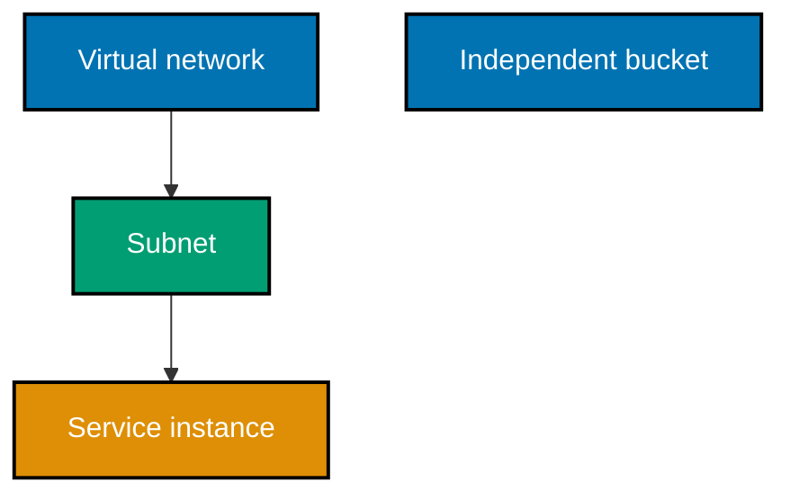
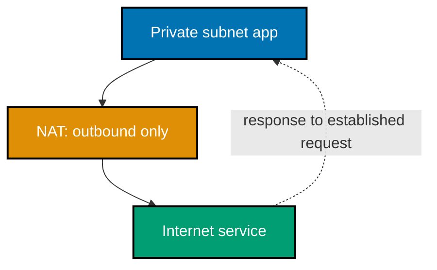

## Reuse and state

### Worked Example 19: Variables and outputs

**Context**: Parameterize one configuration and expose a useful result.

```hcl
# => Declares an input that callers supply without duplicating the resource definition.
variable "environment" { type = string }
# => Builds one name from the caller's environment value.
resource "aws_s3_bucket" "assets" { bucket = "service-${var.environment}-assets" }
# => Exposes the created name for a dependent module or a verification command.
output "bucket_name" { value = aws_s3_bucket.assets.bucket }
```

Complete LocalStack artifact: [`ex-19-variables-outputs/main.tf`](./code/ex-19-variables-outputs/main.tf).

**Key takeaway**: Variables vary inputs and outputs publish selected results.

**Why It Matters**: Reuse starts with a small, explicit interface. Variables prevent copy-pasted environments from silently diverging, while outputs keep consumers from reconstructing names. Give variables types, descriptions, and validation when misuse would be expensive; do not use variables to conceal an unclear design. _ex-19 · co-19_

### Worked Example 20: Reuse a local module

**Context**: Instantiate the same resource collection for two environments.

```hcl
# => Calls a local module that owns the common service resource definition.
module "dev" { source = "./modules/service"; environment = "dev" }
# => Calls the same module again with a different explicit input value.
module "stage" { source = "./modules/service"; environment = "stage" }
```

Complete runnable artifact: [`ex-20-tf-module-reuse/main.tf`](./code/ex-20-tf-module-reuse/main.tf).

**Key takeaway**: A module is a collection of resources managed together with an input/output interface.

**Why It Matters**: Modules centralize repeated infrastructure behavior, but abstraction can hide provider details when used too early. Start with plain resources, extract actual repetition, and keep module inputs narrow. Instantiating twice demonstrates that one reviewed definition can produce intentionally different environments. _ex-20 · co-19_

### Worked Example 21: Registry module decision

**Context**: Record the review decision before consuming a public module by source address.

| Check   | Decision artifact                                      |
| ------- | ------------------------------------------------------ |
| Source  | `terraform-aws-modules/vpc/aws` is a registry address. |
| Version | Pin a reviewed version; do not float on latest.        |
| Inputs  | Read required variables and defaults.                  |
| Outputs | Confirm consumers need the published interface.        |

**Key takeaway**: Registry modules save implementation work but add a supply-chain dependency.

**Why It Matters**: A source address does not prove a module matches your security, cost, or upgrade needs. Pinning a version makes review reproducible, while a lock file records provider selections. Prefer a small direct resource definition when the module's abstraction adds more surface than it removes. _ex-21 · co-19_

### Worked Example 22: State maps configuration to reality

**Context**: State records the binding between a resource address and its remote identifier.

```json
{
  "resources": [{ "address": "aws_s3_bucket.assets", "instances": [{ "attributes": { "id": "cloud-iac-assets" } }] }]
}
```

Complete state-shape artifact: [`ex-22-tf-state-file/terraform.tfstate.example.json`](./code/ex-22-tf-state-file/terraform.tfstate.example.json).

**Key takeaway**: State is operational memory that lets IaC compare declaration and real objects.

**Why It Matters**: Without state, Terraform cannot reliably know whether a declared resource already exists or which object it should update. State is not a source of truth to hand-edit casually; configuration plus provider reality must remain understandable. Restrict access and back it up according to its sensitivity. _ex-22 · co-17_

### Worked Example 23: Sensitive state review

**Context**: Identify which values can leak through state before putting them in a resource argument.

| Value             | Safe to commit in state? | Reason                                      |
| ----------------- | ------------------------ | ------------------------------------------- |
| Bucket name       | Usually                  | Identifier, not a credential                |
| Database password | No                       | State may preserve plaintext provider input |
| Secret ARN        | Usually                  | Reference only; policy still matters        |
| API token         | No                       | Credential grants access                    |

**Key takeaway**: Marking a CLI output sensitive does not remove a secret from state.

**Why It Matters**: State security needs its own review because secret exposure may occur through remote snapshots, CI logs, or developer disks. Use secret managers and runtime references where supported. When a provider necessarily stores a sensitive input, tighten backend access and avoid committing local state. _ex-23 · co-17_

### Worked Example 24: Remote backend design

**Context**: A team backend should centralize state and support safe collaboration.

```hcl
# => Declares an explicit local backend so this example never contacts a cloud service.
terraform { backend "local" { path = "terraform.tfstate.example" } }
# => A real remote backend requires a separately reviewed storage, locking, and identity design.
# => Credentials never belong in backend source, regardless of the selected backend.
```

Complete local artifact: [`ex-24-remote-backend/main.tf`](./code/ex-24-remote-backend/main.tf).
The remote-backend requirements are captured in its
[decision artifact](./code/ex-24-remote-backend/remote-backend-decision.md).

**Key takeaway**: A remote backend moves state from one laptop to a protected shared service.

**Why It Matters**: Remote state gives teams a common record, backup policy, and access-control point. It also becomes production-critical infrastructure: loss or overly broad access can break safe changes or leak sensitive values. This course keeps state local because LocalStack is a learning emulator, not a collaboration backend. _ex-24 · co-18_

### Worked Example 25: State locking runbook

**Context**: Prevent simultaneous writers from corrupting a shared state transition.

| Event                    | Operator action                                                  | Why                         |
| ------------------------ | ---------------------------------------------------------------- | --------------------------- |
| Apply already holds lock | Wait and inspect owner                                           | Avoid concurrent mutation   |
| Owner is active          | Do not force unlock                                              | The lock protects its write |
| Owner crashed            | Verify no process remains, then follow approved unlock procedure | Avoid stale lock safely     |

**Key takeaway**: A lock is a safety boundary, not an inconvenience to bypass.

**Why It Matters**: Concurrent applies can each calculate a plan from stale assumptions and overwrite state updates. A forced unlock without verifying the original writer can make the failure worse. Build queueing and ownership visibility into delivery workflows so the normal path never encourages unsafe lock removal. _ex-25 · co-18_

### Worked Example 26: Dependency graph

**Context**: Terraform derives ordering from references rather than file order.



**Key takeaway**: References create dependency edges; independent nodes can run in parallel.

**Why It Matters**: Terraform normally walks a graph with up to ten concurrent operations, so implicit references are safer than arbitrary sleep commands. An unnecessary explicit dependency reduces concurrency and can conceal the actual relationship. Read a plan as a graph-shaped change, particularly before destructive replacements. _ex-26 · co-20_

### Worked Example 27: Detect drift with a plan

**Context**: A console change creates divergence between source, state, and provider reality.

```bash
# => Reads current provider reality and compares it with declared desired configuration.
terraform plan
# => Fails the local check if the plan did not report an expected out-of-band tag difference.
terraform show -no-color | grep -F 'ManagedBy'
```

Complete runnable artifact: [`ex-27-drift-replan/run.sh`](./code/ex-27-drift-replan/run.sh).

**Key takeaway**: A normal plan can reveal out-of-band changes before they become a deployment surprise.

**Why It Matters**: Drift makes source code an unreliable explanation of production. A re-plan can propose restoring declared intent, but that is not always the right choice; first learn whether the manual change was an emergency fix that needs codification. Make console changes exceptional and traceable. _ex-27 · co-21_

### Worked Example 28: Refresh-only plan

**Context**: Update state to match provider reality without proposing configuration changes.

```bash
# => Computes state reconciliation from remote objects without changing infrastructure configuration.
terraform plan -refresh-only
# => Applies only the reviewed state refresh after confirming the console change is intentional.
terraform apply -refresh-only
```

Complete runnable artifact: [`ex-28-refresh-only-plan/run.sh`](./code/ex-28-refresh-only-plan/run.sh).

**Key takeaway**: Refresh-only accepts observed reality into state; it does not make source match reality.

**Why It Matters**: Refresh-only is useful when an approved external change must be reflected before source can be updated. It is not drift repair by itself because configuration still describes the old desired state. Follow it with a code decision: restore source intent or codify the new intended setting. _ex-28 · co-21_

### Worked Example 29: Import existing infrastructure

**Context**: Import starts only after the configuration block describes the object to adopt.

```bash
# => Adds a matching resource block to source before changing state ownership.
terraform validate
# => Associates the declared address with the existing local provider object identifier.
terraform import aws_s3_bucket.assets cloud-iac-existing-assets
# => Shows differences that must be reconciled in configuration after import.
terraform plan
```

Complete runnable artifact: [`ex-29-tf-import/run.sh`](./code/ex-29-tf-import/run.sh).

**Key takeaway**: Import binds state to an existing object; it does not generate complete configuration.

**Why It Matters**: Importing an object without its intended settings risks a later plan changing it unexpectedly. Write and review the resource block first, import into a disposable test environment when possible, and reconcile every proposed difference. Adoption is a controlled migration, not merely a command. _ex-29 · co-22_

### Worked Example 30: Dev and stage from one module

**Context**: Environment difference belongs in reviewed inputs, not copied infrastructure source.

| Input            | Dev             | Stage           |
| ---------------- | --------------- | --------------- |
| `environment`    | `dev`           | `stage`         |
| `retention_days` | `7`             | `30`            |
| `owner`          | `learning-team` | `learning-team` |

**Key takeaway**: One module can produce distinct environments through explicit values.

**Why It Matters**: A small environment matrix makes differences searchable and reviewable. Copying full configurations makes security fixes and provider upgrades diverge over time. Do not force every difference into a variable: materially different architecture deserves separate modules or configurations. _ex-30 · co-19_

## Virtual networking and operations

### Worked Example 31: VPC and subnet

**Context**: A VPC is an isolated network; a subnet partitions its address range in one availability zone.

```hcl
# => Declares the private virtual network address space for an environment.
resource "aws_vpc" "service" { cidr_block = "10.42.0.0/16" }
# => Declares one smaller network partition tied to a named availability zone.
resource "aws_subnet" "zone_a" { vpc_id = aws_vpc.service.id; cidr_block = "10.42.1.0/24"; availability_zone = "us-east-1a" }
```

Complete LocalStack artifact: [`ex-31-vpc-subnet/main.tf`](./code/ex-31-vpc-subnet/main.tf).

**Key takeaway**: A subnet belongs to one VPC and one availability zone.

**Why It Matters**: Network address design must leave room for growth, routes, and failure boundaries before workloads arrive. A subnet is not merely an IP range; its route tables and attached resources determine reachability. Use non-overlapping ranges across connected environments to avoid later routing conflicts. _ex-31 · co-09_

### Worked Example 32: Stateful security groups

**Context**: A security group permits explicitly declared traffic and allows return traffic for an allowed connection.

```hcl
# => Declares inbound HTTPS from a documented client network only.
ingress { from_port = 443; to_port = 443; protocol = "tcp"; cidr_blocks = ["10.42.0.0/16"] }
# => A stateful group permits response packets for that established permitted connection.
# => It does not turn an unapproved new inbound connection into an allowed one.
```

Complete resource artifact: [`ex-32-security-group-stateful/rule.tf`](./code/ex-32-security-group-stateful/rule.tf).

**Key takeaway**: Stateful return traffic is not the same as opening every port.

**Why It Matters**: Security groups work best as narrow resource-attached policy boundaries. Document why each rule exists, identify its source, and review it when a service changes. Layer network controls with identity, application authorization, and observability; a firewall rule cannot compensate for leaked credentials. _ex-32 · co-10_

### Worked Example 33: NAT gateway path

**Context**: Private workloads may need outbound updates without accepting unsolicited inbound internet connections.



**Key takeaway**: NAT supports outbound initiation; it is not an inbound publishing mechanism.

**Why It Matters**: Keeping application workloads private reduces accidental internet exposure while allowing controlled package retrieval or API calls. NAT can become a cost and availability dependency, so route only traffic that needs it and design redundant paths when the service warrants them. _ex-33 · co-11_

### Worked Example 34: Load balancer health routing

**Context**: A load balancer routes requests only to healthy registered targets.

| Target  | Health check | Routing decision     |
| ------- | ------------ | -------------------- |
| `api-a` | Passing      | Receive traffic      |
| `api-b` | Failing      | Remove from rotation |
| `api-c` | Passing      | Receive traffic      |

**Key takeaway**: A load balancer distributes only to targets that meet the declared health contract.

**Why It Matters**: Health checks are executable definitions of readiness. If a check is too shallow, failing applications receive traffic; if too strict, healthy capacity disappears. Separate liveness from client readiness, publish the endpoints' semantics, and alert on target removal before redundancy is exhausted. _ex-34 · co-11_

### Worked Example 35: Immutable server decision

**Context**: Update a server by producing a new image and replacing the instance.

| Change request | Mutable-server response    | Immutable-server response          |
| -------------- | -------------------------- | ---------------------------------- |
| Patch package  | SSH and edit existing host | Build patched image and replace    |
| Audit evidence | Inspect host history       | Review image and deployment record |

**Key takeaway**: Immutable infrastructure replaces a server instead of repairing it in place.

**Why It Matters**: Replacement preserves the ability to reconstruct a release from source and reduces unrecorded host divergence. It shifts effort toward image pipelines, externalized state, and safe rollout strategy. A true emergency may require a temporary manual change, but capture it and rebuild promptly. _ex-35 · co-23_

### Worked Example 36: Cattle, not pets

**Context**: Give instances a role and number rather than a personal identity.

| Pet pattern                      | Replaceable pattern                          |
| -------------------------------- | -------------------------------------------- |
| `maria-server` has special fixes | `api-3f7c` is replaced from a standard image |
| Operator remembers its history   | Metrics and source describe its role         |
| Repair is the default            | Replacement is the default                   |

**Key takeaway**: Replaceable instances reduce operational dependence on individual machines.

**Why It Matters**: “Cattle” is useful shorthand only when data, configuration, and identity are externalized correctly. A database primary cannot be casually discarded; it needs replication and recovery design. Apply the mindset to stateless compute first, then intentionally model stateful components and their failover. _ex-36 · co-24_

### Worked Example 37: Provisioning versus configuration management

**Context**: Choose tools by the boundary they control.

| Need                              | Terraform/OpenTofu                   | Ansible                  |
| --------------------------------- | ------------------------------------ | ------------------------ |
| Create network and VM             | Primary fit                          | Possible but not primary |
| Converge package on existing host | Possible through provisioners, avoid | Primary fit              |
| Review cloud resource graph       | Primary fit                          | Limited                  |

**Key takeaway**: Provisioning creates infrastructure; configuration management converges existing hosts.

**Why It Matters**: Forcing one tool across both boundaries often creates fragile hidden ordering and poor lifecycle visibility. Compose tools where each has a clear ownership boundary, then pass identity and outputs through a reviewed interface. Prefer image baking when it can eliminate mutable host configuration entirely. _ex-37 · co-25_

### Worked Example 38: Idempotent configuration task

**Context**: A configuration-management task should report no change when the desired state already exists.

```yaml
# => Names a state assertion rather than a shell command that always runs.
- name: Ensure service account exists
  # => Uses the idempotent account module to converge the named account.
  ansible.builtin.user:
    # => Identifies the desired account and its present state.
    name: service; state: present
```

Complete runnable artifact: [`ex-38-idempotent-ansible/playbook.yaml`](./code/ex-38-idempotent-ansible/playbook.yaml).

**Key takeaway**: State-oriented tasks make re-runs predictable and observable.

**Why It Matters**: An imperative command can return success while making an unintended duplicate change every run. An idempotent module lets an operator distinguish “changed” from “already correct,” which supports safe retries and audits. Verify module behavior and avoid embedding secrets in playbooks or task output. _ex-38 · co-25_

Next: [Secure, Observable Cloud Systems](./advanced.md) →
