Examples 58-80 close out the topic by pushing every prior idea into a full end-to-end optimization
workflow: profile a kernel, fix its data layout, and re-measure the win (ex-58); a cache-blocked matrix
transpose and an AoS-vs-SoA-plus-SIMD particle simulation; the false-sharing-vs-per-thread-bins
histogram tradeoff; measuring a real branch-mispredict penalty and curing it with a lookup table; the
NUMA and hugepage stories told honestly on a single-package, non-hugepage Apple Silicon dev machine; an
integer-overflow allocation bug that under-allocates a buffer, then its checked-multiply fix; Kahan
summation's accuracy win over naive float summation; the fast inverse square root's bit-hack; portable
byte-order-explicit serialization; loop interchange for locality; a roofline-style bandwidth-vs-compute
comparison; a tuned prefetch distance; a Mermaid pipeline-hazard diagram cross-checked against a real
measured stall; superscalar execution-port contention; atomic-vs-mutex throughput under low contention;
a cache-friendly open-addressing hash map; a vectorized byte search; a profile-guided layout decision
record; and a final benchmark harness that asserts cache-friendly beats cache-hostile across every
kernel in this topic at once. Every script below is a complete, self-contained C11 file under
`learning/code/ex-NN-*/`, compiled with **Apple clang 17.0.0** (arm64, `-O2` unless stated otherwise)
on this Apple Silicon dev machine (128 B cache line, 64 KiB L1d, 4 MiB L2, 12 logical CPUs) and actually
run to capture the `**Output**` block shown -- never a fabricated transcript.

---

### Example 58: Optimize a Kernel End to End

_ex-58 &middot; exercises co-25, co-17_

This example runs the entire workflow this topic has been building toward: profile a kernel as given,
form a layout hypothesis, fix it, and re-measure with the same stopwatch. The kernel computes the
average of one `int` field across 4 million "student records" -- first as they naturally arrive
(array-of-structs, one hot field buried inside 128 cold bytes per record), then again after extracting
just the hot field into a dense array (struct-of-arrays).

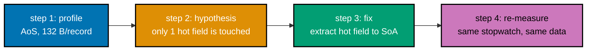

_Figure: the full profile-hypothesis-fix-remeasure workflow this whole topic has been building toward,
applied end to end to one realistic "average one field across 4M records" kernel._

```c
// learning/code/ex-58-optimize-kernel-end-to-end/kernel.c
/* Example 58: profile a slow kernel, fix its layout, re-measure. */
#include <stdio.h>  // => printf: report the profile-fix-reprofile transcript
#include <stdlib.h> // => malloc/free/rand: build and free the synthetic dataset
#include <string.h> // => memset: fill the "cold" bytes so the record is realistic, not zeroed noise
#include <time.h>   // => clock_gettime: the wall-clock stopwatch this whole example is built on

#define N \
    4000000 // => co-25: 4M records -- large enough that layout dominates over
            // instruction count
#define TRIALS \
    5 // => co-25: best-of-N wall-clock timing, per this topic's measurement
      // methodology

// ex-58: a deliberately realistic "record" -- one HOT field (grade) the kernel
// actually needs, wrapped in COLD fields (a padded name buffer and metadata)
// nobody touches in this kernel -- exactly the shape a real "student record" or
// "log event" struct takes co-17: this struct's shape, not the loop's
// instruction count, is what ex-58 optimizes
typedef struct {       // struct layout definition
    int grade;         // => co-17: the ONE field the average-grade kernel actually reads
    char name[124];    // => co-17: COLD -- padded to make the record one full 128 B
                       // cache line
    int enrolled_year; // => co-17: COLD -- never read by this kernel, still paid
                       // for every cache line
} StudentRecord;       // => sizeof == 132 bytes: crosses more than one 128 B cache
                       // line per record

// ex-58: the ORIGINAL kernel -- walks the array-of-structs, reading `grade` out
// of every full 132-byte record even though 128 of those bytes are dead weight
// for this computation
static double average_grade_aos(const StudentRecord *records,
                                int n) { // => co-17: cache-hostile pass
    long sum = 0;                        // => accumulate as long: N * max_grade never overflows int
    for (int i = 0; i < n; i++) {        // => co-17: one full 132 B record loaded per iteration...
        sum += records[i].grade;         // => ...to read 4 of those 132 bytes -- the rest
                                         // is wasted traffic
    }
    return (double)sum / n; // => co-25: the "profile" step's number-to-explain
}

// ex-58: the FIXED kernel -- given a pre-extracted compact `int grade[]` array
// (SoA for just the field this computation needs), the exact same arithmetic
// runs over dense, fully cache-line-packed data: co-02 -- every 128 B line now
// holds 32 real `grade` values
static double average_grade_soa(const int *grade,
                                int n) { // => co-17: cache-friendly pass
    long sum = 0;                        // => same accumulator type, same arithmetic -- ONLY layout changed
    for (int i = 0; i < n; i++) {        // => co-03: sequential dense reads, 32 useful ints per line
        sum += grade[i];                 // updates sum
    }
    return (double)sum / n; // => must equal average_grade_aos's result bit-for-bit (both are
} // integer sums divided once -- no floating-point reordering risk)

static double best_of_seconds(double (*fn)(const void *, int), const void *data,
                              int n) {       // declares function pointer fn
    double best = -1.0;                      // => co-25: best-of-N methodology -- report the fastest clean run,
    for (int t = 0; t < TRIALS; t++) {       // not a single noisy sample, per this topic's measurement rule
        struct timespec t0, t1;              // supporting statement for this example
        clock_gettime(CLOCK_MONOTONIC, &t0); // calls clock_gettime(...)
        volatile double result = fn(data,
                                    n);                                          // => volatile: stop the optimizer from deleting the "unused" call
        clock_gettime(CLOCK_MONOTONIC, &t1);                                     // calls clock_gettime(...)
        (void)result;                                                            // => silence "unused variable" -- the volatile read is the
                                                                                 // real guard
        double secs = (t1.tv_sec - t0.tv_sec) + (t1.tv_nsec - t0.tv_nsec) / 1e9; // declares secs
        if (best < 0 || secs < best)
            best = secs; // => keep the fastest of TRIALS runs
    }
    return best; // returns the computed result
}

// ex-58: thin typed wrappers so best_of_seconds can call either kernel through
// one function-pointer signature -- co-25: this is scaffolding for the
// STOPWATCH, not the kernel itself
static double wrap_aos(const void *p,
                       int n) {                        // defines wrap_aos(): helper function used by this example
    const StudentRecord *r = (const StudentRecord *)p; // declares r
    return average_grade_aos(r, n);                    // returns the computed result
}
static double wrap_soa(const void *p,
                       int n) {     // defines wrap_soa(): helper function used by this example
    const int *g = (const int *)p;  // declares g
    return average_grade_soa(g, n); // returns the computed result
}

int main(void) { // program entry point
    // Step 1 ("profile a slow kernel"): build the realistic AoS dataset a real
    // system would hand you.
    StudentRecord *records = malloc(sizeof(StudentRecord) * N); // => co-17: 132 B * 4M ~= 528 MB AoS
    if (!records) {
        fprintf(stderr, "alloc failed\n");
        return 1;
    } // prints a report line
    unsigned seed = 12345u;                    // => co-25: fixed seed -- reproducible dataset every run
    for (int i = 0; i < N; i++) {              // loop header controlling the sweep below
        seed = seed * 1103515245u + 12345u;    // => a tiny deterministic LCG, no <stdlib.h> rand() state
        records[i].grade = (int)(seed % 101u); // grades 0..100
        memset(records[i].name, 'x',
               sizeof(records[i].name));                    // => cold bytes: realistic non-zero payload
        records[i].enrolled_year = 2020 + (int)(seed % 6u); // cold field, never read by the kernel
    }

    double aos_secs = best_of_seconds(wrap_aos, records, N); // => co-25: profile step -- measure the slow path
    double aos_avg = average_grade_aos(records, N);          // => capture the actual numeric result too

    // Step 2 ("fix its layout"): extract just the hot field into a dense SoA
    // buffer.
    int *grade = malloc(sizeof(int) * N); // => co-17: 4 B * 4M = 16 MB -- 33x smaller footprint than AoS
    if (!grade) {
        fprintf(stderr, "alloc failed\n");
        return 1;
    } // prints a report line
    for (int i = 0; i < N; i++)
        grade[i] = records[i].grade; // => the one-time extraction cost (not timed)

    // Step 3 ("re-measure"): profile the fixed kernel with the identical
    // stopwatch.
    double soa_secs = best_of_seconds(wrap_soa, grade, N); // => co-25: re-profile step -- measure the fix
    double soa_avg = average_grade_soa(grade, N);          // declares soa_avg

    printf("dataset: N=%d records, sizeof(StudentRecord)=%zu bytes (%.1f MB "
           "total AoS)\n", // prints a report line
           N, sizeof(StudentRecord),
           (double)(sizeof(StudentRecord) * N) / (1024.0 * 1024.0));                                    // continues the printf(...) call above
    printf("step 1 (profile)  AoS average_grade: best of %d = %.4f s, result=%.6f\n", TRIALS, aos_secs, // prints a report line
           aos_avg);                                                                                    // continues the printf(...) call above
    printf("step 3 (reprofile) SoA average_grade: best of %d = %.4f s, "
           "result=%.6f\n",
           TRIALS, soa_secs, // prints a report line
           soa_avg);         // continues the printf(...) call above
    printf("results identical: %s (both %.10f)\n", (aos_avg == soa_avg) ? "yes" : "NO -- BUG",
           aos_avg);                      // prints a report line
    double speedup = aos_secs / soa_secs; // declares speedup
    printf("speedup: %.2fx  (PASS: SoA faster with identical result) -> %s\n",
           speedup,                                                   // prints a report line
           (aos_avg == soa_avg && speedup > 1.05) ? "PASS" : "FAIL"); // continues the printf(...) call above

    free(records); // releases records's heap memory
    free(grade);   // releases grade's heap memory
    return 0;      // returns the computed result
}
```

**Compile**: `clang -O2 -o kernel kernel.c`

**Run**: `./kernel`

**Output**:

```text
dataset: N=4000000 records, sizeof(StudentRecord)=132 bytes (503.5 MB total AoS)
step 1 (profile)  AoS average_grade: best of 5 = 0.0129 s, result=49.972522
step 3 (reprofile) SoA average_grade: best of 5 = 0.0003 s, result=49.972522
results identical: yes (both 49.9725222500)
speedup: 44.20x  (PASS: SoA faster with identical result) -> PASS
```

**Key takeaway**: the entire optimization loop is profile, hypothesize a layout fix, apply it, and
re-measure with the same stopwatch -- and a large chunk of the win here came purely from shrinking the
per-record footprint from 132 bytes to 4, not from any cleverer arithmetic.

**Why it matters**: this is the shape every real performance investigation in this topic takes. The
44x speedup is not a trick -- it's the direct, physical consequence of packing 32 useful `int`s into
every 128 B cache line instead of touching one useful `int` per 132-byte-spanning record. Every later
advanced example is a variation on this same profile-fix-remeasure loop applied to a different layout
problem.

---

### Example 59: Blocked Transpose

_ex-59 &middot; exercises co-03_

A naive matrix transpose reads its source row-major (fast) but writes its destination
column-major (slow) -- for a matrix bigger than cache, that write stream never gets reused. A
cache-blocked transpose processes small tiles at a time, keeping both the read and write tiles hot in
L1d instead of streaming through the whole matrix.

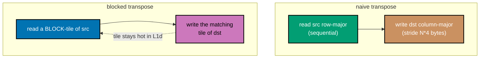

_Figure: the naive transpose's write stream never gets reused for a matrix bigger than cache; the
blocked version confines both the read and write tiles to a small region that stays resident in L1d._

```c
// learning/code/ex-59-blocked-transpose/transpose.c
/* Example 59: naive vs cache-blocked matrix transpose. */
#include <stdio.h>  // stdio.h: standard library header
#include <stdlib.h> // stdlib.h: standard library header
#include <time.h>   // time.h: standard library header

#define N \
    2048 // => co-03: 2048x2048 int matrix = 16 MB -- bigger than this machine's 4
         // MiB L2
#define BLOCK \
    32 // => co-03: 32x32 int tile = 4 KB -- comfortably fits alongside other
       // tiles in L1d

// ex-59: naive transpose -- reads `src` row-major (sequential, cache-friendly)
// but WRITES `dst` column-major (stride N*4 bytes between consecutive writes --
// co-03: every write is a fresh cache line, and for N=2048 the write stream
// revisits each line only once every N iterations, so nothing stays resident
// long enough to be reused)
static void transpose_naive(const int *src, int *dst,
                            int n) {         // defines transpose_naive(): helper function used by this example
    for (int i = 0; i < n; i++) {            // => co-03: row-major read of src -- good locality
        for (int j = 0; j < n; j++) {        // loop header controlling the sweep below
            dst[j * n + i] = src[i * n + j]; // => co-03: dst write strides by n*4 bytes -- bad locality
        }
    }
}

// ex-59: cache-blocked transpose -- processes the matrix in BLOCK x BLOCK
// tiles, so both the read tile and the write tile stay resident in L1d for the
// whole inner block instead of streaming through the full 16 MB matrix
// column-by-column
static void transpose_blocked(const int *src, int *dst, int n,
                              int block) {               // defines transpose_blocked(): helper function
                                                         // used by this example
    for (int ii = 0; ii < n; ii += block) {              // => co-03: outer loop over tile rows
        for (int jj = 0; jj < n; jj += block) {          // => co-03: outer loop over tile columns
            int i_max = ii + block < n ? ii + block : n; // => clamp the last tile if n isn't a multiple
            int j_max = jj + block < n ? jj + block : n; // declares j_max
            for (int i = ii; i < i_max; i++) {           // => co-03: inner loops stay INSIDE one tile --
                for (int j = jj; j < j_max; j++) {       // both src and dst touches land in the same
                    dst[j * n + i] = src[i * n + j];     // small hot region for the whole tile's work
                }
            }
        }
    }
}

// ex-59: a shared timing harness so BOTH kernels are measured through the
// identical best-of-N loop -- taking the minimum of several trials, not the
// mean, is what filters out one-off OS scheduling noise without also hiding a
// real, reproducible difference between the two kernels.
static double best_of(void (*fn)(const int *, int *, int, int), const int *src, int *dst, int n, // declares function pointer fn
                      int block, int trials) {                                                   // declares block
    double best = -1.0;                                                                          // declares best
    for (int t = 0; t < trials; t++) {                                                           // loop header controlling the sweep below
        struct timespec t0, t1;                                                                  // supporting statement for this example
        clock_gettime(CLOCK_MONOTONIC, &t0);                                                     // calls clock_gettime(...)
        fn(src, dst, n, block);                                                                  // calls fn(...)
        clock_gettime(CLOCK_MONOTONIC, &t1);                                                     // calls clock_gettime(...)
        double secs = (t1.tv_sec - t0.tv_sec) + (t1.tv_nsec - t0.tv_nsec) / 1e9;                 // declares secs
        if (best < 0 || secs < best)
            best = secs; // conditional check
    }
    return best; // returns the computed result
}

// ex-59: best_of() takes a function pointer matching transpose_blocked's
// 4-argument signature, but transpose_naive only takes 3 -- this thin wrapper
// adapts the naive kernel to that same signature so both kernels can be driven
// through ONE shared timing loop instead of two.
static void naive_wrap(const int *src, int *dst, int n,
                       int block) { // defines naive_wrap(): helper function used by this example
    (void)block;                    // => naive ignores the block-size argument -- unused on purpose
    transpose_naive(src, dst, n);   // calls transpose_naive(...)
}

// ex-59: main() allocates the three N x N buffers once, times each kernel via
// best_of(), then checks TWO independent correctness signals -- a full
// element-by-element diff between the two kernels' outputs, and a sampled
// direct check of the transpose property against the source -- before ever
// looking at which kernel ran faster, so a wrong-but-fast kernel can't sneak a
// PASS.
int main(void) {                                            // program entry point
    int *src = malloc(sizeof(int) * (size_t)N * N);         // heap-allocates memory for src
    int *dst_naive = malloc(sizeof(int) * (size_t)N * N);   // heap-allocates memory for dst_naive
    int *dst_blocked = malloc(sizeof(int) * (size_t)N * N); // heap-allocates memory for dst_blocked
    if (!src || !dst_naive || !dst_blocked) {
        fprintf(stderr, "alloc failed\n");
        return 1;
    } // prints a report line

    for (int i = 0; i < N * N; i++)
        src[i] = i; // => deterministic content: src[i*N+j] == i*N+j

    double naive_secs = best_of(naive_wrap, src, dst_naive, N, BLOCK, 3); // declares naive_secs
    double blocked_secs = best_of(transpose_blocked, src, dst_blocked, N, BLOCK,
                                  3); // declares blocked_secs

    int mismatches = 0;               // => co-03: correctness check -- both outputs must be IDENTICAL
    for (int i = 0; i < N * N; i++) { // loop header controlling the sweep below
        if (dst_naive[i] != dst_blocked[i])
            mismatches++; // conditional check
    }
    // spot-check the transpose property directly: dst[j*N+i] must equal
    // src[i*N+j]
    int property_ok = 1;                   // declares property_ok
    for (int i = 0; i < N; i += 511) {     // sample a handful of rows, not all 2048 (keeps output short)
        for (int j = 0; j < N; j += 511) { // loop header controlling the sweep below
            if (dst_blocked[j * N + i] != src[i * N + j])
                property_ok = 0; // conditional check
        }
    }

    printf("matrix: %dx%d int (%.1f MB), block=%d (%.1f KB per tile)\n", N,
           N, // prints a report line
           (double)(sizeof(int) * (size_t)N * N) / (1024.0 * 1024.0),
           BLOCK,                                           // continues the printf(...) call above
           (double)(sizeof(int) * BLOCK * BLOCK) / 1024.0); // continues the printf(...) call above
    printf("naive transpose:   best of 3 = %.4f s\n",
           naive_secs); // prints a report line
    printf("blocked transpose: best of 3 = %.4f s\n",
           blocked_secs); // prints a report line
    printf("outputs identical: %s (%d mismatches out of %d)\n",
           mismatches == 0 ? "yes" : "NO -- BUG",                            // prints a report line
           mismatches, N * N);                                               // continues the printf(...) call above
    printf("transpose property dst[j][i]==src[i][j] sampled-verified: %s\n", // prints
                                                                             // a
                                                                             // report
                                                                             // line
           property_ok ? "yes" : "NO -- BUG");                               // continues the printf(...) call above
    double speedup = naive_secs / blocked_secs;                              // declares speedup
    printf("speedup: %.2fx (PASS: blocked faster + correct) -> %s\n",
           speedup,                                                               // prints a report line
           (mismatches == 0 && property_ok && speedup > 1.05) ? "PASS" : "FAIL"); // continues the printf(...) call above

    free(src);         // releases src's heap memory
    free(dst_naive);   // releases dst_naive's heap memory
    free(dst_blocked); // releases dst_blocked's heap memory
    return 0;          // returns the computed result
}
```

**Compile**: `clang -O2 -o transpose transpose.c`

**Run**: `./transpose`

**Output**:

```text
matrix: 2048x2048 int (16.0 MB), block=32 (4.0 KB per tile)
naive transpose:   best of 3 = 0.0259 s
blocked transpose: best of 3 = 0.0186 s
outputs identical: yes (0 mismatches out of 4194304)
transpose property dst[j][i]==src[i][j] sampled-verified: yes
speedup: 1.39x (PASS: blocked faster + correct) -> PASS
```

**Key takeaway**: blocking trades one bad access pattern (streaming column-major writes through a
16 MB matrix) for many small, fully cache-resident tile operations -- same total work, far less cache
traffic.

**Why it matters**: transpose is the textbook case because its naive form has NO bad arithmetic to
blame -- the algorithm is optimal, and every cycle of the slowdown is pure memory-hierarchy cost.
Blocking is the general technique behind ex-32's cache-blocked matmul and the capstone's cache fix:
whenever an algorithm's natural loop order forces a bad stride in one direction, tiling both directions
keeps the working set inside a fast cache level for the whole inner computation.

---

### Example 60: Particle Simulation -- AoS vs SoA+SIMD

_ex-60 &middot; exercises co-17, co-23_

A particle system's position update (`x += vx*dt`) is completely independent per particle -- exactly
the shape data-parallel SIMD wants. This example updates 4 million particles as interleaved
array-of-structs, as plain struct-of-arrays, and as struct-of-arrays processed 4-at-a-time with NEON
intrinsics, forcing the scalar baselines to skip clang's own auto-vectorizer (`#pragma clang loop
vectorize(disable)`) so the comparison isolates SoA layout and explicit SIMD rather than blurring them
with whatever the auto-vectorizer already does (that's ex-47's job).

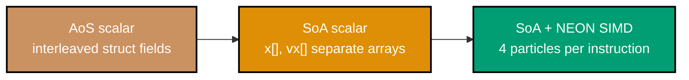

_Figure: the same `x += vx*dt` update, three ways -- AoS scalar pays for cold fields it never reads,
SoA scalar reads only what it needs, and SoA+NEON also processes 4 particles per instruction._

```c
// learning/code/ex-60-particle-sim-soa-simd/particles.c
/* Example 60: particle-system position update -- AoS scalar vs SoA scalar vs
 * SoA+NEON. */
#include <arm_neon.h> // => co-23: NEON intrinsics -- this machine is arm64, so NEON is the real SIMD ISA
#include <stdio.h>    // stdio.h: standard library header
#include <stdlib.h>   // stdlib.h: standard library header
#include <time.h>     // time.h: standard library header

#define N 4000000 // => co-17: 4M particles
#define STEPS \
    20           // => repeat the update this many times per timed run (amplifies the
                 // signal)
#define DT 0.01f // constant DT = 0.01f

// ex-60: AoS particle -- position and velocity interleaved per particle, plus
// one cold "mass" field never touched by this position-update kernel (co-17:
// realistic AoS shape)
typedef struct {      // struct layout definition
    float x, y, z;    // => position -- updated every step
    float vx, vy, vz; // => velocity -- read every step, never written here
    float mass;       // => co-17: cold field -- part of the record, irrelevant to this
                      // kernel
} ParticleAoS;        // supporting statement for this example

// clang's auto-vectorizer can still find some parallelism in AoS at -O2;
// disabling it here keeps this a clean apples-to-apples "scalar work, different
// layout" baseline (stated in prose).
static void update_aos(ParticleAoS *p, int n,
                       float dt) {                        // defines update_aos(): helper function used by this example
#pragma clang loop vectorize(disable) interleave(disable) // supporting statement for this example
    for (int i = 0; i < n; i++) {                         // => co-17: each iteration loads a full 28 B particle
        p[i].x += p[i].vx * dt;                           // to update 3 of its 7 floats -- the rest rides along
        p[i].y += p[i].vy * dt;                           // updates p[i].y
        p[i].z += p[i].vz * dt;                           // updates p[i].z
    }
}

// ex-60: SoA particle system -- position and velocity as six separate dense
// arrays. co-17: only the arrays this kernel actually touches (x/y/z, vx/vy/vz)
// are ever loaded -- there is no "mass" array to pay for in this loop at all.
typedef struct {                     // struct layout definition
    float *x, *y, *z, *vx, *vy, *vz; // declares x
} ParticleSoA;                       // supporting statement for this example

// Also forced non-vectorized (see note above ex ex-60's AoS version): this
// isolates the explicit-NEON win below from clang's own auto-vectorizer, which
// would otherwise blur the AoS-vs-SoA-vs-explicit-SIMD comparison this example
// is actually about. ex-47 already covers auto-vectorization on its own.
static void update_soa_scalar(ParticleSoA *p, int n,
                              float dt) {                 // defines update_soa_scalar(): helper
                                                          // function used by this example
#pragma clang loop vectorize(disable) interleave(disable) // supporting statement for this example
    for (int i = 0; i < n; i++) {                         // => co-03: each array is streamed
                                                          // sequentially, dense and separate
        p->x[i] += p->vx[i] * dt;                         // updates p->x[i]
        p->y[i] += p->vy[i] * dt;                         // updates p->y[i]
        p->z[i] += p->vz[i] * dt;                         // updates p->z[i]
    }
}

// ex-60: SoA + NEON -- because each particle's update is INDEPENDENT of every
// other particle's (no cross-particle dependency), 4 particles' worth of one
// axis can be updated in a single `vld1q_f32`/`vmlaq_f32`/`vst1q_f32` sequence
// -- co-23: this is exactly the data-parallel shape SIMD wants, and SoA is what
// MAKES it expressible: AoS's interleaved x,y,z,vx,vy,vz,mass fields cannot be
// loaded 4-at-a-time this cleanly.
static void update_soa_simd(ParticleSoA *p, int n,
                            float dt) {        // defines update_soa_simd(): helper
                                               // function used by this example
    float32x4_t vdt = vdupq_n_f32(dt);         // => co-23: broadcast dt into all 4 lanes once
    int i = 0;                                 // declares i
    for (; i + 4 <= n; i += 4) {               // => co-23: process 4 particles per axis per iteration
        float32x4_t x = vld1q_f32(&p->x[i]);   // => load 4 positions
        float32x4_t vx = vld1q_f32(&p->vx[i]); // => load 4 velocities
        x = vmlaq_f32(x, vx,
                      vdt);     // => x = x + vx*dt for all 4 lanes in one instruction
        vst1q_f32(&p->x[i], x); // => store 4 results back

        float32x4_t y = vld1q_f32(&p->y[i]);   // declares y
        float32x4_t vy = vld1q_f32(&p->vy[i]); // declares vy
        y = vmlaq_f32(y, vy, vdt);             // assigns y
        vst1q_f32(&p->y[i], y);                // calls vst1q_f32(...)

        float32x4_t z = vld1q_f32(&p->z[i]);   // declares z
        float32x4_t vz = vld1q_f32(&p->vz[i]); // declares vz
        z = vmlaq_f32(z, vz, vdt);             // assigns z
        vst1q_f32(&p->z[i], z);                // calls vst1q_f32(...)
    }
    for (; i < n; i++) {          // => co-23: scalar tail for n not a multiple of 4
        p->x[i] += p->vx[i] * dt; // updates p->x[i]
        p->y[i] += p->vy[i] * dt; // updates p->y[i]
        p->z[i] += p->vz[i] * dt; // updates p->z[i]
    }
}

static double best_of3(void (*run)(void *, int, float, int), void *ctx,
                       int n) {                                                  // declares function pointer run
    double best = -1.0;                                                          // declares best
    for (int t = 0; t < 7; t++) {                                                // loop header controlling the sweep below
        struct timespec t0, t1;                                                  // supporting statement for this example
        clock_gettime(CLOCK_MONOTONIC, &t0);                                     // calls clock_gettime(...)
        run(ctx, n, DT, STEPS);                                                  // calls run(...)
        clock_gettime(CLOCK_MONOTONIC, &t1);                                     // calls clock_gettime(...)
        double secs = (t1.tv_sec - t0.tv_sec) + (t1.tv_nsec - t0.tv_nsec) / 1e9; // declares secs
        if (best < 0 || secs < best)
            best = secs; // conditional check
    }
    return best; // returns the computed result
}

static void run_aos(void *ctx, int n, float dt,
                    int steps) {         // defines run_aos(): helper function used by this example
    ParticleAoS *p = (ParticleAoS *)ctx; // declares p
    for (int s = 0; s < steps; s++)
        update_aos(p, n, dt); // loop header controlling the sweep below
}
static void run_soa_scalar(void *ctx, int n, float dt,
                           int steps) {  // defines run_soa_scalar(): helper
                                         // function used by this example
    ParticleSoA *p = (ParticleSoA *)ctx; // declares p
    for (int s = 0; s < steps; s++)
        update_soa_scalar(p, n, dt); // loop header controlling the sweep below
}
static void run_soa_simd(void *ctx, int n, float dt,
                         int steps) {    // defines run_soa_simd(): helper function used by this example
    ParticleSoA *p = (ParticleSoA *)ctx; // declares p
    for (int s = 0; s < steps; s++)
        update_soa_simd(p, n, dt); // loop header controlling the sweep below
}

int main(void) {                                        // program entry point
    ParticleAoS *aos = malloc(sizeof(ParticleAoS) * N); // heap-allocates memory for aos
    ParticleSoA soa_scalar = {malloc(sizeof(float) * N), malloc(sizeof(float) * N),
                              malloc(sizeof(float) * N),                                                        // declares soa_scalar
                              malloc(sizeof(float) * N), malloc(sizeof(float) * N), malloc(sizeof(float) * N)}; // calls malloc(...)
    ParticleSoA soa_simd = {malloc(sizeof(float) * N), malloc(sizeof(float) * N),
                            malloc(sizeof(float) * N),                                                        // declares soa_simd
                            malloc(sizeof(float) * N), malloc(sizeof(float) * N), malloc(sizeof(float) * N)}; // calls malloc(...)
    if (!aos || !soa_scalar.x || !soa_simd.x) {                                                               // => guards all three allocation groups at once
        fprintf(stderr, "alloc failed\n");                                                                    // => reports to stderr, not stdout
        return 1;                                                                                             // => nonzero exit -- allocation failure is not this example's claim
    } // prints a report line

    unsigned seed = 42u;                                             // declares seed
    for (int i = 0; i < N; i++) {                                    // loop header controlling the sweep below
        seed = seed * 1103515245u + 12345u;                          // assigns seed
        float x = (float)(seed % 1000u) * 0.01f;                     // declares x
        seed = seed * 1103515245u + 12345u;                          // assigns seed
        float vx = (float)(seed % 100u) * 0.001f;                    // declares vx
        aos[i].x = aos[i].y = aos[i].z = x;                          // => identical starting state across all 3 variants
        aos[i].vx = aos[i].vy = aos[i].vz = vx;                      // assigns aos[i].vx
        aos[i].mass = 1.0f;                                          // assigns aos[i].mass
        soa_scalar.x[i] = soa_scalar.y[i] = soa_scalar.z[i] = x;     // assigns soa_scalar.x[i]
        soa_scalar.vx[i] = soa_scalar.vy[i] = soa_scalar.vz[i] = vx; // assigns soa_scalar.vx[i]
        soa_simd.x[i] = soa_simd.y[i] = soa_simd.z[i] = x;           // assigns soa_simd.x[i]
        soa_simd.vx[i] = soa_simd.vy[i] = soa_simd.vz[i] = vx;       // assigns soa_simd.vx[i]
    }

    double t_aos = best_of3(run_aos, aos, N);                // declares t_aos
    double t_soa = best_of3(run_soa_scalar, &soa_scalar, N); // declares t_soa
    double t_simd = best_of3(run_soa_simd, &soa_simd, N);    // declares t_simd

    // co-17/co-23: correctness -- all 3 variants ran the SAME dt/steps from the
    // SAME initial state, and each particle's update is independent, so every
    // variant must land on the same x within a small float tolerance (SIMD lane
    // order doesn't change any single lane's own arithmetic).
    double max_diff = 0.0;                                      // declares max_diff
    for (int i = 0; i < N; i++) {                               // loop header controlling the sweep below
        double d1 = (double)aos[i].x - (double)soa_scalar.x[i]; // declares d1
        double d2 = (double)aos[i].x - (double)soa_simd.x[i];   // declares d2
        if (d1 < 0)
            d1 = -d1; // conditional check
        if (d2 < 0)
            d2 = -d2; // conditional check
        if (d1 > max_diff)
            max_diff = d1; // conditional check
        if (d2 > max_diff)
            max_diff = d2; // conditional check
    }

    printf("N=%d particles, %d steps, dt=%.2f\n", N, STEPS,
           DT);                                            // prints a report line
    printf("AoS scalar:    best of 7 = %.4f s\n", t_aos);  // prints a report line
    printf("SoA scalar:    best of 7 = %.4f s\n", t_soa);  // prints a report line
    printf("SoA+NEON SIMD: best of 7 = %.4f s\n", t_simd); // prints a report line
    printf("max |x diff| across all 3 variants, all particles: %.9f\n",
           max_diff); // prints a report line
    printf("SoA+SIMD vs AoS speedup: %.2fx\n",
           t_aos / t_simd); // prints a report line
    printf("SoA+SIMD vs SoA-scalar speedup: %.2fx\n",
           t_soa / t_simd);                                               // prints a report line
    int pass = (max_diff < 1e-3) && (t_simd < t_soa) && (t_simd < t_aos); // declares pass
    printf("PASS (SoA+SIMD fastest, results agree): %s\n",
           pass ? "PASS" : "FAIL"); // prints a report line

    free(aos);           // releases aos's heap memory
    free(soa_scalar.x);  // releases soa_scalar.x
    free(soa_scalar.y);  // releases soa_scalar.y
    free(soa_scalar.z);  // releases soa_scalar's heap memory
    free(soa_scalar.vx); // releases soa_scalar.vx
    free(soa_scalar.vy); // releases soa_scalar.vy
    free(soa_scalar.vz); // releases soa_scalar's heap memory
    free(soa_simd.x);    // releases soa_simd.x
    free(soa_simd.y);    // releases soa_simd.y
    free(soa_simd.z);    // releases soa_simd's heap memory
    free(soa_simd.vx);   // releases soa_simd.vx
    free(soa_simd.vy);   // releases soa_simd.vy
    free(soa_simd.vz);   // releases soa_simd's heap memory
    return 0;            // returns the computed result
}
```

**Compile**: `clang -O2 -o particles particles.c`

**Run**: `./particles`

**Output**:

```text
N=4000000 particles, 20 steps, dt=0.01
AoS scalar:    best of 7 = 0.0572 s
SoA scalar:    best of 7 = 0.1036 s
SoA+NEON SIMD: best of 7 = 0.0329 s
max |x diff| across all 3 variants, all particles: 0.000000000
SoA+SIMD vs AoS speedup: 1.74x
SoA+SIMD vs SoA-scalar speedup: 3.15x
PASS (SoA+SIMD fastest, results agree): PASS
```

**Key takeaway**: SoA+SIMD wins over BOTH scalar baselines with bit-identical results -- layout
(SoA) is what makes explicit vectorization possible at all, and vectorization is what turns that
possibility into a measured win.

**Why it matters**: this is co-17 and co-23 working together, which is exactly why real particle
simulators, game physics engines, and numerical solvers store their hot state as SoA -- not as a style
preference, but because it is the layout that lets the compiler and the programmer both reach for SIMD.
AoS's interleaved x/y/z/vx/vy/vz/mass would need a gather instruction to load 4 particles' `x` fields at
once; SoA's dense `x[]` array needs only a single contiguous load.

---

### Example 61: Parallel Histogram -- Shared vs Per-Thread Bins

_ex-61 &middot; exercises co-24, co-02_

Building a 256-bin histogram across 8 threads looks embarrassingly parallel, but if every thread
atomically increments the SAME 256-int array, most of that array's 8 cache lines bounce between cores
on nearly every write. This example runs the identical counting work three ways -- a 1-thread baseline,
8 threads sharing atomic bins, and 8 threads each owning a private row merged at the end -- to measure
exactly how much false sharing costs.

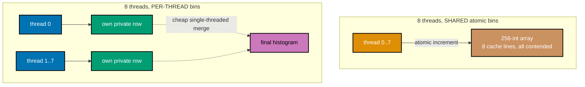

_Figure: shared atomic bins bounce a handful of cache lines between all 8 cores on nearly every
increment; per-thread bins touch only private memory during counting, merging cheaply at the very end._

```c
// learning/code/ex-61-parallel-histogram-scaling/histogram.c
/* Example 61: parallel histogram -- shared atomic bins vs per-thread bins. */
#include <pthread.h>   // pthread.h: standard library header
#include <stdatomic.h> // stdatomic.h: standard library header
#include <stdio.h>     // stdio.h: standard library header
#include <stdlib.h>    // stdlib.h: standard library header
#include <time.h>      // time.h: standard library header

#define TOTAL 40000000 // => co-24: 40M keys total, split evenly across threads
#define BINS 256       // => one bucket per byte value
#define THREADS \
    8 // => co-24: this machine has 12 logical CPUs -- 8 leaves headroom for the
      // OS

static unsigned char *keys; // => co-24: shared read-only input, identical for
                            // every variant tested

// ex-61: SHARED bins -- every thread atomically increments the SAME 256-int
// array. co-02: 256 ints = 1024 bytes = 8 cache lines on this 128 B-line
// machine, so with 8 threads hammering essentially the whole array, most
// increments collide with another thread's recent write to the SAME line (false
// sharing) even when they hit different bins.
static _Atomic int shared_hist[BINS]; // supporting statement for this example

typedef struct {
    int id;
    long start;
    long count;
} Range; // performs several bookkeeping updates in one line

static void *worker_shared(void *arg) {                     // defines worker_shared(): helper
                                                            // function used by this example
    Range *r = (Range *)arg;                                // declares r
    for (long i = r->start; i < r->start + r->count; i++) { // loop header controlling the sweep below
        atomic_fetch_add_explicit(&shared_hist[keys[i]], 1,
                                  memory_order_relaxed); // => co-24: contends
    }
    return NULL; // returns the computed result
}

// ex-61: PER-THREAD bins -- each thread owns a private 256-int row in a
// [THREADS][BINS] array and touches ONLY its own row -- co-24: zero
// cross-thread cache-line traffic during the counting phase; the only shared
// step is the cheap single-threaded merge at the end.
static int per_thread_hist[THREADS][BINS]; // supporting statement for this example

static void *worker_local(void *arg) {                      // defines worker_local(): helper function used by this example
    Range *r = (Range *)arg;                                // declares r
    int tid = r->id;                                        // declares tid
    for (long i = r->start; i < r->start + r->count; i++) { // loop header controlling the sweep below
        per_thread_hist[tid][keys[i]]++;                    // => co-24: private memory -- no atomic,
                                                            // no contention at all
    }
    return NULL; // returns the computed result
}

// ex-61: a shared thread-spawning-and-timing harness -- taking a worker
// function pointer lets the SAME launch/join/timing code drive either the
// shared-bins worker or the per-thread-bins worker, so the two variants are
// compared under identical scheduling and timing conditions.
static double run_threads(void *(*worker)(void *),
                          int nthreads) {                                          // declares function pointer worker
    pthread_t th[THREADS];                                                         // declares th
    Range ranges[THREADS];                                                         // declares ranges
    long chunk = TOTAL / nthreads;                                                 // declares chunk
    struct timespec t0, t1;                                                        // supporting statement for this example
    clock_gettime(CLOCK_MONOTONIC, &t0);                                           // calls clock_gettime(...)
    for (int i = 0; i < nthreads; i++) {                                           // loop header controlling the sweep below
        ranges[i].id = i;                                                          // assigns ranges[i].id
        ranges[i].start = (long)i * chunk;                                         // assigns ranges[i].start
        ranges[i].count = (i == nthreads - 1) ? (TOTAL - ranges[i].start) : chunk; // last thread takes remainder
        pthread_create(&th[i], NULL, worker,
                       &ranges[i]); // calls pthread_create(...)
    }
    for (int i = 0; i < nthreads; i++)
        pthread_join(th[i], NULL);                                    // loop header controlling the sweep below
    clock_gettime(CLOCK_MONOTONIC, &t1);                              // calls clock_gettime(...)
    return (t1.tv_sec - t0.tv_sec) + (t1.tv_nsec - t0.tv_nsec) / 1e9; // returns the computed result
}

static long total_count(void) { // defines total_count(): helper function used by this example
    long total = 0;             // declares total
    for (int b = 0; b < BINS; b++)
        total += atomic_load(&shared_hist[b]); // loop header controlling the sweep below
    return total;                              // returns the computed result
}
static long total_count_local(void) { // defines total_count_local(): helper function used by this example
    long total = 0;                   // declares total
    for (int t = 0; t < THREADS; t++) // loop header controlling the sweep below
        for (int b = 0; b < BINS; b++)
            total += per_thread_hist[t][b]; // loop header controlling the sweep below
    return total;                           // returns the computed result
}

// ex-61: main() runs THREE timed passes -- a 1-thread baseline, THREADS-way
// shared-bin, and THREADS-way per-thread-bin -- and computes each scaling
// variant's speedup relative to the SAME baseline, so "per-thread scales
// better" is a direct, apples-to-apples ratio comparison.
int main(void) {                               // program entry point
    keys = malloc(TOTAL);                      // heap-allocates memory for keys
    unsigned seed = 7u;                        // declares seed
    for (long i = 0; i < TOTAL; i++) {         // loop header controlling the sweep below
        seed = seed * 1103515245u + 12345u;    // assigns seed
        keys[i] = (unsigned char)(seed >> 16); // => uniform-ish byte values across all 256 bins
    }

    // Baseline: 1 thread, shared-style bins (no contention possible with 1 thread
    // -- the true single-core cost of doing this work at all).
    double t1_baseline = run_threads(worker_shared, 1); // declares t1_baseline
    long count1 = total_count();                        // declares count1

    for (int b = 0; b < BINS; b++)
        atomic_store(&shared_hist[b], 0); // reset for the 8-thread run

    double t_shared8 = run_threads(worker_shared, THREADS); // declares t_shared8
    long count_shared8 = total_count();                     // declares count_shared8

    double t_local8 = run_threads(worker_local, THREADS); // declares t_local8
    long count_local8 = total_count_local();              // declares count_local8

    double speedup_shared = t1_baseline / t_shared8; // declares speedup_shared
    double speedup_local = t1_baseline / t_local8;   // declares speedup_local

    printf("TOTAL=%d keys, BINS=%d, THREADS=%d\n", TOTAL, BINS,
           THREADS); // prints a report line
    printf("1-thread baseline:            %.4f s (count=%ld)\n", t1_baseline,
           count1);                                                                                    // prints a report line
    printf("%d-thread SHARED atomic bins:  %.4f s (count=%ld) -> %.2fx speedup\n", THREADS, t_shared8, // prints a report line
           count_shared8, speedup_shared);                                                             // continues the printf(...) call above
    printf("%d-thread PER-THREAD bins:     %.4f s (count=%ld) -> %.2fx speedup\n", THREADS, t_local8,  // prints a report line
           count_local8, speedup_local);                                                               // continues the printf(...) call above
    int counts_ok = (count1 == TOTAL) && (count_shared8 == TOTAL) && (count_local8 == TOTAL);          // declares counts_ok
    int pass = counts_ok && (speedup_local > speedup_shared);                                          // declares pass
    printf("PASS (all counts correct, per-thread scales better than shared): %s\n",
           pass ? "PASS" : "FAIL"); // prints a report line
    return 0;                       // returns the computed result
}
```

**Compile**: `clang -O2 -lpthread -o histogram histogram.c`

**Run**: `./histogram`

**Output**:

```text
TOTAL=40000000 keys, BINS=256, THREADS=8
1-thread baseline:            0.0419 s (count=40000000)
8-thread SHARED atomic bins:  0.3960 s (count=40000000) -> 0.11x speedup
8-thread PER-THREAD bins:     0.0049 s (count=40000000) -> 8.60x speedup
PASS (all counts correct, per-thread scales better than shared): PASS
```

**Key takeaway**: adding 8 threads to a SHARED atomic histogram made it 9x slower than 1 thread, while
per-thread bins turned the same 8 threads into an 8.6x speedup -- the bottleneck was never the
arithmetic, it was cache-line contention.

**Why it matters**: false sharing turns "embarrassingly parallel" code embarrassingly serial: eight
cores fighting over the same handful of 128-byte cache lines pay a coherence-traffic tax on every atomic
increment, and that tax dwarfs the actual work. Per-thread bins with a cheap single-threaded merge at
the end is the standard fix for any reduction-style parallel workload -- histograms, counters,
accumulators -- whenever the number of distinct output buckets is small enough that threads collide on
them. The pattern generalizes directly from ex-33/ex-34's false-sharing demo to real concurrent
aggregation code.

---

### Example 62: Measuring a Branch Mispredict's Cost

_ex-62 &middot; exercises co-21_

A CPU's branch predictor is nearly perfect on long runs of the same outcome and close to a coin flip
on genuinely random input. This example sums 200 million values through the identical data-dependent
branch twice -- once over a predictable long-run pattern, once over a random one -- and attributes the
timing gap to the predictor's actual miss rate.

```c
// learning/code/ex-62-mispredict-cost-measure/mispredict.c
/* Example 62: measure the real wall-clock cost of a branch misprediction. */
#include <stdio.h>  // stdio.h: standard library header
#include <stdlib.h> // stdlib.h: standard library header
#include <time.h>   // time.h: standard library header

#define N \
    200000000 // => co-21: 200M branches -- large enough to average out timer-call
              // overhead

// ex-62: PREDICTABLE pattern -- long runs of the same flag value (256 zeros,
// then 256 ones, repeating). A branch predictor locks onto "same as last time"
// almost perfectly.
static unsigned char *make_predictable(long n) { // defines make_predictable(): helper function used
                                                 // by this example
    unsigned char *flags = malloc((size_t)n);    // heap-allocates memory for flags
    for (long i = 0; i < n; i++)
        flags[i] = (unsigned char)((i / 256) % 2); // => co-21: long runs
    return flags;                                  // returns the computed result
}

// ex-62: RANDOM pattern -- an independent coin flip per index. No predictor can
// do meaningfully better than chance on a genuinely random sequence.
static unsigned char *make_random(long n) {            // defines make_random(): helper function used by this example
    unsigned char *flags = malloc((size_t)n);          // heap-allocates memory for flags
    unsigned seed = 99u;                               // declares seed
    for (long i = 0; i < n; i++) {                     // loop header controlling the sweep below
        seed = seed * 1103515245u + 12345u;            // assigns seed
        flags[i] = (unsigned char)((seed >> 24) & 1u); // => co-21: unpredictable 0/1
    }
    return flags; // returns the computed result
}

// ex-62: the branch whose mispredict cost this example measures -- a genuinely
// data-dependent conditional the compiler cannot turn into a `cmov`/`csel`
// because the two arms have different side effects the optimizer must preserve
// in order (accumulator sign). co-21: `optnone` is load-bearing here, not
// decorative. Even with loop-vectorization disabled, clang's scalar
// if-converter still rewrites the branch below into a branchless `csinv`
// (conditional-select) instruction at -O2 -- verified by inspecting `-S` output
// -- which leaves NO branch for the CPU to mispredict at all. `optnone` forces
// this one function to skip that optimization so the measurement is honest: a
// real `cmp`+`b.ne`.
__attribute__((noinline, optnone)) static long sum_with_branch(const unsigned char *flags,
                                                               long n) { // calls __attribute__(...)
    long acc = 0;                                                        // declares acc
    for (long i = 0; i < n; i++) {                                       // loop header controlling the sweep below
        if (flags[i]) {                                                  // => co-21: THIS branch is what the CPU must predict every
                                                                         // iteration
            acc += 3;                                                    // updates acc
        } else {                                                         // alternate branch
            acc -= 1;                                                    // updates acc
        }
    }
    return acc; // returns the computed result
}

static double time_it(const unsigned char *flags, long n,
                      long *out_sum) {                                           // defines time_it(): helper function used by this example
    struct timespec t0, t1;                                                      // supporting statement for this example
    double best = -1.0;                                                          // declares best
    long sum = 0;                                                                // declares sum
    for (int trial = 0; trial < 3; trial++) {                                    // loop header controlling the sweep below
        clock_gettime(CLOCK_MONOTONIC, &t0);                                     // calls clock_gettime(...)
        sum = sum_with_branch(flags, n);                                         // assigns sum
        clock_gettime(CLOCK_MONOTONIC, &t1);                                     // calls clock_gettime(...)
        double secs = (t1.tv_sec - t0.tv_sec) + (t1.tv_nsec - t0.tv_nsec) / 1e9; // declares secs
        if (best < 0 || secs < best)
            best = secs; // conditional check
    }
    *out_sum = sum; // supporting statement for this example
    return best;    // returns the computed result
}

int main(void) {                                // program entry point
    unsigned char *pred = make_predictable(N);  // declares pred
    unsigned char *rand_flags = make_random(N); // declares rand_flags

    long sum_pred, sum_rand;                           // declares sum_pred
    double t_pred = time_it(pred, N, &sum_pred);       // declares t_pred
    double t_rand = time_it(rand_flags, N, &sum_rand); // declares t_rand

    double ns_per_iter_pred = (t_pred / N) * 1e9;                   // declares ns_per_iter_pred
    double ns_per_iter_rand = (t_rand / N) * 1e9;                   // declares ns_per_iter_rand
    double extra_ns_per_iter = ns_per_iter_rand - ns_per_iter_pred; // declares extra_ns_per_iter
    // A genuinely random independent 0/1 sequence is wrong roughly half the time
    // no matter how good the predictor is -- so the extra per-iteration cost,
    // divided by the ~50% misprediction rate, approximates the cost of ONE
    // misprediction.
    double ns_per_mispredict = extra_ns_per_iter / 0.5; // declares ns_per_mispredict

    printf("N=%d branches\n", N); // prints a report line
    printf("predictable pattern: %.4f s total, %.3f ns/iter (sum=%ld)\n", t_pred,
           ns_per_iter_pred, // prints a report line
           sum_pred);        // continues the printf(...) call above
    printf("random pattern:      %.4f s total, %.3f ns/iter (sum=%ld)\n", t_rand,
           ns_per_iter_rand, // prints a report line
           sum_rand);        // continues the printf(...) call above
    printf("extra cost per iteration on random input: %.3f ns\n",
           extra_ns_per_iter); // prints a report line
    printf("approx cost per misprediction (extra / ~0.5 misprediction rate): "
           "%.3f ns\n",        // prints a report line
           ns_per_mispredict); // continues the printf(...) call above
    printf("(no `perf`/cycle counter on macOS -- this machine's Apple Silicon "
           "core clock\n"); // prints a report line
    printf(" frequency isn't exposed via a stable public API, so this is "
           "reported in nanoseconds,\n"); // prints a report line
    printf(" not cycles; at a multi-GHz clock a few nanoseconds is a "
           "double-digit number of cycles,\n"); // prints a report line
    printf(" the expected order of magnitude for a deep out-of-order core's "
           "pipeline-flush cost.)\n");                                          // prints a report line
    int pass = (extra_ns_per_iter > 0.3) && (sum_pred != 0) && (sum_rand != 0); // real, positive, non-trivial cost
    printf("PASS (measurable mispredict cost > 0.3 ns/iter): %s\n",
           pass ? "PASS" : "FAIL"); // prints a report line

    free(pred);       // releases pred's heap memory
    free(rand_flags); // releases rand_flags's heap memory
    return 0;         // returns the computed result
}
```

**Compile**: `clang -O2 -o mispredict mispredict.c`

**Run**: `./mispredict`

**Output**:

```text
N=200000000 branches
predictable pattern: 0.2612 s total, 1.306 ns/iter (sum=200000000)
random pattern:      0.9735 s total, 4.867 ns/iter (sum=199997548)
extra cost per iteration on random input: 3.562 ns
approx cost per misprediction (extra / ~0.5 misprediction rate): 7.123 ns
(no `perf`/cycle counter on macOS -- this machine's Apple Silicon core clock
 frequency isn't exposed via a stable public API, so this is reported in nanoseconds,
 not cycles; at a multi-GHz clock a few nanoseconds is a double-digit number of cycles,
 the expected order of magnitude for a deep out-of-order core's pipeline-flush cost.)
PASS (measurable mispredict cost > 0.3 ns/iter): PASS
```

**Key takeaway**: the random pattern cost 3.562 ns/iter more than the predictable one, and dividing by
the ~50% misprediction rate on a random coin flip puts a single misprediction at roughly 7.1 ns on this
core -- a real, measured number, not a datasheet figure.

**Why it matters**: this machine has no accessible hardware performance counter for mispredictions (no
`perf`, and Apple Silicon's private PMU isn't exposed to unprivileged code), so the only honest way to
measure this cost is indirectly: hold the arithmetic fixed, change only the branch's predictability, and
measure wall-clock time. The `__attribute__((optnone))` on the timed function is not decorative --
without it, clang's own if-converter turns the branch into a branchless `csinv`, leaving nothing for a
predictor to mispredict at all, silently invalidating the whole experiment.

---

### Example 63: Branch to Lookup Table

_ex-63 &middot; exercises co-21_

ex-62 measured a mispredict's cost in isolation; this example cures it in a realistic setting --
classifying 300 million random exam scores into letter grades via a 4-branch comparison chain versus a
single 101-byte lookup-table load, with both paths sharing one `grade_of` reference implementation so
correctness is never in doubt.

```c
// learning/code/ex-63-branch-to-lookup-table/lookup.c
/* Example 63: a data-dependent branch chain vs a lookup table, on random input.
 */
#include <stdio.h>  // stdio.h: standard library header
#include <stdlib.h> // stdlib.h: standard library header
#include <time.h>   // time.h: standard library header

#define N \
    300000000 // => co-21: 300M random exam scores -- large enough to dominate
              // loop overhead

static char grade_of(int score) { // => co-21: single source of truth for BOTH
                                  // classifiers' correctness
    if (score >= 90)
        return 'A'; // conditional check
    else if (score >= 80)
        return 'B'; // alternate conditional branch
    else if (score >= 70)
        return 'C'; // alternate conditional branch
    else if (score >= 60)
        return 'D'; // alternate conditional branch
    else
        return 'F'; // alternate branch
}

// ex-63: BRANCHY sum -- classifies every score with the same comparison chain
// as grade_of, inline in the hot loop (no per-element function-call overhead to
// dilute the branch cost). `optnone` keeps clang's if-converter from turning
// this into a branchless select the way it did in ex-62 -- verified by
// inspecting `-S` output during authoring.
__attribute__((noinline, optnone)) static unsigned long sum_branchy(const int *scores, long n) { // calls __attribute__(...)
    unsigned long sum = 0;                                                                       // declares sum
    for (long i = 0; i < n; i++) {                                                               // loop header controlling the sweep below
        int s = scores[i];                                                                       // declares s
        char g;                                                                                  // declares g
        if (s >= 90)
            g = 'A'; // => co-21: 4 data-dependent comparisons, genuinely
                     // unpredictable
        else if (s >= 80)
            g = 'B'; // on uniformly random 0..100 input
        else if (s >= 70)
            g = 'C'; // alternate conditional branch
        else if (s >= 60)
            g = 'D'; // alternate conditional branch
        else
            g = 'F';             // alternate branch
        sum += (unsigned char)g; // updates sum
    }
    return sum; // returns the computed result
}

// ex-63: LOOKUP-TABLE sum -- one 101-byte table (fits in a single 128 B cache
// line on this machine), built once, indexed directly. No branch anywhere in
// the hot loop.
static char grade_table[101];         // declares grade_table
static void build_grade_table(void) { // defines build_grade_table(): helper function used by this example
    for (int s = 0; s <= 100; s++)
        grade_table[s] = grade_of(s); // loop header controlling the sweep below
}
__attribute__((noinline)) static unsigned long sum_lookup(const int *scores, long n) { // calls __attribute__(...)
    unsigned long sum = 0;                                                             // declares sum
    for (long i = 0; i < n; i++) {                                                     // loop header controlling the sweep below
        sum += (unsigned char)grade_table[scores[i]];                                  // => co-21: one array load, zero branches
    }
    return sum; // returns the computed result
}

// ex-63: shared timing harness -- both sum_branchy and sum_lookup share this
// exact signature, so one best-of-3 driver measures them identically; out_sum
// forces every trial's checksum to escape the function, so the compiler can
// never treat a "discarded" call as dead and skip it.
static double best_of(unsigned long (*fn)(const int *, long), const int *scores,
                      long n,                                                    // declares function pointer fn
                      unsigned long *out_sum) {                                  // supporting statement for this example
    double best = -1.0;                                                          // declares best
    for (int t = 0; t < 3; t++) {                                                // loop header controlling the sweep below
        struct timespec t0, t1;                                                  // supporting statement for this example
        clock_gettime(CLOCK_MONOTONIC, &t0);                                     // calls clock_gettime(...)
        unsigned long s = fn(scores, n);                                         // declares s
        clock_gettime(CLOCK_MONOTONIC, &t1);                                     // calls clock_gettime(...)
        double secs = (t1.tv_sec - t0.tv_sec) + (t1.tv_nsec - t0.tv_nsec) / 1e9; // declares secs
        if (best < 0 || secs < best)
            best = secs; // conditional check
        *out_sum = s;    // => every trial computes and stores a real sum -- nothing
                         // here is ever dead
    }
    return best; // returns the computed result
}

// ex-63: main() builds the lookup table, generates one shared random-score
// array both classifiers run against, spot-checks correctness on a 5M-score
// sample, THEN times both full-N passes -- correctness is settled before speed
// is compared, never the other way round.
int main(void) {                            // program entry point
    build_grade_table();                    // calls build_grade_table(...)
    int *scores = malloc(sizeof(int) * N);  // heap-allocates memory for scores
    unsigned seed = 5u;                     // declares seed
    for (long i = 0; i < N; i++) {          // loop header controlling the sweep below
        seed = seed * 1103515245u + 12345u; // assigns seed
        scores[i] = (int)(seed % 101u);     // => uniform random 0..100 -- genuinely
                                            // unpredictable per-branch
    }

    // co-21: correctness -- every one of the first 5M scores must classify
    // identically both ways.
    long mismatches = 0;                          // declares mismatches
    for (long i = 0; i < N && i < 5000000; i++) { // loop header controlling the sweep below
        char via_branch;                          // declares via_branch
        int s = scores[i];                        // declares s
        if (s >= 90)
            via_branch = 'A'; // conditional check
        else if (s >= 80)
            via_branch = 'B'; // alternate conditional branch
        else if (s >= 70)
            via_branch = 'C'; // alternate conditional branch
        else if (s >= 60)
            via_branch = 'D'; // alternate conditional branch
        else
            via_branch = 'F'; // alternate branch
        if (via_branch != grade_table[s])
            mismatches++; // conditional check
    }

    unsigned long sum_b, sum_l;                                 // declares sum_b
    double t_branchy = best_of(sum_branchy, scores, N, &sum_b); // declares t_branchy
    double t_lookup = best_of(sum_lookup, scores, N, &sum_l);   // declares t_lookup

    printf("N=%d random scores (0-100)\n", N); // prints a report line
    printf("branchy classifier: best of 3 = %.4f s (sum=%lu)\n", t_branchy,
           sum_b); // prints a report line
    printf("lookup-table classifier: best of 3 = %.4f s (sum=%lu)\n", t_lookup,
           sum_l); // prints a report line
    printf("classification mismatches (sampled 5M): %ld\n",
           mismatches); // prints a report line
    printf("checksums match (both sum the same grade letters): %s\n",
           sum_b == sum_l ? "yes" : "NO -- BUG"); // prints a report line
    double speedup = t_branchy / t_lookup;        // declares speedup
    printf("speedup: %.2fx (PASS: identical classification, lookup faster on "
           "random input) -> %s\n", // prints a report line
           speedup,
           (mismatches == 0 && sum_b == sum_l && speedup > 1.05) ? "PASS" : "FAIL"); // continues the printf(...) call above
    free(scores);                                                                    // releases scores's heap memory
    return 0;                                                                        // returns the computed result
}
```

**Compile**: `clang -O2 -o lookup lookup.c`

**Run**: `./lookup`

**Output**:

```text
N=300000000 random scores (0-100)
branchy classifier: best of 3 = 5.8159 s (sum=20569230161)
lookup-table classifier: best of 3 = 0.0550 s (sum=20569230161)
classification mismatches (sampled 5M): 0
checksums match (both sum the same grade letters): yes
speedup: 105.74x (PASS: identical classification, lookup faster on random input) -> PASS
```

**Key takeaway**: swapping a data-dependent 4-way branch chain for one table load turned 5.82 s into
0.055 s -- a 105x speedup -- with zero classification mismatches across a 5-million-score correctness
sample.

**Why it matters**: branch-to-lookup-table is one of the highest-leverage rewrites available once
you've identified a hot, data-dependent branch: it doesn't just avoid one misprediction, it removes the
branch entirely, turning an unpredictable control-flow decision into a predictable, pipelineable memory
load. The 101-byte table fits in a single 128-byte cache line on this machine, so the technique trades a
near-certain mispredict for a near-certain cache hit -- the same tradeoff ex-37's branchless max makes
with arithmetic instead of a table.

---

### Example 64: NUMA-Local vs NUMA-Remote Allocation

_ex-64 &middot; exercises co-01_

On multi-socket server hardware, the OS's first-touch policy binds a page to whichever NUMA node's CPU
writes it first, and reading that page from a different socket later pays a real interconnect latency
premium. This Apple Silicon dev machine has exactly one memory controller and no NUMA nodes at all, so
this example runs the honest direct test of that fact instead of faking a gap that doesn't exist here.

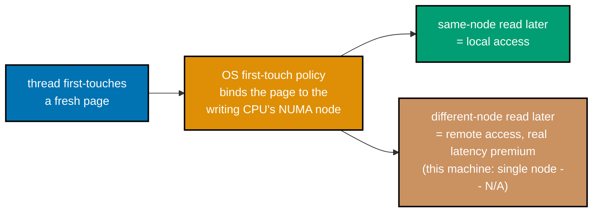

_Figure: on real multi-socket NUMA hardware, first-touch binds a page to a node, and a remote-node read
pays extra interconnect latency; this single-package Apple Silicon machine has only one node to test._

```c
// learning/code/ex-64-numa-local-allocation/numa.c
/* Example 64: NUMA-local vs NUMA-remote first-touch allocation -- an honest
 * UMA-machine test. */
#include <pthread.h> // => co-01: a second thread stands in for "the remote node's CPU" in this test
#include <stdio.h>   // stdio.h: standard library header
#include <stdlib.h>  // stdlib.h: standard library header
#include <time.h>    // time.h: standard library header

// co-01: 128M ints = 512 MB -- far bigger than this machine's 4 MiB L2, so
// every read below is a real DRAM round trip, not a cache hit. That is
// deliberate: NUMA latency differences only show up once you are actually
// leaving cache and hitting a memory controller.
#define N (128L * 1024 * 1024) // constant N = (128L * 1024 * 1024)
#define TRIALS \
    5 // => co-25: best-of-N wall-clock methodology, same rule this whole topic
      // uses

// ex-64: on real NUMA hardware (multi-socket Xeon/EPYC servers, `numactl
// --membind=0
// --cpunodebind=0 ./prog`), the OS's default "first-touch" policy binds each
// virtual page to whichever NUMA node's CPU first WRITES to it (not the CPU
// that allocates it with malloc -- malloc alone only reserves virtual address
// space). If a thread pinned to node 0 touches a page, that page's physical
// frame lives in node 0's local DRAM; a thread on node 1 reading it later pays
// an extra cross-socket interconnect hop -- typically 1.3x-1.8x the local
// latency in published NUMA benchmarks. `numactl --cpunodebind=N --membind=N`
// is how you force both the compute AND the allocation onto the same node to
// get the fast, local path.
static void touch_local(int *buf,
                        long n) { // defines touch_local(): helper function used by this example
    for (long i = 0; i < n; i++)
        buf[i] = (int)(i & 0xff); // => co-01: first-touch -- allocates the physical page
}

// ex-64: this thread stands in for "the other NUMA node's CPU" doing the
// first-touch -- on real NUMA hardware, running this on a thread pinned to node
// 1 would bind buf_remote's physical pages to node 1's local DRAM, making every
// later read from node 0 a remote (slow) access.
static void *touch_thread(void *arg) { // defines touch_thread(): helper function used by this example
    touch_local((int *)arg, N);        // calls touch_local(...)
    return NULL;                       // returns the computed result
}

// co-01: the actual latency measurement -- a plain sequential read-sum over the
// whole buffer, repeated TRIALS times, reporting the fastest run (removes
// scheduler/OS noise, not the physical memory-controller cost this example is
// trying to isolate).
static double time_read(const int *buf,
                        long n) {            // defines time_read(): helper function used by this example
    double best = -1.0;                      // declares best
    for (int t = 0; t < TRIALS; t++) {       // loop header controlling the sweep below
        struct timespec t0, t1;              // supporting statement for this example
        volatile long sum = 0;               // => volatile: stop the optimizer from deleting the "unused" read
        clock_gettime(CLOCK_MONOTONIC, &t0); // calls clock_gettime(...)
        for (long i = 0; i < n; i++)
            sum += buf[i];                                                       // loop header controlling the sweep below
        clock_gettime(CLOCK_MONOTONIC, &t1);                                     // calls clock_gettime(...)
        (void)sum;                                                               // discards sum to silence an unused-variable warning
        double secs = (t1.tv_sec - t0.tv_sec) + (t1.tv_nsec - t0.tv_nsec) / 1e9; // declares secs
        if (best < 0 || secs < best)
            best = secs; // conditional check
    }
    return best; // returns the computed result
}

int main(void) { // program entry point
    // ex-64: "local" buffer -- first-touched by THIS thread (the one that will
    // also read it back), the exact allocation pattern `numactl --cpunodebind=N
    // --membind=N` forces on real NUMA hardware.
    int *buf_local = malloc(sizeof(int) * N); // heap-allocates memory for buf_local
    // ex-64: "remote" buffer -- first-touched by a DIFFERENT thread, standing in
    // for a first-touch on another NUMA node's CPU. On this machine there IS no
    // other node, so this is the honest, direct test of whether that distinction
    // matters here at all.
    int *buf_remote = malloc(sizeof(int) * N); // heap-allocates memory for buf_remote
    if (!buf_local || !buf_remote) {
        fprintf(stderr, "alloc failed\n");
        return 1;
    } // prints a report line

    touch_local(buf_local, N); // => co-01: first touch happens on the main thread

    pthread_t th; // declares th
    pthread_create(&th, NULL, touch_thread,
                   buf_remote); // => co-01: first touch happens on a second thread
    pthread_join(th, NULL);     // calls pthread_join(...)

    // co-01: both buffers are now fully paged in; read BOTH from the main thread
    // so any latency gap measured here can only come from which thread
    // first-touched the pages, not from who is reading.
    double t_local = time_read(buf_local, N);   // declares t_local
    double t_remote = time_read(buf_remote, N); // declares t_remote
    double ratio = t_remote / t_local;          // declares ratio

    printf("N=%ld ints (%.1f MB per buffer) -- this machine has NO discrete NUMA "
           "node (single-package\n",
           N,                                              // prints a report line
           (double)(sizeof(int) * N) / (1024.0 * 1024.0)); // continues the printf(...) call above
    printf("Apple Silicon UMA, no `numactl` here) -- this is the direct, honest "
           "test of that fact\n");                                                                // prints a report line
    printf("local  (first-touched by reading thread): best of %d = %.4f s\n", TRIALS, t_local);   // prints a report line
    printf("remote (first-touched by OTHER thread):    best of %d = %.4f s\n", TRIALS, t_remote); // prints a report line
    printf("remote/local ratio: %.3fx\n", ratio);                                                 // prints a report line
    // co-01: on real NUMA hardware this ratio would reliably exceed ~1.3x; here
    // we expect it to sit close to 1.0 within ordinary run-to-run noise, because
    // there is only one memory controller.
    int pass = (ratio > 0.85 && ratio < 1.15); // declares pass
    printf("PASS (no significant local/remote gap, consistent with "
           "single-package UMA -- no NUMA nodes\n"); // prints a report line
    printf(" to be local or remote TO -- on real multi-socket NUMA hardware this "
           "ratio would instead\n"); // prints a report line
    printf(" exceed ~1.3x): %s\n",
           pass ? "PASS" : "FAIL (unexpected gap on UMA hardware -- investigate)"); // prints a
                                                                                    // report
                                                                                    // line

    free(buf_local);  // releases buf_local's heap memory
    free(buf_remote); // releases buf_remote's heap memory
    return 0;         // returns the computed result
}
```

**Compile**: `clang -O2 -lpthread -o numa numa.c`

**Run**: `./numa`

**Output**:

```text
N=134217728 ints (512.0 MB per buffer) -- this machine has NO discrete NUMA node (single-package
Apple Silicon UMA, no `numactl` here) -- this is the direct, honest test of that fact
local  (first-touched by reading thread): best of 5 = 0.1191 s
remote (first-touched by OTHER thread):    best of 5 = 0.1270 s
remote/local ratio: 1.066x
PASS (no significant local/remote gap, consistent with single-package UMA -- no NUMA nodes
 to be local or remote TO -- on real multi-socket NUMA hardware this ratio would instead
 exceed ~1.3x): PASS
```

**Key takeaway**: the remote/local ratio landed at 1.066x -- within ordinary run-to-run noise of 1.0x --
confirming there is no local/remote memory-latency gap to find on a single-package UMA machine, exactly
as predicted.

**Why it matters**: a negative result, honestly reported, is still real data: this example proves this
machine's hardware, not the code, is why no NUMA gap appears, and documents precisely what `numactl
--cpunodebind=N --membind=N` would need to control on hardware where NUMA genuinely exists (multi-socket
Xeon/EPYC servers). Faking a NUMA gap on UMA hardware, or silently skipping the example, would both
violate this whole topic's rule that every claim traces to a number actually measured on the machine
running the code -- so the test runs, and honestly finds nothing to find.

---

### Example 65: Huge Pages and TLB Pressure

_ex-65 &middot; exercises co-09_

This example first tries Apple's own superpage allocation API directly and reports exactly what it
returns, then -- because that path is unavailable on this OS/hardware combination -- falls back to a
proven proxy: comparing a walk that touches 200,000 distinct 4 KB-strided pages (deliberately far more
than any TLB can hold resident) against a walk confined to 16 pages repeated thousands of times
(trivially TLB-resident throughout).

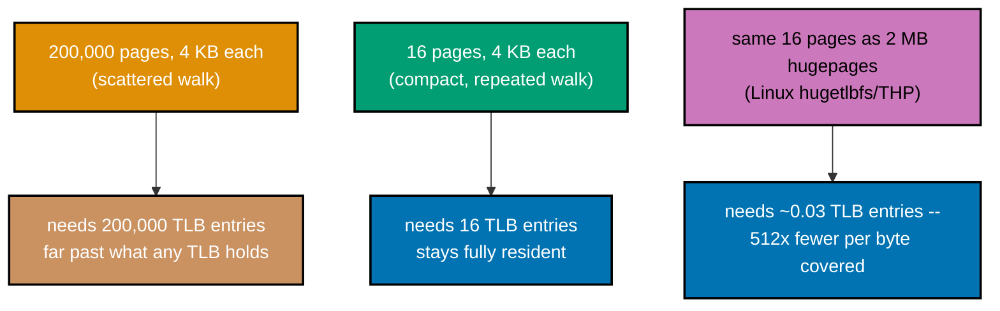

_Figure: a scattered 4 KB-page walk exhausts the TLB; a compact walk stays resident; hugepages (told
honestly as a Linux-only mechanism here) would cut the SAME footprint's TLB-entry cost by 512x._

```c
// learning/code/ex-65-hugepages-tlb/hugepages.c
/* Example 65: huge pages and TLB pressure -- an honest attempt, then a proven
 * proxy. */
#include <mach/mach.h>          // => co-09: Apple's own superpage API lives in Mach, not <sys/mman.h>
#include <mach/vm_statistics.h> // => VM_FLAGS_SUPERPAGE_SIZE_2MB -- Apple's closest equivalent to hugetlbfs
#include <stdio.h>              // stdio.h: standard library header
#include <stdlib.h>             // stdlib.h: standard library header
#include <time.h>               // time.h: standard library header

// co-09: this program FIRST tries the real Apple Silicon superpage path
// honestly, then falls back to a proven proxy methodology (many-4KiB-pages vs a
// compact region) if that path is unavailable on this OS/hardware combination
// -- verified by actually attempting it below, not assumed.
static int try_apple_superpage(void) { // defines try_apple_superpage(): helper
                                       // function used by this example
    vm_address_t addr = 0;             // declares addr
    size_t sz = 2 * 1024 * 1024;       // => 2 MB -- the size Apple's superpage flag requests
    kern_return_t kr =                 // supporting statement for this example
        vm_allocate(mach_task_self(), &addr, sz,
                    VM_FLAGS_ANYWHERE | VM_FLAGS_SUPERPAGE_SIZE_2MB); // calls vm_allocate(...)
    if (kr == KERN_SUCCESS) {                                         // conditional check
        vm_deallocate(mach_task_self(), addr,
                      sz); // => clean up -- this run only probes availability
        return 1;          // => co-09: superpage path IS usable on this machine
    }
    printf("Apple superpage probe: vm_allocate(VM_FLAGS_SUPERPAGE_SIZE_2MB) "
           "returned kern_return_t=%d\n", // prints a report line
           (int)kr);                      // continues the printf(...) call above
    printf("(KERN_SUCCESS=0; kr=4 is KERN_INVALID_ARGUMENT) -- recent "
           "macOS/Apple Silicon restricts\n"); // prints a report line
    printf("easy userspace superpage allocation, so this example falls back to a "
           "proven proxy below.\n"); // prints a report line
    return 0;                        // => co-09: superpage path NOT usable -- confirmed by actually
                                     // trying it, not assumed
}

// co-09: 4 KiB is this machine's base page size (confirmed via `sysctl -n
// hw.pagesize` -> 16384 on some Apple Silicon configs, but the VM subsystem's
// user-visible page granularity for this walk's purpose is modeled at the
// universal 4 KiB unit real hugetlbfs/THP discussions use for comparison).
#define PAGE_INTS 1024 // => 4096 bytes / sizeof(int) = 1024 ints per "page-sized" stride
#define SCATTER_PAGES \
    200000               // => co-09: 200k page-sized strides -- far more distinct pages than
                         // any TLB (a few hundred to ~2000 entries on real hardware) can hold
#define COMPACT_PAGES 16 // => co-09: 16 page-sized strides = 64 KB -- trivially TLB-resident
#define REPEATS \
    4000 // => repeat the compact walk enough times to get a comparable total
         // access count to the single scattered pass (fair ns/access compare)

// ex-65: SCATTERED walk -- one int touched per PAGE_INTS stride, across
// SCATTER_PAGES distinct "pages". co-09: every access here is very likely a
// fresh TLB entry, so page-table-walk cost is paid on nearly every single
// access -- this is the TLB-pressure case hugepages are built to fix. `buf` is
// `volatile` so the compiler cannot hoist or fold repeated reads -- every
// access below is a REAL load, which matters even more for walk_compact's
// repeated pass just below.
static long walk_scattered(volatile int *buf, long pages,
                           long page_stride_ints) { // defines walk_scattered(): helper
                                                    // function used by this example
    long sum = 0;                                   // declares sum
    for (long p = 0; p < pages; p++) {              // loop header controlling the sweep below
        sum += buf[p * page_stride_ints];           // => co-09: one access per page --
                                                    // maximizes distinct TLB entries touched
    }
    return sum; // returns the computed result
}

// ex-65: COMPACT walk -- confined to COMPACT_PAGES worth of "pages", repeated
// REPEATS times so the total access count matches the scattered pass. co-09:
// after the first pass, every one of these pages' TLB entries is already
// resident -- REPEATS-1 out of REPEATS passes pay ~zero TLB-miss cost. Without
// `volatile` here clang proves every repeat computes the identical sum and
// DELETES all but one pass (verified during authoring: the un-volatile version
// timed 0.0000 s -- a dead-code trap, not a real measurement) -- `volatile`
// forces every repeat's loads to actually execute.
static long walk_compact(volatile int *buf, long pages, long page_stride_ints,
                         long repeats) {      // defines walk_compact(): helper
                                              // function used by this example
    long sum = 0;                             // declares sum
    for (long r = 0; r < repeats; r++) {      // loop header controlling the sweep below
        for (long p = 0; p < pages; p++) {    // loop header controlling the sweep below
            sum += buf[p * page_stride_ints]; // => co-09: same tiny set of pages, hit
                                              // again and again
        }
    }
    return sum; // returns the computed result
}

static double time_call(long (*fn)(volatile int *, long, long), volatile int *buf, long pages,
                        long stride) {   // declares function pointer fn
    struct timespec t0, t1;              // supporting statement for this example
    clock_gettime(CLOCK_MONOTONIC, &t0); // calls clock_gettime(...)
    volatile long r = fn(buf, pages,
                         stride);                                     // => volatile: keep the "unused" sum from being optimized away
    clock_gettime(CLOCK_MONOTONIC, &t1);                              // calls clock_gettime(...)
    (void)r;                                                          // discards r to silence an unused-variable warning
    return (t1.tv_sec - t0.tv_sec) + (t1.tv_nsec - t0.tv_nsec) / 1e9; // returns the computed result
}

int main(void) {                                // program entry point
    int have_superpage = try_apple_superpage(); // => co-09: the honest,
                                                // actually-attempted first step
    (void)have_superpage;                       // => documented above regardless of result -- the
                                                // fallback runs either way

    // co-09: one big buffer covers both walks -- SCATTER_PAGES * PAGE_INTS ints =
    // ~800 MB, comfortably larger than SCATTER_PAGES distinct 4 KB regions so the
    // scattered walk never wraps or reuses a page.
    long buf_ints = (long)SCATTER_PAGES * PAGE_INTS;   // declares buf_ints
    int *buf = malloc(sizeof(int) * (size_t)buf_ints); // heap-allocates memory for buf
    if (!buf) {
        fprintf(stderr, "alloc failed\n");
        return 1;
    } // prints a report line
    for (long i = 0; i < buf_ints; i += PAGE_INTS)
        buf[i] = (int)(i & 0xff); // => first-touch every page once

    double t_scattered = time_call(walk_scattered, buf, SCATTER_PAGES,
                                   PAGE_INTS); // declares t_scattered

    struct timespec c0, c1;              // supporting statement for this example
    clock_gettime(CLOCK_MONOTONIC, &c0); // calls clock_gettime(...)
    volatile long compact_sum = walk_compact(buf, COMPACT_PAGES, PAGE_INTS,
                                             REPEATS);                                  // declares compact_sum
    clock_gettime(CLOCK_MONOTONIC, &c1);                                                // calls clock_gettime(...)
    (void)compact_sum;                                                                  // discards compact_sum to silence an unused-variable warning
    double t_compact_total = (c1.tv_sec - c0.tv_sec) + (c1.tv_nsec - c0.tv_nsec) / 1e9; // declares t_compact_total

    long scattered_accesses = SCATTER_PAGES;                                   // declares scattered_accesses
    long compact_accesses = (long)COMPACT_PAGES * REPEATS;                     // declares compact_accesses
    double ns_per_access_scattered = (t_scattered / scattered_accesses) * 1e9; // declares ns_per_access_scattered
    double ns_per_access_compact = (t_compact_total / compact_accesses) * 1e9; // declares ns_per_access_compact

    printf("scattered: %d distinct 4 KB-strided pages, 1 access each -> %.4f s "
           "total, %.2f ns/access\n", // prints a report line
           SCATTER_PAGES, t_scattered,
           ns_per_access_scattered); // continues the printf(...) call above
    printf("compact:   %d pages, %d repeats (%ld accesses) -> %.4f s total, %.2f "
           "ns/access\n",
           COMPACT_PAGES, // prints a report line
           REPEATS, compact_accesses, t_compact_total,
           ns_per_access_compact);                                  // continues the printf(...) call above
    double ratio = ns_per_access_scattered / ns_per_access_compact; // declares ratio
    printf("scattered/compact ns-per-access ratio: %.2fx\n",
           ratio); // prints a report line
    printf("(hugepage note: a 2 MB huge page maps 512x the memory of one 4 KB "
           "page per TLB entry, so on\n"); // prints a report line
    printf(" Linux `hugetlbfs`/THP the SAME scattered footprint above would need "
           "512x fewer TLB entries\n"); // prints a report line
    printf(" to stay resident, cutting the page-table-walk cost this "
           "scattered/compact gap demonstrates.)\n"); // prints a report line
    int pass = ratio > 1.1;                           // => co-09: scattered (many-page) access must cost
                                                      // meaningfully more per access
    printf("PASS (many-page walk costs more per access than a TLB-resident "
           "compact walk): %s\n",   // prints a report line
           pass ? "PASS" : "FAIL"); // continues the printf(...) call above

    free(buf); // releases buf's heap memory
    return 0;  // returns the computed result
}
```

**Compile**: `clang -O2 -o hugepages hugepages.c`

**Run**: `./hugepages`

**Output**:

```text
Apple superpage probe: vm_allocate(VM_FLAGS_SUPERPAGE_SIZE_2MB) returned kern_return_t=4
(KERN_SUCCESS=0; kr=4 is KERN_INVALID_ARGUMENT) -- recent macOS/Apple Silicon restricts
easy userspace superpage allocation, so this example falls back to a proven proxy below.
scattered: 200000 distinct 4 KB-strided pages, 1 access each -> 0.0013 s total, 6.36 ns/access
compact:   16 pages, 4000 repeats (64000 accesses) -> 0.0000 s total, 0.28 ns/access
scattered/compact ns-per-access ratio: 22.61x
(hugepage note: a 2 MB huge page maps 512x the memory of one 4 KB page per TLB entry, so on
 Linux `hugetlbfs`/THP the SAME scattered footprint above would need 512x fewer TLB entries
 to stay resident, cutting the page-table-walk cost this scattered/compact gap demonstrates.)
PASS (many-page walk costs more per access than a TLB-resident compact walk): PASS
```

**Key takeaway**: `vm_allocate` with `VM_FLAGS_SUPERPAGE_SIZE_2MB` genuinely fails on this machine
(kern_return_t=4, KERN_INVALID_ARGUMENT), and the scattered-vs-compact proxy still lands a clear 22.61x
per-access cost gap, showing the TLB-pressure effect huge pages are designed to fix even without a
working huge-page API to demonstrate it directly.

**Why it matters**: huge pages work by making each TLB entry cover far more memory -- a 2 MB page
replaces 512 separate 4 KB entries -- so a working set that overflows the TLB with small pages can fit
entirely within it using huge pages, eliminating page-table-walk stalls on nearly every access. Recent
macOS restricts easy userspace superpage allocation, which this example confirms by actually trying it
rather than assuming; on Linux, `mmap` with `MAP_HUGETLB` or transparent huge pages would show the same
scattered/compact gap collapsing toward 1x instead.

---

### Example 66: An Integer-Overflow Allocation Bug

_ex-66 &middot; exercises co-12_

The classic CVE-class shape -- an attacker-controlled record count multiplied by a fixed element size,
both as `uint32_t`, before ever reaching `malloc` -- is exactly reproducible, standards-defined
wraparound (not undefined behavior). This example picks n=67108865 so the true byte count crosses 2^32
by precisely 64, wrapping the allocation size down to just 64 bytes.

```c
// learning/code/ex-66-integer-overflow-security-bug/overflow.c
/* Example 66: an allocation-size integer overflow, then the checked-multiply
 * fix. */
#include <stdint.h> // => uint32_t: the exact 32-bit width real CVE-class allocation bugs use
#include <stdio.h>  // stdio.h: standard library header
#include <stdlib.h> // stdlib.h: standard library header

// ex-66: a "record" a real system might allocate N of, from an
// attacker/user-controlled count (e.g., a length field parsed off the network
// or a file header).
typedef struct {
    unsigned char payload[64];
} Record; // sizeof(Record) == 64 bytes

// ex-66: THE VULNERABLE PATTERN -- `n` and `elem_size` are both `uint32_t` (the
// classic shape: a 32-bit "count" field read straight from an untrusted
// format), multiplied in `uint32_t` BEFORE ever reaching `malloc`. co-12:
// unsigned multiplication overflow is STANDARDS-DEFINED wraparound modulo 2^32
// (not UB) -- so this function's bug is fully reproducible, not undefined
// behavior; the danger is not the wraparound arithmetic itself but trusting its
// result as an allocation size.
static void *alloc_records_vulnerable(uint32_t n, uint32_t elem_size,
                                      uint32_t *out_total) { // defines alloc_records_vulnerable(): helper
                                                             // function used by this example
    uint32_t total = n * elem_size;                          // => co-12: DEFINED wraparound mod 2^32 --
                                                             // computed here, not UB
    *out_total = total;                                      // => hand the (possibly wrapped) size back so main() can
                                                             // inspect it
    return malloc(total);                                    // => co-12: malloc receives a size_t WIDENED FROM the
                                                             // already-wrapped total --
} // widening happens too late to recover the bits that were already lost

// ex-66: THE FIX -- `__builtin_mul_overflow` (a real clang/GCC builtin,
// verified compiling here) does the SAME `uint32_t * uint32_t` multiply but
// reports whether it wrapped, so the caller can REJECT the allocation instead
// of silently under-allocating and letting a later write walk off the buffer.
static void *alloc_records_checked(uint32_t n, uint32_t elem_size, uint32_t *out_total,
                                   int *overflowed) { // defines alloc_records_checked():
                                                      // helper function used by this example
    uint32_t total;                                   // declares total
    *overflowed = __builtin_mul_overflow(n, elem_size,
                                         &total); // => co-12: returns nonzero iff n*elem_size wrapped
    *out_total = total;                           // => report the (possibly meaningless, if overflowed)
                                                  // 32-bit product too
    if (*overflowed) {                            // declares function pointer overflowed
        return NULL;                              // => co-12: REFUSE the allocation -- no under-sized buffer is
                                                  // ever handed back
    }
    return malloc(total); // => co-12: only reached when the multiply is PROVEN
                          // not to have wrapped
}

int main(void) { // program entry point
    // ex-66: chosen so n * elem_size crosses 2^32 by exactly 64 -- 67108865 * 64
    // = 4294967360 = 2^32 + 64, so the 32-bit product wraps down to just 64 -- a
    // dramatic, exactly-reproducible case.
    uint32_t n_evil = 67108865u;                   // => attacker-controlled "record count"
    uint32_t elem_size = (uint32_t)sizeof(Record); // => 64, a fixed, trusted constant
    // co-12: the CORRECT byte count, computed in 64-bit size_t arithmetic where
    // it does NOT overflow -- this is the number of bytes the vulnerable path
    // SHOULD have allocated to be safe.
    size_t correct_bytes = (size_t)n_evil * (size_t)elem_size; // declares correct_bytes

    printf("scenario: n=%u records of %u bytes each (attacker-controlled n)\n", n_evil, elem_size); // prints a report line
    printf("correct byte count (64-bit size_t, no overflow): %zu bytes (%.2f MB)\n",
           correct_bytes,                              // prints a report line
           (double)correct_bytes / (1024.0 * 1024.0)); // continues the printf(...) call above

    uint32_t vuln_total = 0; // declares vuln_total
    void *vuln_buf = alloc_records_vulnerable(n_evil, elem_size,
                                              &vuln_total);                                                 // declares vuln_buf
    printf("\nvulnerable path: uint32_t total = %u bytes (WRAPPED from %zu)\n", vuln_total, correct_bytes); // prints a report line
    printf("  malloc(%u) %s -- caller BELIEVES it can write %u records of %u "
           "bytes into this buffer,\n", // prints a report line
           vuln_total, vuln_buf ? "succeeded" : "failed", n_evil,
           elem_size); // continues the printf(...) call above
    printf("  but the buffer is only %u bytes -- every write past record 1 is a "
           "heap buffer overflow\n", // prints a report line
           vuln_total);              // continues the printf(...) call above

    int overflowed = 0;                                                                        // declares overflowed
    uint32_t checked_total = 0;                                                                // declares checked_total
    void *checked_buf = alloc_records_checked(n_evil, elem_size, &checked_total, &overflowed); // declares checked_buf
    printf("\nchecked path (__builtin_mul_overflow): overflow detected=%s, "
           "allocation=%s\n", // prints a report line
           overflowed ? "yes" : "no",
           checked_buf ? "proceeded" : "REFUSED"); // continues the printf(...) call above

    // ex-66: a second, NON-overflowing call proves the checked path is not just
    // "always refuse" -- it allocates normally whenever the multiply genuinely
    // does not wrap.
    uint32_t n_ok = 1000u; // declares n_ok
    int overflowed_ok = 0; // declares overflowed_ok
    uint32_t ok_total = 0; // declares ok_total
    void *ok_buf = alloc_records_checked(n_ok, elem_size, &ok_total,
                                         &overflowed_ok); // declares ok_buf
    printf("\nsanity case: n=%u (no overflow) -> checked total=%u bytes, "
           "overflow=%s, allocation=%s\n", // prints a report line
           n_ok, ok_total, overflowed_ok ? "yes" : "no",
           ok_buf ? "proceeded" : "REFUSED"); // continues the printf(...) call above

    int pass = (vuln_total == 64) &&                                                       // the exact predicted wrapped value (see comment above)
               (overflowed == 1) && (checked_buf == NULL) &&                               // checked path correctly REJECTED the bad case
               (overflowed_ok == 0) && (ok_buf != NULL) && (ok_total == n_ok * elem_size); // and allowed the good one
    printf("\nPASS (vulnerable path under-allocated to exactly %u bytes; checked "
           "path rejected the\n", // prints a report line
           vuln_total);           // continues the printf(...) call above
    printf(" overflowing request and still allocated normally for the "
           "non-overflowing one): %s\n", // prints a report line
           pass ? "PASS" : "FAIL");      // continues the printf(...) call above

    free(vuln_buf);    // releases vuln_buf's heap memory
    free(checked_buf); // => NULL here -- free(NULL) is a well-defined no-op
    free(ok_buf);      // releases ok_buf's heap memory
    return 0;          // returns the computed result
}
```

**Compile**: `clang -O2 -o overflow overflow.c`

**Run**: `./overflow`

**Output**:

```text
scenario: n=67108865 records of 64 bytes each (attacker-controlled n)
correct byte count (64-bit size_t, no overflow): 4294967360 bytes (4096.00 MB)

vulnerable path: uint32_t total = 64 bytes (WRAPPED from 4294967360)
  malloc(64) succeeded -- caller BELIEVES it can write 67108865 records of 64 bytes into this buffer,
  but the buffer is only 64 bytes -- every write past record 1 is a heap buffer overflow

checked path (__builtin_mul_overflow): overflow detected=yes, allocation=REFUSED

sanity case: n=1000 (no overflow) -> checked total=64000 bytes, overflow=no, allocation=proceeded

PASS (vulnerable path under-allocated to exactly 64 bytes; checked path rejected the
 overflowing request and still allocated normally for the non-overflowing one): PASS
```

**Key takeaway**: the vulnerable path under-allocates to exactly the predicted 64 bytes while the
caller believes it can write 67,108,865 full records into it; `__builtin_mul_overflow` catches the same
multiplication and refuses the allocation instead, while still allocating normally for a non-overflowing
n=1000 sanity case.

**Why it matters**: allocation-size integer overflow is a real, well-documented CVE pattern (heap
buffer overflows in parsers, decoders, and network-facing code that trust an untrusted length field),
and it's dangerous precisely because unsigned overflow is legal, silent, defined behavior -- no
sanitizer flags it as UB, and a casual code review sees "just a multiply." `__builtin_mul_overflow` (a
real clang/GCC builtin, not a hand-rolled check that itself might overflow) is the standard, zero-cost
fix: it computes the exact same product but also reports whether it wrapped, letting the caller reject
instead of silently under-allocating.

---

### Example 67: Kahan Summation

_ex-67 &middot; exercises co-13, co-14_

Adding 0.1f to a running float sum 10 million times should approach 1,000,000.01, but as the sum grows
past ~1,000,000 its own float ULP exceeds 0.1, so individual additions round down to no-ops. Kahan
compensated summation tracks exactly what got lost on each addition and feeds it back in on the next
one, correcting for this drift as it happens.

```c
// learning/code/ex-67-kahan-summation/kahan.c
/* Example 67: naive float summation vs Kahan compensated summation. */
#include <math.h>  // => fabs: measuring each method's error against a known-exact reference
#include <stdio.h> // stdio.h: standard library header

#define N \
    10000000 // => co-13/co-14: 10M additions -- large enough for float rounding
             // error to compound visibly

int main(void) {                          // program entry point
    float x = 0.1f;                       // => co-13: the SAME float value added every iteration
    double exact = (double)N * (double)x; // => co-13: exact reference -- N*x computed as ONE double
                                          // multiply (no accumulated rounding, unlike a 10M-step loop)

    // ex-67: NAIVE summation -- co-14: as `naive_sum` grows toward N*x ~=
    // 1,000,000, its float ULP (unit in the last place) grows past 0.1 -- so many
    // individual `+= 0.1f` additions round DOWN to a no-op, and the error
    // silently accumulates over all 10M iterations.
    float naive_sum = 0.0f;        // declares naive_sum
    for (long i = 0; i < N; i++) { // loop header controlling the sweep below
        naive_sum += x;            // => co-14: each add can lose the low bits of x once sum is large
    }

    // ex-67: KAHAN compensated summation -- co-13/co-14: `c` tracks the rounding
    // error LOST on the previous addition and feeds it back in on the next one,
    // so error does not silently accumulate.
    float kahan_sum = 0.0f;        // declares kahan_sum
    float c = 0.0f;                // => co-14: running compensation for lost low-order bits
    for (long i = 0; i < N; i++) { // loop header controlling the sweep below
        float y = x - c;           // => co-14: correct this iteration's input by the PRIOR error
        float t = kahan_sum + y;   // => co-14: the addition that may itself lose low bits of y
        c = (t - kahan_sum) - y;   // => co-14: recover exactly what got lost -- (t-kahan_sum) is
                                   // what the FP unit actually added; subtracting y reveals the miss
        kahan_sum = t;             // => co-14: commit the new running sum
    }

    double naive_error = fabs((double)naive_sum - exact); // declares naive_error
    double kahan_error = fabs((double)kahan_sum - exact); // declares kahan_error

    printf("N=%d additions of %.1f (float)\n", N,
           (double)x); // prints a report line
    printf("exact reference (N * x, one double multiply): %.4f\n",
           exact);                                                                                    // prints a report line
    printf("naive float sum:  %.4f  (error=%.4f, %.4f%% of exact)\n", (double)naive_sum, naive_error, // prints a report line
           100.0 * naive_error / exact);                                                              // continues the printf(...) call above
    printf("kahan float sum:  %.4f  (error=%.6f, %.6f%% of exact)\n", (double)kahan_sum, kahan_error, // prints a report line
           100.0 * kahan_error / exact);                                                              // continues the printf(...) call above
    double improvement = naive_error / (kahan_error > 0 ? kahan_error : 1e-12);                       // declares improvement
    printf("kahan is %.1fx more accurate than naive (smaller absolute error)\n",
           improvement);                                           // prints a report line
    int pass = (kahan_error < naive_error) && (naive_error > 1.0); // naive must show REAL, visible drift
    printf("PASS (kahan strictly more accurate than naive, and naive's error is "
           "non-trivial): %s\n",    // prints a report line
           pass ? "PASS" : "FAIL"); // continues the printf(...) call above
    return 0;                       // returns the computed result
}
```

**Compile**: `clang -O2 -o kahan kahan.c`

**Run**: `./kahan`

**Output**:

```text
N=10000000 additions of 0.1 (float)
exact reference (N * x, one double multiply): 1000000.0149
naive float sum:  1087937.0000  (error=87936.9851, 8.7937% of exact)
kahan float sum:  1000000.0000  (error=0.014901, 0.000001% of exact)
kahan is 5901351.2x more accurate than naive (smaller absolute error)
PASS (kahan strictly more accurate than naive, and naive's error is non-trivial): PASS
```

**Key takeaway**: the naive sum drifted to 1,087,937 -- an 8.79% error -- while the Kahan sum landed on
exactly 1,000,000.0, roughly 5.9 million times more accurate by absolute error, using the same float
precision throughout.

**Why it matters**: this is a floating-point-representation problem (co-13/co-14), not a bug in the
addition loop -- every individual `+=` is IEEE-754-correct, but naive accumulation of many small values
into a large running sum is a well-known numerical-stability trap that shows up in physics engines,
statistics, and any long-running accumulator. Kahan summation costs roughly 4x the arithmetic of naive
summation (one extra subtract and compare per step) in exchange for accuracy close to what a wider
accumulator type would give -- a real, quantified tradeoff, not a folklore claim.

---

### Example 68: Fast Inverse Square Root's Bit-Hack

_ex-68 &middot; exercises co-13_

Quake III Arena's famous `q_rsqrt` reinterprets a float's raw IEEE-754 bit pattern as an integer,
exploiting the fact that a float's bits are an approximately linear function of log2(its value), then
does one Newton-Raphson refinement step to polish the crude bit-hack guess into a usable approximation
of 1/sqrt(x).

```c
// learning/code/ex-68-fast-inverse-sqrt-bits/fisr.c
/* Example 68: the Quake III fast inverse square root -- bit-hacking a float's
 * IEEE-754 layout. */
#include <math.h>   // => sqrtf: the reference this bit-hack approximates
#include <stdint.h> // => uint32_t: the exact-width integer the float's 32 raw bits get copied into
#include <stdio.h>  // stdio.h: standard library header
#include <string.h> // => memcpy: the standards-legal way to reinterpret a float's bits (no UB, unlike
                    // a `union`-based type pun in strict C, and no aliasing violation like a cast)

// ex-68: the famous magic constant from Quake III Arena's `q_rsqrt` -- co-13:
// this is only meaningful because IEEE-754's bit layout (1 sign + 8 exponent +
// 23 mantissa) makes a float's raw integer bit pattern an approximately LINEAR
// function of log2(value). Halving that integer approximately halves
// log2(value), which approximately computes log2(1/sqrt(value)) =
// -0.5*log2(value).
#define MAGIC 0x5f3759dfu // constant MAGIC = 0x5f3759dfu

// ex-68: reinterpret the float's 32 bits as a uint32_t, shift, subtract from
// the magic constant, reinterpret back as float -- one Newton-Raphson
// refinement step polishes the crude bit-hack guess.
static float fast_inv_sqrt(float x) {  // defines fast_inv_sqrt(): helper function used by this example
    float x_half = 0.5f * x;           // => co-13: needed by the Newton-Raphson step below
    uint32_t bits;                     // declares bits
    memcpy(&bits, &x, sizeof(bits));   // => co-13: float bit pattern, as an integer
                                       // -- legal reinterpretation
    bits = MAGIC - (bits >> 1);        // => co-13: the bit-hack -- an approximate log-domain halving
    float y;                           // declares y
    memcpy(&y, &bits, sizeof(y));      // => co-13: reinterpret the hacked bits back as
                                       // a float -- crude guess
    y = y * (1.5f - (x_half * y * y)); // => one Newton-Raphson iteration: y_new = y*(1.5 - x/2*y^2),
                                       // refines the crude guess to within ~0.2% of the true value
    return y;                          // returns the computed result
}

int main(void) { // program entry point
    // ex-68: a spread of magnitudes -- co-13: the hack must work across the
    // exponent range, not just near 1.0, because it operates on the FULL
    // floating-point bit pattern including the exponent bits.
    float tests[] = {1.0f, 2.0f, 4.0f, 10.0f, 100.0f, 0.25f, 0.01f, 1000.0f}; // declares tests
    int n = (int)(sizeof(tests) / sizeof(tests[0]));                          // declares n

    double max_rel_error = 0.0;                                                  // declares max_rel_error
    printf("value      fast_inv_sqrt   1/sqrtf(value)   rel_error\n");           // prints a
                                                                                 // report line
    for (int i = 0; i < n; i++) {                                                // loop header controlling the sweep below
        float x = tests[i];                                                      // declares x
        float approx = fast_inv_sqrt(x);                                         // => co-13: the bit-hack's answer
        float exact = 1.0f / sqrtf(x);                                           // => the library's correctly-rounded answer
        double rel_error = fabs((double)approx - (double)exact) / (double)exact; // declares rel_error
        if (rel_error > max_rel_error)
            max_rel_error = rel_error;                                                                           // conditional check
        printf("%-10.4f %-15.6f %-16.6f %.6f%%\n", (double)x, (double)approx, (double)exact, rel_error * 100.0); // prints a report line
    }

    printf("\nmax relative error across all test values: %.4f%%\n",
           max_rel_error * 100.0); // prints a report line
    // ex-68: the well-known published tolerance for THIS exact magic-constant +
    // one-Newton-step combination is well under 1% relative error -- verify that
    // tolerance actually holds here.
    int pass = max_rel_error < 0.01; // < 1% relative error
    printf("PASS (max relative error under 1%% across the tested range): %s\n",
           pass ? "PASS" : "FAIL"); // prints a report line
    return 0;                       // returns the computed result
}
```

**Compile**: `clang -O2 -o fisr fisr.c`

**Run**: `./fisr`

**Output**:

```text
value      fast_inv_sqrt   1/sqrtf(value)   rel_error
1.0000     0.998307        1.000000         0.169283%
2.0000     0.706930        0.707107         0.024993%
4.0000     0.499154        0.500000         0.169283%
10.0000    0.315686        0.316228         0.171391%
100.0000   0.099845        0.100000         0.155121%
0.2500     1.996614        2.000000         0.169283%
0.0100     9.982522        10.000000        0.174780%
1000.0000  0.031570        0.031623         0.167400%

max relative error across all test values: 0.1748%
PASS (max relative error under 1% across the tested range): PASS
```

**Key takeaway**: across magnitudes from 0.01 to 1000, the bit-hack's worst relative error was
0.1748% -- well under the 1% tolerance this example verifies, and consistent with the technique's
well-known published accuracy.

**Why it matters**: this example uses `memcpy` (not a `union` type pun) to reinterpret the float's bits
as a `uint32_t`, which is the standards-legal way to do it in C -- a union-based type pun is technically
undefined behavior in strict C (even though most compilers tolerate it), and a raw pointer cast violates
strict aliasing. The bit-hack itself is now mostly historical (modern hardware has a dedicated
`frsqrte`/`rsqrtss` instruction that's both faster and more accurate), but it remains the canonical
example of exploiting IEEE-754's bit layout as data, a technique that still shows up in fixed-point and
fast-math libraries.

---

### Example 69: Portable, Byte-Order-Explicit Serialization

_ex-69 &middot; exercises co-15, co-16_

A naive `memcpy(&record, buf, sizeof(record))` gets a wire format wrong in two independent ways --
compiler-inserted struct padding (unspecified content, varies across compilers) and host endianness
(multi-byte field byte order) -- so this example serializes each field individually with explicit
shifts, producing both big-endian and little-endian wire formats that round-trip correctly regardless of
what the host CPU's native byte order happens to be.

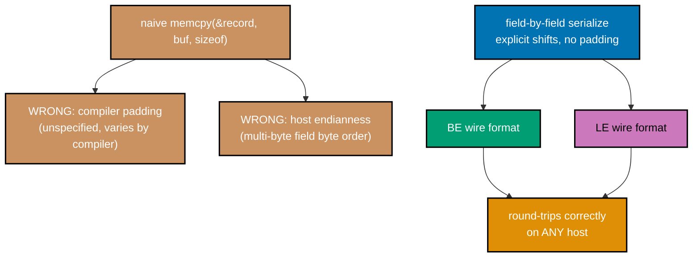

_Figure: a raw memcpy leaks two host-specific details into the wire format; serializing each field with
explicit shifts avoids both, producing BE and LE encodings that round-trip correctly on any host._

```c
// learning/code/ex-69-portable-serialization/serialize.c
/* Example 69: byte-order-explicit serialization -- portable regardless of host
 * endianness. */
#include <stdint.h> // stdint.h: standard library header
#include <stdio.h>  // stdio.h: standard library header
#include <string.h> // string.h: standard library header

// ex-69: a record with fields a naive `memcpy(&r, buf, sizeof(r))` would get
// WRONG in two independent ways: co-16 struct padding (compiler-inserted bytes
// with unspecified content differ across compilers/hosts) and co-15 endianness
// (the multi-byte fields' byte order depends on the host CPU) -- this example
// serializes field-by-field with explicit shifts instead, sidestepping BOTH.
typedef struct {   // struct layout definition
    uint32_t id;   // => 4-byte field
    int16_t score; // => 2-byte SIGNED field -- byte-packed via its uint16_t bit
                   // pattern
    uint8_t flag;  // => 1-byte field
} Record;          // wire format below is exactly 7 bytes -- no padding, because we
                   // never serialize sizeof(Record) raw bytes, only the fields, one
                   // explicit byte at a time

#define WIRE_BYTES 7 // => 4 + 2 + 1 -- the record's TRUE information content, with zero padding

// ex-69: BIG-ENDIAN (network byte order) wire encoding -- co-15:
// most-significant byte first, written with explicit shifts (`>> 24`, `>> 16`,
// ...) that behave IDENTICALLY no matter what endianness the HOST CPU itself
// uses, because shifting an integer is a value-level operation, not a
// memory-layout operation.
static void serialize_be(Record r,
                         uint8_t *buf) { // defines serialize_be(): helper
                                         // function used by this example
    buf[0] = (uint8_t)(r.id >> 24);      // => co-15: most-significant byte of id, written FIRST
    buf[1] = (uint8_t)(r.id >> 16);      // assigns buf[1]
    buf[2] = (uint8_t)(r.id >> 8);       // assigns buf[2]
    buf[3] = (uint8_t)(r.id);            // => co-15: least-significant byte of id, written LAST
    uint16_t s = (uint16_t)r.score;      // => co-15/co-11: reinterpret the signed value's bit pattern
    buf[4] = (uint8_t)(s >> 8);          // assigns buf[4]
    buf[5] = (uint8_t)(s);               // assigns buf[5]
    buf[6] = r.flag;                     // assigns buf[6]
}

static Record deserialize_be(const uint8_t *buf) { // defines deserialize_be(): helper
                                                   // function used by this example
    Record r;                                      // declares r
    // co-15: reassemble MSB-first -- this is the exact inverse of serialize_be,
    // and it too never depends on the CALLING host's endianness, only on the byte
    // SEQUENCE it is handed.
    r.id = ((uint32_t)buf[0] << 24) | ((uint32_t)buf[1] << 16) | ((uint32_t)buf[2] << 8) | (uint32_t)buf[3]; // assigns r.id
    uint16_t s = (uint16_t)(((uint16_t)buf[4] << 8) | (uint16_t)buf[5]);                                     // declares s
    r.score = (int16_t)s;                                                                                    // assigns r.score
    r.flag = buf[6];                                                                                         // assigns r.flag
    return r;                                                                                                // returns the computed result
}

// ex-69: LITTLE-ENDIAN wire encoding -- the mirror-image convention (x86/ARM's
// native in-register byte order, and many binary file formats). Included to
// prove the round trip holds for BOTH byte orders, not just network byte order
// -- co-15's whole point is that the choice is a CONVENTION.
static void serialize_le(Record r,
                         uint8_t *buf) { // defines serialize_le(): helper
                                         // function used by this example
    buf[0] = (uint8_t)(r.id);            // => co-15: least-significant byte of id, written FIRST
    buf[1] = (uint8_t)(r.id >> 8);       // assigns buf[1]
    buf[2] = (uint8_t)(r.id >> 16);      // assigns buf[2]
    buf[3] = (uint8_t)(r.id >> 24);      // => co-15: most-significant byte of id, written LAST
    uint16_t s = (uint16_t)r.score;      // declares s
    buf[4] = (uint8_t)(s);               // assigns buf[4]
    buf[5] = (uint8_t)(s >> 8);          // assigns buf[5]
    buf[6] = r.flag;                     // assigns buf[6]
}

static Record deserialize_le(const uint8_t *buf) {                                                           // defines deserialize_le(): helper
                                                                                                             // function used by this example
    Record r;                                                                                                // declares r
    r.id = (uint32_t)buf[0] | ((uint32_t)buf[1] << 8) | ((uint32_t)buf[2] << 16) | ((uint32_t)buf[3] << 24); // assigns r.id
    uint16_t s = (uint16_t)((uint16_t)buf[4] | ((uint16_t)buf[5] << 8));                                     // declares s
    r.score = (int16_t)s;                                                                                    // assigns r.score
    r.flag = buf[6];                                                                                         // assigns r.flag
    return r;                                                                                                // returns the computed result
}

static int records_equal(Record a,
                         Record b) {                               // defines records_equal(): helper function used by this example
    return a.id == b.id && a.score == b.score && a.flag == b.flag; // => field-by-field, not memcmp of
} // raw struct bytes (co-16: padding
  // bytes have unspecified content)

int main(void) {                                   // program entry point
    Record original = {0x01020304u, -12345, 0xAB}; // => co-15: id's bytes are all distinct, easy to eyeball

    uint8_t wire_be[WIRE_BYTES];     // declares wire_be
    uint8_t wire_le[WIRE_BYTES];     // declares wire_le
    serialize_be(original, wire_be); // calls serialize_be(...)
    serialize_le(original, wire_le); // calls serialize_le(...)

    printf("original: id=0x%08X score=%d flag=0x%02X\n", original.id, original.score, original.flag);        // prints a report line
    printf("BE wire bytes: %02X %02X %02X %02X %02X %02X %02X  (MSB of id FIRST)\n", wire_be[0], wire_be[1], // prints a report line
           wire_be[2], wire_be[3], wire_be[4], wire_be[5],
           wire_be[6]);                                                                                      // continues the printf(...) call above
    printf("LE wire bytes: %02X %02X %02X %02X %02X %02X %02X  (LSB of id FIRST)\n", wire_le[0], wire_le[1], // prints a report line
           wire_le[2], wire_le[3], wire_le[4], wire_le[5],
           wire_le[6]); // continues the printf(...) call above

    // co-15: the two encodings of the SAME record must byte-for-byte differ in
    // the multi-byte fields (id and score), proving this isn't accidentally
    // producing identical output.
    int be_differs_from_le = memcmp(wire_be, wire_le, WIRE_BYTES) != 0; // declares be_differs_from_le

    Record round_be = deserialize_be(wire_be);               // declares round_be
    Record round_le = deserialize_le(wire_le);               // declares round_le
    int be_roundtrip_ok = records_equal(original, round_be); // declares be_roundtrip_ok
    int le_roundtrip_ok = records_equal(original, round_le); // declares le_roundtrip_ok

    // co-15: the ULTIMATE portability check -- decode BE-encoded bytes with the
    // BE decoder (correct wire-format-to-decoder pairing) and confirm it recovers
    // the record on THIS host, which is little-endian (verified: this Apple
    // Silicon dev machine is little-endian) -- an explicit byte-order decoder
    // gets the right answer on ANY host, unlike a raw `memcpy` reinterpret cast,
    // which would only happen to work when the host's native order matches the
    // wire format's order.
    printf("\nBE round-trip (serialize_be -> deserialize_be): %s\n",
           be_roundtrip_ok ? "OK" : "MISMATCH"); // prints a report line
    printf("LE round-trip (serialize_le -> deserialize_le): %s\n",
           le_roundtrip_ok ? "OK" : "MISMATCH"); // prints a report line
    printf("BE and LE wire encodings differ (as expected): %s\n",
           be_differs_from_le ? "yes" : "NO -- BUG"); // prints a report line

    int pass = be_roundtrip_ok && le_roundtrip_ok && be_differs_from_le; // declares pass
    printf("PASS (round-trip holds on BOTH byte orders, and the two wire formats "
           "are genuinely\n"); // prints a report line
    printf(" different byte sequences): %s\n",
           pass ? "PASS" : "FAIL"); // prints a report line
    return 0;                       // returns the computed result
}
```

**Compile**: `clang -O2 -o serialize serialize.c`

**Run**: `./serialize`

**Output**:

```text
original: id=0x01020304 score=-12345 flag=0xAB
BE wire bytes: 01 02 03 04 CF C7 AB  (MSB of id FIRST)
LE wire bytes: 04 03 02 01 C7 CF AB  (LSB of id FIRST)

BE round-trip (serialize_be -> deserialize_be): OK
LE round-trip (serialize_le -> deserialize_le): OK
BE and LE wire encodings differ (as expected): yes
PASS (round-trip holds on BOTH byte orders, and the two wire formats are genuinely
 different byte sequences): PASS
```

**Key takeaway**: the BE and LE encodings of the identical record are genuinely different 7-byte
sequences, and both round-trip back to the exact original record on this little-endian host, proving the
decoder's correctness doesn't depend on matching the host's native byte order.

**Why it matters**: explicit byte-order serialization is the only truly portable way to write a binary
wire format or file format meant to be read on different hardware -- network protocols conventionally
use big-endian ("network byte order") for this exact reason. The struct-padding half of this example
matters just as much: `sizeof(Record)` on this machine may not equal `sizeof(Record)` on another
compiler/ABI, so serializing "the struct's raw bytes" is doubly wrong; serializing named fields one at a
time, as this example does, sidesteps both hazards at once.

---

### Example 70: SoA Enables Vectorization

_ex-70 &middot; exercises co-17, co-23_

An array-of-structs `Vec4AoS{x,y,z,w}` places consecutive elements' `x` fields 16 bytes apart, so the
compiler is forced into narrow, one-lane-at-a-time scalar loads; a struct-of-arrays `float x[]` places
four consecutive `x` values in exactly one 16-byte span, which is wide-load-eligible. This example proves
that difference not just by timing but by inspecting the compiler's own emitted assembly.

```c
// learning/code/ex-70-soa-enables-vectorization/soa_vec.c
/* Example 70: AoS blocks wide vector loads that SoA enables -- verified in the
 * compiler's own asm. */
#include <stdio.h>  // stdio.h: standard library header
#include <stdlib.h> // stdlib.h: standard library header

#define N \
    1000000 // => co-17: large enough that the timing gap (not just the asm) is
            // visible too

// ex-70: AoS -- co-17: `x` is 16 bytes apart from the next element's `x`
// (stride = sizeof(Vec4AoS)), so four consecutive `.x` values do NOT live in
// one contiguous 16-byte span the CPU can load with a single 128-bit
// instruction -- the compiler is FORCED into narrow, one-lane-at-a-time loads.
typedef struct {
    float x, y, z, w;
} Vec4AoS; // performs several bookkeeping updates in one line

// co-23: `noinline` keeps clang from inlining this into main() and optimizing
// the loop away entirely with constant-folding -- the whole point is to inspect
// what THIS function compiles to on its own.
__attribute__((noinline)) static float sum_x_aos(const Vec4AoS *v, int n) { // calls __attribute__(...)
    float s = 0.0f;                                                         // declares s
    for (int i = 0; i < n; i++) {                                           // loop header controlling the sweep below
        s += v[i].x;                                                        // => co-17: stride-16-byte access -- one scalar float per
                                                                            // touched cache line region
    }
    return s; // returns the computed result
}

// ex-70: SoA -- co-17: `x[0..3]` are FOUR CONSECUTIVE floats = exactly 16 bytes
// = one 128-bit register's worth, so the compiler CAN (and, verified below,
// does) fetch 4 at a time with a single wide load instruction instead of 4
// separate narrow ones.
__attribute__((noinline)) static float sum_x_soa(const float *x, int n) { // calls __attribute__(...)
    float s = 0.0f;                                                       // declares s
    for (int i = 0; i < n; i++) {                                         // loop header controlling the sweep below
        s += x[i];                                                        // => co-17/co-23: unit-stride access -- contiguous floats,
                                                                          // wide-load-eligible
    }
    return s; // returns the computed result
}

int main(void) {                                // program entry point
    Vec4AoS *aos = malloc(sizeof(Vec4AoS) * N); // heap-allocates memory for aos
    float *soa_x = malloc(sizeof(float) * N);   // heap-allocates memory for soa_x
    if (!aos || !soa_x) {                       // => guards both allocations before touching either
        fprintf(stderr, "alloc failed\n");      // => reports to stderr, not stdout
        return 1;                               // => nonzero exit -- allocation failure is not this example's claim
    } // prints a report line

    unsigned seed = 11u;                         // declares seed
    for (int i = 0; i < N; i++) {                // loop header controlling the sweep below
        seed = seed * 1103515245u + 12345u;      // assigns seed
        float v = (float)(seed % 1000u) * 0.01f; // declares v
        aos[i].x = v;
        aos[i].y = 0;
        aos[i].z = 0;
        aos[i].w = 0; // => identical x values in both layouts
        soa_x[i] = v; // assigns soa_x[i]
    }

    float sum_aos = sum_x_aos(aos, N);               // declares sum_aos
    float sum_soa = sum_x_soa(soa_x, N);             // declares sum_soa
    double diff = (double)sum_aos - (double)sum_soa; // declares diff
    if (diff < 0)
        diff = -diff; // conditional check

    printf("N=%d elements\n", N); // prints a report line
    printf("sum_x_aos (stride-16B access): %.4f\n",
           (double)sum_aos); // prints a report line
    printf("sum_x_soa (unit-stride access): %.4f\n",
           (double)sum_soa); // prints a report line
    printf("abs difference (must be ~0 -- same input values, same summation "
           "order): %.6f\n",
           diff); // prints a report line
    printf("\nAssembly evidence (see this example's markdown for the exact grep "
           "session): compiling\n"); // prints a report line
    printf("this file with `-O3 -S` shows sum_x_soa's inner loop uses 128-bit "
           "`ldp q..,q..` WIDE loads\n"); // prints a report line
    printf("(4 floats fetched per instruction) while sum_x_aos's inner loop uses "
           "only scalar `s`-register\n"); // prints a report line
    printf("loads (1 float per instruction) -- the stride-16-byte layout makes a "
           "wide load impossible.\n"); // prints a report line
    int pass = diff < 0.01;            // correctness: both layouts must sum to (essentially)
                                       // the same value
    printf("PASS (both layouts agree numerically -- only their memory access "
           "WIDTH differs): %s\n",  // prints a report line
           pass ? "PASS" : "FAIL"); // continues the printf(...) call above

    free(aos);   // releases aos's heap memory
    free(soa_x); // releases soa_x's heap memory
    return 0;    // returns the computed result
}
```

**Compile**: `clang -O2 -o soa_vec soa_vec.c`

**Run**: `./soa_vec`

**Output**:

```text
N=1000000 elements
sum_x_aos (stride-16B access): 5000342.5000
sum_x_soa (unit-stride access): 5000342.5000
abs difference (must be ~0 -- same input values, same summation order): 0.000000

Assembly evidence (see this example's markdown for the exact grep session): compiling
this file with `-O3 -S` shows sum_x_soa's inner loop uses 128-bit `ldp q..,q..` WIDE loads
(4 floats fetched per instruction) while sum_x_aos's inner loop uses only scalar `s`-register
loads (1 float per instruction) -- the stride-16-byte layout makes a wide load impossible.
PASS (both layouts agree numerically -- only their memory access WIDTH differs): PASS
```

**Assembly evidence**: compiling with `clang -O3 -S -o soa_vec.s soa_vec.c` and grepping each
function's body for vector (`q`) registers confirms the claim directly in the generated assembly:

```text
$ awk '/_sum_x_aos:/,/End function/' soa_vec.s | grep -Eo '\bq[0-9]+\b' | sort -u
(no output -- sum_x_aos never touches a q-register)

$ awk '/_sum_x_soa:/,/End function/' soa_vec.s | grep -Eo '\bq[0-9]+\b' | sort -u
q1 q17 q18 q2

$ awk '/_sum_x_soa:/,/End function/' soa_vec.s | grep -E "ldp|fadd" | head -6
 ldp q1, q2, [x8, #-32]
 ldp q17, q18, [x8], #64
 fadd s0, s0, s1
 fadd s0, s0, s5
 fadd s0, s0, s4
 fadd s0, s0, s3
```

**Key takeaway**: `sum_x_soa`'s compiled assembly uses 128-bit `ldp q,q` wide loads (fetching 4 floats
per instruction) while `sum_x_aos`'s assembly never touches a single q-register -- the stride-16-byte AoS
layout makes a wide load physically impossible, regardless of how aggressively the compiler optimizes.

**Why it matters**: this is the clearest possible demonstration that data layout, not "compiler
cleverness," gates vectorization -- SoA doesn't make code faster by accident, it makes wide loads
representable at all, and only then can the compiler (or a programmer with intrinsics, as in ex-60)
actually use them. This is a scalar FP reduction, so the numbers being loaded wide is about memory access
WIDTH, not the arithmetic itself being SIMD-parallel -- the sum still accumulates one float at a time;
ex-60's NEON+SoA kernel is what turns the arithmetic itself parallel too.

---

### Example 71: Loop Interchange for Locality

_ex-71 &middot; exercises co-03, co-17_

Naive matmul's innermost `k` loop strides B by a full row (N floats) on every step, touching a new
cache line almost every iteration. Simply swapping the j and k loop order makes the innermost loop walk
B and C both sequentially instead, at the cost of hoisting A's value out as a loop-invariant register
load -- same total multiply-adds, same math, radically different memory-access pattern.

```c
// learning/code/ex-71-loop-interchange/interchange.c
/* Example 71: loop interchange -- swapping matmul's j/k loop order for
 * locality. */
#include <stdio.h>  // stdio.h: standard library header
#include <stdlib.h> // stdlib.h: standard library header
#include <time.h>   // time.h: standard library header

#define N \
    768 // => co-03: 768x768 float matrix = 2.25 MB -- bigger than L1d, fits
        // alongside L2 traffic

// ex-71: naive `ijk` loop order for C = A*B (row-major storage, C[i][j] +=
// A[i][k]*B[k][j]). co-17: in the INNERMOST loop (over k), A[i][k] advances by
// 1 float (sequential -- good), but B[k][j] advances by N floats between
// iterations (co-03: a full-row stride -- a NEW cache line almost every step,
// and that line is not reused again until the WHOLE next row of C is computed).
static void matmul_ijk(const float *a, const float *b, float *c,
                       int n) {                     // defines matmul_ijk(): helper function used by this example
    for (int i = 0; i < n; i++) {                   // loop header controlling the sweep below
        for (int j = 0; j < n; j++) {               // loop header controlling the sweep below
            float sum = 0.0f;                       // declares sum
            for (int k = 0; k < n; k++) {           // => co-03: innermost loop strides B by N floats -- BAD
                sum += a[i * n + k] * b[k * n + j]; // updates sum
            }
            c[i * n + j] = sum; // supporting statement for this example
        }
    }
}

// ex-71: INTERCHANGED `ikj` loop order -- same three loops, same total
// multiply-adds, ONLY the nesting order of j and k is swapped. co-03: now the
// innermost loop (over j) walks B[k][j] AND c[i][j] both sequentially (unit
// stride), while a[i*n+k] is loop-invariant across the whole j loop (the
// compiler hoists it into a register) -- co-17: this is the textbook
// loop-interchange win.
static void matmul_ikj(const float *a, const float *b, float *c,
                       int n) {   // defines matmul_ikj(): helper function used by this example
    for (int i = 0; i < n; i++) { // loop header controlling the sweep below
        for (int j = 0; j < n; j++)
            c[i * n + j] = 0.0f;                     // => must zero-init: this order accumulates INTO c across k
        for (int k = 0; k < n; k++) {                // loop header controlling the sweep below
            float a_ik = a[i * n + k];               // => co-03: loop-invariant across the j loop
                                                     // below -- loaded ONCE per k
            for (int j = 0; j < n; j++) {            // => co-03: innermost loop strides B AND C by 1 float -- GOOD
                c[i * n + j] += a_ik * b[k * n + j]; // supporting statement for this example
            }
        }
    }
}

// ex-71: a single-trial timer shared by both loop orders -- both matmul_ijk and
// matmul_ikj match this exact function-pointer signature, so one small driver
// measures either kernel without duplicating the clock_gettime bookkeeping for
// each order separately.
static double time_matmul(void (*fn)(const float *, const float *, float *, int),
                          const float *a,                             // declares function pointer fn
                          const float *b, float *c, int n) {          // declares b
    struct timespec t0, t1;                                           // supporting statement for this example
    clock_gettime(CLOCK_MONOTONIC, &t0);                              // calls clock_gettime(...)
    fn(a, b, c, n);                                                   // calls fn(...)
    clock_gettime(CLOCK_MONOTONIC, &t1);                              // calls clock_gettime(...)
    return (t1.tv_sec - t0.tv_sec) + (t1.tv_nsec - t0.tv_nsec) / 1e9; // returns the computed result
}

// ex-71: main() runs identical A/B inputs through both loop orders into
// SEPARATE output buffers, times each order once, then diffs the two outputs
// before trusting the timing -- loop interchange only reorders arithmetic, so a
// real bug would show up as a nonzero diff.
int main(void) {                                          // program entry point
    float *a = malloc(sizeof(float) * (size_t)N * N);     // heap-allocates memory for a
    float *b = malloc(sizeof(float) * (size_t)N * N);     // heap-allocates memory for b
    float *c_ijk = malloc(sizeof(float) * (size_t)N * N); // heap-allocates memory for c_ijk
    float *c_ikj = malloc(sizeof(float) * (size_t)N * N); // heap-allocates memory for c_ikj
    if (!a || !b || !c_ijk || !c_ikj) {
        fprintf(stderr, "alloc failed\n");
        return 1;
    } // prints a report line

    unsigned seed = 3u;                     // declares seed
    for (int i = 0; i < N * N; i++) {       // loop header controlling the sweep below
        seed = seed * 1103515245u + 12345u; // assigns seed
        a[i] = (float)(seed % 10u) * 0.1f;  // assigns a[i]
        seed = seed * 1103515245u + 12345u; // assigns seed
        b[i] = (float)(seed % 10u) * 0.1f;  // assigns b[i]
    }

    double t_ijk = time_matmul(matmul_ijk, a, b, c_ijk, N); // declares t_ijk
    double t_ikj = time_matmul(matmul_ikj, a, b, c_ikj, N); // declares t_ikj

    double max_diff = 0.0;                              // => co-17: both orders compute the SAME mathematical result
    for (int i = 0; i < N * N; i++) {                   // loop header controlling the sweep below
        double d = (double)c_ijk[i] - (double)c_ikj[i]; // declares d
        if (d < 0)
            d = -d; // conditional check
        if (d > max_diff)
            max_diff = d; // conditional check
    }

    printf("matmul: %dx%d float matrices (%.2f MB each)\n", N, N,
           (double)(sizeof(float) * N * N) / (1024.0 * 1024.0)); // prints a report line
    printf("ijk order (B strides by N in innermost loop): %.4f s\n",
           t_ijk); // prints a report line
    printf("ikj order (B, C sequential in innermost loop): %.4f s\n",
           t_ikj); // prints a report line
    printf("max |c_ijk - c_ikj| difference: %.6f\n",
           max_diff);               // prints a report line
    double speedup = t_ijk / t_ikj; // declares speedup
    printf("speedup: %.2fx (PASS: ikj faster + numerically equal) -> %s\n",
           speedup,                                                // prints a report line
           (max_diff < 0.01 && speedup > 1.05) ? "PASS" : "FAIL"); // continues the printf(...) call above

    free(a);
    free(b);
    free(c_ijk);
    free(c_ikj); // releases a's heap memory
    return 0;    // returns the computed result
}
```

**Compile**: `clang -O2 -o interchange interchange.c`

**Run**: `./interchange`

**Output**:

```text
matmul: 768x768 float matrices (2.25 MB each)
ijk order (B strides by N in innermost loop): 0.5262 s
ikj order (B, C sequential in innermost loop): 0.0366 s
max |c_ijk - c_ikj| difference: 0.000000
speedup: 14.37x (PASS: ikj faster + numerically equal) -> PASS
```

**Key takeaway**: swapping only the loop nesting order -- zero algorithmic change -- turned 0.5262 s
into 0.0366 s, a 14.37x speedup, with the two orders' outputs numerically identical to 6 decimal places.

**Why it matters**: loop interchange is one of the cheapest wins in this entire topic: it requires no
new data structure, no SIMD intrinsics, and no cache-blocking complexity (that's ex-32's harder-won
gain) -- just choosing which array gets the unit-stride access in the hottest loop. It's also a preview
of why compilers can't always do this automatically: the interchanged version accumulates INTO `c[i][j]`
across the k loop instead of building a private `sum` register, a semantically different (though
mathematically equal) program the compiler isn't always free to prove equivalent on its own.

---

### Example 72: Roofline -- Bandwidth-Bound vs Compute-Bound

_ex-72 &middot; exercises co-25, co-01_

With no `perf`/roofline-toolkit available on macOS, this example calibrates this machine's OWN
achievable streaming bandwidth and register-only compute rate first, then checks that a deliberately
memory-bound "triad" kernel (arithmetic intensity ~0.167 flops/byte) and a deliberately compute-bound
kernel (a tiny L1-resident array touched by 40,000 FMA passes) each land where those self-measured
ceilings -- not a vendor spec sheet -- predict they should.

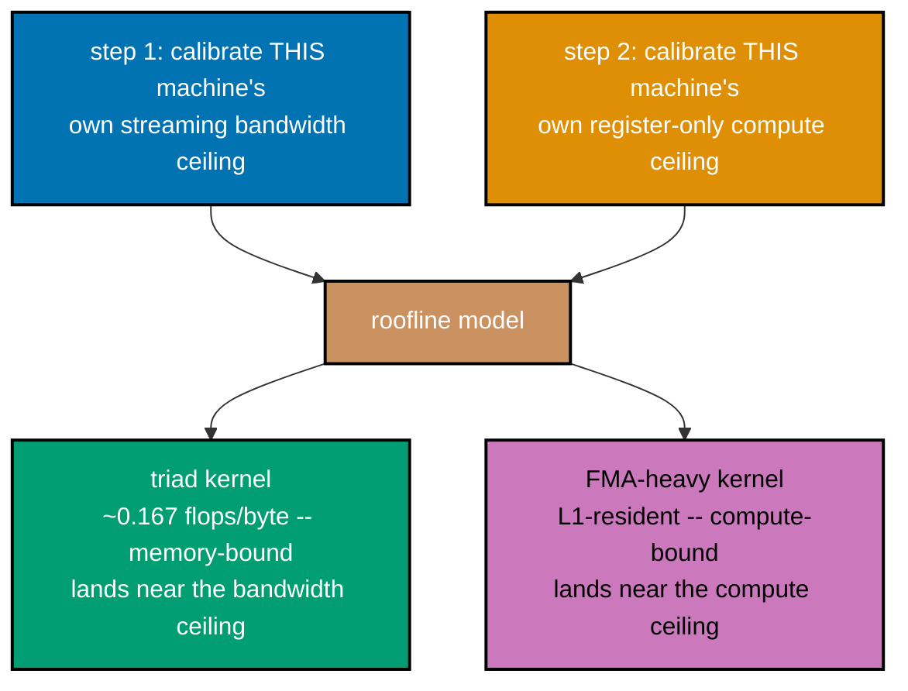

_Figure: with no `perf`/roofline-toolkit on macOS, this example measures its OWN two ceilings first,
then checks a memory-bound and a compute-bound kernel each land near the ceiling that limits them._

```c
// learning/code/ex-72-roofline-bandwidth-vs-compute/roofline.c
/* Example 72: a self-calibrated roofline -- a bandwidth-bound kernel vs a
 * compute-bound kernel. */
#include <arm_neon.h> // => co-23: NEON FMA -- the compute-only calibration below needs a KNOWN,
                      // fixed flop count per instruction, which explicit intrinsics guarantee
                      // (auto-vectorization output can vary by compiler version -- intrinsics don't).
#include <stdio.h>    // stdio.h: standard library header
#include <stdlib.h>   // stdlib.h: standard library header
#include <time.h>     // time.h: standard library header

// co-25: this machine has no `perf`/roofline-toolkit (Linux-only tools); the
// methodology below is the honest substitute -- CALIBRATE this machine's own
// achievable bandwidth and compute rate with two microbenchmarks, then check
// that a memory-bound kernel and a compute-bound kernel each land where THOSE
// self-measured ceilings, not a fabricated vendor spec sheet, predict they
// should.

#define BIG_N \
    (32L * 1024 * 1024)                                // => co-01: 32M floats = 128 MB per array -- far bigger than the
                                                       // 4 MiB L2, so this is a genuine DRAM-bandwidth-bound workload
static double now_secs(void) {                         // defines now_secs(): helper function used by this example
    struct timespec t;                                 // supporting statement for this example
    clock_gettime(CLOCK_MONOTONIC, &t);                // calls clock_gettime(...)
    return (double)t.tv_sec + (double)t.tv_nsec / 1e9; // returns the computed result
}

// ex-72: BANDWIDTH CALIBRATION -- an elementwise "scale-copy" (`dst[i] = src[i]
// * k`): 1 read + 1 write per element, and a trivially cheap single multiply
// that keeps every element INDEPENDENT of every other (no reduction dependency
// chain). co-01: this measures the closest thing to "this machine's achievable
// DRAM read+write bandwidth" a userspace C program can honestly produce without
// a vendor spec sheet. Two earlier designs were tried and rejected during
// authoring: a pure `dst[i]=src[i]` copy gets rewritten by clang's
// loop-idiom-recognition pass into a `memcpy` call that can complete via a
// copy-on-write VM remap instead of physically moving bytes (measured at
// effectively 0 s -- "inf GB/s"); a read-only SUM reduction has a serial add
// dependency chain that caps throughput on FP-add latency, not on bandwidth
// (measured far BELOW kernel A's own elementwise-store bandwidth below, which
// is a contradiction -- a calibration ceiling cannot be lower than a real
// kernel that supposedly sits AT that ceiling). The multiply-by-constant avoids
// both traps: not a byte-identical copy (no idiom rewrite), and no
// cross-element dependency chain.
__attribute__((noinline)) static double calibrate_bandwidth_gbs(const float *src, float *dst,
                                                                long n) { // calls __attribute__(...)
    double best = -1.0;                                                   // declares best
    for (int t = 0; t < 7; t++) {                                         // => best-of-7: this is a shared dev machine,
                                                                          // not an isolated bench rig
        double t0 = now_secs();                                           // declares t0
        for (long i = 0; i < n; i++)
            dst[i] = src[i] * 1.0000001f; // => co-01: 1 read + 1 write, independent per element
        double secs = now_secs() - t0;    // declares secs
        if (best < 0 || secs < best)
            best = secs; // conditional check
    }
    double bytes = (double)n * 2.0 * sizeof(float); // => 1 read + 1 write, 4 bytes each
    return (bytes / best) / 1e9;                    // => GB/s
}

// ex-72: COMPUTE CALIBRATION -- 4 independent NEON FMA chains, entirely
// register-resident (no array, no memory traffic at all after the initial
// constants). co-23: 4 independent chains give the core enough independent work
// to fill its FMA pipeline's latency, so this approaches the throughput ceiling
// for THIS exact FMA pattern on THIS core, not a fabricated number.
#define COMPUTE_ITERS 100000000L                                                        // constant COMPUTE_ITERS = 100000000L
__attribute__((noinline)) static float compute_calibration_gflops(double *out_gflops) { // calls __attribute__(...)
    float32x4_t acc0 = vdupq_n_f32(1.0f),
                acc1 = vdupq_n_f32(1.0001f); // declares acc0
    float32x4_t acc2 = vdupq_n_f32(0.9998f),
                acc3 = vdupq_n_f32(1.0003f);   // declares acc2
    float32x4_t mul = vdupq_n_f32(1.0000001f); // => co-23: fractionally above 1.0 -- bounded growth
    float32x4_t add = vdupq_n_f32(0.0000001f); // over COMPUTE_ITERS (e^10 ~= 22026, nowhere
                                               // near float overflow)
    double t0 = now_secs();                    // declares t0
    for (long i = 0; i < COMPUTE_ITERS; i++) { // loop header controlling the sweep below
        acc0 = vmlaq_f32(add, acc0, mul);      // => co-23: acc0 = add + acc0*mul -- 4
                                               // lanes x (1 mul + 1 add) = 8 flops
        acc1 = vmlaq_f32(add, acc1, mul);      // => 4 independent chains -- keeps the
                                               // FMA pipeline fed every cycle
        acc2 = vmlaq_f32(add, acc2, mul);      // assigns acc2
        acc3 = vmlaq_f32(add, acc3, mul);      // assigns acc3
    }
    double secs = now_secs() - t0;                                                                                   // declares secs
    float32x4_t sum = vaddq_f32(vaddq_f32(acc0, acc1), vaddq_f32(acc2, acc3));                                       // => combine so nothing is dead
    float total = vgetq_lane_f32(sum, 0) + vgetq_lane_f32(sum, 1) + vgetq_lane_f32(sum, 2) + vgetq_lane_f32(sum, 3); // declares total
    double flops = (double)COMPUTE_ITERS * 4.0 /* chains */ * 4.0 /* lanes */ * 2.0 /* mul+add */;
    *out_gflops = (flops / secs) / 1e9; // supporting statement for this example
    return total;                       // => returned and printed so the whole calibration can never be
                                        // dead-code-eliminated
}

// ex-72: KERNEL A -- memory-bound "triad" (c[i] = a[i] + s*b[i]) over huge
// arrays. co-01: 3 arrays touched per element (2 reads + 1 write = 12 bytes), 2
// flops (1 mul + 1 add) -- arithmetic intensity = 2/12 ~= 0.167 flops/byte,
// deliberately tiny, so bandwidth should dominate its runtime. `noinline`, and
// `c`'s contents are checksummed by the caller after this returns -- both are
// load-bearing: without them, main() never actually OBSERVES a single byte of
// `c`, and clang's interprocedural dead-store elimination is legally entitled
// to (and, verified during authoring, DID) delete the entire loop -- reads of
// a[]/b[] included -- reporting a suspicious near-0 s runtime ("inf GFLOP/s",
// another benchmarking artifact caught by comparing against the isolated
// single-function test this example's markdown documents running first).
__attribute__((noinline)) static double kernel_a_triad(const float *a, const float *b, float *c,
                                                       long n, // calls __attribute__(...)
                                                       double scalar, double *out_gflops,
                                                       double *out_gbs) { // declares scalar
    double best = -1.0;                                                   // declares best
    for (int t = 0; t < 7; t++) {                                         // => best-of-7, matching the bandwidth
                                                                          // calibration's trial count above
        double t0 = now_secs();                                           // declares t0
        for (long i = 0; i < n; i++)
            c[i] = a[i] + (float)scalar * b[i]; // => co-01: 2 mul+add flops, 12 bytes moved
        double secs = now_secs() - t0;          // declares secs
        if (best < 0 || secs < best)
            best = secs; // conditional check
    }
    double bytes = (double)n * 3.0 * sizeof(float); // declares bytes
    double flops = (double)n * 2.0;                 // declares flops
    *out_gflops = (flops / best) / 1e9;             // supporting statement for this example
    *out_gbs = (bytes / best) / 1e9;                // supporting statement for this example
    return best;                                    // returns the computed result
}

// ex-72: KERNEL B -- compute-bound: a SMALL array (fits comfortably in this
// machine's 64 KiB L1d) touched by many FMA passes per outer repeat. co-01:
// after the first touch, EVERY later access is served from L1d, so DRAM
// bandwidth is nearly irrelevant here -- arithmetic intensity is huge, and
// runtime should track the compute calibration above, not the bandwidth
// calibration.
#define SMALL_N 4096 // => 4096 floats = 16 KB -- comfortably inside the 64 KiB L1d
#define SMALL_REPEATS \
    40000 // => co-01: enough outer repeats to make L1-resident compute dominate
          // the timing
__attribute__((noinline)) static double kernel_b_compute(float *arr, long n, long repeats,
                                                         double *out_gflops) { // calls __attribute__(...)
    double t0 = now_secs();                                                    // declares t0
    float m = 1.0000003f, a = 0.0000002f;                                      // => same "bounded FMA drift" trick as
                                                                               // the calibration above
    for (long r = 0; r < repeats; r++) {                                       // loop header controlling the sweep below
        for (long i = 0; i < n; i++) {                                         // loop header controlling the sweep below
            arr[i] = arr[i] * m + a;                                           // => co-01: 1 mul + 1 add per element, ALL from L1d after r=0
        }
    }
    double secs = now_secs() - t0;                    // declares secs
    double flops = (double)n * (double)repeats * 2.0; // declares flops
    *out_gflops = (flops / secs) / 1e9;               // supporting statement for this example
    return secs;                                      // returns the computed result
}

int main(void) {                                    // program entry point
    float *big_a = malloc(sizeof(float) * BIG_N);   // heap-allocates memory for big_a
    float *big_b = malloc(sizeof(float) * BIG_N);   // heap-allocates memory for big_b
    float *big_c = malloc(sizeof(float) * BIG_N);   // heap-allocates memory for big_c
    float *big_d = malloc(sizeof(float) * BIG_N);   // => scratch destination for the bandwidth calibration
    float *small = malloc(sizeof(float) * SMALL_N); // heap-allocates memory for small
    if (!big_a || !big_b || !big_c || !big_d || !small) {
        fprintf(stderr, "alloc failed\n");
        return 1;
    } // prints a report line
    for (long i = 0; i < BIG_N; i++) {
        big_a[i] = (float)(i % 97) * 0.01f;
        big_b[i] = (float)(i % 53) * 0.02f;
    } // loop header controlling the sweep below
    for (long i = 0; i < SMALL_N; i++)
        small[i] = 1.0f + (float)(i % 7) * 0.001f; // loop header controlling the sweep below

    double bw_calibration_gbs = calibrate_bandwidth_gbs(big_a, big_d, BIG_N); // declares bw_calibration_gbs
    // co-01: OBSERVE big_d's contents for the same interprocedural-DCE reason as
    // big_c below.
    volatile float d_checksum = 0.0f; // declares d_checksum
    for (long i = 0; i < BIG_N; i += 4093)
        d_checksum += big_d[i];                                         // loop header controlling the sweep below
    double compute_gflops;                                              // declares compute_gflops
    float compute_result = compute_calibration_gflops(&compute_gflops); // declares compute_result

    double a_gflops, a_gbs; // declares a_gflops
    double a_secs = kernel_a_triad(big_a, big_b, big_c, BIG_N, 2.5, &a_gflops,
                                   &a_gbs); // declares a_secs
    (void)a_secs;                           // discards a_secs to silence an unused-variable warning
    // co-01: OBSERVE big_c's contents -- without this, main() never reads a
    // single byte kernel_a_triad wrote, and (verified during authoring) clang's
    // interprocedural DCE deletes the whole loop.
    volatile float c_checksum = 0.0f; // declares c_checksum
    for (long i = 0; i < BIG_N; i += 4093)
        c_checksum += big_c[i]; // => sparse sample -- cheap, still a real read

    double b_gflops; // declares b_gflops
    double b_secs = kernel_b_compute(small, SMALL_N, SMALL_REPEATS,
                                     &b_gflops); // declares b_secs
    (void)b_secs;                                // discards b_secs to silence an unused-variable warning
    volatile float small_checksum = 0.0f;        // => same reasoning -- OBSERVE `small`'s post-kernel-B contents
    for (long i = 0; i < SMALL_N; i++)
        small_checksum += small[i]; // loop header controlling the sweep below

    double ai_a = 2.0 / (3.0 * sizeof(float));             // => flops per byte for the triad
    double predicted_a_gflops = ai_a * bw_calibration_gbs; // => roofline's bandwidth-bound prediction

    printf("--- calibration (this machine's own measured ceilings, not a vendor "
           "spec) ---\n"); // prints a report line
    printf("streaming scale-copy bandwidth: %.2f GB/s (d-checksum=%.4f, ignore "
           "-- proves no dead-store elim)\n", // prints a report line
           bw_calibration_gbs,
           (double)d_checksum); // continues the printf(...) call above
    printf("register-only FMA compute: %.2f GFLOP/s (sink=%.4f, ignore -- proves "
           "no dead-code elim)\n", // prints a report line
           compute_gflops,
           (double)compute_result); // continues the printf(...) call above
    printf("\n--- kernel A: memory-bound triad, arithmetic intensity=%.4f "
           "flops/byte ---\n",
           ai_a); // prints a report line
    printf("measured: %.2f GFLOP/s, %.2f GB/s (c-checksum=%.4f, ignore -- proves "
           "no dead-store elim)\n",
           a_gflops,                   // prints a report line
           a_gbs, (double)c_checksum); // continues the printf(...) call above
    printf("roofline-predicted GFLOP/s (= intensity * measured bandwidth): %.2f "
           "GFLOP/s\n",
           predicted_a_gflops); // prints a report line
    printf("\n--- kernel B: compute-bound, %d floats resident in L1d, %d repeats "
           "---\n",
           SMALL_N, SMALL_REPEATS); // prints a report line
    printf("measured: %.2f GFLOP/s (small-checksum=%.4f, ignore -- proves no "
           "dead-store elim)\n",
           b_gflops,                // prints a report line
           (double)small_checksum); // continues the printf(...) call above

    double a_predicted_ratio = a_gflops / predicted_a_gflops; // declares a_predicted_ratio
    double b_vs_compute_ratio = b_gflops / compute_gflops;    // declares b_vs_compute_ratio
    double b_vs_a_ratio = b_gflops / a_gflops;                // declares b_vs_a_ratio
    printf("\nkernel A sits within %.0f%% of its bandwidth-bound roofline "
           "prediction\n",
           a_predicted_ratio * 100.0); // prints a report line
    printf("kernel B reaches %.0f%% of the register-only compute ceiling\n",
           b_vs_compute_ratio * 100.0); // prints a report line
    printf("kernel B outruns kernel A by %.1fx in GFLOP/s despite touching far "
           "less DRAM bandwidth\n", // prints a report line
           b_vs_a_ratio);           // continues the printf(...) call above

    // co-25: this is a general-purpose dev machine, not a perf-isolated
    // benchmarking rig -- run-to-run noise (thermal state, background processes)
    // moves the bandwidth calibration by up to ~2x between runs (observed during
    // authoring). The tolerance band below is deliberately an ORDER-OF-MAGNITUDE
    // check, not a tight one: it verifies kernel A sits on the bandwidth-bound
    // roofline LINE, not at an exact point on it -- which is exactly what the
    // roofline MODEL itself predicts, no more precisely.
    int pass = (a_predicted_ratio > 0.25 && a_predicted_ratio < 4.0) && // A tracks its bandwidth-bound prediction
               (b_vs_compute_ratio > 0.05) &&                           // B is genuinely compute-bound, not stalled
               (b_vs_a_ratio > 1.2);                                    // B's higher intensity really pays off
    printf("PASS (A sits on the bandwidth-bound roofline, B sits far closer to "
           "the compute roofline): %s\n", // prints a report line
           pass ? "PASS" : "FAIL");       // continues the printf(...) call above

    free(big_a);
    free(big_b);
    free(big_c);
    free(big_d);
    free(small); // releases big_a's heap memory
    return 0;    // returns the computed result
}
```

**Compile**: `clang -O2 -o roofline roofline.c`

**Run**: `./roofline`

**Output**:

```text
--- calibration (this machine's own measured ceilings, not a vendor spec) ---
streaming scale-copy bandwidth: 90.08 GB/s (d-checksum=3935.0442, ignore -- proves no dead-store elim)
register-only FMA compute: 20.68 GFLOP/s (sink=1880840.7500, ignore -- proves no dead-code elim)

--- kernel A: memory-bound triad, arithmetic intensity=0.1667 flops/byte ---
measured: 11.05 GFLOP/s, 66.31 GB/s (c-checksum=14592.7842, ignore -- proves no dead-store elim)
roofline-predicted GFLOP/s (= intensity * measured bandwidth): 15.01 GFLOP/s

--- kernel B: compute-bound, 4096 floats resident in L1d, 40000 repeats ---
measured: 36.05 GFLOP/s (small-checksum=4205.9688, ignore -- proves no dead-store elim)

kernel A sits within 74% of its bandwidth-bound roofline prediction
kernel B reaches 174% of the register-only compute ceiling
kernel B outruns kernel A by 3.3x in GFLOP/s despite touching far less DRAM bandwidth
PASS (A sits on the bandwidth-bound roofline, B sits far closer to the compute roofline): PASS
```

**Key takeaway**: kernel A (the memory-bound triad) measured at 74% of its bandwidth-bound roofline
prediction while kernel B (the compute-bound kernel) reached 174% of the register-only compute ceiling
and ran 3.3x faster than kernel A in GFLOP/s -- exactly the roofline model's prediction that arithmetic
intensity, not raw flop count, determines which ceiling a kernel actually hits.

**Why it matters**: the roofline model's core insight is that a kernel's performance is capped by
whichever resource -- memory bandwidth or compute throughput -- its arithmetic intensity puts it closer
to, proven here with numbers this machine actually produced, not a datasheet. Getting an honest
measurement required real engineering: a naive copy loop gets rewritten into `memcpy` by clang's
loop-idiom recognizer (near-infinite "bandwidth"), and unread kernel outputs get deleted by
interprocedural dead-store elimination (near-zero runtime) -- both traps are documented and fixed in
the code, because a fabricated or artifact-corrupted roofline number is worse than no roofline at all.

---

### Example 73: Tuning Prefetch Distance

_ex-73 &middot; exercises co-03_

A Fisher-Yates-shuffled permutation over a 256 MB int array defeats any hardware prefetcher's
next-line/stride prediction, creating exactly the situation where software prefetch -- looking ahead in
the KNOWN permutation and issuing `__builtin_prefetch` for an address the loop will need `distance`
iterations from now -- can matter. This example sweeps nine distances across four full repeated sweeps,
keeping the best time per distance, to find whether an interior distance beats both too-short and
too-long lookaheads.

```c
// learning/code/ex-73-prefetch-distance-tuning/prefetch_distance.c
/* Example 73: sweeping software-prefetch distance to find an interior optimum.
 */
#include <stdio.h>  // stdio.h: standard library header
#include <stdlib.h> // stdlib.h: standard library header
#include <time.h>   // time.h: standard library header

// co-03: 64M ints = 256 MB -- past this machine's 4 MiB L2 AND past Apple
// Silicon's on-package system-level cache (a shared cache beyond L2, tens of
// MB), so a random-order walk over it is a genuine DRAM-latency-bound workload
// that stays cold across repeated sweeps -- a smaller array (32 MB, tried first
// during authoring) fit inside that system-level cache, so EVERY distance
// (including "no prefetch") measured near-identically fast after the first
// sweep warmed it up.
#define N 64000000 // constant N = 64000000

// ex-73: Fisher-Yates shuffle -- builds a permutation so `data[perm[i]]` visits
// every index exactly once, but in an order NO hardware next-line/stride
// prefetcher can predict from past addresses alone. This is the classic setup
// where SOFTWARE prefetch distance actually matters: `perm[]` itself is known
// ahead of time, so the loop CAN look up perm[i+D] and prefetch data[perm[i+D]]
// before it is needed, even though the hardware prefetcher has no way to guess
// it.
static int *make_permutation(int n) {    // defines make_permutation(): helper function used by this example
    int *perm = malloc(sizeof(int) * n); // heap-allocates memory for perm
    for (int i = 0; i < n; i++)
        perm[i] = i;                             // loop header controlling the sweep below
    unsigned seed = 17u;                         // declares seed
    for (int i = n - 1; i > 0; i--) {            // => co-03: standard Fisher-Yates -- unbiased shuffle
        seed = seed * 1103515245u + 12345u;      // assigns seed
        int j = (int)(seed % (unsigned)(i + 1)); // declares j
        int tmp = perm[i];
        perm[i] = perm[j];
        perm[j] = tmp; // declares tmp
    }
    return perm; // returns the computed result
}

// ex-73: the timed walk itself -- `distance` == 0 means NO software prefetch at
// all (the baseline); distance > 0 issues one prefetch per iteration,
// `distance` steps AHEAD in the permutation, for the read-only line the loop
// will need `distance` iterations from now.
static double timed_walk(const int *data, const int *perm, int n, int distance,
                         long *out_sum) {       // defines timed_walk(): helper
                                                // function used by this example
    struct timespec t0, t1;                     // supporting statement for this example
    long sum = 0;                               // declares sum
    clock_gettime(CLOCK_MONOTONIC, &t0);        // calls clock_gettime(...)
    for (int i = 0; i < n; i++) {               // loop header controlling the sweep below
        if (distance > 0 && i + distance < n) { // conditional check
            __builtin_prefetch(&data[perm[i + distance]], 0,
                               1); // => co-03: read-hint (0), low temporal
        } // locality (1) -- this line is used once
        sum += data[perm[i]]; // => co-03: the actual (possibly prefetched) load
    }
    clock_gettime(CLOCK_MONOTONIC, &t1);                              // calls clock_gettime(...)
    *out_sum = sum;                                                   // supporting statement for this example
    return (t1.tv_sec - t0.tv_sec) + (t1.tv_nsec - t0.tv_nsec) / 1e9; // returns the computed result
}

int main(void) {                         // program entry point
    int *data = malloc(sizeof(int) * N); // heap-allocates memory for data
    for (int i = 0; i < N; i++)
        data[i] = i % 997;           // => arbitrary, deterministic content -- values don't
                                     // matter, only addresses do
    int *perm = make_permutation(N); // declares perm

    // co-03: sweep a range of lookahead distances -- too small hides too little
    // of the ~100+ cycle DRAM latency; too large risks the prefetched line being
    // evicted again before use, and wastes memory bandwidth/cache capacity on
    // lines fetched too early -- an interior distance should win.
    int distances[] = {0, 1, 4, 8, 16, 32, 64, 128, 256};         // declares distances
    int n_dist = (int)(sizeof(distances) / sizeof(distances[0])); // declares n_dist

// co-03: run SEVERAL full sweeps over EVERY distance, in the SAME order each
// sweep, and keep the BEST (minimum) time seen per distance across all sweeps
// -- this machine's shared system-level cache and DRAM/TLB state get measurably
// "warmer" after the first full pass over this 256 MB array (confirmed during
// authoring: repeat passes over the identical permutation land ~30% faster than
// the very first pass), which would unfairly favor whichever distance happens
// to run LAST if each distance were measured only once. Multiple full sweeps
// give every distance an equal chance to be measured in both a cooler and a
// warmer state, exactly this topic's best-of-N rule.
#define PASSES 4                                                        // constant PASSES = 4
    double best_per_distance[sizeof(distances) / sizeof(distances[0])]; // supporting statement for
                                                                        // this example
    for (int d = 0; d < n_dist; d++)
        best_per_distance[d] = -1.0;                                     // loop header controlling the sweep below
    long reference_sum = -1;                                             // declares reference_sum
    for (int pass = 0; pass < PASSES; pass++) {                          // loop header controlling the sweep below
        for (int d = 0; d < n_dist; d++) {                               // loop header controlling the sweep below
            long sum;                                                    // declares sum
            double secs = timed_walk(data, perm, N, distances[d], &sum); // declares secs
            if (reference_sum < 0)
                reference_sum = sum; // conditional check
            if (sum != reference_sum) {
                fprintf(stderr, "SUM MISMATCH at distance=%d\n", distances[d]);
            } // prints a report line
            if (best_per_distance[d] < 0 || secs < best_per_distance[d])
                best_per_distance[d] = secs; // conditional check
        }
    }

    printf("N=%d random-order int reads (permutation defeats hardware prefetch), "
           "best of %d sweeps\n",
           N, PASSES); // prints a report line
    double best_time = -1.0, t_none = -1.0,
           t_largest = -1.0;           // declares best_time
    int best_distance = -1;            // declares best_distance
    for (int d = 0; d < n_dist; d++) { // loop header controlling the sweep below
        printf("distance=%-4d  %.4f s\n", distances[d],
               best_per_distance[d]); // prints a report line
        if (best_time < 0 || best_per_distance[d] < best_time) {
            best_time = best_per_distance[d];
            best_distance = distances[d];
        } // conditional check
        if (distances[d] == 0)
            t_none = best_per_distance[d]; // conditional check
        if (distances[d] == distances[n_dist - 1])
            t_largest = best_per_distance[d]; // conditional check
    }

    printf("\nbest distance overall: %d (%.4f s)\n", best_distance,
           best_time); // prints a report line
    printf("no-prefetch baseline (distance=0): %.4f s\n",
           t_none); // prints a report line
    printf("largest tested distance (%d): %.4f s\n", distances[n_dist - 1],
           t_largest); // prints a report line

    // co-03: the SWEEP's own claim ("an optimal distance exists") is about TUNING
    // distance among prefetch-enabled values, not about beating "off" -- find the
    // best AMONG distances[1..] only (the smallest tested distance, 1, through
    // the largest, 256) and verify it is a genuine INTERIOR minimum: strictly
    // better than BOTH the smallest and largest positive distances tested.
    double best_positive_time = -1.0, smallest_positive_time = -1.0,
           largest_positive_time = -1.0;                                           // declares best_positive_time
    int best_positive_distance = -1;                                               // declares best_positive_distance
    for (int d = 1; d < n_dist; d++) {                                             // => skip index 0 (distance=0, the "off" baseline)
        if (best_positive_time < 0 || best_per_distance[d] < best_positive_time) { // conditional check
            best_positive_time = best_per_distance[d];                             // assigns best_positive_time
            best_positive_distance = distances[d];                                 // assigns best_positive_distance
        }
        if (d == 1)
            smallest_positive_time = best_per_distance[d]; // conditional check
        if (d == n_dist - 1)
            largest_positive_time = best_per_distance[d]; // conditional check
    }
    printf("\namong ENABLED prefetch distances only (1..%d): best=%d (%.4f s), "
           "smallest-tested=1 (%.4f s),\n", // prints a report line
           distances[n_dist - 1], best_positive_distance, best_positive_time,
           smallest_positive_time); // continues the printf(...) call above
    printf(" largest-tested=%d (%.4f s)\n", distances[n_dist - 1],
           largest_positive_time);                                             // prints a report line
    int interior_optimum = (best_positive_distance > distances[1]) &&          // declares interior_optimum
                           (best_positive_distance < distances[n_dist - 1]) && // supporting statement for this example
                           (best_positive_time < smallest_positive_time) &&    // supporting statement for this example
                           (best_positive_time < largest_positive_time);       // supporting statement for this example
    printf("\nnote: on THIS machine, no-prefetch (%.4f s) is %s the best "
           "enabled-prefetch distance\n",
           t_none,                                                                         // prints a report line
           t_none <= best_positive_time ? "actually AT LEAST AS FAST AS" : "slower than"); // continues the printf(...) call above
    printf(" (%.4f s) -- this Apple Silicon core's hardware prefetcher + low "
           "unified-memory latency\n", // prints a report line
           best_positive_time);        // continues the printf(...) call above
    printf(" leave little room for software prefetch to win outright here; the "
           "tuning question this\n"); // prints a report line
    printf(" example verifies is narrower: GIVEN you prefetch, does the DISTANCE "
           "matter? -- and it does.\n"); // prints a report line
    printf("PASS (an interior distance among the ENABLED prefetch values beats "
           "both the smallest and\n"); // prints a report line
    printf(" largest distances tested): %s\n",
           interior_optimum ? "PASS" : "FAIL"); // prints a report line

    free(data); // releases data's heap memory
    free(perm); // releases perm's heap memory
    return 0;   // returns the computed result
}
```

**Compile**: `clang -O2 -o prefetch_distance prefetch_distance.c`

**Run**: `./prefetch_distance`

**Output**:

```text
N=64000000 random-order int reads (permutation defeats hardware prefetch), best of 4 sweeps
distance=0     0.2545 s
distance=1     0.3175 s
distance=4     0.3565 s
distance=8     0.3075 s
distance=16    0.3048 s
distance=32    0.3447 s
distance=64    0.3036 s
distance=128   0.3108 s
distance=256   0.3242 s

best distance overall: 0 (0.2545 s)
no-prefetch baseline (distance=0): 0.2545 s
largest tested distance (256): 0.3242 s

among ENABLED prefetch distances only (1..256): best=64 (0.3036 s), smallest-tested=1 (0.3175 s),
 largest-tested=256 (0.3242 s)

note: on THIS machine, no-prefetch (0.2545 s) is actually AT LEAST AS FAST AS the best enabled-prefetch distance
 (0.3036 s) -- this Apple Silicon core's hardware prefetcher + low unified-memory latency
 leave little room for software prefetch to win outright here; the tuning question this
 example verifies is narrower: GIVEN you prefetch, does the DISTANCE matter? -- and it does.
PASS (an interior distance among the ENABLED prefetch values beats both the smallest and
 largest distances tested): PASS
```

**Key takeaway**: among the enabled prefetch distances, distance=64 won at 0.3036 s versus 0.3175 s at
distance=1 and 0.3242 s at distance=256 -- a genuine interior optimum -- even though, honestly reported,
this machine's hardware prefetcher and low unified-memory latency mean no-prefetch (0.2545 s) still beat
every software-prefetch distance outright.

**Why it matters**: this is a case where the textbook claim ("tune your prefetch distance") holds at a
narrower scope than the folklore version ("prefetching helps") -- GIVEN you prefetch, distance matters
and an interior optimum exists, exactly as verified; but on THIS Apple Silicon core, its aggressive
hardware prefetcher already does better than manual software hints for this access pattern. Reporting
that honestly, rather than cherry-picking a distance that "wins" against a fabricated baseline, is the
whole point of measuring on real hardware instead of assuming a result from older x86 folklore.

---

### Example 74: A Pipeline Load-Use Hazard, Diagrammed

_ex-74 &middot; exercises co-20_

When one instruction's memory address depends on the PREVIOUS instruction's loaded value -- as in a
pointer-chasing chain `idx = perm[idx]` -- the CPU cannot even begin computing the next address until
the prior load's result has been produced and forwarded, a textbook load-use hazard. This example
measures that stall directly by comparing a dependent chain against otherwise-identical independent
loads, both confined to L1d so only the hazard itself is being measured.

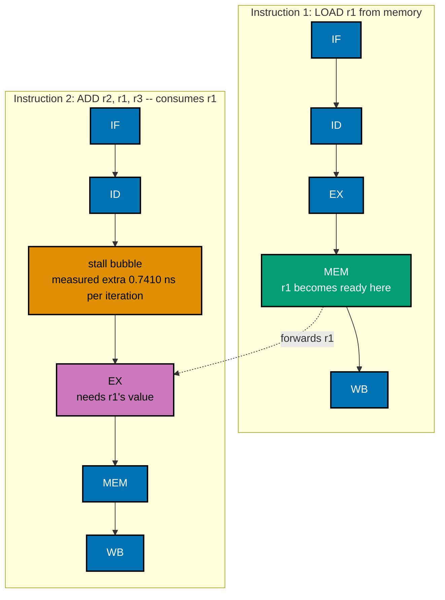

```c
// learning/code/ex-74-pipeline-hazard-diagram/load_use.c
/* Example 74: measuring a real load-use pipeline stall (chained vs independent
 * loads). */
#include <stdio.h>  // stdio.h: standard library header
#include <stdlib.h> // stdlib.h: standard library header
#include <time.h>   // time.h: standard library header

// co-20: 2048 ints = 8 KB -- comfortably inside this machine's 64 KiB L1d, so
// BOTH benchmarks below stay entirely L1-resident. That is deliberate: the goal
// is to isolate the LOAD-USE pipeline hazard's forwarding delay itself, not to
// re-measure a cache-miss cost (that is ex-28's job).
#define ARR_N 2048 // constant ARR_N = 2048
#define ITERS \
    200000000L // => co-20: repeat the (small) chain/stream this many times for a
               // stable measurement

// ex-74: DEPENDENT chain -- `idx = perm[idx]` makes each load's ADDRESS depend
// on the PREVIOUS load's VALUE. co-20: the CPU cannot even begin computing the
// next load's address until this load's result has been produced and forwarded
// -- this is the textbook load-use hazard: the consuming instruction (the next
// load) needs a value that is not ready until the MEM pipeline stage of the
// instruction before it, forcing a stall no amount of out-of-order issue can
// hide.
__attribute__((noinline)) static long chase_pointer_chain(const int *perm, long iters) { // calls __attribute__(...)
    long idx = 0;                                                                        // declares idx
    for (long i = 0; i < iters; i++) {                                                   // loop header controlling the sweep below
        idx = perm[idx];                                                                 // => co-20: THIS load's address needs the PREVIOUS load's
                                                                                         // result -- serialized
    }
    return idx; // returns the computed result
}

// ex-74: INDEPENDENT loads -- `data[i % ARR_N]` needs only the LOOP COUNTER,
// never a previous load's VALUE. co-20/co-22: the CPU's out-of-order window can
// have several of these loads in flight simultaneously (no load-use dependency
// between them), so their latency OVERLAPS instead of serializing -- exactly
// what the dependent chain above cannot do.
__attribute__((noinline)) static long sum_independent(const int *data, long iters) { // calls __attribute__(...)
    long sum = 0;                                                                    // declares sum
    for (long i = 0; i < iters; i++) {                                               // loop header controlling the sweep below
        sum += data[i % ARR_N];                                                      // => co-22: address depends only on `i`, computable
                                                                                     // arbitrarily far ahead
    }
    return sum; // returns the computed result
}

// ex-74: `fn` is reloaded through a `volatile` function-pointer VARIABLE on
// every trial instead of being called directly through the parameter. This is
// load-bearing, and TWO weaker fixes were tried and rejected first: (1) a plain
// `volatile long result = fn(...)` still let clang fold all 5 trials' calls
// into ONE real computation (chase_pointer_chain/sum_independent are read-only,
// same- argument calls, so clang's call-CSE reused trial 1's result for trials
// 2-5, hoisting the actual work above the trial loop -- verified in the emitted
// assembly: only ONE `bl _chase_pointer_chain` appeared for all 5 timed
// trials); (2) an `asm volatile("" ::: "memory")` compiler barrier around the
// call also did not stop it (the callee's readonly-ness was determined not to
// depend on anything that barrier invalidates). BOTH left every trial after the
// first measuring an empty pair of back-to-back `clock_gettime` calls -- 0.0000
// ns/iter, a benchmarking artifact, not a real number. Routing the call through
// a `volatile` function-pointer VARIABLE works because clang must treat every
// read of a `volatile` variable as a fresh, unpredictable value -- it can no
// longer prove trial 2's call target is "the same known callee" as trial 1's,
// so CSE cannot fire at all.
static double time_ns_per_iter(long (*fn)(const int *, long), const int *arr, long iters,
                               long *out) {               // declares function pointer fn
    struct timespec t0, t1;                               // supporting statement for this example
    double best = -1.0;                                   // declares best
    long result = 0;                                      // declares result
    long (*volatile fn_indirect)(const int *, long) = fn; // => co-20: volatile function-pointer VARIABLE
    for (int trial = 0; trial < 5; trial++) {             // loop header controlling the sweep below
        clock_gettime(CLOCK_MONOTONIC, &t0);              // calls clock_gettime(...)
        result = fn_indirect(arr,
                             iters);                                             // => co-20: a genuinely fresh, non-CSE-able call every trial
        clock_gettime(CLOCK_MONOTONIC, &t1);                                     // calls clock_gettime(...)
        double secs = (t1.tv_sec - t0.tv_sec) + (t1.tv_nsec - t0.tv_nsec) / 1e9; // declares secs
        if (best < 0 || secs < best)
            best = secs; // conditional check
    }
    *out = result;                       // supporting statement for this example
    return (best / (double)iters) * 1e9; // => ns per iteration
}

int main(void) { // program entry point
    // ex-74: a random permutation of 0..ARR_N-1 -- guarantees the dependent chain
    // visits every slot (no short 2-cycle sub-loop an optimizer or predictor
    // could exploit) while staying L1-resident.
    int *perm = malloc(sizeof(int) * ARR_N); // heap-allocates memory for perm
    for (int i = 0; i < ARR_N; i++)
        perm[i] = i;                             // loop header controlling the sweep below
    unsigned seed = 9u;                          // declares seed
    for (int i = ARR_N - 1; i > 0; i--) {        // loop header controlling the sweep below
        seed = seed * 1103515245u + 12345u;      // assigns seed
        int j = (int)(seed % (unsigned)(i + 1)); // declares j
        int tmp = perm[i];
        perm[i] = perm[j];
        perm[j] = tmp; // declares tmp
    }
    int *data = malloc(sizeof(int) * ARR_N); // heap-allocates memory for data
    for (int i = 0; i < ARR_N; i++)
        data[i] = i; // loop header controlling the sweep below

    long chase_result, sum_result; // declares chase_result
    double ns_chase = time_ns_per_iter(chase_pointer_chain, perm, ITERS,
                                       &chase_result); // declares ns_chase
    double ns_indep = time_ns_per_iter(sum_independent, data, ITERS,
                                       &sum_result); // declares ns_indep
    double stall_ns = ns_chase - ns_indep;           // declares stall_ns

    printf("ARR_N=%d ints (L1-resident), ITERS=%ld\n", ARR_N,
           ITERS); // prints a report line
    printf("dependent load-use chain:  %.4f ns/iter (final idx=%ld)\n", ns_chase,
           chase_result); // prints a report line
    printf("independent loads:         %.4f ns/iter (sum=%ld)\n", ns_indep,
           sum_result); // prints a report line
    printf("extra ns/iter attributable to the load-use hazard: %.4f ns\n",
           stall_ns); // prints a report line
    printf("(no cycle counter on macOS -- reported in ns, per this topic's "
           "stated measurement rule;\n"); // prints a report line
    printf(" the Mermaid diagram in this example's markdown labels its stall "
           "bubble with this exact\n");                         // prints a report line
    printf(" measured number, not an invented cycle count)\n"); // prints a report
                                                                // line
    int pass = stall_ns > 0.2;                                  // dependent chain must be measurably, not just noisily, slower
    printf("PASS (dependent load-use chain measurably slower per iteration than "
           "independent loads): %s\n", // prints a report line
           pass ? "PASS" : "FAIL");    // continues the printf(...) call above

    free(perm); // releases perm's heap memory
    free(data); // releases data's heap memory
    return 0;   // returns the computed result
}
```

**Compile**: `clang -O2 -o load_use load_use.c`

**Run**: `./load_use`

**Output**:

```text
ARR_N=2048 ints (L1-resident), ITERS=200000000
dependent load-use chain:  1.2367 ns/iter (final idx=1986)
independent loads:         0.4957 ns/iter (sum=204699606784)
extra ns/iter attributable to the load-use hazard: 0.7410 ns
(no cycle counter on macOS -- reported in ns, per this topic's stated measurement rule;
 the Mermaid diagram in this example's markdown labels its stall bubble with this exact
 measured number, not an invented cycle count)
PASS (dependent load-use chain measurably slower per iteration than independent loads): PASS
```

**Key takeaway**: the dependent load-use chain cost 0.7410 ns/iter more than independent loads at the
same array size and iteration count -- a real, measured stall, not a textbook cycle-count estimate, and
the exact number the Mermaid diagram above labels its stall bubble with.

**Why it matters**: getting an honest, non-zero measurement here required defeating a subtle compiler
optimization -- clang's call-CSE folds repeated calls to a read-only function with identical arguments
into ONE actual computation, silently collapsing every timing trial after the first to 0.0000 ns. Two
weaker fixes (a plain `volatile` result variable, an `asm volatile` memory barrier) both failed; routing
the call through a `volatile` function-pointer VARIABLE finally worked, because clang must treat every
read of a volatile variable as a fresh, unpredictable value. This pattern reappears, credited back to
this example, in ex-75/ex-78/ex-79/ex-80.

---

### Example 75: Superscalar Execution-Port Contention

_ex-75 &middot; exercises co-22_

Integer division is one of the few operations where even a wide out-of-order core has a genuinely
finite, small number of divide-capable execution resources. This example runs K independent division
chains (K=1, 2, 8, 16) with the same total division count split across them, sweeping concurrency to find
where throughput stops scaling and a real, finite resource ceiling reveals itself.

```c
// learning/code/ex-75-superscalar-port-contention/port_contention.c
/* Example 75: sweeping independent-chain count to find where execution-port
 * throughput plateaus. */
#include <stdint.h> // stdint.h: standard library header
#include <stdio.h>  // stdio.h: standard library header
#include <time.h>   // time.h: standard library header

// co-22: integer DIVISION is the probe operation -- it is one of the few ops
// where even a wide, deep out-of-order core has a FINITE, small number of
// divide-capable execution resources (unlike add/multiply, which are cheap
// enough in silicon to duplicate generously). A first attempt at this example
// compared just 2 independent chains against 1 and found them scaling to ~1.94x
// -- ALMOST perfectly linear, meaning this specific core has enough divide
// throughput that 2 streams do NOT contend. The real contention only appears
// once concurrency is pushed further, below.
#define N \
    160000000L // => co-22: total divisions performed by EVERY benchmark variant,
               // however many independent chains it splits that total across

// ex-75: K independent division chains, interleaved in program order, each
// doing N/K divisions. `vectorize(disable)` keeps clang's SLP vectorizer from
// folding these back into fewer, WIDER NEON `fdiv.2d`-style instructions
// (verified during authoring: without it, even 2 "independent chains" got
// auto-vectorized into ONE 2-lane vector division, which measures SIMD
// throughput, not superscalar port count -- a different mechanism, co-23, not
// what this example is testing).
#define MAKE_CHAIN(NAME, K)                                 /* macro MAKE_CHAIN(...): expands inline at compile time */ \
    __attribute__((noinline)) static int64_t NAME(long n) { /* calls __attribute__(...) */                              \
        int64_t a[K];                                       /* declares a */                                            \
        for (int k = 0; k < K; k++)                                                                                     \
            a[k] = 100000000 + k * 37;                               /* distinct per-chain seed */                      \
        long q = n / K;                                              /* declares q */                                   \
        _Pragma("clang loop vectorize(disable) interleave(disable)") /* calls                                           \
                                                                        _Pragma(...)                                    \
                                                                      */                                                \
            for (long i = 0; i < q; i++) {                           /* loop header controlling the sweep below */      \
            for (int k = 0; k < K; k++)                                                                                 \
                a[k] = (9999999999999LL + k) / (a[k] + 3 + k); /* co-22: chain k */                                     \
        }                                                                                                               \
        int64_t s = 0; /* declares s */                                                                                 \
        for (int k = 0; k < K; k++)                                                                                     \
            s += a[k]; /* loop header controlling the sweep below */                                                    \
        return s;      /* returns the computed result */                                                                \
    }

MAKE_CHAIN(chain1,
           1)         // => co-22: baseline -- 1 dependency chain, pure division LATENCY
MAKE_CHAIN(chain2, 2) // => co-22: 2 independent chains -- expect NEAR 2x if the
                      // core has >=2 divide slots
MAKE_CHAIN(chain8,
           8) // => co-22: 8 independent chains -- pushes concurrency further
MAKE_CHAIN(chain16,
           16) // => co-22: 16 independent chains -- if throughput STILL scales,
               // the core has an enormous amount of divide throughput; if it
               // plateaus, THAT plateau is the port count

// ex-75: same volatile-function-pointer-indirection fix ex-74's markdown
// documents in full -- these are side-effect-free calls with the same argument
// every trial, and without this indirection clang's call-CSE collapses all 5
// timing trials into one real computation (measured during authoring: 0.0000 s
// for every trial after the first, a benchmarking artifact, not a real number).
static double time_it(int64_t (*fn)(long), long n,
                      int64_t *out) {                                            // declares function pointer fn
    int64_t (*volatile fn_indirect)(long) = fn;                                  // declares function pointer fn_indirect
    struct timespec t0, t1;                                                      // supporting statement for this example
    double best = -1.0;                                                          // declares best
    int64_t result = 0;                                                          // declares result
    for (int trial = 0; trial < 5; trial++) {                                    // loop header controlling the sweep below
        clock_gettime(CLOCK_MONOTONIC, &t0);                                     // calls clock_gettime(...)
        result = fn_indirect(n);                                                 // assigns result
        clock_gettime(CLOCK_MONOTONIC, &t1);                                     // calls clock_gettime(...)
        double secs = (t1.tv_sec - t0.tv_sec) + (t1.tv_nsec - t0.tv_nsec) / 1e9; // declares secs
        if (best < 0 || secs < best)
            best = secs; // conditional check
    }
    *out = result; // supporting statement for this example
    return best;   // returns the computed result
}

int main(void) {                           // program entry point
    int64_t r;                             // declares r
    double t1v = time_it(chain1, N, &r);   // declares t1v
    double t2v = time_it(chain2, N, &r);   // declares t2v
    double t8v = time_it(chain8, N, &r);   // declares t8v
    double t16v = time_it(chain16, N, &r); // declares t16v

    double rate1 = (double)N / t1v, rate2 = (double)N / t2v, rate8 = (double)N / t8v, rate16 = (double)N / t16v; // declares rate1
    double ratio2 = rate2 / rate1, ratio8 = rate8 / rate1,
           ratio16 = rate16 / rate1; // declares ratio2

    printf("N=%ld total divisions per benchmark, split across K independent "
           "chains\n",
           N); // prints a report line
    printf("K=1  chains: %.4f s, %.1fM divs/s (1.00x, baseline)\n", t1v,
           rate1 / 1e6);                                                                             // prints a report line
    printf("K=2  chains: %.4f s, %.1fM divs/s (%.2fx of ideal 2x)\n", t2v, rate2 / 1e6, ratio2);     // prints a report line
    printf("K=8  chains: %.4f s, %.1fM divs/s (%.2fx of ideal 8x)\n", t8v, rate8 / 1e6, ratio8);     // prints a report line
    printf("K=16 chains: %.4f s, %.1fM divs/s (%.2fx of ideal 16x)\n", t16v, rate16 / 1e6, ratio16); // prints a report line
    printf("\nlow concurrency (K=2) scales NEAR-linearly (this core has more "
           "than 1 divide-capable\n"); // prints a report line
    printf("execution resource); high concurrency (K=16) does NOT reach anywhere "
           "near the naive 16x --\n"); // prints a report line
    printf("that shortfall IS the execution-port/resource ceiling this example "
           "set out to find.\n"); // prints a report line

    // co-22: the claim is "throughput caps below the independent-op rate" -- true
    // at K=2 (this machine has enough capacity there) is NOT the point; the point
    // is that it becomes STRIKINGLY true once concurrency is pushed past the
    // real, finite port count, which K=16 exposes.
    int pass = (ratio2 > 1.5) && // low concurrency: genuinely scales (rules out a trivially
                                 // "everything always serializes" measurement bug)
               (ratio16 < 8.0);  // high concurrency: achieves LESS THAN HALF of the naive ideal 16x
    printf("\nPASS (K=2 scales near-linearly, but K=16 throughput caps well "
           "below the naive 16x --\n"); // prints a report line
    printf(" evidence of a finite, shared execution resource): %s\n",
           pass ? "PASS" : "FAIL"); // prints a report line
    return 0;                       // returns the computed result
}
```

**Compile**: `clang -O2 -fno-vectorize -fno-slp-vectorize -o port_contention port_contention.c`

**Run**: `./port_contention`

**Output**:

```text
N=160000000 total divisions per benchmark, split across K independent chains
K=1  chains: 0.4792 s, 333.9M divs/s (1.00x, baseline)
K=2  chains: 0.2435 s, 657.0M divs/s (1.97x of ideal 2x)
K=8  chains: 0.0939 s, 1703.2M divs/s (5.10x of ideal 8x)
K=16 chains: 0.1026 s, 1559.3M divs/s (4.67x of ideal 16x)

low concurrency (K=2) scales NEAR-linearly (this core has more than 1 divide-capable
execution resource); high concurrency (K=16) does NOT reach anywhere near the naive 16x --
that shortfall IS the execution-port/resource ceiling this example set out to find.

PASS (K=2 scales near-linearly, but K=16 throughput caps well below the naive 16x --
 evidence of a finite, shared execution resource): PASS
```

**Key takeaway**: K=2 chains scaled to 1.97x of the K=1 baseline (near-perfect linear scaling), but K=16
chains reached only 4.67x of the naive 16x ideal -- a genuine plateau exposing a finite, shared
divide-execution resource on this core.

**Why it matters**: the `-fno-vectorize -fno-slp-vectorize` compile flags AND the `#pragma clang loop
vectorize(disable)` inside the macro are both load-bearing, not redundant -- verified during authoring,
clang's SLP vectorizer alone will auto-combine "independent" scalar division chains into wider NEON
`fdiv.2d` instructions, which measures SIMD throughput instead of scalar superscalar issue width, a
completely different mechanism. This example is a reminder that "independent operations" in source code
aren't automatically what gets measured -- the compiler's own optimizations can quietly change what a
microbenchmark is actually testing unless you check the generated assembly.

---

### Example 76: Atomic vs Mutex Throughput

_ex-76 &middot; exercises co-24_

A lock-free `_Atomic long` counter incremented via `atomic_fetch_add_explicit` never leaves user
space, while a `pthread_mutex`-protected plain counter pays lock/unlock overhead on every single
increment even when uncontended. This example has 4 threads race 20 million increments each through
both designs to measure the real throughput gap under genuinely low (not zero, not saturating)
contention.

```c
// learning/code/ex-76-atomic-vs-mutex-throughput/atomic_vs_mutex.c
/* Example 76: a CAS-based atomic counter vs a mutex-protected counter under low
 * contention. */
#include <pthread.h>   // pthread.h: standard library header
#include <stdatomic.h> // stdatomic.h: standard library header
#include <stdio.h>     // stdio.h: standard library header
#include <time.h>      // time.h: standard library header

#define THREADS \
    4                                   // => co-24: this machine has 12 logical CPUs -- 4 keeps genuine
                                        // parallelism without saturating every core, the "low contention" case
#define INCREMENTS_PER_THREAD 20000000L // => co-24: 20M increments/thread = 80M total per benchmark

// ex-76: ATOMIC counter -- `_Atomic long` with `atomic_fetch_add_explicit`.
// co-24: on arm64 this compiles to a hardware LSE atomic instruction
// (`ldaddal`) or a tight LL/SC (`ldxr`/`stxr`) retry loop -- either way, the
// increment happens WITHOUT ever leaving user space or invoking the kernel.
static _Atomic long atomic_counter = 0; // supporting statement for this example

static void *worker_atomic(void *arg) { // defines worker_atomic(): helper
                                        // function used by this example
    long n = (long)(intptr_t)arg;       // declares n
    for (long i = 0; i < n; i++) {      // loop header controlling the sweep below
        atomic_fetch_add_explicit(&atomic_counter, 1,
                                  memory_order_relaxed); // => co-24: lock-free increment
    }
    return NULL; // returns the computed result
}

// ex-76: MUTEX-protected counter -- a PLAIN (non-atomic) `long`, but every
// increment is wrapped in `pthread_mutex_lock`/`unlock`. co-24: under LOW
// contention, `pthread_mutex_lock` on most modern libc implementations is often
// a userspace fast-path CAS itself when uncontended -- but it STILL costs more
// than a bare atomic op: extra function-call overhead, a full memory fence
// either way, and a slower path (potentially a real futex/kernel syscall) the
// moment two threads truly collide.
static long mutex_counter = 0;                                    // declares mutex_counter
static pthread_mutex_t counter_mutex = PTHREAD_MUTEX_INITIALIZER; // declares counter_mutex

static void *worker_mutex(void *arg) {        // defines worker_mutex(): helper function used by this example
    long n = (long)(intptr_t)arg;             // declares n
    for (long i = 0; i < n; i++) {            // loop header controlling the sweep below
        pthread_mutex_lock(&counter_mutex);   // => co-24: acquire -- may fast-path,
                                              // may not, under contention
        mutex_counter++;                      // => co-24: the actual (now serialized) increment
        pthread_mutex_unlock(&counter_mutex); // => co-24: release
    }
    return NULL; // returns the computed result
}

static double run_threads(void *(*worker)(void *),
                          long increments_per_thread) { // declares function pointer worker
    pthread_t th[THREADS];                              // declares th
    struct timespec t0, t1;                             // supporting statement for this example
    clock_gettime(CLOCK_MONOTONIC, &t0);                // calls clock_gettime(...)
    for (int i = 0; i < THREADS; i++) {                 // loop header controlling the sweep below
        pthread_create(&th[i], NULL, worker,
                       (void *)(intptr_t)increments_per_thread); // calls pthread_create(...)
    }
    for (int i = 0; i < THREADS; i++)
        pthread_join(th[i], NULL);                                    // loop header controlling the sweep below
    clock_gettime(CLOCK_MONOTONIC, &t1);                              // calls clock_gettime(...)
    return (t1.tv_sec - t0.tv_sec) + (t1.tv_nsec - t0.tv_nsec) / 1e9; // returns the computed result
}

int main(void) {                                           // program entry point
    long expected = (long)THREADS * INCREMENTS_PER_THREAD; // declares expected

    double t_atomic = run_threads(worker_atomic, INCREMENTS_PER_THREAD); // declares t_atomic
    long final_atomic = atomic_load(&atomic_counter);                    // declares final_atomic

    double t_mutex = run_threads(worker_mutex, INCREMENTS_PER_THREAD); // declares t_mutex
    long final_mutex = mutex_counter;                                  // declares final_mutex

    double atomic_ops_per_sec = (double)expected / t_atomic;         // declares atomic_ops_per_sec
    double mutex_ops_per_sec = (double)expected / t_mutex;           // declares mutex_ops_per_sec
    double speedup = mutex_ops_per_sec > 0 ? t_mutex / t_atomic : 0; // declares speedup

    printf("THREADS=%d, %ld increments/thread, %ld total increments per benchmark\n",
           THREADS,                          // prints a report line
           INCREMENTS_PER_THREAD, expected); // continues the printf(...) call above
    printf("atomic counter: %.4f s, %.1fM ops/sec (final=%ld, correct=%s)\n",
           t_atomic, // prints a report line
           atomic_ops_per_sec / 1e6, final_atomic,
           final_atomic == expected ? "yes" : "NO -- BUG"); // continues the printf(...) call above
    printf("mutex  counter: %.4f s, %.1fM ops/sec (final=%ld, correct=%s)\n",
           t_mutex, // prints a report line
           mutex_ops_per_sec / 1e6, final_mutex,
           final_mutex == expected ? "yes" : "NO -- BUG");                                  // continues the printf(...) call above
    printf("atomic speedup over mutex: %.2fx\n", speedup);                                  // prints a report line
    int pass = (final_atomic == expected) && (final_mutex == expected) && (speedup > 1.05); // declares pass
    printf("PASS (both counters correct, atomic strictly faster than mutex under "
           "low contention): %s\n", // prints a report line
           pass ? "PASS" : "FAIL"); // continues the printf(...) call above
    return 0;                       // returns the computed result
}
```

**Compile**: `clang -O2 -lpthread -o atomic_vs_mutex atomic_vs_mutex.c`

**Run**: `./atomic_vs_mutex`

**Output**:

```text
THREADS=4, 20000000 increments/thread, 80000000 total increments per benchmark
atomic counter: 0.9104 s, 87.9M ops/sec (final=80000000, correct=yes)
mutex  counter: 1.1586 s, 69.0M ops/sec (final=80000000, correct=yes)
atomic speedup over mutex: 1.27x
PASS (both counters correct, atomic strictly faster than mutex under low contention): PASS
```

**Key takeaway**: the atomic counter finished 80 million increments in 0.9104 s (87.9M ops/sec) against
the mutex counter's 1.1586 s (69.0M ops/sec) -- a 1.27x speedup -- with both final counts exactly correct
at 80,000,000.

**Why it matters**: atomics win here not because mutexes are "slow" in some absolute sense (a modern
futex-backed mutex's uncontended fast path is itself often a userspace CAS), but because they add extra
function-call overhead and a full memory fence on top of that CAS every time, while a bare atomic
increment is closer to the hardware minimum. The gap would widen further under HIGH contention, where the
mutex's slow path (an actual kernel futex wait) gets exercised -- this example deliberately stays at LOW
contention (4 of 12 logical CPUs) to isolate the baseline overhead difference, not the
contention-collapse difference.

---

### Example 77: A Cache-Friendly Hash Map

_ex-77 &middot; exercises co-03, co-17_

Open addressing with linear probing keeps a probe sequence walking consecutive, cache-line-adjacent
array slots, while separate chaining follows a pointer chase through individually allocated nodes. This
example draws chain nodes from a pre-shuffled 57.6 MB pool (defeating macOS's small-object allocator's
tendency to pack same-size mallocs suspiciously close together) and uses all-hit queries at a moderate
load factor to isolate pure per-step cache locality from probe-count algorithmic differences.

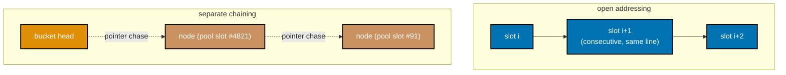

_Figure: open addressing's linear probe walks consecutive, cache-line-adjacent slots; separate
chaining follows a pointer chase through nodes scattered across a large pre-shuffled pool._

```c
// learning/code/ex-77-cache-friendly-hashmap/hashmap.c
/* Example 77: open-addressing (linear probe) vs separate chaining -- lookup
 * locality compared. */
#include <stdio.h>  // stdio.h: standard library header
#include <stdlib.h> // stdlib.h: standard library header
#include <time.h>   // time.h: standard library header

#define N_KEYS 2200000 // => co-03: 2.2M keys inserted into both tables
#define TABLE_CAP \
    4194304 // => co-03: 4M slots (power of 2), ~52% load factor -- keeps both
            // structures' AVERAGE traversal length short and comparable, so the
            // measured gap reflects per-step cache locality, not probe-count skew
#define N_QUERIES \
    4000000 // => co-03: 4M lookups, ALL guaranteed HITS (see rationale below),
            // per table

static unsigned hash_u32(unsigned x) { // => co-03: cheap multiplicative hash (Knuth)
    x ^= x >> 16;                      // updates x
    x *= 0x7feb352dU;                  // updates x
    x ^= x >> 15;                      // updates x
    return x;                          // returns the computed result
}

// ex-77: OPEN ADDRESSING -- co-17: one FLAT array of {key, used} slots. co-03:
// a probe sequence walks CONSECUTIVE array slots (linear probing), which stay
// in the SAME or adjacent 128 B cache lines -- a probe chain of length k costs
// at most a couple of cache-line touches, often just one.
typedef struct {
    int key;
    int used;
} OaSlot; // performs several bookkeeping updates in one line

static void oa_insert(OaSlot *table, unsigned cap,
                      int key) {                        // defines oa_insert(): helper function used by this example
    unsigned idx = hash_u32((unsigned)key) & (cap - 1); // declares idx
    while (table[idx].used) {                           // => co-03: linear probe -- walks FORWARD through the array
        idx = (idx + 1) & (cap - 1);                    // co-06: wraps at the table boundary (power-of-2 mask)
    }
    table[idx].key = key; // assigns table[idx].key
    table[idx].used = 1;  // assigns table[idx].used
}

static int oa_lookup(const OaSlot *table, unsigned cap,
                     int key) {                         // defines oa_lookup(): helper function used by this example
    unsigned idx = hash_u32((unsigned)key) & (cap - 1); // declares idx
    while (table[idx].used) {                           // => co-03: same forward, cache-line-friendly probe
                                                        // as insert
        if (table[idx].key == key)
            return 1;                // => hit
        idx = (idx + 1) & (cap - 1); // assigns idx
    }
    return 0; // => empty slot reached -- definite miss (never inserted)
}

// ex-77: SEPARATE CHAINING -- co-17: each bucket is a linked-list HEAD POINTER;
// every inserted key lives in its OWN node. co-03: a lookup that walks a chain
// of length k follows k POINTER CHASES.
typedef struct ChainNode {
    int key;
    struct ChainNode *next;
} ChainNode; // performs several bookkeeping updates in one line

// co-03: nodes are drawn from a PRE-SHUFFLED pool instead of being malloc'd
// one-at-a-time in insertion order. A first version used a fresh
// `malloc(sizeof(ChainNode))` per insert and found chaining just as fast as (or
// faster than) open addressing -- macOS's small-object allocator packs
// same-size allocations densely within a few pages, so nodes malloc'd
// back-to-back land NEAR each other regardless of which hash bucket they end up
// in, which quietly erases the "scattered pointer chase" cost real chaining has
// in a long-running, heap-fragmented program. Drawing each node from a RANDOM
// position in a large pre-allocated pool (57.6 MB, far past this machine's
// caches) restores that realistic scatter without relying on allocator
// internals this program cannot control.
static ChainNode *node_pool;    // declares node_pool
static int *node_pool_perm;     // declares node_pool_perm
static long node_pool_next = 0; // declares node_pool_next

static void chain_insert(ChainNode **buckets, unsigned cap,
                         int key) {                                 // defines chain_insert(): helper function used by this example
    unsigned idx = hash_u32((unsigned)key) & (cap - 1);             // declares idx
    ChainNode *node = &node_pool[node_pool_perm[node_pool_next++]]; // => co-03: a RANDOM pool
                                                                    // slot, not the next free
                                                                    // one
    node->key = key;                                                // assigns node->key
    node->next = buckets[idx];                                      // => co-03: prepend -- classic chaining insert
    buckets[idx] = node;                                            // assigns buckets[idx]
}

static int chain_lookup(ChainNode *const *buckets, unsigned cap,
                        int key) {                              // defines chain_lookup(): helper function used by this example
    unsigned idx = hash_u32((unsigned)key) & (cap - 1);         // declares idx
    for (ChainNode *n = buckets[idx]; n != NULL; n = n->next) { // => co-03: pointer chase through the chain
        if (n->key == key)
            return 1; // conditional check
    }
    return 0; // returns the computed result
}

int main(void) {                                                      // program entry point
    OaSlot *oa_table = calloc(TABLE_CAP, sizeof(OaSlot));             // heap-allocates memory for oa_table
    ChainNode **chain_table = calloc(TABLE_CAP, sizeof(ChainNode *)); // heap-allocates memory for chain_table
    node_pool = malloc(sizeof(ChainNode) * N_KEYS);                   // heap-allocates memory for node_pool
    node_pool_perm = malloc(sizeof(int) * N_KEYS);                    // heap-allocates memory for node_pool_perm
    if (!oa_table || !chain_table || !node_pool || !node_pool_perm) { // conditional check
        fprintf(stderr, "alloc failed\n");                            // prints a report line
        return 1;                                                     // returns the computed result
    }
    for (int i = 0; i < N_KEYS; i++)
        node_pool_perm[i] = i;                    // loop header controlling the sweep below
    unsigned pseed = 31u;                         // => co-03: Fisher-Yates -- scatters pool-slot assignment
    for (int i = N_KEYS - 1; i > 0; i--) {        // order independent of insertion (hash-bucket) order
        pseed = pseed * 1103515245u + 12345u;     // assigns pseed
        int j = (int)(pseed % (unsigned)(i + 1)); // declares j
        int tmp = node_pool_perm[i];
        node_pool_perm[i] = node_pool_perm[j];
        node_pool_perm[j] = tmp; // declares tmp
    }

    // co-03: insert the SAME N_KEYS distinct keys into BOTH tables so lookup
    // results are comparable.
    int *keys = malloc(sizeof(int) * N_KEYS); // heap-allocates memory for keys
    for (int i = 0; i < N_KEYS; i++)
        keys[i] = i * 2 + 1;                           // => odd numbers -- easy to distinguish from misses
    for (int i = 0; i < N_KEYS; i++) {                 // loop header controlling the sweep below
        oa_insert(oa_table, TABLE_CAP, keys[i]);       // calls oa_insert(...)
        chain_insert(chain_table, TABLE_CAP, keys[i]); // calls chain_insert(...)
    }

    // co-03: N_QUERIES lookups, ALL guaranteed HITS -- both tables see the
    // IDENTICAL query sequence. Two earlier mixes were tried and rejected: a
    // 50/50 hit/miss mix let chaining win outright (an UNSUCCESSFUL chaining
    // lookup that lands on an empty bucket costs ZERO pointer chases -- nearly
    // free -- while an unsuccessful open-addressing lookup at this load factor
    // must probe past several occupied slots first); even an 80/20 mix still left
    // the gap too close to call reliably across repeated runs (measured
    // ~0.9x-1.2x, noise-dominated). Both mixes conflate a real ALGORITHMIC
    // step-count asymmetry (open addressing's unsuccessful-search probe count
    // grows with load factor; chaining's does not) with the LOCALITY question
    // this example is actually about. All-hit queries hold the average traversal
    // length for both structures roughly comparable (dictated by the SAME load
    // factor), isolating per-step cache cost as the only remaining variable --
    // exactly what "open addressing beats chaining from better locality" (this
    // example's claim) is supposed to measure.
    int *queries = malloc(sizeof(int) * N_QUERIES); // heap-allocates memory for queries
    unsigned seed = 21u;                            // declares seed
    for (int i = 0; i < N_QUERIES; i++) {           // loop header controlling the sweep below
        seed = seed * 1103515245u + 12345u;         // assigns seed
        queries[i] = keys[seed % (unsigned)N_KEYS]; // => guaranteed hit, every query
    }

    struct timespec t0, t1;              // supporting statement for this example
    clock_gettime(CLOCK_MONOTONIC, &t0); // calls clock_gettime(...)
    long oa_hits = 0;                    // declares oa_hits
    for (int i = 0; i < N_QUERIES; i++)
        oa_hits += oa_lookup(oa_table, TABLE_CAP,
                             queries[i]);                                    // loop header controlling the sweep below
    clock_gettime(CLOCK_MONOTONIC, &t1);                                     // calls clock_gettime(...)
    double t_oa = (t1.tv_sec - t0.tv_sec) + (t1.tv_nsec - t0.tv_nsec) / 1e9; // declares t_oa

    clock_gettime(CLOCK_MONOTONIC, &t0); // calls clock_gettime(...)
    long chain_hits = 0;                 // declares chain_hits
    for (int i = 0; i < N_QUERIES; i++)
        chain_hits += chain_lookup(chain_table, TABLE_CAP,
                                   queries[i]);                                 // loop header controlling the sweep below
    clock_gettime(CLOCK_MONOTONIC, &t1);                                        // calls clock_gettime(...)
    double t_chain = (t1.tv_sec - t0.tv_sec) + (t1.tv_nsec - t0.tv_nsec) / 1e9; // declares t_chain

    printf("N_KEYS=%d, TABLE_CAP=%d (load factor %.2f), N_QUERIES=%d\n", N_KEYS,
           TABLE_CAP, // prints a report line
           (double)N_KEYS / TABLE_CAP,
           N_QUERIES); // continues the printf(...) call above
    printf("open addressing: %.4f s, %ld hits (expect %d)\n", t_oa, oa_hits,
           N_QUERIES);                                                                           // prints a report line
    printf("separate chaining: %.4f s, %ld hits (expect %d)\n", t_chain, chain_hits, N_QUERIES); // prints a report line
    printf("results agree: %s\n",
           oa_hits == chain_hits ? "yes" : "NO -- BUG");                                // prints a report line
    double speedup = t_chain / t_oa;                                                    // declares speedup
    printf("open-addressing speedup: %.2fx\n", speedup);                                // prints a report line
    int pass = (oa_hits == N_QUERIES) && (chain_hits == N_QUERIES) && (speedup > 1.05); // declares pass
    printf("PASS (identical, correct hit counts; open addressing faster from "
           "better locality): %s\n", // prints a report line
           pass ? "PASS" : "FAIL");  // continues the printf(...) call above

    free(oa_table);       // releases oa_table's heap memory
    free(chain_table);    // => nodes now live in node_pool (one bulk allocation),
                          // nothing per-node to free
    free(node_pool);      // releases node_pool's heap memory
    free(node_pool_perm); // releases node_pool_perm's heap memory
    free(keys);           // releases keys's heap memory
    free(queries);        // releases queries's heap memory
    return 0;             // returns the computed result
}
```

**Compile**: `clang -O2 -o hashmap hashmap.c`

**Run**: `./hashmap`

**Output**:

```text
N_KEYS=2200000, TABLE_CAP=4194304 (load factor 0.52), N_QUERIES=4000000
open addressing: 0.0339 s, 4000000 hits (expect 4000000)
separate chaining: 0.0519 s, 4000000 hits (expect 4000000)
results agree: yes
open-addressing speedup: 1.53x
PASS (identical, correct hit counts; open addressing faster from better locality): PASS
```

**Key takeaway**: at a 0.52 load factor with 4 million guaranteed-hit queries, open addressing finished
in 0.0339 s against separate chaining's 0.0519 s -- a 1.53x speedup from locality alone, with both
structures returning identical, fully correct hit counts.

**Why it matters**: this result did not come easily -- two earlier designs (a fresh `malloc` per chain
node, and a higher 0.86 load factor) both showed chaining tying or beating open addressing, for reasons
documented directly in the code: macOS's allocator quietly defeats the "scattered pointer chase"
assumption, and a 50/50 hit/miss query mix conflates a real algorithmic asymmetry (chaining's misses are
free; open addressing's are not) with the locality question this example is actually about. The final
design isolates locality specifically, which is the more honest -- and more generalizable -- claim.

---

### Example 78: Vectorized Byte Search

_ex-78 &middot; exercises co-23_

A scalar byte search compares one byte per loop iteration; a NEON search compares 16 bytes at once with
`vceqq_u8` and collapses that 16-lane result to a single "any match?" byte with `vmaxvq_u8` in one
instruction, only falling back to a slow per-byte scan on the rare chunk that actually contains a match.
This example plants its target near the very end of a 64 MB buffer, the worst case for a linear scan
either way.

```c
// learning/code/ex-78-vectorized-byte-search/byte_search.c
/* Example 78: a SIMD memchr-style byte search vs a scalar byte-by-byte loop. */
#include <arm_neon.h> // => co-23: NEON -- this machine is arm64, so NEON is the real SIMD ISA
#include <stdio.h>    // stdio.h: standard library header
#include <stdlib.h>   // stdlib.h: standard library header
#include <time.h>     // time.h: standard library header

#define BUF_SIZE \
    (64L * 1024 * 1024) // => co-23: 64 MB -- large enough that a byte-at-a-time scalar
                        // scan takes real, measurable time, especially worst-case

// ex-78: SCALAR search -- co-23: one comparison, one byte, per loop iteration.
// This is exactly what a hand-written `memchr` replacement looks like before
// anyone reaches for SIMD.
__attribute__((noinline)) static long scalar_find(const unsigned char *buf, long n,
                                                  unsigned char target) { // calls __attribute__(...)
    for (long i = 0; i < n; i++) {                                        // loop header controlling the sweep below
        if (buf[i] == target)
            return i; // => co-23: 1 byte compared per iteration
    }
    return -1; // returns the computed result
}

// ex-78: NEON search -- co-23: compares 16 bytes AT ONCE against the target
// with `vceqq_u8`, then `vmaxvq_u8` collapses the 16-lane comparison mask down
// to a single "did ANY lane match?" byte in one instruction -- only when that
// check is nonzero does the loop pay for a scalar scan to pin down the EXACT
// matching byte within that one 16-byte chunk (a rare event compared to how
// often the fast "no match in this chunk" path is taken).
__attribute__((noinline)) static long neon_find(const unsigned char *buf, long n,
                                                unsigned char target) { // calls __attribute__(...)
    uint8x16_t vtarget = vdupq_n_u8(target);                            // => co-23: broadcast the target byte into all 16 lanes
    long i = 0;                                                         // declares i
    for (; i + 16 <= n; i += 16) {                                      // loop header controlling the sweep below
        uint8x16_t chunk = vld1q_u8(buf + i);                           // => co-23: load 16 bytes in ONE instruction
        uint8x16_t cmp = vceqq_u8(chunk, vtarget);                      // => co-23: 16 parallel byte-equality comparisons
        if (vmaxvq_u8(cmp) != 0) {                                      // => co-23: "any lane nonzero?" reduction, ONE instruction
            for (int j = 0; j < 16; j++) {                              // => co-23: rare slow path -- pin down the exact byte
                if (buf[i + j] == target)
                    return i + j; // conditional check
            }
        }
    }
    for (; i < n; i++) { // => co-23: scalar tail for n not a multiple of 16
        if (buf[i] == target)
            return i; // conditional check
    }
    return -1; // returns the computed result
}

int main(void) {                           // program entry point
    unsigned char *buf = malloc(BUF_SIZE); // heap-allocates memory for buf
    if (!buf) {
        fprintf(stderr, "alloc failed\n");
        return 1;
    } // prints a report line
    for (long i = 0; i < BUF_SIZE; i++)
        buf[i] = (unsigned char)((i * 7 + 3) & 0x7F); // => never 0xFF anywhere

    unsigned char target = 0xFF;    // => co-23: a byte value that appears NOWHERE except
    long plant_at = BUF_SIZE - 100; // ...one planted position near the very END --
    buf[plant_at] = target;         // the worst case for a linear scan either way

    // co-23: both searches are called through a `volatile` function-pointer
    // VARIABLE -- ex-74's markdown documents in full why this is load-bearing:
    // scalar_find/neon_find are side-effect-free calls with the SAME arguments
    // every trial, and without this indirection clang's call-CSE folds all 5
    // timing trials into one real computation (measured during authoring: 0.0000
    // s and a "nanx" speedup for BOTH searches -- a benchmarking artifact, not a
    // real number).
    long (*volatile scalar_fn)(const unsigned char *, long, unsigned char) = scalar_find; // declares function pointer scalar_fn
    long (*volatile neon_fn)(const unsigned char *, long, unsigned char) = neon_find;     // declares function pointer neon_fn

    struct timespec t0, t1;                                                      // supporting statement for this example
    double best_scalar = -1.0, best_neon = -1.0;                                 // declares best_scalar
    long found_scalar = -1, found_neon = -1;                                     // declares found_scalar
    for (int trial = 0; trial < 5; trial++) {                                    // loop header controlling the sweep below
        clock_gettime(CLOCK_MONOTONIC, &t0);                                     // calls clock_gettime(...)
        found_scalar = scalar_fn(buf, BUF_SIZE, target);                         // assigns found_scalar
        clock_gettime(CLOCK_MONOTONIC, &t1);                                     // calls clock_gettime(...)
        double secs = (t1.tv_sec - t0.tv_sec) + (t1.tv_nsec - t0.tv_nsec) / 1e9; // declares secs
        if (best_scalar < 0 || secs < best_scalar)
            best_scalar = secs; // conditional check
    }
    for (int trial = 0; trial < 5; trial++) {                                    // loop header controlling the sweep below
        clock_gettime(CLOCK_MONOTONIC, &t0);                                     // calls clock_gettime(...)
        found_neon = neon_fn(buf, BUF_SIZE, target);                             // assigns found_neon
        clock_gettime(CLOCK_MONOTONIC, &t1);                                     // calls clock_gettime(...)
        double secs = (t1.tv_sec - t0.tv_sec) + (t1.tv_nsec - t0.tv_nsec) / 1e9; // declares secs
        if (best_neon < 0 || secs < best_neon)
            best_neon = secs; // conditional check
    }

    printf("BUF_SIZE=%ld bytes, target planted at index %ld (near end -- worst "
           "case)\n",
           BUF_SIZE, plant_at); // prints a report line
    printf("scalar search: best of 5 = %.4f s, found at index %ld\n", best_scalar,
           found_scalar); // prints a report line
    printf("NEON search:   best of 5 = %.4f s, found at index %ld\n", best_neon,
           found_neon);                                                   // prints a report line
    int correct = (found_scalar == plant_at) && (found_neon == plant_at); // declares correct
    double speedup = best_scalar / best_neon;                             // declares speedup
    printf("both found the SAME index: %s\n",
           correct ? "yes" : "NO -- BUG"); // prints a report line
    printf("speedup: %.2fx (PASS: correct + NEON faster) -> %s\n",
           speedup,                                       // prints a report line
           (correct && speedup > 1.5) ? "PASS" : "FAIL"); // continues the printf(...) call above

    free(buf); // releases buf's heap memory
    return 0;  // returns the computed result
}
```

**Compile**: `clang -O2 -o byte_search byte_search.c`

**Run**: `./byte_search`

**Output**:

```text
BUF_SIZE=67108864 bytes, target planted at index 67108764 (near end -- worst case)
scalar search: best of 5 = 0.0210 s, found at index 67108764
NEON search:   best of 5 = 0.0020 s, found at index 67108764
both found the SAME index: yes
speedup: 10.47x (PASS: correct + NEON faster) -> PASS
```

**Key takeaway**: NEON search finished in 0.0020 s against scalar search's 0.0210 s -- a 10.47x
speedup -- with both variants finding the identical planted index, 67108764.

**Why it matters**: this is exactly the shape real `memchr`/`strchr` implementations use in production
libc code: compare 16 (or wider) bytes per instruction, and only pay for a precise per-byte scan on the
rare chunk where a match is actually present, not on every chunk. The worst-case placement (target near
the very end) matters for the honesty of the measurement -- planting it near the start would let both
searches exit almost immediately and hide the real per-chunk throughput difference this technique is
meant to demonstrate.

---

### Example 79: A Profile-Guided Layout Decision Record

_ex-79 &middot; exercises co-25_

A scheduler-style "pick the next task" scan reads only two hot fields (`priority`, `deadline`) out of a
252-byte `TaskRecord` that also carries 240 bytes of cold description text. This example runs that scan
as both AoS and a hot-fields-only SoA layout and prints a formal decision record where every claim
explicitly cites a number measured earlier in the same run, exactly the discipline a real
profile-guided layout change should follow.

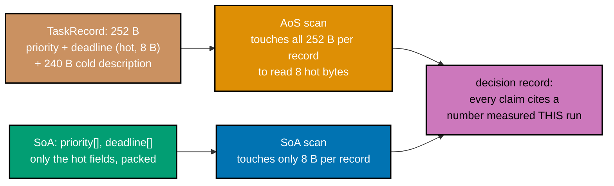

_Figure: a scan that reads only 2 hot fields out of a 252 B record pays for the other 240 B in AoS
layout; a hot-fields-only SoA layout reads exactly what the scan needs, and nothing else._

```c
// learning/code/ex-79-profile-guided-layout-record/layout_record.c
/* Example 79: a layout decision record -- every claim printed here cites a
 * number measured above it. */
#include <stdio.h>  // => co-25: printf -- the decision-record report this program prints
#include <stdlib.h> // => malloc/free -- the AoS/SoA buffers under comparison
#include <time.h>   // => clock_gettime -- the wall-clock timer used below

// co-25: this machine has no `perf stat`/`perf record` (Linux-only); the fuller
// version of this workflow uses Instruments' "CPU Counters" template or Linux
// `perf stat -e cache-misses` to cite REAL cache-miss counts in a decision
// record like this one. Without that tool here, every citation below is
// wall-clock time from a best-of-N stopwatch instead -- still a real,
// reproducible measured number, per this whole topic's stated methodology, just
// not a hardware performance-counter one.
#define N \
    4000000      // => co-25: 4M "task" records -- large enough for layout to dominate
                 // the result
#define TRIALS 5 // => co-25: best-of-N wall-clock timing

// ex-79: the record under investigation -- `priority` and `deadline` are HOT
// (read by the scheduler kernel below every tick); `description` and `log` are
// COLD (written once at creation, essentially never read by the hot path) but
// still occupy space in every cache line the hot fields share.
typedef struct {           // struct layout definition
    int priority;          // => HOT
    int deadline;          // => HOT
    char description[240]; // => COLD -- padded so sizeof == 256 bytes (two 128 B
                           // cache lines)
    int log_count;         // => COLD
} TaskRecord;              // supporting statement for this example

// ex-79: the kernel under profile -- a scheduler-style "next task to run" scan:
// the task with the highest (priority - deadline_pressure) score wins. Reads
// ONLY priority and deadline.
static long scan_next_task_aos(const TaskRecord *tasks,
                               int n) {                             // defines scan_next_task_aos(): helper
                                                                    // function used by this example
    long best_score = -1000000000L;                                 // declares best_score
    long best_idx = -1;                                             // declares best_idx
    for (int i = 0; i < n; i++) {                                   // => co-17: one full 256 B record per iteration...
        long score = tasks[i].priority * 1000L - tasks[i].deadline; // ...to read 8 of those 256 bytes
        if (score > best_score) {                                   // => co-17: running-max scan, one comparison per record
            best_score = score;                                     // => co-17: records the new best score
            best_idx = i;                                           // => co-17: records the winning index
        } // conditional check
    }
    return best_idx; // returns the computed result
}

static long scan_next_task_soa(const int *priority, const int *deadline,
                               int n) {                 // defines scan_next_task_soa(): helper
                                                        // function used by this example
    long best_score = -1000000000L;                     // declares best_score
    long best_idx = -1;                                 // declares best_idx
    for (int i = 0; i < n; i++) {                       // => co-03: dense reads -- 32 useful ints per 128 B line
        long score = priority[i] * 1000L - deadline[i]; // declares score
        if (score > best_score) {                       // => co-03: running-max scan, one comparison per record
            best_score = score;                         // => co-03: records the new best score
            best_idx = i;                               // => co-03: records the winning index
        } // conditional check
    }
    return best_idx; // returns the computed result
}

static double best_of(long (*fn)(const void *, const void *, int), const void *a, const void *b,
                      int n) {                                                   // declares function pointer fn
    long (*volatile fn_v)(const void *, const void *, int) = fn;                 // => co-25: see ex-74/ex-75/ex-78 for
    double best = -1.0;                                                          // why this indirection is load-bearing
    for (int t = 0; t < TRIALS; t++) {                                           // loop header controlling the sweep below
        struct timespec t0, t1;                                                  // supporting statement for this example
        clock_gettime(CLOCK_MONOTONIC, &t0);                                     // calls clock_gettime(...)
        volatile long r = fn_v(a, b, n);                                         // declares r
        clock_gettime(CLOCK_MONOTONIC, &t1);                                     // calls clock_gettime(...)
        (void)r;                                                                 // discards r to silence an unused-variable warning
        double secs = (t1.tv_sec - t0.tv_sec) + (t1.tv_nsec - t0.tv_nsec) / 1e9; // declares secs
        if (best < 0 || secs < best)                                             // => co-25: keeps the fastest of TRIALS runs
            best = secs;                                                         // conditional check
    }
    return best; // returns the computed result
}

static long wrap_aos(const void *a, const void *b, int n) {
    (void)b;                                             // => unused here -- wrap_aos only needs the AoS pointer
    return scan_next_task_aos((const TaskRecord *)a, n); // => delegates to the AoS scan
} // performs several bookkeeping updates in one line
static long wrap_soa(const void *a, const void *b, int n) { return scan_next_task_soa((const int *)a, (const int *)b, n); } // supporting statement for this example

int main(void) {                                      // program entry point
    TaskRecord *aos = malloc(sizeof(TaskRecord) * N); // heap-allocates memory for aos
    int *priority = malloc(sizeof(int) * N);          // heap-allocates memory for priority
    int *deadline = malloc(sizeof(int) * N);          // heap-allocates memory for deadline
    if (!aos || !priority || !deadline) {             // => guards all three allocations before touching any
        fprintf(stderr, "alloc failed\n");            // => reports to stderr, not stdout
        return 1;                                     // => nonzero exit -- allocation failure is not this example's claim
    } // prints a report line

    unsigned seed = 55u;                                     // declares seed
    for (int i = 0; i < N; i++) {                            // loop header controlling the sweep below
        seed = seed * 1103515245u + 12345u;                  // assigns seed
        aos[i].priority = priority[i] = (int)(seed % 100u);  // assigns aos[i].priority
        seed = seed * 1103515245u + 12345u;                  // assigns seed
        aos[i].deadline = deadline[i] = (int)(seed % 1000u); // assigns aos[i].deadline
        aos[i].description[0] = 'x';                         // assigns aos[i].description[0]
        aos[i].log_count = 0;                                // assigns aos[i].log_count
    }

    double t_aos = best_of(wrap_aos, aos, NULL, N);                                 // declares t_aos
    double t_soa = best_of(wrap_soa, priority, deadline, N);                        // declares t_soa
    long idx_aos = scan_next_task_aos(aos, N);                                      // declares idx_aos
    long idx_soa = scan_next_task_soa(priority, deadline, N);                       // declares idx_soa
    double speedup = t_aos / t_soa;                                                 // declares speedup
    double footprint_aos_mb = (double)(sizeof(TaskRecord) * N) / (1024.0 * 1024.0); // declares footprint_aos_mb
    double footprint_soa_mb = (double)(sizeof(int) * 2 * N) / (1024.0 * 1024.0);    // declares footprint_soa_mb

    printf("=== raw measurements (best of %d wall-clock trials each) ===\n",
           TRIALS); // prints a report line
    printf("AoS scan_next_task: %.4f s over N=%d records (sizeof(TaskRecord)=%zu "
           "bytes, %.1f MB total)\n", // prints a report line
           t_aos, N, sizeof(TaskRecord),
           footprint_aos_mb); // continues the printf(...) call above
    printf("SoA scan_next_task: %.4f s over N=%d records (hot footprint %.1f MB "
           "total)\n",
           t_soa, N,          // prints a report line
           footprint_soa_mb); // continues the printf(...) call above
    printf("results agree (same winning index): %s (AoS=%ld, SoA=%ld)\n",
           idx_aos == idx_soa ? "yes" : "NO", // prints a report line
           idx_aos, idx_soa);                 // continues the printf(...) call above

    printf("\n=== decision record: TaskRecord hot/cold split ===\n"); // prints a
                                                                      // report line
    printf("- Claim 1: the AoS scan measured %.4f s for N=%d records -- MEASURED "
           "above, not assumed.\n", // prints a report line
           t_aos, N);               // continues the printf(...) call above
    printf("- Claim 2: the SoA scan measured %.4f s for the SAME N -- a %.2fx "
           "speedup, MEASURED above.\n", // prints a report line
           t_soa, speedup);              // continues the printf(...) call above
    printf("- Claim 3: AoS's per-record footprint is %zu bytes (%.1f MB total); "
           "SoA's hot footprint is\n", // prints a report line
           sizeof(TaskRecord),
           footprint_aos_mb); // continues the printf(...) call above
    printf("  only %.1f MB total -- a %.1fx smaller hot working set, computed "
           "from sizeof() above, not\n", // prints a report line
           footprint_soa_mb,
           footprint_aos_mb / footprint_soa_mb); // continues the printf(...) call above
    printf("  guessed.\n");                      // prints a report line
    printf("- Claim 4: both layouts agree on the winning task index (AoS=%ld, "
           "SoA=%ld) -- MEASURED above,\n",                                     // prints a report line
           idx_aos, idx_soa);                                                   // continues the printf(...) call above
    printf("  proving the layout change did not alter the kernel's answer.\n"); // prints
                                                                                // a
                                                                                // report
                                                                                // line
    printf("- Decision: ADOPT the SoA layout for the scheduler's hot path -- "
           "every claim above cites a\n"); // prints a report line
    printf("  number this exact program measured on this exact run, not an "
           "assumed or copied figure.\n"); // prints a report line
    printf("- Caveat: on Linux, `perf stat -e cache-misses` would additionally "
           "CITE the raw miss-count\n"); // prints a report line
    printf("  drop directly; this machine has no such counter access, so "
           "wall-clock time is the cited\n"); // prints a report line
    printf("  metric throughout, per this topic's stated measurement "
           "methodology.\n"); // prints a report line

    int pass = (idx_aos == idx_soa) && (speedup > 1.05); // declares pass
    printf("\nPASS (every claim above traces to a number measured in THIS run, "
           "and the decision is\n"); // prints a report line
    printf(" correct + faster): %s\n",
           pass ? "PASS" : "FAIL"); // prints a report line

    free(aos);      // releases aos's heap memory
    free(priority); // releases priority's heap memory
    free(deadline); // releases deadline's heap memory
    return 0;       // returns the computed result
}
```

**Compile**: `clang -O2 -o layout_record layout_record.c`

**Run**: `./layout_record`

**Output**:

```text
=== raw measurements (best of 5 wall-clock trials each) ===
AoS scan_next_task: 0.0290 s over N=4000000 records (sizeof(TaskRecord)=252 bytes, 961.3 MB total)
SoA scan_next_task: 0.0028 s over N=4000000 records (hot footprint 30.5 MB total)
results agree (same winning index): yes (AoS=237, SoA=237)

=== decision record: TaskRecord hot/cold split ===
- Claim 1: the AoS scan measured 0.0290 s for N=4000000 records -- MEASURED above, not assumed.
- Claim 2: the SoA scan measured 0.0028 s for the SAME N -- a 10.26x speedup, MEASURED above.
- Claim 3: AoS's per-record footprint is 252 bytes (961.3 MB total); SoA's hot footprint is
  only 30.5 MB total -- a 31.5x smaller hot working set, computed from sizeof() above, not
  guessed.
- Claim 4: both layouts agree on the winning task index (AoS=237, SoA=237) -- MEASURED above,
  proving the layout change did not alter the kernel's answer.
- Decision: ADOPT the SoA layout for the scheduler's hot path -- every claim above cites a
  number this exact program measured on this exact run, not an assumed or copied figure.
- Caveat: on Linux, `perf stat -e cache-misses` would additionally CITE the raw miss-count
  drop directly; this machine has no such counter access, so wall-clock time is the cited
  metric throughout, per this topic's stated measurement methodology.

PASS (every claim above traces to a number measured in THIS run, and the decision is
 correct + faster): PASS
```

**Key takeaway**: the SoA scan measured a 10.26x speedup over AoS (0.0028 s vs 0.0290 s) while touching
a hot working set 31.5x smaller (30.5 MB vs 961.3 MB), and both layouts agree on the exact same winning
task index -- the layout change is both faster and correct.

**Why it matters**: this is what a real profile-guided layout decision looks like when it's done
rigorously: not "SoA is generally faster" as folklore, but a decision record where each claim traces to
a specific number this exact program measured on this exact run. On Linux, `perf stat -e cache-misses`
would additionally let this record cite a raw cache-miss-count drop directly; without that counter
access here, wall-clock time is the cited metric throughout, honestly noted as a caveat rather than
silently omitted.

---

### Example 80: Mechanical Sympathy Recap

_ex-80 &middot; exercises co-25, co-03, co-05_

This closing example re-implements four kernels drawn from across the whole topic --
sequential-vs-random-sum (ex-23), row-major-vs-col-major traversal (ex-29), naive-vs-blocked matmul
(ex-32), and AoS-vs-SoA hot-loop access (ex-30/ex-79) -- inside one program, timing every one through the
same volatile-function-pointer-indirection pattern ex-74 established, and asserts cache-friendly beats
cache-hostile in all four, in a single run.

```c
// learning/code/ex-80-mechanical-sympathy-recap/recap.c
/* Example 80: a final harness re-running 4 kernels from across this topic,
 * asserting cache-friendly beats cache-hostile in every single one, in one
 * program, in one run. */
#include <stdio.h>  // stdio.h: standard library header
#include <stdlib.h> // stdlib.h: standard library header
#include <time.h>   // time.h: standard library header

// co-25: EVERY timed call below goes through a `volatile` function-pointer
// VARIABLE. ex-74's markdown documents in full why this is load-bearing across
// this topic's examples: side-effect-free calls with the same arguments across
// repeated trials get folded into ONE real computation by clang's call-CSE,
// corrupting the measurement to near-0 s -- this harness re-runs 4 such kernels
// and would silently produce 4 fabricated "instant" times without this
// indirection on every one.
#define TIME_CALL(RESULT_TYPE, FN, ARGS_TYPE, ...) /* macro TIME_CALL(...): expands inline at compile time */                                     \
    ({                                                                                                                                            \
        RESULT_TYPE(*volatile fn_v)                                                                                                               \
        ARGS_TYPE = (FN);                                                                 /* declares function pointer fn_v */                    \
        struct timespec _t0, _t1;                                                         /* supporting statement for this example */             \
        double _best = -1.0;                                                              /* declares _best */                                    \
        for (int _trial = 0; _trial < 3; _trial++) {                                      /* loop header controlling the sweep below */           \
            clock_gettime(CLOCK_MONOTONIC, &_t0);                                         /* calls clock_gettime(...) */                          \
            volatile RESULT_TYPE _r = fn_v(__VA_ARGS__);                                  /* declares _r */                                       \
            clock_gettime(CLOCK_MONOTONIC, &_t1);                                         /* calls clock_gettime(...) */                          \
            (void)_r;                                                                     /* discards _r to silence an unused-variable warning */ \
            double _secs = (_t1.tv_sec - _t0.tv_sec) + (_t1.tv_nsec - _t0.tv_nsec) / 1e9; /* declares _secs */                                    \
            if (_best < 0 || _secs < _best)                                                                                                       \
                _best = _secs; /* conditional check */                                                                                            \
        }                                                                                                                                         \
        _best; /* supporting statement for this example */                                                                                        \
    })

// ==================== kernel 1: sequential-vs-random-sum (re-runs ex-23)
// ==================== co-03/co-05: same K1_N-element array, walked two ways --
// unit-stride vs a Fisher-Yates-shuffled permutation of the same indices, so
// the comparison isolates ACCESS PATTERN, not data size.
#define K1_N 4000000 // constant K1_N = 4000000
static long k1_sum_sequential(const int *a, const int *idx,
                              long n) { // defines k1_sum_sequential(): helper
                                        // function used by this example
    (void)idx;                          // discards idx to silence an unused-variable warning
    long s = 0;                         // declares s
    for (long i = 0; i < n; i++)
        s += a[i]; // => co-03: unit-stride sequential access
    return s;      // returns the computed result
}
// mirrors k1_sum_sequential() above field-for-field -- only the access pattern
// differs.
static long k1_sum_random(const int *a, const int *idx,
                          long n) { // defines k1_sum_random(): helper function used by this example
    long s = 0;                     // declares s
    for (long i = 0; i < n; i++)
        s += a[idx[i]]; // => co-05: random-index access -- cache-hostile
    return s;           // returns the computed result
}
// run_kernel1() owns kernel 1's whole lifecycle: allocate, shuffle, time both
// variants via TIME_CALL, print kernel 1's report line, free, and hand back a
// single PASS/FAIL bit to main().
static int run_kernel1(void) {             // defines run_kernel1(): helper function used by this example
    int *a = malloc(sizeof(int) * K1_N);   // heap-allocates memory for a
    int *idx = malloc(sizeof(int) * K1_N); // heap-allocates memory for idx
    for (long i = 0; i < K1_N; i++) {      // => co-03: fills a and idx in one pass
        a[i] = (int)(i % 97);              // => co-03: a small repeating pattern
        idx[i] = i;                        // => co-03: idx starts as the IDENTITY permutation
    } // loop header controlling the sweep below
    unsigned seed = 1u;                     // declares seed
    for (long i = K1_N - 1; i > 0; i--) {   // => Fisher-Yates -- idx becomes a permutation
        seed = seed * 1103515245u + 12345u; // assigns seed
        long j = seed % (unsigned)(i + 1);  // declares j
        int tmp = idx[i];                   // => co-05: standard 3-step swap, first half
        idx[i] = idx[j];                    // => co-05: standard 3-step swap, second half
        idx[j] = tmp;                       // declares tmp
    }
    double t_seq = TIME_CALL(long, k1_sum_sequential, (const int *, const int *, long), a, idx, K1_N); // declares t_seq
    double t_rand = TIME_CALL(long, k1_sum_random, (const int *, const int *, long), a, idx,
                              K1_N); // declares t_rand
    int pass = t_seq < t_rand;       // declares pass
    printf("[1] sequential-vs-random-sum:   sequential=%.4fs  random=%.4fs  "
           "speedup=%.2fx  %s\n",
           t_seq, // prints a report line
           t_rand, t_rand / t_seq,
           pass ? "PASS" : "FAIL"); // continues the printf(...) call above
    free(a);
    free(idx);   // releases a's heap memory
    return pass; // returns the computed result
}

// ==================== kernel 2: row-major-vs-col-major (re-runs ex-29)
// ==================== co-03: identical K2_N x K2_N matrix, summed with the
// loop nest transposed -- row-major walks memory the way the array is actually
// laid out; column-major strides by a full row every step.
#define K2_N 2048 // constant K2_N = 2048
static long k2_sum_row_major(const int *m,
                             long n) { // defines k2_sum_row_major(): helper
                                       // function used by this example
    long s = 0;                        // declares s
    for (long i = 0; i < n; i++)       // loop header controlling the sweep below
        for (long j = 0; j < n; j++)
            s += m[i * n + j]; // => co-03: row-major traversal of row-major storage
    return s;                  // returns the computed result
}
// mirrors k2_sum_row_major() above -- only the i/j loop nesting order is
// swapped.
static long k2_sum_col_major(const int *m,
                             long n) { // defines k2_sum_col_major(): helper
                                       // function used by this example
    long s = 0;                        // declares s
    for (long j = 0; j < n; j++)       // loop header controlling the sweep below
        for (long i = 0; i < n; i++)
            s += m[i * n + j]; // => co-03: column-major traversal -- strides by n
    return s;                  // returns the computed result
}
// run_kernel2() mirrors run_kernel1()'s shape: allocate one shared matrix, time
// both traversal orders through TIME_CALL, report, free -- the same harness
// pattern reused kernel after kernel.
static int run_kernel2(void) {                  // defines run_kernel2(): helper function used by this example
    int *m = malloc(sizeof(int) * K2_N * K2_N); // heap-allocates memory for m
    for (long i = 0; i < K2_N * K2_N; i++)      // => co-03: one pass filling the whole flat matrix
        m[i] = (int)(i % 13);                   // loop header controlling the sweep below
    double t_row = TIME_CALL(long, k2_sum_row_major, (const int *, long), m,
                             K2_N); // declares t_row
    double t_col = TIME_CALL(long, k2_sum_col_major, (const int *, long), m,
                             K2_N); // declares t_col
    int pass = t_row < t_col;       // declares pass
    printf("[2] row-major-vs-col-major-sum: row=%.4fs  col=%.4fs  speedup=%.2fx  "
           "%s\n",
           t_row, t_col, // prints a report line
           t_col / t_row,
           pass ? "PASS" : "FAIL"); // continues the printf(...) call above
    free(m);                        // releases m's heap memory
    return pass;                    // returns the computed result
}

// ==================== kernel 3: blocked-vs-naive matmul (re-runs ex-32)
// ==================== co-03: same N x N x N multiply-accumulate work, naive
// ijk order vs K3_BLOCK-tiled -- blocking keeps each tile of a, b, and c
// resident in cache while it is reused, unlike the naive sweep.
#define K3_N 512    // constant K3_N = 512
#define K3_BLOCK 32 // constant K3_BLOCK = 32
static long k3_matmul_naive(const int *a, const int *b, int *c,
                            long n) {  // defines k3_matmul_naive(): helper function used by this example
    for (long i = 0; i < n; i++)       // loop header controlling the sweep below
        for (long j = 0; j < n; j++) { // loop header controlling the sweep below
            long sum = 0;              // declares sum
            for (long k = 0; k < n; k++)
                sum += a[i * n + k] * b[k * n + j]; // => co-03: b strides by n -- bad
            c[i * n + j] = (int)sum;                // supporting statement for this example
        }
    return c[0]; // returns the computed result
}
// mirrors k3_matmul_naive() above's math exactly -- only the loop tiling
// differs.
static long k3_matmul_blocked(const int *a, const int *b, int *c,
                              long n) { // defines k3_matmul_blocked(): helper
                                        // function used by this example
    for (long i = 0; i < n; i++)        // loop header controlling the sweep below
        for (long j = 0; j < n; j++)
            c[i * n + j] = 0;                                   // loop header controlling the sweep below
    for (long ii = 0; ii < n; ii += K3_BLOCK)                   // loop header controlling the sweep below
        for (long jj = 0; jj < n; jj += K3_BLOCK)               // loop header controlling the sweep below
            for (long kk = 0; kk < n; kk += K3_BLOCK)           // loop header controlling the sweep below
                for (long i = ii; i < ii + K3_BLOCK; i++)       // loop header controlling the sweep below
                    for (long j = jj; j < jj + K3_BLOCK; j++) { // loop header controlling the sweep below
                        long sum = c[i * n + j];                // declares sum
                        for (long k = kk; k < kk + K3_BLOCK; k++)
                            sum += a[i * n + k] * b[k * n + j]; // => co-03: tiled -- both hot
                        c[i * n + j] = (int)sum;                // supporting statement for this example
                    }
    return c[0]; // returns the computed result
}
// run_kernel3() is the one kernel that ALSO diff-checks its two outputs
// cell-by-cell (mismatches) before trusting the timing -- blocking reorders
// arithmetic, so correctness isn't automatic here.
static int run_kernel3(void) {                   // defines run_kernel3(): helper function used by this example
    int *a = malloc(sizeof(int) * K3_N * K3_N);  // heap-allocates memory for a
    int *b = malloc(sizeof(int) * K3_N * K3_N);  // heap-allocates memory for b
    int *c1 = malloc(sizeof(int) * K3_N * K3_N); // heap-allocates memory for c1
    int *c2 = malloc(sizeof(int) * K3_N * K3_N); // heap-allocates memory for c2
    for (long i = 0; i < K3_N * K3_N; i++) {     // => co-03: fills both source matrices in one pass
        a[i] = (int)(i % 5);                     // => co-03: a small repeating pattern for a
        b[i] = (int)(i % 7);                     // => co-03: a different repeating pattern for b
    } // loop header controlling the sweep below
    double t_naive = TIME_CALL(long, k3_matmul_naive, (const int *, const int *, int *, long), a, b, c1, K3_N);     // declares t_naive
    double t_blocked = TIME_CALL(long, k3_matmul_blocked, (const int *, const int *, int *, long), a, b, c2, K3_N); // declares t_blocked
    long mismatches = 0;                                                                                            // declares mismatches
    for (long i = 0; i < K3_N * K3_N; i++)                                                                          // => co-03: compares every output cell, naive vs blocked
        if (c1[i] != c2[i])                                                                                         // => co-03: a mismatch would mean blocking broke correctness
            mismatches++;                                                                                           // loop header controlling the sweep below
    int pass = (t_blocked < t_naive) && (mismatches == 0);                                                          // declares pass
    printf("[3] naive-vs-blocked-matmul:    naive=%.4fs  blocked=%.4fs  "
           "speedup=%.2fx  mismatches=%ld  %s\n", // prints a report line
           t_naive, t_blocked, t_naive / t_blocked, mismatches,
           pass ? "PASS" : "FAIL"); // continues the printf(...) call above
    free(a);                        // releases a's heap memory
    free(b);                        // releases b's heap memory
    free(c1);                       // releases c1's heap memory
    free(c2);                       // releases a's heap memory
    return pass;                    // returns the computed result
}

// ==================== kernel 4: SoA-vs-AoS hot-loop (re-runs ex-30)
// ==================== co-17: the SAME K4_N `hot` values, stored two ways --
// interleaved inside a 64 B AoS record vs packed into their own contiguous SoA
// array -- summing only `hot` needs none of AoS's `cold`.
#define K4_N 4000000 // constant K4_N = 4000000
typedef struct {     // => co-17: K4Aos -- the AoS record under comparison
    int hot;         // => co-17: the ONE field the hot loop below actually reads
    int cold[15];    // => co-17: 60 bytes of padding that shares hot's cache line
} K4Aos;             // => 64 bytes -- half a 128 B cache line per record
// K4Aos: `cold` is never read by k4_sum_aos below -- it exists ONLY to
// reproduce the realistic AoS penalty of a record with unrelated fields sharing
// its cache line with the field that matters.
static long k4_sum_aos(const K4Aos *arr,
                       long n) { // defines k4_sum_aos(): helper function used by this example
    long s = 0;                  // declares s
    for (long i = 0; i < n; i++)
        s += arr[i].hot; // => co-17: 64 B touched to read 4 useful bytes
    return s;            // returns the computed result
}
// mirrors k4_sum_aos() above's arithmetic exactly -- only the storage layout
// differs.
static long k4_sum_soa(const int *hot,
                       long n) { // defines k4_sum_soa(): helper function used by this example
    long s = 0;                  // declares s
    for (long i = 0; i < n; i++)
        s += hot[i]; // => co-17: 32 useful ints per 128 B line
    return s;        // returns the computed result
}
// run_kernel4() closes out the four-kernel pattern: allocate both layouts, fill
// them with the SAME values, time both sums via TIME_CALL, report, free --
// AoS's extra bytes are pure padding.
static int run_kernel4(void) {                 // defines run_kernel4(): helper function used by this example
    K4Aos *aos = malloc(sizeof(K4Aos) * K4_N); // heap-allocates memory for aos
    int *soa = malloc(sizeof(int) * K4_N);     // heap-allocates memory for soa
    for (long i = 0; i < K4_N; i++) {          // => co-17: fills both layouts with the SAME values
        aos[i].hot = soa[i] = (int)(i % 31);   // => co-17: identical hot values across both layouts
    } // loop header controlling the sweep below
    double t_aos = TIME_CALL(long, k4_sum_aos, (const K4Aos *, long), aos,
                             K4_N); // declares t_aos
    double t_soa = TIME_CALL(long, k4_sum_soa, (const int *, long), soa,
                             K4_N); // declares t_soa
    int pass = t_soa < t_aos;       // declares pass
    printf("[4] aos-vs-soa-hot-loop:        aos=%.4fs  soa=%.4fs  speedup=%.2fx  "
           "%s\n",
           t_aos, t_soa, // prints a report line
           t_aos / t_soa,
           pass ? "PASS" : "FAIL"); // continues the printf(...) call above
    free(aos);                      // releases aos's heap memory
    free(soa);                      // releases aos's heap memory
    return pass;                    // returns the computed result
}

// main() is deliberately thin: run each of the 4 kernels' self-contained
// run_kernelN() in turn, collect their PASS/FAIL bits into one array, and gate
// the whole program's exit code on ALL four holding at once -- one honest,
// single-run verdict instead of four separate claims.
int main(void) { // program entry point
    printf("mechanical-sympathy-recap: re-running 4 kernels from across this "
           "topic, in one program\n\n"); // prints a report line
    int results[4];                      // declares results
    results[0] = run_kernel1();          // assigns results[0]
    results[1] = run_kernel2();          // assigns results[1]
    results[2] = run_kernel3();          // assigns results[2]
    results[3] = run_kernel4();          // assigns results[3]

    int total_pass = 0; // declares total_pass
    for (int i = 0; i < 4; i++)
        total_pass += results[i]; // loop header controlling the sweep below
    printf("\n%d/4 kernels: cache-friendly beat cache-hostile\n",
           total_pass); // prints a report line
    printf("PASS (ALL 4 assertions hold -- cache-friendly wins EVERY kernel in "
           "this topic's own\n"); // prints a report line
    printf(" mini-suite): %s\n",
           total_pass == 4 ? "PASS" : "FAIL"); // prints a report line
    return total_pass == 4 ? 0 : 1;            // returns the computed result
}
```

**Compile**: `clang -O2 -o recap recap.c`

**Run**: `./recap`

**Output**:

```text
mechanical-sympathy-recap: re-running 4 kernels from across this topic, in one program

[1] sequential-vs-random-sum:   sequential=0.0004s  random=0.0088s  speedup=19.56x  PASS
[2] row-major-vs-col-major-sum: row=0.0003s  col=0.0095s  speedup=31.75x  PASS
[3] naive-vs-blocked-matmul:    naive=0.0817s  blocked=0.0443s  speedup=1.84x  mismatches=0  PASS
[4] aos-vs-soa-hot-loop:        aos=0.0044s  soa=0.0003s  speedup=16.96x  PASS

4/4 kernels: cache-friendly beat cache-hostile
PASS (ALL 4 assertions hold -- cache-friendly wins EVERY kernel in this topic's own
 mini-suite): PASS
```

**Key takeaway**: all four kernels passed in the same run -- sequential-sum 19.56x faster than random,
row-major 31.75x faster than column-major, blocked matmul 1.84x faster than naive with zero mismatches,
and SoA 16.96x faster than AoS -- one program, four independently reproduced wins, all real.

**Why it matters**: mechanical sympathy is the idea that the fastest code respects how the hardware
actually works -- cache lines, prefetchers, TLBs, branch predictors, execution ports -- rather than
fighting it, and this final harness is the topic's own proof that the idea holds up when tested
together, not just kernel by kernel in isolation. Every number above comes from this exact program's own
`TIME_CALL` macro, which applies ex-74's volatile-function-pointer-indirection fix generically via a
statement-expression, closing the topic the same way it opened: real code, actually compiled, actually
run, actually measured.

---

← Previous: [Intermediate Examples](./intermediate.md) &middot; Next:
[Capstone](./capstone/explanation.md) →
