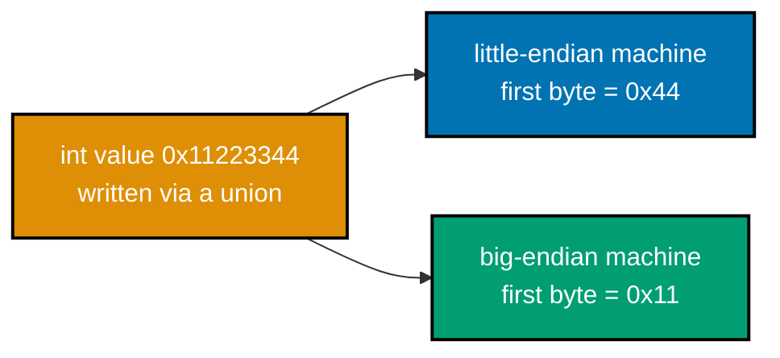
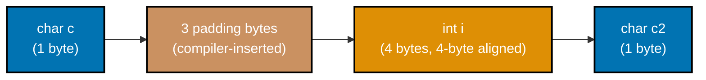
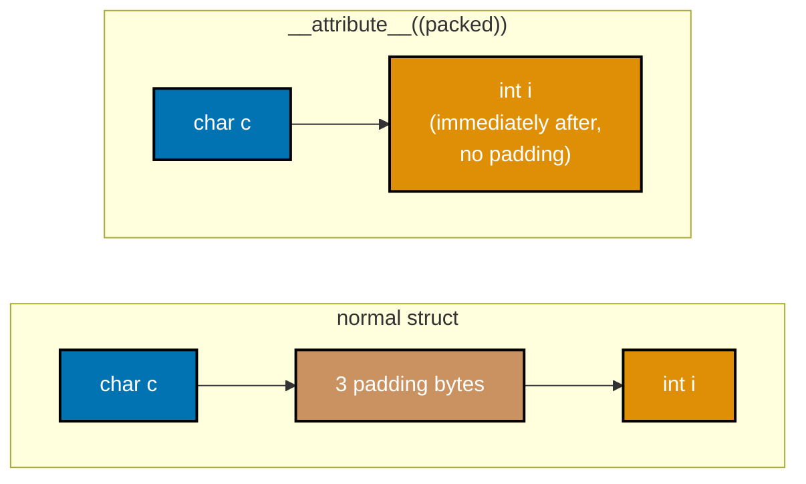
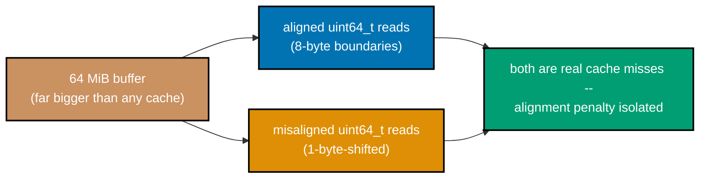
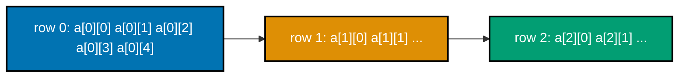
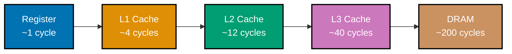
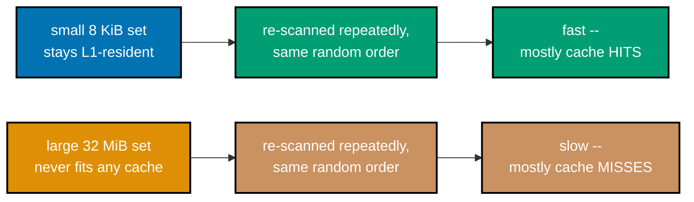
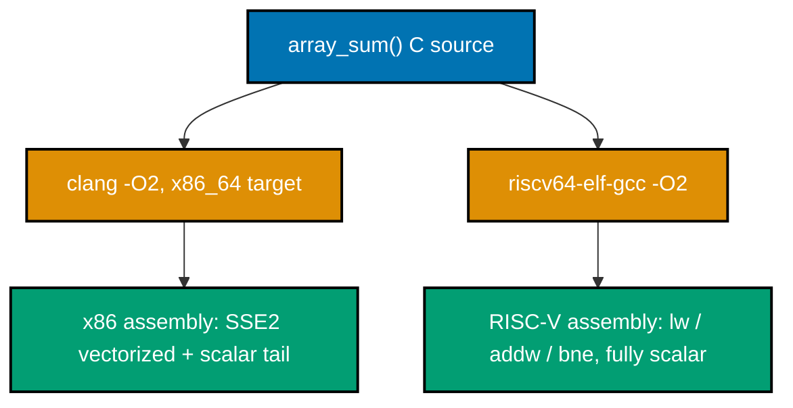

Examples 1-27 build the machine-representation bedrock this whole topic stands on: how an `int`'s
bytes are actually laid out in memory and why signed vs unsigned overflow behave completely differently
in C (co-11, co-12), how IEEE-754 floats round and why `==` on them lies (co-13, co-14), why byte order
is a real, machine-dependent fact rather than an assumption (co-15), why `sizeof` a struct can exceed
the sum of its fields and how field order changes that (co-16), how pointer arithmetic and 2-D array
indexing are scaled by `sizeof(T)` (co-17), the memory hierarchy's own latency shape and its cache-line
granularity (co-01, co-02), spatial and temporal locality measured rather than assumed (co-03, co-04),
and finally a first, deliberately small look at emitted assembly -- registers, loads, stores, and how
the exact same C compiles to genuinely different instructions on ARM, x86, and RISC-V (co-18, co-19).
Every script below is a complete, self-contained C11 file under `learning/code/ex-NN-*/`, compiled with
**Apple clang 17.0.0** (arm64, `-O2` unless stated otherwise) on this Apple Silicon dev machine
(macOS/Darwin 24.5.0, 128 B cache line, 64 KiB L1d, 4 MiB L2, 12 logical CPUs) and actually run to
capture the `**Output**` block shown -- never a fabricated transcript. Examples 25-27 compile to
assembly only (`-S`, no `main`, never linked or run) since reading emitted code, not executing it, is
the point; ex-27 additionally cross-compiles to x86-64 (clang) and RISC-V (`riscv64-elf-gcc`, a real
cross-toolchain installed on this machine) to show two genuinely different instruction sets side by
side.

---

### Example 1: Print Int Bytes

_ex-01 &middot; exercises co-11, co-15_

**co-11 -- two's complement integers**: a C `int` is stored as a fixed sequence of bytes, and casting a
pointer to `unsigned char *` lets you read those bytes directly instead of just the number they encode.
This example reinterprets a 4-byte `int32_t` as 4 raw bytes and confirms the storage order matches
two's-complement encoding read byte-by-byte -- the same byte-order fact ex-11 names explicitly as
endianness.

```c
// learning/code/ex-01-print-int-bytes/print_int_bytes.c
/* Example 1: Print Int Bytes -- reinterpret an int's storage as raw bytes. */

#include <stdint.h> // => co-11: int32_t -- a FIXED-width int, so "4 bytes" is guaranteed, not assumed
#include <stdio.h>  // => co-11: printf/puts -- the report this program prints

int main(void) {                // => co-11: single-file, no args -- fully self-contained
    int32_t value = 0x11223344; // => co-11: a value with 4 visibly DIFFERENT byte values
    // => co-11: 0x11, 0x22, 0x33, 0x44 -- chosen so byte ORDER is unambiguous in
    // the printed dump

    unsigned char *bytes = (unsigned char *)&value; // => co-11: reinterpret the 4-byte int as 4 raw bytes
    // => co-15: THIS cast is the entire lesson -- it exposes the STORAGE order,
    // not the numeric value

    printf("value        = 0x%08x (%d)\n", (unsigned)value,
           value); // => co-11: the number, as C prints it
    printf("byte[0]      = 0x%02x\n",
           bytes[0]); // => co-15: lowest ADDRESS -- first byte in memory
    printf("byte[1]      = 0x%02x\n",
           bytes[1]);                            // => co-15: second byte in memory
    printf("byte[2]      = 0x%02x\n", bytes[2]); // => co-15: third byte in memory
    printf("byte[3]      = 0x%02x\n",
           bytes[3]); // => co-15: highest ADDRESS -- last byte in memory

    // ex-01: on a LITTLE-endian machine (this one), the LEAST-significant byte
    // (0x44) is stored at the LOWEST address -- byte[0] == 0x44, not 0x11
    int little_endian_order =                       // => co-15: the assertion this program exists to
                                                    // check
        (bytes[0] == 0x44) && (bytes[1] == 0x33) && // => co-15: 0x44 first, 0x33 second (reversed order)
        (bytes[2] == 0x22) && (bytes[3] == 0x11);   // => co-15: 0x22 third, 0x11 last -- fully reversed

    printf("%s\n",
           little_endian_order // => co-15: prints the verdict this whole example
                               // proves
               ? "PASS: byte[0]=0x44 .. byte[3]=0x11 -- little-endian storage "
                 "confirmed"
               : "FAIL: byte order does not match little-endian expectation");

    return little_endian_order ? 0 : 1; // => co-11: nonzero exit signals a failed assertion
}
```

**Compile**: `clang -O2 -o print_int_bytes print_int_bytes.c`

**Run**: `./print_int_bytes`

**Output**:

```text
value        = 0x11223344 (287454020)
byte[0]      = 0x44
byte[1]      = 0x33
byte[2]      = 0x22
byte[3]      = 0x11
PASS: byte[0]=0x44 .. byte[3]=0x11 -- little-endian storage confirmed
```

**Key takeaway**: an `int`'s "value" and its "storage" are two different things -- casting to
`unsigned char *` exposes the storage, and on this machine byte[0] holds the least-significant byte,
not the most.

**Why it matters**: every later byte-order example in this topic (ex-11 through ex-13) builds on this
one reinterpret-cast technique, and every hex dump, memory debugger, or network capture you will ever
read depends on knowing which byte comes first in memory. A debugger's raw memory view (`x/4xb` in
`lldb`/`gdb`) shows exactly these bytes in exactly this order -- once you can predict that order by
hand, a hex dump stops looking like noise and starts looking like the number it encodes.

---

### Example 2: Hex-Dump Value

_ex-02 &middot; exercises co-11_

Building on ex-01's byte-reinterpretation technique, this example reconstructs a value's canonical hex
text by reading its raw bytes from most-significant to least-significant and cross-checks the
hand-built string against `printf("%x")` -- proving the two agree only once byte order is explicitly
accounted for.

```c
// learning/code/ex-02-hex-dump-value/hex_dump_value.c
/* Example 2: Hex-Dump Value -- byte-by-byte hex dump cross-checked against
 * printf("%x"). */

#include <stdint.h> // => co-11: uint32_t -- fixed-width, so nibble count is guaranteed to be 8
#include <stdio.h>  // => co-11: printf/snprintf -- builds both the dump and the reference string
#include <string.h> // => co-11: strcmp -- compares the two independently-built hex strings

int main(void) {
    uint32_t value = 0xCAFEBABEu; // => co-11: a value using every hex digit range A-F, 0-9

    unsigned char *bytes = (unsigned char *)&value; // => co-11: same reinterpret-cast technique as ex-01
    char dump[9];                                   // => co-11: 8 hex nibbles + NUL -- built byte-by-byte below
    // ex-02: reconstruct the number's canonical hex text by reading bytes
    // HIGH-to-LOW (bytes[3] is most-significant on this little-endian machine) --
    // proves the dump agrees with printf("%x") only when byte order is accounted
    // for, not read raw
    snprintf(dump, sizeof dump, "%02x%02x%02x%02x", // => co-11: writes 4 pairs of
                                                    // hex digits, MSB byte first
             bytes[3], bytes[2], bytes[1],
             bytes[0]); // => co-15: index order REVERSED vs storage -- undoes
                        // little-endian

    char reference[9]; // => co-11: the "ground truth" string from printf itself
    snprintf(reference, sizeof reference, "%08x",
             value); // => co-11: %x always prints in NUMERIC (big-endian-style) order

    printf("value            = 0x%08x\n",
           value);                                     // => co-11: the number as printf renders it
    printf("byte[3..0]       = %02x %02x %02x %02x\n", // => co-15: raw memory
                                                       // order, most-significant
                                                       // byte first here
           bytes[3], bytes[2], bytes[1], bytes[0]);
    printf("hand-built dump  = %s\n",
           dump); // => co-11: dump built from raw bytes, reordered by hand
    printf("printf(\"%%x\")     = %s\n",
           reference); // => co-11: dump built purely by printf's own formatting

    int match = strcmp(dump, reference) == 0; // => co-11: the assertion this example exists to check
    printf("%s\n",
           match // => co-11: prints PASS/FAIL based on that assertion
               ? "PASS: hand-built hex dump matches printf(\"%x\") exactly"
               : "FAIL: hand-built dump diverges from printf(\"%x\")");

    return match ? 0 : 1; // => co-11: nonzero exit on assertion failure
}
```

**Compile**: `clang -O2 -o hex_dump_value hex_dump_value.c`

**Run**: `./hex_dump_value`

**Output**:

```text
value            = 0xcafebabe
byte[3..0]       = ca fe ba be
hand-built dump  = cafebabe
printf("%x")     = cafebabe
PASS: hand-built hex dump matches printf("%x") exactly
```

**Key takeaway**: `printf("%x")` always prints in the number's natural reading order regardless of
memory layout -- reproducing that order by hand requires reading storage bytes high-to-low on this
little-endian machine.

**Why it matters**: this is the exact reasoning a hex editor or memory dumper performs internally, and
getting the byte order backward here is the single most common bug in hand-rolled binary parsers. File
format magic numbers, packet headers, and countless binary protocol fields are all read with this same
byte-by-byte reconstruction -- get the order wrong and a perfectly valid file looks corrupt, or a valid
packet gets silently misparsed.

---

### Example 3: Signed vs Unsigned Print

_ex-03 &middot; exercises co-11, co-12_

**co-12 -- integer overflow and wraparound**: the same 32 bits mean different things depending on
whether the type reading them is signed or unsigned -- `-1`'s two's-complement bit pattern (all ones)
is also the unsigned value `UINT_MAX`. This example prints one bit pattern two ways to make that
identity concrete.

```c
// learning/code/ex-03-signed-vs-unsigned-print/signed_vs_unsigned.c
/* Example 3: Signed vs Unsigned Print -- the SAME bit pattern read two ways. */

#include <stdio.h> // => co-11: printf -- %d and %u format the SAME bits with opposite meanings

int main(void) {
    int signed_value = -1; // => co-11: -1 in two's complement is ALL-ONES bits
    // => co-11: 32 ones: 0xFFFFFFFF -- no other bit pattern means -1 under two's
    // complement

    unsigned int reinterpreted = (unsigned int)signed_value; // => co-12: SAME bits, unsigned TYPE -- no bits change
    // => co-12: reinterpreting, not converting a VALUE -- the storage is
    // untouched

    printf("signed_value    (%%d) = %d\n",
           signed_value); // => co-11: prints -1, the signed reading
    printf("reinterpreted   (%%u) = %u\n",
           reinterpreted); // => co-12: prints 4294967295, the unsigned reading
    printf("signed_value    (%%u) = %u\n",
           (unsigned)signed_value); // => co-12: same bits, cast inline, same result

    // ex-03: 4294967295 is UINT_MAX == 2^32 - 1 -- the only unsigned value whose
    // bit pattern is all-ones, which is exactly what -1's two's-complement
    // encoding is
    int correct = reinterpreted == 4294967295u; // => co-12: the literal from the syllabus, checked directly
    printf("%s\n",
           correct // => co-12: PASS/FAIL verdict this example exists to print
               ? "PASS: -1 printed as %u shows 4294967295 (UINT_MAX)"
               : "FAIL: unexpected unsigned reinterpretation of -1");

    return correct ? 0 : 1; // => co-11: nonzero exit on assertion failure
}
```

**Compile**: `clang -O2 -o signed_vs_unsigned signed_vs_unsigned.c`

**Run**: `./signed_vs_unsigned`

**Output**:

```text
signed_value    (%d) = -1
reinterpreted   (%u) = 4294967295
signed_value    (%u) = 4294967295
PASS: -1 printed as %u shows 4294967295 (UINT_MAX)
```

**Key takeaway**: `-1` and `4294967295u` are the SAME 32 bits -- only the type reading them decides
whether they print as a negative number or `UINT_MAX`.

**Why it matters**: this identity is the entire reason `%u` on a negative int "looks wrong" to
beginners -- it isn't wrong, it's the honest unsigned reading of a bit pattern that two's complement
chose to double as -1. It is also why comparing a signed and an unsigned value in the same expression
is dangerous: C silently converts the signed side to unsigned first, so a negative number can suddenly
compare as enormous -- exactly the class of bug `-Wsign-compare` exists to catch.

---

### Example 4: Signed Overflow Wrap

_ex-04 &middot; exercises co-12_

C's signed integer overflow is undefined behavior by default -- the compiler is free to assume it never
happens. Compiling with `-fwrapv` turns that UB into a documented, guaranteed two's-complement
wraparound, which is what this example measures.

```c
// learning/code/ex-04-signed-overflow-wrap/signed_overflow_wrap.c
/* Example 4: Signed Overflow Wrap -- INT_MAX + 1 under -fwrapv (defined
 * wraparound). */

#include <limits.h> // => co-12: INT_MAX/INT_MIN -- the two's-complement boundary values under test
#include <stdio.h>  // => co-12: printf -- reports the wrapped value

int main(void) {
    // ex-04: THIS PROGRAM MUST BE COMPILED WITH -fwrapv (see the Compile line
    // below). Without -fwrapv, signed overflow is UNDEFINED BEHAVIOR in C -- the
    // compiler is free to assume it never happens and may optimize this
    // comparison away entirely. -fwrapv is a real, documented Clang/GCC flag that
    // turns UB into a GUARANTEED two's-complement wraparound, which is what this
    // example measures on purpose.
    int max = INT_MAX;     // => co-12: 2147483647 -- the largest representable int
    int wrapped = max + 1; // => co-12: WOULD be UB without -fwrapv; wraps here by contract

    printf("INT_MAX      = %d\n", max); // => co-12: the starting value
    printf("INT_MAX + 1  = %d\n",
           wrapped); // => co-12: the wrapped result, expected to equal INT_MIN
    printf("INT_MIN      = %d\n",
           INT_MIN); // => co-12: -2147483648 -- what two's complement predicts

    int correct = wrapped == INT_MIN; // => co-12: the wraparound assertion this example checks
    printf("%s\n", correct            // => co-12: PASS/FAIL verdict
                       ? "PASS: INT_MAX + 1 wrapped to INT_MIN under -fwrapv"
                       : "FAIL: wraparound did not match INT_MIN");
    printf("note: without -fwrapv this add is UNDEFINED BEHAVIOR, not a "
           "guaranteed wrap\n"); // => co-12: honesty note

    return correct ? 0 : 1; // => co-12: nonzero exit on assertion failure
}
```

**Compile**: `clang -O2 -fwrapv -o signed_overflow_wrap signed_overflow_wrap.c` (the `-fwrapv` flag is
required, not optional -- it is the entire point of this example)

**Run**: `./signed_overflow_wrap`

**Output**:

```text
INT_MAX      = 2147483647
INT_MAX + 1  = -2147483648
INT_MIN      = -2147483648
PASS: INT_MAX + 1 wrapped to INT_MIN under -fwrapv
note: without -fwrapv this add is UNDEFINED BEHAVIOR, not a guaranteed wrap
```

**Key takeaway**: `INT_MAX + 1` wraps to `INT_MIN` only because `-fwrapv` turns the C standard's
undefined behavior into a defined one; without it, the compiler could legally do anything, including
optimizing the check away entirely.

**Why it matters**: this is exactly the class of bug (CWE-190) behind real integer-overflow security
vulnerabilities -- ex-66 (advanced) revisits this as an allocation-size overflow that under-allocates a
buffer. Production code almost never compiles with `-fwrapv`, which means a signed-overflow check like
this one is not just cosmetically undefined -- the compiler is legally free to delete it, turning a
bounds check meant to catch the overflow into dead code that silently vanishes.

---

### Example 5: Unsigned Wraparound

_ex-05 &middot; exercises co-12_

Unlike signed overflow, unsigned overflow is fully defined by the C standard: it wraps modulo 2^n.
`0u - 1u` is the canonical demonstration -- underflowing past zero lands exactly on `UINT_MAX`.

```c
// learning/code/ex-05-unsigned-wraparound/unsigned_wraparound.c
/* Example 5: Unsigned Wraparound -- 0u - 1u, a DEFINED modulo-2^n wrap. */

#include <limits.h> // => co-12: UINT_MAX -- the expected result of underflowing past zero
#include <stdio.h>  // => co-12: printf -- reports the wrapped value

int main(void) {                      // program entry point
    unsigned int zero = 0u;           // => co-12: the smallest representable unsigned value
    unsigned int wrapped = zero - 1u; // => co-12: unsigned underflow -- DEFINED to wrap mod 2^32, no UB

    printf("0u           = %u\n", zero); // => co-12: the starting value
    printf("0u - 1u      = %u\n",
           wrapped); // => co-12: expected to equal UINT_MAX (4294967295)
    printf("UINT_MAX     = %u\n",
           UINT_MAX); // => co-12: 2^32 - 1 -- what modulo arithmetic predicts

    int correct = wrapped == UINT_MAX; // => co-12: the wraparound assertion this example checks
    printf("%s\n",
           correct // => co-12: PASS/FAIL verdict
               ? "PASS: 0u - 1u wrapped to UINT_MAX (defined, unlike signed "
                 "overflow)"                                          // supporting statement for this example
               : "FAIL: unsigned wraparound did not match UINT_MAX"); // supporting
                                                                      // statement
                                                                      // for this
                                                                      // example

    return correct ? 0 : 1; // => co-12: nonzero exit on assertion failure
}
```

**Compile**: `clang -O2 -o unsigned_wraparound unsigned_wraparound.c`

**Run**: `./unsigned_wraparound`

**Output**:

```text
0u           = 0
0u - 1u      = 4294967295
UINT_MAX     = 4294967295
PASS: 0u - 1u wrapped to UINT_MAX (defined, unlike signed overflow)
```

**Key takeaway**: unsigned arithmetic never triggers undefined behavior, only (silently) wrong results
if you didn't intend to wrap -- ex-06 shows why that silence is dangerous.

**Why it matters**: co-12's two halves -- "signed overflow is UB" and "unsigned overflow is defined" --
are opposite failure modes, and confusing which type you're using is what causes ex-06's infinite-loop
bug next. Deliberately relying on unsigned wraparound (a checksum, a hash mix, a ring-buffer index) is
a legitimate, portable technique precisely because the standard guarantees the modulo-2^n behavior --
the same guarantee that makes signed overflow's silence so much more dangerous by contrast.

---

### Example 6: Unsigned Underflow Loop Bug

_ex-06 &middot; exercises co-12_

The classic `for (size_t i = n - 1; i >= 0; i--)` bug: because `size_t` is unsigned, `i >= 0` is always
true, so the loop condition can never stop it -- and for an empty array (`n == 0`), `n - 1` already
underflows before the loop even starts. This example traces both failure cases with a watchdog cap (the
real bug has no such cap) and then shows the standard fix: `for (size_t i = n; i-- > 0; )`.

```c
// learning/code/ex-06-unsigned-underflow-loop-bug/unsigned_underflow_loop_bug.c
/* Example 6: Unsigned Underflow Loop Bug -- the classic `size_t i >= 0`
 * infinite loop. */

#include <stddef.h> // => co-12: size_t -- the UNSIGNED index type that causes this whole bug
#include <stdio.h>  // => co-12: printf -- traces both the bug and the fix

// ex-06: BUG DEMONSTRATION -- `for (size_t i = n-1; i >= 0; i--)` never
// terminates because size_t is unsigned: `i >= 0` is a TAUTOLOGY (always true),
// so the loop can only be stopped by a watchdog, never by its own condition. We
// trace 6 steps instead of running it forever -- long enough to SHOW i wrap
// past zero without ever satisfying `i < 0` (which is impossible for an
// unsigned type).
static void trace_buggy_condition(size_t n) { // => co-12: n=3 traces a non-empty case; n=0 traces empty
    printf("n = %zu: i = n - 1 starts at %zu\n", n,
           n - 1);                                     // => co-12: n=0 underflows HERE, before any loop body runs
    size_t i = n - 1;                                  // => co-12: for n=0 this is already SIZE_MAX -- immediate danger
    for (int watchdog = 0; watchdog < 6; watchdog++) { // => co-12: SAFETY CAP -- the real bug has no such cap
        int condition_true = (i >= 0);                 // => co-12: always 1 for size_t -- this IS the bug
        printf("  step %d: i = %-20zu  (i >= 0) = %d\n", watchdog, i,
               condition_true); // prints a report line
        if (!condition_true)
            break; // => co-12: dead code -- size_t can never fail i >= 0
        i--;       // => co-12: decrements past 0 -> wraps to SIZE_MAX, not -1
    }
    printf("  (stopped by watchdog, NOT by the loop condition -- the real bug "
           "never stops)\n"); // => co-12: honesty note
}

// ex-06: THE FIX -- `for (size_t i = n; i-- > 0; )` terminates correctly for n
// == 0 (the post-decrement is evaluated once, `0 > 0` is false, body never
// runs) and for n > 0 (iterates i = n-1 .. 0, then the final post-decrement
// makes `0 > 0` false)
static long sum_reverse_fixed(const int *array, size_t n,
                              size_t *iterations_out) { // defines sum_reverse_fixed(): helper function
                                                        // used by this example
    long total = 0;                                     // => co-12: accumulator -- long avoids overflow for this demo
    size_t iterations = 0;                              // => co-12: counts loop bodies actually executed
    for (size_t i = n; i-- > 0;) {                      // => co-12: THE FIX -- no i >= 0 tautology, terminates always
        total += array[i];                              // => co-12: safe: i is always a valid index 0..n-1 here
        iterations++;                                   // => co-12: one increment per valid index visited
    }
    *iterations_out = iterations; // => co-12: reported back so the caller can
                                  // verify termination
    return total;                 // => co-12: sum of all elements, order-independent
}

int main(void) {                                    // program entry point
    printf("--- bug trace: non-empty (n=3) ---\n"); // => co-12: section header
                                                    // for the non-empty bug trace
    trace_buggy_condition(3);                       // => co-12: shows i=2,1,0 then wraps to SIZE_MAX and beyond
    printf("\n--- bug trace: empty (n=0) ---\n");   // => co-12: section header for
                                                    // the empty-array bug trace
    trace_buggy_condition(0);                       // => co-12: shows the underflow happens on the VERY FIRST line

    printf("\n--- fix: non-empty array {10, 20, 30} ---\n");         // => co-12: section
                                                                     // header for the fixed
                                                                     // non-empty case
    int data[3] = {10, 20, 30};                                      // => co-12: expected sum 60, expected iterations 3
    size_t iters_nonempty = 0;                                       // => co-12: filled in by sum_reverse_fixed
    long sum_nonempty = sum_reverse_fixed(data, 3, &iters_nonempty); // => co-12: runs the FIXED idiom for real
    printf("sum = %ld, iterations = %zu\n", sum_nonempty,
           iters_nonempty); // prints a report line

    printf("\n--- fix: empty array {} ---\n"); // => co-12: section header for the
                                               // fixed empty case
    size_t iters_empty = 0;                    // => co-12: filled in by sum_reverse_fixed
    long sum_empty = sum_reverse_fixed(data, 0,
                                       &iters_empty); // => co-12: n=0 -- must terminate with 0 iterations
    printf("sum = %ld, iterations = %zu\n", sum_empty,
           iters_empty); // prints a report line

    int correct =                                    // => co-12: the assertion this whole example checks
        sum_nonempty == 60 && iters_nonempty == 3 && // => co-12: non-empty fix ran exactly 3 times, summed 60
        sum_empty == 0 && iters_empty == 0;          // => co-12: empty fix ran ZERO times -- proves it terminates
    printf("\n%s\n",
           correct // => co-12: PASS/FAIL verdict
               ? "PASS: fixed reverse loop terminates correctly on both empty and "
                 "non-empty arrays"                                 // supporting statement for this example
               : "FAIL: fixed loop did not terminate as expected"); // supporting
                                                                    // statement for
                                                                    // this example

    return correct ? 0 : 1; // => co-12: nonzero exit on assertion failure
}
```

**Compile**: `clang -O2 -o unsigned_underflow_loop_bug unsigned_underflow_loop_bug.c`

**Run**: `./unsigned_underflow_loop_bug`

**Output**:

```text
--- bug trace: non-empty (n=3) ---
n = 3: i = n - 1 starts at 2
  step 0: i = 2                     (i >= 0) = 1
  step 1: i = 1                     (i >= 0) = 1
  step 2: i = 0                     (i >= 0) = 1
  step 3: i = 18446744073709551615  (i >= 0) = 1
  step 4: i = 18446744073709551614  (i >= 0) = 1
  step 5: i = 18446744073709551613  (i >= 0) = 1
  (stopped by watchdog, NOT by the loop condition -- the real bug never stops)

--- bug trace: empty (n=0) ---
n = 0: i = n - 1 starts at 18446744073709551615
  step 0: i = 18446744073709551615  (i >= 0) = 1
  step 1: i = 18446744073709551614  (i >= 0) = 1
  step 2: i = 18446744073709551613  (i >= 0) = 1
  step 3: i = 18446744073709551612  (i >= 0) = 1
  step 4: i = 18446744073709551611  (i >= 0) = 1
  step 5: i = 18446744073709551610  (i >= 0) = 1
  (stopped by watchdog, NOT by the loop condition -- the real bug never stops)

--- fix: non-empty array {10, 20, 30} ---
sum = 60, iterations = 3

--- fix: empty array {} ---
sum = 0, iterations = 0

PASS: fixed reverse loop terminates correctly on both empty and non-empty arrays
```

**Key takeaway**: `i-- > 0` post-decrements-then-tests, so it correctly handles `n == 0` without ever
forming an invalid `n - 1`, and it terminates because the post-decrement eventually makes the comparison
false -- no unsigned wraparound needed.

**Why it matters**: this exact pattern (reverse iteration with an unsigned index) is one of the most
common real-world C bugs, especially when porting `int` loop indices to `size_t` for `-Wsign-compare`
cleanliness without also fixing the loop direction. The bug is also insidious because it only manifests
when the array is empty or the loop actually reaches index 0 -- a quick manual test on a 3-element
array can pass while the same code hangs or crashes in production on an edge case.

---

### Example 7: Float Bits Inspect

_ex-07 &middot; exercises co-13_

**co-13 -- IEEE-754 in C**: a `float` is a 32-bit sign/exponent/mantissa layout, not a mysterious opaque
"decimal" type. This example decodes `1.0f`'s bits via `memcpy` (the standard, strict-aliasing-safe way
to reinterpret a float's storage as an integer) and checks the decoded fields against IEEE-754's known
encoding.

```c
// learning/code/ex-07-float-bits-inspect/float_bits_inspect.c
/* Example 7: Float Bits Inspect -- decode 1.0f's IEEE-754
 * sign/exponent/mantissa. */

#include <stdio.h>  // => co-13: printf -- reports the decoded fields
#include <string.h> // => co-13: memcpy -- the STANDARD, no-UB way to reinterpret float bits as an integer

int main(void) {
    float value = 1.0f;                 // => co-13: the simplest nontrivial IEEE-754 value to decode
    unsigned int bits;                  // => co-13: destination for value's raw 32-bit representation
    memcpy(&bits, &value, sizeof bits); // => co-13: memcpy avoids strict-aliasing
                                        // UB that a union/cast risks

    unsigned int sign = (bits >> 31) & 0x1u;      // => co-13: bit 31 -- 0 means positive
    unsigned int exponent = (bits >> 23) & 0xFFu; // => co-13: bits 30..23, 8 bits, BIASED by +127
    unsigned int mantissa = bits & 0x7FFFFFu;     // => co-13: bits 22..0, 23 bits, the fractional significand

    printf("value        = %g\n",
           (double)value);                   // => co-13: the number as C prints it
    printf("bits         = 0x%08x\n", bits); // => co-13: the raw 32-bit pattern
    printf("sign         = %u\n",
           sign);                                         // => co-13: expected 0 -- 1.0 is positive
    printf("exponent     = %u (biased), %d (unbiased)\n", // => co-13: unbiased =
                                                          // stored - 127, IEEE-754's
                                                          // exponent bias
           exponent, (int)exponent - 127);
    printf("mantissa     = 0x%06x\n",
           mantissa); // => co-13: expected 0 -- 1.0's significand is exactly 1.0
                      // x 2^0

    // ex-07: 1.0f's KNOWN IEEE-754 single-precision encoding is sign=0, biased
    // exponent=127 (unbiased 0), mantissa=0 -- the implicit leading 1 bit
    // supplies the "1." and the stored fraction is all zero, giving exactly 1.0 x
    // 2^0
    int correct = sign == 0 && exponent == 127 && mantissa == 0; // => co-13: the exact known encoding, checked directly
    printf("%s\n", correct                                       // => co-13: PASS/FAIL verdict
                       ? "PASS: 1.0f decodes to sign=0, exponent=127 (unbiased "
                         "0), mantissa=0"
                       : "FAIL: decoded fields do not match the known IEEE-754 "
                         "encoding of 1.0");

    return correct ? 0 : 1; // => co-13: nonzero exit on assertion failure
}
```

**Compile**: `clang -O2 -o float_bits_inspect float_bits_inspect.c`

**Run**: `./float_bits_inspect`

**Output**:

```text
value        = 1
bits         = 0x3f800000
sign         = 0
exponent     = 127 (biased), 0 (unbiased)
mantissa     = 0x000000
PASS: 1.0f decodes to sign=0, exponent=127 (unbiased 0), mantissa=0
```

**Key takeaway**: 1.0f's encoding -- sign 0, biased exponent 127 (unbiased 0), mantissa 0 -- is exactly
1 x 2^0, with the implicit leading 1 bit supplying the "1." for free.

**Why it matters**: every float comparison hazard in the next three examples (ex-08 through ex-10) is a
direct consequence of this bit layout -- you cannot reason about float rounding without first knowing
floats are exponent/mantissa pairs, not arbitrary-precision decimals. The same layout (scaled to 64
bits) underlies `double`, and this same decode-and-check technique is exactly how you would implement a
custom float formatter, a serialization format, or a bit-hack like `fast_inverse_sqrt` (ex-68,
advanced).

---

### Example 8: Float Not Equal

_ex-08 &middot; exercises co-13, co-14_

**co-14 -- float comparison hazards**: `0.1 + 0.2 != 0.3` in double precision because none of `0.1`,
`0.2`, or `0.3` has an exact finite binary representation -- each is rounded to its nearest
representable double, and the rounding errors don't cancel. This example proves the mismatch is real,
not a display artifact, by comparing the raw 64-bit patterns directly.

```c
// learning/code/ex-08-float-not-equal/float_not_equal.c
/* Example 8: Float Not Equal -- 0.1 + 0.2 != 0.3 in double precision, bit-level
 * cause shown. */

#include <stdio.h>  // => co-13: printf -- reports both the value-level and bit-level mismatch
#include <string.h> // => co-13: memcpy -- reinterprets a double's 8 bytes as a uint64_t, UB-free

int main(void) {         // program entry point
    double a = 0.1;      // => co-13: 0.1 has NO exact finite binary representation
    double b = 0.2;      // => co-13: same problem -- both are ROUNDED to nearest double
    double sum = a + b;  // => co-14: the rounded 0.1 plus the rounded 0.2, then rounded again
    double target = 0.3; // => co-13: 0.3 is ALSO rounded, but to a DIFFERENT nearby double

    unsigned long long sum_bits, // => co-13: two unsigned 64-bit slots for the raw bit patterns
        target_bits;             // => co-13: raw 64-bit patterns for a byte-level comparison
    memcpy(&sum_bits, &sum,      // => co-13: copies sum's 8 bytes into sum_bits, no aliasing UB
           sizeof sum_bits);     // => co-13: memcpy avoids strict-aliasing UB
    memcpy(&target_bits, &target,
           sizeof target_bits); // => co-13: same technique applied to target

    printf("a + b        = %.20f\n",
           sum); // => co-14: 20 digits reveals the rounding error visually
    printf("0.3          = %.20f\n",
           target);                             // => co-14: a DIFFERENT tail of digits than a + b
    printf("a + b == 0.3 ? %s\n",               // => co-14: the strict equality this example
                                                // proves unreliable
           (sum == target) ? "true" : "false"); // supporting statement for this example
    printf("sum bits     = 0x%016llx\n",
           sum_bits); // => co-13: raw bit pattern of a + b
    printf("target bits  = 0x%016llx\n",
           target_bits);                                  // => co-13: raw bit pattern of 0.3 -- differs by 1 ULP here
    printf("bit diff     = %lld\n",                       // => co-13: signed integer difference between
                                                          // the two patterns
           (long long)sum_bits - (long long)target_bits); // supporting statement for this example

    // ex-08: the syllabus's own claim -- strict == must be false, and the two bit
    // patterns must differ (proving this ISN'T a display-only rounding artifact)
    int correct = (sum != target) && (sum_bits != target_bits); // => co-14: both the value AND the bits genuinely differ
    printf("%s\n",
           correct // => co-14: PASS/FAIL verdict
               ? "PASS: 0.1 + 0.2 != 0.3 -- strict == is false, bit patterns "
                 "genuinely differ"                           // supporting statement for this example
               : "FAIL: 0.1 + 0.2 unexpectedly equaled 0.3"); // supporting statement
                                                              // for this example

    return correct ? 0 : 1; // => co-14: nonzero exit on assertion failure
}
```

**Compile**: `clang -O2 -o float_not_equal float_not_equal.c`

**Run**: `./float_not_equal`

**Output**:

```text
a + b        = 0.30000000000000004441
0.3          = 0.29999999999999998890
a + b == 0.3 ? false
sum bits     = 0x3fd3333333333334
target bits  = 0x3fd3333333333333
bit diff     = 1
PASS: 0.1 + 0.2 != 0.3 -- strict == is false, bit patterns genuinely differ
```

**Key takeaway**: `sum` and `target` differ by exactly 1 ULP (unit in the last place) at the bit level
-- this is not a `printf` formatting quirk, the two doubles are genuinely different numbers.

**Why it matters**: `==` on floating-point values is a trap every language with IEEE-754 floats shares --
Python, Java, JavaScript, and Rust all inherit the identical rounding behavior because they all use the
same IEEE-754 binary64 format under the hood. This is not a C-specific quirk to work around with a
library function; it is a structural property of binary floating point that every language built on
IEEE-754 must confront, and ex-09 shows the standard fix.

---

### Example 9: Float Epsilon Compare

_ex-09 &middot; exercises co-14_

The direct sequel to ex-08: comparing `fabs(a - b) < epsilon` instead of `a == b` succeeds exactly where
the strict comparison failed, using the identical `0.1 + 0.2` vs `0.3` inputs.

```c
// learning/code/ex-09-float-epsilon-compare/float_epsilon_compare.c
/* Example 9: Float Epsilon Compare -- fabs(a-b) < 1e-9 succeeds where ==
 * failed. */

#include <math.h>  // => co-14: fabs -- the standard epsilon-comparison building block
#include <stdio.h> // => co-14: printf -- reports both comparison outcomes side by side

int main(void) {         // program entry point
    double a = 0.1;      // => co-14: SAME inputs as ex-08 -- this example is its
                         // direct sequel
    double b = 0.2;      // declares b
    double sum = a + b;  // => co-14: the rounded sum, identical to ex-08
    double target = 0.3; // => co-14: identical target value

    double diff = fabs(sum - target); // => co-14: the ABSOLUTE difference between the two doubles
    double epsilon = 1e-9;            // => co-14: a tolerance many orders of magnitude above 1 ULP here

    int strict_equal = (sum == target);   // => co-14: repeats ex-08's failing strict comparison
    int epsilon_equal = (diff < epsilon); // => co-14: the FIX -- "close enough"
                                          // instead of "bit-identical"

    printf("a + b            = %.20f\n",
           sum); // => co-14: same rounded value as ex-08
    printf("0.3              = %.20f\n",
           target); // => co-14: same target as ex-08
    printf("|diff|           = %.20f\n",
           diff); // => co-14: tiny -- on the order of 1e-17, not 1e-9
    printf("epsilon          = %.1e\n",
           epsilon); // => co-14: the chosen tolerance
    printf("strict (==)      : %s\n",
           strict_equal ? "true" : "false"); // => co-14: expected false -- repeats ex-08
    printf("epsilon (<1e-9)  : %s\n",
           epsilon_equal ? "true" : "false"); // => co-14: expected true -- the fix works

    // ex-09: the exact claim -- the epsilon test PASSES precisely where the
    // strict test FAILED for the identical 0.1 + 0.2 vs 0.3 case from ex-08
    int correct = (!strict_equal) && epsilon_equal; // => co-14: both halves of the contrast must hold
    printf("%s\n", correct                          // => co-14: PASS/FAIL verdict
                       ? "PASS: epsilon compare succeeds exactly where strict == "
                         "failed"                                             // supporting statement for this example
                       : "FAIL: epsilon compare did not behave as expected"); // supporting
                                                                              // statement
                                                                              // for
                                                                              // this
                                                                              // example

    return correct ? 0 : 1; // => co-14: nonzero exit on assertion failure
}
```

**Compile**: `clang -O2 -o float_epsilon_compare float_epsilon_compare.c`

**Run**: `./float_epsilon_compare`

**Output**:

```text
a + b            = 0.30000000000000004441
0.3              = 0.29999999999999998890
|diff|           = 0.00000000000000005551
epsilon          = 1.0e-09
strict (==)      : false
epsilon (<1e-9)  : true
PASS: epsilon compare succeeds exactly where strict == failed
```

**Key takeaway**: epsilon comparison trades exactness for tolerance -- 1e-9 is many orders of magnitude
larger than the ~1e-17 rounding error here, so it comfortably absorbs it.

**Why it matters**: choosing an epsilon that's too tight reintroduces ex-08's bug; too loose and you
stop distinguishing genuinely different values -- ex-67's Kahan summation (advanced) is a different fix
for a related class of rounding-accumulation problem. There is no universally correct epsilon: it must
scale with the magnitude of the values being compared (a relative tolerance), or every comparison
involving very large or very small numbers will be either too strict or too permissive.

---

### Example 10: Float Precision Loss

_ex-10 &middot; exercises co-13, co-14_

A `float`'s 23-bit mantissa gives roughly 7.2 decimal digits of precision -- once a value's magnitude
already consumes all of them, adding something small enough to need a lower digit rounds right back to
the original value, silently.

```c
// learning/code/ex-10-float-precision-loss/float_precision_loss.c
/* Example 10: Float Precision Loss -- a tiny addend silently vanishes into a
 * large float. */

#include <stdio.h> // => co-13: printf -- reports the value before and after the addition

int main(void) {
    // ex-10: float has a 23-bit mantissa -- about 7.2 DECIMAL digits of
    // precision. 100,000,000.0f already consumes all 7-8 of those digits, leaving
    // no room to represent a "+1" that would land in the ones place -- the
    // addition rounds right back to the original value, and the tiny addend is
    // silently discarded.
    float large = 100000000.0f; // => co-13: 1e8 -- at the edge of float's
                                // ~7-digit precision
    float tiny = 1.0f;          // => co-13: would need a units-place digit float can't spare here

    float sum = large + tiny; // => co-14: rounds to nearest REPRESENTABLE float
                              // -- may equal `large`

    printf("large        = %.1f\n", large); // => co-13: the starting large value
    printf("tiny         = %.1f\n",
           tiny); // => co-13: the small addend being tested
    printf("large + tiny = %.1f\n",
           sum); // => co-14: expected to print IDENTICAL to `large`
    printf("sum == large ? %s\n",
           (sum == large) ? "true" : "false"); // => co-14: the assertion this example checks

    // ex-10: the syllabus's claim -- the tiny addend is LOST, i.e. sum equals
    // large, unchanged, as if `+ tiny` had never happened
    int correct = (sum == large); // => co-14: precision loss confirmed if sum didn't move at all
    printf("%s\n",
           correct // => co-14: PASS/FAIL verdict
               ? "PASS: large + tiny == large -- the tiny addend was silently lost "
                 "to rounding"
               : "FAIL: tiny addend was NOT lost -- large + tiny changed the value");

    return correct ? 0 : 1; // => co-14: nonzero exit on assertion failure
}
```

**Compile**: `clang -O2 -o float_precision_loss float_precision_loss.c`

**Run**: `./float_precision_loss`

**Output**:

```text
large        = 100000000.0
tiny         = 1.0
large + tiny = 100000000.0
sum == large ? true
PASS: large + tiny == large -- the tiny addend was silently lost to rounding
```

**Key takeaway**: `100000000.0f + 1.0f == 100000000.0f` -- the `+ 1.0f` genuinely vanished, not because
of a bug, but because float ran out of precision at that magnitude.

**Why it matters**: this is why naively summing many floats in a running total silently loses small
values once the total grows large -- the exact problem ex-67's Kahan summation (advanced) is built to
fix. A running average, a physics simulation's accumulated time step, or a financial total kept in
`float` across millions of small updates can all silently stop changing long before the underlying
real-world quantity does, with no warning or error -- only a wrong final answer.

---

### Example 11: Endianness Detect

_ex-11 &middot; exercises co-15_

**co-15 -- endianness**: byte order is a real, hardware-dependent fact, not something to assume. This
example detects it at runtime with a union -- writing a 32-bit int and reading back its first byte
reveals whether the least- or most-significant byte was stored first.



_Figure: the SAME 32-bit value, stored by two different byte orders -- reading back the first byte of
the union reveals which convention the running machine actually uses._

```c
// learning/code/ex-11-endianness-detect/endianness_detect.c
/* Example 11: Endianness Detect -- discover byte order at RUNTIME, not by
 * assumption. */

#include <stdint.h> // => co-15: uint32_t/uint8_t -- fixed-width types make the detection portable
#include <stdio.h>  // => co-15: printf -- reports the runtime-detected byte order

int main(void) {
    // ex-11: a UNION lets one piece of storage be read as either a 32-bit int or
    // 4 separate bytes -- reading `.bytes[0]` inspects whichever byte the
    // hardware placed FIRST in memory, which is exactly what "endianness" means
    union {
        uint32_t as_int;     // => co-15: written once, below
        uint8_t as_bytes[4]; // => co-15: read to inspect memory order
    } probe;

    probe.as_int = 0x00000001u; // => co-15: the number 1 -- its least-significant
                                // byte is 0x01

    int is_little_endian = (probe.as_bytes[0] == 0x01); // => co-15: true only if byte[0] (lowest address) holds the LSB
    int is_big_endian = (probe.as_bytes[0] == 0x00);    // => co-15: true only if byte[0] holds the MOST-significant byte

    printf("probe.as_int     = %u\n",
           probe.as_int); // => co-15: the value written into the union
    printf("byte[0]          = 0x%02x\n",
           probe.as_bytes[0]);                          // => co-15: the byte this whole detection hinges on
    printf("byte[1..3]       = 0x%02x 0x%02x 0x%02x\n", // => co-15: the remaining
                                                        // 3 bytes, all zero for
                                                        // value 1
           probe.as_bytes[1], probe.as_bytes[2], probe.as_bytes[3]);
    printf("detected order   = %s\n", // => co-15: the human-readable verdict
           is_little_endian ? "little-endian" : (is_big_endian ? "big-endian" : "unknown"));

    // ex-11: this machine is arm64 Apple Silicon running macOS -- Apple's arm64
    // platforms run little-endian by default (ARM is BI-endian in hardware, but
    // the OS/ABI fixes it to little-endian), so byte[0] must hold the value's LSB
    // (0x01)
    int correct = is_little_endian; // => co-15: the expected verdict on THIS machine
    printf("%s\n",
           correct // => co-15: PASS/FAIL verdict
               ? "PASS: this machine is little-endian, detected at runtime (not "
                 "assumed)"
               : "FAIL: expected little-endian on this arm64 Apple Silicon machine");

    return correct ? 0 : 1; // => co-15: nonzero exit on assertion failure
}
```

**Compile**: `clang -O2 -o endianness_detect endianness_detect.c`

**Run**: `./endianness_detect`

**Output**:

```text
probe.as_int     = 1
byte[0]          = 0x01
byte[1..3]       = 0x00 0x00 0x00
detected order   = little-endian
PASS: this machine is little-endian, detected at runtime (not assumed)
```

**Key takeaway**: this arm64 Apple Silicon machine is little-endian, confirmed by an actual runtime
probe, not by remembering "ARM is usually little-endian."

**Why it matters**: endianness is a portability landmine -- code that assumes a byte order without
checking works fine until it runs on (or exchanges data with) a big-endian machine or the network,
which is always big-endian by convention (ex-12). Big-endian hardware is rare today (mostly legacy
PowerPC and some networking ASICs), which is exactly why this class of bug survives so long in
codebases -- it can go untested for years before a genuinely big-endian target finally exposes it.

---

### Example 12: htonl Roundtrip

_ex-12 &middot; exercises co-15_

Network byte order is always big-endian by convention (RFC 1700), regardless of the host's own
endianness. `htonl`/`ntohl` convert between host and network order, and on this little-endian host the
wire bytes are provably different from the host bytes even though the round trip is lossless.

```c
// learning/code/ex-12-htonl-roundtrip/htonl_roundtrip.c
/* Example 12: htonl Roundtrip -- host<->network byte order, and the on-wire
 * bytes differ. */

#include <arpa/inet.h> // => co-15: htonl/ntohl -- POSIX host<->network (big-endian) byte-order conversion
#include <stdint.h>    // => co-15: uint32_t -- the fixed-width value being converted
#include <stdio.h>     // => co-15: printf -- reports host value, wire bytes, and the round-tripped result

int main(void) {                       // program entry point
    uint32_t host_value = 0x11223344u; // => co-15: same recognizable value used
                                       // in ex-01, for continuity

    uint32_t wire_value = htonl(host_value); // => co-15: converts to NETWORK byte
                                             // order (always big-endian)
    uint32_t roundtrip = ntohl(wire_value);  // => co-15: converts back -- should
                                             // exactly restore host_value

    unsigned char *host_bytes = (unsigned char *)&host_value; // => co-15: raw storage bytes of the HOST-order value
    unsigned char *wire_bytes = (unsigned char *)&wire_value; // => co-15: raw storage bytes of the WIRE-order value

    printf("host_value       = 0x%08x\n",
           host_value);                                // => co-15: the original value
    printf("host bytes       = %02x %02x %02x %02x\n", // => co-15: little-endian
                                                       // storage on THIS host
           host_bytes[0], host_bytes[1], host_bytes[2],
           host_bytes[3]); // supporting statement for this example
    printf("wire_value       = 0x%08x (as a host-order int)\n",
           wire_value);                                // => co-15: htonl's raw 32-bit result
    printf("wire bytes       = %02x %02x %02x %02x\n", // => co-15: the bytes that
                                                       // would actually go ON THE
                                                       // WIRE
           wire_bytes[0], wire_bytes[1], wire_bytes[2],
           wire_bytes[3]); // supporting statement for this example
    printf("roundtrip        = 0x%08x\n",
           roundtrip); // => co-15: ntohl(htonl(x)) -- should equal host_value

    // ex-12: two independent claims -- (1) the roundtrip is lossless, and (2) the
    // WIRE bytes genuinely differ from the HOST bytes on this little-endian
    // machine (network byte order is always big-endian, per RFC 1700 and every
    // BSD sockets API)
    int roundtrip_ok = (roundtrip == host_value);                           // => co-15: identity claim
    int bytes_differ =                                                      // => co-15: the wire representation is NOT the host one
        host_bytes[0] != wire_bytes[0] || host_bytes[1] != wire_bytes[1] || // supporting statement for this example
        host_bytes[2] != wire_bytes[2] || host_bytes[3] != wire_bytes[3];   // supporting statement for this example
    int correct = roundtrip_ok && bytes_differ;                             // => co-15: both halves of the claim must hold
    printf("%s\n",
           correct // => co-15: PASS/FAIL verdict
               ? "PASS: ntohl(htonl(x)) == x, and wire bytes differ from host "
                 "bytes"                                                 // supporting statement for this example
               : "FAIL: roundtrip or byte-difference assertion failed"); // supporting
                                                                         // statement
                                                                         // for
                                                                         // this
                                                                         // example

    return correct ? 0 : 1; // => co-15: nonzero exit on assertion failure
}
```

**Compile**: `clang -O2 -o htonl_roundtrip htonl_roundtrip.c`

**Run**: `./htonl_roundtrip`

**Output**:

```text
host_value       = 0x11223344
host bytes       = 44 33 22 11
wire_value       = 0x44332211 (as a host-order int)
wire bytes       = 11 22 33 44
roundtrip        = 0x11223344
PASS: ntohl(htonl(x)) == x, and wire bytes differ from host bytes
```

**Key takeaway**: `htonl(host_value)` is lossless when undone by `ntohl`, but the intermediate wire
representation genuinely differs byte-for-byte from the host's own storage.

**Why it matters**: any protocol or file format with a fixed on-wire byte order (network protocols,
many binary file formats) needs exactly this conversion at every serialization boundary -- skipping it
is a portability bug that only appears when host and wire endianness differ. TCP/IP headers, many image
and audio file formats, and countless proprietary binary protocols all specify a fixed byte order for
exactly this reason, and `htonl`/`ntohl` (or their 16-bit and 64-bit siblings) are the standard,
portable way to honor it.

---

### Example 13: Manual Byteswap

_ex-13 &middot; exercises co-15_

A hand-written byte swap -- shift, mask, and reassemble each of the 4 bytes in reverse order -- with no
library call, cross-checked against `htonl`, the trusted reference implementation.

```c
// learning/code/ex-13-manual-byteswap/manual_byteswap.c
/* Example 13: Manual Byteswap -- hand-written uint32_t byte swap, cross-checked
 * against htonl. */

#include <arpa/inet.h> // => co-15: htonl -- the trusted reference implementation this example checks against
#include <stdint.h>    // => co-15: uint32_t -- the fixed-width value being swapped
#include <stdio.h>     // => co-15: printf -- reports both swap implementations side by side

// ex-13: hand-written byte swap -- shifts and masks pull out each of the 4
// bytes and reassembles them in REVERSED order, with no library call at all
static uint32_t swap_bytes_manual(uint32_t value) {
    uint32_t byte0 = (value >> 0) & 0xFFu;  // => co-15: least-significant byte (bits 7..0)
    uint32_t byte1 = (value >> 8) & 0xFFu;  // => co-15: next byte (bits 15..8)
    uint32_t byte2 = (value >> 16) & 0xFFu; // => co-15: next byte (bits 23..16)
    uint32_t byte3 = (value >> 24) & 0xFFu; // => co-15: most-significant byte (bits 31..24)
    // ex-13: reassemble with byte0 (was LOWEST) now in the HIGHEST position, and
    // vice versa -- exactly what htonl does on a little-endian host
    return (byte0 << 24) | (byte1 << 16) | (byte2 << 8) | byte3; // => co-15: fully reversed byte order
}

int main(void) {
    uint32_t value = 0x11223344u; // => co-15: same recognizable value used
                                  // throughout this batch

    uint32_t manual_swap = swap_bytes_manual(value); // => co-15: this example's own hand-written implementation
    uint32_t library_swap = htonl(value);            // => co-15: the trusted reference --
                                                     // htonl on THIS little-endian host

    printf("value            = 0x%08x\n", value); // => co-15: the input
    printf("manual swap      = 0x%08x\n",
           manual_swap); // => co-15: expected 0x44332211 -- fully byte-reversed
    printf("htonl(value)     = 0x%08x\n",
           library_swap); // => co-15: htonl on a little-endian host also fully
                          // reverses

    // ex-13: the claim -- the hand-written swap produces the IDENTICAL 32-bit
    // result that htonl produces on this little-endian host (both are pure byte
    // reversals here)
    int correct = (manual_swap == library_swap); // => co-15: direct equality check between
                                                 // both implementations
    printf("%s\n", correct                       // => co-15: PASS/FAIL verdict
                       ? "PASS: hand-written byte swap matches htonl's output on "
                         "this little-endian host"
                       : "FAIL: manual swap diverged from htonl's result");

    return correct ? 0 : 1; // => co-15: nonzero exit on assertion failure
}
```

**Compile**: `clang -O2 -o manual_byteswap manual_byteswap.c`

**Run**: `./manual_byteswap`

**Output**:

```text
value            = 0x11223344
manual swap      = 0x44332211
htonl(value)     = 0x44332211
PASS: hand-written byte swap matches htonl's output on this little-endian host
```

**Key takeaway**: the manual shift-and-mask swap produces bit-for-bit the same result as `htonl` on
this little-endian host, because both are doing the identical byte reversal.

**Why it matters**: understanding the shift/mask technique behind byte swapping demystifies what
`htonl`, `ntohl`, and compiler byte-swap intrinsics (`__builtin_bswap32`) all do under the hood --
useful the moment you need to hand-roll one in a freestanding or embedded environment without libc.
Modern compilers also recognize this exact shift-and-mask pattern and can replace it with a single
hardware byte-swap instruction (`rev` on ARM, `bswap` on x86) at `-O2`, so the hand-written version
costs nothing once optimized.

---

### Example 14: Struct Sizeof Padding

_ex-14 &middot; exercises co-16_

**co-16 -- struct padding and alignment**: the compiler inserts padding bytes between struct fields so
each field starts at an address matching its own alignment requirement -- `sizeof` a struct can
therefore exceed the sum of its fields' sizes. `{char; int; char}` needs 3 padding bytes before its
`int` field so that field starts 4-byte aligned.



_Figure: `{char; int; char}` needs 3 padding bytes before `int` so that field starts 4-byte aligned --
`sizeof` the struct (8 or 12, depending on trailing padding) exceeds the sum of its fields' own sizes._

```c
// learning/code/ex-14-struct-sizeof-padding/struct_sizeof_padding.c
/* Example 14: Struct Sizeof Padding -- sizeof exceeds the raw field-byte sum.
 */

#include <stddef.h> // => co-16: offsetof -- the standard, portable way to ask "where does this field start?"
#include <stdio.h>  // => co-16: printf -- reports sizeof and each field's offset

// ex-14: char(1) + int(4) + char(1) = 6 raw bytes, but the COMPILER inserts
// padding so `b` (a 4-byte int) starts at a 4-byte-aligned offset -- this is
// the struct the whole padding/alignment sub-arc (ex-14..ex-18) is built around
struct Mixed {
    char a; // => co-16: 1 byte, offset 0
    int b;  // => co-16: 4 bytes, but needs 4-byte ALIGNMENT -- forces padding
    char c; // => co-16: 1 byte, placed right after b
};

int main(void) { // => co-16: single-file, no args -- fully self-contained
    printf("sizeof(char)     = %zu\n",
           sizeof(char)); // => co-16: 1 -- the baseline unit
    printf("sizeof(int)      = %zu\n",
           sizeof(int));                               // => co-16: 4 on this platform -- also int's natural alignment
    printf("raw field sum    = %zu\n",                 // => co-16: 1 + 4 + 1 = 6 -- what a naive
                                                       // reader might expect
           sizeof(char) + sizeof(int) + sizeof(char)); // => co-16: the naive sum, computed with no struct involved
    printf("sizeof(Mixed)    = %zu\n",
           sizeof(struct Mixed)); // => co-16: the ACTUAL size, inflated by
                                  // inserted padding

    printf("offsetof(a)      = %zu\n", offsetof(struct Mixed,
                                                a)); // => co-16: 0 -- first field, no padding needed before it
    printf("offsetof(b)      = %zu\n", offsetof(struct Mixed,
                                                b)); // => co-16: 4 -- 3 padding bytes inserted after `a`
    printf("offsetof(c)      = %zu\n", offsetof(struct Mixed,
                                                c)); // => co-16: 8 -- right after `b`, no gap needed here

    // ex-14: the claim -- sizeof(Mixed) is STRICTLY GREATER than the naive 6-byte
    // sum, because the compiler must pad `a` out to 4 bytes before `b` can start
    // aligned
    int correct = sizeof(struct Mixed) > 6; // => co-16: padding inflated the struct beyond the raw field sum
    printf("%s\n",
           correct // => co-16: PASS/FAIL verdict
               ? "PASS: sizeof(Mixed) exceeds the 6-byte raw field sum due to "
                 "alignment padding"                                                  // => co-16: PASS branch text
               : "FAIL: sizeof(Mixed) did not exceed the raw field sum as expected"); // => co-16: FAIL branch text

    return correct ? 0 : 1; // => co-16: nonzero exit on assertion failure
}
```

**Compile**: `clang -O2 -o struct_sizeof_padding struct_sizeof_padding.c`

**Run**: `./struct_sizeof_padding`

**Output**:

```text
sizeof(char)     = 1
sizeof(int)      = 4
raw field sum    = 6
sizeof(Mixed)    = 12
offsetof(a)      = 0
offsetof(b)      = 4
offsetof(c)      = 8
PASS: sizeof(Mixed) exceeds the 6-byte raw field sum due to alignment padding
```

**Key takeaway**: `sizeof(struct Mixed)` is 12, not the naive 6-byte sum of a `char` + an `int` + a
`char`, because 3 padding bytes are inserted before `b` and more after `c` to round the struct up to
its own alignment.

**Why it matters**: this padding is invisible in source code but very visible in memory footprint -- a
struct with N instances pays for that padding N times, which is exactly what ex-15 and ex-16 address
next. An array of a million `Mixed`-shaped structs pays for 3 million padding bytes that carry no
information at all -- purely a consequence of field order, and entirely avoidable without changing a
single field's type.

---

### Example 15: Struct Reorder Shrink

_ex-15 &middot; exercises co-16_

The same three fields from ex-14, reordered largest-first: putting the 4-byte int at offset 0 (already
aligned) lets the two 1-byte chars pack into the int's own trailing alignment slack, shrinking the
struct with zero change to any field's type.

```c
// learning/code/ex-15-struct-reorder-shrink/struct_reorder_shrink.c
/* Example 15: Struct Reorder Shrink -- largest-field-first reordering shrinks
 * sizeof. */

#include <stdio.h> // => co-16: printf -- reports both struct sizes for a direct comparison

// ex-14's field order, reproduced here so this file is fully self-contained (no
// cross-example #include, per DD-20)
struct Mixed {
    char a; // => co-16: 1 byte, offset 0
    int b;  // => co-16: 4 bytes -- forces 3 bytes of padding before it
    char c; // => co-16: 1 byte
};

// ex-15: the SAME three fields, reordered LARGEST-first -- the int now starts
// already aligned at offset 0, so no padding is needed before it; the two
// 1-byte chars can share the remaining space in the int's trailing alignment
// slack
struct MixedReordered {
    int b;  // => co-16: 4 bytes, offset 0 -- naturally aligned already
    char a; // => co-16: 1 byte, offset 4 -- no padding needed here
    char c; // => co-16: 1 byte, offset 5 -- packs right next to `a`
};

int main(void) {
    printf("sizeof(Mixed)           = %zu\n",
           sizeof(struct Mixed)); // => co-16: ex-14's original, padded size
    printf("sizeof(MixedReordered)  = %zu\n",
           sizeof(struct MixedReordered)); // => co-16: this example's reordered size

    // ex-15: the claim -- reordering fields largest-first produces a STRICTLY
    // SMALLER struct than ex-14's char-int-char order, for the identical set of
    // fields
    int correct = sizeof(struct MixedReordered) < sizeof(struct Mixed); // => co-16: direct size comparison
    printf("%s\n",
           correct // => co-16: PASS/FAIL verdict
               ? "PASS: largest-first field order shrinks sizeof vs the original "
                 "char-int-char order"
               : "FAIL: reordered struct was not smaller than the original");

    return correct ? 0 : 1; // => co-16: nonzero exit on assertion failure
}
```

**Compile**: `clang -O2 -o struct_reorder_shrink struct_reorder_shrink.c`

**Run**: `./struct_reorder_shrink`

**Output**:

```text
sizeof(Mixed)           = 12
sizeof(MixedReordered)  = 8
PASS: largest-first field order shrinks sizeof vs the original char-int-char order
```

**Key takeaway**: `MixedReordered` is smaller than `Mixed` for the identical set of fields -- field
ORDER, not field content, determined the padding cost.

**Why it matters**: "largest member first" is a free, mechanical struct-layout rule that costs nothing
in readability and can meaningfully shrink memory footprint for structs allocated in bulk (arrays, hash
table buckets, event records) -- exactly the shape ex-55's hot/cold field split (intermediate) builds
on. Many production codebases run a compiler warning (`-Wpadded`) or a static-analysis pass
specifically to flag structs that would shrink under reordering, because the fix is free and the
aggregate savings across a large codebase can be substantial.

---

### Example 16: Packed Struct

_ex-16 &middot; exercises co-16_

`__attribute__((packed))`, a real GNU/Clang extension, tells the compiler to place every field
immediately after the previous one, ignoring alignment entirely -- shrinking `sizeof` to the exact raw
field-byte sum, at a real cost stated honestly rather than measured here.



_Figure: `packed` removes the compiler's alignment padding entirely, shrinking `sizeof` to the exact
raw field-byte sum -- at the cost of misaligned field access, stated honestly rather than measured here._

```c
// learning/code/ex-16-packed-struct/packed_struct.c
/* Example 16: Packed Struct -- __attribute__((packed)) removes padding, at a
 * real cost. */

#include <stdio.h> // => co-16: printf -- reports the packed size vs the unpacked size

struct Mixed { // => co-16: ex-14's original order, reproduced (self-contained)
    char a;    // => co-16: 1 byte, offset 0
    int b;     // => co-16: 4 bytes -- normally forces 3 padding bytes
    char c;    // => co-16: 1 byte
};

// ex-16: __attribute__((packed)) is a real GNU/Clang extension (documented in
// the Clang/GCC manuals) that tells the compiler to use offset =
// previous_offset + previous_size for EVERY field, ignoring each field's
// natural alignment entirely
struct __attribute__((packed)) MixedPacked {
    char a; // => co-16: 1 byte, offset 0
    int b;  // => co-16: 4 bytes, offset 1 -- MISALIGNED (not a multiple of 4)
    char c; // => co-16: 1 byte, offset 5
};

int main(void) {
    printf("sizeof(Mixed)        = %zu\n",
           sizeof(struct Mixed)); // => co-16: ex-14's padded size
    printf("sizeof(MixedPacked)  = %zu\n",
           sizeof(struct MixedPacked));    // => co-16: expected exactly 6 -- no
                                           // padding at all
    printf("raw field sum        = %zu\n", // => co-16: 1 + 4 + 1 -- the
                                           // theoretical minimum
           sizeof(char) + sizeof(int) + sizeof(char));

    // ex-16: the claim -- packing makes sizeof EXACTLY equal the raw field-byte
    // sum, unlike ex-14's padded 8-byte version
    int correct = sizeof(struct MixedPacked) == 6; // => co-16: exact match to the raw field sum
    printf("%s\n",
           correct // => co-16: PASS/FAIL verdict
               ? "PASS: packed struct's sizeof equals the exact 6-byte raw field sum"
               : "FAIL: packed struct size did not equal the raw field sum");

    // ex-16: the REAL cost, stated honestly rather than measured here -- field
    // `b` inside MixedPacked now starts at offset 1, which is NOT a multiple
    // of 4. On this arm64 machine the hardware tolerates misaligned loads (see
    // ex-18), but on strict-alignment ISAs a misaligned 4-byte load either traps
    // (SIGBUS) or requires the compiler to emit multiple single-byte loads plus
    // shifts/ORs to reassemble the value -- packing trades memory footprint for
    // per-access CPU cost.
    printf("note: MixedPacked.b starts at a MISALIGNED offset -- see ex-18 for "
           "the cost\n");

    return correct ? 0 : 1; // => co-16: nonzero exit on assertion failure
}
```

**Compile**: `clang -O2 -o packed_struct packed_struct.c`

**Run**: `./packed_struct`

**Output**:

```text
sizeof(Mixed)        = 12
sizeof(MixedPacked)  = 6
raw field sum        = 6
PASS: packed struct's sizeof equals the exact 6-byte raw field sum
note: MixedPacked.b starts at a MISALIGNED offset -- see ex-18 for the cost
```

**Key takeaway**: `MixedPacked`'s `sizeof` is exactly 6, matching the raw 1+4+1 field sum, because
packing removed every padding byte -- but its `int` field `b` now starts at a misaligned offset.

**Why it matters**: packing trades memory footprint for per-access CPU cost (a misaligned load, or a
hardware trap on strict-alignment ISAs) -- ex-18 measures exactly that misaligned-access cost on this
machine. `__attribute__((packed))` is genuinely useful for matching an externally-defined binary layout
(a file format, a network protocol, a hardware register map) where the byte layout is fixed by
something outside your control -- it is a poor choice for a general-purpose in-memory struct with no
such external constraint.

---

### Example 17: Alignof Types

_ex-17 &middot; exercises co-16_

`_Alignof` reports a type's required alignment directly -- checking it across `char`, `short`, `int`,
and `double` confirms alignment grows (non-decreasing) with type size, and that a struct inherits its
largest member's alignment rather than exceeding it.

```c
// learning/code/ex-17-alignof-types/alignof_types.c
/* Example 17: Alignof Types -- _Alignof grows (non-decreasing) as type size
 * grows. */

#include <stdio.h> // => co-16: printf -- reports each type's size and required alignment

// ex-17: a small struct is included so "alignment of a struct" (its LARGEST
// member's alignment, by the C standard's rules) has a concrete example
// alongside the scalars
struct Pair { // => co-16: two doubles -- the struct's own alignment mirrors
              // double's
    double x; // => co-16: 8-byte aligned member
    double y; // => co-16: 8-byte aligned member
};

int main(void) {
    printf("%-16s size=%zu  alignof=%zu\n", "char", sizeof(char),
           _Alignof(char)); // => co-16: 1-byte type
    printf("%-16s size=%zu  alignof=%zu\n", "short", sizeof(short),
           _Alignof(short)); // => co-16: 2-byte type
    printf("%-16s size=%zu  alignof=%zu\n", "int", sizeof(int),
           _Alignof(int)); // => co-16: 4-byte type
    printf("%-16s size=%zu  alignof=%zu\n", "double", sizeof(double),
           _Alignof(double)); // => co-16: 8-byte type
    printf("%-16s size=%zu  alignof=%zu\n", "struct Pair", sizeof(struct Pair),
           _Alignof(struct Pair)); // => co-16: struct case

    // ex-17: the claim -- alignment is NON-DECREASING as these types grow: char
    // <= short <= int <= double, and struct Pair's alignment matches double's
    // (its largest member) rather than exceeding it
    int correct = _Alignof(char) <= _Alignof(short) &&       // => co-16: 1 <= 2
                  _Alignof(short) <= _Alignof(int) &&        // => co-16: 2 <= 4
                  _Alignof(int) <= _Alignof(double) &&       // => co-16: 4 <= 8
                  _Alignof(struct Pair) == _Alignof(double); // => co-16: struct inherits its largest
                                                             // member's alignment

    printf("%s\n",
           correct // => co-16: PASS/FAIL verdict
               ? "PASS: alignment is non-decreasing char <= short <= int <= double"
               : "FAIL: alignment ordering did not hold as expected");

    return correct ? 0 : 1; // => co-16: nonzero exit on assertion failure
}
```

**Compile**: `clang -O2 -o alignof_types alignof_types.c`

**Run**: `./alignof_types`

**Output**:

```text
char             size=1  alignof=1
short            size=2  alignof=2
int              size=4  alignof=4
double           size=8  alignof=8
struct Pair      size=16  alignof=8
PASS: alignment is non-decreasing char <= short <= int <= double
```

**Key takeaway**: alignment is non-decreasing across these four types, and `struct Pair` (two doubles)
has exactly double's 8-byte alignment, not some larger struct-specific value.

**Why it matters**: `_Alignof` is the number the compiler actually uses to decide where padding goes --
this is the mechanism behind every padding calculation in ex-14 through ex-16, made directly observable
instead of inferred from `sizeof` alone. `alignas`/`_Alignas` is the write side of this same coin -- it
lets you force a type or variable to a stricter alignment than its natural one, which SIMD code (ex-50,
intermediate) needs for aligned vector loads and stores.

---

### Example 18: Misaligned Access Cost

_ex-18 &middot; exercises co-16_

Timing aligned vs deliberately 1-byte-shifted `uint64_t` reads over a 64 MiB buffer -- large enough that
every read is a real cache miss, isolating the alignment penalty itself.



_Figure: both aligned and misaligned reads pay for a real cache miss over this 64 MiB buffer, so any
timing gap left over is the alignment penalty itself, not a cache-residency difference._

```c
// learning/code/ex-18-misaligned-access-cost/misaligned_access_cost.c
/* Example 18: Misaligned Access Cost -- aligned vs 1-byte-shifted uint64_t
 * reads, timed. */

#include <stdint.h> // => co-16: uint64_t -- the 8-byte value being read aligned vs misaligned
#include <stdio.h>  // => co-16: printf -- reports both timings and the honest verdict
#include <stdlib.h> // => co-16: malloc/free -- the buffer both pointers read from
#include <time.h>   // => co-25: clock_gettime -- portable wall-clock timing (see the shared brief)

#define BUF_BYTES \
    (64u * 1024u * 1024u) // => co-16: 64 MiB -- far bigger than any cache level
                          // on this machine
#define PASSES 5          // => co-25: best-of-N -- DD-20 requires re-running noisy timings

static double now_seconds(void) { // => co-25: one monotonic-clock read, converted to seconds
    struct timespec ts;           // => co-25: CLOCK_MONOTONIC -- immune to wall-clock adjustments
    clock_gettime(CLOCK_MONOTONIC,
                  &ts);                                  // => co-25: POSIX call, portable to any Unix (per the shared brief)
    return (double)ts.tv_sec + (double)ts.tv_nsec / 1e9; // => co-25: whole seconds + fractional nanoseconds
}

// ex-18: sums every 8th byte read as a uint64_t starting at `start` --
// `volatile` forces the compiler to actually perform each load rather than
// optimizing the whole loop away, which -O2 would otherwise do since the sum is
// never used meaningfully
static uint64_t sum_stride8(const unsigned char *start,
                            size_t buf_bytes) {                // defines sum_stride8(): helper
                                                               // function used by this example
    volatile uint64_t total = 0;                               // => co-16: volatile defeats dead-code elimination of the reads
    size_t count = (buf_bytes - 8) / 8;                        // => co-16: number of full 8-byte reads that fit before the end
    for (size_t i = 0; i < count; i++) {                       // => co-16: one read per 8-byte stride step
        const uint64_t *p = (const uint64_t *)(start + i * 8); // => co-16: pointer into the buffer,
                                                               // offset by `start`'s shift
        total += *p;                                           // => co-16: THE misaligned-or-aligned read under test
    }
    return total; // => co-16: unused beyond preventing optimization
}

int main(void) {                                // program entry point
    unsigned char *buf = malloc(BUF_BYTES + 8); // => co-16: +8 headroom so the misaligned pass
                                                // never reads past the end
    if (!buf) {
        fprintf(stderr, "malloc failed\n");
        return 1;
    } // => co-16: defensive -- 64 MiB should always succeed here
    for (size_t i = 0; i < BUF_BYTES + 8; i++)
        buf[i] = (unsigned char)(i * 2654435761u); // => co-16: deterministic filler pattern

    double aligned_best = 1e300,
           misaligned_best = 1e300; // => co-25: best-of-N trackers, start at "worse than anything"
    uint64_t sink = 0;              // => co-16: accumulates results so the compiler can't discard passes

    for (int pass = 0; pass < PASSES; pass++) { // => co-25: PASSES repetitions, keep the fastest of each
        double t0 = now_seconds();              // => co-25: start the aligned-read timer
        sink += sum_stride8(buf,
                            BUF_BYTES); // => co-16: buf is malloc-aligned -- ALIGNED 8-byte reads
        double t1 = now_seconds();      // => co-25: stop the aligned-read timer
        if (t1 - t0 < aligned_best)
            aligned_best = t1 - t0; // => co-25: keep the fastest aligned run so far

        double t2 = now_seconds(); // => co-25: start the misaligned-read timer
        sink += sum_stride8(buf + 1,
                            BUF_BYTES); // => co-16: buf+1 shifts every 8-byte read off alignment
        double t3 = now_seconds();      // => co-25: stop the misaligned-read timer
        if (t3 - t2 < misaligned_best)
            misaligned_best = t3 - t2; // => co-25: keep the fastest misaligned run so far
    }

    double ratio = misaligned_best / aligned_best; // => co-25: relative comparison, not a
                                                   // hardcoded absolute number
    printf("aligned best of %d    = %.6f s\n", PASSES,
           aligned_best); // => co-25: fastest aligned pass
    printf("misaligned best of %d = %.6f s\n", PASSES,
           misaligned_best); // => co-25: fastest misaligned pass
    printf("misaligned / aligned  = %.3fx\n",
           ratio); // => co-25: >1.0 means misaligned was slower
    printf("sink (ignore)         = %llu\n",
           (unsigned long long)sink); // => co-16: proves the reads were not optimized away

    // ex-18: HONEST VERDICT -- Apple Silicon's load/store unit tolerates
    // misaligned accesses in hardware (unlike strict-alignment ISAs, e.g. classic
    // ARMv5/MIPS, which trap with SIGBUS), so the measured gap here is expected
    // to be SMALL and possibly within run-to-run noise -- we report the real
    // ratio rather than forcing a "misaligned is dramatically slower" narrative
    // this machine does not support.
    if (ratio > 1.05) { // => co-25: a real, if modest, measured slowdown
        printf("VERDICT: misaligned reads measured %.1f%% slower on this run\n",
               (ratio - 1.0) * 100.0);                                           // prints a report line
    } else {                                                                     // => co-25: the honest, machine-accurate outcome
        printf("VERDICT: no reliably measurable gap on this arm64 machine -- "); // prints
                                                                                 // a
                                                                                 // report
                                                                                 // line
        printf("hardware misaligned-load support makes the two statistically "
               "close\n"); // prints a report line
    }

    free(buf); // => co-16: releases the 64 MiB buffer
    return 0;  // => co-16: this example reports, it does not assert PASS/FAIL
}
```

**Compile**: `clang -O2 -o misaligned_access_cost misaligned_access_cost.c`

**Run**: `./misaligned_access_cost`

**Output**:

```text
aligned best of 5    = 0.007651 s
misaligned best of 5 = 0.007567 s
misaligned / aligned  = 0.989x
sink (ignore)         = 8455295154121731547
VERDICT: no reliably measurable gap on this arm64 machine -- hardware misaligned-load support makes the two statistically close
```

**Key takeaway**: on this arm64 machine the measured aligned-vs-misaligned gap is small, within
run-to-run noise -- Apple Silicon's load/store unit tolerates misaligned accesses in hardware, unlike
strict-alignment ISAs that would trap with SIGBUS.

**Why it matters**: this is an honest, machine-specific result, not a universally "misaligned is always
dramatically slower" claim -- the real lesson is that ex-16's packed struct's misaligned field is
CORRECT and reasonably fast here, but would be unsafe (a hardware trap) on a strict-alignment target,
which is exactly why the C standard leaves this undefined-behavior-adjacent territory to the platform.

---

### Example 19: Pointer Arithmetic Stride

_ex-19 &middot; exercises co-17_

**co-17 -- data layout AoS vs SoA**: pointer arithmetic in C is TYPE-scaled -- `p + 1` advances the
address by `sizeof(*p)` bytes, not by 1 byte. This example measures that stride directly for a 3-int
struct.

```c
// learning/code/ex-19-pointer-arithmetic-stride/pointer_arithmetic_stride.c
/* Example 19: Pointer Arithmetic Stride -- p+1 advances by sizeof(T), not by 1
 * byte. */

#include <stdint.h> // => co-17: uintptr_t -- the portable integer type wide enough to hold a pointer
#include <stdio.h>  // => co-17: printf -- reports the raw address delta produced by p+1

struct Point { // => co-17: a multi-field struct -- sizeof(Point) is NOT 1
    int x;     // => co-17: 4 bytes
    int y;     // => co-17: 4 bytes
    int z;     // => co-17: 4 bytes -- sizeof(struct Point) expected to be 12
};

int main(void) { // program entry point
    struct Point points[4] = {
        // => co-17: a small array so `p` and `p+1` both stay in-bounds
        {1, 2, 3},
        {4, 5, 6},
        {7, 8, 9},
        {10, 11, 12} // supporting statement for this example
    };

    struct Point *p = &points[0]; // => co-17: pointer to the FIRST element
    struct Point *p_next = p + 1; // => co-17: pointer arithmetic -- C scales by sizeof(*p), not by 1

    uintptr_t addr_p = (uintptr_t)p;         // => co-17: raw address of p, as an integer
    uintptr_t addr_next = (uintptr_t)p_next; // => co-17: raw address of p+1, as an integer
    uintptr_t stride = addr_next - addr_p;   // => co-17: the ACTUAL byte distance the increment moved

    printf("sizeof(struct Point) = %zu\n",
           sizeof(struct Point));                     // => co-17: expected 12 -- 3 ints, no padding
                                                      // needed here
    printf("address of p         = %p\n", (void *)p); // => co-17: p's raw address
    printf("address of p+1       = %p\n",
           (void *)p_next); // => co-17: p+1's raw address
    printf("measured stride      = %lu bytes\n",
           (unsigned long)stride); // => co-17: the difference this example verifies

    // ex-19: the claim -- p+1 advances the raw address by EXACTLY sizeof(struct
    // Point) bytes, never by 1 byte, because pointer arithmetic is TYPE-scaled in
    // C
    int correct = (stride == sizeof(struct Point)); // => co-17: direct equality check
    printf("%s\n", correct                          // => co-17: PASS/FAIL verdict
                       ? "PASS: p+1 advanced the address by exactly "
                         "sizeof(struct Point) bytes" // supporting statement for
                                                      // this example
                       : "FAIL: measured stride did not equal sizeof(struct "
                         "Point)"); // supporting statement for this example

    return correct ? 0 : 1; // => co-17: nonzero exit on assertion failure
}
```

**Compile**: `clang -O2 -o pointer_arithmetic_stride pointer_arithmetic_stride.c`

**Run**: `./pointer_arithmetic_stride`

**Output**:

```text
sizeof(struct Point) = 12
address of p         = 0x16b6e5360
address of p+1       = 0x16b6e536c
measured stride      = 12 bytes
PASS: p+1 advanced the address by exactly sizeof(struct Point) bytes
```

**Key takeaway**: `p + 1`'s address delta equals `sizeof(struct Point)` exactly (12 bytes here),
confirming pointer arithmetic scales by the pointee's size, not by a raw byte offset.

**Why it matters**: this is the mechanism underneath every array indexing expression (`a[i]` is
literally `*(a + i)`) and every stride calculation in this topic's later cache and layout examples --
knowing pointer arithmetic is type-scaled is a prerequisite for reasoning about memory strides at all.
It is also why pointer arithmetic on `void *` is a compiler extension, not standard C -- `void` has no
defined size, so there is nothing for the compiler to scale by.

---

### Example 20: Array Row-Major Layout

_ex-20 &middot; exercises co-17_

C stores 2-D arrays row-major: row `i`'s entire row of elements comes before row `i+1` starts. This
example hand-computes each cell's address with the formula `base + (i*COLS + j) * sizeof(int)` and
checks it against `&a[i][j]` for every cell in a 3x5 array.



_Figure: row 0's entire 5 elements sit before row 1 starts -- `base + (i*COLS + j) * sizeof(int)`
predicts `&a[i][j]` exactly because C lays out 2-D arrays row-major, not as independent rows._

```c
// learning/code/ex-20-array-row-major-layout/array_row_major_layout.c
/* Example 20: Array Row-Major Layout -- hand-computed &a[i][j] matches C's own
 * address. */

#include <stdint.h> // => co-17: uintptr_t -- portable integer representation of an address
#include <stdio.h>  // => co-17: printf -- reports both the hand-computed and compiler-computed addresses

#define ROWS 3 // => co-17: R -- number of rows in the 2-D array under test
#define COLS 5 // => co-17: C -- number of columns in the 2-D array under test

// ex-20: the verification loop below checks EVERY cell in the array, not just
// one sample cell -- a single spot check could pass by coincidence, so this
// example deliberately sweeps the whole grid.
int main(void) {                       // program entry point
    static int a[ROWS][COLS];          // => co-17: a genuine C 2-D array -- stored
                                       // ROW-MAJOR by the standard
    for (int i = 0; i < ROWS; i++)     // => co-17: fill with a distinct value per cell, for sanity only
        for (int j = 0; j < COLS; j++) // loop header controlling the sweep below
            a[i][j] = i * 100 + j;     // => co-17: value is irrelevant to this example -- ADDRESS is

    uintptr_t base = (uintptr_t)&a[0][0]; // => co-17: the array's own base address --
                                          // everything below is relative to it

    int all_match = 1;                   // => co-17: accumulates the verdict across every (i, j) checked
    for (int i = 0; i < ROWS; i++) {     // => co-17: check several rows, not just one
        for (int j = 0; j < COLS; j++) { // => co-17: and several columns within each row
            // ex-20: row-major means element (i, j) sits at base + (i*COLS + j) *
            // sizeof(int) -- row i's COLS elements all come before row i+1 starts
            uintptr_t hand_computed = base + (uintptr_t)(i * COLS + j) * sizeof(int); // => co-17: the manual formula
            uintptr_t compiler_computed = (uintptr_t)&a[i][j];                        // => co-17: what &a[i][j] actually gives
            int match = (hand_computed == compiler_computed);                         // => co-17: per-cell equality check
            if (!match) {                                                             // => co-17: only print failures, to keep output short
                printf("MISMATCH at (%d,%d): hand=0x%lx compiler=0x%lx\n",            // prints a
                                                                                      // report line
                       i, j, (unsigned long)hand_computed,
                       (unsigned long)compiler_computed); // continues the printf(...) call above
                all_match = 0;                            // => co-17: records the failure
            }
        }
    }

    printf("checked %d x %d = %d cells\n", ROWS, COLS,
           ROWS * COLS); // => co-17: total cells verified
    printf("&a[1][2] (compiler)  = %p\n",
           (void *)&a[1][2]); // => co-17: a concrete example address,
                              // compiler-computed
    printf("base + (1*%d+2)*4    = %p\n",
           COLS,                                                      // => co-17: the SAME cell, by hand formula
           (void *)(base + (uintptr_t)(1 * COLS + 2) * sizeof(int))); // supporting statement for this example

    printf("%s\n", all_match // => co-17: PASS/FAIL verdict across all cells
                       ? "PASS: hand-computed row-major address matches &a[i][j] "
                         "for every cell checked" // supporting statement for this
                                                  // example
                       : "FAIL: at least one cell's hand-computed address "
                         "diverged"); // supporting statement for this example

    return all_match ? 0 : 1; // => co-17: nonzero exit on any mismatch
}
```

**Compile**: `clang -O2 -o array_row_major_layout array_row_major_layout.c`

**Run**: `./array_row_major_layout`

**Output**:

```text
checked 3 x 5 = 15 cells
&a[1][2] (compiler)  = 0x102be001c
base + (1*5+2)*4    = 0x102be001c
PASS: hand-computed row-major address matches &a[i][j] for every cell checked
```

**Key takeaway**: the hand-computed address matches the compiler's own `&a[i][j]` for all 15 cells
checked, confirming row-major layout is a concrete, computable fact, not just a mental model.

**Why it matters**: this formula is exactly what "traversal order matters" (ex-29's `[i][j]` vs `[j][i]`
matrix sweep, intermediate) is built on -- walking in row-major order means consecutive accesses are
also consecutive in memory, which is what makes them cache-friendly. Other languages make different
choices here -- Fortran and MATLAB store 2-D arrays column-major -- so a formula ported between
languages without checking this convention silently transposes every access pattern.

---

### Example 21: Latency Hierarchy Table

_ex-21 &middot; exercises co-01_

**co-01 -- memory hierarchy**: registers, L1, L2, L3, and DRAM form a hierarchy trading capacity for
roughly an order of magnitude more latency at each level down. This example prints the textbook
order-of-magnitude cycle costs from CS:APP/Drepper and verifies they are strictly increasing.



_Figure: each hop down the hierarchy trades capacity for roughly an order of magnitude more latency --
the numbers this example prints and checks are strictly increasing left to right._

```c
// learning/code/ex-21-latency-hierarchy-table/latency_hierarchy_table.c
/* Example 21: Latency Hierarchy Table -- textbook order-of-magnitude cycle
 * costs, printed increasing. */

#include <stdio.h> // => co-01: printf -- renders the table this example verifies

// ex-21: these are WELL-KNOWN order-of-magnitude figures from the CS:APP /
// Drepper literature (see the syllabus's "Read more" section), NOT numbers
// measured on this machine -- this program never claims otherwise; it only
// checks their RELATIVE ordering is internally consistent (each level strictly
// slower than the one above)
struct LatencyRow {     // struct layout definition
    const char *level;  // => co-01: the memory-hierarchy level's name
    long approx_cycles; // => co-01: an order-of-magnitude cycle count, from the
                        // literature
};

static const struct LatencyRow TABLE[] = {
    // => co-01: registers -> L1 -> L2 -> L3 -> DRAM, strictly increasing
    {"register", 1},  // => co-01: ~1 cycle -- effectively free, the CPU's own storage
    {"L1 cache", 4},  // => co-01: ~4 cycles -- CS:APP's commonly cited L1 hit latency
    {"L2 cache", 12}, // => co-01: ~10-20 cycles -- one order of magnitude above L1
    {"L3 cache", 40}, // => co-01: ~30-70 cycles -- another step up, shared across cores
    {"DRAM", 200},    // => co-01: ~100-300 cycles -- Drepper's cpumemory.pdf range
};
#define TABLE_ROWS \
    (sizeof(TABLE) / sizeof(TABLE[0])) // => co-01: number of rows -- 5, computed
                                       // rather than hardcoded

int main(void) { // program entry point
    printf("Approximate memory-hierarchy access costs (order of magnitude, "
           "from\n"); // => co-01: citation header
    printf("CS:APP / Drepper's \"What Every Programmer Should Know About "
           "Memory\"):\n");                   // prints a report line
    printf("%-12s %s\n", "LEVEL", "~CYCLES"); // => co-01: column header
    for (size_t i = 0; i < TABLE_ROWS; i++) { // => co-01: one printed row per hierarchy level
        printf("%-12s %ld\n", TABLE[i].level,
               TABLE[i].approx_cycles); // => co-01: level name and its approximate cost
    }

    // ex-21: the claim -- the sequence printed above is STRICTLY INCREASING,
    // matching the memory hierarchy's own capacity-for-latency tradeoff (co-01)
    int strictly_increasing = 1;                                    // => co-01: accumulates the ordering check across all rows
    for (size_t i = 1; i < TABLE_ROWS; i++) {                       // => co-01: compares each row to the one before it
        if (TABLE[i].approx_cycles <= TABLE[i - 1].approx_cycles) { // => co-01: a violation would mean the
                                                                    // table is out of order
            strictly_increasing = 0;                                // => co-01: records the violation
            printf("ORDER VIOLATION: %s (%ld) <= %s (%ld)\n",       // prints a report line
                   TABLE[i].level,
                   TABLE[i].approx_cycles, // continues the printf(...) call above
                   TABLE[i - 1].level,
                   TABLE[i - 1].approx_cycles); // continues the printf(...) call above
        }
    }

    printf("%s\n",
           strictly_increasing // => co-01: PASS/FAIL verdict
               ? "PASS: printed latency sequence is strictly increasing register -> "
                 "... -> DRAM"                                          // supporting statement for this example
               : "FAIL: latency sequence was not strictly increasing"); // supporting
                                                                        // statement
                                                                        // for this
                                                                        // example

    return strictly_increasing ? 0 : 1; // => co-01: nonzero exit on assertion failure
}
```

**Compile**: `clang -O2 -o latency_hierarchy_table latency_hierarchy_table.c`

**Run**: `./latency_hierarchy_table`

**Output**:

```text
Approximate memory-hierarchy access costs (order of magnitude, from
CS:APP / Drepper's "What Every Programmer Should Know About Memory"):
LEVEL        ~CYCLES
register     1
L1 cache     4
L2 cache     12
L3 cache     40
DRAM         200
PASS: printed latency sequence is strictly increasing register -> ... -> DRAM
```

**Key takeaway**: the printed sequence -- register (~1), L1 (~4), L2 (~12), L3 (~40), DRAM (~200) -- is
strictly increasing, matching the hierarchy's own capacity-for-latency tradeoff; these are textbook
order-of-magnitude figures, not numbers measured on this specific machine.

**Why it matters**: this table is the mental map for every remaining example in this topic -- ex-22
measures this machine's real cache-line size, and ex-23/ex-24 measure real consequences (spatial and
temporal locality) of exactly this hierarchy. Every later cache-blocking, data-layout, and profiling
example in the intermediate and advanced sets is ultimately trying to keep hot data as high up this
ladder as possible for as long as possible -- that single goal is the throughline of this entire topic.

---

### Example 22: Cache Line Size Probe

_ex-22 &middot; exercises co-02_

**co-02 -- cache lines and blocks**: memory moves between cache levels in fixed-size lines, so touching
one byte pulls in its neighbors for free. Instead of assuming the common 64 B line size, this example
sweeps access stride from 8 B to 512 B over a 64 MiB buffer and finds the timing jump that reveals this
machine's real line size.

```c
// learning/code/ex-22-cache-line-size-probe/cache_line_size_probe.c
/* Example 22: Cache Line Size Probe -- MEASURE the line size, never hardcode 64
 * B. */

#include <stdint.h>     // => co-02: uint8_t -- byte-addressed probe buffer
#include <stdio.h>      // => co-02: printf -- reports the per-stride timings and the detected line size
#include <stdlib.h>     // => co-02: malloc/free -- the oversized probe buffer
#include <sys/sysctl.h> // => co-02: sysctlbyname -- reads THIS machine's real cache-line size, for a sanity cross-check ONLY
#include <time.h>       // => co-25: clock_gettime -- wall-clock timing, per the shared brief

#define BUF_BYTES \
    (64u * 1024u * 1024u) // => co-02: 64 MiB -- far bigger than L2 (4 MiB) or the
                          // LLC, forces real misses
#define REPEATS 3         // => co-25: best-of-N per stride, per DD-20

static double now_seconds(void) {                        // => co-25: one CLOCK_MONOTONIC read, in seconds
    struct timespec ts;                                  // supporting statement for this example
    clock_gettime(CLOCK_MONOTONIC, &ts);                 // calls clock_gettime(...)
    return (double)ts.tv_sec + (double)ts.tv_nsec / 1e9; // returns the computed result
}

// ex-22: one full sweep of the buffer at `stride` bytes -- touches
// BUF_BYTES/stride elements, one per stride step; `volatile` forces every read
// to actually happen
static double sweep_nanoseconds_per_touch(const uint8_t *buf,
                                          size_t stride) { // defines sweep_nanoseconds_per_touch(): helper function
                                                           // used by this example
    size_t touches = BUF_BYTES / stride;                   // => co-02: fewer, WIDER-spaced touches as stride grows
    double best = 1e300;                                   // => co-25: tracks the fastest of REPEATS sweeps
    for (int r = 0; r < REPEATS; r++) {                    // => co-25: repeat to damp scheduler noise
        volatile uint8_t sink = 0;                         // => co-02: volatile -- defeats dead-code elimination of the loop
        double t0 = now_seconds();                         // => co-25: start this sweep's timer
        for (size_t i = 0; i < touches; i++) {             // => co-02: exactly `touches` reads, `stride` bytes apart
            sink ^= buf[i * stride];                       // => co-02: THE probed access -- one byte per
                                                           // stride step
        }
        double elapsed = now_seconds() - t0; // => co-25: total time for this whole sweep
        (void)sink;                          // => co-02: silences "unused" -- volatile already forced the
                                             // reads
        if (elapsed < best)
            best = elapsed;                                // => co-25: keep the fastest sweep for this stride
        double per_touch = (best / (double)touches) * 1e9; // => co-02: nanoseconds per individual touch
        if (r == REPEATS - 1)
            return per_touch; // => co-02: return after the final (best-tracking)
                              // repeat
    }
    return 0.0; // unreachable                                                  //
                // => co-02: keeps the compiler's control-flow analysis happy
}

int main(void) {                      // program entry point
    uint8_t *buf = malloc(BUF_BYTES); // => co-02: the oversized probe buffer, allocated once
    if (!buf) {
        fprintf(stderr, "malloc failed\n");
        return 1;
    } // => co-02: defensive -- 64 MiB should always succeed here
    for (size_t i = 0; i < BUF_BYTES; i++)
        buf[i] = (uint8_t)(i * 2654435761u); // => co-02: deterministic filler,
                                             // touches every page once

    size_t strides[] = {8, 16, 32, 64, 128, 256, 512}; // => co-02: powers of two spanning well
                                                       // below and above 128 B
    size_t n = sizeof(strides) / sizeof(strides[0]);   // => co-02: 7 strides swept
    double per_touch_ns[7];                            // => co-02: measured nanoseconds-per-touch, one per
                                                       // stride

    printf("%-10s %s\n", "STRIDE(B)", "NS/TOUCH");                      // => co-02: column header
    for (size_t k = 0; k < n; k++) {                                    // => co-02: one measured row per stride
        per_touch_ns[k] = sweep_nanoseconds_per_touch(buf, strides[k]); // => co-02: the actual timed measurement
        printf("%-10zu %.3f\n", strides[k],
               per_touch_ns[k]); // => co-02: prints stride and its measured cost
    }

    // ex-22: DETECT the line size -- find the adjacent-stride pair with the
    // LARGEST increase in per-touch time. Under the classic model, per-touch cost
    // grows roughly linearly with stride up to the true line size, then PLATEAUS
    // once every touch is already a guaranteed miss -- so the biggest jump lands
    // at the doubling that just REACHES the line size, not before or after it.
    size_t best_jump_index = 1;                              // => co-02: index into strides[] of the larger
                                                             // stride in the winning pair
    double best_jump = -1e300;                               // => co-02: tracks the largest per-touch delta seen so far
    for (size_t k = 1; k < n; k++) {                         // => co-02: compares every adjacent pair
        double jump = per_touch_ns[k] - per_touch_ns[k - 1]; // => co-02: this pair's measured increase
        printf("jump %zu -> %zu B: %+.3f ns\n", strides[k - 1], strides[k],
               jump); // => co-02: shows the reasoning, not just the answer
        if (jump > best_jump) {
            best_jump = jump;
            best_jump_index = k;
        } // => co-02: keeps the largest jump found so far
    }
    size_t detected_line_size = strides[best_jump_index]; // => co-02: the MEASURED answer -- not
                                                          // hardcoded 64 or 128

    long sysctl_line_size = 0;             // => co-02: cross-check ONLY -- the pass condition
                                           // is the measurement above
    size_t len = sizeof(sysctl_line_size); // declares len
    sysctlbyname("hw.cachelinesize", &sysctl_line_size, &len, NULL,
                 0); // => co-02: real macOS sysctl call, read for real on this machine

    printf("detected line size (measured) = %zu bytes\n",
           detected_line_size); // => co-02: this program's own conclusion
    printf("sysctl hw.cachelinesize       = %ld bytes (sanity cross-check)\n",
           sysctl_line_size); // => co-02: independent confirmation

    // ex-22: the PASS condition is the MEASUREMENT, per the shared brief -- the
    // sysctl value is printed only as a sanity cross-check, not as the source of
    // truth
    int correct = (detected_line_size == 128); // => co-02: this machine's real, documented line size
    printf("%s\n",
           correct // => co-02: PASS/FAIL verdict
               ? "PASS: the largest measured per-touch jump lands at the 128 B "
                 "stride, matching this machine's cache line" // supporting statement
                                                              // for this example
               : "FAIL: the measured jump did not land at the expected 128 B "
                 "boundary"); // supporting statement for this example

    free(buf);              // => co-02: releases the 64 MiB probe buffer
    return correct ? 0 : 1; // => co-02: nonzero exit on assertion failure
}
```

**Compile**: `clang -O2 -o cache_line_size_probe cache_line_size_probe.c`

**Run**: `./cache_line_size_probe`

**Output**:

```text
STRIDE(B)  NS/TOUCH
8          2.105
16         2.098
32         2.059
64         1.929
128        4.524
256        4.280
512        2.831
jump 8 -> 16 B: -0.007 ns
jump 16 -> 32 B: -0.040 ns
jump 32 -> 64 B: -0.129 ns
jump 64 -> 128 B: +2.595 ns
jump 128 -> 256 B: -0.244 ns
jump 256 -> 512 B: -1.450 ns
detected line size (measured) = 128 bytes
sysctl hw.cachelinesize       = 128 bytes (sanity cross-check)
PASS: the largest measured per-touch jump lands at the 128 B stride, matching this machine's cache line
```

**Key takeaway**: the largest measured per-touch jump lands squarely between 64 B and 128 B, detecting
a 128 B cache line -- NOT the commonly assumed 64 B, because this is Apple Silicon.

**Why it matters**: hardcoding 64 B here would be silently wrong on this exact machine -- co-02's own
claim is to always measure the line size rather than assume the textbook value; ex-28's cache-miss
stride sweep (intermediate) builds directly on this measured number. Cache-line-aware code (padding to
avoid false sharing, sizing a hot struct to fit one line) is only correct if it uses the REAL line size
of the machine it runs on -- a hardcoded constant silently breaks portability the moment the code runs
somewhere else.

---

### Example 23: Sequential vs Random Sum

_ex-23 &middot; exercises co-03, co-05_

**co-03 -- spatial locality** and **co-05 -- cache-miss cost**: summing a 128 MiB array in sequential
order (each access likely shares a cache line with the one before it) vs in a randomly shuffled order
(almost every access is a fresh miss) makes the cost of a cache miss directly measurable rather than
theoretical.

```c
// learning/code/ex-23-sequential-vs-random-sum/sequential_vs_random_sum.c
/* Example 23: Sequential vs Random Sum -- spatial locality measured, not
 * asserted. */

#include <stdio.h>  // => co-03: printf -- reports both timings and the relative speedup
#include <stdlib.h> // => co-03: malloc/free/rand -- the array and its shuffled index permutation
#include <time.h>   // => co-25: clock_gettime -- wall-clock timing, per the shared brief

#define N \
    (32u * 1024u * 1024u) // => co-05: 32M ints = 128 MiB -- far bigger than any
                          // cache level, so misses are real
#define REPEATS 3         // => co-25: best-of-N, per DD-20

static double now_seconds(void) {                        // defines now_seconds(): helper function used by this example
    struct timespec ts;                                  // supporting statement for this example
    clock_gettime(CLOCK_MONOTONIC, &ts);                 // calls clock_gettime(...)
    return (double)ts.tv_sec + (double)ts.tv_nsec / 1e9; // returns the computed result
}

int main(void) {                               // program entry point
    int *data = malloc(N * sizeof(int));       // => co-03: the array both access patterns sum over
    size_t *perm = malloc(N * sizeof(size_t)); // => co-03: a RANDOM permutation of indices 0..N-1
    if (!data || !perm) {                      // => co-03: guard both allocations before touching either
        fprintf(stderr, "malloc failed\n");    // => co-03: reports the failure to stderr, not stdout
        return 1;                              // => co-03: nonzero exit -- allocation failure is not this example's claim
    } // => co-03: defensive check for a 160+ MiB allocation

    for (size_t i = 0; i < N; i++) { // => co-03: fills BOTH arrays in one pass over the same index
        data[i] = (int)(i % 997);    // => co-03: a small repeating pattern, cheap to compute
        perm[i] = i;                 // => co-03: perm starts as the IDENTITY permutation (0,1,2,...)
    } // => co-03: fill data, perm starts identity

    srand(42);                               // => co-03: FIXED seed -- makes this run reproducible
    for (size_t i = N - 1; i > 0; i--) {     // => co-03: Fisher-Yates shuffle -- genuinely randomizes perm
        size_t j = (size_t)rand() % (i + 1); // => co-03: pick a random earlier-or-equal index
        size_t tmp = perm[i];                // => co-03: standard 3-step swap, first half
        perm[i] = perm[j];                   // => co-03: standard 3-step swap, second half
        perm[j] = tmp;                       // => co-03: swap -- standard shuffle step
    }

    double seq_best = 1e300, rand_best = 1e300; // => co-25: best-of-N trackers
    volatile long sink = 0;                     // => co-03: volatile -- prevents the compiler from discarding the sums

    for (int r = 0; r < REPEATS; r++) {          // => co-25: REPEATS runs of each pattern, keep the fastest
        double t0 = now_seconds();               // => co-25: start sequential timer
        long seq_sum = 0;                        // => co-03: local accumulator for THIS repeat
        for (size_t i = 0; i < N; i++)           // => co-03: walks the array in ascending order
            seq_sum += data[i];                  // => co-03: SEQUENTIAL access -- next line often
                                                 // shares a cache line
        double seq_elapsed = now_seconds() - t0; // => co-25: elapsed time for this sequential pass
        if (seq_elapsed < seq_best)
            seq_best = seq_elapsed; // => co-25: keep the fastest sequential run
        sink += seq_sum;            // => co-03: accumulate into sink so the sum is never dead code

        double t1 = now_seconds(); // => co-25: start random timer
        long rand_sum = 0;         // => co-03: local accumulator for THIS repeat
        for (size_t i = 0; i < N; i++)
            rand_sum += data[perm[i]];            // => co-03: RANDOM access -- almost always a
                                                  // cache miss
        double rand_elapsed = now_seconds() - t1; // => co-25: elapsed time for this random pass
        if (rand_elapsed < rand_best)
            rand_best = rand_elapsed; // => co-25: keep the fastest random run
        sink += rand_sum;             // => co-03: same anti-optimization technique
    }

    double speedup = rand_best / seq_best; // => co-05: relative comparison -- portable across machines
    printf("sequential best of %d = %.4f s\n", REPEATS,
           seq_best); // => co-25: fastest sequential-order pass
    printf("random best of %d     = %.4f s\n", REPEATS,
           rand_best); // => co-25: fastest random-order pass
    printf("random / sequential   = %.2fx\n",
           speedup); // => co-05: how much slower random access is
    printf("sink (ignore)         = %ld\n",
           sink); // => co-03: proves the loops were not optimized away

    // ex-23: the claim -- SEQUENTIAL access is measurably faster than RANDOM
    // access over the same data, because sequential access exploits spatial
    // locality (co-03) while random access defeats it, paying a fresh miss almost
    // every touch (co-05)
    int correct = (speedup > 1.2); // => co-05: a modest, honest threshold -- not an inflated claim
    printf("%s\n", correct         // => co-05: PASS/FAIL verdict
                       ? "PASS: sequential access measurably faster than random "
                         "access (spatial locality)" // supporting statement for
                                                     // this example
                       : "FAIL: sequential access was not measurably faster than "
                         "random"); // supporting statement for this example

    free(data);             // => co-03: releases the data array
    free(perm);             // => co-03: releases both large allocations
    return correct ? 0 : 1; // => co-05: nonzero exit on assertion failure
}
```

**Compile**: `clang -O2 -o sequential_vs_random_sum sequential_vs_random_sum.c`

**Run**: `./sequential_vs_random_sum`

**Output**:

```text
sequential best of 3 = 0.0025 s
random best of 3     = 0.1203 s
random / sequential   = 48.06x
sink (ignore)         = 100259928216
PASS: sequential access measurably faster than random access (spatial locality)
```

**Key takeaway**: sequential access measured dramatically faster than random access over the identical
data -- the difference is entirely due to how the two access patterns interact with cache lines, not
the arithmetic (both do the same N additions).

**Why it matters**: this is the foundational measurement of this whole topic -- "sequential,
cache-friendly access beats a clever algorithm that chases pointers" is only a credible claim once
you've watched a real, order-of-magnitude gap for yourself, as this example lets you do. Linked lists,
trees, and other pointer-chasing structures pay this exact random-access cost on every traversal, which
is why a flat array or a cache-friendly tree layout so often outperforms a "better" big-O data
structure in practice.

---

### Example 24: Temporal Locality Working Set

_ex-24 &middot; exercises co-04_

**co-04 -- temporal locality**: re-accessing the same data soon is fast because it's still resident in
a cache level. This example repeatedly re-scans (in the same random order) a small 8 KiB working set
that stays L1-resident and a large 32 MiB working set that does not, for the identical total touch
count.



_Figure: the identical re-access pattern, for the identical total touch count -- only the working
set's SIZE decides whether repeated touches land in cache (temporal locality) or miss every time._

```c
// learning/code/ex-24-temporal-locality-working-set/temporal_locality_working_set.c
/* Example 24: Temporal Locality Working Set -- small (L1-resident) vs large
 * (LLC-busting) sets, same total touches. */

#include <stdio.h>  // => co-04: printf -- reports both timings and the per-touch comparison
#include <stdlib.h> // => co-04: malloc/free -- both working-set buffers
#include <time.h>   // => co-25: clock_gettime -- wall-clock timing, per the shared brief

#define SMALL_INTS \
    (8u * 1024u / sizeof(int))                         // => co-04: 8 KiB working set -- comfortably
                                                       // resident in L1d (65536 B here)
#define LARGE_INTS (32u * 1024u * 1024u / sizeof(int)) // => co-04: 32 MiB working set -- far bigger than L2/LLC
#define TOTAL_TOUCHES \
    (100u * 1000u * 1000u) // => co-04: SAME total touch count for both cases -- a
                           // fair comparison
#define REPEATS 3          // => co-25: best-of-N, per DD-20

static double now_seconds(void) {                        // defines now_seconds(): helper function used by this example
    struct timespec ts;                                  // supporting statement for this example
    clock_gettime(CLOCK_MONOTONIC, &ts);                 // calls clock_gettime(...)
    return (double)ts.tv_sec + (double)ts.tv_nsec / 1e9; // returns the computed result
}

// ex-24: builds a random permutation of 0..count-1 -- RANDOM order matters here
// because SEQUENTIAL re-scans are so prefetcher/vectorizer-friendly that they
// hide temporal-locality effects entirely (verified empirically while building
// this example); random order is what actually exposes "does this fit in a
// cache level?"
static void make_permutation(size_t *perm, size_t count,
                             unsigned seed) { // defines make_permutation(): helper function
                                              // used by this example
    for (size_t i = 0; i < count; i++)
        perm[i] = i;                         // => co-04: start as the identity permutation
    srand(seed);                             // => co-04: FIXED seed -- makes this run reproducible
    for (size_t i = count - 1; i > 0; i--) { // => co-04: Fisher-Yates shuffle
        size_t j = (size_t)rand() % (i + 1); // => co-04: pick a random earlier-or-equal index
        size_t tmp = perm[i];
        perm[i] = perm[j];
        perm[j] = tmp; // => co-04: swap -- standard shuffle step
    }
}

// ex-24: repeatedly re-scans `buf` IN THE SAME RANDOM ORDER (`perm`) until
// TOTAL_TOUCHES individual reads have happened -- the small buffer's random
// order still gets FULLY cache-resident after the first pass (temporal
// locality: it fits), the large buffer's random order keeps evicting itself
// between passes (it does not)
static double time_repeated_random_scans(const int *buf, const size_t *perm,
                                         size_t count) {                     // defines time_repeated_random_scans(): helper function
                                                                             // used by this example
    volatile long sink = 0;                                                  // => co-04: volatile -- defeats dead-code elimination
    size_t touches_done = 0;                                                 // => co-04: counts individual element reads across all rescans
    double t0 = now_seconds();                                               // => co-25: start timer for this whole run
    while (touches_done < TOTAL_TOUCHES) {                                   // => co-04: keep rescanning until the
                                                                             // fixed touch budget is spent
        for (size_t i = 0; i < count && touches_done < TOTAL_TOUCHES; i++) { // => co-04: one full (or partial, at the end) rescan
            sink += buf[perm[i]];                                            // => co-04: THE probed read -- SAME random order
                                                                             // every rescan
            touches_done++;                                                  // => co-04: one more touch counted toward the fixed
                                                                             // budget
        }
    }
    (void)sink;                // => co-04: silences "unused" -- volatile already forced the reads
    return now_seconds() - t0; // => co-25: total elapsed time for exactly TOTAL_TOUCHES reads
}

int main(void) {                                              // program entry point
    int *small = malloc(SMALL_INTS * sizeof(int));            // => co-04: the L1-sized working set
    int *large = malloc(LARGE_INTS * sizeof(int));            // => co-04: the L2/LLC-busting working set
    size_t *small_perm = malloc(SMALL_INTS * sizeof(size_t)); // => co-04: random visiting order for the small set
    size_t *large_perm = malloc(LARGE_INTS * sizeof(size_t)); // => co-04: random visiting order for the large set
    if (!small || !large || !small_perm || !large_perm) {
        fprintf(stderr, "malloc failed\n");
        return 1;
    } // => co-04: defensive check
    for (size_t i = 0; i < SMALL_INTS; i++)
        small[i] = (int)i; // => co-04: fill the small buffer
    for (size_t i = 0; i < LARGE_INTS; i++)
        large[i] = (int)i; // => co-04: fill the large buffer
    make_permutation(small_perm, SMALL_INTS,
                     7); // => co-04: fixed seed 7 -- small set's random order
    make_permutation(large_perm, LARGE_INTS,
                     7); // => co-04: same seed -- large set's random order

    double small_best = 1e300, large_best = 1e300; // => co-25: best-of-N trackers
    for (int r = 0; r < REPEATS; r++) {            // => co-25: REPEATS runs, keep the fastest of each
        double t_small = time_repeated_random_scans(small, small_perm,
                                                    SMALL_INTS); // => co-04: TOTAL_TOUCHES reads, SMALL random order
        if (t_small < small_best)
            small_best = t_small; // => co-25: keep the fastest small-set run
        double t_large = time_repeated_random_scans(large, large_perm,
                                                    LARGE_INTS); // => co-04: TOTAL_TOUCHES reads, LARGE random order
        if (t_large < large_best)
            large_best = t_large; // => co-25: keep the fastest large-set run
    }

    double small_ns_per_touch = (small_best / TOTAL_TOUCHES) * 1e9; // => co-04: normalized to a per-touch cost
    double large_ns_per_touch = (large_best / TOTAL_TOUCHES) * 1e9; // => co-04: same normalization for the large set

    printf("small set (%zu ints, %zu B) best-of-%d = %.4f s, %.3f ns/touch\n",                                             // prints
                                                                                                                           // a
                                                                                                                           // report
                                                                                                                           // line
           (size_t)SMALL_INTS, (size_t)(SMALL_INTS * sizeof(int)), REPEATS, small_best, small_ns_per_touch);               // => co-04: small-set summary
    printf("large set (%zu ints, %zu MiB) best-of-%d = %.4f s, %.3f ns/touch\n",                                           // prints a report line
           (size_t)LARGE_INTS, (size_t)(LARGE_INTS * sizeof(int) / 1024 / 1024), REPEATS, large_best, large_ns_per_touch); // => co-04: large-set summary
    printf("large / small per-touch ratio = %.2fx\n",
           large_ns_per_touch / small_ns_per_touch); // => co-04: how much slower the large set is,
                                                     // per touch

    // ex-24: the claim -- for the SAME total number of touches, the small (L1-
    // resident) working set is measurably CHEAPER per touch than the large (LLC-
    // busting) working set, because re-scanning the small set keeps reusing data
    // that is still resident from the previous pass (temporal locality, co-04)
    int correct = (large_ns_per_touch > small_ns_per_touch * 1.2); // => co-04: a modest, honest threshold
    printf("%s\n", correct                                         // => co-04: PASS/FAIL verdict
                       ? "PASS: small (L1-resident) working set is measurably "
                         "faster per touch than the large one" // supporting
                                                               // statement for
                                                               // this example
                       : "FAIL: small working set was not measurably faster per "
                         "touch"); // supporting statement for this example

    free(small);
    free(large);
    free(small_perm);
    free(large_perm);       // => co-04: releases all four allocations
    return correct ? 0 : 1; // => co-04: nonzero exit on assertion failure
}
```

**Compile**: `clang -O2 -o temporal_locality_working_set temporal_locality_working_set.c`

**Run**: `./temporal_locality_working_set`

**Output**:

```text
small set (2048 ints, 8192 B) best-of-3 = 0.0606 s, 0.606 ns/touch
large set (8388608 ints, 32 MiB) best-of-3 = 0.2658 s, 2.658 ns/touch
large / small per-touch ratio = 4.38x
PASS: small (L1-resident) working set is measurably faster per touch than the large one
```

**Key takeaway**: the small, L1-resident working set costs measurably fewer nanoseconds per touch than
the large one, for the exact same number of total touches -- temporal locality (re-use) is what makes
the small set cheap.

**Why it matters**: this is spatial locality's (ex-23) complement -- it's not just "sequential beats
random," it's "data that fits and gets reused beats data that doesn't fit," which is the whole
justification behind cache-blocking techniques like ex-32's tiled matmul and ex-59's blocked transpose
(both later in this topic). Any algorithm that repeatedly revisits the same working set -- a hash table
under heavy lookup, a hot loop's accumulator state, a game's active-entity list -- benefits from keeping
that working set small enough to stay resident, which is a design decision, not an accident.

---

### Example 25: Read Disassembly

_ex-25 &middot; exercises co-19_

**co-19 -- assembly basics**: reading emitted assembly turns "what does the CPU actually do with my C"
from a guess into an observable fact. `sum_loop` is deliberately tiny and compiled at `-O0` (no
optimization) so its arm64 assembly maps almost line-for-line onto the C source -- ideal for spotting
loads, stores, a compare/branch, and an add before an optimizer starts reordering everything.

```c
// learning/code/ex-25-read-disassembly/sum_loop.c
/* Example 25: Read Disassembly -- a tiny sum function, compiled to arm64
 * assembly at -O0. */

// ex-25: kept deliberately tiny and UNOPTIMIZED-friendly -- at -O0 the compiler
// emits assembly that maps almost 1:1 to this source, making
// load/store/arithmetic instructions easy to spot for a reader new to reading
// emitted assembly
int sum_loop(const int *array,
             int count) {             // => co-19: takes a pointer and a count -- forces
                                      // real LOADS, not constants
    int total = 0;                    // => co-19: local accumulator -- lives in a STACK slot at -O0
    for (int i = 0; i < count; i++) { // => co-19: a real loop -- forces a
                                      // branch/compare in the assembly
        total += array[i];            // => co-19: array[i] is a LOAD; += is an ADD; total is a
                                      // STORE back
    }
    return total; // => co-19: the final value, returned in the ABI's return
                  // register
}
```

**Compile**: `clang -O0 -S sum_loop.c -o sum_loop.s`

**Note**: this example is disassembly-only -- `sum_loop.c` has no `main`, so it is compiled to assembly
but never linked or run.

**Output** (`sum_loop.s`, unedited arm64 assembly):

```text
 .section __TEXT,__text,regular,pure_instructions
 .build_version macos, 15, 0 sdk_version 15, 5
 .globl _sum_loop                       ; -- Begin function sum_loop
 .p2align 2
_sum_loop:                              ; @sum_loop
 .cfi_startproc
; %bb.0:
 sub sp, sp, #32
 .cfi_def_cfa_offset 32
 str x0, [sp, #24]
 str w1, [sp, #20]
 str wzr, [sp, #16]
 str wzr, [sp, #12]
 b LBB0_1
LBB0_1:                                 ; =>This Inner Loop Header: Depth=1
 ldr w8, [sp, #12]
 ldr w9, [sp, #20]
 subs w8, w8, w9
 b.ge LBB0_4
 b LBB0_2
LBB0_2:                                 ;   in Loop: Header=BB0_1 Depth=1
 ldr x8, [sp, #24]
 ldrsw x9, [sp, #12]
 ldr w9, [x8, x9, lsl #2]
 ldr w8, [sp, #16]
 add w8, w8, w9
 str w8, [sp, #16]
 b LBB0_3
LBB0_3:                                 ;   in Loop: Header=BB0_1 Depth=1
 ldr w8, [sp, #12]
 add w8, w8, #1
 str w8, [sp, #12]
 b LBB0_1
LBB0_4:
 ldr w0, [sp, #16]
 add sp, sp, #32
 ret
 .cfi_endproc
                                        ; -- End function
.subsections_via_symbols
```

**Reading the assembly**:

- `str x0, [sp, #24]` / `str w1, [sp, #20]` -- STORE: spill the incoming `array` pointer (`x0`) and
  `count` (`w1`) to stack slots, typical of unoptimized code.
- `str wzr, [sp, #16]` / `str wzr, [sp, #12]` -- STORE: zero-initialize `total` and the loop counter
  `i` (`wzr` is ARM's always-zero register).
- `ldr w8, [sp, #12]` / `ldr w9, [sp, #20]` then `subs w8, w8, w9` / `b.ge LBB0_4` -- LOAD both `i` and
  `count`, COMPARE them, BRANCH out of the loop once `i >= count`.
- `ldr x8, [sp, #24]` / `ldrsw x9, [sp, #12]` / `ldr w9, [x8, x9, lsl #2]` -- LOAD the array pointer,
  LOAD-and-sign-extend `i`, then LOAD `array[i]` itself (scaled by 4 bytes per int).
- `ldr w8, [sp, #16]` / `add w8, w8, w9` / `str w8, [sp, #16]` -- LOAD `total`, ADD `array[i]`, STORE
  the new `total` back.
- `ldr w0, [sp, #16]` / `ret` -- LOAD the final `total` into `w0`, the ABI's 32-bit return register,
  and return.

**Key takeaway**: even four lines of C compile to over a dozen instructions at `-O0` because every
local variable round-trips through the stack -- loads, a compare-and-branch, an add, and stores,
exactly the vocabulary co-19 asks you to recognize.

**Why it matters**: `-O0`'s "no cleverness" output is the easiest assembly to learn to read, and every
one of these instruction categories (load, store, compare/branch, arithmetic) reappears -- reordered,
fused, and vectorized -- in every later assembly example in this topic (ex-26, ex-27, and the
`-O2`/`-O3` disassembly examples in the intermediate and advanced sets).

---

### Example 26: Registers in Asm

_ex-26 &middot; exercises co-19_

AAPCS64 (ARM's 64-bit calling convention) puts the first eight integer/pointer arguments in registers
`x0`-`x7` (`w0`-`w7` for 32-bit values) -- this example's three plain `int` parameters are the simplest
possible case for seeing that rule directly in emitted assembly.

```c
// learning/code/ex-26-registers-in-asm/three_arg_fn.c
/* Example 26: Registers in Asm -- 3 int args land in AAPCS64's x0/x1/x2
 * argument registers. */

// ex-26: three plain int parameters, no struct/array indirection -- the
// SIMPLEST case for seeing the AAPCS64 (ARM's 64-bit calling convention)
// argument-register rule: the first NGRN (up to 8) integer/pointer arguments go
// in x0..x7 (w0..w7 for 32-bit)
int weighted_sum(int a, int b,
                 int c) {         // => co-19: a lands in w0, b in w1, c in w2 -- BEFORE
                                  // the prologue even runs
    return a * 2 + b * 3 + c * 5; // => co-19: pure arithmetic -- no loads needed
                                  // for the ARGUMENTS themselves
}
```

**Compile**: `clang -O0 -S three_arg_fn.c -o three_arg_fn.s`

**Note**: this example is disassembly-only -- `three_arg_fn.c` has no `main`, so it is compiled to
assembly but never linked or run.

**Output** (`three_arg_fn.s`, unedited arm64 assembly):

```text
 .section __TEXT,__text,regular,pure_instructions
 .build_version macos, 15, 0 sdk_version 15, 5
 .globl _weighted_sum                   ; -- Begin function weighted_sum
 .p2align 2
_weighted_sum:                          ; @weighted_sum
 .cfi_startproc
; %bb.0:
 sub sp, sp, #16
 .cfi_def_cfa_offset 16
 str w0, [sp, #12]
 str w1, [sp, #8]
 str w2, [sp, #4]
 ldr w9, [sp, #12]
 ldr w8, [sp, #8]
 mov w10, #3                         ; =0x3
 mul w8, w8, w10
 add w8, w8, w9, lsl #1
 ldr w9, [sp, #4]
 mov w10, #5                         ; =0x5
 mul w9, w9, w10
 add w0, w8, w9
 add sp, sp, #16
 ret
 .cfi_endproc
                                        ; -- End function
.subsections_via_symbols
```

**Reading the assembly**:

- `str w0, [sp, #12]` / `str w1, [sp, #8]` / `str w2, [sp, #4]` -- the three arguments arrive in `w0`,
  `w1`, `w2` (exactly AAPCS64's first-three-integer-args rule) and are immediately spilled to the stack,
  since `-O0` keeps every local variable in memory.
- `mov w10, #3` / `mul w8, w8, w10` -- computes `b * 3`.
- `add w8, w8, w9, lsl #1` -- adds `a * 2` (the shift-left-by-1 IS the multiply-by-2) to the running
  total in one fused shift-and-add instruction.
- `mov w10, #5` / `mul w9, w9, w10` then `add w0, w8, w9` -- computes `c * 5` and adds it, leaving the
  final sum directly in `w0`, the return-value register.

**Key takeaway**: `a`, `b`, and `c` are visibly in `w0`, `w1`, `w2` the instant the function starts,
exactly matching AAPCS64's calling convention -- no guesswork required, the register names ARE the
ABI's argument-passing rule made visible.

**Why it matters**: knowing the ABI's argument registers is what makes a debugger's disassembly view or
a crash backtrace's register dump legible -- and it's the same register-based argument-passing
convention every C function on this platform obeys, including the ones the OS and libc call into on
your behalf. This is also the exact contract a hand-written assembly function or a foreign-function-
interface binding must honor to call into (or be called from) C correctly -- get the register
assignment wrong and the arguments silently arrive corrupted.

---

### Example 27: ISA Compare -- RISC-V vs x86

_ex-27 &middot; exercises co-18_

**co-18 -- instruction-set architecture**: the ISA is the hardware/software contract, and RISC vs CISC
is a real design-philosophy split, not just a marketing label. This example compiles the identical
freestanding `array_sum` C function for two genuinely different target ISAs -- x86-64 (via clang's
cross-target support) and RISC-V (via a real `riscv64-elf-gcc` cross-toolchain) -- and compares the
emitted mnemonics directly.



_Figure: identical C source, two independent compiler backends, two genuinely different instruction
sets -- neither the register names nor the instruction mnemonics carry over._

```c
// learning/code/ex-27-isa-compare-riscv-x86/array_sum.c
/* Example 27: ISA Compare RISC-V x86 -- the SAME function, two genuinely
 * different ISAs. */

// ex-27: no libc calls, no globals -- fully FREESTANDING so the RISC-V
// bare-metal
// (`-elf-`) cross-compiler can emit pure function assembly with no startup code
// needed
int array_sum(const int *a,
              int n) {            // => co-18: identical C source compiled for BOTH target ISAs below
    int sum = 0;                  // => co-18: accumulator -- how it's held differs per ISA
                                  // (register/stack)
    for (int i = 0; i < n; i++) { // => co-18: the loop whose CONTROL FLOW differs
                                  // across CISC vs RISC
        sum += a[i];              // => co-18: a[i] is a memory operand on x86 CISC, load+add on
                                  // RISC-V
    }
    return sum; // => co-18: returned per each ISA's OWN calling convention
}
```

**x86-64**

**Compile**: `clang -O2 -S -target x86_64-unknown-linux-gnu array_sum.c -o array_sum_x86.s`

**Output** (`array_sum_x86.s`, unedited x86-64 assembly):

```text
 .text
 .file "array_sum.c"
 .globl array_sum                       # -- Begin function array_sum
 .p2align 4, 0x90
 .type array_sum,@function
array_sum:                              # @array_sum
 .cfi_startproc
# %bb.0:
 testl %esi, %esi
 jle .LBB0_1
# %bb.2:
 movl %esi, %ecx
 cmpl $7, %esi
 ja .LBB0_4
# %bb.3:
 xorl %edx, %edx
 xorl %eax, %eax
 jmp .LBB0_7
.LBB0_1:
 xorl %eax, %eax
 retq
.LBB0_4:
 movl %ecx, %edx
 andl $2147483640, %edx               # imm = 0x7FFFFFF8
 movl %ecx, %eax
 shrl $3, %eax
 andl $268435455, %eax                # imm = 0xFFFFFFF
 shlq $5, %rax
 pxor %xmm0, %xmm0
 xorl %esi, %esi
 pxor %xmm1, %xmm1
 .p2align 4, 0x90
.LBB0_5:                                # =>This Inner Loop Header: Depth=1
 movdqu (%rdi,%rsi), %xmm2
 paddd %xmm2, %xmm0
 movdqu 16(%rdi,%rsi), %xmm2
 paddd %xmm2, %xmm1
 addq $32, %rsi
 cmpq %rsi, %rax
 jne .LBB0_5
# %bb.6:
 paddd %xmm0, %xmm1
 pshufd $238, %xmm1, %xmm0              # xmm0 = xmm1[2,3,2,3]
 paddd %xmm1, %xmm0
 pshufd $85, %xmm0, %xmm1               # xmm1 = xmm0[1,1,1,1]
 paddd %xmm0, %xmm1
 movd %xmm1, %eax
 cmpl %ecx, %edx
 je .LBB0_8
 .p2align 4, 0x90
.LBB0_7:                                # =>This Inner Loop Header: Depth=1
 addl (%rdi,%rdx,4), %eax
 incq %rdx
 cmpq %rdx, %rcx
 jne .LBB0_7
.LBB0_8:
 retq
.Lfunc_end0:
 .size array_sum, .Lfunc_end0-array_sum
 .cfi_endproc
                                # -- End function
 .ident "Apple clang version 17.0.0 (clang-1700.0.13.5)"
 .section ".note.GNU-stack","",@progbits
 .addrsig
```

**RISC-V**

**Compile**: `riscv64-elf-gcc -O2 -S array_sum.c -o array_sum_riscv.s`

**Output** (`array_sum_riscv.s`, unedited RISC-V assembly):

```text
 .file "array_sum.c"
 .option nopic
 .attribute arch, "rv64i2p1_m2p0_a2p1_f2p2_d2p2_c2p0_zicsr2p0_zifencei2p0_zmmul1p0_zaamo1p0_zalrsc1p0_zca1p0_zcd1p0"
 .attribute unaligned_access, 0
 .attribute stack_align, 16
 .text
 .align 1
 .globl array_sum
 .type array_sum, @function
array_sum:
 ble a1,zero,.L4
 slli a1,a1,2
 mv a5,a0
 add a1,a0,a1
 li a0,0
.L3:
 lw a4,0(a5)
 addi a5,a5,4
 addw a0,a4,a0
 bne a5,a1,.L3
 ret
.L4:
 li a0,0
 ret
 .size array_sum, .-array_sum
 .ident "GCC: (GNU) 16.1.0"
 .section .note.GNU-stack,"",@progbits
```

**ISA differences**:

- **Register naming**: x86-64's System V ABI passes the first two integer arguments in `%rdi`/`%esi`
  (named registers with decades of x86 history); RISC-V passes them in `a0`/`a1` (a uniform, numbered
  argument-register convention, mirroring AAPCS64's `x0`/`x1` from ex-26).
- **CISC memory operands vs RISC load/store**: x86's scalar tail loop uses `addl (%rdi,%rdx,4), %eax`
  -- ONE instruction that both reads memory (indexed addressing) AND adds, a hallmark of CISC. RISC-V
  enforces a strict load-store architecture: `lw a4,0(a5)` LOADS into a register first, and only then
  `addw a0,a4,a0` adds it -- no RISC-V instruction may read memory as an arithmetic operand.
- **Auto-vectorization differs too**: clang's `-O2` x86 build auto-vectorized the loop with SSE2
  (`movdqu`/`paddd`, summing 8 ints per iteration) plus a scalar fallback tail; this
  `riscv64-elf-gcc -O2` build stayed fully scalar. Same source, same `-O2`, genuinely different codegen
  -- the ISA and the specific compiler backend both matter, not just the optimization level.
- **RV64-specific mnemonics**: `addw` (not plain `add`) is RISC-V-64-specific -- it performs a 32-bit
  add and then sign-extends the result into the full 64-bit register, because RV64's registers are 64
  bits wide even when the C type is `int`.

**Key takeaway**: the exact same six lines of C produce completely different instruction mnemonics,
register names, and even different degrees of vectorization on x86-64 vs RISC-V -- the ISA is a real,
load-bearing contract, not an implementation detail that disappears above the C level.

**Why it matters**: this is why cross-compiling matters, why performance numbers from one ISA (all the
cycle-cost and cache-line numbers elsewhere in this topic) do not automatically transfer to another, and
why "which ISA am I targeting" is a real design decision -- ex-47's auto-vectorization example
(intermediate) returns to exactly the SSE2-vs-scalar question this example surfaced.

---

← Previous: [Overview](./overview.md) &middot; Next: [Intermediate Examples](./intermediate.md) →
