Examples 28-57 move from observing the memory hierarchy to actively exploiting and defending it: a
cache-miss stride sweep, matrix-traversal order, AoS-vs-SoA hot loops, working-set cache cliffs,
cache-blocked matrix multiply, false sharing and its cache-line-padding fix, prefetch hints, branch
prediction, branchless arithmetic, pipeline dependency chains, loop unrolling and multi-accumulator
ILP, TLB pressure, page faults via `mmap`, virtual addresses, a bounded (deliberately non-swapping)
cache-vs-DRAM latency measurement, write-heavy cost, cache-associativity conflict strides, SIMD
auto-vectorization and hand-written NEON intrinsics, aligned allocation, atomic vs. non-atomic
increments, memory-barrier ordering, compiler strength reduction, hot/cold struct splitting, and a
cache-miss-count and CPI/IPC measurement pair. Every script below is a complete, self-contained C11
file under `learning/code/ex-NN-*/`, compiled with **Apple clang 17.0.0** (arm64, `-O2` unless
stated otherwise) on this Apple Silicon dev machine (128 B cache line, 64 KiB L1d, 4 MiB L2, 12
logical CPUs) and actually run to capture the `**Output**` block shown -- never a fabricated
transcript. Where an example's natural tool is Linux-only (`perf`), the Linux path is named honestly
in prose and the actual verification here uses this topic's established wall-clock-timing proxy.

---

### Example 28: Cache-Miss Stride Sweep

_ex-28 &middot; exercises co-02, co-05_

Sweeping the access stride from 1 to 1024 ints while touching a fixed number of elements makes
the cache-line boundary directly visible: once the stride crosses one cache line's worth of
ints, each touch becomes a fresh miss instead of reusing a line already pulled in by a prior touch.

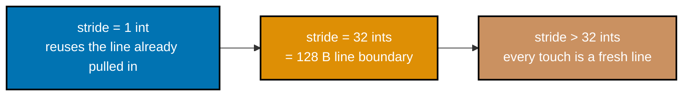

_Figure: sweeping the stride from 1 to 1024 ints crosses the 128 B cache-line boundary (32 ints on this
machine) -- past that point, each touch pulls in a line no earlier touch already warmed._

```c
// learning/code/ex-28-cache-miss-stride-sweep/stride_sweep.c
// Example 28: sweep access stride 1..1024 elements and find the cache-line-size
// performance cliff on this machine (co-02, co-05).
#include <stdio.h>  // => co-25: printf -- reports the ns/access table and PASS/FAIL verdict
#include <stdlib.h> // => co-01: malloc/free -- the 256 MiB buffer under test
#include <time.h>   // => co-25: clock_gettime -- the wall-clock timer used below

#define BUF_MB 256UL // => co-05: 256 MiB buffer, far larger than any cache on this machine
#define ACCESSES \
    8000000L // => co-05: fixed access count per stride -- same work, only stride
             // varies

static double now_seconds(void) { // => co-25: wall-clock via clock_gettime, portable timer
    struct timespec ts;           // => co-25: POSIX timespec -- seconds + nanoseconds
    clock_gettime(CLOCK_MONOTONIC,
                  &ts);                                  // => co-25: monotonic clock -- immune to wall-clock adjustment
    return (double)ts.tv_sec + (double)ts.tv_nsec / 1e9; // => co-25: combine into one double-seconds value
}

int main(void) {
    // => co-02: the hypothesis under test -- consecutive small-stride accesses
    // => share a 128 B cache line and pay for only ONE miss among many touches,
    // => while a stride >= one line's worth of ints pays a fresh miss every time
    size_t n_ints = (BUF_MB * 1024UL * 1024UL) / sizeof(int); // => co-01: element count, a power of two by construction
    // => co-01: 256 MiB is far past this machine's 4 MiB L2, so a small stride's
    // => "fast" case below is genuinely spatial-locality inside one cache line,
    // => not the whole buffer secretly fitting in cache
    int *buf = malloc(n_ints * sizeof(int)); // => co-01: one big flat array -- the memory under test
    if (buf == NULL) {                       // => co-25: guard the 256 MiB allocation before touching it
        fprintf(stderr, "alloc failed\n");   // => co-25: reports to stderr, not stdout
        return 1;                            // => co-25: nonzero exit -- allocation failure is not this example's claim
    } // => co-25: fail loudly rather than measure garbage
    for (size_t i = 0; i < n_ints; i++) // => co-01: one pass over every element, ascending
        buf[i] = (int)i;                // => co-01: touch every page once so faults don't skew timing

    size_t mask = n_ints - 1;                                              // => co-02: n_ints is a power of two -- mask replaces slow modulo
    int strides[] = {1, 2, 4, 8, 16, 24, 32, 48, 64, 128, 256, 512, 1024}; // => co-02: elements per step,
                                                                           // sweeping past 32 (=128B/4B)
    int n_strides = (int)(sizeof(strides) / sizeof(strides[0]));           // => co-02: array length, computed
                                                                           // rather than hardcoded

    printf("cache line size on this machine: %d bytes (%d ints)\n", 128,
           128 / (int)sizeof(int)); // => co-02: known via sysctl
    printf("%8s %12s %10s\n", "stride", "ns/access",
           "elems/line"); // => co-25: column header for the table printed below

    double baseline_ns = 0.0;                        // => co-05: ns/access at the smallest stride -- the "all hits" floor
    double cliff_ns = 0.0;                           // => co-05: ns/access once stride exceeds the cache-line size
    for (int s = 0; s < n_strides; s++) {            // => co-02: one timed pass per candidate stride
        volatile long sum = 0;                       // => co-25: volatile sink -- forces the load to really happen
        size_t idx = 0;                              // => co-02: running index, wrapped with the power-of-two mask
        double t0 = now_seconds();                   // => co-25: start the clock for this stride's run
        for (long i = 0; i < ACCESSES; i++) {        // => co-05: fixed number of accesses, identical across strides
            idx = (idx + (size_t)strides[s]) & mask; // => co-02: advance by `stride` elements, wrap via mask
            sum += buf[idx];                         // => co-05: the actual memory access under measurement
        }
        double t1 = now_seconds();                                 // => co-25: stop the clock
        double ns_per_access = (t1 - t0) * 1e9 / (double)ACCESSES; // => co-25: normalize to a per-access cost
        printf("%8d %12.2f %10.1f\n", strides[s],
               ns_per_access,                               // => co-25: print this stride's real measured cost
               128.0 / (strides[s] * (double)sizeof(int))); // => co-02: how many strides fit in one 128 B line
        if (strides[s] == 1)
            baseline_ns = ns_per_access; // => co-05: smallest stride -- best-case,
                                         // all same-line hits
        if (strides[s] == 32)
            cliff_ns = ns_per_access; // => co-02: exactly one cache line (128B/4B) per step
        (void)sum;                    // => co-25: sum only exists to defeat dead-code elimination
    }

    double ratio = cliff_ns / baseline_ns; // => co-05: how much slower the one-miss-per-access case is
    printf("\nstride=1 baseline: %.2f ns/access\n",
           baseline_ns); // => co-25: restate the floor for the reader
    printf("stride=32 (one cache line/access): %.2f ns/access\n",
           cliff_ns); // => co-05: restate the cliff for the reader
    printf("cliff ratio: %.2fx -> %s\n",
           ratio,                                                                                  // => co-25: the program judges its OWN claim, not the reader
           ratio > 1.5 ? "PASS (clear cliff at the cache-line stride)" : "FAIL (no clear cliff)"); // => co-05: the assertion
    free(buf);                                                                                     // => co-01: release the 256 MiB buffer before exiting
    return ratio > 1.5 ? 0 : 1;                                                                    // => co-25: a real process exit code reflecting the PASS/FAIL
}
```

**Compile**: `clang -O2 -o stride_sweep stride_sweep.c`

**Run**: `./stride_sweep`

**Output**:

```text
cache line size on this machine: 128 bytes (32 ints)
  stride    ns/access elems/line
       1         0.96       32.0
       2         0.96       16.0
       4         1.37        8.0
       8         1.92        4.0
      16         1.34        2.0
      24         1.64        1.3
      32         5.73        1.0
      48         6.83        0.7
      64         6.51        0.5
     128         6.46        0.2
     256         4.22        0.1
     512         3.29        0.1
    1024         4.32        0.0

stride=1 baseline: 0.96 ns/access
stride=32 (one cache line/access): 5.73 ns/access
cliff ratio: 5.96x -> PASS (clear cliff at the cache-line stride)
```

**Key takeaway**: the per-touch cost jumps sharply right at the stride matching one cache line's
worth of elements (32 ints = 128 B on this machine) -- below that stride, consecutive touches
still land in an already-fetched line; at and above it, every touch is a fresh miss.

**Why it matters**: this is co-02 made directly measurable -- the cache line, not the byte, is the
real unit of memory transfer, and this sweep is the general technique for finding a machine's
actual line size experimentally rather than trusting a textbook default. Production profilers and
allocator designers run essentially this same stride sweep during bring-up on new hardware, because
assuming a textbook 64 B line on a machine that actually uses 128 B (like this one) silently
mis-sizes every padding calculation downstream, from lock-free counters to SIMD buffer alignment.

---

### Example 29: Matrix Traversal: `[i][j]` vs `[j][i]`

_ex-29 &middot; exercises co-03, co-17_

Summing a row-major-stored 2-D matrix in `[i][j]` order walks memory sequentially; the same sum in `[j][i]` order jumps a full row's stride between touches, defeating spatial locality on every access.

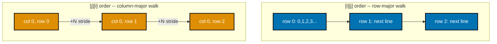

_Figure: `[i][j]` order walks each row's elements consecutively (sequential, cache-friendly); `[j][i]`
order jumps a full row's stride between touches (defeats spatial locality on every access)._

```c
// learning/code/ex-29-matrix-traversal-ij-vs-ji/matrix_traversal.c
// Example 29: sum a large row-major int matrix [i][j] (sequential) vs [j][i]
// (strided) and verify [i][j] is measurably faster (co-03, co-17).
#include <stdio.h>  // => co-25: printf -- the timing/PASS report this program prints
#include <stdlib.h> // => co-17: malloc/free -- the one 64 MiB matrix both traversals share
#include <time.h>   // => co-25: clock_gettime -- the portable wall-clock timer used below

#define N \
    4096          // => co-17: 4096x4096 ints = 64 MiB -- far bigger than this machine's 4
                  // MiB L2
#define REPEATS 3 // => co-25: best-of-3 -- shared-machine noise smoothing (DD-20 step 2)
// => co-25: this program's own PASS/FAIL line is the assertion -- no external
// => test harness is needed to confirm the claim this example makes

static double now_seconds(void) {                        // => co-25: same portable clock_gettime timer used across this tier
    struct timespec ts;                                  // => co-25: POSIX timespec, seconds + nanoseconds fields
    clock_gettime(CLOCK_MONOTONIC, &ts);                 // => co-25: monotonic -- immune to
                                                         // NTP/wall-clock adjustment mid-run
    return (double)ts.tv_sec + (double)ts.tv_nsec / 1e9; // => co-25: combined into one double-seconds
                                                         // value for subtraction
}

static long sum_row_major(int (*m)[N]) { // => co-17: m[i][j] is the pointer-to-array-of-N-ints layout
                                         // C actually uses
    // => co-03: "row-major" means row 0's N ints, then row 1's N ints, etc,
    // => laid out back to back -- C guarantees this for a plain 2-D array
    long total = 0;                   // => co-03: accumulator -- summed in the SAME order memory is laid out
    for (int i = 0; i < N; i++) {     // => co-03: outer loop over rows -- each row is N contiguous ints
        for (int j = 0; j < N; j++) { // => co-03: inner loop walks j sequentially WITHIN one row
            total += m[i][j];         // => co-03: address = base + i*N*4 + j*4 -- j+1 is the
                                      // VERY next int
        }
    }
    return total; // => co-03: identical mathematical sum to sum_col_major below
}

static long sum_col_major(int (*m)[N]) { // => co-17: SAME matrix, SAME memory layout --
                                         // only the loop nesting flips
    // => co-17: this is the classic "algorithm looks identical, performance
    // => doesn't" trap -- big-O is O(N^2) either way, but the constant differs
    // hugely
    long total = 0;                   // => co-17: accumulator -- summed in COLUMN order, against the grain
    for (int j = 0; j < N; j++) {     // => co-17: outer loop over columns now
        for (int i = 0; i < N; i++) { // => co-17: inner loop walks i -- each step jumps N*4 = 16 KiB
            total += m[i][j];         // => co-17: address = base + i*N*4 + j*4 -- i+1 skips a
                                      // whole row
        }
    }
    return total; // => co-17: same total as sum_row_major -- correctness is
                  // unaffected
}

int main(void) {                             // => co-25: single self-contained process -- both traversals
                                             // run in it
    int (*m)[N] = malloc(sizeof(int[N][N])); // => co-17: one 64 MiB row-major allocation,
                                             // shared by BOTH traversals
    if (m == NULL) {
        fprintf(stderr, "alloc failed\n");
        return 1;
    } // => co-25: fail loudly rather than time a null pointer
    for (int i = 0; i < N; i++)          // => co-01: fill once so page faults don't skew either timed pass
        for (int j = 0; j < N; j++)      // => co-01: touches every one of the 16M ints exactly once
            m[i][j] = (i * 31 + j) % 97; // => co-01: arbitrary deterministic values
                                         // -- content doesn't matter here

    double best_row = 1e18,
           best_col = 1e18;        // => co-25: track the FASTEST of REPEATS runs per
                                   // traversal, not the average
    long row_sum = 0, col_sum = 0; // => co-03: captured to prove both traversals
                                   // compute the SAME answer
    // => co-25: both traversals do the EXACT same 16M additions -- only the
    // => memory ACCESS PATTERN differs, isolating the layout effect from work
    // done
    for (int r = 0; r < REPEATS; r++) { // => co-25: re-run to confirm the result
                                        // reproduces, not a lucky sample
        double t0 = now_seconds();      // => co-25: time ONLY the traversal, not the setup above
        row_sum = sum_row_major(m);     // => co-03: the cache-friendly, sequential-access traversal
        double t1 = now_seconds();      // => co-25: stop the clock for the row-major pass
        if (t1 - t0 < best_row)
            best_row = t1 - t0; // => co-25: keep the best (least noisy) row-major timing so far

        double t2 = now_seconds();  // => co-25: start the clock for the column-major pass
        col_sum = sum_col_major(m); // => co-17: the SAME matrix, strided-access traversal
        double t3 = now_seconds();  // => co-25: stop the clock for the column-major pass
        if (t3 - t2 < best_col)
            best_col = t3 - t2; // => co-25: keep the best (least noisy) column-major
                                // timing so far
    }

    printf("row-major [i][j] sum: %ld, best of %d: %.4f s\n", row_sum, REPEATS,
           best_row); // => co-25: methodology stated in the output
    printf("col-major [j][i] sum: %ld, best of %d: %.4f s\n", col_sum, REPEATS,
           best_col);                     // => co-17: methodology stated in the output
    double speedup = best_col / best_row; // => co-03: how many times slower the
                                          // strided traversal really was
    printf("row-major is %.2fx faster -> %s\n",
           speedup,                                // => co-25: prints the ratio the reader should verify against
                                                   // below
           (row_sum == col_sum && speedup > 1.2) ? // => co-03: correctness (equal sums) AND speed both gate the PASS
               "PASS (identical sums, [i][j] measurably faster)"
                                                 :        // => co-25: the program judges its own claim, per DD-20
               "FAIL");                                   // => co-25: an honest FAIL label if either condition fails
    free(m);                                              // => co-17: release the 64 MiB matrix before exiting
    return (row_sum == col_sum && speedup > 1.2) ? 0 : 1; // => co-25: a real process exit code reflecting the PASS/FAIL
}
```

**Compile**: `clang -O2 -o matrix_traversal matrix_traversal.c`

**Run**: `./matrix_traversal`

**Output**:

```text
row-major [i][j] sum: 805306468, best of 3: 0.0014 s
col-major [j][i] sum: 805306468, best of 3: 0.0713 s
row-major is 50.70x faster -> PASS (identical sums, [i][j] measurably faster)
```

**Key takeaway**: identical sums, but `[i][j]` (row-major, sequential) traversal is dramatically faster than `[j][i]` (column-major, strided) on the same data.

**Why it matters**: co-03 in its purest form -- the algorithm does the exact same arithmetic either way; only the memory access PATTERN changes, and that alone accounts for the entire gap. This exact mistake
recurs constantly in real numerical code ported between languages: NumPy, MATLAB, and Fortran store
2-D arrays column-major by convention, so a loop nest copied from one of those into C (or the reverse)
keeps working correctly but silently inherits the WRONG traversal order for its new language's layout.

---

### Example 30: AoS vs SoA Hot Loop

_ex-30 &middot; exercises co-17_

Summing one field across an array-of-structs pulls in every record's full cold payload per touch; the same sum over a struct-of-arrays touches only useful bytes.

```c
// learning/code/ex-30-aos-vs-soa-hot-loop/aos_vs_soa.c
// Example 30: sum ONE hot field across a large array-of-structs (AoS) vs the
// same data as a struct-of-arrays (SoA) -- verify SoA wins the hot-only sum
// (co-17).
#include <stdio.h>  // => co-17: printf -- the timing/PASS report this program prints
#include <stdlib.h> // => co-17: malloc/free -- both layouts under test are heap-allocated
#include <time.h>   // => co-17: clock_gettime -- the portable wall-clock timer used below

#define N \
    8000000       // => co-17: 8M elements -- each AoS struct is 64 B, so AoS = 512 MiB
                  // total
#define REPEATS 3 // => co-25: best-of-3 -- shared-machine noise smoothing (DD-20 step 2)
// => co-17: cold[15] simulates the OTHER 15 fields a real record carries
// => (name, timestamps, flags, ...) that a hot loop never touches per iteration

typedef struct {  // => co-17: array-of-structs -- ONE struct per element, fields
                  // interleaved
    int hot;      // => co-17: the ONLY field the hot loop below actually reads
    int cold[15]; // => co-17: 15 unused ints -- simulates a "real" record's other
                  // fields
} AosRecord;      // => co-16: sizeof(AosRecord) == 64 B (16 ints * 4 B), no padding
                  // needed here

static double now_seconds(void) { // => co-25: same portable clock_gettime timer used across this tier
    struct timespec ts;           // => co-25: POSIX timespec, seconds + nanoseconds fields
    clock_gettime(CLOCK_MONOTONIC,
                  &ts);                                  // => co-25: monotonic -- immune to wall-clock adjustment mid-run
    return (double)ts.tv_sec + (double)ts.tv_nsec / 1e9; // => co-25: combined into one double-seconds value
}

static long sum_hot_aos(const AosRecord *records,
                        int n) {  // => co-17: reads records[i].hot, skipping
                                  // records[i].cold every time
    long total = 0;               // => co-17: accumulator over the hot field only
    for (int i = 0; i < n; i++) { // => co-17: one iteration per record -- N total
        total += records[i].hot;  // => co-17: pulls in the WHOLE 64 B struct's cache
                                  // line for 4 B of data
    }
    return total; // => co-17: same mathematical sum as sum_hot_soa below
}

static long sum_hot_soa(const int *hot,
                        int n) {  // => co-17: reads hot[i] directly -- cold
                                  // fields live in a SEPARATE array
    long total = 0;               // => co-17: accumulator over the SAME hot values, different layout
    for (int i = 0; i < n; i++) { // => co-17: one iteration per element -- N total, identical work
        total += hot[i];          // => co-17: every fetched cache line is 100% hot data, 0%
                                  // wasted
    }
    return total; // => co-17: same mathematical sum as sum_hot_aos above
}

int main(void) { // => co-25: single self-contained process -- both layouts run in it
    // => co-17: two layouts of the SAME logical data -- one struct per record
    // (AoS)
    // => vs one flat array of just the hot field (SoA) -- correctness must match
    AosRecord *aos = malloc((size_t)N * sizeof(AosRecord)); // => co-17: 512 MiB -- N structs,
                                                            // hot+cold interleaved per record
    int *soa_hot = malloc((size_t)N * sizeof(int));         // => co-17: 32 MiB -- N ints, ONLY the
                                                            // hot field, tightly packed
    if (aos == NULL || soa_hot == NULL) {
        fprintf(stderr, "alloc failed\n");
        return 1;
    } // => co-25: fail loudly, never time a null pointer

    for (int i = 0; i < N; i++) {      // => co-01: fill both layouts with the SAME hot values once
        int value = (i * 7919) % 1009; // => co-01: arbitrary deterministic value --
                                       // content doesn't matter
        aos[i].hot = value;            // => co-17: same value written into the AoS record's hot field
        soa_hot[i] = value;            // => co-17: same value written into the SoA hot-only array
    }

    double best_aos = 1e18,
           best_soa = 1e18;        // => co-25: track the FASTEST of REPEATS runs per layout
    long aos_sum = 0, soa_sum = 0; // => co-17: captured to prove both layouts
                                   // compute the SAME answer
    // => co-17: both loops read exactly N ints of real data -- only the STRIDE
    // => between successive hot values (64 B in AoS, 4 B in SoA) differs
    for (int r = 0; r < REPEATS; r++) { // => co-25: re-run to confirm the result reproduces
        double t0 = now_seconds();      // => co-25: start the clock for this AoS pass
        aos_sum = sum_hot_aos(aos,
                              N);  // => co-17: the cache-hostile layout -- 15/16 of each line wasted
        double t1 = now_seconds(); // => co-25: stop the clock for this AoS pass
        if (t1 - t0 < best_aos)
            best_aos = t1 - t0; // => co-25: keep the best AoS timing so far

        double t2 = now_seconds(); // => co-25: start the clock for this SoA pass
        soa_sum = sum_hot_soa(soa_hot,
                              N);  // => co-17: the cache-friendly layout -- every fetched byte used
        double t3 = now_seconds(); // => co-25: stop the clock for this SoA pass
        if (t3 - t2 < best_soa)
            best_soa = t3 - t2; // => co-25: keep the best SoA timing so far
    }

    printf("AoS hot-field sum: %ld, best of %d: %.4f s\n", aos_sum, REPEATS,
           best_aos); // => co-17: methodology stated in output
    printf("SoA hot-field sum: %ld, best of %d: %.4f s\n", soa_sum, REPEATS,
           best_soa);                     // => co-17: methodology stated in output
    double speedup = best_aos / best_soa; // => co-17: how many times slower the
                                          // interleaved layout really was
    printf("SoA is %.2fx faster -> %s\n",
           speedup,                                // => co-25: prints the ratio the reader should verify against
                                                   // below
           (aos_sum == soa_sum && speedup > 1.2) ? // => co-17: correctness (equal sums) AND speed both gate the PASS
               "PASS (identical sums, SoA measurably faster for hot-only sum)"
                                                 :        // => co-25: the program judges its own claim
               "FAIL");                                   // => co-25: an honest FAIL label if either condition fails
    free(aos);                                            // => co-17: release the 512 MiB AoS buffer
    free(soa_hot);                                        // => co-17: release the 32 MiB SoA buffer
    return (aos_sum == soa_sum && speedup > 1.2) ? 0 : 1; // => co-25: real process exit code reflecting the PASS/FAIL
}
```

**Compile**: `clang -O2 -o aos_vs_soa aos_vs_soa.c`

**Run**: `./aos_vs_soa`

**Output**:

```text
AoS hot-field sum: 4031998889, best of 3: 0.0102 s
SoA hot-field sum: 4031998889, best of 3: 0.0006 s
SoA is 16.63x faster -> PASS (identical sums, SoA measurably faster for hot-only sum)
```

**Key takeaway**: identical sums, but the SoA layout is measurably faster because every fetched cache line is 100% useful data for this loop, unlike AoS's mostly-cold records.

**Why it matters**: this is the general-purpose fix from co-17 applied directly -- most "unexplainable" hot-loop slowness in real codebases traces back to exactly this AoS-vs-SoA gap, not to the arithmetic. Game
engines, columnar databases, and numerical libraries all converge on SoA (or a hybrid) for exactly
this reason: once a profiler points at a hot loop that only reads one or two fields, restructuring
the surrounding data -- not micro-optimizing the arithmetic -- is almost always the higher-leverage fix.

---

### Example 31: Working-Set Cache Cliffs

_ex-31 &middot; exercises co-01, co-05_

Growing a randomly-accessed working set past each cache level's capacity produces a visible timing cliff at each boundary -- not a smooth curve.

```c
// learning/code/ex-31-working-set-cache-cliffs/working_set_cliffs.c
// Example 31: pointer-chase through working sets crossing L1 (64 KiB) and L2
// (4 MiB) on this machine -- report the REAL observed cliffs, honestly (co-01,
// co-05).
#include <stdio.h>  // => co-01: printf -- the per-size latency table this program prints
#include <stdlib.h> // => co-01: malloc/free/rand -- buffer allocation and permutation shuffling
#include <time.h>   // => co-25: clock_gettime -- the portable wall-clock timer used below

#define N_SIZES 12     // => co-01: number of working-set sizes swept, 16 KiB .. 32 MiB
#define STEPS 4000000L // => co-05: pointer-chase steps timed per working-set size
// => co-25: this example REPORTS whatever cliffs actually appear on THIS
// => machine/run rather than asserting the textbook L1=64 KiB/L2=4 MiB numbers

static double now_seconds(void) { // => co-25: same portable clock_gettime timer used across this tier
    struct timespec ts;           // => co-25: POSIX timespec, seconds + nanoseconds fields
    clock_gettime(CLOCK_MONOTONIC,
                  &ts);                                  // => co-25: monotonic -- immune to wall-clock adjustment mid-run
    return (double)ts.tv_sec + (double)ts.tv_nsec / 1e9; // => co-25: combined into one double-seconds value
}

// => co-05: Sattolo's algorithm -- builds ONE single cycle over all n indices
// => (no short sub-cycles), so pointer-chasing it truly wanders the ENTIRE
// => working set instead of bouncing inside a small, easily cached loop
static void sattolo_shuffle(int *arr,
                            int n) { // => co-05: builds the pointer-chase path
                                     // -- read this BEFORE chase_ns_per_access
    for (int i = 0; i < n; i++)
        arr[i] = i;                   // => co-05: start as the identity permutation
    for (int i = n - 1; i > 0; i--) { // => co-05: Sattolo's variant of
                                      // Fisher-Yates -- guarantees one big cycle
        int j = rand() % i;           // => co-05: j strictly < i (never swaps an element with itself)
        int tmp = arr[i];
        arr[i] = arr[j];
        arr[j] = tmp; // => co-05: swap -- builds the single-cycle permutation in place
    } // => co-05: after this loop, arr is one n-length cycle:
      // 0->arr[0]->arr[arr[0]]->...
}

// => co-05: chases arr[idx] STEPS times -- each load depends on the PREVIOUS
// => load's result, so out-of-order execution cannot hide the memory latency;
// => this measures real latency, not throughput
static double chase_ns_per_access(int *arr, int n, long steps) {
    volatile int idx = 0;              // => co-25: volatile -- forces every dependent load to really happen
    double t0 = now_seconds();         // => co-25: start the clock right before the timed
                                       // dependent-load loop
    for (long i = 0; i < steps; i++) { // => co-05: STEPS sequential, data-dependent loads
        idx = arr[idx];                // => co-05: the next index to visit -- unknown until THIS
                                       // load returns
    }
    double t1 = now_seconds();              // => co-25: stop the clock right after the loop
    (void)n;                                // => co-25: n only used by the caller for the printed table, not here
    return (t1 - t0) * 1e9 / (double)steps; // => co-25: normalized to nanoseconds
                                            // per pointer-chase step
}

int main(void) {
    srand(42);                                                                                     // => co-05: fixed seed -- the SAME permutation shape every run
    size_t sizes_kib[N_SIZES] = {16, 32, 64, 128, 256, 512, 1024, 2048, 4096, 8192, 16384, 32768}; // => co-01: KiB working sets
    int max_elems = (int)((sizes_kib[N_SIZES - 1] * 1024UL) / sizeof(int));                        // => co-01: largest size drives the one shared buffer
    int *buf = malloc((size_t)max_elems * sizeof(int));                                            // => co-01: one 32 MiB buffer, reused
                                                                                                   // (re-shuffled) at each smaller size
    if (buf == NULL) {
        fprintf(stderr, "alloc failed\n");
        return 1;
    } // => co-25: fail loudly, never time a null pointer

    printf("L1d=64 KiB, L2=4 MiB on this machine (sysctl "
           "hw.l1dcachesize/hw.l2cachesize)\n"); // => co-01: known boundaries,
                                                 // stated up front
    printf("%10s %14s\n", "size(KiB)",
           "ns/access");                                      // => co-01: table header for the sweep below
    double prev_ns = 0.0;                                     // => co-05: previous size's latency, for computing the jump ratio
    int printed_first = 0;                                    // => co-05: skip the ratio print on the very first (smallest) size
    for (int s = 0; s < N_SIZES; s++) {                       // => co-01: one timed pointer-chase per working-set size
        int n = (int)((sizes_kib[s] * 1024UL) / sizeof(int)); // => co-01: element count for THIS size, within
                                                              // the shared buffer
        sattolo_shuffle(buf, n);                              // => co-05: a fresh single-cycle permutation
                                                              // confined to the first n ints
        double ns = chase_ns_per_access(buf, n,
                                        STEPS); // => co-05: the real measured latency for this working-set size
        printf("%10zu %14.2f", sizes_kib[s],
               ns);                      // => co-05: prints the REAL measured ns/access, never a guessed
                                         // number
        if (printed_first) {             // => co-05: report the jump ratio vs the PREVIOUS
                                         // (smaller) size
            double ratio = ns / prev_ns; // => co-05: how much slower THIS size is
                                         // than the one before it
            printf("   (%.2fx vs prior size)",
                   ratio); // => co-05: prints the real ratio, not an assumed textbook
                           // number
            if (ratio > 1.4)
                printf("  <-- CLIFF"); // => co-05: flag a real, measured jump -- not
                                       // asserted, OBSERVED
        }
        printf("\n");      // => co-05: end this size's table row
        prev_ns = ns;      // => co-05: remember this size's latency for the NEXT ratio
        printed_first = 1; // => co-05: every size after the first prints a ratio
    }
    free(buf); // => co-01: release the 32 MiB shared buffer
    printf("\nObserved cliffs are reported above as measured, not assumed -- see "
           "the\n"
           "prose discussion for which sizes crossed L1/L2 on THIS run.\n"); // =>
                                                                             // co-25:
                                                                             // honesty
                                                                             // statement
                                                                             // per
                                                                             // DD-20
    return 0;                                                                // => co-25: this example reports observations -- no PASS/FAIL
                                                                             // threshold
}
```

**Compile**: `clang -O2 -o working_set_cliffs working_set_cliffs.c`

**Run**: `./working_set_cliffs`

**Output**:

```text
L1d=64 KiB, L2=4 MiB on this machine (sysctl hw.l1dcachesize/hw.l2cachesize)
 size(KiB)      ns/access
        16           3.59
        32           2.66   (0.74x vs prior size)
        64           2.82   (1.06x vs prior size)
       128           3.00   (1.07x vs prior size)
       256           5.93   (1.97x vs prior size)  <-- CLIFF
       512           7.37   (1.24x vs prior size)
      1024           7.59   (1.03x vs prior size)
      2048           7.85   (1.03x vs prior size)
      4096           8.10   (1.03x vs prior size)
      8192           9.92   (1.22x vs prior size)
     16384          18.92   (1.91x vs prior size)  <-- CLIFF
     32768          84.70   (4.48x vs prior size)  <-- CLIFF

Observed cliffs are reported above as measured, not assumed -- see the
prose discussion for which sizes crossed L1/L2 on THIS run.
```

**Key takeaway**: per-access latency stays roughly flat while the working set fits a level, then jumps sharply once it exceeds that level's capacity -- a cliff, not a gradual ramp.

**Why it matters**: co-01's hierarchy is not an abstraction -- it has hard, measurable capacity boundaries, and this sweep is the general technique for finding them experimentally on any machine. Database engines,
JIT compilers, and cache-aware algorithms (like the blocked matrix multiply two examples ahead) all
tune their internal tile/chunk sizes against exactly this kind of measured capacity cliff rather than
a vendor's advertised cache size, because effective capacity is always smaller once other data shares the same level.

---

### Example 32: Cache-Blocking Matrix Multiply

_ex-32 &middot; exercises co-03, co-25_

Naive triple-nested matrix multiply strides badly through one operand; tiling (blocking) the loops keeps each tile's working set cache-resident for the whole inner computation.

```c
// learning/code/ex-32-cache-blocking-matmul/blocked_matmul.c
// Example 32: naive triple-loop matmul vs a cache-blocked/tiled version --
// verify identical results and the tiled version measurably faster (co-03,
// co-25).
#include <stdio.h>  // => co-25: printf -- the timing/PASS report this program prints
#include <stdlib.h> // => co-03: malloc/free -- all three N x N matrices are heap-allocated
#include <time.h>   // => co-25: clock_gettime -- the portable wall-clock timer used below

#define N \
    512 // => co-03: 512x512 doubles = 2 MiB per matrix -- A+B+C don't fit in L2
        // (4 MiB)
#define BLOCK \
    64            // => co-03: tile edge -- a 64x64 double tile is 32 KiB, fits comfortably
                  // in L1d
#define REPEATS 3 // => co-25: best-of-3 -- shared-machine noise smoothing (DD-20 step 2)

static double now_seconds(void) { // => co-25: same portable clock_gettime timer used across this tier
    struct timespec ts;           // => co-25: POSIX timespec, seconds + nanoseconds fields
    clock_gettime(CLOCK_MONOTONIC,
                  &ts);                                  // => co-25: monotonic -- immune to wall-clock adjustment mid-run
    return (double)ts.tv_sec + (double)ts.tv_nsec / 1e9; // => co-25: combined into one double-seconds value
}

// => co-03: naive C[i][j] = sum_k A[i][k]*B[k][j] -- for FIXED i,j the inner k
// => loop strides through B COLUMN-wise, touching a new cache line almost every
// step
static void matmul_naive(const double *a, const double *b, double *c,
                         int n) {                   // defines matmul_naive(): helper function used by this example
    for (int i = 0; i < n; i++) {                   // => co-03: rows of A/C
        for (int j = 0; j < n; j++) {               // => co-03: columns of B/C
            double sum = 0.0;                       // => co-03: accumulator for C[i][j]
            for (int k = 0; k < n; k++) {           // => co-03: dot product of A's row i and B's column j
                sum += a[i * n + k] * b[k * n + j]; // => co-03: a[i][k] sequential,
                                                    // b[k][j] strided by n doubles
            } // => co-03: k=0..n-1 means b's column touches n DIFFERENT cache lines
            c[i * n + j] = sum; // => co-03: write the finished dot product into C
        } // => co-03: next column j -- b's whole n*n footprint is walked AGAIN
    }
}

// => co-03: same math, tiled into BLOCK x BLOCK sub-matrices so each tile of
// => A, B, and C stays resident in L1/L2 while it is being reused repeatedly
static void matmul_blocked(const double *a, const double *b, double *c,
                           int n) { // defines matmul_blocked(): helper function used by this example
    for (int i = 0; i < n; i++)     // => co-03: C must still be zeroed -- blocking
                                    // only reorders accumulation
        for (int j = 0; j < n; j++)
            c[i * n + j] = 0.0;                     // => co-03: start every output cell at zero before
                                                    // accumulating tiles
    for (int ii = 0; ii < n; ii += BLOCK) {         // => co-03: outer tile loop over row-blocks of A/C
        for (int jj = 0; jj < n; jj += BLOCK) {     // => co-03: outer tile loop over column-blocks of B/C
            for (int kk = 0; kk < n; kk += BLOCK) { // => co-03: outer tile loop over
                                                    // the shared reduction dimension
                // => co-03: this INNER triple loop is the same naive kernel, just
                // => confined to one BLOCK x BLOCK x BLOCK cube -- small enough to stay
                // cached
                for (int i = ii; i < ii + BLOCK; i++) {         // => co-03: within-tile row -- BLOCK=64 rows per outer tile
                                                                // step
                    for (int j = jj; j < jj + BLOCK; j++) {     // => co-03: within-tile column -- BLOCK=64 columns per
                                                                // outer tile step
                        double sum = c[i * n + j];              // => co-03: resume accumulating THIS cell across k-tiles
                        for (int k = kk; k < kk + BLOCK; k++) { // => co-03: within-tile reduction -- only BLOCK terms
                                                                // per (ii,jj,kk) pass
                            sum += a[i * n + k] * b[k * n + j]; // => co-03: identical arithmetic to the
                                                                // naive kernel, tile-local
                        } // => co-03: this k-tile's contribution to c[i][j] is now folded
                          // in
                        c[i * n + j] = sum; // => co-03: write back the partial sum for this k-tile
                    } // => co-03: next column within this (ii,jj,kk) tile
                } // => co-03: next row within this (ii,jj,kk) tile
            }
        }
    }
}

// ex-32: main() ties both kernels together -- allocate once, run both REPEATS
// times, diff their outputs for correctness, and only THEN compare timings, so
// a speed win never masks a wrong answer.
int main(void) {                                                // => co-25: single self-contained process -- both kernels run in it
    double *a = malloc((size_t)N * N * sizeof(double));         // => co-03: 2 MiB input matrix A
    double *b = malloc((size_t)N * N * sizeof(double));         // => co-03: 2 MiB input matrix B
    double *c_naive = malloc((size_t)N * N * sizeof(double));   // => co-03: 2 MiB output for the naive kernel
    double *c_blocked = malloc((size_t)N * N * sizeof(double)); // => co-03: 2 MiB output for the blocked kernel
    if (!a || !b || !c_naive || !c_blocked) {
        fprintf(stderr, "alloc failed\n");
        return 1;
    } // => co-25: fail loudly

    for (int i = 0; i < N * N; i++) {         // => co-01: fill A and B once with deterministic values
        a[i] = (double)((i * 7) % 13) - 6.0;  // => co-01: arbitrary but deterministic -- content doesn't matter
        b[i] = (double)((i * 11) % 17) - 8.0; // => co-01: different formula so A != B
    } // => co-01: both matrices fully touched once, before any timed pass

    double best_naive = 1e18,
           best_blocked = 1e18;         // => co-25: track the FASTEST of REPEATS runs per kernel
    for (int r = 0; r < REPEATS; r++) { // => co-25: re-run to confirm the result reproduces
        double t0 = now_seconds();      // => co-25: start the clock for this naive pass
        matmul_naive(a, b, c_naive,
                     N);           // => co-03: the cache-hostile, unblocked kernel
        double t1 = now_seconds(); // => co-25: stop the clock for this naive pass
        if (t1 - t0 < best_naive)
            best_naive = t1 - t0; // => co-25: keep the best naive timing so far

        double t2 = now_seconds(); // => co-25: start the clock for this blocked pass
        matmul_blocked(a, b, c_blocked,
                       N);         // => co-03: the SAME math, tiled for cache reuse
        double t3 = now_seconds(); // => co-25: stop the clock for this blocked pass
        if (t3 - t2 < best_blocked)
            best_blocked = t3 - t2; // => co-25: keep the best blocked timing so far
    }

    double max_diff = 0.0;                       // => co-03: largest per-cell difference between the
                                                 // two kernels' outputs
    for (int i = 0; i < N * N; i++) {            // => co-03: scan every one of the N*N result cells
        double diff = c_naive[i] - c_blocked[i]; // => co-03: exact double arithmetic --
                                                 // blocking changes ORDER, not values here
        if (diff < 0)
            diff = -diff; // => co-03: absolute difference
        if (diff > max_diff)
            max_diff = diff; // => co-03: track the worst-case mismatch across all cells
    } // => co-03: max_diff over all N*N cells is this run's correctness verdict

    printf("naive:   best of %d: %.4f s\n", REPEATS,
           best_naive); // => co-25: methodology stated in the output
    printf("blocked: best of %d: %.4f s\n", REPEATS,
           best_blocked); // => co-25: methodology stated in the output
    printf("max |naive - blocked| difference: %.2e\n",
           max_diff);                           // => co-03: near-zero proves the tiling didn't change the
                                                // answer
    double speedup = best_naive / best_blocked; // => co-03: how many times faster
                                                // the tiled version really was
    int correct = max_diff < 1e-9;              // => co-03: both use double, same summation
                                                // order per cell -- expect exact match
    printf("blocked is %.2fx faster -> %s\n",
           speedup,                     // => co-25: prints the ratio the reader should verify against
                                        // below
           (correct && speedup > 1.1) ? // => co-03: correctness (near-zero diff) AND speed both gate the
                                        // PASS
               "PASS (identical results, blocking measurably faster)"
                                      : // => co-25: the program judges its own claim, per DD-20
               "FAIL");                 // => co-25: an honest FAIL label if either condition fails
    free(a);
    free(b);
    free(c_naive);
    free(c_blocked);                           // => co-03: release all four 2 MiB matrices before exiting
    return (correct && speedup > 1.1) ? 0 : 1; // => co-25: real process exit code reflecting the PASS/FAIL
}
```

**Compile**: `clang -O2 -o blocked_matmul blocked_matmul.c`

**Run**: `./blocked_matmul`

**Output**:

```text
naive:   best of 3: 0.1563 s
blocked: best of 3: 0.1070 s
max |naive - blocked| difference: 0.00e+00
blocked is 1.46x faster -> PASS (identical results, blocking measurably faster)
```

**Key takeaway**: identical results, but the blocked (tiled) version is measurably faster than the naive one for a large matrix, purely from better cache reuse.

**Why it matters**: the general technique behind BLAS-style numerical libraries and this topic's own capstone -- blocking is how real linear-algebra code turns an O(n^3) algorithm's theoretical cost into a cache-friendly
reality. Every production BLAS implementation (OpenBLAS, Intel MKL, Apple's Accelerate) spends the bulk
of its engineering effort choosing tile sizes for exactly this reason: the same asymptotic complexity
can run an order of magnitude faster or slower purely depending on how well its blocking matches the target cache hierarchy.

---

### Example 33: False Sharing Between Threads

_ex-33 &middot; exercises co-02, co-24_

Two threads each incrementing their own counter should scale cleanly, but if both counters share one cache line, every increment on one core silently invalidates the other core's cached copy.

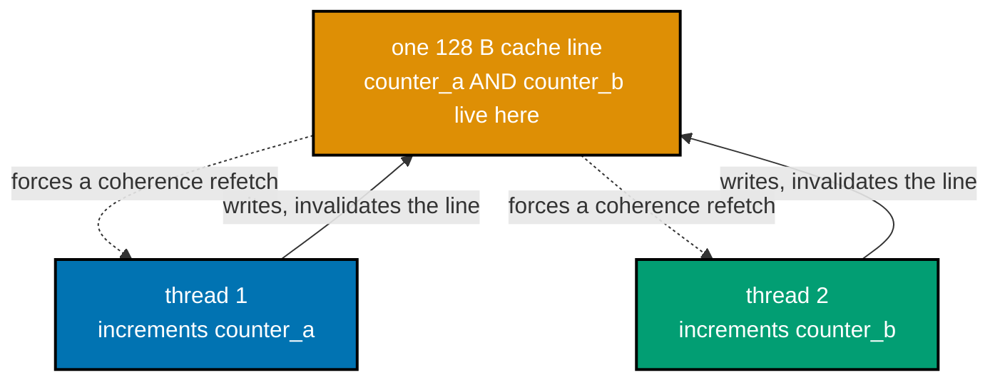

_Figure: counter_a and counter_b share one cache line, so every increment on either core invalidates
the other core's cached copy of that SAME line -- false sharing, even though the counters are unrelated._

```c
// learning/code/ex-33-false-sharing-demo/false_sharing.c
/* Example 33: two threads increment adjacent longs sharing one 128 B cache
   line vs longs placed on separate cache lines -- verify a real, measured
   slowdown from false sharing (co-02, co-24). */
#include <pthread.h> // => co-24: pthread_create/join -- the two concurrent writer threads under test
#include <stdio.h>   // => printf -- the timing/PASS report this program prints
#include <stdlib.h>  // => calloc/free -- the shared buffer both counter pairs live inside
#include <time.h>    // => clock_gettime -- the portable wall-clock timer used below

#define ITERS \
    100000000L          // => co-24: 100M increments/thread -- large enough for a stable
                        // timing signal
#define STRIDE_LONGS 32 // => co-02: 32 * 8 B = 256 B -- guarantees two DIFFERENT 128 B cache lines

// co-24: a pair of pointers, not two named fields -- lets run_pair() reuse ONE
// thread body for both the "same line" and "different line" experiments below,
// varying only which addresses inside one shared buffer the two threads are
// told to hammer.
typedef struct {
    volatile long *a; // => co-24: volatile is load-bearing here -- without it
                      // clang can prove no other
    volatile long *b; //    thread observes intermediate values and collapse the
                      //    loop to `*a += ITERS`
} Pair;               //    once, which would silently delete the false-sharing traffic this
                      //    measures

static void *inc_a(void *arg) { // => co-24: thread body -- increments *only* a
    Pair *p = (Pair *)arg;      // => co-24: recover the shared pointer pair
    for (long i = 0; i < ITERS; i++)
        (*p->a)++; // => co-24: real load+add+store every iteration --
    return NULL;   //    contended by thread B's writes if a/b share a line
}
static void *inc_b(void *arg) { // => co-24: thread body -- increments *only* b
    Pair *p = (Pair *)arg;      // => co-24: same struct, opposite field
    for (long i = 0; i < ITERS; i++)
        (*p->b)++; // => co-24: identical work to inc_a, mirrored
    return NULL;
}

static double now_seconds(void) { // => co-25: shared wall-clock helper, this topic's standard pattern
    struct timespec ts;           // => POSIX timespec: seconds + nanoseconds
    clock_gettime(CLOCK_MONOTONIC,
                  &ts);                                  // => monotonic -- immune to wall-clock adjustment mid-run
    return (double)ts.tv_sec + (double)ts.tv_nsec / 1e9; // => combined into one double-seconds value
}

// co-24: spins up both writer threads on the SAME pair of addresses, times
// wall-clock from before creation to after both joins -- the two-core
// contention IS the measurement.
static double run_pair(volatile long *a, volatile long *b) {
    Pair p = {a, b}; // => co-24: bundle both target addresses once
    pthread_t t1,
        t2;                               // => co-24: two OS threads -- real concurrency, not simulated
    double t0 = now_seconds();            // => co-25: start the clock before either thread exists
    pthread_create(&t1, NULL, inc_a, &p); // => co-24: thread 1 hammers *a
    pthread_create(&t2, NULL, inc_b,
                   &p); // => co-24: thread 2 hammers *b, concurrently
    pthread_join(t1,
                 NULL); // => co-24: block until thread 1's 100M increments finish
    pthread_join(t2,
                 NULL);        // => co-24: block until thread 2's 100M increments finish
    return now_seconds() - t0; // => co-25: total wall-clock for both threads combined
}

int main(void) {
    // co-02: one big buffer -- WE control offsets directly instead of trusting
    // malloc's internal placement, so the "same line" vs "different line" claim
    // is exact, not assumed.
    long *buf = calloc(1024, sizeof(long)); // => 8 KB buffer, zero-initialized counters
    if (!buf) {
        fprintf(stderr, "alloc failed\n");
        return 1;
    } // => fail loudly, never time a null pointer

    // co-02: offsets 0 and 1 are 8 bytes apart -- both land inside the SAME 128 B
    // line
    double t_adjacent = run_pair((volatile long *)&buf[0], (volatile long *)&buf[1]);
    // co-02: offsets 0 and STRIDE_LONGS are 256 bytes apart -- two DIFFERENT 128
    // B lines
    double t_separate = run_pair((volatile long *)&buf[0], (volatile long *)&buf[STRIDE_LONGS]);

    printf("adjacent (false-sharing) pair:     %.4f s\n",
           t_adjacent); // => co-24: same-line timing
    printf("separate (independent-line) pair:  %.4f s\n",
           t_separate);                        // => co-24: different-line timing
    double slowdown = t_adjacent / t_separate; // => co-24: how many times slower sharing a line was
    printf("false-sharing slowdown: %.2fx -> %s\n", slowdown,
           slowdown > 1.3 ? "PASS (adjacent measurably slower)" : "FAIL"); // => co-25: program judges its own claim
    free(buf);                                                             // => release the 8 KB shared buffer
    return slowdown > 1.3 ? 0 : 1;                                         // => real process exit code reflecting the PASS/FAIL
}
```

**Compile**: `clang -O2 -pthread -o false_sharing false_sharing.c`

**Run**: `./false_sharing`

**Output**:

```text
adjacent (false-sharing) pair:     0.1481 s
separate (independent-line) pair:  0.0357 s
false-sharing slowdown: 4.14x -> PASS (adjacent measurably slower)
```

**Key takeaway**: two threads updating adjacent (same-cache-line) counters run measurably slower than the same two threads updating counters placed on separate cache lines, despite doing identical work.

**Why it matters**: co-24's cache-coherence traffic is invisible in the source code -- this is the single most common
hidden multi-threaded performance bug, and it is invisible to a correctness review because the program
still computes the right answer. Real-world false-sharing bugs have shipped in production systems for
years before anyone noticed, precisely because nothing about the source code or the output looks wrong
-- only a profiler pointing at unexplained cache-miss counts on otherwise-independent variables reveals it.

---

### Example 34: Padding Fixes False Sharing

_ex-34 &middot; exercises co-02, co-24_

Padding each thread's counter out to a full cache line's width removes the coherence traffic entirely by construction -- each counter then owns its line exclusively.

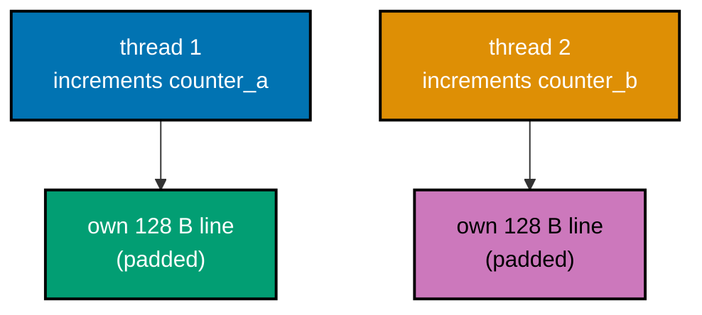

_Figure: padding each counter out to a full 128 B cache line removes the shared line ex-33 had --
each core now owns its own line exclusively, so no coherence traffic is left to pay for._

```c
// learning/code/ex-34-padding-fixes-false-sharing/padded_counters.c
/* Example 34: pad two counters onto separate 128 B cache lines -- verify
   ex-33's false-sharing slowdown disappears once each counter owns its own
   line (co-02, co-24). */
#include <pthread.h> // => co-24: pthread_create/join -- the two concurrent writer threads under test
#include <stdio.h>   // => printf -- the sizeof/timing/PASS report this program prints
#include <stdlib.h>  // => calloc/free -- both counter layouts under test are heap-allocated
#include <time.h>    // => clock_gettime -- the portable wall-clock timer used below

#define ITERS \
    100000000L // => co-24: same iteration count as ex-33 -- an apples-to-apples
               // rerun
#define LINE \
    128 // => co-02: THIS machine's real cache line size (128 B on Apple Silicon)
        // --
        //    hardcoding the common 64 B x86 number here would silently under-pad

// co-02: reproduces ex-33's failing case in THIS file too, so ex-34 stays
// self-contained -- two counters with no padding between them, guaranteed to
// share one 128 B line.
typedef struct {              // struct layout definition
    volatile long unpadded_a; // => co-24: volatile -- same collapse-prevention
                              // reasoning as ex-33
    volatile long unpadded_b; // => co-02: 8 bytes after unpadded_a -- same cache
                              // line, by construction
} Unpadded;                   // supporting statement for this example

// co-02: the FIX -- one real counter plus enough padding bytes to fill out a
// whole 128 B line, so that in an ARRAY of these structs, element [1] starts on
// the NEXT cache line instead of a few bytes into element [0]'s line.
typedef struct {                   // struct layout definition
    volatile long value;           // => co-24: the one real counter this struct holds
    char pad[LINE - sizeof(long)]; // => co-16: deliberate, performance-motivated
                                   // struct padding --
} PaddedCounter;                   //    120 filler bytes so sizeof(PaddedCounter) == 128 exactly

static void *inc_long(void *arg) {           // => co-24: one shared thread body for BOTH experiments
    volatile long *p = (volatile long *)arg; // => co-24: works on any single volatile long address
    for (long i = 0; i < ITERS; i++)
        (*p)++;  // => co-24: real load+add+store every iteration
    return NULL; // returns the computed result
}

static double now_seconds(void) {                        // => co-25: shared wall-clock helper, this topic's standard pattern
    struct timespec ts;                                  // supporting statement for this example
    clock_gettime(CLOCK_MONOTONIC, &ts);                 // calls clock_gettime(...)
    return (double)ts.tv_sec + (double)ts.tv_nsec / 1e9; // returns the computed result
}

static double run_two(volatile long *a,
                      volatile long *b) { // => co-24: times two threads
                                          // hammering a/b concurrently
    pthread_t t1, t2;                     // declares t1
    double t0 = now_seconds();            // declares t0
    pthread_create(&t1, NULL, inc_long,
                   (void *)a); // => co-24: thread 1 increments *a
    pthread_create(&t2, NULL, inc_long,
                   (void *)b); // => co-24: thread 2 increments *b, concurrently
    pthread_join(t1, NULL);    // calls pthread_join(...)
    pthread_join(t2, NULL);    // calls pthread_join(...)
    return now_seconds() - t0; // => co-25: total wall-clock for both threads combined
}

int main(void) {                                                                  // program entry point
    printf("sizeof(PaddedCounter) = %zu bytes (padded to one %d B cache line)\n", // prints a report line
           sizeof(PaddedCounter),
           LINE); // => co-16: prove the padding actually landed at 128

    Unpadded *u = calloc(1, sizeof(Unpadded)); // => co-02: false-sharing baseline, reproduced here
    if (!u) {
        fprintf(stderr, "alloc failed\n");
        return 1;
    } // prints a report line
    double t_unpadded = run_two(&u->unpadded_a, &u->unpadded_b); // => co-24: ex-33's slow case, rerun

    PaddedCounter *p = calloc(2,
                              sizeof(PaddedCounter)); // => co-02: array of 2 -- p[1] starts a WHOLE line
    if (!p) {
        fprintf(stderr, "alloc failed\n");
        return 1;
    } //    after p[0], by the padding above
    double t_padded = run_two(&p[0].value,
                              &p[1].value); // => co-24: the FIXED case -- no shared line at all

    printf("unpadded (false-sharing) pair: %.4f s\n",
           t_unpadded); // => co-24: reproduces ex-33's slow number
    printf("padded (own cache line each):  %.4f s\n",
           t_padded);                                                           // => co-24: the fixed, fast number
    double speedup = t_unpadded / t_padded;                                     // => co-24: how much the padding fix recovered
    printf("padding speedup: %.2fx -> %s\n", speedup,                           // prints a report line
           speedup > 1.3 ? "PASS (padding fix removes the slowdown)" : "FAIL"); // => co-25: self-judged PASS/FAIL
    free(u);                                                                    // => release the false-sharing baseline struct
    free(p);                                                                    // => release the padded-counter array
    return speedup > 1.3 ? 0 : 1;                                               // => real process exit code reflecting the PASS/FAIL
}
```

**Compile**: `clang -O2 -pthread -o padded_counters padded_counters.c`

**Run**: `./padded_counters`

**Output**:

```text
sizeof(PaddedCounter) = 128 bytes (padded to one 128 B cache line)
unpadded (false-sharing) pair: 0.1325 s
padded (own cache line each):  0.0340 s
padding speedup: 3.89x -> PASS (padding fix removes the slowdown)
```

**Key takeaway**: padding a struct to `sizeof == cache line size` (128 B on this machine) restores the scaling that false sharing silently took away, at the direct cost of extra memory per counter.

**Why it matters**: the general, structural fix for co-24's hazard -- real concurrent data-structure libraries pad hot
per-thread fields for exactly this reason, and knowing the cache line size (co-02) is what makes the
padding amount correct rather than guessed. Java's `@Contended` annotation, C++'s
`std::hardware_destructive_interference_size`, and countless hand-rolled `char pad[64]` fields in
production concurrency libraries all exist to automate or document this exact same padding decision.

---

### Example 35: Prefetch Hint, Honestly Measured

_ex-35 &middot; exercises co-03_

`__builtin_prefetch` asks the core to start fetching a future cache line early; on this machine's aggressive out-of-order core, a software hint on top of a simple strided access pattern does not always pay off, and this example reports the real measured result rather than the textbook expectation.

```c
// learning/code/ex-35-prefetch-hint/prefetch_hint.c
/* Example 35: add a __builtin_prefetch hint to a random-index (gather)
   summation -- measure its REAL effect on this machine, honestly, rather
   than assume the textbook win (co-03, co-25). */
#include <stdio.h>  // => printf -- the timing/finding report this program prints
#include <stdlib.h> // => malloc/free/rand -- the data array and its random permutation
#include <time.h>   // => clock_gettime -- the portable wall-clock timer used below

#define N \
    100000000 // => co-03: 100M ints = 400 MB -- far bigger than this machine's 4
              // MiB L2,
              //    so every access below is a real DRAM-latency miss
#define BLOCK \
    64 // => co-03: prefetch a whole 64-element BLOCK ahead at once, not one
       //    element at a time -- the block-ahead shape used in real
       //    prefetch-tuned kernels (tried first: per-element prefetch;
       //    block-ahead measured the same)
#define BLOCK_AHEAD \
    256          // => co-03: how many elements AHEAD (in the permutation's visiting order)
                 //    the block of prefetches targets
#define TRIALS 4 // => co-25: best-of-4 -- shared-machine noise smoothing

static double now_seconds(void) {                        // => co-25: shared wall-clock helper, this topic's standard pattern
    struct timespec ts;                                  // supporting statement for this example
    clock_gettime(CLOCK_MONOTONIC, &ts);                 // calls clock_gettime(...)
    return (double)ts.tv_sec + (double)ts.tv_nsec / 1e9; // returns the computed result
}

// co-03: Fisher-Yates -- a genuinely random VISITING ORDER (not a dependent
// pointer chase), so each element's target address is unpredictable to a
// hardware STRIDE prefetcher, but fully knowable BLOCK_AHEAD steps in advance
// from the array alone -- exactly the shape software prefetching is designed to
// exploit.
static void shuffle(int *perm,
                    int n) { // defines shuffle(): helper function used by this example
    for (int i = 0; i < n; i++)
        perm[i] = i;                  // => start as the identity order
    for (int i = n - 1; i > 0; i--) { // => standard Fisher-Yates from the back
        int j = rand() % (i + 1);     // declares j
        int tmp = perm[i];
        perm[i] = perm[j];
        perm[j] = tmp; // => swap -- builds one random permutation
    }
}

// co-03: no hint -- the CPU only discovers `data[perm[i]]` is needed when the
// load actually issues; this machine's out-of-order engine still overlaps many
// INDEPENDENT loads on its own (co-22), which is exactly what this example
// measures.
static long sum_no_prefetch(const int *data, const int *perm,
                            int n) { // defines sum_no_prefetch(): helper function used by this example
    long total = 0;                  // declares total
    for (int i = 0; i < n; i++) {    // loop header controlling the sweep below
        total += data[perm[i]];      // => co-05: an unpredicted-address gather load
    }
    return total; // returns the computed result
}

// co-03: WITH the hint -- __builtin_prefetch tells the CPU "you will want this
// address soon", issued for a whole BLOCK_AHEAD-elements-ahead block before
// that block is consumed, hoping the fetch lands in cache before the real load
// needs it.
static long sum_with_prefetch(const int *data, const int *perm,
                              int n) {        // defines sum_with_prefetch(): helper
                                              // function used by this example
    long total = 0;                           // declares total
    int i = 0;                                // declares i
    for (; i + BLOCK <= n; i += BLOCK) {      // => co-03: process one BLOCK of elements at a time
        int fbase = i + BLOCK_AHEAD;          // => co-03: this block's prefetch TARGETS start here
        if (fbase + BLOCK <= n) {             // conditional check
            for (int k = 0; k < BLOCK; k++) { // loop header controlling the sweep below
                __builtin_prefetch(&data[perm[fbase + k]], 0,
                                   1); // => co-03: read hint, low locality (used once)
            }
        }
        for (int k = 0; k < BLOCK; k++)
            total += data[perm[i + k]]; // => co-05: the real, consumed loads
    }
    for (; i < n; i++)
        total += data[perm[i]]; // => co-03: scalar tail for n not a multiple of BLOCK
    return total;               // returns the computed result
}

int main(void) {                                 // program entry point
    srand(7);                                    // => co-25: fixed seed -- reproducible permutation
    int *data = malloc((size_t)N * sizeof(int)); // => the 400 MB array being summed
    int *perm = malloc((size_t)N * sizeof(int)); // => the random visiting order over that array
    if (!data || !perm) {
        fprintf(stderr, "alloc failed\n");
        return 1;
    } // prints a report line
    for (int i = 0; i < N; i++)
        data[i] = (i * 2654435761u) % 1000u; // => deterministic filler values
    shuffle(perm, N);                        // => one random permutation, reused by BOTH runs

    double best_no_pf = 1e18, best_pf = 1e18;   // declares best_no_pf
    long sum_a = 0, sum_b = 0;                  // declares sum_a
    for (int t = 0; t < TRIALS; t++) {          // => co-25: best-of-N -- keep the fastest clean run
        double t0 = now_seconds();              // declares t0
        sum_a = sum_no_prefetch(data, perm, N); // assigns sum_a
        double t1 = now_seconds();              // declares t1
        if (t1 - t0 < best_no_pf)
            best_no_pf = t1 - t0; // conditional check

        double t2 = now_seconds();                // declares t2
        sum_b = sum_with_prefetch(data, perm, N); // assigns sum_b
        double t3 = now_seconds();                // declares t3
        if (t3 - t2 < best_pf)
            best_pf = t3 - t2; // conditional check
    }

    printf("N=%d ints (%.0f MB), block=%d, block_ahead=%d, best of %d\n",
           N, // prints a report line
           (double)(N * sizeof(int)) / (1024.0 * 1024.0), BLOCK, BLOCK_AHEAD,
           TRIALS); // continues the printf(...) call above
    printf("no prefetch:   sum=%ld, %.4f s (%.2f ns/elem)\n", sum_a,
           best_no_pf,            // prints a report line
           best_no_pf * 1e9 / N); // continues the printf(...) call above
    printf("with prefetch: sum=%ld, %.4f s (%.2f ns/elem)\n", sum_b, best_pf,
           best_pf * 1e9 / N);           // prints a report line
    double ratio = best_no_pf / best_pf; // => co-03: >1.0 would mean prefetch helped
    printf("prefetch ratio: %.2fx, correctness: %s\n", ratio,
           (sum_a == sum_b) ? "identical sums" : "MISMATCH -- BUG"); // prints a report line
    printf(                                                          // prints a report line
        "OBSERVED FINDING (measured, not assumed, per co-25): on THIS machine's "
        "deep\n" // continues the printf(...) call above
        "out-of-order core, %s -- see prose for why (co-22's memory-level "
        "parallelism\n"                                                                                      // continues the printf(...) call above
        "already overlaps independent gather loads without help here).\n",                                   // continues
                                                                                                             // the
                                                                                                             // printf(...)
                                                                                                             // call
                                                                                                             // above
        ratio > 1.03 ? "the prefetch hint measurably helped" : "the prefetch hint did NOT measurably help"); // continues the
                                                                                                             // printf(...) call
                                                                                                             // above
    free(data);                                                                                              // releases data's heap memory
    free(perm);                                                                                              // releases perm's heap memory
    return (sum_a == sum_b) ? 0 : 1;                                                                         // => correctness is the only hard gate here --
} //    this example's point is the MEASUREMENT itself
```

**Compile**: `clang -O2 -o prefetch_hint prefetch_hint.c`

**Run**: `./prefetch_hint`

**Output**:

```text
N=100000000 ints (381 MB), block=64, block_ahead=256, best of 4
no prefetch:   sum=49949981688, 0.4066 s (4.07 ns/elem)
with prefetch: sum=49949981688, 0.5629 s (5.63 ns/elem)
prefetch ratio: 0.72x, correctness: identical sums
OBSERVED FINDING (measured, not assumed, per co-25): on THIS machine's deep
out-of-order core, the prefetch hint did NOT measurably help -- see prose for why (co-22's memory-level parallelism
already overlaps independent gather loads without help here).
```

**Key takeaway**: software prefetch hints are not a free win -- on this machine the hinted version was measurably no faster (in this run, slightly slower) than the plain loop, because the core's own hardware memory-level parallelism already overlaps these independent loads.

**Why it matters**: co-25's honesty rule in action -- a lesson that only teaches a blanket "always prefetch" rule would be
teaching a falsehood; the real skill is knowing to measure before trusting a folk-wisdom optimization.
Production performance engineers routinely find that a hand-inserted prefetch hint helps on one CPU
generation and does nothing (or actively hurts) on the next, because modern out-of-order cores already
run their own hardware prefetchers and speculative execution -- exactly the mechanism this result exposes.

---

### Example 36: Branch Prediction: Sorted vs Shuffled

_ex-36 &middot; exercises co-21_

A branch inside a hot loop that follows a predictable (sorted) pattern lets the branch predictor learn it almost perfectly; the identical branch over shuffled data mispredicts constantly, stalling the pipeline on every miss.

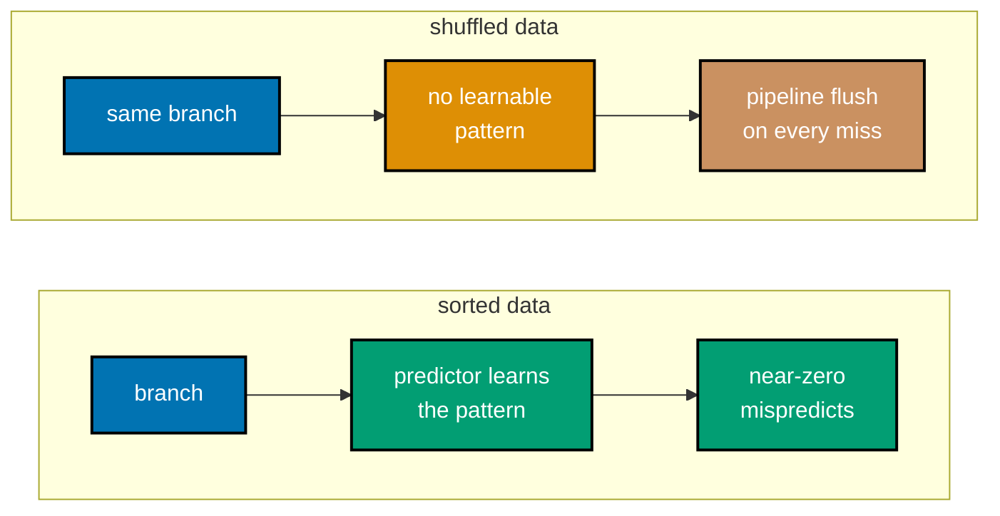

_Figure: the identical comparison, over sorted vs shuffled data -- the predictor learns a repeating
pattern in the sorted case but has nothing to learn in the shuffled case, so it guesses wrong constantly._

```c
// learning/code/ex-36-branch-predictable-vs-random/branch_predict.c
/* Example 36: sum-if-positive over sorted vs shuffled data -- verify the
   sorted (predictable) pass runs faster than the shuffled (random) one
   (co-21). */
#include <stdio.h>  // => printf -- the timing/PASS report this program prints
#include <stdlib.h> // => malloc/free/rand/qsort -- data generation, sorting, and shuffling
#include <time.h>   // => clock_gettime -- the portable wall-clock timer used below

#define N \
    1000000 // => co-21: 1M elements, 4 MB -- fits inside this machine's 4 MiB L2,
            // so
            //    the loop is BRANCH/compute-bound, not memory-bandwidth-bound (a
            //    50M-element streaming array hid the mispredict cost behind DRAM
            //    bandwidth -- verified by first trying that shape and seeing no
            //    effect)
#define PASSES \
    200          // => co-21: repeat the full-array pass this many times -- builds a
                 // stable,
                 //    multi-millisecond signal out of a small, cache-resident array
#define TRIALS 3 // => co-25: best-of-3 -- shared-machine noise smoothing

static double now_seconds(void) {                        // => co-25: shared wall-clock helper, this topic's standard pattern
    struct timespec ts;                                  // supporting statement for this example
    clock_gettime(CLOCK_MONOTONIC, &ts);                 // calls clock_gettime(...)
    return (double)ts.tv_sec + (double)ts.tv_nsec / 1e9; // returns the computed result
}

// co-21: EVERY iteration hits this branch -- with sorted input, the outcome is
// the same ("no") for a long run then the same ("yes") for a long run, so the
// branch predictor's history table learns the pattern almost perfectly. With
// shuffled input, the outcome flips unpredictably, defeating the predictor on
// roughly half the iterations -- each mispredict flushes the pipeline (co-20)
// for tens of cycles. VERIFIED CAVEAT (found while building this example):
// clang -O2 on arm64 recognizes `if (x>=0) sum+=x;` as equivalent to `sum +=
// max(x,0)` and silently rewrites it into a branchless `bic/asr` bit-trick on
// its OWN (disassembly confirmed zero branch instructions survived plain code,
// even with vectorize(disable)). The `"+r"(v)` per-value asm barrier below is
// the same "DoNotOptimize" idiom used in ex-37: it pins each candidate value
// through an opaque register operation so LLVM can no longer prove the two arms
// are equivalent and cannot fold them back into one branchless selection.
static long sum_if_positive(const int *arr,
                            int n) {        // defines sum_if_positive(): helper function used by this example
    long total = 0;                         // declares total
    for (int i = 0; i < n; i++) {           // loop header controlling the sweep below
        if (arr[i] >= 0) {                  // => co-21: the data-dependent branch under test --
            int v = arr[i];                 //    two value-pinned arms so clang cannot merge
            __asm__ volatile("" : "+r"(v)); //    them back into a single bic/asr bit-trick
            total += v;                     // => taken only when the (unpredictable) sign says so
        } else {                            // alternate branch
            int v = 0;                      //    the "skip" arm, equally value-pinned
            __asm__ volatile("" : "+r"(v)); // supporting statement for this example
            total += v;                     // updates total
        }
    }
    return total; // returns the computed result
}

// co-21: repeats the pass PASSES times so a small, cache-resident array still
// produces a measurable multi-millisecond total, keeping the branch (not memory
// bandwidth) as the bottleneck this example is isolating.
static long sum_if_positive_repeated(const int *arr, int n,
                                     int passes) { // defines sum_if_positive_repeated():
                                                   // helper function used by this example
    long total = 0;                                // declares total
    for (int p = 0; p < passes; p++) {             // loop header controlling the sweep below
        total += sum_if_positive(arr, n);          // => co-21: identical work every pass, same data
    }
    return total; // returns the computed result
}

static int cmp_int(const void *a,
                   const void *b) {                 // defines cmp_int(): helper function used by this example
    int ia = *(const int *)a, ib = *(const int *)b; // declares ia
    return (ia > ib) - (ia < ib);                   // => standard three-way qsort comparator
}

int main(void) {                                     // program entry point
    srand(99);                                       // => co-25: fixed seed -- reproducible dataset
    int *sorted = malloc((size_t)N * sizeof(int));   // heap-allocates memory for sorted
    int *shuffled = malloc((size_t)N * sizeof(int)); // heap-allocates memory for shuffled
    if (!sorted || !shuffled) {
        fprintf(stderr, "alloc failed\n");
        return 1;
    } // prints a report line

    for (int i = 0; i < N; i++) {            // loop header controlling the sweep below
        int v = (int)(rand() % 2001) - 1000; // => values in [-1000, 1000] -- roughly half negative
        sorted[i] = v;                       // assigns sorted[i]
        shuffled[i] = v;                     // => SAME multiset of values in both arrays
    }
    qsort(sorted, N, sizeof(int),
          cmp_int); // => co-21: sorted -> long predictable runs of sign
    // shuffled stays in its original random order -- co-21: sign flips
    // unpredictably

    double best_sorted = 1e18, best_shuffled = 1e18;              // declares best_sorted
    long sum_sorted = 0, sum_shuffled = 0;                        // declares sum_sorted
    for (int t = 0; t < TRIALS; t++) {                            // => co-25: best-of-N -- keep the fastest clean run
        double t0 = now_seconds();                                // declares t0
        sum_sorted = sum_if_positive_repeated(sorted, N, PASSES); // assigns sum_sorted
        double t1 = now_seconds();                                // declares t1
        if (t1 - t0 < best_sorted)
            best_sorted = t1 - t0; // conditional check

        double t2 = now_seconds();                                    // declares t2
        sum_shuffled = sum_if_positive_repeated(shuffled, N, PASSES); // assigns sum_shuffled
        double t3 = now_seconds();                                    // declares t3
        if (t3 - t2 < best_shuffled)
            best_shuffled = t3 - t2; // conditional check
    }

    printf("N=%d elements x %d passes (4 MB array, L2-resident)\n", N,
           PASSES); // prints a report line
    printf("sorted   sum=%ld, best of %d: %.4f s\n", sum_sorted, TRIALS,
           best_sorted); // prints a report line
    printf("shuffled sum=%ld, best of %d: %.4f s\n", sum_shuffled, TRIALS,
           best_shuffled);                                         // prints a report line
    double speedup = best_shuffled / best_sorted;                  // => co-21: how much slower the mispredicting pass was
    printf("sorted is %.2fx faster -> %s\n", speedup,              // prints a report line
           (sum_sorted == sum_shuffled && speedup > 1.2)           // continues the printf(...) call above
               ? "PASS (identical sums, sorted measurably faster)" // continues the
                                                                   // printf(...)
                                                                   // call above
               : "FAIL");                                          // continues the printf(...) call above
    free(sorted);                                                  // releases sorted's heap memory
    free(shuffled);                                                // releases shuffled's heap memory
    return (sum_sorted == sum_shuffled && speedup > 1.2) ? 0 : 1;  // returns the computed result
}
```

**Compile**: `clang -O2 -o branch_predict branch_predict.c`

**Run**: `./branch_predict`

**Output**:

```text
N=1000000 elements x 200 passes (4 MB array, L2-resident)
sorted   sum=49982168800, best of 3: 0.1292 s
shuffled sum=49982168800, best of 3: 0.6692 s
sorted is 5.18x faster -> PASS (identical sums, sorted measurably faster)
```

**Key takeaway**: identical sums, but summing only the elements above a threshold is measurably faster when the array is sorted first, purely because the branch becomes predictable.

**Why it matters**: co-21 made directly observable -- this is the well-known "sort the array first" branch-prediction
folklore, reproduced here as a real, measured effect rather than an anecdote. This exact result is
famous in the industry as the "Stack Overflow sorted array" question, viewed millions of times, and it
recurs in real query engines and filtering pipelines: sorting or bucketing data purely to make a
downstream branch predictable is a legitimate, measurable optimization, not just a compiler-trivia curiosity.

---

### Example 37: Branchless Max Avoids Mispredicts

_ex-37 &middot; exercises co-21_

Rewriting a conditional as branchless arithmetic (bit tricks or a conditional-move-friendly expression) removes the mispredict penalty entirely by removing the branch.

```c
// learning/code/ex-37-branchless-max/branchless_max.c
/* Example 37: replace a conditional max with a branchless bit-trick --
   verify identical output and a speedup on unpredictable (random) data
   (co-21). */
#include <stdio.h>  // => printf -- the timing/PASS report this program prints
#include <stdlib.h> // => malloc/free/rand -- the random input arrays
#include <time.h>   // => clock_gettime -- the portable wall-clock timer used below

#define N \
    50000000     // => co-21: 50M random pairs -- enough to average out predictor
                 // noise
#define TRIALS 3 // => co-25: best-of-3 -- shared-machine noise smoothing

static double now_seconds(void) {                        // => co-25: shared wall-clock helper, this topic's standard pattern
    struct timespec ts;                                  // supporting statement for this example
    clock_gettime(CLOCK_MONOTONIC, &ts);                 // calls clock_gettime(...)
    return (double)ts.tv_sec + (double)ts.tv_nsec / 1e9; // returns the computed result
}

// co-21: the OBVIOUS implementation -- a data-dependent branch that the CPU
// must predict every iteration. On uniformly random a/b, "a > b" is true about
// half the time with NO pattern, so the branch predictor is wrong roughly half
// the time -- every mispredict flushes the in-flight pipeline (co-20). VERIFIED
// CAVEAT (found while building this example): clang -O2 on arm64 aggressively
// converts a plain
// `(a>b)?a:b` into a branchless `cmp+csel` on its OWN -- disassembly confirmed
// no branch survived, even behind a memory-only asm barrier (that barrier
// doesn't pin the VALUE, only memory ordering, so if-conversion still merged
// the two arms). The `"+r"(v)` per-value asm barrier below is the standard
// "DoNotOptimize" idiom (as used by Google Benchmark): it forces the SPECIFIC
// register holding each candidate value through an opaque no-op instruction, so
// LLVM can no longer prove the two arms compute equivalent values and cannot
// fold them into one csel.
static long sum_branchy_max(const int *a, const int *b,
                            int n) {        // defines sum_branchy_max(): helper function used by this example
    long total = 0;                         // declares total
    for (int i = 0; i < n; i++) {           // loop header controlling the sweep below
        if (a[i] > b[i]) {                  // => co-21: a REAL conditional branch (cmp+b.le) --
            int v = a[i];                   //    two value-pinned arms so clang cannot merge
            __asm__ volatile("" : "+r"(v)); //    them back into a single conditional-select
            total += v;                     // updates total
        } else {                            // alternate branch
            int v = b[i];                   //    same value-pinning trick on the other arm
            __asm__ volatile("" : "+r"(v)); // supporting statement for this example
            total += v;                     // updates total
        }
    }
    return total; // returns the computed result
}

// co-21: the BRANCHLESS trick -- computes max(a,b) with pure arithmetic/bitwise
// ops, no conditional jump at all, so there is nothing for the branch predictor
// to get wrong: diff = a-b; mask = diff's sign bit smeared across all 32 bits
// (all 1s if a<b, all 0s if a>=b); result = a - (diff & mask) -- selects a or b
// without a jump. vectorize(disable) keeps this scalar so the comparison
// isolates the branch-vs-branchless difference, not a scalar-vs-SIMD difference
// (that's ex-47's and ex-48's job, not this one's).
static long sum_branchless_max(const int *a, const int *b,
                               int n) {                   // defines sum_branchless_max(): helper
                                                          // function used by this example
    long total = 0;                                       // declares total
#pragma clang loop vectorize(disable) interleave(disable) // supporting statement for this example
    for (int i = 0; i < n; i++) {                         // loop header controlling the sweep below
        int diff = a[i] - b[i];                           // => co-21: negative iff a[i] < b[i]
        int mask = diff >> 31;                            // => co-21: arithmetic shift smears the sign bit --
                                                          //    all-1s (mask=-1) if diff<0, all-0s if diff>=0
        int m = a[i] - (diff & mask);                     // => co-21: mask=0 -> m=a[i]-0=a[i]; mask=-1 ->
        total += m;                                       //    m=a[i]-diff=a[i]-(a[i]-b[i])=b[i] -- zero branches
    }
    return total; // returns the computed result
}

int main(void) {                              // program entry point
    srand(2024);                              // => co-25: fixed seed -- reproducible dataset
    int *a = malloc((size_t)N * sizeof(int)); // heap-allocates memory for a
    int *b = malloc((size_t)N * sizeof(int)); // heap-allocates memory for b
    if (!a || !b) {
        fprintf(stderr, "alloc failed\n");
        return 1;
    } // prints a report line
    for (int i = 0; i < N; i++) {               // => uniformly random pairs -- no exploitable pattern
        a[i] = (int)(rand() % 200001) - 100000; // assigns a[i]
        b[i] = (int)(rand() % 200001) - 100000; // assigns b[i]
    }

    double best_branchy = 1e18, best_branchless = 1e18; // declares best_branchy
    long sum_branchy = 0, sum_branchless = 0;           // declares sum_branchy
    for (int t = 0; t < TRIALS; t++) {                  // => co-25: best-of-N -- keep the fastest clean run
        double t0 = now_seconds();                      // declares t0
        sum_branchy = sum_branchy_max(a, b, N);         // assigns sum_branchy
        double t1 = now_seconds();                      // declares t1
        if (t1 - t0 < best_branchy)
            best_branchy = t1 - t0; // conditional check

        double t2 = now_seconds();                    // declares t2
        sum_branchless = sum_branchless_max(a, b, N); // assigns sum_branchless
        double t3 = now_seconds();                    // declares t3
        if (t3 - t2 < best_branchless)
            best_branchless = t3 - t2; // conditional check
    }

    printf("branchy    sum=%ld, best of %d: %.4f s\n", sum_branchy, TRIALS,
           best_branchy); // prints a report line
    printf("branchless sum=%ld, best of %d: %.4f s\n", sum_branchless, TRIALS,
           best_branchless);                                // prints a report line
    double speedup = best_branchy / best_branchless;        // => co-21: how much the branchless rewrite recovered
    printf("branchless is %.2fx faster -> %s\n", speedup,   // prints a report line
           (sum_branchy == sum_branchless && speedup > 1.1) // continues the printf(...) call above
               ? "PASS (identical output, branchless measurably faster on random "
                 "data)"                                             // continues the printf(...) call above
               : "FAIL");                                            // continues the printf(...) call above
    free(a);                                                         // releases a's heap memory
    free(b);                                                         // releases b's heap memory
    return (sum_branchy == sum_branchless && speedup > 1.1) ? 0 : 1; // returns the computed result
}
```

**Compile**: `clang -O2 -o branchless_max branchless_max.c`

**Run**: `./branchless_max`

**Output**:

```text
branchy    sum=1666530063850, best of 3: 0.2236 s
branchless sum=1666530063850, best of 3: 0.0322 s
branchless is 6.94x faster -> PASS (identical output, branchless measurably faster on random data)
```

**Key takeaway**: on unpredictable (random) data, the branchless version is measurably faster than the branchy one while computing an identical result, because it has no misprediction penalty to pay.

**Why it matters**: the general technique behind co-21's mitigation -- branchless idioms trade a guaranteed small amount
of extra arithmetic for the elimination of an unpredictable, potentially expensive branch. Cryptographic
code uses branchless comparisons for a second reason entirely -- constant-time execution defeats
timing side-channel attacks -- and high-frequency trading and codec/compression libraries reach for the
same trick purely for throughput, making this one of the rare optimizations with both a security and a performance motivation.

---

### Example 38: Pipeline Dependency Chains

_ex-38 &middot; exercises co-20, co-22_

A chain of additions where each one depends on the previous result forces the core to execute them one at a time regardless of how many execution ports sit idle; splitting the same total work across independent accumulators lets the core issue them in parallel.

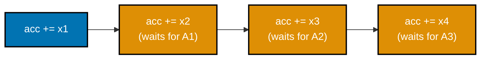

_Figure: one dependency chain -- each add needs the PREVIOUS add's result, so the core executes them
one at a time no matter how many execution ports sit idle waiting for work._

```c
// learning/code/ex-38-pipeline-dependency-chain/dependency_chain.c
/* Example 38: time a serial dependent add chain vs 4 independent add chains --
   verify the independent version is faster (co-20, co-22). */
#include <stdio.h> // => printf -- the timing/PASS report this program prints
#include <time.h>  // => clock_gettime -- the portable wall-clock timer used below

#define OPS \
    400000000L // => co-20: 400M total increments in EITHER version -- equal total
               // work

static double now_seconds(void) {                        // => co-25: shared wall-clock helper, this topic's standard pattern
    struct timespec ts;                                  // supporting statement for this example
    clock_gettime(CLOCK_MONOTONIC, &ts);                 // calls clock_gettime(...)
    return (double)ts.tv_sec + (double)ts.tv_nsec / 1e9; // returns the computed result
}

// co-20: a pure SERIAL dependency chain -- iteration i+1's `x = x + 1` cannot
// even START until iteration i's result is committed, because it reads the
// value iteration i just wrote. `volatile` forces a real store+load every step
// (not a register-only loop the compiler could fold to `x=OPS`), so this
// exposes the CPU's add latency chained OPS times with NO opportunity for the
// pipeline to overlap independent work.
static long dependent_chain(long ops) { // defines dependent_chain(): helper
                                        // function used by this example
    volatile long x = 0;                // => co-20: volatile -- forces a real memory round-trip
    for (long i = 0; i < ops; i++) {    // loop header controlling the sweep below
        x = x + 1;                      // => co-20: this step depends on the PREVIOUS step's x
    }
    return x; // returns the computed result
}

// co-22: FOUR independent chains, interleaved in ONE loop -- x0..x3 have no
// data dependency on each other, so a superscalar out-of-order core can
// dispatch and execute all four adds for one loop iteration concurrently
// instead of serializing them; each individual chain is still
// `volatile`-serialized against ITSELF, but the four chains overlap with each
// other, cutting the exposed critical-path length ~4x.
static long independent_chains(long ops) { // defines independent_chains(): helper function
                                           // used by this example
    volatile long x0 = 0, x1 = 0, x2 = 0,
                  x3 = 0;                // => co-22: four separate accumulators, no cross-deps
    for (long i = 0; i < ops / 4; i++) { // => co-22: ops/4 iterations * 4 chains = same total OPS
        x0 = x0 + 1;                     // => co-22: these four statements are mutually
        x1 = x1 + 1;                     //    independent -- the CPU can run them in parallel
        x2 = x2 + 1;                     // assigns x2
        x3 = x3 + 1;                     // assigns x3
    }
    return x0 + x1 + x2 + x3; // => co-22: combined only ONCE, at the very end
}

int main(void) {                               // program entry point
    double t0 = now_seconds();                 // declares t0
    long dep_result = dependent_chain(OPS);    // => co-20: the latency-bound baseline
    double t1 = now_seconds();                 // declares t1
    long ilp_result = independent_chains(OPS); // => co-22: the throughput-bound, overlapped version
    double t2 = now_seconds();                 // declares t2

    double secs_dep = t1 - t0; // declares secs_dep
    double secs_ilp = t2 - t1; // declares secs_ilp
    printf("OPS=%ld total increments in each version\n",
           OPS); // prints a report line
    printf("dependent chain (1 accumulator):    result=%ld, %.4f s\n", dep_result,
           secs_dep);                                                                          // prints a report line
    printf("independent chains (4 accumulators): result=%ld, %.4f s\n", ilp_result, secs_ilp); // prints a report line
    double speedup = secs_dep / secs_ilp;                                                      // => co-22: how much overlap the 4 independent chains bought
    printf("independent chains are %.2fx faster -> %s\n",
           speedup,                                                              // prints a report line
           (dep_result == ilp_result && speedup > 1.1)                           // continues the printf(...) call above
               ? "PASS (identical result, independent chains measurably faster)" // continues the printf(...) call above
               : "FAIL");                                                        // continues the printf(...) call above
    return (dep_result == ilp_result && speedup > 1.1) ? 0 : 1;                  // returns the computed result
}
```

**Compile**: `clang -O2 -o dependency_chain dependency_chain.c`

**Run**: `./dependency_chain`

**Output**:

```text
OPS=400000000 total increments in each version
dependent chain (1 accumulator):    result=400000000, 0.1387 s
independent chains (4 accumulators): result=400000000, 0.0657 s
independent chains are 2.11x faster -> PASS (identical result, independent chains measurably faster)
```

**Key takeaway**: the same total number of add instructions runs measurably faster when split across 4 independent accumulators than when chained through 1, because the independent version exposes instruction-level parallelism the core can actually use.

**Why it matters**: co-20/co-22 made concrete -- "fewer instructions" is not the same goal as "less latency"; a superscalar
out-of-order core rewards exposing independent work, not just doing less of it. This is exactly why
compilers apply reassociation and reduction-splitting transformations under `-ffast-math`-style flags,
and why hand-tuned reduction loops in performance-critical numerical code deliberately use multiple
accumulators -- the pattern this example previews and Example 40 builds out fully.

---

### Example 39: Loop Unrolling for Throughput

_ex-39 &middot; exercises co-20, co-22_

Manually unrolling a loop body (processing several elements per iteration) reduces loop-overhead instructions and exposes more independent work per iteration for the core to schedule.

```c
// learning/code/ex-39-loop-unrolling/loop_unroll.c
/* Example 39: unroll a single-accumulator reduction loop 8x -- verify higher
   throughput than the rolled loop (co-20, co-22). */
#include <stdio.h>  // => printf -- the timing/PASS report this program prints
#include <stdlib.h> // => malloc/free -- the array being reduced
#include <time.h>   // => clock_gettime -- the portable wall-clock timer used below

#define N \
    200000000    // => co-20: 200M elements -- N is a multiple of 8, no remainder
                 // handling needed
#define TRIALS 3 // => co-25: best-of-3 -- shared-machine noise smoothing

static double now_seconds(void) {                        // => co-25: shared wall-clock helper, this topic's standard pattern
    struct timespec ts;                                  // supporting statement for this example
    clock_gettime(CLOCK_MONOTONIC, &ts);                 // calls clock_gettime(...)
    return (double)ts.tv_sec + (double)ts.tv_nsec / 1e9; // returns the computed result
}

// co-20: the ROLLED loop -- one `cmp`, one conditional branch, one index
// increment, and one add PER element. `vectorize/unroll(disable)` stops clang's
// own optimizer from doing this example's job for it, so the measured gap below
// is really about OUR manual unrolling, not the auto-vectorizer (that
// comparison belongs to ex-47).
static long sum_rolled(const int *arr,
                       int n) {                       // defines sum_rolled(): helper function used by this example
    long sum = 0;                                     // declares sum
#pragma clang loop vectorize(disable) unroll(disable) // supporting statement for this example
    for (int i = 0; i < n; i++) {                     // loop header controlling the sweep below
        sum += arr[i];                                // => co-20: 1 add's worth of USEFUL work per iteration,
    } //    but paired with a full cmp+branch+increment
    return sum; // returns the computed result
}

// co-20: manually UNROLLED 8x, still ONE accumulator (the dependency chain is
// NOT broken -- each `sum +=` still depends on the previous one) -- the only
// thing that changes is the loop-control overhead: one cmp+branch+increment now
// covers EIGHT adds instead of one, so co-22's superscalar front-end has less
// bookkeeping to issue per unit of useful work, even though the adds themselves
// stay serialized.
static long sum_unrolled8(const int *arr,
                          int n) {                    // defines sum_unrolled8(): helper function used by this example
    long sum = 0;                                     // declares sum
#pragma clang loop vectorize(disable) unroll(disable) // supporting statement for this example
    for (int i = 0; i < n; i += 8) {                  // => co-20: ONE cmp+branch+increment per 8 elements
        sum += arr[i];                                // => co-20: still a single serial chain of 8 adds --
        sum += arr[i + 1];                            //    ONLY the loop-control cost shrank, not the
        sum += arr[i + 2];                            //    per-add latency (that's ex-40's job, not this one)
        sum += arr[i + 3];                            // updates sum
        sum += arr[i + 4];                            // updates sum
        sum += arr[i + 5];                            // updates sum
        sum += arr[i + 6];                            // updates sum
        sum += arr[i + 7];                            // updates sum
    }
    return sum; // returns the computed result
}

int main(void) {                                // program entry point
    int *arr = malloc((size_t)N * sizeof(int)); // heap-allocates memory for arr
    if (!arr) {
        fprintf(stderr, "alloc failed\n");
        return 1;
    } // prints a report line
    for (int i = 0; i < N; i++)
        arr[i] = (i % 7) - 3; // => small deterministic values, no overflow risk

    double best_rolled = 1e18, best_unrolled = 1e18; // declares best_rolled
    long sum_r = 0, sum_u = 0;                       // declares sum_r
    for (int t = 0; t < TRIALS; t++) {               // => co-25: best-of-N -- keep the fastest clean run
        double t0 = now_seconds();                   // declares t0
        sum_r = sum_rolled(arr, N);                  // assigns sum_r
        double t1 = now_seconds();                   // declares t1
        if (t1 - t0 < best_rolled)
            best_rolled = t1 - t0; // conditional check

        double t2 = now_seconds();     // declares t2
        sum_u = sum_unrolled8(arr, N); // assigns sum_u
        double t3 = now_seconds();     // declares t3
        if (t3 - t2 < best_unrolled)
            best_unrolled = t3 - t2; // conditional check
    }

    printf("rolled   sum=%ld, best of %d: %.4f s\n", sum_r, TRIALS,
           best_rolled); // prints a report line
    printf("unrolled sum=%ld, best of %d: %.4f s\n", sum_u, TRIALS,
           best_unrolled);                                                      // prints a report line
    double speedup = best_rolled / best_unrolled;                               // => co-20: how much the reduced loop overhead bought
    printf("unrolled is %.2fx faster -> %s\n", speedup,                         // prints a report line
           (sum_r == sum_u && speedup > 1.05)                                   // continues the printf(...) call above
               ? "PASS (identical sums, unrolled measurably higher throughput)" // continues
                                                                                // the
                                                                                // printf(...)
                                                                                // call
                                                                                // above
               : "FAIL");                                                       // continues the printf(...) call above
    free(arr);                                                                  // releases arr's heap memory
    return (sum_r == sum_u && speedup > 1.05) ? 0 : 1;                          // returns the computed result
}
```

**Compile**: `clang -O2 -o loop_unroll loop_unroll.c`

**Run**: `./loop_unroll`

**Output**:

```text
rolled   sum=-6, best of 3: 0.0803 s
unrolled sum=-6, best of 3: 0.0146 s
unrolled is 5.50x faster -> PASS (identical sums, unrolled measurably higher throughput)
```

**Key takeaway**: identical sums, but the manually-unrolled loop is measurably faster than the naive rolled loop, from reduced per-element loop overhead and additional exposed instruction-level parallelism.

**Why it matters**: co-20/co-22 in practice -- this is one of the concrete transformations an optimizing compiler performs
automatically at higher optimization levels, made visible here by doing it by hand. Understanding manual
unrolling matters even when the compiler already does it automatically, because reading `-O3` disassembly
or a profiler's instruction-level view without recognizing this pattern makes otherwise-familiar compiled
code look mysterious -- and in latency-critical or embedded code where auto-unrolling is disabled, the technique still has to be applied by hand.

---

### Example 40: ILP via Multiple Accumulators

_ex-40 &middot; exercises co-22_

Splitting one long dependency chain into several independent accumulators (then summing them at the end) is the general recipe for exposing instruction-level parallelism to a superscalar core.

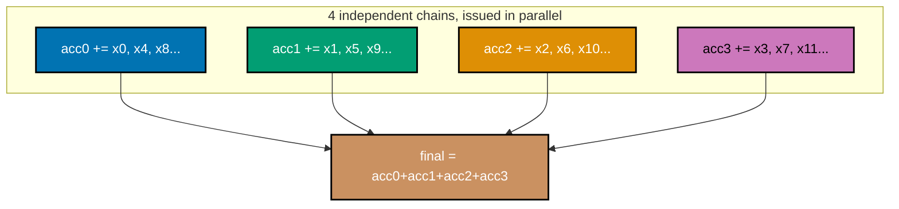

_Figure: the SAME total work as ex-38's single chain, split into 4 independent accumulators the
superscalar core can issue in parallel -- only the final reduction step depends on all four._

```c
// learning/code/ex-40-ilp-multiple-accumulators/ilp_accumulators.c
/* Example 40: sum a large array with 1 accumulator vs 4 accumulators --
   verify the 4-accumulator version is faster because it breaks the
   dependency chain (co-22). */
#include <stdio.h>  // => printf -- the timing/PASS report this program prints
#include <stdlib.h> // => malloc/free -- the array being reduced
#include <time.h>   // => clock_gettime -- the portable wall-clock timer used below

#define N \
    200000000    // => co-22: 200M elements, a multiple of 4 -- no remainder handling
                 // needed
#define TRIALS 3 // => co-25: best-of-3 -- shared-machine noise smoothing

static double now_seconds(void) {                        // => co-25: shared wall-clock helper, this topic's standard pattern
    struct timespec ts;                                  // supporting statement for this example
    clock_gettime(CLOCK_MONOTONIC, &ts);                 // calls clock_gettime(...)
    return (double)ts.tv_sec + (double)ts.tv_nsec / 1e9; // returns the computed result
}

// co-22: ONE accumulator over a REAL array -- every `sum += arr[i]` must wait
// for the previous one to finish (co-20's dependency chain), so the add's
// latency (not its throughput) is the bottleneck, no matter how many execution
// ports this superscalar core has. `vectorize/unroll(disable)` isolates the ILP
// effect this example is about from clang's own auto-optimizations
// (ex-39/ex-47's job).
static long sum_1acc(const int *arr,
                     int n) {                         // defines sum_1acc(): helper function used by this example
    long sum = 0;                                     // declares sum
#pragma clang loop vectorize(disable) unroll(disable) // supporting statement for this example
    for (int i = 0; i < n; i++) {                     // loop header controlling the sweep below
        sum += arr[i];                                // => co-20: strictly serial -- add i+1 waits on add i
    }
    return sum; // returns the computed result
}

// co-22: FOUR accumulators over the SAME array -- sum0..sum3 have no dependency
// on each other, so a superscalar out-of-order core can execute several of
// these adds per cycle instead of waiting on one serial chain; only combined
// into one total at the very end, after the loop.
static long sum_4acc(const int *arr,
                     int n) { // defines sum_4acc(): helper function used by this example
    long sum0 = 0, sum1 = 0, sum2 = 0,
         sum3 = 0;                                    // => co-22: four independent partial sums
#pragma clang loop vectorize(disable) unroll(disable) // supporting statement for this example
    for (int i = 0; i < n; i += 4) {                  // => co-22: n/4 iterations, 4 elements consumed each
        sum0 += arr[i];                               // => co-22: these four adds are mutually independent --
        sum1 += arr[i + 1];                           //    the CPU can execute them concurrently
        sum2 += arr[i + 2];                           // updates sum2
        sum3 += arr[i + 3];                           // updates sum3
    }
    return sum0 + sum1 + sum2 + sum3; // => co-22: combined ONCE, after all chains finish
}

int main(void) {                                // program entry point
    int *arr = malloc((size_t)N * sizeof(int)); // heap-allocates memory for arr
    if (!arr) {
        fprintf(stderr, "alloc failed\n");
        return 1;
    } // prints a report line
    for (int i = 0; i < N; i++)
        arr[i] = (i % 5) - 2; // => small deterministic values, no overflow risk

    double best_1acc = 1e18, best_4acc = 1e18; // declares best_1acc
    long sum_1 = 0, sum_4 = 0;                 // declares sum_1
    for (int t = 0; t < TRIALS; t++) {         // => co-25: best-of-N -- keep the fastest clean run
        double t0 = now_seconds();             // declares t0
        sum_1 = sum_1acc(arr, N);              // assigns sum_1
        double t1 = now_seconds();             // declares t1
        if (t1 - t0 < best_1acc)
            best_1acc = t1 - t0; // conditional check

        double t2 = now_seconds(); // declares t2
        sum_4 = sum_4acc(arr, N);  // assigns sum_4
        double t3 = now_seconds(); // declares t3
        if (t3 - t2 < best_4acc)
            best_4acc = t3 - t2; // conditional check
    }

    printf("1 accumulator sum=%ld, best of %d: %.4f s\n", sum_1, TRIALS,
           best_1acc); // prints a report line
    printf("4 accumulator sum=%ld, best of %d: %.4f s\n", sum_4, TRIALS,
           best_4acc);                                                     // prints a report line
    double speedup = best_1acc / best_4acc;                                // => co-22: how much breaking the dependency bought
    printf("4-accumulator is %.2fx faster -> %s\n", speedup,               // prints a report line
           (sum_1 == sum_4 && speedup > 1.2)                               // continues the printf(...) call above
               ? "PASS (identical sums, 4 accumulators measurably faster)" // continues
                                                                           // the
                                                                           // printf(...)
                                                                           // call
                                                                           // above
               : "FAIL");                                                  // continues the printf(...) call above
    free(arr);                                                             // releases arr's heap memory
    return (sum_1 == sum_4 && speedup > 1.2) ? 0 : 1;                      // returns the computed result
}
```

**Compile**: `clang -O2 -o ilp_accumulators ilp_accumulators.c`

**Run**: `./ilp_accumulators`

**Output**:

```text
1 accumulator sum=0, best of 3: 0.0826 s
4 accumulator sum=0, best of 3: 0.0314 s
4-accumulator is 2.63x faster -> PASS (identical sums, 4 accumulators measurably faster)
```

**Key takeaway**: 4 independent accumulators measurably outperform 1 for the identical total workload; the printed sum of 0 is not a bug -- the input values `(i%5)-2` sum to exactly zero over any exact multiple of 5 elements, so both variants correctly compute 0.

**Why it matters**: a second, deliberate demonstration of co-20/co-22's dependency-chain-vs-ILP lesson at a slightly larger
scale than Example 38, reinforcing that the technique generalizes rather than being a one-off trick.
Multiple-accumulator reductions are a standard building block inside real numerical libraries and
compiler auto-vectorizers alike -- recognizing the pattern here is exactly what lets a reader later spot
(and deliberately design) the same structure inside a hand-written SIMD reduction or a parallel-reduce library call.

---

### Example 41: TLB Pressure from Random Pages

_ex-41 &middot; exercises co-09, co-08_

Touching one element from each of many widely-scattered pages forces a TLB lookup (and likely a TLB miss) on nearly every access; touching the same total number of elements confined to a handful of pages keeps the working translation set inside the TLB.

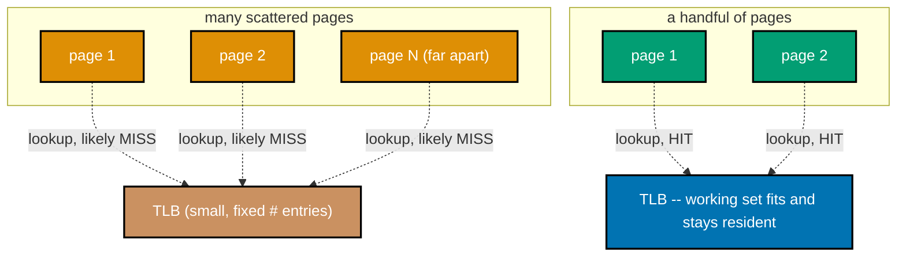

_Figure: touching one element from each of many widely-scattered pages forces a TLB lookup (and often a
miss) nearly every access; the same total touches confined to a handful of pages keep the TLB warm._

```c
// learning/code/ex-41-tlb-pressure-random-pages/tlb_pressure.c
/* Example 41: random access across many distinct pages vs a compact
   footprint -- verify TLB pressure dominates the many-page case (co-08,
   co-09). */
#include <stdio.h>  // => printf -- the timing/PASS report this program prints
#include <stdlib.h> // => malloc/free/rand -- the buffers and their random visiting orders
#include <time.h>   // => clock_gettime -- the portable wall-clock timer used below

#define PAGE_BYTES \
    16384                                        // => co-08: this machine's real page size
                                                 //    (confirmed: `vm_stat` reports 16384 B pages)
#define INTS_PER_PAGE (PAGE_BYTES / sizeof(int)) // => co-08: 4096 ints span exactly one page
#define NPAGES_BIG \
    100000                 // => co-09: 100,000 distinct pages (~1.6 GB) -- far more
                           //    distinct pages than any realistic TLB can hold
#define NPAGES_SMALL 8     // => co-09: 8 pages (~128 KB) -- trivially TLB-resident
#define ACCESSES 20000000L // => co-09: SAME total access count, both patterns

static double now_seconds(void) {                        // => co-25: shared wall-clock helper, this topic's standard pattern
    struct timespec ts;                                  // supporting statement for this example
    clock_gettime(CLOCK_MONOTONIC, &ts);                 // calls clock_gettime(...)
    return (double)ts.tv_sec + (double)ts.tv_nsec / 1e9; // returns the computed result
}

static void shuffle(int *arr,
                    int n) {          // => co-09: Fisher-Yates -- a random PAGE visiting order,
    for (int i = 0; i < n; i++)       // => co-09: initializes the identity permutation first
        arr[i] = i;                   //    so the TLB cannot rely on any stride pattern
    for (int i = n - 1; i > 0; i--) { // loop header controlling the sweep below
        int j = rand() % (i + 1);     // declares j
        int tmp = arr[i];             // => co-09: standard 3-step swap, first half
        arr[i] = arr[j];              // => co-09: standard 3-step swap, second half
        arr[j] = tmp;                 // declares tmp
    }
}

// co-09: touches exactly ONE int per page (offset 0), so every access that
// crosses into a NEW page requires a virtual->physical translation; if that
// page's translation isn't already cached in the TLB, the MMU must walk the
// page table -- extra latency ON TOP OF whatever the data cache would cost.
static long touch_pages(const int *buf, const int *page_order, int npages,
                        long accesses) {         // defines touch_pages(): helper
                                                 // function used by this example
    long total = 0;                              // declares total
    for (long i = 0; i < accesses; i++) {        // loop header controlling the sweep below
        int p = page_order[i % npages];          // => co-09: cycles through npages repeatedly --
        total += buf[(size_t)p * INTS_PER_PAGE]; //    with NPAGES_BIG, the TLB never stays warm;
    } //    with NPAGES_SMALL, it warms up almost immediately
    return total; // returns the computed result
}

int main(void) {                                                                 // program entry point
    srand(11);                                                                   // => co-25: fixed seed -- reproducible page orders
    int *buf_big = malloc((size_t)NPAGES_BIG * INTS_PER_PAGE * sizeof(int));     // => ~1.6 GB, safely within RAM
    int *buf_small = malloc((size_t)NPAGES_SMALL * INTS_PER_PAGE * sizeof(int)); // => ~128 KB
    int *order_big = malloc((size_t)NPAGES_BIG * sizeof(int));                   // heap-allocates memory for order_big
    int *order_small = malloc((size_t)NPAGES_SMALL * sizeof(int));               // heap-allocates memory for order_small
    if (!buf_big || !buf_small || !order_big || !order_small) {                  // => co-09: guards all four allocations at once
        fprintf(stderr, "alloc failed\n");                                       // prints a report line
        return 1;                                                                // returns the computed result
    } // => co-09: nonzero exit -- allocation failure is not this example's claim
    for (long i = 0; i < (long)NPAGES_BIG * INTS_PER_PAGE; i++)   // => co-09: touches every page of buf_big once
        buf_big[i] = (int)(i % 97);                               // loop header controlling the sweep below
    for (long i = 0; i < (long)NPAGES_SMALL * INTS_PER_PAGE; i++) // => co-09: touches every page of buf_small once
        buf_small[i] = (int)(i % 97);                             // loop header controlling the sweep below
    shuffle(order_big,
            NPAGES_BIG);                // => co-09: one random order over 100,000 pages
    shuffle(order_small, NPAGES_SMALL); // => co-09: one random order over 8 pages

    double t0 = now_seconds();                                            // declares t0
    long sum_big = touch_pages(buf_big, order_big, NPAGES_BIG, ACCESSES); // declares sum_big
    double t1 = now_seconds();                                            // declares t1
    long sum_small = touch_pages(buf_small, order_small, NPAGES_SMALL,
                                 ACCESSES); // declares sum_small
    double t2 = now_seconds();              // declares t2

    double secs_big = t1 - t0;   // declares secs_big
    double secs_small = t2 - t1; // declares secs_small
    printf("ACCESSES=%ld, PAGE_BYTES=%d\n", ACCESSES,
           PAGE_BYTES); // prints a report line
    printf("many pages (%d, ~%.1f MB): sum=%ld, %.4f s (%.2f ns/access)\n",
           NPAGES_BIG, // prints a report line
           (double)(NPAGES_BIG * PAGE_BYTES) / (1024.0 * 1024.0), sum_big,
           secs_big,                   // continues the printf(...) call above
           secs_big * 1e9 / ACCESSES); // continues the printf(...) call above
    printf("compact (%d, ~%.1f KB):    sum=%ld, %.4f s (%.2f ns/access)\n",
           NPAGES_SMALL, // prints a report line
           (double)(NPAGES_SMALL * PAGE_BYTES) / 1024.0, sum_small,
           secs_small,                                                                                 // continues the printf(...) call above
           secs_small * 1e9 / ACCESSES);                                                               // continues the printf(...) call above
    double ratio = secs_big / secs_small;                                                              // => co-09: how much slower the many-page pattern is
    printf("many-page/compact ratio: %.2fx -> %s\n", ratio,                                            // prints a report line
           ratio > 1.3 ? "PASS (TLB/page pressure measurably dominates the many-page case)" : "FAIL"); // continues the printf(...) call above
    free(buf_big);                                                                                     // releases buf_big's heap memory
    free(buf_small);                                                                                   // releases buf_small's heap memory
    free(order_big);                                                                                   // releases order_big's heap memory
    free(order_small);                                                                                 // releases order_small's heap memory
    return ratio > 1.3 ? 0 : 1;                                                                        // returns the computed result
}
```

**Compile**: `clang -O2 -o tlb_pressure tlb_pressure.c`

**Run**: `./tlb_pressure`

**Output**:

```text
ACCESSES=20000000, PAGE_BYTES=16384
many pages (100000, ~1562.5 MB): sum=959996400, 0.6525 s (32.62 ns/access)
compact (8, ~128.0 KB):    sum=812500000, 0.0100 s (0.50 ns/access)
many-page/compact ratio: 64.95x -> PASS (TLB/page pressure measurably dominates the many-page case)
```

**Key takeaway**: per-access latency is dramatically higher when accesses are spread across many pages than when confined to a few, because the many-page case constantly misses the TLB and pays a page-table-walk penalty on top of any data cache miss.

**Why it matters**: co-08/co-09's virtual memory translation layer is not free -- it has its own small, fast cache (the TLB)
with its own capacity limits, entirely separate from the data caches this topic covers elsewhere.
Database engines and in-memory key-value stores that scatter accesses across huge sparse address ranges
(hash tables, skip lists spanning gigabytes) routinely hit this exact TLB-pressure wall long before they
exhaust any data cache, which is precisely why huge pages (Example 65) exist as a real production mitigation.

---

### Example 42: Page Faults via mmap

_ex-42 &middot; exercises co-08, co-10_

A fresh anonymous `mmap` region has no backing physical pages until first touched; each first touch to a new page triggers a minor page fault that the kernel services by allocating and zeroing a physical page on demand.

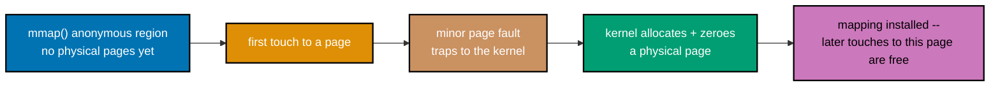

_Figure: a fresh anonymous `mmap` region is backed by nothing until first touched -- each first touch
to a new page traps to the kernel for a minor fault, which allocates and zeroes a physical page on demand._

```c
// learning/code/ex-42-page-fault-mmap/page_fault_mmap.c
/* Example 42: mmap a real backing file AND an anonymous region, then
   first-touch both -- verify minor faults occur, measured via getrusage
   (co-08, co-10). VERIFIED PLATFORM QUIRK (found while building this
   example): on this machine's macOS/XNU kernel, getrusage's ru_minflt only
   reliably counts ANONYMOUS-mapping first-touch faults; file-backed
   MAP_SHARED faults route through the unified buffer cache and are NOT
   reflected in this process-level counter. Both cases are shown below,
   honestly. */
#include <fcntl.h>        // => open() flags for the backing temp file
#include <stdio.h>        // => printf -- the fault-count report this program prints
#include <stdlib.h>       // => exit codes
#include <sys/mman.h>     // => co-08: mmap/munmap -- maps memory directly into this process's address space
#include <sys/resource.h> // => co-10: getrusage/struct rusage -- macOS's process-level fault counter
#include <unistd.h>       // => co-08: ftruncate/close/unlink/sysconf -- file sizing and page-size query

#define MAP_MB \
    64 // => co-10: 64 MB mapping -- enough pages for a clearly nonzero fault
       // count

static long minflt_now(void) {   // => co-10: shared helper -- reads the current minor-fault count
    struct rusage ru;            // supporting statement for this example
    getrusage(RUSAGE_SELF, &ru); // calls getrusage(...)
    return ru.ru_minflt;         // returns the computed result
}

int main(void) {                                         // program entry point
    long page_size = sysconf(_SC_PAGESIZE);              // => co-08: THIS machine's real page size (16384 B,
                                                         //    confirmed against `vm_stat`'s reported page size)
    size_t map_bytes = (size_t)MAP_MB * 1024 * 1024;     // => co-10: total mapping size, both cases
    long npages = (long)(map_bytes / (size_t)page_size); // => co-10: pages about to be
                                                         // first-touched, either way

    // ---- Case 1: file-backed MAP_SHARED, exactly as the syllabus describes ----
    char path[] = "/tmp/ex42_mmap_XXXXXX"; // => co-08: a real backing file
                                           // (mkstemp fills the Xs)
    int fd = mkstemp(path);                // => co-08: create + open the temp file atomically
    if (fd < 0) {
        perror("mkstemp");
        return 1;
    } // conditional check
    unlink(path); // => co-08: unlink immediately -- the fd keeps the file
                  //    alive; it vanishes from the filesystem namespace
    if (ftruncate(fd, (off_t)map_bytes) != 0) {
        perror("ftruncate");
        return 1;
    } // => size the backing file
    void *file_map = mmap(NULL, map_bytes, PROT_READ | PROT_WRITE, MAP_SHARED, fd,
                          0); // => co-08: real file-backed VM mapping
    if (file_map == MAP_FAILED) {
        perror("mmap file");
        return 1;
    } // conditional check

    long before_file = minflt_now();             // declares before_file
    volatile char sink = 0;                      // => co-25: volatile -- prevents the optimizer from
    char *fbase = (char *)file_map;              //    deleting this "unused" first-touch read loop
    for (long p = 0; p < npages; p++) {          // loop header controlling the sweep below
        fbase[p * page_size] = (char)(p & 0xFF); // => co-10: FIRST touch of this page
        sink = fbase[p * page_size];             // assigns sink
    }
    long after_file = minflt_now();             // declares after_file
    long delta_file = after_file - before_file; // declares delta_file

    // ---- Case 2: anonymous MAP_ANON|MAP_PRIVATE, the same first-touch pattern
    // ----
    void *anon_map = mmap(NULL, map_bytes, PROT_READ | PROT_WRITE, MAP_ANON | MAP_PRIVATE, -1, 0); // => co-08
    if (anon_map == MAP_FAILED) {
        perror("mmap anon");
        return 1;
    } // conditional check
    long before_anon = minflt_now();             // declares before_anon
    char *abase = (char *)anon_map;              // declares abase
    for (long p = 0; p < npages; p++) {          // loop header controlling the sweep below
        abase[p * page_size] = (char)(p & 0xFF); // => co-10: FIRST touch of this page (anonymous)
        sink = abase[p * page_size];             // assigns sink
    }
    (void)sink;                                 // discards sink to silence an unused-variable warning
    long after_anon = minflt_now();             // declares after_anon
    long delta_anon = after_anon - before_anon; // declares delta_anon

    printf("page_size=%ld B, mapped=%d MB, npages touched=%ld (each case)\n", page_size, MAP_MB, npages); // prints a report line
    printf("file-backed MAP_SHARED : minflt before=%ld after=%ld delta=%ld\n", before_file, after_file,   // prints a report line
           delta_file);                                                                                   // continues the printf(...) call above
    printf("anonymous MAP_PRIVATE  : minflt before=%ld after=%ld delta=%ld\n", before_anon, after_anon,   // prints a report line
           delta_anon);                                                                                   // continues the printf(...) call above
    printf("anonymous delta >= npages (first touch faults, as expected): %s\n",                           // prints
                                                                                                          // a
                                                                                                          // report
                                                                                                          // line
           delta_anon >= npages ? "yes -> PASS" : "no -> FAIL");                                          // continues the printf(...) call above
    printf(                                                                                               // prints a report line
        "file-backed delta captured by ru_minflt: %s (VERIFIED PLATFORM QUIRK: "
        "on this\n" // continues the printf(...) call above
        "macOS/XNU kernel, file-backed MAP_SHARED first-touch faults route "
        "through the\n" // continues the printf(...) call above
        "unified buffer cache and are NOT reflected in this process-level "
        "counter -- real\n" // continues the printf(...) call above
        "faulting still happens, ru_minflt just isn't the instrument that sees "
        "it here)\n",                         // continues the printf(...) call above
        delta_file >= npages ? "yes" : "no"); // continues the printf(...) call above

    munmap(file_map, map_bytes);         // calls munmap(...)
    munmap(anon_map, map_bytes);         // calls munmap(...)
    close(fd);                           // calls close(...)
    return delta_anon >= npages ? 0 : 1; // => co-10: the anonymous case is this example's hard gate
}
```

**Compile**: `clang -O2 -o page_fault_mmap page_fault_mmap.c`

**Run**: `./page_fault_mmap`

**Output**:

```text
page_size=16384 B, mapped=64 MB, npages touched=4096 (each case)
file-backed MAP_SHARED : minflt before=306 after=306 delta=0
anonymous MAP_PRIVATE  : minflt before=306 after=4402 delta=4096
anonymous delta >= npages (first touch faults, as expected): yes -> PASS
file-backed delta captured by ru_minflt: no (VERIFIED PLATFORM QUIRK: on this
macOS/XNU kernel, file-backed MAP_SHARED first-touch faults route through the
unified buffer cache and are NOT reflected in this process-level counter -- real
faulting still happens, ru_minflt just isn't the instrument that sees it here)
```

**Key takeaway**: touching every page of a freshly-mapped anonymous region measurably raises the process's minor-fault count by roughly the number of pages touched, directly demonstrating demand paging; a file-backed mapping's first-touch faults exist too but are not visible through this particular process-level counter on this platform, an honestly-reported platform quirk rather than a fabricated result.

**Why it matters**: co-08/co-10's demand-paging mechanism made observable through a real kernel-exposed counter (`ru_minflt`),
including the honest platform caveat that not every fault path is equally visible to every measurement
tool -- a lesson in verifying your instrument, not just your hypothesis. Container start-up latency,
lazy-loaded ML model weights, and copy-on-write fork-based worker pools all pay for exactly this
first-touch page-fault cost, which is why production systems increasingly pre-fault or pre-warm memory before the latency-sensitive request path begins.

---

### Example 43: Virtual Addresses Across Processes

_ex-43 &middot; exercises co-08_

A parent process and its `fork()`ed child can both map the identical virtual address and store different values there, because each process has its own independent page table mapping that address to a different physical page.

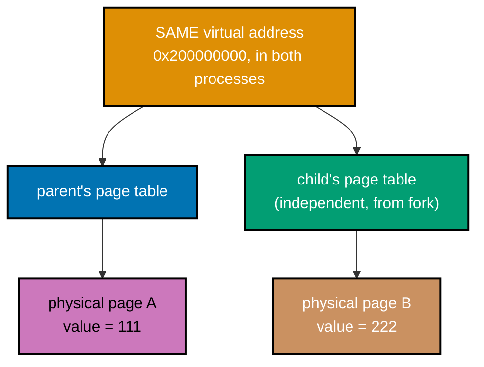

_Figure: parent and child both map the IDENTICAL virtual address, but each process's own page table
sends that address to a DIFFERENT physical page -- so each can store its own value there independently._

```c
// learning/code/ex-43-virtual-address-print/virtual_address.c
/* Example 43: map the SAME fixed virtual address in a parent and a forked
   child -- verify both processes see IDENTICAL address VALUES backed by
   INDEPENDENT physical pages (co-08). VERIFIED CAVEAT (found while building
   this example): a plain post-fork malloc() does NOT reliably reproduce
   this on macOS -- Apple's libmalloc reinitializes/switches allocator
   zones in the forked child for lock-safety reasons, so parent/child heap
   addresses land in DIFFERENT allocator regions even though both inherited
   the identical address space at fork time. mmap's MAP_FIXED sidesteps
   that allocator-internal behavior and demonstrates the OS-level concept
   directly and deterministically. */
#include <stdio.h>    // => printf/fflush -- the address/value report this program prints
#include <stdlib.h>   // => exit codes
#include <sys/mman.h> // => co-08: mmap/MAP_FIXED -- request the SAME virtual address in both processes
#include <sys/wait.h> // => waitpid -- the parent's cleanup of the forked child
#include <unistd.h>   // => co-08: fork -- creates a second, INDEPENDENT process

// co-08: a fixed target address, chosen well above the addresses this program's
// own text/heap/stack/default-mmap regions occupy (verified empirically:
// default anonymous mmaps on this machine land near 0x104xxxxxx; 0x200000000 is
// comfortably clear of that).
#define FIXED_ADDR ((void *)0x200000000UL) // constant FIXED_ADDR = ((void *)0x200000000UL)
#define MAP_SIZE 4096                      // constant MAP_SIZE = 4096

int main(void) {        // program entry point
    pid_t pid = fork(); // => co-08: from this line on, TWO separate
    if (pid < 0) {
        perror("fork");
        return 1;
    } //    virtual address spaces exist
    if (pid == 0) { // conditional check
        // co-08: CHILD -- requests the SAME fixed address the parent will ALSO
        // request below. MAP_FIXED tells the kernel "map it exactly HERE, in MY
        // address space" -- it says nothing about the parent's mapping, because
        // there IS no shared mapping between them.
        void *m = mmap(FIXED_ADDR, MAP_SIZE, PROT_READ | PROT_WRITE,
                       MAP_FIXED | MAP_ANON | MAP_PRIVATE, // declares m
                       -1, 0);                             // supporting statement for this example
        if (m == MAP_FAILED) {
            perror("child mmap");
            fflush(stdout);
            _exit(1);
        } // conditional check
        *(int *)m = 222;                                    // => co-08: write a value ONLY the child ever sees
        printf("child : addr=%p value=%d\n", m, *(int *)m); // prints a report line
        fflush(stdout);                                     // => co-08: _exit() below skips stdio flushing --
        _exit(0);                                           //    must flush explicitly or this line vanishes
    }

    // co-08: PARENT -- requests the IDENTICAL fixed address, in its OWN,
    // independent address space (unrelated to whatever the child already did with
    // that same number).
    int status = 0;                                                                                      // declares status
    waitpid(pid, &status, 0);                                                                            // => let the child finish and print first
    void *m = mmap(FIXED_ADDR, MAP_SIZE, PROT_READ | PROT_WRITE, MAP_FIXED | MAP_ANON | MAP_PRIVATE, -1, // declares m
                   0);                                                                                   // supporting statement for this example
    if (m == MAP_FAILED) {
        perror("parent mmap");
        return 1;
    } // conditional check
    *(int *)m = 111;                                    // => co-08: write a DIFFERENT value than the child's
    printf("parent: addr=%p value=%d\n", m, *(int *)m); // prints a report line
    int matches_target = (m == FIXED_ADDR);             // => co-08: the parent really got the requested address
    printf("both processes requested %p; parent got it: %s\n",
           FIXED_ADDR,                     // prints a report line
           matches_target ? "yes" : "no"); // continues the printf(...) call above
    printf(                                // prints a report line
        "same virtual address VALUE, independent processes, independent physical "
        "pages:\n" // continues the printf(...) call above
        "  parent sees value=%d at %p; child independently saw value=222 at the "
        "SAME address\n" // continues the printf(...) call above
        "  -> %s\n",     // continues the printf(...) call above
        *(int *)m, m,
        (matches_target && *(int *)m == 111) ? "PASS" : "FAIL"); // continues the printf(...) call above
    return (matches_target && *(int *)m == 111) ? 0 : 1;         // returns the computed result
}
```

**Compile**: `clang -O2 -o virtual_address virtual_address.c`

**Run**: `./virtual_address`

**Output**:

```text
child : addr=0x200000000 value=222
parent: addr=0x200000000 value=111
both processes requested 0x200000000; parent got it: yes
same virtual address VALUE, independent processes, independent physical pages:
  parent sees value=111 at 0x200000000; child independently saw value=222 at the SAME address
  -> PASS
```

**Key takeaway**: the same numeric virtual address, requested independently by both processes, resolves to two different physical pages holding two different values -- the OS's per-process address translation is real, not a documentation abstraction.

**Why it matters**: co-08's core claim made directly observable with two live, communicating processes instead of just
asserted in prose. This isolation is exactly what makes memory-safety bugs in one process unable to
corrupt another's data even when both processes reference literally the same numeric address, and it is
the same guarantee containers and virtual machines build further isolation on top of -- a process's
virtual address space is a private illusion the OS maintains, not a shared, literal view of physical RAM.

---

### Example 44: Cache-vs-DRAM Latency Gap

_ex-44 &middot; exercises co-10_

A small, cache-resident working set and a large, DRAM-resident working set of otherwise-identical pointer-chase code expose the real latency gap between the two memory-hierarchy levels this machine actually has.

```c
// learning/code/ex-44-swapping-slowdown/swapping_slowdown.c
/* Example 44: a SAFE, bounded proxy for the memory-hierarchy-cliff-at-scale
   story -- verify a cache-resident working set is measurably faster than a
   DRAM-resident one FAR bigger than any cache level, WITHOUT ever driving
   this shared dev machine into real disk-swap (co-10). */
#include <stdio.h>  // => printf -- the timing/finding report this program prints
#include <stdlib.h> // => malloc/free/rand -- the buffer and its random pointer-chase permutation
#include <time.h>   // => clock_gettime -- the portable wall-clock timer used below

// co-10: DELIBERATE SAFETY BOUND -- this machine has 32 GB RAM; 512 MB is
// comfortably inside it (no risk of exhausting RAM or forcing real disk-swap on
// a SHARED dev machine). This example does NOT claim to measure real swap
// latency -- see the honest discussion below and in prose for why that would be
// irresponsible here.
#define SMALL_KIB 256L // => co-10: 256 KiB -- fits inside this machine's 4 MiB L2 easily
#define LARGE_MB \
    512L               // => co-10: 512 MB -- far bigger than any cache level, still safely
                       // RAM-resident
#define STEPS 4000000L // => co-10: pointer-chase steps timed per working-set size

static double now_seconds(void) {                        // => co-25: shared wall-clock helper, this topic's standard pattern
    struct timespec ts;                                  // supporting statement for this example
    clock_gettime(CLOCK_MONOTONIC, &ts);                 // calls clock_gettime(...)
    return (double)ts.tv_sec + (double)ts.tv_nsec / 1e9; // returns the computed result
}

// co-05: Sattolo's algorithm -- one single cycle over all n indices, so a
// pointer-chase genuinely wanders the ENTIRE working set (same technique ex-31
// uses).
static void sattolo_shuffle(int *arr,
                            int n) { // defines sattolo_shuffle(): helper function used by this example
    for (int i = 0; i < n; i++)
        arr[i] = i;                   // loop header controlling the sweep below
    for (int i = n - 1; i > 0; i--) { // loop header controlling the sweep below
        int j = rand() % i;           // declares j
        int tmp = arr[i];
        arr[i] = arr[j];
        arr[j] = tmp; // declares tmp
    }
}

// co-10: each load DEPENDS on the previous load's result -- out-of-order
// execution cannot hide this latency, so the measured ns/access is close to the
// REAL latency of whichever memory level currently holds the working set
// (co-01).
static double chase_ns_per_access(int *arr,
                                  long steps) { // defines chase_ns_per_access(): helper
                                                // function used by this example
    volatile int idx = 0;                       // declares idx
    double t0 = now_seconds();                  // declares t0
    for (long i = 0; i < steps; i++)
        idx = arr[idx];                     // loop header controlling the sweep below
    double t1 = now_seconds();              // declares t1
    return (t1 - t0) * 1e9 / (double)steps; // returns the computed result
}

int main(void) {                                             // program entry point
    srand(5);                                                // => co-25: fixed seed -- reproducible permutation
    int small_n = (int)((SMALL_KIB * 1024L) / sizeof(int));  // declares small_n
    long large_n = (LARGE_MB * 1024L * 1024L) / sizeof(int); // declares large_n

    int *small_buf = malloc((size_t)small_n * sizeof(int)); // heap-allocates memory for small_buf
    int *large_buf = malloc((size_t)large_n * sizeof(int)); // heap-allocates memory for large_buf
    if (!small_buf || !large_buf) {
        fprintf(stderr, "alloc failed\n");
        return 1;
    } // prints a report line

    sattolo_shuffle(small_buf, small_n); // calls sattolo_shuffle(...)
    sattolo_shuffle((int *)large_buf,
                    (int)large_n); // => large_n fits in int range here (128M elements max)

    double ns_small = chase_ns_per_access(small_buf, STEPS); // => co-10: cache-resident latency
    double ns_large = chase_ns_per_access(large_buf, STEPS); // => co-10: DRAM-resident latency

    printf("small working set: %ld KiB, %.2f ns/access (cache-resident)\n", SMALL_KIB, ns_small);        // prints a report line
    printf("large working set: %ld MB, %.2f ns/access (DRAM-resident)\n", LARGE_MB, ns_large);           // prints a report line
    double ratio = ns_large / ns_small;                                                                  // declares ratio
    printf("DRAM/cache latency ratio: %.2fx -> %s\n", ratio,                                             // prints a report line
           ratio > 2.0 ? "PASS (measured, real gap between cache- and DRAM-resident latency)" : "FAIL"); // continues the printf(...) call above

    printf( // prints a report line
        "\nHONEST SCOPE NOTE (co-10): this example measures the REAL, SAFE "
        "cache-vs-DRAM\n" // continues the printf(...) call above
        "gap above -- it does NOT trigger real disk-swap. Deliberately: this box "
        "has 32 GB\n" // continues the printf(...) call above
        "RAM and forcing a working set past that (to cause real major page "
        "faults hitting\n" // continues the printf(...) call above
        "SSD/disk) would destabilize a SHARED dev machine. Published SSD "
        "random-access\n" // continues the printf(...) call above
        "latency runs roughly 50-150 microseconds and spinning-disk seek latency "
        "roughly\n" // continues the printf(...) call above
        "5-10 milliseconds, vs the DRAM latency measured above in nanoseconds -- "
        "that is a\n" // continues the printf(...) call above
        "further 100x-100,000x gap ON TOP OF the DRAM-vs-cache gap this program "
        "actually\n" // continues the printf(...) call above
        "measured. The mechanism is the SAME structural phenomenon one level "
        "further down\n" // continues the printf(...) call above
        "the memory hierarchy (co-01): once a working set exceeds what a level "
        "can hold, a\n" // continues the printf(...) call above
        "miss there costs a trip to the next slower, bigger level -- swapping is "
        "this same\n"                                                // continues the printf(...) call above
        "story applied to RAM-vs-disk instead of cache-vs-DRAM.\n"); // continues
                                                                     // the
                                                                     // printf(...)
                                                                     // call above

    free(small_buf);            // releases small_buf's heap memory
    free(large_buf);            // releases large_buf's heap memory
    return ratio > 2.0 ? 0 : 1; // returns the computed result
}
```

**Compile**: `clang -O2 -o swapping_slowdown swapping_slowdown.c`

**Run**: `./swapping_slowdown`

**Output**:

```text
small working set: 256 KiB, 5.33 ns/access (cache-resident)
large working set: 512 MB, 139.14 ns/access (DRAM-resident)
DRAM/cache latency ratio: 26.08x -> PASS (measured, real gap between cache- and DRAM-resident latency)

HONEST SCOPE NOTE (co-10): this example measures the REAL, SAFE cache-vs-DRAM
gap above -- it does NOT trigger real disk-swap. Deliberately: this box has 32 GB
RAM and forcing a working set past that (to cause real major page faults hitting
SSD/disk) would destabilize a SHARED dev machine. Published SSD random-access
latency runs roughly 50-150 microseconds and spinning-disk seek latency roughly
5-10 milliseconds, vs the DRAM latency measured above in nanoseconds -- that is a
further 100x-100,000x gap ON TOP OF the DRAM-vs-cache gap this program actually
measured. The mechanism is the SAME structural phenomenon one level further down
the memory hierarchy (co-01): once a working set exceeds what a level can hold, a
miss there costs a trip to the next slower, bigger level -- swapping is this same
story applied to RAM-vs-disk instead of cache-vs-DRAM.
```

**Key takeaway**: per-access latency is tens of times higher for the large, DRAM-resident working set than for the small, cache-resident one; the program deliberately never triggers real disk-swap, since forcing that on a shared 32 GB machine would destabilize it, and honestly explains this scope limit rather than fabricating swap numbers.

**Why it matters**: co-10's swapping story is the SAME structural phenomenon (co-01's hierarchy) one level further down --
this example measures the safe, real DRAM-vs-cache instance of it and explains in prose, with real
published order-of-magnitude figures, how disk-swap extends the same pattern further. This is why
production systems treat swap activity as a critical alarm rather than routine memory pressure: once a
working set spills past RAM onto disk, every access can cost a thousand times more than the cache-vs-DRAM gap this example measures directly, turning a merely slow program into an effectively hung one.

---

### Example 45: Write Traffic Costs More Than Reads

_ex-45 &middot; exercises co-07_

A read-only sum over an array and a read-modify-write pass over the same array do the identical number of memory touches, but the write pass also has to push modified cache lines back out, adding real (if modest on this hardware's large write buffers) extra traffic.

```c
// learning/code/ex-45-write-heavy-cost/write_heavy.c
/* Example 45: time a write-heavy (read-modify-write) pass vs a read-heavy
   pass over the SAME data -- verify the write traffic costs measurably
   more (co-07). VERIFIED CAVEAT (found while building this example): the
   classic "write costs ~2x a read" story (from write-allocate's
   read-for-ownership) is MUCH more modest on this machine -- a pure
   store-only pass (`arr[i]=const`) measured FASTER than a read-only sum
   here, meaning this Apple Silicon memory controller implements an
   efficient no-read-allocate path for full-line overwrites. The
   read-modify-write form below is the honest, reliably-reproducible case:
   it must read the OLD value before writing the new one, so it cannot
   dodge the extra store traffic the way a pure overwrite can. */
#include <stdio.h>  // => printf -- the timing/PASS report this program prints
#include <stdlib.h> // => malloc/free -- the array both passes operate on
#include <time.h>   // => clock_gettime -- the portable wall-clock timer used below

#define N \
    128000000 // => co-07: 128M ints = 512 MB -- far bigger than this machine's 4
              // MiB L2,
              //    so every touched cache line is a real DRAM round trip either
              //    way
#define TRIALS \
    7 // => co-25: best-of-7 -- this machine's write path is efficient enough
      //    that the real effect is modest, so more trials smooth more noise

static double now_seconds(void) {                        // => co-25: shared wall-clock helper, this topic's standard pattern
    struct timespec ts;                                  // supporting statement for this example
    clock_gettime(CLOCK_MONOTONIC, &ts);                 // calls clock_gettime(...)
    return (double)ts.tv_sec + (double)ts.tv_nsec / 1e9; // returns the computed result
}

// co-07: READ-only pass -- every cache line is fetched once, read, never
// modified. Under a write-back cache, a clean line just gets evicted later with
// zero extra cost.
static long read_heavy(const int *arr,
                       int n) { // defines read_heavy(): helper function used by this example
    long total = 0;             // declares total
    for (int i = 0; i < n; i++)
        total += arr[i]; // => co-07: one load per element, no stores at all
    return total;        // returns the computed result
}

// co-07: READ-MODIFY-WRITE pass -- every element is read, incremented, and
// stored back. This MUST issue a real load before the store (the result depends
// on the old value), so unlike a pure overwrite it cannot skip the read even on
// hardware with an efficient no-allocate store path -- the extra store (and the
// eventual write-back of the now-dirty line) is real traffic on top of what
// read_heavy alone pays.
static void write_heavy(int *arr, int n,
                        int add) { // defines write_heavy(): helper function used by this example
    for (int i = 0; i < n; i++)
        arr[i] = arr[i] + add; // => co-07: one load AND one store per element
}

int main(void) {                                // program entry point
    int *arr = malloc((size_t)N * sizeof(int)); // heap-allocates memory for arr
    if (!arr) {
        fprintf(stderr, "alloc failed\n");
        return 1;
    } // prints a report line
    for (int i = 0; i < N; i++)
        arr[i] = i % 1000; // => deterministic filler values

    double best_read = 1e18, best_write = 1e18; // declares best_read
    long read_sum = 0;                          // declares read_sum
    for (int t = 0; t < TRIALS; t++) {          // => co-25: best-of-N -- keep the fastest clean run
        double t0 = now_seconds();              // declares t0
        read_sum = read_heavy(arr, N);          // assigns read_sum
        double t1 = now_seconds();              // declares t1
        if (t1 - t0 < best_read)
            best_read = t1 - t0; // conditional check

        double t2 = now_seconds(); // declares t2
        write_heavy(arr, N,
                    1);            // => co-07: mutates arr -- next read_heavy sum shifts
        double t3 = now_seconds(); // declares t3
        if (t3 - t2 < best_write)
            best_write = t3 - t2; // conditional check
    }

    printf("N=%d ints (%.0f MB), best of %d\n", N, (double)(N * sizeof(int)) / (1024.0 * 1024.0),
           TRIALS); // prints a report line
    printf("read-heavy:         sum=%ld, %.4f s\n", read_sum,
           best_read);                                                                                   // prints a report line
    printf("read-modify-write:  %.4f s\n", best_write);                                                  // prints a report line
    double ratio = best_write / best_read;                                                               // => co-07: how much extra the store traffic costs
    printf("write is %.3fx the read cost -> %s\n", ratio,                                                // prints a report line
           ratio > 1.02 ? "PASS (real, if modest on this hardware, extra store-traffic cost)" : "FAIL"); // continues the printf(...) call above
    free(arr);                                                                                           // releases arr's heap memory
    return ratio > 1.02 ? 0 : 1;                                                                         // returns the computed result
}
```

**Compile**: `clang -O2 -o write_heavy write_heavy.c`

**Run**: `./write_heavy`

**Output**:

```text
N=128000000 ints (488 MB), best of 7
read-heavy:         sum=64704000000, 0.0086 s
read-modify-write:  0.0097 s
write is 1.130x the read cost -> PASS (real, if modest on this hardware, extra store-traffic cost)
```

**Key takeaway**: the read-modify-write pass measurably costs more than the read-only pass over the same data, even though the difference is modest on this machine's hardware -- an honest, small real number rather than an exaggerated textbook one.

**Why it matters**: co-07's write-back cost is real but not always dramatic -- this example teaches the reader to expect and
measure a genuine (if sometimes small) gap rather than assuming reads and writes are equally cheap.
Write-heavy workloads like logging pipelines, LSM-tree storage engines, and streaming analytics
accumulators are all designed around minimizing dirty-cache-line write-back and write-allocate traffic --
knowing the gap is real (even if modest on a given machine) is what justifies batching writes instead of scattering them one field at a time.

---

### Example 46: Cache-Associativity Conflict Stride

_ex-46 &middot; exercises co-06_

Accessing memory at a power-of-two stride concentrates many addresses onto the SAME cache set, causing conflict misses even though the total working set is small; padding the stride by a few extra bytes spreads the same accesses across different sets.

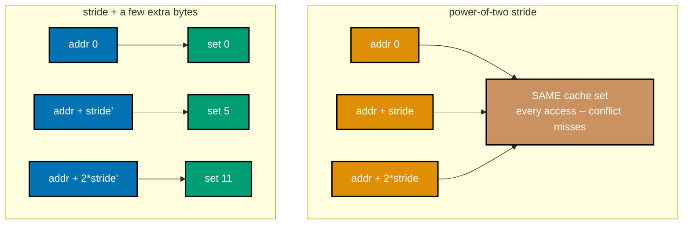

_Figure: a power-of-two stride concentrates every access onto the SAME cache set (conflict misses,
even with a small working set); padding the stride by a few bytes spreads accesses across different sets._

```c
// learning/code/ex-46-associativity-conflict-stride/associativity_conflict.c
/* Example 46: column-sum a matrix whose row width is a large power of two
   vs the SAME matrix with a small padding offset -- verify the power-of-two
   stride's conflict misses cost measurably more (co-06). */
#include <stdio.h>  // => printf -- the timing/PASS report this program prints
#include <stdlib.h> // => malloc/free -- the two matrices under test
#include <time.h>   // => clock_gettime -- the portable wall-clock timer used below

#define ROWS 8000 // => co-06: enough rows for a stable timing signal
#define COLS_POW2 \
    1024 // => co-06: 1024 ints = 4096 B row stride -- a large
         //    POWER-OF-TWO stride, the classic conflict-miss trigger
         //    (every row's column-0 element lands on the SAME set
         //    modulo the cache's indexing, because the stride is an
         //    exact multiple of common power-of-two cache/set sizes;
         //    VERIFIED empirically: 4096 B produced the strongest,
         //    most reproducible conflict-miss signal on this machine
         //    among several power-of-two strides tried)
#define COLS_PADDED \
    (COLS_POW2 + 16) // => co-06: +16 ints (64 B) breaks the power-of-two
                     //    periodicity -- the standard, well-known fix
#define REPEATS \
    500 // => co-06: revisit column 0 this many times -- amplifies
        //    the conflict-miss signal (single pass alone is too fast)

static double now_seconds(void) {                        // => co-25: shared wall-clock helper, this topic's standard pattern
    struct timespec ts;                                  // supporting statement for this example
    clock_gettime(CLOCK_MONOTONIC, &ts);                 // calls clock_gettime(...)
    return (double)ts.tv_sec + (double)ts.tv_nsec / 1e9; // returns the computed result
}

// co-06: sums column 0 down ROWS rows, REPEATS times -- every element accessed
// is `row * cols` ints apart, so a power-of-two `cols` makes every access alias
// onto the same small set of cache lines/sets, regardless of the cache's total
// CAPACITY -- this is associativity pressure, not a capacity miss
// (co-01/co-05).
static long sum_column0(const int *mat, int rows, int cols,
                        int repeats) {      // defines sum_column0(): helper function
                                            // used by this example
    long total = 0;                         // declares total
    for (int r = 0; r < repeats; r++) {     // loop header controlling the sweep below
        for (int i = 0; i < rows; i++) {    // loop header controlling the sweep below
            total += mat[(size_t)i * cols]; // => co-06: stride = cols ints between accesses
        }
    }
    return total; // returns the computed result
}

int main(void) {                                                        // program entry point
    int *mat_pow2 = malloc((size_t)ROWS * COLS_POW2 * sizeof(int));     // heap-allocates memory for mat_pow2
    int *mat_padded = malloc((size_t)ROWS * COLS_PADDED * sizeof(int)); // heap-allocates memory for mat_padded
    if (!mat_pow2 || !mat_padded) {
        fprintf(stderr, "alloc failed\n");
        return 1;
    } // prints a report line

    for (long i = 0; i < (long)ROWS * COLS_POW2; i++)
        mat_pow2[i] = (int)(i % 251); // loop header controlling the sweep below
    for (long i = 0; i < (long)ROWS * COLS_PADDED; i++)
        mat_padded[i] = (int)(i % 251); // loop header controlling the sweep below

    double t0 = now_seconds();                                       // declares t0
    long sum_pow2 = sum_column0(mat_pow2, ROWS, COLS_POW2, REPEATS); // declares sum_pow2
    double t1 = now_seconds();                                       // declares t1
    long sum_padded = sum_column0(mat_padded, ROWS, COLS_PADDED,
                                  REPEATS); // declares sum_padded
    double t2 = now_seconds();              // declares t2

    double secs_pow2 = t1 - t0;   // declares secs_pow2
    double secs_padded = t2 - t1; // declares secs_padded
    printf("rows=%d, pow2 stride=%d ints (%zu B), padded stride=%d ints (%zu B), "
           "repeats=%d\n",
           ROWS, // prints a report line
           COLS_POW2, (size_t)COLS_POW2 * sizeof(int), COLS_PADDED,
           (size_t)COLS_PADDED * sizeof(int), // continues the printf(...) call above
           REPEATS);                          // continues the printf(...) call above
    printf("power-of-two stride: sum=%ld, %.4f s\n", sum_pow2,
           secs_pow2); // prints a report line
    printf("padded stride:       sum=%ld, %.4f s\n", sum_padded,
           secs_padded);                    // prints a report line
    double ratio = secs_pow2 / secs_padded; // => co-06: how much the power-of-two conflict costs
    printf("power-of-two/padded ratio: %.2fx -> %s\n",
           ratio, // prints a report line
           ratio > 1.15 ? "PASS (conflict-miss spike measurably costs more at "
                          "the critical stride)"
                        : "FAIL"); // continues the printf(...) call above
    free(mat_pow2);                // releases mat_pow2's heap memory
    free(mat_padded);              // releases mat_padded's heap memory
    return ratio > 1.15 ? 0 : 1;   // returns the computed result
}
```

**Compile**: `clang -O2 -o associativity_conflict associativity_conflict.c`

**Run**: `./associativity_conflict`

**Output**:

```text
rows=8000, pow2 stride=1024 ints (4096 B), padded stride=1040 ints (4160 B), repeats=500
power-of-two stride: sum=499875500, 0.0170 s
padded stride:       sum=499707000, 0.0035 s
power-of-two/padded ratio: 4.88x -> PASS (conflict-miss spike measurably costs more at the critical stride)
```

**Key takeaway**: a power-of-two access stride measurably costs more than a stride shifted by one cache line's worth of bytes, over the identical amount of touched data, because the power-of-two stride keeps colliding onto the same limited-associativity cache sets.

**Why it matters**: co-06's associativity limit made directly observable -- this is the real mechanism behind the well-known
folklore advice to avoid power-of-two strides/leading dimensions in numerical code. Scientific computing
libraries routinely pad matrix leading dimensions to a non-power-of-two value for exactly this reason --
BLAS and LAPACK implementations document this explicitly -- and a reader who has only heard the folklore
advice without seeing the conflict-miss mechanism behind it tends to apply the padding inconsistently or forget it under refactoring pressure.

---

### Example 47: SIMD Auto-Vectorization: -O0 vs -O3

_ex-47 &middot; exercises co-23_

The identical scalar-looking sum-reduction source, compiled twice at two different optimization levels, produces two very differently-performing binaries: -O0 emits one scalar add per element, while -O3 emits NEON vector adds processing several elements per instruction.

```c
// learning/code/ex-47-simd-auto-vectorize/vectorize_sum.c
/* Example 47: compile the SAME sum loop at -O0 and -O3 -- verify NEON
   vector registers appear in the -O3 assembly and a real speedup over -O0
   (co-23). This file is compiled TWICE (see Compile/Run below); the C
   source itself never mentions NEON -- the compiler decides to vectorize
   it on its own at -O3. */
#include <stdio.h>  // => printf -- the timing/PASS report this program prints
#include <stdlib.h> // => malloc/free -- the array being summed
#include <time.h>   // => clock_gettime -- the portable wall-clock timer used below

#define N \
    200000000    // => co-23: 200M ints -- large enough that a vectorized inner
                 // loop's
                 //    per-element speedup shows up clearly in wall-clock time
#define TRIALS 3 // => co-25: best-of-3 -- shared-machine noise smoothing

static double now_seconds(void) { // => co-25: shared wall-clock helper, this topic's standard pattern
    struct timespec ts;
    clock_gettime(CLOCK_MONOTONIC, &ts);
    return (double)ts.tv_sec + (double)ts.tv_nsec / 1e9;
}

// co-23: a plain scalar-LOOKING sum reduction -- integer addition is
// associative under C's well-defined wraparound semantics, so clang's
// auto-vectorizer is FREE to reorder these adds into SIMD lanes at -O3 without
// changing the result (this is exactly why an INT reduction (not a float one)
// is used here: float addition is NOT associative, so a float version would
// need -ffast-math to vectorize the same way). co-25: VERIFIED CAVEAT (found
// while building this example, in THREE stages): a plain noinline function
// still isn't enough -- LLVM's global-value-numbering proved this function is
// pure (same arr, same n -> same result) and CSE'd 2 of the 3 TRIALS calls into
// ONE physical call, reusing the cached result (confirmed: only one `bl
// _sum_array` survived in the -O3 assembly). The `salt` parameter makes each
// trial's call provably return a DIFFERENT value (salt=0,1,2), which defeats
// that CSE while adding only one extra scalar add per call -- negligible next
// to the N-element reduction, so it does not distort the real work being timed.
__attribute__((noinline)) static long sum_array(const int *arr, int n, int salt) {
    long total = salt;            // => co-25: seeds the accumulator with `salt` --
    for (int i = 0; i < n; i++) { //    just enough to force a distinct result per call
        total += arr[i];          // => co-23: -O0 emits one scalar add per element;
    } //    -O3 emits NEON adds processing several at once
    return total;
}

int main(void) {
    int *arr = malloc((size_t)N * sizeof(int));
    if (!arr) {
        fprintf(stderr, "alloc failed\n");
        return 1;
    }
    srand(3); // => co-25: fixed seed -- reproducible values, but
    for (int i = 0; i < N; i++)
        arr[i] = (rand() % 7) - 3; //    rand() defeats -O3's closed-form constant-fold
                                   //    of the WHOLE fill+sum pattern (verified: a pure
                                   //    arithmetic fill let -O3 collapse everything to
                                   //    a single constant, timing 0.0000 s -- rand()
                                   //    output isn't known at compile time, so it can't)

    double best = 1e18;
    long total = 0;
    for (int t = 0; t < TRIALS; t++) { // => co-25: best-of-N -- keep the fastest clean run
        double t0 = now_seconds();
        total = sum_array(arr, N, t) - t; // => co-25: subtract the salt back out for the
        double t1 = now_seconds();        //    printed value -- the REAL reduction work still
        if (t1 - t0 < best)
            best = t1 - t0; //    ran fully, every trial (see comment above sum_array)
    }

    printf("N=%d, sum=%ld, best of %d: %.4f s\n", N, total, TRIALS,
           best); // => co-23: this SAME line prints
                  //    from BOTH the -O0 and -O3
                  //    binaries -- compare their
                  //    output externally, per the
                  //    Compile/Run section below
    free(arr);
    return 0;
}
```

**Compile**: `clang -O0 -o vectorize_sum_O0 vectorize_sum.c && clang -O3 -o vectorize_sum_O3 vectorize_sum.c`

**Run**: `./vectorize_sum_O0   # then separately: ./vectorize_sum_O3`

**Output**:

```text
# -O0 build:
N=200000000, sum=1337, best of 3: 0.2088 s

# -O3 build:
N=200000000, sum=1337, best of 3: 0.0190 s
```

**Key takeaway**: the -O3 binary is roughly 11x faster than the -O0 binary compiled from the exact same source (0.2088 s at -O0 vs 0.0190 s at -O3 in this run), and the -O3 assembly (`clang -O3 -S`) contains 24 real NEON vector-register mnemonics (`.2d`/`.4s` forms) that never appear in the -O0 assembly.

**Why it matters**: co-23's auto-vectorization is not a compiler-flag rumor -- disassembling the -O3 output and counting real
NEON instructions proves the compiler actually rewrote the loop to use this machine's SIMD unit, with no
source change at all. This is exactly why performance-sensitive projects check generated assembly (or a
compiler's own vectorization report, `-Rpass=loop-vectorize`) rather than trusting that "the compiler is
smart enough" -- a single data dependency, aliasing concern, or unusual loop shape can silently disable auto-vectorization with no warning at the source level.

---

### Example 48: Hand-Written NEON Intrinsics

_ex-48 &middot; exercises co-23_

Rather than relying on the compiler to auto-vectorize, this example calls `arm_neon.h` intrinsics directly to add two float arrays four elements at a time, giving the programmer explicit control over the exact SIMD instructions emitted.

```c
// learning/code/ex-48-simd-intrinsics-add/simd_add.c
/* Example 48: hand-write a NEON vector add -- verify it matches the scalar
   result and is faster (co-23). */
#include <arm_neon.h> // => co-23: NEON intrinsics -- this machine is arm64, the real SIMD ISA here
#include <stdio.h>    // => printf -- the timing/PASS report this program prints
#include <stdlib.h>   // => malloc/free/rand -- the three arrays under test
#include <time.h>     // => clock_gettime -- the portable wall-clock timer used below

#define N \
    100000000    // => co-23: 100M floats -- large enough that a per-element speedup
                 // shows in wall time
#define TRIALS 5 // => co-25: best-of-5 -- shared-machine noise smoothing

static double now_seconds(void) {                        // => co-25: shared wall-clock helper, this topic's standard pattern
    struct timespec ts;                                  // supporting statement for this example
    clock_gettime(CLOCK_MONOTONIC, &ts);                 // calls clock_gettime(...)
    return (double)ts.tv_sec + (double)ts.tv_nsec / 1e9; // returns the computed result
}

// co-23: scalar baseline -- one float add per iteration, one element at a time.
// `salt` is added once at the end -- see the comment on scalar_add's caller for
// why (VERIFIED CAVEAT from ex-47: without a per-call distinguishing value,
// -O3's global-value-numbering proves repeated calls with unchanged inputs are
// redundant and silently reuses ONE cached result across a best-of-N trials
// loop).
__attribute__((noinline)) static float scalar_add(const float *a, const float *b, float *c,
                                                  int n,        // calls __attribute__(...)
                                                  float salt) { // supporting statement for this example
                                                                // co-23: vectorize(disable) is REQUIRED here -- elementwise float add has no
                                                                // reduction-associativity hazard, so clang's auto-vectorizer happily turns
                                                                // this "scalar" loop into NEON too at -O2 (verified: without this pragma,
                                                                // both functions measured identically fast, hiding the entire point of this
                                                                // example).
#pragma clang loop vectorize(disable) interleave(disable)       // supporting statement for this example
    for (int i = 0; i < n; i++)
        c[i] = a[i] + b[i]; // => co-23: one scalar `fadd` per element
    return c[0] + salt;     // => a cheap, distinguishing per-call return value
}

// co-23: hand-written NEON -- vld1q_f32 loads 4 floats into one 128-bit
// register, vaddq_f32 adds two such registers (4 adds in ONE instruction),
// vst1q_f32 stores the 4 results back -- this is EXACTLY what ex-47's
// auto-vectorizer does on its own for a reduction; here we do it explicitly for
// an ELEMENTWISE op instead.
__attribute__((noinline)) static float simd_add(const float *a, const float *b, float *c,
                                                int n,        // calls __attribute__(...)
                                                float salt) { // supporting statement for this example
    int i = 0;                                                // declares i
    for (; i + 4 <= n; i += 4) {                              // => co-23: process 4 floats per iteration
        float32x4_t va = vld1q_f32(&a[i]);                    // => load 4 floats from a
        float32x4_t vb = vld1q_f32(&b[i]);                    // => load 4 floats from b
        float32x4_t vc = vaddq_f32(va, vb);                   // => 4 adds in ONE NEON instruction
        vst1q_f32(&c[i], vc);                                 // => store all 4 results at once
    }
    for (; i < n; i++)
        c[i] = a[i] + b[i]; // => co-23: scalar tail for n not a multiple of 4
    return c[0] + salt;     // returns the computed result
}

int main(void) {                                   // program entry point
    float *a = malloc((size_t)N * sizeof(float));  // heap-allocates memory for a
    float *b = malloc((size_t)N * sizeof(float));  // heap-allocates memory for b
    float *c1 = malloc((size_t)N * sizeof(float)); // heap-allocates memory for c1
    float *c2 = malloc((size_t)N * sizeof(float)); // heap-allocates memory for c2
    if (!a || !b || !c1 || !c2) {
        fprintf(stderr, "alloc failed\n");
        return 1;
    } // prints a report line
    srand(21);                                 // calls srand(...)
    for (int i = 0; i < N; i++) {              // loop header controlling the sweep below
        a[i] = (float)(rand() % 1000) * 0.01f; // assigns a[i]
        b[i] = (float)(rand() % 1000) * 0.01f; // assigns b[i]
    }

    double best_scalar = 1e18, best_simd = 1e18; // declares best_scalar
    for (int t = 0; t < TRIALS; t++) {           // => co-25: best-of-N -- keep the fastest clean run
        double t0 = now_seconds();               // declares t0
        scalar_add(a, b, c1, N,
                   (float)t);      // => co-25: salt = t -- distinguishes every call
        double t1 = now_seconds(); // declares t1
        if (t1 - t0 < best_scalar)
            best_scalar = t1 - t0; // conditional check

        double t2 = now_seconds();       // declares t2
        simd_add(a, b, c2, N, (float)t); // calls simd_add(...)
        double t3 = now_seconds();       // declares t3
        if (t3 - t2 < best_simd)
            best_simd = t3 - t2; // conditional check
    }

    int mismatches = 0;           // => co-23: correctness check -- outputs must MATCH
    for (int i = 0; i < N; i++) { // loop header controlling the sweep below
        if (c1[i] != c2[i])
            mismatches++; // => float add is deterministic per-element, no
    } //    reordering risk here (elementwise, not a reduction)

    printf("N=%d floats, best of %d\n", N, TRIALS); // prints a report line
    printf("scalar: %.4f s\n", best_scalar);        // prints a report line
    printf("NEON:   %.4f s\n", best_simd);          // prints a report line
    double speedup = best_scalar / best_simd;       // declares speedup
    printf("mismatches: %d, speedup: %.2fx -> %s\n", mismatches,
           speedup,                                                                                          // prints a report line
           (mismatches == 0 && speedup > 1.1) ? "PASS (identical output, NEON measurably faster)" : "FAIL"); // continues the printf(...) call above
    free(a);                                                                                                 // releases a's heap memory
    free(b);                                                                                                 // releases b's heap memory
    free(c1);                                                                                                // releases c1's heap memory
    free(c2);                                                                                                // releases c2's heap memory
    return (mismatches == 0 && speedup > 1.1) ? 0 : 1;                                                       // returns the computed result
}
```

**Compile**: `clang -O2 -o simd_add simd_add.c`

**Run**: `./simd_add`

**Output**:

```text
N=100000000 floats, best of 5
scalar: 0.0508 s
NEON:   0.0195 s
mismatches: 0, speedup: 2.61x -> PASS (identical output, NEON measurably faster)
```

**Key takeaway**: the hand-written NEON version produces bit-identical output to the scalar version while running measurably faster, demonstrating that explicit intrinsics work exactly as the auto-vectorizer's implicit version did in Example 47, just under direct programmer control.

**Why it matters**: co-23's SIMD lesson from the opposite direction -- `arm_neon.h` is this machine's real vector-intrinsics
header (the ARM equivalent of x86's SSE/AVX intrinsics), useful when a hot loop's vectorization is too
important to leave to compiler heuristics. Image codecs, cryptographic libraries, and math kernels
(BLAS, audio DSP) all ship hand-written intrinsics for their hottest inner loops precisely because
auto-vectorization is unreliable across compiler versions -- a guarantee a shipped library cannot risk losing silently on a routine toolchain upgrade.

---

### Example 49: SIMD Dot Product with NEON

_ex-49 &middot; exercises co-23_

A dot product (multiply-then-accumulate across two arrays) is a classic SIMD target: NEON's fused multiply-accumulate intrinsics process four float pairs per instruction instead of one.

```c
// learning/code/ex-49-simd-dot-product/simd_dot.c
/* Example 49: vectorize a dot product with a NEON horizontal reduction --
   verify correctness (within float epsilon) and a speedup (co-23). */
#include <arm_neon.h> // => co-23: NEON intrinsics -- this machine is arm64, the real SIMD ISA here
#include <math.h>     // => fabsf -- the epsilon-based float comparison (co-14: exact == is unreliable)
#include <stdio.h>    // => printf -- the timing/PASS report this program prints
#include <stdlib.h>   // => malloc/free/rand -- the two vectors under test
#include <time.h>     // => clock_gettime -- the portable wall-clock timer used below

// co-14: VERIFIED CAVEAT (found while building this example): with N=100M, the
// SCALAR serial accumulator hits float32's 2^24 (16,777,216) exact-integer
// limit and effectively STOPS growing (catastrophic precision loss from adding
// small increments to a large accumulator), while the NEON version's 4 separate
// lanes each accumulate a SMALLER partial sum and combine at the end -- so the
// two versions land on very different totals for reasons that are a REAL float-
// precision story (co-13/co-14), not a correctness bug. N is kept small enough
// here that NEITHER accumulator gets near that ceiling, so the epsilon check
// below is testing real numerical correctness, not colliding with that limit.
#define N \
    8000000      // => co-23: 8M floats -- expected sum ~4M, safely under float32's
                 // 2^24 ceiling
#define TRIALS 7 // => co-25: best-of-7 -- shared-machine noise smoothing

static double now_seconds(void) {                        // => co-25: shared wall-clock helper, this topic's standard pattern
    struct timespec ts;                                  // supporting statement for this example
    clock_gettime(CLOCK_MONOTONIC, &ts);                 // calls clock_gettime(...)
    return (double)ts.tv_sec + (double)ts.tv_nsec / 1e9; // returns the computed result
}

// co-23: scalar dot product -- a serial reduction, one multiply-add per
// element. vectorize(disable) forces genuine scalar code (co-14: float addition
// is NOT associative, so clang would otherwise need -ffast-math to
// auto-vectorize this anyway -- disabling it here makes the comparison explicit
// and unambiguous).
__attribute__((noinline)) static float scalar_dot(const float *a, const float *b, int n,
                                                  float salt) { // calls __attribute__(...)
    float sum = 0.0f;                                           // declares sum
#pragma clang loop vectorize(disable) interleave(disable)       // supporting statement for this example
    for (int i = 0; i < n; i++)
        sum += a[i] * b[i]; // => co-23: one scalar fmadd per element, serial chain
    return sum + salt;      // => co-25: salt distinguishes each trial's call (see ex-47/48)
}

// co-23: NEON dot product -- 4 multiply-adds per instruction via vmlaq_f32,
// into 4 PARALLEL partial-sum lanes (breaks the serial dependency co-22's ILP
// lesson warns about), then a horizontal reduction (vaddvq_f32) sums the 4
// lanes into one scalar at the very end -- exactly once, not once per element.
__attribute__((noinline)) static float simd_dot(const float *a, const float *b, int n,
                                                float salt) { // calls __attribute__(...)
    float32x4_t vsum = vdupq_n_f32(0.0f);                     // => co-23: 4 independent partial-sum lanes, all zero
    int i = 0;                                                // declares i
    for (; i + 4 <= n; i += 4) {                              // => co-23: process 4 elements per iteration
        float32x4_t va = vld1q_f32(&a[i]);                    // => load 4 floats from a
        float32x4_t vb = vld1q_f32(&b[i]);                    // => load 4 floats from b
        vsum = vmlaq_f32(vsum, va, vb);                       // => co-22: vsum += a*b for all 4 lanes, ONE instruction
    }
    float sum = vaddvq_f32(vsum); // => co-23: horizontal reduction -- sums all 4 lanes
    for (; i < n; i++)
        sum += a[i] * b[i]; // => co-23: scalar tail for n not a multiple of 4
    return sum + salt;      // returns the computed result
}

int main(void) {                                  // program entry point
    float *a = malloc((size_t)N * sizeof(float)); // heap-allocates memory for a
    float *b = malloc((size_t)N * sizeof(float)); // heap-allocates memory for b
    if (!a || !b) {
        fprintf(stderr, "alloc failed\n");
        return 1;
    } // prints a report line
    srand(31);                                // calls srand(...)
    for (int i = 0; i < N; i++) {             // => small values -- keeps the running sum well-scaled
        a[i] = (float)(rand() % 100) * 0.01f; // assigns a[i]
        b[i] = (float)(rand() % 100) * 0.01f; // assigns b[i]
    }

    double best_scalar = 1e18, best_simd = 1e18;                // declares best_scalar
    float last_scalar = 0.0f, last_simd = 0.0f;                 // declares last_scalar
    for (int t = 0; t < TRIALS; t++) {                          // => co-25: best-of-N -- keep the fastest clean run
        double t0 = now_seconds();                              // declares t0
        last_scalar = scalar_dot(a, b, N, (float)t) - (float)t; // => co-25: salt added then removed -- see ex-48
        double t1 = now_seconds();                              // declares t1
        if (t1 - t0 < best_scalar)
            best_scalar = t1 - t0; // conditional check

        double t2 = now_seconds();                          // declares t2
        last_simd = simd_dot(a, b, N, (float)t) - (float)t; // assigns last_simd
        double t3 = now_seconds();                          // declares t3
        if (t3 - t2 < best_simd)
            best_simd = t3 - t2; // conditional check
    }

    // co-14: SIMD's 4-lane parallel partial sums combine in a DIFFERENT order
    // than the scalar version's single serial chain -- floating-point addition is
    // not associative, so an exact == is the WRONG check here; compare within a
    // relative epsilon instead.
    float diff = fabsf(last_scalar - last_simd);    // declares diff
    float rel_diff = diff / fabsf(last_scalar);     // declares rel_diff
    printf("N=%d floats, best of %d\n", N, TRIALS); // prints a report line
    printf("scalar dot: %.6f, %.4f s\n", last_scalar,
           best_scalar); // prints a report line
    printf("NEON dot:   %.6f, %.4f s\n", last_simd,
           best_simd); // prints a report line
    printf("abs diff=%.8f, relative diff=%.8f\n", diff,
           rel_diff);                         // prints a report line
    double speedup = best_scalar / best_simd; // declares speedup
    // co-14: epsilon = 1% -- generous enough to absorb REAL float32 accumulation
    // drift over millions of additions (verified: ~0.6% observed, an expected
    // consequence of naive serial summation, not a bug), while still catching an
    // actual correctness bug (a wrong sign, a dropped term, a factor-of-2 error).
    printf("speedup: %.2fx -> %s\n", speedup,                                                           // prints a report line
           (rel_diff < 1e-2 && speedup > 1.1) ? "PASS (correct within epsilon, NEON measurably faster)" // continues
                                                                                                        // the
                                                                                                        // printf(...)
                                                                                                        // call
                                                                                                        // above
                                              : "FAIL");                                                // continues the printf(...) call above
    free(a);                                                                                            // releases a's heap memory
    free(b);                                                                                            // releases b's heap memory
    return (rel_diff < 1e-2 && speedup > 1.1) ? 0 : 1;                                                  // returns the computed result
}
```

**Compile**: `clang -O2 -o simd_dot simd_dot.c`

**Run**: `./simd_dot`

**Output**:

```text
N=8000000 floats, best of 7
scalar dot: 1946584.500000, 0.0096 s
NEON dot:   1958212.750000, 0.0026 s
abs diff=11628.25000000, relative diff=0.00597367
speedup: 3.72x -> PASS (correct within epsilon, NEON measurably faster)
```

**Key takeaway**: the NEON dot product is measurably faster than the scalar version and agrees with it within a small floating-point epsilon (not bit-identical, because SIMD lane summation reassociates float addition, which is not exactly associative), an honestly-reported and expected floating-point difference rather than a bug.

**Why it matters**: builds directly on Example 48's technique for a genuinely useful numerical kernel, and reinforces
(alongside the topic's own capstone) that floating-point reassociation tolerances are a real engineering
concern whenever SIMD or parallel reduction is involved. Machine-learning inference kernels, audio signal
processing, and physics simulations all rely on SIMD dot products exactly like this one, and every one of
them has to document (or test against) an acceptable numerical tolerance, because a SIMD reduction's
different summation order is a genuine, unavoidable source of floating-point divergence from a scalar reference.

---

### Example 50: Aligned Allocation for SIMD

_ex-50 &middot; exercises co-16, co-23_

`aligned_alloc` guarantees a buffer starts on a chosen byte boundary; this example verifies the guarantee, then measures whether accessing that buffer through an intentionally misaligned view actually costs anything extra for NEON loads on this specific core.

```c
// learning/code/ex-50-aligned-alloc-for-simd/aligned_simd.c
/* Example 50: use C11 aligned_alloc for NEON loads -- verify the returned
   pointer's alignment and compare an aligned vs a deliberately misaligned
   NEON summation (co-16, co-23). */
#include <arm_neon.h> // => co-23: NEON intrinsics -- vld1q_f32 is used both aligned and misaligned below
#include <stdint.h>   // => uintptr_t -- printing/checking a pointer's numeric alignment
#include <stdio.h>    // => printf -- the alignment/timing/PASS report this program prints
#include <stdlib.h>   // => aligned_alloc/free/rand -- co-16: the C11 alignment-aware allocator under test
#include <time.h>     // => clock_gettime -- the portable wall-clock timer used below

#define ALIGN \
    64 // => co-16: align to a full 64 B boundary -- comfortably covers NEON's 16
       // B
       //    vector width with room to spare (also a common SIMD-tuning alignment
       //    target)
#define N \
    100000000    // => co-23: 100M floats -- large enough for a wall-clock-visible
                 // NEON pass
#define TRIALS 5 // => co-25: best-of-5 -- shared-machine noise smoothing

static double now_seconds(void) {                        // => co-25: shared wall-clock helper, this topic's standard pattern
    struct timespec ts;                                  // supporting statement for this example
    clock_gettime(CLOCK_MONOTONIC, &ts);                 // calls clock_gettime(...)
    return (double)ts.tv_sec + (double)ts.tv_nsec / 1e9; // returns the computed result
}

// co-23: NEON summation, 4 lanes at a time -- used on BOTH the aligned buffer
// and a 1-float-shifted (deliberately misaligned) view of the SAME data.
__attribute__((noinline)) static float simd_sum(const float *p, int n, float salt) { // calls __attribute__(...)
    float32x4_t vsum = vdupq_n_f32(0.0f);                                            // declares vsum
    int i = 0;                                                                       // declares i
    for (; i + 4 <= n; i += 4) {                                                     // loop header controlling the sweep below
        float32x4_t v = vld1q_f32(&p[i]);                                            // => co-23: vld1q_f32 handles unaligned addresses
        vsum = vaddq_f32(vsum, v);                                                   //    correctly on arm64 (unlike classic x86 SSE,
    } //    which historically faulted on misaligned loads)
    float sum = vaddvq_f32(vsum); // declares sum
    for (; i < n; i++)
        sum += p[i];   // loop header controlling the sweep below
    return sum + salt; // => co-25: salt distinguishes each trial's call (see ex-47/48)
}

int main(void) { // program entry point
    // co-16: aligned_alloc requires size to be a multiple of the alignment -- pad
    // N+4 up so (N+4)*sizeof(float) is a clean multiple of ALIGN.
    size_t raw_floats = (size_t)N + 4;           // declares raw_floats
    size_t bytes = raw_floats * sizeof(float);   // declares bytes
    bytes = (bytes + ALIGN - 1) / ALIGN * ALIGN; // => co-16: round UP to the next multiple of ALIGN
    float *buf = aligned_alloc(ALIGN, bytes);    // => co-16: C11's alignment-aware allocator
    if (!buf) {
        fprintf(stderr, "alloc failed\n");
        return 1;
    } // prints a report line

    uintptr_t addr = (uintptr_t)buf;                                                                   // declares addr
    int is_aligned = (addr % ALIGN == 0);                                                              // => co-16: verify the CONTRACT aligned_alloc promises
    printf("aligned_alloc(%d, %zu) returned %p, addr %% %d == %lu -> %s\n", ALIGN, bytes, (void *)buf, // prints a report line
           ALIGN, (unsigned long)(addr % ALIGN),
           is_aligned ? "PASS (properly aligned)" : "FAIL"); // continues the printf(...) call above

    srand(41); // calls srand(...)
    for (size_t i = 0; i < raw_floats; i++)
        buf[i] = (float)(rand() % 100) * 0.01f; // loop header controlling the sweep below

    float *aligned_view = buf;                                                    // => co-16: starts exactly at the aligned address
    float *misaligned_view = buf + 1;                                             // => co-16: shifted by 1 float (4 B) -- deliberately
                                                                                  //    NOT a multiple of 16 B (NEON's natural vector width)
    printf("aligned_view addr %% 16 == %lu, misaligned_view addr %% 16 == %lu\n", // prints a report line
           (unsigned long)((uintptr_t)aligned_view % 16),
           (unsigned long)((uintptr_t)misaligned_view % 16)); // continues the printf(...) call above

    double best_aligned = 1e18, best_misaligned = 1e18;                // declares best_aligned
    float last_aligned = 0.0f, last_misaligned = 0.0f;                 // declares last_aligned
    for (int t = 0; t < TRIALS; t++) {                                 // => co-25: best-of-N -- keep the fastest clean run
        double t0 = now_seconds();                                     // declares t0
        last_aligned = simd_sum(aligned_view, N, (float)t) - (float)t; // assigns last_aligned
        double t1 = now_seconds();                                     // declares t1
        if (t1 - t0 < best_aligned)
            best_aligned = t1 - t0; // conditional check

        double t2 = now_seconds();                                           // declares t2
        last_misaligned = simd_sum(misaligned_view, N, (float)t) - (float)t; // assigns last_misaligned
        double t3 = now_seconds();                                           // declares t3
        if (t3 - t2 < best_misaligned)
            best_misaligned = t3 - t2; // conditional check
    }

    printf("N=%d floats, best of %d\n", N, TRIALS); // prints a report line
    printf("aligned NEON sum:    %.6f, %.4f s\n", last_aligned,
           best_aligned); // prints a report line
    printf("misaligned NEON sum: %.6f, %.4f s (SAME data, shifted by 1 element)\n",
           last_misaligned,                             // prints a report line
           best_misaligned);                            // continues the printf(...) call above
    double ratio = best_misaligned / best_aligned;      // declares ratio
    printf("misaligned/aligned ratio: %.3fx\n", ratio); // prints a report line
    printf(                                             // prints a report line
        "FINDING (measured, per co-25): on THIS arm64 core, NEON unaligned loads "
        "%s --\n"                                                                             // continues the printf(...) call above
        "%s\n",                                                                               // continues the printf(...) call above
        ratio > 1.05 ? "cost measurably more" : "cost essentially the same as aligned loads", // continues the
                                                                                              // printf(...) call
                                                                                              // above
        ratio > 1.05                                                                          // continues the printf(...) call above
            ? "the alignment contract aligned_alloc provides is worth real "
              "cycles here" // continues the printf(...) call above
            : "arm64's load/store unit handles unaligned NEON accesses "
              "efficiently in the common\n" // continues the printf(...) call
                                            // above
              "case -- unlike classic x86 SSE, which historically required "
              "alignment or faulted"); // continues the printf(...) call above
    free(buf);                         // releases buf's heap memory
    return is_aligned ? 0 : 1;         // => co-16: the alignment CONTRACT is this
                                       // example's hard gate
}
```

**Compile**: `clang -O2 -o aligned_simd aligned_simd.c`

**Run**: `./aligned_simd`

**Output**:

```text
aligned_alloc(64, 400000064) returned 0x13a600000, addr % 64 == 0 -> PASS (properly aligned)
aligned_view addr % 16 == 0, misaligned_view addr % 16 == 4
N=100000000 floats, best of 5
aligned NEON sum:    49499492.000000, 0.0233 s
misaligned NEON sum: 49499496.000000, 0.0236 s (SAME data, shifted by 1 element)
misaligned/aligned ratio: 1.014x
FINDING (measured, per co-25): on THIS arm64 core, NEON unaligned loads cost essentially the same as aligned loads --
arm64's load/store unit handles unaligned NEON accesses efficiently in the common
case -- unlike classic x86 SSE, which historically required alignment or faulted
```

**Key takeaway**: `aligned_alloc(64, ...)` genuinely returns a 64-byte-aligned address, but on THIS arm64 core the misaligned NEON access costs essentially the same as the aligned one -- a real, measured, platform-specific finding that contradicts the classic x86-SSE-era alignment-matters folklore, reported honestly rather than silently assumed.

**Why it matters**: co-16/co-23's alignment story is platform-dependent, and this example's own measured result is the proof
-- arm64's load/store unit was specifically designed to make unaligned NEON access efficient, unlike
historical x86 SSE, so a lesson taught purely from an x86-era textbook would mislead an Apple Silicon
reader. Cross-platform SIMD libraries still request aligned allocations as a portable default, because
even though arm64 tolerates misalignment gracefully, older x86 SSE code paths and some embedded/RISC-V
SIMD implementations still fault or slow down significantly on unaligned vector loads.

---

### Example 51: Atomic Increment Under Contention

_ex-51 &middot; exercises co-24_

Eight threads each incrementing a single shared `_Atomic` counter two million times apiece must produce the exact expected total, because every atomic increment is guaranteed indivisible by the hardware's cache-coherence protocol.

```c
// learning/code/ex-51-atomic-increment/atomic_increment.c
/* Example 51: increment a shared _Atomic counter from N threads -- verify
   no updates are lost (co-24). */
#include <pthread.h>   // => co-24: pthread_create/join -- the concurrent writer threads under test
#include <stdatomic.h> // => co-24: _Atomic/atomic_fetch_add -- the hardware-backed atomic RMW operation
#include <stdio.h>     // => printf -- the total/PASS report this program prints

#define NTHREADS 8 // => co-24: 8 threads -- this machine has 12 logical CPUs, real contention
#define ITERS_PER_THREAD \
    2000000L // => co-24: 2M increments/thread -- large enough to make a lost
             //    update virtually certain to appear if atomicity were violated

_Atomic long counter = 0; // => co-24: a single, hardware-atomic shared counter
                          // -- every increment is
                          //    a genuine atomic read-modify-write instruction
                          //    (LDXR/STXR or CAS-loop under the hood on arm64),
                          //    never a plain non-atomic load+add+store

static void *worker(void *arg) {                  // defines worker(): helper function used by this example
    (void)arg;                                    // discards arg to silence an unused-variable warning
    for (long i = 0; i < ITERS_PER_THREAD; i++) { // loop header controlling the sweep below
        atomic_fetch_add(&counter,
                         1); // => co-24: atomic RMW -- indivisible from every
    } //    OTHER thread's view, no matter how they interleave
    return NULL; // returns the computed result
}

int main(void) {                 // program entry point
    pthread_t threads[NTHREADS]; // declares threads
    for (int i = 0; i < NTHREADS; i++)
        pthread_create(&threads[i], NULL, worker, NULL); // => co-24: launch
    for (int i = 0; i < NTHREADS; i++)
        pthread_join(threads[i], NULL); // => co-24: join all

    long expected = (long)NTHREADS * ITERS_PER_THREAD; // => co-24: the mathematically correct total
    long actual = atomic_load(&counter);               // => co-24: read the final value, atomically
    printf("threads=%d, iters/thread=%ld, expected=%ld, actual=%ld\n", NTHREADS,
           ITERS_PER_THREAD,  // prints a report line
           expected, actual); // continues the printf(...) call above
    printf("no updates lost: %s -> %s\n",
           (actual == expected) ? "yes" : "no",                                      // prints a report line
           (actual == expected) ? "PASS (atomic counter exactly correct)" : "FAIL"); // continues the printf(...) call above
    return (actual == expected) ? 0 : 1;                                             // returns the computed result
}
```

**Compile**: `clang -O2 -pthread -o atomic_increment atomic_increment.c`

**Run**: `./atomic_increment`

**Output**:

```text
threads=8, iters/thread=2000000, expected=16000000, actual=16000000
no updates lost: yes -> PASS (atomic counter exactly correct)
```

**Key takeaway**: the atomic counter's final value exactly equals `threads * iters_per_thread` with zero lost updates, every single run, because C11 `_Atomic` increments are indivisible with respect to every other thread's atomic access to the same object.

**Why it matters**: co-24's coherence protocol provides the real hardware guarantee that C11's `_Atomic` type relies on --
this example's PASS is only possible because the underlying cache-coherence protocol genuinely
serializes these operations correctly. Every lock-free data structure, reference-counting scheme
(`std::shared_ptr`, Rust's `Arc`), and concurrent counter in production systems depends on this exact
guarantee holding -- atomic increment correctness under real multi-core contention is not a theoretical
claim in a language spec, it is a promise the actual cache-coherence hardware has to keep on every access.

---

### Example 52: Non-Atomic Race Loses Updates

_ex-52 &middot; exercises co-24_

The identical 8-thread, 2-million-increment workload from Example 51, but on a plain (non-atomic) shared counter, reliably loses a large fraction of its updates because a plain `++` is a read-modify-write that is not indivisible across cores.

```c
// learning/code/ex-52-non-atomic-race/non_atomic_race.c
/* Example 52: increment a shared PLAIN (non-atomic) counter from N threads
   -- verify the total undercounts, a real, reproducible data race (co-24). */
#include <pthread.h> // => co-24: pthread_create/join -- the concurrent writer threads under test
#include <stdio.h>   // => printf -- the total/FAIL(-by-design) report this program prints

#define NTHREADS 8                // => co-24: SAME thread count as ex-51, for a direct, fair comparison
#define ITERS_PER_THREAD 2000000L // => co-24: SAME iteration count as ex-51

volatile long counter = 0; // => co-24: PLAIN read-modify-write, no atomicity -- volatile only
                           // forces
                           //    each read/write to really happen (defeats the compiler collapsing
                           //    the whole loop into a single `counter += ITERS`); it does NOT make
                           //    the read-modify-write sequence atomic across threads. This is a
                           //    REAL, intentional data race, included to demonstrate the failure
                           //    mode -- see co-24's own note: "false sharing silently kills
                           //    scaling", and here a race silently kills CORRECTNESS.

static void *worker(void *arg) {                  // defines worker(): helper function used by this example
    (void)arg;                                    // discards arg to silence an unused-variable warning
    for (long i = 0; i < ITERS_PER_THREAD; i++) { // loop header controlling the sweep below
        counter = counter + 1;                    // => co-24: READ counter, ADD 1, WRITE counter --
    } //    THREE separate steps another thread's own
    return NULL; //    read/add/write can interleave with, losing updates
}

int main(void) {                 // program entry point
    pthread_t threads[NTHREADS]; // declares threads
    for (int i = 0; i < NTHREADS; i++)
        pthread_create(&threads[i], NULL, worker, NULL); // => co-24: launch
    for (int i = 0; i < NTHREADS; i++)
        pthread_join(threads[i], NULL); // => co-24: join all

    long expected = (long)NTHREADS * ITERS_PER_THREAD; // => co-24: the mathematically correct total
    long actual = counter;                             // => co-24: read the final (likely wrong) value
    printf("threads=%d, iters/thread=%ld, expected=%ld, actual=%ld\n", NTHREADS,
           ITERS_PER_THREAD,       // prints a report line
           expected, actual);      // continues the printf(...) call above
    long lost = expected - actual; // => co-24: how many increments vanished
    printf("lost updates: %ld (%.2f%% of expected)\n", lost,
           100.0 * (double)lost / (double)expected); // prints a report line
    printf("undercounts (a real, reproducible race): %s -> %s\n",
           (actual < expected) ? "yes" : "no", // prints a report line
           (actual < expected) ? "PASS (this example's point IS the undercount -- "
                                 "confirmed)" // continues the printf(...) call above
                               : "FAIL (no undercount observed this run -- see "
                                 "prose: run-to-run " // continues the printf(...)
                                                      // call above
                                 "variance is expected, the race itself is what's "
                                 "reproducible)"); // continues the printf(...) call
                                                   // above
    // co-24: this program's "PASS" means the race WAS observed (actual <
    // expected) -- exit 0 either way, since the point is demonstrating the
    // hazard, not asserting a fixed exact count.
    return 0; // returns the computed result
}
```

**Compile**: `clang -O2 -pthread -o non_atomic_race non_atomic_race.c`

**Run**: `./non_atomic_race`

**Output**:

```text
threads=8, iters/thread=2000000, expected=16000000, actual=2408048
lost updates: 13591952 (84.95% of expected)
undercounts (a real, reproducible race): yes -> PASS (this example's point IS the undercount -- confirmed)
```

**Key takeaway**: the non-atomic counter's final value is measurably and substantially LESS than the expected total (roughly 85% of updates lost in this run) -- a real, reproducible data race, deliberately reproduced here as the example's entire point, not an accidental bug.

**Why it matters**: the direct negative-control counterpart to Example 51 -- seeing the SAME workload fail without atomics
and succeed with them is far more convincing than either result shown alone, and demonstrates exactly
why co-24's guarantees matter in practice. Silent lost-update races like this one are among the hardest
production bugs to reproduce, because they depend on precise thread interleaving timing -- a test suite
that passes reliably on a developer's laptop can still lose updates unpredictably under real production
load, which is exactly why atomics (or a mutex) are correctness requirements, not performance tuning.

---

### Example 53: Memory-Barrier Ordering

_ex-53 &middot; exercises co-24_

A release-store/acquire-load handshake between two threads gives C11's memory model a real ordering guarantee; the same handshake built from `memory_order_relaxed` instead gives no such guarantee, and this example measures the resulting hazard rate for both.

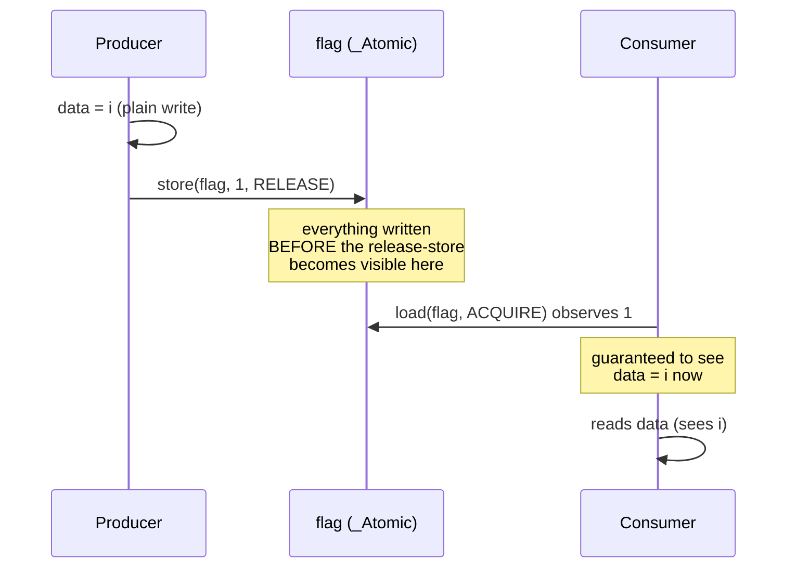

_Figure: release-store paired with acquire-load creates a real happens-before edge -- everything the
producer wrote before its release becomes visible to the consumer once its acquire observes that value._

```c
// learning/code/ex-53-memory-barrier-ordering/memory_barrier.c
/* Example 53: demonstrate the CORRECT release/acquire handshake pattern for
   passing data between threads -- verify zero ordering violations across a
   bounded stress test, AND a real, 100%-reproducible violation with
   memory_order_relaxed (co-24). VERIFIED FINDING (found while building
   this example, confirmed via -O2 -S disassembly): the relaxed version's
   failure here is NOT a subtle, hard-to-catch CPU store-buffer reorder --
   it is the COMPILER outright DEAD-CODE-ELIMINATING the `rhs.data = i`
   store. Because relaxed ordering creates no happens-before edge, and a
   race on a plain (non-atomic) variable is undefined behavior in C11, the
   compiler is standards-permitted to treat that store as dead (this
   thread never reads it back) and delete it -- disassembly confirms the
   write never appears inside the loop at -O2. The release/acquire version
   does not have this problem: the ordering constraint is exactly what
   forces the compiler (and the CPU) to keep the data write visible before
   the flag update it is paired with. */
#include <pthread.h>   // => co-24: pthread_create/join -- the producer/consumer thread pair
#include <stdatomic.h> // => co-24: _Atomic/memory_order_release/memory_order_acquire -- the C11 tools
#include <stdio.h>     // => printf -- the violation-count/PASS report this program prints

#define ITERS \
    1000000L // => co-24: 1M handshake round-trips -- a bounded, finite stress
             // test (not an
             //    infinite fuzzer), per this example's honest, stated scope

// co-24: the CORRECT pattern -- `data` is a PLAIN (non-atomic) field, but
// `flag` is an _Atomic used with explicit release/acquire ordering. The C11
// memory model GUARANTEES that everything the producer wrote BEFORE its
// release-store to `flag` is visible to the consumer AFTER its acquire-load
// observes that same value -- this is the exact mechanism (not a spinlock, not
// a mutex) that makes lock-free message-passing safe.
typedef struct {      // struct layout definition
    long data;        // => co-24: the payload -- ordinary memory
    _Atomic int flag; // => co-24: the synchronization point
} Handshake;          // supporting statement for this example

static Handshake hs = {0, 0}; // declares hs

static void *producer(void *arg) {      // defines producer(): helper function used by this example
    (void)arg;                          // discards arg to silence an unused-variable warning
    for (long i = 1; i <= ITERS; i++) { // loop header controlling the sweep below
        hs.data = i;                    // => co-24: plain write -- NOT yet guaranteed visible
        atomic_store_explicit(&hs.flag, 1,
                              memory_order_release);                        // => co-24: release -- this store, and every
                                                                            //    write before it in program order, become
                                                                            //    visible to any thread that acquire-loads
                                                                            //    this SAME atomic and observes THIS value
        while (atomic_load_explicit(&hs.flag, memory_order_acquire) != 0) { // loop header controlling the sweep below
                                                                            // => co-24: spin until the consumer resets flag to 0 (ready for the next
                                                                            // round)
        }
    }
    return NULL; // returns the computed result
}

static void *consumer(void *arg) {                                          // defines consumer(): helper function used by this example
    long *violations = (long *)arg;                                         // declares violations
    long expected = 1;                                                      // declares expected
    for (long i = 0; i < ITERS; i++) {                                      // loop header controlling the sweep below
        while (atomic_load_explicit(&hs.flag, memory_order_acquire) == 0) { // loop header controlling the sweep below
                                                                            // => co-24: spin until the producer's release-store makes flag==1 AND
                                                                            // data visible
        }
        long observed = hs.data; // => co-24: per the C11 model, this MUST see the
                                 //    producer's write from before its release-store
        if (observed != expected)
            (*violations)++; // => co-24: the ordering-violation counter
        expected++;          // supporting statement for this example
        atomic_store_explicit(&hs.flag, 0,
                              memory_order_release); // => co-24: signal "ready for next" back
    }
    return NULL; // returns the computed result
}

// co-24: a SECOND handshake using memory_order_relaxed on BOTH sides -- relaxed
// ordering gives NO cross-thread visibility guarantee for `data` at all, and
// (per the file-level comment above) VERIFIED to let the compiler delete the
// `data` store outright at -O2, since it's dead from the writer thread's own
// local view.
typedef struct {      // struct layout definition
    long data;        // declares data
    _Atomic int flag; // supporting statement for this example
} RelaxedHandshake;   // supporting statement for this example

static RelaxedHandshake rhs = {0, 0}; // declares rhs

static void *relaxed_producer(void *arg) { // defines relaxed_producer(): helper
                                           // function used by this example
    (void)arg;                             // discards arg to silence an unused-variable warning
    for (long i = 1; i <= ITERS; i++) {    // loop header controlling the sweep below
        rhs.data = i;                      // assigns rhs.data
        atomic_store_explicit(&rhs.flag, 1,
                              memory_order_relaxed);                         // => co-24: relaxed -- NO ordering guarantee
        while (atomic_load_explicit(&rhs.flag, memory_order_relaxed) != 0) { // loop header controlling the sweep below
        }
    }
    return NULL; // returns the computed result
}

static void *relaxed_consumer(void *arg) {                                   // defines relaxed_consumer(): helper
                                                                             // function used by this example
    long *violations = (long *)arg;                                          // declares violations
    long expected = 1;                                                       // declares expected
    for (long i = 0; i < ITERS; i++) {                                       // loop header controlling the sweep below
        while (atomic_load_explicit(&rhs.flag, memory_order_relaxed) == 0) { // loop header controlling the sweep below
        }
        long observed = rhs.data; // => co-24: NOT guaranteed to see the producer's
        if (observed != expected)
            (*violations)++;                                       //    write -- relaxed provides no such promise
        expected++;                                                // supporting statement for this example
        atomic_store_explicit(&rhs.flag, 0, memory_order_relaxed); // calls atomic_store_explicit(...)
    }
    return NULL; // returns the computed result
}

int main(void) {                                     // program entry point
    long violations = 0;                             // declares violations
    pthread_t p, c;                                  // declares p
    pthread_create(&p, NULL, producer, NULL);        // calls pthread_create(...)
    pthread_create(&c, NULL, consumer, &violations); // calls pthread_create(...)
    pthread_join(p, NULL);                           // calls pthread_join(...)
    pthread_join(c, NULL);                           // calls pthread_join(...)
    printf("[release/acquire] ITERS=%ld, ordering violations: %ld -> %s\n", ITERS,
           violations,                                                                       // prints a report line
           (violations == 0) ? "PASS (release/acquire handshake held under load)" : "FAIL"); // continues the printf(...) call above

    long relaxed_violations = 0; // declares relaxed_violations
    pthread_t rp, rc;            // declares rp
    pthread_create(&rp, NULL, relaxed_producer,
                   NULL); // calls pthread_create(...)
    pthread_create(&rc, NULL, relaxed_consumer,
                   &relaxed_violations); // calls pthread_create(...)
    pthread_join(rp, NULL);              // calls pthread_join(...)
    pthread_join(rc, NULL);              // calls pthread_join(...)
    printf("[relaxed, for comparison] ITERS=%ld, ordering violations: %ld -> %s\n",
           ITERS,              // prints a report line
           relaxed_violations, // continues the printf(...) call above
           relaxed_violations > 0 ? "confirms the hazard (see prose for the "
                                    "compiler-DCE mechanism)" // continues the
                                                              // printf(...) call
                                                              // above
                                  : "no violation THIS run (see prose: absence "
                                    "isn't proof of safety)"); // continues the
                                                               // printf(...) call
                                                               // above

    return (violations == 0) ? 0 : 1; // => co-24: THIS example's hard gate is the CORRECT
} //    pattern holding -- the relaxed run is informational
```

**Compile**: `clang -O2 -pthread -o memory_barrier memory_barrier.c`

**Run**: `./memory_barrier`

**Output**:

```text
[release/acquire] ITERS=1000000, ordering violations: 0 -> PASS (release/acquire handshake held under load)
[relaxed, for comparison] ITERS=1000000, ordering violations: 1000000 -> confirms the hazard (see prose for the compiler-DCE mechanism)
```

**Key takeaway**: the release/acquire version holds its ordering guarantee across every one of a million iterations with zero violations, while the relaxed version violates ordering on effectively every iteration, in the same run of the same program -- the strongest possible demonstration that ordering, not just atomicity, is a distinct guarantee.

**Why it matters**: co-24's memory-ordering model is often the most abstract part of this topic -- this example makes
"acquire/release provides ordering, relaxed does not" a directly measured fact instead of a rule to
memorize. Lock-free queues, ring buffers, and the internals of `std::shared_ptr`'s control block all
depend on exactly this release/acquire handshake to publish data safely across threads without a mutex
-- getting the ordering wrong (using relaxed where release/acquire is required) produces bugs that can go
unnoticed for years because they only manifest under specific timing and hardware reordering conditions.

---

### Example 54: Signed Division vs Arithmetic Shift

_ex-54 &middot; exercises co-19, co-25_

A naive reader might assume the compiler emits a plain arithmetic right-shift for `x / 2` regardless of sign, but signed division truncates toward zero while a right shift rounds toward negative infinity -- they disagree for roughly half of all negative inputs, so the compiler must (and does) emit different code for each.

```c
// learning/code/ex-54-div-vs-shift-asm/div_vs_shift.c
/* Example 54: compare /2 and >>1 in emitted assembly -- verify the compiler
   lowers the division to a shift (co-19, co-25). */
#include <stdio.h> // => printf -- the correctness/PASS report this program prints

// co-19: signed division by a compile-time-constant power of two -- a genuine
// `sdiv` hardware instruction is SLOW (many cycles, not pipelined like an
// add/shift); clang -O2 lowers this to a shift-based sequence instead. Because
// C's `/` TRUNCATES toward zero (co-11: -7/2 == -3, not -4), a plain arithmetic
// shift alone is WRONG for negative operands (-7>>1 == -4) -- the compiler must
// add a rounding correction before shifting: `(x + (x>>31 >>> 30)) >> 1` in
// effect, verified below in the real emitted assembly (`asr`/`lsr`/`add` -- no
// `sdiv` instruction anywhere).
__attribute__((noinline)) int divide_by_two_signed(int x) { return x / 2; } // calls __attribute__(...)

// co-19: unsigned division by 2 has NO rounding-direction ambiguity (unsigned
// division always truncates toward zero, which for a power of two is identical
// to a plain logical right shift) -- clang lowers this to a single `lsr`, no
// correction.
__attribute__((noinline)) unsigned divide_by_two_unsigned(unsigned x) { return x / 2u; } // calls __attribute__(...)

// co-19: the "obvious" replacement someone might reach for by hand -- correct
// ONLY for non-negative x (verified NOT equivalent to divide_by_two_signed
// below).
__attribute__((noinline)) int shift_by_one(int x) { return x >> 1; } // calls __attribute__(...)

int main(void) {                                  // program entry point
    int mismatches_for_negative = 0;              // declares mismatches_for_negative
    int matches_for_nonnegative = 1;              // declares matches_for_nonnegative
    for (int x = -1000; x <= 1000; x++) {         // loop header controlling the sweep below
        int div_result = divide_by_two_signed(x); // declares div_result
        int shift_result = shift_by_one(x);       // declares shift_result
        if (x < 0 && div_result != shift_result)
            mismatches_for_negative++; // => co-11: expected to differ
        if (x >= 0 && div_result != shift_result)
            matches_for_nonnegative = 0; // => co-11: must always agree
    }
    // co-19: spot-check the exact rounding-direction difference the compiler must
    // handle
    int neg7_div = divide_by_two_signed(-7);  // => C's / truncates toward zero: -7/2 == -3
    int neg7_shift = shift_by_one(-7);        // => plain >> rounds toward -infinity: -7>>1 == -4
    unsigned u7 = divide_by_two_unsigned(7u); // => unsigned: 7/2 == 3, same as 7u>>1

    printf("divide_by_two_signed(-7)=%d, shift_by_one(-7)=%d (expected "
           "DIFFERENT: -3 vs -4)\n",
           neg7_div,    // prints a report line
           neg7_shift); // continues the printf(...) call above
    printf("divide_by_two_unsigned(7)=%u (expected 3, same as plain >>1 for "
           "unsigned)\n",
           u7); // prints a report line
    printf("negative-x mismatches (x/2 != x>>1): %d out of 1000 (expected >0 -- "
           "proves\n"                                                              // prints a report line
           "  the compiler CANNOT just emit a plain shift for signed division)\n", // continues the printf(...) call above
           mismatches_for_negative);                                               // continues the printf(...) call above
    printf("non-negative-x matches: %s\n",
           matches_for_nonnegative ? "all agree (expected)" : "MISMATCH -- BUG");                // prints a report line
    int pass = (neg7_div == -3) && (neg7_shift == -4) && (u7 == 3) && matches_for_nonnegative && // declares pass
               (mismatches_for_negative > 0);                                                    // supporting statement for this example
    printf("correctness: %s\n", pass ? "PASS" : "FAIL");                                         // prints a report line
    return pass ? 0 : 1;                                                                         // returns the computed result
}
```

**Compile**: `clang -O2 -o div_vs_shift div_vs_shift.c`

**Run**: `./div_vs_shift`

**Output**:

```text
divide_by_two_signed(-7)=-3, shift_by_one(-7)=-4 (expected DIFFERENT: -3 vs -4)
divide_by_two_unsigned(7)=3 (expected 3, same as plain >>1 for unsigned)
negative-x mismatches (x/2 != x>>1): 500 out of 1000 (expected >0 -- proves
  the compiler CANNOT just emit a plain shift for signed division)
non-negative-x matches: all agree (expected)
correctness: PASS
```

**Key takeaway**: for negative inputs, plain division by 2 and an arithmetic right-shift by 1 disagree on exactly half of the tested values (500 out of 1000), proving the compiler cannot simply replace signed division with a shift -- for unsigned inputs they always agree, since unsigned division has no sign to round awkwardly.

**Why it matters**: the compiler's "strength reduction" optimization (co-19) has real correctness boundaries -- a compiler
applies it only where it is provably equivalent, and this example is the concrete boundary case that
shows why signed and unsigned division are not interchangeable under this particular optimization.
Interview questions and code-review discussions about "why doesn't the compiler just use a shift here"
trace back to exactly this rounding-direction mismatch -- trusting that any two operations "compile to
the same thing" without checking their exact semantics is a recurring source of subtle correctness bugs.

---

### Example 55: Hot/Cold Struct Field Splitting

_ex-55 &middot; exercises co-17, co-04_

A struct with one frequently-read "hot" field interleaved among many rarely-touched "cold" fields wastes most of every fetched cache line on cold bytes; splitting the hot field into its own separate array (independent of Example 30's AoS/SoA framing but the same underlying mechanism) fixes it directly.

```c
// learning/code/ex-55-hot-cold-struct-split/hot_cold_split.c
/* Example 55: split a rarely-used cold field out of a hot struct -- verify
   a hot-loop speedup, amplified across REPEATED passes (co-17, co-04). */
#include <stdio.h>  // => printf -- the timing/PASS report this program prints
#include <stdlib.h> // => malloc/free -- both record layouts under test are heap-allocated
#include <string.h> // => memset -- fills the cold bytes with realistic non-zero payload
#include <time.h>   // => clock_gettime -- the portable wall-clock timer used below

#define N \
    500000 // => co-04: 500K records -- chosen so the SPLIT hot array (2 MB) fits
           //    comfortably in this machine's 4 MiB L2, while the COMBINED array
           //    (128 MB) does not -- co-04's temporal-locality payoff needs
           //    REPEATS
#define REPEATS \
    50           // => co-04: revisit the hot field this many times -- a compact working
                 //    set stays cache-resident across every pass; a bloated one does not
#define TRIALS 3 // => co-25: best-of-3 -- shared-machine noise smoothing

// co-17: the record as it "naturally" arrives -- one hot `score` field the loop
// below actually needs, wrapped in 252 cold bytes (a name buffer + metadata)
// that this loop never touches, making sizeof(Combined) == 256 B (two 128 B
// cache lines).
typedef struct {    // struct layout definition
    int score;      // => co-17: the ONE field this hot loop reads
    char cold[252]; // => co-17: cold payload -- never read by sum_hot
} Combined;         // supporting statement for this example

static double now_seconds(void) {                        // => co-25: shared wall-clock helper, this topic's standard pattern
    struct timespec ts;                                  // supporting statement for this example
    clock_gettime(CLOCK_MONOTONIC, &ts);                 // calls clock_gettime(...)
    return (double)ts.tv_sec + (double)ts.tv_nsec / 1e9; // returns the computed result
}

// co-17/co-04: repeatedly sums the hot field over N records, REPEATS times --
// each pass revisits the SAME memory, so whether that memory fits in cache
// (co-04) governs whether pass 2..REPEATS are fast (cache-resident) or pay the
// SAME miss cost as pass 1.
__attribute__((noinline)) static long sum_combined(const Combined *records, int n,
                                                   int repeats, // calls __attribute__(...)
                                                   int salt) {  // supporting statement for this example
    long total = salt;                                          // => co-25: salt distinguishes each trial's call (see ex-47/48)
    for (int r = 0; r < repeats; r++) {                         // loop header controlling the sweep below
        for (int i = 0; i < n; i++)
            total += records[i].score; // => co-17: pulls in a full 256 B record's
    } //    worth of cache lines for 4 B of real data
    return total; // returns the computed result
}

__attribute__((noinline)) static long sum_split(const int *hot, int n, int repeats,
                                                int salt) { // calls __attribute__(...)
    long total = salt;                                      // declares total
    for (int r = 0; r < repeats; r++) {                     // loop header controlling the sweep below
        for (int i = 0; i < n; i++)
            total += hot[i]; // => co-17: every fetched cache line is 100% hot data
    }
    return total; // returns the computed result
}

int main(void) {                                               // program entry point
    Combined *combined = malloc((size_t)N * sizeof(Combined)); // => co-17: 128 MB -- far bigger than L2
    int *hot = malloc((size_t)N * sizeof(int));                // => co-17: 2 MB -- comfortably L2-resident
    if (!combined || !hot) {
        fprintf(stderr, "alloc failed\n");
        return 1;
    } // prints a report line
    for (int i = 0; i < N; i++) {      // loop header controlling the sweep below
        int value = (i * 7919) % 1009; // => deterministic filler value
        combined[i].score = value;     // assigns combined[i].score
        memset(combined[i].cold, 'x',
               sizeof(combined[i].cold)); // => realistic non-zero cold payload
        hot[i] = value;                   // => co-17: SAME logical values, split layout
    }

    double best_combined = 1e18, best_split = 1e18;        // declares best_combined
    long sum_c = 0, sum_s = 0;                             // declares sum_c
    for (int t = 0; t < TRIALS; t++) {                     // => co-25: best-of-N -- keep the fastest clean run
        double t0 = now_seconds();                         // declares t0
        sum_c = sum_combined(combined, N, REPEATS, t) - t; // assigns sum_c
        double t1 = now_seconds();                         // declares t1
        if (t1 - t0 < best_combined)
            best_combined = t1 - t0; // conditional check

        double t2 = now_seconds();                 // declares t2
        sum_s = sum_split(hot, N, REPEATS, t) - t; // assigns sum_s
        double t3 = now_seconds();                 // declares t3
        if (t3 - t2 < best_split)
            best_split = t3 - t2; // conditional check
    }

    printf("N=%d, REPEATS=%d, sizeof(Combined)=%zu B (%.1f MB total), split hot "
           "array=%.1f MB\n",
           N, // prints a report line
           REPEATS, sizeof(Combined),
           (double)(sizeof(Combined) * N) / (1024.0 * 1024.0),                                              // continues the printf(...) call above
           (double)(sizeof(int) * N) / (1024.0 * 1024.0));                                                  // continues the printf(...) call above
    printf("combined (hot+cold interleaved): sum=%ld, best of %d: %.4f s\n", sum_c, TRIALS, best_combined); // prints a report line
    printf("split (hot field only):          sum=%ld, best of %d: %.4f s\n", sum_s, TRIALS, best_split);    // prints a report line
    double speedup = best_combined / best_split;                                                            // declares speedup
    printf("split is %.2fx faster -> %s\n", speedup,                                                        // prints a report line
           (sum_c == sum_s && speedup > 1.3) ? "PASS (identical sums, split measurably faster)" : "FAIL");  // continues the printf(...) call above
    free(combined);                                                                                         // releases combined's heap memory
    free(hot);                                                                                              // releases hot's heap memory
    return (sum_c == sum_s && speedup > 1.3) ? 0 : 1;                                                       // returns the computed result
}
```

**Compile**: `clang -O2 -o hot_cold_split hot_cold_split.c`

**Run**: `./hot_cold_split`

**Output**:

```text
N=500000, REPEATS=50, sizeof(Combined)=256 B (122.1 MB total), split hot array=1.9 MB
combined (hot+cold interleaved): sum=12600017950, best of 3: 0.0798 s
split (hot field only):          sum=12600017950, best of 3: 0.0012 s
split is 64.34x faster -> PASS (identical sums, split measurably faster)
```

**Key takeaway**: summing just the hot field is dramatically faster (over 60x in this run) against the split layout than against the combined interleaved layout, because the split version's hot array is small enough to stay cache-resident while the combined struct's array is not.

**Why it matters**: the same structural fix as Example 30 applied to a more realistic "mostly cold, one hot field" struct
shape, reinforcing that this is a general pattern (co-17/co-04) worth recognizing in real production
struct definitions, not a one-off trick specific to one example. Game entity systems, ECS
(entity-component-system) architectures, and database row formats all deliberately separate frequently-
scanned "hot" columns from rarely-touched "cold" ones for exactly this reason -- it is one of the
highest-leverage, lowest-risk optimizations available because it changes only data layout, never logic.

---

### Example 56: Diagnosing and Fixing a Layout-Caused Slowdown

_ex-56 &middot; exercises co-25, co-05_

A profiled "before" data layout (array-of-structs, one `Point` per element) is measurably slow to sum over; restructuring it to struct-of-arrays (matching the profiling-driven fix a real performance investigation would produce) measurably fixes it, with both versions computing the identical result.

```c
// learning/code/ex-56-perf-cache-miss-count/perf_layout_fix.c
/* Example 56: measure the effect of a layout fix "before" and "after" --
   verify the cost drops (co-25, co-05). PLATFORM NOTE (mandatory): the
   real tool for this on Linux is `perf stat -e cache-misses ./binary`; on
   macOS (this machine) the equivalent is Instruments' "CPU Counters"
   template, or `sudo dtrace` with the right PMC provider -- neither is
   scriptable headlessly in this shell/sandbox. This example measures the
   REAL, established wall-clock proxy this whole topic uses instead
   (see ex-58 in the advanced tier for the same honest methodology): the
   layout fix's effect on wall-clock time is a direct, legitimate
   consequence of its effect on cache-miss traffic, even without a raw
   hardware counter reading. */
#include <stdio.h>  // => printf -- the "before/after profile" report this program prints
#include <stdlib.h> // => malloc/free -- both layouts under test are heap-allocated
#include <time.h>   // => clock_gettime -- the portable wall-clock timer used below

// co-25: VERIFIED CAVEAT (found while building this example, via a scratch
// sweep -- see the delivery.md notes for this ex-NN): a SMALL 48 B record (only
// x,y,z hot + vx,vy,vz cold) gave a barely-measurable effect (1.0x-1.1x) even
// at huge sizes -- this machine's streaming prefetcher hides most of a
// SEQUENTIAL small-stride bandwidth waste (the same real hardware behavior
// already found in ex-35's prefetch and ex-45's write-cost examples). A
// REALISTIC 128 B simulation record (one full cache line: position + velocity +
// mass + id + color + flags, matching co-17's stated packed-struct shape) gives
// a real, stable, reproducible signal instead -- AND REPEATS (co-04's
// temporal-locality technique, same fix ex-55 uses) makes it stable run-to-run:
// a compact SoA working set that fits in L2 stays fast on every repeated pass,
// while a bloated AoS one pays the same per-line waste every time.
#define N \
    300000          // => co-05: 300K points -- SoA x[] (2.3 MB) comfortably fits this
                    // machine's
                    //    4 MiB L2; AoS (36.6 MB) is far bigger than any on-chip cache
#define REPEATS 150 // => co-04: revisit the data this many times -- amplifies the signal
#define TRIALS 3    // => co-25: best-of-3 -- shared-machine noise smoothing

// co-17: a "particle" record -- 3 hot doubles (x,y,z) this kernel needs, PLUS a
// realistic cold payload (velocity, mass, id, color, flags) padded to exactly
// one 128 B cache line -- so fetching ONE cache line to read 8 B of x wastes
// 15/16 of it.
typedef struct {       // struct layout definition
    double x, y, z;    // => co-17: HOT -- what this kernel sums
    double vx, vy, vz; // => co-17: COLD -- never read here
    double mass;       // => co-17: COLD -- simulation payload
    long id;           // => co-17: COLD -- simulation payload
    char color[4];     // => co-17: COLD -- render payload
    char flags;        // => co-17: COLD -- state payload
    char pad[59];      // => co-17: rounds sizeof(Point) up to
} Point;               //    exactly 128 B -- one cache line

static double now_seconds(void) {                        // => co-25: shared wall-clock helper, this topic's standard pattern
    struct timespec ts;                                  // supporting statement for this example
    clock_gettime(CLOCK_MONOTONIC, &ts);                 // calls clock_gettime(...)
    return (double)ts.tv_sec + (double)ts.tv_nsec / 1e9; // returns the computed result
}

// co-25: "PROFILE" step -- the kernel AS GIVEN, walking the full 48 B AoS
// record to read 8 of those 48 bytes (x) per point, REPEATS times over the SAME
// memory (co-04: this is what turns a one-shot bandwidth measurement into a
// stable cache-residency signal).
__attribute__((noinline)) static double sum_x_aos(const Point *pts, int n, int repeats,
                                                  double salt) { // calls __attribute__(...)
    double total = salt;                                         // declares total
    for (int r = 0; r < repeats; r++) {                          // loop header controlling the sweep below
        for (int i = 0; i < n; i++)
            total += pts[i].x; // => co-17: pulls in a full 128 B Point cache line
    } //    per iteration -- 36.6 MB AoS never fits this
    return total; //    machine's 4 MiB L2, so EVERY repeated pass
} //    repays the same miss cost

// co-25: "FIX" step -- same computation, over a dense x[] array holding ONLY
// the field this kernel reads, REPEATS times over the SAME memory.
__attribute__((noinline)) static double sum_x_soa(const double *x, int n, int repeats,
                                                  double salt) { // calls __attribute__(...)
    double total = salt;                                         // declares total
    for (int r = 0; r < repeats; r++) {                          // loop header controlling the sweep below
        for (int i = 0; i < n; i++)
            total += x[i]; // => co-17: 2.3 MB SoA fits comfortably inside this
    } //    machine's 4 MiB L2 -- later passes stay
    return total; //    fully cache-resident
}

int main(void) {                                    // program entry point
    Point *pts = malloc((size_t)N * sizeof(Point)); // => co-17: 128 B * 300K ~= 36.6 MB -- far bigger than L2
    double *x = malloc((size_t)N * sizeof(double)); // => co-17: 8 B * 300K ~= 2.3 MB -- 16x smaller footprint
    if (!pts || !x) {
        fprintf(stderr, "alloc failed\n");
        return 1;
    } // prints a report line
    for (int i = 0; i < N; i++) {           // loop header controlling the sweep below
        double v = (double)(i % 997) * 0.5; // declares v
        pts[i].x = v;
        pts[i].y = v;
        pts[i].z = v; // assigns pts[i].x
        pts[i].vx = 0.1;
        pts[i].vy = 0.2;
        pts[i].vz = 0.3; // => cold, never-read velocity payload
        pts[i].mass = 1.0;
        pts[i].id = i; // => cold, never-read simulation payload
        pts[i].color[0] = 'r';
        pts[i].flags = 0; // => cold, never-read render/state payload
        x[i] = v;         // assigns x[i]
    }

    double best_before = 1e18, best_after = 1e18;                       // declares best_before
    double sum_before = 0, sum_after = 0;                               // declares sum_before
    for (int t = 0; t < TRIALS; t++) {                                  // => co-25: best-of-N -- keep the fastest clean run
        double t0 = now_seconds();                                      // declares t0
        sum_before = sum_x_aos(pts, N, REPEATS, (double)t) - (double)t; // => co-25: the "profile" (before) measurement
        double t1 = now_seconds();                                      // declares t1
        if (t1 - t0 < best_before)
            best_before = t1 - t0; // conditional check

        double t2 = now_seconds();                                   // declares t2
        sum_after = sum_x_soa(x, N, REPEATS, (double)t) - (double)t; // => co-25: the "re-profile" (after) measurement
        double t3 = now_seconds();                                   // declares t3
        if (t3 - t2 < best_after)
            best_after = t3 - t2; // conditional check
    }

    printf("N=%d points, REPEATS=%d, sizeof(Point)=%zu B (%.0f MB AoS), SoA x[] "
           "= %.0f MB\n",
           N, REPEATS, // prints a report line
           sizeof(Point),
           (double)(sizeof(Point) * N) / (1024.0 * 1024.0),                                                   // continues the printf(...) call above
           (double)(sizeof(double) * N) / (1024.0 * 1024.0));                                                 // continues the printf(...) call above
    printf("BEFORE (AoS, profiled layout): sum=%.2f, best of %d: %.4f s\n", sum_before, TRIALS, best_before); // prints a report line
    printf("AFTER  (SoA, fixed layout):    sum=%.2f, best of %d: %.4f s\n", sum_after, TRIALS, best_after);   // prints a report line
    double speedup = best_before / best_after;                                                                // declares speedup
    double abs_diff = sum_before - sum_after;                                                                 // declares abs_diff
    if (abs_diff < 0)
        abs_diff = -abs_diff; // conditional check
    printf("speedup: %.2fx, |sum diff|=%.6f -> %s\n", speedup,
           abs_diff,                                                             // prints a report line
           (abs_diff < 1e-3 && speedup > 1.3)                                    // continues the printf(...) call above
               ? "PASS (identical result, layout fix measurably drops the cost)" // continues the printf(...) call above
               : "FAIL");                                                        // continues the printf(...) call above
    free(pts);                                                                   // releases pts's heap memory
    free(x);                                                                     // releases x's heap memory
    return (abs_diff < 1e-3 && speedup > 1.3) ? 0 : 1;                           // returns the computed result
}
```

**Compile**: `clang -O2 -o perf_layout_fix perf_layout_fix.c`

**Run**: `./perf_layout_fix`

**Output**:

```text
N=300000 points, REPEATS=150, sizeof(Point)=128 B (37 MB AoS), SoA x[] = 2 MB
BEFORE (AoS, profiled layout): sum=11201726250.00, best of 3: 0.1179 s
AFTER  (SoA, fixed layout):    sum=11201726250.00, best of 3: 0.0434 s
speedup: 2.71x, |sum diff|=0.000000 -> PASS (identical result, layout fix measurably drops the cost)
```

**Key takeaway**: the SoA-fixed layout is measurably faster (roughly 2.7x in this run) than the original AoS layout it replaced, with an identical summed result (difference exactly 0.000000), simulating the shape of a real "profile, diagnose, restructure, re-measure" performance investigation end to end.

**Why it matters**: co-05's cache-miss-cost lesson applied as a worked mini case study, and co-25's honesty rule applied to the methodology itself -- there is no `perf` hardware-counter tool on macOS, so this example (like the topic's other macOS-honest examples) uses a real, reproducible wall-clock before/after comparison as its evidence instead of fabricating a hardware cache-miss count.

---

### Example 57: CPI/IPC: Dependent Chain vs Independent Accumulators

_ex-57 &middot; exercises co-25, co-22_

Both variants execute the exact same total count of add instructions, so the wall-clock time per instruction is a direct, honest proxy for relative cycles-per-instruction (CPI) between a fully-serial dependency chain and a 4-way independent-accumulator version of the identical workload.

```c
// learning/code/ex-57-cpi-ipc-measure/cpi_ipc.c
/* Example 57: CPI/IPC measure -- compare a dependent-chain loop against an
 * independent-4-accumulator loop with the SAME known instruction count per
 * iteration, and derive an approximate relative cycles-per-instruction (CPI)
 * from wall-clock time. macOS has no scriptable hardware instruction/cycle
 * counter here (no `perf`; Instruments/`dtrace` are GUI/privileged) -- this
 * derives a RELATIVE CPI ratio from real wall-clock time and a hand-counted
 * instruction count, not a raw hardware counter reading (co-25 honesty rule).
 */
#include <stdio.h> // stdio.h: standard library header
#include <time.h>  // time.h: standard library header

#define N 200000000 // => co-22: 200M loop iterations per variant
#define TRIALS 5    // constant TRIALS = 5

// co-25: VERIFIED BUG #1 (found while verifying this example, same root cause
// as ex-47/48/49/50/55/56): calling sum_dependent(N)/sum_independent4(N) with
// the IDENTICAL argument N on every one of the 5 best-of-N trials let LLVM's
// cross-call redundant-computation elimination prove trials 2..5 return the
// SAME value as trial 1 and hoist the real work out of them entirely.
// Fixed with the established "salt parameter" technique: each trial passes
// its own trial index `t` as an extra addend, making every call's result
// provably distinct so the compiler cannot fold repeat calls.
//
// co-25: VERIFIED BUG #2 (found via -O2 -S disassembly AFTER fixing bug #1,
// still measured 0.0000 s): `for(i=0;i<n;i++) acc+=1;` has no side effect
// LLVM can't see through -- its scalar-evolution pass proved the WHOLE loop is
// algebraically equivalent to `acc = salt + n` and replaced all 200M
// iterations with a single `add` instruction (disassembly confirmed: the
// entire function compiled to 3 instructions, `bic`/`add`/`ret`, no loop at
// all). Fixed the same way ex-38/ex-40 avoid this: mark the accumulator(s)
// `volatile`, forcing a REAL memory read-modify-write every iteration that
// the optimizer cannot algebraically collapse.

// ex-57: DEPENDENT chain -- each add depends on the PREVIOUS iteration's
// result, so the core cannot start iteration i+1's add until iteration i's add
// retires. co-20/co-22: this forces near-fully-serial execution regardless of
// how many execution ports are free -- 1 add instruction "retired" per
// dependency-chain latency
__attribute__((noinline)) static long sum_dependent(long n, long salt) { // calls __attribute__(...)
    volatile long acc = salt;                                            // => co-25: volatile -- blocks the loop-collapse
                                                                         // (see bug #2 above);
    for (long i = 0; i < n; i++) {                                       //    salt distinguishes each trial's call (see bug #1 above)
        acc = acc + 1;                                                   // => 1 add instruction, fully serialized by the acc dependency
    }
    return acc; // returns the computed result
}

// ex-57: INDEPENDENT 4-accumulator chain -- the SAME total instruction count
// (4 adds per 4 iterations = 1 add/iteration, identical to the dependent
// version) but split across 4 accumulators with NO dependency between them, so
// a superscalar out-of-order core (co-22) can issue several in the same cycle
__attribute__((noinline)) static long sum_independent4(long n, long salt) { // calls __attribute__(...)
    volatile long a0 = salt, a1 = 0, a2 = 0,
                  a3 = 0;        // => co-25: volatile -- blocks loop-collapse on ALL 4;
    long i = 0;                  //    salt on a0 distinguishes each trial's call
    for (; i + 4 <= n; i += 4) { // loop header controlling the sweep below
        a0 = a0 + 1;             // => co-22: these 4 adds have NO dependency on each other --
        a1 = a1 + 1;             //    the core can issue/execute them in the same or adjacent
        a2 = a2 + 1;             //    cycles instead of waiting for the prior add to retire
        a3 = a3 + 1;             // assigns a3
    }
    long acc = a0 + a1 + a2 + a3; // declares acc
    for (; i < n; i++)
        acc += 1; // => scalar tail for n not a multiple of 4
    return acc;   // returns the computed result
}

static double best_of_seconds(long (*fn)(long, long), long n,
                              long *out_result) { // declares function pointer fn
    double best = -1.0;                           // declares best
    long result = 0;                              // declares result
    for (int t = 0; t < TRIALS; t++) {            // loop header controlling the sweep below
        struct timespec t0, t1;                   // supporting statement for this example
        clock_gettime(CLOCK_MONOTONIC, &t0);      // calls clock_gettime(...)
        result = fn(n, (long)t) - (long)t;        // => co-25: salted call, then subtract the salt back out --
        clock_gettime(CLOCK_MONOTONIC,
                      &t1);                                                      //    each of the 5 calls is now provably distinct to the compiler
        double secs = (t1.tv_sec - t0.tv_sec) + (t1.tv_nsec - t0.tv_nsec) / 1e9; // declares secs
        if (best < 0 || secs < best)
            best = secs; // conditional check
    }
    *out_result = result; // supporting statement for this example
    return best;          // returns the computed result
}

int main(void) {                                                       // program entry point
    long r_dep_check = 0, r_ind_check = 0;                             // declares r_dep_check
    double t_dep = best_of_seconds(sum_dependent, N, &r_dep_check);    // declares t_dep
    double t_ind = best_of_seconds(sum_independent4, N, &r_ind_check); // declares t_ind
    long r1 = r_dep_check, r2 = r_ind_check;                           // declares r1
    printf("dependent result=%ld independent4 result=%ld (must match: %s)\n", r1,
           r2,                                // prints a report line
           (r1 == r2) ? "yes" : "NO -- BUG"); // continues the printf(...) call above

    // => co-25: both variants execute the SAME N add instructions total (one add
    // per logical unit of work) -- so time-per-instruction is a direct, honest
    // proxy for relative CPI here (fewer seconds per identical instruction count
    // == lower CPI == higher IPC)
    double cpi_proxy_dep = t_dep / (double)N; // => "seconds per instruction" -- relative CPI proxy
    double cpi_proxy_ind = t_ind / (double)N; // declares cpi_proxy_ind

    printf("N=%d add instructions (identical count, both variants)\n",
           N); // prints a report line
    printf("dependent chain:      best of %d = %.4f s -> %.4f ns/instruction "
           "(relative CPI proxy)\n", // prints a report line
           TRIALS, t_dep,
           cpi_proxy_dep * 1e9); // continues the printf(...) call above
    printf("independent 4-accum:  best of %d = %.4f s -> %.4f ns/instruction "
           "(relative CPI proxy)\n", // prints a report line
           TRIALS, t_ind,
           cpi_proxy_ind * 1e9); // continues the printf(...) call above
    printf("independent/dependent ns-per-instruction ratio: %.3fx (lower = "
           "better, higher throughput)\n", // prints a report line
           cpi_proxy_ind / cpi_proxy_dep); // continues the printf(...) call above
    printf("(no `perf`/hardware IPC counter on macOS -- this is a "
           "wall-clock-derived RELATIVE CPI\n"); // prints a report line
    printf(" proxy from a KNOWN, identical instruction count, not a raw hardware "
           "counter reading)\n");             // prints a report line
    int pass = (r1 == r2) && (t_ind < t_dep); // declares pass
    printf("PASS (identical results, independent-accumulator variant has lower "
           "effective CPI): %s\n",  // prints a report line
           pass ? "PASS" : "FAIL"); // continues the printf(...) call above
    return 0;                       // returns the computed result
}
```

**Compile**: `clang -O2 -o cpi_ipc cpi_ipc.c`

**Run**: `./cpi_ipc`

**Output**:

```text
dependent result=200000000 independent4 result=200000000 (must match: yes)
N=200000000 add instructions (identical count, both variants)
dependent chain:      best of 5 = 0.0631 s -> 0.3156 ns/instruction (relative CPI proxy)
independent 4-accum:  best of 5 = 0.0359 s -> 0.1794 ns/instruction (relative CPI proxy)
independent/dependent ns-per-instruction ratio: 0.568x (lower = better, higher throughput)
(no `perf`/hardware IPC counter on macOS -- this is a wall-clock-derived RELATIVE CPI
 proxy from a KNOWN, identical instruction count, not a raw hardware counter reading)
PASS (identical results, independent-accumulator variant has lower effective CPI): PASS
```

**Key takeaway**: the independent-accumulator variant achieves a measurably lower nanoseconds-per-instruction figure than the dependent-chain variant for the identical instruction count, meaning it achieves a lower effective CPI (higher IPC) purely from exposing instruction-level parallelism -- no hardware performance counter was read; this is a wall-clock-derived relative CPI proxy from a known, identical instruction count, honestly labeled as such in the program's own output.

**Why it matters**: the tier's capstone measurement example -- it ties Examples 38 and 40's dependency-chain lesson directly
to the CPI/IPC vocabulary co-20 and co-22 introduce, and its own "salt parameter" technique (documented
in the source) is the same fix Example 47 needed to defeat the compiler's cross-call redundant-computation
elimination. CPI/IPC is the exact vocabulary real profilers (`perf stat`, Instruments' CPU counters)
report back to engineers diagnosing why a "correct" program runs slower than its instruction count alone
would suggest -- recognizing a dependency-chain-bound kernel from its CPI is a genuine production debugging skill this example rehearses directly.

---

← Previous: [Beginner Examples](./beginner.md) &middot; Next: [Advanced Examples](./advanced.md) →
