Examples 41-55 close out the topic at the outermost edge of computability and complexity: Turing
machines and the halting problem (co-22, co-23), P vs. NP and NP-completeness (co-24, co-25), and
information theory -- entropy, compression, and hashing (co-26 through co-28). Same standard,
every script actually run against **Python 3.13.12**, standard library only, every **Output** block
genuine.

---

### Example 41: A Turing Machine Incrementing a Binary Number on Its Tape

_ex-41 &middot; exercises co-22_

**co-22 -- Turing machines**: a Turing machine is a finite set of states plus an unbounded tape it
can read, write, and move a head across, one cell at a time. This machine implements binary
increment: scan right to the last digit, then ripple a carry leftward exactly the way you'd do it
by hand.

```mermaid
%% Color Palette: Blue #0173B2, Orange #DE8F05, Teal #029E73
stateDiagram-v2
    [*] --> scan_right
    scan_right --> scan_right: 0/0,R ; 1/1,R
    scan_right --> increment: blank/blank,L
    increment --> increment: 1/0,L
    increment --> done: 0/1,R ; blank/1,R
    done --> [*]

    classDef start fill:#0173B2,stroke:#000000,color:#FFFFFF,stroke-width:2px
    classDef mid fill:#DE8F05,stroke:#000000,color:#FFFFFF,stroke-width:2px
    classDef halt fill:#029E73,stroke:#000000,color:#FFFFFF,stroke-width:2px
    class scan_right start
    class increment mid
    class done halt
```



_Figure: the carry ripples leftward one cell per step in the "increment" state -- exactly binary
addition's "carry the 1" rule, mechanized as tape moves._

```python
# learning/code/ex-41-turing-machine-increment/tm_increment.py
"""Example 41: A Turing Machine Incrementing a Binary Number on Its Tape."""  # => co-22: this file's own restated purpose, doubling as its module __doc__

from __future__ import annotations  # => DD-39 hygiene: postpones type-annotation evaluation, keeping this file interpreter-version-agnostic

BLANK = "_"  # => co-22: the tape is INFINITE in both directions -- unvisited cells read as this blank symbol
# ex-41: δ -- (state, read symbol) -> (new state, write symbol, move direction). This machine
# implements binary increment: scan to the rightmost digit, then ripple a carry leftward.
TRANSITIONS: dict[tuple[str, str], tuple[str, str, str]] = {  # => co-22: the Turing machine's full transition function
    ("scan_right", "0"): ("scan_right", "0", "R"),  # => co-22: keep moving right over existing digits, unchanged
    ("scan_right", "1"): ("scan_right", "1", "R"),  # => co-22: keep moving right over existing digits, unchanged
    ("scan_right", BLANK): ("increment", BLANK, "L"),  # => co-22: past the last digit -- turn around, start carrying
    ("increment", "0"): ("done", "1", "R"),  # => co-22: 0+1=1, NO further carry -- this is where the machine halts
    ("increment", "1"): ("increment", "0", "L"),  # => co-22: 1+1=10 -- write 0, carry the 1 one cell further left
    ("increment", BLANK): ("done", "1", "R"),  # => co-22: carried past the leftmost digit -- grow the number by one digit
}  # => co-22: closes the multi-line construct opened above
HALT_STATES = {"done"}  # => co-22: no outgoing transitions are defined FROM these states -- the machine stops here


def run_tm(tape_input: str) -> str:  # => co-22: read/write/move state machine over the (conceptually infinite) tape
    """Run the binary-increment Turing machine on tape_input; return the final tape content, trimmed of blanks."""  # => co-22: documents run_tm's contract -- no runtime output, just sets its __doc__
    tape: dict[int, str] = {i: c for i, c in enumerate(tape_input)}  # => co-22: sparse tape -- only written cells exist
    head = 0  # => co-22: the read/write head's current cell position
    state = "scan_right"  # => co-22: the machine's initial state
    steps = 0  # => co-22: a hard cap, purely to guarantee this demo terminates even if a transition table were buggy
    while state not in HALT_STATES and steps < 1000:  # => co-22: run until a halt state OR the safety cap
        symbol = tape.get(head, BLANK)  # => co-22: READ -- an unvisited cell reads as blank, by definition
        new_state, write_symbol, direction = TRANSITIONS[(state, symbol)]  # => co-22: δ -- the ONE next action
        tape[head] = write_symbol  # => co-22: WRITE -- overwrite the current cell
        head += 1 if direction == "R" else -1  # => co-22: MOVE -- exactly one cell, left or right
        state = new_state  # => co-22: transition to the next state
        steps += 1  # => co-22: counts actual machine steps, for the safety cap above
    lo, hi = min(tape), max(tape)  # => co-22: the tape's used extent, for rendering the final result as a string
    return "".join(tape.get(i, BLANK) for i in range(lo, hi + 1)).strip(BLANK)  # => co-22: trim unused blank cells


if __name__ == "__main__":  # => co-22: entry point -- this block runs only when the file executes directly, not on import
    binary_11 = "1011"  # => co-22: 11 in binary -- incrementing should produce 12 ("1100")
    result = run_tm(binary_11)  # => co-22: runs the increment machine end to end
    print(f"tape before: {binary_11} (decimal {int(binary_11, 2)})")  # => co-22: shows the input and its decimal value
    print(f"tape after:  {result} (decimal {int(result, 2)})")  # => co-22: shows the final tape and its decimal value
    assert result == "1100", "incrementing 1011 (11) must produce 1100 (12)"  # => co-22: exact final-tape check
    assert int(result, 2) == int(binary_11, 2) + 1, "the decimal value must have increased by exactly 1"  # => co-22
    print(f"Final tape matches 11 + 1 = 12 in binary: True")  # => co-22: reached only if both asserts passed
    # => co-22: the asserts above ARE this example's test suite -- a silent, zero-exit run is the proof the concept holds
```

**Run**: `python3 tm_increment.py`

**Output**:

```text
tape before: 1011 (decimal 11)
tape after:  1100 (decimal 12)
Final tape matches 11 + 1 = 12 in binary: True
```

**Key takeaway**: `1011` (11 in decimal) increments to `1100` (12), and the machine's own tape
trace -- scan right, turn around, ripple the carry left -- matches exactly how you'd add 1 to a
binary number by hand.

**Why it matters**: this is a genuine, if tiny, Turing machine -- states, a tape, and a transition
function are all it took to implement binary arithmetic. Everything a modern CPU does is, in
principle, expressible in this same read/write/move vocabulary; the CPU is just a much faster,
much more elaborate instance of it.

---

### Example 42: A Turing Machine Adding Two Unary Numbers

_ex-42 &middot; exercises co-22_

A second, independent Turing machine -- this one adds two unary numbers (`"111+11"` for 3+2) by
merging the `+` into a `1` and then erasing exactly one trailing `1` to correct for the merge.
Different algorithm, same three primitives: read, write, move.

```python
# learning/code/ex-42-tm-unary-add/tm_unary_add.py
"""Example 42: A Turing Machine Adding Two Unary Numbers."""  # => co-22: this file's own restated purpose, doubling as its module __doc__

from __future__ import annotations  # => DD-39 hygiene: postpones type-annotation evaluation, keeping this file interpreter-version-agnostic

BLANK = "_"  # => co-22: unvisited cells read as blank -- the tape is conceptually unbounded in both directions
# ex-42: input format is "1"*m + "+" + "1"*n (m and n in UNARY). Algorithm: replace the "+" with
# a "1" (now m+n+1 ones total), scan to the end, then erase exactly one trailing "1" -- leaving m+n.
TRANSITIONS: dict[tuple[str, str], tuple[str, str, str]] = {  # => co-22: δ for this unary-addition machine
    ("seek_plus", "1"): ("seek_plus", "1", "R"),  # => co-22: skip over the m leading 1s, unchanged
    ("seek_plus", "+"): ("seek_end", "1", "R"),  # => co-22: the "+" becomes a "1" -- this is the merge step
    ("seek_end", "1"): ("seek_end", "1", "R"),  # => co-22: skip over the n trailing 1s, unchanged
    ("seek_end", BLANK): ("erase_one", BLANK, "L"),  # => co-22: past the last 1 -- step back onto it
    ("erase_one", "1"): ("done", BLANK, "R"),  # => co-22: erase exactly ONE 1 -- corrects the +1 from the merge step
}  # => co-22: closes the multi-line construct opened above
HALT_STATES = {"done"}  # => co-22: no outgoing transitions defined from "done" -- the machine stops here


def run_tm(tape_input: str) -> str:  # => co-22: read/write/move state machine, same mechanism as Example 41
    """Run the unary-addition Turing machine; return the final tape, trimmed of blank cells."""  # => co-22: documents run_tm's contract -- no runtime output, just sets its __doc__
    tape: dict[int, str] = {i: c for i, c in enumerate(tape_input)}  # => co-22: sparse tape representation
    head = 0  # => co-22: read/write head position
    state = "seek_plus"  # => co-22: initial state -- scanning past the first operand's 1s
    steps = 0  # => co-22: safety cap, unrelated to the algorithm itself
    while state not in HALT_STATES and steps < 1000:  # => co-22: run until halted or the safety cap trips
        symbol = tape.get(head, BLANK)  # => co-22: READ
        new_state, write_symbol, direction = TRANSITIONS[(state, symbol)]  # => co-22: δ -- the one next action
        tape[head] = write_symbol  # => co-22: WRITE
        head += 1 if direction == "R" else -1  # => co-22: MOVE, exactly one cell
        state = new_state  # => co-22: transition
        steps += 1  # => co-22: step counter for the safety cap
    lo, hi = min(tape), max(tape)  # => co-22: used tape extent
    return "".join(tape.get(i, BLANK) for i in range(lo, hi + 1)).strip(BLANK)  # => co-22: trimmed final tape


if __name__ == "__main__":  # => co-22: entry point -- this block runs only when the file executes directly, not on import
    m, n = 3, 2  # => co-22: computing 3 + 2 in unary -- expect 5 ones on the final tape
    tape_input = ("1" * m) + "+" + ("1" * n)  # => co-22: "111+11" -- the machine's starting tape
    result = run_tm(tape_input)  # => co-22: runs the unary-addition machine end to end
    print(f"tape before: {tape_input!r}  ({m} + {n})")  # => co-22: shows the input and the sum it represents
    print(f"tape after:  {result!r}  ({len(result)} ones)")  # => co-22: shows the final tape and its 1-count
    assert result == "1" * (m + n), "the final tape must be exactly m+n ones, no '+' and no stray blanks"  # => co-22
    assert len(result) == 5, "3 + 2 in unary must produce exactly 5 ones"  # => co-22: the syllabus's exact claim
    print(f"Tape result equals the sum {m} + {n} = {len(result)}: True")  # => co-22: both asserts above passed
    # => co-22: every assert above is this script's own regression check -- a clean exit means the claim held for these inputs
```

**Run**: `python3 tm_unary_add.py`

**Output**:

```text
tape before: '111+11'  (3 + 2)
tape after:  '11111'  (5 ones)
Tape result equals the sum 3 + 2 = 5: True
```

**Key takeaway**: `"111+11"` (unary 3+2) reduces to `"11111"` (unary 5) using only three states --
merge the `+` into an extra `1`, then erase exactly one `1` to correct for the merge.

**Why it matters**: unary arithmetic is deliberately the _simplest possible_ number representation
-- using it here isolates the Turing-machine mechanics from any binary-carry complexity, making the
"read, write, move, repeat" primitive obviously sufficient for arithmetic in general.

---

### Example 43: The Halting-Problem Diagonalization Contradiction, Sketched in Code

_ex-43 &middot; exercises co-23_

**co-23 -- the halting problem**: Turing's 1936 proof that no algorithm can decide, for _every_
program and input, whether that program halts. This example sketches the diagonalization argument
mechanically -- define `D` in terms of a hypothetical halting oracle, then apply `D` to itself.

```python
# learning/code/ex-43-halting-diagonalization/halting_diagonalization.py
"""Example 43: The Halting-Problem Diagonalization Contradiction, Sketched in Code."""  # => co-23: this file's own restated purpose, doubling as its module __doc__

from __future__ import annotations  # => DD-39 hygiene: postpones type-annotation evaluation, keeping this file interpreter-version-agnostic

# ex-43: Turing's 1936 argument, sketched mechanically. Suppose a halting oracle H(P, I) exists,
# deciding whether program P halts on input I. Define D(P): "if H(P, P) says P halts, loop
# forever; otherwise, halt." The contradiction appears the instant D is applied to ITSELF (co-23).


def d_behavior_given_oracle_answer(oracle_says_p_halts_on_itself: bool) -> str:  # => co-23: D's OWN definition
    """D(P)'s behavior, defined directly in terms of what a hypothetical oracle H(P, P) claims."""  # => co-23: documents d_behavior_given_oracle_answer's contract -- no runtime output, just sets its __doc__
    if oracle_says_p_halts_on_itself:  # => co-23: D's definition: "if H(P, P) says halts..."
        return "LOOPS_FOREVER"  # => co-23: "...then loop forever" -- D deliberately defies the oracle's answer
    return "HALTS"  # => co-23: "...otherwise, halt" -- D again defies the oracle's answer


if __name__ == "__main__":  # => co-23: entry point -- this block runs only when the file executes directly, not on import
    # Apply D to ITSELF (P := D) -- exactly the diagonalization move. A real oracle H would have
    # to answer H(D, D) with EITHER True (halts) or False (loops forever) -- there is no third option.
    oracle_claims_true = True  # => co-23: CASE 1 -- suppose the (hypothetical) oracle claims "D(D) halts"
    actual_behavior_if_true = d_behavior_given_oracle_answer(oracle_claims_true)  # => co-23: D's OWN definition
    contradiction_1 = actual_behavior_if_true == "LOOPS_FOREVER"  # => co-23: oracle said "halts", D actually loops
    print(f"oracle claims D(D) halts -> D's own definition makes it: {actual_behavior_if_true}")  # => co-23

    oracle_claims_false = False  # => co-23: CASE 2 -- suppose the oracle instead claims "D(D) loops forever"
    actual_behavior_if_false = d_behavior_given_oracle_answer(oracle_claims_false)  # => co-23: D's OWN definition
    contradiction_2 = actual_behavior_if_false == "HALTS"  # => co-23: oracle said "loops", D actually halts
    print(f"oracle claims D(D) loops -> D's own definition makes it: {actual_behavior_if_false}")  # => co-23

    assert contradiction_1, "if the oracle claims 'halts', D's own definition must make it loop"  # => co-23
    assert contradiction_2, "if the oracle claims 'loops', D's own definition must make it halt"  # => co-23
    print("Every possible oracle answer contradicts D's own defined behavior: True")  # => co-23
    print("No H(P, I) can exist that answers correctly for every (P, I) -- the halting problem is undecidable.")  # => co-23: continues the statement started above
    # => co-23: this file is self-verifying: if it exits 0, every assert above passed and the demonstrated claim held
```

**Run**: `python3 halting_diagonalization.py`

**Output**:

```text
oracle claims D(D) halts -> D's own definition makes it: LOOPS_FOREVER
oracle claims D(D) loops -> D's own definition makes it: HALTS
Every possible oracle answer contradicts D's own defined behavior: True
No H(P, I) can exist that answers correctly for every (P, I) -- the halting problem is undecidable.
```

**Key takeaway**: whichever answer a hypothetical oracle `H(D, D)` gives, `D`'s own definition
guarantees the _opposite_ actually happens -- both possible answers ("halts" and "loops") lead to a
contradiction, so no such oracle can exist.

**Why it matters**: this isn't a limitation of today's compilers or languages -- it's a mathematical
impossibility that applies to _any_ general-purpose halting checker, in any Turing-complete
language, forever. It's the theoretical reason a linter can flag "this loop looks suspicious" but
can never universally guarantee "this program will (or won't) terminate."

---

### Example 44: A Small Turing Machine Whose Halting Is Hard to Predict -- Only Running It Tells You

_ex-44 &middot; exercises co-23_

The "busy beaver" function asks: among all Turing machines with a given number of states, which one
that eventually halts runs the _longest_? No formula predicts this in general -- that impossibility
IS the halting problem -- so the only way to know this specific 2-state machine's behavior is to
simulate it.

```python
# learning/code/ex-44-busy-beaver-intuition/busy_beaver.py
"""Example 44: A Small Turing Machine Whose Halting Is Hard to Predict -- Only Running It Tells You."""  # => co-23: this file's own restated purpose, doubling as its module __doc__

from __future__ import annotations  # => DD-39 hygiene: postpones type-annotation evaluation, keeping this file interpreter-version-agnostic

BLANK = "0"  # => co-23: this machine's blank symbol -- the tape starts entirely "0"
HALT = "HALT"  # => co-23: a plain state name, not None -- transitioning here IS this machine's only halt action
# ex-44: the known 2-state, 2-symbol "busy beaver" champion (BB(2)) -- the machine that runs
# LONGEST among all 2-state/2-symbol machines that eventually halt. No formula predicts this in
# general (that IS the halting problem, co-23) -- the only way to know is to simulate it and see.
TRANSITIONS: dict[tuple[str, str], tuple[str, str, str]] = {  # => co-23: δ -- every (state, symbol) pair is defined
    ("A", "0"): ("B", "1", "R"),  # => co-23: state A reading 0: write 1, move right, go to B
    ("A", "1"): ("B", "1", "L"),  # => co-23: state A reading 1: write 1, move left, go to B
    ("B", "0"): ("A", "1", "L"),  # => co-23: state B reading 0: write 1, move left, go to A
    ("B", "1"): (HALT, "1", "R"),  # => co-23: state B reading 1: write 1, move right, transition to HALT
}  # => co-23: closes the multi-line construct opened above


def run_busy_beaver(max_steps: int = 1000) -> tuple[bool, int, int]:  # => co-23: (halted, steps_taken, ones_on_tape)
    """Simulate BB(2); return whether it halted within max_steps, how many steps, and the final 1-count."""  # => co-23: documents run_busy_beaver's contract -- no runtime output, just sets its __doc__
    tape: dict[int, str] = {}  # => co-23: sparse tape, starts entirely blank ("0") by construction
    head = 0  # => co-23: read/write head position
    state = "A"  # => co-23: start state
    steps = 0  # => co-23: actual machine steps executed -- this IS the number the busy-beaver function studies
    while state != HALT and steps < max_steps:  # => co-23: run until the HALT state or the safety cap trips
        symbol = tape.get(head, BLANK)  # => co-23: READ
        new_state, write_symbol, direction = TRANSITIONS[(state, symbol)]  # => co-23: δ -- the ONE next action
        tape[head] = write_symbol  # => co-23: WRITE
        head += 1 if direction == "R" else -1  # => co-23: MOVE
        state = new_state  # => co-23: transition (may itself become HALT on this very step)
        steps += 1  # => co-23: one more executed step, including the step that reaches HALT
    ones = sum(1 for v in tape.values() if v == "1")  # => co-23: the "score" busy-beaver studies -- 1s written
    return state == HALT, steps, ones  # => co-23: halted?, how many steps it took, how many 1s remain


if __name__ == "__main__":  # => co-23: entry point -- this block runs only when the file executes directly, not on import
    halted, steps, ones = run_busy_beaver()  # => co-23: the ONLY way to learn this machine's behavior is to run it
    print(f"halted={halted} after {steps} steps, leaving {ones} ones on the tape")  # => co-23: the observed outcome
    assert halted is True, "BB(2)'s known champion machine must halt"  # => co-23: it does, but only simulation shows it
    assert steps == 6, "BB(2)'s champion halts after exactly 6 steps"  # => co-23: the documented busy-beaver(2) value
    assert ones == 4, "BB(2)'s champion leaves exactly 4 ones on the tape when it halts"  # => co-23: documented value
    print(f"Matches the documented BB(2) champion (6 steps, 4 ones): True")  # => co-23: all asserts above passed
    # => co-23: the asserts above ARE this example's test suite -- a silent, zero-exit run is the proof the concept holds
```

**Run**: `python3 busy_beaver.py`

**Output**:

```text
halted=True after 6 steps, leaving 4 ones on the tape
Matches the documented BB(2) champion (6 steps, 4 ones): True
```

**Key takeaway**: this specific 2-state machine halts after exactly 6 steps, leaving 4 ones on the
tape -- the documented BB(2) champion value -- but nothing short of actually running it revealed
that in advance.

**Why it matters**: the busy-beaver function grows faster than any computable function of the state
count, and it's uncomputable itself for larger state counts -- a concrete, checkable illustration of
just how deep the halting problem's undecidability goes, not merely "hard in practice."

---

### Example 45: Poly-Time Sorting -- an O(n log n) Member of P

_ex-45 &middot; exercises co-24_

**co-24 -- P vs. NP**: P is the class of problems solvable in polynomial time. Python's own sort
(`list.sort()`, Timsort, O(n log n)) is a textbook P-class algorithm -- doubling the input roughly
doubles the time, a signature very different from the exponential blowup Example 47 will show.

```python
# learning/code/ex-45-p-class-sorting/p_class_sorting.py
"""Example 45: Poly-Time Sorting -- an O(n log n) Member of P."""  # => co-24: this file's own restated purpose, doubling as its module __doc__

from __future__ import annotations  # => DD-39 hygiene: postpones type-annotation evaluation, keeping this file interpreter-version-agnostic

import math  # => co-24: math.log2, for the theoretical n*log2(n) comparison curve
import random  # => co-24: generates the random input arrays this example times
import time  # => co-24: perf_counter -- measuring ACTUAL wall-clock scaling, not just asserting the theory


def measure_sort_time(n: int, seed: int = 0) -> float:  # => co-24: times Python's own Timsort on a random list
    """Time sorting a random list of n floats; returns elapsed seconds."""  # => co-24: documents measure_sort_time's contract -- no runtime output, just sets its __doc__
    rng = random.Random(seed)  # => co-24: a seeded RNG -- deterministic input across repeated runs
    data = [rng.random() for _ in range(n)]  # => co-24: n random floats, freshly generated for this size
    start = time.perf_counter()  # => co-24: begin timing window
    data.sort()  # => co-24: Python's builtin Timsort -- a POLY-TIME (O(n log n)) algorithm, the P-class member here
    return time.perf_counter() - start  # => co-24: elapsed wall-clock seconds for JUST the sort call


if __name__ == "__main__":  # => co-24: entry point -- this block runs only when the file executes directly, not on import
    sizes = [10_000, 20_000, 40_000, 80_000]  # => co-24: each size DOUBLES the previous one
    times = [measure_sort_time(n) for n in sizes]  # => co-24: one measured duration per size
    for n, t in zip(sizes, times):  # => co-24: prints size alongside its measured sort time
        theoretical = n * math.log2(n)  # => co-24: the O(n log n) shape this measurement is expected to track
        print(f"n={n:>7}  time={t:.4f}s  n*log2(n)={theoretical:,.0f}")  # => co-24: measured vs. theoretical shape
    ratios = [times[i + 1] / times[i] for i in range(len(times) - 1)]  # => co-24: measured time growth per doubling
    print(f"time ratios between successive doublings: {[round(r, 2) for r in ratios]}")  # => co-24: e.g. ~2.0-2.3x
    # A DOUBLING of n for an O(n log n) algorithm should grow the time by roughly the same small
    # multiple each time (2x plus a small log factor) -- nowhere NEAR the exponential blowup
    # Example 47's brute-force SAT solver will show. These are sub-10ms measurements, so exact
    # ratios jitter with system load; the assert below only checks the DIRECTION -- growth stays
    # well clear of exponential -- rather than pinning a tight numeric window (see Example 28 and
    # the capstone's memory.py for the same directional-only pattern on other timing measurements).
    assert all(r < 8 for r in ratios), "O(n log n) scaling must stay well under the exponential/factorial blowups Examples 47 and 49 measure"  # => co-24
    print(f"Sorting scales like O(n log n), not exponentially: True")  # => co-24: reached only if the assert passed
    # => co-24: every assert above is this script's own regression check -- a clean exit means the claim held for these inputs
```

**Run**: `python3 p_class_sorting.py`

**Output** (best-of-1 wall-clock timings on sub-10ms operations -- exact seconds and ratios vary run
to run and machine to machine, especially under concurrent system load; the _ratios staying well
under exponential growth_, not the exact numbers, is the reproducible O(n log n) signature):

```text
n=  10000  time=0.0008s  n*log2(n)=132,877
n=  20000  time=0.0017s  n*log2(n)=285,754
n=  40000  time=0.0037s  n*log2(n)=611,508
n=  80000  time=0.0079s  n*log2(n)=1,303,017
time ratios between successive doublings: [2.13, 2.2, 2.12]
Sorting scales like O(n log n), not exponentially: True
```

**Key takeaway**: doubling the input size grows the sort time by a small, roughly-constant multiple
each time (typically 2.0-2.5x, comfortably clear of the `r < 8` directional check the script
asserts) -- exactly the signature an O(n log n) algorithm should show, and nothing close to the
doubling-with-every-single-added-variable blowup Example 47 measures next.

**Why it matters**: this is the everyday, practical meaning of "P" -- an algorithm whose cost you
can actually predict and budget for at scale. Example 46 shifts from _solving_ to _verifying_, the
distinction that defines NP.

---

### Example 46: Verifying a Subset-Sum Certificate in Poly Time

_ex-46 &middot; exercises co-24_

NP's defining shape isn't "hard to solve" -- it's "easy to _verify_ a proposed solution." Given a
candidate subset of numbers, checking whether it sums to the target is a single poly-time pass,
even though _finding_ such a subset in general is believed to require checking exponentially many
candidates.

```python
# learning/code/ex-46-np-verify-subset-sum/np_verify_subset_sum.py
"""Example 46: Verifying a Subset-Sum Certificate in Poly Time."""  # => co-24: this file's own restated purpose, doubling as its module __doc__

from __future__ import annotations  # => DD-39 hygiene: postpones type-annotation evaluation, keeping this file interpreter-version-agnostic


def verify_subset_sum(numbers: list[int], target: int, witness_indices: list[int]) -> bool:  # => co-24: the CHECKER
    """Verify a proposed witness (a set of indices) sums to target -- O(len(witness)), independent of len(numbers).

    This is NP's defining shape: VERIFYING a candidate solution is fast (poly-time), even though
    FINDING one in general is believed to require checking exponentially many candidate subsets.
    """  # => co-24: closes verify_subset_sum's docstring above -- no runtime output, just sets its __doc__
    # => co-24: the two paragraphs above spell out NP's defining VERIFY-fast-vs-FIND-hard asymmetry
    if len(set(witness_indices)) != len(witness_indices):  # => co-24: a witness may not reuse the same index twice
        return False  # => co-24: a malformed witness is rejected outright, not silently tolerated
    if any(i < 0 or i >= len(numbers) for i in witness_indices):  # => co-24: every index must be genuinely in range
        return False  # => co-24: an out-of-range witness is rejected
    return sum(numbers[i] for i in witness_indices) == target  # => co-24: the ENTIRE check -- one pass over the witness


if __name__ == "__main__":  # => co-24: entry point -- this block runs only when the file executes directly, not on import
    numbers = [3, 34, 4, 12, 5, 2]  # => co-24: the classic textbook subset-sum instance
    target = 9  # => co-24: is there a subset of `numbers` summing to exactly 9?
    valid_witness = [2, 4]  # => co-24: numbers[2]=4, numbers[4]=5 -- 4 + 5 = 9, a genuine solution
    invalid_witness = [0, 1]  # => co-24: numbers[0]=3, numbers[1]=34 -- 3 + 34 = 37, NOT 9
    accepts_valid = verify_subset_sum(numbers, target, valid_witness)  # => co-24: checker's verdict on a REAL witness
    rejects_invalid = not verify_subset_sum(numbers, target, invalid_witness)  # => co-24: verdict on a FAKE witness
    print(f"numbers={numbers} target={target}")  # => co-24: states the instance being checked
    print(f"valid witness {valid_witness} -> accepted: {accepts_valid}")  # => co-24: expect accepted
    print(f"invalid witness {invalid_witness} -> rejected: {rejects_invalid}")  # => co-24: expect rejected
    assert accepts_valid, "a genuine witness summing to the target must be accepted"  # => co-24
    assert rejects_invalid, "a witness NOT summing to the target must be rejected"  # => co-24
    malformed_witness = [1, 1]  # => co-24: the SAME index twice -- not a valid subset at all
    assert not verify_subset_sum(numbers, target, malformed_witness), "a repeated-index witness must be rejected"  # => co-24
    print(f"Checker accepts a valid witness and rejects invalid ones: True")  # => co-24: every assert above passed
    # => co-24: every assert above is this script's own regression check -- a clean exit means the claim held for these inputs
    # => co-24: the malformed-witness check above guards against a witness that "cheats" by reusing the same index twice
    # => co-24: verify_subset_sum runs in O(len(witness_indices)) time, independent of len(numbers) -- the defining trait of an NP verifier
```

**Run**: `python3 np_verify_subset_sum.py`

**Output**:

```text
numbers=[3, 34, 4, 12, 5, 2] target=9
valid witness [2, 4] -> accepted: True
invalid witness [0, 1] -> rejected: True
Checker accepts a valid witness and rejects invalid ones: True
```

**Key takeaway**: `verify_subset_sum` correctly accepts the genuine witness `[2, 4]` (`4 + 5 = 9`)
and rejects both a wrong-sum witness and a malformed (repeated-index) one, in a single linear pass
over the witness -- no search over `numbers` required at all.

**Why it matters**: this checker/solver asymmetry -- fast to _check_, believed-slow to _find_ -- is
the entire definition of NP, and it's exactly the property Example 47's brute-force SAT solver
demonstrates from the "finding" side.

---

### Example 47: Brute-Forcing 3-SAT -- Exponential Blowup with Variable Count

_ex-47 &middot; exercises co-25_

**co-25 -- NP-completeness and reductions**: 3-SAT (satisfiability of boolean formulas in 3-literal
clauses) is the canonical NP-complete problem. Brute-forcing it by trying every one of `2**n` truth
assignments shows the exponential growth that P vs. NP is fundamentally about.

```python
# learning/code/ex-47-sat-brute-force/sat_brute_force.py
"""Example 47: Brute-Forcing 3-SAT -- Exponential Blowup with Variable Count."""  # => co-25: this file's own restated purpose, doubling as its module __doc__

from __future__ import annotations  # => DD-39 hygiene: postpones type-annotation evaluation, keeping this file interpreter-version-agnostic

import itertools  # => co-25: enumerates EVERY truth assignment -- 2**n of them, the source of the blowup
import time  # => co-25: measures the actual wall-clock cost of that enumeration, growing with n

Clause = tuple[int, int, int]  # => co-25: a 3-SAT clause -- three literals; a positive int is a var, negative is its negation


def clause_satisfied(clause: Clause, assignment: dict[int, bool]) -> bool:  # => co-25: True iff >=1 literal is True
    """A clause is satisfied iff at least one of its 3 literals evaluates to True under `assignment`."""  # => co-25: documents clause_satisfied's contract -- no runtime output, just sets its __doc__
    for literal in clause:  # => co-25: a clause is an OR of its literals -- one True literal is enough
        var = abs(literal)  # => co-25: the underlying variable this literal refers to
        value = assignment[var]  # => co-25: this assignment's truth value for that variable
        if (literal > 0 and value) or (literal < 0 and not value):  # => co-25: positive lit true, or negated lit true
            return True  # => co-25: short-circuits -- one satisfied literal is enough for the whole clause
    return False  # => co-25: no literal in this clause was satisfied


def brute_force_sat(clauses: list[Clause], num_vars: int) -> dict[int, bool] | None:  # => co-25: tries EVERY assignment
    """Try every one of the 2**num_vars truth assignments; return the first that satisfies all clauses, or None."""  # => co-25: documents brute_force_sat's contract -- no runtime output, just sets its __doc__
    for bits in itertools.product([False, True], repeat=num_vars):  # => co-25: exactly 2**num_vars candidates, exhaustive
        assignment = {i + 1: bits[i] for i in range(num_vars)}  # => co-25: variables are numbered 1..num_vars
        if all(clause_satisfied(c, assignment) for c in clauses):  # => co-25: EVERY clause must be satisfied (AND of ORs)
            return assignment  # => co-25: a satisfying assignment found -- stop immediately
    return None  # => co-25: no assignment among all 2**num_vars satisfied every clause -- UNSAT


def build_satisfiable_instance(num_vars: int) -> list[Clause]:  # => co-25: a small family that stays satisfiable as n grows
    """Build a 3-SAT instance over num_vars variables that is always satisfiable (all-True works)."""  # => co-25: documents build_satisfiable_instance's contract -- no runtime output, just sets its __doc__
    return [(i, i + 1 if i + 1 <= num_vars else 1, i + 2 if i + 2 <= num_vars else 1) for i in range(1, num_vars + 1)]  # => co-25: returns this computed value to the caller


if __name__ == "__main__":  # => co-25: entry point -- this block runs only when the file executes directly, not on import
    sizes = [12, 16, 20, 24]  # => co-25: each size adds 4 more variables -- DOUBLES the search space every +1
    timings: list[float] = []  # => co-25: one measured wall-clock duration per size
    for n in sizes:  # => co-25: time the FULL brute-force search at each variable count
        clauses = build_satisfiable_instance(n)  # => co-25: a satisfiable instance -- forces the FULL exponential search
        start = time.perf_counter()  # => co-25: begin timing window
        brute_force_sat(clauses, n)  # => co-25: the timed operation -- 2**n candidate assignments checked
        elapsed = time.perf_counter() - start  # => co-25: elapsed wall-clock seconds
        timings.append(elapsed)  # => co-25: recorded for the growth-ratio check below
        print(f"n={n:>2} vars  2**n={2**n:>10,}  time={elapsed:.4f}s")  # => co-25: size, search-space size, and duration
    ratios = [timings[i + 1] / timings[i] for i in range(len(timings) - 1)]  # => co-25: growth factor per +4 variables
    print(f"time ratios per +4 variables: {[round(r, 1) for r in ratios]}")  # => co-25: expect roughly 2**4 = 16x each step
    # Each step adds 4 variables, so the search space multiplies by 2**4 = 16 -- an EXPONENTIAL,
    # not polynomial, growth rate, in stark contrast to Example 45's O(n log n) sort.
    assert all(r > 4 for r in ratios), "runtime must grow exponentially (roughly ~2**n), not polynomially"  # => co-25
    print(f"Runtime grows exponentially with variable count: True")  # => co-25: reached only if the assert passed
    # => co-25: the asserts above ARE this example's test suite -- a silent, zero-exit run is the proof the concept holds
```

**Run**: `python3 sat_brute_force.py`

**Output** (wall-clock timings vary run to run and machine to machine; the reproducible claim is
the exponential growth ratio, roughly 16x per +4 variables since the search space multiplies by
`2**4`):

```text
n=12 vars  2**n=     4,096  time=0.0005s
n=16 vars  2**n=    65,536  time=0.0083s
n=20 vars  2**n= 1,048,576  time=0.1459s
n=24 vars  2**n=16,777,216  time=2.9352s
time ratios per +4 variables: [16.8, 17.7, 20.1]
Runtime grows exponentially with variable count: True
```

**Key takeaway**: adding 4 more variables multiplies the runtime by roughly 16-20x every single
time -- 24 variables alone takes nearly 3 seconds, and each further +4 would again multiply the
time, unlike Example 45's sort, where doubling the _entire input_ only roughly doubled the time.

**Why it matters**: this exponential wall is the practical reason NP-complete problems (scheduling,
route optimization, many resource-allocation problems) are tractable only for small instances or via
heuristics/approximations -- brute force is correct but becomes physically infeasible almost
immediately as the instance grows.

---

### Example 48: Reducing a 3-SAT Instance to a Clique Instance

_ex-48 &middot; exercises co-25_

A polynomial-time _reduction_ transforms any 3-SAT instance into an equivalent clique-existence
question -- proving clique-finding is at least as hard as 3-SAT. This is the actual mechanism behind
"NP-complete problems are all secretly the same problem in disguise."

```python
# learning/code/ex-48-reduction-3sat-to-clique/reduction_3sat_clique.py
"""Example 48: Reducing a 3-SAT Instance to a Clique Instance."""  # => co-25: this file's own restated purpose, doubling as its module __doc__

from __future__ import annotations  # => DD-39 hygiene: postpones type-annotation evaluation, keeping this file interpreter-version-agnostic

import itertools  # => co-25: brute-force clique search AND brute-force SAT search, for the equivalence check

Clause = tuple[int, int, int]  # => co-25: a 3-SAT clause -- three literals (positive = var, negative = its negation)
Node = tuple[int, int]  # => co-25: a clique-graph node -- (clause index, literal position within that clause)


def literals_compatible(lit_a: int, lit_b: int) -> bool:  # => co-25: the reduction's edge rule
    """Two literals are compatible (an edge exists) unless they are negations of the same variable."""  # => co-25: documents literals_compatible's contract -- no runtime output, just sets its __doc__
    return not (lit_a == -lit_b)  # => co-25: x and NOT x can never BOTH be True -- exactly the excluded pair


def reduce_3sat_to_clique(clauses: list[Clause]) -> tuple[set[tuple[Node, Node]], dict[Node, int]]:  # => co-25
    """Build the standard 3-SAT -> Clique reduction: one node per (clause, literal), edges between
    compatible literals from DIFFERENT clauses. A satisfying assignment exists iff a clique of size
    len(clauses) exists (one node picked per clause, all mutually compatible)."""  # => co-25: closes reduce_3sat_to_clique's docstring above -- no runtime output, just sets its __doc__
    # => co-25: the two paragraphs above spell out the reduction's node/edge construction rule in prose
    nodes: dict[Node, int] = {}  # => co-25: node -> the literal value it represents
    for ci, clause in enumerate(clauses):  # => co-25: one node per (clause index, position) pair
        for pos, literal in enumerate(clause):  # => co-25: three positions per clause (3-SAT)
            nodes[(ci, pos)] = literal  # => co-25: records which literal this graph node stands for
    edges: set[tuple[Node, Node]] = set()  # => co-25: undirected edges, stored as (smaller, larger) tuples
    for (n1, lit1), (n2, lit2) in itertools.combinations(nodes.items(), 2):  # => co-25: every distinct node pair
        if n1[0] != n2[0] and literals_compatible(lit1, lit2):  # => co-25: DIFFERENT clauses AND not a negation pair
            edges.add((n1, n2))  # => co-25: an edge -- these two literals CAN be chosen together
    return edges, nodes  # => co-25: returns this computed value to the caller


def has_clique_of_size(edges: set[tuple[Node, Node]], nodes: list[Node], k: int) -> bool:  # => co-25: brute-force clique check
    """Brute-force: does any k-subset of `nodes` form a clique (every pair connected by an edge)?"""  # => co-25: documents has_clique_of_size's contract -- no runtime output, just sets its __doc__
    edge_lookup = edges | {(b, a) for a, b in edges}  # => co-25: a symmetric lookup set, both orderings present
    for subset in itertools.combinations(nodes, k):  # => co-25: every possible k-node subset, exhaustive
        if all((a, b) in edge_lookup for a, b in itertools.combinations(subset, 2)):  # => co-25: EVERY pair connected
            return True  # => co-25: found a genuine clique of size k
    return False  # => co-25: no k-subset was fully connected


if __name__ == "__main__":  # => co-25: entry point -- this block runs only when the file executes directly, not on import
    satisfiable_clauses: list[Clause] = [(1, 2, 3), (-1, 2, -3), (1, -2, 3)]  # => co-25: assignment 1=T,2=T,3=T satisfies all
    unsatisfiable_clauses: list[Clause] = [(1, 1, 1), (-1, -1, -1)]  # => co-25: x=T fails clause 2; x=F fails clause 1
    for label, clauses in [("satisfiable", satisfiable_clauses), ("unsatisfiable", unsatisfiable_clauses)]:  # => co-25
        edges, nodes = reduce_3sat_to_clique(clauses)  # => co-25: the reduction's graph, built mechanically
        clique_exists = has_clique_of_size(edges, list(nodes), k=len(clauses))  # => co-25: does a size-k clique exist?
        # independent, direct brute-force SAT check on the SAME instance -- confirms the reduction is FAITHFUL
        direct_sat = any(  # => co-25: True iff SOME assignment satisfies every clause, checked directly
            all(  # => co-25: every clause satisfied under this candidate assignment
                any((lit > 0) == bits[abs(lit) - 1] for lit in clause)  # => co-25: at least one literal True
                for clause in clauses  # => co-25: continues the statement started above
            )  # => co-25: closes the multi-line construct opened above
            for bits in itertools.product([False, True], repeat=3)  # => co-25: all 8 assignments over 3 variables
        )  # => co-25: closes the multi-line construct opened above
        print(f"{label}: clique of size {len(clauses)} exists = {clique_exists}, direct SAT check = {direct_sat}")  # => co-25: continues the statement started above
        assert clique_exists == direct_sat, f"the reduction must preserve satisfiability for the {label} instance"  # => co-25
    print(f"Clique existence matches direct satisfiability on both instances: True")  # => co-25: both cases agreed
    # => co-25: every assert above is this script's own regression check -- a clean exit means the claim held for these inputs
    # => co-25: has_clique_of_size is intentionally brute-force (itertools.combinations) -- the REDUCTION must be poly-time, not the clique search itself
```

**Run**: `python3 reduction_3sat_clique.py`

**Output**:

```text
satisfiable: clique of size 3 exists = True, direct SAT check = True
unsatisfiable: clique of size 2 exists = False, direct SAT check = False
Clique existence matches direct satisfiability on both instances: True
```

**Key takeaway**: on both a satisfiable and an unsatisfiable 3-SAT instance, "does a size-`k` clique
exist in the reduced graph" gives the exact same answer as "is the original 3-SAT instance
satisfiable" -- the reduction preserves the yes/no answer perfectly.

**Why it matters**: Cook-Levin (1971) proved SAT itself is NP-complete; Karp (1972) then showed many
other problems -- Clique among them -- are NP-complete too, via exactly this kind of polynomial-time
reduction. If you could solve Clique quickly, you could solve 3-SAT quickly too (just reduce first),
and vice versa. Every NP-complete problem is connected to every other one by this same Karp-style
web of reductions, all building on Cook-Levin's original proof.

---

### Example 49: Brute-Force TSP -- Factorial Growth in the Number of Tours

_ex-49 &middot; exercises co-24, co-25_

The traveling salesperson problem's brute-force search space is `(n-1)!` tours (fixing the start
city eliminates rotations) -- factorial growth, even worse than the exponential growth Example 47
measured for 3-SAT.

```python
# learning/code/ex-49-tsp-factorial-demo/tsp_factorial.py
"""Example 49: Brute-Force TSP -- Factorial Growth in the Number of Tours."""  # => co-24: this file's own restated purpose, doubling as its module __doc__

from __future__ import annotations  # => DD-39 hygiene: postpones type-annotation evaluation, keeping this file interpreter-version-agnostic

import itertools  # => co-24, co-25: itertools.permutations enumerates every possible visiting order, exhaustively
import math  # => co-24: math.factorial computes the closed-form (n-1)! tour count to check the enumeration against


def all_tours(cities: list[str]) -> list[tuple[str, ...]]:  # => co-24: brute-force TSP -- every possible tour, fixed start
    """Enumerate every distinct tour starting from cities[0] (a fixed start eliminates rotations)."""  # => co-24: documents all_tours's contract -- no runtime output, just sets its __doc__
    start, rest = cities[0], cities[1:]  # => co-24: fixing the start city is the standard (n-1)! reduction
    return [(start, *perm) for perm in itertools.permutations(rest)]  # => co-25: (n-1)! orderings of the remaining cities


if __name__ == "__main__":  # => co-25: entry point -- this block runs only when the file executes directly, not on import
    for n in (4, 5, 6, 7):  # => co-24: a small spread of city counts, small enough to enumerate directly
        cities = [f"city{i}" for i in range(n)]  # => co-24: n distinct city labels
        tours = all_tours(cities)  # => co-25: EVERY possible tour, brute-force enumerated
        expected_count = math.factorial(n - 1)  # => co-24: the closed-form tour count -- (n-1)!, fixed start
        print(f"n={n} cities -> {len(tours)} tours enumerated, (n-1)! = {expected_count}")  # => co-24: side by side
        assert len(tours) == expected_count, f"tour count for n={n} must equal (n-1)! = {expected_count}"  # => co-24
    growth_4_to_7 = math.factorial(6) / math.factorial(3)  # => co-25: (7-1)! / (4-1)! -- how much the count exploded
    print(f"tour count growth from n=4 to n=7: {growth_4_to_7:.0f}x")  # => co-25: factorial, not polynomial, growth
    assert growth_4_to_7 > 100, "the tour count must grow FACTORIALLY, not polynomially, as n increases"  # => co-25
    print(f"Tour count exactly matches (n-1)! at every tested size: True")  # => co-24, co-25: every assert passed
    # => co-25: this file is self-verifying: if it exits 0, every assert above passed and the demonstrated claim held
```

**Run**: `python3 tsp_factorial.py`

**Output**:

```text
n=4 cities -> 6 tours enumerated, (n-1)! = 6
n=5 cities -> 24 tours enumerated, (n-1)! = 24
n=6 cities -> 120 tours enumerated, (n-1)! = 120
n=7 cities -> 720 tours enumerated, (n-1)! = 720
tour count growth from n=4 to n=7: 120x
Tour count exactly matches (n-1)! at every tested size: True
```

**Key takeaway**: going from 4 cities to just 7 cities multiplies the brute-force tour count by
120x -- `(n-1)!` growth is dramatically worse than the `2**n` growth Example 47 measured, even
though both are, informally, "exponential-family" blowups.

**Why it matters**: TSP is why real-world routing software (delivery logistics, chip layout,
airline scheduling) universally uses approximation algorithms or heuristics rather than brute force
-- at even a few dozen cities, `(n-1)!` exceeds the number of atoms in the observable universe.

---

### Example 50: Shannon Entropy of a Biased Coin

_ex-50 &middot; exercises co-26_

**co-26 -- Shannon entropy**: entropy measures the average "surprise," in bits, of a probability
distribution's outcomes. A fair coin has exactly 1 bit of entropy (maximum uncertainty for two
outcomes); a heavily biased coin has much less, because its outcome is largely predictable.

```python
# learning/code/ex-50-shannon-entropy-coin/entropy_coin.py
"""Example 50: Shannon Entropy of a Biased Coin."""  # => co-26: this file's own restated purpose, doubling as its module __doc__

from __future__ import annotations  # => DD-39 hygiene: postpones type-annotation evaluation, keeping this file interpreter-version-agnostic

import math  # => co-26: math.log2 -- Shannon entropy is measured in BITS, hence base-2 logarithm


def binary_entropy(p_heads: float) -> float:  # => co-26: H(X) = -sum(p * log2(p)) over the outcome distribution
    """Shannon entropy, in bits, of a coin landing heads with probability p_heads."""  # => co-26: documents binary_entropy's contract -- no runtime output, just sets its __doc__
    if p_heads in (0.0, 1.0):  # => co-26: a fully predictable coin (always heads or always tails) has ZERO entropy
        return 0.0  # => co-26: by convention, 0 * log2(0) is treated as 0 -- no surprise, no information
    p_tails = 1.0 - p_heads  # => co-26: the coin's only other outcome -- a two-outcome distribution
    return -(p_heads * math.log2(p_heads) + p_tails * math.log2(p_tails))  # => co-26: Shannon's 1948 formula, applied


if __name__ == "__main__":  # => co-26: entry point -- this block runs only when the file executes directly, not on import
    for p in (0.0, 0.1, 0.5, 0.9, 1.0):  # => co-26: a spread from certain to maximally uncertain and back
        h = binary_entropy(p)  # => co-26: this bias's entropy, in bits
        print(f"P(heads)={p:.1f}  H = {h:.4f} bits")  # => co-26: printed to 4 decimal places
    h_fair = binary_entropy(0.5)  # => co-26: the FAIR-coin case -- maximum uncertainty for a 2-outcome distribution
    h_biased = binary_entropy(0.9)  # => co-26: a HEAVILY biased coin -- mostly predictable, so much LESS entropy
    print(f"H(0.5) = {h_fair:.4f} bits, H(0.9) = {h_biased:.4f} bits")  # => co-26: side-by-side comparison
    assert abs(h_fair - 1.0) < 1e-9, "a fair coin must have EXACTLY 1 bit of entropy"  # => co-26: the textbook maximum
    assert h_biased < 0.5, "a 90%-biased coin must have LESS than 0.5 bits of entropy"  # => co-26: much more predictable
    print(f"H(0.5)=1 bit and H(0.9)<0.5 bit: True")  # => co-26: reached only if both asserts above passed
    # => co-26: the asserts above ARE this example's test suite -- a silent, zero-exit run is the proof the concept holds
```

**Run**: `python3 entropy_coin.py`

**Output**:

```text
P(heads)=0.0  H = 0.0000 bits
P(heads)=0.1  H = 0.4690 bits
P(heads)=0.5  H = 1.0000 bits
P(heads)=0.9  H = 0.4690 bits
P(heads)=1.0  H = 0.0000 bits
H(0.5) = 1.0000 bits, H(0.9) = 0.4690 bits
H(0.5)=1 bit and H(0.9)<0.5 bit: True
```

**Key takeaway**: entropy peaks at exactly `1.0000` bits when the coin is perfectly fair (`p=0.5`)
and falls symmetrically to `0.0000` bits at both certainty extremes (`p=0.0` and `p=1.0`) -- and
`H(0.1) == H(0.9)` exactly, because both are equally "90%-predictable," just in opposite directions.

**Why it matters**: this is the theoretical foundation for _every_ compression algorithm -- a
distribution's entropy is the provable lower bound on how few bits, on average, you need to encode
it. Example 52's Huffman coding is a real, working algorithm that approaches exactly this bound.

---

### Example 51: Estimating the Per-Character Entropy of Sample English Text

_ex-51 &middot; exercises co-26_

Applying the same entropy formula to a real block of English prose (rather than a two-outcome coin)
shows natural language is far from random: its per-character entropy lands well below the maximum
possible for its alphabet size, because some letters (e, t, a) are far more common than others (q,
z).

```python
# learning/code/ex-51-entropy-english-text/entropy_english_text.py
"""Example 51: Estimating the Per-Character Entropy of Sample English Text."""  # => co-26: this file's own restated purpose, doubling as its module __doc__

from __future__ import annotations  # => DD-39 hygiene: postpones type-annotation evaluation, keeping this file interpreter-version-agnostic

import math  # => co-26: log2 -- the same Shannon-entropy formula Example 50 applied to a coin, now to letters
from collections import Counter  # => co-26: tallies each character's observed frequency across the sample

SAMPLE_TEXT = (  # => co-26: ordinary English prose -- lowercase letters and spaces, no punctuation, for a clean count
    "the quick brown fox jumps over the lazy dog while the sun sets slowly behind "  # => co-26: one chunk of the multi-line literal, concatenated with its neighbors
    "the distant hills and the wind carries the scent of rain across the open field "  # => co-26: one chunk of the multi-line literal, concatenated with its neighbors
    "every programmer eventually learns that information has a cost measured in bits "  # => co-26: one chunk of the multi-line literal, concatenated with its neighbors
    "and that natural language is far from random since common letters like e and t "  # => co-26: one chunk of the multi-line literal, concatenated with its neighbors
    "appear much more often than rare letters like q and z in ordinary written text"  # => co-26: one chunk of the multi-line literal, concatenated with its neighbors
)  # => co-26: closes the multi-line construct opened above


def zero_order_entropy(text: str) -> float:  # => co-26: "zero-order" -- treats each character as independent
    """Estimate per-character Shannon entropy from the sample's own character-frequency distribution."""  # => co-26: documents zero_order_entropy's contract -- no runtime output, just sets its __doc__
    counts = Counter(text)  # => co-26: how many times each distinct character appears
    n = len(text)  # => co-26: total character count -- the denominator for every probability estimate
    probabilities = (count / n for count in counts.values())  # => co-26: empirical P(char) for every distinct symbol
    return -sum(p * math.log2(p) for p in probabilities)  # => co-26: Shannon's formula, summed over the alphabet


if __name__ == "__main__":  # => co-26: entry point -- this block runs only when the file executes directly, not on import
    entropy = zero_order_entropy(SAMPLE_TEXT)  # => co-26: this sample's estimated per-character entropy
    distinct_chars = len(set(SAMPLE_TEXT))  # => co-26: alphabet size actually observed in this sample
    uniform_entropy = math.log2(distinct_chars)  # => co-26: the MAXIMUM possible entropy for this alphabet size
    print(f"sample length: {len(SAMPLE_TEXT)} characters, {distinct_chars} distinct symbols")  # => co-26
    print(f"estimated entropy: {entropy:.4f} bits/char")  # => co-26: the headline measurement
    print(f"uniform-distribution ceiling: log2({distinct_chars}) = {uniform_entropy:.4f} bits/char")  # => co-26
    assert entropy < uniform_entropy, "real text must have LESS entropy than a uniform distribution over the same alphabet"  # => co-26
    assert 3.5 < entropy < 4.5, "ordinary English text's zero-order entropy lands near 4 bits/char"  # => co-26: syllabus's claim
    print(f"Entropy lands near 4 bits/char: True")  # => co-26: reached only if both asserts above passed
    # => co-26: every assert above is this script's own regression check -- a clean exit means the claim held for these inputs
```

**Run**: `python3 entropy_english_text.py`

**Output**:

```text
sample length: 393 characters, 27 distinct symbols
estimated entropy: 4.1168 bits/char
uniform-distribution ceiling: log2(27) = 4.7549 bits/char
Entropy lands near 4 bits/char: True
```

**Key takeaway**: this 393-character English sample measures at `4.1168` bits/char -- noticeably
below the `4.7549`-bit ceiling a uniform 27-symbol distribution would have -- confirming ordinary
English is measurably more predictable than random noise over the same alphabet.

**Why it matters**: this predictability gap (below the uniform ceiling) is exactly the redundancy
real text compressors exploit -- if every character were truly equally likely, no lossless
compressor could ever shrink English text below 8 bits/char; the fact that real text lands near 4
bits/char is _why_ compression works at all on natural language.

---

### Example 52: Building Huffman Codes -- Compress Then Decompress, Losslessly

_ex-52 &middot; exercises co-27_

**co-27 -- lossless and lossy compression**: Huffman coding assigns shorter bit-codes to more
frequent characters and longer codes to rarer ones, built greedily by repeatedly merging the two
least-frequent nodes. It is provably optimal among prefix codes, and, critically, fully reversible.

```python
# learning/code/ex-52-huffman-lossless/huffman_lossless.py
"""Example 52: Building Huffman Codes -- Compress Then Decompress, Losslessly."""  # => co-27: this file's own restated purpose, doubling as its module __doc__

from __future__ import annotations  # => DD-39 hygiene: postpones type-annotation evaluation, keeping this file interpreter-version-agnostic

import heapq  # => co-27: a min-heap is the standard way to repeatedly merge the two least-frequent nodes
from collections import Counter  # => co-27: character-frequency table -- Huffman's own input
from typing import Union  # => co-27: the recursive tree-node type needs Union for DD-39-clean typing

HuffmanTree = Union[str, tuple["HuffmanTree", "HuffmanTree"]]  # => co-27: a leaf (single char) or an internal (left, right) pair


def build_tree(text: str) -> HuffmanTree:  # => co-27: the classic greedy Huffman construction
    """Build a Huffman tree from text's character frequencies: repeatedly merge the two rarest nodes."""  # => co-27: documents build_tree's contract -- no runtime output, just sets its __doc__
    counts = Counter(text)  # => co-27: how often each character appears -- rarer characters get LONGER codes
    heap: list[tuple[int, int, HuffmanTree]] = [  # => co-27: (frequency, tie-breaker, node) -- heapq needs a total order
        (freq, i, char)
        for i, (char, freq) in enumerate(counts.items())  # => co-27: one leaf per distinct character
    ]  # => co-27: closes the multi-line construct opened above
    heapq.heapify(heap)  # => co-27: O(n) heap construction from the initial leaf list
    next_id = len(heap)  # => co-27: unique tie-breaker ids for freshly merged internal nodes
    while len(heap) > 1:  # => co-27: merge until exactly one node (the root) remains
        freq_a, _, node_a = heapq.heappop(heap)  # => co-27: the CURRENT least-frequent node
        freq_b, _, node_b = heapq.heappop(heap)  # => co-27: the CURRENT second-least-frequent node
        merged: HuffmanTree = (node_a, node_b)  # => co-27: a new internal node combining the two rarest subtrees
        heapq.heappush(heap, (freq_a + freq_b, next_id, merged))  # => co-27: reinsert with the SUMMED frequency
        next_id += 1  # => co-27: keeps every heap entry's tie-breaker unique
    return heap[0][2]  # => co-27: the single remaining node is the tree's root


def build_codes(tree: HuffmanTree, prefix: str = "") -> dict[str, str]:  # => co-27: root-to-leaf paths become codes
    """Walk the tree, assigning each leaf character the bit-string of the path from the root."""  # => co-27: documents build_codes's contract -- no runtime output, just sets its __doc__
    if isinstance(tree, str):  # => co-27: a LEAF -- this path (however long) IS this character's code
        return {tree: prefix or "0"}  # => co-27: a single-character alphabet still needs a valid 1-bit code
    left, right = tree  # => co-27: an INTERNAL node -- recurse into both children
    codes: dict[str, str] = {}  # => co-27: accumulates every leaf's code across both subtrees
    codes.update(build_codes(left, prefix + "0"))  # => co-27: "go left" appends a 0 to every code below this node
    codes.update(build_codes(right, prefix + "1"))  # => co-27: "go right" appends a 1 to every code below this node
    return codes  # => co-27: returns this computed value to the caller


def encode(text: str, codes: dict[str, str]) -> str:  # => co-27: text -> a single bitstring, via the code table
    return "".join(codes[c] for c in text)  # => co-27: one variable-length code per character, concatenated


def decode(bits: str, tree: HuffmanTree) -> str:  # => co-27: bitstring -> text, walking the SAME tree bit by bit
    """Decode a Huffman-encoded bitstring by walking the tree from the root for every character."""  # => co-27: documents decode's contract -- no runtime output, just sets its __doc__
    result: list[str] = []  # => co-27: accumulates decoded characters, one per completed root-to-leaf walk
    node = tree  # => co-27: current position in the tree -- resets to the root after every decoded character
    for bit in bits:  # => co-27: consume the bitstream one bit at a time
        node = node[0] if bit == "0" else node[1]  # type: ignore[index]  # => co-27: follow left (0) or right (1)
        if isinstance(node, str):  # => co-27: reached a LEAF -- one character fully decoded
            result.append(node)  # => co-27: record the decoded character
            node = tree  # => co-27: restart the walk from the root for the NEXT character
    return "".join(result)  # => co-27: the fully reconstructed text


if __name__ == "__main__":  # => co-27: entry point -- this block runs only when the file executes directly, not on import
    text = "abracadabra"  # => co-27: a classic small example with a genuinely skewed letter frequency
    tree = build_tree(text)  # => co-27: the Huffman tree built from this text's own frequencies
    codes = build_codes(tree)  # => co-27: the resulting variable-length code table
    for char, code in sorted(codes.items()):  # => co-27: prints every character's assigned code, alphabetically
        print(f"{char!r}: {code}")  # => co-27: rarer characters should get visibly LONGER codes
    encoded = encode(text, codes)  # => co-27: the full text, compressed into one bitstring
    decoded = decode(encoded, tree)  # => co-27: the SAME bitstring, decompressed back to text
    fixed_width_bits = len(text) * 8  # => co-27: the naive baseline -- 8 bits/char, no compression at all
    print(f"original:  {text!r} ({fixed_width_bits} bits at 8 bits/char)")  # => co-27: the uncompressed baseline
    print(f"encoded:   {len(encoded)} bits")  # => co-27: the Huffman-compressed size
    print(f"decoded:   {decoded!r}")  # => co-27: the reconstructed text, for a direct visual comparison
    assert decoded == text, "Huffman decoding must reconstruct the EXACT original text -- lossless"  # => co-27
    assert len(encoded) < fixed_width_bits, "Huffman coding must compress below the naive 8-bits/char baseline"  # => co-27
    print(f"Exact reconstruction and a real size reduction: True")  # => co-27: both asserts above passed
    # => co-27: this file is self-verifying: if it exits 0, every assert above passed and the demonstrated claim held
```

**Run**: `python3 huffman_lossless.py`

**Output**:

```text
'a': 0
'b': 110
'c': 100
'd': 101
'r': 111
original:  'abracadabra' (88 bits at 8 bits/char)
encoded:   23 bits
decoded:   'abracadabra'
Exact reconstruction and a real size reduction: True
```

**Key takeaway**: `'a'` (the most frequent character, 5 of 11) gets the shortest code (`0`, 1 bit),
while rarer characters get 3-bit codes -- shrinking `"abracadabra"` from 88 bits (naive 8-bit/char)
to 23 bits, and decoding recovers the _exact_ original string.

**Why it matters**: Huffman coding is a real, working, provably-optimal-among-prefix-codes
algorithm still used inside DEFLATE (zlib, gzip, PNG) today -- Example 53 next contrasts this
_lossless_ approach against a genuinely _lossy_ one, so the distinction is concrete, not just
definitional.

---

### Example 53: Quantization (Lossy) vs. zlib (Lossless) -- Only One Path Reconstructs Exactly

_ex-53 &middot; exercises co-27_

Quantization -- snapping values to a coarse grid -- discards information by design; the original
values simply cannot be recovered. `zlib` (stdlib DEFLATE), in contrast, finds redundancy and
removes it _without_ discarding anything, and its round-trip is bit-exact.

```python
# learning/code/ex-53-lossy-vs-lossless/lossy_vs_lossless.py
"""Example 53: Quantization (Lossy) vs. zlib (Lossless) -- Only One Path Reconstructs Exactly."""  # => co-27: this file's own restated purpose, doubling as its module __doc__

from __future__ import annotations  # => DD-39 hygiene: postpones type-annotation evaluation, keeping this file interpreter-version-agnostic

import struct  # => co-27: packs the original float samples into bytes for zlib to compress
import zlib  # => co-27: stdlib DEFLATE -- a genuinely LOSSLESS general-purpose compressor


def quantize(samples: list[float], levels: int = 16) -> list[float]:  # => co-27: LOSSY -- rounds to a coarse grid
    """Lossy compression: snap each sample to the nearest of `levels` evenly-spaced values in [0, 1]."""  # => co-27: documents quantize's contract -- no runtime output, just sets its __doc__
    step = 1.0 / (levels - 1)  # => co-27: the spacing between adjacent quantization levels
    return [round(round(s / step) * step, 10) for s in samples]  # => co-27: DISCARDS the exact original value, by design


if __name__ == "__main__":  # => co-27: entry point -- this block runs only when the file executes directly, not on import
    samples = [0.0, 0.123456, 0.5, 0.6789, 0.987654, 1.0]  # => co-27: original data with fine-grained precision
    quantized = quantize(samples)  # => co-27: the LOSSY path -- coarser, smaller, but NOT exactly reversible
    print(f"original:  {samples}")  # => co-27: full-precision input
    print(f"quantized: {quantized}")  # => co-27: snapped to a coarse 16-level grid -- visibly different values
    lossy_reconstructs_exactly = quantized == samples  # => co-27: expected to be False -- precision was discarded
    print(f"quantization reconstructs original exactly: {lossy_reconstructs_exactly}")  # => co-27: expect False
    assert not lossy_reconstructs_exactly, "quantization must NOT reconstruct the exact original values"  # => co-27

    packed = struct.pack(f"{len(samples)}d", *samples)  # => co-27: raw bytes -- the exact bit pattern of every float
    compressed = zlib.compress(packed)  # => co-27: the LOSSLESS path -- DEFLATE finds redundancy, discards nothing
    decompressed = zlib.decompress(compressed)  # => co-27: DEFLATE's decompression is the exact inverse of compress()
    reconstructed = list(struct.unpack(f"{len(samples)}d", decompressed))  # => co-27: back to a list of floats
    print(f"zlib round-trip: {reconstructed}")  # => co-27: should be BIT-IDENTICAL to the original
    lossless_reconstructs_exactly = reconstructed == samples  # => co-27: expected to be True -- nothing was discarded
    print(f"zlib reconstructs original exactly: {lossless_reconstructs_exactly}")  # => co-27: expect True
    assert lossless_reconstructs_exactly, "zlib round-trip must reconstruct the exact original values"  # => co-27
    print(f"Only the lossless (zlib) path reconstructs the input exactly: True")  # => co-27: both asserts above passed
    # => co-27: the asserts above ARE this example's test suite -- a silent, zero-exit run is the proof the concept holds
```

**Run**: `python3 lossy_vs_lossless.py`

**Output**:

```text
original:  [0.0, 0.123456, 0.5, 0.6789, 0.987654, 1.0]
quantized: [0.0, 0.1333333333, 0.5333333333, 0.6666666667, 1.0, 1.0]
quantization reconstructs original exactly: False
zlib round-trip: [0.0, 0.123456, 0.5, 0.6789, 0.987654, 1.0]
zlib reconstructs original exactly: True
Only the lossless (zlib) path reconstructs the input exactly: True
```

**Key takeaway**: quantization visibly changes `0.123456` into `0.1333333333` -- permanently gone,
by design -- while `zlib.compress`/`decompress` recovers every single original float exactly,
bit-for-bit.

**Why it matters**: this distinction is why JPEG/MP3 (lossy) are fine for photos and music but
would silently corrupt a spreadsheet or a source file, while zlib/gzip/PNG (lossless) are the only
acceptable choice for data where every byte matters -- picking the wrong one for the wrong data is a
real, common engineering mistake.

---

### Example 54: CRC32 -- Flip One Bit, Watch the Checksum Mismatch Flag It

_ex-54 &middot; exercises co-28_

**co-28 -- checksums and hashing**: CRC32 is a fast, non-cryptographic checksum designed to catch
_accidental_ corruption -- a single flipped bit changes the checksum, so a mismatch reliably flags
that something changed in transit.

```python
# learning/code/ex-54-crc32-corruption-detect/crc32_corruption.py
"""Example 54: CRC32 -- Flip One Bit, Watch the Checksum Mismatch Flag It."""  # => co-28: this file's own restated purpose, doubling as its module __doc__

from __future__ import annotations  # => DD-39 hygiene: postpones type-annotation evaluation, keeping this file interpreter-version-agnostic

import zlib  # => co-28: zlib.crc32 -- the stdlib's fast, non-cryptographic checksum for ACCIDENTAL corruption


def flip_one_bit(data: bytes, byte_index: int, bit_index: int) -> bytes:  # => co-28: simulates a single bit-flip
    """Return a copy of data with exactly one bit flipped, simulating accidental corruption."""  # => co-28: documents flip_one_bit's contract -- no runtime output, just sets its __doc__
    mutable = bytearray(data)  # => co-28: bytes are immutable -- bytearray gives us a mutable copy to flip a bit in
    mutable[byte_index] ^= 1 << bit_index  # => co-28: XOR with a single set bit flips EXACTLY that one bit, nothing else
    return bytes(mutable)  # => co-28: back to an immutable bytes object, matching the original's type


if __name__ == "__main__":  # => co-28: entry point -- this block runs only when the file executes directly, not on import
    original = b"this message must arrive completely intact"  # => co-28: the data a checksum will protect
    original_checksum = zlib.crc32(original)  # => co-28: a 32-bit fingerprint of the ORIGINAL, uncorrupted bytes
    print(f"original: {original!r}")  # => co-28: the data under test
    print(f"original CRC32: {original_checksum:#010x}")  # => co-28: printed as an 8-hex-digit value
    corrupted = flip_one_bit(original, byte_index=5, bit_index=2)  # => co-28: exactly ONE bit changed, everything else identical
    corrupted_checksum = zlib.crc32(corrupted)  # => co-28: recomputed over the (now corrupted) bytes
    print(f"corrupted: {corrupted!r}")  # => co-28: visibly different from `original` by exactly one character
    print(f"corrupted CRC32: {corrupted_checksum:#010x}")  # => co-28: expected to differ from the original checksum
    checksums_match = original_checksum == corrupted_checksum  # => co-28: the actual detection test
    print(f"checksums match: {checksums_match}")  # => co-28: expect False -- corruption IS detected
    assert original != corrupted, "the corrupted bytes must genuinely differ from the original"  # => co-28: sanity check
    assert not checksums_match, "a single bit-flip must change the CRC32 checksum"  # => co-28: the detection itself
    print(f"Checksum mismatch flags the corruption: True")  # => co-28: reached only if both asserts above passed
    # => co-28: every assert above is this script's own regression check -- a clean exit means the claim held for these inputs
```

**Run**: `python3 crc32_corruption.py`

**Output**:

```text
original: b'this message must arrive completely intact'
original CRC32: 0x76f7ab1d
corrupted: b'this iessage must arrive completely intact'
corrupted CRC32: 0x18a4fda2
checksums match: False
Checksum mismatch flags the corruption: True
```

**Key takeaway**: flipping a single bit (`m` -> `i` in "message") changes the CRC32 checksum from
`0x76f7ab1d` to `0x18a4fda2` -- a completely different value, reliably flagging that the data
changed.

**Why it matters**: this is the exact mechanism behind TCP/IP packet checksums, ZIP/gzip file
integrity checks, and disk-block error detection -- CRC32 is fast and excellent at catching
_accidental_ corruption, but (unlike Example 55's SHA-256) it is trivial to deliberately construct a
different message with the same CRC32, so it is never appropriate for security purposes.

---

### Example 55: SHA-256 Avalanche -- Two Near-Identical Inputs, ~50% of Digest Bits Differ

_ex-55 &middot; exercises co-28_

A cryptographic hash like SHA-256 exhibits the "avalanche effect": changing even a single input bit
should flip roughly half the output digest's bits, with no discernible pattern -- the property that
distinguishes a cryptographic hash from a simple checksum like CRC32.

```python
# learning/code/ex-55-sha256-avalanche/sha256_avalanche.py
"""Example 55: SHA-256 Avalanche -- Two Near-Identical Inputs, ~50% of Digest Bits Differ."""  # => co-28: this file's own restated purpose, doubling as its module __doc__

from __future__ import annotations  # => DD-39 hygiene: postpones type-annotation evaluation, keeping this file interpreter-version-agnostic

import hashlib  # => co-28: hashlib.sha256 -- a cryptographic hash, unlike CRC32's accidental-corruption-only design


def digest_bits(data: bytes) -> str:  # => co-28: renders a SHA-256 digest as a 256-character binary string
    """SHA-256 digest of data, rendered as a 256-bit binary string."""  # => co-28: documents digest_bits's contract -- no runtime output, just sets its __doc__
    digest = hashlib.sha256(data).digest()  # => co-28: 32 raw bytes -- SHA-256's fixed-size, effectively-irreversible output
    return "".join(format(byte, "08b") for byte in digest)  # => co-28: each byte -> its 8-bit binary string, concatenated


def hamming_distance(bits_a: str, bits_b: str) -> int:  # => co-28: counts positions where two equal-length bitstrings differ
    """Count differing bit positions between two equal-length binary strings."""  # => co-28: documents hamming_distance's contract -- no runtime output, just sets its __doc__
    return sum(1 for a, b in zip(bits_a, bits_b) if a != b)  # => co-28: one comparison per bit position


if __name__ == "__main__":  # => co-28: entry point -- this block runs only when the file executes directly, not on import
    message_a = b"The quick brown fox jumps over the lazy dog"  # => co-28: the baseline message
    message_b = b"The quick brown fox jumps over the lazy dof"  # => co-28: ONE character changed (g -> f) -- nearly identical input
    bits_a = digest_bits(message_a)  # => co-28: message_a's full 256-bit digest, as a bitstring
    bits_b = digest_bits(message_b)  # => co-28: message_b's full 256-bit digest, as a bitstring
    print(f"message_a: {message_a!r}")  # => co-28: the two inputs, shown side by side for the single-character diff
    print(f"message_b: {message_b!r}")  # => co-28: differs from message_a by exactly one character
    print(f"sha256(a) = {hashlib.sha256(message_a).hexdigest()}")  # => co-28: message_a's digest, in familiar hex form
    print(f"sha256(b) = {hashlib.sha256(message_b).hexdigest()}")  # => co-28: message_b's digest -- expect NO visible similarity
    differing_bits = hamming_distance(bits_a, bits_b)  # => co-28: how many of the 256 bits actually differ
    fraction_differing = differing_bits / 256  # => co-28: expressed as a fraction of the full digest
    print(f"differing bits: {differing_bits} / 256 ({fraction_differing:.1%})")  # => co-28: the avalanche measurement itself
    assert bits_a != bits_b, "the two digests must be genuinely different"  # => co-28: sanity check
    assert 0.4 < fraction_differing < 0.6, "roughly half the digest bits must differ (the avalanche effect)"  # => co-28
    print(f"Approximately 50% of digest bits differ: True")  # => co-28: reached only if both asserts above passed
    # => co-28: this file is self-verifying: if it exits 0, every assert above passed and the demonstrated claim held
```

**Run**: `python3 sha256_avalanche.py`

**Output**:

```text
message_a: b'The quick brown fox jumps over the lazy dog'
message_b: b'The quick brown fox jumps over the lazy dof'
sha256(a) = d7a8fbb307d7809469ca9abcb0082e4f8d5651e46d3cdb762d02d0bf37c9e592
sha256(b) = a1cbac0e93075ab66ad59ff54c32c8abcaeb533f0568e109281ed57eb5196855
differing bits: 122 / 256 (47.7%)
Approximately 50% of digest bits differ: True
```

**Key takeaway**: changing exactly one character (`g` -> `f`) in a 44-character message flips `122`
of the digest's `256` bits (`47.7%`) -- close to the theoretical 50% an ideal hash function should
produce, and the two hex digests share no visible resemblance whatsoever.

**Why it matters**: this avalanche property is exactly what makes SHA-256 usable for integrity
verification and digital signatures -- unlike CRC32 (Example 54), it is computationally infeasible
to find two different inputs producing similar-looking, let alone identical, digests, which is
precisely what a security-relevant hash function requires. Password storage is a different case:
SHA-256 is deliberately fast, the opposite of what password hashing needs -- storing passwords
safely requires a slow, memory-hard KDF such as bcrypt, scrypt, or Argon2, not a direct SHA-256
hash (the same anti-pattern Security Essentials' Example 14 demonstrates being broken).

---

← Previous: [Intermediate Examples](./intermediate.md) &middot; Next:
[Capstone](./capstone/overview.md) →
