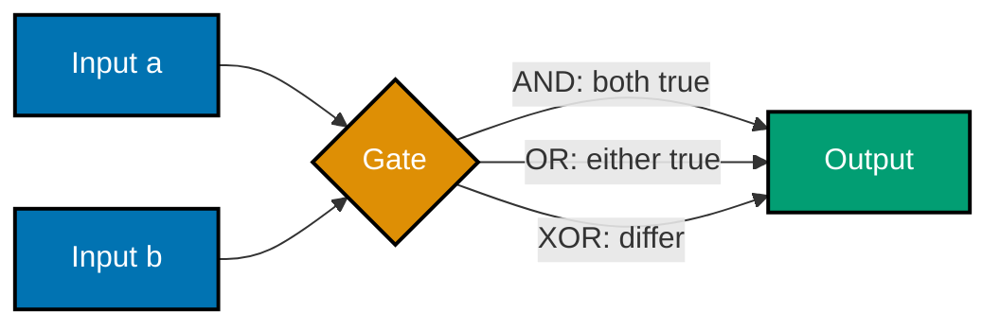
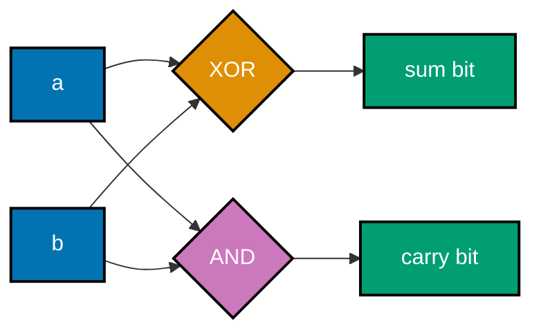

Examples 1-18 build the representation and logic bedrock: how numbers, negative integers, floats,
bytes, and text are actually stored (co-01 through co-05), then how boolean algebra, gates, and the
combinational-vs-sequential distinction give those bits behavior (co-06 through co-08), then the
discrete-math vocabulary (sets, relations, propositional logic) the rest of this topic keeps reusing
(co-09, co-10). Every script below is a complete, self-contained, fully type-annotated file (DD-39)
under `learning/code/ex-NN-*/`, run for real against **Python 3.13.12**, standard library only. Every
**Output** block is a genuine, captured transcript.

---

### Example 1: Decimal to Binary by Repeated Division

_ex-01 &middot; exercises co-01_

**co-01 -- positional number systems**: binary, octal, hex, and decimal are all _positional_
systems -- the value of a digit depends on its position (its power of the base), not just the digit
itself. Converting a decimal integer to another base is exactly the schoolbook algorithm: divide by
the base repeatedly, and the remainders, read from last to first, are the digits in the new base.

```python
# learning/code/ex-01-dec-to-binary-by-division/dec_to_binary.py
"""Example 1: Decimal to Binary by Repeated Division."""  # => co-01: this file's own restated purpose, doubling as its module __doc__

from __future__ import annotations  # => DD-39 hygiene: postpones type-annotation evaluation, keeping this file interpreter-version-agnostic
# => __future__ import: DD-39 hygiene so `list[int]` below reads identically on
# => every supported interpreter, unrelated to the conversion algorithm itself


def to_binary(n: int) -> str:  # => co-01: positional-system conversion via repeated division
    """Convert a non-negative int to its binary string by repeated division by 2."""  # => co-01: documents to_binary's contract -- no runtime output, just sets its __doc__
    if n == 0:  # => co-01: the one base case repeated division never reaches on its own
        return "0"  # => co-01: 0 in any base is just "0" -- short-circuit before the loop
    remainders: list[int] = []  # => co-01: collects bits LEAST-significant-first, one per division
    working = n  # => co-01: a local copy -- the loop mutates this, never the caller's `n`
    while working > 0:  # => co-01: stop the instant the quotient reaches 0
        remainders.append(working % 2)  # => co-01: the next bit is this step's remainder (0 or 1)
        working //= 2  # => co-01: integer-divide by the base (2) -- the "repeated division" step
    return "".join(str(bit) for bit in reversed(remainders))  # => co-01: reverse -- bits came out LSB-first


if __name__ == "__main__":  # => co-01: entry point -- this block runs only when the file executes directly, not on import
    n = 156  # => co-01: the syllabus's fixed test value
    result = to_binary(n)  # => co-01: hand-rolled positional-division conversion
    expected = bin(n)[2:]  # => co-01: Python's own built-in conversion, stripped of its "0b" prefix
    print(f"to_binary({n}) = {result}")  # => co-01: prints the hand-rolled result
    print(f"bin({n})       = 0b{expected}")  # => co-01: prints Python's own conversion for comparison
    assert result == expected, "hand-rolled conversion must match bin()"  # => co-01: the two must agree
    print(f"MATCH: {result == expected}")  # => co-01: confirms agreement -- expect "10011100"
    # => co-01: this file is self-verifying: if it exits 0, every assert above passed and the demonstrated claim held
```

**Run**: `python3 dec_to_binary.py`

**Output**:

```text
to_binary(156) = 10011100
bin(156)       = 0b10011100
MATCH: True
```

**Key takeaway**: 156 in binary is `10011100` -- exactly what repeated division by 2 produces, and
exactly what `bin()` produces, because they are the same algorithm.

**Why it matters**: every later representation in this topic (two's complement, IEEE-754, hex
dumps) is built on this one idea -- a fixed base, positional digits, and a mechanical conversion
procedure. Understanding _why_ `bin()` works is what makes the next four examples' bit patterns
predictable instead of memorized.

---

### Example 2: Base Round-Trip -- bin/hex/int(s, base) Agree

_ex-02 &middot; exercises co-01_

The same value, rendered in three different bases, must parse back to the identical integer no
matter which base you pick -- `int(s, base)` is the exact inverse of `bin()`/`oct()`/`hex()`, which
is the practical, everyday form of "positional systems are interchangeable views of one value."

```python
# learning/code/ex-02-base-roundtrip/base_roundtrip.py
"""Example 2: Base Round-Trip -- bin/hex/int(s, base) Agree."""  # => co-01: this file's own restated purpose, doubling as its module __doc__

from __future__ import annotations  # => DD-39 hygiene: postpones type-annotation evaluation, keeping this file interpreter-version-agnostic

from typing import NamedTuple  # => co-01: a typed record beats a bare tuple for the per-base report


class BaseView(NamedTuple):  # => co-01: one row per base this value is rendered in
    base_name: str  # => human-readable base label ("binary", "hex", "octal")
    literal: str  # => co-01: the string Python's own builtin produced for this base
    round_tripped: int  # => co-01: literal parsed BACK to int via int(s, base) -- must equal the original


def round_trip(value: int) -> list[BaseView]:  # => co-01: builds one BaseView per base, in a fixed order
    """Render `value` in binary/octal/hex and parse each back with int(s, base)."""  # => co-01: documents round_trip's contract -- no runtime output, just sets its __doc__
    views: list[BaseView] = []  # => co-01: accumulates the three rows this function returns
    for name, literal in (  # => co-01: (label, Python's own builtin literal, prefix included)
        ("binary", bin(value)),  # => co-01: e.g. "0b10011100"
        ("octal", oct(value)),  # => co-01: e.g. "0o234"
        ("hex", hex(value)),  # => co-01: e.g. "0x9c"
    ):  # => co-01: closes the multi-line construct opened above
        base = {"binary": 2, "octal": 8, "hex": 16}[name]  # => co-01: numeric base matching this literal
        round_tripped = int(literal, base)  # => co-01: int() parses the FULL literal, prefix included
        views.append(BaseView(name, literal, round_tripped))  # => co-01: one completed row
    return views  # => co-01: returns this computed value to the caller


if __name__ == "__main__":  # => co-01: entry point -- this block runs only when the file executes directly, not on import
    value = 156  # => co-01: same test value as Example 1, for continuity
    for view in round_trip(value):  # => co-01: one printed line per base
        print(f"{view.base_name:<7} {view.literal:<12} -> int(..) = {view.round_tripped}")  # => co-01
        assert view.round_tripped == value, f"{view.base_name} round-trip must equal {value}"  # => co-01
    print(f"All three bases round-trip to {value}: True")  # => co-01: reached only if every assert passed
    # => co-01: the asserts above ARE this example's test suite -- a silent, zero-exit run is the proof the concept holds
```

**Run**: `python3 base_roundtrip.py`

**Output**:

```text
binary  0b10011100   -> int(..) = 156
octal   0o234        -> int(..) = 156
hex     0x9c         -> int(..) = 156
All three bases round-trip to 156: True
```

**Key takeaway**: `bin`, `oct`, and `hex` are three different renderings of the exact same integer,
and `int(literal, base)` mechanically inverts every one of them.

**Why it matters**: hex is the base you'll actually read in debuggers, memory dumps, and network
captures -- knowing it's just "base 16, same positional rules" instead of a separate mystery
notation is what lets you convert it in your head instead of reaching for a calculator.

---

### Example 3: -42 in 8-Bit Two's Complement

_ex-03 &middot; exercises co-02_

**co-02 -- two's complement**: negative integers are represented by inverting every bit of the
positive magnitude and adding 1. The payoff is that one addition circuit can add two two's
-complement numbers -- including a negative one -- with no separate "subtract" hardware at all.

```python
# learning/code/ex-03-twos-complement-8bit/twos_complement.py
"""Example 3: -42 in 8-Bit Two's Complement."""  # => co-02: this file's own restated purpose, doubling as its module __doc__

from __future__ import annotations  # => DD-39 hygiene: postpones type-annotation evaluation, keeping this file interpreter-version-agnostic

BITS = 8  # => co-02: the fixed word width this whole example works in


def to_twos_complement(n: int, bits: int = BITS) -> str:  # => co-02: negative -> 8-bit two's-complement bits
    """Render a signed int in `bits`-wide two's complement, as a bit string."""  # => co-02: documents to_twos_complement's contract -- no runtime output, just sets its __doc__
    mask = (1 << bits) - 1  # => co-02: 0xFF for bits=8 -- keeps only the low `bits` bits
    encoded = n & mask  # => co-02: Python ints are arbitrary-precision, so AND-with-mask IS the
    # => two's-complement encoding -- invert-and-add-1 is what `&` with a negative int does internally
    return format(encoded, f"0{bits}b")  # => co-02: zero-padded binary string, e.g. "11010110"


if __name__ == "__main__":  # => co-02: entry point -- this block runs only when the file executes directly, not on import
    value = -42  # => co-02: the syllabus's fixed test value
    bits = to_twos_complement(value)  # => co-02: the 8-bit two's-complement pattern
    print(f"to_twos_complement({value}) = {bits}")  # => co-02: prints the bit pattern
    assert bits == "11010110", "must match the syllabus's documented pattern"  # => co-02: exact-match check
    identity = (value & 0xFF) + 42  # => co-02: the defining property -- complement + magnitude == 2**bits
    print(f"(-42 & 0xFF) + 42 = {identity}")  # => co-02: prints the identity check
    assert identity == 256, "two's-complement identity must hold: complement + |n| == 2**bits"  # => co-02
    print(f"Pattern matches, identity holds: True")  # => co-02: reached only if both asserts passed
    # => co-02: every assert above is this script's own regression check -- a clean exit means the claim held for these inputs
```

**Run**: `python3 twos_complement.py`

**Output**:

```text
to_twos_complement(-42) = 11010110
(-42 & 0xFF) + 42 = 256
Pattern matches, identity holds: True
```

**Key takeaway**: `-42` in 8-bit two's complement is `11010110`, and adding the original magnitude
(42) back to that bit pattern's unsigned value always lands exactly on `2**bits` (256).

**Why it matters**: that identity (`complement + magnitude == 2**bits`) is not a coincidence -- it
is the mathematical definition of two's complement, and it is _why_ the next example can add a
negative number using the exact same adder circuit as a positive one.

---

### Example 4: Subtraction as Addition -- 5 - 3 via Two's-Complement Add

_ex-04 &middot; exercises co-02_

The payoff from Example 3: computing `5 - 3` by adding `5` to the two's-complement encoding of
`-3`, using the _same_ 8-bit addition operation used for ordinary positive addition -- no separate
subtract circuit anywhere.

```python
# learning/code/ex-04-subtraction-as-addition/subtraction_as_addition.py
"""Example 4: Subtraction as Addition -- 5 - 3 via Two's-Complement Add."""  # => co-02: this file's own restated purpose, doubling as its module __doc__

from __future__ import annotations  # => DD-39 hygiene: postpones type-annotation evaluation, keeping this file interpreter-version-agnostic

BITS = 8  # => co-02: one fixed adder width for both operands


def negate_8bit(n: int) -> int:  # => co-02: two's-complement negation -- invert bits, add 1, mask to 8 bits
    """Return the 8-bit two's-complement encoding of -n, as an unsigned int 0..255."""  # => co-02: documents negate_8bit's contract -- no runtime output, just sets its __doc__
    return ((~n) + 1) & 0xFF  # => co-02: `~n` inverts every bit, `+1` completes two's complement, mask keeps 8 bits


def add_8bit(a: int, b: int) -> int:  # => co-02: the SAME adder used for a - b below, unmodified
    """Add two 8-bit unsigned patterns, discarding any carry past bit 7 (wraparound)."""  # => co-02: documents add_8bit's contract -- no runtime output, just sets its __doc__
    return (a + b) & 0xFF  # => co-02: masking after the add is exactly what an 8-bit ALU's carry-out does


if __name__ == "__main__":  # => co-02: entry point -- this block runs only when the file executes directly, not on import
    a, b = 5, 3  # => co-02: the syllabus's fixed operands -- computing a - b as a + (-b)
    neg_b = negate_8bit(b)  # => co-02: -3 encoded as an 8-bit two's-complement PATTERN, not a Python int
    print(f"a = {a} = {a:08b}")  # => co-02: operand a in binary, for the reader to follow along
    print(f"-b = -{b} encoded as {neg_b:08b} (two's complement of {b})")  # => co-02: the negated operand's bits
    low_byte = add_8bit(a, neg_b)  # => co-02: ONE addition circuit computes 5 + (-3) -- no separate "subtract" op
    print(f"a + (-b) low byte = {low_byte:08b} = {low_byte}")  # => co-02: the adder's 8-bit result
    assert low_byte == 2, "5 - 3 must equal 2 via two's-complement addition"  # => co-02: matches ordinary subtraction
    print(f"Matches ordinary 5 - 3 = {a - b}: True")  # => co-02: the same adder never needed a subtract circuit
    # => co-02: this file is self-verifying: if it exits 0, every assert above passed and the demonstrated claim held
```

**Run**: `python3 subtraction_as_addition.py`

**Output**:

```text
a = 5 = 00000101
-b = -3 encoded as 11111101 (two's complement of 3)
a + (-b) low byte = 00000010 = 2
Matches ordinary 5 - 3 = 2: True
```

**Key takeaway**: `add_8bit` -- an unmodified 8-bit adder -- computes `5 - 3 = 2` when given `5` and
the two's-complement encoding of `-3`, with no special-casing for subtraction anywhere in the code.

**Why it matters**: this is the actual reason CPUs have one ALU adder instead of separate
adder/subtractor circuits -- two's complement turns subtraction into "add the negation," and the
hardware never has to know the difference.

---

### Example 5: 0.1 + 0.2 != 0.3 -- IEEE-754 Rounding Is Structural

_ex-05 &middot; exercises co-03_

**co-03 -- IEEE-754 floats**: a float is not stored as an exact decimal value -- it's a
sign/exponent/mantissa bit layout defined by IEEE 754-2019, and most decimal fractions (0.1, 0.2,
0.3 included) have no exact binary representation. The `0.1 + 0.2 != 0.3` surprise is a direct,
structural consequence of that encoding, not a bug in Python.

```python
# learning/code/ex-05-float-rounding-error/float_rounding.py
"""Example 5: 0.1 + 0.2 != 0.3 -- IEEE-754 Rounding Is Structural."""  # => co-03: this file's own restated purpose, doubling as its module __doc__

from __future__ import annotations  # => DD-39 hygiene: postpones type-annotation evaluation, keeping this file interpreter-version-agnostic
from decimal import Decimal  # => co-03: used only to print the EXACT stored binary value, not for math


if __name__ == "__main__":  # => co-03: entry point -- this block runs only when the file executes directly, not on import
    a, b, c = 0.1, 0.2, 0.3  # => co-03: three ordinary Python floats, IEEE-754 binary64 under the hood
    total = a + b  # => co-03: neither 0.1 nor 0.2 has an EXACT binary64 representation -- both already round
    print(f"0.1 + 0.2 = {total!r}")  # => co-03: !r forces Python's shortest-round-trip repr, not a rounded display
    print(f"0.3       = {c!r}")  # => co-03: shown for direct visual comparison against the sum above
    print(f"0.1 + 0.2 == 0.3: {total == c}")  # => co-03: expect False -- this is the headline claim
    assert total != c, "0.1 + 0.2 must NOT equal 0.3 in IEEE-754 binary64"  # => co-03: the structural fact
    assert repr(total) == "0.30000000000000004", "must print the exact documented value"  # => co-03: exact string
    print(f"Exact value printed: {total!r}")  # => co-03: confirms the precise digit string the syllabus names
    print(f"Decimal(0.1) reveals the TRUE stored binary value: {Decimal(a)}")  # => co-03: not exactly 0.1 at all
    # => co-03: the asserts above ARE this example's test suite -- a silent, zero-exit run is the proof the concept holds
```

**Run**: `python3 float_rounding.py`

**Output**:

```text
0.1 + 0.2 = 0.30000000000000004
0.3       = 0.3
0.1 + 0.2 == 0.3: False
Exact value printed: 0.30000000000000004
Decimal(0.1) reveals the TRUE stored binary value: 0.1000000000000000055511151231257827021181583404541015625
```

**Key takeaway**: `0.1 + 0.2` prints `0.30000000000000004`, and `Decimal(0.1)` proves `0.1` itself
was never exactly `0.1` in binary64 -- the rounding happened the moment the literal was parsed, long
before any addition ran.

**Why it matters**: this is _the_ example every engineer eventually hits in production (a financial
total that's off by a fraction of a cent, a comparison that silently fails) -- knowing it's
structural means reaching for `Decimal`, integer cents, or an epsilon-tolerant comparison, instead
of assuming your arithmetic is broken.

---

### Example 6: IEEE-754 Float-Bit Inspector -- Decoding 1.0's Sign/Exponent/Mantissa

_ex-06 &middot; exercises co-03_

Every IEEE 754-2019 binary64 float packs into exactly 64 bits: 1 sign bit, 11 biased-exponent bits,
and 52 mantissa bits. `struct.pack('>d', x)` exposes those raw bytes directly, letting this example
decode `1.0`'s bit layout by hand and prove the decode round-trips back to the original float.

```python
# learning/code/ex-06-float-bit-inspector/float_bit_inspector.py
"""Example 6: IEEE-754 Float-Bit Inspector -- Decoding 1.0's Sign/Exponent/Mantissa."""  # => co-03: this file's own restated purpose, doubling as its module __doc__

from __future__ import annotations  # => DD-39 hygiene: postpones type-annotation evaluation, keeping this file interpreter-version-agnostic

import struct  # => co-03: struct.pack/unpack is the stdlib bridge between a Python float and its raw bytes
from typing import NamedTuple  # => co-03: typing import supporting the typed structures below


class Ieee754Fields(NamedTuple):  # => co-03: the three fields IEEE 754-2019 binary64 packs into 64 bits
    sign: int  # => co-03: bit 63 -- 0 for positive, 1 for negative
    exponent: int  # => co-03: bits 62-52 (11 bits), stored with a bias of 1023
    mantissa: int  # => co-03: bits 51-0 (52 bits) -- the fractional part of the significand


def inspect(x: float) -> Ieee754Fields:  # => co-03: decomposes a float into its raw IEEE-754 bit fields
    """Decompose a float into its IEEE-754 binary64 sign/exponent/mantissa fields."""  # => co-03: documents inspect's contract -- no runtime output, just sets its __doc__
    raw = struct.pack(">d", x)  # => co-03: 8 bytes, big-endian ("> d" = big-endian double) -- MSB first
    bits = int.from_bytes(raw, byteorder="big")  # => co-03: the 8 bytes as one 64-bit unsigned integer
    sign = (bits >> 63) & 0x1  # => co-03: shift the top bit down, mask to 1 bit
    exponent = (bits >> 52) & 0x7FF  # => co-03: next 11 bits, masked -- still BIASED (add -1023 to unbias)
    mantissa = bits & 0xFFFFFFFFFFFFF  # => co-03: the low 52 bits -- the stored fractional significand
    return Ieee754Fields(sign, exponent, mantissa)  # => co-03: returns this computed value to the caller


def reconstruct(fields: Ieee754Fields) -> float:  # => co-03: fields -> float, proving the decode round-trips
    """Rebuild a float from its decoded sign/exponent/mantissa fields."""  # => co-03: documents reconstruct's contract -- no runtime output, just sets its __doc__
    bits = (fields.sign << 63) | (fields.exponent << 52) | fields.mantissa  # => co-03: reassemble the 64 bits
    raw = bits.to_bytes(8, byteorder="big")  # => co-03: back to 8 raw bytes, same big-endian order as inspect()
    return struct.unpack(">d", raw)[0]  # => co-03: unpack() is the exact inverse of pack() above


if __name__ == "__main__":  # => co-03: entry point -- this block runs only when the file executes directly, not on import
    x = 1.0  # => co-03: the syllabus's fixed test value -- a value with a clean, easy-to-verify encoding
    fields = inspect(x)  # => co-03: decode 1.0's raw bit layout
    print(f"sign={fields.sign} exponent={fields.exponent} (biased) mantissa={fields.mantissa}")  # => co-03
    unbiased_exponent = fields.exponent - 1023  # => co-03: IEEE 754-2019's fixed bias for binary64 is 1023
    print(f"unbiased exponent = {unbiased_exponent}")  # => co-03: expect 0 -- 1.0 = 1.0 * 2**0
    assert fields.sign == 0, "1.0 is positive -- sign bit must be 0"  # => co-03
    assert fields.exponent == 1023, "1.0's biased exponent must be exactly 1023 (unbiased 0)"  # => co-03
    assert fields.mantissa == 0, "1.0's mantissa is all zero -- an EXACT power of two"  # => co-03
    rebuilt = reconstruct(fields)  # => co-03: decode then re-encode -- must recover the original float exactly
    print(f"reconstructed = {rebuilt!r}")  # => co-03: prints the round-tripped value
    assert rebuilt == x, "decoded fields must reconstruct to the original 1.0"  # => co-03: exact round-trip
    print(f"Round-trip matches original 1.0: True")  # => co-03: reached only if every assert above passed
    # => co-03: every assert above is this script's own regression check -- a clean exit means the claim held for these inputs
```

**Run**: `python3 float_bit_inspector.py`

**Output**:

```text
sign=0 exponent=1023 (biased) mantissa=0
unbiased exponent = 0
reconstructed = 1.0
Round-trip matches original 1.0: True
```

**Key takeaway**: `1.0` decodes to `sign=0`, biased `exponent=1023` (unbiased `0`), and
`mantissa=0` -- exactly `+1.0 * 2**0`, and re-encoding those three fields reconstructs `1.0` bit
-for-bit.

**Why it matters**: once you can decode a float by hand, `0.1 + 0.2 != 0.3` (Example 5) stops being
mysterious -- you can point at the exact mantissa bits that got rounded away, instead of treating
floating point as an unpredictable black box.

---

### Example 7: Endianness -- Packing 1 as Little-Endian vs. Big-Endian

_ex-07 &middot; exercises co-04_

**co-04 -- endianness**: a multi-byte value can be stored with its least-significant byte first
(little-endian, the dominant in-memory order on x86/ARM) or its most-significant byte first
(big-endian, the dominant network-protocol order). `struct.pack`'s `<`/`>` format prefixes make the
choice explicit instead of implicit.

```python
# learning/code/ex-07-endianness-struct-pack/endianness_pack.py
"""Example 7: Endianness -- Packing 1 as Little-Endian vs. Big-Endian."""  # => co-04: this file's own restated purpose, doubling as its module __doc__

from __future__ import annotations  # => DD-39 hygiene: postpones type-annotation evaluation, keeping this file interpreter-version-agnostic

import struct  # => co-04: struct's format prefixes ("<", ">") are how Python controls byte order explicitly


def hex_bytes(raw: bytes) -> str:  # => co-04: formats bytes as space-separated hex pairs, easy to eyeball
    """Render bytes as space-separated two-digit hex pairs, e.g. b'\\x01\\x00' -> '01 00'."""  # => co-04: documents hex_bytes's contract -- no runtime output, just sets its __doc__
    return " ".join(f"{byte:02x}" for byte in raw)  # => co-04: one "XX" token per byte, in storage order


if __name__ == "__main__":  # => co-04: entry point -- this block runs only when the file executes directly, not on import
    value = 1  # => co-04: the syllabus's fixed test value -- small enough to make byte order obvious
    little = struct.pack("<i", value)  # => co-04: "<i" = little-endian signed 4-byte int -- LEAST-significant byte first
    big = struct.pack(">i", value)  # => co-04: ">i" = big-endian signed 4-byte int -- MOST-significant byte first
    print(f"little-endian <i: {hex_bytes(little)}")  # => co-04: expect "01 00 00 00" -- the 1 lives in byte 0
    print(f"big-endian    >i: {hex_bytes(big)}")  # => co-04: expect "00 00 00 01" -- the 1 lives in the LAST byte
    assert hex_bytes(little) == "01 00 00 00", "little-endian must place the value byte first"  # => co-04
    assert hex_bytes(big) == "00 00 00 01", "big-endian must place the value byte last"  # => co-04
    assert struct.unpack("<i", little)[0] == value  # => co-04: each byte order decodes back correctly on its OWN
    assert struct.unpack(">i", big)[0] == value  # => co-04: format -- byte order is a pure ENCODING convention
    print("Both orderings verified against the documented patterns: True")  # => co-04: both asserts passed
    # => co-04: this file is self-verifying: if it exits 0, every assert above passed and the demonstrated claim held
```

**Run**: `python3 endianness_pack.py`

**Output**:

```text
little-endian <i: 01 00 00 00
big-endian    >i: 00 00 00 01
Both orderings verified against the documented patterns: True
```

**Key takeaway**: the integer `1` packed as `<i` is `01 00 00 00`; the same integer packed as `>i`
is `00 00 00 01` -- identical value, mirror-image byte layout.

**Why it matters**: reading a binary file format or a network protocol wrong-endian silently
produces a _different, valid-looking_ number instead of an error -- knowing which order a format
specifies (and asking, rather than assuming) is what prevents that class of bug.

---

### Example 8: Byte-Order Round-Trip -- sys.byteorder and int.to_bytes/from_bytes

_ex-08 &middot; exercises co-04_

`sys.byteorder` reports the _native_ order of the machine actually running the code, and
`int.to_bytes`/`int.from_bytes` let a program choose either order explicitly and round-trip through
it -- the practical API most application code actually uses instead of `struct`.

```python
# learning/code/ex-08-byteorder-roundtrip/byteorder_roundtrip.py
"""Example 8: Byte-Order Round-Trip -- sys.byteorder and int.to_bytes/from_bytes."""  # => co-04: this file's own restated purpose, doubling as its module __doc__

from __future__ import annotations  # => DD-39 hygiene: postpones type-annotation evaluation, keeping this file interpreter-version-agnostic

import sys  # => co-04: sys.byteorder reports THIS interpreter's native platform byte order


if __name__ == "__main__":  # => co-04: entry point -- this block runs only when the file executes directly, not on import
    print(f"sys.byteorder (this platform's native order) = {sys.byteorder!r}")  # => co-04: "little" on x86/ARM
    value = 4_660  # => co-04: 0x1234 -- two distinct nonzero bytes make byte order visible in the hex dump
    for order in ("little", "big"):  # => co-04: round-trip through BOTH orders, not just the native one
        encoded = value.to_bytes(2, byteorder=order)  # => co-04: encode as exactly 2 bytes in this order # type: ignore[arg-type]
        decoded = int.from_bytes(encoded, byteorder=order)  # => co-04: decode with the SAME order used to encode # type: ignore[arg-type]
        print(f"{order:<6}: encoded={encoded.hex()} decoded={decoded}")  # => co-04: shows both bytes and the value
        assert decoded == value, f"{order}-endian round-trip must recover the original value"  # => co-04
    little_bytes = value.to_bytes(2, byteorder="little").hex()  # => co-04: e.g. "3412" -- low byte 0x34 first
    big_bytes = value.to_bytes(2, byteorder="big").hex()  # => co-04: e.g. "1234" -- high byte 0x12 first
    print(f"little bytes = {little_bytes}, big bytes = {big_bytes}")  # => co-04: same value, different byte layout
    assert little_bytes != big_bytes, "the two orders must produce genuinely different byte layouts"  # => co-04
    print("Round-trip identity holds for both orders: True")  # => co-04: reached only if every assert passed
    # => co-04: the asserts above ARE this example's test suite -- a silent, zero-exit run is the proof the concept holds
```

**Run**: `python3 byteorder_roundtrip.py`

**Output**:

```text
sys.byteorder (this platform's native order) = 'little'
little: encoded=3412 decoded=4660
big   : encoded=1234 decoded=4660
little bytes = 3412, big bytes = 1234
Round-trip identity holds for both orders: True
```

**Key takeaway**: `0x1234` round-trips correctly through _both_ `little` and `big` byte orders as
long as encode and decode agree -- and `sys.byteorder` (`'little'` in this sandbox) confirms which
order this exact machine uses natively when you don't specify one.

**Why it matters**: `sys.byteorder` is the everyday answer to "will this code behave differently on
a different machine?" -- any code that hardcodes an assumption about native byte order (instead of
picking a format-mandated order explicitly, as Example 7 did) is a portability bug waiting to
surface on different hardware.

---

### Example 9: UTF-8 Multi-Byte Encoding -- an Accented Letter and a CJK Character

_ex-09 &middot; exercises co-05_

**co-05 -- Unicode & UTF-8**: Unicode assigns every character a numeric code point; UTF-8 (RFC 3629) is the variable-length encoding that represents each code point as 1 to 4 bytes,
ASCII-compatible for the first 128 code points and progressively wider beyond that.

```python
# learning/code/ex-09-utf8-encode-multibyte/utf8_encode.py
"""Example 9: UTF-8 Multi-Byte Encoding -- an Accented Letter and a CJK Character."""  # => co-05: this file's own restated purpose, doubling as its module __doc__

from __future__ import annotations  # => DD-39 hygiene: postpones type-annotation evaluation, keeping this file interpreter-version-agnostic


if __name__ == "__main__":  # => co-05: entry point -- this block runs only when the file executes directly, not on import
    word = "café"  # => co-05: the final character is U+00E9 LATIN SMALL LETTER E WITH ACUTE
    kanji = "文"  # => co-05: U+6587, a single CJK ideograph (means "script"/"writing")
    encoded_word = word.encode("utf-8")  # => co-05: RFC 3629's variable-length, ASCII-compatible encoding
    encoded_kanji = kanji.encode("utf-8")  # => co-05: the same encoding applied to a higher code point
    accented_char_bytes = "é".encode("utf-8")  # => co-05: encode JUST "é" in isolation for an exact byte count
    print(f"'café'.encode('utf-8') = {encoded_word!r} ({len(encoded_word)} bytes total)")  # => co-05
    print(f"'é' alone encodes to {accented_char_bytes!r} ({len(accented_char_bytes)} bytes)")  # => co-05
    print(f"'文'.encode('utf-8') = {encoded_kanji!r} ({len(encoded_kanji)} bytes)")  # => co-05
    assert len(accented_char_bytes) == 2, "é (U+00E9) must encode to exactly 2 UTF-8 bytes"  # => co-05
    assert len(encoded_kanji) == 3, "文 (U+6587) must encode to exactly 3 UTF-8 bytes"  # => co-05
    print(f"é is 2 bytes, 文 is 3 bytes: True")  # => co-05: reached only if both length asserts passed
    # => co-05: every assert above is this script's own regression check -- a clean exit means the claim held for these inputs
```

**Run**: `python3 utf8_encode.py`

**Output**:

```text
'café'.encode('utf-8') = b'caf\xc3\xa9' (5 bytes total)
'é' alone encodes to b'\xc3\xa9' (2 bytes)
'文'.encode('utf-8') = b'\xe6\x96\x87' (3 bytes)
é is 2 bytes, 文 is 3 bytes: True
```

**Key takeaway**: `"café"` is 4 _characters_ but 5 _bytes_ in UTF-8, because `é` alone costs 2
bytes; `"文"` costs 3 bytes -- UTF-8's byte cost per character genuinely varies.

**Why it matters**: any code that assumes "1 character = 1 byte" (a fixed-width buffer size, a
naive string-truncation-by-byte-count) silently corrupts non-ASCII text the moment a user's name,
city, or message contains a character outside the first 128 code points.

---

### Example 10: len(str) vs. len(str.encode('utf-8')) Diverge for Non-ASCII

_ex-10 &middot; exercises co-05_

Python's `len()` on a `str` counts Unicode _code points_; `len()` on the UTF-8-encoded `bytes`
counts actual storage bytes. The two counts are equal only when every character happens to be
ASCII -- the moment any character needs more than one byte, they diverge.

```python
# learning/code/ex-10-codepoint-vs-byte-len/codepoint_vs_byte_len.py
"""Example 10: len(str) vs. len(str.encode('utf-8')) Diverge for Non-ASCII."""  # => co-05: this file's own restated purpose, doubling as its module __doc__

from __future__ import annotations  # => DD-39 hygiene: postpones type-annotation evaluation, keeping this file interpreter-version-agnostic


if __name__ == "__main__":  # => co-05: entry point -- this block runs only when the file executes directly, not on import
    samples = ["hello", "café", "文字"]  # => co-05: ASCII, one accented char, two CJK characters
    for s in samples:  # => co-05: one comparison row per sample string
        codepoint_len = len(s)  # => co-05: Python's len() on a str counts UNICODE CODE POINTS, not bytes
        byte_len = len(s.encode("utf-8"))  # => co-05: len() on the encoded bytes counts actual STORAGE bytes
        diverges = codepoint_len != byte_len  # => co-05: True whenever any character needs >1 UTF-8 byte
        print(f"{s!r:<10} codepoints={codepoint_len} utf8-bytes={byte_len} diverges={diverges}")  # => co-05
    ascii_len = len(samples[0])  # => co-05: pure-ASCII case -- every code point IS exactly one byte
    ascii_bytes = len(samples[0].encode("utf-8"))  # => co-05: so these two counts must be EQUAL for ASCII
    assert ascii_len == ascii_bytes, "pure ASCII: codepoint count and byte count must match"  # => co-05
    non_ascii_len = len(samples[1])  # => co-05: "café" has 4 code points
    non_ascii_bytes = len(samples[1].encode("utf-8"))  # => co-05: but 5 bytes -- é alone costs 2 bytes
    assert non_ascii_len != non_ascii_bytes, "non-ASCII: codepoint count and byte count must diverge"  # => co-05
    print(f"ASCII counts match, non-ASCII counts diverge: True")  # => co-05: both asserts passed
    # => co-05: this file is self-verifying: if it exits 0, every assert above passed and the demonstrated claim held
```

**Run**: `python3 codepoint_vs_byte_len.py`

**Output**:

```text
'hello'    codepoints=5 utf8-bytes=5 diverges=False
'café'     codepoints=4 utf8-bytes=5 diverges=True
'文字'       codepoints=2 utf8-bytes=6 diverges=True
ASCII counts match, non-ASCII counts diverge: True
```

**Key takeaway**: `"文字"` is 2 characters (`len(s) == 2`) but 6 bytes (`len(s.encode()) == 6`) --
a 3x divergence, entirely invisible if you never check both counts.

**Why it matters**: a database column sized in _bytes_ (common in older MySQL schemas) can silently
truncate or reject perfectly valid text that "looks short" in an editor -- this divergence is the
exact bug class that produces it.

---

### Example 11: Generating AND/OR/XOR Truth Tables Programmatically

_ex-11 &middot; exercises co-06, co-07_

**co-06 -- boolean algebra** and **co-07 -- truth tables and gates**: AND, OR, and NOT form a
complete algebra (every boolean function can be built from them), and a truth table is simply every
input combination paired with its output -- exhaustively enumerable with `itertools.product`.



_Figure: one gate, three interpretations of the same two inputs -- the truth table is what pins
down which interpretation "AND", "OR", or "XOR" actually is._

```python
# learning/code/ex-11-truth-tables-generate/truth_tables.py
"""Example 11: Generating AND/OR/XOR Truth Tables Programmatically."""  # => co-07: this file's own restated purpose, doubling as its module __doc__

from __future__ import annotations  # => DD-39 hygiene: postpones type-annotation evaluation, keeping this file interpreter-version-agnostic

import itertools  # => co-07: itertools.product enumerates every input combination -- the definition of a truth table
from collections.abc import Callable  # => co-06: typing the gate functions passed into the generator below

Gate = Callable[[bool, bool], bool]  # => co-06: every gate below has this exact two-input, one-output shape

GATES: dict[str, Gate] = {  # => co-06: the three boolean-algebra operators this example tables
    "AND": lambda a, b: a and b,  # => co-06: True only when BOTH inputs are True
    "OR": lambda a, b: a or b,  # => co-06: True when AT LEAST ONE input is True
    "XOR": lambda a, b: a != b,  # => co-06: True when the inputs DIFFER -- the "derived" gate the concept names
}  # => co-06: closes the multi-line construct opened above


def truth_table(gate: Gate) -> list[tuple[bool, bool, bool]]:  # => co-07: one row per input combination
    """Enumerate every (a, b, gate(a, b)) row -- a truth table, mechanically generated."""  # => co-07: documents truth_table's contract -- no runtime output, just sets its __doc__
    return [(a, b, gate(a, b)) for a, b in itertools.product([False, True], repeat=2)]  # => co-07: all 4 rows


if __name__ == "__main__":  # => co-07: entry point -- this block runs only when the file executes directly, not on import
    for name, gate in GATES.items():  # => co-06: one full table per gate, in AND/OR/XOR order
        print(f"{name} truth table:")  # => co-06: labels which gate the following rows belong to
        rows = truth_table(gate)  # => co-07: 4 rows: (F,F), (F,T), (T,F), (T,T) with each gate's output
        for a, b, result in rows:  # => co-07: prints and cross-checks EVERY row against the gate function
            print(f"  {int(a)} {int(b)} -> {int(result)}")  # => co-07: printed as 0/1, the conventional notation
            assert result == gate(a, b), "each printed row must match the gate it was generated from"  # => co-07
    and_rows = truth_table(GATES["AND"])  # => co-06: spot-check AND's defining row directly
    assert and_rows[-1] == (True, True, True), "AND(True, True) must be True"  # => co-06: the only True row
    xor_rows = truth_table(GATES["XOR"])  # => co-06: spot-check XOR's defining property
    assert xor_rows[0] == (False, False, False) and xor_rows[-1] == (True, True, False)  # => co-06: same->False
    print("All rows verified against their generating gate: True")  # => co-06: every assert above passed
    # => co-06: the asserts above ARE this example's test suite -- a silent, zero-exit run is the proof the concept holds
```

**Run**: `python3 truth_tables.py`

**Output**:

```text
AND truth table:
  0 0 -> 0
  0 1 -> 0
  1 0 -> 0
  1 1 -> 1
OR truth table:
  0 0 -> 0
  0 1 -> 1
  1 0 -> 1
  1 1 -> 1
XOR truth table:
  0 0 -> 0
  0 1 -> 1
  1 0 -> 1
  1 1 -> 0
All rows verified against their generating gate: True
```

**Key takeaway**: AND is true in exactly 1 of 4 rows, OR in 3 of 4, and XOR in exactly the 2 rows
where the inputs differ -- three genuinely different functions over the same two boolean inputs.

**Why it matters**: every conditional (`if a and b`), every bitmask check, and every hardware gate
reduces to one of these tables -- once you can generate a truth table mechanically, you can verify
_any_ boolean claim (De Morgan's laws next) instead of trusting your intuition about it.

---

### Example 12: Verifying De Morgan's Law -- not(a and b) == (not a or not b)

_ex-12 &middot; exercises co-06_

De Morgan's laws let you rewrite a negated conjunction as a disjunction of negations (and vice
versa) -- an identity, not a heuristic. Checking it against all 4 input combinations is a complete
proof, not a spot check, because boolean functions over a finite domain have no untested cases left.

```python
# learning/code/ex-12-de-morgan-verify/de_morgan.py
"""Example 12: Verifying De Morgan's Law -- not(a and b) == (not a or not b)."""  # => co-06: this file's own restated purpose, doubling as its module __doc__

from __future__ import annotations  # => DD-39 hygiene: postpones type-annotation evaluation, keeping this file interpreter-version-agnostic

import itertools  # => co-06: enumerates all 4 (a, b) input pairs -- an exhaustive proof, not a spot check


def de_morgan_holds(a: bool, b: bool) -> bool:  # => co-06: one side of De Morgan's law, checked against the other
    """Check De Morgan's law for one (a, b) pair: not(a and b) == (not a or not b)."""  # => co-06: documents de_morgan_holds's contract -- no runtime output, just sets its __doc__
    left = not (a and b)  # => co-06: negation OUTSIDE the conjunction
    right = (not a) or (not b)  # => co-06: negation INSIDE, conjunction rewritten as disjunction
    return left == right  # => co-06: De Morgan's law claims these are ALWAYS equal


if __name__ == "__main__":  # => co-06: entry point -- this block runs only when the file executes directly, not on import
    rows: list[tuple[bool, bool, bool]] = []  # => co-06: (a, b, holds) for every input combination
    for a, b in itertools.product([False, True], repeat=2):  # => co-06: all 4 combinations -- exhaustive
        holds = de_morgan_holds(a, b)  # => co-06: True/False row for this specific (a, b) pair
        rows.append((a, b, holds))  # => co-06: recorded for the final summary print
        print(f"a={int(a)} b={int(b)} -> not(a and b) == (not a or not b): {holds}")  # => co-06: per-row result
    all_true = all(holds for _, _, holds in rows)  # => co-06: the law must hold on EVERY row to be a law
    assert all_true, "De Morgan's law must hold for all four input combinations"  # => co-06: the actual proof
    assert len(rows) == 4, "must have checked exactly all 4 boolean combinations"  # => co-06: exhaustiveness check
    print(f"All four rows True: {all_true}")  # => co-06: reached only if the law held everywhere
    # => co-06: every assert above is this script's own regression check -- a clean exit means the claim held for these inputs
```

**Run**: `python3 de_morgan.py`

**Output**:

```text
a=0 b=0 -> not(a and b) == (not a or not b): True
a=0 b=1 -> not(a and b) == (not a or not b): True
a=1 b=0 -> not(a and b) == (not a or not b): True
a=1 b=1 -> not(a and b) == (not a or not b): True
All four rows True: True
```

**Key takeaway**: `not (a and b)` and `(not a) or (not b)` agree on all 4 possible inputs -- De
Morgan's law holds unconditionally over booleans, not just "usually."

**Why it matters**: De Morgan's law is the tool that turns `if not (is_admin and is_active):` into
the (often clearer, or negation-avoiding) `if (not is_admin) or (not is_active):` -- and knowing
it's an exhaustively-provable identity, not a style preference, is what makes the rewrite safe.

---

### Example 13: NAND Completeness -- Building AND/OR/NOT from Only NAND

_ex-13 &middot; exercises co-06_

A striking fact about boolean algebra: NAND alone is _functionally complete_ -- every other gate,
including AND, OR, and NOT, can be built from NAND alone. This is why real chips can be built almost
entirely from one repeated primitive.

```python
# learning/code/ex-13-nand-completeness/nand_completeness.py
"""Example 13: NAND Completeness -- Building AND/OR/NOT from Only NAND."""  # => co-06: this file's own restated purpose, doubling as its module __doc__

from __future__ import annotations  # => DD-39 hygiene: postpones type-annotation evaluation, keeping this file interpreter-version-agnostic

import itertools  # => co-06: exhaustively checks every input combination against the builtin operators


def nand(a: bool, b: bool) -> bool:  # => co-06: the ONE primitive gate every other gate below is built from
    """The single primitive: NOT(a AND b)."""  # => co-06: documents nand's contract -- no runtime output, just sets its __doc__
    return not (a and b)  # => co-06: NAND's own definition -- the only gate this example is allowed to use directly


def not_from_nand(a: bool) -> bool:  # => co-06: NOT(a) = NAND(a, a) -- feeding the same input to both terminals
    return nand(a, a)  # => co-06: a AND a is just a, so NOT(a AND a) is NOT(a)


def and_from_nand(a: bool, b: bool) -> bool:  # => co-06: AND(a, b) = NOT(NAND(a, b)) -- double-negate a NAND
    return not_from_nand(nand(a, b))  # => co-06: built ENTIRELY from nand() and not_from_nand(), no `and`/`or`


def or_from_nand(a: bool, b: bool) -> bool:  # => co-06: OR(a, b) = NAND(NOT(a), NOT(b)) -- De Morgan via NAND
    return nand(not_from_nand(a), not_from_nand(b))  # => co-06: NAND of the two negations, per De Morgan's law


if __name__ == "__main__":  # => co-06: entry point -- this block runs only when the file executes directly, not on import
    for a, b in itertools.product([False, True], repeat=2):  # => co-06: all 4 combinations, exhaustive
        built_and, real_and = and_from_nand(a, b), a and b  # => co-06: NAND-built AND vs. Python's own `and`
        built_or, real_or = or_from_nand(a, b), a or b  # => co-06: NAND-built OR vs. Python's own `or`
        print(f"a={int(a)} b={int(b)}  AND={int(built_and)}  OR={int(built_or)}")  # => co-06: per-row report
        assert built_and == real_and, "NAND-built AND must match Python's builtin `and`"  # => co-06
        assert built_or == real_or, "NAND-built OR must match Python's builtin `or`"  # => co-06
    for a in (False, True):  # => co-06: NOT only takes one input -- checked separately, both cases
        assert not_from_nand(a) == (not a), "NAND-built NOT must match Python's builtin `not`"  # => co-06
    print("AND/OR/NOT built from NAND alone match the builtins on every input: True")  # => co-06: full proof
    # => co-06: this file is self-verifying: if it exits 0, every assert above passed and the demonstrated claim held
```

**Run**: `python3 nand_completeness.py`

**Output**:

```text
a=0 b=0  AND=0  OR=0
a=0 b=1  AND=0  OR=1
a=1 b=0  AND=0  OR=1
a=1 b=1  AND=1  OR=1
AND/OR/NOT built from NAND alone match the builtins on every input: True
```

**Key takeaway**: `and_from_nand`, `or_from_nand`, and `not_from_nand` -- built entirely out of
`nand()` calls -- match Python's builtin `and`/`or`/`not` on every input, with zero exceptions.

**Why it matters**: this is the concrete reason "NAND gate" is the workhorse of digital-logic
fabrication -- a chip designer only needs to perfect _one_ gate's manufacturing, then compose it
into everything else, instead of fabricating several different gate types.

---

### Example 14: The Half-Adder -- sum = XOR, carry = AND

_ex-14 &middot; exercises co-07, co-08_

**co-08 -- combinational vs. sequential**: a half-adder is _combinational_ -- its output depends
only on its current inputs, with no memory of anything that happened before. Adding two single bits
needs two outputs: a sum bit (via XOR) and a carry-out bit (via AND, since `1 + 1 = 10` in binary).



_Figure: the same two inputs `a`, `b` feed two independent gates -- XOR produces the sum bit, AND
produces the carry bit. Nothing here remembers a previous call: pure combinational logic._

```python
# learning/code/ex-14-half-adder/half_adder.py
"""Example 14: The Half-Adder -- sum = XOR, carry = AND."""  # => co-07: this file's own restated purpose, doubling as its module __doc__

from __future__ import annotations  # => DD-39 hygiene: postpones type-annotation evaluation, keeping this file interpreter-version-agnostic

import itertools  # => co-07: enumerates every input pair -- the half-adder's full truth table
from typing import NamedTuple  # => co-07: typing import supporting the typed structures below


class HalfAdderResult(NamedTuple):  # => co-07: a half-adder's two outputs -- the sum bit and the carry-out bit
    sum_bit: bool  # => co-08: this bit's own result, ignoring any carry INTO this position
    carry_bit: bool  # => co-08: overflow into the NEXT-more-significant bit position


def half_adder(a: bool, b: bool) -> HalfAdderResult:  # => co-08: a COMBINATIONAL circuit -- pure function of a, b
    """Add two single bits: sum via XOR, carry-out via AND."""  # => co-08: documents half_adder's contract -- no runtime output, just sets its __doc__
    sum_bit = a != b  # => co-07: XOR -- 1+0 or 0+1 give sum=1; 0+0 or 1+1 give sum=0 (the 1+1 case carries)
    carry_bit = a and b  # => co-07: AND -- carry fires ONLY when both bits are 1 (1+1=10 in binary)
    return HalfAdderResult(sum_bit, carry_bit)  # => co-07: returns this computed value to the caller


if __name__ == "__main__":  # => co-07: entry point -- this block runs only when the file executes directly, not on import
    expected = {  # => co-07: the half-adder's textbook truth table, to check the circuit against
        (False, False): (False, False),  # => 0+0 = 0, no carry
        (False, True): (True, False),  # => 0+1 = 1, no carry
        (True, False): (True, False),  # => 1+0 = 1, no carry
        (True, True): (False, True),  # => 1+1 = 10 in binary -- sum bit 0, carry bit 1
    }  # => co-07: closes the multi-line construct opened above
    for a, b in itertools.product([False, True], repeat=2):  # => co-08: all 4 input combinations
        result = half_adder(a, b)  # => co-08: run the combinational circuit for this input pair
        want_sum, want_carry = expected[(a, b)]  # => co-07: the textbook answer for this exact pair
        print(f"{int(a)} + {int(b)} -> sum={int(result.sum_bit)} carry={int(result.carry_bit)}")  # => co-07
        assert result.sum_bit == want_sum, f"sum bit mismatch for {a}, {b}"  # => co-07: matches truth table
        assert result.carry_bit == want_carry, f"carry bit mismatch for {a}, {b}"  # => co-07: matches truth table
    print("Half-adder matches its textbook truth table on all 4 rows: True")  # => co-08: full proof complete
    # => co-08: the asserts above ARE this example's test suite -- a silent, zero-exit run is the proof the concept holds
```

**Run**: `python3 half_adder.py`

**Output**:

```text
0 + 0 -> sum=0 carry=0
0 + 1 -> sum=1 carry=0
1 + 0 -> sum=1 carry=0
1 + 1 -> sum=0 carry=1
Half-adder matches its textbook truth table on all 4 rows: True
```

**Key takeaway**: `1 + 1` produces `sum=0, carry=1` -- exactly binary `10` -- confirming XOR and AND
together correctly implement single-bit addition with overflow.

**Why it matters**: a half-adder has no way to accept an incoming carry from a previous bit position
-- that's precisely why real adders chain _full_ adders (half-adders plus a carry-in input)
together, one per bit position, to add multi-bit numbers. This is the combinational building block
Example 15's _sequential_ counter is contrasted against next.

---

### Example 15: A Clocked Counter -- Sequential State Held Across Calls

_ex-15 &middot; exercises co-08_

Unlike Example 14's half-adder, a counter is _sequential_ -- its output depends not just on the
current call, but on everything that happened before it. That "memory" is what the
combinational-vs-sequential distinction is actually about.

```python
# learning/code/ex-15-sequential-counter/sequential_counter.py
"""Example 15: A Clocked Counter -- Sequential State Held Across Calls."""  # => co-08: this file's own restated purpose, doubling as its module __doc__

from __future__ import annotations  # => DD-39 hygiene: postpones type-annotation evaluation, keeping this file interpreter-version-agnostic


class ClockedCounter:  # => co-08: SEQUENTIAL -- unlike Example 14's half-adder, this circuit has MEMORY
    """A counter that increments by 1 on every `tick()` -- state persists between calls."""  # => co-08: documents ClockedCounter's contract -- no runtime output, just sets its __doc__

    def __init__(self, width_bits: int = 4) -> None:  # => co-08: a fixed-width register -- wraps at 2**width_bits
        self._width_bits = width_bits  # => co-08: how many bits of state this "flip-flop bank" holds
        self._state = 0  # => co-08: the register's current value -- this IS the "memory" combinational logic lacks
        self._modulus = 1 << width_bits  # => co-08: 16 for a 4-bit counter -- the wraparound point

    def tick(self) -> int:  # => co-08: one "clock edge" -- reads current state, computes next, STORES it, returns old
        """Advance the counter by one clock tick; returns the state BEFORE this tick."""  # => co-08: documents tick's contract -- no runtime output, just sets its __doc__
        before = self._state  # => co-08: the value this call reports -- captured before mutation
        self._state = (self._state + 1) % self._modulus  # => co-08: next-state logic, WRAPPING at the register width
        return before  # => co-08: sequential circuits report state, then transition -- order matters for testing


if __name__ == "__main__":  # => co-08: entry point -- this block runs only when the file executes directly, not on import
    counter = ClockedCounter(width_bits=4)  # => co-08: one persistent object -- its `_state` is the "clock memory"
    observed: list[int] = []  # => co-08: records each tick's return value, in call order
    for _ in range(6):  # => co-08: six clock edges -- enough to show persistence AND, later, wraparound
        observed.append(counter.tick())  # => co-08: each call sees the PREVIOUS call's stored state, not a fresh 0
    print(f"six ticks returned: {observed}")  # => co-08: expect [0, 1, 2, 3, 4, 5] -- strictly increasing
    assert observed == [0, 1, 2, 3, 4, 5], "state must persist and increment across calls"  # => co-08
    for _ in range(10):  # => co-08: drive the counter past its 16-value modulus to prove wraparound
        counter.tick()  # => co-08: 6 (already ticked) + 10 more = 16 total ticks -- lands exactly back at 0
    wrapped = counter.tick()  # => co-08: the 17th tick reports the state AFTER 16 ticks, i.e. wrapped to 0
    print(f"after 16 total ticks, state wrapped to: {wrapped}")  # => co-08: expect 0 -- 16 mod 16 == 0
    assert wrapped == 0, "a 4-bit counter must wrap back to 0 after 16 ticks"  # => co-08: modulus behavior holds
    print("State persists across calls and wraps correctly: True")  # => co-08: both properties verified
    # => co-08: every assert above is this script's own regression check -- a clean exit means the claim held for these inputs
```

**Run**: `python3 sequential_counter.py`

**Output**:

```text
six ticks returned: [0, 1, 2, 3, 4, 5]
after 16 total ticks, state wrapped to: 0
State persists across calls and wraps correctly: True
```

**Key takeaway**: `counter.tick()` returns a strictly increasing sequence across calls -- not
because of any argument passed in, but because `_state` is remembered _between_ calls -- and wraps
back to `0` after exactly 16 ticks, the 4-bit register's full period.

**Why it matters**: every stateful object in your programs (a database connection's cursor
position, an iterator, a running total) is a software analogue of this hardware distinction --
recognizing "does this depend only on its arguments, or also on prior calls?" is the same question a
digital-logic designer asks about combinational vs. sequential circuits.

---

### Example 16: Union/Intersection/Difference on Python Sets

_ex-16 &middot; exercises co-09_

**co-09 -- sets and relations**: a set is a finite, unordered, duplicate-free collection, and the
classic set operations (union, intersection, difference) map directly onto Python's built-in `set`
type and its `|`, `&`, `-` operators.

```python
# learning/code/ex-16-set-operations/set_operations.py
"""Example 16: Union/Intersection/Difference on Python Sets."""  # => co-09: this file's own restated purpose, doubling as its module __doc__

from __future__ import annotations  # => DD-39 hygiene: postpones type-annotation evaluation, keeping this file interpreter-version-agnostic


if __name__ == "__main__":  # => co-09: entry point -- this block runs only when the file executes directly, not on import
    a: set[int] = {1, 2, 3, 4, 5}  # => co-09: set A -- a finite, unordered, duplicate-free collection
    b: set[int] = {4, 5, 6, 7}  # => co-09: set B -- overlaps A at exactly {4, 5}
    union = a | b  # => co-09: A ∪ B -- every element in EITHER set, with no duplicates
    intersection = a & b  # => co-09: A ∩ B -- only elements in BOTH sets
    difference = a - b  # => co-09: A \ B -- elements in A but explicitly NOT in B
    print(f"A = {sorted(a)}")  # => co-09: sorted() only for stable, readable printing -- sets are unordered
    print(f"B = {sorted(b)}")  # => co-09: same printing convention for B
    print(f"A | B (union) = {sorted(union)}")  # => co-09: prints the computed union
    print(f"A & B (intersection) = {sorted(intersection)}")  # => co-09: prints the computed intersection
    print(f"A - B (difference) = {sorted(difference)}")  # => co-09: prints the computed difference
    assert union == {1, 2, 3, 4, 5, 6, 7}, "union must contain every element from either set"  # => co-09
    assert intersection == {4, 5}, "intersection must contain only the shared elements"  # => co-09
    assert difference == {1, 2, 3}, "difference must contain only A's elements not also in B"  # => co-09
    print("All three operations match hand-computed results: True")  # => co-09: all three asserts passed
    # => co-09: this file is self-verifying: if it exits 0, every assert above passed and the demonstrated claim held
```

**Run**: `python3 set_operations.py`

**Output**:

```text
A = [1, 2, 3, 4, 5]
B = [4, 5, 6, 7]
A | B (union) = [1, 2, 3, 4, 5, 6, 7]
A & B (intersection) = [4, 5]
A - B (difference) = [1, 2, 3]
All three operations match hand-computed results: True
```

**Key takeaway**: `A & B` (`{4, 5}`) is exactly the overlap between the two sets, `A | B` is
everything from either, and `A - B` is A's elements with B's overlap removed -- three distinct,
mechanically checkable operations.

**Why it matters**: set operations are the everyday tool for "which users are in both cohorts,"
"which permissions does this role NOT have," or "deduplicate this list" -- recognizing the operation
as a set operation (rather than writing a manual nested loop) is both clearer and, thanks to Python's
hash-based `set` implementation, typically much faster.

---

### Example 17: Classifying a Relation -- Reflexive, Symmetric, Transitive

_ex-17 &middot; exercises co-09_

A relation on a set is just a set of ordered pairs. Three properties -- reflexive (every element
relates to itself), symmetric (the relation is its own mirror image), and transitive (chains
compose) -- classify how a relation behaves, and each is directly, mechanically checkable.

```python
# learning/code/ex-17-relation-properties/relation_properties.py
"""Example 17: Classifying a Relation -- Reflexive, Symmetric, Transitive."""  # => co-09: this file's own restated purpose, doubling as its module __doc__

from __future__ import annotations  # => DD-39 hygiene: postpones type-annotation evaluation, keeping this file interpreter-version-agnostic


def is_reflexive(domain: set[int], relation: set[tuple[int, int]]) -> bool:  # => co-09: every x relates to itself
    """True iff (x, x) is in the relation for every x in the domain."""  # => co-09: documents is_reflexive's contract -- no runtime output, just sets its __doc__
    return all((x, x) in relation for x in domain)  # => co-09: checked for EVERY domain element, not a sample


def is_symmetric(relation: set[tuple[int, int]]) -> bool:  # => co-09: (x,y) in R implies (y,x) in R
    """True iff (a, b) in the relation implies (b, a) is too, for every pair."""  # => co-09: documents is_symmetric's contract -- no runtime output, just sets its __doc__
    return all((b, a) in relation for a, b in relation)  # => co-09: checked for every existing pair


def is_transitive(relation: set[tuple[int, int]]) -> bool:  # => co-09: (x,y) and (y,z) in R implies (x,z) in R
    """True iff (a, b) and (b, c) in the relation implies (a, c) is too."""  # => co-09: documents is_transitive's contract -- no runtime output, just sets its __doc__
    for a, b in relation:  # => co-09: for every pair sharing a "middle" element...
        for c, d in relation:  # => co-09: ...paired against every other relation entry
            if b == c and (a, d) not in relation:  # => co-09: chain a->b->d found, but a->d missing
                return False  # => co-09: the SINGLE counterexample that disproves transitivity
    return True  # => co-09: no counterexample found across the full double loop


if __name__ == "__main__":  # => co-09: entry point -- this block runs only when the file executes directly, not on import
    domain: set[int] = {1, 2, 3}  # => co-09: the small finite domain this relation is defined over
    # "divides" restricted to {1,2,3}: 1|1, 1|2, 1|3, 2|2, 3|3 -- a KNOWN reflexive, transitive, non-symmetric case
    divides: set[tuple[int, int]] = {(1, 1), (1, 2), (1, 3), (2, 2), (3, 3)}  # => co-09: "a divides b" pairs
    reflexive = is_reflexive(domain, divides)  # => co-09: expect True -- (1,1),(2,2),(3,3) all present
    symmetric = is_symmetric(divides)  # => co-09: expect False -- (1,2) present but (2,1) is not
    transitive = is_transitive(divides)  # => co-09: expect True -- "divides" is always transitive
    print(f"relation = {sorted(divides)}")  # => co-09: prints the relation under test
    print(f"reflexive={reflexive} symmetric={symmetric} transitive={transitive}")  # => co-09: the three flags
    assert reflexive is True, "'divides' on {1,2,3} must be reflexive"  # => co-09
    assert symmetric is False, "'divides' on {1,2,3} must NOT be symmetric (1|2 but not 2|1)"  # => co-09
    assert transitive is True, "'divides' on {1,2,3} must be transitive"  # => co-09
    print("All three property flags match the known classification: True")  # => co-09: all three asserts passed
    # => co-09: the asserts above ARE this example's test suite -- a silent, zero-exit run is the proof the concept holds
```

**Run**: `python3 relation_properties.py`

**Output**:

```text
relation = [(1, 1), (1, 2), (1, 3), (2, 2), (3, 3)]
reflexive=True symmetric=False transitive=True
All three property flags match the known classification: True
```

**Key takeaway**: "divides" on `{1, 2, 3}` is reflexive and transitive but _not_ symmetric -- `1`
divides `2`, but `2` does not divide `1` -- exactly the pattern a partial order, not an equivalence
relation, has.

**Why it matters**: this three-property checklist is exactly how you'd classify "is a subordinate
of" (transitive, not reflexive), "is a friend of" on a social network (often symmetric, not
transitive), or "equals" (all three, an equivalence relation) -- the same mechanical check applies
to any relation your data models.

---

### Example 18: The Implication Truth Table -- p -> q

_ex-18 &middot; exercises co-10_

**co-10 -- propositional logic**: propositions combine via AND/OR/NOT/implication/biconditional.
Material implication `p -> q` is defined as `(not p) or q` -- it is false in exactly one of its four
rows: when `p` is true but `q` is false.

```python
# learning/code/ex-18-implication-truth-table/implication_truth_table.py
"""Example 18: The Implication Truth Table -- p -> q."""  # => co-10: this file's own restated purpose, doubling as its module __doc__

from __future__ import annotations  # => DD-39 hygiene: postpones type-annotation evaluation, keeping this file interpreter-version-agnostic

import itertools  # => co-10: enumerates all 4 (p, q) pairs -- the full implication truth table


def implies(p: bool, q: bool) -> bool:  # => co-10: material implication -- False ONLY when p is True, q is False
    """p -> q, using the standard logical-implication definition: (not p) or q."""  # => co-10: documents implies's contract -- no runtime output, just sets its __doc__
    return (not p) or q  # => co-10: "if p then q" is FALSE only in the one case p holds but q doesn't


if __name__ == "__main__":  # => co-10: entry point -- this block runs only when the file executes directly, not on import
    rows: list[tuple[bool, bool, bool]] = []  # => co-10: (p, q, p->q) for every combination
    for p, q in itertools.product([False, True], repeat=2):  # => co-10: all 4 combinations, exhaustive
        result = implies(p, q)  # => co-10: this pair's implication value
        rows.append((p, q, result))  # => co-10: recorded for the final False-count check
        print(f"p={int(p)} q={int(q)} -> p->q = {int(result)}")  # => co-10: per-row printed result
    false_rows = [(p, q) for p, q, result in rows if not result]  # => co-10: which rows evaluated to False
    print(f"False rows: {false_rows}")  # => co-10: expect exactly [(True, False)]
    assert false_rows == [(True, False)], "only (p=True, q=False) may make p->q False"  # => co-10: the one case
    assert len(false_rows) == 1, "exactly one of the four rows must be False"  # => co-10: exhaustiveness check
    print("Only (True, False) is False: True")  # => co-10: reached only if both asserts above passed
    # => co-10: every assert above is this script's own regression check -- a clean exit means the claim held for these inputs
```

**Run**: `python3 implication_truth_table.py`

**Output**:

```text
p=0 q=0 -> p->q = 1
p=0 q=1 -> p->q = 1
p=1 q=0 -> p->q = 0
p=1 q=1 -> p->q = 1
False rows: [(True, False)]
Only (True, False) is False: True
```

**Key takeaway**: `p -> q` is true in 3 of its 4 rows -- including the "vacuously true" case `p=0,
q=0` -- and false in exactly one: `p` true, `q` false.

**Why it matters**: this is the formal backbone of every `if`/contract/precondition in code -- "if
this function is called with valid input (p), it returns a valid result (q)" is only violated by the
one case where the precondition held and the postcondition didn't. Predicate logic (Example 19)
extends this same idea to statements over an entire domain.

---

← Previous: [Overview](./overview.md) &middot; Next: [Intermediate Examples](./intermediate.md) →
