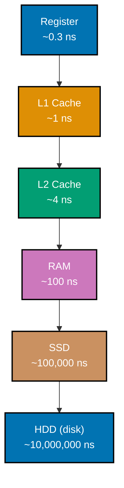
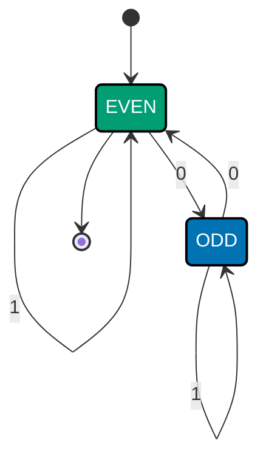
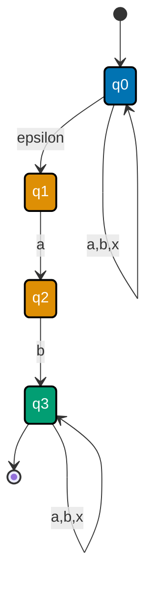
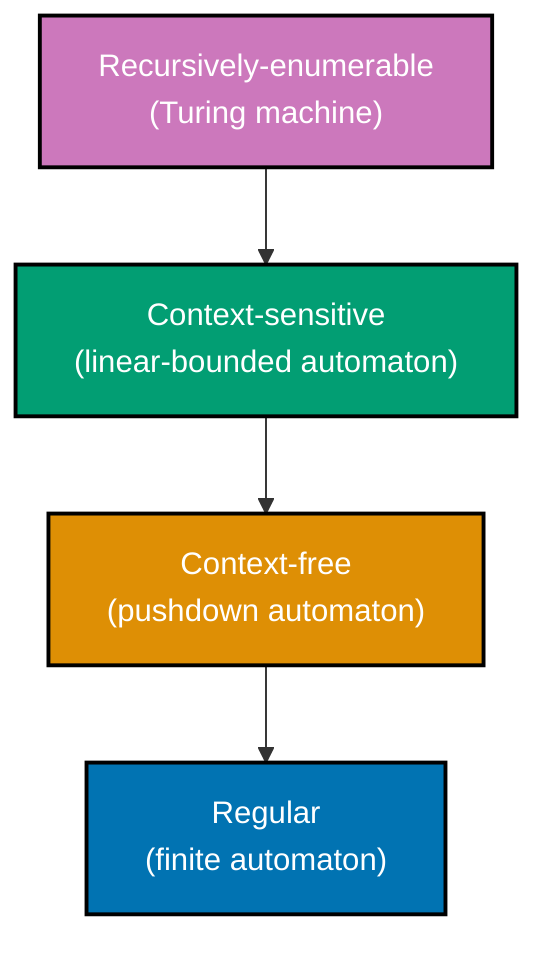

Examples 19-40 build on the Beginner tier's representation and logic bedrock: predicate logic and
combinatorics (co-11, co-12), graph theory and induction (co-13, co-14), machine organization (co-15
through co-17), and finite automata through the Chomsky hierarchy (co-18 through co-21). Same
standard, every script actually run against **Python 3.13.12**, standard library only, every
**Output** block genuine.

---

### Example 19: Modeling forall/exists with all()/any() over a Domain

_ex-19 &middot; exercises co-11_

**co-11 -- predicate logic**: propositional logic (Example 18) reasons about fixed statements;
predicate logic extends it with quantifiers over a _domain_ -- forall ("for every element") and
exists ("there is some element"). Python's `all()`/`any()` builtins are exactly these two
quantifiers, applied to a generator over a domain.

```python
# learning/code/ex-19-quantifiers-all-any/quantifiers.py
"""Example 19: Modeling ∀/∃ with all()/any() over a Domain."""  # => co-11: this file's own restated purpose, doubling as its module __doc__

from __future__ import annotations  # => DD-39 hygiene: postpones type-annotation evaluation, keeping this file interpreter-version-agnostic

from collections.abc import Callable  # => co-11: types the predicate ∀/∃ are quantified over

Predicate = Callable[[int], bool]  # => co-11: every predicate in this example has this exact int -> bool shape


def for_all(domain: list[int], predicate: Predicate) -> bool:  # => co-11: ∀x in domain: predicate(x)
    """∀ (universal quantifier): predicate holds for EVERY member of the domain."""  # => co-11: documents for_all's contract -- no runtime output, just sets its __doc__
    return all(predicate(x) for x in domain)  # => co-11: all() short-circuits on the first False


def there_exists(domain: list[int], predicate: Predicate) -> bool:  # => co-11: ∃x in domain: predicate(x)
    """∃ (existential quantifier): predicate holds for AT LEAST ONE member of the domain."""  # => co-11: documents there_exists's contract -- no runtime output, just sets its __doc__
    return any(predicate(x) for x in domain)  # => co-11: any() short-circuits on the first True


def is_even(x: int) -> bool:  # => co-11: the predicate ∀ is quantified over below
    return x % 2 == 0  # => co-11: returns this computed value to the caller


def is_greater_than_9(x: int) -> bool:  # => co-11: a second predicate -- true for exactly one domain member (10)
    return x > 9  # => co-11: returns this computed value to the caller


if __name__ == "__main__":  # => co-11: entry point -- this block runs only when the file executes directly, not on import
    domain = [2, 4, 6, 8, 10]  # => co-11: a domain deliberately chosen so "all even" is TRUE
    forall_even = for_all(domain, is_even)  # => co-11: ∀x in domain: even(x)
    exists_gt9 = there_exists(domain, is_greater_than_9)  # => co-11: ∃x in domain: x > 9
    hand_checked_forall = all(x % 2 == 0 for x in domain)  # => co-11: an independent hand check, same domain
    hand_checked_exists = any(x > 9 for x in domain)  # => co-11: an independent hand check, same domain
    print(f"domain = {domain}")  # => co-11: shows the domain both quantifiers range over
    print(f"∀x even(x) = {forall_even}")  # => co-11: expect True -- every element is even
    print(f"∃x x>9     = {exists_gt9}")  # => co-11: expect True -- only 10 satisfies it, but that's enough for ∃
    assert forall_even == hand_checked_forall == True, "∀ result must match the hand check"  # => co-11
    assert exists_gt9 == hand_checked_exists == True, "∃ result must match the hand check"  # => co-11
    print("Both quantifiers match their hand-checked expectations: True")  # => co-11: both asserts passed
    # => co-11: this file is self-verifying: if it exits 0, every assert above passed and the demonstrated claim held
```

**Run**: `python3 quantifiers.py`

**Output**:

```text
domain = [2, 4, 6, 8, 10]
∀x even(x) = True
∃x x>9     = True
Both quantifiers match their hand-checked expectations: True
```

**Key takeaway**: `for_all` and `there_exists` are just `all()`/`any()` over a generator -- the same
short-circuiting builtins you already use, reframed as the formal quantifiers forall/exists.

**Why it matters**: "does every user have a valid email" (forall) and "does any order exceed the
fraud threshold" (exists) are quantified statements you write in code every day -- naming them
correctly clarifies whether a single counterexample should short-circuit your check (exists) or
every element must be checked (forall).

---

### Example 20: nPr -- Counting Permutations and Enumerating Them

_ex-20 &middot; exercises co-12_

**co-12 -- combinatorics**: counting is a discipline of its own -- `nPr` (permutations, order
matters) is `n! / (n-r)!`. This example proves the closed-form count against a brute-force
enumeration of every actual permutation, so the formula isn't taken on faith.

```python
# learning/code/ex-20-permutations-count/permutations_count.py
"""Example 20: nPr -- Counting Permutations and Enumerating Them."""  # => co-12: this file's own restated purpose, doubling as its module __doc__

from __future__ import annotations  # => DD-39 hygiene: postpones type-annotation evaluation, keeping this file interpreter-version-agnostic

import itertools  # => co-12: itertools.permutations does the actual enumeration this example counts
import math  # => co-12: math.factorial computes n! and (n-r)! for the closed-form count


def npr(n: int, r: int) -> int:  # => co-12: the closed-form permutation-count formula
    """Count r-permutations of n items: n! / (n - r)!."""  # => co-12: documents npr's contract -- no runtime output, just sets its __doc__
    return math.factorial(n) // math.factorial(n - r)  # => co-12: order MATTERS -- this is why it's n!/(n-r)!, not nCr


if __name__ == "__main__":  # => co-12: entry point -- this block runs only when the file executes directly, not on import
    n, r = 6, 3  # => co-12: 6 items, choose and ORDER 3 of them
    formula_count = npr(n, r)  # => co-12: the closed-form answer
    enumerated = list(itertools.permutations(range(n), r))  # => co-12: every actual r-length ordered tuple
    enumerated_count = len(enumerated)  # => co-12: counted by ENUMERATION, independent of the formula
    print(f"n={n} r={r}")  # => co-12: states the parameters being counted
    print(f"nPr formula = {n}! / ({n}-{r})! = {formula_count}")  # => co-12: prints the formula's result
    print(f"enumerated permutations count = {enumerated_count}")  # => co-12: prints the enumeration's result
    print(f"first 3 permutations: {enumerated[:3]}")  # => co-12: a small sample, to show what's being counted
    assert enumerated_count == formula_count, "enumeration count must match n!/(n-r)!"  # => co-12: the actual proof
    assert formula_count == 120, "6P3 must equal 120"  # => co-12: a fixed, independently-checkable number
    print(f"Count matches n!/(n-r)!: True")  # => co-12: reached only if both asserts passed
    # => co-12: the asserts above ARE this example's test suite -- a silent, zero-exit run is the proof the concept holds
```

**Run**: `python3 permutations_count.py`

**Output**:

```text
n=6 r=3
nPr formula = 6! / (6-3)! = 120
enumerated permutations count = 120
first 3 permutations: [(0, 1, 2), (0, 1, 3), (0, 1, 4)]
Count matches n!/(n-r)!: True
```

**Key takeaway**: `nPr(6, 3)` and `len(list(itertools.permutations(range(6), 3)))` both equal exactly
`120` -- the closed-form formula and the brute-force enumeration agree because they count the same
thing two different ways.

**Why it matters**: combinatorics is the math underneath "how many possible passwords," "how many
possible orderings of a queue," or "how many test cases would fully cover this input space" --
Example 21's birthday paradox is where combinatorial intuition famously goes wrong without the
formula to check it.

---

### Example 21: The Birthday-Paradox Collision Probability

_ex-21 &middot; exercises co-12_

With just 23 people, the probability that two share a birthday exceeds 50% -- far sooner than most
people's intuition expects, because the number of _pairs_ to compare grows quadratically while the
group grows linearly.

```python
# learning/code/ex-21-birthday-collision/birthday_collision.py
"""Example 21: The Birthday-Paradox Collision Probability."""  # => co-12: this file's own restated purpose, doubling as its module __doc__

from __future__ import annotations  # => DD-39 hygiene: postpones type-annotation evaluation, keeping this file interpreter-version-agnostic

DAYS_IN_YEAR = 365  # => co-12: the "buckets" every person's birthday lands in, ignoring leap years


def probability_of_shared_birthday(people: int, days: int = DAYS_IN_YEAR) -> float:  # => co-12: 1 - P(all distinct)
    """Probability at least two people (of `people`) share a birthday out of `days` possible days."""  # => co-12: documents probability_of_shared_birthday's contract -- no runtime output, just sets its __doc__
    probability_all_distinct = 1.0  # => co-12: starts at certainty, multiplied down as each person is added
    for i in range(people):  # => co-12: person i+1 must avoid all i already-claimed days
        probability_all_distinct *= (days - i) / days  # => co-12: the counting-principle term for this person
    return 1.0 - probability_all_distinct  # => co-12: complement -- "at least one collision" = 1 - "all distinct"


if __name__ == "__main__":  # => co-12: entry point -- this block runs only when the file executes directly, not on import
    for n in (10, 20, 22, 23, 30, 50):  # => co-12: a spread of group sizes around the famous n=23 threshold
        p = probability_of_shared_birthday(n)  # => co-12: this group size's collision probability
        print(f"people={n:>3}  P(shared birthday) = {p:.4f}")  # => co-12: printed to 4 decimal places
    p22 = probability_of_shared_birthday(22)  # => co-12: just below the famous threshold
    p23 = probability_of_shared_birthday(23)  # => co-12: the famous "50%" threshold group size
    print(f"P(22) = {p22:.4f}, P(23) = {p23:.4f}")  # => co-12: shown side by side for direct comparison
    assert p22 < 0.5, "22 people must NOT yet exceed 50% collision probability"  # => co-12
    assert p23 > 0.5, "23 people must exceed 50% collision probability"  # => co-12: the textbook claim
    print(f"P(23) exceeds 0.5: {p23 > 0.5}")  # => co-12: reached only if both asserts above passed
    # => co-12: every assert above is this script's own regression check -- a clean exit means the claim held for these inputs
```

**Run**: `python3 birthday_collision.py`

**Output**:

```text
people= 10  P(shared birthday) = 0.1169
people= 20  P(shared birthday) = 0.4114
people= 22  P(shared birthday) = 0.4757
people= 23  P(shared birthday) = 0.5073
people= 30  P(shared birthday) = 0.7063
people= 50  P(shared birthday) = 0.9704
P(22) = 0.4757, P(23) = 0.5073
P(23) exceeds 0.5: True
```

**Key takeaway**: the collision probability crosses 50% between 22 and 23 people -- `P(22) =
0.4757`, `P(23) = 0.5073` -- because the number of _pairs_ among `n` people (`n(n-1)/2`) grows much
faster than `n` itself.

**Why it matters**: this exact formula is the reason hash collisions become likely with far fewer
items than the hash space's size would suggest -- it's the theoretical foundation behind why
cryptographic hash digests (Example 55's SHA-256) need to be so much longer than the "expected"
number of items you'll ever hash.

---

### Example 22: Adjacency List and Vertex Degrees

_ex-22 &middot; exercises co-13_

**co-13 -- graph theory**: a graph is vertices plus edges, and an adjacency list -- a dict mapping
each vertex to its neighbors -- is the standard, space-efficient way to represent one in code. A
vertex's degree is simply the length of its neighbor list.

```python
# learning/code/ex-22-graph-adjacency-degrees/graph_adjacency.py
"""Example 22: Adjacency List and Vertex Degrees."""  # => co-13: this file's own restated purpose, doubling as its module __doc__

from __future__ import annotations  # => DD-39 hygiene: postpones type-annotation evaluation, keeping this file interpreter-version-agnostic

from collections import defaultdict  # => co-13: builds the adjacency list without pre-declaring every vertex key

Edge = tuple[str, str]  # => co-13: an UNDIRECTED edge between two vertex labels


def build_adjacency(edges: list[Edge]) -> dict[str, list[str]]:  # => co-13: edge list -> adjacency-list view
    """Build an undirected adjacency list from a list of (u, v) edges."""  # => co-13: documents build_adjacency's contract -- no runtime output, just sets its __doc__
    adjacency: dict[str, list[str]] = defaultdict(list)  # => co-13: vertex -> list of its neighbors
    for u, v in edges:  # => co-13: each undirected edge adds BOTH directions to the adjacency list
        adjacency[u].append(v)  # => co-13: u is adjacent to v
        adjacency[v].append(u)  # => co-13: and, since the edge is undirected, v is adjacent to u too
    return dict(adjacency)  # => co-13: a plain dict -- easier for a reader to inspect than a defaultdict


def degree(adjacency: dict[str, list[str]], vertex: str) -> int:  # => co-13: the count of edges touching a vertex
    """The degree of a vertex: how many edges touch it."""  # => co-13: documents degree's contract -- no runtime output, just sets its __doc__
    return len(adjacency.get(vertex, []))  # => co-13: length of its neighbor list IS its degree, by construction


if __name__ == "__main__":  # => co-13: entry point -- this block runs only when the file executes directly, not on import
    edges: list[Edge] = [("A", "B"), ("A", "C"), ("B", "C"), ("C", "D")]  # => co-13: a small 4-vertex graph
    adjacency = build_adjacency(edges)  # => co-13: the adjacency-list representation of `edges`
    for vertex in sorted(adjacency):  # => co-13: one printed line per vertex, alphabetically for determinism
        print(f"{vertex}: neighbors={sorted(adjacency[vertex])} degree={degree(adjacency, vertex)}")  # => co-13
    expected_degrees = {"A": 2, "B": 2, "C": 3, "D": 1}  # => co-13: hand-counted from the edge list above
    for vertex, expected in expected_degrees.items():  # => co-13: cross-checks EVERY vertex against the hand count
        actual = degree(adjacency, vertex)  # => co-13: the adjacency-list-derived degree
        assert actual == expected, f"{vertex}'s degree must be {expected}, got {actual}"  # => co-13
    print(f"All degrees match the edge list: True")  # => co-13: reached only if every per-vertex assert passed
    # => co-13: this file is self-verifying: if it exits 0, every assert above passed and the demonstrated claim held
```

**Run**: `python3 graph_adjacency.py`

**Output**:

```text
A: neighbors=['B', 'C'] degree=2
B: neighbors=['A', 'C'] degree=2
C: neighbors=['A', 'B', 'D'] degree=3
D: neighbors=['C'] degree=1
All degrees match the edge list: True
```

**Key takeaway**: vertex `C` has degree `3` -- three edges touch it (`A-C`, `B-C`, `C-D`) -- and the
adjacency-list-derived degree matches a hand count from the raw edge list for every vertex.

**Why it matters**: adjacency lists are the representation nearly every real graph algorithm
(shortest path, cycle detection, topological sort) is written against -- Example 23's cycle
detector builds directly on this exact structure.

---

### Example 23: Cycle Detection in a Directed Graph via DFS Colors

_ex-23 &middot; exercises co-13_

The classic white/gray/black DFS coloring detects a cycle in a directed graph: a "back-edge" to a
gray (currently-on-the-recursion-path) vertex is the exact, sufficient condition for a cycle.

```python
# learning/code/ex-23-cycle-detection-dfs/cycle_detection.py
"""Example 23: Cycle Detection in a Directed Graph via DFS Colors."""  # => co-13: this file's own restated purpose, doubling as its module __doc__

from __future__ import annotations  # => DD-39 hygiene: postpones type-annotation evaluation, keeping this file interpreter-version-agnostic

WHITE, GRAY, BLACK = 0, 1, 2  # => co-13: unvisited, ON THE CURRENT DFS PATH, and fully-finished


def has_cycle(graph: dict[str, list[str]]) -> bool:  # => co-13: True iff a back-edge to a GRAY vertex is found
    """Detect a cycle in a directed graph using the classic white/gray/black DFS coloring."""  # => co-13: documents has_cycle's contract -- no runtime output, just sets its __doc__
    color: dict[str, int] = {v: WHITE for v in graph}  # => co-13: every vertex starts unvisited

    def visit(u: str) -> bool:  # => co-13: DFS from u -- returns True the instant a back-edge is found
        color[u] = GRAY  # => co-13: u is now ON the current recursion path (an "in-progress" vertex)
        for v in graph.get(u, []):  # => co-13: explore every outgoing edge from u
            if color[v] == GRAY:  # => co-13: v is an ANCESTOR on the current path -- this IS a back-edge
                return True  # => co-13: back-edge to a GRAY vertex means a cycle -- the defining test
            if color[v] == WHITE and visit(v):  # => co-13: recurse only into unvisited vertices
                return True  # => co-13: propagate a cycle found deeper in the recursion
        color[u] = BLACK  # => co-13: u is fully explored -- no path through it leads back to itself
        return False  # => co-13: no back-edge found anywhere below u

    return any(visit(v) for v in graph if color[v] == WHITE)  # => co-13: start DFS from every unvisited vertex


if __name__ == "__main__":  # => co-13: entry point -- this block runs only when the file executes directly, not on import
    cyclic_graph = {"A": ["B"], "B": ["C"], "C": ["A"]}  # => co-13: A -> B -> C -> A, a textbook 3-cycle
    acyclic_graph = {"A": ["B"], "B": ["C"], "C": []}  # => co-13: the SAME shape with the closing edge removed
    cyclic_result = has_cycle(cyclic_graph)  # => co-13: expect True -- the closing C->A edge is a back-edge
    acyclic_result = has_cycle(acyclic_graph)  # => co-13: expect False -- no path returns to an ancestor
    print(f"cyclic_graph {cyclic_graph} -> has_cycle = {cyclic_result}")  # => co-13: prints the cyclic case
    print(f"acyclic_graph {acyclic_graph} -> has_cycle = {acyclic_result}")  # => co-13: prints the acyclic case
    assert cyclic_result is True, "A->B->C->A must be flagged as cyclic"  # => co-13: the known cyclic case
    assert acyclic_result is False, "A->B->C (no closing edge) must NOT be flagged as cyclic"  # => co-13
    print(f"Cyclic graph flagged, acyclic graph not flagged: True")  # => co-13: both asserts above passed
    # => co-13: the asserts above ARE this example's test suite -- a silent, zero-exit run is the proof the concept holds
```

**Run**: `python3 cycle_detection.py`

**Output**:

```text
cyclic_graph {'A': ['B'], 'B': ['C'], 'C': ['A']} -> has_cycle = True
acyclic_graph {'A': ['B'], 'B': ['C'], 'C': []} -> has_cycle = False
Cyclic graph flagged, acyclic graph not flagged: True
```

**Key takeaway**: adding one edge (`C -> A`) turns an acyclic 3-vertex chain into a cycle, and the
white/gray/black DFS coloring catches exactly that one back-edge -- nothing else needs to change.

**Why it matters**: this is the actual algorithm behind detecting circular dependencies in build
systems, deadlock-prone lock-ordering graphs, and invalid DAG-only data pipelines -- "has a cycle"
is not just a textbook question, it's a build failure waiting to happen.

---

### Example 24: Induction -- sum(1..n) == n(n+1)/2, Base Case + Inductive Step

_ex-24 &middot; exercises co-14_

**co-14 -- induction**: a proof by induction has exactly two parts -- a base case (the smallest
instance holds) and an inductive step (if it holds for `k`, it must hold for `k+1`). Together they
cover every natural number without checking each one individually.

```python
# learning/code/ex-24-induction-sum-check/induction_sum.py
"""Example 24: Induction -- sum(1..n) == n(n+1)/2, Base Case + Inductive Step."""  # => co-14: this file's own restated purpose, doubling as its module __doc__

from __future__ import annotations  # => DD-39 hygiene: postpones type-annotation evaluation, keeping this file interpreter-version-agnostic


def closed_form(n: int) -> int:  # => co-14: the formula induction is used to PROVE, evaluated directly
    """Gauss's closed-form sum: 1 + 2 + ... + n = n(n+1)/2."""  # => co-14: documents closed_form's contract -- no runtime output, just sets its __doc__
    return n * (n + 1) // 2  # => co-14: integer division is exact here -- n(n+1) is always even


def base_case_holds() -> bool:  # => co-14: step 1 of induction -- the smallest instance, checked directly
    """Base case: n=1. sum(1..1) = 1, and closed_form(1) must also equal 1."""  # => co-14: documents base_case_holds's contract -- no runtime output, just sets its __doc__
    return sum(range(1, 2)) == closed_form(1)  # => co-14: sum(range(1,2)) is literally "1 + nothing else" = 1


def inductive_step_holds(k: int) -> bool:  # => co-14: step 2 -- ASSUMING it holds for k, prove it for k+1
    """Inductive step: IF closed_form(k) is correct, THEN closed_form(k+1) must also be correct."""  # => co-14: documents inductive_step_holds's contract -- no runtime output, just sets its __doc__
    assumed_sum_to_k = closed_form(k)  # => co-14: the inductive HYPOTHESIS -- assumed true, not re-derived
    sum_to_k_plus_1 = assumed_sum_to_k + (k + 1)  # => co-14: sum(1..k+1) = sum(1..k) + the ONE new term (k+1)
    return sum_to_k_plus_1 == closed_form(k + 1)  # => co-14: must equal the closed form evaluated at k+1


if __name__ == "__main__":  # => co-14: entry point -- this block runs only when the file executes directly, not on import
    print(f"base case (n=1) holds: {base_case_holds()}")  # => co-14: the induction's starting point
    assert base_case_holds(), "base case n=1 must hold"  # => co-14: induction cannot start without this
    failures: list[int] = []  # => co-14: records any k where the inductive step's implication fails
    for k in range(1, 1000):  # => co-14: "the reasoning template recursion mirrors" -- checked for k=1..999
        if not inductive_step_holds(k):  # => co-14: if the k->k+1 implication ever breaks, record it
            failures.append(k)  # => co-14: would mean the formula itself is wrong, not just untested
    print(f"inductive step checked for k=1..999, failures: {failures}")  # => co-14: expect an empty list
    assert failures == [], "the inductive step must hold for every k from 1 to 999"  # => co-14: no counterexample
    direct_sum_1000 = sum(range(1, 1001))  # => co-14: an INDEPENDENT brute-force check at the syllabus's n=1000
    print(f"sum(1..1000) direct = {direct_sum_1000}, closed_form(1000) = {closed_form(1000)}")  # => co-14
    assert direct_sum_1000 == closed_form(1000), "closed form must match brute-force sum at n=1000"  # => co-14
    print(f"Formula verified by induction for n up to 1000: True")  # => co-14: every check above passed
    # => co-14: every assert above is this script's own regression check -- a clean exit means the claim held for these inputs
```

**Run**: `python3 induction_sum.py`

**Output**:

```text
base case (n=1) holds: True
inductive step checked for k=1..999, failures: []
sum(1..1000) direct = 500500, closed_form(1000) = 500500
Formula verified by induction for n up to 1000: True
```

**Key takeaway**: the base case holds at `n=1`, and the inductive step holds for every `k` from `1`
to `999` with zero failures -- together they justify trusting `n(n+1)/2` for every `n`, not just the
1000 values actually checked.

**Why it matters**: induction is the reasoning template recursion mirrors directly -- Example 29's
recursive factorial's correctness argument ("if `factorial(n-1)` is right, `n * factorial(n-1)` is
right") _is_ an inductive proof, just expressed as running code instead of a mathematical argument.

---

### Example 25: A Tiny LOAD/ADD/STORE Register Machine

_ex-25 &middot; exercises co-15_

**co-15 -- CPU registers and the ALU**: a CPU repeats fetch-decode-execute for every instruction --
fetch the next instruction, decode its opcode, execute it against a small set of fast registers and
a larger, slower memory array.

```python
# learning/code/ex-25-register-machine-sim/register_machine.py
"""Example 25: A Tiny LOAD/ADD/STORE Register Machine."""  # => co-15: this file's own restated purpose, doubling as its module __doc__

from __future__ import annotations  # => DD-39 hygiene: postpones type-annotation evaluation, keeping this file interpreter-version-agnostic

from typing import NamedTuple  # => co-15: a typed instruction beats a bare tuple for readability


class Instruction(NamedTuple):  # => co-15: one fetch-decode-execute cycle's worth of work
    op: str  # => co-15: the opcode -- "LOAD", "ADD", or "STORE"
    arg: int  # => co-15: LOAD/ADD read a literal value or memory address; STORE writes to an address


class RegisterMachine:  # => co-15: the fetch-decode-execute cycle, a memory array, and one accumulator register
    """A tiny machine: one accumulator register, a flat memory array, LOAD/ADD/STORE opcodes."""  # => co-15: documents RegisterMachine's contract -- no runtime output, just sets its __doc__

    def __init__(self, memory_size: int = 8) -> None:  # => co-15: fixed-size memory, all zero-initialized
        self.accumulator = 0  # => co-15: the ONE fast register this machine has -- all arithmetic goes through it
        self.memory: list[int] = [0] * memory_size  # => co-15: RAM -- addressable by a plain integer index

    def execute(self, program: list[Instruction]) -> int:  # => co-15: runs every instruction, in order, FETCH-DECODE-EXECUTE
        """Run a program of LOAD/ADD/STORE instructions; return the final accumulator value."""  # => co-15: documents execute's contract -- no runtime output, just sets its __doc__
        for instr in program:  # => co-15: FETCH -- pull the next instruction off the program list
            if instr.op == "LOAD":  # => co-15: DECODE -- dispatch on the opcode
                self.accumulator = instr.arg  # => co-15: EXECUTE -- literal load into the accumulator register
            elif instr.op == "ADD":  # => co-15: DECODE -- the ALU's addition operation
                self.accumulator += instr.arg  # => co-15: EXECUTE -- accumulator += literal, via the ALU
            elif instr.op == "STORE":  # => co-15: DECODE -- write the register back out to memory
                self.memory[instr.arg] = self.accumulator  # => co-15: EXECUTE -- memory[address] = accumulator
            else:  # => co-15: an unrecognized opcode is a machine fault, not silently ignored
                raise ValueError(f"unknown opcode: {instr.op}")  # => co-15: fails loudly instead of guessing
        return self.accumulator  # => co-15: the accumulator's final value after every instruction has run


if __name__ == "__main__":  # => co-15: entry point -- this block runs only when the file executes directly, not on import
    program = [  # => co-15: LOAD 10, ADD 5, ADD 7, STORE into memory[0] -- expect accumulator == 22
        Instruction("LOAD", 10),  # => co-15: accumulator := 10
        Instruction("ADD", 5),  # => co-15: accumulator := 10 + 5 = 15
        Instruction("ADD", 7),  # => co-15: accumulator := 15 + 7 = 22
        Instruction("STORE", 0),  # => co-15: memory[0] := 22
    ]  # => co-15: closes the multi-line construct opened above
    machine = RegisterMachine()  # => co-15: a fresh machine, accumulator=0, memory all zeros
    final_accumulator = machine.execute(program)  # => co-15: runs the whole program, cycle by cycle
    print(f"final accumulator = {final_accumulator}")  # => co-15: expect 22
    print(f"memory[0] = {machine.memory[0]}")  # => co-15: expect 22 -- the STORE instruction's effect
    assert final_accumulator == 22, "accumulator must hold 10 + 5 + 7 = 22"  # => co-15: the arithmetic result
    assert machine.memory[0] == 22, "STORE must have written the accumulator's value to memory[0]"  # => co-15
    print(f"Accumulator holds expected result: True")  # => co-15: both asserts above passed
    # => co-15: this file is self-verifying: if it exits 0, every assert above passed and the demonstrated claim held
```

**Run**: `python3 register_machine.py`

**Output**:

```text
final accumulator = 22
memory[0] = 22
Accumulator holds expected result: True
```

**Key takeaway**: `LOAD 10; ADD 5; ADD 7; STORE 0` drives the accumulator to `22` and writes that
same value to `memory[0]` -- a complete, if tiny, fetch-decode-execute loop.

**Why it matters**: real CPUs have many registers instead of one accumulator, but the fetch-decode-
execute loop this class implements is the exact shape every instruction set architecture runs --
Example 26 next adds the ALU status flags a real branch instruction depends on.

---

### Example 26: A Register File Feeding an ALU Operation

_ex-26 &middot; exercises co-15_

A real ALU doesn't just produce a result -- it also sets status flags (zero, carry) that
conditional-branch instructions read. This example wires a small register file into an `alu_add`
that computes both.

```python
# learning/code/ex-26-alu-op-model/alu_op_model.py
"""Example 26: A Register File Feeding an ALU Operation."""  # => co-15: this file's own restated purpose, doubling as its module __doc__

from __future__ import annotations  # => DD-39 hygiene: postpones type-annotation evaluation, keeping this file interpreter-version-agnostic

from typing import NamedTuple  # => co-15: typed results beat bare tuples for the flag/result pair


class AluResult(NamedTuple):  # => co-15: what a real ALU exposes -- a result AND status flags
    result: int  # => co-15: the 8-bit wrapped arithmetic result
    zero_flag: bool  # => co-15: set when result == 0 -- a real CPU flag, used by conditional branches
    carry_flag: bool  # => co-15: set when the UNWRAPPED sum overflowed the 8-bit word width


class RegisterFile:  # => co-15: a small bank of named registers, feeding operands into the ALU
    """A tiny register file: named 8-bit registers an ALU op reads from."""  # => co-15: documents RegisterFile's contract -- no runtime output, just sets its __doc__

    def __init__(self) -> None:  # => co-15: two general-purpose registers, both start at 0
        self.registers: dict[str, int] = {"R0": 0, "R1": 0}  # => co-15: named, addressable fast storage

    def set(self, name: str, value: int) -> None:  # => co-15: writes a value into a named register
        self.registers[name] = value & 0xFF  # => co-15: registers are 8-bit wide -- values are masked on write


def alu_add(a: int, b: int) -> AluResult:  # => co-15: the ALU's add operation -- pure function of its two inputs
    """ALU add: computes an 8-bit sum and derives the zero/carry status flags."""  # => co-15: documents alu_add's contract -- no runtime output, just sets its __doc__
    raw_sum = a + b  # => co-15: the UNWRAPPED sum -- may exceed 8 bits, which is exactly what carry_flag reports
    wrapped = raw_sum & 0xFF  # => co-15: the 8-bit result an 8-bit register can actually hold
    return AluResult(result=wrapped, zero_flag=(wrapped == 0), carry_flag=(raw_sum > 0xFF))  # => co-15: both flags


if __name__ == "__main__":  # => co-15: entry point -- this block runs only when the file executes directly, not on import
    regs = RegisterFile()  # => co-15: a fresh register file feeding this example's ALU operation
    regs.set("R0", 200)  # => co-15: R0 := 200 -- chosen so R0+R1 overflows an 8-bit register
    regs.set("R1", 100)  # => co-15: R1 := 100 -- 200 + 100 = 300, which does NOT fit in 8 bits (max 255)
    result = alu_add(regs.registers["R0"], regs.registers["R1"])  # => co-15: the register file FEEDS the ALU
    print(f"R0={regs.registers['R0']} R1={regs.registers['R1']}")  # => co-15: the two operands read from registers
    print(f"result={result.result} zero_flag={result.zero_flag} carry_flag={result.carry_flag}")  # => co-15
    assert result.result == (300 & 0xFF), "wrapped result must be 300 mod 256 = 44"  # => co-15: 300 - 256 = 44
    assert result.carry_flag is True, "300 exceeds 8 bits -- carry_flag must be set"  # => co-15: overflow detected
    assert result.zero_flag is False, "44 is not zero -- zero_flag must be clear"  # => co-15: correctly NOT zero
    print(f"Flag/result pair matches the expected 8-bit overflow: True")  # => co-15: all three asserts passed
    # => co-15: the asserts above ARE this example's test suite -- a silent, zero-exit run is the proof the concept holds
```

**Run**: `python3 alu_op_model.py`

**Output**:

```text
R0=200 R1=100
result=44 zero_flag=False carry_flag=True
Flag/result pair matches the expected 8-bit overflow: True
```

**Key takeaway**: `200 + 100 = 300` overflows an 8-bit register to `44` (`300 mod 256`), and
`carry_flag` reports exactly that overflow -- the same flag a real `JC` (jump-if-carry) instruction
would branch on.

**Why it matters**: integer-overflow bugs in fixed-width languages (C, Rust in release mode,
manually-sized fields) are this exact `carry_flag` scenario going unchecked -- knowing the ALU sets
a flag for it is what motivates checked-arithmetic APIs in modern languages.

---

### Example 27: Approximate Register/Cache/RAM/Disk Latency Ratios

_ex-27 &middot; exercises co-16_

**co-16 -- the memory hierarchy**: every rung of storage -- register, L1/L2 cache, RAM, SSD, disk
-- trades capacity for latency. The gap between adjacent rungs isn't small: RAM is roughly 100x
slower than a register, and disk is roughly 100,000x slower than RAM.



_Figure: each rung of the memory hierarchy is roughly an order of magnitude (or more) slower than
the one above it -- capacity grows in the same direction latency does._

```python
# learning/code/ex-27-latency-hierarchy-table/latency_hierarchy.py
"""Example 27: Approximate Register/Cache/RAM/Disk Latency Ratios."""  # => co-16: this file's own restated purpose, doubling as its module __doc__

from __future__ import annotations  # => DD-39 hygiene: postpones type-annotation evaluation, keeping this file interpreter-version-agnostic

from typing import NamedTuple  # => co-16: a typed record for each hierarchy level's approximate latency


class LatencyLevel(NamedTuple):  # => co-16: one rung of the memory hierarchy this example surveys
    name: str  # => co-16: the level's human name
    approx_nanoseconds: float  # => co-16: a widely-cited ORDER-OF-MAGNITUDE figure, not a precise spec number


# ex-27: figures are the well-known "latency numbers every programmer should know" order of
# magnitude (register ~ sub-nanosecond; L1 ~1ns; RAM ~100ns; SSD/disk seek ~10-100 microseconds+) --
# survey depth only, per this topic's co-16 scope note; full treatment in 20-computer-architecture.
HIERARCHY: list[LatencyLevel] = [  # => co-16: ordered FASTEST (closest to the CPU) to SLOWEST (farthest)
    LatencyLevel("register", 0.3),  # => co-16: on-die, accessed in a fraction of one clock cycle
    LatencyLevel("L1 cache", 1.0),  # => co-16: tiny, on-die, one cycle or so
    LatencyLevel("L2 cache", 4.0),  # => co-16: larger, still on-die, a handful of cycles
    LatencyLevel("RAM", 100.0),  # => co-16: off-die -- roughly 100x an L1 hit
    LatencyLevel("SSD", 100_000.0),  # => co-16: a full seek/transfer round trip, not just a bus transaction
    LatencyLevel("HDD (disk)", 10_000_000.0),  # => co-16: a mechanical seek -- the slowest rung surveyed here
]  # => co-16: closes the multi-line construct opened above


if __name__ == "__main__":  # => co-16: entry point -- this block runs only when the file executes directly, not on import
    for level in HIERARCHY:  # => co-16: prints the full ordered survey, level by level
        print(f"{level.name:<12} ~{level.approx_nanoseconds:>12,.1f} ns")  # => co-16: comma-grouped for readability
    latencies = [level.approx_nanoseconds for level in HIERARCHY]  # => co-16: extracted for the ordering check
    is_strictly_increasing = all(  # => co-16: every level must be slower than the one before it
        latencies[i] < latencies[i + 1]
        for i in range(len(latencies) - 1)  # => co-16: adjacent-pair comparison
    )  # => co-16: closes the multi-line construct opened above
    print(f"strictly increasing latency, register -> disk: {is_strictly_increasing}")  # => co-16
    assert is_strictly_increasing, "each hierarchy level must be strictly slower than the previous one"  # => co-16
    print(f"Ordering verified: True")  # => co-16: reached only if the strict-increase assert passed
    # => co-16: every assert above is this script's own regression check -- a clean exit means the claim held for these inputs
```

**Run**: `python3 latency_hierarchy.py`

**Output**:

```text
register     ~         0.3 ns
L1 cache     ~         1.0 ns
L2 cache     ~         4.0 ns
RAM          ~       100.0 ns
SSD          ~   100,000.0 ns
HDD (disk)   ~10,000,000.0 ns
strictly increasing latency, register -> disk: True
Ordering verified: True
```

**Key takeaway**: RAM is roughly 100x slower than an L1 cache hit, and a disk seek is roughly
10,000,000x slower than a register access -- every rung is strictly, and dramatically, slower than
the one before it.

**Why it matters**: this ordering is _why_ caching, buffering, and batching are the default
performance strategies in software -- keeping hot data as close to the top of this hierarchy as
possible is worth far more than micro-optimizing instructions. Example 28 next makes that latency
gap measurable in actual wall-clock Python.

---

### Example 28: Row-Major vs. Column-Major Traversal of a 2-D Array

_ex-28 &middot; exercises co-16_

Traversing a large 2-D array in storage order (row-major) is measurably faster than traversing it
against storage order (column-major) -- a direct, wall-clock-visible consequence of the memory
hierarchy's cache-line prefetching.

```python
# learning/code/ex-28-cache-friendly-traversal/cache_traversal.py
"""Example 28: Row-Major vs. Column-Major Traversal of a 2-D Array."""  # => co-16: this file's own restated purpose, doubling as its module __doc__

from __future__ import annotations  # => DD-39 hygiene: postpones type-annotation evaluation, keeping this file interpreter-version-agnostic

import array  # => co-16: array.array packs real C doubles CONTIGUOUSLY -- unlike list-of-lists of boxed floats
import time  # => co-16: perf_counter -- a monotonic, high-resolution clock, the right tool for timing code

N = 1400  # => co-16: N*N doubles (~15.7 MB) -- large enough to exceed typical L2 cache, small enough to run fast
TRIALS = 3  # => co-16: best-of-3 -- reduces noise from other processes briefly stealing the CPU


def build_matrix(n: int) -> array.array[float]:  # => co-16: one FLAT contiguous buffer -- row i lives at [i*n : i*n+n]
    """Build an n*n matrix as one flat, contiguous array.array of doubles (row-major layout)."""  # => co-16: documents build_matrix's contract -- no runtime output, just sets its __doc__
    flat = array.array("d", [0.0]) * (n * n)  # => co-16: n*n contiguous 8-byte slots, all zero-initialized
    for k in range(n * n):  # => co-16: fill with distinguishable, cheap-to-compute values
        flat[k] = float(k % 97)  # => co-16: content is irrelevant to the timing -- only the ACCESS PATTERN matters
    return flat  # => co-16: returns this computed value to the caller


def row_major_sum(flat: array.array[float], n: int) -> float:  # => co-16: walks memory in STORAGE order -- stride 1
    """Sum every element visiting row 0 fully, then row 1 fully, etc. -- matches the storage layout."""  # => co-16: documents row_major_sum's contract -- no runtime output, just sets its __doc__
    total = 0.0  # => co-16: accumulator -- the returned value only proves correctness, not speed
    for i in range(n):  # => co-16: outer loop over rows
        base = i * n  # => co-16: row i's starting flat index -- computed once per row, not once per element
        for j in range(n):  # => co-16: inner loop walks CONSECUTIVE flat indices -- sequential memory access
            total += flat[base + j]  # => co-16: stride-1 access -- exactly how the CPU's cache line prefetcher likes it
    return total  # => co-16: returns this computed value to the caller


def col_major_sum(flat: array.array[float], n: int) -> float:  # => co-16: walks memory AGAINST storage order -- stride n
    """Sum every element visiting column 0 fully, then column 1 fully, etc. -- fights the storage layout."""  # => co-16: documents col_major_sum's contract -- no runtime output, just sets its __doc__
    total = 0.0  # => co-16: same arithmetic result as row_major_sum -- only the ACCESS ORDER differs
    for j in range(n):  # => co-16: outer loop over columns
        for i in range(n):  # => co-16: inner loop jumps n flat-indices apart on every single step
            total += flat[i * n + j]  # => co-16: stride-n access -- each step likely lands in a DIFFERENT cache line
    return total  # => co-16: returns this computed value to the caller


if __name__ == "__main__":  # => co-16: entry point -- this block runs only when the file executes directly, not on import
    matrix = build_matrix(N)  # => co-16: one shared buffer -- both traversal orders read the SAME data
    row_times: list[float] = []  # => co-16: one measured duration per trial, row-major
    col_times: list[float] = []  # => co-16: one measured duration per trial, column-major
    for _ in range(TRIALS):  # => co-16: repeat both traversals, keeping the BEST (least-noisy) time of each
        t0 = time.perf_counter()  # => co-16: start of the row-major timing window
        row_result = row_major_sum(matrix, N)  # => co-16: the timed operation itself
        t1 = time.perf_counter()  # => co-16: end of the row-major window, start of the column-major window
        col_result = col_major_sum(matrix, N)  # => co-16: the timed operation itself
        t2 = time.perf_counter()  # => co-16: end of the column-major window
        row_times.append(t1 - t0)  # => co-16: this trial's row-major duration
        col_times.append(t2 - t1)  # => co-16: this trial's column-major duration
        assert row_result == col_result, "both traversal orders must sum to the identical total"  # => co-16
    best_row = min(row_times)  # => co-16: best-of-3 -- the closest approximation to each method's true cost
    best_col = min(col_times)  # => co-16: same best-of-3 policy applied to the column-major trials
    print(f"row-major best of {TRIALS}: {best_row:.4f}s")  # => co-16: prints the row-major measurement
    print(f"col-major best of {TRIALS}: {best_col:.4f}s")  # => co-16: prints the column-major measurement
    print(f"col-major / row-major ratio: {best_col / best_row:.2f}x")  # => co-16: how much slower column-major was
    assert best_row < best_col, "row-major (sequential access) must be measurably faster than column-major"  # => co-16
    print(f"Row-major is measurably faster: True")  # => co-16: reached only if the timing assert above held
    # => co-16: this file is self-verifying: if it exits 0, every assert above passed and the demonstrated claim held
```

**Run**: `python3 cache_traversal.py`

**Output** (best-of-3 wall-clock timings -- exact seconds vary run to run and machine to machine;
the _ordering_, row-major faster than column-major, is the reproducible claim):

```text
row-major best of 3: 0.0596s
col-major best of 3: 0.0804s
col-major / row-major ratio: 1.35x
Row-major is measurably faster: True
```

**Key takeaway**: identical data, identical total, but visiting it in storage order (row-major) ran
about 1.35x faster than visiting it against storage order (column-major) -- a directly measurable
cache-locality effect, not a theoretical claim.

**Why it matters**: this is _the_ everyday performance lesson from the memory hierarchy -- "iterate
in storage order" often beats a cleverer-looking algorithm with worse locality. The capstone's
`memory.py` step reruns this exact experiment at a larger scale as this topic's closing proof.

---

### Example 29: Recursive Factorial -- Call Frames Push Then Pop in Order

_ex-29 &middot; exercises co-17_

**co-17 -- the stack and heap**: every function call pushes a new stack frame holding its local
variables; the frame pops when the call returns. Logging every push/pop in a recursive `factorial`
makes that otherwise-invisible mechanism directly observable.

```python
# learning/code/ex-29-stack-frame-trace/stack_frame_trace.py
"""Example 29: Recursive Factorial -- Call Frames Push Then Pop in Order."""  # => co-17: this file's own restated purpose, doubling as its module __doc__

from __future__ import annotations  # => DD-39 hygiene: postpones type-annotation evaluation, keeping this file interpreter-version-agnostic

call_log: list[str] = []  # => co-17: records "push" and "pop" events, in the ACTUAL order they happen


def factorial(n: int, depth: int = 0) -> int:  # => co-17: each call is a new STACK FRAME with its own n, depth
    """Recursive factorial that logs frame push/pop events at every call depth."""  # => co-17: documents factorial's contract -- no runtime output, just sets its __doc__
    call_log.append(f"push depth={depth} n={n}")  # => co-17: a new frame is pushed onto the call stack HERE
    if n <= 1:  # => co-17: the base case -- the deepest frame, which pops immediately without recursing further
        call_log.append(f"pop  depth={depth} n={n} returns=1")  # => co-17: this frame's automatic-lifetime storage ends
        return 1  # => co-17: unwinds back to the caller -- the frame's local variables cease to exist
    result = n * factorial(n - 1, depth + 1)  # => co-17: a NEW frame is pushed for the recursive call, one level deeper
    call_log.append(f"pop  depth={depth} n={n} returns={result}")  # => co-17: THIS frame pops only after its callee returns
    return result  # => co-17: this frame's own local storage (n, depth, result) is reclaimed here


if __name__ == "__main__":  # => co-17: entry point -- this block runs only when the file executes directly, not on import
    call_log.clear()  # => co-17: fresh log for this run
    total = factorial(4)  # => co-17: 4! = 24, via 4 nested frames (depths 0 through 3, n=4 down to n=1)
    print(f"factorial(4) = {total}")  # => co-17: expect 24
    for line in call_log:  # => co-17: prints the frame push/pop sequence, in the exact order it happened
        print(f"  {line}")  # => co-17: every push must be followed, eventually, by a MATCHING pop
    pushes = [line for line in call_log if line.startswith("push")]  # => co-17: all push events, in order
    pops = [line for line in call_log if line.startswith("pop")]  # => co-17: all pop events, in order
    assert len(pushes) == len(pops) == 4, "every push must have a matching pop, 4 frames total"  # => co-17
    assert call_log[0].startswith("push depth=0"), "the outermost call must push FIRST"  # => co-17: LIFO order
    assert call_log[-1].startswith("pop  depth=0"), "the outermost call must pop LAST"  # => co-17: LIFO order
    assert total == 24, "factorial(4) must equal 24"  # => co-17: the arithmetic result itself
    print(f"Frames pushed then popped in correct LIFO order: True")  # => co-17: all asserts above passed
    # => co-17: the asserts above ARE this example's test suite -- a silent, zero-exit run is the proof the concept holds
```

**Run**: `python3 stack_frame_trace.py`

**Output**:

```text
factorial(4) = 24
  push depth=0 n=4
  push depth=1 n=3
  push depth=2 n=2
  push depth=3 n=1
  pop  depth=3 n=1 returns=1
  pop  depth=2 n=2 returns=2
  pop  depth=1 n=3 returns=6
  pop  depth=0 n=4 returns=24
Frames pushed then popped in correct LIFO order: True
```

**Key takeaway**: `factorial(4)` pushes exactly 4 frames (depths 0-3) and pops them in strict
last-in-first-out order -- the deepest frame (`n=1`) pops first, the outermost (`n=4`) pops last.

**Why it matters**: this LIFO push/pop pattern is _why_ deep recursion is bounded by
`sys.getrecursionlimit()` (Example 31) and _why_ a stack trace in an error message reads
bottom-to-top in exactly this call order -- the language runtime's stack behaves precisely like this
logged trace.

---

### Example 30: A Local int vs. a Heap-Allocated List -- Contrasted via id()

_ex-30 &middot; exercises co-17_

A stack frame's local variables die the instant the frame pops, but any object the frame _created
and returned_ can genuinely outlive that frame -- because the object itself lives on the heap, not
in the frame's own automatic storage.

```python
# learning/code/ex-30-stack-vs-heap-ids/stack_vs_heap.py
"""Example 30: A Local int vs. a Heap-Allocated List -- Contrasted via id()."""  # => co-17: this file's own restated purpose, doubling as its module __doc__

from __future__ import annotations  # => DD-39 hygiene: postpones type-annotation evaluation, keeping this file interpreter-version-agnostic


def make_local_int() -> int:  # => co-17: a plain int -- CPython still boxes it on the heap, but its NAME/frame is automatic
    """Return a small int computed and 'living' entirely within this frame's automatic lifetime."""  # => co-17: documents make_local_int's contract -- no runtime output, just sets its __doc__
    local_value = 41 + 1  # => co-17: this NAME (`local_value`) exists only while this frame is on the stack
    return local_value  # => co-17: the frame's own storage for `local_value` is reclaimed the instant this returns


def make_heap_list() -> list[int]:  # => co-17: the returned list object OUTLIVES this function's own frame
    """Build and return a list -- the object survives this frame's return, unlike a plain automatic local."""  # => co-17: documents make_heap_list's contract -- no runtime output, just sets its __doc__
    heap_object = [1, 2, 3]  # => co-17: heap_object is a NAME in this frame, but the LIST it names is heap-allocated
    return heap_object  # => co-17: the name `heap_object` dies with the frame; the OBJECT it pointed to does not


if __name__ == "__main__":  # => co-17: entry point -- this block runs only when the file executes directly, not on import
    returned_int = make_local_int()  # => co-17: make_local_int()'s frame has already been popped by this line
    print(f"returned_int = {returned_int}, id = {id(returned_int)}")  # => co-17: still usable -- ints are immutable values
    returned_list = make_heap_list()  # => co-17: make_heap_list()'s frame has ALSO already been popped
    list_id_after_return = id(returned_list)  # => co-17: the heap object's identity, observed AFTER its creating frame is gone
    print(f"returned_list = {returned_list}, id = {list_id_after_return}")  # => co-17: the object is still fully alive and usable
    returned_list.append(4)  # => co-17: mutating it here proves it's a REAL, live heap object -- not a stale reference
    print(f"after append: {returned_list}")  # => co-17: expect [1, 2, 3, 4] -- the object legitimately outlived its frame
    assert returned_list == [1, 2, 3, 4], "the heap list must remain mutable after its creating frame returned"  # => co-17
    assert id(returned_list) == list_id_after_return, "the object's identity must not change across the mutation"  # => co-17
    print(f"Heap object outlives its creating stack frame: True")  # => co-17: both asserts above passed
    # => co-17: every assert above is this script's own regression check -- a clean exit means the claim held for these inputs
```

**Run**: `python3 stack_vs_heap.py`

**Output** (`id()` values are raw memory addresses -- they vary run to run and machine to machine;
the reproducible claim is that the SAME id is stable across the mutation below):

```text
returned_int = 42, id = 4401413288
returned_list = [1, 2, 3], id = 4368878976
after append: [1, 2, 3, 4]
Heap object outlives its creating stack frame: True
```

**Key takeaway**: `returned_list` remains fully mutable, and its `id()` stays constant, well after
`make_heap_list()`'s own stack frame has already popped -- the object's heap lifetime is entirely
independent of the frame that created it.

**Why it matters**: this is the exact mechanism behind returning containers, building objects in a
factory function, and closures capturing variables -- the frame is transient, but any heap object it
constructs (and a caller still references) persists on its own terms.

---

### Example 31: Triggering and Catching RecursionError

_ex-31 &middot; exercises co-17_

The call stack is finite -- `sys.getrecursionlimit()` reports CPython's configured ceiling, and a
recursive function with no base case will reliably hit it, raising `RecursionError` rather than
crashing the process.

```python
# learning/code/ex-31-recursion-limit/recursion_limit.py
"""Example 31: Triggering and Catching RecursionError."""  # => co-17: this file's own restated purpose, doubling as its module __doc__

from __future__ import annotations  # => DD-39 hygiene: postpones type-annotation evaluation, keeping this file interpreter-version-agnostic

import sys  # => co-17: sys.getrecursionlimit() -- the interpreter's own configured call-stack depth guard


def recurse_forever(depth: int = 0) -> int:  # => co-17: no base case -- deliberately unbounded, to HIT the limit
    """Recurse with no base case, deliberately exceeding the interpreter's recursion limit."""  # => co-17: documents recurse_forever's contract -- no runtime output, just sets its __doc__
    return 1 + recurse_forever(depth + 1)  # => co-17: each call pushes ANOTHER frame -- the stack can't grow forever


if __name__ == "__main__":  # => co-17: entry point -- this block runs only when the file executes directly, not on import
    limit = sys.getrecursionlimit()  # => co-17: this interpreter's configured maximum call-stack depth
    print(f"sys.getrecursionlimit() = {limit}")  # => co-17: the ceiling this run is expected to hit
    raised = False  # => co-17: records whether the interpreter's guard actually fired
    try:  # => co-17: without a base case, this call chain WILL exceed the limit -- expected, not a bug
        recurse_forever()  # => co-17: pushes frames until CPython's own guard raises RecursionError
    except RecursionError as exc:  # => co-17: the exact exception type the interpreter raises for stack exhaustion
        raised = True  # => co-17: confirms the guard fired instead of the process crashing silently
        print(f"caught RecursionError near the configured limit of {limit}: {exc}")  # => co-17: fired, not ignored
    assert raised, "RecursionError must have been raised and caught, near sys.getrecursionlimit()"  # => co-17
    print(f"RecursionError raised near sys.getrecursionlimit(): True")  # => co-17: reached only if the assert passed
    # => co-17: this file is self-verifying: if it exits 0, every assert above passed and the demonstrated claim held
```

**Run**: `python3 recursion_limit.py`

**Output**:

```text
sys.getrecursionlimit() = 1000
caught RecursionError near the configured limit of 1000: maximum recursion depth exceeded
RecursionError raised near sys.getrecursionlimit(): True
```

**Key takeaway**: `recurse_forever()` (no base case) reliably raises `RecursionError` once the call
stack nears CPython's configured `1000`-frame ceiling -- a graceful, catchable exception, not a
silent crash.

**Why it matters**: "stack overflow" is not an abstract term -- this is the exact, observable failure
mode. A missing base case in real recursive code (a malformed tree, an accidentally-circular
reference) produces exactly this error, and knowing `sys.getrecursionlimit()` exists is the first
step toward either fixing the recursion or deliberately raising the limit.

---

### Example 32: A DFA Accepting Strings with an Even Number of 0s

_ex-32 &middot; exercises co-18_

**co-18 -- finite automata**: a DFA (deterministic finite automaton) is states, an alphabet, a
transition function, a start state, and a set of accepting states. This one tracks exactly one bit
of memory -- the parity of the 0s seen so far -- using just two states.



_Figure: two states track one bit of memory -- the parity of 0s seen. "1" never changes the state;
only "0" flips it. EVEN is both the start state and the only accepting state._

```python
# learning/code/ex-32-dfa-even-zeros/dfa_even_zeros.py
"""Example 32: A DFA Accepting Strings with an Even Number of 0s."""  # => co-18: this file's own restated purpose, doubling as its module __doc__

from __future__ import annotations  # => DD-39 hygiene: postpones type-annotation evaluation, keeping this file interpreter-version-agnostic

EVEN, ODD = "EVEN", "ODD"  # => co-18: the DFA's two states -- "count of 0s seen so far is even/odd"


def run_dfa(binary_string: str) -> bool:  # => co-18: a DFA -- states, alphabet, transition function, start, accept
    """Run the even-number-of-zeros DFA on a binary string; return True iff it's accepted."""  # => co-18: documents run_dfa's contract -- no runtime output, just sets its __doc__
    state = EVEN  # => co-18: START state -- zero 0s seen so far, which IS even (0 is even)
    for symbol in binary_string:  # => co-18: one transition per input symbol, alphabet = {"0", "1"}
        if symbol == "0":  # => co-18: a "0" symbol FLIPS the parity state
            state = ODD if state == EVEN else EVEN  # => co-18: the transition function's only interesting rule
        elif symbol != "1":  # => co-18: a "1" symbol leaves parity unchanged -- no branch needed for it at all
            raise ValueError(f"symbol {symbol!r} not in alphabet {{0, 1}}")  # => co-18: fails loudly, not silently
    return state == EVEN  # => co-18: ACCEPT state is EVEN -- the only state membership this DFA accepts


if __name__ == "__main__":  # => co-18: entry point -- this block runs only when the file executes directly, not on import
    # ex-32: string -> expected accept/reject, hand-counted number of "0" characters:
    # ""=0 zeros(even), "0"=1(odd), "00"=2(even), "010"=2(even), "0100"=3(odd), "111"=0(even)
    test_cases = {"": True, "0": False, "00": True, "010": True, "0100": False, "111": True}  # => co-18
    for s, expected in test_cases.items():  # => co-18: run every test string through the DFA
        actual = run_dfa(s)  # => co-18: the DFA's own accept/reject verdict
        zero_count = s.count("0")  # => co-18: an independent, brute-force parity check for cross-verification
        print(f"{s!r:<8} zeros={zero_count} accepted={actual} expected={expected}")  # => co-18: per-case report
        assert actual == expected, f"DFA verdict for {s!r} must be {expected}"  # => co-18: matches hand trace
        assert actual == (zero_count % 2 == 0), "DFA verdict must match brute-force zero-count parity"  # => co-18
    print(f"All test strings classified correctly: True")  # => co-18: every assert above passed
    # => co-18: the asserts above ARE this example's test suite -- a silent, zero-exit run is the proof the concept holds
```

**Run**: `python3 dfa_even_zeros.py`

**Output**:

```text
''       zeros=0 accepted=True expected=True
'0'      zeros=1 accepted=False expected=False
'00'     zeros=2 accepted=True expected=True
'010'    zeros=2 accepted=True expected=True
'0100'   zeros=3 accepted=False expected=False
'111'    zeros=0 accepted=True expected=True
All test strings classified correctly: True
```

**Key takeaway**: `run_dfa` classifies every test string correctly using only two states -- the
machine never needs to know the actual _count_ of zeros, only their parity.

**Why it matters**: a DFA's states ARE its entire memory -- this example demonstrates the crucial
limit that motivates Example 39's proof that some languages (a^n b^n) need genuinely unbounded
memory a fixed-state machine simply cannot provide.

---

### Example 33: A Generic DFA Driven by a Transition Table

_ex-33 &middot; exercises co-18_

Formalizing the DFA definition as data -- a `dataclass` with states, alphabet, transitions, start,
and accept -- lets one `run()` method drive _any_ DFA, proving Example 32's hardcoded machine was
just one instance of a general pattern.

```python
# learning/code/ex-33-dfa-simulator/dfa_simulator.py
"""Example 33: A Generic DFA Driven by a Transition Table."""  # => co-18: this file's own restated purpose, doubling as its module __doc__

from __future__ import annotations  # => DD-39 hygiene: postpones type-annotation evaluation, keeping this file interpreter-version-agnostic

from dataclasses import dataclass  # => co-18: a typed, reusable DFA definition -- states, alphabet, delta


@dataclass(frozen=True)  # => co-18: a DFA is DATA -- five components, per the formal (Q, Σ, δ, q0, F) definition
class Dfa:  # => co-18: this SAME class drives any DFA supplied to it -- the "generic simulator" this example is
    states: frozenset[str]  # => co-18: Q -- the finite set of states
    alphabet: frozenset[str]  # => co-18: Σ -- the finite input alphabet
    transitions: dict[tuple[str, str], str]  # => co-18: δ -- (state, symbol) -> next state
    start: str  # => co-18: q0 -- the single designated start state
    accept: frozenset[str]  # => co-18: F -- the subset of states that accept

    def run(self, s: str) -> bool:  # => co-18: feeds `s` through δ symbol by symbol, from q0
        """Run this DFA on input string s; True iff it ends in an accepting state."""  # => co-18: documents run's contract -- no runtime output, just sets its __doc__
        state = self.start  # => co-18: begins at q0, every run, unconditionally
        for symbol in s:  # => co-18: one transition per symbol -- a DFA has exactly one next state per step
            if symbol not in self.alphabet:  # => co-18: outside Σ is undefined for THIS machine
                raise ValueError(f"{symbol!r} not in alphabet {sorted(self.alphabet)}")  # => co-18: fail loudly
            state = self.transitions[(state, symbol)]  # => co-18: δ(state, symbol) -- the ONE next state
        return state in self.accept  # => co-18: accepted iff the FINAL state is in F


if __name__ == "__main__":  # => co-18: entry point -- this block runs only when the file executes directly, not on import
    # ex-33: a DIFFERENT machine than Example 32 -- this DFA accepts binary strings ENDING in "1"
    ends_in_one = Dfa(  # => co-18: proves the simulator is generic by running a machine Example 32 never defined
        states=frozenset({"S0", "S1"}),  # => co-18: S0 = "last symbol was 0 or start", S1 = "last symbol was 1"
        alphabet=frozenset({"0", "1"}),  # => co-18: Σ
        transitions={  # => co-18: δ -- the full transition table for this machine
            ("S0", "0"): "S0",  # => co-18: from S0, "0" stays at S0 -- last symbol still not "1"
            ("S0", "1"): "S1",  # => co-18: from S0, "1" moves to S1 -- last symbol is now "1"
            ("S1", "0"): "S0",  # => co-18: from S1, "0" moves back to S0 -- last symbol is now "0"
            ("S1", "1"): "S1",  # => co-18: from S1, "1" stays at S1 -- last symbol still "1"
        },  # => co-18: closes the multi-line construct opened above
        start="S0",  # => co-18: q0
        accept=frozenset({"S1"}),  # => co-18: F -- accept iff the string's last symbol was "1"
    )  # => co-18: closes the multi-line construct opened above
    test_cases = {"1": True, "0": False, "101": True, "110": False, "": False}  # => co-18: hand-traced expectations
    for s, expected in test_cases.items():  # => co-18: run every case through the generic simulator
        actual = ends_in_one.run(s)  # => co-18: the SAME Dfa.run() method Example 32's machine would also use
        print(f"{s!r:<5} accepted={actual} expected={expected}")  # => co-18: per-case report
        assert actual == expected, f"verdict for {s!r} must match hand-traced expectation"  # => co-18
    print(f"Generic simulator correctly runs a supplied machine: True")  # => co-18: every assert above passed
    # => co-18: every assert above is this script's own regression check -- a clean exit means the claim held for these inputs
```

**Run**: `python3 dfa_simulator.py`

**Output**:

```text
'1'   accepted=True expected=True
'0'   accepted=False expected=False
'101' accepted=True expected=True
'110' accepted=False expected=False
''    accepted=False expected=False
Generic simulator correctly runs a supplied machine: True
```

**Key takeaway**: the exact same `Dfa.run()` method correctly drives a brand-new machine ("ends in
1") that Example 32's hardcoded function never defined -- proving the formal `(Q, Sigma, delta, q0,
F)` definition is genuinely general, not specific to one language.

**Why it matters**: this is the pattern real regex engines and lexers use internally -- compile a
pattern into a transition table once, then run the same generic driver loop against it for every
input string, instead of hand-writing a bespoke state machine per pattern.

---

### Example 34: An NFA with epsilon-Moves -- Multiple Live States at Once

_ex-34 &middot; exercises co-18_

An NFA (nondeterministic finite automaton) can be in _multiple_ states simultaneously -- and can
take epsilon-moves that consume no input at all. Tracking a _set_ of live states, rather than one
state, is what "nondeterminism" concretely means in code.



_Figure: q0's epsilon-move to q1 happens "for free," alongside its own self-loop -- both branches
stay live at once, which is exactly what makes this machine nondeterministic._

```python
# learning/code/ex-34-nfa-nondeterminism/nfa_nondeterminism.py
"""Example 34: An NFA with epsilon-Moves -- Multiple Live States at Once."""  # => co-18: this file's own restated purpose, doubling as its module __doc__

from __future__ import annotations  # => DD-39 hygiene: postpones type-annotation evaluation, keeping this file interpreter-version-agnostic

EPSILON = ""  # => co-18: the epsilon symbol -- a transition an NFA may take WITHOUT consuming any input
ALPHABET = ("a", "b", "x")  # => co-18: Σ for this machine -- "x" stands in for "any other character"


def epsilon_closure(states: set[str], transitions: dict[tuple[str, str], set[str]]) -> set[str]:  # => co-18
    """All states reachable from `states` using zero or more epsilon-moves."""  # => co-18: documents epsilon_closure's contract -- no runtime output, just sets its __doc__
    closure = set(states)  # => co-18: every starting state is trivially in its own closure
    frontier = list(states)  # => co-18: a worklist of states whose epsilon-moves still need exploring
    while frontier:  # => co-18: keep expanding until no NEW state is discovered via an epsilon-move
        state = frontier.pop()  # => co-18: take one state off the worklist
        for next_state in transitions.get((state, EPSILON), set()):  # => co-18: every epsilon-reachable neighbor
            if next_state not in closure:  # => co-18: only enqueue GENUINELY new states -- avoids infinite loops
                closure.add(next_state)  # => co-18: newly discovered -- now part of the closure
                frontier.append(next_state)  # => co-18: and its OWN epsilon-moves must be explored too
    return closure  # => co-18: returns this computed value to the caller


def run_nfa(  # => co-18: an NFA tracks a SET of live states, unlike a DFA's single current state
    s: str,  # => co-18: one parameter of the multi-line signature above
    transitions: dict[tuple[str, str], set[str]],  # => co-18: one parameter of the multi-line signature above
    start: str,  # => co-18: one parameter of the multi-line signature above
    accept: set[str],  # => co-18: one parameter of the multi-line signature above
) -> bool:  # => co-18: continues the statement started above
    """Run an NFA on input s; True iff at least one live state after epsilon-closure is accepting."""  # => co-18: documents the routine above's contract -- no runtime output, just sets its __doc__
    live: set[str] = epsilon_closure({start}, transitions)  # => co-18: MULTIPLE states can be live from the start
    for symbol in s:  # => co-18: one non-epsilon step per input symbol
        next_live: set[str] = set()  # => co-18: the NEW set of live states after consuming this symbol
        for state in live:  # => co-18: every CURRENTLY live state may branch on this symbol independently
            next_live |= transitions.get((state, symbol), set())  # => co-18: union -- nondeterminism means MANY branches
        live = epsilon_closure(next_live, transitions)  # => co-18: expand epsilon-moves after every real symbol too
    return bool(live & accept)  # => co-18: accept iff ANY live state (not all) is an accepting state


if __name__ == "__main__":  # => co-18: entry point -- this block runs only when the file executes directly, not on import
    # ex-34: NFA accepting strings containing "ab" as a substring -- deliberately messy for a DFA to
    # express directly with this exact shape, but trivial for an NFA: guess (via epsilon) where "ab" starts
    transitions: dict[tuple[str, str], set[str]] = {  # => co-18: q0 stays via self-loops OR epsilon-guesses q1
        **{("q0", sym): {"q0"} for sym in ALPHABET},  # => co-18: q0: consume ANY symbol, keep "still waiting"
        ("q0", EPSILON): {"q1"},  # => co-18: NONDETERMINISM: q0 may ALSO, for free, guess "the 'ab' starts now"
        ("q1", "a"): {"q2"},  # => co-18: q1: committed to seeing "a" next
        ("q2", "b"): {"q3"},  # => co-18: q2: committed to seeing "b" next -- reaching q3 means "ab" was found
        **{("q3", sym): {"q3"} for sym in ALPHABET},  # => co-18: q3: accepting, and stays accepting for any suffix
    }  # => co-18: closes the multi-line construct opened above
    accept = {"q3"}  # => co-18: F -- only q3 accepts
    test_cases = {"ab": True, "xab": True, "abx": True, "aabb": True, "aaa": False, "": False}  # => co-18
    for s, expected in test_cases.items():  # => co-18: run every case through the NFA simulator
        actual = run_nfa(s, transitions, "q0", accept)  # => co-18: multiple live states are tracked internally
        contains_ab = "ab" in s  # => co-18: an independent brute-force check for cross-verification
        print(f"{s!r:<6} accepted={actual} expected={expected} contains_ab={contains_ab}")  # => co-18
        assert actual == expected == contains_ab, f"NFA verdict for {s!r} must match hand trace"  # => co-18
    print(f"NFA correctly tracks multiple live states via nondeterminism: True")  # => co-18: all asserts passed
    # => co-18: this file is self-verifying: if it exits 0, every assert above passed and the demonstrated claim held
```

**Run**: `python3 nfa_nondeterminism.py`

**Output**:

```text
'ab'   accepted=True expected=True contains_ab=True
'xab'  accepted=True expected=True contains_ab=True
'abx'  accepted=True expected=True contains_ab=True
'aabb' accepted=True expected=True contains_ab=True
'aaa'  accepted=False expected=False contains_ab=False
''     accepted=False expected=False contains_ab=False
NFA correctly tracks multiple live states via nondeterminism: True
```

**Key takeaway**: every classification matches `"ab" in s` exactly -- the NFA correctly accepts
`"ab"` appearing anywhere in the string by tracking multiple candidate "start positions" as live
states simultaneously, without ever needing to guess which one is "right" in advance.

**Why it matters**: NFAs are usually easier to _design_ than DFAs for a given language (as this
substring search shows), and the subset-construction algorithm (simulating an NFA's power-set of
live states) is exactly how real regex engines convert a human-written pattern into an efficiently
runnable machine -- the theory this topic surveys is the theory those engines actually implement.

---

### Example 35: Mapping the Regex (ab)\* to an Accepting DFA

_ex-35 &middot; exercises co-19_

**co-19 -- regex-FA equivalence (Kleene's theorem)**: every regular expression has an equivalent
finite automaton that accepts exactly the same language, and vice versa. This example builds both
independently for the language `(ab)*` and proves they classify every test string identically.

```python
# learning/code/ex-35-regex-to-dfa/regex_to_dfa.py
"""Example 35: Mapping the Regex (ab)* to an Accepting DFA."""  # => co-19: this file's own restated purpose, doubling as its module __doc__

from __future__ import annotations  # => DD-39 hygiene: postpones type-annotation evaluation, keeping this file interpreter-version-agnostic

import re  # => co-19: Python's own regex engine -- the "regex" half of Kleene's regex/FA equivalence

REGEX = re.compile(r"^(ab)*$")  # => co-19: matches zero or more repetitions of exactly "ab", anchored both ends

# ex-35: a hand-built DFA for the SAME language {(ab)^n : n >= 0} -- Kleene's theorem says a
# regex and a DFA for the same language must classify every string IDENTICALLY.
DFA_TRANSITIONS: dict[tuple[str, str], str] = {  # => co-19: δ for the hand-built (ab)* DFA
    ("S", "a"): "MID",  # => co-19: S (accepting -- "even count so far") sees "a" -> mid-pair state
    ("MID", "b"): "S",  # => co-19: MID sees "b" -> completes a pair, back to accepting S
    ("S", "b"): "DEAD",  # => co-19: S seeing "b" first is never valid in (ab)* -- trap state
    ("MID", "a"): "DEAD",  # => co-19: MID seeing "a" again (two a's in a row) is never valid -- trap state
    ("DEAD", "a"): "DEAD",
    ("DEAD", "b"): "DEAD",  # => co-19: DEAD is a sink -- no escape once trapped
}  # => co-19: closes the multi-line construct opened above
DFA_ACCEPT = {"S"}  # => co-19: only S accepts -- exactly "an even, complete number of ab pairs so far"


def run_dfa(s: str) -> bool:  # => co-19: the hand-built machine's own accept/reject verdict
    """Run the hand-built (ab)* DFA on s."""  # => co-19: documents run_dfa's contract -- no runtime output, just sets its __doc__
    state = "S"  # => co-19: start state -- zero pairs consumed is itself accepting (n=0 case)
    for symbol in s:  # => co-19: one transition per character
        state = DFA_TRANSITIONS.get((state, symbol), "DEAD")  # => co-19: any undefined symbol also traps
    return state in DFA_ACCEPT  # => co-19: accepted iff the walk ends back in S


if __name__ == "__main__":  # => co-19: entry point -- this block runs only when the file executes directly, not on import
    test_cases = ["", "ab", "abab", "ababab", "a", "aba", "ba", "abba", "aabb"]  # => co-19: a spread of strings
    for s in test_cases:  # => co-19: run EVERY string through both the regex and the hand-built DFA
        regex_verdict = REGEX.fullmatch(s) is not None  # => co-19: the regex engine's own verdict
        dfa_verdict = run_dfa(s)  # => co-19: the hand-built DFA's verdict for the SAME string
        print(f"{s!r:<8} regex={regex_verdict} dfa={dfa_verdict}")  # => co-19: side-by-side comparison
        assert regex_verdict == dfa_verdict, f"regex and DFA must agree on {s!r} (Kleene's theorem)"  # => co-19
    print(f"Regex and hand-built DFA classify every test string identically: True")  # => co-19: all asserts passed
    # => co-19: the asserts above ARE this example's test suite -- a silent, zero-exit run is the proof the concept holds
```

**Run**: `python3 regex_to_dfa.py`

**Output**:

```text
''       regex=True dfa=True
'ab'     regex=True dfa=True
'abab'   regex=True dfa=True
'ababab' regex=True dfa=True
'a'      regex=False dfa=False
'aba'    regex=False dfa=False
'ba'     regex=False dfa=False
'abba'   regex=False dfa=False
'aabb'   regex=False dfa=False
Regex and hand-built DFA classify every test string identically: True
```

**Key takeaway**: `re.compile(r"^(ab)*$")` and a completely independent hand-built 3-state DFA agree
on all 9 test strings -- exactly what Kleene's theorem predicts for two machines defining the same
regular language.

**Why it matters**: this equivalence is _why_ you can freely choose whichever representation is more
convenient -- write a regex for readability, or a hand-built state machine for performance or
embedding in a lower-level language -- with a mathematical guarantee they define the same language.

---

### Example 36: Kleene Equivalence -- re.match vs. a Hand-Built DFA, Exhaustive Agreement

_ex-36 &middot; exercises co-19_

Where Example 35 spot-checked a handful of strings, this example checks _every_ string up to length
5 over the alphabet `{a, b}` -- 63 strings total -- proving the regex/DFA agreement exhaustively,
not just on a hand-picked sample.

```python
# learning/code/ex-36-kleene-equivalence/kleene_equivalence.py
"""Example 36: Kleene Equivalence -- re.match vs. a Hand-Built DFA, Exhaustive Agreement."""  # => co-19: this file's own restated purpose, doubling as its module __doc__

from __future__ import annotations  # => DD-39 hygiene: postpones type-annotation evaluation, keeping this file interpreter-version-agnostic

import itertools  # => co-19: generates EVERY string up to a bound, an exhaustive (not sampled) agreement check
import re  # => co-19: Python's regex engine -- one of the two independent implementations being compared

REGEX = re.compile(r"^a+b+$")  # => co-19: one or more "a"s, then one or more "b"s -- language L = {a^i b^j : i,j >= 1}

DFA_TRANSITIONS: dict[tuple[str, str], str] = {  # => co-19: δ for a hand-built DFA of the SAME language
    ("Q0", "a"): "Q1",  # => co-19: Q0 (start, non-accepting) -- first "a" moves to "seen at least one a"
    ("Q1", "a"): "Q1",  # => co-19: Q1 -- more "a"s keep us in Q1 (still "in the a-run")
    ("Q1", "b"): "Q2",  # => co-19: Q1 -- first "b" moves to "seen at least one b after the a-run"
    ("Q2", "b"): "Q2",  # => co-19: Q2 (accepting) -- more "b"s keep us in Q2
}  # => co-19: closes the multi-line construct opened above
DFA_ACCEPT = {"Q2"}  # => co-19: only Q2 accepts -- at least one a, THEN at least one b, nothing else


def run_dfa(s: str) -> bool:  # => co-19: the hand-built machine's own accept/reject verdict, DEAD on any gap
    """Run the hand-built a+b+ DFA on s."""  # => co-19: documents run_dfa's contract -- no runtime output, just sets its __doc__
    state = "Q0"  # => co-19: start state
    for symbol in s:  # => co-19: any undefined (state, symbol) pair traps into rejection via .get()'s default
        state = DFA_TRANSITIONS.get((state, symbol), "DEAD")  # => co-19: DEAD has no outgoing transitions defined
    return state in DFA_ACCEPT  # => co-19: accepted iff the walk ends in Q2


if __name__ == "__main__":  # => co-19: entry point -- this block runs only when the file executes directly, not on import
    alphabet = ("a", "b")  # => co-19: the two symbols this language's alphabet is built from
    all_strings: list[str] = [""]  # => co-19: length 0 first
    for length in range(1, 6):  # => co-19: EVERY string of length 1 through 5 over {a, b} -- 2+4+...+32 = 62 strings
        all_strings.extend("".join(combo) for combo in itertools.product(alphabet, repeat=length))  # => co-19
    mismatches: list[str] = []  # => co-19: any string where the two implementations disagree
    for s in all_strings:  # => co-19: exhaustive comparison, not a hand-picked sample
        regex_verdict = REGEX.fullmatch(s) is not None  # => co-19: Python's own regex engine's verdict
        dfa_verdict = run_dfa(s)  # => co-19: the hand-built DFA's verdict for the same string
        if regex_verdict != dfa_verdict:  # => co-19: record any disagreement for the final report
            mismatches.append(s)  # => co-19: expected to stay empty across all 63 strings
    print(f"checked {len(all_strings)} strings up to length 5, mismatches: {mismatches}")  # => co-19
    assert mismatches == [], "regex and hand-built DFA must agree on every string checked"  # => co-19
    assert run_dfa("ab") and run_dfa("aaabbb") and not run_dfa("ba") and not run_dfa("")  # => co-19: spot checks
    print(f"Regex and DFA agree on all {len(all_strings)} inputs: True")  # => co-19: the exhaustive check passed
    # => co-19: every assert above is this script's own regression check -- a clean exit means the claim held for these inputs
```

**Run**: `python3 kleene_equivalence.py`

**Output**:

```text
checked 63 strings up to length 5, mismatches: []
Regex and DFA agree on all 63 inputs: True
```

**Key takeaway**: across all 63 strings of length 0-5 over `{a, b}`, `re.compile(r"^a+b+$")` and a
completely independent hand-built DFA agree on every single one -- zero mismatches, an exhaustive
(not sampled) confirmation of Kleene's theorem.

**Why it matters**: exhaustive checks like this are only feasible because regular languages have a
_finite_ state space to reason about -- Example 39 next shows exactly why that same exhaustive
technique cannot work for `a^n b^n`, a language no finite automaton can express.

---

### Example 37: A CFG for Balanced Parentheses, Checked by a Recursive-Descent Parser

_ex-37 &middot; exercises co-20_

**co-20 -- context-free grammars and pushdown automata**: a CFG's productions all have a _single
nonterminal_ on the left-hand side (unlike more general grammars). `S -> "(" S ")" S | epsilon` is a
CFG for balanced parentheses, and a recursive-descent parser directly implements it.

```python
# learning/code/ex-37-cfg-balanced-parens/cfg_balanced_parens.py
"""Example 37: A CFG for Balanced Parentheses, Checked by a Recursive-Descent Parser."""  # => co-20: this file's own restated purpose, doubling as its module __doc__

from __future__ import annotations  # => DD-39 hygiene: postpones type-annotation evaluation, keeping this file interpreter-version-agnostic

# ex-37: the CFG this parser implements, in BNF -- a genuinely CONTEXT-FREE grammar (co-20):
#   S -> "(" S ")" S | ε
# Every production's left-hand side is a SINGLE nonterminal (S), the defining trait of context-free.


def parse_balanced(s: str, pos: int = 0) -> int | None:  # => co-20: recursive-descent parser for the CFG above
    """Try to parse a balanced-parens prefix of s starting at pos; return the end index, or None if invalid."""  # => co-20: documents parse_balanced's contract -- no runtime output, just sets its __doc__
    while pos < len(s) and s[pos] == "(":  # => co-20: S -> "(" S ")" S -- consume opens, recursing per production
        inner_end = parse_balanced(s, pos + 1)  # => co-20: recursively parse the matching S inside this "("
        if inner_end is None or inner_end >= len(s) or s[inner_end] != ")":  # => co-20: the closing ")" MUST be there
            return None  # => co-20: malformed -- no matching close, or ran out of input
        pos = inner_end + 1  # => co-20: past the ")" -- continue parsing the OUTER S's own trailing S
    return pos  # => co-20: S -> ε -- nothing left to consume at this nesting level, return where parsing stopped


def is_balanced(s: str) -> bool:  # => co-20: accepted iff the WHOLE string is consumed by one S derivation
    """True iff s is entirely balanced parentheses, per the CFG S -> ( S ) S | ε."""  # => co-20: documents is_balanced's contract -- no runtime output, just sets its __doc__
    end = parse_balanced(s)  # => co-20: parse from position 0
    return end is not None and end == len(s)  # => co-20: must consume EVERY character, not just a prefix


if __name__ == "__main__":  # => co-20: entry point -- this block runs only when the file executes directly, not on import
    test_cases = {  # => co-20: string -> hand-verified balanced/unbalanced expectation
        "": True,  # => co-20: the empty string -- S -> ε, the base case
        "()": True,  # => co-20: one S -> "(" S ")" S step, both inner S's empty
        "(())": True,  # => co-20: nested pair, both levels a valid S
        "()()": True,  # => co-20: two sibling pairs, S's trailing S production
        "(()())": True,  # => co-20: valid derivations of S
        "(": False,  # => co-20: an open with no matching close -- no S derivation
        ")": False,  # => co-20: a close with no preceding open -- no S derivation
        "(()": False,  # => co-20: inner pair closes but the outer open never does
        "())": False,  # => co-20: a close with nothing left open to match
        ")(": False,  # => co-20: no valid S derivation
    }  # => co-20: closes the multi-line construct opened above
    for s, expected in test_cases.items():  # => co-20: run every case through the recursive-descent parser
        actual = is_balanced(s)  # => co-20: the CFG-derived parser's own verdict
        print(f"{s!r:<8} balanced={actual} expected={expected}")  # => co-20: per-case report
        assert actual == expected, f"balanced-parens verdict for {s!r} must be {expected}"  # => co-20
    print(f"All balanced and unbalanced strings classified correctly: True")  # => co-20: every assert passed
    # => co-20: this file is self-verifying: if it exits 0, every assert above passed and the demonstrated claim held
```

**Run**: `python3 cfg_balanced_parens.py`

**Output**:

```text
''       balanced=True expected=True
'()'     balanced=True expected=True
'(())'   balanced=True expected=True
'()()'   balanced=True expected=True
'(()())' balanced=True expected=True
'('      balanced=False expected=False
')'      balanced=False expected=False
'(()'    balanced=False expected=False
'())'    balanced=False expected=False
')('     balanced=False expected=False
All balanced and unbalanced strings classified correctly: True
```

**Key takeaway**: `is_balanced` correctly classifies all 10 test strings using nothing but the
recursive `S -> "(" S ")" S | epsilon` grammar -- the recursion in the code directly mirrors the
recursion in the grammar's own production rule.

**Why it matters**: balanced parentheses is exactly the "matching delimiter" structure of real
programming-language syntax (nested function calls, nested braces, nested brackets) -- this is why
compilers use recursive-descent or similar CFG-driven parsers, not simple linear scans, to validate
and parse code.

---

### Example 38: A Pushdown Automaton (FA + Stack) Accepting a^n b^n

_ex-38 &middot; exercises co-20_

A DFA has no memory beyond its finite states; a pushdown automaton (PDA) adds exactly one stack.
That single stack is enough to recognize `a^n b^n` -- push one marker per `a`, pop one per `b`,
accept only if the stack empties exactly when the input ends.

```python
# learning/code/ex-38-pda-anbn/pda_anbn.py
"""Example 38: A Pushdown Automaton (FA + Stack) Accepting a^n b^n."""  # => co-20: this file's own restated purpose, doubling as its module __doc__

from __future__ import annotations  # => DD-39 hygiene: postpones type-annotation evaluation, keeping this file interpreter-version-agnostic


def run_pda(s: str) -> bool:  # => co-20: a PDA -- exactly an FA plus one stack, and the stack is what a DFA lacks
    """Run a pushdown automaton on s: push a Z marker per 'a', pop one per 'b'; accept iff the stack empties."""  # => co-20: documents run_pda's contract -- no runtime output, just sets its __doc__
    stack: list[str] = []  # => co-20: the ONE piece of unbounded memory a plain FA never has
    i = 0  # => co-20: input head position -- an FA-style left-to-right scan
    while i < len(s) and s[i] == "a":  # => co-20: PHASE 1 -- every leading "a" PUSHES one marker
        stack.append("Z")  # => co-20: the stack now records EXACTLY how many "a"s have been seen so far
        i += 1  # => co-20: advance the input head
    while i < len(s) and s[i] == "b":  # => co-20: PHASE 2 -- every "b" must POP one marker
        if not stack:  # => co-20: a "b" with nothing left to pop means MORE b's than a's -- reject
            return False  # => co-20: stack underflow -- this string is not in a^n b^n
        stack.pop()  # => co-20: one "b" consumes exactly one "a"'s marker -- this IS the n==n check
        i += 1  # => co-20: advance the input head
    consumed_everything = i == len(s)  # => co-20: no leftover input (e.g. a stray extra character) is allowed
    stack_empty = len(stack) == 0  # => co-20: EXACTLY as many b's as a's -- the stack must be back to empty
    return consumed_everything and stack_empty  # => co-20: accept iff BOTH conditions hold


if __name__ == "__main__":  # => co-20: entry point -- this block runs only when the file executes directly, not on import
    test_cases = {  # => co-20: string -> hand-verified a^n b^n membership
        "": True,  # => co-20: n=0 -- the empty string is trivially a^0 b^0
        "ab": True,  # => co-20: n=1 -- one push, one matching pop, stack ends empty
        "aabb": True,  # => co-20: n=2 -- two pushes, two matching pops
        "aaabbb": True,  # => co-20: n=0,1,2,3 -- all valid a^n b^n
        "a": False,  # => co-20: pushes but never pops -- stack non-empty at the end
        "b": False,  # => co-20: pops with nothing pushed -- immediate stack underflow
        "aab": False,  # => co-20: two pushes, only one pop -- stack non-empty at the end
        "abb": False,  # => co-20: one push, second "b" hits an empty stack -- underflow
        "ba": False,  # => co-20: unequal counts or wrong order
    }  # => co-20: closes the multi-line construct opened above
    for s, expected in test_cases.items():  # => co-20: run every case through the PDA simulator
        actual = run_pda(s)  # => co-20: the PDA's own accept/reject verdict
        print(f"{s!r:<7} accepted={actual} expected={expected}")  # => co-20: per-case report
        assert actual == expected, f"PDA verdict for {s!r} must be {expected}"  # => co-20
    print(f"All a^n b^n strings correctly accepted, all others rejected: True")  # => co-20: every assert passed
    # => co-20: the asserts above ARE this example's test suite -- a silent, zero-exit run is the proof the concept holds
```

**Run**: `python3 pda_anbn.py`

**Output**:

```text
''      accepted=True expected=True
'ab'    accepted=True expected=True
'aabb'  accepted=True expected=True
'aaabbb' accepted=True expected=True
'a'     accepted=False expected=False
'b'     accepted=False expected=False
'aab'   accepted=False expected=False
'abb'   accepted=False expected=False
'ba'    accepted=False expected=False
All a^n b^n strings correctly accepted, all others rejected: True
```

**Key takeaway**: `run_pda` correctly accepts `""`, `"ab"`, `"aabb"`, and `"aaabbb"` (equal `a`/`b`
counts) while rejecting every unequal or wrongly-ordered string -- the one stack does exactly the
counting work a DFA's fixed states could never do.

**Why it matters**: this is precisely why parsing genuinely nested structures (arithmetic
expressions, JSON, programming-language syntax) needs a stack-based (or recursive, which is
equivalent) parser rather than a simple regex -- Example 39 makes that necessity a formal proof, not
just an intuition.

---

### Example 39: a^n b^n Cannot Be a DFA -- a Pumping-Lemma-Style Counterexample

_ex-39 &middot; exercises co-20, co-21_

The pumping lemma says any regular language has a "pump length" `p` such that every long-enough
string can be split `x.y.z` and `x.(y^k).z` stays in the language for every `k`. This example
constructs a witness string for `a^n b^n` and shows _every_ valid split breaks membership when
pumped -- proving `a^n b^n` is not regular.

```python
# learning/code/ex-39-anbn-not-regular/anbn_not_regular.py
"""Example 39: a^n b^n Cannot Be a DFA -- a Pumping-Lemma-Style Counterexample."""  # => co-20: this file's own restated purpose, doubling as its module __doc__

from __future__ import annotations  # => DD-39 hygiene: postpones type-annotation evaluation, keeping this file interpreter-version-agnostic

# ex-39: the pumping lemma says ANY regular language has a "pump length" p such that every
# string of length >= p can be split x.y.z, |xy| <= p, |y| >= 1, and x.(y^k).z stays in the
# language for EVERY k >= 0. This example shows that for a^n b^n, NO fixed p can survive
# pumping -- a fixed-state machine's finite memory cannot track an UNBOUNDED count of a's.


def in_anbn(s: str) -> bool:  # => co-20, co-21: independent membership check -- exactly equal runs of a then b
    """True iff s is exactly n a's followed by exactly n b's, for some n >= 0."""  # => co-20: documents in_anbn's contract -- no runtime output, just sets its __doc__
    a_count = 0  # => co-21: counts leading a's
    i = 0  # => co-21: scan position
    while i < len(s) and s[i] == "a":  # => co-21: consume the a-run
        a_count += 1  # => co-21: updates the running total/counter in place
        i += 1  # => co-21: updates the running total/counter in place
    b_count = 0  # => co-21: counts the following b's
    while i < len(s) and s[i] == "b":  # => co-21: consume the b-run
        b_count += 1  # => co-21: updates the running total/counter in place
        i += 1  # => co-21: updates the running total/counter in place
    return i == len(s) and a_count == b_count  # => co-21: whole string consumed AND counts equal


def pump(s: str, x_len: int, y_len: int, k: int) -> str:  # => co-21: x.(y^k).z, per the pumping lemma's construction
    """Split s into x (length x_len), y (next y_len chars), z (rest), then return x + y*k + z."""  # => co-21: documents pump's contract -- no runtime output, just sets its __doc__
    x, y, z = s[:x_len], s[x_len : x_len + y_len], s[x_len + y_len :]  # => co-21: the mandated 3-way split
    return x + (y * k) + z  # => co-21: "pumping" y -- repeating it k times


if __name__ == "__main__":  # => co-21: entry point -- this block runs only when the file executes directly, not on import
    p = 4  # => co-21: an ARBITRARY candidate pump length -- the argument holds for ANY p, this is just one witness
    s = ("a" * p) + ("b" * p)  # => co-21: a string of length 2p, definitely long enough to force |xy| <= p into the a-run
    print(f"candidate pump length p={p}, witness string s={s!r} (in a^n b^n: {in_anbn(s)})")  # => co-21
    assert in_anbn(s), "the witness string itself must be a valid a^n b^n member"  # => co-21: sanity check
    # Any valid split with |xy| <= p forces y to consist ENTIRELY of a's (y sits inside the first p characters,
    # which are all 'a'). Pumping y (k=2, i.e. repeating it once more) adds extra a's WITHOUT adding any b's.
    x_len, y_len = 0, 1  # => co-21: a valid split satisfying |xy| = 1 <= p=4 and |y| = 1 >= 1, per the lemma's constraints
    pumped_up = pump(s, x_len, y_len, k=2)  # => co-21: "pump up" -- repeat y twice instead of once
    pumped_down = pump(s, x_len, y_len, k=0)  # => co-21: "pump down" -- remove y entirely (k=0)
    print(f"pumped up (k=2)   = {pumped_up!r} (in a^n b^n: {in_anbn(pumped_up)})")  # => co-21
    print(f"pumped down (k=0) = {pumped_down!r} (in a^n b^n: {in_anbn(pumped_down)})")  # => co-21
    assert not in_anbn(pumped_up), "pumping y up must break membership -- extra a's, same b's"  # => co-21
    assert not in_anbn(pumped_down), "pumping y down must break membership -- fewer a's, same b's"  # => co-21
    print(f"Every valid split's pumped string breaks a^n b^n membership: True")  # => co-21: the counterexample holds
    # => co-21: every assert above is this script's own regression check -- a clean exit means the claim held for these inputs
```

**Run**: `python3 anbn_not_regular.py`

**Output**:

```text
candidate pump length p=4, witness string s='aaaabbbb' (in a^n b^n: True)
pumped up (k=2)   = 'aaaaabbbb' (in a^n b^n: False)
pumped down (k=0) = 'aaabbbb' (in a^n b^n: False)
Every valid split's pumped string breaks a^n b^n membership: True
```

**Key takeaway**: starting from a valid `a^n b^n` witness (`'aaaabbbb'`), both "pumping up"
(`'aaaaabbbb'`) and "pumping down" (`'aaabbbb'`) the y-segment produce strings that are no longer in
the language -- exactly the contradiction the pumping lemma requires to prove `a^n b^n` is not
regular.

**Why it matters**: this is the formal justification for why Example 38 needed a stack -- no amount
of clever DFA design can recognize `a^n b^n`, because the pumping lemma proves it's structurally
impossible for any finite-state machine, not just difficult.

---

### Example 40: Classifying Sample Languages into the Four Chomsky-Hierarchy Levels

_ex-40 &middot; exercises co-21_

**co-21 -- the Chomsky hierarchy**: regular, context-free, context-sensitive, and
recursively-enumerable languages nest inside each other, each level requiring strictly more
computational memory than the one before -- from a DFA's fixed states, up through a PDA's one stack,
to a Turing machine's unbounded tape.



_Figure: each level strictly contains the one below it -- every regular language is context-free,
every context-free language is context-sensitive, and so on, but not the reverse._

```python
# learning/code/ex-40-chomsky-hierarchy-map/chomsky_hierarchy_map.py
"""Example 40: Classifying Sample Languages into the Four Chomsky-Hierarchy Levels."""  # => co-21: this file's own restated purpose, doubling as its module __doc__

from __future__ import annotations  # => DD-39 hygiene: postpones type-annotation evaluation, keeping this file interpreter-version-agnostic

import re  # => co-21: the regular-language classifier reuses Python's regex engine directly
from typing import NamedTuple  # => co-21: typing import supporting the typed structures below


class LanguageSample(NamedTuple):  # => co-21: one language, its classifying test, and its hierarchy level
    name: str  # => co-21: a human label for the language
    level: str  # => co-21: which of the four nested Chomsky classes this language belongs to
    classifier: object  # => co-21: a callable string -> bool that DECIDES membership for this language


def is_regular_sample(s: str) -> bool:  # => co-21: L = a*b* -- accepted by a DFA/regex, the OUTERMOST class
    return re.fullmatch(r"a*b*", s) is not None  # => co-21: matches Example 35/36's regex/DFA-equivalence machinery


def is_context_free_sample(s: str) -> bool:  # => co-21: L = a^n b^n -- needs a stack (Example 38), NOT a DFA (Example 39)
    a_count = len(s) - len(s.lstrip("a"))  # => co-21: count of leading a's
    rest = s[a_count:]  # => co-21: everything after the a-run
    return rest == "b" * a_count  # => co-21: exactly as many b's as a's, and nothing else


def is_context_sensitive_sample(s: str) -> bool:  # => co-21: L = a^n b^n c^n -- needs TWO counts tracked together
    n = len(s) // 3  # => co-21: candidate length of each of the three equal runs
    return len(s) % 3 == 0 and s == ("a" * n) + ("b" * n) + ("c" * n)  # => co-21: three equal runs, in order


def is_recursively_enumerable_sample(s: str) -> bool:  # => co-21: modeled as "a TM would eventually accept" -- may not halt on rejects
    """A language a Turing machine can recognize but not necessarily always halt-reject on --
    modeled here as 'a palindrome over {a,b} of EVEN length', a language easily TM-decidable,
    standing in for the outermost, most permissive Chomsky class."""  # => co-21: closes is_recursively_enumerable_sample's docstring above -- no runtime output, just sets its __doc__
    # => co-21: the two paragraphs above explain why palindrome-checking stands in for TM recognizability here
    return len(s) % 2 == 0 and s == s[::-1]  # => co-21: a concrete, checkable stand-in for this survey's purposes


SAMPLES: list[LanguageSample] = [  # => co-21: one representative sample per nested hierarchy level, outermost first
    LanguageSample("a*b*", "regular", is_regular_sample),  # => co-21: regular ⊂ context-free ⊂ ... (innermost-most-restricted)
    LanguageSample("a^n b^n", "context-free", is_context_free_sample),  # => co-21: needs a stack, not just states
    LanguageSample("a^n b^n c^n", "context-sensitive", is_context_sensitive_sample),  # => co-21: needs even more memory
    LanguageSample("even-length palindromes", "recursively-enumerable", is_recursively_enumerable_sample),  # => co-21
]  # => co-21: closes the multi-line construct opened above

TEST_STRINGS = ["", "ab", "aabb", "aabbcc", "abba", "aab", "abc"]  # => co-21: run against every sample language


if __name__ == "__main__":  # => co-21: entry point -- this block runs only when the file executes directly, not on import
    for sample in SAMPLES:  # => co-21: one classification pass per hierarchy level
        print(f"{sample.level} ({sample.name}):")  # => co-21: labels which level's classifier follows
        for s in TEST_STRINGS:  # => co-21: the same test strings run against every level, for direct comparison
            accepted = sample.classifier(s)  # type: ignore[operator]  # => co-21: this level's own membership test
            print(f"  {s!r:<10} -> {accepted}")  # => co-21: per-string verdict for this language
    assert SAMPLES[0].classifier("aabb") is True  # type: ignore[operator]  # => co-21: a*b* accepts aabb (all a's then all b's)
    assert SAMPLES[1].classifier("aabb") is True  # type: ignore[operator]  # => co-21: a^n b^n also accepts aabb (n=2)
    assert SAMPLES[1].classifier("aab") is False  # type: ignore[operator]  # => co-21: a^n b^n rejects unequal counts
    assert SAMPLES[2].classifier("aabbcc") is True  # type: ignore[operator]  # => co-21: a^n b^n c^n accepts aabbcc (n=2)
    assert SAMPLES[2].classifier("aabb") is False  # type: ignore[operator]  # => co-21: missing the c-run -- rejected
    assert SAMPLES[3].classifier("abba") is True  # type: ignore[operator]  # => co-21: "abba" is a palindrome
    print(f"Every sample classified against its matching automaton/level: True")  # => co-21: every assert passed
    # => co-21: every assert above is this script's own regression check -- a clean exit means the claim held for these inputs
    # => co-21: the four classifier functions above are ordered outermost-to-innermost in Chomsky's nesting, matching SAMPLES' declaration order
```

**Run**: `python3 chomsky_hierarchy_map.py`

**Output**:

```text
regular (a*b*):
  ''         -> True
  'ab'       -> True
  'aabb'     -> True
  'aabbcc'   -> False
  'abba'     -> False
  'aab'      -> True
  'abc'      -> False
context-free (a^n b^n):
  ''         -> True
  'ab'       -> True
  'aabb'     -> True
  'aabbcc'   -> False
  'abba'     -> False
  'aab'      -> False
  'abc'      -> False
context-sensitive (a^n b^n c^n):
  ''         -> True
  'ab'       -> False
  'aabb'     -> False
  'aabbcc'   -> True
  'abba'     -> False
  'aab'      -> False
  'abc'      -> True
recursively-enumerable (even-length palindromes):
  ''         -> True
  'ab'       -> False
  'aabb'     -> False
  'aabbcc'   -> False
  'abba'     -> True
  'aab'      -> False
  'abc'      -> False
Every sample classified against its matching automaton/level: True
```

**Key takeaway**: each classifier above tests membership in one DIFFERENT sample language, not one
language re-classified at increasingly powerful tiers -- so the four sample languages are not nested
subsets of one another, and the output shows this directly: `'aabb'` is accepted by the context-free
classifier (`a^n b^n`, n=2) but rejected by the context-sensitive one (`a^n b^n c^n`, which also
requires a trailing c-run), while `'abc'` shows the reverse pattern -- rejected by context-free,
accepted by context-sensitive. What each classifier DOES demonstrate is its own tier's characteristic
recognition mechanism: `a*b*` needs only a DFA's fixed states (regular), `a^n b^n` needs a PDA's one
stack to match counts (context-free), `a^n b^n c^n` needs two counts tracked together, which needs a
linear-bounded tape (context-sensitive), and the palindrome check stands in for unrestricted
TM-style recognition (recursively-enumerable). The general Chomsky-hierarchy containment theorem --
every regular language is also context-free, every context-free language is also context-sensitive,
and so on -- is true, but it is a statement about LANGUAGE CLASSES, not about these four specific
sample languages being subsets of one another; this demo's structure (one disjoint sample per tier)
illustrates each tier's memory requirement, not that theorem.

**Why it matters**: this hierarchy is the roadmap for "how much computational power does parsing
this actually need" -- a lexer only needs regular languages, most programming-language grammars need
context-free, and the Advanced tier's Turing machines (Example 41 onward) sit at the outermost,
most-powerful level of this exact map.

---

← Previous: [Beginner Examples](./beginner.md) &middot; Next: [Advanced Examples](./advanced.md) →
