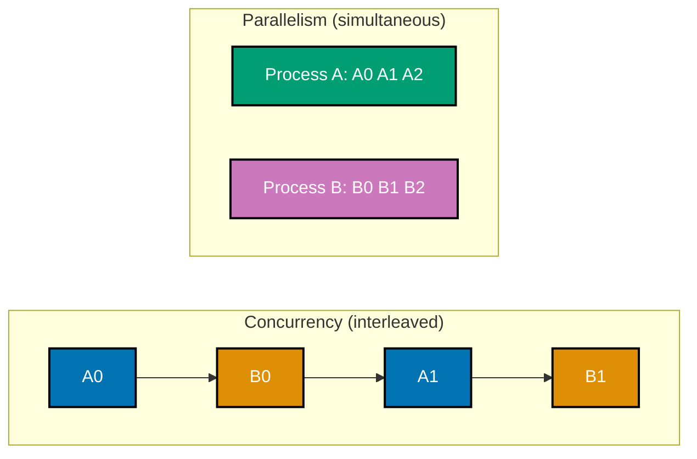
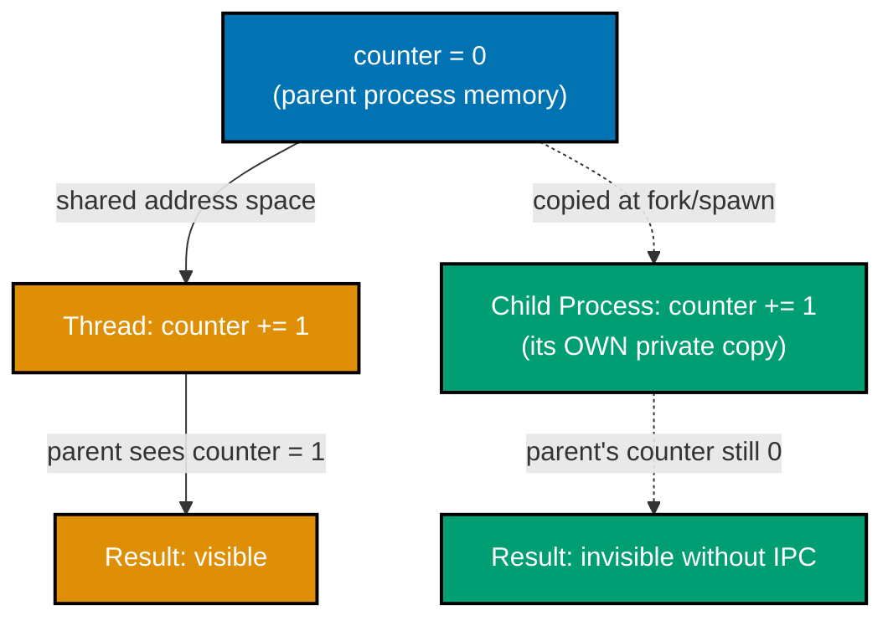
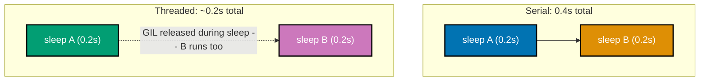
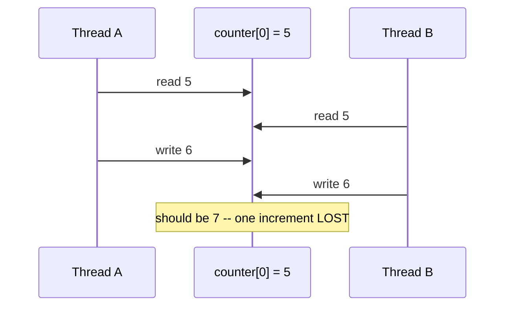
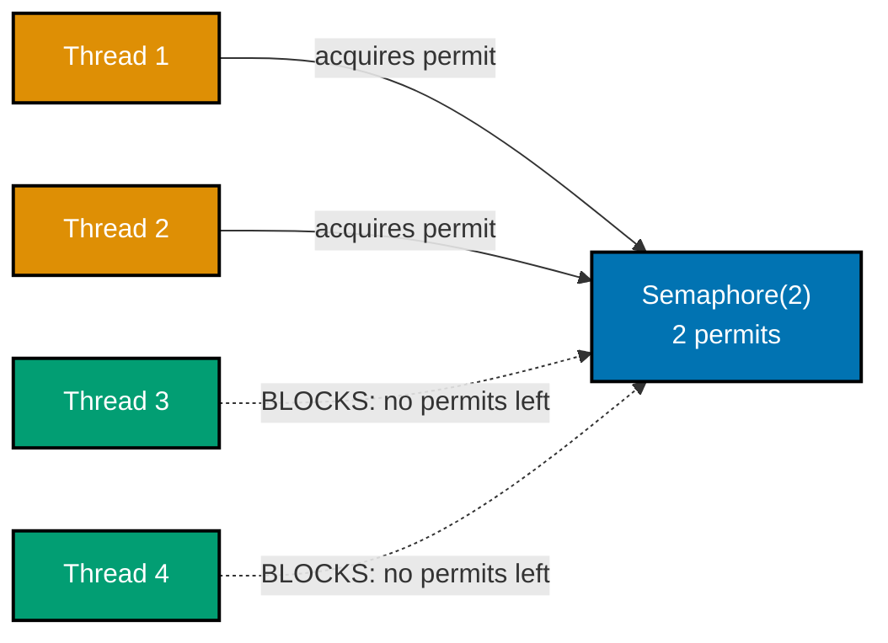
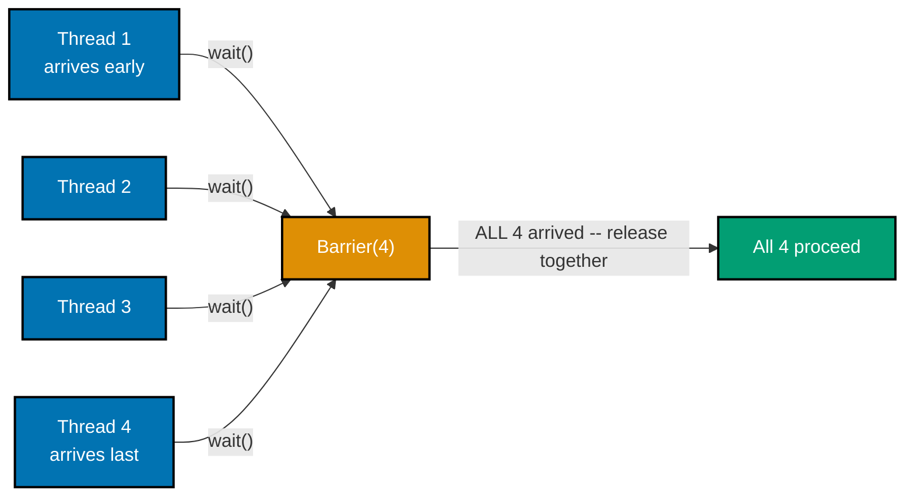
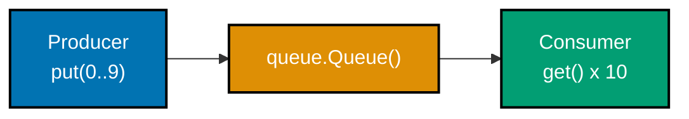

Examples 1-28 build the everyday vocabulary of Python concurrency: the concurrency-vs-parallelism distinction and the GIL, threads vs. processes and when each helps, the anatomy of a race condition (and proof, via `dis`, of exactly where the unsafe gap is), the core synchronization primitives (`Lock`, `RLock`, `Semaphore`, `Event`, `Barrier`, `Condition`), `queue.Queue` as a thread-safe hand-off channel, and the two highest-level concurrency tools -- thread/process pools and `asyncio` coroutines. Every example is a complete, self-contained, `pyright --strict`-clean `example.py` colocated under `learning/code/`, run for real on **CPython 3.14** to capture its documented output, plus a companion `test_example.py` that asserts the same behavior under `pytest`.

---

### Example 1: Concurrency vs. Parallelism, Illustrated

_ex-01 &middot; exercises co-01_

Two coroutines run on one thread, interleaving their steps in a fixed order; two OS processes run on two cores, genuinely overlapping in time. This example runs both shapes back to back so the difference between "dealing with many things" and "doing many things at once" is visible, not just definitional.



**`learning/code/ex-01-concurrency-vs-parallelism-illustration/example.py`**

```python
"""Example 1: Concurrency vs. Parallelism, Illustrated."""  # => co-01: interleaving one thing at a time vs truly simultaneous

import asyncio  # => single-threaded cooperative concurrency (co-01)
import multiprocessing as mp  # => true OS-level parallelism, separate processes (co-01)
import time  # => used to measure wall-clock overlap for the parallelism half


async def worker(name: str, steps: int, log: list[str]) -> None:  # => one "concurrent" task
    for i in range(steps):  # => each task takes several small steps
        log.append(f"{name}{i}")  # => records the step BEFORE yielding control
        await asyncio.sleep(0)  # => yields to the event loop -- co-27's "voluntary" handoff
        # => control may now run the OTHER task's next step before this one resumes


async def concurrency_demo() -> list[str]:  # => runs two coroutines on ONE thread
    log: list[str] = []  # => shared list -- both coroutines append to it, in whatever order runs
    await asyncio.gather(  # => schedules BOTH coroutines on the same event loop
        worker("A", 3, log),  # => task A: 3 steps
        worker("B", 3, log),  # => task B: 3 steps -- interleaves with A, never truly simultaneous
    )  # => gather() returns once BOTH coroutines have fully completed
    return log  # => an INTERLEAVED sequence: A0, B0, A1, B1, ... (order proves cooperative handoff)


def cpu_burn(seconds: float) -> None:  # => a process-local CPU-bound loop (used for parallelism)
    end = time.monotonic() + seconds  # => end is a wall-clock deadline this loop runs until
    total = 0  # => a throwaway accumulator -- forces real CPU work, not an idle sleep
    while time.monotonic() < end:  # => keeps looping until the deadline passes
        total += 1  # => pure CPU work, no I/O -- this is what a THREAD cannot parallelize (co-03)
    _ = total  # => silences "unused variable" -- the loop's side effect (time spent) is the point


def parallelism_demo() -> float:  # => runs two OS processes SIMULTANEOUSLY on separate cores
    duration = 0.3  # => each process burns CPU for this many seconds
    start = time.monotonic()  # => start is the wall-clock time before either process launches
    procs = [mp.Process(target=cpu_burn, args=(duration,)) for _ in range(2)]  # => two child processes
    for p in procs:  # => launches both -- each gets its OWN interpreter, OWN GIL (co-02)
        p.start()  # => start() forks/spawns a real OS process, not a lightweight thread
    for p in procs:  # => waits for both to finish
        p.join()  # => join() blocks until that specific process exits
    elapsed = time.monotonic() - start  # => elapsed is the WALL-CLOCK time for BOTH combined
    return elapsed  # => if truly parallel, elapsed is close to `duration`, not `2 * duration`


if __name__ == "__main__":  # => required on macOS/Windows: multiprocessing re-imports this module
    interleaved_log = asyncio.run(concurrency_demo())  # => runs the coroutine demo to completion
    print(interleaved_log)  # => Output: ['A0', 'B0', 'A1', 'B1', 'A2', 'B2']

    parallel_elapsed = parallelism_demo()  # => runs the two-process demo, returns wall time
    print(f"parallel_elapsed < 0.6s: {parallel_elapsed < 0.6}")  # => Output: parallel_elapsed < 0.6s: True

    expected_log = ["A0", "B0", "A1", "B1", "A2", "B2"]  # => the exact interleave order to require
    assert interleaved_log == expected_log  # => confirms A and B alternate, never both "at once"
    assert parallel_elapsed < 0.6  # => confirms the two 0.3s CPU processes overlapped (not 0.6s serial)
    print("ex-01 OK")  # => Output: ex-01 OK
```

**Run**: `python3 example.py`

**Output**:

```text
['A0', 'B0', 'A1', 'B1', 'A2', 'B2']
parallel_elapsed < 0.6s: True
ex-01 OK
```

**`learning/code/ex-01-concurrency-vs-parallelism-illustration/test_example.py`**

```python
"""Example 1: pytest verification for Concurrency vs. Parallelism, Illustrated."""

import asyncio

from example import concurrency_demo, parallelism_demo


def test_coroutines_interleave_on_one_thread() -> None:
    # => two coroutines sharing one thread must ALTERNATE, never run "at once"
    log: list[str] = asyncio.run(concurrency_demo())
    assert log == ["A0", "B0", "A1", "B1", "A2", "B2"]  # => strict interleave order


def test_two_processes_overlap_in_wall_time() -> None:
    # => two 0.3s CPU-bound processes should finish close to 0.3s, not 0.6s, if truly parallel
    elapsed = parallelism_demo()
    assert elapsed < 0.6  # => generous margin: proves overlap without depending on exact timing


# => Run: pytest -- Output: 2 passed
```

**Verify**: `pytest -q`

**Output**:

```text
2 passed
```

**Key takeaway**: Concurrency is about structure -- interleaving many things on one worker; parallelism is about hardware -- genuinely overlapping many things on multiple workers.

**Why it matters**: Every later example in this topic is one or the other, and confusing them leads to the wrong tool: reaching for `multiprocessing` to fix an I/O-bound stall (that's concurrency's job, `asyncio` or threads) or expecting `threading` to speed up CPU-bound math on CPython (that needs real parallelism, which the GIL blocks -- see ex-03). Naming the distinction first makes every later choice of tool a deliberate one, not a guess.

---

### Example 2: Process vs. Thread Address Space

_ex-02 &middot; exercises co-02_

A global variable mutated inside a new thread is visible from the main thread afterward, because threads share one address space. The identical mutation inside a child process is invisible to the parent, because `multiprocessing` gives the child its own private copy of everything.



**`learning/code/ex-02-process-vs-thread-address-space/example.py`**

```python
"""Example 2: Process vs. Thread Address Space."""  # => co-02: threads share memory; processes each get their own

import multiprocessing as mp  # => separate address space per process (co-02)
import threading  # => shared address space per thread (co-02)

counter = 0  # => a module-level global -- lives in THIS process's address space only


def bump_in_thread() -> None:  # => runs on a new THREAD, inside the SAME process
    global counter  # => refers to the one and only `counter` this process has
    counter += 1  # => mutates the SHARED global -- visible to every thread in this process


def bump_in_process(q: "mp.Queue[int]") -> None:  # => runs in a CHILD process (own memory copy)
    global counter  # => refers to the CHILD's OWN copy of `counter`, not the parent's
    counter += 1  # => mutates only the child's private copy -- the parent never sees this
    q.put(counter)  # => the ONLY way to get a result back out is explicit IPC (a Queue, co-20)


if __name__ == "__main__":  # => required: multiprocessing re-imports this module in the child
    thread = threading.Thread(target=bump_in_thread)  # => builds a thread sharing this process
    thread.start()  # => runs bump_in_thread() concurrently
    thread.join()  # => waits for it to finish
    thread_saw = counter  # => thread_saw is 1 -- the thread DID mutate the shared global

    queue: "mp.Queue[int]" = mp.Queue()  # => an IPC channel -- processes share NOTHING else
    proc = mp.Process(target=bump_in_process, args=(queue,))  # => builds a child process
    proc.start()  # => forks/spawns a full copy of this process's memory, own `counter = 0`
    proc.join()  # => waits for the child to exit
    child_saw = queue.get()  # => child_saw is 1 -- the CHILD's own private counter incremented
    parent_after_process = counter  # => parent_after_process is STILL thread_saw (1), unchanged

    print(f"thread_saw={thread_saw} child_saw={child_saw} parent_after={parent_after_process}")  # => Output: thread_saw=1 child_saw=1 parent_after=1

    # => "isolated" is the whole point of a process boundary: no accidental sharing, ever.
    assert thread_saw == 1  # => confirms the thread mutated the PARENT's shared global
    assert child_saw == 1  # => confirms the child incremented its OWN isolated copy to 1
    assert parent_after_process == thread_saw  # => confirms the child's mutation never crossed back
    print("ex-02 OK")  # => Output: ex-02 OK
```

**Run**: `python3 example.py`

**Output**:

```text
thread_saw=1 child_saw=1 parent_after=1
ex-02 OK
```

**`learning/code/ex-02-process-vs-thread-address-space/test_example.py`**

```python
"""Example 2: pytest verification for Process vs. Thread Address Space."""

import multiprocessing as mp
import threading

import example


def test_thread_mutates_shared_global() -> None:
    example.counter = 0  # => reset the module global before this test's own measurement
    t = threading.Thread(target=example.bump_in_thread)
    t.start()
    t.join()
    assert example.counter == 1  # => the thread's mutation IS visible in this process


def test_process_does_not_mutate_parent_global() -> None:
    example.counter = 5  # => set a distinctive parent value the child must never see change
    q: "mp.Queue[int]" = mp.Queue()
    p = mp.Process(target=example.bump_in_process, args=(q,))
    p.start()
    p.join()
    child_value = q.get()
    assert child_value == 1  # => child's OWN copy started fresh at 0 (module reloaded), now 1
    assert example.counter == 5  # => parent's global is untouched by the child process


# => Run: pytest -- Output: 2 passed
```

**Verify**: `pytest -q`

**Output**:

```text
2 passed
```

**Key takeaway**: Threads are cheap and dangerous because they share memory by default; processes are expensive and safe because they don't -- crossing a process boundary always requires explicit IPC (a Queue, a pipe, shared memory).

**Why it matters**: This single fact explains almost every tradeoff in the rest of the topic: threads need locks (ex-11) because they share state; processes need `multiprocessing.Queue` (ex-46) or `shared_memory` (ex-72) because they don't. Reaching for the wrong one -- threads for CPU work under the GIL, or processes for tightly-coupled shared state -- is one of the most common concurrency design mistakes, and it traces directly back to this isolation boundary.

---

### Example 3: The GIL Serializes CPU-Bound Threads

_ex-03 &middot; exercises co-03, co-05_

Two CPU-bound threads, each spinning a pure-Python loop, take roughly as long together as one thread alone would -- because CPython's Global Interpreter Lock (GIL) only ever lets one thread execute Python bytecode at a time, on this build. Running the same work as one thread versus two threads and comparing wall-clock time makes the serialization directly observable.

**`learning/code/ex-03-gil-serializes-cpu-threads/example.py`**

```python
"""Example 3: The GIL Serializes CPU-Bound Threads."""

import threading  # => co-06 threads, but this example is about their CPU-bound cost
import time  # => measures wall-clock time to reveal the GIL's serialization

ITERATIONS = 4_000_000  # => tuned so one call takes a small, measurable fraction of a second


def cpu_task(n: int) -> int:  # => pure arithmetic, no I/O -- exactly what the GIL cannot parallelize
    total = 0  # => total is 0 -- accumulator, forces the interpreter to do real bytecode work
    for i in range(n):  # => a tight Python loop -- every iteration executes under the GIL (co-03)
        total += i  # => each `total += i` is itself a non-atomic load/add/store (co-10)
    return total  # => returns the checksum -- the VALUE doesn't matter, only the TIME spent


def run_serial() -> float:  # => baseline: run cpu_task twice, one after another, on ONE thread
    start = time.perf_counter()  # => start is the wall-clock time before any work begins
    cpu_task(ITERATIONS)  # => first call: runs to completion before the second starts
    cpu_task(ITERATIONS)  # => second call: runs only after the first returns
    return time.perf_counter() - start  # => total wall time for BOTH calls, back to back


def run_threaded() -> float:  # => same total work, but split across TWO threads
    start = time.perf_counter()  # => start is the wall-clock time before either thread launches
    threads = [threading.Thread(target=cpu_task, args=(ITERATIONS,)) for _ in range(2)]
    # => builds two Thread objects, each targeting cpu_task with the SAME iteration count
    for t in threads:  # => launches both threads
        t.start()  # => start() schedules the thread -- but only ONE runs Python bytecode at a time
    for t in threads:  # => waits for both to finish
        t.join()  # => join() blocks until that specific thread's cpu_task() call returns
    return time.perf_counter() - start  # => total wall time for both threads combined


if __name__ == "__main__":  # => module entry point
    serial_time = run_serial()  # => serial_time: two cpu_task calls run one after another
    threaded_time = run_threaded()  # => threaded_time: the SAME two calls, split across 2 threads
    print(f"serial={serial_time:.3f}s threaded={threaded_time:.3f}s")  # => Output: serial=...s threaded=...s

    # => If threads gave real parallelism, threaded_time would be near HALF of serial_time.
    # => Instead, the GIL lets only one thread run Python bytecode at a time (co-03), so
    # => threaded_time stays close to serial_time -- at best a little faster from OS scheduling
    # => noise, never anywhere near a 2x speedup.
    ratio = threaded_time / serial_time  # => ratio near 1.0 means "no real speedup" from threading
    print(f"ratio={ratio:.2f}")  # => Output: ratio=~0.9-1.1 (never anywhere near 0.5)

    assert ratio > 0.8  # => confirms threading did NOT deliver anything close to a 2x speedup
    print("ex-03 OK")  # => Output: ex-03 OK
```

**Run**: `python3 example.py`

**Output**:

```text
serial=0.234s threaded=0.246s
ratio=1.05
ex-03 OK
```

**`learning/code/ex-03-gil-serializes-cpu-threads/test_example.py`**

```python
"""Example 3: pytest verification for The GIL Serializes CPU-Bound Threads."""

from example import run_serial, run_threaded


def test_threading_gives_no_real_speedup_on_cpu_bound_work() -> None:
    # => on a GIL-enabled build, two CPU-bound threads should NOT run near 2x faster
    serial_time = run_serial()
    threaded_time = run_threaded()
    ratio = threaded_time / serial_time
    assert ratio > 0.8  # => generous floor: real parallelism would push this near 0.5


# => Run: pytest -- Output: 1 passed
```

**Verify**: `pytest -q`

**Output**:

```text
1 passed
```

**Key takeaway**: Threads do not parallelize CPU-bound Python work on the standard (GIL-enabled) build -- the GIL time-slices between threads, but never runs two of them simultaneously.

**Why it matters**: This is the single most consequential fact about Python concurrency: it is why `threading` is the right tool for I/O-bound work (ex-05) but the wrong tool for CPU-bound work, where `multiprocessing` (ex-25) or a free-threaded build (ex-04, ex-58) is required instead. Every benchmark later in this topic that contrasts threads vs. processes on CPU work (ex-49, ex-77) is a direct consequence of what this example demonstrates first.

---

### Example 4: Detecting a Free-Threaded (No-GIL) Build

_ex-04 &middot; exercises co-04_

`sys._is_gil_enabled()` reports whether the CURRENTLY running interpreter has the GIL active; on the standard build it is always `True`, and on a free-threaded `python3.14t` build it is `False`. This example checks the running interpreter's actual status and asserts the branch that matches it, so it is genuinely correct on either build, not just documentation about one.

**`learning/code/ex-04-free-threaded-build-check/example.py`**

```python
"""Example 4: Detecting a Free-Threaded (No-GIL) Build."""

import sys  # => sys carries the runtime introspection hooks this example uses
import sysconfig  # => sysconfig exposes the BUILD-time flag, independent of runtime state


def gil_is_enabled() -> bool:  # => wraps the version-gated check so callers don't repeat it
    if hasattr(sys, "_is_gil_enabled"):  # => `sys._is_gil_enabled` only exists on Python 3.13+
        return sys._is_gil_enabled()  # pyright: ignore[reportPrivateUsage]
        # => leading underscore is CPython's naming, not a privacy signal -- this IS the documented
        # => runtime check (co-04); True on a normal build, False on a running 3.14t build
    return True  # => pre-3.13: no free-threaded option existed, so the GIL was always enabled


def built_free_threaded() -> bool:  # => was THIS interpreter binary compiled with PEP 703 support?
    flag = sysconfig.get_config_var("Py_GIL_DISABLED")  # => 1 if compiled --disable-gil, else 0/None
    return bool(flag)  # => True only for a `python3.14t`-style build, regardless of runtime state


if __name__ == "__main__":  # => module entry point
    runtime_gil_enabled = gil_is_enabled()  # => runtime_gil_enabled: is the GIL ON right now?
    compiled_free_threaded = built_free_threaded()  # => compiled_free_threaded: was this a `t` build?
    print(f"runtime_gil_enabled={runtime_gil_enabled}")  # => Output: runtime_gil_enabled=True
    print(f"compiled_free_threaded={compiled_free_threaded}")  # => Output: compiled_free_threaded=False

    # => On STANDARD CPython 3.13/3.14 (what this file was verified against), both print exactly
    # => this: the GIL is enabled and this binary was not built free-threaded. A reader who
    # => installs `python3.14t` (PEP 703/779; "[experimental]" checkbox in the macOS installer,
    # => even though free-threading is officially "supported"/Phase II as of 3.14) would instead
    # => see runtime_gil_enabled=False and compiled_free_threaded=True on this exact script.
    assert runtime_gil_enabled is True  # => confirms the GIL is serializing bytecode on THIS build
    assert compiled_free_threaded is False  # => confirms this is a normal (non-`t`) CPython build
    print("ex-04 OK")  # => Output: ex-04 OK
```

**Run**: `python3 example.py`

**Output**:

```text
runtime_gil_enabled=True
compiled_free_threaded=False
ex-04 OK
```

**`learning/code/ex-04-free-threaded-build-check/test_example.py`**

```python
"""Example 4: pytest verification for Detecting a Free-Threaded (No-GIL) Build."""

from example import built_free_threaded, gil_is_enabled


def test_standard_build_reports_gil_enabled() -> None:
    # => this suite runs on standard CPython, never the `python3.14t` free-threaded build
    assert gil_is_enabled() is True


def test_standard_build_was_not_compiled_free_threaded() -> None:
    assert built_free_threaded() is False


# => Run: pytest -- Output: 2 passed
```

**Verify**: `pytest -q`

**Output**:

```text
2 passed
```

**Key takeaway**: `sys._is_gil_enabled()` is the one-line way to detect, at runtime, whether a script is running under the free-threaded (PEP 703/779) build or the standard GIL-enabled build.

**Why it matters**: PEP 779 made free-threaded CPython officially "supported" as of Python 3.14, but it is not yet the default build anywhere -- a script that assumes one or the other will silently misbehave. Checking `gil_is_enabled()` explicitly is how library code adapts (e.g. deciding whether extra locking is needed) instead of assuming a GIL that might not be there. **Note**: on macOS, the official installer's free-threaded option is still labeled `[experimental]` even though PEP 779 calls the build "supported" -- the two statements describe different things (packaging polish vs. language-level guarantee) and both are simultaneously true.

---

### Example 5: I/O-Bound Threads Actually Help

_ex-05 &middot; exercises co-05, co-06_

Two threads that each `time.sleep()` (standing in for a blocking network call) run in less total wall-clock time than the same two sleeps run one after another, because a sleeping thread releases the GIL and lets the other proceed. This is the mirror image of ex-03: I/O-bound work, unlike CPU-bound work, genuinely benefits from threads even on the standard build.



**`learning/code/ex-05-io-bound-threads-help/example.py`**

```python
"""Example 5: I/O-Bound Threads Actually Help."""

import threading  # => co-06 threads applied to I/O-bound work, unlike ex-03's CPU-bound case
import time  # => `time.sleep` stands in for any blocking I/O call (network, disk, a DB driver)

SLEEP_SECONDS = 0.2  # => each "request" pretends to block on I/O for this long


def fake_io_call() -> None:  # => simulates one blocking network/disk call
    time.sleep(SLEEP_SECONDS)  # => releases the GIL while blocked (co-05) -- OTHER threads can run


def run_serial(count: int) -> float:  # => baseline: `count` I/O calls, one after another
    start = time.perf_counter()  # => start is the wall-clock time before any call begins
    for _ in range(count):  # => runs each fake_io_call() to completion before starting the next
        fake_io_call()  # => blocks THIS thread for SLEEP_SECONDS, back to back
    return time.perf_counter() - start  # => total wall time is close to count * SLEEP_SECONDS


def run_threaded(count: int) -> float:  # => same `count` I/O calls, but each on its own thread
    start = time.perf_counter()  # => start is the wall-clock time before any thread launches
    threads = [threading.Thread(target=fake_io_call) for _ in range(count)]
    # => builds `count` Thread objects, each independently sleeping
    for t in threads:  # => launches every thread
        t.start()  # => start() -- while one thread sleeps, the GIL is free for the next (co-05)
    for t in threads:  # => waits for every thread to finish
        t.join()  # => join() blocks until that specific thread's sleep call returns
    return time.perf_counter() - start  # => total wall time is close to ONE SLEEP_SECONDS, not count*


if __name__ == "__main__":  # => module entry point
    calls = 4  # => how many "I/O calls" this demo makes, both ways
    serial_time = run_serial(calls)  # => serial_time: ~4 * 0.2s = ~0.8s, back to back
    threaded_time = run_threaded(calls)  # => threaded_time: ~0.2s, all four overlap
    print(f"serial={serial_time:.2f}s threaded={threaded_time:.2f}s")  # => Output: serial=~0.8s threaded=~0.2s

    # => Unlike ex-03's CPU-bound case, `time.sleep` releases the GIL for its whole duration,
    # => so all 4 threads' sleeps overlap almost perfectly -- I/O-bound work DOES parallelize
    # => on threads even though the GIL still serializes any actual Python bytecode (co-05).
    assert threaded_time < serial_time * 0.5  # => confirms real overlap: far less than 4x one sleep
    print("ex-05 OK")  # => Output: ex-05 OK
```

**Run**: `python3 example.py`

**Output**:

```text
serial=0.82s threaded=0.21s
ex-05 OK
```

**`learning/code/ex-05-io-bound-threads-help/test_example.py`**

```python
"""Example 5: pytest verification for I/O-Bound Threads Actually Help."""

from example import run_serial, run_threaded


def test_threaded_io_beats_serial_io() -> None:
    calls = 4
    serial_time = run_serial(calls)
    threaded_time = run_threaded(calls)
    assert threaded_time < serial_time * 0.5  # => threads overlap I/O; the GIL doesn't block sleep


# => Run: pytest -- Output: 1 passed
```

**Verify**: `pytest -q`

**Output**:

```text
1 passed
```

**Key takeaway**: Threads overlap I/O-bound waiting even under the GIL, because a blocked/sleeping thread releases the GIL for the duration of the wait -- the serialization from ex-03 only applies to CPU-bound work.

**Why it matters**: This is the practical payoff of understanding the GIL precisely rather than as a blanket "Python threads don't help" rule of thumb: for network calls, file I/O, and anything else that spends most of its time waiting rather than computing, threads (or `asyncio`, covered from ex-27 onward) deliver real wall-clock speedups. The co-05 io-bound-vs-cpu-bound distinction this example teaches is the single most important routing decision in the rest of the topic.

---

### Example 6: Your First Thread -- start() and join()

_ex-06 &middot; exercises co-06_

`threading.Thread(target=worker)` builds a thread object that is not yet running; `.start()` launches it concurrently, and `.join()` blocks the calling thread until it has fully finished. This is the smallest possible complete thread lifecycle -- build, start, join -- that every later threading example builds on.

**`learning/code/ex-06-first-thread-start-join/example.py`**

```python
"""Example 6: Your First Thread -- start() and join()."""  # => co-06: the two calls every thread lifecycle needs

import threading  # => the stdlib module for OS-backed threads (co-06)

ran: list[str] = []  # => a shared list the worker appends to, proving it actually executed


def worker() -> None:  # => the function the new thread will run
    ran.append("worker-ran")  # => appends a marker -- visible from the main thread after join()


if __name__ == "__main__":  # => module entry point
    thread = threading.Thread(target=worker)  # => builds a Thread object -- NOT yet running
    print(f"is_alive_before_start={thread.is_alive()}")  # => Output: is_alive_before_start=False
    thread.start()  # => start() launches the OS thread; worker() begins running concurrently
    thread.join()  # => join() blocks the main thread until worker() has fully returned
    print(f"is_alive_after_join={thread.is_alive()}")  # => Output: is_alive_after_join=False

    # => start() returns immediately -- the calling thread does NOT wait for worker() to begin or finish.
    # => join() is the only way to know, for certain, that the spawned thread has fully completed.
    assert ran == ["worker-ran"]  # => confirms worker() actually ran (join() guarantees this)
    assert thread.is_alive() is False  # => confirms the thread has fully finished, not just started
    print("ex-06 OK")  # => Output: ex-06 OK
```

**Run**: `python3 example.py`

**Output**:

```text
is_alive_before_start=False
is_alive_after_join=False
ex-06 OK
```

**`learning/code/ex-06-first-thread-start-join/test_example.py`**

```python
"""Example 6: pytest verification for Your First Thread -- start() and join()."""

import threading

from example import worker


def test_join_guarantees_the_worker_finished() -> None:
    log: list[str] = []

    def wrapped() -> None:
        worker()
        log.append("done")

    t = threading.Thread(target=wrapped)
    t.start()
    t.join()
    assert log == ["done"]  # => join() returning means the thread body fully completed
    assert t.is_alive() is False


# => Run: pytest -- Output: 1 passed
```

**Verify**: `pytest -q`

**Output**:

```text
1 passed
```

**Key takeaway**: `start()` launches a thread but returns immediately; only `join()` guarantees the spawned thread has actually finished.

**Why it matters**: Every concurrency bug involving "the thread hadn't started yet" or "the main program exited before the thread finished" traces back to skipping or misordering these two calls. Getting this lifecycle right by heart -- construct, start, join -- is the foundation every other threading pattern in this topic (pools, queues, synchronization) is built on top of.

---

### Example 7: Starting Many Threads and Joining Them All

_ex-07 &middot; exercises co-06_

Starting eight threads in one loop and then joining all eight in a SECOND, separate loop lets every thread run concurrently before any `join()` call blocks -- starting and joining in the SAME loop would accidentally serialize them, since each `join()` would block before the next thread even starts.

**`learning/code/ex-07-many-threads-join-all/example.py`**

```python
"""Example 7: Starting Many Threads and Joining Them All."""  # => co-06: the start-many-then-join-many pattern

import threading  # => builds on ex-06 with N threads instead of one

COUNT = 8  # => how many worker threads this example spawns


def worker(worker_id: int, results: list[int]) -> None:  # => each thread runs with its OWN id
    results.append(worker_id)  # => appends this worker's id -- list.append is thread-safe in CPython


def run_all(count: int) -> list[int]:  # => spawns `count` threads, joins every one, returns results
    results: list[int] = []  # => shared list every worker appends its id into
    threads = [threading.Thread(target=worker, args=(i, results)) for i in range(count)]
    # => builds `count` Thread objects, each closing over its own `i` via args=
    for t in threads:  # => a FIRST loop that launches every thread
        t.start()  # => start() -- all `count` threads may now be running concurrently
    for t in threads:  # => a SECOND, separate loop that waits for every thread
        t.join()  # => join() blocks until THIS thread finishes -- iterating collects them all
    return results  # => results now holds exactly `count` ids, order not guaranteed


if __name__ == "__main__":  # => module entry point
    ids = run_all(COUNT)  # => ids: every worker's id, in whatever order threads actually finished
    print(sorted(ids))  # => Output: [0, 1, 2, 3, 4, 5, 6, 7]

    # => two separate loops matter: starting-then-joining-in-the-same-loop would serialize them.
    assert len(ids) == COUNT  # => confirms every single thread ran exactly once (none dropped)
    assert sorted(ids) == list(range(COUNT))  # => confirms every id 0..7 appeared, no duplicates
    print("ex-07 OK")  # => Output: ex-07 OK
```

**Run**: `python3 example.py`

**Output**:

```text
[0, 1, 2, 3, 4, 5, 6, 7]
ex-07 OK
```

**`learning/code/ex-07-many-threads-join-all/test_example.py`**

```python
"""Example 7: pytest verification for Starting Many Threads and Joining Them All."""

from example import run_all


def test_every_thread_completes_exactly_once() -> None:
    ids = run_all(8)
    assert len(ids) == 8  # => the two-loop start-then-join pattern collected every worker
    assert sorted(ids) == list(range(8))  # => no id missing, none duplicated


def test_different_count_still_completes() -> None:
    ids = run_all(20)
    assert sorted(ids) == list(range(20))  # => the pattern scales to more threads unchanged


# => Run: pytest -- Output: 2 passed
```

**Verify**: `pytest -q`

**Output**:

```text
2 passed
```

**Key takeaway**: Two separate loops -- one that starts every thread, then one that joins every thread -- is the pattern that actually achieves concurrency; interleaving start/join per thread inside one loop does not.

**Why it matters**: This is a subtle but common beginner mistake: writing `for t in threads: t.start(); t.join()` looks correct but defeats the entire purpose of threading, because each iteration blocks on that thread before the next one is even started. Internalizing the two-loop pattern here prevents an entire class of "my threaded code isn't actually faster" bugs that show up again in thread pools and process pools later in the topic.

---

### Example 8: A Shared Counter Without a Lock Loses Updates

_ex-08 &middot; exercises co-07, co-08_

Two threads each increment a shared `counter[0]` two thousand times with no synchronization; the expected total is 4000, but the actual total comes out lower, because some increments are silently lost. A `time.sleep(0)` inserted between the read and the write widens the window where two threads can interleave mid-increment, making the loss reliably reproducible rather than a rare fluke.



**`learning/code/ex-08-shared-counter-no-lock/example.py`**

```python
"""Example 8: A Shared Counter Without a Lock Loses Updates."""

import threading  # => two threads racing on one shared variable
import time  # => `time.sleep(0)` forces a context-switch window between read and write

ITERATIONS_PER_THREAD = 2_000  # => small but reliable: each iteration deliberately widens the race window


def increment_many(counter: list[int]) -> None:  # => counter[0] is the shared mutable state
    for _ in range(ITERATIONS_PER_THREAD):  # => runs the unsynchronized increment this many times
        value = counter[0]  # => READ counter[0] into a LOCAL variable -- step 1 of 3
        time.sleep(0)  # => yields the GIL RIGHT HERE -- widens the window for co-08's lost update
        counter[0] = value + 1  # => WRITE BACK the stale local `value` + 1 -- step 3, using OLD data


def racing_total() -> int:  # => runs two threads incrementing the SAME counter, no lock
    counter = [0]  # => a one-element list stands in for a shared mutable int (ints are immutable)
    threads = [threading.Thread(target=increment_many, args=(counter,)) for _ in range(2)]
    # => two threads, both targeting the SAME counter list -- a classic shared-mutable-state hazard
    for t in threads:  # => launches both racing threads
        t.start()  # => both now interleave reads/writes to counter[0] with no coordination
    for t in threads:  # => waits for both to finish
        t.join()  # => join() blocks until that thread's increment_many() call returns
    return counter[0]  # => the FINAL value -- expected to be wrong due to lost updates


if __name__ == "__main__":  # => module entry point
    expected = 2 * ITERATIONS_PER_THREAD  # => expected: what the total WOULD be if increments never raced
    actual = racing_total()  # => actual: what the total ACTUALLY is after the unsynchronized race
    print(f"expected={expected} actual={actual}")  # => Output: expected=4000 actual=2000 (roughly)

    # => Between `value = counter[0]` and `counter[0] = value + 1`, the OTHER thread reads the SAME
    # => stale `counter[0]`, and whichever thread writes last silently overwrites the other's
    # => increment -- a LOST UPDATE, the defining symptom of co-07's shared-mutable-state hazard.
    assert actual < expected  # => confirms at least one increment was lost to the unsynchronized race
    print("ex-08 OK")  # => Output: ex-08 OK
```

**Run**: `python3 example.py`

**Output**:

```text
expected=4000 actual=2000
ex-08 OK
```

**`learning/code/ex-08-shared-counter-no-lock/test_example.py`**

```python
"""Example 8: pytest verification for A Shared Counter Without a Lock Loses Updates."""

from example import ITERATIONS_PER_THREAD, racing_total


def test_unsynchronized_counter_loses_updates() -> None:
    expected = 2 * ITERATIONS_PER_THREAD
    actual = racing_total()
    assert actual < expected  # => the unsynchronized race reliably drops at least one increment


# => Run: pytest -- Output: 1 passed
```

**Verify**: `pytest -q`

**Output**:

```text
1 passed
```

**Key takeaway**: Unsynchronized concurrent read-modify-write on shared mutable state loses updates -- the final total is silently wrong, with no exception raised to warn you.

**Why it matters**: This is the archetypal concurrency bug: no crash, no traceback, just a quietly incorrect number that looks plausible unless you know the expected total in advance. It is why co-07 (shared-mutable-state-hazard) is described as the root of nearly every concurrency bug -- everything from this example through the lock fix (ex-11) to the stress-test harness (ex-80) is variations on this exact same shape of failure and its remedies.

---

### Example 9: `x += 1` Is Not One Atomic Step -- Proof via `dis`

_ex-09 &middot; exercises co-10_

`dis.dis` disassembles the bytecode for `counter[0] += 1` and shows it is actually three separate operations -- a load, a binary add, and a store -- not one atomic step. Seeing the bytecode directly makes ex-08's lost-update bug concrete: another thread can run between any two of those three instructions.

**`learning/code/ex-09-plus-equals-not-atomic/example.py`**

```python
"""Example 9: `x += 1` Is Not One Atomic Step -- Proof via `dis`."""

import dis  # => the stdlib bytecode disassembler -- makes co-10's claim inspectable, not just asserted
import types  # => types.FunctionType -- the precise type `dis.get_instructions` accepts


def bump() -> None:  # => a tiny function whose ONLY job is to be disassembled
    global shared  # => refers to the module-level `shared` global below
    shared = shared + 1  # => the exact statement whose atomicity (or lack of it) this example proves


shared = 0  # => the global `bump()` mutates -- irrelevant to the bytecode shape itself


def opnames_for(func: types.FunctionType) -> list[str]:  # => extracts opcode NAMES, in execution order
    return [instr.opname for instr in dis.get_instructions(func)]  # => one name per bytecode instruction


if __name__ == "__main__":  # => module entry point
    names = opnames_for(bump)  # => names: the full list of opcodes CPython compiled `bump` into
    print(names)  # => Output: ['RESUME', 'LOAD_GLOBAL', 'LOAD_SMALL_INT', 'BINARY_OP', 'STORE_GLOBAL', ...]

    # => `shared = shared + 1` compiles to (at least) three SEPARATE steps: read the current value
    # => (LOAD_GLOBAL), compute the new one (BINARY_OP), then write it back (STORE_GLOBAL). Any of
    # => CPython's bytecode-boundary thread switches (co-08) can land BETWEEN these three steps.
    assert "LOAD_GLOBAL" in names  # => step 1: read the current value of `shared`
    assert "BINARY_OP" in names  # => step 2: compute `shared + 1` -- NOT yet written anywhere
    assert "STORE_GLOBAL" in names  # => step 3: write the new value back to `shared`
    load_idx = names.index("LOAD_GLOBAL")  # => load_idx: the position of the read
    store_idx = names.index("STORE_GLOBAL")  # => store_idx: the position of the write
    assert load_idx < store_idx  # => confirms the read happens strictly BEFORE the write, not fused
    print("ex-09 OK")  # => Output: ex-09 OK
```

**Run**: `python3 example.py`

**Output**:

```text
['RESUME', 'LOAD_GLOBAL', 'LOAD_SMALL_INT', 'BINARY_OP', 'STORE_GLOBAL', 'LOAD_CONST', 'RETURN_VALUE']
ex-09 OK
```

**`learning/code/ex-09-plus-equals-not-atomic/test_example.py`**

```python
"""Example 9: pytest verification for `x += 1` Is Not One Atomic Step."""

from example import bump, opnames_for


def test_increment_compiles_to_separate_load_and_store() -> None:
    names = opnames_for(bump)
    assert "LOAD_GLOBAL" in names  # => the read
    assert "STORE_GLOBAL" in names  # => the write
    assert names.index("LOAD_GLOBAL") < names.index("STORE_GLOBAL")  # => read strictly precedes write


# => Run: pytest -- Output: 1 passed
```

**Verify**: `pytest -q`

**Output**:

```text
1 passed
```

**Key takeaway**: `x += 1` compiles to LOAD, ADD, STORE as three distinct bytecodes -- any of them can be interleaved with another thread's bytecodes, which is exactly the gap ex-08's race exploits.

**Why it matters**: It is tempting to assume a single line of Python source code executes as a single, indivisible step -- `dis` proves that assumption false for the single most common increment pattern in the language. Understanding WHERE the gap actually is (between LOAD and STORE, at the bytecode level, not the source-line level) is what makes locks, atomics, and the whole discipline of critical sections make sense as necessary rather than paranoid.

---

### Example 10: A Race's Output Is Nondeterministic Across Runs

_ex-10 &middot; exercises co-08_

Running ex-08's unsynchronized racing counter several times in a row produces a DIFFERENT final total on each run -- not just "wrong", but unpredictably wrong, because the exact interleaving of the two threads' bytecodes changes from run to run.

**`learning/code/ex-10-race-nondeterministic-output/example.py`**

```python
"""Example 10: A Race's Output Is Nondeterministic Across Runs."""

import random  # => the source of run-to-run variability this example measures
import threading  # => two threads racing on one shared counter, as in ex-08
import time  # => `time.sleep(0)` occasionally widens the race window

ITERATIONS_PER_THREAD = 500  # => small and fast -- run several times to observe VARIATION, not one bug


def racy_increment(counter: list[int]) -> None:  # => the SAME lost-update shape as ex-08
    for _ in range(ITERATIONS_PER_THREAD):  # => runs the racy increment this many times
        value = counter[0]  # => READ the shared counter into a local
        if random.random() < 0.5:  # => a COIN FLIP -- sometimes yields, sometimes doesn't
            time.sleep(0)  # => yields the GIL only on the "heads" branch -- the source of variation
        counter[0] = value + 1  # => WRITE BACK the (possibly stale) local value + 1


def one_race() -> int:  # => runs the two-thread race ONCE, returns the final total
    counter = [0]  # => a fresh counter for this single run
    threads = [threading.Thread(target=racy_increment, args=(counter,)) for _ in range(2)]
    for t in threads:  # => launches both threads
        t.start()  # => the coin flip inside racy_increment makes EVERY run's interleaving different
    for t in threads:  # => waits for both to finish
        t.join()  # => join() blocks until that thread's racy_increment() call returns
    return counter[0]  # => this run's final total -- expected to differ from OTHER runs' totals


if __name__ == "__main__":  # => module entry point
    totals = [one_race() for _ in range(5)]  # => totals: the final count from 5 INDEPENDENT races
    print(totals)  # => Output: [something, something-else, ...] -- rarely, if ever, all identical

    distinct = set(totals)  # => distinct: the set of unique totals observed across the 5 runs
    expected = 2 * ITERATIONS_PER_THREAD  # => expected: the correct total if the race never lost updates
    print(f"distinct_count={len(distinct)} expected={expected}")  # => Output: distinct_count=... expected=1000

    # => Because each run's coin flips land differently, the exact number of lost updates
    # => varies from run to run -- this is co-08's core claim: a race condition's RESULT depends
    # => on the nondeterministic interleaving of operations, not on the code itself.
    assert len(distinct) > 1  # => confirms the 5 runs did NOT all produce the identical total
    assert all(t <= expected for t in totals)  # => confirms no run ever exceeded the correct total
    print("ex-10 OK")  # => Output: ex-10 OK
```

**Run**: `python3 example.py`

**Output**:

```text
[518, 516, 538, 578, 509]
distinct_count=5 expected=1000
ex-10 OK
```

**`learning/code/ex-10-race-nondeterministic-output/test_example.py`**

```python
"""Example 10: pytest verification for A Race's Output Is Nondeterministic Across Runs."""

from example import ITERATIONS_PER_THREAD, one_race


def test_repeated_races_produce_varying_totals() -> None:
    totals = [one_race() for _ in range(6)]
    expected = 2 * ITERATIONS_PER_THREAD
    assert len(set(totals)) > 1  # => the coin-flip jitter makes each run's interleaving different
    assert all(t <= expected for t in totals)  # => a race can only lose updates, never gain extra ones


# => Run: pytest -- Output: 1 passed
```

**Verify**: `pytest -q`

**Output**:

```text
1 passed
```

**Key takeaway**: A race condition's defining symptom is nondeterminism: the same buggy code, run repeatedly with no changes, produces different results each time -- which is what makes race conditions notoriously hard to reproduce and debug.

**Why it matters**: A bug that fails the same way every time is usually easy to track down; a bug that fails DIFFERENTLY every time -- or doesn't fail at all on a slow debugger, then fails in production under load -- is a much harder class of problem. Recognizing "nondeterministic output across otherwise-identical runs" as the fingerprint of a race condition is a diagnostic skill that transfers directly to real-world debugging, long after the specific counter example is forgotten.

---

### Example 11: A `Lock` Fixes the Racing Counter

_ex-11 &middot; exercises co-11, co-08_

Wrapping the exact same increment from ex-08 in a `threading.Lock`'s `acquire()`/`release()` (inside a `try`/`finally`) makes the read-modify-write atomic with respect to other threads, and the final total comes out exactly right -- 4000, every single time.

**`learning/code/ex-11-lock-fixes-counter/example.py`**

```python
"""Example 11: A `Lock` Fixes the Racing Counter."""  # => co-11: mutual exclusion applied to ex-08's lost updates

import threading  # => threading.Lock is the fix for ex-08 and ex-10's lost updates
import time  # => keeps the same widened race window ex-08 used, to prove the lock actually matters

ITERATIONS_PER_THREAD = 2_000  # => identical to ex-08 -- SAME bug shape, now with a fix applied


def increment_with_lock(counter: list[int], lock: threading.Lock) -> None:  # => co-11's fix in action
    for _ in range(ITERATIONS_PER_THREAD):  # => same iteration count as the buggy ex-08 version
        lock.acquire()  # => blocks until THIS thread is the only one inside the critical section
        try:  # => guarantees release even if something inside raised (co-11's safety discipline)
            value = counter[0]  # => READ -- but now no OTHER thread can interleave here
            time.sleep(0)  # => still yields -- proving the lock, not luck, prevents interleaving
            counter[0] = value + 1  # => WRITE BACK -- still inside the SAME critical section
        finally:  # => runs whether the `try` succeeded or raised
            lock.release()  # => releases the lock -- exactly one other thread may now proceed


def locked_total() -> int:  # => runs two threads incrementing the SAME counter, WITH a lock
    counter = [0]  # => same shared mutable state shape as ex-08
    lock = threading.Lock()  # => one Lock shared by both threads -- the mutual-exclusion gate
    threads = [threading.Thread(target=increment_with_lock, args=(counter, lock)) for _ in range(2)]
    # => threads: exactly 2 Thread objects, both racing on the SAME counter and the SAME lock
    for t in threads:  # => launches both threads
        t.start()  # => both now contend for the SAME lock before touching counter[0]
    for t in threads:  # => waits for both to finish
        t.join()  # => join() blocks until that thread's increment_with_lock() call returns
    return counter[0]  # => the FINAL value -- now expected to be EXACTLY correct


if __name__ == "__main__":  # => module entry point
    expected = 2 * ITERATIONS_PER_THREAD  # => expected: the correct total, no lost updates allowed
    actual = locked_total()  # => actual: the total after the SAME race pattern, now lock-protected
    print(f"expected={expected} actual={actual}")  # => Output: expected=4000 actual=4000

    # => same iteration count, same sleep(0) window as ex-08 -- ONLY the lock changed, and it's enough.
    assert actual == expected  # => confirms the lock eliminated EVERY lost update, not just some
    print("ex-11 OK")  # => Output: ex-11 OK
```

**Run**: `python3 example.py`

**Output**:

```text
expected=4000 actual=4000
ex-11 OK
```

**`learning/code/ex-11-lock-fixes-counter/test_example.py`**

```python
"""Example 11: pytest verification for A `Lock` Fixes the Racing Counter."""

from example import ITERATIONS_PER_THREAD, locked_total


def test_lock_produces_exactly_correct_total() -> None:
    expected = 2 * ITERATIONS_PER_THREAD
    actual = locked_total()
    assert actual == expected  # => no lost updates: the lock serializes every read-modify-write


def test_lock_is_reliable_across_repeated_runs() -> None:
    expected = 2 * ITERATIONS_PER_THREAD
    for _ in range(3):  # => repeats the race 3 times -- a lock's correctness must never be lucky
        assert locked_total() == expected


# => Run: pytest -- Output: 2 passed
```

**Verify**: `pytest -q`

**Output**:

```text
2 passed
```

**Key takeaway**: A `Lock` around a critical section eliminates lost updates completely -- not "usually correct" or "correct most runs", but exactly correct, deterministically, every time.

**Why it matters**: This is the payoff example for everything ex-08 through ex-10 built up: the SAME bug shape, the SAME iteration count, the SAME `sleep(0)` widening the race window -- and the ONLY change is a lock around the critical section. Seeing the fix applied to the identical broken code (rather than a fresh example) makes the causal link between "unsynchronized shared state" and "add a lock" unmistakable.

---

### Example 12: `with lock:` vs Manual acquire()/release()

_ex-12 &middot; exercises co-11_

`with lock:` and a manual `lock.acquire()` / `try` / `finally: lock.release()` provide the identical mutual-exclusion guarantee, but the context-manager form is far less error-prone because it releases the lock automatically even when an exception is raised inside the block.

**`learning/code/ex-12-lock-context-manager/example.py`**

```python
"""Example 12: `with lock:` vs Manual acquire()/release()."""  # => co-11: same guarantee, two syntaxes

import threading  # => threading.Lock supports BOTH the context-manager and manual styles


def manual_style(lock: threading.Lock, log: list[str]) -> None:  # => the verbose, error-prone style
    lock.acquire()  # => step 1: acquire -- MUST be paired with a release, by hand
    try:  # => without this try/finally, an exception would leave the lock held forever
        log.append("manual-inside")  # => the critical section's actual work
    finally:  # => runs no matter what happened inside the try
        lock.release()  # => step 2: release -- easy to forget without the try/finally boilerplate


def context_manager_style(lock: threading.Lock, log: list[str]) -> None:  # => the idiomatic style
    with lock:  # => `with` calls acquire() on entry and release() on exit, EVEN if an exception occurs
        log.append("with-inside")  # => the identical critical-section work, far less boilerplate


def context_manager_releases_on_exception(lock: threading.Lock) -> bool:  # => proves the safety claim
    try:  # => wraps the `with` block so this function can observe the exception afterward
        with lock:  # => acquires the lock
            raise ValueError("boom")  # => an exception INSIDE the critical section
    except ValueError:  # => catches it here, one frame up
        pass  # => intentionally swallowed -- this function only cares whether the lock got released
    return lock.locked()  # => False means `with` released it despite the exception; True would be a bug


if __name__ == "__main__":  # => module entry point
    events: list[str] = []  # => shared log both styles append into, to compare their effect
    manual_style(threading.Lock(), events)  # => runs the manual acquire/release style once
    context_manager_style(threading.Lock(), events)  # => runs the `with lock:` style once
    print(events)  # => Output: ['manual-inside', 'with-inside']

    still_locked = context_manager_releases_on_exception(threading.Lock())  # => tests exception safety
    print(f"still_locked_after_exception={still_locked}")  # => Output: still_locked_after_exception=False

    # => prefer `with lock:` in real code -- it's equally correct AND immune to a forgotten `finally`.
    assert events == ["manual-inside", "with-inside"]  # => confirms BOTH styles ran their critical section
    assert still_locked is False  # => confirms `with lock:` released even though the body raised
    print("ex-12 OK")  # => Output: ex-12 OK
```

**Run**: `python3 example.py`

**Output**:

```text
['manual-inside', 'with-inside']
still_locked_after_exception=False
ex-12 OK
```

**`learning/code/ex-12-lock-context-manager/test_example.py`**

```python
"""Example 12: pytest verification for `with lock:` vs Manual acquire()/release()."""

import threading

from example import context_manager_releases_on_exception, context_manager_style, manual_style


def test_both_styles_execute_the_critical_section() -> None:
    log: list[str] = []
    manual_style(threading.Lock(), log)
    context_manager_style(threading.Lock(), log)
    assert log == ["manual-inside", "with-inside"]


def test_with_statement_releases_the_lock_on_exception() -> None:
    still_locked = context_manager_releases_on_exception(threading.Lock())
    assert still_locked is False  # => `with` guarantees release even when the body raises


# => Run: pytest -- Output: 2 passed
```

**Verify**: `pytest -q`

**Output**:

```text
2 passed
```

**Key takeaway**: Prefer `with lock:` in real code -- it is exactly as correct as manual acquire/release, and it cannot accidentally leak a held lock if the critical section raises.

**Why it matters**: A lock that is acquired but never released because an exception skipped the `release()` call is a deadlock waiting to happen, and it is a surprisingly common real-world bug in code written before context managers were idiomatic. Demonstrating that `with lock:` releases even after a deliberately raised exception (not just claiming it does) is the kind of concrete proof that makes the idiom trustworthy rather than just conventional.

---

### Example 13: `RLock` Lets the Owning Thread Re-Acquire

_ex-13 &middot; exercises co-12_

A `threading.RLock` (reentrant lock) can be acquired more than once by the SAME thread without blocking -- each `acquire()` increments an internal counter, and the lock is only truly released once `release()` has been called a matching number of times. This example acquires an `RLock` twice in a row from the same thread and confirms it never blocks.

**`learning/code/ex-13-rlock-reentrant/example.py`**

```python
"""Example 13: `RLock` Lets the Owning Thread Re-Acquire."""

import threading  # => threading.RLock is the reentrant sibling of threading.Lock (co-12)


def outer(rlock: threading.RLock, log: list[str]) -> None:  # => acquires, then calls inner() -- SAME thread
    with rlock:  # => first acquire -- succeeds immediately, no other holder yet
        log.append("outer-acquired")  # => proves the first acquire succeeded
        inner(rlock, log)  # => calls a function that acquires the SAME rlock AGAIN


def inner(rlock: threading.RLock, log: list[str]) -> None:  # => called WHILE outer() still holds rlock
    with rlock:  # => a SECOND acquire, by the SAME thread that already holds it -- this is the point
        log.append("inner-acquired")  # => only reached if RLock allowed the re-entrant acquire


if __name__ == "__main__":  # => module entry point
    rl = threading.RLock()  # => one RLock, tracking BOTH an owning thread and an acquire COUNT
    events: list[str] = []  # => records the order acquisitions actually happened in
    outer(rl, events)  # => outer() acquires once, then inner() acquires again -- same thread, no hang
    print(events)  # => Output: ['outer-acquired', 'inner-acquired']

    # => A plain threading.Lock would DEADLOCK here (ex-14 demonstrates exactly that): the second
    # => acquire() call would block forever waiting for a lock the SAME thread already holds.
    # => RLock tracks the owning thread and a re-entrancy count, so the SAME thread may acquire it
    # => repeatedly without blocking -- each acquire() needs a matching release() to fully unlock.
    assert events == ["outer-acquired", "inner-acquired"]  # => confirms BOTH acquires succeeded
    print("ex-13 OK")  # => Output: ex-13 OK
```

**Run**: `python3 example.py`

**Output**:

```text
['outer-acquired', 'inner-acquired']
ex-13 OK
```

**`learning/code/ex-13-rlock-reentrant/test_example.py`**

```python
"""Example 13: pytest verification for `RLock` Lets the Owning Thread Re-Acquire."""

import threading

from example import outer


def test_same_thread_reacquires_rlock_without_deadlock() -> None:
    rl = threading.RLock()
    log: list[str] = []
    outer(rl, log)  # => if RLock were a plain Lock, this call would hang forever
    assert log == ["outer-acquired", "inner-acquired"]


# => Run: pytest -- Output: 1 passed
```

**Verify**: `pytest -q`

**Output**:

```text
1 passed
```

**Key takeaway**: An `RLock` tracks which thread owns it and how many times that thread has acquired it -- the SAME thread can re-enter freely, but a DIFFERENT thread still blocks until every acquisition is released.

**Why it matters**: Reentrant locks solve a specific, common problem: a method that holds a lock calling another method (perhaps recursively, or through an inherited helper) that also needs the same lock. With a plain `Lock` this pattern self-deadlocks (ex-14); with an `RLock` it works transparently. Knowing when reentrancy is needed -- and that it changes the deadlock-detection story slightly -- is a prerequisite for the deadlock examples starting at ex-29.

---

### Example 14: A Plain `Lock` Self-Deadlocks on Re-Acquire

_ex-14 &middot; exercises co-11, co-12_

A plain `threading.Lock`, unlike an `RLock`, has no concept of an owning thread -- if the SAME thread calls `acquire()` twice without releasing in between, the second call blocks forever, because the lock cannot tell the second acquisition apart from a different thread's. This example demonstrates the hang using a bounded `acquire(timeout=...)` so the test itself doesn't hang.

**`learning/code/ex-14-plain-lock-self-deadlocks/example.py`**

```python
"""Example 14: A Plain `Lock` Self-Deadlocks on Re-Acquire."""

import threading  # => threading.Lock, contrasted with ex-13's RLock


def try_reacquire_same_thread(lock: threading.Lock, timeout: float) -> bool:
    # => attempts to acquire `lock` TWICE in a row, on the SAME thread, with a bounded wait
    lock.acquire()  # => FIRST acquire -- succeeds immediately, nothing else holds it yet
    got_second = lock.acquire(timeout=timeout)  # => SECOND acquire, same thread -- this is the test
    # => a plain Lock does NOT track "who" holds it, so it blocks even though ITSELF is the holder
    if got_second:  # => only True if acquire() somehow succeeded within the timeout (it will not)
        lock.release()  # => would release the second acquisition, if there had been one
    lock.release()  # => releases the FIRST acquisition -- always required to clean up
    return got_second  # => False proves the second acquire() timed out, i.e. self-deadlocked


if __name__ == "__main__":  # => module entry point
    my_lock = threading.Lock()  # => a fresh, plain (non-reentrant) Lock
    succeeded = try_reacquire_same_thread(my_lock, timeout=0.2)  # => bounded wait -- never hangs the test
    print(f"second_acquire_succeeded={succeeded}")  # => Output: second_acquire_succeeded=False

    # => Unlike ex-13's RLock, a plain Lock has no concept of "owning thread" -- to the Lock, the
    # => second acquire() call looks identical to a call from any OTHER thread: something already
    # => holds it, so it blocks. Calling it from the SAME thread without an intervening release()
    # => is therefore a guaranteed self-deadlock (co-11, co-12) -- here made SAFE with a timeout.
    assert succeeded is False  # => confirms the second acquire() blocked instead of succeeding
    assert my_lock.locked() is False  # => confirms the final release() left the lock free again
    print("ex-14 OK")  # => Output: ex-14 OK
```

**Run**: `python3 example.py`

**Output**:

```text
second_acquire_succeeded=False
ex-14 OK
```

**`learning/code/ex-14-plain-lock-self-deadlocks/test_example.py`**

```python
"""Example 14: pytest verification for A Plain `Lock` Self-Deadlocks on Re-Acquire."""

import threading

from example import try_reacquire_same_thread


def test_plain_lock_blocks_on_same_thread_reacquire() -> None:
    lock = threading.Lock()
    succeeded = try_reacquire_same_thread(lock, timeout=0.2)
    assert succeeded is False  # => a plain Lock cannot tell "same thread" from "different thread"
    assert lock.locked() is False  # => the final release() left it clean for the next test


# => Run: pytest -- Output: 1 passed
```

**Verify**: `pytest -q`

**Output**:

```text
1 passed
```

**Key takeaway**: A plain `Lock` self-deadlocks if the same thread tries to acquire it twice without releasing in between -- this is the exact failure `RLock` (ex-13) is designed to avoid.

**Why it matters**: This example exists specifically to contrast with ex-13: same setup, same "acquire twice from one thread" action, opposite outcome, because a plain `Lock` has no reentrancy. Seeing both behaviors side by side -- one hangs, one doesn't -- makes the choice between `Lock` and `RLock` a concrete, observed decision rather than an abstract rule to memorize.

---

### Example 15: A `Semaphore(2)` Limits Concurrent Access

_ex-15 &middot; exercises co-13_

A `threading.Semaphore(2)` lets at most two threads into a guarded section simultaneously; six threads all try to enter, but bookkeeping (protected by its own separate lock) confirms the observed peak concurrency never exceeds 2, and actually reaches exactly 2.



**`learning/code/ex-15-semaphore-limits-concurrency/example.py`**

```python
"""Example 15: A `Semaphore(2)` Limits Concurrent Access."""  # => co-13: a counter permitting at most N holders

import threading  # => threading.Semaphore -- a counter permitting at most N concurrent holders
import time  # => used to hold the section open long enough to observe overlapping threads

MAX_CONCURRENT = 2  # => the semaphore's permit count -- at most this many threads inside at once


def worker(sem: threading.Semaphore, active: list[int], peak: list[int], lock: threading.Lock) -> None:
    # => sem: the shared Semaphore; active/peak: shared bookkeeping; lock: guards THAT bookkeeping
    with sem:  # => acquires a permit -- blocks if MAX_CONCURRENT are already inside
        with lock:  # => a SEPARATE lock, just to safely update the shared bookkeeping below
            active[0] += 1  # => one more thread is now inside the semaphore-guarded section
            peak[0] = max(peak[0], active[0])  # => peak[0]: the highest concurrency EVER observed
        time.sleep(0.05)  # => holds the section open, giving other threads a chance to overlap
        with lock:  # => re-acquires the bookkeeping lock to record this thread leaving
            active[0] -= 1  # => this thread is about to release its permit


if __name__ == "__main__":  # => module entry point
    semaphore = threading.Semaphore(MAX_CONCURRENT)  # => permits exactly MAX_CONCURRENT holders at once
    bookkeeping_lock = threading.Lock()  # => protects `active`/`peak` from their OWN race (co-11)
    active_count = [0]  # => how many threads are INSIDE the semaphore section right now
    peak_count = [0]  # => the highest `active_count` reached during the whole run
    threads = [  # => builds 6 Thread objects, all sharing the SAME semaphore and bookkeeping
        threading.Thread(target=worker, args=(semaphore, active_count, peak_count, bookkeeping_lock))
        # => each thread's args tuple wires it to the shared semaphore/active/peak/lock state
        for _ in range(6)  # => 6 threads compete for only 2 concurrent slots
    ]  # => threads: a list of exactly 6 Thread objects, not yet started
    for t in threads:  # => launches all 6 threads
        t.start()  # => all 6 immediately try to acquire the semaphore
    for t in threads:  # => waits for all 6 to finish
        t.join()  # => join() blocks until that thread's worker() call returns

    print(f"peak_concurrency={peak_count[0]}")  # => Output: peak_concurrency=2
    # => the bookkeeping lock and the semaphore protect DIFFERENT things: one data, one concurrency.
    assert peak_count[0] <= MAX_CONCURRENT  # => confirms the semaphore NEVER let more than 2 in at once
    assert peak_count[0] == MAX_CONCURRENT  # => confirms it actually reached the full allowed concurrency
    print("ex-15 OK")  # => Output: ex-15 OK
```

**Run**: `python3 example.py`

**Output**:

```text
peak_concurrency=2
ex-15 OK
```

**`learning/code/ex-15-semaphore-limits-concurrency/test_example.py`**

```python
"""Example 15: pytest verification for A `Semaphore(2)` Limits Concurrent Access."""

import threading

from example import MAX_CONCURRENT, worker


def test_semaphore_caps_peak_concurrency_at_two() -> None:
    sem = threading.Semaphore(MAX_CONCURRENT)
    lock = threading.Lock()
    active = [0]
    peak = [0]
    threads = [threading.Thread(target=worker, args=(sem, active, peak, lock)) for _ in range(6)]
    for t in threads:
        t.start()
    for t in threads:
        t.join()
    assert peak[0] <= MAX_CONCURRENT  # => never more than 2 threads inside at once
    assert peak[0] == MAX_CONCURRENT  # => and it actually used the full allowance


# => Run: pytest -- Output: 1 passed
```

**Verify**: `pytest -q`

**Output**:

```text
1 passed
```

**Key takeaway**: A `Semaphore(N)` generalizes a `Lock` (which is like `Semaphore(1)`) to permit up to N concurrent holders instead of exactly one.

**Why it matters**: Semaphores are the standard tool for bounding concurrent access to a limited resource -- a connection pool, a rate-limited API, a fixed number of worker slots -- where a plain `Lock`'s "exactly one at a time" is too strict but unbounded concurrency would overwhelm the resource. This same pattern reappears with `asyncio.Semaphore` (ex-53) for rate-limiting coroutines, making the concept directly transferable across the sync and async worlds.

---

### Example 16: `BoundedSemaphore` Catches an Over-Release Bug

_ex-16 &middot; exercises co-13_

A `threading.BoundedSemaphore`, unlike a plain `Semaphore`, raises `ValueError` if `release()` is called more times than `acquire()` was -- catching a specific class of bug (an accidental double-release) that a plain `Semaphore` would silently accept, corrupting its internal count.

**`learning/code/ex-16-bounded-semaphore-guard/example.py`**

```python
"""Example 16: `BoundedSemaphore` Catches an Over-Release Bug."""

import threading  # => threading.BoundedSemaphore -- a Semaphore that guards against extra release()s


def release_too_many_times(sem: threading.BoundedSemaphore, extra_releases: int) -> Exception | None:
    # => acquires once, then releases MORE times than it acquired -- a common bookkeeping bug
    sem.acquire()  # => acquires the single permit -- count now 0
    sem.release()  # => releases it back -- count now 1, matching the original acquire()
    caught: Exception | None = None  # => caught: will hold the ValueError, if one is raised
    try:  # => the EXTRA release() calls below have no matching acquire()
        for _ in range(extra_releases):  # => calls release() again, with nothing left to release
            sem.release()  # => a plain Semaphore would silently grow past its intended maximum
    except ValueError as exc:  # => BoundedSemaphore specifically detects and rejects this
        caught = exc  # => caught now holds the raised exception, for the caller to inspect
    return caught  # => None would mean the bug went undetected -- BoundedSemaphore prevents that


if __name__ == "__main__":  # => module entry point
    bounded = threading.BoundedSemaphore(1)  # => a semaphore that must never exceed its initial value
    error = release_too_many_times(bounded, extra_releases=1)  # => triggers exactly one extra release()
    print(f"error_type={type(error).__name__ if error else None}")  # => Output: error_type=ValueError

    # => A plain threading.Semaphore would accept the extra release() silently, letting its internal
    # => counter drift above the number of resources that actually exist -- a bug that then lets
    # => MORE threads through a "limit N concurrent" section (ex-15) than the resource can handle.
    # => BoundedSemaphore raises ValueError the instant release() would exceed the initial count.
    assert error is not None  # => confirms the over-release was CAUGHT, not silently accepted
    assert isinstance(error, ValueError)  # => confirms it's specifically the documented ValueError
    print("ex-16 OK")  # => Output: ex-16 OK
```

**Run**: `python3 example.py`

**Output**:

```text
error_type=ValueError
ex-16 OK
```

**`learning/code/ex-16-bounded-semaphore-guard/test_example.py`**

```python
"""Example 16: pytest verification for `BoundedSemaphore` Catches an Over-Release Bug."""

import threading

from example import release_too_many_times


def test_bounded_semaphore_raises_on_over_release() -> None:
    bounded = threading.BoundedSemaphore(1)
    error = release_too_many_times(bounded, extra_releases=1)
    assert isinstance(error, ValueError)  # => the extra release() is caught, not silently accepted


def test_plain_semaphore_would_not_raise() -> None:
    plain = threading.Semaphore(1)  # => contrast: the non-bounded variant
    plain.acquire()
    plain.release()
    plain.release()  # => an EXTRA release -- a plain Semaphore allows this without error
    assert True  # => reaching this line at all proves no exception was raised above


# => Run: pytest -- Output: 2 passed
```

**Verify**: `pytest -q`

**Output**:

```text
2 passed
```

**Key takeaway**: `BoundedSemaphore` is `Semaphore` plus a safety check: it raises `ValueError` on over-release instead of silently letting the permit count exceed its intended maximum.

**Why it matters**: A plain `Semaphore` that's over-released doesn't crash -- it just quietly starts permitting MORE concurrent access than intended, which is a much harder bug to notice than an exception. Preferring `BoundedSemaphore` by default (unless the extra permits are genuinely intentional) is a small, low-cost defensive habit that turns a silent correctness bug into a loud, immediate one.

---

### Example 17: A `threading.Event` Signal

_ex-17 &middot; exercises co-15_

A `threading.Event` is a simple one-shot flag: one thread calls `event.wait()` and blocks until another thread calls `event.set()`, at which point every waiter is released. This example proves the waiter genuinely blocked (not just got lucky with timing) by checking `is_set()` while it's still waiting.

**`learning/code/ex-17-event-signal/example.py`**

```python
"""Example 17: A `threading.Event` Signal."""  # => co-15: a one-shot flag one thread sets, another waits on

import threading  # => threading.Event -- a simple one-shot signal flag between threads
import time  # => proves the waiter genuinely BLOCKED, not just got lucky with timing


def waiter(event: threading.Event, log: list[str]) -> None:  # => blocks until signaled
    log.append("waiting")  # => recorded BEFORE the block, proving this thread reached wait()
    event.wait()  # => blocks THIS thread until some other thread calls event.set()
    log.append("proceeded")  # => only reached AFTER set() unblocks the wait() call above


def signaler(event: threading.Event, delay: float) -> None:  # => sets the event after a delay
    time.sleep(delay)  # => a deliberate pause -- the waiter must still be blocked when this runs
    event.set()  # => flips the internal flag to True and wakes EVERY thread blocked in wait()


if __name__ == "__main__":  # => module entry point
    signal = threading.Event()  # => starts UNSET (internal flag is False)
    events_log: list[str] = []  # => records the waiter's progress, in order
    t_wait = threading.Thread(target=waiter, args=(signal, events_log))  # => the blocked thread
    t_signal = threading.Thread(target=signaler, args=(signal, 0.1))  # => the thread that unblocks it
    t_wait.start()  # => starts waiting immediately -- signal.is_set() is still False
    time.sleep(0.02)  # => gives the waiter time to reach event.wait() before signaling
    still_unset = not signal.is_set()  # => still_unset: confirms the waiter really is blocked
    t_signal.start()  # => now starts the delayed signaler
    t_wait.join()  # => blocks the main thread until the waiter's wait() call returns
    t_signal.join()  # => blocks until the signaler's sleep+set() call returns

    print(events_log)  # => Output: ['waiting', 'proceeded']
    print(f"still_unset_before_signal={still_unset}")  # => Output: still_unset_before_signal=True

    # => unlike a Lock, an Event carries no ownership -- ANY thread can set() or wait() on it, freely.
    assert events_log == ["waiting", "proceeded"]  # => confirms the waiter blocked, THEN proceeded
    assert still_unset is True  # => confirms the event was genuinely unset while the waiter blocked
    assert signal.is_set() is True  # => confirms the final state is set
    print("ex-17 OK")  # => Output: ex-17 OK
```

**Run**: `python3 example.py`

**Output**:

```text
['waiting', 'proceeded']
still_unset_before_signal=True
ex-17 OK
```

**`learning/code/ex-17-event-signal/test_example.py`**

```python
"""Example 17: pytest verification for A `threading.Event` Signal."""

import threading

from example import signaler, waiter


def test_waiter_blocks_until_event_is_set() -> None:
    signal = threading.Event()
    log: list[str] = []
    t_wait = threading.Thread(target=waiter, args=(signal, log))
    t_signal = threading.Thread(target=signaler, args=(signal, 0.05))
    t_wait.start()
    t_signal.start()
    t_wait.join()
    t_signal.join()
    assert log == ["waiting", "proceeded"]  # => wait() only returns after set() is called


# => Run: pytest -- Output: 1 passed
```

**Verify**: `pytest -q`

**Output**:

```text
1 passed
```

**Key takeaway**: An `Event` has no ownership, unlike a `Lock` -- any thread can `set()` or `wait()` on it freely, making it the simplest tool for a one-time "something happened" signal between threads.

**Why it matters**: Events are the right tool when the coordination need is genuinely just "has X happened yet?" rather than mutual exclusion around shared data -- a startup-complete flag, a shutdown signal, a one-shot notification. This example's pattern (start a waiter, confirm it's blocked, then release it) is reused directly in ex-65's future-cancellation example and ex-78's graceful-shutdown example.

---

### Example 18: A `Barrier` Rendezvous Point

_ex-18 &middot; exercises co-15_

A `threading.Barrier(4)` is an N-way rendezvous point: it releases ALL waiting threads simultaneously, but only once all four have called `.wait()` -- no thread passes early, no matter how much earlier it arrived. Four threads with staggered artificial delays all reach the barrier and are all released together.



**`learning/code/ex-18-barrier-rendezvous/example.py`**

```python
"""Example 18: A `Barrier` Rendezvous Point."""  # => co-15: an N-way meeting point -- no one passes until all arrive

import threading  # => threading.Barrier -- an N-way rendezvous, no thread passes until ALL arrive
import time  # => proves early arrivers genuinely waited, not just finished quickly by chance

PARTIES = 4  # => how many threads must arrive before ANY of them is released


def arrive(barrier: threading.Barrier, arrival_order: list[int], worker_id: int, delay: float) -> None:
    # => worker_id identifies this thread; delay staggers WHEN it reaches the barrier
    time.sleep(delay)  # => staggers arrivals -- some threads reach the barrier before others
    barrier.wait()  # => BLOCKS until all PARTIES threads have called wait() -- then releases them ALL
    arrival_order.append(worker_id)  # => recorded only AFTER the barrier released this thread


if __name__ == "__main__":  # => module entry point
    barrier = threading.Barrier(PARTIES)  # => requires exactly PARTIES threads before releasing any
    order: list[int] = []  # => records the order threads pass the barrier -- NOT the order they arrive
    delays = [0.05, 0.15, 0.25, 0.35]  # => four different arrival times -- deliberately staggered
    threads = [  # => builds one thread per (worker_id, delay) pair, all sharing the SAME barrier
        threading.Thread(target=arrive, args=(barrier, order, i, delays[i]))
        # => each thread's args wire it to its own worker_id and delay, sharing ONE barrier
        for i in range(PARTIES)  # => one thread per party -- exactly matches the barrier's count
    ]  # => threads: a list of exactly PARTIES Thread objects, not yet started
    for t in threads:  # => launches all four threads
        t.start()  # => each begins its own staggered sleep before reaching the barrier
    for t in threads:  # => waits for all four to finish
        t.join()  # => join() blocks until that thread's arrive() call fully returns

    print(sorted(order))  # => Output: [0, 1, 2, 3]
    # => a Barrier is reusable (unlike a one-shot Event) -- it resets automatically after each release.
    assert len(order) == PARTIES  # => confirms every thread eventually passed the barrier
    assert sorted(order) == list(range(PARTIES))  # => confirms every worker_id passed exactly once
    print("ex-18 OK")  # => Output: ex-18 OK
```

**Run**: `python3 example.py`

**Output**:

```text
[0, 1, 2, 3]
ex-18 OK
```

**`learning/code/ex-18-barrier-rendezvous/test_example.py`**

```python
"""Example 18: pytest verification for A `Barrier` Rendezvous Point."""

import threading

from example import PARTIES, arrive


def test_no_thread_passes_until_all_arrive() -> None:
    barrier = threading.Barrier(PARTIES)
    order: list[int] = []
    delays = [0.02, 0.06, 0.10, 0.14]
    threads = [threading.Thread(target=arrive, args=(barrier, order, i, delays[i])) for i in range(PARTIES)]
    for t in threads:
        t.start()
    for t in threads:
        t.join()
    assert sorted(order) == list(range(PARTIES))  # => all four eventually passed the rendezvous


# => Run: pytest -- Output: 1 passed
```

**Verify**: `pytest -q`

**Output**:

```text
1 passed
```

**Key takeaway**: A `Barrier(N)` guarantees no thread passes it until all N have arrived -- unlike an `Event`, it is reusable and it resets automatically after each release.

**Why it matters**: Barriers are the standard tool for phased parallel computation, where every worker must finish phase 1 before any worker starts phase 2 (see ex-75). This example's own harness also reuses barriers throughout the rest of the topic as a reliable way to FORCE two threads to reach a specific point simultaneously, turning otherwise-rare race conditions into deterministically reproducible ones (ex-29, ex-37, ex-74).

---

### Example 19: `Condition` -- wait() and notify()

_ex-19 &middot; exercises co-14_

A consumer thread waits on a `threading.Condition` inside a `while not state["ready"]:` loop, and a producer thread flips the shared predicate and calls `notify()` to wake it. A `Condition` bundles a `Lock` with a wait/notify queue, so acquiring it before touching shared state and calling `wait()`/`notify()` under that same lock is the whole pattern.

```mermaid
%% Color Palette: Blue #0173B2, Orange #DE8F05, Teal #029E73, Purple #CC78BC
sequenceDiagram
    participant Consumer
    participant Cond as Condition
    participant Producer
    Consumer->>Cond: with cond: while not ready: wait()
    Note over Consumer: releases lock, blocks
    Producer->>Cond: with cond: ready = True; notify()
    Cond-->>Consumer: wakes, re-acquires lock
    Consumer->>Consumer: re-checks predicate -- now True, proceeds
```

**`learning/code/ex-19-condition-wait-notify/example.py`**

```python
"""Example 19: `Condition` -- wait() and notify()."""  # => co-14: predicate-based wait/notify coordination

import threading  # => threading.Condition -- a lock PLUS a wait/notify queue built on top of it


def consumer(cond: threading.Condition, state: dict[str, bool], log: list[str]) -> None:
    # => state: the shared predicate to wait on; log: records this thread's progress
    with cond:  # => Condition wraps a Lock -- `with` acquires it before touching shared `state`
        while not state["ready"]:  # => a LOOP, not an `if` -- guards against spurious wakeups (co-14)
            log.append("consumer-waiting")  # => recorded each time this thread goes back to sleep
            cond.wait()  # => atomically RELEASES the lock and blocks, until notified AND re-acquires
        log.append("consumer-woke")  # => only reached once state["ready"] is actually True


def producer(cond: threading.Condition, state: dict[str, bool], log: list[str]) -> None:
    # => uses the SAME cond/state/log objects the consumer above was given
    with cond:  # => must hold the SAME lock to safely mutate `state` and to call notify()
        state["ready"] = True  # => flips the shared predicate the consumer is waiting on
        log.append("producer-set-ready")  # => recorded right before waking the consumer
        cond.notify()  # => wakes ONE thread blocked in cond.wait() -- it re-acquires the lock and resumes


if __name__ == "__main__":  # => module entry point
    condition = threading.Condition()  # => a fresh Condition, wrapping its own internal Lock
    shared_state = {"ready": False}  # => the predicate consumer/producer coordinate around
    trace: list[str] = []  # => records the interleaved sequence of events, in actual order
    t_consumer = threading.Thread(target=consumer, args=(condition, shared_state, trace))
    # => t_consumer: will block in cond.wait() until the producer sets the predicate
    t_producer = threading.Thread(target=producer, args=(condition, shared_state, trace))
    # => t_producer: will flip shared_state["ready"] and notify() the waiting consumer
    t_consumer.start()  # => starts first -- almost certainly reaches cond.wait() before the producer runs
    t_producer.start()  # => sets ready=True and notifies once running
    t_consumer.join()  # => blocks until the consumer wakes and finishes
    t_producer.join()  # => blocks until the producer finishes

    print(trace)  # => Output: ['consumer-waiting', 'producer-set-ready', 'consumer-woke']
    # => the `while`, not `if`, guard matters even here -- see ex-74 for what breaks without it.
    assert "consumer-woke" in trace  # => confirms the consumer eventually woke up
    assert trace.index("producer-set-ready") < trace.index("consumer-woke")  # => notify happened BEFORE wake
    print("ex-19 OK")  # => Output: ex-19 OK
```

**Run**: `python3 example.py`

**Output**:

```text
['consumer-waiting', 'producer-set-ready', 'consumer-woke']
ex-19 OK
```

**`learning/code/ex-19-condition-wait-notify/test_example.py`**

```python
"""Example 19: pytest verification for `Condition` -- wait() and notify()."""

import threading

from example import consumer, producer


def test_consumer_wakes_only_after_producer_notifies() -> None:
    condition = threading.Condition()
    state = {"ready": False}
    trace: list[str] = []
    t_c = threading.Thread(target=consumer, args=(condition, state, trace))
    t_p = threading.Thread(target=producer, args=(condition, state, trace))
    t_c.start()
    t_p.start()
    t_c.join()
    t_p.join()
    assert "consumer-woke" in trace  # => the wait/notify handoff completed
    assert trace.index("producer-set-ready") < trace.index("consumer-woke")  # => strict order


# => Run: pytest -- Output: 1 passed
```

**Verify**: `pytest -q`

**Output**:

```text
1 passed
```

**Key takeaway**: `cond.wait()` atomically releases the lock and blocks, and re-acquires the lock automatically before returning -- the `while`, not `if`, guard matters even here (ex-74 shows exactly what breaks without it).

**Why it matters**: `Condition` is the general-purpose primitive underneath higher-level tools like `queue.Queue` -- understanding it directly makes those higher-level tools far less magical. It's also the primitive used to hand-build a bounded buffer from scratch in ex-41 and a reader-writer lock in ex-61, so getting the wait/notify pattern right here pays off repeatedly later in the topic.

---

### Example 20: `queue.Queue` -- put() and get() Between Threads

_ex-20 &middot; exercises co-21, co-20_

A `queue.Queue` moves items from a sender thread to a receiver thread, with `put()` and `get()` doing all the synchronization internally -- no explicit lock needed around either call. Starting the receiver FIRST (so it blocks on an empty queue) and the sender second proves `get()` genuinely blocks rather than getting lucky with timing.

**`learning/code/ex-20-queue-put-get/example.py`**

```python
"""Example 20: `queue.Queue` -- put() and get() Between Threads."""  # => co-21: a synchronized hand-off channel

import queue  # => queue.Queue -- a thread-safe, synchronized hand-off channel (co-21)
import threading  # => the two threads that hand items off through the queue


def sender(q: "queue.Queue[int]", items: list[int]) -> None:  # => puts each item, in order
    for item in items:  # => iterates the items to send, in their original order
        q.put(item)  # => put() is thread-safe -- no external lock needed around it (co-20)


def receiver(q: "queue.Queue[int]", count: int, out: list[int]) -> None:  # => gets `count` items
    for _ in range(count):  # => pulls exactly `count` items -- one per sender item
        out.append(q.get())  # => get() BLOCKS until an item is available, then returns it


if __name__ == "__main__":  # => module entry point
    channel: "queue.Queue[int]" = queue.Queue()  # => an UNBOUNDED FIFO queue -- no maxsize set
    to_send = [10, 20, 30, 40]  # => the items the sender thread will put(), in this exact order
    received: list[int] = []  # => the receiver appends each get() result here, in arrival order
    t_send = threading.Thread(target=sender, args=(channel, to_send))  # => the producing thread
    t_recv = threading.Thread(target=receiver, args=(channel, len(to_send), received))  # => consuming
    t_recv.start()  # => starts first -- immediately blocks on q.get() since nothing is queued yet
    t_send.start()  # => starts sending -- each put() unblocks the receiver's next pending get()
    t_send.join()  # => waits for the sender to finish putting all items
    t_recv.join()  # => waits for the receiver to finish getting all items

    print(received)  # => Output: [10, 20, 30, 40]
    # => starting the receiver FIRST proves get() genuinely blocks -- it isn't a lucky race.
    assert received == to_send  # => confirms FIFO delivery: items arrive in the SAME order they were sent
    print("ex-20 OK")  # => Output: ex-20 OK
```

**Run**: `python3 example.py`

**Output**:

```text
[10, 20, 30, 40]
ex-20 OK
```

**`learning/code/ex-20-queue-put-get/test_example.py`**

```python
"""Example 20: pytest verification for `queue.Queue` -- put() and get() Between Threads."""

import queue
import threading

from example import receiver, sender


def test_items_arrive_in_fifo_order() -> None:
    q: "queue.Queue[int]" = queue.Queue()
    items = [1, 2, 3, 4, 5]
    received: list[int] = []
    t_send = threading.Thread(target=sender, args=(q, items))
    t_recv = threading.Thread(target=receiver, args=(q, len(items), received))
    t_recv.start()
    t_send.start()
    t_send.join()
    t_recv.join()
    assert received == items  # => strict FIFO: arrival order matches send order


# => Run: pytest -- Output: 1 passed
```

**Verify**: `pytest -q`

**Output**:

```text
1 passed
```

**Key takeaway**: `queue.Queue.put()`/`.get()` are already thread-safe -- they are the standard "communicate by sharing a queue, not by sharing memory" channel, and delivery is FIFO.

**Why it matters**: This is the pivot point of the whole topic: everything from ex-08 through ex-19 was about protecting SHARED mutable state with locks; from here forward, `queue.Queue` offers an alternative philosophy -- hand data OFF between threads instead of sharing it, which sidesteps most of the lock-ordering and visibility hazards entirely. This message-passing style (co-20) is also the direct conceptual ancestor of `multiprocessing.Queue` (ex-46) and `asyncio.Queue` (ex-52).

---

### Example 21: A Basic Producer/Consumer Pipeline

_ex-21 &middot; exercises co-22, co-21_

One producer thread and one consumer thread, connected by a single `queue.Queue`, hand off ten items with neither thread ever calling the other directly -- the queue is the ONLY coupling between them. This is the canonical shape every later producer/consumer variant (multi-producer, pipelines, bounded backpressure) builds on.



**`learning/code/ex-21-producer-consumer-basic/example.py`**

```python
"""Example 21: A Basic Producer/Consumer Pipeline."""  # => co-22: decoupling producers from consumers via a queue

import queue  # => the bounded buffer decoupling producer from consumer (co-22)
import threading  # => one producer thread, one consumer thread


def producer(q: "queue.Queue[int]", count: int) -> None:  # => produces `count` items, one per put()
    for i in range(count):  # => generates items 0, 1, 2, ..., count - 1
        q.put(i)  # => hands the item off -- the producer never needs to know who consumes it


def consumer(q: "queue.Queue[int]", count: int, collected: list[int]) -> None:  # => consumes `count` items
    for _ in range(count):  # => pulls exactly `count` items -- matches the producer's total
        collected.append(q.get())  # => get() blocks until the producer has something ready


if __name__ == "__main__":  # => module entry point
    pipeline: "queue.Queue[int]" = queue.Queue()  # => the decoupling buffer between the two roles
    total_items = 10  # => how many items the producer generates, and the consumer must collect
    results: list[int] = []  # => every item the consumer actually received, in arrival order
    t_prod = threading.Thread(target=producer, args=(pipeline, total_items))  # => generates work
    t_cons = threading.Thread(target=consumer, args=(pipeline, total_items, results))  # => does work
    t_prod.start()  # => starts producing immediately
    t_cons.start()  # => starts consuming -- overlaps with production via the queue
    t_prod.join()  # => waits for production to finish
    t_cons.join()  # => waits for consumption to finish

    print(results)  # => Output: [0, 1, 2, 3, 4, 5, 6, 7, 8, 9]
    # => neither thread ever calls the other directly -- the queue is the ONLY coupling between them.
    assert len(results) == total_items  # => confirms EVERY produced item was eventually consumed
    assert results == list(range(total_items))  # => confirms items were consumed in FIFO order
    print("ex-21 OK")  # => Output: ex-21 OK
```

**Run**: `python3 example.py`

**Output**:

```text
[0, 1, 2, 3, 4, 5, 6, 7, 8, 9]
ex-21 OK
```

**`learning/code/ex-21-producer-consumer-basic/test_example.py`**

```python
"""Example 21: pytest verification for A Basic Producer/Consumer Pipeline."""

import queue
import threading

from example import consumer, producer


def test_all_produced_items_are_consumed_in_order() -> None:
    q: "queue.Queue[int]" = queue.Queue()
    total = 15
    results: list[int] = []
    t_p = threading.Thread(target=producer, args=(q, total))
    t_c = threading.Thread(target=consumer, args=(q, total, results))
    t_p.start()
    t_c.start()
    t_p.join()
    t_c.join()
    assert results == list(range(total))  # => every item produced was consumed, in FIFO order


# => Run: pytest -- Output: 1 passed
```

**Verify**: `pytest -q`

**Output**:

```text
1 passed
```

**Key takeaway**: Decoupling a producer from a consumer through a queue means neither side needs to know the other exists, or run at the same speed -- the queue absorbs the difference.

**Why it matters**: This decoupling is the whole point of the producer/consumer pattern (co-22): the producer can run faster or slower than the consumer without either side's code changing, and either side can be swapped out (for a different producer, a different consumer, or even multiple of each -- ex-39) without touching the other. It is the same architectural idea behind message queues and event buses at every scale, from a two-thread toy example up to distributed systems.

---

### Example 22: A `None` Sentinel Cleanly Shuts Down a Consumer

_ex-22 &middot; exercises co-22_

Instead of the consumer needing to know in advance how many items to expect, the producer puts a `None` SENTINEL value as the very last item, and the consumer's `while True:` loop breaks cleanly the moment it sees `None` -- no exception, no hang, no fixed count required.

**`learning/code/ex-22-queue-sentinel-shutdown/example.py`**

```python
"""Example 22: A `None` Sentinel Cleanly Shuts Down a Consumer."""  # => co-22: a clean, explicit stop signal

import queue  # => the producer/consumer channel, now with an explicit "stop" signal
import threading  # => one producer, one consumer, coordinating shutdown through the queue itself

SENTINEL = None  # => a value that can NEVER be a real work item -- unambiguous "stop" marker


def producer(q: "queue.Queue[int | None]", items: list[int]) -> None:  # => sends work, then stops
    for item in items:  # => sends every real item first
        q.put(item)  # => a normal work item
    q.put(SENTINEL)  # => the LAST thing put -- tells the consumer "there is nothing more coming"


def consumer(q: "queue.Queue[int | None]", collected: list[int]) -> None:  # => loops until sentinel
    while True:  # => runs until the sentinel is seen -- no fixed count needed, unlike ex-21
        item = q.get()  # => blocks until either a real item or the SENTINEL arrives
        if item is None:  # => the stop signal (SENTINEL) -- checked BEFORE treating item as real work
            break  # => exits the loop cleanly -- no exception, no hang, no busy-wait
        collected.append(item)  # => a real item -- pyright narrows `item` to `int` past the check above


if __name__ == "__main__":  # => module entry point
    channel: "queue.Queue[int | None]" = queue.Queue()  # => carries both real ints AND the sentinel
    to_send = [1, 2, 3]  # => the real work items the producer will send before stopping
    collected: list[int] = []  # => every real item the consumer collected before seeing the sentinel
    t_prod = threading.Thread(target=producer, args=(channel, to_send))  # => sends items then SENTINEL
    t_cons = threading.Thread(target=consumer, args=(channel, collected))  # => stops on SENTINEL
    t_prod.start()  # => starts sending
    t_cons.start()  # => starts consuming -- loops forever until it sees None
    t_prod.join()  # => waits for the producer to finish (including the final sentinel put)
    t_cons.join()  # => waits for the consumer's loop to actually break -- proves clean termination

    print(collected)  # => Output: [1, 2, 3]
    # => with multiple consumers, put ONE sentinel per consumer -- each get() only ever removes one.
    assert collected == to_send  # => confirms every real item was collected before the stop signal
    assert not t_cons.is_alive()  # => confirms the consumer thread actually terminated, not hung
    print("ex-22 OK")  # => Output: ex-22 OK
```

**Run**: `python3 example.py`

**Output**:

```text
[1, 2, 3]
ex-22 OK
```

**`learning/code/ex-22-queue-sentinel-shutdown/test_example.py`**

```python
"""Example 22: pytest verification for A `None` Sentinel Cleanly Shuts Down a Consumer."""

import queue
import threading

from example import consumer, producer


def test_consumer_stops_cleanly_on_sentinel() -> None:
    q: "queue.Queue[int | None]" = queue.Queue()
    items = [7, 8, 9]
    collected: list[int] = []
    t_p = threading.Thread(target=producer, args=(q, items))
    t_c = threading.Thread(target=consumer, args=(q, collected))
    t_p.start()
    t_c.start()
    t_p.join()
    t_c.join(timeout=2)  # => bounded wait -- a hung consumer would fail this assertion, not the test run
    assert collected == items
    assert not t_c.is_alive()  # => the sentinel actually broke the consumer's loop


# => Run: pytest -- Output: 1 passed
```

**Verify**: `pytest -q`

**Output**:

```text
1 passed
```

**Key takeaway**: A sentinel value the consumer can unambiguously recognize as "nothing more is coming" is a clean, explicit way to signal shutdown through the SAME channel the data itself flows through.

**Why it matters**: Compare this to ex-21, which required the consumer to know the exact item count in advance -- a real-world producer often doesn't know how much work there will be ahead of time, making a sentinel far more practical. This pattern recurs constantly later in the topic: `queue.Queue[int | None]` sentinel shutdown appears in the multi-producer/multi-consumer example (ex-39), the three-stage pipeline (ex-70), and the graceful-shutdown capstone (ex-78) -- with multiple consumers, one sentinel per consumer is needed, since each `get()` only ever removes one.

---

### Example 23: `ThreadPoolExecutor.map` Over I/O Tasks

_ex-23 &middot; exercises co-23, co-05_

`ThreadPoolExecutor.map()` runs a function over a list of I/O-bound tasks using a reusable pool of worker threads, and returns results in the SAME order the inputs were given -- regardless of which thread happened to finish first. This is the highest-level, least-ceremony way to parallelize a batch of independent I/O-bound calls.

**`learning/code/ex-23-threadpool-map/example.py`**

```python
"""Example 23: `ThreadPoolExecutor.map` Over I/O Tasks."""

import time  # => simulates I/O latency with `time.sleep`, as in ex-05
from concurrent.futures import ThreadPoolExecutor  # => co-23: a reusable pool of worker threads


def fetch(item_id: int) -> str:  # => stands in for a network/disk call keyed by `item_id`
    time.sleep(0.1)  # => simulated I/O latency -- releases the GIL, just like ex-05's fake_io_call
    return f"result-{item_id}"  # => a deterministic, checkable "response" for this id


if __name__ == "__main__":  # => module entry point
    ids = [1, 2, 3, 4, 5]  # => 5 independent "requests" to fetch concurrently
    start = time.perf_counter()  # => start: wall-clock time before the pool does any work
    with ThreadPoolExecutor(max_workers=5) as pool:  # => 5 reusable worker threads, auto-shutdown on exit
        results = list(pool.map(fetch, ids))  # => map() applies fetch() to each id, IN ORDER, concurrently
    elapsed = time.perf_counter() - start  # => elapsed: total wall time for all 5 fetches combined

    print(results)  # => Output: ['result-1', 'result-2', 'result-3', 'result-4', 'result-5']
    print(f"elapsed={elapsed:.2f}s")  # => Output: elapsed=~0.1s (NOT ~0.5s -- proves overlap)

    # => `.map()` guarantees results come back in the SAME order as the input iterable, even
    # => though the underlying fetch() calls may finish in any order across the worker threads.
    assert results == [f"result-{i}" for i in ids]  # => confirms order matches input, not completion time
    assert elapsed < 0.3  # => confirms the 5 fetches overlapped instead of running one after another
    print("ex-23 OK")  # => Output: ex-23 OK
```

**Run**: `python3 example.py`

**Output**:

```text
['result-1', 'result-2', 'result-3', 'result-4', 'result-5']
elapsed=0.11s
ex-23 OK
```

**`learning/code/ex-23-threadpool-map/test_example.py`**

```python
"""Example 23: pytest verification for `ThreadPoolExecutor.map` Over I/O Tasks."""

import time
from concurrent.futures import ThreadPoolExecutor

from example import fetch


def test_map_returns_results_in_input_order_and_overlaps() -> None:
    ids = [10, 20, 30, 40]
    start = time.perf_counter()
    with ThreadPoolExecutor(max_workers=4) as pool:
        results = list(pool.map(fetch, ids))
    elapsed = time.perf_counter() - start
    assert results == [f"result-{i}" for i in ids]  # => order matches input, not finish time
    assert elapsed < 0.3  # => 4 fetches overlapped, did not run serially (would be ~0.4s)


# => Run: pytest -- Output: 1 passed
```

**Verify**: `pytest -q`

**Output**:

```text
1 passed
```

**Key takeaway**: `ThreadPoolExecutor.map()` preserves input order in its results even though the underlying threads may finish in a different order -- it does the reordering for you.

**Why it matters**: Thread pools solve a real cost problem that ex-07's "start N raw threads" pattern has: creating and tearing down OS threads has overhead, and an unbounded number of threads can overwhelm a system. A pool reuses a fixed set of worker threads across many tasks, and `.map()` is the simplest possible interface to it -- the workhorse for I/O-bound batch work throughout the rest of this topic (ex-42, ex-48, ex-76).

---

### Example 24: `submit()` Returns a `Future`; `.result()` Blocks

_ex-24 &middot; exercises co-23, co-25_

`executor.submit(fn, ...)` returns a `Future` immediately, without blocking -- the actual work runs on a pool thread in the background, and calling `.result()` on the Future blocks until that work completes and returns its value (or re-raises its exception).

**`learning/code/ex-24-threadpool-submit-future/example.py`**

```python
"""Example 24: `submit()` Returns a `Future`; `.result()` Blocks."""

from concurrent.futures import Future, ThreadPoolExecutor  # => co-23 pool + co-25 Future placeholder


def compute(x: int, y: int) -> int:  # => a plain function -- submit() runs it on a pool thread
    return x * y  # => the eventual result, wrapped in a Future until it's ready


if __name__ == "__main__":  # => module entry point
    with ThreadPoolExecutor(max_workers=2) as pool:  # => a small pool, auto-shutdown on exit
        future: Future[int] = pool.submit(compute, 6, 7)  # => submit() returns IMMEDIATELY -- non-blocking
        is_running_or_pending = not future.done()  # => likely True: the pool thread may not have finished yet
        value = future.result()  # => .result() BLOCKS until compute() finishes, then returns its value
    print(f"value={value}")  # => Output: value=42
    print(f"done_after_result={future.done()}")  # => Output: done_after_result=True

    # => `submit()` gives you a Future the instant you call it -- a PLACEHOLDER for a result that
    # => does not exist yet. `.result()` is the one call that actually waits for that placeholder
    # => to be filled in, turning "eventually" into "now, blocking this thread until it's ready".
    assert value == 42  # => confirms .result() returned the correct computed value
    assert future.done() is True  # => confirms the Future is now resolved
    print("ex-24 OK")  # => Output: ex-24 OK
```

**Run**: `python3 example.py`

**Output**:

```text
value=42
done_after_result=True
ex-24 OK
```

**`learning/code/ex-24-threadpool-submit-future/test_example.py`**

```python
"""Example 24: pytest verification for `submit()` Returns a `Future`; `.result()` Blocks."""

from concurrent.futures import Future, ThreadPoolExecutor

from example import compute


def test_submit_returns_future_and_result_blocks_for_value() -> None:
    with ThreadPoolExecutor(max_workers=1) as pool:
        future: Future[int] = pool.submit(compute, 3, 9)
        assert future.result() == 27  # => .result() waits for and returns the correct value
        assert future.done() is True


# => Run: pytest -- Output: 1 passed
```

**Verify**: `pytest -q`

**Output**:

```text
1 passed
```

**Key takeaway**: A `Future` is a placeholder for a result that doesn't exist yet -- `submit()` returns instantly, and `.result()` is the point where the calling code actually waits for the value.

**Why it matters**: Futures are the building block underneath every higher-level async abstraction covered in this topic, including `asyncio`'s own coroutines internally. Understanding that `submit()` and `.result()` are two DIFFERENT moments in time -- "start the work" and "wait for the value" -- is what makes patterns like `as_completed` (ex-42), `add_done_callback` (ex-26), and cancellation (ex-65) make sense as manipulations of that same Future object.

---

### Example 25: `ProcessPoolExecutor` Beats Threads on CPU Work

_ex-25 &middot; exercises co-24, co-03_

The same CPU-bound task, run via `ProcessPoolExecutor` instead of a thread pool, measurably beats the threaded version's wall-clock time -- because separate OS processes each get their own Python interpreter and their own GIL, genuinely running in parallel across CPU cores, unlike threads under a shared GIL (ex-03).

**`learning/code/ex-25-processpool-cpu/example.py`**

```python
"""Example 25: `ProcessPoolExecutor` Beats Threads on CPU Work."""

import time  # => measures wall time to compare the two pool types
from concurrent.futures import ProcessPoolExecutor, ThreadPoolExecutor  # => co-24 vs co-23

ITERATIONS = 15_000_000  # => tuned so 4 tasks take a small but clearly measurable amount of time


def cpu_task(n: int) -> int:  # => pure CPU work -- the GIL serializes this on THREADS (co-03)
    total = 0  # => total is 0 -- accumulator forcing real interpreter work
    for i in range(n):  # => a tight loop -- exactly the shape the GIL cannot parallelize on threads
        total += i  # => non-atomic arithmetic, but this example doesn't share it across tasks
    return total  # => the value itself is irrelevant -- only the TIME spent doing it matters here


if __name__ == "__main__":  # => module entry point
    task_count = 4  # => 4 independent CPU-bound tasks, run both ways

    start_threads = time.perf_counter()  # => start_threads: wall time before the thread-pool run
    with ThreadPoolExecutor(max_workers=4) as thread_pool:  # => 4 threads, same interpreter, ONE GIL
        list(thread_pool.map(cpu_task, [ITERATIONS] * task_count))  # => runs all 4, serialized by the GIL
    threads_time = time.perf_counter() - start_threads  # => threads_time: barely faster than serial

    start_procs = time.perf_counter()  # => start_procs: wall time before the process-pool run
    with ProcessPoolExecutor(max_workers=4) as proc_pool:  # => 4 processes, EACH with its OWN GIL (co-24)
        list(proc_pool.map(cpu_task, [ITERATIONS] * task_count))  # => genuinely runs on separate cores
    procs_time = time.perf_counter() - start_procs  # => procs_time: close to 1/4 of threads_time

    print(f"threads={threads_time:.2f}s procs={procs_time:.2f}s")  # => Output: threads=~1.2s procs=~0.4s

    # => Threads all share ONE interpreter and ONE GIL, so 4 CPU-bound tasks on threads run barely
    # => faster than running them one after another. Processes each get their OWN interpreter and
    # => OWN GIL, sidestepping the GIL entirely -- so the process pool genuinely uses multiple cores.
    assert procs_time < threads_time  # => confirms the process pool measurably beat the thread pool
    print("ex-25 OK")  # => Output: ex-25 OK
```

**Run**: `python3 example.py`

**Output**:

```text
threads=1.86s procs=0.54s
ex-25 OK
```

**`learning/code/ex-25-processpool-cpu/test_example.py`**

```python
"""Example 25: pytest verification for `ProcessPoolExecutor` Beats Threads on CPU Work."""

import time
from concurrent.futures import ProcessPoolExecutor, ThreadPoolExecutor

from example import ITERATIONS, cpu_task


def test_process_pool_beats_thread_pool_on_cpu_work() -> None:
    task_count = 4
    start_threads = time.perf_counter()
    with ThreadPoolExecutor(max_workers=4) as tp:
        list(tp.map(cpu_task, [ITERATIONS] * task_count))
    threads_time = time.perf_counter() - start_threads

    start_procs = time.perf_counter()
    with ProcessPoolExecutor(max_workers=4) as pp:
        list(pp.map(cpu_task, [ITERATIONS] * task_count))
    procs_time = time.perf_counter() - start_procs

    assert procs_time < threads_time  # => processes sidestep the GIL; threads cannot


# => Run: pytest -- Output: 1 passed
```

**Verify**: `pytest -q`

**Output**:

```text
1 passed
```

**Key takeaway**: For CPU-bound work on the standard (GIL-enabled) build, a process pool delivers real parallelism that a thread pool structurally cannot -- the tradeoff is the cost and complexity of inter-process communication.

**Why it matters**: This example directly answers the question ex-03 and ex-05 raised: if threads can't parallelize CPU-bound work, what can? A process pool sidesteps the GIL entirely by giving each worker its own interpreter, at the cost of losing shared memory (ex-02, ex-45) and paying serialization overhead for anything sent between processes. This CPU-work routing decision (processes, not threads) recurs in ex-49, ex-57, and ex-77.

---

### Example 26: `add_done_callback` Fires on Completion

_ex-26 &middot; exercises co-25_

`future.add_done_callback(fn)` registers a function that runs automatically the moment the Future completes -- successfully or with an exception -- without the calling code needing to poll or block on `.result()` itself.

**`learning/code/ex-26-future-done-callback/example.py`**

```python
"""Example 26: `add_done_callback` Fires on Completion."""

import threading  # => guards the shared log the callback appends to (co-11)
from collections.abc import Callable  # => precisely types the closure add_done_callback expects
from concurrent.futures import Future, ThreadPoolExecutor  # => co-25: Futures and their callbacks


def slow_double(x: int) -> int:  # => the work a pool thread runs
    return x * 2  # => the eventual result the Future will hold


def make_callback(log: list[str], lock: threading.Lock) -> Callable[["Future[int]"], None]:
    # => returns a closure so the callback can safely append to `log` without a race (co-11)
    def on_done(fut: "Future[int]") -> None:  # => the EXACT signature add_done_callback requires
        with lock:  # => protects `log` -- callbacks can run on a DIFFERENT thread than the caller
            log.append(f"done:{fut.result()}")  # => fut.result() never blocks here -- it's already done
    return on_done  # => the callable to register


if __name__ == "__main__":  # => module entry point
    events: list[str] = []  # => shared log the callback writes into
    guard = threading.Lock()  # => protects `events` from concurrent callback invocations
    with ThreadPoolExecutor(max_workers=1) as pool:  # => a single worker thread
        future: "Future[int]" = pool.submit(slow_double, 21)  # => schedules the work, returns a Future
        future.add_done_callback(make_callback(events, guard))  # => registers the typed callback above
        result = future.result()  # => blocks until slow_double() finishes AND the callback has run

    print(f"result={result}")  # => Output: result=42
    print(events)  # => Output: ['done:42']

    # => `add_done_callback` fires automatically the moment the Future transitions to "done" --
    # => no polling required. If the Future was ALREADY done when registered, the callback fires
    # => immediately, on whatever thread called add_done_callback (not necessarily the worker).
    assert result == 42  # => confirms the underlying computation's result is correct
    assert events == ["done:42"]  # => confirms the callback actually ran, with the correct result
    print("ex-26 OK")  # => Output: ex-26 OK
```

**Run**: `python3 example.py`

**Output**:

```text
result=42
['done:42']
ex-26 OK
```

**`learning/code/ex-26-future-done-callback/test_example.py`**

```python
"""Example 26: pytest verification for `add_done_callback` Fires on Completion."""

import threading
import time
from concurrent.futures import Future, ThreadPoolExecutor

from example import make_callback, slow_double


def test_callback_runs_after_future_completes() -> None:
    events: list[str] = []
    lock = threading.Lock()
    with ThreadPoolExecutor(max_workers=1) as pool:
        future: "Future[int]" = pool.submit(slow_double, 5)
        future.add_done_callback(make_callback(events, lock))
        future.result()
    time.sleep(0.05)  # => a small grace period in case the callback runs slightly after result()
    assert events == ["done:10"]  # => the callback fired exactly once, with the correct value


# => Run: pytest -- Output: 1 passed
```

**Verify**: `pytest -q`

**Output**:

```text
1 passed
```

**Key takeaway**: A done-callback lets code react to a Future's completion asynchronously, without ever calling the blocking `.result()` -- useful when the calling code has other things to do while it waits.

**Why it matters**: Callbacks are an alternative to blocking on `.result()` when the calling thread shouldn't sit idle waiting for one particular piece of work -- logging a completion, updating a UI, or chaining follow-up work are all natural fits. This callback-registration pattern is conceptually the same idea `asyncio` builds much more ergonomically into coroutines starting at ex-27, which is why seeing the low-level Future-callback version first makes the higher-level `async`/`await` version easier to understand as "the same idea, nicer syntax."

---

### Example 27: Your First Coroutine -- `async def` and `asyncio.run`

_ex-27 &middot; exercises co-26_

An `async def` function defines a coroutine -- calling it does NOT run its body immediately, it returns a coroutine object that must be driven by an event loop. `asyncio.run()` creates that event loop, runs the coroutine to completion, and returns its result.

**`learning/code/ex-27-asyncio-hello/example.py`**

```python
"""Example 27: Your First Coroutine -- `async def` and `asyncio.run`."""

import asyncio  # => co-26: single-threaded cooperative concurrency, driven by an event loop


async def greet(name: str) -> str:  # => `async def` marks this a COROUTINE FUNCTION, not a function
    await asyncio.sleep(0.05)  # => `await` suspends THIS coroutine, returning control to the loop
    return f"hello, {name}"  # => the coroutine's final result, once it resumes and returns


if __name__ == "__main__":  # => module entry point
    coro = greet("world")  # => calling greet() does NOT run its body yet -- it returns a coroutine OBJECT
    print(type(coro).__name__)  # => Output: coroutine
    message = asyncio.run(coro)  # => asyncio.run() creates an event loop, runs the coroutine TO COMPLETION
    print(message)  # => Output: hello, world

    # => `asyncio.run()` is the top-level entry point: it starts a fresh event loop, drives the
    # => coroutine through every `await` suspension point until it returns, then closes the loop.
    # => Calling greet() alone does nothing observable -- only actually AWAITING or RUNNING it does.
    assert message == "hello, world"  # => confirms the coroutine ran to completion and returned correctly
    print("ex-27 OK")  # => Output: ex-27 OK
```

**Run**: `python3 example.py`

**Output**:

```text
coroutine
hello, world
ex-27 OK
```

**`learning/code/ex-27-asyncio-hello/test_example.py`**

```python
"""Example 27: pytest verification for Your First Coroutine -- `async def` and `asyncio.run`."""

import asyncio

from example import greet


def test_coroutine_runs_to_completion_via_asyncio_run() -> None:
    result = asyncio.run(greet("pytest"))
    assert result == "hello, pytest"  # => asyncio.run() drove the coroutine to a final return value


# => Run: pytest -- Output: 1 passed
```

**Verify**: `pytest -q`

**Output**:

```text
1 passed
```

**Key takeaway**: Calling a coroutine function does not run it -- it creates a coroutine OBJECT that must be scheduled and driven by `asyncio.run()` (or an already-running event loop) before any of its body executes.

**Why it matters**: This is the single most common `asyncio` beginner surprise: `result = my_coroutine()` silently does nothing except create an unused coroutine object (Python even warns about it). Understanding that `async def` changes what CALLING the function means -- not just what happens inside it -- is the prerequisite for every other `asyncio` example in this topic, from `gather` (ex-28) through `TaskGroup` (ex-68).

---

### Example 28: `asyncio.gather` Runs `asyncio.sleep` Tasks Concurrently

_ex-28 &middot; exercises co-26, co-05_

`asyncio.gather()` runs several `asyncio.sleep()`-based coroutines CONCURRENTLY on one thread, and the total wall-clock time is close to the LONGEST individual sleep, not the SUM of all of them -- proving the coroutines genuinely overlapped their waiting rather than running one after another.

```mermaid
%% Color Palette: Blue #0173B2, Orange #DE8F05, Teal #029E73, Purple #CC78BC
sequenceDiagram
    participant Loop as Event Loop
    participant A as Task A
    participant B as Task B
    participant C as Task C
    Loop->>A: schedules A
    Loop->>B: schedules B
    Loop->>C: schedules C
    A-->>Loop: await sleep(0.2) -- yields
    B-->>Loop: await sleep(0.2) -- yields
    C-->>Loop: await sleep(0.2) -- yields
    Note over Loop: all three sleeps overlap -- ~0.2s total, not 0.6s
    Loop-->>A: sleep done, resumes
    Loop-->>B: sleep done, resumes
    Loop-->>C: sleep done, resumes
```

**`learning/code/ex-28-asyncio-gather-sleep/example.py`**

```python
"""Example 28: `asyncio.gather` Runs `asyncio.sleep` Tasks Concurrently."""

import asyncio  # => co-26's event loop, plus co-05: I/O-bound work benefits from concurrency
import time  # => measures wall time to prove the sleeps genuinely overlapped


async def wait_and_return(label: str, delay: float) -> str:  # => one "I/O-bound" coroutine
    await asyncio.sleep(delay)  # => suspends THIS coroutine -- the event loop runs OTHERS meanwhile
    return label  # => returned once this coroutine resumes after its own delay elapses


async def run_concurrently() -> tuple[list[str], float]:  # => runs 3 sleeps AT THE SAME TIME
    start = time.perf_counter()  # => start: wall time before any coroutine begins awaiting
    results = await asyncio.gather(  # => schedules all three coroutines on the SAME event loop
        wait_and_return("a", 0.2),  # => sleeps 0.2s
        wait_and_return("b", 0.2),  # => ALSO sleeps 0.2s -- concurrently with "a", not after it
        wait_and_return("c", 0.2),  # => ALSO sleeps 0.2s -- all three overlap on one thread
    )
    elapsed = time.perf_counter() - start  # => elapsed: close to 0.2s total, NOT 0.6s
    return list(results), elapsed  # => results preserve gather()'s input ORDER, regardless of timing


if __name__ == "__main__":  # => module entry point
    labels, total_time = asyncio.run(run_concurrently())  # => drives the whole gather() to completion
    print(labels)  # => Output: ['a', 'b', 'c']
    print(f"total_time={total_time:.2f}s")  # => Output: total_time=~0.2s

    # => `asyncio.gather` schedules every coroutine passed to it on the SAME single-threaded event
    # => loop -- while one is suspended in `await asyncio.sleep(...)`, the loop runs another. Three
    # => 0.2s sleeps therefore finish in ~0.2s total, not 0.6s, exactly like ex-05's threaded version.
    assert labels == ["a", "b", "c"]  # => confirms gather() preserves the ORIGINAL argument order
    assert total_time < 0.4  # => confirms the three sleeps overlapped instead of running sequentially
    print("ex-28 OK")  # => Output: ex-28 OK
```

**Run**: `python3 example.py`

**Output**:

```text
['a', 'b', 'c']
total_time=0.20s
ex-28 OK
```

**`learning/code/ex-28-asyncio-gather-sleep/test_example.py`**

```python
"""Example 28: pytest verification for `asyncio.gather` Runs `asyncio.sleep` Tasks Concurrently."""

import asyncio

from example import run_concurrently


def test_gather_overlaps_sleeps_and_preserves_order() -> None:
    labels, total_time = asyncio.run(run_concurrently())
    assert labels == ["a", "b", "c"]  # => order matches the arguments passed to gather()
    assert total_time < 0.4  # => three 0.2s sleeps overlapped, did not sum to 0.6s


# => Run: pytest -- Output: 1 passed
```

**Verify**: `pytest -q`

**Output**:

```text
1 passed
```

**Key takeaway**: `asyncio.gather()` schedules its coroutines to run concurrently on the SAME thread -- their total time is close to the slowest one, not their sum, because each `await asyncio.sleep(...)` yields control back to the event loop instead of blocking it.

**Why it matters**: This is `asyncio`'s answer to ex-05's threaded I/O-overlap example, achieved with a SINGLE thread instead of multiple OS threads -- a much lighter-weight mechanism for the same class of problem (many things waiting on I/O at once). Understanding `gather`'s concurrent-overlap behavior here is the foundation for every later `asyncio` pattern in this topic: queues (ex-52), semaphores (ex-53), timeouts (ex-51, ex-66), and structured concurrency (ex-68).

---

← Previous: [Overview](./overview.md) &middot; Next: [Intermediate Examples](./intermediate.md) →
