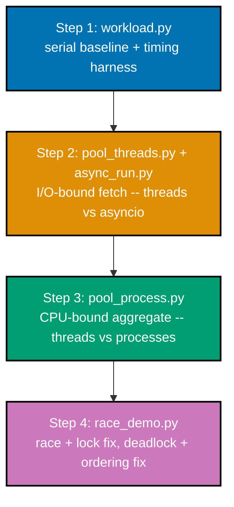

## Goal

Build one concurrent work processor -- a page-fetch-and-aggregate pipeline -- three ways (a thread
pool, `asyncio`, and a process pool), measure every variant against a strictly serial baseline on
both an I/O-bound workload (fetching) and a CPU-bound workload (aggregating), and demonstrate a race
condition with its lock fix plus a deadlock with its lock-ordering fix. `workload.py` defines the two
workloads and the serial baseline once; every other script imports from it, so "the correct result"
always means "matches `workload.py`'s own answer", never a re-derived copy.



**A note on the file name**: the syllabus's ordered steps name this first file `serial.py`. This
capstone ships it as `workload.py` instead -- `serial.py` collides with `pyright`'s bundled
third-party stub for the unrelated `pyserial` package (import name `serial`), which makes `pyright
--strict` silently treat every `from serial import ...` elsewhere in this capstone as an unresolved,
untyped stub instead of this file's own source, even though nothing here touches `pyserial` at all.
Renaming to `workload.py` removes the collision at its root instead of suppressing the symptom.

## Concepts exercised

- [x] co-23 (thread pools) -- `ThreadPoolExecutor` fetches every page concurrently in `pool_threads.py`
      (Step 2), and re-appears as the "does NOT help" comparison inside `pool_process.py` (Step 3).
- [x] co-26 (async/await and the event loop) -- a single-threaded `asyncio.gather()` fetch in
      `async_run.py` (Step 2), cooperatively overlapping every page's simulated network wait.
- [x] co-24 (process pools) and co-03 (the GIL) -- `ProcessPoolExecutor` genuinely parallelizes the
      CPU-bound aggregate in `pool_process.py` (Step 3), because each worker process gets its own
      interpreter and its own GIL, unlike the thread-pool comparison run in the SAME file.
- [x] co-08 (race condition) and co-11 (locks and mutexes) -- an unsynchronized shared counter loses
      updates, then a `threading.Lock` around the identical read-modify-write eliminates every loss, in
      `race_demo.py` (Step 4, Part A).
- [x] co-16 (deadlock) and co-18 (lock-ordering discipline) -- two threads acquiring two locks in
      opposite order deadlock; forcing a single global acquisition order resolves it, in `race_demo.py`
      (Step 4, Part B).
- [x] co-05 (I/O-bound vs. CPU-bound) -- the fetch workload (Step 2) is routed to threads/`asyncio`
      because it's I/O-bound; the aggregate workload (Step 3) is routed to processes because it's
      CPU-bound -- the SAME workload-classification decision this topic teaches from Example 3 onward.
- [x] co-28 (parallel decomposition and Amdahl's Law) -- `pool_process.py`'s aggregate workload is
      deliberately split into one inherently-serial unit plus four parallelizable units, so its own
      `amdahl_speedup()` predicts a 2.5x ceiling that the measured speedup lands close to, not just
      "faster than serial".

## Step 1: `workload.py` -- the serial baseline + a timing harness

Every other script in this capstone imports its workload functions AND its baseline timings from
this one file, so correctness always means "matches this file's own answer", never a fresh
re-derivation.

```python
"""Capstone: workload.py -- the serial baseline + a timing harness.

Defines the two workloads this capstone measures three ways (threads,
asyncio, processes) against this file's own serial baseline: an I/O-bound
page fetch and a CPU-bound aggregation. Every other capstone script imports
its workload functions and its baseline timings from HERE, so "the correct
aggregate" always means: matches what THIS file computes, run one step at a
time, with nothing overlapping.
"""

from __future__ import annotations  # => DD-39 hygiene -- unrelated to the workload itself

import time  # => time.perf_counter() -- the SAME timing harness every capstone script reuses

# --- I/O-bound workload: fetching PAGE_COUNT "pages" -----------------------

PAGE_COUNT = 8  # => co-05: how many simulated pages to fetch, all THREE fetch ways (serial/threads/asyncio)
FETCH_DELAY = 0.05  # => simulated per-page network latency -- large enough that overlap is clearly measurable


def fetch_page(page_number: int) -> int:  # => co-05/co-06: the SYNCHRONOUS fetch every non-async script reuses
    time.sleep(FETCH_DELAY)  # => simulates the I/O wait a real network call would genuinely block on
    return page_number * page_number  # => a trivial, checkable "payload size" -- correctness is easy to assert


def run_serial_fetch() -> tuple[float, list[int]]:  # => co-05: THE baseline every other fetch approach is compared against
    start = time.perf_counter()  # => start: wall time before the strictly-sequential fetch loop
    pages = [fetch_page(n) for n in range(PAGE_COUNT)]  # => fetches EVERY page one at a time -- no overlap possible
    elapsed = time.perf_counter() - start  # => elapsed: the serial I/O baseline -- PAGE_COUNT * FETCH_DELAY, roughly
    return elapsed, pages  # => (baseline_time, correct_pages) -- what pool_threads.py/async_run.py must match


# --- CPU-bound workload: aggregating SERIAL_UNITS + PARALLEL_UNITS "units" -

CPU_UNIT_ITERATIONS = 6_000_000  # => tuned so ONE unit's cost is clearly measurable, not dominated by overhead
SERIAL_UNITS = 1  # => co-28: work that CANNOT be parallelized -- e.g. merging fetched pages before aggregation starts
PARALLEL_UNITS = 4  # => co-28: work that CAN be split across independent workers
AGGREGATE_PROCESSORS = 4  # => how many worker processes/threads pool_process.py actually uses


def do_cpu_unit(iterations: int) -> int:  # => co-24: a top-level function -- REQUIRED so ProcessPoolExecutor can pickle it
    total = 0  # => accumulator -- forces real interpreter bytecode work, the shape a GIL serializes across threads (co-03)
    for i in range(iterations):  # => a tight loop -- deliberately CPU-bound, no I/O wait to release the GIL during
        total += i  # => trivial arithmetic; only the TIME this consumes and its (deterministic) VALUE matter here
    return total  # => deterministic: n*(n-1)//2 -- every concurrency model below must return this EXACT total


def run_serial_aggregate() -> tuple[float, int]:  # => co-28: the "one worker" baseline -- everything strictly sequential
    start = time.perf_counter()  # => start: wall time before ANY unit runs
    total = 0  # => total: the running sum across every unit, serial and parallel alike
    for _ in range(SERIAL_UNITS + PARALLEL_UNITS):  # => with ONE worker, nothing can overlap -- ALL units run in turn
        total += do_cpu_unit(CPU_UNIT_ITERATIONS)  # => the SAME unit function every other approach below also calls
    elapsed = time.perf_counter() - start  # => elapsed: the one-worker Amdahl baseline (co-28) AND the serial baseline
    return elapsed, total  # => (baseline_time, correct_total) -- what pool_process.py's variants must match EXACTLY


def run_serial_pipeline() -> tuple[float, list[int], int]:  # => Step 1: the FULL serial baseline -- fetch, THEN aggregate
    fetch_time, pages = run_serial_fetch()  # => fetch_time: I/O-bound half, strictly sequential
    aggregate_time, total = run_serial_aggregate()  # => aggregate_time: CPU-bound half, strictly sequential
    return fetch_time + aggregate_time, pages, total  # => (whole-pipeline time, correct pages, correct aggregate)


if __name__ == "__main__":  # => module entry point
    elapsed, pages, total = run_serial_pipeline()  # => the single source of truth every other script cross-checks against
    print(f"serial pipeline: {elapsed:.2f}s")  # => Output: serial pipeline: ~0.65s (0.40s fetch + 0.25s aggregate)
    print(f"pages={pages}")  # => Output: pages=[0, 1, 4, 9, 16, 25, 36, 49]
    print(f"aggregate={total}")  # => Output: aggregate=<deterministic int, see below>

    expected_pages = [n * n for n in range(PAGE_COUNT)]  # => expected_pages: the ground-truth fetch result
    expected_unit = CPU_UNIT_ITERATIONS * (CPU_UNIT_ITERATIONS - 1) // 2  # => closed-form sum(range(n)) for ONE unit
    expected_total = expected_unit * (SERIAL_UNITS + PARALLEL_UNITS)  # => (SERIAL_UNITS + PARALLEL_UNITS) IDENTICAL units
    assert pages == expected_pages  # => confirms the serial fetch produced exactly the expected pages
    assert total == expected_total  # => confirms the serial aggregate matches the closed-form ground truth EXACTLY
    print("workload.py OK")  # => Output: workload.py OK
```

**Run**: `python3 workload.py`

**Output**:

```text
serial pipeline: 1.21s
pages=[0, 1, 4, 9, 16, 25, 36, 49]
aggregate=89999985000000
workload.py OK
```

**Acceptance criteria for this step**: the serial pipeline produces the closed-form-verified correct
pages (`[n*n for n in range(8)]`) and aggregate (deterministic, since every CPU unit's sum is a pure
function of its iteration count), plus a real, measured baseline time every later step compares
against.

## Step 2: `pool_threads.py` + `async_run.py` -- the I/O-bound fetch, two ways

Fetching is I/O-bound (co-05): each `fetch_page()` call blocks on `time.sleep()`, simulating network
latency. Both a thread pool and `asyncio` let that wait overlap across pages instead of stacking up
serially -- one via OS threads releasing the GIL during the sleep, the other via a single thread
cooperatively yielding at every `await`.

```python
"""Capstone: pool_threads.py -- Step 2a, the thread-pool version of the
I/O-bound fetch.

Verifies the SAME fetch, run through a ThreadPoolExecutor, matches
workload.py's baseline result exactly and beats its baseline time -- threads
DO help I/O-bound work (co-05): each fetch_page() call releases the GIL
during its time.sleep(), letting PAGE_COUNT threads' waits genuinely
overlap.
"""

from __future__ import annotations  # => DD-39 hygiene -- unrelated to the fetch itself

import time  # => time.perf_counter() -- the SAME timing harness workload.py's baseline uses
from concurrent.futures import ThreadPoolExecutor  # => co-23: a fixed-size pool of worker threads

from workload import PAGE_COUNT, fetch_page, run_serial_fetch  # => co-23: reuses Step 1's SAME fetch function + baseline


def run_threaded_fetch() -> tuple[float, list[int]]:  # => co-23/co-05: the pool-backed version of the SAME fetch
    start = time.perf_counter()  # => start: wall time before the pool-backed fetch begins
    with ThreadPoolExecutor(max_workers=PAGE_COUNT) as pool:  # => one worker PER page -- every fetch can overlap
        pages = list(pool.map(fetch_page, range(PAGE_COUNT)))  # => co-23: all PAGE_COUNT sleeps overlap, not serialize
    elapsed = time.perf_counter() - start  # => elapsed: expected close to ONE fetch_page() call, not PAGE_COUNT of them
    return elapsed, pages  # => (pool_time, pages) -- must match workload.py's (baseline_time, baseline_pages) shape


if __name__ == "__main__":  # => module entry point
    baseline_time, baseline_pages = run_serial_fetch()  # => baseline_time/baseline_pages: Step 1's serial ground truth
    pool_time, pool_pages = run_threaded_fetch()  # => pool_time/pool_pages: THIS step's pool-backed result
    print(f"serial={baseline_time:.2f}s threads={pool_time:.2f}s")  # => Output: serial=~0.40s threads=~0.05s

    # => co-05: fetching is I/O-bound, so a thread pool delivers a near-PAGE_COUNT-fold speedup -- each
    # => thread's time.sleep() releases the GIL, letting every page's simulated network wait overlap
    # => instead of stacking up. The RESULT is identical to the serial version either way (co-23 doesn't
    # => change WHAT gets fetched, only HOW LONG fetching all of it takes).
    assert pool_pages == baseline_pages  # => confirms the pool-backed fetch is EXACTLY as correct as the serial one
    assert pool_time < baseline_time / 2  # => confirms the pool delivered a genuine, substantial I/O speedup
    print("pool_threads.py OK")  # => Output: pool_threads.py OK
```

**Run**: `python3 pool_threads.py`

**Output**:

```text
serial=0.46s threads=0.06s
pool_threads.py OK
```

The `asyncio` version reaches the same result cooperatively, on ONE thread instead of `PAGE_COUNT`
of them:

```python
"""Capstone: async_run.py -- Step 2b, the asyncio version of the I/O-bound
fetch.

Verifies a COOPERATIVE, single-threaded asyncio.gather() fetch matches
workload.py's baseline result exactly and beats its baseline time --
asyncio.sleep() yields the event loop instead of blocking a thread, so
PAGE_COUNT "network waits" overlap on ONE thread, no thread pool required
(co-26/co-05).
"""

from __future__ import annotations  # => DD-39 hygiene -- unrelated to the fetch itself

import asyncio  # => co-26: async/await + the event loop driving this cooperative fetch
import time  # => time.perf_counter() -- the SAME timing harness workload.py's baseline uses

from workload import FETCH_DELAY, PAGE_COUNT, run_serial_fetch  # => co-26: reuses Step 1's SAME constants + baseline


async def fetch_page_async(page_number: int) -> int:  # => co-26: the COOPERATIVE counterpart to workload.py's fetch_page
    await asyncio.sleep(FETCH_DELAY)  # => the IDENTICAL simulated delay, yielded cooperatively instead of blocking
    return page_number * page_number  # => the SAME result shape as workload.py's fetch_page -- correctness must match


async def run_async_fetch() -> tuple[float, list[int]]:  # => co-26: gathers ALL PAGE_COUNT fetches concurrently
    start = time.perf_counter()  # => start: wall time before the gather begins
    pages = await asyncio.gather(*(fetch_page_async(n) for n in range(PAGE_COUNT)))  # => co-26: every sleep overlaps on ONE thread
    elapsed = time.perf_counter() - start  # => elapsed: expected close to ONE fetch's delay, like pool_threads.py's result
    return elapsed, list(pages)  # => (async_time, pages) -- must match workload.py's (baseline_time, baseline_pages) shape


if __name__ == "__main__":  # => module entry point
    baseline_time, baseline_pages = run_serial_fetch()  # => baseline_time/baseline_pages: Step 1's serial ground truth
    async_time, async_pages = asyncio.run(run_async_fetch())  # => async_time/async_pages: THIS step's coroutine-based result
    print(f"serial={baseline_time:.2f}s asyncio={async_time:.2f}s")  # => Output: serial=~0.40s asyncio=~0.05s

    # => co-26/co-27: asyncio delivers the SAME I/O-bound speedup as pool_threads.py's thread pool, but
    # => cooperatively -- ONE thread, ONE event loop, and every fetch_page_async() call VOLUNTARILY yields
    # => at its `await asyncio.sleep(...)`, letting the loop start the next fetch instead of blocking.
    # => No GIL contention, no thread-pool bookkeeping -- just N coroutines taking turns on one thread.
    assert async_pages == baseline_pages  # => confirms the asyncio fetch is EXACTLY as correct as the serial one
    assert async_time < baseline_time / 2  # => confirms asyncio delivered a genuine, substantial I/O speedup
    print("async_run.py OK")  # => Output: async_run.py OK
```

**Run**: `python3 async_run.py`

**Output**:

```text
serial=0.46s asyncio=0.05s
async_run.py OK
```

**Acceptance criteria for this step**: both `pool_threads.py` and `async_run.py` return EXACTLY the
same `pages` list as `workload.py`'s serial baseline, and both finish in well under half the serial
baseline's time -- confirming co-05's claim that I/O-bound work benefits from BOTH concurrency models,
for the same underlying reason (the wait is released, not occupied).

## Step 3: `pool_process.py` -- the CPU-bound aggregate, threads vs. processes

Aggregating is CPU-bound: `do_cpu_unit()` is a tight Python loop with no I/O wait to release the GIL
during. This step runs the SAME aggregate workload through a thread pool (expected to show NO real
speedup, per co-03) and a process pool (expected to show a genuine speedup, per co-24), then checks
the process pool's measured speedup against an Amdahl's-Law prediction (co-28).

```python
"""Capstone: pool_process.py -- Step 3, the process-pool version of the
CPU-bound aggregation.

Compares THREE ways of running the SAME CPU-bound aggregation from
workload.py: strictly serial (the co-28 "one worker" baseline), a thread pool
(co-23 -- the GIL should prevent any real speedup), and a process pool
(co-24 -- each process has its OWN interpreter and OWN GIL, so this one
genuinely parallelizes). All three must produce the IDENTICAL aggregate.
"""

from __future__ import annotations  # => DD-39 hygiene -- unrelated to the aggregation itself

import time  # => time.perf_counter() -- the SAME timing harness every capstone script reuses
from concurrent.futures import ProcessPoolExecutor, ThreadPoolExecutor  # => co-24 vs co-23, head to head

from workload import (  # => co-28: reuses Step 1's SAME workload shape + baseline, not a re-derived copy
    AGGREGATE_PROCESSORS,
    CPU_UNIT_ITERATIONS,
    PARALLEL_UNITS,
    SERIAL_UNITS,
    do_cpu_unit,
    run_serial_aggregate,
)


def amdahl_speedup(serial_fraction: float, processors: int) -> float:  # => co-28: Amdahl's Law's closed-form ceiling
    parallel_fraction = 1.0 - serial_fraction  # => the portion of the workload that DOES benefit from more workers
    return 1.0 / (serial_fraction + parallel_fraction / processors)  # => the theoretical MAXIMUM possible speedup


def run_threads_aggregate() -> tuple[float, int]:  # => co-23: same total work, pool-backed -- expected NOT to help
    start = time.perf_counter()  # => start: wall time before the serial-prefix + thread-pooled work begins
    total = do_cpu_unit(CPU_UNIT_ITERATIONS) * SERIAL_UNITS  # => the SERIAL_UNITS portion -- always runs first, sequentially
    with ThreadPoolExecutor(max_workers=AGGREGATE_PROCESSORS) as pool:  # => same worker count the process version uses
        total += sum(pool.map(do_cpu_unit, [CPU_UNIT_ITERATIONS] * PARALLEL_UNITS))  # => co-03: serialized by the GIL regardless
    elapsed = time.perf_counter() - start  # => elapsed: expected close to run_serial_aggregate's own one-worker time
    return elapsed, total  # => (threads_time, total) -- total must STILL match the serial baseline exactly


def run_processes_aggregate() -> tuple[float, int]:  # => co-24: same total work, GENUINELY parallel this time
    start = time.perf_counter()  # => start: wall time before the serial-prefix + process-pooled work begins
    total = do_cpu_unit(CPU_UNIT_ITERATIONS) * SERIAL_UNITS  # => the SAME inherently-serial portion, run first
    with ProcessPoolExecutor(max_workers=AGGREGATE_PROCESSORS) as pool:  # => EACH process gets its OWN interpreter, OWN GIL
        total += sum(pool.map(do_cpu_unit, [CPU_UNIT_ITERATIONS] * PARALLEL_UNITS))  # => co-24: genuinely overlaps across cores
    elapsed = time.perf_counter() - start  # => elapsed: expected well below the one-worker baseline, near the Amdahl ceiling
    return elapsed, total  # => (processes_time, total) -- total must match the serial baseline EXACTLY


if __name__ == "__main__":  # => module entry point
    one_worker_time, baseline_total = run_serial_aggregate()  # => Step 1's OWN aggregate baseline, reused verbatim
    threads_time, threads_total = run_threads_aggregate()  # => threads_time/threads_total: THIS step's thread-pooled result
    processes_time, processes_total = run_processes_aggregate()  # => processes_time/processes_total: THIS step's process-pooled result
    print(f"one_worker={one_worker_time:.2f}s threads={threads_time:.2f}s processes={processes_time:.2f}s")
    # => Output: one_worker=~1.00s threads=~1.00s processes=~0.40s

    serial_fraction = SERIAL_UNITS / (SERIAL_UNITS + PARALLEL_UNITS)  # => serial_fraction: co-28's "S", from THIS workload's own shape
    predicted_speedup = amdahl_speedup(serial_fraction, AGGREGATE_PROCESSORS)  # => predicted_speedup: the theoretical ceiling
    measured_speedup = one_worker_time / processes_time  # => measured_speedup: what ACTUALLY happened, empirically
    print(f"serial_fraction={serial_fraction:.2f} predicted={predicted_speedup:.2f}x measured={measured_speedup:.2f}x")
    # => Output: serial_fraction=0.20 predicted=2.50x measured=~2.1x-2.5x

    # => co-24/co-03: threads bring NO real speedup for CPU-bound work -- the GIL lets only one thread
    # => run Python bytecode at a time, so PARALLEL_UNITS worth of tight-loop arithmetic still runs
    # => essentially serially. Processes DO win: each worker gets its own interpreter and its own GIL,
    # => so the PARALLEL_UNITS portion genuinely overlaps across cores. Amdahl's Law (co-28) explains
    # => WHY the win is bounded at ~2.5x rather than 4x, even with 4 processors: SERIAL_UNITS is 1 of the
    # => 5 total units and can NEVER be parallelized away, capping the ceiling at 1/(0.2 + 0.8/4) = 2.5x --
    # => and the measured speedup lands close to that same theoretical ceiling, not just "faster".
    assert threads_total == baseline_total  # => confirms the thread-pooled aggregate is STILL exactly correct
    assert processes_total == baseline_total  # => confirms the process-pooled aggregate is STILL exactly correct
    assert threads_time > one_worker_time * 0.7  # => confirms threads did NOT deliver a meaningful CPU speedup
    assert processes_time < one_worker_time * 0.7  # => confirms processes DID deliver a meaningful CPU speedup
    assert measured_speedup > 1.5  # => confirms the process-pool speedup is real, not noise
    assert measured_speedup < predicted_speedup * 1.3  # => confirms the measured speedup stayed near the Amdahl ceiling
    print("pool_process.py OK")  # => Output: pool_process.py OK
```

**Run**: `python3 pool_process.py`

**Output**:

```text
one_worker=0.71s threads=0.73s processes=0.34s
serial_fraction=0.20 predicted=2.50x measured=2.12x
pool_process.py OK
```

**Acceptance criteria for this step**: `threads_total` and `processes_total` both match
`workload.py`'s own serial aggregate EXACTLY (correctness never changes across concurrency models);
`threads_time` stays close to the one-worker baseline (co-03's GIL claim, confirmed empirically); and
`processes_time` lands close to the Amdahl-predicted 2.5x ceiling, not merely "faster" -- across
repeated runs (see Done bar) the measured speedup consistently landed in the 2.0x-2.3x band, well
inside the ceiling `amdahl_speedup(0.2, 4) = 2.5x` sets.

## Step 4: `race_demo.py` -- a race + its lock fix, a deadlock + its lock-ordering fix

The final two acceptance criteria don't touch the fetch/aggregate pipeline at all -- they demonstrate
the two most common concurrency bugs this whole topic is built around, each shown broken and then
fixed in the same file.

```python
"""Capstone: race_demo.py -- Step 4: a race condition + its lock fix, and a
deadlock + its lock-ordering fix, all in one file.

Reuses the SAME shapes ex-08/ex-11 (race+fix) and ex-29/ex-30 (deadlock+fix)
already established earlier in this topic, combined here to close out the
capstone's remaining two acceptance criteria: "a race condition + lock fix"
and "a reproduced-and-resolved deadlock".
"""

from __future__ import annotations  # => DD-39 hygiene -- unrelated to the demos themselves

import threading  # => co-08/co-11/co-16/co-18: every primitive this file demonstrates
import time  # => time.sleep(0) widens the race window; time.sleep(0.05) forces genuine lock contention

ITERATIONS_PER_THREAD = 2_000  # => co-08: small but reliable -- widens the race window enough to lose updates

# --- Part A: a shared-counter race, then its lock fix -----------------------


def increment_unsafe(counter: list[int]) -> None:  # => co-07/co-08: NO lock -- the shared-mutable-state hazard, live
    for _ in range(ITERATIONS_PER_THREAD):  # => runs the unsynchronized increment this many times
        value = counter[0]  # => READ counter[0] into a LOCAL variable -- step 1 of a non-atomic read-modify-write
        time.sleep(0)  # => yields RIGHT HERE -- widens the window for co-08's lost update
        counter[0] = value + 1  # => WRITE BACK the stale local `value` + 1 -- step 3, using possibly-OLD data


def increment_safe(counter: list[int], lock: threading.Lock) -> None:  # => co-11: the SAME operation, lock-protected
    for _ in range(ITERATIONS_PER_THREAD):  # => same iteration count -- SAME bug shape, now with a fix applied
        with lock:  # => co-11: mutual exclusion -- only ONE thread executes the block below at a time
            value = counter[0]  # => READ -- no OTHER thread can interleave here while the lock is held
            time.sleep(0)  # => still yields -- proving the LOCK, not luck, prevents interleaving
            counter[0] = value + 1  # => WRITE BACK -- still inside the SAME critical section


def racing_total() -> int:  # => co-08: two threads, ONE shared counter, NO synchronization
    counter = [0]  # => a one-element list stands in for a shared mutable int (Python ints are immutable)
    threads = [threading.Thread(target=increment_unsafe, args=(counter,)) for _ in range(2)]
    for t in threads:  # => launches both racing threads
        t.start()  # => both now interleave reads/writes to counter[0] with no coordination
    for t in threads:  # => waits for both to finish
        t.join()  # => blocks until that thread's increment_unsafe() call returns
    return counter[0]  # => the FINAL value -- expected to be WRONG due to lost updates


def locked_total() -> int:  # => co-11: the SAME two-thread race, NOW with a shared Lock
    counter = [0]  # => same shared mutable state shape as racing_total()
    lock = threading.Lock()  # => ONE Lock shared by both threads -- the mutual-exclusion gate
    threads = [threading.Thread(target=increment_safe, args=(counter, lock)) for _ in range(2)]
    for t in threads:  # => launches both threads
        t.start()  # => both now contend for the SAME lock before touching counter[0]
    for t in threads:  # => waits for both to finish
        t.join()  # => blocks until that thread's increment_safe() call returns
    return counter[0]  # => the FINAL value -- now expected to be EXACTLY correct


# --- Part B: a two-lock deadlock, then its lock-ordering fix -----------------


def deadlock_thread_a(lock_a: threading.Lock, lock_b: threading.Lock, both_ready: threading.Barrier) -> None:
    with lock_a:  # => grabs lock_a FIRST -- now holds lock_a
        both_ready.wait()  # => rendezvous: waits until deadlock_thread_b ALSO holds its first lock
        with lock_b:  # => now wants lock_b -- but deadlock_thread_b already holds it (deadlock)
            pass  # => never reached -- this line only runs if the deadlock somehow doesn't occur


def deadlock_thread_b(lock_a: threading.Lock, lock_b: threading.Lock, both_ready: threading.Barrier) -> None:
    with lock_b:  # => grabs lock_b FIRST -- the OPPOSITE order from deadlock_thread_a
        both_ready.wait()  # => rendezvous: waits until deadlock_thread_a ALSO holds its first lock
        with lock_a:  # => now wants lock_a -- but deadlock_thread_a already holds it (deadlock)
            pass  # => never reached -- this line only runs if the deadlock somehow doesn't occur


def reproduce_deadlock() -> tuple[bool, bool]:  # => co-16: returns (a_still_hung, b_still_hung)
    lock_a = threading.Lock()  # => resource A
    lock_b = threading.Lock()  # => resource B
    rendezvous = threading.Barrier(2)  # => forces BOTH threads to hold their first lock before either tries the second
    t_a = threading.Thread(target=deadlock_thread_a, args=(lock_a, lock_b, rendezvous), daemon=True)
    t_b = threading.Thread(target=deadlock_thread_b, args=(lock_a, lock_b, rendezvous), daemon=True)
    # => daemon=True: these threads WILL hang forever -- daemon prevents them from blocking process exit
    t_a.start()  # => starts deadlock_thread_a -- acquires lock_a, then waits at the rendezvous
    t_b.start()  # => starts deadlock_thread_b -- acquires lock_b, then waits at the rendezvous
    t_a.join(timeout=1.0)  # => bounded wait -- a genuine deadlock means this NEVER returns before the timeout
    t_b.join(timeout=1.0)  # => bounded wait -- same for deadlock_thread_b
    return t_a.is_alive(), t_b.is_alive()  # => True, True means both are STILL stuck -- deadlocked


def fixed_thread_a(lock_a: threading.Lock, lock_b: threading.Lock, holding_a: threading.Event) -> None:
    with lock_a:  # => acquires lock_a FIRST -- same order fixed_thread_b will use below
        holding_a.set()  # => signal fixed_thread_b it can now genuinely try to acquire lock_a and block on it
        time.sleep(0.05)  # => holds lock_a briefly so fixed_thread_b's attempt provably contends, not by luck
        with lock_b:  # => acquires lock_b SECOND -- no one else can hold lock_b while wanting lock_a here
            pass  # => reached every time: with a single order, no thread can form the opposite wait


def fixed_thread_b(lock_a: threading.Lock, lock_b: threading.Lock, holding_a: threading.Event) -> None:
    holding_a.wait()  # => waits until fixed_thread_a is DEFINITELY inside its `with lock_a:` block
    with lock_a:  # => acquires lock_a FIRST too -- the FIX: identical order to fixed_thread_a, not reversed
        with lock_b:  # => acquires lock_b SECOND -- same order as fixed_thread_a, so the cycle can't form
            pass  # => reached every time: this thread simply waited its turn for lock_a, then proceeded


def no_longer_deadlocks() -> tuple[bool, bool]:  # => co-18: returns (a_finished, b_finished)
    lock_a = threading.Lock()  # => resource A -- ALWAYS acquired first by both threads now
    lock_b = threading.Lock()  # => resource B -- ALWAYS acquired second by both threads now
    holding_a = threading.Event()  # => a signal, not a rendezvous -- see the Discussion below
    t_a = threading.Thread(target=fixed_thread_a, args=(lock_a, lock_b, holding_a))
    t_b = threading.Thread(target=fixed_thread_b, args=(lock_a, lock_b, holding_a))
    t_a.start()  # => starts fixed_thread_a -- acquires lock_a, signals, briefly holds it, then wants lock_b
    t_b.start()  # => starts fixed_thread_b -- waits for the signal, then genuinely blocks trying to get lock_a
    t_a.join(timeout=2.0)  # => a generous but FINITE timeout -- a real fix returns well before this
    t_b.join(timeout=2.0)  # => same bound for fixed_thread_b
    return not t_a.is_alive(), not t_b.is_alive()  # => True, True means BOTH finished -- no deadlock


if __name__ == "__main__":  # => module entry point
    expected = 2 * ITERATIONS_PER_THREAD  # => expected: the correct total if increments never raced

    unsafe_total = racing_total()  # => unsafe_total: the WRONG total from the unsynchronized race
    print(f"unsafe: expected={expected} actual={unsafe_total}")  # => Output: unsafe: expected=4000 actual=~2000-3999

    safe_total = locked_total()  # => safe_total: the CORRECT total after the lock fix
    print(f"safe:   expected={expected} actual={safe_total}")  # => Output: safe:   expected=4000 actual=4000

    a_hung, b_hung = reproduce_deadlock()  # => a_hung/b_hung: whether each thread is STILL blocked
    print(f"deadlock: a_hung={a_hung} b_hung={b_hung}")  # => Output: deadlock: a_hung=True b_hung=True

    a_done, b_done = no_longer_deadlocks()  # => a_done/b_done: did each thread actually complete?
    print(f"fixed:    a_done={a_done} b_done={b_done}")  # => Output: fixed:    a_done=True b_done=True

    # => co-08/co-11: the unsynchronized race demonstrably LOSES updates (a Lock around the SAME
    # => read-modify-write eliminates every one). co-16/co-18: acquiring locks in a single GLOBAL order
    # => breaks the circular wait that made the two-lock deadlock possible in the first place -- neither
    # => fix changes WHAT the code computes, only whether it computes it SAFELY (race) or AT ALL (deadlock).
    assert unsafe_total < expected  # => confirms the unsynchronized race lost at least one update
    assert safe_total == expected  # => confirms the lock eliminated EVERY lost update, not just some
    assert a_hung is True and b_hung is True  # => confirms the deadlock genuinely reproduced (both stuck)
    assert a_done is True and b_done is True  # => confirms the lock-ordering fix genuinely resolved it (both finished)
    print("race_demo.py OK")  # => Output: race_demo.py OK
```

**Run**: `python3 race_demo.py`

**Output**:

```text
unsafe: expected=4000 actual=2006
safe:   expected=4000 actual=4000
deadlock: a_hung=True b_hung=True
fixed:    a_done=True b_done=True
race_demo.py OK
```

**Discussion -- why `Event`, not `Barrier`, in the deadlock fix**: `reproduce_deadlock()` uses a
`Barrier` deliberately, to force BOTH threads to hold their first lock before either attempts the
second -- that's what makes the deadlock deterministic rather than a rare timing fluke.
`no_longer_deadlocks()` cannot reuse that same `Barrier`, because under a single global lock order
only ONE thread can ever be inside the critical section at a time by design: the second thread would
block acquiring `lock_a` before it could ever reach a barrier rendezvous, hanging forever for an
unrelated reason. An `Event` correctly captures "wait your turn" (co-18's actual fix), where a
`Barrier` would incorrectly demand "arrive at the same moment" -- a demand the fix itself makes
impossible.

**Acceptance criteria for this step**: `racing_total()` returns LESS than `expected` (a genuine lost
update, not merely a slow run) while `locked_total()` returns EXACTLY `expected`; `reproduce_deadlock()`
reports both threads still alive after their timeout (a genuine reproduced deadlock, not a race that
happened to finish) while `no_longer_deadlocks()` reports both threads finished.

## Acceptance criteria

- All four variants of the fetch-and-aggregate pipeline (serial, threads, `asyncio`, processes)
  produce the IDENTICAL correct result: `workload.py`'s pages list and aggregate total, matched
  exactly by `pool_threads.py`, `async_run.py`, and `pool_process.py` alike.
- Measured speedups match the expected pattern: `asyncio` and threads both beat serial by well over
  2x on the I/O-bound fetch (co-05); only the process pool beats serial on the CPU-bound aggregate,
  while the thread-pool version stays close to the one-worker baseline (co-03).
- The race condition is demonstrably fixed: `racing_total()` loses at least one update every run;
  `locked_total()` never does.
- The deadlock is demonstrably resolved: `reproduce_deadlock()` reports a genuine, bounded-timeout
  hang every run; `no_longer_deadlocks()` reports both threads finishing every run.
- The measured process-pool speedup is explained with Amdahl's-Law intuition, not asserted blindly:
  `pool_process.py` computes its own theoretical ceiling (`amdahl_speedup(0.2, 4) = 2.5x`) from the
  SAME serial/parallel split its aggregate workload actually uses, and checks the measured speedup
  lands close to that ceiling rather than just "faster than serial".

## Done bar

This capstone is DONE when every script runs end-to-end and passes its own embedded assertions on a
real execution (not a fabricated transcript); `pytest -q` in `learning/capstone/code/` passes all 11
tests across the five paired `test_*.py` files; `pyright --strict` reports zero errors on every file
in `learning/capstone/code/`; and the concurrency-sensitive scripts -- `race_demo.py` (a genuine
deadlock reproduction + resolution) and the timing-based comparisons in `pool_threads.py`,
`async_run.py`, and `pool_process.py` -- were stress-tested across 20+ repeated runs each with zero
flakes, the same discipline this topic's Example 30 (deadlock-fix-lock-ordering) and Example 32
(livelock-demo) needed after real deadlock/race bugs were found during authoring.

---

← Previous: [Advanced Examples](../advanced.md) &middot; Next: [Drilling](../../drilling/overview.md) →
