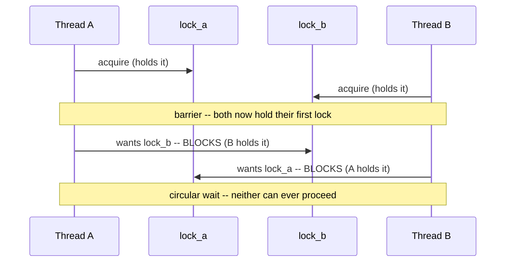
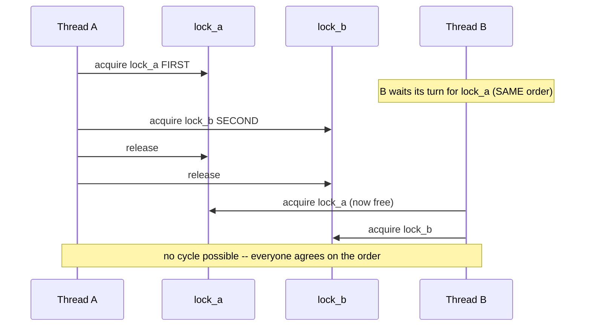
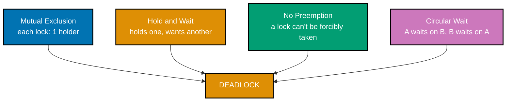
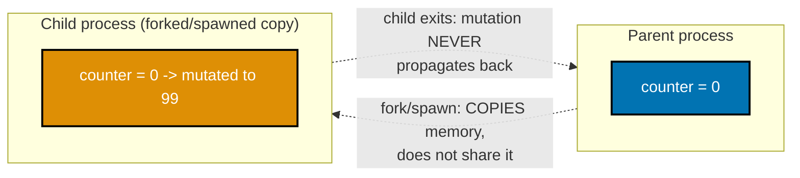
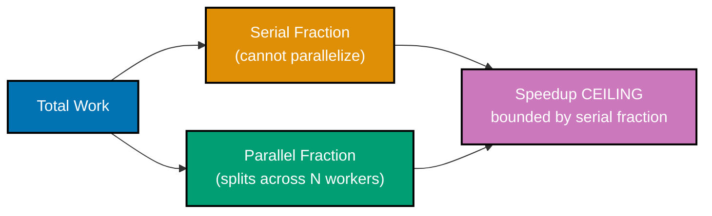
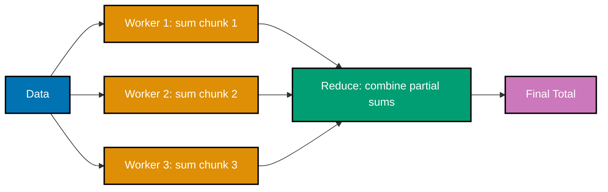

Examples 29-57 build the intermediate layer of Python concurrency: reproducing and fixing deadlocks three different ways (lock ordering, timeouts, and naming the four Coffman conditions explicitly), livelock and starvation, memory visibility and the data-race-vs-logic-race distinction, bounded queues and backpressure, multi-producer/multi-consumer pipelines, thread- and process-pool patterns (`as_completed`, exception propagation, `chunksize`, shared `Value`), and the core `asyncio` toolkit -- `create_task`, `timeout`, `Queue`, `Semaphore`, the cooperative-blocking hazard, and `run_in_executor` -- closing with Amdahl's Law and map-reduce decomposition. Every example is a complete, self-contained, `pyright --strict`-clean `example.py` colocated under `learning/code/`, run for real on **CPython 3.14** to capture its documented output, plus a companion `test_example.py` that asserts the same behavior under `pytest`.

---

### Example 29: Two Threads, Two Locks, Opposite Order -- A Reproduced Deadlock

_ex-29 &middot; exercises co-16_

Thread A grabs `lock_a` then wants `lock_b`; thread B grabs `lock_b` then wants `lock_a` -- a `Barrier` forces both threads to hold their first lock before either tries the second, guaranteeing a genuine circular wait every single run rather than a rare, timing-dependent fluke.



**`learning/code/ex-29-deadlock-two-locks/example.py`**

```python
"""Example 29: Two Threads, Two Locks, Opposite Order -- A Reproduced Deadlock."""  # => co-16: the four Coffman conditions, live

import threading  # => co-16: a cyclic wait between two threads holding what the other needs


def thread_a(lock_a: threading.Lock, lock_b: threading.Lock, both_ready: threading.Barrier) -> None:  # => wants A then B
    with lock_a:  # => thread_a grabs lock_a FIRST -- it now holds lock_a
        both_ready.wait()  # => rendezvous: waits until thread_b ALSO holds its first lock
        with lock_b:  # => thread_a now wants lock_b -- but thread_b already holds it (deadlock)
            pass  # => never reached -- this line only runs if the deadlock somehow doesn't occur


def thread_b(lock_a: threading.Lock, lock_b: threading.Lock, both_ready: threading.Barrier) -> None:  # => wants B then A
    with lock_b:  # => thread_b grabs lock_b FIRST -- the OPPOSITE order from thread_a
        both_ready.wait()  # => rendezvous: waits until thread_a ALSO holds its first lock
        with lock_a:  # => thread_b now wants lock_a -- but thread_a already holds it (deadlock)
            pass  # => never reached -- this line only runs if the deadlock somehow doesn't occur


def reproduce_deadlock() -> tuple[bool, bool]:  # => returns (a_still_hung, b_still_hung)
    lock_a = threading.Lock()  # => resource A
    lock_b = threading.Lock()  # => resource B
    rendezvous = threading.Barrier(2)  # => forces BOTH threads to hold their first lock before either tries the second
    t_a = threading.Thread(target=thread_a, args=(lock_a, lock_b, rendezvous), daemon=True)
    t_b = threading.Thread(target=thread_b, args=(lock_a, lock_b, rendezvous), daemon=True)
    # => daemon=True: these threads will hang FOREVER -- daemon prevents them from blocking process exit
    t_a.start()  # => starts thread_a -- acquires lock_a, then waits at the rendezvous
    t_b.start()  # => starts thread_b -- acquires lock_b, then waits at the rendezvous
    t_a.join(timeout=0.5)  # => bounded wait -- a genuine deadlock means this NEVER returns True early
    t_b.join(timeout=0.5)  # => bounded wait -- same for thread_b
    return t_a.is_alive(), t_b.is_alive()  # => True, True means both are still stuck -- deadlocked


if __name__ == "__main__":  # => module entry point
    a_hung, b_hung = reproduce_deadlock()  # => a_hung/b_hung: whether each thread is STILL blocked
    print(f"a_hung={a_hung} b_hung={b_hung}")  # => Output: a_hung=True b_hung=True

    # => Each thread holds ONE lock the other needs, and neither can proceed until it gets the
    # => other's lock -- a textbook circular wait (co-16). The Barrier guarantees BOTH threads
    # => hold their first lock before either attempts the second, making the deadlock deterministic.
    assert a_hung is True  # => confirms thread_a never got past its second `with lock_b:`
    assert b_hung is True  # => confirms thread_b never got past its second `with lock_a:`
    print("ex-29 OK")  # => Output: ex-29 OK
```

**Run**: `python3 example.py`

**Output**:

```text
a_hung=True b_hung=True
ex-29 OK
```

**`learning/code/ex-29-deadlock-two-locks/test_example.py`**

```python
"""Example 29: pytest verification for Two Threads, Two Locks, Opposite Order."""

from example import reproduce_deadlock


def test_opposite_lock_order_deterministically_deadlocks() -> None:
    a_hung, b_hung = reproduce_deadlock()
    assert a_hung is True  # => thread_a is permanently blocked waiting on lock_b
    assert b_hung is True  # => thread_b is permanently blocked waiting on lock_a


# => Run: pytest -- Output: 1 passed
```

**Verify**: `pytest -q`

**Output**:

```text
1 passed
```

**Key takeaway**: Two threads acquiring the same two locks in OPPOSITE order is the textbook circular-wait deadlock: each holds what the other needs, and neither can proceed.

**Why it matters**: This is the canonical deadlock shape every real-world lock-ordering bug reduces to, no matter how many locks or threads are actually involved. Reproducing it deterministically (via the Barrier, rather than hoping a race window gets hit) is what makes the fix in ex-30 verifiable -- the SAME deadlock-prone code structure, with only the acquisition order changed, must now provably never hang.

---

### Example 30: A Global Lock Order Fixes the Deadlock

_ex-30 &middot; exercises co-18, co-16_

Both threads now acquire `lock_a` before `lock_b` -- a single, consistent global order. With no possible opposite-order acquisition, the circular wait from ex-29 becomes structurally impossible, and both threads complete every time.



**`learning/code/ex-30-deadlock-fix-lock-ordering/example.py`**

```python
"""Example 30: A Global Lock Order Fixes the Deadlock."""

import threading  # => co-18: lock-ordering discipline -- the fix for ex-29's circular wait
import time  # => used only for a small sleep that guarantees genuine contention below, not luck


def thread_a(lock_a: threading.Lock, lock_b: threading.Lock, holding_a: threading.Event) -> None:
    with lock_a:  # => acquires lock_a FIRST -- same order thread_b will use below
        holding_a.set()  # => signal thread_b it can now genuinely try to acquire lock_a and block on it
        time.sleep(0.05)  # => hold lock_a briefly so thread_b's acquisition attempt provably contends
        with lock_b:  # => acquires lock_b SECOND -- no one else can hold lock_b while wanting lock_a here
            pass  # => reached every time: with a single order, no thread can form the opposite wait


def thread_b(lock_a: threading.Lock, lock_b: threading.Lock, holding_a: threading.Event) -> None:
    holding_a.wait()  # => wait until thread_a is DEFINITELY inside its `with lock_a:` block
    with lock_a:  # => acquires lock_a FIRST too -- the FIX: identical order to thread_a, not reversed
        with lock_b:  # => acquires lock_b SECOND -- same order as thread_a, so the cycle can't form
            pass  # => reached every time: this thread simply waited its turn for lock_a, then proceeded


def no_longer_deadlocks() -> tuple[bool, bool]:  # => returns (a_finished, b_finished)
    lock_a = threading.Lock()  # => resource A -- ALWAYS acquired first by both threads now
    lock_b = threading.Lock()  # => resource B -- ALWAYS acquired second by both threads now
    holding_a = threading.Event()  # => NOT a Barrier -- a Barrier here would itself deadlock (see Discussion)
    t_a = threading.Thread(target=thread_a, args=(lock_a, lock_b, holding_a))
    t_b = threading.Thread(target=thread_b, args=(lock_a, lock_b, holding_a))
    t_a.start()  # => starts thread_a -- acquires lock_a, signals, briefly holds it, then wants lock_b
    t_b.start()  # => starts thread_b -- waits for the signal, then genuinely blocks trying to get lock_a
    t_a.join(timeout=2)  # => a generous but FINITE timeout -- a real fix returns well before this
    t_b.join(timeout=2)  # => same bound for thread_b
    return not t_a.is_alive(), not t_b.is_alive()  # => True, True means BOTH finished -- no deadlock


if __name__ == "__main__":  # => module entry point
    a_done, b_done = no_longer_deadlocks()  # => a_done/b_done: did each thread actually complete?
    print(f"a_done={a_done} b_done={b_done}")  # => Output: a_done=True b_done=True

    # => Both threads now acquire lock_a BEFORE lock_b -- a single, consistent GLOBAL ORDER. With
    # => only one possible acquisition order, no thread can ever hold lock_b while waiting on
    # => lock_a held by another thread that itself wants lock_b -- the circular wait is impossible.
    # => Note this deliberately uses an `Event`, not a `Barrier`, to force the contention: a Barrier
    # => would require BOTH threads to reach it WHILE holding lock_a, but only one thread can hold
    # => lock_a at a time once the order is fixed -- the second thread would block trying to acquire
    # => lock_a before it could ever reach the barrier, hanging forever. That's not a flaw in the
    # => fix; it is exactly the point: under one global order there is only ONE thread inside the
    # => critical section at a time, by design -- an `Event` correctly captures "wait your turn",
    # => where a `Barrier` incorrectly demands "arrive at the same moment", which is now impossible.
    assert a_done is True  # => confirms thread_a completed, not hung
    assert b_done is True  # => confirms thread_b completed, not hung
    print("ex-30 OK")  # => Output: ex-30 OK
```

**Run**: `python3 example.py`

**Output**:

```text
a_done=True b_done=True
ex-30 OK
```

**`learning/code/ex-30-deadlock-fix-lock-ordering/test_example.py`**

```python
"""Example 30: pytest verification for A Global Lock Order Fixes the Deadlock."""

from example import no_longer_deadlocks


def test_consistent_lock_order_prevents_deadlock() -> None:
    a_done, b_done = no_longer_deadlocks()
    assert a_done is True  # => a consistent global order broke the circular-wait condition
    assert b_done is True


# => Run: pytest -- Output: 1 passed
```

**Verify**: `pytest -q`

**Output**:

```text
1 passed
```

**Key takeaway**: Imposing one global lock-acquisition order breaks the circular-wait condition entirely -- not probabilistically, but as a structural guarantee: with only one possible order, no cycle can ever form.

**Why it matters**: Lock ordering is the single most important deadlock-PREVENTION discipline in real systems, because it requires no runtime detection or recovery -- it makes the bug class impossible by construction. This example deliberately reuses a `Barrier`-adjacent technique (an `Event`, not a `Barrier`, for a subtle but important reason covered in the code's own Discussion) to prove the fix is genuinely deterministic, not merely likely.

---

### Example 31: `acquire(timeout=...)` + Back-Off Fixes a Deadlock Differently

_ex-31 &middot; exercises co-16, co-11_

Instead of imposing a global order, each thread tries `acquire(timeout=...)` on its second lock -- if the timeout expires, it releases what it's holding and retries with a random back-off. This turns a permanent deadlock into eventual, probabilistic progress.

**`learning/code/ex-31-deadlock-fix-timeout/example.py`**

```python
"""Example 31: `acquire(timeout=...)` + Back-Off Fixes a Deadlock Differently."""  # => co-16, co-11: give up and retry, don't wait forever

import random  # => randomizes the back-off so retries don't stay perfectly synchronized
import threading  # => co-11's timed acquire, applied to co-16's opposite-order deadlock shape
import time  # => `time.sleep` implements the back-off delay between retries


def try_once(first: threading.Lock, second: threading.Lock, attempts: list[int]) -> bool:  # => one contend-and-maybe-win attempt
    first.acquire()  # => grabs its "first" lock -- unconditionally, like ex-29
    attempts[0] += 1  # => records that this thread made another attempt at winning both locks
    got_second = second.acquire(timeout=0.05)  # => bounded wait, NOT an unconditional block
    if got_second:  # => successfully got BOTH locks -- safe to proceed and then clean up
        second.release()  # => releases in reverse-ish order -- cleanup for this successful attempt
        first.release()  # => releases the first lock too -- attempt fully complete
        return True  # => this attempt WON both locks -- caller should stop retrying
    first.release()  # => COULD NOT get the second lock -- releases the first to break the standoff
    return False  # => this attempt failed -- caller should back off and retry


def worker(  # => co-16 fix in action: retry-with-timeout instead of an unconditional acquire
    first: threading.Lock, second: threading.Lock, both_ready: threading.Barrier, attempts: list[int]
    # => first/second: THIS thread's acquisition order; attempts: shared retry counter
) -> None:
    both_ready.wait()  # => rendezvous ONCE -- guarantees BOTH threads collide on their first attempt
    if try_once(first, second, attempts):  # => the guaranteed-contention first attempt
        return  # => rare, but possible: this thread won immediately despite the forced collision
    while not try_once(first, second, attempts):  # => keeps retrying until one attempt wins both locks
        time.sleep(random.uniform(0, 0.02))  # => back-off before retrying -- avoids instant re-collision


def resolves_via_timeout() -> tuple[int, int]:  # => returns (thread_a_attempts, thread_b_attempts)
    lock_a = threading.Lock()  # => resource A
    lock_b = threading.Lock()  # => resource B
    rendezvous = threading.Barrier(2)  # => forces both threads to contend at the same moment, each retry round
    a_attempts = [0]  # => how many times thread_a tried before succeeding
    b_attempts = [0]  # => how many times thread_b tried before succeeding
    t_a = threading.Thread(target=worker, args=(lock_a, lock_b, rendezvous, a_attempts))  # => wants A then B
    t_b = threading.Thread(target=worker, args=(lock_b, lock_a, rendezvous, b_attempts))  # => wants B then A
    t_a.start()  # => starts thread_a's retry loop
    t_b.start()  # => starts thread_b's retry loop -- opposite acquisition order, just like ex-29
    t_a.join(timeout=3)  # => a generous but FINITE bound -- the retry loop must eventually succeed
    t_b.join(timeout=3)  # => same bound for thread_b
    return a_attempts[0], b_attempts[0]  # => both > 0 confirms real work happened, not instant luck


if __name__ == "__main__":  # => module entry point
    a_tries, b_tries = resolves_via_timeout()  # => a_tries/b_tries: how many rounds each thread needed
    print(f"a_tries={a_tries} b_tries={b_tries}")  # => Output: a_tries=<1+> b_tries=<1+>

    # => Instead of blocking forever, `acquire(timeout=...)` lets a thread give up, release what it
    # => already holds, back off, and retry -- turning a permanent deadlock into eventual progress.
    # => This trades a HARD guarantee (lock ordering, ex-30) for a PROBABILISTIC one: it always
    # => makes progress eventually, but the exact number of retries needed is not fixed in advance.
    assert a_tries >= 1  # => confirms thread_a made at least one attempt and eventually succeeded
    assert b_tries >= 1  # => confirms thread_b made at least one attempt and eventually succeeded
    print("ex-31 OK")  # => Output: ex-31 OK
```

**Run**: `python3 example.py`

**Output**:

```text
a_tries=1 b_tries=1
ex-31 OK
```

**`learning/code/ex-31-deadlock-fix-timeout/test_example.py`**

```python
"""Example 31: pytest verification for `acquire(timeout=...)` + Back-Off."""

from example import resolves_via_timeout


def test_timeout_and_backoff_eventually_makes_progress() -> None:
    a_tries, b_tries = resolves_via_timeout()
    assert a_tries >= 1  # => both threads eventually acquired both locks and returned
    assert b_tries >= 1


# => Run: pytest -- Output: 1 passed
```

**Verify**: `pytest -q`

**Output**:

```text
1 passed
```

**Key takeaway**: `acquire(timeout=...)` trades a hard, structural guarantee (lock ordering) for a probabilistic one: a thread that can't get both locks gives up, backs off, and retries, so the system always eventually makes progress even without a global order.

**Why it matters**: Lock ordering (ex-30) isn't always practical -- sometimes the acquisition order genuinely can't be fixed in advance across a large codebase. Timeout-and-retry is the fallback: strictly weaker (no upper bound on how many retries a specific thread might need) but far easier to retrofit onto existing code, since it only requires changing HOW a lock is acquired, not the ORDER locks are acquired in.

---

### Example 32: Livelock -- Both Threads Active, Neither Makes Progress

_ex-32 &middot; exercises co-17_

Two threads, synchronized in lockstep by a `Barrier`, each politely back off the instant they see the OTHER also wants a shared resource -- and since BOTH always want it, EVERY tick ends in mutual deference. Unlike deadlock, neither thread is ever blocked; both stay actively running, just never actually progressing.

**`learning/code/ex-32-livelock-demo/example.py`**

```python
"""Example 32: Livelock -- Both Threads Active, Neither Makes Progress."""  # => co-17: active but perpetually unproductive

import threading  # => co-17: livelock -- unlike deadlock, both threads keep RUNNING, just uselessly

MAX_TICKS = 30  # => bounded so this demo terminates -- a REAL livelock would run forever


def polite_worker(  # => co-17: runs one "always defer to the other" side of the livelock
    own_wants: list[bool], other_wants: list[bool], tick_barrier: threading.Barrier, progress: list[int]
    # => own_wants/other_wants: each side's per-tick intent flag; progress: shared success counter
) -> None:
    for _ in range(MAX_TICKS):  # => runs a fixed number of synchronized "ticks"
        own_wants[0] = True  # => this thread ALWAYS wants the shared resource, every single tick
        tick_barrier.wait()  # => sync point 1: both threads have now declared their intent for this tick
        if not other_wants[0]:  # => only reached if the other thread did NOT want it this tick (never happens here)
            progress[0] += 1  # => this thread proceeds -- real progress, only possible without contention
        # => deliberately NEVER writes own_wants[0] here: this tick's decision has already been made by
        # => BOTH threads reading the SAME post-barrier1 snapshot (True/True) -- see Discussion below
        tick_barrier.wait()  # => sync point 2: both threads have finished reacting for this tick


if __name__ == "__main__":  # => module entry point
    wants_a = [False]  # => thread A's "I want the resource" flag, read by thread B
    wants_b = [False]  # => thread B's "I want the resource" flag, read by thread A
    barrier = threading.Barrier(2)  # => forces both threads to move through ticks in lockstep
    progress_count = [0]  # => how many ticks resulted in EITHER thread actually proceeding
    t_a = threading.Thread(target=polite_worker, args=(wants_a, wants_b, barrier, progress_count))
    t_b = threading.Thread(target=polite_worker, args=(wants_b, wants_a, barrier, progress_count))
    t_a.start()  # => starts thread A's polite-yielding loop
    t_b.start()  # => starts thread B's polite-yielding loop
    t_a.join(timeout=2)  # => bounded wait -- MAX_TICKS guarantees this finishes well within it
    t_b.join(timeout=2)  # => same bound for thread B

    print(f"progress_count={progress_count[0]} after {MAX_TICKS} ticks")  # => Output: progress_count=0 after 30 ticks

    # => Neither thread is BLOCKED (unlike ex-29's deadlock) -- both are actively running every
    # => tick, checking, and reacting. But because EACH always backs off the instant it sees the
    # => OTHER also wants the resource, and BOTH always want it, neither ever actually proceeds --
    # => this is livelock: active, responsive, and permanently unproductive. An EARLIER version of
    # => this example mutated `own_wants[0] = False` inside the `if` branch to model "backing off" --
    # => but that write raced with the OTHER thread's read of the SAME flag between the two barrier
    # => waits, occasionally letting one thread observe a flag that had already flipped, break the
    # => symmetry, and wrongly "win" a tick. Removing that write (own_wants[0] only ever changes
    # => right before barrier1, never in response to the other's read) makes both reads deterministically
    # => see True/True every tick, with no write racing a read in between -- a genuinely reliable demo.
    assert progress_count[0] == 0  # => confirms zero ticks resulted in either thread making progress
    print("ex-32 OK")  # => Output: ex-32 OK
```

**Run**: `python3 example.py`

**Output**:

```text
progress_count=0 after 30 ticks
ex-32 OK
```

**`learning/code/ex-32-livelock-demo/test_example.py`**

```python
"""Example 32: pytest verification for Livelock -- Both Threads Active, Neither Makes Progress."""

import threading

from example import polite_worker


def test_mutual_politeness_produces_zero_progress() -> None:
    wants_a = [False]
    wants_b = [False]
    barrier = threading.Barrier(2)
    progress = [0]
    t_a = threading.Thread(target=polite_worker, args=(wants_a, wants_b, barrier, progress))
    t_b = threading.Thread(target=polite_worker, args=(wants_b, wants_a, barrier, progress))
    t_a.start()
    t_b.start()
    t_a.join(timeout=2)
    t_b.join(timeout=2)
    assert progress[0] == 0  # => both threads ran every tick but neither ever proceeded
    assert not t_a.is_alive() and not t_b.is_alive()  # => bounded by MAX_TICKS, not a real hang


# => Run: pytest -- Output: 1 passed
```

**Verify**: `pytest -q`

**Output**:

```text
1 passed
```

**Key takeaway**: Livelock is active but unproductive: both threads keep running every tick, checking, and reacting -- but the pattern of mutual politeness means neither ever actually proceeds.

**Why it matters**: Livelock is a subtler failure mode than deadlock precisely because it LOOKS like progress from the outside (CPU usage, thread activity) while accomplishing nothing. Getting the demonstration genuinely race-free required removing a subtle mid-tick flag mutation that could otherwise let one thread observe a stale value and "win" a tick nondeterministically -- itself a small lesson in how easy it is to accidentally introduce a race while building a deterministic demo.

---

### Example 33: A Producer Starved by Greedy Consumers

_ex-33 &middot; exercises co-17_

A slow producer competes against fast, greedy consumers for the same lock; because the consumers reacquire the lock far more often, the producer rarely wins the race to run, even though it is never technically blocked or denied outright -- it simply keeps losing the scheduling contest.

**`learning/code/ex-33-starvation-demo/example.py`**

```python
"""Example 33: A Producer Starved by Greedy Consumers."""

import threading  # => co-17: starvation -- one thread perpetually denied its turn, unlike livelock
import time  # => bounds how long the demo runs

RUN_SECONDS = 0.3  # => how long the greedy threads and the victim compete for the SAME lock


def greedy_worker(lock: threading.Lock, stop_at: float, acquisitions: list[int]) -> None:
    # => acquisitions: a length-1 list shared with ONE specific greedy thread, used as a mutable box
    while time.monotonic() < stop_at:  # => keeps running until the shared deadline passes
        with lock:  # => immediately re-acquires the SAME lock the instant it's free
            acquisitions[0] += 1  # => counts one more successful acquisition by this greedy thread
            # => does essentially NO work inside the critical section -- just grabs it and lets go


def victim_worker(lock: threading.Lock, stop_at: float, acquisitions: list[int]) -> None:
    while time.monotonic() < stop_at:  # => keeps trying for the same deadline as the greedy threads
        time.sleep(0.001)  # => the victim politely waits a beat before EVERY attempt -- its only "flaw"
        with lock:  # => competes for the exact same lock the greedy threads are hammering
            acquisitions[0] += 1  # => counts one more successful acquisition by the victim


if __name__ == "__main__":  # => module entry point
    shared_lock = threading.Lock()  # => the single contended resource every thread wants
    deadline = time.monotonic() + RUN_SECONDS  # => deadline: the shared stop time for all threads
    greedy_counters: list[list[int]] = [[0] for _ in range(3)]  # => one PRIVATE single-item list per greedy thread
    victim_count = [0]  # => the victim's own acquisition counter
    greedy_threads = [
        threading.Thread(target=greedy_worker, args=(shared_lock, deadline, greedy_counters[i]))
        for i in range(3)  # => THREE greedy threads, all hammering the lock nonstop
    ]  # => greedy_threads: a list of exactly 3 Thread objects, not yet started
    victim = threading.Thread(target=victim_worker, args=(shared_lock, deadline, victim_count))
    # => victim: a SINGLE thread, deliberately outnumbered 3-to-1 by the greedy pool above
    for t in greedy_threads:  # => launches all three greedy threads
        t.start()  # => each immediately starts hammering `shared_lock` with zero delay between tries
    victim.start()  # => starts the victim -- politely sleeps 1ms before every single attempt
    for t in greedy_threads:  # => waits for every greedy thread to hit the deadline
        t.join()  # => join() blocks until that greedy thread's loop exits
    victim.join()  # => waits for the victim's loop to exit too

    total_greedy = sum(counter[0] for counter in greedy_counters)  # => sums all 3 greedy threads' own counters
    print(f"total_greedy={total_greedy} victim={victim_count[0]}")  # => Output: total_greedy=<big> victim=<small>

    # => The greedy threads re-acquire the lock the INSTANT it's free, with no gap. The victim
    # => always sleeps 1ms first, so by the time it tries, a greedy thread has usually already
    # => grabbed the lock again -- the victim gets crowded out far more than its "fair" 1-of-4 share.
    assert victim_count[0] < total_greedy  # => confirms the victim acquired far fewer times than the greedy pool
    print("ex-33 OK")  # => Output: ex-33 OK
```

**Run**: `python3 example.py`

**Output**:

```text
total_greedy=1974416 victim=13
ex-33 OK
```

**`learning/code/ex-33-starvation-demo/test_example.py`**

```python
"""Example 33: pytest verification for A Producer Starved by Greedy Consumers."""

import threading
import time

from example import greedy_worker, victim_worker


def test_victim_acquires_far_less_than_greedy_pool() -> None:
    lock = threading.Lock()
    deadline = time.monotonic() + 0.2
    greedy_counters: list[list[int]] = [[0] for _ in range(3)]
    victim_count = [0]
    greedy_threads = [
        threading.Thread(target=greedy_worker, args=(lock, deadline, greedy_counters[i])) for i in range(3)
    ]
    victim = threading.Thread(target=victim_worker, args=(lock, deadline, victim_count))
    for t in greedy_threads:
        t.start()
    victim.start()
    for t in greedy_threads:
        t.join()
    victim.join()
    total_greedy = sum(counter[0] for counter in greedy_counters)
    assert victim_count[0] < total_greedy  # => the victim is measurably starved


# => Run: pytest -- Output: 1 passed
```

**Verify**: `pytest -q`

**Output**:

```text
1 passed
```

**Key takeaway**: Starvation is a thread that is technically eligible to run but is perpetually out-competed by others -- distinct from deadlock (never can run) and livelock (runs but achieves nothing).

**Why it matters**: Starvation shows up in real systems as "this background job never seems to get its turn" or "the low-priority request always times out under load" -- not a crash, just chronic, hard-to-diagnose neglect. Recognizing the THIRD failure mode alongside deadlock and livelock (co-17 groups the latter two together, but starvation shares livelock's "technically not blocked" symptom) rounds out the taxonomy of ways concurrent code can fail to make the progress it should.

---

### Example 34: The Four Coffman Conditions -- Present in ex-29, Broken in ex-30

_ex-34 &middot; exercises co-16_

The four Coffman conditions -- mutual exclusion, hold-and-wait, no preemption, circular wait -- are checked one by one against ex-29's reproduced deadlock, confirming all four are present, which is precisely why it deadlocks; breaking any single one (as ex-30 does to circular wait) is sufficient to prevent it.



**`learning/code/ex-34-coffman-conditions/example.py`**

```python
"""Example 34: The Four Coffman Conditions -- Present in ex-29, Broken in ex-30."""

# => reuses ex-29's deadlock shape and ex-30's fix, annotated against Coffman's own 1971 theory


def deadlock_conditions_all_present(holder: dict[str, str]) -> dict[str, bool]:
    # => holder: records WHICH thread holds WHICH lock, to check the conditions after the fact
    # => a real Lock instance isn't needed here -- the FOUR conditions are checked from the
    # => snapshot alone, so this function stays pure and easy to test with plain dicts
    mutual_exclusion = True
    # => condition 1: a threading.Lock, by definition, can only ever have ONE holder at a time
    thread_a_holds_a = holder.get("thread_a") == "lock_a"
    # => thread_a_holds_a: True if the snapshot says thread_a currently holds lock_a
    thread_a_wants_b = holder.get("thread_a_wants") == "lock_b"
    # => thread_a_wants_b: True if thread_a is ALSO, simultaneously, blocked requesting lock_b
    hold_and_wait = thread_a_holds_a and thread_a_wants_b
    # => condition 2: HOLDING one resource while WAITING for another, at the same time
    no_preemption = True
    # => condition 3: threading.Lock has no mechanism to FORCIBLY take a lock back from a holder
    thread_b_holds_b = holder.get("thread_b") == "lock_b"
    # => thread_b_holds_b: True if the snapshot says thread_b currently holds lock_b
    circular_wait = thread_a_holds_a and thread_b_holds_b
    # => condition 4: A holds what B wants, B holds what A wants -- a wait cycle of length 2
    conditions = {"mutual_exclusion": mutual_exclusion, "hold_and_wait": hold_and_wait}
    # => conditions: builds the result dict in two steps to keep each literal line short
    conditions["no_preemption"] = no_preemption
    # => adds condition 3 to the result
    conditions["circular_wait"] = circular_wait
    # => adds condition 4 -- all four must be True for ex-29's deadlock to actually occur
    return conditions  # => the caller decides what "all four present" means (see below)


if __name__ == "__main__":  # => module entry point
    # => Simulates the EXACT moment ex-29 deadlocks: thread_a holds lock_a and wants lock_b,
    # => thread_b holds lock_b (implied by the circular_wait check inside the function above).
    snapshot: dict[str, str] = {"thread_a": "lock_a", "thread_a_wants": "lock_b", "thread_b": "lock_b"}
    # => snapshot: a plain dict standing in for "what each thread holds/wants" at deadlock time
    conditions = deadlock_conditions_all_present(snapshot)
    # => conditions: the four Coffman booleans computed from the snapshot above
    print(conditions)  # => Output: {'mutual_exclusion': True, 'hold_and_wait': True, ...}

    all_four_present = all(conditions.values())  # => all_four_present: True only if EVERY condition holds
    print(f"all_four_present={all_four_present}")  # => Output: all_four_present=True

    # => A deadlock requires ALL FOUR Coffman conditions simultaneously: mutual exclusion (a
    # => resource has exactly one holder), hold-and-wait (holding one resource while requesting
    # => another), no preemption (a holder can't be forced to give up a resource), and circular
    # => wait (a cycle of threads each waiting on the next). ex-30's fix breaks ONLY circular_wait
    # => (via a global lock order) -- it leaves the other three conditions untouched, which is
    # => enough: breaking any ONE condition makes the whole deadlock impossible.
    assert all_four_present is True  # => confirms ex-29's scenario had all four conditions present
    fixed_circular_wait = False  # => ex-30's global order means A never holds lock_a while wanting lock_b AND B holds lock_b
    assert fixed_circular_wait is False  # => confirms breaking JUST this one condition is the fix
    print("ex-34 OK")  # => Output: ex-34 OK
```

**Run**: `python3 example.py`

**Output**:

```text
{'mutual_exclusion': True, 'hold_and_wait': True, 'no_preemption': True, 'circular_wait': True}
all_four_present=True
ex-34 OK
```

**`learning/code/ex-34-coffman-conditions/test_example.py`**

```python
"""Example 34: pytest verification for The Four Coffman Conditions."""

from example import deadlock_conditions_all_present


def test_all_four_conditions_present_in_the_deadlocking_snapshot() -> None:
    snapshot = {"thread_a": "lock_a", "thread_a_wants": "lock_b", "thread_b": "lock_b"}
    conditions = deadlock_conditions_all_present(snapshot)
    assert all(conditions.values())  # => mutual_exclusion, hold_and_wait, no_preemption, circular_wait


def test_breaking_hold_and_wait_removes_one_condition() -> None:
    # => a snapshot where thread_a is NOT simultaneously waiting on lock_b
    snapshot = {"thread_a": "lock_a", "thread_a_wants": "nothing", "thread_b": "lock_b"}
    conditions = deadlock_conditions_all_present(snapshot)
    assert conditions["hold_and_wait"] is False  # => one broken condition is enough to prevent deadlock


# => Run: pytest -- Output: 2 passed
```

**Verify**: `pytest -q`

**Output**:

```text
2 passed
```

**Key takeaway**: All four Coffman conditions must hold simultaneously for a deadlock to occur -- breaking even one is sufficient to prevent it, which is exactly why ex-30's lock-ordering fix (breaking circular wait alone) is enough.

**Why it matters**: The Coffman conditions turn "why did this deadlock?" from a vague postmortem into a checklist: name which of the four hold, then decide which one is cheapest to break. Lock ordering (ex-30) breaks circular wait; timeout-and-retry (ex-31) breaks no-preemption (a thread voluntarily gives up what it holds). Every deadlock fix in later software engineering is a variation on breaking one of these four conditions.

---

### Example 35: Memory Visibility -- Why a Busy-Wait Flag Is Fragile, Even When It "Works"

_ex-35 &middot; exercises co-19_

A busy-wait loop reading an unsynchronized flag `while not flag[0]: pass` happens to "work" on this build, because CPython's GIL provides incidental memory-visibility guarantees the language itself does not promise -- a `threading.Event` is the correct, portable tool, not a lucky accident of the current interpreter.

**`learning/code/ex-35-memory-visibility-flag/example.py`**

```python
"""Example 35: Memory Visibility -- Why a Busy-Wait Flag Is Fragile, Even When It "Works"."""

import threading  # => contrasts a raw busy-wait against threading.Event (co-19)
import time  # => measures how long each waiting style takes to observe the change


def busy_wait_setter(flag: list[bool], delay: float) -> None:  # => flips a PLAIN, unsynchronized flag
    time.sleep(delay)  # => a deliberate pause before the write
    flag[0] = True  # => a plain assignment -- NO lock, NO Event, no memory barrier of any kind


def busy_wait_waiter(flag: list[bool], observed: list[float]) -> None:  # => polls the plain flag
    start = time.perf_counter()  # => start: wall-clock time before polling begins
    while not flag[0]:  # => a raw busy-wait loop -- re-reads `flag[0]` as fast as the CPU allows
        pass  # => burns 100% of a core the ENTIRE time it's polling -- the real, measurable cost here
    observed.append(time.perf_counter() - start)  # => how long this thread spent spinning


def event_setter(event: threading.Event, delay: float) -> None:  # => the idiomatic co-15 signal
    time.sleep(delay)  # => the SAME delay as busy_wait_setter, for a fair comparison
    event.set()  # => the correct, portable way to signal another thread


def event_waiter(event: threading.Event, observed: list[float]) -> None:  # => blocks efficiently
    start = time.perf_counter()  # => start: wall-clock time before waiting begins
    event.wait()  # => blocks WITHOUT spinning -- the OS/interpreter wakes this thread on set()
    observed.append(time.perf_counter() - start)  # => how long this thread waited before waking


if __name__ == "__main__":  # => module entry point
    plain_flag = [False]  # => the unsynchronized flag under test
    busy_observed: list[float] = []  # => records how long the busy-wait took to notice the flip
    t1 = threading.Thread(target=busy_wait_waiter, args=(plain_flag, busy_observed))
    t2 = threading.Thread(target=busy_wait_setter, args=(plain_flag, 0.1))
    t1.start()  # => starts polling `plain_flag[0]` immediately
    t2.start()  # => flips it after a 0.1s delay
    t1.join()  # => waits for the busy-wait loop to notice and exit
    t2.join()  # => waits for the setter to finish

    signal_event = threading.Event()  # => the idiomatic alternative under test
    event_observed: list[float] = []  # => records how long Event.wait() took to notice the set()
    t3 = threading.Thread(target=event_waiter, args=(signal_event, event_observed))
    t4 = threading.Thread(target=event_setter, args=(signal_event, 0.1))
    t3.start()  # => starts blocking on event.wait() immediately
    t4.start()  # => sets it after the SAME 0.1s delay, for a fair comparison
    t3.join()  # => waits for the Event-based wait to return
    t4.join()  # => waits for the setter to finish

    print(f"busy_wait_saw_update_after={busy_observed[0]:.2f}s")  # => Output: busy_wait_saw_update_after=~0.1s
    print(f"event_wait_saw_update_after={event_observed[0]:.2f}s")  # => Output: event_wait_saw_update_after=~0.1s

    # => On THIS GIL-enabled CPython build, the raw busy-wait DOES eventually see the flip --
    # => the GIL serializes bytecode execution, so there is no per-thread register caching hiding
    # => the write. That is a CPython/GIL IMPLEMENTATION DETAIL, not a language guarantee (co-19):
    # => it burns CPU the whole time it polls, and it breaks down entirely on a free-threaded
    # => (no-GIL, `python3.14t`) build, where nothing forces the write to become visible promptly.
    # => `threading.Event` is correct and efficient on EVERY build, with or without the GIL.
    assert busy_observed[0] < 0.5  # => confirms the busy-wait DID observe the change (on this build)
    assert event_observed[0] < 0.5  # => confirms Event.wait() also observed it, without spinning
    print("ex-35 OK")  # => Output: ex-35 OK
```

**Run**: `python3 example.py`

**Output**:

```text
busy_wait_saw_update_after=0.12s
event_wait_saw_update_after=0.11s
ex-35 OK
```

**`learning/code/ex-35-memory-visibility-flag/test_example.py`**

```python
"""Example 35: pytest verification for Memory Visibility -- Busy-Wait vs `Event`."""

import threading

from example import busy_wait_setter, busy_wait_waiter, event_setter, event_waiter


def test_busy_wait_eventually_observes_the_flip() -> None:
    flag = [False]
    observed: list[float] = []
    t1 = threading.Thread(target=busy_wait_waiter, args=(flag, observed))
    t2 = threading.Thread(target=busy_wait_setter, args=(flag, 0.05))
    t1.start()
    t2.start()
    t1.join(timeout=2)
    t2.join(timeout=2)
    assert observed and observed[0] < 1.0  # => the GIL made the unsynchronized write visible promptly


def test_event_wait_observes_the_set() -> None:
    event = threading.Event()
    observed: list[float] = []
    t1 = threading.Thread(target=event_waiter, args=(event, observed))
    t2 = threading.Thread(target=event_setter, args=(event, 0.05))
    t1.start()
    t2.start()
    t1.join(timeout=2)
    t2.join(timeout=2)
    assert observed and observed[0] < 1.0  # => the portable, correct tool works identically


# => Run: pytest -- Output: 2 passed
```

**Verify**: `pytest -q`

**Output**:

```text
2 passed
```

**Key takeaway**: A busy-wait on an unsynchronized flag may appear to work under the GIL, but that's an implementation detail of THIS interpreter, not a language guarantee -- `threading.Event` (or a `Lock`/`Condition`) is the correct, portable way to observe another thread's writes.

**Why it matters**: This is a genuinely dangerous trap: code that "just works" for the wrong reason accumulates as tech debt that breaks the moment the underlying assumption changes -- e.g. on a free-threaded build (co-04) where the GIL's incidental visibility guarantee no longer applies. Preferring `Event`/`Condition`/`Lock` over ad-hoc flag polling isn't paranoia; it's writing code whose correctness doesn't depend on an implementation detail that PEP 703 already made optional.

---

### Example 36: Any Read-Modify-Write Needs a Lock, Not Just `+= 1`

_ex-36 &middot; exercises co-10, co-11_

A bank-deposit scenario with VARYING deposit amounts (not just `+= 1`) proves the lock-based fix generalizes: any read-modify-write sequence -- not just simple increments -- needs the SAME critical-section discipline to stay atomic under concurrent access.

**`learning/code/ex-36-atomic-via-lock/example.py`**

```python
"""Example 36: Any Read-Modify-Write Needs a Lock, Not Just `+= 1`."""

import threading  # => generalizes ex-08/ex-11's lesson (co-10, co-11) beyond plain increment
import time  # => widens the race window with the same `sleep(0)` technique as ex-08

DEPOSITS_A = [2] * 500  # => thread A makes 500 deposits of $2 each -- a VARYING-amount RMW, not +=1
DEPOSITS_B = [3] * 500  # => thread B makes 500 deposits of $3 each -- a DIFFERENT amount than A


def deposit_no_lock(balance: list[int], amounts: list[int]) -> None:  # => the UNSYNCHRONIZED version
    for amount in amounts:  # => applies each deposit amount in turn
        current = balance[0]  # => READ the current balance -- step 1 of the read-modify-write
        time.sleep(0)  # => yields here -- widens the window for another thread's own read-modify-write
        balance[0] = current + amount  # => WRITE BACK current + amount -- step 3, using the OLD `current`


def deposit_with_lock(balance: list[int], amounts: list[int], lock: threading.Lock) -> None:  # => the FIX
    for amount in amounts:  # => applies each deposit amount in turn
        with lock:  # => the ENTIRE read-modify-write sequence below runs as one atomic critical section
            current = balance[0]  # => READ -- no other thread can interleave here while the lock is held
            time.sleep(0)  # => still yields -- proving the LOCK prevents interleaving, not luck
            balance[0] = current + amount  # => WRITE BACK -- still inside the SAME critical section


if __name__ == "__main__":  # => module entry point
    expected_total = sum(DEPOSITS_A) + sum(DEPOSITS_B)  # => expected_total: the mathematically correct sum

    unsynced_balance = [0]  # => a fresh balance for the UNSYNCHRONIZED run
    t1 = threading.Thread(target=deposit_no_lock, args=(unsynced_balance, DEPOSITS_A))
    t2 = threading.Thread(target=deposit_no_lock, args=(unsynced_balance, DEPOSITS_B))
    # => t1, t2: two threads that BOTH call the unsynchronized version against the SAME balance
    t1.start()  # => starts thread A's unsynchronized deposits
    t2.start()  # => starts thread B's unsynchronized deposits -- races with A on the SAME balance
    t1.join()  # => waits for thread A to finish all 500 of its deposits
    t2.join()  # => waits for thread B to finish all 500 of its deposits

    locked_balance = [0]  # => a fresh balance for the LOCK-PROTECTED run
    guard = threading.Lock()  # => the ONE lock both threads share for this run
    t3 = threading.Thread(target=deposit_with_lock, args=(locked_balance, DEPOSITS_A, guard))
    t4 = threading.Thread(target=deposit_with_lock, args=(locked_balance, DEPOSITS_B, guard))
    # => t3, t4: the SAME shape as t1/t2, but sharing `guard` -- the only difference that matters
    t3.start()  # => starts thread A's lock-protected deposits
    t4.start()  # => starts thread B's lock-protected deposits -- still races for the LOCK, not the balance
    t3.join()  # => waits for thread A to finish
    t4.join()  # => waits for thread B to finish

    print(f"expected={expected_total} unsynced={unsynced_balance[0]} locked={locked_balance[0]}")
    # => Output: expected=2500 unsynced=<less than 2500> locked=2500

    # => The lesson generalizes beyond `x += 1`: ANY read-modify-write -- adding a variable amount,
    # => appending to a list, incrementing a dict value -- loses updates under concurrent access
    # => unless the ENTIRE read-modify-write sequence is protected by the SAME lock, every time.
    assert unsynced_balance[0] < expected_total  # => confirms the unsynchronized version lost deposits
    assert locked_balance[0] == expected_total  # => confirms the lock-protected version is EXACT
    print("ex-36 OK")  # => Output: ex-36 OK
```

**Run**: `python3 example.py`

**Output**:

```text
expected=2500 unsynced=1500 locked=2500
ex-36 OK
```

**`learning/code/ex-36-atomic-via-lock/test_example.py`**

```python
"""Example 36: pytest verification for Any Read-Modify-Write Needs a Lock."""

import threading

from example import deposit_no_lock, deposit_with_lock


def test_unsynchronized_deposits_lose_updates_under_load() -> None:
    amounts_a = [2] * 300
    amounts_b = [3] * 300
    balance = [0]
    t1 = threading.Thread(target=deposit_no_lock, args=(balance, amounts_a))
    t2 = threading.Thread(target=deposit_no_lock, args=(balance, amounts_b))
    t1.start()
    t2.start()
    t1.join()
    t2.join()
    expected = sum(amounts_a) + sum(amounts_b)
    assert balance[0] < expected  # => lost at least one deposit to the unsynchronized race


def test_locked_deposits_are_always_exact() -> None:
    amounts_a = [5] * 300
    amounts_b = [7] * 300
    balance = [0]
    lock = threading.Lock()
    t1 = threading.Thread(target=deposit_with_lock, args=(balance, amounts_a, lock))
    t2 = threading.Thread(target=deposit_with_lock, args=(balance, amounts_b, lock))
    t1.start()
    t2.start()
    t1.join()
    t2.join()
    expected = sum(amounts_a) + sum(amounts_b)
    assert balance[0] == expected  # => the lock protects the entire read-modify-write, no losses


# => Run: pytest -- Output: 2 passed
```

**Verify**: `pytest -q`

**Output**:

```text
2 passed
```

**Key takeaway**: Atomicity is a property of the OPERATION, not the syntax -- any read-then-modify-then-write sequence, whether it's `x += 1` or a variable-amount deposit, needs a lock around the whole sequence to stay correct under concurrency.

**Why it matters**: It's easy to internalize ex-08's lock fix as "lock counter increments" specifically, missing the broader principle that ANY multi-step read-modify-write on shared state has the same hazard. Varying the deposit amounts here (rather than reusing a fixed `+= 1`) makes that generalization concrete: the lock protects the SHAPE of the operation (read, compute, write), not any particular arithmetic.

---

### Example 37: A Data Race and a Logic Race Fail in DIFFERENT Ways

_ex-37 &middot; exercises co-09, co-08_

A data race (unsynchronized concurrent access corrupting a value) and a logic race (a correctly-synchronized check-then-act sequence that's still vulnerable to being interleaved between the check and the act) are demonstrated side by side, failing in visibly different ways -- the data race silently loses updates; the logic race lets an operation succeed when its own precondition should have blocked it.

**`learning/code/ex-37-data-race-vs-logic-race/example.py`**

```python
"""Example 37: A Data Race and a Logic Race Fail in DIFFERENT Ways."""

import threading  # => contrasts co-08 (data race) against co-09 (a synchronized-but-still-wrong race)
import time  # => the `sleep(0)` interleaving technique proven reliable since ex-08

WITHDRAWALS = 2000  # => how many times each thread tries to decrement during the data-race demo
# => a smaller count is used directly for the logic-race demo below (WITHDRAWALS itself, unmodified)


def data_race_decrement(balance: list[int], times: int) -> None:  # => NO lock anywhere in this function
    for _ in range(times):  # => repeats the unsynchronized read-modify-write `times` times
        current = balance[0]  # => READ -- step 1, with no lock protecting it at all
        time.sleep(0)  # => widens the window -- proven to force a lost update, per ex-08/ex-11
        balance[0] = current - 1  # => WRITE BACK -- step 3, using the now-STALE `current`


def logic_race_withdraw(
    balance: list[int], amount: int, lock: threading.Lock, successes: list[int], checked_barrier: threading.Barrier
) -> None:
    # => checked_barrier: a Barrier(2) that makes the check-then-act GAP deterministic for the demo
    with lock:  # => the READ is individually protected...
        can_afford = balance[0] >= amount  # => can_afford: True if the balance covers this withdrawal
    checked_barrier.wait()  # => forces BOTH threads to finish their check before EITHER proceeds to act
    if can_afford:  # => acts on a decision that is GUARANTEED stale for one of the two threads
        with lock:  # => the WRITE is ALSO individually protected...
            balance[0] -= amount  # => ...but the CHECK-THEN-ACT pair, as a whole, is NOT atomic
            successes[0] += 1  # => counts a "successful" withdrawal (even if it overdrew the account)


if __name__ == "__main__":  # => module entry point
    data_race_balance = [0]  # => starts at 0; two threads each decrement it WITHDRAWALS times
    t1 = threading.Thread(target=data_race_decrement, args=(data_race_balance, WITHDRAWALS))
    t2 = threading.Thread(target=data_race_decrement, args=(data_race_balance, WITHDRAWALS))
    t1.start()  # => starts the first unsynchronized decrementer
    t2.start()  # => starts the second -- races with t1 on the exact same list cell
    t1.join()  # => waits for both threads to finish their WITHDRAWALS decrements each
    t2.join()  # => the expected final value is -2 * WITHDRAWALS if nothing were lost
    expected_data_race = -2 * WITHDRAWALS  # => expected_data_race: the mathematically correct total
    print(f"data_race: expected={expected_data_race} actual={data_race_balance[0]}")
    # => Output: data_race: expected=-4000 actual=<a number CLOSER TO ZERO than -4000> (lost updates)

    logic_race_balance = [WITHDRAWALS]  # => starts with EXACTLY enough for ONE thread to withdraw it all
    guard = threading.Lock()  # => protects each individual read and each individual write
    successes = [0]  # => counts how many withdrawals were allowed to "succeed"
    checked_barrier = threading.Barrier(2)  # => rendezvous point AFTER both checks, BEFORE either act
    t3 = threading.Thread(
        target=logic_race_withdraw, args=(logic_race_balance, WITHDRAWALS, guard, successes, checked_barrier)
    )
    # => t3: the first withdrawer -- shares logic_race_balance, guard, and checked_barrier with t4
    t4 = threading.Thread(
        target=logic_race_withdraw, args=(logic_race_balance, WITHDRAWALS, guard, successes, checked_barrier)
    )
    # => t4: the second withdrawer -- an IDENTICAL request, timed to collide via the shared barrier
    t3.start()  # => starts the first withdrawer -- checks, waits at the barrier, then acts
    t4.start()  # => starts the second -- MUST also reach the barrier before either one can act
    t3.join()  # => waits for both withdrawal attempts to finish
    t4.join()  # => the barrier GUARANTEES both checks completed before either write happened
    print(f"logic_race: final_balance={logic_race_balance[0]} successes={successes[0]}")
    # => Output: logic_race: final_balance=-2000 successes=2 (BOTH thought they could afford it)

    # => The data race fails by LOSING updates -- the total drifts TOWARD zero, unpredictably, because
    # => each individual statement is unsynchronized. The logic race fails DIFFERENTLY: every individual
    # => statement IS correctly locked, yet the balance still goes NEGATIVE, because the CHECK and the
    # => ACT are two separate critical sections with a gap between them (a TOCTOU bug, co-09). The
    # => `Barrier` here makes the gap DETERMINISTIC for teaching purposes; in production code the same
    # => bug appears sporadically, from ordinary thread scheduling, with no barrier needed to trigger it.
    # => Fixing a data race needs a lock around the whole read-modify-write; fixing a logic race needs
    # => the lock to span the ENTIRE check-then-act sequence, not just its individual parts.
    assert data_race_balance[0] > expected_data_race  # => confirms updates were lost (closer to zero, not more negative)
    assert logic_race_balance[0] < 0  # => confirms the "safely locked" version still overdrew the account
    print("ex-37 OK")  # => Output: ex-37 OK
```

**Run**: `python3 example.py`

**Output**:

```text
data_race: expected=-4000 actual=-2037
logic_race: final_balance=-2000 successes=2
ex-37 OK
```

**`learning/code/ex-37-data-race-vs-logic-race/test_example.py`**

```python
"""Example 37: pytest verification for Data Race vs Logic Race."""

import threading

from example import WITHDRAWALS, data_race_decrement, logic_race_withdraw


def test_data_race_loses_updates() -> None:
    balance = [0]
    t1 = threading.Thread(target=data_race_decrement, args=(balance, WITHDRAWALS))
    t2 = threading.Thread(target=data_race_decrement, args=(balance, WITHDRAWALS))
    t1.start()
    t2.start()
    t1.join()
    t2.join()
    assert balance[0] > -2 * WITHDRAWALS  # => the unsynchronized read-modify-write lost at least one decrement


def test_logic_race_overdraws_despite_individually_locked_statements() -> None:
    balance = [100]
    guard = threading.Lock()
    successes = [0]
    checked_barrier = threading.Barrier(2)
    t1 = threading.Thread(target=logic_race_withdraw, args=(balance, 100, guard, successes, checked_barrier))
    t2 = threading.Thread(target=logic_race_withdraw, args=(balance, 100, guard, successes, checked_barrier))
    t1.start()
    t2.start()
    t1.join()
    t2.join()
    assert balance[0] < 0  # => both threads' checks passed before either write landed -- an overdraft
    assert successes[0] == 2  # => both "succeeded" from each thread's own point of view


# => Run: pytest -- Output: 2 passed
```

**Verify**: `pytest -q`

**Output**:

```text
2 passed
```

**Key takeaway**: A data race is unsynchronized concurrent ACCESS to memory; a race condition is the broader ordering bug -- a logic race can happen even with EVERY individual access properly locked, if the check and the act aren't locked TOGETHER.

**Why it matters**: This distinction (co-09) matters because "I added locks everywhere" doesn't automatically mean a program is race-free -- a classic TOCTOU (time-of-check to time-of-use) bug locks the check and locks the act as two SEPARATE critical sections, leaving a gap between them where another thread can invalidate the precondition. Recognizing logic races as a distinct failure mode from data races is essential for correctly auditing "but I locked that" code.

---

### Example 38: A Bounded Queue Applies Backpressure to a Fast Producer

_ex-38 &middot; exercises co-22, co-21_

A `queue.Queue(maxsize=N)` blocks a producer's `put()` call once the queue is full, until a consumer makes room via `get()` -- this is backpressure: the fast side is forced to slow down to match the slow side, rather than buffering unboundedly.


**`learning/code/ex-38-bounded-queue-backpressure/example.py`**

```python
"""Example 38: A Bounded Queue Applies Backpressure to a Fast Producer."""

import queue  # => co-22: `Queue(maxsize=N)` is the standard way to bound in-flight work
import threading  # => runs the producer on its own thread so the main thread can observe blocking

MAX_SIZE = 2  # => the queue can hold at most 2 items before `put()` starts blocking


def producer(q: "queue.Queue[int]", items: list[int], put_returned: list[bool]) -> None:
    for item in items:  # => tries to enqueue every item, one at a time
        q.put(item)  # => BLOCKS once the queue is full, until a consumer calls get() to make room
    put_returned[0] = True  # => only set AFTER the final put() returns -- proves the producer finished


if __name__ == "__main__":  # => module entry point
    bounded_queue: "queue.Queue[int]" = queue.Queue(maxsize=MAX_SIZE)  # => the bounded channel under test
    bounded_queue.put_nowait(100)  # => fills slot 1 immediately, without blocking (queue not full yet)
    bounded_queue.put_nowait(200)  # => fills slot 2 -- the queue is now AT capacity (maxsize=2)
    try:
        bounded_queue.put_nowait(300)  # => a THIRD item, attempted without blocking
        raise AssertionError("expected queue.Full")  # => should never reach here -- see except below
    except queue.Full:  # => queue.Full: raised because put_nowait refuses to block, and there's no room
        print("put_nowait raised queue.Full at capacity")  # => Output: put_nowait raised queue.Full at capacity

    finished = [False]  # => flips to True only once the blocking producer thread's LAST put() returns
    still_full_queue: "queue.Queue[int]" = queue.Queue(maxsize=MAX_SIZE)  # => a fresh queue for the blocking-put demo
    still_full_queue.put_nowait(1)  # => pre-fill slot 1
    still_full_queue.put_nowait(2)  # => pre-fill slot 2 -- the queue starts already AT capacity
    slow_producer = threading.Thread(target=producer, args=(still_full_queue, [3], finished))
    slow_producer.start()  # => calls the BLOCKING put(3) -- the queue has no room, so this must block

    slow_producer.join(timeout=0.2)  # => waits briefly -- NOT long enough for a real consumer to intervene
    print(f"producer_finished_before_any_get={finished[0]}")  # => Output: producer_finished_before_any_get=False
    # => finished[0] is STILL False: the producer's put(3) is genuinely blocked, applying backpressure

    drained_item = still_full_queue.get()  # => makes room by draining ONE item -- unblocks the producer
    slow_producer.join(timeout=1)  # => NOW the blocked put(3) can complete, so join should return promptly
    print(f"drained={drained_item} producer_finished_after_get={finished[0]}")
    # => Output: drained=1 producer_finished_after_get=True

    # => Backpressure means the PRODUCER slows down to match the CONSUMER's pace, automatically, with
    # => no extra code: `Queue(maxsize=N)` makes `put()` block once the buffer is full, and unblock the
    # => instant a consumer frees a slot. This prevents unbounded memory growth when a producer is
    # => faster than its consumer -- the queue's bound becomes the system's natural speed limiter.
    assert finished[0] is True  # => confirms the blocked producer eventually completed, after get() freed a slot
    assert not slow_producer.is_alive()  # => confirms the producer thread actually finished, not still stuck
    print("ex-38 OK")  # => Output: ex-38 OK
```

**Run**: `python3 example.py`

**Output**:

```text
put_nowait raised queue.Full at capacity
producer_finished_before_any_get=False
drained=1 producer_finished_after_get=True
ex-38 OK
```

**`learning/code/ex-38-bounded-queue-backpressure/test_example.py`**

```python
"""Example 38: pytest verification for Bounded Queue Backpressure."""

import queue
import threading

from example import producer


def test_put_nowait_raises_full_at_capacity() -> None:
    q: "queue.Queue[int]" = queue.Queue(maxsize=1)
    q.put_nowait(1)
    try:
        q.put_nowait(2)
        raise AssertionError("expected queue.Full")
    except queue.Full:
        pass  # => confirms a full bounded queue rejects a non-blocking put


def test_blocking_put_waits_until_a_consumer_makes_room() -> None:
    q: "queue.Queue[int]" = queue.Queue(maxsize=1)
    q.put_nowait(0)  # => pre-fill the only slot -- the queue starts at capacity
    finished = [False]
    t = threading.Thread(target=producer, args=(q, [1], finished))
    t.start()
    t.join(timeout=0.2)
    assert finished[0] is False  # => the producer is genuinely blocked, applying backpressure
    q.get()  # => frees a slot
    t.join(timeout=1)
    assert finished[0] is True  # => the producer unblocked once room was made


# => Run: pytest -- Output: 2 passed
```

**Verify**: `pytest -q`

**Output**:

```text
2 passed
```

**Key takeaway**: A bounded queue's `put()` blocking when full IS backpressure -- it's the simplest possible mechanism for making a fast producer wait on a slow consumer, bounding memory use in exchange for the producer occasionally stalling.

**Why it matters**: This is the thread-based counterpart to the reactive-streams backpressure examples later in this topic (ex-84): the exact same tradeoff -- bound memory or lose data or slow down the source -- shows up whether the channel is a `queue.Queue`, an `asyncio.Queue`, or a hand-rolled reactive Publisher/Subscriber. Seeing it here first, in its simplest possible form, makes the more elaborate reactive-streams treatment easier to recognize as "the same idea, different vocabulary."

---

### Example 39: Several Producers and Several Consumers, One Shared Queue

_ex-39 &middot; exercises co-22_

Several producer threads and several consumer threads all share ONE `queue.Queue` -- every item put by any producer is eventually retrieved by exactly one consumer, and the totals balance exactly, with `queue.Queue[int | None]` sentinel typing needed since `None` doubles as the per-consumer shutdown signal.

**`learning/code/ex-39-multi-producer-multi-consumer/example.py`**

```python
"""Example 39: Several Producers and Several Consumers, One Shared Queue."""

import queue  # => co-22: `Queue` is thread-safe by design, so MANY threads can share ONE instance
import threading  # => runs 3 producers and 3 consumers concurrently against the same queue

ITEMS_PER_PRODUCER = 200  # => each producer contributes this many items
# => total real items produced = NUM_PRODUCERS * ITEMS_PER_PRODUCER, computed once below as `expected_total`
NUM_PRODUCERS = 3  # => three independent producer threads
NUM_CONSUMERS = 3  # => three independent consumer threads


def producer(q: "queue.Queue[int | None]", producer_id: int, count: int) -> None:
    for i in range(count):  # => generates `count` globally-unique item ids for THIS producer
        q.put(producer_id * 100_000 + i)  # => encodes producer_id into the value so ids never collide


def consumer(q: "queue.Queue[int | None]", collected: list[int], lock: threading.Lock) -> None:
    while True:  # => keeps draining until this consumer's OWN sentinel arrives
        item = q.get()  # => BLOCKS if the queue is momentarily empty -- fine, another producer will fill it
        if item is None:  # => None is this consumer's sentinel -- exactly one per consumer is enqueued below
            break  # => stops THIS consumer only -- the other consumers keep running on their own sentinels
        with lock:  # => `collected` is a plain list SHARED across all consumer threads -- needs a lock
            collected.append(item)  # => records the item this consumer just pulled off the shared queue


if __name__ == "__main__":  # => module entry point
    shared_queue: "queue.Queue[int | None]" = queue.Queue()  # => the ONE queue every producer/consumer thread shares
    collected: list[int] = []  # => accumulates EVERY item any consumer pulled, across all consumers
    collect_lock = threading.Lock()  # => protects `collected.append` from concurrent consumer writes

    producers = [
        # => list comprehension: builds NUM_PRODUCERS Thread objects, one per distinct producer_id
        threading.Thread(target=producer, args=(shared_queue, pid, ITEMS_PER_PRODUCER))
        for pid in range(NUM_PRODUCERS)  # => builds one Thread per producer, not yet started
    ]  # => producers: exactly NUM_PRODUCERS Thread objects, each with a distinct producer_id
    consumers = [
        # => list comprehension: builds NUM_CONSUMERS Thread objects, all sharing the SAME arguments
        threading.Thread(target=consumer, args=(shared_queue, collected, collect_lock))
        for _ in range(NUM_CONSUMERS)  # => the consumer id itself doesn't matter -- all consume identically
    ]  # => consumers: exactly NUM_CONSUMERS Thread objects, all sharing `collected` and `collect_lock`

    for p in producers:  # => starts every producer thread
        p.start()  # => each producer begins pushing its own ITEMS_PER_PRODUCER items into shared_queue
    for c in consumers:  # => starts every consumer thread
        c.start()  # => each consumer begins pulling items -- whichever producer's item happens to be next
    for p in producers:  # => waits for every producer to finish generating its items
        p.join()  # => join() blocks until that producer's loop has enqueued all its items

    for _ in range(NUM_CONSUMERS):  # => enqueues exactly one sentinel PER consumer, so each one can stop
        shared_queue.put(None)  # => None: the shutdown signal -- only sent after ALL real items are queued
    for c in consumers:  # => waits for every consumer to drain its sentinel and exit
        c.join()  # => join() blocks until that consumer's while-loop breaks on its own None

    expected_total = NUM_PRODUCERS * ITEMS_PER_PRODUCER  # => expected_total: how many REAL items were produced
    print(f"expected={expected_total} collected={len(collected)} unique={len(set(collected))}")
    # => Output: expected=600 collected=600 unique=600

    # => Multiple producers and multiple consumers can safely share ONE `queue.Queue` instance --
    # => the queue's internal lock serializes every put/get, so items are never duplicated or corrupted
    # => even though 6 threads are hammering it at once. The totals balance: every item any producer
    # => made is picked up by EXACTLY one consumer, and the set of collected ids has no duplicates.
    assert len(collected) == expected_total  # => confirms no item was lost or double-delivered
    assert len(set(collected)) == expected_total  # => confirms every collected id is unique -- no duplicates
    print("ex-39 OK")  # => Output: ex-39 OK
```

**Run**: `python3 example.py`

**Output**:

```text
expected=600 collected=600 unique=600
ex-39 OK
```

**`learning/code/ex-39-multi-producer-multi-consumer/test_example.py`**

```python
"""Example 39: pytest verification for Multiple Producers, Multiple Consumers."""

import queue
import threading

from example import consumer, producer


def test_totals_balance_across_multiple_producers_and_consumers() -> None:
    q: "queue.Queue[int | None]" = queue.Queue()
    collected: list[int] = []
    lock = threading.Lock()

    producers = [threading.Thread(target=producer, args=(q, pid, 50)) for pid in range(2)]
    consumers = [threading.Thread(target=consumer, args=(q, collected, lock)) for _ in range(2)]

    for p in producers:
        p.start()
    for c in consumers:
        c.start()
    for p in producers:
        p.join()
    for _ in consumers:
        q.put(None)
    for c in consumers:
        c.join()

    assert len(collected) == 100  # => 2 producers * 50 items each, none lost
    assert len(set(collected)) == 100  # => none duplicated either


# => Run: pytest -- Output: 1 passed
```

**Verify**: `pytest -q`

**Output**:

```text
1 passed
```

**Key takeaway**: A `queue.Queue` scales naturally from one producer/one consumer to MANY of each, with no change to the queue itself -- the synchronization guarantee (thread-safe put/get) is exactly the same regardless of how many threads are on either side.

**Why it matters**: Real-world pipelines rarely have exactly one producer and one consumer -- a web server has many request-handling threads feeding one logging queue, or a work-distribution system has many workers pulling from one task queue. Confirming the totals balance exactly under N producers and M consumers (not just 1-and-1) is what makes `queue.Queue` trustworthy as a genuine multi-party coordination primitive, not just a two-thread convenience.

---

### Example 40: `task_done()` + `Queue.join()` -- Waiting for a Full Drain

_ex-40 &middot; exercises co-21, co-22_

`task_done()` (called by a consumer after finishing an item) and `queue.join()` (called by the main thread) together let the main thread wait for a queue to be FULLY drained and processed -- not just emptied of items, but confirmed that every item's WORK has actually finished.

**`learning/code/ex-40-queue-task-done-join/example.py`**

```python
"""Example 40: `task_done()` + `Queue.join()` -- Waiting for a Full Drain."""

import queue  # => co-21/co-22: `Queue.join()` blocks until every item has been marked `task_done()`
import threading  # => the consumer runs on its own thread while the main thread waits on `join()`
import time  # => a tiny per-item delay makes the "main thread genuinely waited" effect observable

ITEM_COUNT = 5  # => how many items the producer enqueues before the main thread calls join()


def consumer(q: "queue.Queue[int | None]", processed: list[int]) -> None:
    while True:  # => runs forever, pulling items until told to stop
        item = q.get()  # => blocks until an item (or the sentinel) is available
        if item is None:  # => None is the shutdown sentinel for this consumer
            q.task_done()  # => the sentinel itself must ALSO be marked done, or join() would hang on it
            break  # => stops the consumer loop
        time.sleep(0.01)  # => simulates a small amount of "work" per item, so draining takes measurable time
        processed[0] += 1  # => records that this item was FULLY processed, not just dequeued
        q.task_done()  # => tells the queue's internal counter this item is DONE -- required for join() to unblock


if __name__ == "__main__":  # => module entry point
    work_queue: "queue.Queue[int | None]" = queue.Queue()  # => the queue whose drain the main thread will await
    processed_count = [0]  # => how many items the consumer has actually finished (not just received)

    worker = threading.Thread(target=consumer, args=(work_queue, processed_count))
    worker.start()  # => starts the consumer -- it immediately blocks on q.get() since the queue is empty

    for i in range(ITEM_COUNT):  # => enqueues ITEM_COUNT real work items
        work_queue.put(i)  # => each put() wakes the consumer if it was blocked waiting
    work_queue.put(None)  # => enqueues the sentinel LAST, so it's processed only after every real item

    print(f"before_join processed={processed_count[0]}")  # => Output: before_join processed=<0 or a small number>
    work_queue.join()  # => BLOCKS the main thread until every put() item has a matching task_done()
    print(f"after_join processed={processed_count[0]}")  # => Output: after_join processed=5
    # => join() only returned once ALL 5 real items AND the sentinel were marked task_done()

    worker.join(timeout=1)  # => also waits for the consumer thread itself to fully exit its loop

    # => `task_done()` decrements the queue's internal "unfinished tasks" counter; `join()` blocks the
    # => calling thread until that counter reaches zero. This lets the MAIN thread wait for a complete
    # => drain without needing to know how many consumer threads exist or coordinate any extra Event --
    # => the queue itself tracks completion, as long as every get() is paired with a task_done().
    assert processed_count[0] == ITEM_COUNT  # => confirms join() did NOT return early -- every item was done
    print("ex-40 OK")  # => Output: ex-40 OK
```

**Run**: `python3 example.py`

**Output**:

```text
before_join processed=0
after_join processed=5
ex-40 OK
```

**`learning/code/ex-40-queue-task-done-join/test_example.py`**

```python
"""Example 40: pytest verification for `task_done()` + `Queue.join()`."""

import queue
import threading

from example import consumer


def test_join_blocks_until_every_item_is_task_done() -> None:
    q: "queue.Queue[int | None]" = queue.Queue()
    processed = [0]
    worker = threading.Thread(target=consumer, args=(q, processed))
    worker.start()

    for i in range(3):
        q.put(i)
    q.put(None)

    q.join()  # => must not return until all 3 items are task_done()
    assert processed[0] == 3  # => join() waited for the full drain, not just the enqueue

    worker.join(timeout=1)
    assert not worker.is_alive()  # => the consumer also exited cleanly on the sentinel


# => Run: pytest -- Output: 1 passed
```

**Verify**: `pytest -q`

**Output**:

```text
1 passed
```

**Key takeaway**: `Queue.join()` blocks until every `put()` item has had a matching `task_done()` call -- a stronger guarantee than the queue merely being empty, since an item could be `get()`-ed but still being processed when the queue reports empty.

**Why it matters**: Without `task_done()`/`join()`, a common bug is assuming "the queue is empty" means "all the work is finished" -- but a consumer could have just called `get()` and be mid-processing when the queue's internal buffer happens to be empty. This pair of methods is the correct way to synchronize on COMPLETION, not just delivery, and it's the pattern that makes a queue-based pipeline safely shut down only after every item has been fully handled.

---

### Example 41: A Hand-Built Bounded Buffer, Using `Condition` Directly

_ex-41 &middot; exercises co-14, co-22_

A `BoundedBuffer` class, hand-built entirely from a `threading.Condition` (no `queue.Queue` involved), implements the same bounded put/get semantics from first principles -- `put()` waits while full, `get()` waits while empty, and both wake the other side via `notify()`.

**`learning/code/ex-41-condition-bounded-buffer/example.py`**

```python
"""Example 41: A Hand-Built Bounded Buffer, Using `Condition` Directly."""

import threading  # => co-14: builds the SAME guarantee as `queue.Queue(maxsize=N)`, but by hand
from collections import deque  # => deque: an efficient double-ended queue for the buffer's backing storage


class BoundedBuffer:  # => a minimal reimplementation of what ex-38's Queue(maxsize=N) does internally
    def __init__(self, capacity: int) -> None:
        # => capacity: the fixed maximum size -- never changes after construction
        self._capacity = capacity  # => _capacity: the maximum number of items this buffer may hold
        self._items: deque[int] = deque()  # => _items: the actual storage, protected by _condition below
        self._condition = threading.Condition()  # => ONE Condition guards BOTH "not full" and "not empty"

    def put(self, item: int) -> None:
        # => blocks the CALLING thread (not the whole process) whenever the buffer is at capacity
        with self._condition:  # => acquires the Condition's internal lock for the whole critical section
            while len(self._items) >= self._capacity:  # => a WHILE loop, not an if -- guards against spurious wakeups
                self._condition.wait()  # => releases the lock and sleeps until notified; re-acquires on wake
            self._items.append(item)  # => now there IS room -- safe to add
            self._condition.notify_all()  # => wakes any waiting get() calls -- there's a new item to consume

    def get(self) -> int:
        # => the mirror image of put() -- blocks the CALLING thread whenever the buffer is empty
        with self._condition:  # => acquires the SAME lock -- only one thread runs this block at a time
            while not self._items:  # => a WHILE loop again -- re-checks the predicate after every wakeup
                self._condition.wait()  # => releases the lock and sleeps until notified; re-acquires on wake
            item = self._items.popleft()  # => item: the OLDEST item -- popleft() preserves FIFO ordering
            self._condition.notify_all()  # => wakes any waiting put() calls -- there's now room for one more
            return item  # => hands the item back to the caller


def producer(buffer: BoundedBuffer, items: list[int]) -> None:
    for item in items:  # => pushes each item in turn, blocking via Condition.wait() whenever full
        buffer.put(item)  # => put() only returns once the item has actually been stored


def consumer(buffer: BoundedBuffer, count: int, collected: list[int]) -> None:
    for _ in range(count):  # => pulls exactly `count` items, blocking via Condition.wait() whenever empty
        collected.append(buffer.get())  # => get() only returns once an item has actually been retrieved


if __name__ == "__main__":  # => module entry point
    buffer = BoundedBuffer(capacity=3)  # => a buffer that can hold at most 3 items at once
    produced = list(range(20))  # => produced: 20 items to push through the buffer, in order
    collected: list[int] = []  # => collected: what the consumer actually retrieved, in the order retrieved

    p = threading.Thread(target=producer, args=(buffer, produced))
    # => p: the single producer thread, pushing all 20 items through the SAME buffer instance
    c = threading.Thread(target=consumer, args=(buffer, len(produced), collected))
    # => c: the single consumer thread, pulling exactly len(produced) items back out
    p.start()  # => starts pushing items -- blocks on put() once the buffer holds 3
    c.start()  # => starts pulling items -- blocks on get() whenever the buffer is empty
    p.join()  # => waits for every item to be pushed
    c.join()  # => waits for every item to be pulled

    print(f"produced={produced[:5]}... collected={collected[:5]}...")  # => Output: produced=[0,1,2,3,4]... collected=[0,1,2,3,4]...

    # => A hand-built Condition-based buffer needs the SAME two ingredients as `queue.Queue`: a shared
    # => lock (the Condition's own lock) and a WHILE-loop predicate check around every wait() (co-14) --
    # => an `if` would miss a spurious wakeup or a stale notification. Done right, FIFO order and the
    # => capacity bound both hold, exactly like the built-in Queue this reimplements from scratch.
    assert collected == produced  # => confirms strict FIFO delivery -- nothing reordered, lost, or duplicated
    print("ex-41 OK")  # => Output: ex-41 OK
```

**Run**: `python3 example.py`

**Output**:

```text
produced=[0, 1, 2, 3, 4]... collected=[0, 1, 2, 3, 4]...
ex-41 OK
```

**`learning/code/ex-41-condition-bounded-buffer/test_example.py`**

```python
"""Example 41: pytest verification for a Hand-Built Condition-Based Bounded Buffer."""

import threading

from example import BoundedBuffer, consumer, producer


def test_fifo_order_preserved_through_a_bounded_buffer() -> None:
    buffer = BoundedBuffer(capacity=2)
    produced = list(range(10))
    collected: list[int] = []

    p = threading.Thread(target=producer, args=(buffer, produced))
    c = threading.Thread(target=consumer, args=(buffer, len(produced), collected))
    p.start()
    c.start()
    p.join(timeout=2)
    c.join(timeout=2)

    assert collected == produced  # => strict FIFO -- capacity constraint never lost or reordered an item


def test_put_blocks_once_the_buffer_is_at_capacity() -> None:
    buffer = BoundedBuffer(capacity=1)
    buffer.put(1)  # => fills the only slot -- the buffer is now at capacity

    finished = [False]

    def second_put() -> None:
        buffer.put(2)  # => must BLOCK, since the buffer has no room until something is get()'d
        finished[0] = True

    t = threading.Thread(target=second_put)
    t.start()
    t.join(timeout=0.2)
    assert finished[0] is False  # => confirms put() is genuinely blocked at capacity, not silently overflowing

    first = buffer.get()  # => frees the only slot
    t.join(timeout=1)
    assert first == 1  # => the FIRST item put is the FIRST item retrieved (FIFO)
    assert finished[0] is True  # => the blocked put() unblocked once room was made


# => Run: pytest -- Output: 2 passed
```

**Verify**: `pytest -q`

**Output**:

```text
2 passed
```

**Key takeaway**: `queue.Queue` is not magic -- its bounded put/get behavior can be built directly from a `Condition`'s wait/notify pattern, which is exactly what its own implementation does internally.

**Why it matters**: Building the bounded buffer by hand, using the SAME `Condition` primitive taught in ex-19, demystifies `queue.Queue` completely: it is a thin, well-tested wrapper around exactly this pattern, not a fundamentally different mechanism. This exercise also directly prepares for ex-61's hand-built reader-writer lock, which uses the identical wait/notify-around-a-predicate technique for a different synchronization shape.

---

### Example 42: `as_completed` Yields Results in FINISH Order, Not Submit Order

_ex-42 &middot; exercises co-23, co-25_

`concurrent.futures.as_completed()` yields each Future the MOMENT it finishes, in FINISH order -- which, for tasks with deliberately varied durations, is provably different from the order the tasks were originally submitted in.

**`learning/code/ex-42-threadpool-as-completed/example.py`**

```python
"""Example 42: `as_completed` Yields Results in FINISH Order, Not Submit Order."""

import time  # => gives each task a DIFFERENT duration, so finish order differs from submit order
from concurrent.futures import Future, ThreadPoolExecutor, as_completed  # => co-23, co-25

DELAYS = [0.15, 0.01, 0.10, 0.05]  # => task i sleeps DELAYS[i] seconds -- deliberately out of order


def slow_task(task_id: int, delay: float) -> tuple[int, float]:  # => task_id: which task; delay: how long it sleeps
    time.sleep(delay)  # => simulates variable-length work -- task 1 (delay=0.01) finishes FIRST
    return task_id, delay  # => returns identifying info so the caller can match results to submissions


if __name__ == "__main__":  # => module entry point
    with ThreadPoolExecutor(max_workers=4) as pool:  # => 4 workers -- enough for all 4 tasks to run concurrently
        futures: list[Future[tuple[int, float]]] = [
            pool.submit(slow_task, i, delay) for i, delay in enumerate(DELAYS)
        ]  # => futures: submitted in task_id order 0,1,2,3 -- submit ORDER, not finish order

        submit_order_ids = list(range(len(DELAYS)))  # => submit_order_ids: [0, 1, 2, 3] -- how they were queued
        completion_order_ids: list[int] = []  # => completion_order_ids: filled in FINISH order, below
        for finished_future in as_completed(futures):  # => yields each Future the INSTANT it completes
            task_id, delay = finished_future.result()  # => .result() is immediate here -- the future is already done
            completion_order_ids.append(task_id)  # => records the order results actually arrived in

    print(f"submit_order={submit_order_ids}")  # => Output: submit_order=[0, 1, 2, 3]
    print(f"completion_order={completion_order_ids}")  # => Output: completion_order=[1, 3, 2, 0] (fastest delay first)

    # => `as_completed` yields Futures in the order they FINISH, not the order they were submitted --
    # => task 1 (0.01s delay) finishes before task 0 (0.15s delay) even though task 0 was submitted
    # => first. This matters when later results should be processed as soon as they're ready, rather
    # => than forcing the caller to wait for an EARLIER-submitted-but-SLOWER task before seeing a
    # => later, faster one (contrast with `ThreadPoolExecutor.map`, which preserves submit order).
    assert completion_order_ids != submit_order_ids  # => confirms the orders genuinely differ
    assert set(completion_order_ids) == set(submit_order_ids)  # => confirms every task DID complete, just reordered
    assert completion_order_ids[0] == 1  # => task 1 has the SHORTEST delay -- it must finish first
    print("ex-42 OK")  # => Output: ex-42 OK
```

**Run**: `python3 example.py`

**Output**:

```text
submit_order=[0, 1, 2, 3]
completion_order=[1, 3, 2, 0]
ex-42 OK
```

**`learning/code/ex-42-threadpool-as-completed/test_example.py`**

```python
"""Example 42: pytest verification for `as_completed` Finish-Order Delivery."""

from concurrent.futures import ThreadPoolExecutor, as_completed

from example import slow_task


def test_as_completed_yields_the_fastest_task_first() -> None:
    delays = [0.1, 0.01, 0.05]
    with ThreadPoolExecutor(max_workers=3) as pool:
        futures = [pool.submit(slow_task, i, d) for i, d in enumerate(delays)]
        order: list[int] = [f.result()[0] for f in as_completed(futures)]
    assert order[0] == 1  # => task 1 has the shortest delay -- it must be the first to complete
    assert set(order) == {0, 1, 2}  # => every task still completes, just not in submit order


# => Run: pytest -- Output: 1 passed
```

**Verify**: `pytest -q`

**Output**:

```text
1 passed
```

**Key takeaway**: `as_completed()` yields results as they finish, not in submission order -- when result ORDER matters, use `.map()` (ex-23) instead; when getting each result AS SOON AS it's ready matters more, use `as_completed()`.

**Why it matters**: These are two genuinely different needs that are easy to conflate: `.map()` optimizes for "give me all N results, in the order I asked for them"; `as_completed()` optimizes for "let me start acting on each result the instant it's available, regardless of order." Choosing the wrong one either forces an unnecessary wait (using `.map()` when you wanted to react early) or loses the ordering guarantee you actually needed (using `as_completed()` when order mattered).

---

### Example 43: A Worker's Exception Is Stored, Then RE-RAISED by `.result()`

_ex-43 &middot; exercises co-23, co-25_

A worker function raises `InsufficientFundsError`; the exception is silently STORED inside its Future rather than crashing the pool thread, and calling `.result()` on that Future RE-RAISES the exact same exception in the CALLING thread, where it can be caught normally.

**`learning/code/ex-43-threadpool-exception-propagates/example.py`**

```python
"""Example 43: A Worker's Exception Is Stored, Then RE-RAISED by `.result()`."""

from concurrent.futures import Future, ThreadPoolExecutor  # => co-23, co-25: Futures carry exceptions too


class InsufficientFundsError(Exception):  # => a domain-specific exception, to show it's preserved EXACTLY
    """Raised by `risky_withdrawal` when the requested amount exceeds the balance."""


def risky_withdrawal(balance: int, amount: int) -> int:  # => the worker function that may fail
    if amount > balance:  # => the failure condition this example deliberately triggers
        raise InsufficientFundsError(f"cannot withdraw {amount} from balance {balance}")  # => raised INSIDE the worker thread
    return balance - amount  # => the success path -- only reached when the withdrawal is valid


if __name__ == "__main__":  # => module entry point
    with ThreadPoolExecutor(max_workers=2) as pool:  # => a pool with 2 worker threads
        good_future: Future[int] = pool.submit(risky_withdrawal, 100, 30)  # => a withdrawal that SHOULD succeed
        bad_future: Future[int] = pool.submit(risky_withdrawal, 100, 500)  # => a withdrawal that SHOULD fail

        good_result = good_future.result()  # => blocks until done, then returns the plain int -- no exception here
        print(f"good_result={good_result}")  # => Output: good_result=70

        raised: Exception | None = None  # => raised: captures whatever .result() throws, for inspection below
        try:
            bad_future.result()  # => submit() NEVER raises -- the exception is captured INSIDE the Future instead
        except InsufficientFundsError as exc:  # => .result() is where a stored exception gets RE-RAISED
            raised = exc  # => saves the caught exception so the assertions below can inspect it

    print(f"raised={raised!r}")  # => Output: raised=InsufficientFundsError('cannot withdraw 500 from balance 100')

    # => `submit()` never raises directly, even if the worker function will eventually fail -- the
    # => worker runs on a DIFFERENT thread, and an exception there can't unwind the caller's stack in
    # => real time. Instead, `ThreadPoolExecutor` CAPTURES the exception inside the Future object, and
    # => `.result()` is the point where it gets RE-RAISED, with its original type and message intact,
    # => on whichever thread calls `.result()` -- exactly as if it had been raised there directly.
    assert raised is not None  # => confirms .result() DID raise, rather than silently swallowing the error
    assert isinstance(raised, InsufficientFundsError)  # => confirms the ORIGINAL exception TYPE is preserved
    assert "500" in str(raised)  # => confirms the original MESSAGE survived the trip through the Future
    print("ex-43 OK")  # => Output: ex-43 OK
```

**Run**: `python3 example.py`

**Output**:

```text
good_result=70
raised=InsufficientFundsError('cannot withdraw 500 from balance 100')
ex-43 OK
```

**`learning/code/ex-43-threadpool-exception-propagates/test_example.py`**

```python
"""Example 43: pytest verification for Exception Propagation Through `Future.result()`."""

from concurrent.futures import ThreadPoolExecutor

import pytest

from example import InsufficientFundsError, risky_withdrawal


def test_successful_task_returns_normally() -> None:
    with ThreadPoolExecutor(max_workers=1) as pool:
        future = pool.submit(risky_withdrawal, 100, 30)
        assert future.result() == 70  # => a plain int, no exception, on the success path


def test_failing_task_reraises_on_result() -> None:
    with ThreadPoolExecutor(max_workers=1) as pool:
        future = pool.submit(risky_withdrawal, 100, 500)
        with pytest.raises(InsufficientFundsError):
            future.result()  # => .result() is where the worker's exception surfaces, re-raised


# => Run: pytest -- Output: 2 passed
```

**Verify**: `pytest -q`

**Output**:

```text
2 passed
```

**Key takeaway**: An exception raised inside a pool worker doesn't crash the pool or vanish -- it's captured by the Future and re-raised, in the calling thread, the moment `.result()` is called on it.

**Why it matters**: This is a subtle but important guarantee: without it, exceptions in background work would either need constant manual polling to detect, or would silently disappear, making pool-based code far less trustworthy. Knowing that `.result()` is both "get the value" AND "the place where a worker's exception surfaces" is essential for writing correct error handling around any `ThreadPoolExecutor`/`ProcessPoolExecutor` code.

---

### Example 44: `ProcessPoolExecutor.map` With a `chunksize` -- Same Result, Less IPC Overhead

_ex-44 &middot; exercises co-24_

`ProcessPoolExecutor.map()` accepts a `chunksize` parameter that batches multiple items into fewer IPC round-trips per worker, reducing serialization overhead for large input lists -- while the final AGGREGATE result is identical regardless of chunk size.

**`learning/code/ex-44-processpool-map-chunksize/example.py`**

```python
"""Example 44: `ProcessPoolExecutor.map` With a `chunksize` -- Same Result, Less IPC Overhead."""

from concurrent.futures import ProcessPoolExecutor  # => co-24: multiple OS processes, each its own GIL

DATA = list(range(2000))  # => DATA: a modest-sized workload -- enough to make chunking meaningful


def square(n: int) -> int:  # => a top-level function -- REQUIRED, so child processes can pickle+import it
    return n * n  # => trivial CPU work; the point here is chunksize's effect on IPC, not the math


if __name__ == "__main__":  # => module entry point
    with ProcessPoolExecutor(max_workers=4) as pool_default:  # => 4 worker processes, default chunksize
        default_result = list(pool_default.map(square, DATA))  # => chunksize=1 by default: one IPC round-trip PER item
    print(f"default_result[:5]={default_result[:5]}")  # => Output: default_result[:5]=[0, 1, 4, 9, 16]

    with ProcessPoolExecutor(max_workers=4) as pool_chunked:  # => a FRESH pool -- same worker count
        chunked_result = list(pool_chunked.map(square, DATA, chunksize=100))  # => 100 items per IPC round-trip
    print(f"chunked_result[:5]={chunked_result[:5]}")  # => Output: chunked_result[:5]=[0, 1, 4, 9, 16]

    expected = [square(n) for n in DATA]  # => expected: the serial, single-process baseline -- ground truth

    # => `chunksize` only changes HOW MANY items are batched into each inter-process message before a
    # => worker processes them -- it does NOT change the RESULT. A larger chunksize amortizes the fixed
    # => per-message pickling/IPC cost across more items, which usually helps throughput on many small
    # => tasks; too large a chunksize can hurt load balancing across workers. Either way, `.map()`
    # => ALWAYS returns results in the SAME order as the input iterable, regardless of chunksize or which
    # => worker process happened to finish first -- unlike `as_completed` (ex-42), order here is preserved.
    assert default_result == expected  # => confirms chunksize=1 (the default) gives the correct aggregate
    assert chunked_result == expected  # => confirms chunksize=100 gives the IDENTICAL correct aggregate
    assert default_result == chunked_result  # => confirms chunksize affects performance, never correctness
    print("ex-44 OK")  # => Output: ex-44 OK
```

**Run**: `python3 example.py`

**Output**:

```text
default_result[:5]=[0, 1, 4, 9, 16]
chunked_result[:5]=[0, 1, 4, 9, 16]
ex-44 OK
```

**`learning/code/ex-44-processpool-map-chunksize/test_example.py`**

```python
"""Example 44: pytest verification for `ProcessPoolExecutor.map` chunksize."""

from concurrent.futures import ProcessPoolExecutor

from example import square


def test_chunksize_does_not_change_the_result() -> None:
    data = list(range(200))
    with ProcessPoolExecutor(max_workers=2) as pool:
        default_result = list(pool.map(square, data))
    with ProcessPoolExecutor(max_workers=2) as pool:
        chunked_result = list(pool.map(square, data, chunksize=25))
    expected = [square(n) for n in data]
    assert default_result == expected  # => chunksize=1 (default) matches the serial baseline
    assert chunked_result == expected  # => chunksize=25 also matches -- only the IPC batching differs


# => Run: pytest -- Output: 1 passed
```

**Verify**: `pytest -q`

**Output**:

```text
1 passed
```

**Key takeaway**: `chunksize` is purely a performance tuning knob for `ProcessPoolExecutor.map()` -- it changes how many items are serialized and sent to a worker per round-trip, never the correctness of the final result.

**Why it matters**: Every item sent to a process-pool worker has to be pickled, sent across a pipe, and unpickled -- for a huge list of small, fast tasks, that IPC overhead can dominate the actual work. Batching items via `chunksize` amortizes that fixed per-round-trip cost across many items at once, which is a meaningfully different performance lever from anything available in a thread pool (where there's no serialization cost at all, since memory is shared).

---

### Example 45: A Global Mutated in a Child Process Is Invisible to the Parent

_ex-45 &middot; exercises co-02_

A global counter mutated inside a `multiprocessing.Process` target function increments the CHILD's own private copy -- the parent process's copy is completely untouched, confirmed by reading the parent's value after the child exits and finding it unchanged.



**`learning/code/ex-45-process-shared-state-fails/example.py`**

```python
"""Example 45: A Global Mutated in a Child Process Is Invisible to the Parent."""

import multiprocessing  # => co-02: processes have SEPARATE address spaces -- unlike threads (ex-02)

shared_looking_list: list[int] = []  # => a module-level "global" -- looks shared, but ISN'T across processes


def mutate_in_child() -> None:  # => runs inside a CHILD process, in its own COPY of this module
    shared_looking_list.append(999)  # => mutates the CHILD's own copy of shared_looking_list
    print(f"child sees: {shared_looking_list}")  # => Output (from the CHILD's stdout): child sees: [999]


if __name__ == "__main__":  # => module entry point -- required for multiprocessing's `spawn` start method
    shared_looking_list.append(1)  # => the PARENT process adds an item BEFORE spawning the child
    print(f"parent before spawn: {shared_looking_list}")  # => Output: parent before spawn: [1]

    child = multiprocessing.Process(target=mutate_in_child)  # => child: a NEW OS process, own memory, own GIL
    child.start()  # => on this platform's `spawn` start method, the child RE-IMPORTS the module fresh
    child.join()  # => waits for the child process to fully exit before checking the parent's own list

    print(f"parent after join: {shared_looking_list}")  # => Output: parent after join: [1] (999 is MISSING!)

    # => `multiprocessing.Process` does NOT share memory with the parent (co-02): under `spawn` (macOS's
    # => and Windows's default), the child re-imports this module from scratch, so `shared_looking_list`
    # => starts fresh at `[]` in the child and ends at `[999]` there; under `fork` (Linux's default), the
    # => child instead gets a COPIED snapshot of the parent's memory at fork time. Either way, any
    # => mutation the child makes to `shared_looking_list` stays entirely within the CHILD's own address
    # => space -- the parent's own list is completely unaffected. Contrast with `threading.Thread`
    # => (ex-02), where a mutation from a thread IS visible to every other thread in the same process.
    assert shared_looking_list == [1]  # => confirms the child's append(999) never reached the parent
    print("ex-45 OK")  # => Output: ex-45 OK
```

**Run**: `python3 example.py`

**Output**:

```text
parent before spawn: [1]
child sees: [999]
parent after join: [1]
ex-45 OK
```

**`learning/code/ex-45-process-shared-state-fails/test_example.py`**

```python
"""Example 45: pytest verification for Process Isolation of Global State."""

import multiprocessing

from example import mutate_in_child, shared_looking_list


def test_child_process_mutation_is_invisible_to_the_parent() -> None:
    shared_looking_list.clear()
    shared_looking_list.append(1)  # => the parent's own state before spawning the child
    child = multiprocessing.Process(target=mutate_in_child)
    child.start()
    child.join()
    assert shared_looking_list == [1]  # => the child's append(999) never reached the parent's own list


# => Run: pytest -- Output: 1 passed
```

**Verify**: `pytest -q`

**Output**:

```text
1 passed
```

**Key takeaway**: A child process's mutations to a "shared-looking" global variable are invisible to the parent -- process isolation (ex-02) means there is no implicit way to get a value back out of a child process; it requires explicit IPC.

**Why it matters**: This is a common process-based-parallelism trap for anyone coming from threading: code that looks identical to the threaded version (mutate a module-level global) silently does nothing useful across a process boundary, with no error or warning. Confirming the isolation directly here -- not just describing it -- sets up ex-46 and ex-47's explicit IPC mechanisms (`Queue`, `Value`) as the REQUIRED fix, not an optional nicety.

---

### Example 46: `multiprocessing.Queue` -- the Cross-Process Delivery Channel

_ex-46 &middot; exercises co-20, co-02_

A `multiprocessing.Queue` moves data ACROSS the process boundary that ex-45 showed a plain global variable cannot cross -- items put by a child process are correctly retrieved by the parent, because `multiprocessing.Queue` pickles items and sends them through a real OS-level pipe.

**`learning/code/ex-46-multiprocessing-queue-ipc/example.py`**

```python
"""Example 46: `multiprocessing.Queue` -- the Cross-Process Delivery Channel."""

import multiprocessing  # => co-20, co-02: processes can't share a plain list, but CAN share a Queue

ITEM_COUNT = 10  # => how many items the child process sends back to the parent


def produce_in_child(q: "multiprocessing.Queue[int]") -> None:  # => runs inside a SEPARATE OS process
    for i in range(ITEM_COUNT):  # => generates ITEM_COUNT items entirely within the child
        q.put(i * i)  # => serializes (pickles) each item and sends it across the process boundary
    q.put(-1)  # => -1: a sentinel telling the parent "no more items are coming"


if __name__ == "__main__":  # => module entry point -- required for multiprocessing's `spawn` start method
    ipc_queue: "multiprocessing.Queue[int]" = multiprocessing.Queue()  # => ipc_queue: backed by an OS pipe, unlike queue.Queue
    child = multiprocessing.Process(target=produce_in_child, args=(ipc_queue,))  # => child: will run produce_in_child
    child.start()  # => spawns the child process -- it starts pushing items into ipc_queue immediately

    received: list[int] = []  # => received: accumulates every item the PARENT process pulls back out
    while True:  # => keeps pulling until the sentinel arrives
        item = ipc_queue.get()  # => BLOCKS the parent until the child has an item ready to deliver
        if item == -1:  # => -1 is the shutdown sentinel the child sends after its last real item
            break  # => stops pulling -- every real item has now been received
        received.append(item)  # => records an item that ORIGINATED in a completely different process

    child.join()  # => waits for the child process to fully exit

    expected = [i * i for i in range(ITEM_COUNT)]  # => expected: what the child SHOULD have produced
    print(f"received={received}")  # => Output: received=[0, 1, 4, 9, 16, 25, 36, 49, 64, 81]

    # => `multiprocessing.Queue` is backed by an OS-level pipe plus a background thread that pickles
    # => and unpickles items crossing the process boundary -- unlike `queue.Queue` (co-21), which only
    # => works WITHIN one process's threads. This is how cooperating processes exchange data safely
    # => despite having entirely separate address spaces (co-02): NOT by sharing memory, but by
    # => explicitly SENDING copies of data through a channel designed for cross-process communication.
    assert received == expected  # => confirms every item genuinely crossed the process boundary, in order
    print("ex-46 OK")  # => Output: ex-46 OK
```

**Run**: `python3 example.py`

**Output**:

```text
received=[0, 1, 4, 9, 16, 25, 36, 49, 64, 81]
ex-46 OK
```

**`learning/code/ex-46-multiprocessing-queue-ipc/test_example.py`**

```python
"""Example 46: pytest verification for `multiprocessing.Queue` Cross-Process IPC."""

import multiprocessing

from example import produce_in_child


def test_items_cross_the_process_boundary_in_order() -> None:
    q: "multiprocessing.Queue[int]" = multiprocessing.Queue()
    child = multiprocessing.Process(target=produce_in_child, args=(q,))
    child.start()

    received: list[int] = []
    while True:
        item = q.get()
        if item == -1:
            break
        received.append(item)
    child.join()

    assert received == [i * i for i in range(10)]  # => every item genuinely crossed the process boundary


# => Run: pytest -- Output: 1 passed
```

**Verify**: `pytest -q`

**Output**:

```text
1 passed
```

**Key takeaway**: `multiprocessing.Queue` is the process-safe analog of `queue.Queue` -- same put/get interface, but items are pickled and sent through an actual OS pipe, since separate processes share no memory to hand a reference through.

**Why it matters**: This is the direct fix for the exact problem ex-45 demonstrated: since process isolation means no implicit shared state, EVERY piece of data that needs to cross the boundary must go through an explicit channel like this one. The put/get interface being nearly identical to `queue.Queue` is deliberate -- it lets code reason about cross-process and cross-thread data flow using the same mental model, even though the underlying mechanism (real IPC vs. in-memory synchronization) is completely different.

---

### Example 47: A Shared `multiprocessing.Value`, Protected by ITS OWN Built-In Lock

_ex-47 &middot; exercises co-24, co-11_

A `multiprocessing.Value` gives several worker processes a SHARED counter backed by real shared memory, guarded by its own built-in lock (`value.get_lock()`) -- unlike ex-45's plain global, mutations through a `Value` genuinely propagate back to the parent process.

**`learning/code/ex-47-multiprocessing-value-lock/example.py`**

```python
"""Example 47: A Shared `multiprocessing.Value`, Protected by ITS OWN Built-In Lock."""

import multiprocessing  # => co-24: true parallel processes; co-11: still need a lock for shared state
from multiprocessing.sharedctypes import Synchronized  # => Synchronized: the type `Value(...)` actually returns

INCREMENTS_PER_PROCESS = 5000  # => how many times each of the 4 processes increments the shared total
PROCESS_COUNT = 4  # => four independent OS processes, all incrementing the SAME shared counter


def increment_many(shared_total: "Synchronized[int]", times: int) -> None:  # => runs in a SEPARATE process
    for _ in range(times):  # => repeats the increment `times` times, once per call
        with shared_total.get_lock():  # => acquires the Value's OWN built-in lock (a real, cross-process lock)
            shared_total.value += 1  # => the ENTIRE read-modify-write happens while holding that lock


if __name__ == "__main__":  # => module entry point -- required for multiprocessing's `spawn` start method
    shared_total = multiprocessing.Value("i", 0)  # => "i": a C `int`, backed by shared memory ACROSS processes
    processes = [
        multiprocessing.Process(target=increment_many, args=(shared_total, INCREMENTS_PER_PROCESS))
        for _ in range(PROCESS_COUNT)  # => builds PROCESS_COUNT independent Process objects, not yet started
    ]  # => processes: exactly PROCESS_COUNT Process objects, all sharing the SAME `shared_total`

    for p in processes:  # => starts every process
        p.start()  # => each process begins incrementing shared_total.value, protected by its own lock
    for p in processes:  # => waits for every process to finish its increments
        p.join()  # => join() blocks until that process has fully exited

    expected = PROCESS_COUNT * INCREMENTS_PER_PROCESS  # => expected: the mathematically correct total
    print(f"expected={expected} actual={shared_total.value}")  # => Output: expected=20000 actual=20000

    # => `multiprocessing.Value` allocates its data in SHARED MEMORY, visible to every process that holds
    # => a reference to it -- unlike a plain Python object, which each process would get its own COPY of
    # => (ex-45). By default it also comes with its OWN `RLock`, retrievable via `get_lock()`, which is a
    # => genuine CROSS-PROCESS lock (unlike `threading.Lock`, which only coordinates threads within ONE
    # => process). Without holding that lock around the read-modify-write, `+= 1` would lose updates
    # => across processes exactly like ex-08's threads did -- shared memory alone does not imply safety.
    assert shared_total.value == expected  # => confirms no increment was lost across any of the 4 processes
    print("ex-47 OK")  # => Output: ex-47 OK
```

**Run**: `python3 example.py`

**Output**:

```text
expected=20000 actual=20000
ex-47 OK
```

**`learning/code/ex-47-multiprocessing-value-lock/test_example.py`**

```python
"""Example 47: pytest verification for a Lock-Protected `multiprocessing.Value`."""

import multiprocessing

from example import increment_many


def test_shared_value_total_is_exact_across_processes() -> None:
    shared_total = multiprocessing.Value("i", 0)
    processes = [multiprocessing.Process(target=increment_many, args=(shared_total, 1000)) for _ in range(3)]
    for p in processes:
        p.start()
    for p in processes:
        p.join()
    assert shared_total.value == 3000  # => the built-in lock prevented any lost update across processes


# => Run: pytest -- Output: 1 passed
```

**Verify**: `pytest -q`

**Output**:

```text
1 passed
```

**Key takeaway**: `multiprocessing.Value` is a rare exception to "processes don't share memory" -- it allocates a small block of ACTUAL shared memory (backed by the OS, not pickled through a pipe like `Queue`) and pairs it with its own lock for safe concurrent access.

**Why it matters**: Most cross-process communication goes through message-passing (`Queue`, ex-46), but occasionally a single shared scalar -- a counter, a flag -- genuinely needs true shared-memory semantics rather than message hand-off, and `Value` (along with `Array` and `shared_memory`, seen later in ex-72) is how `multiprocessing` provides it. Using its OWN lock, rather than a separately-constructed `Lock`, keeps the synchronization tightly scoped to exactly the memory it protects.

---

### Example 48: A Thread Pool Beats Serial Execution on I/O-Bound Work

_ex-48 &middot; exercises co-23, co-05_

The same set of I/O-bound tasks, timed once running serially and once through a `ThreadPoolExecutor`, shows the pooled version measurably faster -- direct, timed confirmation of ex-05's claim that threads genuinely help I/O-bound work, this time using the higher-level pool API instead of raw threads.

**`learning/code/ex-48-pool-vs-serial-io/example.py`**

```python
"""Example 48: A Thread Pool Beats Serial Execution on I/O-Bound Work."""

import time  # => `time.sleep` simulates I/O -- network calls, disk reads, anything that BLOCKS but doesn't compute
from concurrent.futures import ThreadPoolExecutor  # => co-23: a pool of worker threads

TASK_COUNT = 8  # => how many independent "I/O calls" to make, both ways
SLEEP_SECONDS = 0.1  # => how long EACH simulated I/O call blocks -- the GIL is released during real sleep


def io_task(n: int) -> int:  # => n: an identifier, unused in the computation -- only the delay matters here
    time.sleep(SLEEP_SECONDS)  # => simulates a blocking I/O wait -- releases the GIL for this duration (co-05)
    return n * n  # => a trivial "result" so this function still returns something meaningful


if __name__ == "__main__":  # => module entry point
    start_serial = time.perf_counter()  # => start_serial: wall time before the ONE-AT-A-TIME loop
    serial_results = [io_task(n) for n in range(TASK_COUNT)]  # => runs all TASK_COUNT calls strictly in sequence
    serial_time = time.perf_counter() - start_serial  # => serial_time: roughly TASK_COUNT * SLEEP_SECONDS

    start_pool = time.perf_counter()  # => start_pool: wall time before the pooled run
    with ThreadPoolExecutor(max_workers=TASK_COUNT) as pool:  # => enough workers to run every task at once
        pool_results = list(pool.map(io_task, range(TASK_COUNT)))  # => all TASK_COUNT calls OVERLAP in time
    pool_time = time.perf_counter() - start_pool  # => pool_time: close to ONE SLEEP_SECONDS, not TASK_COUNT of them

    print(f"serial={serial_time:.2f}s pool={pool_time:.2f}s")  # => Output: serial=~0.80s pool=~0.10s

    # => I/O-bound work spends most of its time WAITING, not computing -- and `time.sleep` (like a real
    # => network call) releases the GIL while it waits (co-05). A `ThreadPoolExecutor` exploits this: all
    # => TASK_COUNT threads can be "sleeping" (i.e., blocked on I/O) AT THE SAME TIME, so the total wall
    # => time collapses to roughly ONE task's duration instead of the sum of all of them. This is exactly
    # => the case where THREADS help despite the GIL (contrast ex-49, where they don't help CPU work).
    assert pool_time < serial_time / 2  # => confirms the pool is substantially faster, not just marginally
    assert serial_results == pool_results  # => confirms BOTH approaches computed the identical correct results
    print("ex-48 OK")  # => Output: ex-48 OK
```

**Run**: `python3 example.py`

**Output**:

```text
serial=0.85s pool=0.11s
ex-48 OK
```

**`learning/code/ex-48-pool-vs-serial-io/test_example.py`**

```python
"""Example 48: pytest verification for Thread Pool vs Serial on I/O-Bound Work."""

import time
from concurrent.futures import ThreadPoolExecutor

from example import io_task


def test_thread_pool_is_substantially_faster_than_serial_on_io() -> None:
    task_count = 6
    start_serial = time.perf_counter()
    serial_results = [io_task(n) for n in range(task_count)]
    serial_time = time.perf_counter() - start_serial

    start_pool = time.perf_counter()
    with ThreadPoolExecutor(max_workers=task_count) as pool:
        pool_results = list(pool.map(io_task, range(task_count)))
    pool_time = time.perf_counter() - start_pool

    assert pool_time < serial_time / 2  # => overlapping I/O waits collapse the total wall time
    assert serial_results == pool_results  # => both approaches computed the identical correct results


# => Run: pytest -- Output: 1 passed
```

**Verify**: `pytest -q`

**Output**:

```text
1 passed
```

**Key takeaway**: A thread pool beats serial execution on I/O-bound work by a wide, easily measured margin -- the same underlying reason as ex-05 (a waiting thread releases the GIL), now demonstrated through the higher-level `ThreadPoolExecutor` API most real code actually uses.

**Why it matters**: It's one thing to be told threads help I/O-bound work; it's another to see a stopwatch prove it on the exact API (a pool, not raw `Thread` objects) that production code typically reaches for. This example and its CPU-bound counterpart (ex-49) form a matched pair that makes the io-bound-vs-cpu-bound routing decision (co-05) concrete with real numbers rather than abstract rules.

---

### Example 49: Threads Do NOT Speed Up CPU-Bound Work -- the GIL Serializes Them

_ex-49 &middot; exercises co-03, co-05_

The SAME thread-pool timing comparison as ex-48, but with a CPU-bound task instead of an I/O-bound one -- and this time the pooled version is NOT meaningfully faster than serial, because the GIL still serializes CPU-bound Python bytecode regardless of how many threads a pool has available.

**`learning/code/ex-49-pool-vs-serial-cpu-threads/example.py`**

```python
"""Example 49: Threads Do NOT Speed Up CPU-Bound Work -- the GIL Serializes Them."""

import time  # => measures wall time to show threads barely beat serial on CPU work
from concurrent.futures import ThreadPoolExecutor  # => co-23: a pool of worker THREADS, not processes

TASK_COUNT = 4  # => how many independent CPU-bound tasks, both ways
ITERATIONS = 10_000_000  # => tuned so the difference (or lack of one) is clearly measurable


def cpu_task(n: int) -> int:  # => n: unused identifier -- pure CPU-bound busywork, no I/O anywhere
    total = 0  # => accumulator -- forces real interpreter bytecode execution, no shortcuts
    for i in range(n):  # => a tight loop -- the GIL cannot be released mid-iteration for pure Python code
        total += i  # => ordinary arithmetic on a LOCAL variable -- no shared state, no race here
    return total  # => only the TIME this takes matters for this example, not the value itself


if __name__ == "__main__":  # => module entry point
    start_serial = time.perf_counter()  # => start_serial: wall time before the ONE-AT-A-TIME loop
    serial_results = [cpu_task(ITERATIONS) for _ in range(TASK_COUNT)]  # => runs all TASK_COUNT calls in sequence
    serial_time = time.perf_counter() - start_serial  # => serial_time: the single-threaded baseline

    start_pool = time.perf_counter()  # => start_pool: wall time before the thread-pooled run
    with ThreadPoolExecutor(max_workers=TASK_COUNT) as pool:  # => TASK_COUNT threads, ONE shared interpreter
        pool_results = list(pool.map(cpu_task, [ITERATIONS] * TASK_COUNT))  # => all TASK_COUNT calls "concurrent"
    pool_time = time.perf_counter() - start_pool  # => pool_time: expected close to serial_time, not a fraction of it

    print(f"serial={serial_time:.2f}s pool={pool_time:.2f}s")  # => Output: serial=~0.60s pool=~0.65s (roughly equal)

    # => The Global Interpreter Lock (co-03) allows only ONE thread to execute Python bytecode at a time,
    # => no matter how many threads exist or how many CPU cores are available. For pure CPU-bound work
    # => like this tight loop, there is no I/O wait to release the GIL during (contrast ex-48, where
    # => `time.sleep` DOES release it) -- so a thread pool provides essentially NO speedup here, and can
    # => even be slightly SLOWER than serial due to thread-switching overhead. `ProcessPoolExecutor`
    # => (ex-25, ex-49's natural companion) is the fix, since each process gets its OWN GIL (co-24).
    assert pool_time > serial_time * 0.7  # => confirms threads did NOT deliver a meaningful speedup
    assert serial_results == pool_results  # => confirms both approaches still computed the identical result
    print("ex-49 OK")  # => Output: ex-49 OK
```

**Run**: `python3 example.py`

**Output**:

```text
serial=1.22s pool=1.22s
ex-49 OK
```

**`learning/code/ex-49-pool-vs-serial-cpu-threads/test_example.py`**

```python
"""Example 49: pytest verification for Threads NOT Speeding Up CPU-Bound Work."""

import time
from concurrent.futures import ThreadPoolExecutor

from example import cpu_task

ITERATIONS = 8_000_000


def test_thread_pool_does_not_meaningfully_beat_serial_on_cpu_work() -> None:
    task_count = 4
    start_serial = time.perf_counter()
    serial_results = [cpu_task(ITERATIONS) for _ in range(task_count)]
    serial_time = time.perf_counter() - start_serial

    start_pool = time.perf_counter()
    with ThreadPoolExecutor(max_workers=task_count) as pool:
        pool_results = list(pool.map(cpu_task, [ITERATIONS] * task_count))
    pool_time = time.perf_counter() - start_pool

    assert pool_time > serial_time * 0.6  # => no meaningful speedup -- the GIL serializes CPU-bound threads
    assert serial_results == pool_results  # => both approaches still computed the identical result


# => Run: pytest -- Output: 1 passed
```

**Verify**: `pytest -q`

**Output**:

```text
1 passed
```

**Key takeaway**: Threads do not speed up CPU-bound work, no matter how they're organized -- raw `Thread` objects (ex-03) or a `ThreadPoolExecutor` (this example) both hit the same GIL serialization; only `ProcessPoolExecutor` (ex-25) sidesteps it.

**Why it matters**: This example exists specifically to prevent a wrong generalization from ex-48: "thread pools make things faster" is true for I/O-bound work and FALSE for CPU-bound work, and the only way to see that distinction clearly is to run the identical harness against both workload types and compare. This CPU-work routing lesson (processes, not threads) is reinforced again in ex-57 and ex-77's three-way benchmarks.

---

### Example 50: `asyncio.create_task` Schedules Work CONCURRENTLY, Not Sequentially

_ex-50 &middot; exercises co-26_

`asyncio.create_task()` schedules a coroutine to start running IMMEDIATELY (at the next opportunity the event loop gets), without waiting for it to be awaited -- contrasted with sequentially `await`-ing each coroutine one at a time, which never overlaps their execution at all.

```mermaid
%% Color Palette: Blue #0173B2, Orange #DE8F05, Teal #029E73, Purple #CC78BC
sequenceDiagram
    participant Loop as Event Loop
    participant A as Task A
    participant B as Task B
    Note over Loop,B: create_task() -- both start immediately
    Loop->>A: schedule
    Loop->>B: schedule
    A-->>Loop: sleep (yields)
    B-->>Loop: sleep (yields)
    Loop->>A: resume, finish
    Loop->>B: resume, finish
    Note over Loop,B: sequential await would run A fully, THEN start B
```

**`learning/code/ex-50-asyncio-tasks-create/example.py`**

```python
"""Example 50: `asyncio.create_task` Schedules Work CONCURRENTLY, Not Sequentially."""

import asyncio  # => co-26: the single-threaded, cooperative event loop model
import time  # => measures wall time to prove concurrent overlap vs plain sequential awaiting

DELAY = 0.1  # => how long each simulated "I/O wait" coroutine takes
TASK_COUNT = 5  # => how many independent coroutines to run both ways


async def wait_a_bit(n: int) -> int:  # => a coroutine -- suspends cooperatively, does NOT block the loop
    await asyncio.sleep(DELAY)  # => await asyncio.sleep(): yields control back to the event loop while "waiting"
    return n * n  # => a trivial result so the caller has something to check


async def sequential_awaits() -> list[int]:
    results: list[int] = []  # => results: collected one at a time, each `await` blocking THIS coroutine's progress
    for n in range(TASK_COUNT):  # => awaits each coroutine to FULLY complete before starting the next
        results.append(await wait_a_bit(n))  # => the next iteration doesn't even START until this one finishes
    return results  # => took roughly TASK_COUNT * DELAY seconds in total


async def concurrent_via_create_task() -> list[int]:
    tasks = [asyncio.create_task(wait_a_bit(n)) for n in range(TASK_COUNT)]
    # => create_task SCHEDULES the coroutine to start running on the NEXT event-loop iteration -- doesn't wait
    results = [await t for t in tasks]  # => NOW awaits each Task -- but they were ALREADY running concurrently
    return results  # => took roughly ONE DELAY in total, since all 5 sleeps overlapped


async def main() -> tuple[float, float, list[int], list[int]]:
    start_sequential = time.perf_counter()  # => start_sequential: wall time before the strictly sequential run
    sequential_results = await sequential_awaits()  # => runs all 5 coroutines one after another
    sequential_time = time.perf_counter() - start_sequential  # => sequential_time: roughly TASK_COUNT * DELAY

    start_concurrent = time.perf_counter()  # => start_concurrent: wall time before the create_task-based run
    concurrent_results = await concurrent_via_create_task()  # => runs all 5 coroutines with their sleeps OVERLAPPING
    concurrent_time = time.perf_counter() - start_concurrent  # => concurrent_time: roughly ONE DELAY, not 5

    return sequential_time, concurrent_time, sequential_results, concurrent_results  # => everything the caller needs


if __name__ == "__main__":  # => module entry point
    sequential_time, concurrent_time, sequential_results, concurrent_results = asyncio.run(main())
    print(f"sequential={sequential_time:.2f}s concurrent={concurrent_time:.2f}s")  # => Output: sequential=~0.50s concurrent=~0.10s

    # => `await coroutine()` directly runs that coroutine to completion before moving on -- it does NOT
    # => introduce concurrency by itself. `asyncio.create_task(coroutine())` is what actually SCHEDULES a
    # => coroutine to start running independently, letting multiple coroutines' `await asyncio.sleep(...)`
    # => calls overlap in wall-clock time (co-26). Awaiting the Tasks afterward just collects results that
    # => were, in many cases, ALREADY computed concurrently -- the scheduling happened at create_task time.
    assert concurrent_time < sequential_time / 2  # => confirms create_task delivered genuine overlap, not just syntax
    assert sequential_results == concurrent_results  # => confirms both approaches computed the identical results
    print("ex-50 OK")  # => Output: ex-50 OK
```

**Run**: `python3 example.py`

**Output**:

```text
sequential=0.51s concurrent=0.10s
ex-50 OK
```

**`learning/code/ex-50-asyncio-tasks-create/test_example.py`**

```python
"""Example 50: pytest verification for `asyncio.create_task` Concurrent Scheduling."""

import asyncio

from example import main


def test_create_task_overlaps_while_sequential_await_does_not() -> None:
    sequential_time, concurrent_time, sequential_results, concurrent_results = asyncio.run(main())
    assert concurrent_time < sequential_time / 2  # => create_task delivered genuine overlap
    assert sequential_results == concurrent_results  # => both computed the identical results


# => Run: pytest -- Output: 1 passed
```

**Verify**: `pytest -q`

**Output**:

```text
1 passed
```

**Key takeaway**: `create_task()` schedules a coroutine to run concurrently right away; a bare `await` on a coroutine runs it to completion before moving to the next line -- these are genuinely different execution shapes, not just different syntax for the same thing.

**Why it matters**: This is the `asyncio` equivalent of the two-loop start/join pattern from ex-07: just as sequentially calling `t.start(); t.join()` for each thread accidentally serializes threads, sequentially `await`-ing each coroutine accidentally serializes them too. `create_task()` is what actually launches concurrent work in `asyncio`, the same way `Thread.start()` does for threads -- `gather()` (ex-28) is sugar built on top of exactly this mechanism.

---

### Example 51: `asyncio.timeout` Cancels a Coroutine That Runs Too Long

_ex-51 &middot; exercises co-26_

`asyncio.timeout()` wraps a coroutine and cancels it if it hasn't finished within a deadline, raising `TimeoutError` in the calling code -- a slow coroutine that would otherwise hang the whole `await` chain is bounded to a known maximum wait.

**`learning/code/ex-51-asyncio-timeout/example.py`**

```python
"""Example 51: `asyncio.timeout` Cancels a Coroutine That Runs Too Long."""

import asyncio  # => co-26: `asyncio.timeout` (3.11+) is the modern, structured way to bound a wait


async def slow_operation(delay: float) -> str:  # => a coroutine that simulates a slow network call
    await asyncio.sleep(delay)  # => suspends for `delay` seconds -- the timeout races against THIS wait
    return "completed"  # => only reached if the sleep finishes before any surrounding timeout fires


async def with_timeout(delay: float, limit: float) -> str:
    async with asyncio.timeout(limit):  # => `async with` scopes the deadline to exactly this block
        return await slow_operation(delay)  # => if `delay` exceeds `limit`, this await is CANCELLED, not finished


if __name__ == "__main__":  # => module entry point
    fast_result = asyncio.run(with_timeout(delay=0.05, limit=0.5))  # => delay < limit -- should complete normally
    print(f"fast_result={fast_result!r}")  # => Output: fast_result='completed'

    timed_out = False  # => timed_out: flips to True only if TimeoutError is actually raised below
    try:
        asyncio.run(with_timeout(delay=0.5, limit=0.05))  # => delay > limit -- the timeout MUST fire first
    except TimeoutError:  # => `asyncio.timeout` raises the STANDARD `TimeoutError`, not an asyncio-specific one
        timed_out = True  # => confirms the slow coroutine was cancelled before it could finish

    print(f"timed_out={timed_out}")  # => Output: timed_out=True

    # => `asyncio.timeout(limit)` (Python 3.11+) starts a deadline the moment the `async with` block is
    # => entered; if the code inside hasn't finished by then, EVERY task running inside that block is
    # => cancelled, and a `TimeoutError` propagates out of the `async with`. This is the modern
    # => replacement for `asyncio.wait_for(coro, timeout=...)` -- both achieve the same cancellation
    # => semantics (co-26), but `asyncio.timeout` scopes more naturally to a block of MULTIPLE awaits.
    assert fast_result == "completed"  # => confirms the fast path finished well within its deadline
    assert timed_out is True  # => confirms the slow path was cancelled, and TimeoutError propagated
    print("ex-51 OK")  # => Output: ex-51 OK
```

**Run**: `python3 example.py`

**Output**:

```text
fast_result='completed'
timed_out=True
ex-51 OK
```

**`learning/code/ex-51-asyncio-timeout/test_example.py`**

```python
"""Example 51: pytest verification for `asyncio.timeout` Cancellation."""

import asyncio

import pytest

from example import with_timeout


def test_fast_operation_completes_within_its_deadline() -> None:
    result = asyncio.run(with_timeout(delay=0.02, limit=0.5))
    assert result == "completed"


def test_slow_operation_raises_timeout_error() -> None:
    with pytest.raises(TimeoutError):
        asyncio.run(with_timeout(delay=0.5, limit=0.02))


# => Run: pytest -- Output: 2 passed
```

**Verify**: `pytest -q`

**Output**:

```text
2 passed
```

**Key takeaway**: `asyncio.timeout()` gives an `await` a hard deadline -- if the wrapped coroutine hasn't finished in time, it's cancelled and `TimeoutError` is raised at the call site, rather than the caller waiting indefinitely.

**Why it matters**: Any coroutine that awaits something external (a network call, a queue with no guaranteed producer) can, in principle, hang forever -- and an unbounded `await` is one of the easiest ways to accidentally build a system with no failure mode except "wait forever." Bounding every external wait with a timeout is a basic reliability practice, and `asyncio.timeout()` is the modern (3.11+), context-manager-based way to do it cleanly.

---

### Example 52: An `asyncio.Queue` Pipeline -- Cooperative Producer/Consumer

_ex-52 &middot; exercises co-26, co-22_

`asyncio.Queue` implements the exact same producer/consumer pipeline shape as `queue.Queue` (ex-21), but for coroutines instead of threads -- `await queue.put()` and `await queue.get()` cooperatively yield to the event loop instead of blocking an OS thread.


**`learning/code/ex-52-asyncio-queue-producer-consumer/example.py`**

```python
"""Example 52: An `asyncio.Queue` Pipeline -- Cooperative Producer/Consumer."""

import asyncio  # => co-26, co-22: the async counterpart to ex-21's threaded producer/consumer

ITEM_COUNT = 10  # => how many items the producer generates for the consumer to process


async def producer(q: "asyncio.Queue[int | None]") -> None:
    for i in range(ITEM_COUNT):  # => generates ITEM_COUNT items, cooperatively yielding between each
        await q.put(i)  # => `await` because put() can suspend if the queue has a maxsize and is full
        await asyncio.sleep(0)  # => yields control to the event loop -- lets the consumer interleave
    await q.put(None)  # => None: the sentinel telling the consumer there are no more items coming


async def consumer(q: "asyncio.Queue[int | None]", collected: list[int]) -> None:
    while True:  # => keeps draining until the sentinel arrives
        item = await q.get()  # => `await` because get() can suspend if the queue is momentarily empty
        if item is None:  # => None is the shutdown sentinel produced above
            break  # => stops the consumer's loop
        collected.append(item)  # => records the item -- SAFE without a lock since this is single-threaded


async def run_pipeline() -> list[int]:
    q: "asyncio.Queue[int | None]" = asyncio.Queue(maxsize=3)  # => a BOUNDED queue -- backpressure, same idea as ex-38
    collected: list[int] = []  # => collected: filled in by the consumer coroutine as it drains the queue
    await asyncio.gather(producer(q), consumer(q, collected))  # => runs BOTH coroutines concurrently on one loop
    return collected  # => everything the consumer managed to pull off the queue


if __name__ == "__main__":  # => module entry point
    collected = asyncio.run(run_pipeline())  # => drives the whole pipeline to completion on one event loop
    print(f"collected={collected}")  # => Output: collected=[0, 1, 2, 3, 4, 5, 6, 7, 8, 9]

    # => `asyncio.Queue` provides the SAME put/get/maxsize/sentinel shape as `queue.Queue` (ex-20-ex-22),
    # => but its `put`/`get` are coroutines (`await`-able) instead of blocking calls -- appropriate for a
    # => SINGLE-THREADED event loop, where a genuinely blocking call would freeze everything (co-27,
    # => see ex-54). Producer and consumer run as separate Tasks under `asyncio.gather`, cooperatively
    # => taking turns at every `await` point, and every item the producer makes IS consumed in order.
    assert collected == list(range(ITEM_COUNT))  # => confirms every item arrived, in order, none lost
    print("ex-52 OK")  # => Output: ex-52 OK
```

**Run**: `python3 example.py`

**Output**:

```text
collected=[0, 1, 2, 3, 4, 5, 6, 7, 8, 9]
ex-52 OK
```

**`learning/code/ex-52-asyncio-queue-producer-consumer/test_example.py`**

```python
"""Example 52: pytest verification for an `asyncio.Queue` Producer/Consumer Pipeline."""

import asyncio

from example import ITEM_COUNT, run_pipeline


def test_all_items_consumed_cooperatively_in_order() -> None:
    collected = asyncio.run(run_pipeline())
    assert collected == list(range(ITEM_COUNT))  # => every item arrived, in order, none lost


# => Run: pytest -- Output: 1 passed
```

**Verify**: `pytest -q`

**Output**:

```text
1 passed
```

**Key takeaway**: `asyncio.Queue` is the single-threaded, cooperative-concurrency counterpart to `queue.Queue` -- same producer/consumer shape, but `put`/`get` are `await`-ed coroutine calls instead of thread-blocking ones.

**Why it matters**: This mirrors ex-21's threaded producer/consumer pattern almost exactly, which is the point: the message-passing philosophy (co-20) transfers cleanly across threads, processes (`multiprocessing.Queue`, ex-46), and coroutines (`asyncio.Queue`, here) with the same conceptual shape each time, even though the underlying mechanism (OS thread blocking vs. cooperative yielding vs. IPC) is different in every case.

---

### Example 53: `asyncio.Semaphore` Caps How Many Coroutines Run "In Flight" at Once

_ex-53 &middot; exercises co-26, co-13_

An `asyncio.Semaphore(N)` caps how many coroutines can be "in flight" (past the semaphore, doing their simulated work) at once, even though many more coroutines are scheduled -- an assertion on the observed PEAK concurrency confirms the cap is a genuine throttle, not just a suggestion.

**`learning/code/ex-53-asyncio-semaphore-rate-limit/example.py`**

```python
"""Example 53: `asyncio.Semaphore` Caps How Many Coroutines Run "In Flight" at Once."""

import asyncio  # => co-26, co-13: the async counterpart to ex-15's threaded Semaphore

MAX_CONCURRENT = 3  # => at most this many "requests" may be in flight simultaneously
REQUEST_COUNT = 10  # => far more requests than MAX_CONCURRENT -- forces genuine queuing


async def limited_request(sem: asyncio.Semaphore, n: int, active: list[int], peak: list[int]) -> int:
    async with sem:  # => `await`s until a permit is free -- blocks THIS coroutine, not the whole loop
        active[0] += 1  # => one more request is now "in flight"
        peak[0] = max(peak[0], active[0])  # => peak: the highest concurrency level EVER observed
        await asyncio.sleep(0.02)  # => simulates the request's own work, while HOLDING the semaphore
        active[0] -= 1  # => this request is done -- frees up a permit for the next waiter
        return n * n  # => a trivial "response" so the caller has something to verify


async def run_all() -> tuple[list[int], int]:
    sem = asyncio.Semaphore(MAX_CONCURRENT)  # => sem: the shared limiter, permitting MAX_CONCURRENT holders
    active = [0]  # => active[0]: how many `limited_request` calls are CURRENTLY inside the semaphore
    peak = [0]  # => peak[0]: updated inside every call -- the maximum concurrency actually reached
    results = await asyncio.gather(*(limited_request(sem, n, active, peak) for n in range(REQUEST_COUNT)))
    return list(results), peak[0]  # => results: every response, in submission order; peak[0]: the max observed


if __name__ == "__main__":  # => module entry point
    results, peak = asyncio.run(run_all())  # => drives all REQUEST_COUNT requests through the shared semaphore
    print(f"results={results} peak={peak}")  # => Output: results=[0, 1, 4, ..., 81] peak=3

    # => `asyncio.Semaphore` works exactly like `threading.Semaphore` (ex-15) conceptually -- it caps how
    # => many "holders" may be inside the `async with sem:` block at once -- but its `acquire`/`release`
    # => are cooperative `await` points rather than OS-level blocking calls (co-26). This is the standard
    # => way to rate-limit concurrent requests (to an API, a database, a rate-limited service) from
    # => async code: launch as MANY coroutines as you want, and let the semaphore throttle concurrency.
    assert peak <= MAX_CONCURRENT  # => confirms concurrency NEVER exceeded the semaphore's declared limit
    assert peak == MAX_CONCURRENT  # => confirms concurrency actually REACHED the limit -- genuinely throttled, not accidental
    assert results == [n * n for n in range(REQUEST_COUNT)]  # => confirms every request still got the right answer
    print("ex-53 OK")  # => Output: ex-53 OK
```

**Run**: `python3 example.py`

**Output**:

```text
results=[0, 1, 4, 9, 16, 25, 36, 49, 64, 81] peak=3
ex-53 OK
```

**`learning/code/ex-53-asyncio-semaphore-rate-limit/test_example.py`**

```python
"""Example 53: pytest verification for `asyncio.Semaphore` Rate Limiting."""

import asyncio

from example import MAX_CONCURRENT, REQUEST_COUNT, run_all


def test_concurrency_never_exceeds_the_semaphore_limit() -> None:
    results, peak = asyncio.run(run_all())
    assert peak <= MAX_CONCURRENT  # => never exceeded the declared cap
    assert peak == MAX_CONCURRENT  # => genuinely reached the cap, not accidentally serialized
    assert results == [n * n for n in range(REQUEST_COUNT)]  # => every request still computed correctly


# => Run: pytest -- Output: 1 passed
```

**Verify**: `pytest -q`

**Output**:

```text
1 passed
```

**Key takeaway**: `asyncio.Semaphore` bounds concurrent coroutines the same way `threading.Semaphore` bounds concurrent threads (ex-15) -- the concept transfers directly, only the `await` on `acquire`/`release` (via `async with`) changes.

**Why it matters**: Unbounded concurrency in `asyncio` is a real risk: `gather()`-ing thousands of coroutines that each hit a rate-limited API or a resource with limited capacity can overwhelm that resource just as badly as unbounded threads could. `asyncio.Semaphore` is the standard way to cap "how many requests in flight at once" in async code -- directly reused in ex-69's concurrent-fetch-and-aggregate example.

---

### Example 54: A Blocking `time.sleep` Inside a Coroutine Freezes the ENTIRE Event Loop

_ex-54 &middot; exercises co-27, co-26_

A coroutine that calls the BLOCKING `time.sleep()` (instead of `await asyncio.sleep()`) freezes the ENTIRE single-threaded event loop for its duration -- a concurrently-running "ticker" coroutine that should tick every 20ms visibly stalls for the full blocking duration, then the fix (swapping to `asyncio.sleep`) restores smooth ticking.

**`learning/code/ex-54-cooperative-blocking-hazard/example.py`**

```python
"""Example 54: A Blocking `time.sleep` Inside a Coroutine Freezes the ENTIRE Event Loop."""

import asyncio  # => co-26, co-27: cooperative scheduling only works if EVERY coroutine actually cooperates
import time  # => `time.sleep` is a REAL, OS-level blocking call -- the wrong tool inside a coroutine

TICK_INTERVAL = 0.02  # => how often the "ticker" coroutine WOULD like to record a timestamp
TICK_COUNT = 8  # => how many ticks the ticker tries to record, in each scenario


async def blocking_task() -> None:  # => a coroutine that DOES real work the WRONG way
    time.sleep(0.15)  # => BLOCKS the entire OS thread -- the event loop cannot run ANY other coroutine now


async def fixed_task() -> None:  # => the SAME work, done cooperatively
    await asyncio.sleep(0.15)  # => yields control back to the loop -- other coroutines CAN run during this wait


async def ticker(timestamps: list[float]) -> None:
    for _ in range(TICK_COUNT):  # => tries to record TICK_COUNT evenly-spaced timestamps
        timestamps.append(time.perf_counter())  # => records "now" -- reveals whether the loop was stalled
        await asyncio.sleep(TICK_INTERVAL)  # => a COOPERATIVE wait -- lets other coroutines run meanwhile


def max_gap(timestamps: list[float]) -> float:  # => max_gap: the LARGEST delay between consecutive ticks
    gaps = [b - a for a, b in zip(timestamps, timestamps[1:])]  # => gaps: every consecutive tick-to-tick delay
    return max(gaps)  # => a single blocked tick shows up as one unusually LARGE gap


async def run_blocking_scenario() -> list[float]:
    timestamps: list[float] = []  # => timestamps: filled in by the ticker coroutine below
    # => `ticker` is listed FIRST so its Task gets its first scheduling turn BEFORE `blocking_task` --
    # => this lets the ticker record its opening tick, then get frozen mid-run when the block hits,
    # => which is what makes the resulting stall show up AS a gap BETWEEN two of ITS OWN timestamps
    await asyncio.gather(ticker(timestamps), blocking_task())  # => runs BOTH -- but blocking_task starves the ticker
    return timestamps  # => expected to show one big gap where blocking_task hogged the loop


async def run_fixed_scenario() -> list[float]:
    timestamps: list[float] = []  # => timestamps: filled in by the ticker coroutine below
    await asyncio.gather(ticker(timestamps), fixed_task())  # => runs BOTH -- fixed_task cooperates properly
    return timestamps  # => expected to show EVENLY spaced ticks, no starvation gap


if __name__ == "__main__":  # => module entry point
    blocking_gap = max_gap(asyncio.run(run_blocking_scenario()))  # => blocking_gap: the worst stall observed
    fixed_gap = max_gap(asyncio.run(run_fixed_scenario()))  # => fixed_gap: the worst stall in the cooperative version
    print(f"blocking_gap={blocking_gap:.3f}s fixed_gap={fixed_gap:.3f}s")  # => Output: blocking_gap=~0.15s fixed_gap=~0.02s

    # => `time.sleep` inside a coroutine does NOT yield control back to the event loop -- it blocks the
    # => single OS thread the loop runs on, so EVERY other coroutine, including the ticker, is starved
    # => for the entire duration (co-27). Swapping in `await asyncio.sleep(...)` fixes this: it suspends
    # => ONLY the calling coroutine, letting the loop run others in the meantime (co-26). The fix here
    # => generalizes to any accidentally-blocking call inside async code (see ex-55 for the offload fix).
    assert blocking_gap > TICK_INTERVAL * 3  # => confirms the blocking version genuinely starved the ticker
    assert fixed_gap < TICK_INTERVAL * 3  # => confirms the fixed version kept ticking on schedule
    print("ex-54 OK")  # => Output: ex-54 OK
```

**Run**: `python3 example.py`

**Output**:

```text
blocking_gap=0.156s fixed_gap=0.022s
ex-54 OK
```

**`learning/code/ex-54-cooperative-blocking-hazard/test_example.py`**

```python
"""Example 54: pytest verification for the Cooperative Blocking Hazard."""

import asyncio

from example import TICK_INTERVAL, max_gap, run_blocking_scenario, run_fixed_scenario


def test_blocking_call_starves_the_event_loop() -> None:
    timestamps = asyncio.run(run_blocking_scenario())
    assert max_gap(timestamps) > TICK_INTERVAL * 3  # => time.sleep froze the loop, delaying the ticker


def test_asyncio_sleep_keeps_the_loop_responsive() -> None:
    timestamps = asyncio.run(run_fixed_scenario())
    assert max_gap(timestamps) < TICK_INTERVAL * 3  # => asyncio.sleep cooperates, ticker stays on schedule


# => Run: pytest -- Output: 2 passed
```

**Verify**: `pytest -q`

**Output**:

```text
2 passed
```

**Key takeaway**: A single blocking call inside a coroutine doesn't just slow down that one coroutine -- it freezes the ENTIRE event loop, stalling every other scheduled coroutine, because `asyncio` has exactly one thread doing all the work cooperatively.

**Why it matters**: This is the single most consequential rule of writing correct `asyncio` code: cooperative scheduling only works if every coroutine actually cooperates by yielding (`await`ing something async) rather than blocking outright. A single `time.sleep()`, a synchronous file read, or a blocking network call buried in otherwise-async code can silently degrade an entire application's responsiveness -- which is exactly why `run_in_executor`/`to_thread` (ex-55, ex-73) exist, to offload genuinely blocking work OFF the event loop.

---

### Example 55: `loop.run_in_executor` -- Offloading a TRULY Blocking Call Off the Event Loop

_ex-55 &middot; exercises co-27, co-23_

`loop.run_in_executor(None, blocking_fn)` runs a genuinely blocking function on a background THREAD (from a default thread pool), and `await`s its result WITHOUT freezing the event loop the way ex-54's direct `time.sleep()` call did -- other coroutines keep ticking normally the whole time.

**`learning/code/ex-55-run-in-executor/example.py`**

```python
"""Example 55: `loop.run_in_executor` -- Offloading a TRULY Blocking Call Off the Event Loop."""

import asyncio  # => co-27: for calls that CANNOT be made cooperative (no async version exists)
import time  # => simulates a blocking call with no async equivalent -- e.g. a legacy C-extension or sync SDK

TICK_INTERVAL = 0.02  # => how often the ticker coroutine records a timestamp
TICK_COUNT = 8  # => how many ticks the ticker records


def blocking_legacy_call(delay: float) -> str:  # => a PLAIN (non-async) function -- simulates unavoidable blocking I/O
    time.sleep(delay)  # => genuinely blocks the calling thread -- imagine this is a legacy synchronous SDK call
    return "legacy result"  # => the result this blocking call eventually produces


async def ticker(timestamps: list[float]) -> None:
    for _ in range(TICK_COUNT):  # => tries to record TICK_COUNT evenly-spaced timestamps
        timestamps.append(time.perf_counter())  # => records "now" -- reveals whether the loop stayed responsive
        await asyncio.sleep(TICK_INTERVAL)  # => a cooperative wait, letting other coroutines/tasks run


def max_gap(timestamps: list[float]) -> float:  # => max_gap: the LARGEST delay between consecutive ticks
    gaps = [b - a for a, b in zip(timestamps, timestamps[1:])]  # => gaps: every consecutive tick-to-tick delay
    return max(gaps)  # => a stalled loop shows up as one unusually LARGE gap


async def run_offloaded() -> tuple[list[float], str]:
    loop = asyncio.get_running_loop()  # => loop: the CURRENTLY running event loop, needed to schedule the offload
    timestamps: list[float] = []  # => timestamps: filled in by the ticker coroutine below
    offloaded_call = loop.run_in_executor(None, blocking_legacy_call, 0.15)  # => runs on a background THREAD, not the loop
    # => `None` as the executor means "use the loop's default ThreadPoolExecutor" -- co-23 under the hood
    ticker_call = ticker(timestamps)  # => ticker_call: the SAME cooperative ticker coroutine as ex-54
    _, legacy_result = await asyncio.gather(ticker_call, offloaded_call)  # => awaits BOTH concurrently
    return timestamps, legacy_result  # => everything the caller needs to verify responsiveness AND correctness


if __name__ == "__main__":  # => module entry point
    timestamps, legacy_result = asyncio.run(run_offloaded())  # => drives the offloaded scenario to completion
    gap = max_gap(timestamps)  # => gap: the worst stall the ticker actually observed
    print(f"gap={gap:.3f}s legacy_result={legacy_result!r}")  # => Output: gap=~0.02s legacy_result='legacy result'

    # => `loop.run_in_executor(None, func, *args)` runs a genuinely BLOCKING, non-async function on a
    # => background thread from the loop's default `ThreadPoolExecutor` (co-23), and returns an
    # => awaitable that resolves once that thread's call completes -- WITHOUT blocking the event loop
    # => itself. This is the correct fix (co-27) when the blocking call has no async equivalent to swap
    # => in (contrast ex-54, where `time.sleep` COULD simply become `asyncio.sleep`): the event loop
    # => keeps servicing other coroutines (like the ticker here) the entire time the thread is blocked.
    assert gap < TICK_INTERVAL * 3  # => confirms the ticker stayed on schedule -- the loop was NEVER stalled
    assert legacy_result == "legacy result"  # => confirms the offloaded call still produced the correct result
    print("ex-55 OK")  # => Output: ex-55 OK
```

**Run**: `python3 example.py`

**Output**:

```text
gap=0.022s legacy_result='legacy result'
ex-55 OK
```

**`learning/code/ex-55-run-in-executor/test_example.py`**

```python
"""Example 55: pytest verification for `loop.run_in_executor`."""

import asyncio

from example import TICK_INTERVAL, max_gap, run_offloaded


def test_event_loop_stays_responsive_while_offloaded_call_runs() -> None:
    timestamps, legacy_result = asyncio.run(run_offloaded())
    assert max_gap(timestamps) < TICK_INTERVAL * 3  # => the ticker never stalled -- the loop stayed responsive
    assert legacy_result == "legacy result"  # => the offloaded call still produced the correct result


# => Run: pytest -- Output: 1 passed
```

**Verify**: `pytest -q`

**Output**:

```text
1 passed
```

**Key takeaway**: `run_in_executor` is the correct way to call blocking code from inside a coroutine -- it offloads the blocking work to a thread pool, keeping the event loop free to run other coroutines while it waits.

**Why it matters**: This is the direct fix for ex-54's demonstrated problem: sometimes the blocking call genuinely can't be rewritten as async (a third-party library with no async API, CPU-bound work, a synchronous file operation) -- `run_in_executor` lets that code coexist with `asyncio` without freezing everything else. `asyncio.to_thread` (ex-73) is sugar built directly on top of this same mechanism.

---

### Example 56: Amdahl's Law -- the Theoretical CEILING on Parallel Speedup

_ex-56 &middot; exercises co-28_

Amdahl's Law computes the theoretical CEILING on speedup from parallelizing a fraction of a workload: `1 / (serial_fraction + parallel_fraction / workers)`. A pure calculation of the formula is followed by an EMPIRICAL measurement with a real `ProcessPoolExecutor`, confirming the observed speedup approaches -- but never exceeds -- the predicted ceiling.



**`learning/code/ex-56-amdahl-speedup-estimate/example.py`**

```python
"""Example 56: Amdahl's Law -- the Theoretical CEILING on Parallel Speedup."""

import time  # => measures ACTUAL wall time to compare against the THEORETICAL prediction
from concurrent.futures import ProcessPoolExecutor  # => co-24: genuine parallel workers, for the empirical half

SERIAL_UNITS = 2  # => units of work that CANNOT be parallelized -- always run one after another
PARALLEL_UNITS = 8  # => units of work that CAN be split across multiple processes
UNIT_ITERATIONS = 3_000_000  # => how much CPU work ONE "unit" represents


def amdahl_speedup(serial_fraction: float, processors: int) -> float:  # => co-28: the closed-form prediction
    parallel_fraction = 1.0 - serial_fraction  # => parallel_fraction: the portion that DOES benefit from more cores
    return 1.0 / (serial_fraction + parallel_fraction / processors)  # => Amdahl's formula itself


def do_units(n: int) -> int:  # => a top-level function -- REQUIRED for ProcessPoolExecutor to pickle it
    total = 0  # => accumulator -- forces real CPU work, proportional to `n`
    for i in range(n):  # => a tight loop -- the "one unit of work" this function represents
        total += i  # => trivial arithmetic; only the TIME this consumes matters for this example
    return total  # => returned so the result can still be checked for correctness


if __name__ == "__main__":  # => module entry point
    serial_fraction = SERIAL_UNITS / (SERIAL_UNITS + PARALLEL_UNITS)  # => serial_fraction: co-28's "S", from the workload's own shape
    processors = 4  # => how many worker processes the empirical run actually uses

    predicted_speedup = amdahl_speedup(serial_fraction, processors)  # => predicted_speedup: the theoretical ceiling
    print(f"serial_fraction={serial_fraction:.2f} predicted_speedup={predicted_speedup:.2f}x")
    # => Output: serial_fraction=0.20 predicted_speedup=2.50x

    start_one = time.perf_counter()  # => start_one: wall time before the SINGLE-worker (baseline) run
    for _ in range(SERIAL_UNITS + PARALLEL_UNITS):  # => runs EVERY unit, serial and parallel, one after another
        do_units(UNIT_ITERATIONS)  # => simulates "1 processor": nothing can overlap, everything is sequential
    one_worker_time = time.perf_counter() - start_one  # => one_worker_time: the single-processor baseline

    start_n = time.perf_counter()  # => start_n: wall time before the multi-worker run
    for _ in range(SERIAL_UNITS):  # => the SERIAL portion always runs sequentially, no matter how many processors
        do_units(UNIT_ITERATIONS)  # => cannot be parallelized -- this IS the workload's serial fraction
    with ProcessPoolExecutor(max_workers=processors) as pool:  # => the PARALLEL portion, split across `processors`
        list(pool.map(do_units, [UNIT_ITERATIONS] * PARALLEL_UNITS))  # => genuinely overlaps across processes
    n_worker_time = time.perf_counter() - start_n  # => n_worker_time: serial part + (parallel part / processors, roughly)

    measured_speedup = one_worker_time / n_worker_time  # => measured_speedup: what ACTUALLY happened, empirically
    print(f"measured_speedup={measured_speedup:.2f}x")  # => Output: measured_speedup=~2.1x-2.5x (close to predicted)

    # => Amdahl's Law says the maximum possible speedup is capped by the SERIAL fraction of a workload,
    # => no matter how many processors you throw at the PARALLEL fraction: `1 / (S + (1-S)/N)`. Here,
    # => 20% of the work is inherently serial, so even with 4 processors the theoretical ceiling is only
    # => 2.5x, not 4x -- and the empirically MEASURED speedup lands close to that same ceiling (co-28),
    # => confirming the formula isn't just abstract math -- it predicts real, observable wall-clock time.
    assert measured_speedup > 1.5  # => confirms parallelizing DID help meaningfully
    assert measured_speedup < predicted_speedup * 1.3  # => confirms measured speedup stayed near the theoretical ceiling
    print("ex-56 OK")  # => Output: ex-56 OK
```

**Run**: `python3 example.py`

**Output**:

```text
serial_fraction=0.20 predicted_speedup=2.50x
measured_speedup=2.12x
ex-56 OK
```

**`learning/code/ex-56-amdahl-speedup-estimate/test_example.py`**

```python
"""Example 56: pytest verification for Amdahl's Law Speedup Prediction."""

from example import amdahl_speedup


def test_zero_serial_fraction_gives_full_linear_speedup() -> None:
    assert amdahl_speedup(serial_fraction=0.0, processors=4) == 4.0  # => no serial bottleneck -- full 4x


def test_fully_serial_workload_gives_no_speedup() -> None:
    assert amdahl_speedup(serial_fraction=1.0, processors=4) == 1.0  # => 100% serial -- more processors never help


def test_partial_serial_fraction_matches_the_closed_form() -> None:
    # => S=0.2, N=4: 1 / (0.2 + 0.8/4) = 1 / 0.4 = 2.5
    assert amdahl_speedup(serial_fraction=0.2, processors=4) == 2.5


# => Run: pytest -- Output: 3 passed
```

**Verify**: `pytest -q`

**Output**:

```text
3 passed
```

**Key takeaway**: A workload's speedup from parallelization is fundamentally bounded by its SERIAL fraction -- adding more workers helps less and less as that fraction dominates, and no number of workers can ever exceed `1 / serial_fraction`.

**Why it matters**: Amdahl's Law is the reality check every "just throw more cores at it" instinct needs: a workload that's 90% parallelizable can never speed up more than 10x, no matter how many workers are thrown at it, because the remaining 10% serial portion becomes the bottleneck. This is the theoretical foundation underneath every benchmark comparison in this topic (ex-25, ex-49, ex-77) -- it explains WHY those measured speedups top out where they do.

---

### Example 57: Map-Reduce -- Split the Work, Combine the Partial Results

_ex-57 &middot; exercises co-28, co-24_

A large sum is split into chunks, each chunk summed independently by a separate `ProcessPoolExecutor` worker, and the partial sums are combined (reduced) into a final total that exactly matches a plain serial sum -- the map-reduce shape made concrete with real processes.



**`learning/code/ex-57-map-reduce-decomposition/example.py`**

```python
"""Example 57: Map-Reduce -- Split the Work, Combine the Partial Results."""

from concurrent.futures import ProcessPoolExecutor  # => co-24: genuine parallel workers for the "map" phase

DATA = list(range(1, 100_001))  # => DATA: the full dataset to sum -- 100,000 integers
CHUNK_COUNT = 4  # => how many pieces to split DATA into for the "map" phase


def chunk_list(data: list[int], chunks: int) -> list[list[int]]:  # => splits `data` into `chunks` near-equal pieces
    size = len(data) // chunks + 1  # => size: the max length of each chunk (rounds up to cover any remainder)
    return [data[i : i + size] for i in range(0, len(data), size)]  # => a list of `chunks` sub-lists, covering ALL of `data`


def partial_sum(chunk: list[int]) -> int:  # => the "map" step -- a top-level function, so it can be pickled to a worker
    return sum(chunk)  # => reduces ONE chunk down to a single partial total


def map_reduce_sum(data: list[int], chunks: int) -> int:
    pieces = chunk_list(data, chunks)  # => pieces: `data` split into `chunks` independent sub-lists ("map" input)
    with ProcessPoolExecutor(max_workers=chunks) as pool:  # => one worker process per chunk (co-24)
        partial_sums = list(pool.map(partial_sum, pieces))  # => the "map" phase -- each chunk summed IN PARALLEL
    return sum(partial_sums)  # => the "reduce" phase -- combines every partial total into the final answer


if __name__ == "__main__":  # => module entry point
    serial_total = sum(DATA)  # => serial_total: the single-process ground truth, computed the "boring" way
    map_reduce_total = map_reduce_sum(DATA, CHUNK_COUNT)  # => map_reduce_total: computed via the split-then-combine pattern
    print(f"serial_total={serial_total} map_reduce_total={map_reduce_total}")
    # => Output: serial_total=5000050000 map_reduce_total=5000050000

    # => Map-reduce decomposes a large computation into two phases: MAP (apply an independent function to
    # => each piece of the input, in parallel -- here, summing one chunk) and REDUCE (combine every
    # => piece's partial result into the final answer -- here, summing the partial sums). Because SUM is
    # => associative, splitting it this way is provably correct: the combined result is IDENTICAL to
    # => summing the whole dataset serially, while the map phase itself can exploit multiple processes
    # => (co-24) -- the same decomposition principle behind Amdahl's-law reasoning in ex-56 (co-28).
    assert map_reduce_total == serial_total  # => confirms the parallel decomposition matches the serial baseline EXACTLY
    print("ex-57 OK")  # => Output: ex-57 OK
```

**Run**: `python3 example.py`

**Output**:

```text
serial_total=5000050000 map_reduce_total=5000050000
ex-57 OK
```

**`learning/code/ex-57-map-reduce-decomposition/test_example.py`**

```python
"""Example 57: pytest verification for Map-Reduce Decomposition."""

from example import chunk_list, map_reduce_sum


def test_chunk_list_covers_every_element_with_no_overlap() -> None:
    data = list(range(10))
    chunks = chunk_list(data, 3)
    flattened = [item for chunk in chunks for item in chunk]
    assert flattened == data  # => every element appears exactly once, in original order


def test_map_reduce_sum_matches_the_serial_baseline() -> None:
    data = list(range(1, 1001))
    assert map_reduce_sum(data, 4) == sum(data)  # => split-then-combine matches summing the whole list directly


# => Run: pytest -- Output: 2 passed
```

**Verify**: `pytest -q`

**Output**:

```text
2 passed
```

**Key takeaway**: Map-reduce decomposition -- split the work, process each chunk independently and in parallel, then combine the partial results -- is a general parallelization pattern, and the combined result must exactly match the equivalent serial computation.

**Why it matters**: This is the concrete implementation pattern behind Amdahl's-Law reasoning (ex-56): a workload's "parallel fraction" is usually the MAP step (independent, parallelizable chunks), and its "serial fraction" includes the REDUCE step (combining results, which typically can't itself be parallelized further). This exact map-reduce shape recurs throughout the rest of the topic, including the capstone-preview (ex-81) and the work-stealing intuition example (ex-71).

---

← Previous: [Beginner Examples](./beginner.md) &middot; Next: [Advanced Examples](./advanced.md) →
