## Beginner

Every artifact is self-contained. Each command declares its required runtime—Docker, a Compose-capable Docker engine, a local Kubernetes cluster, a registry, or a systemd user session—so examples that need infrastructure do not pretend to run in a bare shell. Use disposable names and placeholders; never provide a real credential in a lesson artifact.

### Example 1: Containers vs virtual machines

_ex-01 · exercises co-01_

**Brief explanation**: Containers isolate processes while sharing one host kernel. Virtual machines instead include a guest operating system and kernel, changing their startup and isolation boundary.

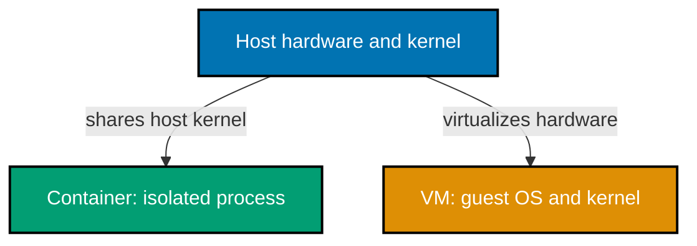

```text
# => containers isolate processes while sharing one host kernel
container = image + isolated-process
# => a VM carries a guest OS and its own guest kernel
virtual-machine = virtual-hardware + guest-os
```

**Verification**: Save the fence as `ex01-runtime-model.txt`. Its first annotation must say `sharing one host kernel`, and its second annotation must say `guest OS and its own guest kernel`; those two observable statements distinguish the runtime models without requiring Docker.

**Key takeaway**: Containers start quickly because they share the host kernel, whereas VMs carry a guest kernel and operating system.

**Why it matters**: Containers start quickly because they share the host kernel, whereas VMs carry a guest kernel and operating system. That difference affects density, boot time, patching responsibility, and isolation boundaries. Choose a VM when a separate kernel is required; choose a container when process isolation is sufficient. Treat both as explicit deployment choices, not interchangeable packaging formats.

---

### Example 2: Namespaces isolation

_ex-02 · exercises co-02_

**Brief explanation**: `lsns` reads Linux namespace handles from procfs, so do not run this on Docker Desktop's non-Linux host. The command makes PID, mount, and network isolation visible on a Linux Docker host.

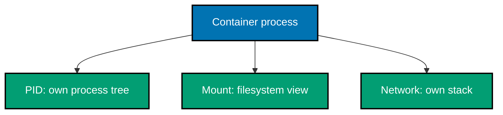

```bash
# => `lsns` reads Linux namespace handles from procfs, so do not run this on Docker Desktop's non-Linux host.
test "$(uname -s)" = Linux
# => starts a process with its own PID, mount, and network namespaces.
docker run -d --name namespaces alpine:3.21 sleep 60
# => lists the namespace handles owned by that named container process.
docker inspect -f '{{.State.Pid}}' namespaces | xargs lsns -p
```

**Verification**: On a Linux Docker host, save the commands as `ex02-namespaces.sh` and run them. `lsns -p "$(docker inspect -f '{{.State.Pid}}' namespaces)"` must list PID, MNT, and NET entries for `namespaces`; remove that exact disposable container with `docker rm -f namespaces`.

**Key takeaway**: PID, mount, and network namespaces give a container its own process tree, filesystem view, and network stack.

**Why it matters**: PID, mount, and network namespaces give a container its own process tree, filesystem view, and network stack. They explain why a process can see PID 1 inside its container while the host sees another PID. Namespace isolation is not a security policy by itself, so combine it with least privilege, cgroup limits, and careful host-kernel patching.

---

### Example 3: cgroups limits

_ex-03 · exercises co-03_

**Brief explanation**: This creates a named, running container whose cgroup limit can be inspected. On cgroup v2, `memory.max` exposes the kernel limit; `docker inspect` supplies a portable Docker-level alternative.

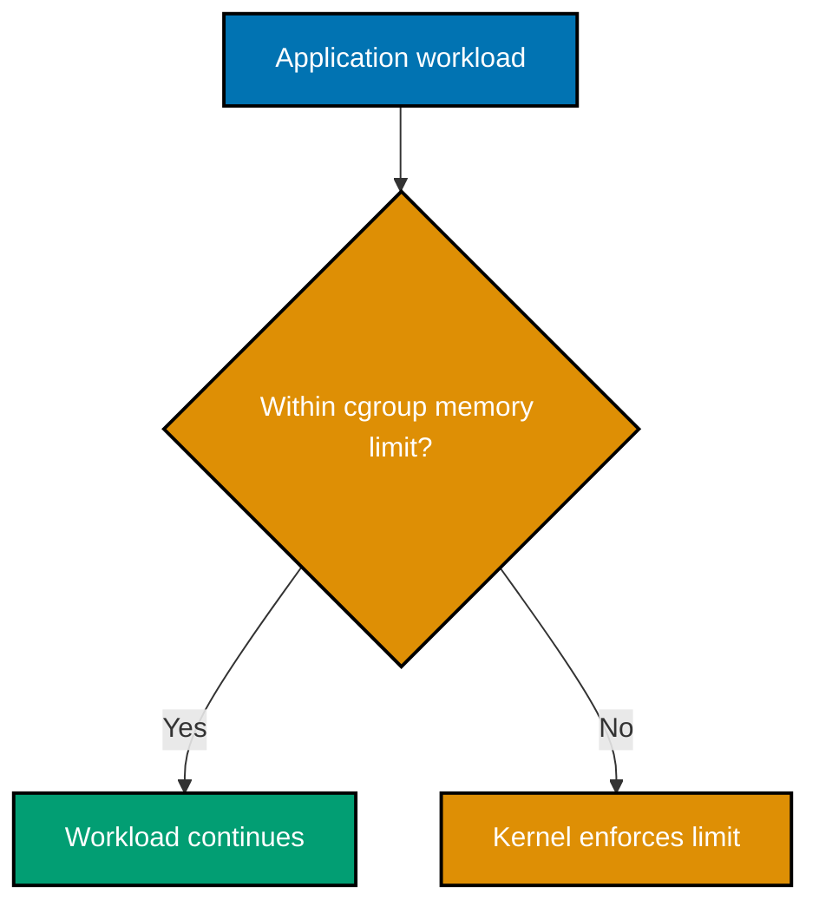

```bash
# => creates a named, running container whose cgroup limit can be inspected.
docker run -d --name ex03-cgroups --memory 64m alpine:3.21 sleep 60
# => Detect whether this Docker host exposes the cgroup v2 memory controller.
if docker exec ex03-cgroups test -e /sys/fs/cgroup/memory.max; then
  # => On cgroup v2, read the kernel memory limit from the running container.
  docker exec ex03-cgroups cat /sys/fs/cgroup/memory.max
else
  # => On cgroup v1, Docker's configured limit supplies the portable assertion.
  docker inspect ex03-cgroups --format '{{.HostConfig.Memory}}'
fi
# => shows the cgroup-enforced usage and limit for that named container only.
docker stats --no-stream ex03-cgroups
```

**Verification**: Save the fence as `ex03-cgroups.sh` and run it on a local Docker host. Its conditional prints `67108864` from `memory.max` on cgroup v2 or from `docker inspect` on cgroup v1; `docker stats --no-stream ex03-cgroups` must show a `64MiB` limit. Remove the exact test container with `docker rm -f ex03-cgroups`.

**Key takeaway**: cgroups make a container memory or CPU budget enforceable instead of aspirational.

**Why it matters**: cgroups make a container memory or CPU budget enforceable instead of aspirational. A process that exceeds a memory limit can be killed, while an unlimited process can starve neighboring workloads. Set limits from measured workload behavior, leave room for bursts, and monitor termination reasons. A small demonstration limit is useful precisely because it exposes the kernel boundary.

---

### Example 4: Image vs container

_ex-04 · exercises co-04_

**Brief explanation**: Image metadata identifies an immutable filesystem package. A container adds writable runtime state and process configuration to that packaged image.

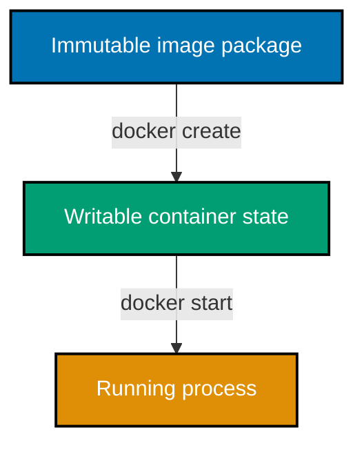

```bash
# => image metadata identifies an immutable filesystem package
docker image inspect alpine:3.21 --format '{{.Id}}'
# => create makes a stopped container instance from that image
docker create --name image-instance alpine:3.21 sleep 60
```

**Verification**: Save the fence as `ex04-image-vs-container.sh` and capture its output in `ex04-image-vs-container.out`. The first command must print an image ID beginning `sha256:`, and `docker container inspect image-instance --format '{{.State.Status}}'` must print `created`; remove `image-instance` afterwards.

**Key takeaway**: An image can be promoted, scanned, and signed as a release artifact, while a container accumulates only runtime state such as logs, writable files, and an exit status.

**Why it matters**: An image can be promoted, scanned, and signed as a release artifact, while a container accumulates only runtime state such as logs, writable files, and an exit status. Rebuilding an image to preserve a production change hides an operational defect; expecting a replacement container to preserve data loses it. Put durable state in a volume or external service, and use the image ID plus container status to distinguish release provenance from an instance that needs replacement.

---

### Example 5: docker run

_ex-05 · exercises co-04_

**Brief explanation**: `docker run` creates and starts an instance, then removes it on exit. The command combines image selection, process arguments, and lifecycle policy in one invocation.

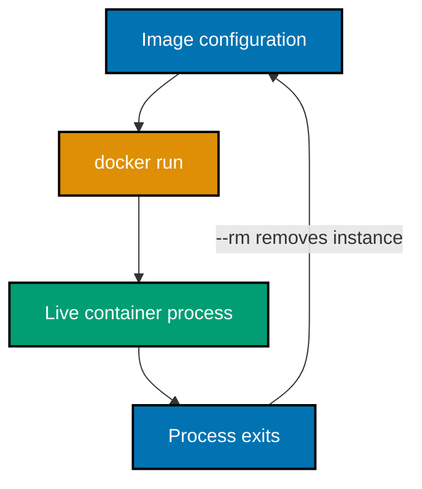

```bash
# => run creates and starts an instance, then removes it on exit
docker run --rm alpine:3.21 echo container-started
# => a container command is the image configuration made live
docker image inspect alpine:3.21 --format '{{.Config.Cmd}}'
```

**Verification**: Save the fence as `ex05-docker-run.sh` and capture its output in `ex05-docker-run.out`. `docker run --rm` must print `container-started`, and the image-inspect command must print Alpine's configured command array. `docker container ls -a --format '{{.Names}}'` must not contain a leftover unnamed container after the first command exits.

**Key takeaway**: `docker run` is convenient because it combines creation and startup, but that also makes a failed invocation easy to lose when `--rm` removes the evidence.

**Why it matters**: `docker run` is convenient because it combines creation and startup, but that also makes a failed invocation easy to lose when `--rm` removes the evidence. In production, choose a clear restart policy and collect logs or exit codes outside the disposable filesystem. Compare the image's default command with the command actually started so an operator can tell whether a failure belongs to image configuration, runtime arguments, or the process itself.

---

### Example 6: Image layers

_ex-06 · exercises co-05_

**Brief explanation**: `docker history` shows the ordered read-only layers selected by the image. The order explains which filesystem changes are reused when later layers remain unchanged.

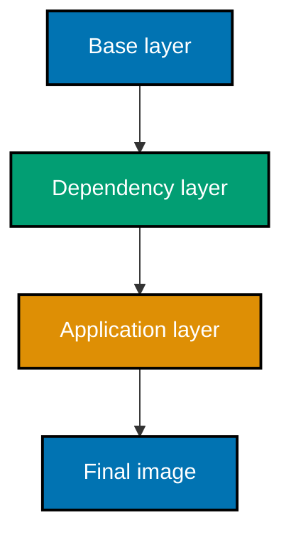

```bash
# => history shows the ordered read-only layers selected by the image
docker history alpine:3.21
# => rootfs layers are shared by containers using this image
docker inspect alpine:3.21 --format '{{json .RootFS.Layers}}'
```

**Verification**: Save the fence as `ex06-image-layers.sh` and capture both commands in `ex06-image-layers.out`. `docker history alpine:3.21` must print more than one layer row, and the JSON emitted by the second command must be a non-empty array of `sha256:` layer digests.

**Key takeaway**: Layers let many containers share unchanged filesystem content, reducing pull time and disk use, but every added or deleted file becomes part of image history.

**Why it matters**: Layers let many containers share unchanged filesystem content, reducing pull time and disk use, but every added or deleted file becomes part of image history. A secret copied into an early layer may remain recoverable even if a later instruction deletes it. Put stable, reusable inputs early; avoid credentials and build debris entirely; and inspect layer history when a supposedly small release image becomes expensive to transfer or scan.

---

### Example 7: Copy-on-write

_ex-07 · exercises co-05_

**Brief explanation**: The write lands in this container's writable layer only. A second container from the same image starts without that changed file because its writable layer is separate.

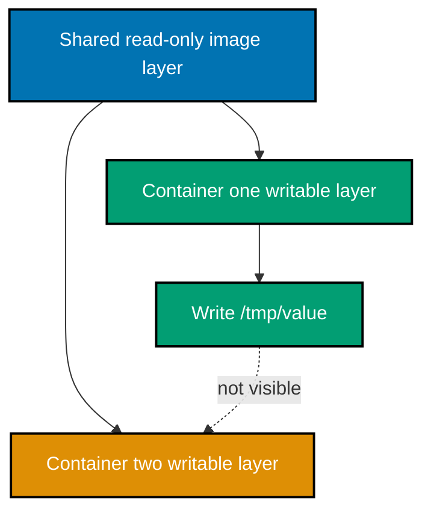

```bash
# => the write lands in this container writable layer only
docker run --name cow-one alpine:3.21 sh -c 'echo changed >/tmp/value'
# => a second instance does not see the first instance writable-layer file
docker run --rm alpine:3.21 test ! -e /tmp/value
```

**Verification**: Save the fence as `ex07-copy-on-write.sh` and capture its exit status in `ex07-copy-on-write.out`. The first command must exit `0` after creating `cow-one`, and the second must also exit `0`, proving `/tmp/value` is absent from its separate container. Remove `cow-one` with `docker rm cow-one` after the check.

**Key takeaway**: Copy-on-write makes image layers cheap to share, yet turns every container-local write into private, disposable state.

**Why it matters**: Copy-on-write makes image layers cheap to share, yet turns every container-local write into private, disposable state. That is useful for temporary caches and generated files, but dangerous for uploads, databases, and one-off configuration changes made through a shell. Design production services so a replacement instance can start from its image and external state alone. Otherwise scaling, rescheduling, or incident recovery silently changes user-visible data.

---

### Example 8: Dockerfile FROM and RUN

_ex-08 · exercises co-06_

**Brief explanation**: `FROM` selects the reproducible base filesystem. `RUN` then records a new image layer, making the package installation part of the build recipe.

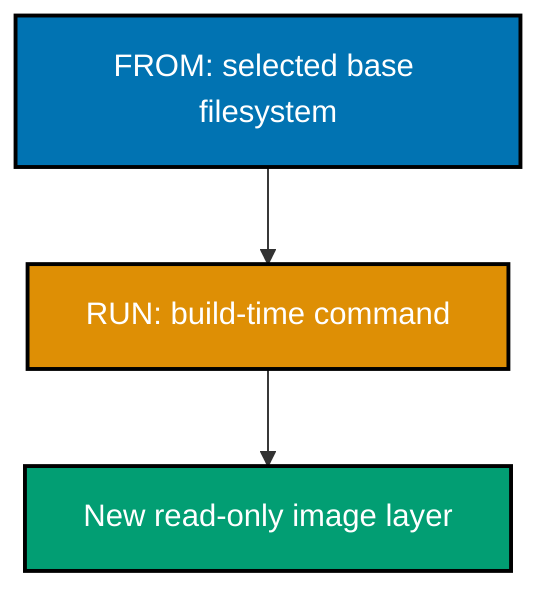

```dockerfile
# => FROM selects the reproducible base filesystem
FROM alpine:3.21
# => RUN creates a new image layer during build
RUN printf 'ready\n' > /message
```

**Verification**: Save the fence as `ex08-from-run/Dockerfile`, build it with `docker build -t ex08-from-run ex08-from-run`, then run `docker run --rm --entrypoint cat ex08-from-run /message`. The command must print `ready`, proving the `RUN` instruction created the file in the image layer.

**Key takeaway**: `FROM` selects both the operating-system behavior and the vulnerability stream inherited by every later instruction.

**Why it matters**: `FROM` selects both the operating-system behavior and the vulnerability stream inherited by every later instruction. `RUN` records build-time mutation, so an unpinned base or an unreviewed package install can make identical source produce different releases. Keep related install and cleanup work in one instruction, rebuild deliberately when the base receives a security update, and verify the final filesystem rather than assuming a successful build made the intended change.

---

### Example 9: Dockerfile COPY

_ex-09 · exercises co-06_

**Brief explanation**: `FROM` makes this fence a complete Dockerfile rather than a fragment. `COPY` transfers a declared build-context file into the image at a deterministic path.

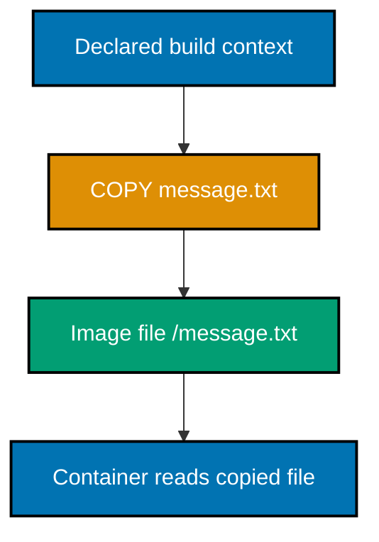

```dockerfile
# => FROM makes this fence a complete Dockerfile rather than a fragment.
FROM alpine:3.21
# => COPY imports a declared build-context file into the image
COPY message.txt /message.txt
# => CMD reads the copied artifact when the container starts
CMD ["cat", "/message.txt"]
```

**Verification**: Save the fence as `ex09-copy/Dockerfile` and add `ex09-copy/message.txt` containing `copied`. Run `docker build -t ex09-copy ex09-copy && docker run --rm ex09-copy`; `ex09-copy.out` must contain exactly `copied`.

**Key takeaway**: `COPY` turns a file in the build context into release content, so its scope is both a reproducibility and a supply-chain decision.

**Why it matters**: `COPY` turns a file in the build context into release content, so its scope is both a reproducibility and a supply-chain decision. Copying a precise manifest makes reviews and cache behavior predictable; copying `.` can accidentally include local credentials, test output, or an outdated binary. In production pipelines, construct the context intentionally and pair this instruction with `.dockerignore`, then test the image's copied value instead of trusting the source workspace.

---

### Example 10: Dockerfile CMD

_ex-10 · exercises co-06_

**Brief explanation**: `FROM` supplies the filesystem used by this complete image. `CMD` defines the default process arguments while still allowing a caller to replace them.

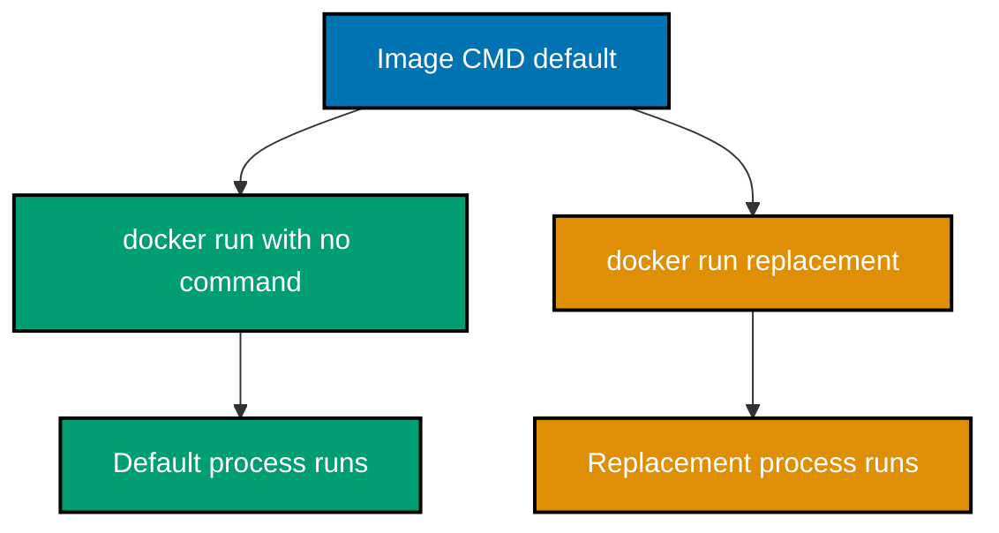

```dockerfile
# => FROM supplies the filesystem used by this complete image.
FROM alpine:3.21
# => CMD provides a default process and arguments
CMD ["echo", "default command"]
```

**Verification**: With Docker, save the fence as `ex10-cmd/Dockerfile`, run `docker build -t ex10-cmd ex10-cmd`, then capture both runs in `ex10-cmd.out`. The first run must print `default command`; `docker run --rm ex10-cmd echo replacement` must print `replacement`.

**Key takeaway**: `CMD` supplies a sensible default for local use and ordinary deployment, but a caller can replace it completely.

**Why it matters**: `CMD` supplies a sensible default for local use and ordinary deployment, but a caller can replace it completely. That flexibility helps run maintenance commands from an image, yet it can bypass the service command expected by health checks, logging, or policy. Keep the default small and explicit, document supported overrides, and validate both paths so production automation does not accidentally launch a shell, a stale argument list, or no long-running process.

---

### Example 11: ENTRYPOINT and CMD interaction

_ex-11 · exercises co-07_

**Brief explanation**: `FROM` supplies the executable used by this complete image. The `ENTRYPOINT` and `CMD` pair separates the fixed program from its replaceable default arguments.

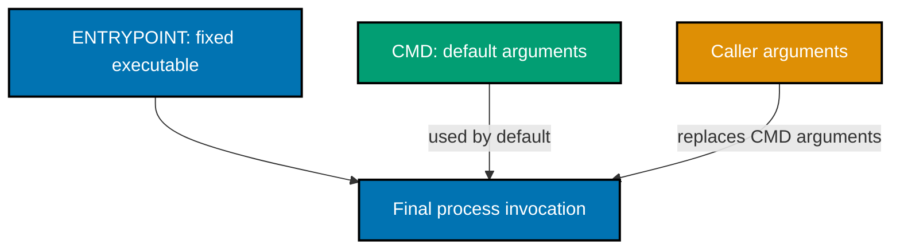

```dockerfile
# => FROM supplies the executable used by this complete image.
FROM alpine:3.21
# => ENTRYPOINT fixes the executable for ordinary invocations
ENTRYPOINT ["echo"]
# => CMD supplies default arguments appended to that executable
CMD ["default argument"]
```

**Verification**: With Docker, save the fence as `ex11-entrypoint/Dockerfile`, run `docker build -t ex11-entrypoint ex11-entrypoint`, and capture both runs in `ex11-entrypoint.out`. The default run must print `default argument`; the run with `replacement` must print `replacement`, showing that only the argument changed.

**Key takeaway**: An exec-form `ENTRYPOINT` protects the executable contract while allowing deployments to vary ordinary arguments through `CMD`.

**Why it matters**: An exec-form `ENTRYPOINT` protects the executable contract while allowing deployments to vary ordinary arguments through `CMD`. This reduces repetition in service manifests and ensures signals reach the intended process, but it can make emergency debugging harder because a bare command becomes an argument rather than a replacement. Choose it when the executable is invariant, provide an intentional override path, and test signal handling and argument replacement before relying on a restart policy.

---

### Example 12: Build-cache order

_ex-12 · exercises co-08_

**Brief explanation**: `FROM` establishes the Node build environment and working directory. Copying dependency metadata before source lets Docker reuse the install layer after source-only changes.

```dockerfile
# => FROM establishes the Node build environment and working directory.
FROM node:24-alpine
# => WORKDIR creates `/app` so later relative paths resolve inside the image.
WORKDIR /app
# => stable dependency metadata is copied before frequently edited source
COPY package.json package-lock.json ./
# => the dependency-install layer is reusable when only source changes
RUN npm ci
```

Save this companion `package.json` and `package-lock.json` in `ex12-cache/`; they make the Dockerfile runnable without an earlier lesson. The JSONC block is the annotated teaching artifact. The exact, copyable strict JSON artifacts are course-owned at `learning/code/ex-12-build-cache/package.json` and `learning/code/ex-12-build-cache/package-lock.json`; copy those files unchanged because JSON itself does not permit comments.

**Annotated companion (JSONC, for explanation):**

```jsonc
// => The opening brace starts the one self-contained JSON object.
{
  // => npm uses this package name to identify the local project.
  "name": "ex12-cache",
  // => The semantic version gives the local package a complete identity.
  "version": "1.0.0",
  // => Version 3 selects npm's current lockfile structure.
  "lockfileVersion": 3,
  // => The root package entry lets npm resolve this dependency-free project.
  "packages": { "": { "name": "ex12-cache", "version": "1.0.0" } },
  // => The closing brace completes the annotated explanation artifact.
}
```

**Copyable companion (strict JSON):** Copy the two exact files from `learning/code/ex-12-build-cache/` into `ex12-cache/`; they intentionally contain the same strict JSON content as the JSONC explanation, without teaching comments.

**Verification**: Save the Dockerfile and copy both strict JSON artifacts from `learning/code/ex-12-build-cache/` into `ex12-cache/`, then run `docker build --progress=plain -t ex12-cache ex12-cache` twice. The second build output contains `CACHED` for `RUN npm ci`, proving source-free dependency metadata forms the cache boundary.

**Key takeaway**: Dependency installation is usually the slowest and most network-dependent build step.

**Why it matters**: Dependency installation is usually the slowest and most network-dependent build step. Copying lockfiles before application source lets a source-only change reuse that layer, reducing CI time and registry traffic. The tradeoff is that lockfiles become a stronger release input: a changed dependency must intentionally invalidate the cache. Keep the install deterministic with `npm ci`, and avoid copying source early just to make a Dockerfile look visually simple.

---

### Example 13: Cache invalidation

_ex-13 · exercises co-08_

**Brief explanation**: Changing a layer invalidates it and every later dependent layer. Earlier unchanged layers remain cache candidates, which is why instruction order affects rebuild cost.

```text
# => changing a layer invalidates it and every later dependent layer
source-change -> COPY source -> build layer
# => unchanged earlier dependency layers remain cache candidates
package-lock unchanged -> npm-ci cache hit
```

**Verification**: Save the fence as `ex13-cache-invalidation.txt`. Its first annotated row must state that a source change invalidates the `COPY source` and build layers, while the second must state `package-lock unchanged -> npm-ci cache hit`; those two observable rows capture the cascade boundary.

**Key takeaway**: Docker must rerun every layer after a changed instruction because later output may depend on it.

**Why it matters**: Docker must rerun every layer after a changed instruction because later output may depend on it. Put changing source and generated metadata late, while keeping stable toolchain and dependency inputs early. This improves incremental builds, but it should never become a reason to cache unverified dependencies indefinitely. When a release unexpectedly rebuilds from scratch, trace the first changed instruction; it often reveals an overly broad `COPY` or a non-deterministic generated input.

---

### Example 14: Multi-stage build

_ex-14 · exercises co-09_

**Brief explanation**: The builder may contain compilers and development dependencies. A separate runtime stage receives only the finished artifact, reducing the image's operational surface.

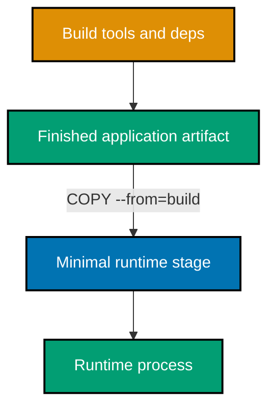

```dockerfile
# => the builder may contain compilers and development dependencies
FROM node:24-alpine AS build
# => this makes a concrete output inside the builder stage
RUN printf 'built\\n' > /app.txt
# => Alpine is the smaller final runtime stage
FROM alpine:3.21
# => the runtime receives only the finished artifact
COPY --from=build /app.txt /app.txt
# => the runtime exposes the copied artifact without Node tooling
CMD ["cat", "/app.txt"]
```

**Verification**: With Docker, save the fence as `ex14-multistage/Dockerfile`, run `docker build -t ex14-multistage ex14-multistage && docker run --rm ex14-multistage`, and capture it in `ex14-multistage.out`. Stdout must be `built`; `docker run --rm --entrypoint node ex14-multistage --version` must fail because the final image has no Node executable.

**Key takeaway**: Build compilers, package managers, and source maps are useful while creating an artifact but increase the size and attack surface of a runtime image.

**Why it matters**: Build compilers, package managers, and source maps are useful while creating an artifact but increase the size and attack surface of a runtime image. A multi-stage build copies only the selected output into the final stage, making that boundary reviewable. The tradeoff is that missing runtime libraries become visible only when the minimal stage runs. Test the final stage directly and keep diagnostic tooling in a separate debug image rather than shipping it by default.

---

### Example 15: Named stages

_ex-15 · exercises co-09_

**Brief explanation**: The `AS` name makes the source stage stable and readable. Later `COPY --from` instructions can refer to that name rather than a fragile numeric stage index.

```dockerfile
# => the AS name makes the source stage stable and readable
FROM node:24-alpine AS build
# => create the output directory before writing the build artifact.
RUN mkdir -p /app
# => the named builder creates the file consumed by the runtime stage
RUN printf 'named-stage\\n' > /app/server.mjs
# => Alpine is the intentionally small final runtime stage
FROM alpine:3.21
# => COPY --from resolves the named stage, not a fragile numeric index
COPY --from=build /app/server.mjs /app/server.mjs
# => cat makes the finished artifact observable at runtime
CMD ["cat", "/app/server.mjs"]
```

**Verification**: With Docker, save the fence as `ex15-named/Dockerfile`, run `docker build -t ex15-named ex15-named && docker run --rm ex15-named`, and capture stdout in `ex15-named.out`. It must be `named-stage`, proving that `COPY --from=build` selected the named producer stage.

**Key takeaway**: A named stage says what it produces, whereas a numeric stage reference silently changes meaning when a maintainer inserts another `FROM`.

**Why it matters**: A named stage says what it produces, whereas a numeric stage reference silently changes meaning when a maintainer inserts another `FROM`. That readability prevents a runtime image from copying the wrong artifact or from an unintended tool-heavy stage. Stage names are an interface inside the Dockerfile: use stable names such as `build`, `test`, and `runtime`, but keep their outputs narrow so a later refactor does not smuggle development dependencies into production.

---

### Example 16: .dockerignore

_ex-16 · exercises co-10_

**Brief explanation**: `.dockerignore` prevents installed dependencies from entering the build context. Excluding unrelated files also avoids cache invalidation and accidental inclusion of workstation artifacts.

```text
# => prevents installed dependencies from entering the build context
node_modules
# => prevents repository history and accidental local secrets from entering
.git
# => exclude local environment files independently of repository metadata
.env
```

**Verification**: Save the fence as `ex16-dockerignore/.dockerignore`. Beneath its annotations, the local file must contain the exact three entries `node_modules`, `.git`, and `.env`; those entries are the observable exclusion rules for installed dependencies, repository history, and environment files.

**Key takeaway**: The build context is uploaded to the builder before any Dockerfile instruction runs, so ignored files protect both speed and confidentiality.

**Why it matters**: The build context is uploaded to the builder before any Dockerfile instruction runs, so ignored files protect both speed and confidentiality. Excluding `node_modules` avoids platform-specific dependency trees; excluding `.git` and `.env` prevents history and local credentials from becoming build inputs. The tradeoff is that an overbroad rule can hide a required generated file. Keep the ignore list reviewed beside the Dockerfile and prove the intended release still builds from a clean checkout.

---

### Example 17: Non-root user

_ex-17 · exercises co-11_

**Brief explanation**: Alpine is a complete base for creating an unprivileged runtime user. Switching to that user before `CMD` limits the process's default filesystem and privilege access.

```dockerfile
# => Alpine is a complete base for creating an unprivileged runtime user.
FROM alpine:3.21
# => creates an explicit runtime identity with no root privileges
RUN adduser -D -u 10001 app
# => USER changes the identity of the application process
USER app
# => id reveals the effective identity when the image starts
CMD ["id", "-u"]
```

**Verification**: With Docker, save the fence as `ex17-user/Dockerfile`, run `docker build -t ex17-user ex17-user && docker run --rm ex17-user`, and capture stdout in `ex17-user.out`. It must be `10001`, not `0`, confirming the image starts under the declared unprivileged UID.

**Key takeaway**: A process exploit is less damaging when the process lacks root privileges inside its container and cannot casually modify root-owned paths.

**Why it matters**: A process exploit is less damaging when the process lacks root privileges inside its container and cannot casually modify root-owned paths. An explicit numeric UID also behaves more predictably across orchestrators and mounted volumes than a distribution-specific username. The tradeoff is file ownership: a volume writable in development may fail in production. Create and test required writable directories with the runtime UID, then pair this image-level control with dropped Linux capabilities and read-only filesystems.

---

### Example 18: Distroless base

_ex-18 · exercises co-11_

**Brief explanation**: Build tooling lives only in the first stage. The distroless runtime carries the application artifact without a shell or package manager for ordinary execution.

```dockerfile
# => build tooling lives only in the first stage
FROM node:24-alpine AS build
# => distroless receives the application runtime artifact without a shell
FROM gcr.io/distroless/nodejs24-debian12
```

**Verification**: Save the fence as `ex18-distroless/Dockerfile`, build it with `docker build -t ex18-distroless ex18-distroless`, and record the result in `ex18-distroless.out`. The build must succeed, while `docker run --rm --entrypoint /bin/sh ex18-distroless -c true` must fail with a missing `/bin/sh`, demonstrating the final runtime lacks an interactive shell.

**Key takeaway**: Distroless images remove shells and package managers, reducing the number of binaries that can contain vulnerabilities or assist an intruder.

**Why it matters**: Distroless images remove shells and package managers, reducing the number of binaries that can contain vulnerabilities or assist an intruder. That smaller attack surface has an operational cost: familiar `exec` debugging commands do not exist. Build the application in a richer stage, make logs and metrics sufficient for routine diagnosis, and provide a separately controlled debug image when incident responders need tools without weakening the production runtime.

---

### Example 19: Small layers

_ex-19 · exercises co-11_

**Brief explanation**: Debian supplies `apt` and a compatible package database for this layer. Combining update, install, and cleanup keeps transient package indexes out of a later image layer.

```dockerfile
# => Debian supplies apt and a compatible package database for this layer.
FROM debian:bookworm-slim
# => one RUN leaves no downloaded package-list *contents* in this layer.
RUN apt-get update && apt-get install -y --no-install-recommends ca-certificates && rm -rf /var/lib/apt/lists/*
# => test the deleted list contents, not the directory which apt may retain.
CMD ["sh", "-c", "test -z \"$(find /var/lib/apt/lists -mindepth 1 -maxdepth 1 -print -quit)\""]
```

**Verification**: With Docker, save the fence as `ex19-small-layer/Dockerfile`, run `docker build -t ex19-small-layer ex19-small-layer && docker run --rm ex19-small-layer`, and record the status in `ex19-small-layer.out`. The container exits `0` only when `/var/lib/apt/lists` has no list entries, proving this build layer removed the downloaded package metadata.

**Key takeaway**: Deleting package indexes in a later instruction does not shrink the earlier layer that already stored them.

**Why it matters**: Deleting package indexes in a later instruction does not shrink the earlier layer that already stored them. Combining update, install, and cleanup keeps temporary metadata out of the committed result, reducing registry transfer and scanner noise. The tradeoff is cache freshness: package indexes should be refreshed whenever dependencies are installed, not reused independently. Pin or review package versions where reproducibility matters, then measure final image size instead of assuming a short Dockerfile is small.

---

### Example 20: OCI specifications

_ex-20 · exercises co-12_

**Brief explanation**: OCI Image specifies manifests, configuration, and layer layout. That shared format lets compatible tools exchange an image without agreeing on one vendor's implementation.

```text
# => OCI Image specifies manifests, configuration, and layer layout
image-spec = portable-image
# => OCI Runtime specifies bundle execution behavior
runtime-spec = portable-process
```

**Verification**: Save the fence as `ex20-oci-specifications.txt`. Its first data row must be `image-spec = portable-image`, and its second must be `runtime-spec = portable-process`; these exact local rows distinguish the two OCI specifications.

**Key takeaway**: OCI image runtime and distribution contracts make transport vendor-independent.

**Why it matters**: OCI image runtime and distribution contracts make transport vendor-independent. Artifact identity determines whether another machine receives the same container content. Inspect the local image reference and its digest, then record both the human release label and immutable content address. This separates convenient naming from reproducible deployment evidence and makes a later rollback or security update an explicit, reviewable change.

---

### Example 21: docker build tag

_ex-21 · exercises co-13_

**Brief explanation**: Write the complete local Dockerfile used by the build command. The tag labels the resulting local image so later run or inspect commands address the intended artifact.

```bash
# => write the complete local Dockerfile used by the build command.
printf 'FROM alpine:3.21\\nCMD ["echo", "ex21-tagged"]\\n' > Dockerfile
# => tags that local image with a repository and human release label.
docker build -t registry.example/hello:1.0 .
# => inspect confirms the tag points to a local image ID
docker image inspect registry.example/hello:1.0 --format '{{.Id}}'
```

**Verification**: In an empty `ex21-docker-build-tag/` directory, save the fence as `build.sh` and run it there. `docker image inspect registry.example/hello:1.0 --format '{{.Id}}'` must print one local image ID beginning `sha256:`, produced from the Dockerfile written by this artifact.

**Key takeaway**: A versioned tag is useful for people, deployment manifests, and release notes, but it is only a mutable label pointing at image content.

**Why it matters**: A versioned tag is useful for people, deployment manifests, and release notes, but it is only a mutable label pointing at image content. Reusing a tag can make two environments run different bytes while appearing to use the same release name. Build tags from an intentional release identifier, record the image ID or digest alongside them, and reserve mutable convenience tags such as `stable` for selection rather than as the sole production identity.

---

### Example 22: Registry push/pull

_ex-22 · exercises co-13_

**Brief explanation**: Precondition: set `EX22_REGISTRY` to a registry namespace you control and have already authenticated to. The push and pull commands then distinguish publishing a tagged image from retrieving it on another local name.

```bash
# => precondition: set EX22_REGISTRY to a registry namespace you control and have already authenticated to.
test -n "${EX22_REGISTRY:-}" && docker info >/dev/null
# => build the local image that is about to be pushed, rather than assuming Example 21 ran first.
printf 'FROM alpine:3.21\\nCMD ["echo", "ex22-registry"]\\n' > Dockerfile && docker build -t "$EX22_REGISTRY/ex22:1.0" .
# => push uploads this exact local tag to the caller-controlled registry namespace.
docker push "$EX22_REGISTRY/ex22:1.0"
# => remove then pull the same reference, proving the registry hand-off.
docker image rm "$EX22_REGISTRY/ex22:1.0" && docker pull "$EX22_REGISTRY/ex22:1.0"
```

**Verification**: In an empty `ex22-registry/` directory, save the fence as `transfer.sh`, set `EX22_REGISTRY` to your authenticated, disposable registry namespace, and run it. `docker image inspect "$EX22_REGISTRY/ex22:1.0" --format '{{.Id}}'` must print an ID after the remove-and-pull transition, verifying this artifact transferred its own locally built image.

**Key takeaway**: Push and pull establish the artifact hand-off between build and runtime machines.

**Why it matters**: Push and pull establish the artifact hand-off between build and runtime machines. Artifact identity determines whether another machine receives the same container content. Inspect the local image reference and its digest, then record both the human release label and immutable content address. This separates convenient naming from reproducible deployment evidence and makes a later rollback or security update an explicit, reviewable change.

---

### Example 23: Tag versus digest

_ex-23 · exercises co-13_

**Brief explanation**: A tag is a mutable pointer that can be retargeted. A digest identifies the specific content-addressed manifest, which makes it the stronger deployment reference.

```text
# => a tag is a mutable pointer that can be retargeted
hello:stable -> current-manifest
# => a digest is a content hash for one immutable manifest
hello@sha256:hash -> exact-manifest
```

**Verification**: Save the fence as `ex23-tag-versus-digest.txt`. The first data row must be `hello:stable -> current-manifest`, while the second must be `hello@sha256:hash -> exact-manifest`; those exact local rows make the mutable-label versus immutable-content distinction observable.

**Key takeaway**: Tags move while a digest identifies one immutable manifest.

**Why it matters**: Tags move while a digest identifies one immutable manifest. Artifact identity determines whether another machine receives the same container content. Inspect the local image reference and its digest, then record both the human release label and immutable content address. This separates convenient naming from reproducible deployment evidence and makes a later rollback or security update an explicit, reviewable change.

---

### Example 24: Digest pin

_ex-24 · exercises co-14_

**Brief explanation**: Pull a named local input, then read its actual registry digest rather than inventing a placeholder. The observed digest can be pinned in a later command without teaching a fake immutable identifier.

```bash
# => pull a named local input, then read its actual registry digest rather than inventing a placeholder.
docker pull alpine:3.21
# => the first RepoDigest is an immutable manifest reference returned by this local engine.
digest="$(docker image inspect alpine:3.21 --format '{{index .RepoDigests 0}}')"
# => pull and inspect the exact resolved digest reference.
docker pull "$digest" && docker image inspect "$digest"
```

**Verification**: Save the fence as `ex24-digest-pin.sh` and run it with Docker. The `digest` variable must contain `alpine@sha256:` and `docker image inspect "$digest" --format '{{.Id}}'` must print an image ID for that exact local registry digest, never a fabricated digest value or mutable tag.

**Key takeaway**: Digest pinning makes rollout repeatable but requires intentional security updates.

**Why it matters**: Digest pinning makes rollout repeatable but requires intentional security updates. Artifact identity determines whether another machine receives the same container content. Inspect the local image reference and its digest, then record both the human release label and immutable content address. This separates convenient naming from reproducible deployment evidence and makes a later rollback or security update an explicit, reviewable change.

---

### Example 25: Bridge network

_ex-25 · exercises co-15_

**Brief explanation**: Docker attaches this container to its built-in `bridge` network by default. The inspected network settings show the container-specific address allocated on that isolated virtual network.

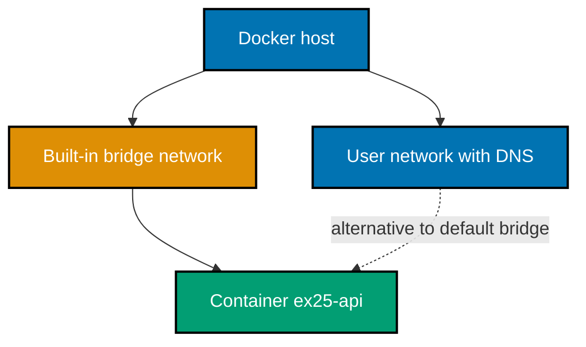

```bash
# => Docker attaches this container to its built-in `bridge` network by default
docker run -d --name ex25-api alpine:3.21 sleep 60
# => inspect reports default bridge membership, not a user-created network
docker inspect ex25-api --format '{{range $name, $_ := .NetworkSettings.Networks}}{{$name}}{{end}}'
```

**Verification**: Save the fence as `ex25-bridge-network.sh`, run it on a local Docker host, and capture the second command in `ex25-bridge-network.out`. It must print exactly `bridge`; clean up the named local container with `docker rm -f ex25-api`.

**Key takeaway**: The default bridge is convenient but lacks user-defined DNS and isolation behavior.

**Why it matters**: The default bridge is convenient but lacks user-defined DNS and isolation behavior. Network mode and port publication define who can reach a process and which isolation boundary remains in force. Inspect the local container network and binding instead of inferring access from the application port alone. Record the actual listener and request result, because defaults differ from a user-defined network and can change service-discovery behavior.

---

### Example 26: Published port

_ex-26 · exercises co-15_

**Brief explanation**: A published port maps a host port to the container listener port. The mapping is explicit external exposure, unlike communication limited to a Docker network.

```bash
# => maps a host port to the container listener port
docker run -d --rm -p 8080:80 --name web nginx:1.27-alpine
# => verifies traffic crosses the published-port boundary
curl --fail http://127.0.0.1:8080/
```

**Verification**: Save the fence as `ex26-published-port.sh` and capture its results in `ex26-published-port.out`. `curl --fail http://127.0.0.1:8080/` must exit `0` and write the NGINX HTML response; `docker port web 80` must print `0.0.0.0:8080` or `[::]:8080`. Remove `web` after the check.

**Key takeaway**: Publishing a port widens a private container boundary to the host.

**Why it matters**: Publishing a port widens a private container boundary to the host. Network mode and port publication define who can reach a process and which isolation boundary remains in force. Inspect the local container network and binding instead of inferring access from the application port alone. Record the actual listener and request result, because defaults differ from a user-defined network and can change service-discovery behavior.

---

### Example 27: Host and none network

_ex-27 · exercises co-15_

**Brief explanation**: Host mode shares the host network stack and reduces isolation. `none` creates the opposite boundary: the process has no configured network interface for ordinary traffic.

```text
# => host mode shares the host network stack and reduces isolation
host -> host-network-stack
# => none mode has no external network connectivity
none -> loopback-only
```

**Verification**: Save the fence as `ex27-host-and-none-network.txt`. Its first data row must be `host -> host-network-stack`, and its second must be `none -> loopback-only`; those two local rows state the observable connectivity boundary without starting a host-networked process.

**Key takeaway**: Host and none drivers trade isolation for direct access or disconnection.

**Why it matters**: Host and none drivers trade isolation for direct access or disconnection. Network mode and port publication define who can reach a process and which isolation boundary remains in force. Inspect the local container network and binding instead of inferring access from the application port alone. Record the actual listener and request result, because defaults differ from a user-defined network and can change service-discovery behavior.

---

← Previous: [Learning Overview](./overview.md) · Next: [Intermediate Examples](./intermediate.md) →
