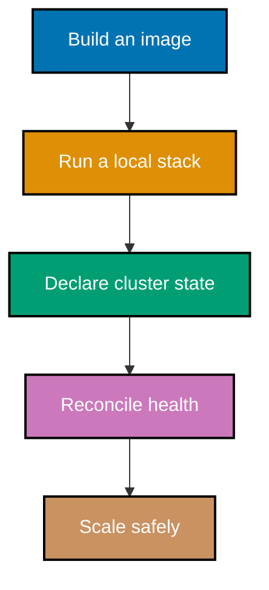
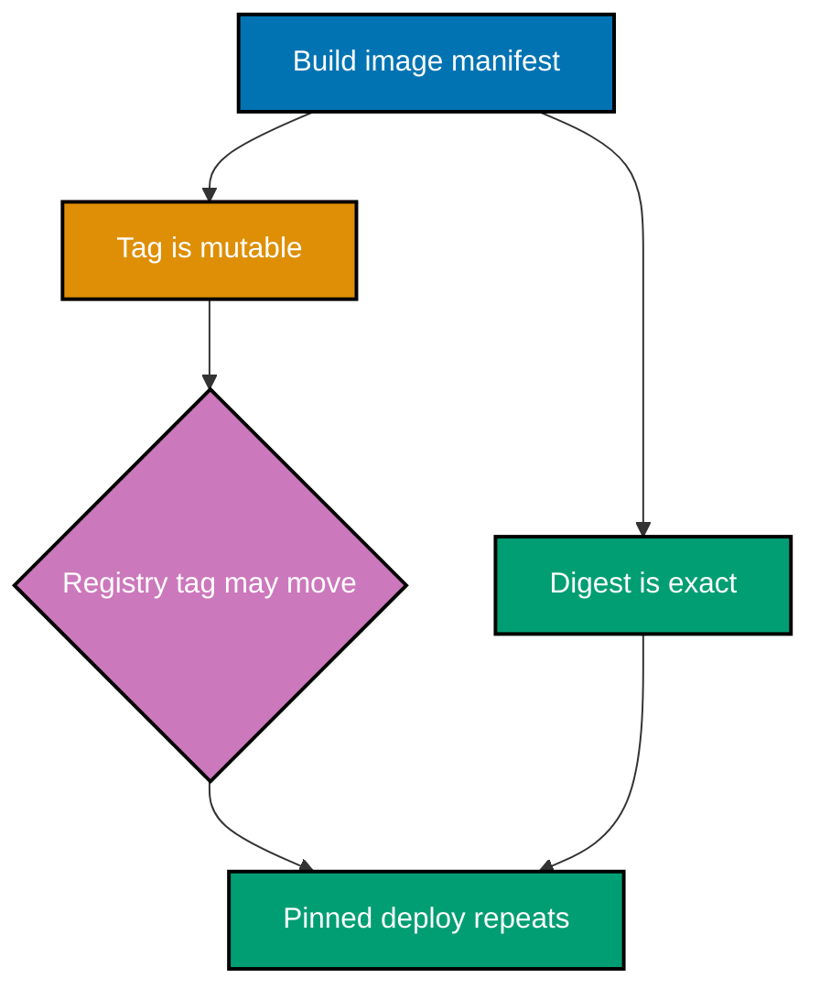
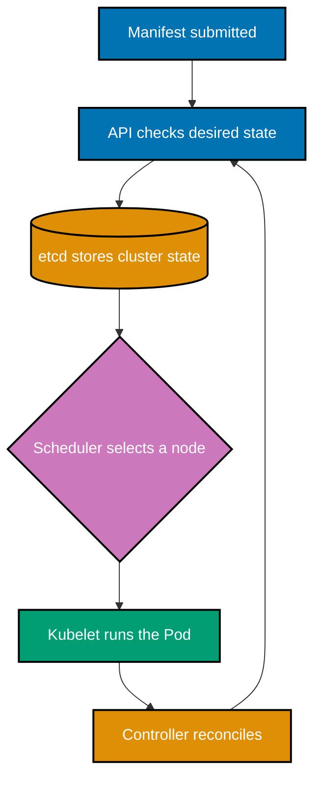

## What you will build

This course moves from a single image to a self-healing, configured HTTP workload. It contains 83
copyable examples: commands use Docker or Podman where noted, and YAML examples use `kubectl` against
a local Kubernetes cluster. Use a throwaway namespace and placeholder values; do not paste real
credentials into any example.

Each example has a short explanation, a diagram when a relationship benefits from one, a runnable
annotated artifact or command, a takeaway, and a production consequence. Commands assume a terminal
with Docker and `kubectl`; Kubernetes examples are declarative files that you can save and apply.

## Concepts

### co-01 · Containers vs virtual machines

Containers isolate processes while sharing the host kernel; virtual machines emulate hardware and boot a guest kernel.

**Why it matters**: Choosing containers instead of virtual machines changes the failure and isolation model. Containers start quickly and pack densely because they share the host kernel, but a kernel vulnerability or incompatible kernel feature is shared too. Virtual machines cost more memory and boot time yet isolate guest kernels. Example 1 makes that trade-off explicit before image or Kubernetes commands hide it.

### co-02 · Namespaces

Linux namespaces give a process an isolated view of identifiers, mounts, networks, and other global resources.

**Why it matters**: A process can appear to own PID 1, a network interface, or a mount tree while the host sees a different global resource. That prevents accidental cross-workload interference, but it can also mislead debugging: a process list inside a container is deliberately incomplete. Example 2 connects each namespace type to the isolated view an operator observes.

### co-03 · Control groups

cgroups account for and constrain CPU, memory, and other resource use by a group of processes.

**Why it matters**: Without cgroup limits, one workload can consume CPU time or memory needed by every neighbour on a node. Limits are not a promise that an application will perform well: memory exhaustion can still end in an OOM kill and CPU limits can throttle it. Example 3 establishes the kernel mechanism later used by Kubernetes resource requests and limits.

### co-04 · Images and containers

An image is an immutable filesystem-and-configuration package; a container is a runnable instance with a writable layer.

**Why it matters**: Treating an image as a running machine encourages mutable, unrepeatable fixes. An image is the immutable input; each container adds its own writable runtime layer and can be discarded. That distinction explains why a successful `docker run` does not preserve a changed file for the next run. Examples 4 and 5 make the build-versus-instance boundary concrete.

### co-05 · Image layers and copy-on-write

Read-only image layers are shared; a container copies a file into its writable layer only when it modifies it.

**Why it matters**: Shared read-only layers reduce disk use and speed distribution, while copy-on-write isolates a container's changes. The first modification of a lower-layer file can create a private copy, so repeated writes have performance and storage consequences. Examples 6 and 7 explain why container filesystem changes disappear with the container and why persistent data belongs in a volume.

### co-06 · Dockerfile instructions

`FROM`, `RUN`, `COPY`, `CMD`, and `ENTRYPOINT` describe a reproducible image build.

**Why it matters**: Dockerfile instructions are a build contract, not a loose installation script. `FROM` selects the trust and runtime baseline; `RUN` creates build layers; `COPY` defines the supplied application; and the runtime instructions define startup behavior. A misplaced instruction can leak build tools, invalidate cache, or start the wrong process. Examples 8–10 verify each resulting artifact.

### co-07 · CMD and ENTRYPOINT

`ENTRYPOINT` establishes the executable; `CMD` supplies defaults that a caller can override.

**Why it matters**: A fixed executable with overrideable defaults makes an image usable in both production and diagnostics. If `CMD` is mistaken for the executable, `docker run image --help` can replace the whole command instead of supplying arguments. Example 11 proves the exec-form `ENTRYPOINT` stays fixed while a caller replaces only the default `CMD` arguments.

### co-08 · Build cache

A changed build instruction invalidates that layer and later layers, so stable inputs belong first.

**Why it matters**: Build cache is ordered dependency tracking. Copying dependency manifests before frequently changing source lets a source-only edit reuse installation work; copying the full source first makes each edit rebuild that expensive layer. Cache reuse improves feedback time, but must never substitute for dependency updates. Examples 12 and 13 show both the beneficial stable prefix and the invalidation cascade.

### co-09 · Multi-stage builds

A named build stage can compile an artifact while a smaller final stage receives only the runtime artifact.

**Why it matters**: Compilers, package managers, and test tools are valuable while building but widen the final image's attack surface and size. A named build stage isolates that tooling, while `COPY --from` transfers only the produced runtime artifact. Examples 14 and 15 verify that a final image can run without carrying the build environment or relying on an unnamed stage position.

### co-10 · .dockerignore

A `.dockerignore` file keeps irrelevant or sensitive paths out of the build context.

**Why it matters**: Every file sent as build context is available to `COPY`, contributes to transfer time, and can accidentally enter an image. Ignoring `node_modules`, Git history, local credentials, and generated output limits both leakage and cache churn. Example 16 verifies that ignored paths never reach the builder, which is stronger than merely omitting them from one Dockerfile instruction.

### co-11 · Image hardening

Small bases, minimal layers, and a non-root runtime user reduce operational and security exposure.

**Why it matters**: Image hardening narrows the set of binaries and privileges available after a compromise. A non-root runtime user prevents many writes by default, while slim or distroless bases exclude interactive shells and package managers. That also complicates ad-hoc debugging, so observability must be designed in. Examples 17–19 make these security, debuggability, and image-size trade-offs visible.

### co-12 · OCI specifications

OCI Image, Runtime, and Distribution specifications make images and runtimes portable across conforming tools.

**Why it matters**: OCI specifications let tools agree on image layout, runtime behavior, and registry distribution without forcing a single vendor daemon. Portability is valuable only when an artifact actually uses the relevant format: a Docker archive is not automatically an OCI archive. Example 20 identifies each specification's responsibility so later Docker–Podman transfer commands can make an accurate interoperability claim.

### co-13 · Registries, tags, and digests

Registries distribute images; tags are mutable names while digests identify immutable content.

**Why it matters**: A registry name tells a deployment where to fetch content, but a tag may later point at different content. A digest identifies the manifest bytes selected at a particular time. Confusing the two makes incident reconstruction and rollback unreliable. Examples 21–23 use build, push, pull, and inspection outputs to show the distribution path and the distinct mutable-name versus immutable-content identities.

### co-14 · Digest pinning

A pull by `@sha256:` digest selects exact content and makes a deployment reproducible.

**Why it matters**: Pinning `image@sha256:...` makes deployment input reproducible across machines and prevents a tag retarget from silently changing what runs. It also freezes security fixes until the declared digest is deliberately updated, tested, and promoted. Example 24 therefore verifies the exact selected digest rather than claiming that a convenient tag such as `latest` is stable.

### co-15 · Container networking

Bridge, host, and none drivers determine isolation; published ports map host traffic into a container.

**Why it matters**: Container networking determines which traffic is reachable and from where. The default bridge gives containers private addressing, port publishing intentionally exposes a host socket, host mode removes network isolation, and none removes normal connectivity. Misunderstanding the default bridge leads to accidental exposure or false assumptions about peer discovery. Examples 25–27 make each driver and published-port boundary observable.

### co-16 · Volumes and bind mounts

A Docker-managed volume persists independent of a container; a bind mount exposes a specific host path.

**Why it matters**: A named volume is storage managed independently of an individual container, whereas a bind mount deliberately couples a container to a host path. Volumes are safer for portable persistent service data; bind mounts are useful for local source iteration but inherit host permissions and layout. Examples 28–30 verify survival and visibility so readers select storage based on operational ownership.

### co-17 · Docker Compose

Compose declares a local multi-service application, including service networking, dependencies, and storage.

**Why it matters**: Compose turns an implicit local runbook into versioned application topology: services, networks, environment, health dependencies, and volumes are declared together. It simplifies development but is not a replacement for Kubernetes scheduling semantics. Examples 31–34 require complete Compose files because a partial application service cannot prove networking, dependency readiness, or multi-service connectivity.

### co-18 · Kubernetes architecture

The control plane stores, schedules, and reconciles desired state while node agents run Pods.

**Why it matters**: Kubernetes behavior comes from cooperating components rather than a single command. The API server accepts desired state, etcd stores it, scheduler assigns Pods, controllers reconcile changes, and kubelet makes containers run on nodes. Diagnosing a pending or unhealthy workload requires knowing which component owns that transition. Example 35 gives each control-plane and node component a specific operational role.

### co-19 · Pods

A Pod is Kubernetes's smallest deployable unit; its containers share network identity and declared storage.

**Why it matters**: A Pod, not an individual container, is Kubernetes's scheduling and networking unit. Containers in the same Pod share an IP address, ports, localhost, and declared volumes, which suits tightly coupled sidecars but not independently scaled services. Examples 36 and 37 show the distinction with self-contained manifests: one scheduled workload versus two containers deliberately sharing the Pod boundary.

### co-20 · Deployments and ReplicaSets

A Deployment manages ReplicaSets and performs controlled declarative rollouts of replicated Pods.

**Why it matters**: Deployments provide controlled convergence from a declared template and replica count, while ReplicaSets maintain the concrete set of Pods. Editing a Pod directly is temporary because its owning controller can replace it. Examples 38–40 inspect replica count, rollout availability, and `ownerReferences`, making clear why production changes belong in the Deployment's desired template instead of a live Pod.

### co-21 · Services

A Service selects Pods and gives a stable virtual address and DNS name independent of individual Pod IPs.

**Why it matters**: Pod IPs change whenever a workload rolls, scales, or self-heals. A Service supplies a stable selector-backed virtual address and DNS name, separating callers from those ephemeral endpoints. Type choice affects exposure: ClusterIP is internal, NodePort opens a node socket, and LoadBalancer depends on infrastructure. Examples 42–45 define every selected workload locally before testing its own Service behavior.

### co-22 · ConfigMaps and Secrets

ConfigMaps hold non-confidential configuration; Secrets carry sensitive data but require real access and encryption controls.

**Why it matters**: Configuration needs different handling according to sensitivity. ConfigMaps can be safely inspected as non-confidential values; Secrets are only base64-encoded API objects unless storage encryption, access control, and delivery discipline protect them. Mounting versus environment injection also affects rotation and accidental logging. Examples 46–48 prove delivery while explicitly preventing the dangerous inference that encoding is encryption.

### co-23 · Namespaces, labels, and selectors

Namespaces scope resources, and labels plus selectors group and target objects.

**Why it matters**: Namespaces create administrative scope, so identically named resources can coexist without an accidental cross-team update. Labels express grouping, while selectors are the binding contract used by Services and controllers. A typo can leave a Service with no endpoints even though Pods are healthy. Examples 49–51 verify exact equality and set-based selection against locally declared labels rather than an unrelated `web` object.

### co-24 · Ingress and Gateway

Ingress defines HTTP(S) routing but needs a controller; Gateway API is the forward-looking traffic API.

**Why it matters**: An Ingress object is routing intent, not a running proxy: an installed controller must implement it. The Ingress API is frozen, so new designs should assess Gateway API while maintaining existing Ingress routes deliberately. Host and path rules must target an actual Service and port in the same namespace. Examples 52–54 make controller dependency and successor status explicit instead of promising reachability from YAML alone.

### co-25 · Health probes

Liveness restarts failed processes, readiness gates traffic, and startup protects slow initialisation.

**Why it matters**: Liveness, readiness, and startup probes make three different operational decisions. A readiness failure removes a Pod from traffic without normally restarting it; liveness restarts a stuck process; startup delays those checks while a slow application boots. Combining them carelessly can cause restart loops or send traffic too early. Examples 55–58 inspect the exact Pod conditions and declared probe values behind each decision.

### co-26 · Resources and QoS

Requests influence scheduling, limits constrain use, and their combination determines Kubernetes QoS.

**Why it matters**: Requests influence scheduling placement and limits constrain runtime consumption, so they must represent observed service behavior rather than guesses. Too-low memory limits produce OOMKilled workloads; too-low CPU limits cause throttling, while inflated requests waste cluster capacity. QoS follows the declared request/limit shape. Examples 59–62 pair manifests with cgroup-v2 inspection and status fields to show the kernel-level effect.

### co-27 · Horizontal Pod Autoscaling

An HPA adjusts replica count from observed metrics and a desired target.

**Why it matters**: An HPA reacts to measured demand, not merely a desired replica count. It needs compatible metrics and a resource request when scaling on utilization; otherwise it can remain unable to calculate a target. The formula also rounds upward, which affects cost and capacity planning. Examples 63 and 64 separate a complete HPA manifest and observable condition from a reproducible calculation.

### co-28 · StatefulSets

A StatefulSet gives replicas stable ordinals, network identities, and optional per-Pod storage.

**Why it matters**: StatefulSets are for workloads whose identity and storage must survive replacement, such as databases, rather than generic stateless HTTP replicas. Ordered ordinal names make peer discovery predictable, and volume claim templates bind storage to each ordinal. That stability constrains rollout and scale behavior. Examples 65 and 66 verify both hostname identity and independently retained claims, not only that Pods happen to be running.

### co-29 · DaemonSets

A DaemonSet places one Pod on every eligible node, useful for node-local agents.

**Why it matters**: DaemonSets are node-oriented: they place one eligible Pod per node for agents such as log collectors, network plugins, or monitoring exporters. They are not a substitute for a replicated application Deployment because node eligibility, taints, and selectors affect coverage. Example 67 compares the DaemonSet's desired count with eligible nodes, making the one-per-node reconciliation contract observable.

### co-30 · Jobs and CronJobs

Jobs run finite work to completion; CronJobs create Jobs on a schedule with at-least-once semantics.

**Why it matters**: Finite batch work should terminate and record completion rather than restart forever like a service. A Job tracks successful Pods; a CronJob creates Jobs on a schedule but can miss or duplicate executions around controller disruption. Work must therefore be idempotent. Examples 68–71 inspect completion counts and controller-created Jobs using the exact Kubernetes-owned labels and resource names.

### co-31 · Reconciliation

Controllers repeatedly compare actual state with desired state and act to close the difference.

**Why it matters**: Reconciliation makes Kubernetes resilient to individual failures because controllers continually compare actual objects with the desired `spec`. It also means manual live edits can be overwritten, and deletion is not necessarily permanent. Example 72 models that loop, while Example 73 deletes a Deployment-owned Pod and observes the controller replace the locally declared workload without an operator recreating it.

### co-32 · Declarative apply

`kubectl apply` records desired object configuration for Kubernetes to reconcile.

**Why it matters**: Declarative `kubectl apply` makes a manifest the reviewable source of desired state and lets controllers converge later; imperative commands perform a one-off mutation that may not be captured in source control. Both have diagnostic uses, but they answer different operational needs. Examples 41 and 74 show the locally supplied file, resulting object, and reconciliation difference instead of treating `apply` as syntax alone.

### co-33 · Podman daemonless operation

Podman launches OCI runtimes without a long-running privileged daemon.

**Why it matters**: Podman's daemonless model changes both privilege boundaries and troubleshooting. `podman run` invokes an OCI runtime for the caller rather than asking a long-lived root daemon to create a container. That reduces a privileged control-plane target, but it does not remove the need to trust images. Examples 80 and 81 inspect engine-specific artifacts while proving only formats actually declared as OCI.

### co-34 · Rootless containers

Rootless containers map container identities to an unprivileged host user and reduce the consequence of a runtime escape.

**Why it matters**: Rootless containers map container users through the invoking account's subordinate ID ranges, so a process that appears privileged inside maps to an unprivileged host identity. This lowers the consequence of a runtime escape but does not make vulnerabilities harmless. Example 80 verifies the mapping with rootless-safe inspection and avoids assuming Linux-only namespace tooling exists on macOS hosts.

### co-35 · Podman Compose and Quadlet

Podman Compose delegates Compose support, while Quadlet expresses containers as systemd-managed units.

**Why it matters**: Compose compatibility through Podman depends on an external compose provider, whereas Quadlet turns a declared container into a user-systemd unit with lifecycle, restart, and boot integration. This is a different operational model from manually starting a CLI process. Example 82 supplies its own `.container` unit and verifies `systemctl --user` manages the generated service without claiming unsupported host-wide behavior.

## Examples by Level

### Beginner (Examples 1–27)

- [Example 1: Containers vs virtual machines](/en/learn/courses/containers-and-orchestration/learning/beginner#example-1-containers-vs-virtual-machines)
- [Example 2: Namespaces isolation](/en/learn/courses/containers-and-orchestration/learning/beginner#example-2-namespaces-isolation)
- [Example 3: cgroups limits](/en/learn/courses/containers-and-orchestration/learning/beginner#example-3-cgroups-limits)
- [Example 4: Image vs container](/en/learn/courses/containers-and-orchestration/learning/beginner#example-4-image-vs-container)
- [Example 5: docker run](/en/learn/courses/containers-and-orchestration/learning/beginner#example-5-docker-run)
- [Example 6: Image layers](/en/learn/courses/containers-and-orchestration/learning/beginner#example-6-image-layers)
- [Example 7: Copy-on-write](/en/learn/courses/containers-and-orchestration/learning/beginner#example-7-copy-on-write)
- [Example 8: Dockerfile FROM and RUN](/en/learn/courses/containers-and-orchestration/learning/beginner#example-8-dockerfile-from-and-run)
- [Example 9: Dockerfile COPY](/en/learn/courses/containers-and-orchestration/learning/beginner#example-9-dockerfile-copy)
- [Example 10: Dockerfile CMD](/en/learn/courses/containers-and-orchestration/learning/beginner#example-10-dockerfile-cmd)
- [Example 11: ENTRYPOINT and CMD interaction](/en/learn/courses/containers-and-orchestration/learning/beginner#example-11-entrypoint-and-cmd-interaction)
- [Example 12: Build-cache order](/en/learn/courses/containers-and-orchestration/learning/beginner#example-12-build-cache-order)
- [Example 13: Cache invalidation](/en/learn/courses/containers-and-orchestration/learning/beginner#example-13-cache-invalidation)
- [Example 14: Multi-stage build](/en/learn/courses/containers-and-orchestration/learning/beginner#example-14-multi-stage-build)
- [Example 15: Named stages](/en/learn/courses/containers-and-orchestration/learning/beginner#example-15-named-stages)
- [Example 16: .dockerignore](/en/learn/courses/containers-and-orchestration/learning/beginner#example-16-dockerignore)
- [Example 17: Non-root user](/en/learn/courses/containers-and-orchestration/learning/beginner#example-17-non-root-user)
- [Example 18: Distroless base](/en/learn/courses/containers-and-orchestration/learning/beginner#example-18-distroless-base)
- [Example 19: Small layers](/en/learn/courses/containers-and-orchestration/learning/beginner#example-19-small-layers)
- [Example 20: OCI specifications](/en/learn/courses/containers-and-orchestration/learning/beginner#example-20-oci-specifications)
- [Example 21: docker build tag](/en/learn/courses/containers-and-orchestration/learning/beginner#example-21-docker-build-tag)
- [Example 22: Registry push/pull](/en/learn/courses/containers-and-orchestration/learning/beginner#example-22-registry-pushpull)
- [Example 23: Tag versus digest](/en/learn/courses/containers-and-orchestration/learning/beginner#example-23-tag-versus-digest)
- [Example 24: Digest pin](/en/learn/courses/containers-and-orchestration/learning/beginner#example-24-digest-pin)
- [Example 25: Bridge network](/en/learn/courses/containers-and-orchestration/learning/beginner#example-25-bridge-network)
- [Example 26: Published port](/en/learn/courses/containers-and-orchestration/learning/beginner#example-26-published-port)
- [Example 27: Host and none network](/en/learn/courses/containers-and-orchestration/learning/beginner#example-27-host-and-none-network)

### Intermediate (Examples 28–55)

- [Example 28: Named volume](/en/learn/courses/containers-and-orchestration/learning/intermediate#example-28-named-volume)
- [Example 29: Bind mount](/en/learn/courses/containers-and-orchestration/learning/intermediate#example-29-bind-mount)
- [Example 30: Volume versus bind mount](/en/learn/courses/containers-and-orchestration/learning/intermediate#example-30-volume-versus-bind-mount)
- [Example 31: Compose two services](/en/learn/courses/containers-and-orchestration/learning/intermediate#example-31-compose-two-services)
- [Example 32: Compose up](/en/learn/courses/containers-and-orchestration/learning/intermediate#example-32-compose-up)
- [Example 33: Compose networking and depends_on](/en/learn/courses/containers-and-orchestration/learning/intermediate#example-33-compose-networking-and-depends_on)
- [Example 34: Compose app, DB, and cache](/en/learn/courses/containers-and-orchestration/learning/intermediate#example-34-compose-app-db-and-cache)
- [Example 35: Kubernetes architecture](/en/learn/courses/containers-and-orchestration/learning/intermediate#example-35-kubernetes-architecture)
- [Example 36: Pod manifest](/en/learn/courses/containers-and-orchestration/learning/intermediate#example-36-pod-manifest)
- [Example 37: Multi-container Pod](/en/learn/courses/containers-and-orchestration/learning/intermediate#example-37-multi-container-pod)
- [Example 38: Deployment manifest](/en/learn/courses/containers-and-orchestration/learning/intermediate#example-38-deployment-manifest)
- [Example 39: Rolling update](/en/learn/courses/containers-and-orchestration/learning/intermediate#example-39-rolling-update)
- [Example 40: ReplicaSet ownership](/en/learn/courses/containers-and-orchestration/learning/intermediate#example-40-replicaset-ownership)
- [Example 41: kubectl apply](/en/learn/courses/containers-and-orchestration/learning/intermediate#example-41-kubectl-apply)
- [Example 42: ClusterIP Service](/en/learn/courses/containers-and-orchestration/learning/intermediate#example-42-clusterip-service)
- [Example 43: NodePort Service](/en/learn/courses/containers-and-orchestration/learning/intermediate#example-43-nodeport-service)
- [Example 44: LoadBalancer Service](/en/learn/courses/containers-and-orchestration/learning/intermediate#example-44-loadbalancer-service)
- [Example 45: Service DNS discovery](/en/learn/courses/containers-and-orchestration/learning/intermediate#example-45-service-dns-discovery)
- [Example 46: ConfigMap environment injection](/en/learn/courses/containers-and-orchestration/learning/intermediate#example-46-configmap-environment-injection)
- [Example 47: Secret injection](/en/learn/courses/containers-and-orchestration/learning/intermediate#example-47-secret-injection)
- [Example 48: Secret encoding is not encryption](/en/learn/courses/containers-and-orchestration/learning/intermediate#example-48-secret-encoding-is-not-encryption)
- [Example 49: Namespace](/en/learn/courses/containers-and-orchestration/learning/intermediate#example-49-namespace)
- [Example 50: Labels and selectors](/en/learn/courses/containers-and-orchestration/learning/intermediate#example-50-labels-and-selectors)
- [Example 51: Set-based selector](/en/learn/courses/containers-and-orchestration/learning/intermediate#example-51-set-based-selector)
- [Example 52: Ingress manifest](/en/learn/courses/containers-and-orchestration/learning/intermediate#example-52-ingress-manifest)
- [Example 53: Ingress controller required](/en/learn/courses/containers-and-orchestration/learning/intermediate#example-53-ingress-controller-required)
- [Example 54: Ingress frozen and Gateway API](/en/learn/courses/containers-and-orchestration/learning/intermediate#example-54-ingress-frozen-and-gateway-api)
- [Example 55: Liveness probe](/en/learn/courses/containers-and-orchestration/learning/intermediate#example-55-liveness-probe)

### Advanced (Examples 56–83)

- [Example 56: Readiness probe](/en/learn/courses/containers-and-orchestration/learning/advanced#example-56-readiness-probe)
- [Example 57: Startup probe](/en/learn/courses/containers-and-orchestration/learning/advanced#example-57-startup-probe)
- [Example 58: Probe defaults](/en/learn/courses/containers-and-orchestration/learning/advanced#example-58-probe-defaults)
- [Example 59: Resource requests](/en/learn/courses/containers-and-orchestration/learning/advanced#example-59-resource-requests)
- [Example 60: Resource limits](/en/learn/courses/containers-and-orchestration/learning/advanced#example-60-resource-limits)
- [Example 61: QoS classes](/en/learn/courses/containers-and-orchestration/learning/advanced#example-61-qos-classes)
- [Example 62: OOMKilled](/en/learn/courses/containers-and-orchestration/learning/advanced#example-62-oomkilled)
- [Example 63: HorizontalPodAutoscaler](/en/learn/courses/containers-and-orchestration/learning/advanced#example-63-horizontalpodautoscaler)
- [Example 64: HPA formula](/en/learn/courses/containers-and-orchestration/learning/advanced#example-64-hpa-formula)
- [Example 65: StatefulSet](/en/learn/courses/containers-and-orchestration/learning/advanced#example-65-statefulset)
- [Example 66: StatefulSet storage](/en/learn/courses/containers-and-orchestration/learning/advanced#example-66-statefulset-storage)
- [Example 67: DaemonSet](/en/learn/courses/containers-and-orchestration/learning/advanced#example-67-daemonset)
- [Example 68: Job](/en/learn/courses/containers-and-orchestration/learning/advanced#example-68-job)
- [Example 69: Job parallelism](/en/learn/courses/containers-and-orchestration/learning/advanced#example-69-job-parallelism)
- [Example 70: CronJob](/en/learn/courses/containers-and-orchestration/learning/advanced#example-70-cronjob)
- [Example 71: CronJob at-least-once caveat](/en/learn/courses/containers-and-orchestration/learning/advanced#example-71-cronjob-at-least-once-caveat)
- [Example 72: Reconciliation loop](/en/learn/courses/containers-and-orchestration/learning/advanced#example-72-reconciliation-loop)
- [Example 73: Self-heal Pod deletion](/en/learn/courses/containers-and-orchestration/learning/advanced#example-73-self-heal-pod-deletion)
- [Example 74: Declarative versus imperative](/en/learn/courses/containers-and-orchestration/learning/advanced#example-74-declarative-versus-imperative)
- [Example 75: Scale Deployment](/en/learn/courses/containers-and-orchestration/learning/advanced#example-75-scale-deployment)
- [Example 76: Rollback Deployment](/en/learn/courses/containers-and-orchestration/learning/advanced#example-76-rollback-deployment)
- [Example 77: ConfigMap volume mount](/en/learn/courses/containers-and-orchestration/learning/advanced#example-77-configmap-volume-mount)
- [Example 78: Environment injection](/en/learn/courses/containers-and-orchestration/learning/advanced#example-78-environment-injection)
- [Example 79: Build, ship, run](/en/learn/courses/containers-and-orchestration/learning/advanced#example-79-build-ship-run)
- [Example 80: Rootless Podman run](/en/learn/courses/containers-and-orchestration/learning/advanced#example-80-rootless-podman-run)
- [Example 81: Docker–Podman OCI parity](/en/learn/courses/containers-and-orchestration/learning/advanced#example-81-dockerpodman-oci-parity)
- [Example 82: Quadlet systemd unit](/en/learn/courses/containers-and-orchestration/learning/advanced#example-82-quadlet-systemd-unit)
- [Example 83: Containers capstone](/en/learn/courses/containers-and-orchestration/learning/advanced#example-83-containers-capstone)

---

← Previous: [Course Overview](../overview.md) · Next: [Beginner Examples](./beginner.md) →

## Sources

- [Dockerfile reference](https://docs.docker.com/reference/dockerfile/) — image build instructions,
  `CMD`, and `ENTRYPOINT`.
- [Docker Compose reference](https://docs.docker.com/reference/compose-file/) — current Compose file
  model and service dependency syntax.
- [Kubernetes workload resources](https://kubernetes.io/docs/concepts/workloads/) — Pods,
  Deployments, StatefulSets, DaemonSets, Jobs, and CronJobs.
- [Linux namespaces](https://man7.org/linux/man-pages/man7/namespaces.7.html) and
  [control groups](https://man7.org/linux/man-pages/man7/cgroups.7.html) — kernel isolation and
  resource-control mechanisms beneath container runtimes.
- [Kubernetes architecture](https://kubernetes.io/docs/concepts/architecture/) — API server, etcd,
  scheduler, controllers, kubelet, and kube-proxy responsibilities.
- [Kubernetes Services and networking](https://kubernetes.io/docs/concepts/services-networking/) —
  Service types, DNS, Ingress, and Gateway API direction.
- [Kubernetes configuration](https://kubernetes.io/docs/concepts/configuration/) — ConfigMaps,
  Secrets, probes, resources, and autoscaling.
- [Kubernetes namespaces](https://kubernetes.io/docs/concepts/overview/working-with-objects/namespaces/)
  and [labels and selectors](https://kubernetes.io/docs/concepts/overview/working-with-objects/labels/)
  — resource scoping and object-selection semantics.
- [OCI specifications](https://opencontainers.org/) — portable image, runtime, and distribution
  standards used by Docker and Podman.
- [Podman documentation](https://docs.podman.io/) — rootless operation, image archives, and Quadlet.
