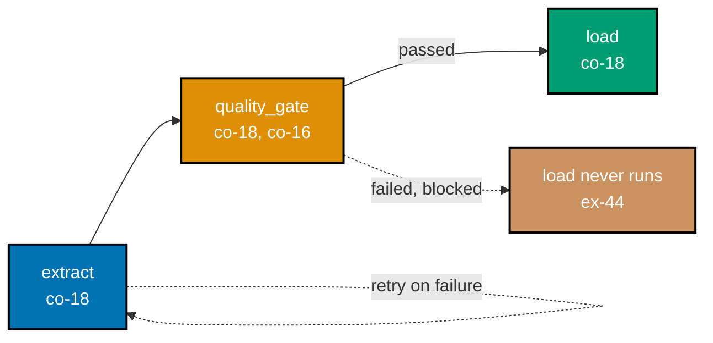

Examples 39-52 close out this topic with four clusters: data contracts as an enforceable,
build-failing schema guarantee, co-located with the producer (co-17); DAG orchestration --
dependencies, retries, schedule/catchup, a quality gate, and backfill (co-18); table- and
column-level lineage for impact analysis (co-19); both flavors of Change Data Capture, and why they
differ on deletes (co-20); and why exactly-once inside an engine still needs an idempotent sink at
the boundary (co-21), closing with the append-only log as the source of truth every derived table is
just one replay of (co-12, co-05). Every worked example's real, runnable **Python 3.13** file lives
under `learning/code/ex-NN-*/`, run for real with genuine captured output. Every example in this
band is pure Python -- Airflow's DAG semantics are simulated in-memory, matching this course's
no-live-service discipline. (See this topic's [Accuracy notes](../overview.md#accuracy-notes) for
the note on Airflow 3's `schedule_interval` &rarr; `schedule` rename.)

---

### Worked Example 39: Data Contract -- Enforce a Producer Schema

_ex-39 &middot; exercises co-17_

**Context**: **co-17 -- data-contracts** is a producer-side, enforceable schema guarantee that
fails the build on drift, matching dbt's own "model contracts" -- columns, types, and not-null
constraints. This example enforces a three-column contract against a conforming batch and a
type-drifted batch, verifying the drift is caught with the exact violating field named.

```python
# learning/code/ex-39-data-contract-schema-enforce/data_contract_schema_enforce.py
"""Worked Example 39: Data Contract -- Enforce a Producer Schema."""  # => co-17: this file's own restated purpose, doubling as its module __doc__

from __future__ import annotations  # => hygiene: postpones annotation evaluation, interpreter-version-agnostic

CONTRACT = {  # => co-17: the PRODUCER's own enforceable promise -- columns, types, and not-null, checked BEFORE the build proceeds
    "order_id": {"type": int, "nullable": False},  # => co-17: required column 1 -- INTEGER, never null
    "amount": {"type": float, "nullable": False},  # => co-17: required column 2 -- FLOAT, never null
    "status": {"type": str, "nullable": True},  # => co-17: required column 3 -- STRING, nulls allowed
}  # => co-17: closes CONTRACT -- dbt's own "model contracts" enforce exactly this shape, failing the build on drift


def enforce_contract(batch: list[dict[str, object]], contract: dict[str, dict[str, object]]) -> tuple[bool, str]:  # => co-17: the enforcement itself
    """Fail the build (return False) the moment any row violates the contract's columns, types, or nullability."""  # => co-17: documents enforce_contract's contract -- no runtime output, just sets its __doc__
    for row_index, row in enumerate(batch):  # => co-17: check every row -- one violation anywhere fails the WHOLE build
        for column, rule in contract.items():  # => co-17: check every contracted column against this row
            if column not in row:  # => co-17: SCHEMA DRIFT -- a contracted column is entirely missing from this row
                return False, f"row {row_index}: missing contracted column {column!r}"  # => co-17: fail closed, name the exact drift
            value = row[column]  # => co-17: this row's value for the contracted column
            if value is None:  # => co-17: a null value -- only acceptable if the contract explicitly allows it
                if not rule["nullable"]:  # => co-17: this column's contract forbids null
                    return False, f"row {row_index}: {column!r} is null but the contract forbids that"  # => co-17: fail closed
                continue  # => co-17: null, but ALLOWED by contract -- move on to the next column
            if not isinstance(value, rule["type"]):  # => co-17: WRONG TYPE -- present, but not the contracted type
                return False, f"row {row_index}: {column!r} has type {type(value).__name__}, contract requires {rule['type'].__name__}"  # => co-17
    return True, "every row satisfies the contract"  # => co-17: reached only if EVERY row, EVERY column, passed


if __name__ == "__main__":  # => co-17: entry point -- runs only when this file executes directly, not on import
    conforming_batch = [{"order_id": 1, "amount": 10.5, "status": "shipped"}, {"order_id": 2, "amount": 20.0, "status": None}]  # => co-17: satisfies CONTRACT
    drifted_batch = [{"order_id": 1, "amount": "not-a-number", "status": "shipped"}]  # => co-17: amount is a STRING, not a float -- schema drift

    conforming_passed, conforming_reason = enforce_contract(conforming_batch, CONTRACT)  # => co-17: check the conforming batch
    drifted_passed, drifted_reason = enforce_contract(drifted_batch, CONTRACT)  # => co-17: check the drifted batch
    print(f"Conforming batch: passed={conforming_passed} ({conforming_reason})")  # => co-17: prints the conforming result
    print(f"Drifted batch: passed={drifted_passed} ({drifted_reason})")  # => co-17: prints the drifted result, with the exact reason

    assert conforming_passed is True, "a batch matching every contracted column/type/nullability rule must pass"  # => co-17: the claim
    assert drifted_passed is False, "a schema-drifting batch (wrong type) must fail the build, not silently proceed"  # => co-17: the claim
    print("MATCH: the conforming batch passes; the type-drifted batch fails the build BEFORE it reaches downstream tables")  # => co-17
    # => co-17: a data contract fails the BUILD on drift -- the alternative (silent drift) corrupts every downstream consumer instead
```

**Run**: `python3 data_contract_schema_enforce.py`

**Output**:

```text
Conforming batch: passed=True (every row satisfies the contract)
Drifted batch: passed=False (row 0: 'amount' has type str, contract requires float)
MATCH: the conforming batch passes; the type-drifted batch fails the build BEFORE it reaches downstream tables
```

**Verify**: `enforce_contract` returns `True` for the conforming batch and `False` with a reason
naming the exact violation (`'amount' has type str, contract requires float`) for the drifted batch,
satisfying co-17's fail-the-build-on-drift contract.

**Key takeaway**: a data contract is a mechanical, enforceable check -- every row, every contracted
column, checked for presence, type, and nullability -- returning a specific, named reason the
instant a violation occurs.

**Why It Matters**: without an enforced contract, a producer's schema change (a renamed column, a
type swap) drifts silently into every downstream consumer, each discovering the break in a different
way, at a different time, usually well after the change shipped. Failing the build immediately, at
the producer, catches the problem at its cheapest possible point to fix.

---

### Worked Example 40: Contract Close to the Producer

_ex-40 &middot; exercises co-17_

**Context**: co-17's placement rule: co-locate the contract check with the model that produces the
data, so it runs immediately after production, before any downstream reader is exposed. This
example traces the call order of produce, contract-check, and downstream-read, verifying
`downstream_read` never executes on a drifted row.

```python
# learning/code/ex-40-contract-close-to-producer/contract_close_to_producer.py
"""Worked Example 40: Contract Close to the Producer."""  # => co-17: this file's own restated purpose, doubling as its module __doc__

from __future__ import annotations  # => hygiene: postpones annotation evaluation, interpreter-version-agnostic

CALL_LOG: list[str] = []  # => co-17: records the ORDER in which produce, contract-check, and downstream-read actually run


def produce_row() -> dict[str, object]:  # => co-17: the MODEL that produces this row -- the contract must sit right here, not downstream
    """Produce one row -- a deliberately drifted one, missing its required 'amount' column."""  # => co-17: documents produce_row's contract -- no runtime output, just sets its __doc__
    CALL_LOG.append("produce")  # => co-17: log this stage's participation
    return {"order_id": 99}  # => co-17: DRIFTED -- missing the contracted 'amount' column entirely


def check_contract_at_produce_time(row: dict[str, object]) -> bool:  # => co-17: co-located WITH the producing model, run IMMEDIATELY after produce
    """Check the contract immediately after production, before this row can reach any downstream reader."""  # => co-17: documents check_contract_at_produce_time's contract -- no runtime output, just sets its __doc__
    CALL_LOG.append("contract_check")  # => co-17: log this stage's participation -- happens BEFORE any downstream read
    return "amount" in row  # => co-17: the SAME kind of check ex-39 built, run at the earliest possible point


def downstream_read(row: dict[str, object]) -> str:  # => co-17: a downstream consumer -- should NEVER be reached if the contract failed
    """A downstream consumer reading this row -- must never execute against a contract-violating row."""  # => co-17: documents downstream_read's contract -- no runtime output, just sets its __doc__
    CALL_LOG.append("downstream_read")  # => co-17: log this stage's participation -- reached ONLY if the contract passed
    return f"processing order {row['order_id']}"  # => co-17: only safe to run once the contract has already been verified


if __name__ == "__main__":  # => co-17: entry point -- runs only when this file executes directly, not on import
    row = produce_row()  # => co-17: stage 1 -- PRODUCE
    contract_ok = check_contract_at_produce_time(row)  # => co-17: stage 2 -- CONTRACT CHECK, co-located right after produce
    print(f"Call order so far: {CALL_LOG} | Contract passed: {contract_ok}")  # => co-17: prints the call order and the contract's verdict
    if contract_ok:  # => co-17: downstream_read runs ONLY if the contract passed -- gated, not unconditional
        downstream_read(row)  # => co-17: this line must NOT execute for a drifted row
    print(f"Final call order: {CALL_LOG}")  # => co-17: prints the complete, final call order

    assert CALL_LOG == ["produce", "contract_check"], "downstream_read must never run once the contract check fails"  # => co-17: the claim
    assert contract_ok is False, "this deliberately drifted row must fail its contract check"  # => co-17: sanity check on the fixture
    print("MATCH: the contract check ran immediately after produce, and downstream_read never executed on the drifted row")  # => co-17
    # => co-17: co-locating the check with the producer is what catches drift at its SOURCE, before ANY downstream reader is exposed
```

**Run**: `python3 contract_close_to_producer.py`

**Output**:

```text
Call order so far: ['produce', 'contract_check'] | Contract passed: False
Final call order: ['produce', 'contract_check']
MATCH: the contract check ran immediately after produce, and downstream_read never executed on the drifted row
```

**Verify**: `CALL_LOG` ends at exactly `["produce", "contract_check"]` -- `downstream_read` never
appears, because the contract check failed and gated it -- satisfying co-17's co-located,
produce-time enforcement contract.

**Key takeaway**: co-locating the contract check with the producer, and running it immediately after
production, is what prevents a drifted row from ever reaching a downstream reader at all -- not just
detecting the drift eventually, somewhere downstream.

**Why It Matters**: a contract check that runs downstream, after several consumers have already read
the drifted data, only tells you damage has already happened. Running it at produce time, gated
before any downstream read, is the difference between "the build failed, nothing downstream was
affected" and "three dashboards are now wrong and someone has to figure out why."

---

### Worked Example 41: DAG Task Dependencies -- Topological Order

_ex-41 &middot; exercises co-18_

**Context**: **co-18 -- orchestration-dag** wires tasks with dependencies; the scheduler runs each
task once its dependencies are met, per Apache Airflow's own docs. This example computes the
topological run order for a three-task `extract -> transform -> load` DAG and verifies every
dependency edge is respected.

```python
# learning/code/ex-41-dag-task-dependencies/dag_task_dependencies.py
"""Worked Example 41: DAG Task Dependencies -- Topological Order."""  # => co-18: this file's own restated purpose, doubling as its module __doc__

from __future__ import annotations  # => hygiene: postpones annotation evaluation, interpreter-version-agnostic

DEPENDENCIES = {  # => co-18: task -> the set of tasks it depends on -- Airflow's own "wires tasks with dependencies" shape
    "extract": set(),  # => co-18: extract has no upstream dependency -- it can run first
    "transform": {"extract"},  # => co-18: transform depends on extract having already run
    "load": {"transform"},  # => co-18: load depends on transform having already run
}  # => co-18: closes DEPENDENCIES -- a simple three-task, linear DAG: extract -> transform -> load


def topological_order(dependencies: dict[str, set[str]]) -> list[str]:  # => co-18: the scheduler's own core algorithm, simplified
    """Return tasks in an order where every task appears only after all of its dependencies."""  # => co-18: documents topological_order's contract -- no runtime output, just sets its __doc__
    completed: list[str] = []  # => co-18: tasks that have already "run," in the order they ran
    remaining = dict(dependencies)  # => co-18: a working copy -- shrinks as tasks complete
    while remaining:  # => co-18: keep scheduling until every task has run
        ready = [task for task, deps in remaining.items() if deps.issubset(completed)]  # => co-18: a task is READY once every dependency has completed
        if not ready:  # => co-18: nothing is ready -- would indicate a cycle, which this fixture deliberately does not have
            raise RuntimeError("cycle detected -- no task is ready to run")  # => co-18: fails loudly rather than looping forever
        for task in sorted(ready):  # => co-18: sorted for a DETERMINISTIC, reproducible transcript across runs
            completed.append(task)  # => co-18: mark this task as having "run"
            del remaining[task]  # => co-18: remove it from the working set
    return completed  # => co-18: returns this computed value to the caller


if __name__ == "__main__":  # => co-18: entry point -- runs only when this file executes directly, not on import
    run_order = topological_order(DEPENDENCIES)  # => co-18: compute the scheduler's actual run order
    print(f"Tasks run in order: {run_order}")  # => co-18: prints the exact order the scheduler chose

    extract_before_transform = run_order.index("extract") < run_order.index("transform")  # => co-18: dependency order check 1
    transform_before_load = run_order.index("transform") < run_order.index("load")  # => co-18: dependency order check 2
    print(f"extract before transform: {extract_before_transform} | transform before load: {transform_before_load}")  # => co-18
    assert extract_before_transform and transform_before_load, "every task must run only after all its dependencies have run"  # => co-18
    print(f"MATCH: {run_order} respects every declared dependency edge in the DAG")  # => co-18
    # => co-18: the scheduler's whole job is exactly this -- run a task once, and only once, its dependencies are satisfied
```

**Run**: `python3 dag_task_dependencies.py`

**Output**:

```text
Tasks run in order: ['extract', 'transform', 'load']
extract before transform: True | transform before load: True
MATCH: ['extract', 'transform', 'load'] respects every declared dependency edge in the DAG
```

**Verify**: `topological_order` returns `['extract', 'transform', 'load']`, with `extract` before
`transform` and `transform` before `load`, satisfying co-18's dependency-respecting DAG contract.

**Key takeaway**: a topological sort -- repeatedly picking tasks whose dependencies are all already
satisfied -- is the algorithm behind "run a task once its dependencies are met," the exact rule
Airflow's own scheduler follows.

**Why It Matters**: understanding topological order as the mechanism, not magic, is what lets an
engineer correctly reason about a more complex DAG with branches and diamonds, and correctly debug
why a task is stuck "waiting" -- it's waiting on a specific, nameable dependency, not an opaque
scheduler decision.

---

### Worked Example 42: DAG Retry on Failure

_ex-42 &middot; exercises co-18_

**Context**: Airflow's `default_args` retry policy retries a failed task up to a set budget before
failing the whole run. This example simulates a task that fails its first two attempts and succeeds
on the third, verifying the retry loop resolves the transient failure automatically.

```python
# learning/code/ex-42-dag-retry-on-failure/dag_retry_on_failure.py
"""Worked Example 42: DAG Retry on Failure."""  # => co-18: this file's own restated purpose, doubling as its module __doc__

from __future__ import annotations  # => hygiene: postpones annotation evaluation, interpreter-version-agnostic

MAX_RETRIES = 3  # => co-18: Airflow's own default_args-style retry budget for a task


class FlakyTask:  # => co-18: a task that fails on its first two attempts, then succeeds -- a realistic transient-failure shape
    """A task that fails its first two attempts, then succeeds on the third."""  # => co-18: documents FlakyTask's contract -- no runtime output, just sets its __doc__

    def __init__(self) -> None:  # => co-18: tracks how many times this task has actually been attempted
        self.attempt_count = 0  # => co-18: starts at zero -- no attempts yet

    def run(self) -> str:  # => co-18: one attempt -- raises on the first two calls, succeeds on the third
        self.attempt_count += 1  # => co-18: record this attempt, whether it succeeds or not
        if self.attempt_count < 3:  # => co-18: attempts 1 and 2 both fail -- a genuinely flaky upstream dependency
            raise RuntimeError(f"transient failure on attempt {self.attempt_count}")  # => co-18: simulates a real, recoverable failure
        return "success"  # => co-18: attempt 3 succeeds


def run_with_retries(task: FlakyTask, *, max_retries: int) -> str:  # => co-18: the scheduler's own retry-policy loop
    """Retry `task.run()` up to max_retries times, re-raising only if every attempt fails."""  # => co-18: documents run_with_retries's contract -- no runtime output, just sets its __doc__
    last_error: Exception | None = None  # => co-18: remembers the most recent failure, for re-raising if all retries are exhausted
    for attempt in range(1, max_retries + 1):  # => co-18: attempt 1 through max_retries, inclusive
        try:  # => co-18: one retry attempt
            return task.run()  # => co-18: SUCCESS -- return immediately, no further retries needed
        except RuntimeError as error:  # => co-18: this attempt failed -- record it and try again
            last_error = error  # => co-18: keep the most recent failure's details
            print(f"  attempt {attempt} failed: {error}")  # => co-18: log every failed attempt, matching a real scheduler's retry log
    raise RuntimeError("exhausted all retries") from last_error  # => co-18: re-raised only if EVERY attempt failed


if __name__ == "__main__":  # => co-18: entry point -- runs only when this file executes directly, not on import
    flaky_task = FlakyTask()  # => co-18: a fresh flaky task, zero attempts so far
    result = run_with_retries(flaky_task, max_retries=MAX_RETRIES)  # => co-18: retries automatically, per Airflow's default_args-style policy
    print(f"Final result: {result!r} | Total attempts made: {flaky_task.attempt_count}")  # => co-18: prints the outcome and attempt count

    assert result == "success", "the task must succeed once it eventually succeeds within the retry budget"  # => co-18: the claim
    assert flaky_task.attempt_count == 3, "exactly three attempts must have been made -- two failures, one success"  # => co-18
    print(f"MATCH: the task succeeded on attempt {flaky_task.attempt_count}, within the {MAX_RETRIES}-retry budget")  # => co-18
    # => co-18: a retry policy is what lets a genuinely transient failure resolve itself instead of failing the whole DAG run
```

**Run**: `python3 dag_retry_on_failure.py`

**Output**:

```text
  attempt 1 failed: transient failure on attempt 1
  attempt 2 failed: transient failure on attempt 2
Final result: 'success' | Total attempts made: 3
MATCH: the task succeeded on attempt 3, within the 3-retry budget
```

**Verify**: `run_with_retries` logs the first two failed attempts, then returns `'success'` on the
third, with `flaky_task.attempt_count == 3`, satisfying co-18's retry-until-success-or-exhaustion
contract.

**Key takeaway**: a retry policy retries the same task in place until it either succeeds or the
retry budget is exhausted -- the failing attempts are logged, but only the exhaustion case
propagates as a real, DAG-run-failing error.

**Why It Matters**: transient failures -- a brief network blip, a momentarily-overloaded upstream
API -- are common enough in real pipelines that a retry policy is the default expectation, not an
edge case; without it, every transient blip would fail the entire DAG run and require manual
intervention.

---

### Worked Example 43: DAG Schedule and Catchup

_ex-43 &middot; exercises co-18_

**Context**: catchup re-runs every missed scheduled interval when a DAG starts running later than
its declared start date. This example computes the missed daily intervals between a DAG's
2026-07-01 start and today's 2026-07-05, verifying exactly one catchup run per missed day.

```python
# learning/code/ex-43-dag-schedule-and-catchup/dag_schedule_and_catchup.py
"""Worked Example 43: DAG Schedule and Catchup."""  # => co-18: this file's own restated purpose, doubling as its module __doc__

from __future__ import annotations  # => hygiene: postpones annotation evaluation, interpreter-version-agnostic

from datetime import date, timedelta  # => co-18: a daily schedule, checked over a range of calendar dates

DAG_START_DATE = date(2026, 7, 1)  # => co-18: the DAG's own declared start -- Airflow 3 renamed schedule_interval to `schedule`
CURRENT_DATE = date(2026, 7, 5)  # => co-18: "now" -- the DAG was only just enabled today, four days after it was meant to start


def missed_intervals(start_date: date, current_date: date) -> list[date]:  # => co-18: catchup -- every daily interval between start and now
    """Return one date per missed daily interval, from start_date up to (but excluding) current_date."""  # => co-18: documents missed_intervals's contract -- no runtime output, just sets its __doc__
    intervals: list[date] = []  # => co-18: accumulates one entry per missed daily run
    day = start_date  # => co-18: begin at the DAG's own declared start date
    while day < current_date:  # => co-18: every day strictly before "now" was, by definition, MISSED
        intervals.append(day)  # => co-18: this day's run is owed, per Airflow's catchup semantics
        day += timedelta(days=1)  # => co-18: advance to the next daily interval
    return intervals  # => co-18: returns this computed value to the caller


if __name__ == "__main__":  # => co-18: entry point -- runs only when this file executes directly, not on import
    catchup_runs = missed_intervals(DAG_START_DATE, CURRENT_DATE)  # => co-18: compute every run catchup owes this DAG
    print(f"DAG start: {DAG_START_DATE} | Current date: {CURRENT_DATE}")  # => co-18: frames the schedule window
    print(f"Missed daily intervals needing a catchup run: {[d.isoformat() for d in catchup_runs]}")  # => co-18: isoformat -- readable dates, not repr

    one_run_per_missed_interval = len(catchup_runs) == (CURRENT_DATE - DAG_START_DATE).days  # => co-18: the claim -- ONE run per missed day, no more, no fewer
    print(f"Exactly one run created per missed interval: {one_run_per_missed_interval}")  # => co-18: prints the count check
    assert one_run_per_missed_interval, "catchup must create exactly one run per missed interval, no double-runs or skips"  # => co-18
    assert catchup_runs == [date(2026, 7, 1), date(2026, 7, 2), date(2026, 7, 3), date(2026, 7, 4)], "the exact four missed dates"  # => co-18
    print(f"MATCH: {len(catchup_runs)} missed daily intervals, {len(catchup_runs)} catchup runs created -- a 1:1 correspondence")  # => co-18
    # => co-18: catchup=True (Airflow 3's own default is now False) is what makes a late-enabled DAG backfill its own history automatically
```

**Run**: `python3 dag_schedule_and_catchup.py`

**Output**:

```text
DAG start: 2026-07-01 | Current date: 2026-07-05
Missed daily intervals needing a catchup run: ['2026-07-01', '2026-07-02', '2026-07-03', '2026-07-04']
Exactly one run created per missed interval: True
MATCH: 4 missed daily intervals, 4 catchup runs created -- a 1:1 correspondence
```

**Verify**: `missed_intervals` returns exactly the four dates `2026-07-01` through `2026-07-04`,
one per day strictly before `CURRENT_DATE`, satisfying co-18's one-run-per-missed-interval catchup
contract.

**Key takeaway**: catchup creates exactly one run per missed scheduled interval between a DAG's
declared start date and now -- neither skipping a day nor double-running one.

**Why It Matters**: catchup is what makes a DAG's history self-healing when it's enabled later than
its declared start -- without it, a late-enabled daily pipeline would silently have no data at all
for the days before it was turned on, a gap that's easy to miss until a downstream report asks for
that date range.

---

### Worked Example 44: DAG Quality Gate Blocks Downstream

_ex-44 &middot; exercises co-18, co-16_

**Context**: wiring a data-quality check (co-16) as a DAG task turns "we should validate data" into
"a bad batch cannot physically proceed" -- downstream tasks depend on the gate, and only run if it
passes. This example wires `extract -> quality_gate -> load`, feeding a batch containing an
out-of-range value, verifying `load` never runs.

```python
# learning/code/ex-44-dag-quality-gate-blocks/dag_quality_gate_blocks.py
"""Worked Example 44: DAG Quality Gate Blocks Downstream."""  # => co-18: this file's own restated purpose, doubling as its module __doc__

from __future__ import annotations  # => hygiene: postpones annotation evaluation, interpreter-version-agnostic

TASK_LOG: list[str] = []  # => co-18: records exactly which tasks the scheduler actually ran


def extract() -> list[int]:  # => co-18: task 1 -- always runs
    """Extract a batch -- deliberately containing an out-of-range value."""  # => co-18: documents extract's contract -- no runtime output, just sets its __doc__
    TASK_LOG.append("extract")  # => co-18: log this task's participation
    return [10, 20, -5, 30]  # => co-18: -5 is an invalid, out-of-range value (co-16's validity dimension)


def quality_gate(batch: list[int]) -> bool:  # => co-18: task 2 -- the DQ gate task, wired INTO the DAG itself
    """Fail the gate if any value in the batch is negative -- exercises co-16's validity check, from inside the DAG."""  # => co-18: documents quality_gate's contract -- no runtime output, just sets its __doc__
    TASK_LOG.append("quality_gate")  # => co-18: log this task's participation
    return all(value >= 0 for value in batch)  # => co-18: co-16: validity -- every value must be non-negative


def load(batch: list[int]) -> None:  # => co-18: task 3 -- must NEVER run if the gate failed
    """Load the batch -- must be UNREACHABLE whenever the quality gate has failed."""  # => co-18: documents load's contract -- no runtime output, just sets its __doc__
    TASK_LOG.append("load")  # => co-18: log this task's participation -- reached ONLY if the gate passed


if __name__ == "__main__":  # => co-18: entry point -- runs only when this file executes directly, not on import
    batch = extract()  # => co-18: run extract -- ALWAYS the first task in this DAG
    gate_passed = quality_gate(batch)  # => co-18: run the quality gate -- always runs, right after extract
    print(f"Extracted batch: {batch} | Quality gate passed: {gate_passed}")  # => co-18: prints the batch and the gate's verdict
    if gate_passed:  # => co-18: load is WIRED to depend on the gate -- it only runs if the gate passed
        load(batch)  # => co-18: this line must be UNREACHABLE for this deliberately bad batch
    print(f"Tasks that actually ran: {TASK_LOG}")  # => co-18: prints the complete, final task log

    assert gate_passed is False, "this deliberately bad batch (contains -5) must fail the quality gate"  # => co-18: sanity check
    assert TASK_LOG == ["extract", "quality_gate"], "load must be SKIPPED entirely when the quality gate fails"  # => co-18: the claim ex-44 makes
    print("MATCH: extract and quality_gate ran; load never ran -- the bad batch never reached the load step")  # => co-18
    # => co-18: wiring co-16's checks AS a DAG task is what turns "we should validate data" into "a bad batch cannot physically proceed"
```

**Run**: `python3 dag_quality_gate_blocks.py`

**Output**:

```text
Extracted batch: [10, 20, -5, 30] | Quality gate passed: False
Tasks that actually ran: ['extract', 'quality_gate']
MATCH: extract and quality_gate ran; load never ran -- the bad batch never reached the load step
```

**Verify**: `TASK_LOG` ends at exactly `['extract', 'quality_gate']` -- `'load'` never appears --
because the gate correctly failed on the batch's `-5` value, satisfying co-18's quality-gate-blocks
DAG contract.

**Key takeaway**: wiring a data-quality check as a DAG task, with downstream tasks depending on it,
converts a passive validation into an active block -- a bad batch is structurally prevented from
reaching `load`, not just flagged after the fact.

**Why It Matters**: this is the difference between "we have a data-quality check" and "a bad batch
cannot reach gold" -- a check that only logs a warning but doesn't block downstream tasks still lets
the corrupted data through; wiring the check as a real DAG dependency is what makes the gate actually
gate something.

---

### Worked Example 45: DAG Backfill an Explicit Date Range

_ex-45 &middot; exercises co-18, co-06_

**Context**: backfill (co-06) applied through a DAG targets an explicit, bounded past date range --
exactly the partitions needing reprocessing, and no others. This example selects a 3-day backfill
range from a 10-day partition history, verifying only the targeted range is reprocessed.

```python
# learning/code/ex-45-dag-backfill-range/dag_backfill_range.py
"""Worked Example 45: DAG Backfill an Explicit Date Range."""  # => co-18: this file's own restated purpose, doubling as its module __doc__

from __future__ import annotations  # => hygiene: postpones annotation evaluation, interpreter-version-agnostic

from datetime import date  # => co-18: a backfill targets an explicit, bounded range of past partitions

ALL_PARTITIONS = [date(2026, 7, d) for d in range(1, 11)]  # => co-18: ten daily partitions already exist, 2026-07-01 through 2026-07-10
BACKFILL_START = date(2026, 7, 3)  # => co-18: the explicit past range this run targets -- STARTS here
BACKFILL_END = date(2026, 7, 5)  # => co-18: ...and ENDS here, inclusive -- exactly co-06's "reprocess an explicit past range" idea


def partitions_to_reprocess(all_partitions: list[date], *, start: date, end: date) -> list[date]:  # => co-18: the backfill's own selection logic
    """Return exactly the partitions within [start, end], inclusive -- and no others."""  # => co-18: documents partitions_to_reprocess's contract -- no runtime output, just sets its __doc__
    return [p for p in all_partitions if start <= p <= end]  # => co-18: an explicit, bounded range -- co-06's backfill idea, applied via the DAG


if __name__ == "__main__":  # => co-18: entry point -- runs only when this file executes directly, not on import
    targeted = partitions_to_reprocess(ALL_PARTITIONS, start=BACKFILL_START, end=BACKFILL_END)  # => co-18: compute the exact backfill scope
    untouched = [p for p in ALL_PARTITIONS if p not in targeted]  # => co-18: every partition OUTSIDE the backfill's declared range
    print(f"Backfill range: {BACKFILL_START} to {BACKFILL_END}")  # => co-18: frames the declared range
    print(f"Partitions reprocessed: {[p.isoformat() for p in targeted]}")  # => co-18: isoformat -- readable dates, not repr
    print(f"Partitions left untouched: {[p.isoformat() for p in untouched]}")  # => co-18: isoformat -- readable dates, not repr

    only_targeted_range = len(targeted) == 3 and all(BACKFILL_START <= p <= BACKFILL_END for p in targeted)  # => co-18: exactly the declared range
    untouched_count_correct = len(untouched) == len(ALL_PARTITIONS) - len(targeted)  # => co-18: everything else stays untouched
    print(f"Only the declared range reprocessed: {only_targeted_range} | Untouched count correct: {untouched_count_correct}")  # => co-18
    assert only_targeted_range, "a backfill must reprocess EXACTLY the explicit date range requested, no more"  # => co-18: the claim
    assert untouched_count_correct, "partitions outside the backfill range must remain entirely untouched"  # => co-18
    print(f"MATCH: {len(targeted)} of {len(ALL_PARTITIONS)} partitions reprocessed -- exactly the declared backfill range")  # => co-18
    # => co-18: because the underlying transform is idempotent (co-05), reprocessing this range is safe, not destructive
```

**Run**: `python3 dag_backfill_range.py`

**Output**:

```text
Backfill range: 2026-07-03 to 2026-07-05
Partitions reprocessed: ['2026-07-03', '2026-07-04', '2026-07-05']
Partitions left untouched: ['2026-07-01', '2026-07-02', '2026-07-06', '2026-07-07', '2026-07-08', '2026-07-09', '2026-07-10']
Only the declared range reprocessed: True | Untouched count correct: True
MATCH: 3 of 10 partitions reprocessed -- exactly the declared backfill range
```

**Verify**: `partitions_to_reprocess` selects exactly the three dates `2026-07-03` through
`2026-07-05`, leaving the other seven partitions untouched, satisfying co-18's explicit-range
backfill contract.

**Key takeaway**: a DAG-driven backfill scopes itself to exactly the declared date range -- no
partition outside that range is touched, which is what keeps a backfill a targeted operation rather
than an accidental full rebuild.

**Why It Matters**: this explicit-range scoping is only safe because the underlying transform is
idempotent (co-05) -- reprocessing `2026-07-03` through `2026-07-05` again produces the identical
result each time, which is exactly what makes a targeted backfill a routine, low-risk operation
rather than a destructive one.

#### The orchestration DAG this band builds toward



_Figure: the five DAG orchestration ideas ex-41 through ex-45 built, assembled into one dependency
graph -- `extract`'s own retry loop (ex-42), the `quality_gate` task wired as a real dependency
(ex-44), and the two possible outcomes once the gate runs._

**Verify**: this diagram's `quality_gate` node sits strictly between `extract` and `load`, matching
ex-44's own `TASK_LOG` result that `load` only appears when the gate passes -- the dashed
`failed, blocked` edge, not the solid `passed` edge, is exactly what ex-44's captured transcript
demonstrated.

**Key takeaway**: a DAG's edges are not just execution order -- an edge from a gate task to a
downstream task is a real dependency that can block, not merely a suggestion of sequence.

**Why It Matters**: seeing the whole DAG as one picture, retry loop and gate included, is what makes
the difference between "a pipeline that happens to run tasks in some order" and "a pipeline whose
every failure mode -- a transient error, a bad batch -- has an explicit, designed response" visible
at a glance.

---

### Worked Example 46: Table-Level Lineage

_ex-46 &middot; exercises co-19_

**Context**: **co-19 -- data-lineage** at the table level answers "does dataset X feed dataset Y,"
per the OpenLineage spec. This example builds a small lineage graph and computes every dataset
transitively downstream of `bronze_orders`.

```python
# learning/code/ex-46-table-level-lineage/table_level_lineage.py
"""Worked Example 46: Table-Level Lineage."""  # => co-19: this file's own restated purpose, doubling as its module __doc__

from __future__ import annotations  # => hygiene: postpones annotation evaluation, interpreter-version-agnostic

LINEAGE_EDGES = [  # => co-19: dataset -> dataset edges -- OpenLineage's own table-level answer to "does X feed Y"
    ("bronze_orders", "silver_orders"),  # => co-19: bronze feeds silver
    ("silver_orders", "gold_region_totals"),  # => co-19: silver feeds gold
    ("silver_orders", "gold_customer_ltv"),  # => co-19: silver ALSO feeds a second gold table
]  # => co-19: closes LINEAGE_EDGES -- a small, invented lineage graph, three edges across four datasets


def downstream_of(dataset: str, edges: list[tuple[str, str]]) -> set[str]:  # => co-19: transitive downstream discovery -- BFS over the edge list
    """Return every dataset transitively fed BY `dataset`, following edges to any depth."""  # => co-19: documents downstream_of's contract -- no runtime output, just sets its __doc__
    discovered: set[str] = set()  # => co-19: every dataset found downstream so far
    frontier = [dataset]  # => co-19: the BFS frontier -- starts at the queried dataset itself
    while frontier:  # => co-19: keep expanding until no new downstream dataset is found
        current = frontier.pop()  # => co-19: take one dataset off the frontier
        for upstream, downstream in edges:  # => co-19: scan every edge for one starting AT the current dataset
            if upstream == current and downstream not in discovered:  # => co-19: a NEW downstream dataset, not yet discovered
                discovered.add(downstream)  # => co-19: record it as downstream
                frontier.append(downstream)  # => co-19: and continue the search FROM it too -- transitive, not just one hop
    return discovered  # => co-19: returns this computed value to the caller


if __name__ == "__main__":  # => co-19: entry point -- runs only when this file executes directly, not on import
    changed_table = "bronze_orders"  # => co-19: imagine this table's schema just changed -- what's affected?
    affected = downstream_of(changed_table, LINEAGE_EDGES)  # => co-19: everything transitively fed by the changed table
    print(f"If {changed_table!r} changes, transitively affected datasets: {sorted(affected)}")  # => co-19: prints the full blast radius

    expected_affected = {"silver_orders", "gold_region_totals", "gold_customer_ltv"}  # => co-19: ALL three downstream datasets, not just the direct child
    print(f"Discovered set matches expected transitive downstream: {affected == expected_affected}")  # => co-19: prints the exact-match check
    assert affected == expected_affected, "table-level lineage must discover EVERY transitively downstream dataset"  # => co-19: the claim
    print(f"MATCH: {changed_table!r}'s change reaches {len(affected)} downstream datasets, two hops away included")  # => co-19
    # => co-19: table-level lineage answers "does X feed Y" -- it says nothing about WHICH columns, which co-47 covers next
```

**Run**: `python3 table_level_lineage.py`

**Output**:

```text
If 'bronze_orders' changes, transitively affected datasets: ['gold_customer_ltv', 'gold_region_totals', 'silver_orders']
Discovered set matches expected transitive downstream: True
MATCH: 'bronze_orders''s change reaches 3 downstream datasets, two hops away included
```

**Verify**: `downstream_of("bronze_orders", ...)` returns exactly `{silver_orders,
gold_region_totals, gold_customer_ltv}` -- both the direct child and the two-hops-away tables --
satisfying co-19's transitive table-level lineage contract.

**Key takeaway**: table-level lineage is a graph traversal problem -- discovering every dataset
transitively affected by a change means following edges to any depth, not just the immediate
children.

**Why It Matters**: table-level lineage is what lets an engineer answer "if I change this table's
schema, what breaks" before making the change, rather than discovering the blast radius one broken
downstream report at a time.

---

### Worked Example 47: Column-Level Lineage

_ex-47 &middot; exercises co-19_

**Context**: column-level lineage answers a more precise question: which specific input column
produced which specific output column, and via what transform, per OpenLineage's own spec. This
example traces exactly which input feeds `gold_region_totals.total_amount`, and shows the same input
column feeding two different outputs.

```python
# learning/code/ex-47-column-level-lineage/column_level_lineage.py
"""Worked Example 47: Column-Level Lineage."""  # => co-19: this file's own restated purpose, doubling as its module __doc__

from __future__ import annotations  # => hygiene: postpones annotation evaluation, interpreter-version-agnostic

COLUMN_LINEAGE_EDGES = [  # => co-19: input_column -> output_column edges, each tagged with the transform that produced it
    ("silver_orders.amount", "gold_region_totals.total_amount", "SUM"),  # => co-19: aggregated via SUM
    ("silver_orders.region", "gold_region_totals.region", "GROUP BY"),  # => co-19: passed through as a grouping key
    ("silver_orders.customer_id", "gold_customer_ltv.customer_id", "GROUP BY"),  # => co-19: a DIFFERENT output table entirely
    ("silver_orders.amount", "gold_customer_ltv.lifetime_value", "SUM"),  # => co-19: the SAME input column feeds a SECOND output column
]  # => co-19: closes COLUMN_LINEAGE_EDGES -- OpenLineage's own column-level answer to "which input produced which output"


def inputs_feeding(output_column: str, edges: list[tuple[str, str, str]]) -> list[tuple[str, str]]:  # => co-19: impact analysis, one output at a time
    """Return every (input_column, transform) pair that feeds `output_column`."""  # => co-19: documents inputs_feeding's contract -- no runtime output, just sets its __doc__
    return [(inp, transform) for inp, out, transform in edges if out == output_column]  # => co-19: filter to edges landing AT this exact output


if __name__ == "__main__":  # => co-19: entry point -- runs only when this file executes directly, not on import
    target_output = "gold_region_totals.total_amount"  # => co-19: "which input column produced THIS specific output column?"
    feeding_inputs = inputs_feeding(target_output, COLUMN_LINEAGE_EDGES)  # => co-19: run the impact-analysis query
    print(f"Inputs feeding {target_output!r}: {feeding_inputs}")  # => co-19: prints exactly which input column(s) and transform(s)

    same_input_multiple_outputs = [  # => co-19: the SAME input column, silver_orders.amount, feeds TWO different output columns
        out for inp, out, _ in COLUMN_LINEAGE_EDGES if inp == "silver_orders.amount"
    ]  # => co-19: shows column-level lineage's extra precision over table-level -- WHICH column, not just WHICH table
    print(f"Output columns fed by silver_orders.amount: {sorted(same_input_multiple_outputs)}")  # => co-19: prints both dependents

    assert feeding_inputs == [("silver_orders.amount", "SUM")], "the exact one input column + transform feeding this output"  # => co-19
    assert set(same_input_multiple_outputs) == {"gold_region_totals.total_amount", "gold_customer_ltv.lifetime_value"}, "both dependents"  # => co-19
    print(f"MATCH: {target_output!r} traces to exactly {feeding_inputs}, and its source column feeds 2 distinct outputs")  # => co-19
    # => co-19: column-level lineage is what lets a data engineer answer "if I rename this column, which reports break" precisely
```

**Run**: `python3 column_level_lineage.py`

**Output**:

```text
Inputs feeding 'gold_region_totals.total_amount': [('silver_orders.amount', 'SUM')]
Output columns fed by silver_orders.amount: ['gold_customer_ltv.lifetime_value', 'gold_region_totals.total_amount']
MATCH: 'gold_region_totals.total_amount' traces to exactly [('silver_orders.amount', 'SUM')], and its source column feeds 2 distinct outputs
```

**Verify**: `inputs_feeding("gold_region_totals.total_amount", ...)` returns exactly
`[('silver_orders.amount', 'SUM')]`, and `silver_orders.amount` is separately confirmed to feed two
distinct output columns, satisfying co-19's column-level impact-analysis contract.

**Key takeaway**: column-level lineage adds the precision table-level lineage cannot offer --
knowing not just that `silver_orders` feeds `gold_region_totals`, but exactly which column, via
which transform.

**Why It Matters**: column-level lineage is what lets an engineer answer "if I rename this ONE
column, which specific downstream reports break" with precision, rather than the coarser
table-level answer of "something in this whole downstream table might be affected."

---

### Worked Example 48: CDC -- Query-Based Polling Misses Deletes

_ex-48 &middot; exercises co-20_

**Context**: **co-20 -- change-data-capture** surfaces source-database changes two ways. Query-based
polling only sees what's present right now -- it structurally cannot detect a delete or a
between-poll change. This example polls a table's state before and after two rows are deleted,
verifying the poll's output never mentions either delete.

```python
# learning/code/ex-48-cdc-query-based-poll/cdc_query_based_poll.py
"""Worked Example 48: CDC -- Query-Based Polling Misses Deletes."""  # => co-20: this file's own restated purpose, doubling as its module __doc__

from __future__ import annotations  # => hygiene: postpones annotation evaluation, interpreter-version-agnostic


def poll_for_changes(current_table: dict[int, str], *, last_seen_ids: set[int]) -> list[int]:  # => co-20: query-based CDC -- polls the CURRENT table state only
    """Return every row id present in current_table that wasn't in last_seen_ids -- a naive polling CDC."""  # => co-20: documents poll_for_changes's contract -- no runtime output, just sets its __doc__
    return [row_id for row_id in current_table if row_id not in last_seen_ids]  # => co-20: can only see what's THERE NOW -- nothing about what's GONE


if __name__ == "__main__":  # => co-20: entry point -- runs only when this file executes directly, not on import
    table_before = {1: "alice", 2: "bob", 3: "carol"}  # => co-20: the table's state at the LAST poll -- three rows
    last_seen_ids = set(table_before.keys())  # => co-20: what the poller already knew about, as of last time

    table_after = {1: "alice", 4: "dave"}  # => co-20: between polls: row 2 UPDATED then DELETED, row 3 DELETED, row 4 INSERTED
    new_ids = poll_for_changes(table_after, last_seen_ids=last_seen_ids)  # => co-20: what THIS poll can see as "new"
    print(f"Poll detects new ids: {new_ids}")  # => co-20: prints only what polling CAN see -- the insert

    deleted_ids = last_seen_ids - set(table_after.keys())  # => co-20: what ACTUALLY happened between polls (ground truth, not what polling sees)
    print(f"Rows that were actually deleted between polls: {sorted(deleted_ids)}")  # => co-20: ground truth -- rows 2 and 3 are GONE
    poll_detected_deletes = poll_for_changes(table_after, last_seen_ids=last_seen_ids)  # => co-20: does the SAME polling mechanism see any delete?
    detected_any_delete = any(row_id in deleted_ids for row_id in poll_detected_deletes)  # => co-20: does the "new ids" list mention a delete at all?
    print(f"Polling's own 'new ids' output mentions any deleted row: {detected_any_delete}")  # => co-20: prints the miss

    assert new_ids == [4], "polling can only report the genuinely NEW row -- id 4"  # => co-20: sanity check
    assert not detected_any_delete, "query-based polling, by construction, cannot report a delete at all"  # => co-20: the claim ex-48 makes
    print(f"MATCH: 2 rows were actually deleted (ids {sorted(deleted_ids)}), but polling's own output never mentions either one")  # => co-20
    # => co-20: query-based CDC can only see what's PRESENT right now -- it structurally cannot report a delete or a between-poll change
```

**Run**: `python3 cdc_query_based_poll.py`

**Output**:

```text
Poll detects new ids: [4]
Rows that were actually deleted between polls: [2, 3]
Polling's own 'new ids' output mentions any deleted row: False
MATCH: 2 rows were actually deleted (ids [2, 3]), but polling's own output never mentions either one
```

**Verify**: `poll_for_changes` correctly reports only id `4` as new, while the ground-truth
`deleted_ids` (`{2, 3}`) never appears anywhere in the poll's own output, satisfying co-20's
query-based-polling-misses-deletes contract.

**Key takeaway**: query-based polling compares "what's present now" against "what was present last
time" -- a row that's simply gone produces no signal at all, because polling has no concept of
"missing" beyond absence from the current snapshot.

**Why It Matters**: a pipeline relying on query-based polling for change detection silently loses
every delete, and any row that was both inserted and deleted between two polls entirely -- this is
the specific, structural gap log-based CDC (ex-49) exists to close.

---

### Worked Example 49: CDC -- Log-Based Capture Sees Everything

_ex-49 &middot; exercises co-20_

**Context**: log-based CDC (Debezium's own approach) reads the database's transaction log directly,
capturing every insert, update, and delete as it happens. This example replays a seven-entry
transaction log covering the same rows ex-48 polled, verifying both deletes are captured this time.

```python
# learning/code/ex-49-cdc-log-based-capture/cdc_log_based_capture.py
"""Worked Example 49: CDC -- Log-Based Capture Sees Everything."""  # => co-20: this file's own restated purpose, doubling as its module __doc__

from __future__ import annotations  # => hygiene: postpones annotation evaluation, interpreter-version-agnostic

from dataclasses import dataclass  # => co-20: models one row in a transaction log -- Debezium's own log-based CDC source


@dataclass  # => co-20: a single change-log entry, in the exact shape a transaction log actually records
class ChangeLogEntry:  # => co-20: one entry -- an insert, update, or delete, all captured the SAME way
    operation: str  # => co-20: "insert", "update", or "delete" -- the transaction log records ALL three, unlike polling
    row_id: int  # => co-20: which row this change applies to
    value: str | None  # => co-20: the row's new value -- None for a delete, since there's no "new value" to record


TRANSACTION_LOG = [  # => co-20: exactly the SAME sequence of real-world changes ex-48's polling missed most of
    ChangeLogEntry("insert", 1, "alice"),  # => co-20: row 1 created
    ChangeLogEntry("insert", 2, "bob"),  # => co-20: row 2 created
    ChangeLogEntry("insert", 3, "carol"),  # => co-20: row 3 created
    ChangeLogEntry("update", 2, "bob-updated"),  # => co-20: row 2 updated -- polling COULD have seen the final value, log-based sees the STEP too
    ChangeLogEntry("delete", 2, None),  # => co-20: row 2 deleted -- polling structurally CANNOT see this at all
    ChangeLogEntry("delete", 3, None),  # => co-20: row 3 deleted -- also invisible to polling
    ChangeLogEntry("insert", 4, "dave"),  # => co-20: row 4 created
]  # => co-20: closes TRANSACTION_LOG -- every operation type is present, in the order they actually happened

if __name__ == "__main__":  # => co-20: entry point -- runs only when this file executes directly, not on import
    operations_seen = [entry.operation for entry in TRANSACTION_LOG]  # => co-20: EVERY operation type this log actually recorded
    print(f"Operations captured by the transaction log, in order: {operations_seen}")  # => co-20: prints the full, ordered operation sequence

    insert_count = operations_seen.count("insert")  # => co-20: how many inserts were captured
    update_count = operations_seen.count("update")  # => co-20: how many updates were captured
    delete_count = operations_seen.count("delete")  # => co-20: how many deletes were captured -- THIS is what ex-48's polling missed
    print(f"Inserts: {insert_count} | Updates: {update_count} | Deletes: {delete_count}")  # => co-20: prints the operation-type breakdown
    assert insert_count == 4 and update_count == 1 and delete_count == 2, "all three operation types must be captured, correctly counted"  # => co-20

    all_three_types_present = {"insert", "update", "delete"}.issubset(set(operations_seen))  # => co-20: the claim ex-49 makes
    print(f"All three operation types (insert, update, delete) present: {all_three_types_present}")  # => co-20: prints the coverage check
    assert all_three_types_present, "log-based CDC must capture insert, update, AND delete -- unlike query-based polling"  # => co-20
    print(f"MATCH: {len(TRANSACTION_LOG)} log entries capture every operation type, including both deletes polling missed")  # => co-20
    # => co-20: log-based CDC reads the transaction log itself -- it sees every state TRANSITION, not just the current snapshot
```

**Run**: `python3 cdc_log_based_capture.py`

**Output**:

```text
Operations captured by the transaction log, in order: ['insert', 'insert', 'insert', 'update', 'delete', 'delete', 'insert']
Inserts: 4 | Updates: 1 | Deletes: 2
All three operation types (insert, update, delete) present: True
MATCH: 7 log entries capture every operation type, including both deletes polling missed
```

**Verify**: `TRANSACTION_LOG`'s 7 entries break down as exactly 4 inserts, 1 update, and 2 deletes,
including both of the deletes ex-48's polling entirely missed, satisfying co-20's
log-based-captures-everything contract.

**Key takeaway**: a transaction log records every state transition -- insert, update, and delete
alike -- because it captures each change as an event when it happens, not a comparison of two
point-in-time snapshots.

**Why It Matters**: log-based CDC is why real-world CDC tools (Debezium reading MySQL's binlog or
Postgres' logical replication) exist at all -- the transaction log a database already maintains for
its own durability is a free, complete, ordered feed of exactly the changes query-based polling can
never fully reconstruct.

---

### Worked Example 50: Exactly-Once Inside the Engine, Not at the Sink

_ex-50 &middot; exercises co-21_

**Context**: **co-21 -- exactly-once-sink-idempotent-write** distinguishes exactly-once processing
inside an engine from an exactly-once write at the external sink, per Google Cloud Dataflow's own
docs. This example models a non-idempotent sink that plainly appends, verifying a retry of an
already-processed result still writes a duplicate row.

```python
# learning/code/ex-50-exactly-once-inside-not-sink/exactly_once_inside_not_sink.py
"""Worked Example 50: Exactly-Once Inside the Engine, Not at the Sink."""  # => co-21: this file's own restated purpose, doubling as its module __doc__

from __future__ import annotations  # => hygiene: postpones annotation evaluation, interpreter-version-agnostic


class NonIdempotentSink:  # => co-21: models a sink whose write is a plain APPEND -- no dedup, no merge key
    """A sink that appends unconditionally -- every write() call adds a NEW row, even a retry of the same one."""  # => co-21: documents NonIdempotentSink's contract -- no runtime output, just sets its __doc__

    def __init__(self) -> None:  # => co-21: sets up this sink's own append-only storage
        self.rows: list[dict[str, object]] = []  # => co-21: every row ever written, in order, no dedup applied anywhere

    def write(self, record: dict[str, object]) -> None:  # => co-21: an unconditional append -- the exact failure mode this example demonstrates
        self.rows.append(dict(record))  # => co-21: appends REGARDLESS of whether this exact record was already written before


def exactly_once_processing_result(order_id: int) -> dict[str, object]:  # => co-21: stands in for an engine's own EXACTLY-ONCE-processed result
    """Simulate an engine's exactly-once-processed output for one order -- INSIDE the engine, this is computed exactly once."""  # => co-21: documents exactly_once_processing_result's contract -- no runtime output, just sets its __doc__
    return {"order_id": order_id, "status": "processed"}  # => co-21: the engine's own internal guarantee -- one canonical result per order


if __name__ == "__main__":  # => co-21: entry point -- runs only when this file executes directly, not on import
    sink = NonIdempotentSink()  # => co-21: a fresh, non-idempotent sink -- no merge key, no dedup
    result = exactly_once_processing_result(order_id=8001)  # => co-21: the engine's exactly-once-computed result -- computed ONCE, internally
    sink.write(result)  # => co-21: the FIRST write -- a normal, successful delivery to the sink
    print(f"After the first write: {sink.rows}")  # => co-21: prints the sink's state after one write

    sink.write(result)  # => co-21: a RETRY of the SAME already-written result -- e.g. the sink ack was lost, so the pipeline retried
    print(f"After the retry write (same record): {sink.rows}")  # => co-21: prints the sink's state after the retry

    row_count = len(sink.rows)  # => co-21: how many rows actually landed at the sink
    print(f"Rows at the sink after engine-exactly-once processing PLUS one retry: {row_count}")  # => co-21: prints the count
    assert row_count == 2, "a non-idempotent sink must double-write on a retry, even though the ENGINE processed exactly once"  # => co-21: the claim
    print("MATCH: the engine computed the result exactly once, but the non-idempotent sink still wrote it TWICE")  # => co-21
    # => co-21: exactly-once INSIDE the engine says nothing about the SINK -- the sink write must itself be made idempotent (co-21's next example)
```

**Run**: `python3 exactly_once_inside_not_sink.py`

**Output**:

```text
After the first write: [{'order_id': 8001, 'status': 'processed'}]
After the retry write (same record): [{'order_id': 8001, 'status': 'processed'}, {'order_id': 8001, 'status': 'processed'}]
Rows at the sink after engine-exactly-once processing PLUS one retry: 2
MATCH: the engine computed the result exactly once, but the non-idempotent sink still wrote it TWICE
```

**Verify**: `sink.rows` ends with 2 entries after the engine's single exactly-once-computed result
is written once and then retried once, satisfying co-21's claim that engine-side exactly-once alone
does not protect a plain-append sink.

**Key takeaway**: the engine computing a result exactly once says nothing about how many times that
result actually lands at an external sink -- if the sink's `write` is a plain, unconditional append,
a retry doubles the row.

**Why It Matters**: this is exactly the gap Google Cloud Dataflow's own docs warn about --
"exactly-once" is frequently misunderstood as an end-to-end guarantee, when it actually describes
only the engine's internal processing; the sink write is the pipeline author's own responsibility to
make idempotent.

---

### Worked Example 51: The Same Retry, Against an Idempotent Merge-on-Key Sink

_ex-51 &middot; exercises co-21_

**Context**: co-21's fix: make the sink write idempotent by merging on a dedup key instead of
appending. This example runs the identical retry scenario ex-50 demonstrated, but against a
merge-on-`order_id` sink, verifying exactly one row lands.

```python
# learning/code/ex-51-idempotent-sink-merge/idempotent_sink_merge.py
"""Worked Example 51: The Same Retry, Against an Idempotent Merge-on-Key Sink."""  # => co-21: this file's own restated purpose, doubling as its module __doc__

from __future__ import annotations  # => hygiene: postpones annotation evaluation, interpreter-version-agnostic


class IdempotentMergeSink:  # => co-21: models a sink whose write is a MERGE on a dedup key, not a plain append
    """A sink that merges by order_id -- a retry of the SAME record updates in place, never duplicating."""  # => co-21: documents IdempotentMergeSink's contract -- no runtime output, just sets its __doc__

    def __init__(self) -> None:  # => co-21: sets up this sink's own key-indexed storage
        self.rows_by_key: dict[int, dict[str, object]] = {}  # => co-21: order_id -> row -- a dict, not a list, is what MAKES this idempotent

    def write(self, record: dict[str, object]) -> None:  # => co-21: MERGE, not append -- exactly the co-05 upsert mechanism, applied at the sink
        self.rows_by_key[record["order_id"]] = dict(record)  # => co-21: overwrites in place on the SAME key -- a retry changes nothing observable


def exactly_once_processing_result(order_id: int) -> dict[str, object]:  # => co-21: the SAME engine-side result ex-50 computed
    """Simulate an engine's exactly-once-processed output for one order."""  # => co-21: documents exactly_once_processing_result's contract -- no runtime output, just sets its __doc__
    return {"order_id": order_id, "status": "processed"}  # => co-21: identical shape to ex-50 -- only the SINK differs between the two examples


if __name__ == "__main__":  # => co-21: entry point -- runs only when this file executes directly, not on import
    sink = IdempotentMergeSink()  # => co-21: a fresh, MERGE-based sink -- keyed by order_id
    result = exactly_once_processing_result(order_id=8002)  # => co-21: the SAME kind of engine-computed result ex-50 used
    sink.write(result)  # => co-21: the FIRST write -- a normal, successful delivery
    print(f"After the first write: {sink.rows_by_key}")  # => co-21: prints the sink's state after one write

    sink.write(result)  # => co-21: the SAME retry scenario ex-50 demonstrated -- but THIS sink merges on order_id
    print(f"After the retry write (same record): {sink.rows_by_key}")  # => co-21: prints the sink's state after the retry

    row_count = len(sink.rows_by_key)  # => co-21: how many DISTINCT rows actually landed at the sink
    print(f"Rows at the sink after engine-exactly-once processing PLUS one retry: {row_count}")  # => co-21: prints the count
    assert row_count == 1, "an idempotent merge-on-key sink must land the SAME retried record exactly once"  # => co-21: the claim ex-51 makes
    print("MATCH: the identical retry that duplicated at ex-50's sink lands exactly once here, thanks to the merge key")  # => co-21
    # => co-21: making the SINK write idempotent (merge on a natural/dedup key) is what closes the gap engine-exactly-once alone cannot
```

**Run**: `python3 idempotent_sink_merge.py`

**Output**:

```text
After the first write: {8002: {'order_id': 8002, 'status': 'processed'}}
After the retry write (same record): {8002: {'order_id': 8002, 'status': 'processed'}}
Rows at the sink after engine-exactly-once processing PLUS one retry: 1
MATCH: the identical retry that duplicated at ex-50's sink lands exactly once here, thanks to the merge key
```

**Verify**: `sink.rows_by_key` still holds exactly `1` row for `order_id = 8002` after both the
original write and the retry, satisfying co-21's idempotent-sink contract -- the exact same retry
scenario ex-50 double-wrote here lands exactly once.

**Key takeaway**: keying the sink's storage by the record's natural key, and merging (overwriting)
on write rather than appending, is what makes a retry a no-op instead of a duplicate -- the identical
fix as co-05's `MERGE`, applied at the sink boundary specifically.

**Why It Matters**: comparing ex-50 and ex-51 side by side proves the entire lesson of co-21 with
one changed detail -- the identical engine, the identical retry, the identical record, and only the
sink's own write semantics (append vs. merge) decides whether the pipeline's end-to-end guarantee is
actually exactly-once.

---

### Worked Example 52: The Log as Source of Truth -- Replay Reconstructs State

_ex-52 &middot; exercises co-12, co-05_

**Context**: closing this topic where co-12 started: Jay Kreps' "The Log" frames the append-only log
itself as the source of truth -- any derived table is just one replay of it. This example folds a
five-entry change log into current table state twice, verifying both replays agree exactly, matching
co-05's idempotency at the reconstruction level.

```python
# learning/code/ex-52-log-as-source-of-truth/log_as_source_of_truth.py
"""Worked Example 52: The Log as Source of Truth -- Replay Reconstructs State."""  # => co-12: this file's own restated purpose, doubling as its module __doc__

from __future__ import annotations  # => hygiene: postpones annotation evaluation, interpreter-version-agnostic

from dataclasses import dataclass  # => co-12: reuses ex-49's change-log entry shape -- the log itself is the source of truth


@dataclass  # => co-12: the SAME entry shape ex-49 built -- Jay Kreps' "The Log" idea, applied to table reconstruction
class ChangeLogEntry:  # => co-12: one append-only log entry -- insert, update, or delete
    operation: str  # => co-12: "insert", "update", or "delete"
    row_id: int  # => co-12: which row this change applies to
    value: str | None  # => co-12: the row's new value -- None for a delete


CHANGE_LOG = [  # => co-12: the append-only log this table's ENTIRE current state is reconstructed FROM, and only from
    ChangeLogEntry("insert", 1, "widget"),  # => co-12: row 1 created
    ChangeLogEntry("insert", 2, "gadget"),  # => co-12: row 2 created
    ChangeLogEntry("update", 2, "gadget-v2"),  # => co-12: row 2 updated in place
    ChangeLogEntry("insert", 3, "gizmo"),  # => co-12: row 3 created
    ChangeLogEntry("delete", 1, None),  # => co-12: row 1 deleted
]  # => co-12: closes CHANGE_LOG -- five entries, the ONLY source this worked example reads from


def replay(log: list[ChangeLogEntry]) -> dict[int, str]:  # => co-12: rebuilds current table state PURELY by folding over the log
    """Fold the change log into current table state -- a pure function of the log, called idempotent by co-05."""  # => co-12: documents replay's contract -- no runtime output, just sets its __doc__
    state: dict[int, str] = {}  # => co-12: the reconstructed table -- starts empty, EVERY time replay runs
    for entry in log:  # => co-12: fold one log entry at a time, in order
        if entry.operation in ("insert", "update"):  # => co-12: both operations converge to the SAME action -- set the current value
            state[entry.row_id] = entry.value  # type: ignore[assignment]  # => co-12: value is never None on insert/update, only on delete
        elif entry.operation == "delete":  # => co-12: a delete removes the row from current state entirely
            state.pop(entry.row_id, None)  # => co-12: safe to call even if somehow already absent
    return state  # => co-12: returns this computed value to the caller


if __name__ == "__main__":  # => co-12: entry point -- runs only when this file executes directly, not on import
    state_after_first_replay = replay(CHANGE_LOG)  # => co-12: REPLAY 1 -- fold the whole log once
    print(f"State after replay 1: {state_after_first_replay}")  # => co-12: prints the reconstructed table

    state_after_second_replay = replay(CHANGE_LOG)  # => co-05: REPLAY 2 -- the SAME log, folded again from an empty state
    print(f"State after replay 2 (same log, replayed again): {state_after_second_replay}")  # => co-05: prints the second reconstruction

    replays_agree = state_after_first_replay == state_after_second_replay  # => co-05: idempotent -- replaying the SAME log twice must agree
    print(f"Two independent replays of the identical log agree: {replays_agree}")  # => co-05: prints the reproducibility check
    assert replays_agree, "replaying the same log twice must reconstruct IDENTICAL current state, every time"  # => co-05: the claim
    assert state_after_first_replay == {2: "gadget-v2", 3: "gizmo"}, "row 1 deleted, row 2 updated, row 3 inserted -- the exact expected state"  # => co-12
    print(f"MATCH: {state_after_first_replay} -- the log alone, replayed idempotently, is sufficient to reconstruct current state")  # => co-12
    # => co-12: this is Jay Kreps' "The Log" idea end to end -- the log IS the source of truth; any derived table is just one replay of it
```

**Run**: `python3 log_as_source_of_truth.py`

**Output**:

```text
State after replay 1: {2: 'gadget-v2', 3: 'gizmo'}
State after replay 2 (same log, replayed again): {2: 'gadget-v2', 3: 'gizmo'}
Two independent replays of the identical log agree: True
MATCH: {2: 'gadget-v2', 3: 'gizmo'} -- the log alone, replayed idempotently, is sufficient to reconstruct current state
```

**Verify**: `replay(CHANGE_LOG)` produces the identical `{2: 'gadget-v2', 3: 'gizmo'}` on both
calls -- row 1 correctly deleted, row 2 reflecting its updated value, row 3 present -- satisfying
both co-12's log-as-source-of-truth contract and co-05's replay-idempotency contract.

**Key takeaway**: current table state is nothing more than a fold over the append-only log of every
change that ever happened -- the log is the source of truth, and any materialized table is just one
(replayable, idempotent) view derived from it.

**Why It Matters**: this is Jay Kreps' "The Log" idea, closing this topic exactly where it opened --
co-01's batch-vs-streaming distinction, co-12's Kafka partitions, and co-20's log-based CDC are all,
underneath, instances of this one unifying abstraction: an append-only log of events, and a
derived table that is nothing more than one deterministic replay of it.

---

&larr; Previous: [Intermediate](./intermediate.md) &middot; Next:
[Capstone](./capstone/overview.md) &rarr;
