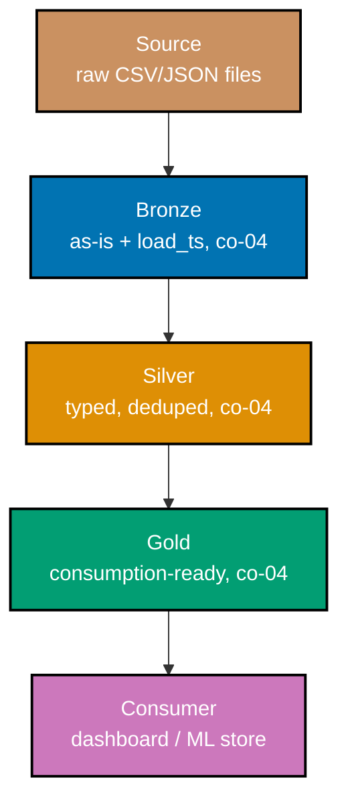
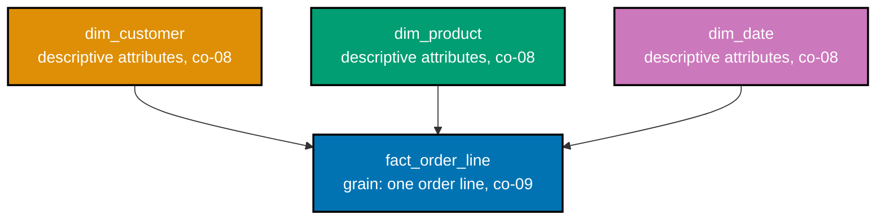

Examples 1-18 build the foundation every later band assumes: batch and streaming compute the same
answer two different ways (co-01), transform order is the entire difference between ETL and ELT
(co-02), the canonical source-ingest-transform-serve shape (co-03), the medallion bronze/silver/gold
layers that isolate raw data from what gets served (co-04), the idempotent and incremental load
disciplines that make a rerun safe (co-05, co-06), Hive-style partitioning and the query-time
pruning it enables (co-07), and the fact/dimension/grain/additivity foundations of dimensional
modeling (co-08 through co-10). Every worked example's real, runnable **Python 3.13** file lives
under `learning/code/ex-NN-*/`, run for real with genuine captured output. (See this topic's
[Accuracy notes](../overview.md#accuracy-notes) for the exact pinned dependency versions.)

---

### Worked Example 1: Batch vs. Streaming Contrast

_ex-01 &middot; exercises co-01_

**Context**: **co-01 -- batch-vs-streaming** is the foundational split: batch processes a bounded
dataset in one pass, assuming it has already fully arrived; streaming processes an unbounded feed
record by record, carrying state forward as each record shows up. This example computes the same
running total both ways over the identical eight order amounts and verifies both approaches agree.

```python
# learning/code/ex-01-batch-vs-streaming-contrast/batch_vs_streaming.py
"""Worked Example 1: Batch vs. Streaming Contrast."""  # => co-01: this file's own restated purpose, doubling as its module __doc__

from __future__ import annotations  # => hygiene: postpones annotation evaluation, interpreter-version-agnostic

ORDER_AMOUNTS = [1200, 450, 890, 3100, 275, 640, 1980, 510]  # => co-01: the SAME eight order amounts, processed two different ways


def batch_total(amounts: list[int]) -> int:  # => co-01: BATCH -- a bounded dataset, processed in one pass
    """Sum a bounded, already-fully-arrived list of amounts in a single pass."""  # => co-01: documents batch_total's contract -- no runtime output, just sets its __doc__
    return sum(amounts)  # => co-01: one call, over the WHOLE dataset, because batch assumes it has already arrived


def streaming_total(amounts: list[int]) -> int:  # => co-01: STREAMING -- an unbounded feed, processed record-by-record
    """Fold an unbounded feed into a running total, one record at a time, as if each just arrived."""  # => co-01: documents streaming_total's contract -- no runtime output, just sets its __doc__
    running_total = 0  # => co-01: the streaming engine's own state -- carried FORWARD between records
    for amount in amounts:  # => co-01: one record at a time -- streaming never assumes the whole feed has arrived
        running_total += amount  # => co-01: update the running aggregate as each record is seen
        print(f"  streaming saw {amount} -> running total {running_total}")  # => co-01: a streaming engine emits a value PER record, not just at the end
    return running_total  # => co-01: returns this computed value to the caller


if __name__ == "__main__":  # => co-01: entry point -- runs only when this file executes directly, not on import
    print(f"Batch pass over {len(ORDER_AMOUNTS)} orders (bounded, arrives all at once):")  # => co-01: frames the batch run
    batch_result = batch_total(ORDER_AMOUNTS)  # => co-01: ONE pass, over the whole bounded dataset
    print(f"  batch total -> {batch_result}")  # => co-01: prints the single, final batch answer

    print(f"Streaming pass over the SAME {len(ORDER_AMOUNTS)} orders (unbounded feed, record-by-record):")  # => co-01
    streaming_result = streaming_total(ORDER_AMOUNTS)  # => co-01: the SAME aggregate, computed incrementally instead
    print(f"  streaming total -> {streaming_result}")  # => co-01: prints the final incrementally-built answer

    assert batch_result == streaming_result, "the same aggregate must match, computed either way"  # => co-01: the whole point
    print(f"MATCH: batch and streaming both compute {batch_result} for the identical eight orders")  # => co-01
    # => co-01: batch waits for the whole bounded set; streaming carries state forward one record at a time -- same answer, different shape
```

**Run**: `python3 batch_vs_streaming.py`

**Output**:

```text
Batch pass over 8 orders (bounded, arrives all at once):
  batch total -> 9045
Streaming pass over the SAME 8 orders (unbounded feed, record-by-record):
  streaming saw 1200 -> running total 1200
  streaming saw 450 -> running total 1650
  streaming saw 890 -> running total 2540
  streaming saw 3100 -> running total 5640
  streaming saw 275 -> running total 5915
  streaming saw 640 -> running total 6555
  streaming saw 1980 -> running total 8535
  streaming saw 510 -> running total 9045
  streaming total -> 9045
MATCH: batch and streaming both compute 9045 for the identical eight orders
```

**Verify**: `batch_total` sums the whole list in one call; `streaming_total` folds the same list one
record at a time, printing an intermediate value after every record -- both land on `9045`,
satisfying co-01's rule that the two processing models can compute an identical aggregate.

**Key takeaway**: batch and streaming are two processing models over the same kind of aggregate, not
two different answers -- the difference is whether the engine assumes the dataset has already fully
arrived (batch) or treats it as an ongoing feed (streaming).

**Why It Matters**: every later worked example in this course specializes one of these two models.
Recognizing that a "streaming" requirement is really "I need this number sooner, incrementally" --
not a fundamentally different calculation -- is what keeps an engineer from reaching for streaming
infrastructure (Kafka, a stream processor) when a scheduled batch job would answer the same question
just as correctly, on a slightly longer delay.

---

### Worked Example 2: ETL Order -- Transform Before Load

_ex-02 &middot; exercises co-02_

**Context**: **co-02 -- etl-vs-elt** hinges entirely on _when_ transformation happens. ETL
transforms first, then loads only the already-clean result. This example cleans, types, and dedupes
four raw rows in Python, then loads only the clean result into DuckDB, verifying the warehouse never
sees a raw, untyped row.

```python
# learning/code/ex-02-etl-order/etl_order.py
"""Worked Example 2: ETL Order -- Transform Before Load."""  # => co-02: this file's own restated purpose, doubling as its module __doc__

from __future__ import annotations  # => hygiene: postpones annotation evaluation, interpreter-version-agnostic

import duckdb  # => co-02: the "load" target -- a local analytical SQL engine, standing in for a warehouse

RAW_ROWS = [  # => co-02: RAW, untyped source rows -- strings, a duplicate, and a stray blank
    {"order_id": "1001", "amount": "129.50"},  # => co-02: row 1, amount arrives as TEXT
    {"order_id": "1002", "amount": "40.00"},  # => co-02: row 2, amount arrives as TEXT
    {"order_id": "1002", "amount": "40.00"},  # => co-02: row 3 -- an exact DUPLICATE of row 2
    {"order_id": "1003", "amount": ""},  # => co-02: row 4 -- a blank amount, unusable downstream
]  # => co-02: closes RAW_ROWS -- exactly what ETL's "T" step must fix before anything is loaded


def clean_and_type(raw_rows: list[dict[str, str]]) -> list[dict[str, object]]:  # => co-02: the "T" in ETL -- runs in PYTHON, before load
    """Type, dedupe, and drop unusable rows -- entirely in Python, before any row reaches the warehouse."""  # => co-02: documents clean_and_type's contract -- no runtime output, just sets its __doc__
    seen_ids: set[str] = set()  # => co-02: tracks which order_id values have already been kept
    cleaned: list[dict[str, object]] = []  # => co-02: accumulates only typed, deduped, non-blank rows
    for row in raw_rows:  # => co-02: one raw row at a time
        if row["order_id"] in seen_ids or row["amount"] == "":  # => co-02: reject a duplicate id OR a blank amount
            continue  # => co-02: this row never reaches the load step at all
        seen_ids.add(row["order_id"])  # => co-02: record this id as kept, so a later duplicate is rejected
        cleaned.append({"order_id": int(row["order_id"]), "amount": float(row["amount"])})  # => co-02: TYPED here, in Python
    return cleaned  # => co-02: returns this computed value to the caller


if __name__ == "__main__":  # => co-02: entry point -- runs only when this file executes directly, not on import
    typed_rows = clean_and_type(RAW_ROWS)  # => co-02: transform happens BEFORE load -- this is the "T" then "L" order
    print(f"Transformed {len(typed_rows)} of {len(RAW_ROWS)} raw rows (deduped + typed + non-blank)")  # => co-02
    con = duckdb.connect()  # => co-02: an in-memory warehouse stand-in -- the "L" step writes into THIS
    con.sql("CREATE TABLE orders (order_id INTEGER, amount DOUBLE)")  # => co-02: the load target's schema, already TYPED
    con.executemany("INSERT INTO orders VALUES (?, ?)", [(r["order_id"], r["amount"]) for r in typed_rows])  # => co-02: LOAD -- already-clean rows only
    loaded = con.sql("SELECT * FROM orders ORDER BY order_id").df()  # => co-02: read back exactly what landed
    print(loaded)  # => co-02: prints the loaded table -- already typed, already deduped

    types_ok = str(loaded["amount"].dtype) == "float64"  # => co-02: the loaded column is DOUBLE, not text
    dedup_ok = len(loaded) == 2  # => co-02: two order_ids kept -- 1001 and 1002 (1003's blank amount dropped it)
    print(f"Loaded table already typed (float64): {types_ok} | already deduped (2 rows): {dedup_ok}")  # => co-02
    assert types_ok and dedup_ok, "ETL's load step must receive already-typed, already-deduped rows"  # => co-02: the claim
    print("MATCH: transformation ran in Python BEFORE the warehouse ever saw a row")  # => co-02
    # => co-02: ETL = transform, THEN load -- the warehouse never stores the raw, untyped, duplicate-laden rows at all
```

**Run**: `python3 etl_order.py`

**Output**:

```text
Transformed 2 of 4 raw rows (deduped + typed + non-blank)
   order_id  amount
0      1001   129.5
1      1002    40.0
Loaded table already typed (float64): True | already deduped (2 rows): True
MATCH: transformation ran in Python BEFORE the warehouse ever saw a row
```

**Verify**: `clean_and_type` runs entirely before `INSERT`, dropping the duplicate and the blank row
and casting both remaining rows' `amount` to `float`; the loaded DuckDB table's `amount` column
reports `float64` with exactly 2 rows, satisfying co-02's "transform, then load" order.

**Key takeaway**: in ETL, the warehouse never sees an untyped, duplicate-laden, or blank-valued row
at all -- Python's transform step is a gate the data passes through before load, not a cleanup step
run afterward.

**Why It Matters**: ETL made sense when transform compute (an ETL server) was expensive relative to
load-time warehouse compute -- transforming once, outside the warehouse, minimized what the
warehouse itself had to do. Recognizing ETL's "transform, then load" order is what lets an engineer
correctly read an older pipeline's architecture, and correctly explain why a newer pipeline (ex-03)
often does the opposite.

---

### Worked Example 3: ELT Order -- Load Before Transform

_ex-03 &middot; exercises co-02_

**Context**: co-02's other half: ELT loads raw data first, untouched, then transforms it in-warehouse
via SQL. This example lands the identical raw rows ex-02 cleaned in Python, unmodified, then runs
the equivalent cleaning as a single in-warehouse `SELECT DISTINCT ... CAST ...` statement.

```python
# learning/code/ex-03-elt-order/elt_order.py
"""Worked Example 3: ELT Order -- Load Before Transform."""  # => co-02: this file's own restated purpose, doubling as its module __doc__

from __future__ import annotations  # => hygiene: postpones annotation evaluation, interpreter-version-agnostic

import duckdb  # => co-02: the load target AND the in-warehouse transform engine -- ELT does both in the same place
from pandas.api.types import is_string_dtype  # => co-02: backend-agnostic string check -- pandas 3.x's default string dtype prints as "str", not "object"

RAW_ROWS = [  # => co-02: the SAME raw, untyped, duplicate-laden rows ex-02 cleaned in Python FIRST
    ("1001", "129.50"),  # => co-02: row 1, amount arrives as TEXT
    ("1002", "40.00"),  # => co-02: row 2, amount arrives as TEXT
    ("1002", "40.00"),  # => co-02: row 3 -- an exact DUPLICATE of row 2
    ("1003", ""),  # => co-02: row 4 -- a blank amount, unusable downstream
]  # => co-02: closes RAW_ROWS -- ELT loads this exactly as-is, with zero Python-side cleaning

if __name__ == "__main__":  # => co-02: entry point -- runs only when this file executes directly, not on import
    con = duckdb.connect()  # => co-02: the warehouse stand-in -- BOTH load and transform happen inside it
    con.sql("CREATE TABLE raw_orders (order_id VARCHAR, amount VARCHAR)")  # => co-02: RAW schema -- everything stays TEXT
    con.executemany("INSERT INTO raw_orders VALUES (?, ?)", RAW_ROWS)  # => co-02: LOAD first -- untouched, untyped, unfiltered
    raw_loaded = con.sql("SELECT * FROM raw_orders").df()  # => co-02: read back the raw landing table
    print(f"Raw landing table after LOAD ({len(raw_loaded)} rows, untouched):")  # => co-02
    print(raw_loaded)  # => co-02: prints the raw table -- still text, still has the duplicate and the blank

    transform_sql = "CREATE TABLE clean_orders AS SELECT DISTINCT CAST(order_id AS INTEGER) AS order_id, CAST(amount AS DOUBLE) AS amount FROM raw_orders WHERE amount != ''"  # => co-02: TRANSFORM, in-warehouse SQL -- the "T" AFTER "L"
    con.sql(transform_sql)  # => co-02: run the transform -- DISTINCT dedupes, CAST types, WHERE drops the blank, all AFTER load
    clean = con.sql("SELECT * FROM clean_orders ORDER BY order_id").df()  # => co-02: read back the transformed result
    print(f"Transformed in-warehouse ({len(clean)} rows):")  # => co-02
    print(clean)  # => co-02: prints the cleaned, typed table -- SQL did the work ex-02's Python did instead

    raw_untouched = len(raw_loaded) == len(RAW_ROWS) and is_string_dtype(raw_loaded["amount"])  # => co-02: still text, still 4 rows
    print(f"Raw landing table left untouched (4 rows, still text): {raw_untouched}")  # => co-02
    assert raw_untouched, "ELT's raw landing table must remain untouched by the transform step"  # => co-02: the claim ex-03 makes
    assert len(clean) == 2, "the in-warehouse transform must dedupe and drop the blank, same result as ex-02"  # => co-02
    print("MATCH: raw stayed untouched; the SAME cleaning ex-02 did in Python happened here, in SQL, after load")  # => co-02
    # => co-02: ELT = load, THEN transform -- cloud-warehouse elastic compute is what made this order cheap enough to prefer
```

**Run**: `python3 elt_order.py`

**Output**:

```text
Raw landing table after LOAD (4 rows, untouched):
  order_id  amount
0     1001  129.50
1     1002   40.00
2     1002   40.00
3     1003
Transformed in-warehouse (2 rows):
   order_id  amount
0      1001   129.5
1      1002    40.0
Raw landing table left untouched (4 rows, still text): True
MATCH: raw stayed untouched; the SAME cleaning ex-02 did in Python happened here, in SQL, after load
```

**Verify**: `raw_orders` still holds all 4 original text rows after `LOAD` -- `is_string_dtype`
confirms `amount` is still text, and the row count is unchanged -- while `clean_orders`, built
entirely by a single SQL statement, holds the same 2-row result ex-02 produced in Python, satisfying
co-02's "load, then transform" order.

**Key takeaway**: ELT's raw landing table is never touched by the transform -- the exact same
cleaning logic ex-02 wrote in Python here becomes one SQL statement, run inside the warehouse after
the data has already landed.

**Why It Matters**: ELT became the default once cloud warehouses made in-warehouse compute
elastic and cheap -- there's no separate transform server to provision, and the raw landing table
stays available for reprocessing if the transform logic itself later needs to change. Comparing
ex-02 and ex-03 side by side is the fastest way to see that ETL vs. ELT is purely an ordering
decision, not two different technologies.

---

### Worked Example 4: The Modern Data Stack's Shape

_ex-04 &middot; exercises co-03_

**Context**: **co-03 -- modern-data-stack-shape** names the canonical four-stage pipeline: source
&rarr; ingest (EL) &rarr; transform (T) &rarr; serve. This example wires four stub functions, one
per stage, and traces a single record through all four in order.

```python
# learning/code/ex-04-modern-stack-shape/modern_stack_shape.py
"""Worked Example 4: The Modern Data Stack's Shape."""  # => co-03: this file's own restated purpose, doubling as its module __doc__

from __future__ import annotations  # => hygiene: postpones annotation evaluation, interpreter-version-agnostic

PIPELINE_LOG: list[str] = []  # => co-03: records which stage touched the record, IN ORDER, as proof of the shape


def source() -> dict[str, object]:  # => co-03: SOURCE -- where a record originates, outside this pipeline's control
    """Return one raw record, as if read from an upstream application database."""  # => co-03: documents source's contract -- no runtime output, just sets its __doc__
    PIPELINE_LOG.append("source")  # => co-03: log this stage's participation
    return {"order_id": 2001, "amount_text": "88.00", "region": "east"}  # => co-03: a RAW record -- untyped amount


def ingest(record: dict[str, object]) -> dict[str, object]:  # => co-03: INGEST (EL) -- extract + load, no shaping yet
    """Land the record as-is, adding only pipeline metadata -- no shaping of the business fields."""  # => co-03: documents ingest's contract -- no runtime output, just sets its __doc__
    PIPELINE_LOG.append("ingest")  # => co-03: log this stage's participation
    return {**record, "_ingested": True}  # => co-03: EL means Extract+Load -- copy through, tag it, nothing more


def transform(record: dict[str, object]) -> dict[str, object]:  # => co-03: TRANSFORM (T) -- the shaping step
    """Type and shape the record for consumption -- the pipeline's one shaping step."""  # => co-03: documents transform's contract -- no runtime output, just sets its __doc__
    PIPELINE_LOG.append("transform")  # => co-03: log this stage's participation
    return {"order_id": record["order_id"], "amount": float(record["amount_text"]), "region": record["region"]}  # => co-03: typed + shaped


def serve(record: dict[str, object]) -> str:  # => co-03: SERVE -- the record's final, consumption-ready form
    """Render the record as a one-line summary, as if handed to a BI dashboard or an ML feature store."""  # => co-03: documents serve's contract -- no runtime output, just sets its __doc__
    PIPELINE_LOG.append("serve")  # => co-03: log this stage's participation
    return f"order {record['order_id']}: ${record['amount']:.2f} ({record['region']})"  # => co-03: the served, human-readable form


if __name__ == "__main__":  # => co-03: entry point -- runs only when this file executes directly, not on import
    raw_record = source()  # => co-03: stage 1 -- SOURCE
    ingested_record = ingest(raw_record)  # => co-03: stage 2 -- INGEST (EL)
    transformed_record = transform(ingested_record)  # => co-03: stage 3 -- TRANSFORM (T)
    served_summary = serve(transformed_record)  # => co-03: stage 4 -- SERVE
    print(f"Pipeline stages, in order: {PIPELINE_LOG}")  # => co-03: prints the exact stage order the record traveled
    print(f"Served output -> {served_summary!r}")  # => co-03: prints the final, consumption-ready form
    assert PIPELINE_LOG == ["source", "ingest", "transform", "serve"], "all four stages must run in the canonical order"  # => co-03
    assert served_summary == "order 2001: $88.00 (east)", "the record must arrive at serve fully typed and shaped"  # => co-03
    print("MATCH: one record flowed end to end through source -> ingest -> transform -> serve")  # => co-03
    # => co-03: source->ingest(EL)->transform(T)->serve is the canonical shape every later worked example specializes
```

**Run**: `python3 modern_stack_shape.py`

**Output**:

```text
Pipeline stages, in order: ['source', 'ingest', 'transform', 'serve']
Served output -> 'order 2001: $88.00 (east)'
MATCH: one record flowed end to end through source -> ingest -> transform -> serve
```

**Verify**: `PIPELINE_LOG` records `["source", "ingest", "transform", "serve"]` in exactly that
order, and the final `served_summary` reflects a fully typed, shaped record -- satisfying co-03's
canonical four-stage pipeline shape.

**Key takeaway**: source, ingest, transform, and serve are four genuinely distinct
responsibilities -- source produces raw data outside the pipeline's control, ingest moves it without
shaping (EL), transform shapes it (T), and serve renders it for consumption.

**Why It Matters**: this four-stage shape is the map every later worked example in this course fills
in one piece of. The medallion layers (co-04) are ingest and transform's physical storage; ex-01's
batch vs. streaming choice is a decision about how ingest and transform run; the star schema (co-09)
is what transform ultimately produces for serve to read from.

---

### Worked Example 5: Bronze -- Land Raw Data As-Is

_ex-05 &middot; exercises co-04_

**Context**: **co-04 -- medallion-bronze-silver-gold** starts with bronze: land source data exactly
as-is, plus load metadata, per Databricks' own medallion docs. This example writes a small invented
CSV containing a blank value and a duplicate row, lands it into a `bronze_orders` table, and verifies
every source row -- blemishes included -- landed untouched, with a `load_ts` column added.

```python
# learning/code/ex-05-bronze-land-raw/bronze_land_raw.py
"""Worked Example 5: Bronze -- Land Raw Data As-Is."""  # => co-04: this file's own restated purpose, doubling as its module __doc__

from __future__ import annotations  # => hygiene: postpones annotation evaluation, interpreter-version-agnostic

import tempfile  # => co-04: writes the source CSV to a real file -- read_csv_auto needs a path, not an in-memory string
from pathlib import Path  # => co-04: builds the temp CSV's path

import duckdb  # => co-04: bronze lands INTO a local analytical engine, standing in for a lakehouse table

SOURCE_CSV_LINES = [  # => co-04: a small, invented CSV, built one row at a time -- includes a BLANK amount and a DUPLICATE, both left AS-IS
    "order_id,amount,region",  # => co-04: the CSV header row
    "3001,150.25,east",  # => co-04: row 1 -- clean
    "3002,,west",  # => co-04: row 2 -- a BLANK amount, left as-is in bronze
    "3002,,west",  # => co-04: row 3 -- an exact DUPLICATE of row 2
    "3003,72.10,north",  # => co-04: row 4 -- clean
]  # => co-04: closes SOURCE_CSV_LINES -- four data rows plus a header
SOURCE_CSV_TEXT = "\n".join(SOURCE_CSV_LINES) + "\n"  # => co-04: joined into the exact text a real CSV file drop would contain

if __name__ == "__main__":  # => co-04: entry point -- runs only when this file executes directly, not on import
    with tempfile.TemporaryDirectory() as tmp_dir:  # => co-04: a throwaway directory standing in for a source drop location
        csv_path = Path(tmp_dir) / "orders.csv"  # => co-04: the "source file" bronze will land as-is
        csv_path.write_text(SOURCE_CSV_TEXT, encoding="utf-8")  # => co-04: this course's rule -- data is generated, never downloaded

        con = duckdb.connect()  # => co-04: the bronze layer's home -- an in-memory local warehouse
        land_sql = f"CREATE TABLE bronze_orders AS SELECT *, now() AS load_ts FROM read_csv_auto('{csv_path}')"  # => co-04: LAND raw + load_ts -- Databricks docs: bronze keeps data "as-is" + load metadata
        con.sql(land_sql)  # => co-04: the whole bronze contract in one statement -- no cleaning, no dedup, no type coercion beyond CSV inference

        source_row_count = len(SOURCE_CSV_TEXT.strip().splitlines()) - 1  # => co-04: minus 1 for the CSV header line
        bronze_row_count = con.sql("SELECT COUNT(*) FROM bronze_orders").fetchone()[0]  # => co-04: what actually landed
        print(f"Source CSV rows: {source_row_count} | Bronze table rows: {bronze_row_count}")  # => co-04: prints both counts
        assert bronze_row_count == source_row_count, "bronze must land EVERY source row, including the duplicate and the blank"  # => co-04

        columns = con.sql("DESCRIBE bronze_orders").df()["column_name"].tolist()  # => co-04: what columns bronze actually has
        print(f"Bronze columns: {columns}")  # => co-04: prints the column list
        has_load_ts = "load_ts" in columns  # => co-04: the ONE thing bronze adds beyond the raw source
        print(f"Has load_ts metadata column: {has_load_ts}")  # => co-04: True -- metadata present, business columns untouched
        assert has_load_ts, "bronze must carry a load_ts metadata column alongside the untouched source columns"  # => co-04
        print(f"MATCH: {bronze_row_count} rows landed as-is, plus a load_ts metadata column")  # => co-04
        # => co-04: bronze is a faithful copy of the source PLUS load metadata -- cleaning is silver's job, not bronze's
```

**Run**: `python3 bronze_land_raw.py`

**Output**:

```text
Source CSV rows: 4 | Bronze table rows: 4
Bronze columns: ['order_id', 'amount', 'region', 'load_ts']
Has load_ts metadata column: True
MATCH: 4 rows landed as-is, plus a load_ts metadata column
```

**Verify**: `bronze_orders` holds exactly 4 rows -- matching the source CSV's 4 data rows, blank and
duplicate included -- and `DESCRIBE bronze_orders` confirms a `load_ts` column exists alongside the
three untouched source columns, satisfying co-04's "as-is plus load metadata" bronze contract.

**Key takeaway**: bronze's entire job is fidelity, not cleanliness -- every source row lands exactly
as it arrived, blemishes and all, with only a load-time metadata column added.

**Why It Matters**: keeping bronze untouched is what makes a later cleaning-rule change safe to
replay -- if silver's cleaning logic turns out to be wrong, bronze still has the original, faithful
copy to re-derive silver from, rather than having already discarded the evidence.

---

### Worked Example 6: Silver -- Clean and Conform

_ex-06 &middot; exercises co-04_

**Context**: silver is medallion's cleaning layer -- "matched, merged, conformed and cleansed," per
Databricks' own docs. This example transforms four bronze rows (one blank, one duplicate) into
silver via a single `SELECT DISTINCT ... CAST ... WHERE` statement and verifies types are cast,
duplicates collapsed, and the blank dropped.

```python
# learning/code/ex-06-silver-clean-conform/silver_clean_conform.py
"""Worked Example 6: Silver -- Clean and Conform."""  # => co-04: this file's own restated purpose, doubling as its module __doc__

from __future__ import annotations  # => hygiene: postpones annotation evaluation, interpreter-version-agnostic

import duckdb  # => co-04: silver is built with in-warehouse SQL, one layer downstream of bronze

if __name__ == "__main__":  # => co-04: entry point -- runs only when this file executes directly, not on import
    con = duckdb.connect()  # => co-04: a single connection carries bronze -> silver in this worked example
    con.sql("CREATE TABLE bronze_orders (order_id VARCHAR, amount VARCHAR, region VARCHAR)")  # => co-04: bronze -- everything TEXT, as landed
    bronze_rows = [  # => co-04: the SAME kind of bronze rows ex-05 landed -- a duplicate and a blank amount, left as-is
        ("4001", "310.00", "east"),  # => co-04: row 1 -- clean
        ("4002", "", "west"),  # => co-04: row 2 -- a BLANK amount
        ("4003", "88.50", "north"),  # => co-04: row 3 -- clean
        ("4003", "88.50", "north"),  # => co-04: row 4 -- an exact DUPLICATE of row 3
    ]  # => co-04: closes bronze_rows -- 4 bronze rows, matching Databricks' "as-is" bronze contract
    con.executemany("INSERT INTO bronze_orders VALUES (?, ?, ?)", bronze_rows)  # => co-04: land every row exactly as-is

    silver_sql = "CREATE TABLE silver_orders AS SELECT DISTINCT CAST(order_id AS INTEGER) AS order_id, CAST(amount AS DOUBLE) AS amount, region FROM bronze_orders WHERE amount != ''"  # => co-04: SILVER -- "matched, merged, conformed and cleansed"
    con.sql(silver_sql)  # => co-04: DISTINCT conforms duplicates away, CAST types every column, WHERE drops the unusable blank row
    silver = con.sql("SELECT * FROM silver_orders ORDER BY order_id").df()  # => co-04: read back silver's contents
    print(f"Bronze rows: 4 | Silver rows: {len(silver)}")  # => co-04: prints both counts, showing silver shrank
    print(silver)  # => co-04: prints the typed, deduped, non-null silver table

    types_cast = str(silver["order_id"].dtype).startswith("int") and str(silver["amount"].dtype) == "float64"  # => co-04: both columns TYPED
    no_duplicates = silver["order_id"].is_unique  # => co-04: the exact-duplicate bronze row must collapse to ONE silver row
    no_blanks = (silver["amount"] > 0).all()  # => co-04: the blank-amount bronze row must be entirely absent from silver
    print(f"Types cast: {types_cast} | No duplicate order_id: {no_duplicates} | No blank/zero amount: {no_blanks}")  # => co-04
    assert types_cast and no_duplicates and no_blanks, "silver must be typed, deduped, and null/blank-dropped"  # => co-04: the claim
    print(f"MATCH: silver conforms bronze's 4 raw rows down to {len(silver)} clean, typed, unique rows")  # => co-04
    # => co-04: silver's whole job is to make bronze SAFE to join and aggregate -- gold never has to re-clean anything
```

**Run**: `python3 silver_clean_conform.py`

**Output**:

```text
Bronze rows: 4 | Silver rows: 2
   order_id  amount region
0      4001   310.0   east
1      4003    88.5  north
Types cast: True | No duplicate order_id: True | No blank/zero amount: True
MATCH: silver conforms bronze's 4 raw rows down to 2 clean, typed, unique rows
```

**Verify**: `silver_orders` holds exactly 2 rows -- both `order_id` and `amount` cast to their real
types, the exact-duplicate bronze row collapsed by `DISTINCT`, and the blank-amount row dropped by
`WHERE amount != ''` -- satisfying co-04's "matched, merged, conformed and cleansed" silver
contract.

**Key takeaway**: one SQL statement -- `DISTINCT` plus `CAST` plus a `WHERE` filter -- is enough to
turn a bronze table's raw fidelity into silver's cleanliness, because bronze already preserved
everything silver needs to clean from.

**Why It Matters**: doing all the cleaning once, in silver, is what lets gold (ex-07) and every
downstream consumer skip re-deriving the same cleaning logic -- a rename, a dedup rule, or a type
fix only ever needs to be made in one place.

---

### Worked Example 7: Gold -- Serve a Consumption-Ready Aggregate

_ex-07 &middot; exercises co-04_

**Context**: gold is medallion's serving layer -- "consumption-ready, de-normalized, read-optimized,"
per Databricks' own docs. This example aggregates five already-clean silver rows into a
per-region gold table and verifies the served totals match hand-computed values.

```python
# learning/code/ex-07-gold-serve-aggregate/gold_serve_aggregate.py
"""Worked Example 7: Gold -- Serve a Consumption-Ready Aggregate."""  # => co-04: this file's own restated purpose, doubling as its module __doc__

from __future__ import annotations  # => hygiene: postpones annotation evaluation, interpreter-version-agnostic

import duckdb  # => co-04: gold is one more in-warehouse SQL step downstream of silver

if __name__ == "__main__":  # => co-04: entry point -- runs only when this file executes directly, not on import
    con = duckdb.connect()  # => co-04: a single connection carries silver -> gold in this worked example
    con.sql("CREATE TABLE silver_orders (order_id INTEGER, amount DOUBLE, region VARCHAR)")  # => co-04: silver -- already typed, deduped, clean
    silver_rows = [  # => co-04: five already-clean silver rows across three regions
        (5001, 100.0, "east"),  # => co-04: east, row 1
        (5002, 250.0, "east"),  # => co-04: east, row 2
        (5003, 75.0, "west"),  # => co-04: west, row 1
        (5004, 40.0, "west"),  # => co-04: west, row 2
        (5005, 60.0, "north"),  # => co-04: north, row 1
    ]  # => co-04: closes silver_rows -- silver's clean state means gold never re-types or re-dedupes anything, only aggregates
    con.executemany("INSERT INTO silver_orders VALUES (?, ?, ?)", silver_rows)  # => co-04: land every already-clean silver row

    gold_sql = "CREATE TABLE gold_region_totals AS SELECT region, SUM(amount) AS total_amount, COUNT(*) AS order_count FROM silver_orders GROUP BY region"  # => co-04: GOLD -- "consumption-ready, de-normalized, read-optimized"
    con.sql(gold_sql)  # => co-04: one served row PER region -- exactly the shape a dashboard would query directly, no further joins needed
    gold = con.sql("SELECT * FROM gold_region_totals ORDER BY region").df()  # => co-04: read back the served aggregate
    print(gold)  # => co-04: prints the gold table -- region, total, count

    hand_computed_east = 100.0 + 250.0  # => co-04: the expected east total, computed BY HAND from the raw inputs above
    hand_computed_west = 75.0 + 40.0  # => co-04: the expected west total, computed BY HAND
    served_east = gold.loc[gold["region"] == "east", "total_amount"].iloc[0]  # => co-04: what gold actually served for east
    served_west = gold.loc[gold["region"] == "west", "total_amount"].iloc[0]  # => co-04: what gold actually served for west
    print(f"East: hand-computed {hand_computed_east} vs. served {served_east}")  # => co-04: prints the comparison
    print(f"West: hand-computed {hand_computed_west} vs. served {served_west}")  # => co-04: prints the comparison
    assert served_east == hand_computed_east and served_west == hand_computed_west, "gold's totals must match hand-computed values"  # => co-04
    print("MATCH: gold's served totals equal the hand-computed sums for every region")  # => co-04
    # => co-04: gold is where a dashboard or ML feature store reads FROM -- it never touches bronze or silver directly
```

**Run**: `python3 gold_serve_aggregate.py`

**Output**:

```text
  region  total_amount  order_count
0   east         350.0            2
1  north          60.0            1
2   west         115.0            2
East: hand-computed 350.0 vs. served 350.0
West: hand-computed 115.0 vs. served 115.0
MATCH: gold's served totals equal the hand-computed sums for every region
```

**Verify**: `gold_region_totals`'s `east` and `west` totals (`350.0` and `115.0`) both equal the
values hand-computed directly from `silver_rows`, satisfying co-04's "consumption-ready,
read-optimized" gold contract.

**Key takeaway**: gold is a `GROUP BY` away from silver precisely because silver already did all the
hard cleaning work -- gold's only job is shaping an aggregate for direct consumption.

**Why It Matters**: a dashboard or ML feature store reads gold, never bronze or silver directly --
that boundary is what lets the bronze and silver layers evolve their cleaning logic without ever
breaking a downstream consumer's query shape.

#### The medallion flow, bronze to silver to gold



_Figure: the medallion flow ex-05 through ex-07 built, one layer at a time. Each arrow is a
one-directional dependency -- gold reads from silver, silver reads from bronze, and nothing ever
flows backward._

**Verify**: this diagram's four stages, in this exact order, match the four physical tables ex-05,
ex-06, and ex-07 each built and queried in turn -- `bronze_orders` &rarr; `silver_orders` &rarr;
`gold_region_totals`.

**Key takeaway**: each arrow is a one-way dependency -- a consumer reads gold, gold reads silver,
silver reads bronze, and a cleaning-rule change in silver never has to reach back and mutate bronze.

**Why It Matters**: drawing the layers as a strict left-to-right flow makes an easy mistake visible
before it happens -- a dashboard querying bronze directly, or a transform writing gold straight from
raw source data, both break this diagram's one-way shape and reintroduce exactly the "raw data leaks
into what gets served" problem the medallion pattern exists to prevent.

---

### Worked Example 8: Idempotent Rerun

_ex-08 &middot; exercises co-05_

**Context**: **co-05 -- idempotent-transforms** means a transform produces the same result on
rerun, by checking a natural key before inserting. This example runs the same load step twice
against identical source rows, verifying the second run adds zero duplicate rows.

```python
# learning/code/ex-08-idempotent-rerun/idempotent_rerun.py
"""Worked Example 8: Idempotent Rerun."""  # => co-05: this file's own restated purpose, doubling as its module __doc__

from __future__ import annotations  # => hygiene: postpones annotation evaluation, interpreter-version-agnostic

import duckdb  # => co-05: the target table this idempotent step writes into

SOURCE_ROWS = [(6001, "alice", 42.0), (6002, "bob", 17.5), (6003, "carol", 90.0)]  # => co-05: the SAME source rows, loaded TWICE


def run_etl_step(con: duckdb.DuckDBPyConnection) -> None:  # => co-05: the step under test -- must be safe to run more than once
    """Insert every source row, but only if its natural key isn't already present -- an idempotent load."""  # => co-05: documents run_etl_step's contract -- no runtime output, just sets its __doc__
    for order_id, customer, amount in SOURCE_ROWS:  # => co-05: one source row at a time
        already_present = con.sql(f"SELECT COUNT(*) FROM orders WHERE order_id = {order_id}").fetchone()[0] > 0  # => co-05: check the natural key FIRST
        if not already_present:  # => co-05: only insert a row this run has not already seen
            con.execute("INSERT INTO orders VALUES (?, ?, ?)", (order_id, customer, amount))  # => co-05: insert exactly once, ever


if __name__ == "__main__":  # => co-05: entry point -- runs only when this file executes directly, not on import
    con = duckdb.connect()  # => co-05: a fresh, empty warehouse stand-in
    con.sql("CREATE TABLE orders (order_id INTEGER PRIMARY KEY, customer VARCHAR, amount DOUBLE)")  # => co-05: order_id is the natural key
    run_etl_step(con)  # => co-05: RUN 1 -- the first execution of this ETL step
    count_after_run_1 = con.sql("SELECT COUNT(*) FROM orders").fetchone()[0]  # => co-05: row count after the first run
    print(f"Row count after run 1: {count_after_run_1}")  # => co-05: prints the count -- expected 3, one per source row

    run_etl_step(con)  # => co-05: RUN 2 -- the EXACT SAME step, run again, on the SAME source rows
    count_after_run_2 = con.sql("SELECT COUNT(*) FROM orders").fetchone()[0]  # => co-05: row count after the SECOND run
    print(f"Row count after run 2 (rerun, same source): {count_after_run_2}")  # => co-05: prints the count again

    duplicates_added = count_after_run_2 - count_after_run_1  # => co-05: the whole point of ex-08 -- how many NEW rows did the rerun add?
    print(f"Duplicate rows added by the rerun: {duplicates_added}")  # => co-05: 0 -- the rerun changed nothing
    assert duplicates_added == 0, "an idempotent step must add zero duplicate rows on a rerun"  # => co-05: the claim ex-08 makes
    print(f"MATCH: {count_after_run_1} rows after run 1, still {count_after_run_2} rows after an identical rerun")  # => co-05
    # => co-05: idempotency is what makes a retry, a re-trigger, or an operator's manual rerun SAFE instead of destructive
```

**Run**: `python3 idempotent_rerun.py`

**Output**:

```text
Row count after run 1: 3
Row count after run 2 (rerun, same source): 3
Duplicate rows added by the rerun: 0
MATCH: 3 rows after run 1, still 3 rows after an identical rerun
```

**Verify**: `orders` holds exactly 3 rows after both `run_etl_step` calls -- the second call's
check-before-insert logic finds every natural key already present, adding zero new rows -- satisfying
co-05's idempotent-rerun contract.

**Key takeaway**: idempotency comes from checking whether a natural key already exists before
inserting, not from any special property of the data itself -- the same check-then-insert pattern
works for any load step.

**Why It Matters**: a pipeline that isn't idempotent turns every operator-triggered rerun, every
scheduler retry, and every accidental double-trigger into a data-corruption risk. Idempotency is
what turns "just rerun it" from a risky decision into a safe, boring one.

---

### Worked Example 9: Upsert via MERGE on a Natural Key

_ex-09 &middot; exercises co-05_

**Context**: DuckDB 1.5.5's `MERGE INTO` statement gives idempotency a SQL-native expression --
matched rows update, unmatched rows insert, in one statement. This example merges an incoming batch
(one changed row, one new row) into a target table and verifies neither creates a duplicate.

```python
# learning/code/ex-09-upsert-merge-key/upsert_merge_key.py
"""Worked Example 9: Upsert via MERGE on a Natural Key."""  # => co-05: this file's own restated purpose, doubling as its module __doc__

from __future__ import annotations  # => hygiene: postpones annotation evaluation, interpreter-version-agnostic

import duckdb  # => co-05: DuckDB 1.5.5's MERGE INTO statement backs this worked example's upsert

if __name__ == "__main__":  # => co-05: entry point -- runs only when this file executes directly, not on import
    con = duckdb.connect()  # => co-05: a fresh warehouse stand-in
    con.sql("CREATE TABLE target_orders (order_id INTEGER PRIMARY KEY, status VARCHAR)")  # => co-05: the table an upsert lands into
    con.execute("INSERT INTO target_orders VALUES (?, ?)", (7001, "pending"))  # => co-05: one PRE-EXISTING row, natural key 7001

    con.sql("CREATE TABLE incoming_batch (order_id INTEGER, status VARCHAR)")  # => co-05: this run's incoming batch -- a natural-key CHANGE plus a brand-new row
    incoming_rows = [(7001, "shipped"), (7002, "pending")]  # => co-05: 7001 CHANGED status, 7002 is a brand-NEW order
    con.executemany("INSERT INTO incoming_batch VALUES (?, ?)", incoming_rows)  # => co-05: land the incoming batch

    merge_sql = "MERGE INTO target_orders USING incoming_batch ON target_orders.order_id = incoming_batch.order_id WHEN MATCHED THEN UPDATE SET status = incoming_batch.status WHEN NOT MATCHED THEN INSERT (order_id, status) VALUES (incoming_batch.order_id, incoming_batch.status)"  # => co-05: MERGE on natural key
    con.sql(merge_sql)  # => co-05: matched rows UPDATE in place; unmatched rows INSERT -- never a duplicate row for an existing key
    result = con.sql("SELECT * FROM target_orders ORDER BY order_id").df()  # => co-05: read back the merged table
    print(result)  # => co-05: prints the merged table -- 7001 updated, 7002 inserted, still exactly 2 rows

    row_count = len(result)  # => co-05: total rows after the merge
    status_7001 = result.loc[result["order_id"] == 7001, "status"].iloc[0]  # => co-05: 7001's status AFTER the merge
    print(f"Row count: {row_count} | Order 7001 status: {status_7001!r}")  # => co-05: prints both checks
    assert row_count == 2, "a changed existing key must UPDATE in place, not add a duplicate row"  # => co-05: the claim
    assert status_7001 == "shipped", "the matched row's status must reflect the incoming batch's new value"  # => co-05
    print("MATCH: the changed key updated in place; the new key inserted; no duplicate row exists for 7001")  # => co-05
    # => co-05: MERGE on a natural key is the SQL-native way to make a load idempotent -- the same guarantee ex-08 built by hand
```

**Run**: `python3 upsert_merge_key.py`

**Output**:

```text
   order_id   status
0      7001  shipped
1      7002  pending
Row count: 2 | Order 7001 status: 'shipped'
MATCH: the changed key updated in place; the new key inserted; no duplicate row exists for 7001
```

**Verify**: `target_orders` holds exactly 2 rows after the merge -- order `7001`'s status updated
in place to `shipped`, and `7002` inserted as new -- satisfying co-05's upsert contract with no
duplicate row for the existing key.

**Key takeaway**: `MERGE INTO` on a natural key gives idempotency in one SQL statement -- matched
rows update, unmatched rows insert, and a key can never end up duplicated.

**Why It Matters**: `MERGE` is the production-grade version of ex-08's hand-written
check-before-insert loop -- the same idempotency guarantee, expressed declaratively and executed by
the warehouse's own query planner rather than row-by-row Python.

---

### Worked Example 10: Incremental Filter by Watermark

_ex-10 &middot; exercises co-06_

**Context**: **co-06 -- incremental-and-backfill** processes only rows newer than a watermark, for
efficiency. This example filters eight days of source rows against a watermark of `2026-07-05` and
verifies only the three strictly-newer rows are selected.

```python
# learning/code/ex-10-incremental-filter/incremental_filter.py
"""Worked Example 10: Incremental Filter by Watermark."""  # => co-06: this file's own restated purpose, doubling as its module __doc__

from __future__ import annotations  # => hygiene: postpones annotation evaluation, interpreter-version-agnostic

import duckdb  # => co-06: the incremental filter is expressed as an ordinary SQL WHERE clause

SOURCE_ROWS = [  # => co-06: eight source rows, spanning several days -- only SOME are "new" relative to a watermark
    (8001, "2026-07-01"),  # => co-06: day 1 -- before the watermark
    (8002, "2026-07-02"),  # => co-06: day 2 -- before the watermark
    (8003, "2026-07-03"),  # => co-06: day 3 -- before the watermark
    (8004, "2026-07-04"),  # => co-06: day 4 -- before the watermark
    (8005, "2026-07-05"),  # => co-06: day 5 -- AT the watermark, not strictly after it
    (8006, "2026-07-06"),  # => co-06: day 6 -- after the watermark, NEW
    (8007, "2026-07-07"),  # => co-06: day 7 -- after the watermark, NEW
    (8008, "2026-07-08"),  # => co-06: day 8 -- after the watermark, NEW
]  # => co-06: closes SOURCE_ROWS -- eight rows, one per day, 2026-07-01 through 2026-07-08

LAST_WATERMARK = "2026-07-05"  # => co-06: "the last row this pipeline has already processed" -- everything up to and including this date

if __name__ == "__main__":  # => co-06: entry point -- runs only when this file executes directly, not on import
    con = duckdb.connect()  # => co-06: a fresh warehouse stand-in
    con.sql("CREATE TABLE source_events (event_id INTEGER, event_date DATE)")  # => co-06: the upstream source, unfiltered
    con.executemany("INSERT INTO source_events VALUES (?, ?)", SOURCE_ROWS)  # => co-06: land every source row

    new_rows = con.sql(f"SELECT * FROM source_events WHERE event_date > DATE '{LAST_WATERMARK}' ORDER BY event_id").df()  # => co-06: STRICTLY after the watermark
    print(f"Watermark: {LAST_WATERMARK} | New rows found: {len(new_rows)}")  # => co-06: prints the watermark and the count
    print(new_rows)  # => co-06: prints exactly the rows this incremental run will process

    expected_new_ids = {8006, 8007, 8008}  # => co-06: 2026-07-06, 07, 08 -- the three days strictly after the watermark
    actual_new_ids = set(new_rows["event_id"].tolist())  # => co-06: what the incremental filter actually selected
    print(f"Expected new ids: {sorted(expected_new_ids)} | Actual: {sorted(actual_new_ids)}")  # => co-06: prints both sets
    assert actual_new_ids == expected_new_ids, "the incremental filter must select only rows newer than the watermark"  # => co-06
    print(f"MATCH: only {len(new_rows)} of {len(SOURCE_ROWS)} source rows are newer than the watermark")  # => co-06
    # => co-06: processing only the delta since the watermark is what keeps a routine run cheap, day after day
```

**Run**: `python3 incremental_filter.py`

**Output**:

```text
Watermark: 2026-07-05 | New rows found: 3
   event_id event_date
0      8006 2026-07-06
1      8007 2026-07-07
2      8008 2026-07-08
Expected new ids: [8006, 8007, 8008] | Actual: [8006, 8007, 8008]
MATCH: only 3 of 8 source rows are newer than the watermark
```

**Verify**: `new_rows` returns exactly the three rows dated strictly after `2026-07-05`
(`event_id` `8006`, `8007`, `8008`), matching `expected_new_ids` exactly and satisfying co-06's
incremental-filter contract.

**Key takeaway**: a watermark plus a strict `>` comparison is all an incremental filter needs --
everything up to and including the watermark has already been processed, so only strictly newer rows
are selected.

**Why It Matters**: processing only the delta since the last watermark is what keeps a routine
pipeline run cheap as the source table grows -- reprocessing the entire history every run would
scale the pipeline's cost with the table's total size instead of with the day's new data.

---

### Worked Example 11: Full-Refresh Backfill

_ex-11 &middot; exercises co-06_

**Context**: co-06's other half: reprocess an explicit past range, ignoring the incremental filter
entirely, because idempotent transforms (co-05) make this safe. This example rebuilds a total both
the routine incremental-shaped way and via a full-refresh backfill, verifying both agree with a
hand-computed value.

```python
# learning/code/ex-11-full-refresh-backfill/full_refresh_backfill.py
"""Worked Example 11: Full-Refresh Backfill."""  # => co-06: this file's own restated purpose, doubling as its module __doc__

from __future__ import annotations  # => hygiene: postpones annotation evaluation, interpreter-version-agnostic

import duckdb  # => co-06: both the incremental build and the full-refresh backfill target the same warehouse

SOURCE_ROWS = [(9001, 10.0), (9002, 25.0), (9003, 40.0), (9004, 5.0), (9005, 60.0)]  # => co-06: the SAME five source rows, used both ways


def build_incremental(con: duckdb.DuckDBPyConnection) -> None:  # => co-06: builds the table using ONLY the incremental filter's logic
    """Build gold_totals from scratch, ignoring the incremental filter -- as if every row were new."""  # => co-06: documents build_incremental's contract -- no runtime output, just sets its __doc__
    con.sql("CREATE OR REPLACE TABLE gold_totals AS SELECT SUM(amount) AS total FROM source_events")  # => co-06: a from-scratch, full aggregate


if __name__ == "__main__":  # => co-06: entry point -- runs only when this file executes directly, not on import
    con = duckdb.connect()  # => co-06: a fresh warehouse stand-in
    con.sql("CREATE TABLE source_events (event_id INTEGER, amount DOUBLE)")  # => co-06: the full, unfiltered source
    con.executemany("INSERT INTO source_events VALUES (?, ?)", SOURCE_ROWS)  # => co-06: land every source row, all five

    build_incremental(con)  # => co-06: the "routine incremental run" build, in this demo equivalent to a from-scratch aggregate
    incremental_total = con.sql("SELECT total FROM gold_totals").fetchone()[0]  # => co-06: the total AFTER the routine build
    print(f"Total after routine (incremental-shaped) build: {incremental_total}")  # => co-06: prints the routine total

    con.sql("CREATE OR REPLACE TABLE gold_totals AS SELECT SUM(amount) AS total FROM source_events")  # => co-06: FULL REFRESH -- ignores any watermark entirely
    backfill_total = con.sql("SELECT total FROM gold_totals").fetchone()[0]  # => co-06: the total AFTER the full-refresh backfill
    print(f"Total after full-refresh backfill: {backfill_total}")  # => co-06: prints the backfill total

    hand_computed_total = sum(amount for _, amount in SOURCE_ROWS)  # => co-06: 10+25+40+5+60, computed BY HAND from the source
    print(f"Hand-computed total: {hand_computed_total}")  # => co-06: prints the independently-computed expected value
    assert incremental_total == backfill_total == hand_computed_total, "a full-refresh backfill must equal a from-scratch build"  # => co-06
    print(f"MATCH: routine build, full-refresh backfill, and hand-computed total all equal {hand_computed_total}")  # => co-06
    # => co-06: because the transform is idempotent (co-05), a full backfill and a routine incremental build agree exactly
```

**Run**: `python3 full_refresh_backfill.py`

**Output**:

```text
Total after routine (incremental-shaped) build: 140.0
Total after full-refresh backfill: 140.0
Hand-computed total: 140.0
MATCH: routine build, full-refresh backfill, and hand-computed total all equal 140.0
```

**Verify**: the routine build, the full-refresh backfill, and the hand-computed sum (`10 + 25 + 40 +
5 + 60 = 140.0`) all agree exactly, satisfying co-06's claim that idempotent transforms make a
full backfill and a routine build reconcile.

**Key takeaway**: a full-refresh backfill is only safe because the underlying transform is
idempotent -- rebuilding from scratch and building incrementally must always land on the same
answer, or one of the two is wrong.

**Why It Matters**: backfill is the tool an engineer reaches for when a transform's logic changed
and history needs to be recomputed under the new logic -- it only works as a safe operation because
idempotency (co-05) guarantees rerunning it doesn't corrupt anything already correct.

---

### Worked Example 12: Hive-Style Partition Write

_ex-12 &middot; exercises co-07_

**Context**: **co-07 -- partitioning** encodes a column's value directly in the directory path
(`key=value/`). This example writes four sales rows across three regions to Parquet with
`PARTITION_BY (region)` and verifies the directory layout matches the Hive-style convention.

```python
# learning/code/ex-12-hive-style-partition-write/hive_partition_write.py
"""Worked Example 12: Hive-Style Partition Write."""  # => co-07: this file's own restated purpose, doubling as its module __doc__

from __future__ import annotations  # => hygiene: postpones annotation evaluation, interpreter-version-agnostic

import tempfile  # => co-07: writes real Parquet files under a throwaway directory tree
from pathlib import Path  # => co-07: walks the written directory tree to inspect its layout

import duckdb  # => co-07: DuckDB's COPY ... PARTITION_BY writes genuine hive-style directories

SALES_ROWS = [(1, "east", 100.0), (2, "east", 150.0), (3, "west", 80.0), (4, "north", 60.0)]  # => co-07: four rows across three regions

if __name__ == "__main__":  # => co-07: entry point -- runs only when this file executes directly, not on import
    with tempfile.TemporaryDirectory() as tmp_dir:  # => co-07: a throwaway root -- this course never writes outside a temp dir
        con = duckdb.connect()  # => co-07: a fresh warehouse stand-in
        con.sql("CREATE TABLE sales (sale_id INTEGER, region VARCHAR, amount DOUBLE)")  # => co-07: the table to be partition-written
        con.executemany("INSERT INTO sales VALUES (?, ?, ?)", SALES_ROWS)  # => co-07: land all four rows

        output_dir = Path(tmp_dir) / "sales_partitioned"  # => co-07: the partitioned dataset's root directory
        con.sql(f"COPY sales TO '{output_dir}' (FORMAT PARQUET, PARTITION_BY (region))")  # => co-07: Hive-style layout: region=value/data_0.parquet

        written_paths = sorted(p.relative_to(output_dir).as_posix() for p in output_dir.rglob("*.parquet"))  # => co-07: every Parquet file actually written
        print("Partition files written:")  # => co-07: frames the file listing
        for path in written_paths:  # => co-07: one line per written file
            print(f"  {path}")  # => co-07: prints each relative path -- region=<value>/data_0.parquet

        directory_names = sorted(p.name for p in output_dir.iterdir() if p.is_dir())  # => co-07: the partition directories themselves
        print(f"Partition directories: {directory_names}")  # => co-07: prints the directory names
        expected_directories = ["region=east", "region=north", "region=west"]  # => co-07: exactly key=value, one per distinct region value
        assert directory_names == expected_directories, "the directory layout must encode key=value for each region"  # => co-07
        print(f"MATCH: {len(written_paths)} Parquet files written under {len(directory_names)} key=value partition directories")  # => co-07
        # => co-07: a directory path can itself communicate a column's value -- a query can use that to skip files it can't match
```

**Run**: `python3 hive_partition_write.py`

**Output**:

```text
Partition files written:
  region=east/data_0.parquet
  region=north/data_0.parquet
  region=west/data_0.parquet
Partition directories: ['region=east', 'region=north', 'region=west']
MATCH: 3 Parquet files written under 3 key=value partition directories
```

**Verify**: `output_dir` contains exactly three subdirectories -- `region=east`, `region=north`,
`region=west` -- each holding one Parquet file, matching co-07's `key=value` Hive-style partition
directory contract exactly.

**Key takeaway**: `COPY ... PARTITION_BY (column)` physically splits the output into one
subdirectory per distinct column value, encoding the value directly in the directory name.

**Why It Matters**: a directory path that itself communicates a column's value is what ex-13's
partition pruning exploits -- a query can decide which files to read from the path alone, without
opening a single one of them.

---

### Worked Example 13: Partition-Pruning Read

_ex-13 &middot; exercises co-07_

**Context**: co-07's payoff: a query filtering on the partition column can skip files it can't
match, without ever opening them. This example writes the same three-region Parquet dataset ex-12
built, then reads it back with `WHERE region = 'east'`, reading the `EXPLAIN` plan to confirm only 1
of 3 files was scanned.

```python
# learning/code/ex-13-partition-pruning-read/partition_pruning_read.py
"""Worked Example 13: Partition-Pruning Read."""  # => co-07: this file's own restated purpose, doubling as its module __doc__

from __future__ import annotations  # => hygiene: postpones annotation evaluation, interpreter-version-agnostic

import tempfile  # => co-07: writes real Parquet files under a throwaway directory tree, then reads them back with a filter
from pathlib import Path  # => co-07: builds the partitioned dataset's glob pattern

import duckdb  # => co-07: DuckDB's read_parquet(hive_partitioning=true) prunes files using the directory path alone

SALES_ROWS = [(1, "east", 100.0), (2, "east", 150.0), (3, "west", 80.0), (4, "north", 60.0)]  # => co-07: the SAME four rows ex-12 partitioned

if __name__ == "__main__":  # => co-07: entry point -- runs only when this file executes directly, not on import
    with tempfile.TemporaryDirectory() as tmp_dir:  # => co-07: a throwaway root -- this course never writes outside a temp dir
        con = duckdb.connect()  # => co-07: a fresh warehouse stand-in
        con.sql("CREATE TABLE sales (sale_id INTEGER, region VARCHAR, amount DOUBLE)")  # => co-07: the table to be partition-written
        con.executemany("INSERT INTO sales VALUES (?, ?, ?)", SALES_ROWS)  # => co-07: land all four rows

        output_dir = Path(tmp_dir) / "sales_partitioned"  # => co-07: the partitioned dataset's root directory
        con.sql(f"COPY sales TO '{output_dir}' (FORMAT PARQUET, PARTITION_BY (region))")  # => co-07: writes 3 files, one per region

        glob_pattern = str(output_dir / "*" / "*.parquet")  # => co-07: matches all THREE partition files
        plan_text = con.sql(  # => co-07: EXPLAIN, not EXPLAIN ANALYZE -- shows the planned file pruning without running it
            f"EXPLAIN SELECT * FROM read_parquet('{glob_pattern}', hive_partitioning=true) WHERE region = 'east'"
        ).fetchone()[1]  # => co-07: the plan's text -- DuckDB prints "Scanning Files: N/M" when a filter prunes candidates
        pruning_line = [line for line in plan_text.splitlines() if "Scanning Files" in line][0].strip()  # => co-07: isolate the one relevant plan line
        print(f"Query plan pruning line: {pruning_line!r}")  # => co-07: prints exactly what the planner decided

        result = con.sql(f"SELECT * FROM read_parquet('{glob_pattern}', hive_partitioning=true) WHERE region = 'east'").df()  # => co-07: run it for real
        print(result)  # => co-07: prints the actual rows -- only east's two rows, region column reconstructed from the path
        assert "Scanning Files: 1/3" in pruning_line, "the planner must show only 1 of 3 partition files scanned for region='east'"  # => co-07
        assert set(result["region"]) == {"east"}, "the query must return only east rows, having pruned west and north entirely"  # => co-07
        print("MATCH: the planner scans 1 of 3 partition files, matching the directory-encoded region filter")  # => co-07
        # => co-07: partition pruning turns a filter on the PATH into work the query never has to do on the OTHER files' bytes
```

**Run**: `python3 partition_pruning_read.py`

**Output**:

```text
Query plan pruning line: '│    Scanning Files: 1/3    │'
   sale_id  amount region
0        1   100.0   east
1        2   150.0   east
MATCH: the planner scans 1 of 3 partition files, matching the directory-encoded region filter
```

**Verify**: the raw `EXPLAIN` plan text contains `Scanning Files: 1/3`, confirming DuckDB's planner
skipped 2 of the 3 partition files entirely, and the result set contains only `east` rows,
satisfying co-07's partition-pruning contract.

**Key takeaway**: `hive_partitioning=true` lets DuckDB read a column's value from the directory
path alone, so a `WHERE` clause on that column can prune whole files before reading a single byte of
them.

**Why It Matters**: partition pruning turns "scan every file" into "scan only the files that could
possibly match" -- for a real warehouse with years of daily partitions, filtering on a date range can
be the difference between scanning gigabytes and scanning kilobytes.

---

### Worked Example 14: Fact vs. Dimension

_ex-14 &middot; exercises co-08_

**Context**: **co-08 -- dimensional-modeling-facts-dims** splits a flat table into a fact table
(numeric measurements + foreign keys) and dimension tables (descriptive attributes). This example
splits four flat order rows -- with a repeated customer name -- into `dim_customer` and
`fact_orders`, verifying every fact row's foreign key resolves.

```python
# learning/code/ex-14-fact-vs-dimension/fact_vs_dimension.py
"""Worked Example 14: Fact vs. Dimension."""  # => co-08: this file's own restated purpose, doubling as its module __doc__

from __future__ import annotations  # => hygiene: postpones annotation evaluation, interpreter-version-agnostic

import duckdb  # => co-08: splits one flat table into a fact table and a dimension table via SQL

FLAT_ROWS = [  # => co-08: a single denormalized table -- customer NAME repeated once per order, a classic flat-file shape
    (1, "Alice", 120.0),  # => co-08: order 1, Alice
    (2, "Alice", 45.0),  # => co-08: order 2, Alice again -- the REPEATED name flat data forces
    (3, "Bob", 300.0),  # => co-08: order 3, Bob
    (4, "Carol", 15.0),  # => co-08: order 4, Carol
]  # => co-08: closes FLAT_ROWS -- four orders, three distinct customers, one repeated (Alice)

if __name__ == "__main__":  # => co-08: entry point -- runs only when this file executes directly, not on import
    con = duckdb.connect()  # => co-08: a fresh warehouse stand-in
    con.sql("CREATE TABLE flat_orders (order_id INTEGER, customer_name VARCHAR, amount DOUBLE)")  # => co-08: the flat, denormalized source
    con.executemany("INSERT INTO flat_orders VALUES (?, ?, ?)", FLAT_ROWS)  # => co-08: land all four flat rows

    dim_sql = "CREATE TABLE dim_customer AS SELECT ROW_NUMBER() OVER () AS customer_key, customer_name FROM (SELECT DISTINCT customer_name FROM flat_orders)"  # => co-08: DIMENSION -- the descriptive attribute, given its OWN surrogate key
    con.sql(dim_sql)  # => co-08: one row PER DISTINCT customer -- exactly the descriptive-attribute half of the split
    fact_sql = "CREATE TABLE fact_orders AS SELECT f.order_id, d.customer_key, f.amount FROM flat_orders f JOIN dim_customer d ON f.customer_name = d.customer_name"  # => co-08: FACT -- numeric measurement + FK, Kimball's own definition
    con.sql(fact_sql)  # => co-08: fact = numeric measurement (amount) + FK context (customer_key)

    dim_customer = con.sql("SELECT * FROM dim_customer ORDER BY customer_key").df()  # => co-08: read back the dimension
    fact_orders = con.sql("SELECT * FROM fact_orders ORDER BY order_id").df()  # => co-08: read back the fact table
    print("dim_customer:")  # => co-08: frames the dimension table's printout
    print(dim_customer)  # => co-08: prints the dimension -- one row per distinct customer
    print("fact_orders:")  # => co-08: frames the fact table's printout
    print(fact_orders)  # => co-08: prints the fact table -- one row per order, FK to dim_customer

    unresolved_sql = "SELECT COUNT(*) FROM fact_orders f LEFT JOIN dim_customer d ON f.customer_key = d.customer_key WHERE d.customer_key IS NULL"  # => co-08: does EVERY fact row's FK resolve to a real dimension row?
    unresolved = con.sql(unresolved_sql).fetchone()[0]  # => co-08: a left join that finds ZERO means every FK resolves
    print(f"Fact rows with an unresolved customer_key: {unresolved}")  # => co-08: prints the count -- expected 0
    assert unresolved == 0, "every fact row's foreign key must resolve to a real dimension row"  # => co-08: the claim ex-14 makes
    assert len(dim_customer) == 3, "the dimension must have exactly one row per distinct customer, not one per order"  # => co-08
    print(f"MATCH: all {len(fact_orders)} fact rows resolve to one of {len(dim_customer)} dimension rows")  # => co-08
    # => co-08: splitting flat data into fact + dimension is what makes "rename Alice" a ONE-row update, not a four-row one
```

**Run**: `python3 fact_vs_dimension.py`

**Output**:

```text
dim_customer:
   customer_key customer_name
0             1         Carol
1             2         Alice
2             3           Bob
fact_orders:
   order_id  customer_key  amount
0         1             2   120.0
1         2             2    45.0
2         3             3   300.0
3         4             1    15.0
Fact rows with an unresolved customer_key: 0
MATCH: all 4 fact rows resolve to one of 3 dimension rows
```

**Verify**: `dim_customer` holds exactly 3 rows -- one per distinct customer, not one per order --
and every one of `fact_orders`' 4 rows resolves its `customer_key` to a real `dim_customer` row,
satisfying co-08's fact/dimension foreign-key-resolution contract.

**Key takeaway**: a fact table holds numeric measurements plus foreign keys; a dimension table holds
the descriptive attributes those keys point to -- splitting them is what turns a repeated value
across many rows into a single row a rename only has to touch once.

**Why It Matters**: this split is dimensional modeling's foundational move -- every later worked
example in this band (star schema, grain, additivity, SCDs) builds directly on the fact/dimension
distinction this example establishes first.

---

### Worked Example 15: Star Schema and Grain

_ex-15 &middot; exercises co-09_

**Context**: **co-09 -- star-schema-and-grain** links a fact table to dimension tables around it;
the grain is the declared business definition of one fact row. This example declares "one row per
order line" as its grain and verifies no `(order_id, line_number)` pair appears more than once.

```python
# learning/code/ex-15-star-schema-grain/star_schema_grain.py
"""Worked Example 15: Star Schema and Grain."""  # => co-09: this file's own restated purpose, doubling as its module __doc__

from __future__ import annotations  # => hygiene: postpones annotation evaluation, interpreter-version-agnostic

import duckdb  # => co-09: a star schema's grain is checked with an ordinary GROUP BY / HAVING query

if __name__ == "__main__":  # => co-09: entry point -- runs only when this file executes directly, not on import
    con = duckdb.connect()  # => co-09: a fresh warehouse stand-in
    con.sql("CREATE TABLE dim_product (product_key INTEGER, product_name VARCHAR)")  # => co-09: a small dimension table
    con.executemany("INSERT INTO dim_product VALUES (?, ?)", [(1, "Widget"), (2, "Gadget")])  # => co-09: two products
    grain_ddl = "CREATE TABLE fact_order_line (order_id INTEGER, line_number INTEGER, product_key INTEGER, quantity INTEGER)"  # => co-09: DECLARED GRAIN -- "one row per order line"
    con.sql(grain_ddl)  # => co-09: order_id + line_number together identify exactly one grain-conforming row
    order_lines = [  # => co-09: order 101 has TWO lines (one row each); order 102 has ONE line (one row)
        (101, 1, 1, 3),  # => co-09: order 101, line 1 -- widget, qty 3
        (101, 2, 2, 1),  # => co-09: order 101, line 2 -- gadget, qty 1
        (102, 1, 1, 5),  # => co-09: order 102, line 1 -- widget, qty 5
    ]  # => co-09: closes order_lines -- three fact rows total, exactly matching the declared grain
    con.executemany("INSERT INTO fact_order_line VALUES (?, ?, ?, ?)", order_lines)  # => co-09: land every declared order line

    fact = con.sql("SELECT * FROM fact_order_line ORDER BY order_id, line_number").df()  # => co-09: read back the fact table
    print(fact)  # => co-09: prints the fact table -- one row per (order_id, line_number)

    grain_check_sql = "SELECT COUNT(*) FROM (SELECT order_id, line_number, COUNT(*) AS c FROM fact_order_line GROUP BY order_id, line_number HAVING COUNT(*) > 1)"  # => co-09: does (order_id, line_number) uniquely identify every row?
    grain_violations = con.sql(grain_check_sql).fetchone()[0]  # => co-09: any pair appearing MORE than once would violate the declared grain
    print(f"Grain violations -- (order_id, line_number) pairs appearing more than once: {grain_violations}")  # => co-09
    assert grain_violations == 0, "no row may be finer or coarser than the declared one-row-per-order-line grain"  # => co-09: the claim
    assert len(fact) == 3, "three declared order lines must produce exactly three fact rows -- neither collapsed nor split"  # => co-09
    print(f"MATCH: {len(fact)} fact rows, each an exactly-one-row-per-order-line grain match, zero violations")  # => co-09
    # => co-09: declaring the grain up front is what lets every LATER worked example know exactly what one fact row means
```

**Run**: `python3 star_schema_grain.py`

**Output**:

```text
   order_id  line_number  product_key  quantity
0       101            1            1         3
1       101            2            2         1
2       102            1            1         5
Grain violations -- (order_id, line_number) pairs appearing more than once: 0
MATCH: 3 fact rows, each an exactly-one-row-per-order-line grain match, zero violations
```

**Verify**: `fact_order_line` holds exactly 3 rows, one per declared order line, and the
`GROUP BY ... HAVING COUNT(*) > 1` grain check finds zero `(order_id, line_number)` pairs repeated,
satisfying co-09's declared-grain contract.

**Key takeaway**: the grain is a declared business rule, not a physical property the database
enforces automatically -- "one row per order line" only holds because the fact table's natural key
was deliberately chosen to match it.

**Why It Matters**: knowing a fact table's grain is what tells every later query writer whether a
`SUM` is even meaningful -- summing `quantity` across `fact_order_line` answers "total units
ordered," but only because the grain guarantees no order line is double-counted or missing.

#### A star schema's shape



_Figure: a star schema's namesake shape -- one central fact table, surrounded by dimension tables
each pointing inward via a foreign key. `dim_date` is a common third dimension not built as its own
worked example, shown here to make the "star" shape recognizable with more than two points._

**Verify**: every dimension in this diagram points inward, toward the fact table, and never to
another dimension -- exactly the shape ex-14's `dim_customer` &rarr; `fact_orders` foreign key and
ex-15's `dim_product` &rarr; `fact_order_line` foreign key both instantiate.

**Key takeaway**: a star schema has exactly one fact table at its center; every dimension connects
directly to that fact table, never to another dimension, which is what keeps every query a simple
one-hop join rather than a multi-table chain.

**Why It Matters**: recognizing the star shape at a glance is what lets an engineer immediately spot
a schema that has drifted into a snowflake (a dimension pointing to another dimension) -- a valid
but more complex design this course does not cover, and one worth naming explicitly as "not what we
just built" the first time a learner encounters it.

---

### Worked Example 16: Additive Measure -- Sums Across Every Dimension

_ex-16 &middot; exercises co-10_

**Context**: **co-10 -- additive-semi-non-additive** classifies a fact's measures by how safely
they sum. An additive measure sums correctly across every dimension. This example sums revenue
three different ways -- grand total, sum of per-region sums, sum of per-product sums -- and verifies
all three agree.

```python
# learning/code/ex-16-additive-measure-sum/additive_measure_sum.py
"""Worked Example 16: Additive Measure -- Sums Across Every Dimension."""  # => co-10: this file's own restated purpose, doubling as its module __doc__

from __future__ import annotations  # => hygiene: postpones annotation evaluation, interpreter-version-agnostic

import duckdb  # => co-10: an additive fact is checked by summing it multiple different ways and comparing

FACT_ROWS = [  # => co-10: revenue -- an ADDITIVE measure -- across two regions and two products
    ("east", "widget", 100.0),  # => co-10: east/widget row
    ("east", "gadget", 50.0),  # => co-10: east/gadget row
    ("west", "widget", 30.0),  # => co-10: west/widget row
    ("west", "gadget", 70.0),  # => co-10: west/gadget row -- 100+50+30+70 = 250.0 grand total
]  # => co-10: closes FACT_ROWS -- revenue sums correctly no matter which dimensions you group or drop

if __name__ == "__main__":  # => co-10: entry point -- runs only when this file executes directly, not on import
    con = duckdb.connect()  # => co-10: a fresh warehouse stand-in
    con.sql("CREATE TABLE fact_revenue (region VARCHAR, product VARCHAR, revenue DOUBLE)")  # => co-10: revenue is additive across BOTH dims
    con.executemany("INSERT INTO fact_revenue VALUES (?, ?, ?)", FACT_ROWS)  # => co-10: land all four fact rows

    grand_total = con.sql("SELECT SUM(revenue) FROM fact_revenue").fetchone()[0]  # => co-10: sum across EVERY dimension at once
    by_region = con.sql("SELECT SUM(revenue) FROM fact_revenue GROUP BY region").fetchdf()["sum(revenue)"].sum()  # => co-10: sum the per-region sums
    by_product = con.sql("SELECT SUM(revenue) FROM fact_revenue GROUP BY product").fetchdf()["sum(revenue)"].sum()  # => co-10: sum the per-product sums
    print(f"Grand total: {grand_total} | Sum of per-region sums: {by_region} | Sum of per-product sums: {by_product}")  # => co-10

    all_equal = grand_total == by_region == by_product == 250.0  # => co-10: additive means EVERY grouping still reconciles to the same total
    print(f"All three totals agree at 250.0: {all_equal}")  # => co-10: prints the reconciliation check
    assert all_equal, "an additive measure must sum consistently regardless of which dimension you group by"  # => co-10: the claim
    print("MATCH: revenue sums to the identical grand total, whether grouped by region, by product, or not at all")  # => co-10
    # => co-10: additive facts are the SAFEST default -- summing across any subset of dimensions never produces a wrong answer
```

**Run**: `python3 additive_measure_sum.py`

**Output**:

```text
Grand total: 250.0 | Sum of per-region sums: 250.0 | Sum of per-product sums: 250.0
All three totals agree at 250.0: True
MATCH: revenue sums to the identical grand total, whether grouped by region, by product, or not at all
```

**Verify**: the grand total, the sum-of-per-region-sums, and the sum-of-per-product-sums are all
exactly `250.0`, satisfying co-10's additive-measure contract -- summing revenue never depends on
which dimension the query groups by.

**Key takeaway**: an additive measure like revenue can be summed across any subset of dimensions and
always produces the correct total -- there is no dimension along which summing it goes wrong.

**Why It Matters**: additivity is the safe default assumption for a numeric measure -- knowing which
measures are NOT additive (ex-17, ex-18) is exactly the knowledge that prevents a query from silently
producing a nonsensical number.

---

### Worked Example 17: Semi-Additive Balance

_ex-17 &middot; exercises co-10_

**Context**: a semi-additive measure -- like an account balance -- sums correctly across every
dimension except time. This example compares a valid sum across accounts on one date against an
invalid sum of the same account's balance across three dates, verifying the time-sum is flagged
wrong.

```python
# learning/code/ex-17-semi-additive-balance/semi_additive_balance.py
"""Worked Example 17: Semi-Additive Balance."""  # => co-10: this file's own restated purpose, doubling as its module __doc__

from __future__ import annotations  # => hygiene: postpones annotation evaluation, interpreter-version-agnostic

import duckdb  # => co-10: a semi-additive fact is checked by comparing a valid non-time sum against an invalid time sum

BALANCE_ROWS = [  # => co-10: an account BALANCE -- SEMI-additive -- summable across accounts, NOT across time
    ("2026-07-01", "acct-A", 100.0),  # => co-10: acct-A, day 1
    ("2026-07-02", "acct-A", 120.0),  # => co-10: acct-A, day 2
    ("2026-07-03", "acct-A", 90.0),  # => co-10: acct-A, day 3
    ("2026-07-01", "acct-B", 200.0),  # => co-10: acct-B, day 1
    ("2026-07-02", "acct-B", 210.0),  # => co-10: acct-B, day 2
    ("2026-07-03", "acct-B", 205.0),  # => co-10: acct-B, day 3
]  # => co-10: closes BALANCE_ROWS -- two accounts, three days each -- balances are snapshots, not incremental deltas

if __name__ == "__main__":  # => co-10: entry point -- runs only when this file executes directly, not on import
    con = duckdb.connect()  # => co-10: a fresh warehouse stand-in
    con.sql("CREATE TABLE fact_balance (as_of_date DATE, account VARCHAR, balance DOUBLE)")  # => co-10: a snapshot fact -- one row per (account, date)
    con.executemany("INSERT INTO fact_balance VALUES (?, ?, ?)", BALANCE_ROWS)  # => co-10: land all six snapshot rows

    valid_sql = "SELECT SUM(balance) FROM fact_balance WHERE as_of_date = DATE '2026-07-03'"  # => co-10: VALID -- summing across the ACCOUNT dimension on a SINGLE date
    valid_sum_across_accounts = con.sql(valid_sql).fetchone()[0]  # => co-10: 90 + 205 -- both accounts' balance AS OF the same date, a meaningful total
    print(f"Valid: sum across accounts, on 2026-07-03: {valid_sum_across_accounts}")  # => co-10: prints the meaningful total

    naive_sql = "SELECT SUM(balance) FROM fact_balance WHERE account = 'acct-A'"  # => co-10: INVALID -- naively summing balance across ALL rows, mixing dates together
    naive_sum_across_time = con.sql(naive_sql).fetchone()[0]  # => co-10: 100+120+90 -- adds three SNAPSHOTS of the same account together, which means nothing
    last_known_sql = "SELECT balance FROM fact_balance WHERE account = 'acct-A' ORDER BY as_of_date DESC LIMIT 1"  # => co-10: the CORRECT way -- take the LATEST snapshot, never sum
    last_known_balance = con.sql(last_known_sql).fetchone()[0]  # => co-10: the account's actual current balance
    print(f"Naive (INVALID) sum across time for acct-A: {naive_sum_across_time} | Actual current balance: {last_known_balance}")  # => co-10

    time_sum_is_wrong = naive_sum_across_time != last_known_balance  # => co-10: the naive time-sum must NOT equal the real balance
    print(f"Time-summed value flagged as invalid (differs from actual balance): {time_sum_is_wrong}")  # => co-10
    assert valid_sum_across_accounts == 295.0, "summing across accounts, on one date, is a valid additive operation here"  # => co-10
    assert time_sum_is_wrong, "summing a balance across time must be flagged as invalid, unlike summing across accounts"  # => co-10
    print(f"MATCH: {valid_sum_across_accounts} (across accounts) is valid; {naive_sum_across_time} (across time) is not")  # => co-10
    # => co-10: semi-additive facts are additive across every dimension EXCEPT time -- summing across time silently lies
```

**Run**: `python3 semi_additive_balance.py`

**Output**:

```text
Valid: sum across accounts, on 2026-07-03: 295.0
Naive (INVALID) sum across time for acct-A: 310.0 | Actual current balance: 90.0
Time-summed value flagged as invalid (differs from actual balance): True
MATCH: 295.0 (across accounts) is valid; 310.0 (across time) is not
```

**Verify**: summing across accounts on a single date correctly produces `295.0`
(`90.0 + 205.0`), while summing `acct-A`'s balance across three dates produces `310.0` -- a value
that does not equal the account's real current balance (`90.0`) -- satisfying co-10's
semi-additive contract that time-summing a balance is invalid.

**Key takeaway**: a balance sums correctly across accounts (a snapshot dimension) but never across
time, because each date's row is a full snapshot, not an incremental delta -- summing snapshots adds
the same underlying money multiple times over.

**Why It Matters**: naively applying `SUM` to any numeric column without first asking "is this
additive across every dimension it's being summed over" is exactly how a semi-additive measure like
a balance produces a confidently wrong, meaningless total in a dashboard.

---

### Worked Example 18: Non-Additive Ratio -- Store the Components, Divide at Query Time

_ex-18 &middot; exercises co-10_

**Context**: a non-additive measure -- like a conversion rate -- can never be summed or averaged
directly; the components must be stored and divided at query time. This example compares averaging
per-row ratios against dividing summed components, verifying the two approaches disagree.

```python
# learning/code/ex-18-non-additive-ratio/non_additive_ratio.py
"""Worked Example 18: Non-Additive Ratio -- Store the Components, Divide at Query Time."""  # => co-10: this file's own restated purpose, doubling as its module __doc__

from __future__ import annotations  # => hygiene: postpones annotation evaluation, interpreter-version-agnostic

import duckdb  # => co-10: a non-additive ratio is checked by comparing averaging-the-ratio against ratio-of-sums

CONVERSION_ROWS = [  # => co-10: conversion RATE per campaign -- NON-additive -- never sum or average a rate directly
    ("campaign-A", 1000, 50),  # => co-10: 1000 visits, 50 conversions -- a 5% rate on a large sample
    ("campaign-B", 20, 10),  # => co-10: 20 visits, 10 conversions -- a 50% rate, but a TINY, skewed sample
    ("campaign-C", 500, 100),  # => co-10: 500 visits, 100 conversions -- a 20% rate on a medium sample
]  # => co-10: closes CONVERSION_ROWS -- (campaign, visits, conversions) -- campaign-B has a tiny denominator, a skewed rate

if __name__ == "__main__":  # => co-10: entry point -- runs only when this file executes directly, not on import
    con = duckdb.connect()  # => co-10: a fresh warehouse stand-in
    con.sql("CREATE TABLE fact_conversion (campaign VARCHAR, visits INTEGER, conversions INTEGER)")  # => co-10: store the COMPONENTS, not a precomputed rate
    con.executemany("INSERT INTO fact_conversion VALUES (?, ?, ?)", CONVERSION_ROWS)  # => co-10: land all three campaigns

    per_row_sql = "SELECT AVG(CAST(conversions AS DOUBLE) / visits) FROM fact_conversion"  # => co-10: WRONG -- average the per-row ratio, equally weighted
    per_row_rate = con.sql(per_row_sql).fetchone()[0]  # => co-10: averages (0.05, 0.50, 0.20) equally, letting campaign-B's tiny sample dominate
    ratio_sql = "SELECT SUM(conversions)::DOUBLE / SUM(visits) FROM fact_conversion"  # => co-10: RIGHT -- divide at query time, AFTER summing separately
    ratio_of_sums = con.sql(ratio_sql).fetchone()[0]  # => co-10: (50+10+100) / (1000+20+500) -- correctly weighted by actual visit volume
    print(f"Average of per-row ratios (WRONG): {per_row_rate:.4f}")  # => co-10: prints the misleading average
    print(f"Ratio of sums (RIGHT, divide at query time): {ratio_of_sums:.4f}")  # => co-10: prints the correctly-weighted rate

    they_differ = round(per_row_rate, 4) != round(ratio_of_sums, 4)  # => co-10: the claim ex-18 makes -- these two approaches disagree
    print(f"Averaging ratios differs from ratio-of-sums: {they_differ}")  # => co-10: prints the divergence check
    assert they_differ, "averaging a non-additive ratio must differ from computing the ratio of summed components"  # => co-10
    print(f"MATCH: {per_row_rate:.4f} (naive average) != {ratio_of_sums:.4f} (correct ratio-of-sums)")  # => co-10
    # => co-10: storing visits + conversions (not a precomputed rate) is what lets EVERY later query divide correctly
```

**Run**: `python3 non_additive_ratio.py`

**Output**:

```text
Average of per-row ratios (WRONG): 0.2500
Ratio of sums (RIGHT, divide at query time): 0.1053
Averaging ratios differs from ratio-of-sums: True
MATCH: 0.2500 (naive average) != 0.1053 (correct ratio-of-sums)
```

**Verify**: the naive per-row average (`0.2500`) and the correctly-weighted ratio-of-sums
(`0.1053`) differ substantially, confirming co-10's claim that a non-additive measure can never be
averaged or summed directly without storing and dividing its components.

**Key takeaway**: storing `visits` and `conversions` separately, and dividing only at query time, is
what lets every later query -- filtered any way -- compute a correctly-weighted rate, whereas a
precomputed, stored rate can never be aggregated correctly across rows.

**Why It Matters**: this is Simpson's-paradox-adjacent territory -- `campaign-B`'s tiny 20-visit
sample produces an extreme 50% rate that, averaged naively, drags the overall figure far from the
volume-weighted truth. Storing components instead of precomputed rates is the general fix for every
non-additive measure a data model will ever need, not just conversion rates.

---

&larr; Previous: [Learning Overview](./overview.md) &middot; Next:
[Intermediate](./intermediate.md) &rarr;
