Examples 19-38 build three clusters on top of the Beginner band's foundations: all four Slowly
Changing Dimension types for managing attribute change (co-11); Kafka's log-based streaming model --
partitions, offsets, consumer groups, ordering, and delivery semantics (co-12, co-13) -- plus the
three stream-window shapes and event-time vs. processing-time with watermarks and late data
(co-14, co-15); and all six data-quality dimensions as checkable, batch-failing assertions (co-16).
Every worked example's real, runnable **Python 3.13** file lives under `learning/code/ex-NN-*/`, run
for real with genuine captured output. Examples 23 through 33 are pure Python -- no `duckdb` or
`pandas` import -- because Kafka's and stream-processing engines' semantics are simulated in-memory
rather than run against a live broker. (See this topic's
[Accuracy notes](../overview.md#accuracy-notes) for the exact pinned dependency versions and the
Flink/Kafka-Streams "sliding" naming collision this band's window examples flag.)

---

### Worked Example 19: SCD Type 1 -- Overwrite, No History

_ex-19 &middot; exercises co-11_

**Context**: **co-11 -- slowly-changing-dimensions** manages attribute change with four types. Type
1 overwrites the old value in place, keeping no history at all. This example overwrites a customer's
`city` and verifies the row count stays at 1, with no row anywhere retaining the prior value.

```python
# learning/code/ex-19-scd-type1-overwrite/scd_type1_overwrite.py
"""Worked Example 19: SCD Type 1 -- Overwrite, No History."""  # => co-11: this file's own restated purpose, doubling as its module __doc__

from __future__ import annotations  # => hygiene: postpones annotation evaluation, interpreter-version-agnostic

import duckdb  # => co-11: a Type 1 SCD update is an ordinary UPDATE statement -- the whole point is that it keeps no history

if __name__ == "__main__":  # => co-11: entry point -- runs only when this file executes directly, not on import
    con = duckdb.connect()  # => co-11: a fresh warehouse stand-in
    con.sql("CREATE TABLE dim_customer (customer_id INTEGER, city VARCHAR)")  # => co-11: a slowly-changing dimension attribute -- city
    con.execute("INSERT INTO dim_customer VALUES (?, ?)", (301, "Jakarta"))  # => co-11: the ORIGINAL value -- before any change

    original_city = con.sql("SELECT city FROM dim_customer WHERE customer_id = 301").fetchone()[0]  # => co-11: the value BEFORE the change
    print(f"Original city: {original_city!r}")  # => co-11: prints the pre-change value

    con.execute("UPDATE dim_customer SET city = ? WHERE customer_id = ?", ("Surabaya", 301))  # => co-11: TYPE 1 -- overwrite in place, no new row
    updated_city = con.sql("SELECT city FROM dim_customer WHERE customer_id = 301").fetchone()[0]  # => co-11: the value AFTER the change
    print(f"Updated city: {updated_city!r}")  # => co-11: prints the post-change value

    row_count = con.sql("SELECT COUNT(*) FROM dim_customer WHERE customer_id = 301").fetchone()[0]  # => co-11: how many rows exist for this customer
    print(f"Row count for customer 301: {row_count}")  # => co-11: prints the row count -- must still be exactly 1
    assert row_count == 1, "Type 1 must never add a row -- it overwrites the existing one in place"  # => co-11: the claim
    assert updated_city == "Surabaya" and original_city != updated_city, "the value must change, with nothing retaining the old one"  # => co-11
    no_prior_value_anywhere = con.sql("SELECT COUNT(*) FROM dim_customer WHERE city = ?", params=["Jakarta"]).fetchone()[0] == 0  # => co-11: the OLD value is gone
    print(f"No row anywhere retains the prior value 'Jakarta': {no_prior_value_anywhere}")  # => co-11
    assert no_prior_value_anywhere, "Type 1 must retain no prior value anywhere in the table"  # => co-11: the defining property
    print("MATCH: one row, overwritten in place -- the prior value is gone, with no history retained")  # => co-11
    # => co-11: Type 1 is the simplest SCD type -- correct for attributes where history genuinely does not matter
```

**Run**: `python3 scd_type1_overwrite.py`

**Output**:

```text
Original city: 'Jakarta'
Updated city: 'Surabaya'
Row count for customer 301: 1
No row anywhere retains the prior value 'Jakarta': True
MATCH: one row, overwritten in place -- the prior value is gone, with no history retained
```

**Verify**: `dim_customer` holds exactly 1 row for `customer_id = 301` both before and after the
`UPDATE`, and no row anywhere in the table retains `'Jakarta'`, satisfying co-11's Type 1
overwrite-with-no-history contract.

**Key takeaway**: Type 1 is a plain `UPDATE` -- the entire dimension attribute changes in place,
with no trace of the prior value left anywhere.

**Why It Matters**: Type 1 is correct when history genuinely doesn't matter -- a corrected typo in a
customer's name, for instance -- but choosing it for an attribute whose history a report will later
need (Type 2's job) is a data-modeling mistake that's expensive to fix after the fact, since the
history is already gone.

---

### Worked Example 20: SCD Type 2 -- New Row, Effective-Date Range, Current Flag

_ex-20 &middot; exercises co-11_

**Context**: Type 2 retains full history: a new row per change, with an effective-date range and a
current flag. This example inserts two versions of a customer's `city`, verifying disjoint date
ranges and exactly one row flagged current.

```python
# learning/code/ex-20-scd-type2-new-row/scd_type2_new_row.py
"""Worked Example 20: SCD Type 2 -- New Row, Effective-Date Range, Current Flag."""  # => co-11: this file's own restated purpose, doubling as its module __doc__

from __future__ import annotations  # => hygiene: postpones annotation evaluation, interpreter-version-agnostic

import duckdb  # => co-11: Type 2 is modeled with real DATE columns and a boolean current-row flag

if __name__ == "__main__":  # => co-11: entry point -- runs only when this file executes directly, not on import
    con = duckdb.connect()  # => co-11: a fresh warehouse stand-in
    type2_ddl = "CREATE TABLE dim_customer (surrogate_key INTEGER, customer_id INTEGER, city VARCHAR, effective_from DATE, effective_to DATE, is_current BOOLEAN)"  # => co-11: the Type 2 shape -- surrogate key, natural key, attribute, effective range, current flag
    con.sql(type2_ddl)  # => co-11: exactly the five Type-2-specific columns Kimball's own definition names
    version_1 = (1, 401, "Jakarta", "2026-01-01", "2026-06-30", False)  # => co-11: VERSION 1 -- original city, CLOSED on 2026-06-30
    con.execute("INSERT INTO dim_customer VALUES (?, ?, ?, ?, ?, ?)", version_1)  # => co-11: insert version 1 -- range closed the day before the change
    version_2 = (2, 401, "Surabaya", "2026-07-01", "9999-12-31", True)  # => co-11: VERSION 2 -- NEW city, starting where version 1 closed, current
    con.execute("INSERT INTO dim_customer VALUES (?, ?, ?, ?, ?, ?)", version_2)  # => co-11: a new ROW, not an overwrite -- both versions coexist

    both_versions = con.sql("SELECT * FROM dim_customer WHERE customer_id = 401 ORDER BY surrogate_key").df()  # => co-11: read back both rows
    print(both_versions)  # => co-11: prints both versions -- two rows for one customer_id, disjoint date ranges

    version_count = len(both_versions)  # => co-11: how many versions exist for this customer
    current_count = int(both_versions["is_current"].sum())  # => co-11: how many are marked current -- must be exactly one
    ranges_disjoint = both_versions.iloc[0]["effective_to"] < both_versions.iloc[1]["effective_from"]  # => co-11: no date overlap between versions
    print(f"Versions: {version_count} | Current-flagged: {current_count} | Ranges disjoint: {ranges_disjoint}")  # => co-11
    assert version_count == 2, "Type 2 must retain BOTH versions as separate rows, unlike Type 1's overwrite"  # => co-11: the claim
    assert current_count == 1, "exactly one version must be marked current at any given time"  # => co-11
    assert ranges_disjoint, "the two versions' effective-date ranges must not overlap"  # => co-11
    print("MATCH: two versions, disjoint effective-date ranges, exactly one marked current")  # => co-11
    # => co-11: Type 2 is what lets a query ask "what was true as of a past date," which Type 1's overwrite can never answer
```

**Run**: `python3 scd_type2_new_row.py`

**Output**:

```text
   surrogate_key  customer_id      city effective_from effective_to  is_current
0              1          401   Jakarta     2026-01-01   2026-06-30       False
1              2          401  Surabaya     2026-07-01   9999-12-31        True
Versions: 2 | Current-flagged: 1 | Ranges disjoint: True
MATCH: two versions, disjoint effective-date ranges, exactly one marked current
```

**Verify**: `dim_customer` holds 2 rows for `customer_id = 401` with disjoint `effective_from`/
`effective_to` ranges and exactly 1 row flagged `is_current = True`, satisfying co-11's Type 2
new-row-plus-effective-range contract.

**Key takeaway**: Type 2 inserts a new row per change rather than overwriting, closing the prior
row's date range and opening the new row's, with a current flag marking exactly one version live at
any time.

**Why It Matters**: Type 2 is what lets an analyst ask "what city was this customer in on
2026-03-15" and get a correct historical answer -- a question Type 1's overwrite structurally cannot
answer, because the prior value is already gone.

---

### Worked Example 21: SCD Type 3 -- Add a Prior-Value Column

_ex-21 &middot; exercises co-11_

**Context**: Type 3 trades Type 2's full history for a cheaper single-row shape: one extra column
holding only the immediately prior value. This example updates a customer's `city` while writing the
old value into a `prior_city` column, verifying both remain readable from the same row.

```python
# learning/code/ex-21-scd-type3-alt-field/scd_type3_alt_field.py
"""Worked Example 21: SCD Type 3 -- Add a Prior-Value Column."""  # => co-11: this file's own restated purpose, doubling as its module __doc__

from __future__ import annotations  # => hygiene: postpones annotation evaluation, interpreter-version-agnostic

import duckdb  # => co-11: Type 3 adds one extra column instead of adding a row or overwriting in place

if __name__ == "__main__":  # => co-11: entry point -- runs only when this file executes directly, not on import
    con = duckdb.connect()  # => co-11: a fresh warehouse stand-in
    con.sql("CREATE TABLE dim_customer (customer_id INTEGER, city VARCHAR, prior_city VARCHAR)")  # => co-11: ONE extra column -- prior_city
    con.execute("INSERT INTO dim_customer VALUES (?, ?, ?)", (501, "Bandung", None))  # => co-11: no prior value yet -- this is the FIRST value

    type3_update_sql = "UPDATE dim_customer SET prior_city = city, city = ? WHERE customer_id = ?"  # => co-11: TYPE 3 -- update BOTH columns in one statement
    type3_params = ("Medan", 501)  # => co-11: the new city value, and the customer this update targets
    con.execute(type3_update_sql, type3_params)  # => co-11: no new row (unlike Type 2), no lost value (unlike Type 1) -- ONE prior value retained
    row = con.sql("SELECT city, prior_city FROM dim_customer WHERE customer_id = 501").fetchone()  # => co-11: read back the single row
    current_city, prior_city = row  # => co-11: unpack the row's two relevant columns
    print(f"Current city: {current_city!r} | Prior city: {prior_city!r}")  # => co-11: prints both, readable from ONE row

    row_count = con.sql("SELECT COUNT(*) FROM dim_customer WHERE customer_id = 501").fetchone()[0]  # => co-11: still one row, like Type 1
    print(f"Row count for customer 501: {row_count}")  # => co-11: prints the row count -- expected 1
    assert row_count == 1, "Type 3 must never add a row -- like Type 1, it stays a single row"  # => co-11: the claim
    assert current_city == "Medan" and prior_city == "Bandung", "both the current AND the one prior value must be readable"  # => co-11
    print("MATCH: one row, both current and prior values readable side by side, no history beyond one step back")  # => co-11
    # => co-11: Type 3 trades Type 2's full history for a cheaper, single-row "what changed last time" query
```

**Run**: `python3 scd_type3_alt_field.py`

**Output**:

```text
Current city: 'Medan' | Prior city: 'Bandung'
Row count for customer 501: 1
MATCH: one row, both current and prior values readable side by side, no history beyond one step back
```

**Verify**: `dim_customer` still holds exactly 1 row for `customer_id = 501`, and both `city`
(`'Medan'`) and `prior_city` (`'Bandung'`) are readable from that single row, satisfying co-11's
Type 3 add-a-column contract.

**Key takeaway**: Type 3 keeps exactly one prior value, in its own column, on the same row -- cheaper
to query than Type 2's multi-row history, but unable to answer "what was it two changes ago."

**Why It Matters**: Type 3 is the right trade when only the single most-recent prior value ever
matters for reporting (e.g., "what sales territory did this rep move from") -- reaching for full
Type 2 history when a "before and after" column would answer every real question adds unnecessary
row-count and query complexity.

---

### Worked Example 22: SCD Type 6 -- The 1+2+3 Hybrid

_ex-22 &middot; exercises co-11_

**Context**: Type 6 combines all three prior types: Type-2 versioned rows, plus a Type-1-style
`current_city` column overwritten on every row. This example builds two Type-2 versions, then
overwrites `current_city` on both, verifying grouping by the current value collapses history while
grouping by the historical value preserves it.

```python
# learning/code/ex-22-scd-type6-hybrid/scd_type6_hybrid.py
"""Worked Example 22: SCD Type 6 -- The 1+2+3 Hybrid."""  # => co-11: this file's own restated purpose, doubling as its module __doc__

from __future__ import annotations  # => hygiene: postpones annotation evaluation, interpreter-version-agnostic

import duckdb  # => co-11: Type 6 combines Type 2's versioned rows with a Type-1-style overwritten "current value" column

if __name__ == "__main__":  # => co-11: entry point -- runs only when this file executes directly, not on import
    con = duckdb.connect()  # => co-11: a fresh warehouse stand-in
    type6_ddl = "CREATE TABLE dim_customer (surrogate_key INTEGER, customer_id INTEGER, city_at_event VARCHAR, current_city VARCHAR, effective_from DATE, effective_to DATE, is_current BOOLEAN)"  # => co-11: Type 2 rows PLUS a Type-1-style current_city
    con.sql(type6_ddl)  # => co-11: city_at_event is the Type-2 historical value; current_city is overwritten on EVERY row, Type-1-style
    type6_rows = [  # => co-11: two historical versions of ONE customer -- both rows share the SAME current_city after the update
        (1, 601, "Jakarta", "Jakarta", "2026-01-01", "2026-06-30", False),  # => co-11: version 1, before the Type-1 overwrite ran
        (2, 601, "Surabaya", "Surabaya", "2026-07-01", "9999-12-31", True),  # => co-11: version 2, current
    ]  # => co-11: closes type6_rows -- before the hybrid's Type-1 step, current_city still matches each row's own city_at_event
    con.executemany("INSERT INTO dim_customer VALUES (?, ?, ?, ?, ?, ?, ?)", type6_rows)  # => co-11: land both versions

    type1_half_sql = "UPDATE dim_customer SET current_city = ? WHERE customer_id = ?"  # => co-11: the TYPE-1 HALF of Type 6 -- overwrite EVERY row
    con.execute(type1_half_sql, ("Surabaya", 601))  # => co-11: this is the step that makes Type 6 a HYBRID -- both rows share the SAME current_city

    group_by_current_sql = "SELECT current_city, COUNT(*) FROM dim_customer WHERE customer_id = 601 GROUP BY current_city"  # => co-11: "total events by CURRENT city"
    group_by_current = con.sql(group_by_current_sql).df()  # => co-11: both versions collapse into ONE group, because current_city is now identical
    group_by_at_event_sql = "SELECT city_at_event, COUNT(*) FROM dim_customer WHERE customer_id = 601 GROUP BY city_at_event ORDER BY city_at_event"  # => co-11: "total events by city AT THE TIME" -- ORDER BY makes row order deterministic across runs (GROUP BY alone does not guarantee it)
    group_by_at_event = con.sql(group_by_at_event_sql).df()  # => co-11: two DIFFERENT groups, because city_at_event preserves history
    print("Grouped by current_city (Type-1-style, overwritten):")  # => co-11: frames the current-city grouping
    print(group_by_current)  # => co-11: prints ONE group -- both rows now say "Surabaya"
    print("Grouped by city_at_event (Type-2-style, historical):")  # => co-11: frames the historical grouping
    print(group_by_at_event)  # => co-11: prints TWO groups -- "Jakarta" and "Surabaya", each with one row

    totals_differ = len(group_by_current) != len(group_by_at_event)  # => co-11: the claim -- the two groupings disagree in shape
    print(f"Grouping counts differ ({len(group_by_current)} vs {len(group_by_at_event)}): {totals_differ}")  # => co-11
    assert totals_differ, "grouping by current value must give a different result than grouping by value-at-event"  # => co-11
    print("MATCH: current_city collapses history away; city_at_event preserves it -- both live on the same rows")  # => co-11
    # => co-11: Type 6 gives one dimension BOTH lenses at once -- "as it was" and "as it is now" -- at the cost of extra columns
```

**Run**: `python3 scd_type6_hybrid.py`

**Output**:

```text
Grouped by current_city (Type-1-style, overwritten):
  current_city  count_star()
0     Surabaya             2
Grouped by city_at_event (Type-2-style, historical):
  city_at_event  count_star()
0       Jakarta             1
1      Surabaya             1
Grouping counts differ (1 vs 2): True
MATCH: current_city collapses history away; city_at_event preserves it -- both live on the same rows
```

**Verify**: grouping by `current_city` collapses both rows into 1 group (`2` events), while grouping
by `city_at_event` returns 2 distinct groups (`1` event each), satisfying co-11's Type 6 hybrid
contract of giving both a "current view" and a "historical view" on the same physical rows.

**Key takeaway**: Type 6's `current_city` column is a Type-1 overwrite applied on top of Type-2 rows
-- one dimension supports both "group by what's true now" and "group by what was true at the time,"
depending on which column a query groups by.

**Why It Matters**: Type 6 answers a genuinely common reporting need -- "show me historical sales
attributed to a rep's CURRENT territory" vs. "show me historical sales attributed to whatever
territory was true AT THE TIME" -- both from the same table, without maintaining two separate
dimensions.

---

### Worked Example 23: Kafka Topic -- Partitions of an Append-Only Log

_ex-23 &middot; exercises co-12_

**Context**: **co-12 -- log-based-streaming** models a Kafka topic as several independent
partitions, each its own append-only log with its own monotonic offset counter. This example
appends five records across two partitions, verifying each partition's offsets are independently
monotonic starting from 0.

```python
# learning/code/ex-23-kafka-topic-partition-offset/kafka_topic_partition_offset.py
"""Worked Example 23: Kafka Topic -- Partitions of an Append-Only Log."""  # => co-12: this file's own restated purpose, doubling as its module __doc__

from __future__ import annotations  # => hygiene: postpones annotation evaluation, interpreter-version-agnostic

from dataclasses import dataclass, field  # => co-12: models one Kafka record and one partition's append-only log


@dataclass  # => co-12: one immutable-once-appended record, matching a real Kafka record's shape
class Record:  # => co-12: a single appended record within one partition
    offset: int  # => co-12: this record's position within ITS partition -- monotonic, assigned on append
    key: str  # => co-12: the record's key -- would drive partition assignment in a real producer
    value: str  # => co-12: the record's payload


@dataclass  # => co-12: a topic modeled as SEVERAL independent partitions, each its own append-only log
class Partition:  # => co-12: one partition -- an append-only log with its own offset counter
    partition_id: int  # => co-12: which partition this is, within the topic
    log: list[Record] = field(default_factory=list)  # => co-12: the append-only log itself -- a plain, growing list

    def append(self, key: str, value: str) -> Record:  # => co-12: the ONLY way a record enters this partition
        """Append a new record, assigning it the next monotonic offset for THIS partition."""  # => co-12: documents append's contract -- no runtime output, just sets its __doc__
        next_offset = len(self.log)  # => co-12: offsets are 0-indexed and monotonic PER PARTITION -- not shared across partitions
        record = Record(offset=next_offset, key=key, value=value)  # => co-12: assign the offset at append time, never earlier
        self.log.append(record)  # => co-12: APPEND-only -- nothing already in the log is ever modified or removed
        return record  # => co-12: returns this computed value to the caller


if __name__ == "__main__":  # => co-12: entry point -- runs only when this file executes directly, not on import
    topic_orders = [Partition(partition_id=0), Partition(partition_id=1)]  # => co-12: a topic modeled as TWO independent partitions
    appended = [  # => co-12: append five records, alternating which partition receives each one
        topic_orders[0].append("order-1", "created"),  # => co-12: partition 0, offset 0
        topic_orders[1].append("order-2", "created"),  # => co-12: partition 1, offset 0 -- ITS OWN independent counter
        topic_orders[0].append("order-1", "shipped"),  # => co-12: partition 0, offset 1
        topic_orders[1].append("order-2", "shipped"),  # => co-12: partition 1, offset 1
        topic_orders[0].append("order-3", "created"),  # => co-12: partition 0, offset 2
    ]  # => co-12: closes appended -- five records total, across two partitions

    for record in appended:  # => co-12: one line per appended record, showing which partition + offset it landed at
        print(f"  appended {record.key}:{record.value} -> offset {record.offset}")  # => co-12: prints each append's assigned offset

    partition_0_offsets = [r.offset for r in topic_orders[0].log]  # => co-12: partition 0's own offset sequence
    partition_1_offsets = [r.offset for r in topic_orders[1].log]  # => co-12: partition 1's own, INDEPENDENT offset sequence
    print(f"Partition 0 offsets: {partition_0_offsets} | Partition 1 offsets: {partition_1_offsets}")  # => co-12
    assert partition_0_offsets == [0, 1, 2], "partition 0's offsets must be monotonic and start at 0"  # => co-12: the claim
    assert partition_1_offsets == [0, 1], "partition 1's offsets must ALSO be monotonic and start at 0, independently"  # => co-12
    print("MATCH: each partition assigns its own monotonic, per-partition offset -- offsets are NOT shared across partitions")  # => co-12
    # => co-12: a Kafka topic is a set of independent append-only logs, each with its own offset sequence -- never one global counter
```

**Run**: `python3 kafka_topic_partition_offset.py`

**Output**:

```text
  appended order-1:created -> offset 0
  appended order-2:created -> offset 0
  appended order-1:shipped -> offset 1
  appended order-2:shipped -> offset 1
  appended order-3:created -> offset 2
Partition 0 offsets: [0, 1, 2] | Partition 1 offsets: [0, 1]
MATCH: each partition assigns its own monotonic, per-partition offset -- offsets are NOT shared across partitions
```

**Verify**: partition 0's offsets (`[0, 1, 2]`) and partition 1's offsets (`[0, 1]`) are each
independently monotonic starting from `0`, satisfying co-12's per-partition append-only-log
contract -- no offset is shared across partitions.

**Key takeaway**: a Kafka topic is not one global log -- it is several independent append-only logs
(partitions), each assigning its own monotonic offset sequence, starting from zero.

**Why It Matters**: understanding that offsets are per-partition, not global, is the prerequisite
for correctly reasoning about ordering (ex-25) and consumer-group assignment (ex-24) -- a common
beginner mistake is assuming a single, topic-wide sequence number exists at all.

---

### Worked Example 24: Consumer Group Assignment

_ex-24 &middot; exercises co-12_

**Context**: a Kafka consumer group assigns each partition to exactly one member, so the group can
parallelize reads without double-processing a record. This example round-robin-assigns five
partitions across two consumer-group members, verifying every partition has exactly one owner.

```python
# learning/code/ex-24-consumer-group-assignment/consumer_group_assignment.py
"""Worked Example 24: Consumer Group Assignment."""  # => co-12: this file's own restated purpose, doubling as its module __doc__

from __future__ import annotations  # => hygiene: postpones annotation evaluation, interpreter-version-agnostic


def assign_partitions(partition_ids: list[int], member_ids: list[str]) -> dict[int, str]:  # => co-12: round-robin partition assignment
    """Assign each partition to exactly one consumer-group member, round-robin."""  # => co-12: documents assign_partitions's contract -- no runtime output, just sets its __doc__
    assignment: dict[int, str] = {}  # => co-12: partition_id -> the ONE member consuming it
    for index, partition_id in enumerate(partition_ids):  # => co-12: one partition at a time, in order
        member = member_ids[index % len(member_ids)]  # => co-12: round-robin -- cycles through members as partitions are assigned
        assignment[partition_id] = member  # => co-12: each partition maps to EXACTLY one member -- never zero, never two
    return assignment  # => co-12: returns this computed value to the caller


if __name__ == "__main__":  # => co-12: entry point -- runs only when this file executes directly, not on import
    topic_partitions = [0, 1, 2, 3, 4]  # => co-12: a five-partition topic
    consumer_group_members = ["consumer-A", "consumer-B"]  # => co-12: a two-member consumer group reading this topic
    assignment = assign_partitions(topic_partitions, consumer_group_members)  # => co-12: compute the assignment
    for partition_id, member in assignment.items():  # => co-12: one line per partition, showing its assigned member
        print(f"  partition {partition_id} -> {member}")  # => co-12: prints the assignment

    assigned_members_per_partition = {p: [m for pp, m in assignment.items() if pp == p] for p in topic_partitions}  # => co-12: every partition's member LIST
    exactly_one_each = all(len(members) == 1 for members in assigned_members_per_partition.values())  # => co-12: exactly ONE member, never zero or two
    print(f"Every partition assigned to exactly one member: {exactly_one_each}")  # => co-12: prints the check
    assert exactly_one_each, "each partition must be consumed by exactly one member of the group"  # => co-12: the claim
    assert set(assignment.values()) == set(consumer_group_members), "every member must receive at least one partition here"  # => co-12
    print(f"MATCH: {len(topic_partitions)} partitions distributed across {len(consumer_group_members)} members, one owner each")  # => co-12
    # => co-12: this exactly-one-owner property is what lets a consumer group parallelize reads without double-processing a record
```

**Run**: `python3 consumer_group_assignment.py`

**Output**:

```text
  partition 0 -> consumer-A
  partition 1 -> consumer-B
  partition 2 -> consumer-A
  partition 3 -> consumer-B
  partition 4 -> consumer-A
Every partition assigned to exactly one member: True
MATCH: 5 partitions distributed across 2 members, one owner each
```

**Verify**: every one of the five partitions maps to exactly one of the two members, and both
members receive at least one partition, satisfying co-12's exactly-one-owner consumer-group
assignment contract.

**Key takeaway**: a consumer group's whole value is exactly-one-owner-per-partition -- this is what
lets adding more consumers to a group increase read throughput without any coordination overhead
beyond the assignment itself.

**Why It Matters**: this exactly-one-owner property is the mechanism that makes Kafka's
parallel-consumption model safe -- two members can never read the same partition simultaneously, so
there's no race to reason about within a single partition's processing.

---

### Worked Example 25: Per-Partition Ordering, Not Global

_ex-25 &middot; exercises co-13_

**Context**: **co-13 -- ordering-and-delivery-semantics** guarantees ordering only within a
partition, never across partitions. This example interleaves two partitions' records as a consumer
would actually observe them, verifying within-partition order holds while no global ordering exists.

```python
# learning/code/ex-25-per-partition-ordering/per_partition_ordering.py
"""Worked Example 25: Per-Partition Ordering, Not Global."""  # => co-13: this file's own restated purpose, doubling as its module __doc__

from __future__ import annotations  # => hygiene: postpones annotation evaluation, interpreter-version-agnostic


def interleave(partition_0: list[str], partition_1: list[str]) -> list[str]:  # => co-13: simulates records arriving from TWO partitions, interleaved
    """Interleave two partitions' records as a consumer might actually observe them arriving."""  # => co-13: documents interleave's contract -- no runtime output, just sets its __doc__
    interleaved: list[str] = []  # => co-13: the observed ARRIVAL order across both partitions combined
    for a, b in zip(partition_0, partition_1):  # => co-13: alternate one record from each partition, simulating real-world interleaving
        interleaved.append(a)  # => co-13: partition 0's next record
        interleaved.append(b)  # => co-13: partition 1's next record, interleaved with partition 0's
    return interleaved  # => co-13: returns this computed value to the caller


if __name__ == "__main__":  # => co-13: entry point -- runs only when this file executes directly, not on import
    partition_0 = ["p0-msg-1", "p0-msg-2", "p0-msg-3"]  # => co-13: partition 0's OWN internal order -- 1, 2, 3
    partition_1 = ["p1-msg-1", "p1-msg-2", "p1-msg-3"]  # => co-13: partition 1's OWN internal order -- 1, 2, 3, independent of partition 0
    observed_order = interleave(partition_0, partition_1)  # => co-13: what a consumer subscribed to BOTH partitions actually sees
    print(f"Observed arrival order (both partitions interleaved): {observed_order}")  # => co-13: prints the interleaved sequence

    partition_0_positions = [observed_order.index(msg) for msg in partition_0]  # => co-13: WHERE each partition-0 message landed in the interleaved stream
    partition_0_order_preserved = partition_0_positions == sorted(partition_0_positions)  # => co-13: partition 0's OWN messages stay in relative order
    print(f"Partition 0's own messages stay in relative order: {partition_0_order_preserved}")  # => co-13: prints the within-partition check

    cross_partition_order_meaningless = observed_order[0] != "p0-msg-1" or observed_order[1] != "p1-msg-1"  # => co-13: whichever came "first" here is arbitrary interleaving
    global_order_across_partitions = observed_order  # => co-13: there is no single global sequence number spanning both partitions at all
    print(f"No single global offset spans both partitions: {len(set(len(p) for p in (partition_0, partition_1))) == 1}")  # => co-13
    assert partition_0_order_preserved, "within one partition, order must be preserved exactly"  # => co-13: the claim ex-25 makes
    assert observed_order != partition_0 + partition_1, "across partitions, the interleaving is NOT a simple partition-by-partition sequence"  # => co-13
    print("MATCH: order holds strictly WITHIN each partition; ACROSS partitions, only interleaved arrival order exists")  # => co-13
    # => co-13: "ordering is guaranteed only within a partition" is why a producer keys related records to the SAME partition
```

**Run**: `python3 per_partition_ordering.py`

**Output**:

```text
Observed arrival order (both partitions interleaved): ['p0-msg-1', 'p1-msg-1', 'p0-msg-2', 'p1-msg-2', 'p0-msg-3', 'p1-msg-3']
Partition 0's own messages stay in relative order: True
No single global offset spans both partitions: True
MATCH: order holds strictly WITHIN each partition; ACROSS partitions, only interleaved arrival order exists
```

**Verify**: partition 0's three messages appear in the interleaved stream in their original
relative order (`p0-msg-1`, then `p0-msg-2`, then `p0-msg-3`), while the cross-partition interleaving
is not a simple partition-by-partition concatenation, satisfying co-13's per-partition-only
ordering contract.

**Key takeaway**: order is guaranteed strictly within one partition -- across partitions, only an
interleaved arrival order exists, with no meaningful global sequence.

**Why It Matters**: this is exactly why a producer keys related records (e.g., every event for one
order) to the same partition -- it's the only way to guarantee those specific records are consumed
in the order they were produced.

---

### Worked Example 26: At-Least-Once Redelivery

_ex-26 &middot; exercises co-13_

**Context**: at-least-once is Kafka's default delivery guarantee -- a crash before an offset commit
causes redelivery, producing a genuine duplicate. This example crashes a consumer right before it
commits an offset, verifying the record is redelivered and processed twice.

```python
# learning/code/ex-26-at-least-once-redelivery/at_least_once_redelivery.py
"""Worked Example 26: At-Least-Once Redelivery."""  # => co-13: this file's own restated purpose, doubling as its module __doc__

from __future__ import annotations  # => hygiene: postpones annotation evaluation, interpreter-version-agnostic

from dataclasses import dataclass, field  # => co-13: models a consumer's committed-offset bookkeeping


@dataclass  # => co-13: a minimal consumer -- processes records, but only ADVANCES its committed offset on success
class Consumer:  # => co-13: models the at-least-once default: process, THEN commit -- a crash in between causes redelivery
    committed_offset: int = -1  # => co-13: -1 means "nothing committed yet" -- the consumer resumes from committed_offset + 1
    processed_log: list[int] = field(default_factory=list)  # => co-13: EVERY offset actually processed, including duplicates

    def process(self, offset: int, *, crash_before_commit: bool) -> None:  # => co-13: process one record, optionally simulating a crash
        """Process one record; only commit its offset if crash_before_commit is False."""  # => co-13: documents process's contract -- no runtime output, just sets its __doc__
        self.processed_log.append(offset)  # => co-13: processing happens FIRST, regardless of whether the commit will succeed
        if not crash_before_commit:  # => co-13: the happy path -- commit succeeds, offset advances
            self.committed_offset = offset  # => co-13: only NOW does the consumer's resume point move forward


if __name__ == "__main__":  # => co-13: entry point -- runs only when this file executes directly, not on import
    consumer = Consumer()  # => co-13: a fresh consumer, nothing committed yet
    consumer.process(offset=0, crash_before_commit=False)  # => co-13: record 0 -- processed AND committed normally
    consumer.process(offset=1, crash_before_commit=True)  # => co-13: record 1 -- processed, but CRASHES before the commit lands
    print(f"After the crash: committed_offset={consumer.committed_offset}, processed_log={consumer.processed_log}")  # => co-13

    resume_from = consumer.committed_offset + 1  # => co-13: the consumer restarts, resuming from committed_offset + 1
    print(f"Consumer restarts, resuming from offset {resume_from}")  # => co-13: prints the resume point -- offset 1, NOT offset 2
    consumer.process(offset=resume_from, crash_before_commit=False)  # => co-13: record 1 is REDELIVERED and processed AGAIN
    print(f"After redelivery: committed_offset={consumer.committed_offset}, processed_log={consumer.processed_log}")  # => co-13

    offset_1_count = consumer.processed_log.count(1)  # => co-13: how many times was offset 1 actually processed?
    print(f"Offset 1 processed {offset_1_count} times (a duplicate)")  # => co-13: prints the duplicate count
    assert offset_1_count == 2, "a crash before commit must cause the SAME record to be redelivered and reprocessed"  # => co-13: the claim
    assert consumer.committed_offset == 1, "the consumer must successfully commit past the record on the retry"  # => co-13
    print("MATCH: at-least-once means a crash before commit produces a genuine duplicate, not a lost record")  # => co-13
    # => co-13: at-least-once trades "never lose a record" for "sometimes process one twice" -- co-21 covers making that safe
```

**Run**: `python3 at_least_once_redelivery.py`

**Output**:

```text
After the crash: committed_offset=0, processed_log=[0, 1]
Consumer restarts, resuming from offset 1
After redelivery: committed_offset=1, processed_log=[0, 1, 1]
Offset 1 processed 2 times (a duplicate)
MATCH: at-least-once means a crash before commit produces a genuine duplicate, not a lost record
```

**Verify**: offset `1` appears twice in `processed_log` (`[0, 1, 1]`) after the simulated crash and
redelivery, and `committed_offset` correctly advances to `1` on the retry, satisfying co-13's
at-least-once contract -- a crash before commit produces a duplicate, never a loss.

**Key takeaway**: at-least-once means "process, then commit" -- a crash between those two steps
causes the consumer to resume from before the crashed record, redelivering and reprocessing it.

**Why It Matters**: at-least-once's trade -- never losing a record, at the cost of occasional
duplicates -- is safe only if the downstream processing is itself idempotent (co-05, co-21);
otherwise this exact redelivery pattern silently double-counts or double-writes.

---

### Worked Example 27: Exactly-Once via the Idempotent Producer

_ex-27 &middot; exercises co-13_

**Context**: exactly-once (since Kafka 0.11) needs an idempotent producer -- a broker deduplicates
by `(producer_id, sequence)`, so a network retry lands exactly once. This example models a broker's
dedup logic and verifies a retried send changes nothing observable.

```python
# learning/code/ex-27-exactly-once-idempotent-producer/exactly_once_idempotent_producer.py
"""Worked Example 27: Exactly-Once via the Idempotent Producer."""  # => co-13: this file's own restated purpose, doubling as its module __doc__

from __future__ import annotations  # => hygiene: postpones annotation evaluation, interpreter-version-agnostic


class IdempotentBroker:  # => co-13: models a broker's producer-id + sequence-number dedup, the mechanism behind KIP-98
    """Deduplicates appends by (producer_id, sequence) -- a retried send lands exactly once."""  # => co-13: documents IdempotentBroker's contract -- no runtime output, just sets its __doc__

    def __init__(self) -> None:  # => co-13: sets up this broker's dedup bookkeeping and append log
        self.seen_sequences: set[tuple[str, int]] = set()  # => co-13: every (producer_id, sequence) pair ALREADY accepted
        self.log: list[str] = []  # => co-13: the append-only log -- grows only on a genuinely NEW (producer_id, sequence)

    def append(self, producer_id: str, sequence: int, value: str) -> bool:  # => co-13: returns True iff this append was NEW
        """Append value iff (producer_id, sequence) has never been seen before; a retry is silently deduplicated."""  # => co-13: documents append's contract -- no runtime output, just sets its __doc__
        dedup_key = (producer_id, sequence)  # => co-13: the exact key KIP-98's idempotent producer dedups on
        if dedup_key in self.seen_sequences:  # => co-13: a RETRY of an already-accepted send -- dedup silently, no second append
            return False  # => co-13: signals "this was a duplicate, not a new record"
        self.seen_sequences.add(dedup_key)  # => co-13: mark this (producer_id, sequence) as now seen
        self.log.append(value)  # => co-13: append happens EXACTLY ONCE per unique (producer_id, sequence)
        return True  # => co-13: signals "this was genuinely new"


if __name__ == "__main__":  # => co-13: entry point -- runs only when this file executes directly, not on import
    broker = IdempotentBroker()  # => co-13: a fresh broker, nothing appended yet
    first_send = broker.append(producer_id="producer-1", sequence=42, value="order-created")  # => co-13: the ORIGINAL send
    print(f"First send accepted as new: {first_send} | Log: {broker.log}")  # => co-13: prints the first result

    retried_send = broker.append(producer_id="producer-1", sequence=42, value="order-created")  # => co-13: a NETWORK RETRY of the SAME send
    print(f"Retried send accepted as new: {retried_send} | Log: {broker.log}")  # => co-13: prints the retry's result -- log unchanged

    assert first_send is True and retried_send is False, "the retry must be recognized as a duplicate, not appended again"  # => co-13
    assert broker.log == ["order-created"], "the log must contain exactly one entry despite two send attempts"  # => co-13: the claim
    print(f"MATCH: {broker.log} -- the retried send landed exactly once, deduplicated by (producer_id, sequence)")  # => co-13
    # => co-13: idempotent producer dedup + transactions is what upgrades at-least-once's duplicates into exactly-once delivery
```

**Run**: `python3 exactly_once_idempotent_producer.py`

**Output**:

```text
First send accepted as new: True | Log: ['order-created']
Retried send accepted as new: False | Log: ['order-created']
MATCH: ['order-created'] -- the retried send landed exactly once, deduplicated by (producer_id, sequence)
```

**Verify**: `broker.log` contains exactly one entry after both the original send and its retry, and
the retry's `append` call returns `False` (recognized as a duplicate), satisfying co-13's idempotent
producer exactly-once contract.

**Key takeaway**: deduplicating by `(producer_id, sequence)` at the broker is what upgrades
at-least-once's occasional duplicate into exactly-once -- the retry is recognized and silently
discarded rather than reprocessed.

**Why It Matters**: this is the KIP-98 mechanism real Kafka's `enable.idempotence=true` producer
setting implements -- understanding it as "dedup by (producer_id, sequence)" demystifies why
exactly-once requires opting into a specific producer configuration rather than being Kafka's
automatic behavior.

---

### Worked Example 28: Tumbling Window -- Fixed, Non-Overlapping

_ex-28 &middot; exercises co-14_

**Context**: **co-14 -- stream-windows** bounds aggregation over an unbounded stream. A tumbling
window is fixed-size and non-overlapping -- every timestamp belongs to exactly one window. This
example assigns seven events to their tumbling windows and verifies the windows are adjacent with no
gaps or overlaps.

```python
# learning/code/ex-28-tumbling-window/tumbling_window.py
"""Worked Example 28: Tumbling Window -- Fixed, Non-Overlapping."""  # => co-14: this file's own restated purpose, doubling as its module __doc__

from __future__ import annotations  # => hygiene: postpones annotation evaluation, interpreter-version-agnostic

WINDOW_SIZE_SECONDS = 10  # => co-14: every tumbling window is exactly this wide, back to back, never overlapping


def tumbling_window_for(event_time_seconds: int) -> tuple[int, int]:  # => co-14: maps ONE event to its ONE tumbling window
    """Return the (start, end) of the fixed, non-overlapping window an event at this time falls into."""  # => co-14: documents tumbling_window_for's contract -- no runtime output, just sets its __doc__
    window_start = (event_time_seconds // WINDOW_SIZE_SECONDS) * WINDOW_SIZE_SECONDS  # => co-14: floor to the nearest window boundary
    return window_start, window_start + WINDOW_SIZE_SECONDS  # => co-14: returns this computed value to the caller -- [start, end)


if __name__ == "__main__":  # => co-14: entry point -- runs only when this file executes directly, not on import
    events = [2, 9, 10, 15, 23, 29, 30]  # => co-14: seven event timestamps, in seconds, spanning four tumbling windows
    assignments = {event: tumbling_window_for(event) for event in events}  # => co-14: one window assignment PER event
    for event, window in assignments.items():  # => co-14: one line per event, showing which window it landed in
        print(f"  event at t={event}s -> window {window}")  # => co-14: prints the (start, end) window each event fell into

    distinct_windows = sorted(set(assignments.values()))  # => co-14: how many DISTINCT windows were actually touched
    print(f"Distinct windows touched: {distinct_windows}")  # => co-14: prints the window boundaries -- [0,10), [10,20), [20,30), [30,40)
    windows_are_adjacent = all(  # => co-14: consecutive windows must share a boundary with NO gap and NO overlap
        distinct_windows[i][1] == distinct_windows[i + 1][0]
        for i in range(len(distinct_windows) - 1)  # => co-14: compares every adjacent pair of the four distinct windows
    )  # => co-14: each window's end EXACTLY equals the next window's start
    each_event_in_exactly_one_window = len(assignments) == len(events)  # => co-14: a dict comprehension already guarantees this, made explicit
    print(f"Windows adjacent, no gaps or overlaps: {windows_are_adjacent} | Every event in exactly one window: {each_event_in_exactly_one_window}")  # => co-14
    assert windows_are_adjacent, "tumbling windows must be fixed-size and non-overlapping, back to back"  # => co-14: the claim
    assert each_event_in_exactly_one_window, "every event must fall into exactly one tumbling window"  # => co-14
    print(f"MATCH: {len(events)} events, {len(distinct_windows)} distinct non-overlapping tumbling windows")  # => co-14
    # => co-14: tumbling windows are the simplest stream-window shape -- every second belongs to exactly one window, forever
```

**Run**: `python3 tumbling_window.py`

**Output**:

```text
  event at t=2s -> window (0, 10)
  event at t=9s -> window (0, 10)
  event at t=10s -> window (10, 20)
  event at t=15s -> window (10, 20)
  event at t=23s -> window (20, 30)
  event at t=29s -> window (20, 30)
  event at t=30s -> window (30, 40)
Distinct windows touched: [(0, 10), (10, 20), (20, 30), (30, 40)]
Windows adjacent, no gaps or overlaps: True | Every event in exactly one window: True
MATCH: 7 events, 4 distinct non-overlapping tumbling windows
```

**Verify**: the four distinct windows touched (`(0,10)`, `(10,20)`, `(20,30)`, `(30,40)`) are
perfectly adjacent -- each window's end equals the next window's start -- and every one of the 7
events falls into exactly one window, satisfying co-14's tumbling-window contract.

**Key takeaway**: a tumbling window's boundaries are computed purely from a fixed size, floor-dividing
each event's timestamp -- no event can ever fall into two tumbling windows at once.

**Why It Matters**: tumbling windows are the simplest possible bounded-aggregation shape over an
unbounded stream, and the baseline every other window type (hopping, session) is defined as a
variation of.

---

### Worked Example 29: Hopping Window -- Overlapping, Advance Less Than Size

_ex-29 &middot; exercises co-14_

**Context**: a hopping window overlaps -- it advances by less than its own size, so a single event
can fall into more than one window. This example checks which windows a single event at t=12s
belongs to, verifying it lands in two overlapping windows.

```python
# learning/code/ex-29-hopping-window/hopping_window.py
"""Worked Example 29: Hopping Window -- Overlapping, Advance Less Than Size."""  # => co-14: this file's own restated purpose, doubling as its module __doc__

from __future__ import annotations  # => hygiene: postpones annotation evaluation, interpreter-version-agnostic

WINDOW_SIZE_SECONDS = 10  # => co-14: each hopping window is 10 seconds wide -- WIDER than the advance below
HOP_SIZE_SECONDS = 5  # => co-14: windows advance by only 5 seconds -- LESS than the window size, so windows overlap


def hopping_windows_for(event_time_seconds: int) -> list[tuple[int, int]]:  # => co-14: an event can fall into MULTIPLE hopping windows
    """Return every (start, end) hopping window this event's timestamp falls inside."""  # => co-14: documents hopping_windows_for's contract -- no runtime output, just sets its __doc__
    matches: list[tuple[int, int]] = []  # => co-14: accumulates every window that contains this event
    for candidate_start in range(0, event_time_seconds + 1, HOP_SIZE_SECONDS):  # => co-14: every window start is a multiple of the HOP size, from 0
        window = (candidate_start, candidate_start + WINDOW_SIZE_SECONDS)  # => co-14: this window's (start, end)
        if window[0] <= event_time_seconds < window[1]:  # => co-14: confirm the event actually falls INSIDE this window
            matches.append(window)  # => co-14: this window genuinely contains the event
    return matches  # => co-14: returns this computed value to the caller


if __name__ == "__main__":  # => co-14: entry point -- runs only when this file executes directly, not on import
    event_time = 12  # => co-14: ONE event, at t=12 seconds
    matched_windows = hopping_windows_for(event_time)  # => co-14: every hopping window this single event belongs to
    print(f"Event at t={event_time}s falls into windows: {sorted(matched_windows)}")  # => co-14: prints all matching windows

    appears_in_multiple_windows = len(matched_windows) > 1  # => co-14: the defining property of hopping (vs. tumbling) windows
    print(f"Event appears in more than one window: {appears_in_multiple_windows}")  # => co-14: prints the multiplicity check
    assert appears_in_multiple_windows, "a hopping window's overlap must place at least one event in more than one window"  # => co-14
    assert set(matched_windows) == {(5, 15), (10, 20)}, "t=12 must fall inside exactly windows [5,15) and [10,20)"  # => co-14: the exact expected set
    print(f"MATCH: t={event_time}s appears in {len(matched_windows)} overlapping windows -- {sorted(matched_windows)}")  # => co-14
    # => co-14: hopping (Kafka Streams calls this "sliding") is tumbling with an advance SMALLER than the window -- overlap by design
```

**Run**: `python3 hopping_window.py`

**Output**:

```text
Event at t=12s falls into windows: [(5, 15), (10, 20)]
Event appears in more than one window: True
MATCH: t=12s appears in 2 overlapping windows -- [(5, 15), (10, 20)]
```

**Verify**: the event at `t=12s` falls into exactly the windows `(5, 15)` and `(10, 20)`, both
containing `t=12`, satisfying co-14's hopping-window overlap contract -- one event, more than one
window.

**Key takeaway**: a hopping window's overlap comes directly from its hop size being smaller than
its window size -- every 5-second hop opens a new 10-second window that overlaps the previous one
by 5 seconds.

**Why It Matters**: hopping windows compute a smoother, more frequently-updating aggregate than
tumbling windows (a new result every hop, not just every window-size interval) at the cost of doing
more total aggregation work, since most events now contribute to multiple windows'
computations.

---

### Worked Example 30: Session Window -- Group by Inactivity Gap

_ex-30 &middot; exercises co-14_

**Context**: a session window's boundaries are entirely data-driven -- a new session starts once an
inactivity gap exceeds a threshold, unlike tumbling and hopping windows' fixed clock. This example
groups six event timestamps into sessions by a 30-second gap and verifies the exact session
boundaries.

```python
# learning/code/ex-30-session-window/session_window.py
"""Worked Example 30: Session Window -- Group by Inactivity Gap."""  # => co-14: this file's own restated purpose, doubling as its module __doc__

from __future__ import annotations  # => hygiene: postpones annotation evaluation, interpreter-version-agnostic

SESSION_GAP_SECONDS = 30  # => co-14: a session ends once this many seconds pass with NO activity -- unlike tumbling/hopping, size is data-driven


def build_sessions(event_times: list[int]) -> list[list[int]]:  # => co-14: groups events into sessions based on ACTIVITY, not a fixed clock
    """Group sorted event timestamps into sessions, starting a new one after any gap >= SESSION_GAP_SECONDS."""  # => co-14: documents build_sessions's contract -- no runtime output, just sets its __doc__
    sessions: list[list[int]] = []  # => co-14: accumulates one list of event times PER session
    for event_time in sorted(event_times):  # => co-14: process events in time order -- session boundaries depend on GAPS between them
        if sessions and event_time - sessions[-1][-1] < SESSION_GAP_SECONDS:  # => co-14: still within the gap of the LAST event -- same session
            sessions[-1].append(event_time)  # => co-14: extend the current, still-active session
        else:  # => co-14: either the very first event, or the gap since the last event exceeded the threshold
            sessions.append([event_time])  # => co-14: START a brand-new session
    return sessions  # => co-14: returns this computed value to the caller


if __name__ == "__main__":  # => co-14: entry point -- runs only when this file executes directly, not on import
    events = [0, 5, 12, 50, 55, 100]  # => co-14: a burst, then a 38s gap, then another burst, then a 45s gap, then one lone event
    sessions = build_sessions(events)  # => co-14: compute the sessions from the raw event times
    for index, session in enumerate(sessions):  # => co-14: one line per discovered session
        print(f"  session {index}: {session}")  # => co-14: prints each session's member events

    print(f"Number of sessions discovered: {len(sessions)}")  # => co-14: prints the session count
    new_session_started_after_gap = sessions == [[0, 5, 12], [50, 55], [100]]  # => co-14: the EXACT expected session boundaries
    print(f"Matches expected session boundaries: {new_session_started_after_gap}")  # => co-14: prints the boundary check
    assert new_session_started_after_gap, "a new session must start exactly once the inactivity gap elapses"  # => co-14: the claim
    print(f"MATCH: {len(sessions)} sessions, each boundary driven by a {SESSION_GAP_SECONDS}s+ gap in activity, not a fixed clock")  # => co-14
    # => co-14: session windows are the one window type whose SIZE is not fixed at all -- it is entirely a function of the data
```

**Run**: `python3 session_window.py`

**Output**:

```text
  session 0: [0, 5, 12]
  session 1: [50, 55]
  session 2: [100]
Number of sessions discovered: 3
Matches expected session boundaries: True
MATCH: 3 sessions, each boundary driven by a 30s+ gap in activity, not a fixed clock
```

**Verify**: `build_sessions` produces exactly the three sessions `[[0, 5, 12], [50, 55], [100]]`,
each new session starting only after a gap of `30` or more seconds since the last event, satisfying
co-14's session-window activity-gap contract.

**Key takeaway**: unlike tumbling and hopping windows, a session window's boundaries are entirely
data-driven -- there is no fixed size at all, only an inactivity threshold that closes the current
session and opens a new one.

**Why It Matters**: session windows are the right shape for genuinely bursty activity (a user's
browsing session, a device's active period) where a fixed-clock window would either split one
continuous burst of activity across multiple windows or lump together unrelated bursts.

#### Three stream-window shapes, side by side

```mermaid
%% Color Palette: Blue #0173B2, Orange #DE8F05, Teal #029E73, Purple #CC78BC, Brown #CA9161
%% All colors are color-blind friendly and meet WCAG AA contrast standards
graph TD
    subgraph T["Tumbling -- fixed, non-overlapping, co-14"]
        T1["[0,10)"]:::blue --> T2["[10,20)"]:::blue --> T3["[20,30)"]:::blue
    end
    subgraph H["Hopping -- overlapping, advance &lt; size, co-14"]
        H1["[0,10)"]:::orange --> H2["[5,15)"]:::orange --> H3["[10,20)"]:::orange
    end
    subgraph SE["Session -- data-driven, activity-gap, co-14"]
        SE1["burst: 0,5,12"]:::teal --> SE2["gap &ge; 30s"]:::brown --> SE3["burst: 50,55"]:::teal
    end

    classDef blue fill:#0173B2,stroke:#000000,color:#FFFFFF,stroke-width:2px
    classDef orange fill:#DE8F05,stroke:#000000,color:#FFFFFF,stroke-width:2px
    classDef teal fill:#029E73,stroke:#000000,color:#FFFFFF,stroke-width:2px
    classDef brown fill:#CA9161,stroke:#000000,color:#FFFFFF,stroke-width:2px
```



_Figure: the three window shapes ex-28 through ex-30 built, side by side. Tumbling windows tile the
timeline with no gaps or overlaps; hopping windows deliberately overlap; session windows have no
fixed size at all, bounded only by an inactivity gap._

**Verify**: the tumbling subgraph illustrates the fixed, no-gap-no-overlap tumbling shape -- ex-28's
actual run produced **four** such adjacent windows, `(0,10)`/`(10,20)`/`(20,30)`/`(30,40)`, one more
than the three drawn here since the diagram is a shape illustration, not a literal transcript; the
hopping subgraph's `[5,15)` and `[10,20)` deliberately overlap, matching ex-29's actual two-window
result for `t=12`; the session subgraph shows a gap closing one burst and opening the next, matching
ex-30's `[0,5,12]` and `[50,55]` session boundaries.

**Key takeaway**: the fundamental difference across all three shapes is what decides a window's
boundary -- a fixed clock (tumbling), a fixed clock with deliberate overlap (hopping), or the data's
own activity pattern (session).

**Why It Matters**: picking the wrong window shape for a use case is a common stream-processing
mistake -- a tumbling window on genuinely bursty user-session data either splits one session across
multiple windows or forces an artificial fixed boundary; a session window on genuinely
fixed-interval telemetry adds unnecessary complexity a tumbling window would handle more simply.

---

### Worked Example 31: Event Time vs. Processing Time

_ex-31 &middot; exercises co-15_

**Context**: **co-15 -- event-time-vs-processing-time** distinguishes when an event actually
happened (event-time) from when the pipeline noticed it (processing-time/arrival-time). This
example windows a late-arriving event by both clocks, verifying the two windowing choices disagree.

```python
# learning/code/ex-31-event-time-vs-processing-time/event_time_vs_processing_time.py
"""Worked Example 31: Event Time vs. Processing Time."""  # => co-15: this file's own restated purpose, doubling as its module __doc__

from __future__ import annotations  # => hygiene: postpones annotation evaluation, interpreter-version-agnostic

from dataclasses import dataclass  # => co-15: models one event carrying BOTH its own event time and its arrival (processing) time

WINDOW_SIZE_SECONDS = 10  # => co-15: the same fixed window size, now assigned by TWO different clocks


@dataclass  # => co-15: a record's event_time is WHEN IT HAPPENED; arrival_time is WHEN THE PIPELINE SAW IT -- often different
class Event:  # => co-15: one event, carrying two independent timestamps
    event_time_seconds: int  # => co-15: when this event actually occurred, upstream
    arrival_time_seconds: int  # => co-15: when this pipeline actually received it -- can lag event_time_seconds


def window_for(timestamp_seconds: int) -> tuple[int, int]:  # => co-15: the SAME tumbling-window math ex-28 used, reused for either clock
    """Return the fixed tumbling window a timestamp falls into, regardless of which clock produced it."""  # => co-15: documents window_for's contract -- no runtime output, just sets its __doc__
    window_start = (timestamp_seconds // WINDOW_SIZE_SECONDS) * WINDOW_SIZE_SECONDS  # => co-15: floor to the window boundary
    return window_start, window_start + WINDOW_SIZE_SECONDS  # => co-15: returns this computed value to the caller


if __name__ == "__main__":  # => co-15: entry point -- runs only when this file executes directly, not on import
    late_event = Event(event_time_seconds=8, arrival_time_seconds=25)  # => co-15: HAPPENED at t=8s, but only ARRIVED at t=25s -- a LATE event
    event_time_window = window_for(late_event.event_time_seconds)  # => co-15: windowed by WHEN IT HAPPENED
    arrival_time_window = window_for(late_event.arrival_time_seconds)  # => co-15: windowed by WHEN THE PIPELINE SAW IT
    print(f"Event happened at t={late_event.event_time_seconds}s -> event-time window {event_time_window}")  # => co-15
    print(f"Event arrived at t={late_event.arrival_time_seconds}s -> processing-time (arrival) window {arrival_time_window}")  # => co-15

    windows_disagree = event_time_window != arrival_time_window  # => co-15: the claim -- windowing by the two clocks gives DIFFERENT results
    print(f"The two windowing choices disagree: {windows_disagree}")  # => co-15: prints the disagreement check
    assert windows_disagree, "a late event's event-time window must differ from its arrival (processing-time) window"  # => co-15: the claim
    assert event_time_window == (0, 10), "event-time windowing must place this event where it ACTUALLY happened, at t=8s"  # => co-15
    print(f"MATCH: event-time windowing correctly places the event in {event_time_window}, not its arrival window {arrival_time_window}")  # => co-15
    # => co-15: event-time windowing answers "when did this happen"; processing-time windowing only answers "when did we notice it"
```

**Run**: `python3 event_time_vs_processing_time.py`

**Output**:

```text
Event happened at t=8s -> event-time window (0, 10)
Event arrived at t=25s -> processing-time (arrival) window (20, 30)
The two windowing choices disagree: True
MATCH: event-time windowing correctly places the event in (0, 10), not its arrival window (20, 30)
```

**Verify**: the same late event's event-time window (`(0, 10)`, based on `t=8s`) and
processing-time window (`(20, 30)`, based on the `t=25s` arrival) genuinely disagree, satisfying
co-15's event-time-vs-processing-time contract.

**Key takeaway**: event-time windowing places an event where it actually happened; processing-time
windowing only reflects when the pipeline happened to notice it -- for a late-arriving event, these
give genuinely different answers.

**Why It Matters**: choosing event-time windowing (the correct choice for most analytical use cases)
means the pipeline must be able to handle events arriving out of order and after their window has
closed -- exactly what watermarks (ex-32) and late-data handling (ex-33) exist to manage.

---

### Worked Example 32: Watermark Progress -- Windows Emit Only Once the Watermark Passes

_ex-32 &middot; exercises co-15_

**Context**: a watermark tracks event-time progress and controls how long a window waits before
emitting its result. This example advances a watermark past a window's end, verifying the window
stays silent until the watermark reaches it.

```python
# learning/code/ex-32-watermark-progress/watermark_progress.py
"""Worked Example 32: Watermark Progress -- Windows Emit Only Once the Watermark Passes."""  # => co-15: this file's own restated purpose, doubling as its module __doc__

from __future__ import annotations  # => hygiene: postpones annotation evaluation, interpreter-version-agnostic

WINDOW_END_SECONDS = 10  # => co-15: the window under watch -- [0, 10)


def window_has_emitted(watermark_seconds: int) -> bool:  # => co-15: a window emits once the watermark has passed its END
    """A window emits its result once the watermark has advanced past the window's own end."""  # => co-15: documents window_has_emitted's contract -- no runtime output, just sets its __doc__
    return watermark_seconds >= WINDOW_END_SECONDS  # => co-15: the watermark, not the wall clock, decides when a window is "done"


if __name__ == "__main__":  # => co-15: entry point -- runs only when this file executes directly, not on import
    watermark_progress_seconds = [3, 6, 9, 10, 11]  # => co-15: the watermark's own progress over time -- monotonically advancing
    emission_status: dict[int, bool] = {}  # => co-15: for each watermark value, has WINDOW_END_SECONDS's window emitted yet?
    for watermark in watermark_progress_seconds:  # => co-15: check the window's emission status at each watermark checkpoint
        emission_status[watermark] = window_has_emitted(watermark)  # => co-15: record whether the window has emitted at this point
        print(f"  watermark={watermark}s -> window [0,{WINDOW_END_SECONDS}) has emitted: {emission_status[watermark]}")  # => co-15

    emits_only_after_pass = (  # => co-15: the claim -- emission stays False right up until the watermark reaches the window's end
        emission_status[9] is False and emission_status[10] is True  # => co-15: the two boundary watermark values -- one tick before the window ends, and exactly at it
    )  # => co-15: watermark=9 (before window end) must NOT have emitted; watermark=10 (at window end) MUST have emitted
    print(f"Window emits only once watermark reaches its end (not before): {emits_only_after_pass}")  # => co-15
    assert emits_only_after_pass, "a window must emit only once the watermark passes its end, never earlier"  # => co-15: the claim ex-32 makes
    print(f"MATCH: window [0,{WINDOW_END_SECONDS}) stayed silent through watermark=9s, then emitted at watermark=10s")  # => co-15
    # => co-15: the watermark is the engine's own promise about how much event-time progress has been made -- windows trust it, not the wall clock
```

**Run**: `python3 watermark_progress.py`

**Output**:

```text
  watermark=3s -> window [0,10) has emitted: False
  watermark=6s -> window [0,10) has emitted: False
  watermark=9s -> window [0,10) has emitted: False
  watermark=10s -> window [0,10) has emitted: True
  watermark=11s -> window [0,10) has emitted: True
Window emits only once watermark reaches its end (not before): True
MATCH: window [0,10) stayed silent through watermark=9s, then emitted at watermark=10s
```

**Verify**: `window_has_emitted` returns `False` for every watermark value strictly before `10` and
`True` from watermark `10` onward, satisfying co-15's watermark-controlled emission contract exactly
at the window's boundary.

**Key takeaway**: a window's emission is controlled by the watermark's progress, not by wall-clock
time or by when events happen to arrive -- the engine trusts the watermark as its own promise about
how much event-time has genuinely elapsed.

**Why It Matters**: this watermark mechanism is what lets a stream processor correctly handle
out-of-order arrivals within a bounded tolerance -- the window simply waits until the watermark says
"no more data for this range is coming" before committing to a final result.

---

### Worked Example 33: Late Data -- Side Output, Not Silent Drop

_ex-33 &middot; exercises co-15_

**Context**: an allowed-lateness grace period lets a window accept events slightly after its
watermark, per Flink and Kafka Streams docs; anything later than the grace period is captured to a
side output, never silently dropped. This example routes three events by watermark position,
verifying the genuinely-late one is captured, not lost.

```python
# learning/code/ex-33-late-data-side-output/late_data_side_output.py
"""Worked Example 33: Late Data -- Side Output, Not Silent Drop."""  # => co-15: this file's own restated purpose, doubling as its module __doc__

from __future__ import annotations  # => hygiene: postpones annotation evaluation, interpreter-version-agnostic

from dataclasses import dataclass, field  # => co-15: models routing late events to a captured side output, not /dev/null

WINDOW_END_SECONDS = 10  # => co-15: the window this stream is watching -- [0, 10)
ALLOWED_LATENESS_SECONDS = 5  # => co-15: a grace period -- events up to this late past the window end still count, per Flink/Kafka Streams docs


@dataclass  # => co-15: a router that separates on-time events from late ones, capturing BOTH instead of discarding late ones
class WindowRouter:  # => co-15: models the on-time path plus a captured side output for anything genuinely too late
    on_time: list[int] = field(default_factory=list)  # => co-15: events the window's own allowed-lateness grace period still accepts
    side_output: list[int] = field(default_factory=list)  # => co-15: events that arrived AFTER the grace period -- captured, not dropped

    def route(self, event_time_seconds: int, watermark_seconds: int) -> None:  # => co-15: decide on-time vs. side-output for one event
        """Route an event to on_time if within the grace period of the watermark, else to side_output -- never silently drop it."""  # => co-15: documents route's contract -- no runtime output, just sets its __doc__
        deadline = WINDOW_END_SECONDS + ALLOWED_LATENESS_SECONDS  # => co-15: the true cutoff -- window end PLUS the grace period
        if watermark_seconds <= deadline:  # => co-15: still within the allowed-lateness grace period
            self.on_time.append(event_time_seconds)  # => co-15: accepted into the window's normal result
        else:  # => co-15: past even the grace period -- genuinely too late for this window
            self.side_output.append(event_time_seconds)  # => co-15: CAPTURED here, not thrown away


if __name__ == "__main__":  # => co-15: entry point -- runs only when this file executes directly, not on import
    router = WindowRouter()  # => co-15: a fresh router, nothing routed yet
    router.route(event_time_seconds=4, watermark_seconds=6)  # => co-15: comfortably on time
    router.route(event_time_seconds=9, watermark_seconds=13)  # => co-15: late, but within the 5s grace period (deadline is 15)
    router.route(event_time_seconds=2, watermark_seconds=20)  # => co-15: genuinely late -- watermark 20 exceeds the deadline of 15
    print(f"On-time (including within grace period): {router.on_time}")  # => co-15: prints the accepted events
    print(f"Side output (too late even for the grace period): {router.side_output}")  # => co-15: prints the captured-not-dropped late events

    nothing_silently_dropped = len(router.on_time) + len(router.side_output) == 3  # => co-15: every routed event lands SOMEWHERE
    print(f"Every routed event captured somewhere (nothing dropped): {nothing_silently_dropped}")  # => co-15
    assert nothing_silently_dropped, "late events must be captured in the side output, never silently discarded"  # => co-15: the claim
    assert router.side_output == [2], "only the event past the allowed-lateness deadline belongs in the side output"  # => co-15
    print(f"MATCH: {len(router.on_time)} on-time events, {len(router.side_output)} captured late events, 0 silently dropped")  # => co-15
    # => co-15: a side output is what lets a late-arriving batch still be investigated or reprocessed, instead of vanishing
```

**Run**: `python3 late_data_side_output.py`

**Output**:

```text
On-time (including within grace period): [4, 9]
Side output (too late even for the grace period): [2]
Every routed event captured somewhere (nothing dropped): True
MATCH: 2 on-time events, 1 captured late events, 0 silently dropped
```

**Verify**: `router.on_time` holds the two events routed within their allowed-lateness deadline
(`[4, 9]`), and `router.side_output` holds exactly the one genuinely-too-late event (`[2]`), with
every routed event landing somewhere -- satisfying co-15's never-silently-drop side-output contract.

**Key takeaway**: an allowed-lateness grace period gives late-arriving events a second chance to
count toward their correct window; only events past even that grace period are routed to a side
output, and none are silently discarded.

**Why It Matters**: silently dropping late data is a genuine data-loss bug in a streaming pipeline --
routing it to a side output instead means an operator can investigate why data arrived late, and
even reprocess it into the correct window if the business need justifies the extra complexity.

---

### Worked Example 34: Data Quality -- Completeness (Null Check)

_ex-34 &middot; exercises co-16_

**Context**: **co-16 -- data-quality-dimensions** names six checkable dimensions. Completeness
asks: is a required column ever null? This example checks a batch with one missing
`customer_email`, verifying the batch fails the check, then passes once fixed.

```python
# learning/code/ex-34-dq-completeness-null-check/dq_completeness_null_check.py
"""Worked Example 34: Data Quality -- Completeness (Null Check)."""  # => co-16: this file's own restated purpose, doubling as its module __doc__

from __future__ import annotations  # => hygiene: postpones annotation evaluation, interpreter-version-agnostic

import duckdb  # => co-16: a completeness check is an ordinary COUNT ... WHERE column IS NULL query

if __name__ == "__main__":  # => co-16: entry point -- runs only when this file executes directly, not on import
    con = duckdb.connect()  # => co-16: a fresh warehouse stand-in
    con.sql("CREATE TABLE orders (order_id INTEGER, customer_email VARCHAR)")  # => co-16: customer_email is REQUIRED -- a completeness dimension target
    order_rows = [  # => co-16: three good rows, one row with a missing (NULL) required field
        (1, "a@example.com"),  # => co-16: order 1 -- complete
        (2, "b@example.com"),  # => co-16: order 2 -- complete
        (3, None),  # => co-16: order 3 -- customer_email is NULL, the completeness violation this check must catch
        (4, "d@example.com"),  # => co-16: order 4 -- complete
    ]  # => co-16: closes order_rows
    con.executemany("INSERT INTO orders VALUES (?, ?)", order_rows)  # => co-16: land all four rows, including the incomplete one

    null_count = con.sql("SELECT COUNT(*) FROM orders WHERE customer_email IS NULL").fetchone()[0]  # => co-16: the completeness check itself
    completeness_passed = null_count == 0  # => co-16: the batch passes ONLY if every required field is populated
    print(f"Null customer_email rows: {null_count} | Completeness check passed: {completeness_passed}")  # => co-16
    assert not completeness_passed, "a batch with a null required field must fail the completeness check"  # => co-16: the claim ex-34 makes

    con.sql("DELETE FROM orders WHERE customer_email IS NULL")  # => co-16: fix the batch -- remove the row missing its required field
    null_count_after_fix = con.sql("SELECT COUNT(*) FROM orders WHERE customer_email IS NULL").fetchone()[0]  # => co-16: re-run the SAME check
    completeness_passed_after_fix = null_count_after_fix == 0  # => co-16: now the batch should pass
    print(f"Null customer_email rows after fix: {null_count_after_fix} | Completeness check passed: {completeness_passed_after_fix}")  # => co-16
    assert completeness_passed_after_fix, "the same check must pass once the null-valued row is removed"  # => co-16
    print("MATCH: the completeness check correctly fails a batch with a null required field, and passes once fixed")  # => co-16
    # => co-16: completeness is the cheapest data-quality dimension to check -- a required column must never be null
```

**Run**: `python3 dq_completeness_null_check.py`

**Output**:

```text
Null customer_email rows: 1 | Completeness check passed: False
Null customer_email rows after fix: 0 | Completeness check passed: True
MATCH: the completeness check correctly fails a batch with a null required field, and passes once fixed
```

**Verify**: the completeness check finds 1 null `customer_email` row and correctly reports
`completeness_passed = False`, then finds 0 after the row is removed and reports `True`, satisfying
co-16's completeness-check contract in both the failing and passing states.

**Key takeaway**: a completeness check is a single `COUNT(*) WHERE column IS NULL` query, and is the
cheapest of all six data-quality dimensions to implement and run.

**Why It Matters**: completeness is usually the first data-quality dimension a pipeline checks,
because a missing required value is often also the root cause of a downstream join failure or a
silently-dropped row -- catching it here, before the batch proceeds, is cheaper than debugging its
symptoms three tables downstream.

---

### Worked Example 35: Data Quality -- Uniqueness (Duplicate Key Check)

_ex-35 &middot; exercises co-16_

**Context**: uniqueness asks: does a declared key ever repeat? This example checks a batch with one
duplicated `customer_id`, verifying the batch fails the check, pinpoints the exact duplicated key,
then passes once fixed.

```python
# learning/code/ex-35-dq-uniqueness-dup-check/dq_uniqueness_dup_check.py
"""Worked Example 35: Data Quality -- Uniqueness (Duplicate Key Check)."""  # => co-16: this file's own restated purpose, doubling as its module __doc__

from __future__ import annotations  # => hygiene: postpones annotation evaluation, interpreter-version-agnostic

import duckdb  # => co-16: a uniqueness check is an ordinary GROUP BY key HAVING COUNT(*) > 1 query

if __name__ == "__main__":  # => co-16: entry point -- runs only when this file executes directly, not on import
    con = duckdb.connect()  # => co-16: a fresh warehouse stand-in
    con.sql("CREATE TABLE customers (customer_id INTEGER, name VARCHAR)")  # => co-16: customer_id is the key -- UNIQUENESS is the dimension under test
    customer_rows = [  # => co-16: four rows, with customer_id 7 appearing TWICE -- exactly a uniqueness violation
        (5, "Alice"),  # => co-16: customer 5 -- unique
        (6, "Bob"),  # => co-16: customer 6 -- unique
        (7, "Carol"),  # => co-16: customer 7, first occurrence
        (7, "Carol-duplicate-row"),  # => co-16: customer 7, SECOND occurrence -- a genuine key-uniqueness violation
    ]  # => co-16: closes customer_rows
    con.executemany("INSERT INTO customers VALUES (?, ?)", customer_rows)  # => co-16: land all four rows

    dup_check_sql = "SELECT customer_id FROM customers GROUP BY customer_id HAVING COUNT(*) > 1"  # => co-16: the uniqueness check -- which keys appear more than once?
    duplicate_keys = con.sql(dup_check_sql).df()["customer_id"].tolist()  # => co-16: every key value that violates uniqueness
    uniqueness_passed = len(duplicate_keys) == 0  # => co-16: the batch passes ONLY if every key is genuinely unique
    print(f"Duplicate customer_id values: {duplicate_keys} | Uniqueness check passed: {uniqueness_passed}")  # => co-16
    assert not uniqueness_passed, "a batch with a duplicated key must fail the uniqueness check"  # => co-16: the claim ex-35 makes
    assert duplicate_keys == [7], "the check must identify exactly customer_id 7 as the duplicated key"  # => co-16

    con.sql("DELETE FROM customers WHERE name = 'Carol-duplicate-row'")  # => co-16: fix the batch -- remove the duplicate row
    duplicate_keys_after_fix = con.sql(dup_check_sql).df()["customer_id"].tolist()  # => co-16: re-run the SAME check -- should now be empty
    print(f"Duplicate customer_id values after fix: {duplicate_keys_after_fix}")  # => co-16: prints the post-fix check
    assert duplicate_keys_after_fix == [], "the same check must pass once the duplicate row is removed"  # => co-16
    print("MATCH: the uniqueness check correctly fails a batch with a duplicated key, and passes once fixed")  # => co-16
    # => co-16: uniqueness catches the exact failure mode co-05's idempotent-load discipline is designed to prevent in the first place
```

**Run**: `python3 dq_uniqueness_dup_check.py`

**Output**:

```text
Duplicate customer_id values: [7] | Uniqueness check passed: False
Duplicate customer_id values after fix: []
MATCH: the uniqueness check correctly fails a batch with a duplicated key, and passes once fixed
```

**Verify**: the uniqueness check pinpoints exactly `customer_id = 7` as duplicated before the fix,
and returns an empty list after the duplicate row is removed, satisfying co-16's uniqueness-check
contract in both states.

**Key takeaway**: a `GROUP BY key HAVING COUNT(*) > 1` query not only detects a uniqueness
violation, it names the exact offending key -- turning "something's wrong" into "row 7 is
duplicated" in one query.

**Why It Matters**: uniqueness is the exact data-quality dimension co-05's idempotent-load
discipline exists to guarantee never happens in the first place -- running this check as a data-
quality gate is a safety net for the cases idempotency somehow didn't catch, e.g. a genuinely
duplicated natural key arriving from an upstream source, not caused by a rerun at all.

---

### Worked Example 36: Data Quality -- Validity (Range Check)

_ex-36 &middot; exercises co-16_

**Context**: validity asks: is a present, correctly-typed value nonetheless nonsensical for its
domain? This example checks a star-rating column against its declared `[1, 5]` range, verifying an
out-of-range row (`9`) fails the check.

```python
# learning/code/ex-36-dq-validity-range-check/dq_validity_range_check.py
"""Worked Example 36: Data Quality -- Validity (Range Check)."""  # => co-16: this file's own restated purpose, doubling as its module __doc__

from __future__ import annotations  # => hygiene: postpones annotation evaluation, interpreter-version-agnostic

import duckdb  # => co-16: a validity check is an ordinary COUNT ... WHERE column NOT BETWEEN query

if __name__ == "__main__":  # => co-16: entry point -- runs only when this file executes directly, not on import
    con = duckdb.connect()  # => co-16: a fresh warehouse stand-in
    con.sql("CREATE TABLE ratings (review_id INTEGER, stars INTEGER)")  # => co-16: stars must be within [1, 5] -- VALIDITY is the dimension under test
    con.executemany("INSERT INTO ratings VALUES (?, ?)", [(1, 5), (2, 3), (3, 9), (4, 1)])  # => co-16: review 3's stars=9 is out of the valid [1,5] range

    out_of_range = con.sql(  # => co-16: the validity check itself -- which rows fall outside the declared valid range?
        "SELECT review_id, stars FROM ratings WHERE stars NOT BETWEEN 1 AND 5"  # => co-16: stars outside [1,5] is the out-of-range condition being tested
    ).df()  # => co-16: every row that violates the [1,5] validity constraint
    validity_passed = len(out_of_range) == 0  # => co-16: the batch passes ONLY if every value is within its declared valid range
    print(f"Out-of-range rows:\n{out_of_range}\nValidity check passed: {validity_passed}")  # => co-16
    assert not validity_passed, "a batch with an out-of-range value must fail the validity check"  # => co-16: the claim ex-36 makes
    assert out_of_range["review_id"].tolist() == [3], "the check must identify exactly review_id 3 as out of range"  # => co-16

    con.sql("DELETE FROM ratings WHERE stars NOT BETWEEN 1 AND 5")  # => co-16: fix the batch -- remove the invalid row
    out_of_range_after_fix = con.sql("SELECT COUNT(*) FROM ratings WHERE stars NOT BETWEEN 1 AND 5").fetchone()[0]  # => co-16: re-run the SAME check
    print(f"Out-of-range rows after fix: {out_of_range_after_fix}")  # => co-16: prints the post-fix check
    assert out_of_range_after_fix == 0, "the same check must pass once the out-of-range row is removed"  # => co-16
    print("MATCH: the validity check correctly fails a batch with an out-of-range value, and passes once fixed")  # => co-16
    # => co-16: validity catches a value that IS present and typed correctly, but is still nonsensical for its declared domain
```

**Run**: `python3 dq_validity_range_check.py`

**Output**:

```text
Out-of-range rows:
   review_id  stars
0          3      9
Validity check passed: False
Out-of-range rows after fix: 0
MATCH: the validity check correctly fails a batch with an out-of-range value, and passes once fixed
```

**Verify**: the validity check pinpoints exactly `review_id = 3` (`stars = 9`, outside `[1, 5]`) as
the out-of-range row before the fix, and reports `0` violations after it's removed, satisfying
co-16's validity-check contract.

**Key takeaway**: validity is distinct from completeness and typing -- a value can be present and
correctly typed as an integer, and still be nonsensical for what it represents (`9` stars on a
1-to-5 scale).

**Why It Matters**: validity checks catch the class of bug that completeness and uniqueness checks
structurally cannot -- a value that exists, has the right type, and belongs to a key that's
perfectly unique, but is simply wrong for its declared business domain.

---

### Worked Example 37: Data Quality -- Timeliness (Freshness Check)

_ex-37 &middot; exercises co-16_

**Context**: timeliness asks: is a batch's newest data within an acceptable age of "now"? This
example checks a fresh batch (3 hours old) and a stale batch (48 hours old) against a 24-hour
threshold, verifying the check correctly separates them.

```python
# learning/code/ex-37-dq-timeliness-freshness/dq_timeliness_freshness.py
"""Worked Example 37: Data Quality -- Timeliness (Freshness Check)."""  # => co-16: this file's own restated purpose, doubling as its module __doc__

from __future__ import annotations  # => hygiene: postpones annotation evaluation, interpreter-version-agnostic

from datetime import datetime, timedelta, timezone  # => co-16: timeliness is checked against the CURRENT moment, not a fixed constant

FRESHNESS_THRESHOLD_HOURS = 24  # => co-16: a batch is "fresh" only if its newest row is within this many hours of now


def is_fresh(max_event_timestamp: datetime, *, now: datetime) -> bool:  # => co-16: the timeliness check itself -- a pure, testable function
    """Return True iff max_event_timestamp is within FRESHNESS_THRESHOLD_HOURS of `now`."""  # => co-16: documents is_fresh's contract -- no runtime output, just sets its __doc__
    age = now - max_event_timestamp  # => co-16: how STALE is the newest row in this batch?
    return age <= timedelta(hours=FRESHNESS_THRESHOLD_HOURS)  # => co-16: fresh iff the newest row is within the threshold


if __name__ == "__main__":  # => co-16: entry point -- runs only when this file executes directly, not on import
    fixed_now = datetime(2026, 7, 27, 12, 0, 0, tzinfo=timezone.utc)  # => co-16: a FIXED "now" -- keeps this worked example's output reproducible
    fresh_batch_max_ts = fixed_now - timedelta(hours=3)  # => co-16: this batch's newest row is only 3h old -- well within the 24h threshold
    stale_batch_max_ts = fixed_now - timedelta(hours=48)  # => co-16: this batch's newest row is 48h old -- TWICE the threshold

    fresh_result = is_fresh(fresh_batch_max_ts, now=fixed_now)  # => co-16: check the fresh batch
    stale_result = is_fresh(stale_batch_max_ts, now=fixed_now)  # => co-16: check the stale batch
    print(f"Fresh batch (max ts 3h old): timeliness check passed = {fresh_result}")  # => co-16: prints the fresh batch's verdict
    print(f"Stale batch (max ts 48h old): timeliness check passed = {stale_result}")  # => co-16: prints the stale batch's verdict

    assert fresh_result is True, "a batch whose newest row is within the freshness threshold must pass"  # => co-16: the claim
    assert stale_result is False, "a batch whose newest row exceeds the freshness threshold must fail"  # => co-16: the claim ex-37 makes
    print(f"MATCH: a {FRESHNESS_THRESHOLD_HOURS}h freshness threshold correctly separates the fresh batch from the stale one")  # => co-16
    # => co-16: timeliness is the one data-quality dimension that can only be checked relative to the CURRENT moment
```

**Run**: `python3 dq_timeliness_freshness.py`

**Output**:

```text
Fresh batch (max ts 3h old): timeliness check passed = True
Stale batch (max ts 48h old): timeliness check passed = False
MATCH: a 24h freshness threshold correctly separates the fresh batch from the stale one
```

**Verify**: `is_fresh` correctly returns `True` for the batch whose newest row is `3` hours old and
`False` for the batch whose newest row is `48` hours old, against a `24`-hour threshold, satisfying
co-16's timeliness-check contract at both ends.

**Key takeaway**: timeliness is checked relative to a moving reference point (`now`), unlike the
other five data-quality dimensions, which are all checkable purely from the data itself with no
external clock needed.

**Why It Matters**: a stale batch can pass every other data-quality dimension -- complete, unique,
valid, consistent -- and still be dangerously wrong to serve, because the data it describes is
simply out of date; timeliness is what catches a pipeline that's silently stopped updating.

---

### Worked Example 38: Data Quality -- Consistency (Cross-Source Reconciliation)

_ex-38 &middot; exercises co-16_

**Context**: consistency asks: do two independent sources describing the same reality agree? This
example compares order totals from an application database against a payment gateway, verifying a
genuine mismatch is detected and pinpointed to the exact conflicting order.

```python
# learning/code/ex-38-dq-consistency-cross-source/dq_consistency_cross_source.py
"""Worked Example 38: Data Quality -- Consistency (Cross-Source Reconciliation)."""  # => co-16: this file's own restated purpose, doubling as its module __doc__

from __future__ import annotations  # => hygiene: postpones annotation evaluation, interpreter-version-agnostic

import duckdb  # => co-16: consistency is checked by comparing an aggregate computed from TWO independent sources

if __name__ == "__main__":  # => co-16: entry point -- runs only when this file executes directly, not on import
    con = duckdb.connect()  # => co-16: a fresh warehouse stand-in
    con.sql("CREATE TABLE orders_from_app_db (order_id INTEGER, amount DOUBLE)")  # => co-16: SOURCE 1 -- the application database's own record
    con.sql("CREATE TABLE orders_from_payment_gateway (order_id INTEGER, amount DOUBLE)")  # => co-16: SOURCE 2 -- an independent, external record of the same orders
    con.executemany("INSERT INTO orders_from_app_db VALUES (?, ?)", [(1, 100.0), (2, 50.0), (3, 75.0)])  # => co-16: the app DB's own totals
    con.executemany("INSERT INTO orders_from_payment_gateway VALUES (?, ?)", [(1, 100.0), (2, 50.0), (3, 60.0)])  # => co-16: order 3 DISAGREES -- 60 vs. 75

    app_total = con.sql("SELECT SUM(amount) FROM orders_from_app_db").fetchone()[0]  # => co-16: SOURCE 1's total
    gateway_total = con.sql("SELECT SUM(amount) FROM orders_from_payment_gateway").fetchone()[0]  # => co-16: SOURCE 2's INDEPENDENT total
    print(f"App DB total: {app_total} | Payment gateway total: {gateway_total}")  # => co-16: prints both independent totals

    consistency_passed = app_total == gateway_total  # => co-16: the consistency check -- do two independent sources agree?
    print(f"Consistency check passed (totals reconcile): {consistency_passed}")  # => co-16: prints the reconciliation verdict
    assert not consistency_passed, "a mismatch between two independent sources' totals must fail the consistency check"  # => co-16: the claim ex-38 makes

    mismatch_sql = "SELECT a.order_id, a.amount AS app_amount, g.amount AS gateway_amount FROM orders_from_app_db a JOIN orders_from_payment_gateway g ON a.order_id = g.order_id WHERE a.amount != g.amount"  # => co-16: pinpoint WHICH order caused the mismatch
    mismatched_orders = con.sql(mismatch_sql).df()  # => co-16: a per-row join comparison, pinpointing the exact disagreement
    print(mismatched_orders)  # => co-16: prints the exact order where the two sources disagree
    assert mismatched_orders["order_id"].tolist() == [3], "the mismatch must be traceable to exactly order_id 3"  # => co-16
    print(f"MATCH: totals disagree ({app_total} vs {gateway_total}), pinpointed to order_id 3's conflicting amount")  # => co-16
    # => co-16: consistency catches errors NEITHER individual source's own completeness/validity/uniqueness checks can see alone
```

**Run**: `python3 dq_consistency_cross_source.py`

**Output**:

```text
App DB total: 225.0 | Payment gateway total: 210.0
Consistency check passed (totals reconcile): False
   order_id  app_amount  gateway_amount
0         3        75.0            60.0
MATCH: totals disagree (225.0 vs 210.0), pinpointed to order_id 3's conflicting amount
```

**Verify**: the two independent sources' totals (`225.0` vs. `210.0`) disagree, and the join-based
mismatch query pinpoints the disagreement to exactly `order_id = 3` (`75.0` vs. `60.0`), satisfying
co-16's consistency-check contract.

**Key takeaway**: consistency is the one data-quality dimension that requires a second, independent
source to check against -- no single table's own completeness, uniqueness, or validity checks can
detect that it disagrees with a genuinely separate system's record of the same reality.

**Why It Matters**: a consistency check is what catches the class of bug where each individual
source looks perfectly clean on its own, but the two sources' pictures of reality have quietly
diverged -- exactly the failure mode a finance team discovers the hard way when a payment gateway's
total doesn't match the application database's total at month-end reconciliation.

---

&larr; Previous: [Beginner](./beginner.md) &middot; Next: [Advanced](./advanced.md) &rarr;
