Examples 61-82 cover memoization (naive vs. dict-cached vs. `functools.lru_cache` vs. iterative Fibonacci, memoized coin-change and grid-path counting), the harder BST operations (deletion, iterative traversal, balance checking, lowest common ancestor), weighted-graph algorithms (Dijkstra, Kahn's topological sort, DFS-based cycle detection), the heap-based merge of k sorted lists, quickselect, two-pointer and sliding-window techniques, an LRU cache built from scratch, a prefix trie, an empirical Big-O measurement, a stable multi-key sort, and converting deep recursion to iteration. Every example is a complete, self-contained `.py` file colocated under `learning/code/`; run each one with `python3 example.py` from inside its own directory.

---

### Example 61: Naive Recursive Fibonacci -- and Its Exponential Cost

_ex-61 &middot; exercises co-17, co-01_

The textbook recursive Fibonacci definition (`fib(n) = fib(n-1) + fib(n-2)`) recomputes the same subproblems over and over -- `fib(5)` calls `fib(3)` twice, `fib(2)` three times, and so on -- giving it exponential O(2^n) cost. This example computes `fib(10)` and counts exactly how many recursive calls it took.

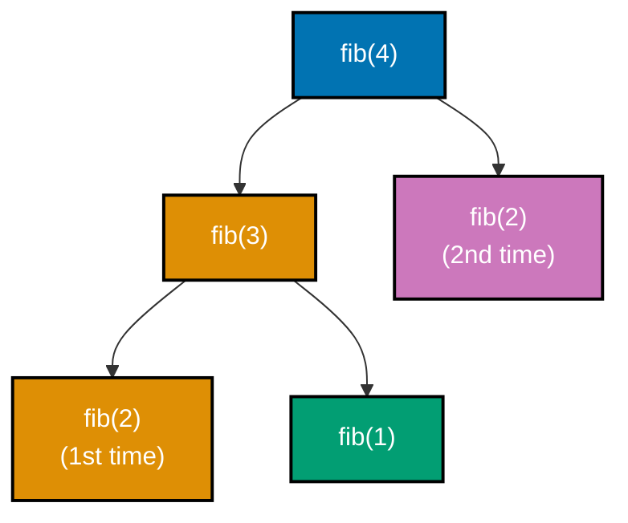

**`learning/code/ex-61-fibonacci-naive-recursive/example.py`**

```python
"""Example 61: Naive Recursive Fibonacci -- and Its Exponential Cost."""

call_count = 0  # => module-level counter, incremented on every call


# fib(n) = fib(n-1) + fib(n-2) -- but RECOMPUTES overlapping subproblems (co-17, co-01).
def fib(n: int) -> int:  # => a plain recursive function, no caching at all
    global call_count  # => allows this function to mutate the module-level counter
    call_count += 1  # => tallies every single call, including duplicates
    if n <= 1:  # => BASE CASE -- fib(0)=0, fib(1)=1
        return n  # => n itself is the answer for 0 and 1
    return fib(n - 1) + fib(
        n - 2
    )  # => two RECURSIVE calls -- the tree branches exponentially
    # => fib(n-2) gets recomputed from scratch inside BOTH fib(n-1) and fib(n) itself


result = fib(10)  # => the correct value, but at exponential O(2^n) call-count cost
print(result)  # => Output: 55
print(
    call_count
)  # => Output: 177 (far more than the 10 "useful" subproblems that exist)

assert result == 55  # => confirms fib(10) matches the known correct value
assert call_count > 10  # => confirms wasteful REPEATED work: way more calls than n
print("ex-61 OK")  # => Output: ex-61 OK
```

**Run**: `python3 example.py`

**Output**:

```text
55
177
ex-61 OK
```

**Key takeaway**: Naive recursive Fibonacci is correct but exponentially wasteful: it recomputes identical subproblems an exponential number of times instead of solving each one once.

**Why it matters**: This is the clearest demonstration in this topic that a recursive definition being _mathematically_ correct does not mean it is _computationally_ efficient -- the call count explosion here is exactly the problem memoization (co-19, Examples 62-63) exists to fix, and having this uncached baseline makes that fix's payoff concrete and measurable.

---

### Example 62: Memoized Fibonacci with a Dict Cache

_ex-62 &middot; exercises co-19, co-08_

Caching each `fib(n)` result in a `dict` the first time it's computed turns every later request for that same `n` into an O(1) lookup instead of a re-computation -- collapsing Example 61's exponential call count down to linear. This example computes `fib(10)` again and counts the dramatically smaller number of calls.

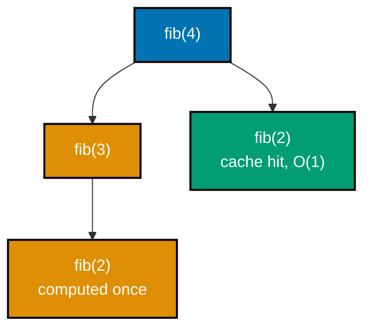

**`learning/code/ex-62-fibonacci-memoized-dict/example.py`**

```python
"""Example 62: Memoized Fibonacci with a Dict Cache."""

call_count = 0  # => tallies every call, same as Example 61, for a fair comparison
cache: dict[int, int] = {}  # => maps n -> fib(n), once computed (co-19, co-08)


# Same recurrence as Example 61, but a dict CACHE collapses repeat work (co-19).
def fib(n: int) -> int:  # => a recursive function with a memoization cache
    global call_count  # => allows this function to mutate the module-level counter
    call_count += 1  # => tallies every call, including cache hits
    if n in cache:  # => O(1) average lookup -- this subproblem was already solved
        return cache[n]  # => reuse the stored answer -- no further recursion needed
    if n <= 1:  # => BASE CASE
        result = n  # => n itself is the answer for 0 and 1
    else:  # => RECURSIVE CASE, but each n computed ONCE
        result = fib(n - 1) + fib(
            n - 2
        )  # => combines two smaller cached-or-computed results
    cache[n] = result  # => store BEFORE returning, so future calls hit the cache
    return result  # => the (now cached) answer for this n


result = fib(10)  # => same correct answer as the naive version
print(result)  # => Output: 55
print(call_count)  # => Output: 19 (linear in n, not exponential)

assert result == 55  # => confirms memoization doesn't change the correct answer
assert call_count < 30  # => confirms FAR fewer calls than Example 61's 177
print("ex-62 OK")  # => Output: ex-62 OK
```

**Run**: `python3 example.py`

**Output**:

```text
55
19
ex-62 OK
```

**Key takeaway**: A `dict` cache turns Fibonacci's exponential recomputation into linear work: each unique `n` is computed exactly once, and every repeat request is an O(1) cache hit.

**Why it matters**: Comparing this example's call count directly against Example 61's is the clearest possible demonstration of memoization's payoff -- the recursive _logic_ did not change at all, only whether repeated subproblems get recomputed or looked up, and that one change is the entire difference between exponential and linear time. At `fib(30)`, the naive version's call count balloons into the millions, while the memoized version stays linear at 30 -- a gap wide enough that the uncached version becomes noticeably slow long before the cached one does.

---

### Example 63: Memoized Fibonacci with functools.lru_cache

_ex-63 &middot; exercises co-19_

`functools.lru_cache` is the stdlib's ready-made version of Example 62's hand-rolled dict cache: a single `@lru_cache` decorator memoizes a function's results automatically, and `cache_info()` reports exactly how many calls were cache hits versus genuine computations.

**`learning/code/ex-63-fibonacci-lru-cache/example.py`**

```python
"""Example 63: Memoized Fibonacci with functools.lru_cache."""

# lru_cache is memoization built into the standard library -- one decorator
# replaces Example 62's hand-written dict cache entirely (co-19).
from functools import lru_cache  # => imports the stdlib memoizing decorator


@lru_cache(
    maxsize=None
)  # => maxsize=None means "cache every distinct call, no eviction"
def fib(
    n: int,
) -> int:  # => identical recurrence to Example 61; the decorator caches it
    if n <= 1:  # => BASE CASE
        return n  # => n itself is the answer for 0 and 1
    return fib(n - 1) + fib(
        n - 2
    )  # => RECURSIVE CASE; lru_cache intercepts repeat calls


result = fib(10)  # => computed once per distinct n, then served from cache
print(result)  # => Output: 55
info = fib.cache_info()  # => introspects the decorator's own hit/miss bookkeeping
print(info)  # => Output: CacheInfo(hits=8, misses=11, maxsize=None, currsize=11)

assert result == 55  # => confirms the cached recursion still returns the correct value
assert info.hits > 0  # => confirms the cache actually served at least one repeated call
print("ex-63 OK")  # => Output: ex-63 OK
```

**Run**: `python3 example.py`

**Output**:

```text
55
CacheInfo(hits=8, misses=11, maxsize=None, currsize=11)
ex-63 OK
```

**Key takeaway**: `@lru_cache` gives you memoization with one decorator line, and `cache_info()` reports the hit/miss breakdown directly -- no hand-rolled dict cache required.

**Why it matters**: This is the practical, production-ready version of the technique Example 62 built by hand -- once you understand _why_ a dict cache works (Example 62), reaching for `functools.lru_cache` instead of re-implementing that cache yourself is almost always the right call in real code. `lru_cache` also adds a bounded-size eviction policy for free (via its `maxsize` parameter), something Example 62's plain dict cache would need hand-written LRU logic (Example 78) to replicate if memory needed to stay bounded.

---

### Example 64: Bottom-Up Iterative Fibonacci

_ex-64 &middot; exercises co-18_

Bottom-up iterative Fibonacci builds up from `fib(0)` and `fib(1)` toward `fib(n)` in a single loop, keeping only the two most recent values in memory at any time -- O(n) time and O(1) space, with no recursion, caching, or call stack involved at all.

**`learning/code/ex-64-fibonacci-iterative/example.py`**

```python
"""Example 64: Bottom-Up Iterative Fibonacci."""


# Builds up from fib(0), fib(1) with two rolling variables -- O(n) time, O(1) space (co-18).
def fib(n: int) -> int:  # => a plain iterative function, no recursion at all
    previous, current = (
        0,
        1,
    )  # => previous=fib(0), current=fib(1) -- no cache dict needed
    for _ in range(
        n
    ):  # => exactly n iterations -- no repeated subproblems exist here at all
        previous, current = (
            current,
            previous + current,
        )  # => slides the window forward by one
        # => this single line replaces BOTH Example 61's recursion tree and Example 62's cache
    return previous  # => after n slides, previous holds fib(n)


result = fib(10)  # => same correct answer as Examples 61-63, with O(1) extra space
print(result)  # => Output: 55

assert result == 55  # => confirms the iterative version matches the recursive versions
assert (
    fib(0) == 0 and fib(1) == 1
)  # => confirms both base cases hold under the iterative form
print("ex-64 OK")  # => Output: ex-64 OK
```

**Run**: `python3 example.py`

**Output**:

```text
55
ex-64 OK
```

**Key takeaway**: Iterative Fibonacci reaches the same O(n) time as the memoized recursive versions (Examples 62-63), but in O(1) space instead of O(n) space for the cache and O(n) call-stack depth.

**Why it matters**: This is the natural endpoint of the recursion-to-iteration conversion this topic's co-18 concept describes: recursive-with-memoization (O(n) time, O(n) space) versus purely iterative (O(n) time, O(1) space) -- the same asymptotic time, but a real, measurable difference in memory footprint and stack depth. On a service computing `fib(n)` for a large `n` under memory pressure, that O(1)-space guarantee is the difference between a function that scales indefinitely and one whose memoization cache or call stack eventually exhausts available memory.

---

### Example 65: Minimum Coins to Make Change, via Memoized Recursion

_ex-65 &middot; exercises co-19, co-17_

The coin-change problem asks for the fewest coins that sum to a target amount. Solved with memoized recursion, `min_coins(amount)` tries every coin denomination and recurses on the remainder, caching each amount's answer so it is computed only once no matter how many different coin combinations reach it.

**`learning/code/ex-65-coin-change-memoized/example.py`**

```python
"""Example 65: Minimum Coins to Make Change, via Memoized Recursion."""

cache: dict[int, int] = {
    0: 0
}  # => base fact: 0 coins are needed to make amount 0 (co-19)


# Tries every coin as the "first" pick, recurses on the remainder, caches by amount (co-19, co-17).
def min_coins(
    coins: list[int], amount: int
) -> int:  # => a recursive function with a cache
    if amount in cache:  # => this exact remaining amount was already solved
        return cache[amount]  # => reuse the stored answer
    if amount < 0:  # => overshot -- this coin choice is invalid
        return -1  # => signal "impossible" for this branch
    best = -1  # => tracks the fewest coins found across all choices, or -1 if none work
    for coin in coins:  # => RECURSIVE CASE: try using this coin first
        sub_result = min_coins(
            coins, amount - coin
        )  # => solve the smaller remaining amount
        if sub_result != -1 and (
            best == -1 or sub_result + 1 < best
        ):  # => a better plan found
            best = (
                sub_result + 1
            )  # => this coin's plan beats the best plan found so far
    cache[amount] = best  # => memoize this amount's answer for any future call
    return best  # => the fewest coins needed for this amount, or -1 if impossible


coins = [1, 3, 4]  # => available denominations
result = min_coins(coins, 6)  # => best plan: 3 + 3 = two coins (not six 1s, not 4+1+1)
print(result)  # => Output: 2

assert (
    result == 2
)  # => confirms 3+3 (two coins) beats every other combination for amount 6
print("ex-65 OK")  # => Output: ex-65 OK
```

**Run**: `python3 example.py`

**Output**:

```text
2
ex-65 OK
```

**Key takeaway**: Coin change is naive-recursive-Fibonacci's overlapping-subproblems pattern applied to a harder problem: the same `amount` can be reached via many different coin combinations, and memoization ensures it is only ever solved once.

**Why it matters**: This is the first example where memoization (co-19) is applied to a problem genuinely worth solving, rather than to Fibonacci as a teaching device -- recognizing "this problem has overlapping subproblems" is the actual transferable skill, and coin change is a canonical case where that recognition pays off directly. A vending machine or point-of-sale system computing optimal change for arbitrary totals relies on exactly this shape -- without memoization, the same coin-count subproblem gets re-solved for every overlapping remainder, the identical inefficiency Example 61 first exposed.

---

### Example 66: Count Unique Grid Paths, via Memoization

_ex-66 &middot; exercises co-19_

Counting the number of unique paths from a grid's top-left corner to its bottom-right corner (moving only right or down) has the same overlapping-subproblem structure as coin change: `paths(r, c) = paths(r-1, c) + paths(r, c-1)`, memoized by `(row, col)` position.

**`learning/code/ex-66-grid-paths-memoized/example.py`**

```python
"""Example 66: Count Unique Grid Paths, via Memoization."""

from functools import lru_cache  # => imports the stdlib memoizing decorator (co-19)


# Counts paths from (0,0) to (rows-1, cols-1), moving only right or down.
# Without caching, this recurrence re-explores the SAME sub-grid from many
# different starting cells -- memoization collapses that overlap.
@lru_cache(maxsize=None)  # => the same stdlib memoization tool as Example 63
def count_paths(rows: int, cols: int) -> int:  # => a recursive, cached function
    if rows == 1 or cols == 1:  # => BASE CASE -- only one straight-line path exists
        return 1  # => a single-row or single-column grid has exactly one path
    return count_paths(rows - 1, cols) + count_paths(
        rows, cols - 1
    )  # => came from above OR left


result = count_paths(3, 3)  # => a 3x3 grid has exactly 6 distinct right/down paths
print(result)  # => Output: 6

assert result == 6  # => confirms the known path count for a 3x3 grid
assert count_paths(1, 5) == 1  # => confirms a single-row grid has exactly one path
print("ex-66 OK")  # => Output: ex-66 OK
```

**Run**: `python3 example.py`

**Output**:

```text
6
ex-66 OK
```

**Key takeaway**: Grid-path counting has the identical memoized-recursion shape as coin change (Example 65) and Fibonacci (Examples 61-63) -- the cache key is just a `(row, col)` tuple instead of a single integer.

**Why it matters**: Seeing the same memoization pattern applied a third time, on a problem that looks structurally different (a 2D grid instead of a single number), is what makes the underlying pattern -- "cache results keyed by whatever uniquely identifies a subproblem" -- feel general rather than specific to Fibonacci. A robotics path planner counting reachable routes across a warehouse grid, or a game counting valid move sequences, both hit this exact overlapping-subproblem shape -- memoized by `(row, col)` instead of by a single integer `n`.

---

### Example 67: Delete a Node from a BST -- All Three Cases

_ex-67 &middot; exercises co-11_

Deleting a node from a BST has three distinct cases: a leaf (just remove it), a node with one child (splice the child up into its place), and a node with two children (replace it with its inorder successor -- the minimum of its right subtree -- then delete that successor from its original position). This example runs two deletes in sequence to exercise all three cases: `delete(root, 2)` hits the two-children case, which internally recurses into the leaf case to remove the successor; `delete(root, 3)` then hits the one-child case against the node that first delete left behind.

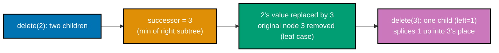

**`learning/code/ex-67-bst-delete/example.py`**

```python
"""Example 67: Delete a Node from a BST -- All Three Cases."""

from __future__ import (
    annotations,
)  # => enables forward references to the class defined below


class BSTNode:  # => the same BST node shape as Example 53 (co-11)
    def __init__(self, val: int) -> None:  # => constructor: a leaf with no children yet
        self.val = val  # => the value stored at this node
        self.left: BSTNode | None = None  # => no left child yet
        self.right: BSTNode | None = None  # => no right child yet


def insert(
    root: BSTNode | None, val: int
) -> BSTNode:  # => same insert as Example 53 (co-11)
    if root is None:  # => BASE CASE -- empty slot found
        return BSTNode(val)  # => becomes the new leaf
    if val < root.val:  # => smaller values go left
        root.left = insert(root.left, val)  # => recurse left
    else:  # => equal-or-larger values go right
        root.right = insert(root.right, val)  # => recurse right
    return root  # => the (possibly updated) subtree root


# Three cases: leaf (drop it), one child (splice it out), two children
# (replace with the in-order successor -- the smallest node in the right subtree).
def delete(
    root: BSTNode | None, val: int
) -> BSTNode | None:  # => a recursive delete function
    if root is None:  # => value not present -- nothing to delete
        return None  # => an empty subtree stays empty
    if val < root.val:  # => the target is somewhere in the left subtree
        root.left = delete(root.left, val)  # => recurse left, rewire the result back
    elif val > root.val:  # => the target is somewhere in the right subtree
        root.right = delete(root.right, val)  # => recurse right, rewire the result back
    else:  # => root.val == val -- THIS is the node to delete
        if (
            root.left is None
        ):  # => Case: no left child (covers leaf AND one-right-child)
            return (
                root.right
            )  # => splice out root -- promote its right child (or None) up
        if root.right is None:  # => Case: only a left child
            return root.left  # => splice out root -- promote its left child up
        successor = root.right  # => Case: two children -- find the in-order successor
        while successor.left is not None:  # => smallest value in the right subtree
            successor = successor.left  # => keep descending left
        root.val = successor.val  # => copy successor's value into this node
        root.right = delete(
            root.right, successor.val
        )  # => then remove the duplicate successor
    return root  # => the (possibly rewired) subtree root


def inorder(
    node: BSTNode | None,
) -> list[int]:  # => inorder traversal, same shape as before
    if node is None:  # => BASE CASE -- nothing to visit
        return []  # => no values from this branch
    return inorder(node.left) + [node.val] + inorder(node.right)  # => left, self, right


root: BSTNode | None = None  # => starts as an empty tree
for value in (5, 2, 8, 1, 3, 7, 9):  # => builds a small, non-trivial BST
    root = insert(root, value)
root = delete(
    root, 2
)  # => two-children case (2 has children 1 and 3), which recurses into the leaf case
# => (successor 3 has no children of its own) -- 2's slot now holds val 3, left=1, right=None
root = delete(
    root, 3
)  # => one-child case: the node now holding 3 has only a left child (1), no right child
result = inorder(root)  # => must STILL be sorted after both deletes
print(result)  # => Output: [1, 5, 7, 8, 9]

assert (
    result
    == [
        1,
        5,
        7,
        8,
        9,
    ]
)  # => confirms sorted order survives all three delete cases (two-children, leaf, one-child)
assert 2 not in result and 3 not in result  # => confirms both deleted values are gone
print("ex-67 OK")  # => Output: ex-67 OK
```

**Run**: `python3 example.py`

**Output**:

```text
[1, 5, 7, 8, 9]
ex-67 OK
```

**Key takeaway**: BST deletion's hardest case (two children) is solved by swapping in the inorder successor's value and then deleting that successor from where it originally sat -- never by directly removing a two-child node.

**Why it matters**: This is the most intricate single operation in this topic's BST coverage, and it directly reuses Example 55's "BST minimum" logic (finding the inorder successor is exactly "the minimum of the right subtree") -- a concrete example of how a simpler, earlier concept becomes a building block for a harder, later one.

---

### Example 68: Iterative Inorder Traversal with an Explicit Stack

_ex-68 &middot; exercises co-11, co-04, co-18_

Inorder traversal (Example 49) is naturally recursive, but any recursion can be rewritten iteratively (co-18) with an explicit stack standing in for the implicit call stack: push every node while descending left, then pop, visit, and descend right. This example confirms the iterative version produces identical output to the recursive one.

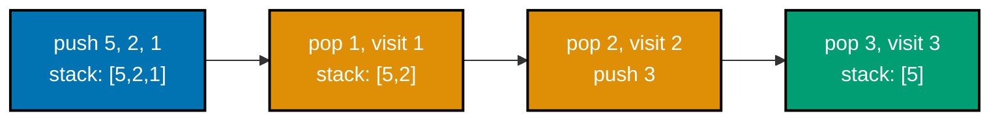

**`learning/code/ex-68-bst-inorder-iterative/example.py`**

```python
"""Example 68: Iterative Inorder Traversal with an Explicit Stack."""

from __future__ import (
    annotations,
)  # => enables forward references to the class defined below


class BSTNode:  # => the same BST node shape as Example 53 (co-11)
    def __init__(self, val: int) -> None:  # => constructor: a leaf with no children yet
        self.val = val  # => the value stored at this node
        self.left: BSTNode | None = None  # => no left child yet
        self.right: BSTNode | None = None  # => no right child yet


def insert(
    root: BSTNode | None, val: int
) -> BSTNode:  # => same insert as Example 53 (co-11)
    if root is None:  # => BASE CASE -- empty slot found
        return BSTNode(val)  # => becomes the new leaf
    if val < root.val:  # => smaller values go left
        root.left = insert(root.left, val)  # => recurse left
    else:  # => equal-or-larger values go right
        root.right = insert(root.right, val)  # => recurse right
    return root  # => the (possibly updated) subtree root


# The familiar recursive version, for comparison (co-11, co-17).
def inorder_recursive(
    node: BSTNode | None,
) -> list[int]:  # => call-stack-based traversal
    if node is None:  # => BASE CASE -- nothing to visit
        return []  # => no values from this branch
    return inorder_recursive(node.left) + [node.val] + inorder_recursive(node.right)


# Same traversal, but an explicit list-as-stack replaces the call stack (co-11, co-04, co-18).
def inorder_iterative(
    root: BSTNode | None,
) -> list[int]:  # => manual-stack-based traversal
    result: list[
        int
    ] = []  # => collects visited values, same order as the recursive version
    stack: list[
        BSTNode
    ] = []  # => a manual stack -- append() pushes, pop() pops (co-04)
    node = root  # => the node currently being descended into
    while (
        stack or node is not None
    ):  # => continue while there's work on the stack OR below us
        while (
            node is not None
        ):  # => walk all the way left, pushing each node along the way
            stack.append(node)  # => remembers this ancestor for later
            node = node.left  # => keeps descending left
        node = stack.pop()  # => backtrack to the deepest unvisited ancestor
        result.append(
            node.val
        )  # => visit it NOW -- this is the "self" step of left-self-right
        node = node.right  # => then descend into its right subtree next
    return result  # => the full inorder-visited values, iteratively collected


root: BSTNode | None = None  # => starts as an empty tree
for value in (5, 2, 8, 1, 3, 7, 9):  # => builds the same fixture as Example 67
    root = insert(
        root, value
    )  # => builds the same shape as Example 67, one insert per value

recursive_order = inorder_recursive(root)  # => the call-stack-based traversal
iterative_order = inorder_iterative(root)  # => the explicit-stack traversal
print(recursive_order)  # => Output: [1, 2, 3, 5, 7, 8, 9]
print(iterative_order)  # => Output: [1, 2, 3, 5, 7, 8, 9]

assert iterative_order == recursive_order  # => confirms both traversals agree exactly
print("ex-68 OK")  # => Output: ex-68 OK
```

**Run**: `python3 example.py`

**Output**:

```text
[1, 2, 3, 5, 7, 8, 9]
[1, 2, 3, 5, 7, 8, 9]
ex-68 OK
```

**Key takeaway**: An explicit `list`-as-stack (co-04) can replace inorder traversal's implicit recursive call stack, producing identical output while making the traversal's internal state directly inspectable.

**Why it matters**: This is co-18's central claim made concrete on a real algorithm, not a toy example -- and it directly reuses Example 5's stack-as-list technique, now applied to walking a tree instead of matching balanced parentheses. Any language or runtime with a strict, fixed call-stack limit -- deeply nested JSON parsing, for instance -- eventually needs this exact recursion-to-iteration conversion to avoid a stack overflow on sufficiently deep or large input.

---

### Example 69: Check Whether a Binary Tree Is Height-Balanced

_ex-69 &middot; exercises co-10, co-17_

A tree is height-balanced if, at every node, its left and right subtrees' heights differ by at most 1. This example checks two small trees -- one balanced, one deliberately lopsided -- in a single recursive pass that returns a sentinel (-1) the moment any subtree is found unbalanced, rather than making two separate passes.

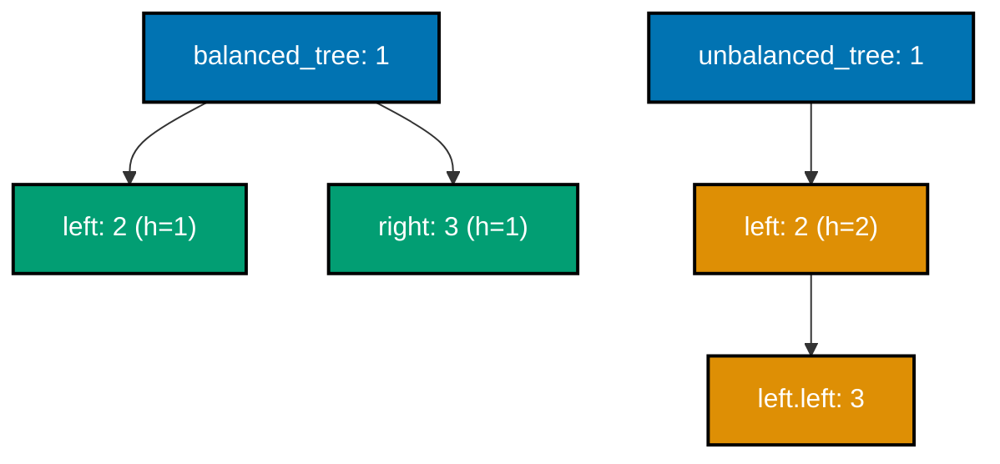

**`learning/code/ex-69-tree-is-balanced/example.py`**

```python
"""Example 69: Check Whether a Binary Tree Is Height-Balanced."""

from __future__ import (
    annotations,
)  # => enables forward references to the class defined below


class TreeNode:  # => the same binary-tree node shape as Example 48 (co-10)
    def __init__(
        self,
        val: int,
        left: TreeNode | None = None,
        right: TreeNode | None = None,
        # => three params: the value plus each optional child, defaulting to leaf
    ) -> None:  # => constructor: stores the value plus both optional children
        self.val = val  # => the value stored at this node
        self.left = left  # => reference to the left child, or None
        self.right = right  # => reference to the right child, or None


# Returns height, or -1 as a sentinel the moment ANY subtree is unbalanced --
# stops early instead of recomputing height and balance in two separate passes (co-10, co-17).
def height_if_balanced(
    node: TreeNode | None,
) -> int:  # => a single-pass recursive check
    if node is None:  # => BASE CASE -- an empty subtree is balanced with height 0
        return 0  # => contributes no height and no imbalance
    left_height = height_if_balanced(
        node.left
    )  # => RECURSIVE CASE: check the left subtree first
    if left_height == -1:  # => left subtree already failed
        return -1  # => propagate the failure up
    right_height = height_if_balanced(
        node.right
    )  # => RECURSIVE CASE: check the right subtree
    if right_height == -1:  # => right subtree already failed
        return -1  # => propagate the failure up
    if (
        abs(left_height - right_height) > 1
    ):  # => the balance CONDITION: heights differ by <= 1
        return -1  # => unbalanced at this node -- signal failure upward
    return 1 + max(
        left_height, right_height
    )  # => balanced here -- report the real height


def is_balanced(
    root: TreeNode | None,
) -> bool:  # => a thin wrapper over the sentinel check
    return (
        height_if_balanced(root) != -1
    )  # => -1 anywhere in the tree means "not balanced"


balanced_tree = TreeNode(
    1, TreeNode(2), TreeNode(3)
)  # => both subtrees height 1 -- balanced
unbalanced_tree = TreeNode(
    1, TreeNode(2, TreeNode(3))
)  # => left is deeper by 2 -- unbalanced
result_balanced = is_balanced(balanced_tree)  # => checks the shallow, even tree
result_unbalanced = is_balanced(unbalanced_tree)  # => checks the lopsided tree
print(result_balanced)  # => Output: True
print(result_unbalanced)  # => Output: False

assert result_balanced is True  # => confirms a shallow, even tree is reported balanced
assert result_unbalanced is False  # => confirms a lopsided tree is reported unbalanced
print("ex-69 OK")  # => Output: ex-69 OK
```

**Run**: `python3 example.py`

**Output**:

```text
True
False
ex-69 OK
```

**Key takeaway**: Checking balance in one recursive pass (returning -1 as a failure sentinel the instant an imbalance is found) avoids recomputing height and balance separately, which would cost O(n log n) instead of this approach's O(n).

**Why it matters**: This example reuses Example 52's height computation directly, then adds one extra check (is the height difference `<= 1`) at every node -- showing how a single well-chosen sentinel return value (`-1` meaning "already failed, stop checking") can fuse two separate concerns into one efficient pass. A naive two-pass version (compute every subtree's height first, then separately check every node's balance) costs O(n log n) on a tree of any real size, while this fused single pass stays O(n) regardless of how deep the tree grows.

---

### Example 70: Lowest Common Ancestor in a BST

_ex-70 &middot; exercises co-11_

The lowest common ancestor (LCA) of two nodes in a BST is the deepest node that is an ancestor of both. The BST ordering invariant makes finding it simple: starting from the root, descend toward whichever target is smaller/larger until the current node sits **between** the two targets (or equals one of them) -- that node is the LCA.

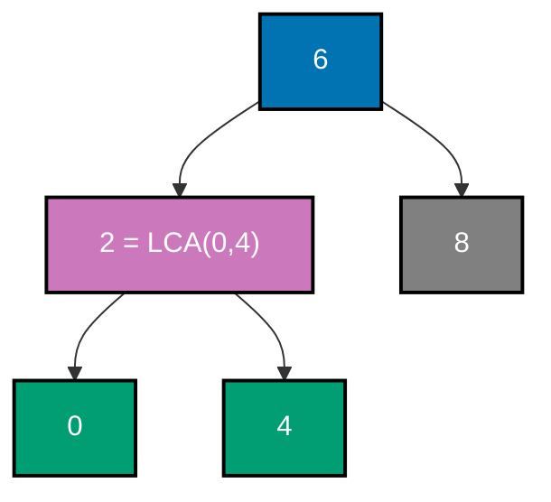

**`learning/code/ex-70-bst-lowest-common-ancestor/example.py`**

```python
"""Example 70: Lowest Common Ancestor in a BST."""

from __future__ import (
    annotations,
)  # => enables forward references to the class defined below


class BSTNode:  # => the same BST node shape as Example 53 (co-11)
    def __init__(self, val: int) -> None:  # => constructor: a leaf with no children yet
        self.val = val  # => the value stored at this node
        self.left: BSTNode | None = None  # => no left child yet
        self.right: BSTNode | None = None  # => no right child yet


def insert(
    root: BSTNode | None, val: int
) -> BSTNode:  # => same insert as Example 53 (co-11)
    if root is None:  # => BASE CASE -- empty slot found
        return BSTNode(val)  # => becomes the new leaf
    if val < root.val:  # => smaller values go left
        root.left = insert(root.left, val)  # => recurse left
    else:  # => equal-or-larger values go right
        root.right = insert(root.right, val)  # => recurse right
    return root  # => the (possibly updated) subtree root


# Uses the BST ordering property: the split point where p and q diverge IS the
# ancestor -- no need to search both subtrees blindly like a plain binary tree (co-11).
def lowest_common_ancestor(
    root: BSTNode, p: int, q: int
) -> int:  # => an iterative walk
    node = root  # => starts the descent at the root
    while (
        True
    ):  # => descends exactly once per level, O(log n) average on a balanced BST
        if (
            p < node.val and q < node.val
        ):  # => both targets are smaller -- LCA is further left
            node = node.left  # => descend into the left subtree
            assert (
                node is not None
            )  # => p and q are both present in the tree, so this can't walk past a leaf
        elif (
            p > node.val and q > node.val
        ):  # => both targets are larger -- LCA is further right
            node = node.right  # => descend into the right subtree
            assert (
                node is not None
            )  # => p and q are both present in the tree, so this can't walk past a leaf
        else:  # => p and q are now on OPPOSITE sides (or one equals node.val) -- found it
            return node.val  # => this node is the lowest common ancestor


root: BSTNode | None = None  # => starts as an empty tree
for value in (6, 2, 8, 0, 4, 7, 9, 3, 5):  # => a moderately deep BST
    root = insert(root, value)
assert root is not None  # => the loop above always inserts at least one node

ancestor = lowest_common_ancestor(
    root, 2, 8
)  # => 2 and 8 split immediately at the root, 6
print(ancestor)  # => Output: 6

assert ancestor == 6  # => confirms the root itself is the LCA of 2 and 8
assert lowest_common_ancestor(root, 0, 4) == 2  # => confirms a deeper LCA also resolves
print("ex-70 OK")  # => Output: ex-70 OK
```

**Run**: `python3 example.py`

**Output**:

```text
6
ex-70 OK
```

**Key takeaway**: A BST's ordering invariant turns LCA-finding into a single descent from the root: the first node whose value sits between the two targets **is** the lowest common ancestor.

**Why it matters**: This is another example of Example 53's core BST invariant (left is smaller, right is larger) doing the heavy lifting -- on a plain, unordered binary tree, finding the LCA needs a full traversal of both paths from the root; on a BST, the ordering invariant collapses that into a single O(h) descent.

---

### Example 71: Dijkstra's Shortest Paths with a Min-Heap

_ex-71 &middot; exercises co-12, co-21_

Dijkstra's algorithm generalizes BFS's unweighted shortest path (Example 59) to **weighted** edges: a min-heap always expands the currently-cheapest-known node next, and relaxes (potentially improves) every neighbor's distance from there. This example finds shortest distances from one node across a small weighted graph.

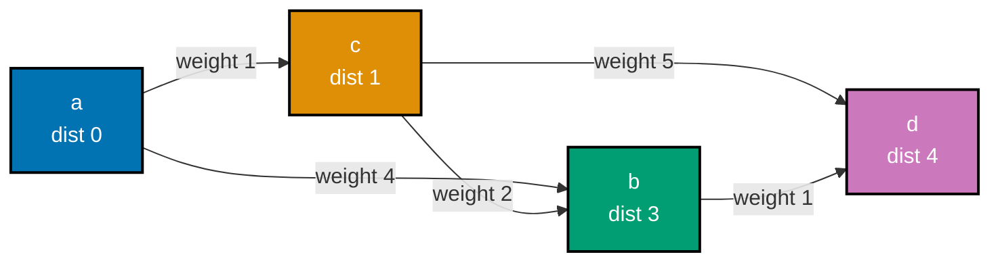

**`learning/code/ex-71-dijkstra-with-heap/example.py`**

```python
"""Example 71: Dijkstra's Shortest Paths with a Min-Heap."""

# Dijkstra generalizes Example 59's unweighted BFS to WEIGHTED edges: a min-heap
# always expands the currently-cheapest-known node next (co-12, co-21).
import heapq  # => imports the stdlib binary-heap functions

graph: dict[
    str, list[tuple[str, int]]
] = {  # => node -> list of (neighbor, edge_weight)
    "a": [("b", 4), ("c", 1)],  # => from a: b costs 4 directly, c costs 1 directly
    "b": [("d", 1)],  # => from b: d costs 1
    "c": [("b", 2), ("d", 5)],  # => from c: b costs 2, d costs 5
    "d": [],  # => d has no outgoing edges -- a dead end
}  # => closes the adjacency dict literal


# Pops the cheapest frontier node each step -- once popped, its distance is FINAL.
def dijkstra(  # => a heap-driven shortest-path function
    graph: dict[str, list[tuple[str, int]]],
    start: str,  # => the graph plus the source node
) -> dict[str, int]:  # => returns node -> shortest distance from start
    distances: dict[str, int] = {start: 0}  # => best known distance to each node so far
    heap: list[tuple[int, str]] = [
        (0, start)
    ]  # => (distance, node) -- heapq sorts by distance
    while heap:  # => O(log n) pop per iteration, at most one pop per push
        dist, node = heapq.heappop(
            heap
        )  # => always the cheapest unexpanded frontier entry
        if dist > distances.get(node, float("inf")):  # => a stale, already-beaten entry
            continue  # => skip it -- a shorter path to node was already found and processed
        for neighbor, weight in graph[node]:  # => relax every outgoing edge from node
            new_dist = dist + weight  # => cost of reaching neighbor THROUGH node
            if new_dist < distances.get(
                neighbor, float("inf")
            ):  # => a strictly better path
                distances[neighbor] = new_dist  # => record the improved distance
                heapq.heappush(
                    heap, (new_dist, neighbor)
                )  # => push the improved candidate
    return distances  # => the shortest known distance to every reachable node


result = dijkstra(
    graph, "a"
)  # => a->c->b (1+2=3) beats a->b directly (4), so b costs 3
print(result)  # => Output: {'a': 0, 'b': 3, 'c': 1, 'd': 4}
# => dict order reflects each key's FIRST-set order (co-08): b before c, even though
# => b's distance is later UPDATED from 4 to 3 -- updates never move a key's position

assert result["a"] == 0  # => confirms the start node's distance to itself is 0
assert (
    result["b"] == 3
)  # => confirms a->c->b (cost 3) beat the direct a->b edge (cost 4)
assert result["d"] == 4  # => confirms a->c->b->d (1+2+1=4) is the cheapest route to d
print("ex-71 OK")  # => Output: ex-71 OK
```

**Run**: `python3 example.py`

**Output**:

```text
{'a': 0, 'b': 3, 'c': 1, 'd': 4}
ex-71 OK
```

**Key takeaway**: Dijkstra replaces BFS's plain queue with a min-heap ordered by distance-so-far, which is exactly what lets it handle edges of different weights, unlike BFS's "every edge costs 1" assumption.

**Why it matters**: This is the direct answer to the limitation Example 59 flagged: plain BFS's "level = distance" trick only works on unweighted graphs, and Dijkstra's heap-based relaxation is precisely the generalization that restores a correct shortest-path guarantee once edges carry different costs. A road-mapping service computing "fastest route by travel time," where each edge's weight is minutes rather than a uniform 1, could not use BFS at all -- Dijkstra's heap-based relaxation is the minimum viable algorithm for that exact problem.

---

### Example 72: Topological Sort via Kahn's Algorithm

_ex-72 &middot; exercises co-21, co-05, co-08_

Kahn's algorithm topologically sorts a directed acyclic graph (DAG) by repeatedly emitting nodes with zero remaining unresolved prerequisites (in-degree 0), then decrementing the in-degree of everything that depended on the emitted node -- a queue-driven generalization of BFS. This example orders a small "getting dressed" dependency graph.

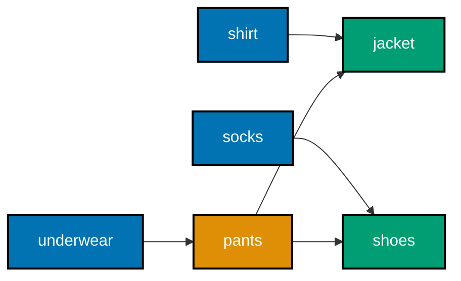

**`learning/code/ex-72-topological-sort-kahn/example.py`**

```python
"""Example 72: Topological Sort via Kahn's Algorithm."""

# Kahn's algorithm repeatedly removes nodes with in-degree 0 (no remaining
# prerequisites) -- a queue-driven generalization of BFS (co-21, co-05, co-08).
from collections import (
    deque,
)  # => imports the stdlib double-ended queue used as the frontier

graph: dict[
    str, list[str]
] = {  # => node -> list of nodes that DEPEND ON it (outgoing edges)
    "shirt": ["jacket"],  # => jacket depends on shirt going on first
    "socks": ["shoes"],  # => shoes depend on socks going on first
    "underwear": ["pants"],  # => pants depend on underwear going on first
    "pants": ["shoes", "jacket"],  # => shoes AND jacket both depend on pants
    "shoes": [],  # => nothing depends on shoes -- can be emitted last among its branch
    "jacket": [],  # => nothing depends on jacket -- can be emitted last among its branch
}  # => closes the dependency-graph literal


# Emits nodes only once every prerequisite has already been emitted (co-05, co-08).
def topological_sort(graph: dict[str, list[str]]) -> list[str]:  # => Kahn's algorithm
    in_degree: dict[str, int] = {
        node: 0 for node in graph
    }  # => counts unresolved prerequisites
    for node in graph:  # => outer pass over every node
        for dependent in graph[
            node
        ]:  # => inner pass over every OUTGOING edge from node
            in_degree[dependent] += (
                1  # => each edge adds ONE prerequisite to its target
            )

    queue: deque[str] = deque(node for node in graph if in_degree[node] == 0)
    # => seeds the queue with every node that has NO prerequisites at all
    order: list[str] = []  # => the resulting valid run order
    while queue:  # => O(V + E): every node and every edge is processed exactly once
        node = (
            queue.popleft()
        )  # => emit the next node with zero remaining prerequisites
        order.append(node)  # => records the emission
        for dependent in graph[node]:  # => relaxes every edge OUT of the emitted node
            in_degree[dependent] -= (
                1  # => one of dependent's prerequisites is now satisfied
            )
            if (
                in_degree[dependent] == 0
            ):  # => dependent has NO prerequisites left -- ready
                queue.append(dependent)  # => schedules dependent for emission
    return order  # => the full, dependency-respecting run order


order = topological_sort(graph)  # => a valid dressing order respecting every dependency
print(order)  # => Output: ['shirt', 'socks', 'underwear', 'pants', 'shoes', 'jacket']

assert len(order) == len(graph)  # => confirms every node was emitted exactly once
assert order.index("underwear") < order.index(
    "pants"
)  # => confirms deps precede dependents
assert order.index("pants") < order.index(
    "shoes"
)  # => confirms deps precede dependents
print("ex-72 OK")  # => Output: ex-72 OK
```

**Run**: `python3 example.py`

**Output**:

```text
['shirt', 'socks', 'underwear', 'pants', 'shoes', 'jacket']
ex-72 OK
```

**Key takeaway**: Kahn's algorithm emits nodes only once every one of their prerequisites has already been emitted, using in-degree counts and a queue instead of BFS's plain visited-set bookkeeping.

**Why it matters**: This is a direct structural cousin of Example 57's graph BFS -- same queue-driven discipline, but tracking "how many unresolved prerequisites does this node have" instead of "have I visited this node yet." Dependency ordering (build systems, task scheduling, this very topic's capstone) is exactly what this algorithm is for.

---

### Example 73: Detect a Cycle in a Directed Graph via DFS Coloring

_ex-73 &middot; exercises co-21, co-17_

Detecting a cycle in a **directed** graph needs more than a plain visited set (which works for undirected graphs) -- it needs three colors per node: white (unvisited), gray (currently on the recursion stack), and black (fully processed). A cycle exists exactly when DFS encounters a gray node again. This example checks both a cyclic and an acyclic fixture.

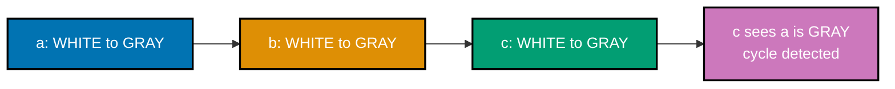

**`learning/code/ex-73-detect-cycle-directed/example.py`**

```python
"""Example 73: Detect a Cycle in a Directed Graph via DFS Coloring."""

# Three-color DFS: WHITE (unvisited), GRAY (on the current recursion path),
# BLACK (fully finished). A cycle exists iff DFS ever revisits a GRAY node (co-21, co-17).
WHITE, GRAY, BLACK = 0, 1, 2  # => the three states each node can be in


def has_cycle(graph: dict[str, list[str]]) -> bool:  # => outer driver over every node
    color: dict[str, int] = {
        node: WHITE for node in graph
    }  # => everyone starts unvisited

    def visit(node: str) -> bool:  # => a closure sharing the outer color dict
        color[node] = (
            GRAY  # => mark as "currently being explored" -- on the active path
        )
        for neighbor in graph[node]:  # => RECURSIVE CASE: check every outgoing edge
            if (
                color[neighbor] == GRAY
            ):  # => a back-edge to an ANCESTOR -- this IS a cycle
                return True  # => cycle found -- propagate immediately
            if color[neighbor] == WHITE and visit(
                neighbor
            ):  # => unvisited -- recurse into it
                return True  # => propagate a cycle found deeper in the recursion
        color[node] = BLACK  # => fully explored with no cycle through this node
        return False  # => no cycle found through this node's subtree

    return any(color[node] == WHITE and visit(node) for node in graph)
    # => tries every unvisited node as a DFS root -- the graph may be disconnected


cyclic_graph: dict[str, list[str]] = {
    "a": ["b"],
    "b": ["c"],
    "c": ["a"],
}  # => a->b->c->a
acyclic_graph: dict[str, list[str]] = {
    "a": ["b"],
    "b": ["c"],
    "c": [],
}  # => a->b->c, no way back

cyclic_result = has_cycle(cyclic_graph)  # => a->b->c->a revisits GRAY node "a"
acyclic_result = has_cycle(acyclic_graph)  # => a->b->c reaches BLACK with no revisits
print(cyclic_result)  # => Output: True
print(acyclic_result)  # => Output: False

assert cyclic_result is True  # => confirms the cyclic fixture is correctly flagged
assert acyclic_result is False  # => confirms the acyclic fixture is correctly cleared
print("ex-73 OK")  # => Output: ex-73 OK
```

**Run**: `python3 example.py`

**Output**:

```text
True
False
ex-73 OK
```

**Key takeaway**: Three-color DFS distinguishes "this node is still being explored" (gray, meaning a cycle back to it would be a real cycle) from "this node is fully done" (black, meaning re-reaching it is fine) -- a distinction a plain two-state visited set cannot make.

**Why it matters**: This is exactly the gap plain visited-set DFS (Example 58) leaves open on **directed** graphs: two different paths can legitimately reach the same already-finished node without that being a cycle, and only the gray/black distinction correctly tells that apart from an actual back-edge cycle. A build system or task scheduler (this topic's capstone included) that ships without this exact gray-node check would silently accept a circular dependency instead of failing fast with a clear "cycle detected" error before anything runs.

---

### Example 74: Merge k Sorted Linked Lists with a Heap

_ex-74 &middot; exercises co-12, co-07_

Merging k sorted linked lists into one sorted list uses a min-heap seeded with each list's head node: repeatedly pop the smallest, append its value to the result, and push its successor (if any) back onto the heap -- O(n log k) total for n nodes across k lists, far cheaper than concatenating everything and re-sorting from scratch.

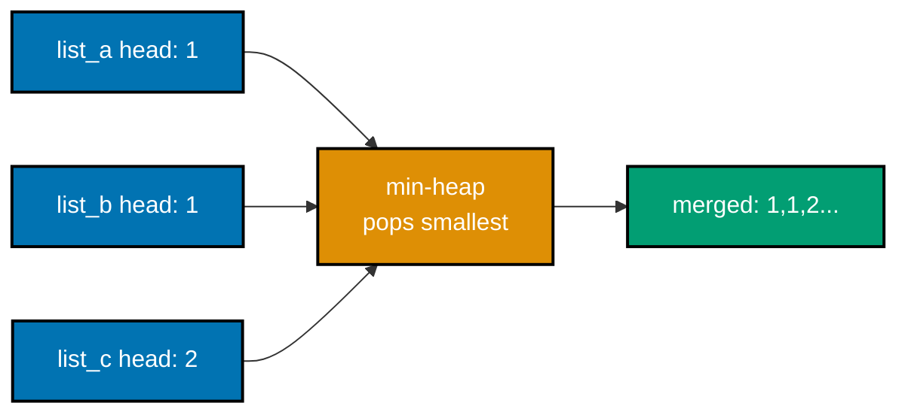

**`learning/code/ex-74-merge-k-sorted-lists/example.py`**

```python
"""Example 74: Merge k Sorted Linked Lists with a Heap."""

from __future__ import (
    annotations,
)  # => enables forward references to the class defined below
import heapq  # => imports the stdlib binary-heap functions


class Node:  # => the standard singly-linked node shape (co-07)
    def __init__(self, val: int, next: Node | None = None) -> None:  # => constructor
        self.val = val  # => the value stored at this node
        self.next = next  # => pointer to the next node, or None at the tail


# Seeds a heap with each list's current head; always takes the global minimum next.
# A heap turns "compare k candidates every step" into an O(log k) operation
# instead of an O(k) linear scan across all k list heads each time (co-12, co-07).
def merge_k_lists(
    heads: list[Node | None],
) -> Node | None:  # => a heap-driven k-way merge
    heap: list[
        tuple[int, int, Node]
    ] = []  # => (value, tie_breaker, node) -- see note below
    for i, head in enumerate(
        heads
    ):  # => tie_breaker=i avoids comparing Node objects directly
        if head is not None:  # => skip any list that starts out empty
            heapq.heappush(
                heap, (head.val, i, head)
            )  # => seeds with each list's first node

    dummy = Node(0)  # => a throwaway head so the result never needs a None-check
    tail = dummy  # => tail always points at the last node appended so far
    while heap:  # => O((n) log k): n total nodes, each heap op costs log k
        _val, i, node = heapq.heappop(
            heap
        )  # => the smallest value among all k frontiers
        tail.next = node  # => appends the global minimum to the merged result
        tail = tail.next  # => advances the tail pointer to the newly appended node
        if node.next is not None:  # => that list still has more nodes
            heapq.heappush(heap, (node.next.val, i, node.next))  # => push its new head
    return dummy.next  # => skips the dummy sentinel, returns the real merged head


def to_list(head: Node | None) -> list[int]:  # => a plain traversal helper
    values: list[int] = []  # => accumulates values as the chain is walked
    node = head  # => starts traversal at head
    while node is not None:  # => stops once the tail's next is None
        values.append(node.val)  # => records this node's value
        node = node.next  # => advances one link forward
    return values  # => the values in link order


list_a = Node(1, Node(4, Node(5)))  # => 1 -> 4 -> 5
list_b = Node(1, Node(3, Node(4)))  # => 1 -> 3 -> 4
list_c = Node(2, Node(6))  # => 2 -> 6
merged_head = merge_k_lists(
    [list_a, list_b, list_c]
)  # => interleaves all three by value
result = to_list(merged_head)  # => flattens the merged chain into a plain list
print(result)  # => Output: [1, 1, 2, 3, 4, 4, 5, 6]

assert result == [
    1,
    1,
    2,
    3,
    4,
    4,
    5,
    6,
]  # => confirms full sorted interleave of all 3 lists
assert result == sorted(
    result
)  # => cross-checks that the merged output is truly sorted
print("ex-74 OK")  # => Output: ex-74 OK
```

**Run**: `python3 example.py`

**Output**:

```text
[1, 1, 2, 3, 4, 4, 5, 6]
ex-74 OK
```

**Key takeaway**: A heap seeded with one candidate per input list turns merging k sorted lists into O(n log k), where a naive concatenate-then-sort approach would cost O(n log n) instead.

**Why it matters**: This combines two ideas this topic already taught separately -- Example 27's linked-list `Node` shape and Example 42's `heapq.merge` for two sorted lists -- generalized to an arbitrary number of input lists using a heap's O(log k) push/pop directly, rather than `heapq.merge`'s two-input convenience wrapper. A production log-aggregation service merging sorted event streams from dozens of shards uses exactly this shape -- one heap entry per shard's current head -- rather than paying the cost of concatenating everything and re-sorting from scratch.

---

### Example 75: Kth Smallest via Quickselect

_ex-75 &middot; exercises co-16_

Quickselect finds the kth smallest element without fully sorting the collection: it reuses quicksort's partitioning step (Example 47), but after partitioning, it only recurses into the **one** side that must contain the kth element -- discarding the other side entirely -- giving average-O(n) instead of full sorting's O(n log n).

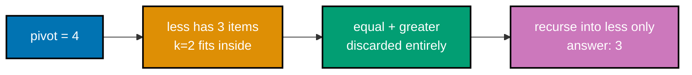

**`learning/code/ex-75-quickselect-kth-smallest/example.py`**

```python
"""Example 75: Kth Smallest via Quickselect."""

import random  # => used to pick a random pivot, avoiding worst-case behavior


# Partitions like quicksort, but recurses into only ONE side -- O(n) average,
# versus sorting the whole list first at O(n log n) (co-16).
def quickselect(
    items: list[int], k: int
) -> int:  # => a partition-driven recursive function
    if len(items) == 1:  # => BASE CASE -- one element left; it must be the answer
        return items[0]  # => the only candidate remaining
    pivot = random.choice(
        items
    )  # => a random pivot avoids worst-case O(n^2) on sorted input
    less = [x for x in items if x < pivot]  # => strictly smaller than pivot
    equal = [x for x in items if x == pivot]  # => every occurrence of the pivot itself
    greater = [x for x in items if x > pivot]  # => strictly larger than pivot
    if k < len(less):  # => the target rank lives entirely within the "less" partition
        return quickselect(less, k)  # => RECURSE into just ONE side -- discard the rest
    if k < len(less) + len(
        equal
    ):  # => the target rank falls within the pivot's own value(s)
        return pivot  # => found it -- no further recursion needed
    return quickselect(
        greater, k - len(less) - len(equal)
    )  # => recurse right, rank shifted


values = [7, 2, 9, 4, 1, 8, 3]  # => 7 unsorted values, 0-indexed ranks 0..6
third_smallest = quickselect(
    values, 2
)  # => rank 2 (0-indexed) == the 3rd smallest overall
print(third_smallest)  # => Output: 3

assert (
    third_smallest == sorted(values)[2]
)  # => cross-checks against a plain sort at the same rank
print("ex-75 OK")  # => Output: ex-75 OK
```

**Run**: `python3 example.py`

**Output**:

```text
3
ex-75 OK
```

**Key takeaway**: Quickselect only recurses into the partition side known to contain the target rank, which is exactly what drops its average cost from O(n log n) (full sort) to O(n) (partial work).

**Why it matters**: This is a direct, concrete instance of "you don't need to fully solve a bigger problem to answer a smaller question about it" -- finding one specific rank doesn't require knowing every element's exact rank, the same insight Example 39's `heapq.nlargest` applies with a heap instead of quicksort's partitioning. A dashboard computing a median or a 95th-percentile latency value over millions of samples relies on exactly this shortcut -- quickselect finds that one specific rank in average-O(n), instead of paying a full O(n log n) sort just to read off one position.

---

### Example 76: Two-Pointer Pair Sum on a Sorted Array

_ex-76 &middot; exercises co-20, co-14_

On a **sorted** array, finding a pair summing to a target can be done with two pointers starting at both ends: if the current pair sums too high, move the right pointer inward; too low, move the left pointer inward; a match is found in a single O(n) pass instead of an O(n²) nested scan.

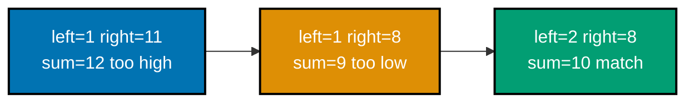

**`learning/code/ex-76-two-pointer-pair-sum/example.py`**

```python
"""Example 76: Two-Pointer Pair Sum on a Sorted Array."""


# On SORTED data, two pointers closing inward solve this in O(n) --
# no nested loop and no dict needed, unlike Example 14's unsorted version (co-20, co-14).
def pair_sum(
    sorted_values: list[int], target: int
) -> tuple[int, int]:  # => two-pointer scan
    left, right = 0, len(sorted_values) - 1  # => start at both ends of the sorted range
    while (
        left < right
    ):  # => the pointers move strictly toward each other, O(n) total steps
        current_sum = (
            sorted_values[left] + sorted_values[right]
        )  # => the pair's current sum
        if current_sum == target:  # => an exact match
            return left, right  # => found -- return immediately
        if (
            current_sum < target
        ):  # => sum too small -- the only way to grow it is a bigger left
            left += 1  # => sorted order guarantees this strictly increases current_sum
        else:  # => sum too large -- the only way to shrink it is a smaller right
            right -= 1  # => sorted order guarantees this strictly decreases current_sum
    raise ValueError("no pair sums to target")  # => not hit in this example


sorted_values = [
    1,
    2,
    4,
    6,
    8,
    11,
]  # => must already be sorted for the two pointers to work
indices = pair_sum(
    sorted_values, 10
)  # => sorted_values[1] + sorted_values[4] == 2 + 8 == 10
print(indices)  # => Output: (1, 4)

assert indices == (1, 4)  # => confirms the exact pair of indices found
assert (
    sorted_values[indices[0]] + sorted_values[indices[1]] == 10
)  # => confirms the sum itself
print("ex-76 OK")  # => Output: ex-76 OK
```

**Run**: `python3 example.py`

**Output**:

```text
(1, 4)
ex-76 OK
```

**Key takeaway**: Two pointers converging from both ends of a **sorted** array find a target-sum pair in O(n), using the sortedness to know exactly which pointer to move on every mismatch.

**Why it matters**: This reuses Example 30's two-pointer technique (co-20) in a new shape -- instead of pointers moving at different _speeds_ through a linked list, here they move toward each other from opposite _ends_ of a sorted array, but the underlying insight (two coordinated indices beat a nested loop) is the same one.

---

### Example 77: Longest Substring Without Repeating Characters

_ex-77 &middot; exercises co-20, co-09_

Finding the longest substring without repeating characters uses a variable-size sliding window and a `set`: expand the window's right edge, and whenever a repeat is found, shrink the window's left edge until the repeat is gone -- each character enters and leaves the window at most once, giving O(n) total.


**`learning/code/ex-77-sliding-window-longest-unique/example.py`**

```python
"""Example 77: Longest Substring Without Repeating Characters."""


# Grows a window while characters stay unique; shrinks from the left on a repeat --
# a set tracks the window's current contents for O(1) membership checks (co-20, co-09).
def longest_unique_substring(text: str) -> int:  # => a sliding-window function
    seen: set[str] = set()  # => the DISTINCT characters currently inside the window
    left = 0  # => the window's left edge (inclusive)
    best = 0  # => the longest window length found so far
    for right, char in enumerate(
        text
    ):  # => the window's right edge advances every step
        while char in seen:  # => shrink from the left UNTIL the duplicate is expelled
            seen.remove(text[left])  # => removes the leftmost character from the window
            left += 1  # => shrinks the window by one from the left
        seen.add(
            char
        )  # => the window is now duplicate-free again -- admit the new char
        best = max(best, right - left + 1)  # => window length is right - left + 1
    return best  # => the longest duplicate-free window seen across the whole string


length = longest_unique_substring(
    "abcabcbb"
)  # => longest unique run is "abc", length 3
print(length)  # => Output: 3

assert (
    length == 3
)  # => confirms "abc" (or any of its repeats) is the longest unique run
assert (
    longest_unique_substring("") == 0
)  # => confirms the empty-string edge case is handled
print("ex-77 OK")  # => Output: ex-77 OK
```

**Run**: `python3 example.py`

**Output**:

```text
3
ex-77 OK
```

**Key takeaway**: A variable-size sliding window, combined with a `set` tracking the window's current contents, finds the longest valid substring in O(n) -- each character is added and removed from the window at most once across the whole scan.

**Why it matters**: This generalizes Example 60's fixed-size sliding window to a window that grows and shrinks based on a condition (no repeats), while reusing Example 12's set-membership check (co-09) to detect a repeat in average-O(1) -- two earlier concepts combining into one O(n) algorithm for a problem that looks like it needs nested loops.

---

### Example 78: LRU Cache from Scratch -- Dict + Doubly Linked List

_ex-78 &middot; exercises co-08, co-07_

An LRU (least-recently-used) cache needs O(1) `get` and `put`, including O(1) eviction of whichever entry was used longest ago. A `dict` alone gives O(1) lookup but no ordering; a doubly linked list alone gives O(1) reordering but no O(1) lookup by key. Combined -- `dict` for lookup, doubly linked list for recency order -- both operations become O(1).

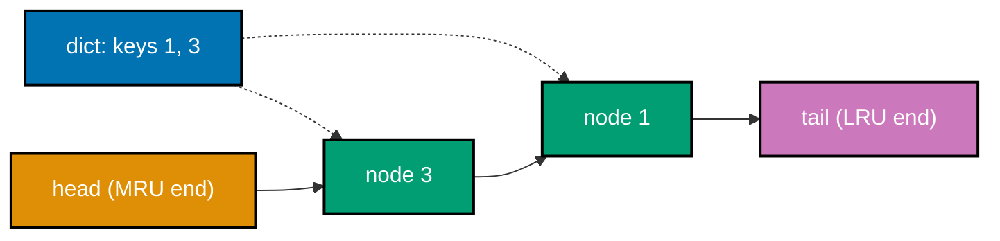

**`learning/code/ex-78-lru-cache-from-scratch/example.py`**

```python
"""Example 78: LRU Cache from Scratch -- Dict + Doubly Linked List."""

from __future__ import (
    annotations,
)  # => enables forward references to the class defined below


class DLLNode:  # => a doubly linked node: prev AND next, for O(1) removal from anywhere (co-07)
    def __init__(self, key: int, val: int) -> None:  # => constructor
        self.key = key  # => the cache key this node represents
        self.val = val  # => the cached value for that key
        self.prev: DLLNode | None = (
            None  # => no neighbor yet -- wired in by the list ops below
        )
        self.next: DLLNode | None = (
            None  # => no neighbor yet -- wired in by the list ops below
        )


class LRUCache:
    # A dict gives O(1) key lookup; a doubly linked list gives O(1) reordering --
    # together they make BOTH get and put O(1), which neither structure alone can do (co-08, co-07).
    def __init__(self, capacity: int) -> None:  # => constructor
        self.capacity = capacity  # => the maximum number of entries this cache holds
        self.cache: dict[int, DLLNode] = {}  # => key -> node, for O(1) lookup
        self.head = DLLNode(0, 0)  # => dummy head: head.next is the MOST recently used
        self.tail = DLLNode(0, 0)  # => dummy tail: tail.prev is the LEAST recently used
        self.head.next = self.tail  # => links the two sentinels together (empty list)
        self.tail.prev = self.head  # => links the two sentinels together (empty list)

    # Unlinks node from wherever it currently sits -- O(1), no scanning required.
    def _remove(self, node: DLLNode) -> None:  # => internal doubly linked list helper
        assert (
            node.prev is not None and node.next is not None
        )  # => never called on a sentinel
        node.prev.next = node.next  # => the node before it now points past it
        node.next.prev = node.prev  # => the node after it now points back past it

    # Splices node in right after the dummy head -- marks it as most-recently-used.
    def _insert_at_front(
        self, node: DLLNode
    ) -> None:  # => internal doubly linked list helper
        node.prev = self.head  # => node's prev is now the dummy head
        node.next = (
            self.head.next
        )  # => node's next is whatever WAS right after the head
        assert (
            self.head.next is not None
        )  # => the list always has at least the dummy tail
        self.head.next.prev = node  # => the old first real node now points back at node
        self.head.next = (
            node  # => the dummy head now points at node -- node is now first
        )

    def get(self, key: int) -> int:  # => O(1) lookup + O(1) reorder
        if key not in self.cache:  # => O(1) average dict miss
            return -1  # => the sentinel value for "not found"
        node = self.cache[key]  # => the node holding this key's value
        self._remove(node)  # => touching a key makes it MOST recently used
        self._insert_at_front(node)  # => O(1): move to the front without scanning
        return node.val  # => the cached value for key

    def put(self, key: int, val: int) -> None:  # => O(1) insert/update + eviction check
        if (
            key in self.cache
        ):  # => key already present -- update and refresh its position
            self._remove(self.cache[key])  # => unlink the stale entry first
        node = DLLNode(key, val)  # => a fresh node holding the new value
        self.cache[key] = node  # => registers it in the lookup dict
        self._insert_at_front(node)  # => marks it as most-recently-used
        if (
            len(self.cache) > self.capacity
        ):  # => over capacity -- evict the LEAST recently used
            lru = self.tail.prev  # => the node right before the dummy tail
            assert (
                lru is not None and lru is not self.head
            )  # => the cache is non-empty here
            self._remove(lru)  # => unlinks the least-recently-used node
            del self.cache[lru.key]  # => O(1): drop it from the lookup dict too


cache = LRUCache(2)  # => capacity 2 -- the third distinct key forces an eviction
cache.put(1, 100)  # => cache: {1: 100} -- most-recent is 1
cache.put(2, 200)  # => cache: {1: 100, 2: 200} -- most-recent is 2
cache.get(1)  # => touches 1 -- 1 becomes most-recently-used again, 2 becomes least
cache.put(3, 300)  # => over capacity -- evicts 2 (the least recently used)
evicted = cache.get(2)  # => 2 was evicted -- lookup misses
kept = cache.get(1)  # => 1 was touched recently -- survives eviction
print(evicted, kept)  # => Output: -1 100

assert evicted == -1  # => confirms the least-recently-used key was evicted
assert kept == 100  # => confirms the recently-touched key survived
print("ex-78 OK")  # => Output: ex-78 OK
```

**Run**: `python3 example.py`

**Output**:

```text
-1 100
ex-78 OK
```

**Key takeaway**: Neither a `dict` nor a doubly linked list alone can give an LRU cache O(1) get _and_ put with O(1) eviction -- combining them, dict for lookup and linked list for recency order, is what makes both operations O(1) together.

**Why it matters**: This is the topic's clearest demonstration of `abstraction-and-its-cost` in action: neither structure is individually sufficient, and the combination's extra bookkeeping (maintaining both the dict's keys and the linked list's pointers in sync on every operation) is exactly the cost paid for getting both O(1) lookup and O(1) recency tracking at once.

---

### Example 79: Prefix Trie with Dict-Based Children

_ex-79 &middot; exercises co-08, co-10_

A prefix trie stores strings character by character down a tree, where each node's children is a `dict` mapping character to child node -- the path from the root to a node spells out a prefix, and a flag marks nodes where a complete word ends. This example inserts three words sharing a common prefix and checks both word and prefix membership.

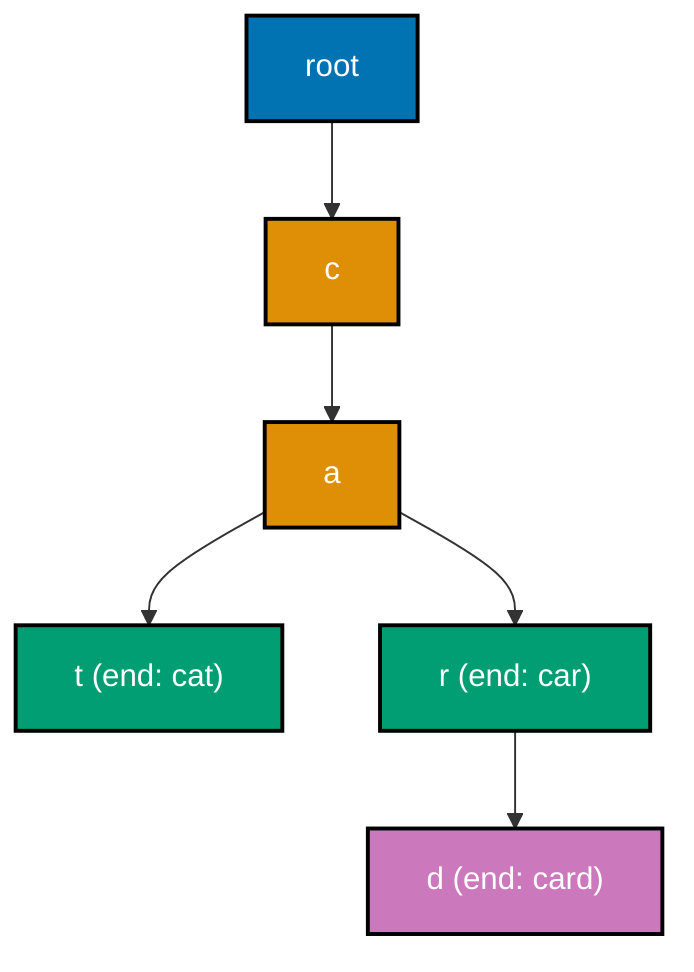

**`learning/code/ex-79-trie-insert-search/example.py`**

```python
"""Example 79: Prefix Trie with Dict-Based Children."""


class TrieNode:
    # Each node's children is a dict mapping char -> next TrieNode -- a specialized
    # tree where the PATH from the root spells out a string (co-08, co-10).
    def __init__(self) -> None:  # => constructor
        self.children: dict[
            str, "TrieNode"
        ] = {}  # => O(1) average lookup per character
        self.is_word_end = False  # => marks "a complete word ends exactly here"


class Trie:
    def __init__(self) -> None:  # => constructor
        self.root = TrieNode()  # => the empty-prefix starting point for every word

    # Walks/creates one node per character -- O(len(word)), independent of trie size.
    def insert(self, word: str) -> None:  # => builds the branch for word if missing
        node = self.root  # => starts descending from the root
        for char in word:  # => descends one level per character
            if (
                char not in node.children
            ):  # => O(1) average -- create the branch if missing
                node.children[char] = TrieNode()  # => a fresh, empty branch for char
            node = node.children[char]  # => descend into the (now-guaranteed) child
        node.is_word_end = (
            True  # => marks the END of this exact word, not just a prefix
        )

    # True only if word was inserted as a COMPLETE word, not merely a prefix of one.
    def search(self, word: str) -> bool:  # => a full-word membership check
        node = self._find_node(word)  # => walks as far as word's characters allow
        return (
            node is not None and node.is_word_end
        )  # => must reach the exact word-end flag

    # True if ANY inserted word begins with prefix -- word-end flag not required.
    def starts_with(self, prefix: str) -> bool:  # => a prefix-only membership check
        return (
            self._find_node(prefix) is not None
        )  # => reaching the node at all is enough

    def _find_node(self, text: str) -> TrieNode | None:  # => shared descent helper
        node = self.root  # => starts descending from the root
        for char in text:  # => O(len(text)) descent, following existing branches only
            if char not in node.children:  # => the path breaks here
                return None  # => text is not a prefix of anything stored
            node = node.children[char]  # => keep descending along the existing branch
        return node  # => the node reached after consuming all of text


trie = Trie()  # => an empty trie to start
for word in ("cat", "car", "card"):  # => builds a trie sharing the "ca" prefix
    trie.insert(word)  # => inserts each word one character-path at a time

found_word = trie.search("car")  # => "car" was inserted as a complete word
missing_word = trie.search(
    "ca"
)  # => "ca" is only a PREFIX, never inserted as a whole word
valid_prefix = trie.starts_with("ca")  # => "ca" IS a prefix of cat, car, and card
print(found_word)  # => Output: True
print(missing_word)  # => Output: False
print(valid_prefix)  # => Output: True

assert found_word is True  # => confirms an inserted complete word is found
assert (
    missing_word is False
)  # => confirms a prefix-only string is NOT reported as a word
assert (
    valid_prefix is True
)  # => confirms prefix matching succeeds independent of word-end
print("ex-79 OK")  # => Output: ex-79 OK
```

**Run**: `python3 example.py`

**Output**:

```text
True
False
True
ex-79 OK
```

**Key takeaway**: A trie's insert and search cost O(len(word)), independent of how many other words are stored -- and it distinguishes "this is a complete word" from "this is merely a prefix of some word" via one boolean flag per node.

**Why it matters**: This combines the binary tree's node-with-children shape (co-10) with a `dict`'s average-O(1) per-character lookup (co-08), producing a structure specialized for exactly one job -- prefix and whole-word membership on a large vocabulary -- that neither a plain tree nor a plain dict alone is optimized for. An autocomplete feature suggesting matches as a user types relies on exactly this shape -- `starts_with` answers "does anything begin with what's typed so far" in O(len(prefix)), independent of how many thousands of words the vocabulary holds.

---

### Example 80: Empirical Doubling -- Linear vs Binary Search Step Counts

_ex-80 &middot; exercises co-01, co-13, co-14_

This example measures, rather than asserts, the growth rates Big-O predicts: as the input size doubles four times over, linear search's step count doubles right along with it, while binary search's step count grows by roughly only +1 each time -- the observable signature of O(n) versus O(log n) growth.

**`learning/code/ex-80-big-o-empirical-doubling/example.py`**

```python
"""Example 80: Empirical Doubling -- Linear vs Binary Search Step Counts."""


# Counts every comparison made -- grows proportionally to len(items) (co-01, co-13).
def linear_search_steps(
    items: list[int], target: int
) -> int:  # => a step-counting scan
    steps = 0  # => tracks how many comparisons this call makes
    for value in items:  # => worst case (target absent) visits EVERY element
        steps += 1  # => one step per element visited
        if value == target:  # => stops counting early once found
            break  # => not hit when target is deliberately absent
    return steps  # => the total number of comparisons made


# Counts every comparison made -- grows proportionally to log2(len(items)) (co-01, co-14).
def binary_search_steps(
    items: list[int], target: int
) -> int:  # => a step-counting search
    steps = 0  # => tracks how many comparisons this call makes
    low, high = 0, len(items) - 1  # => the inclusive range still being searched
    while low <= high:  # => each iteration HALVES the remaining range
        steps += 1  # => one step per range-halving comparison
        mid = (low + high) // 2  # => the midpoint of the current range
        if items[mid] == target:  # => a direct hit
            break  # => not hit when target is deliberately absent
        if items[mid] < target:  # => the midpoint is too small
            low = mid + 1  # => discard the left half
        else:  # => the midpoint is too large
            high = mid - 1  # => discard the right half
    return steps  # => the total number of comparisons made


results: list[tuple[int, int, int]] = []  # => (n, linear_steps, binary_steps) per trial
for n in (1000, 2000, 4000, 8000):  # => n DOUBLES on every trial
    items = list(range(n))  # => a sorted list of n elements
    linear_steps = linear_search_steps(items, target=-1)  # => -1 forces the worst case
    binary_steps = binary_search_steps(items, target=-1)  # => -1 forces the worst case
    results.append(
        (n, linear_steps, binary_steps)
    )  # => records this trial for the asserts below
    print(f"n={n}: linear={linear_steps}, binary={binary_steps}")
    # => Output (n=1000): n=1000: linear=1000, binary=9
    # => Output (n=2000): n=2000: linear=2000, binary=10
    # => Output (n=4000): n=4000: linear=4000, binary=11
    # => Output (n=8000): n=8000: linear=8000, binary=12

# linear steps double right alongside n; binary steps grow by roughly +1 each doubling.
assert (
    results[1][1] == 2 * results[0][1]
)  # => confirms linear steps EXACTLY double with n
assert (
    results[1][2] - results[0][2] <= 2
)  # => confirms binary steps grow by only ~1 per doubling
print("ex-80 OK")  # => Output: ex-80 OK
```

**Run**: `python3 example.py`

**Output**:

```text
n=1000: linear=1000, binary=9
n=2000: linear=2000, binary=10
n=4000: linear=4000, binary=11
n=8000: linear=8000, binary=12
ex-80 OK
```

**Key takeaway**: Doubling the input size doubles linear search's step count exactly, but only adds roughly one extra step to binary search -- the empirical signature that distinguishes O(n) from O(log n) growth in practice, not just in theory.

**Why it matters**: This is Example 24's dict-vs-list measurement technique applied to search algorithms instead of lookup structures, at a larger scale -- turning this topic's opening Big-O claims (co-01) and this specific search comparison (co-13 vs. co-14) into one final, directly observable confirmation before the Advanced tier's last two examples. The empirical doubling pattern measured here -- step counts roughly doubling for linear search but growing by only one for binary search each time n doubles -- is the same signature a profiler would show on real production data at scale.

---

### Example 81: Stable Multi-Key Sort with a Tuple Key

_ex-81 &middot; exercises co-15_

Sorting records by a tuple key (`key=lambda r: (primary, secondary)`) sorts primarily by the first field, breaking ties with the second -- and Timsort's stability (co-15) is what guarantees elements that tie on **both** fields keep their original relative order. This example sorts records by score descending, then name ascending on ties.

**`learning/code/ex-81-stable-multi-key-sort/example.py`**

```python
"""Example 81: Stable Multi-Key Sort with a Tuple Key."""

# key=lambda returning a TUPLE sorts by the first field, breaking ties with the
# second -- Timsort's STABILITY means equal-key elements keep their relative
# input order, which is what makes this technique reliable (co-15).
records: list[tuple[str, int]] = [
    ("bob", 85),  # => a mid score
    ("alice", 90),  # => a top score
    ("carol", 85),  # => ties bob's score
    ("dave", 90),  # => ties alice's score
]  # => (name, score) pairs -- several scores tie

by_score_then_name = sorted(records, key=lambda r: (-r[1], r[0]))
# => -r[1] sorts score DESCENDING (highest first); r[0] breaks ties alphabetically
print(
    by_score_then_name
)  # => Output: [('alice', 90), ('dave', 90), ('bob', 85), ('carol', 85)]

assert by_score_then_name == [
    ("alice", 90),  # => highest score, alphabetically first among the 90s
    ("dave", 90),  # => ties alice's 90 -- kept AFTER alice by the name tiebreak
    ("bob", 85),  # => next score tier, alphabetically first among the 85s
    ("carol", 85),  # => ties bob's 85 -- kept AFTER bob by the name tiebreak
]  # => confirms primary key (score desc) then secondary key (name asc) both hold
print("ex-81 OK")  # => Output: ex-81 OK
```

**Run**: `python3 example.py`

**Output**:

```text
[('alice', 90), ('dave', 90), ('bob', 85), ('carol', 85)]
ex-81 OK
```

**Key takeaway**: A tuple key sorts by multiple fields in one call, with the earlier tuple positions taking priority over later ones -- and Timsort's stability is what makes the tie-breaking behavior predictable rather than incidental.

**Why it matters**: This is the natural extension of Example 20's single-field tuple sort to multiple criteria at once, and it is exactly the technique real-world sorting needs almost always require -- "sort by score, then alphabetically on ties" is a far more common real need than sorting by a single field in isolation.

---

### Example 82: Convert Deep Recursion to Iteration to Avoid RecursionError

_ex-82 &middot; exercises co-18, co-17_

This final example pushes co-18's central claim to its limit: a recursive sum function genuinely fails with a real `RecursionError` (a `RuntimeError` subclass) once the input exceeds Python's default recursion depth, while the identical computation, written iteratively, succeeds on the exact same large input with no stack-depth ceiling at all.

**`learning/code/ex-82-deep-recursion-to-iteration/example.py`**

```python
"""Example 82: Convert Deep Recursion to Iteration to Avoid RecursionError."""

import sys  # => used to read the current recursion-depth ceiling


# Recurses n deep -- one call-stack frame per level (co-17).
def sum_to_n_recursive(n: int) -> int:  # => a plain recursive function
    if n == 0:  # => BASE CASE
        return 0  # => the additive identity, so the recursion can bottom out
    return n + sum_to_n_recursive(
        n - 1
    )  # => RECURSIVE CASE -- consumes a stack frame each call


# Same result, but a plain loop uses O(1) call-stack frames regardless of n (co-18).
def sum_to_n_iterative(n: int) -> int:  # => a plain iterative function
    total = 0  # => all state lives in local variables, not in nested call frames
    for i in range(n + 1):  # => a single frame handles EVERY value of i
        total += i  # => accumulates the running sum
    return total  # => the final sum from 0 through n


small_recursive = sum_to_n_recursive(100)  # => well within the default recursion limit
small_iterative = sum_to_n_iterative(100)  # => same answer, no recursion at all
print(small_recursive, small_iterative)  # => Output: 5050 5050
assert small_recursive == small_iterative == 5050  # => confirms both approaches agree

limit = sys.getrecursionlimit()  # => CPython's default call-stack depth ceiling
try:
    sum_to_n_recursive(
        limit + 1000
    )  # => deliberately exceeds the limit -- should raise
    raised = False  # => not reached -- the call above is expected to raise first
except RecursionError:  # => RecursionError is a RuntimeError subclass (co-18)
    raised = True  # => confirms the deep recursive version genuinely fails at depth

large_iterative = sum_to_n_iterative(
    limit + 1000
)  # => the SAME large n, iteratively -- succeeds
print(raised)  # => Output: True
print(large_iterative > 0)  # => Output: True

assert raised is True  # => confirms recursion alone cannot handle this depth
assert (
    large_iterative == (limit + 1000) * (limit + 1001) // 2
)  # => Gauss's sum formula, cross-check
print("ex-82 OK")  # => Output: ex-82 OK
```

**Run**: `python3 example.py`

**Output**:

```text
5050 5050
True
True
ex-82 OK
```

**Key takeaway**: Recursion has a hard depth ceiling (`sys.getrecursionlimit()`) that no amount of correct logic can exceed; the identical computation written as a loop has no such ceiling, because it uses O(1) call-stack frames regardless of input size.

**Why it matters**: This is the concrete, unavoidable proof behind every "prefer iteration for deep or unbounded input" recommendation in this topic -- Example 23 showed iteration and recursion producing identical _output_; this example shows the point where recursion stops being a _viable_ option at all, closing out this topic's arc from "here is what recursion is" (Example 21) to "here is exactly where it breaks, and what replaces it."

---

← Previous: [Intermediate Examples](./intermediate.md) · Next: [Capstone](./capstone/overview.md) →
