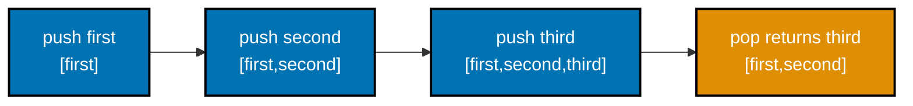
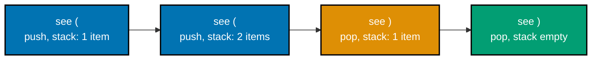
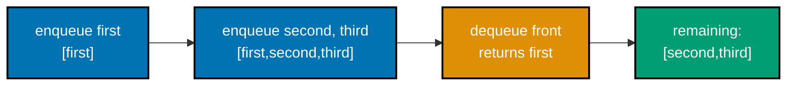
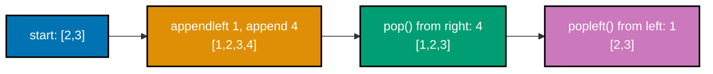
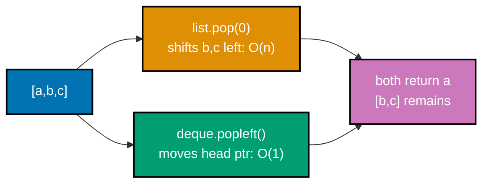
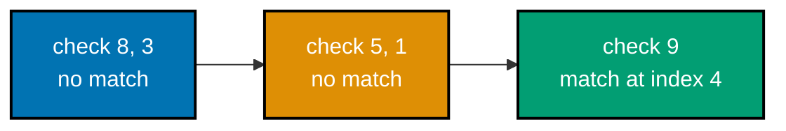
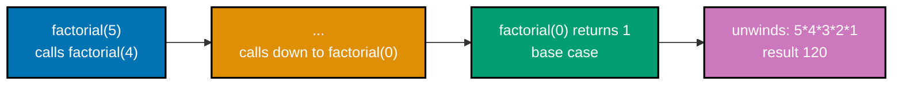
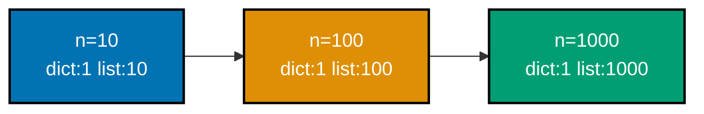
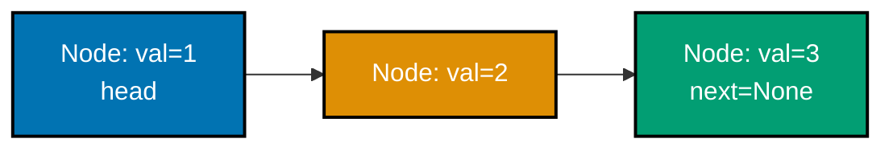

Examples 1-28 cover the array-backed `list` and its cost model, using a `list` as a stack, `collections.deque` as a queue and double-ended queue, `dict` and `set` for average-O(1) lookup and membership, linear search, the built-in `sorted()`, first recursion, first Big-O measurement, first static type hints, and the first node-based structure: a singly linked list. Every example is a complete, self-contained `.py` file colocated under `learning/code/`; run each one with `python3 example.py` from inside its own directory.

---

### Example 1: List Append and Index

_ex-01 &middot; exercises co-03, co-02_

A Python `list` is a growable array: `.append()` adds to the end in amortized O(1) (co-02), and indexing with `lst[i]` is O(1) because the backing storage is one contiguous block. This example builds a list of integers from nothing and checks both operations.

**`learning/code/ex-01-list-append-index/example.py`**

```python
"""Example 1: List Append and Index."""

# A dynamic array literal -- Python's list grows/shrinks in place (co-03).
numbers: list[int] = [10, 20, 30]  # => numbers is [10, 20, 30], length 3
numbers.append(40)  # => grows the array by one -- amortized O(1) (co-02)
# => no full copy happens on THIS call; CPython over-allocates spare
# => capacity so most appends just write into already-reserved space
print(len(numbers))  # => Output: 4
print(numbers[0])  # => index 0 is O(1): direct offset math -- Output: 10
print(numbers[-1])  # => negative index counts from the end -- Output: 40

assert len(numbers) == 4  # => confirms the append grew the list by one
assert numbers[0] == 10  # => confirms the first element is unchanged
assert numbers[-1] == 40  # => confirms the appended value is now last
print("ex-01 OK")  # => Output: ex-01 OK
```

**Run**: `python3 example.py`

**Output**:

```text
4
10
40
ex-01 OK
```

**Key takeaway**: `.append()` grows a list at its end in amortized O(1); `lst[i]` reads any element in O(1) because the list is a contiguous array, not a chain of nodes.

**Why it matters**: This is the cost model every later list-based example in this topic assumes without re-deriving it. Appending to the end and indexing by position are the two operations Python lists are optimized for -- everything from a stack (Example 5) to a hash map's bucket chains underneath the hood ultimately rests on a contiguous, indexable array being fast to grow and read.

---

### Example 2: List Slicing

_ex-02 &middot; exercises co-03_

Slicing (`lst[start:stop]`) extracts a new list covering a half-open range of indices, without mutating the original. This example slices the middle and the tail of a five-element list and confirms the original list is untouched.

**`learning/code/ex-02-list-slicing/example.py`**

```python
"""Example 2: List Slicing."""

# lst[start:stop] returns a NEW list -- Python's list stores contiguously (co-03).
letters: list[str] = ["a", "b", "c", "d", "e"]  # => letters has 5 elements, index 0..4
middle = letters[1:4]  # => copies index 1 up to (not including) 4
# => middle is ["b", "c", "d"] -- a fresh list, not a view into letters
tail = letters[3:]  # => omitting stop means "through the end"
print(middle)  # => Output: ['b', 'c', 'd']
print(tail)  # => Output: ['d', 'e']

assert middle == ["b", "c", "d"]  # => confirms the sub-list matches the expected slice
assert tail == ["d", "e"]  # => confirms the open-ended slice reached the last element
assert letters == [
    "a",
    "b",
    "c",
    "d",
    "e",
]  # => confirms slicing never mutates the source
print("ex-02 OK")  # => Output: ex-02 OK
```

**Run**: `python3 example.py`

**Output**:

```text
['b', 'c', 'd']
['d', 'e']
ex-02 OK
```

**Key takeaway**: `lst[start:stop]` returns a **new** list covering indices `start` through `stop - 1`; the source list is never modified.

**Why it matters**: Slicing is how Python expresses "give me this sub-range" without a manual loop, and it appears constantly in this topic -- from splitting a range in half for binary search (Example 31) to windowing a sequence for a sliding-window scan (Example 60). Knowing it always copies, never mutates, avoids a whole class of "why did my original list change" bugs.

---

### Example 3: List Reverse In Place

_ex-03 &middot; exercises co-03_

`.reverse()` reverses a list's elements **in place** -- no new list is allocated, and the method returns `None`, not the reversed list. This example reverses a list and confirms the same list object now holds the reversed order.

**`learning/code/ex-03-list-reverse-inplace/example.py`**

```python
"""Example 3: List Reverse In Place."""

# .reverse() mutates the SAME list object -- no new list is allocated (co-03).
order: list[int] = [1, 2, 3, 4]  # => order is [1, 2, 3, 4]
same_object = order  # => same_object is another name for the SAME list, not a copy
order.reverse()  # => reverses the elements of order in place, O(n)
print(order)  # => Output: [4, 3, 2, 1]
print(same_object)  # => same_object sees the mutation too -- Output: [4, 3, 2, 1]

assert order == [4, 3, 2, 1]  # => confirms the reversed order matches expected
assert same_object is order  # => confirms .reverse() did NOT create a new list object
print("ex-03 OK")  # => Output: ex-03 OK
```

**Run**: `python3 example.py`

**Output**:

```text
[4, 3, 2, 1]
[4, 3, 2, 1]
ex-03 OK
```

**Key takeaway**: `.reverse()` mutates the original list in place and returns `None` -- you never write `lst = lst.reverse()`.

**Why it matters**: In-place mutation is cheaper (no new allocation) but riskier: if another part of a program still holds a reference to the same list, that code sees the reversed order too. Contrasting this directly against Example 4's slice-based reversal (which copies) makes that tradeoff concrete instead of abstract. On a million-element list, `.reverse()` touches the same block in place, while copying first would briefly need double that memory -- a real cost in memory-constrained services, not just an academic distinction.

---

### Example 4: List Reverse via Slice

_ex-04 &middot; exercises co-03_

`lst[::-1]` is the slice-based way to reverse a list: it returns a **new** list in reverse order and leaves the original untouched. This example reverses the same style of list as Example 3, but this time keeps the original list intact.

**`learning/code/ex-04-list-reverse-slice/example.py`**

```python
"""Example 4: List Reverse via Slice."""

# lst[::-1] walks the list with step -1, building a brand-new reversed list (co-03).
original: list[int] = [1, 2, 3, 4]  # => original is [1, 2, 3, 4]
reversed_copy = original[::-1]  # => a NEW list, built by copying every element backward
print(reversed_copy)  # => Output: [4, 3, 2, 1]
print(original)  # => the source list is untouched -- Output: [1, 2, 3, 4]

assert reversed_copy == [4, 3, 2, 1]  # => confirms the new list is in reversed order
assert original == [1, 2, 3, 4]  # => confirms the original list was never mutated
assert reversed_copy is not original  # => confirms two distinct list objects exist
print("ex-04 OK")  # => Output: ex-04 OK
```

**Run**: `python3 example.py`

**Output**:

```text
[4, 3, 2, 1]
[1, 2, 3, 4]
ex-04 OK
```

**Key takeaway**: `lst[::-1]` returns a reversed **copy**; the original list's order and identity are both preserved.

**Why it matters**: This is the direct counterpart to Example 3's `.reverse()`: same visible result, opposite mutation behavior. Choosing between them is a real decision every time reversal comes up -- `.reverse()` when you own the list and want to save the allocation, `[::-1]` when something else still needs the original order intact.

---

### Example 5: Stack with Push and Pop

_ex-05 &middot; exercises co-04_

A stack is last-in-first-out (LIFO): the most recently pushed element is the first one popped. Python needs no dedicated stack type -- `list.append()` pushes and `list.pop()` (no argument) pops, both operating on the list's end in O(1).



**`learning/code/ex-05-stack-push-pop/example.py`**

```python
"""Example 5: Stack with Push and Pop."""

# A list used as a stack: append() pushes, pop() pops -- both O(1) at the end (co-04).
stack: list[str] = []  # => stack starts empty
stack.append("first")  # => pushes "first" -- stack is ["first"]
stack.append("second")  # => pushes "second" -- stack is ["first", "second"]
stack.append("third")  # => pushes "third" -- stack is ["first", "second", "third"]

top = stack.pop()  # => pops the LAST pushed item -- Last-In-First-Out (LIFO)
# => top is "third"; stack shrinks back to ["first", "second"]
print(top)  # => Output: third
print(stack)  # => Output: ['first', 'second']

assert top == "third"  # => confirms the most recently pushed item popped first
assert stack == ["first", "second"]  # => confirms the remaining order is unchanged
assert stack.pop() == "second"  # => confirms the next pop follows LIFO order too
print("ex-05 OK")  # => Output: ex-05 OK
```

**Run**: `python3 example.py`

**Output**:

```text
third
['first', 'second']
ex-05 OK
```

**Key takeaway**: `list.append()` and `list.pop()` together give you a stack with O(1) push and pop, using nothing but a plain list.

**Why it matters**: LIFO order recurs throughout this topic -- balanced-parentheses checking (Example 6), iterative tree traversal (Example 68), and the implicit call stack behind every recursive function (co-17) are all instances of the same LIFO discipline this example makes explicit and visible for the first time. In production code, forgetting this discipline shows up as a `RecursionError` or a stack overflow once nesting runs thousands of frames deep -- the same LIFO bookkeeping this example makes visible by hand.

---

### Example 6: Balanced Parentheses via Stack

_ex-06 &middot; exercises co-04_

Checking whether brackets are balanced is a classic stack application: push every opening bracket, and pop (matching it) every time a closing bracket appears. If the stack empties out exactly when the string ends, the brackets balance.



**`learning/code/ex-06-balanced-parentheses/example.py`**

```python
"""Example 6: Balanced Parentheses via Stack."""


# Returns True if every '(' in text has a matching ')' (co-04).
def is_balanced(text: str) -> bool:  # => a plain function, no class needed
    stack: list[str] = []  # => tracks open parens waiting for a close
    for char in text:  # => scans the string left to right, once, O(n)
        if char == "(":  # => an opener -- remember it for later
            stack.append(char)  # => push: remember this open paren
        elif char == ")":  # => a closer -- must match SOME earlier opener
            if not stack:  # => a close with nothing open means unbalanced
                return False  # => bail out early -- no matching '(' exists
            stack.pop()  # => pop: this close matches the most recent open
    return not stack  # => balanced only if every open was eventually closed


balanced = is_balanced("(())")  # => "(())": open,open,close,close -- stack empties
unbalanced = is_balanced("(()")  # => "(()": one open never gets a matching close
print(balanced)  # => Output: True
print(unbalanced)  # => Output: False

assert is_balanced("(())") is True  # => confirms nested, fully-closed parens balance
assert is_balanced("(()") is False  # => confirms a dangling open paren is detected
assert is_balanced("") is True  # => confirms the empty string is trivially balanced
print("ex-06 OK")  # => Output: ex-06 OK
```

**Run**: `python3 example.py`

**Output**:

```text
True
False
ex-06 OK
```

**Key takeaway**: A stack turns "are these brackets balanced" into a single linear pass: push opens, pop on closes, and check the stack is empty at the end.

**Why it matters**: This is the first example where a data structure choice directly _shapes_ an algorithm, rather than just storing data passively -- the LIFO order from Example 5 is exactly what guarantees the most recently opened bracket is checked against the next closing one, which is precisely the nesting rule balanced brackets require.

---

### Example 7: Queue with collections.deque

_ex-07 &middot; exercises co-05, co-06_

A queue is first-in-first-out (FIFO): the first element enqueued is the first one dequeued. `collections.deque` provides O(1) `append()` (enqueue at the back) and `popleft()` (dequeue from the front) -- unlike a plain list, whose front removal is O(n).



**`learning/code/ex-07-queue-with-deque/example.py`**

```python
"""Example 7: Queue with collections.deque."""

# deque supports O(1) operations at BOTH ends -- ideal for a FIFO queue (co-05, co-06).
from collections import deque

queue: deque[str] = deque()  # => queue starts empty
queue.append("first")  # => enqueue at the right end -- queue is ["first"]
queue.append("second")  # => enqueue at the right end -- queue is ["first", "second"]
queue.append("third")  # => enqueue -- queue is ["first", "second", "third"]

served = queue.popleft()  # => dequeue from the LEFT end -- First-In-First-Out (FIFO)
# => served is "first"; queue becomes deque(["second", "third"]), both O(1)
print(served)  # => Output: first
print(list(queue))  # => Output: ['second', 'third']

assert served == "first"  # => confirms the earliest-enqueued item served first
assert list(queue) == ["second", "third"]  # => confirms FIFO order for the rest
print("ex-07 OK")  # => Output: ex-07 OK
```

**Run**: `python3 example.py`

**Output**:

```text
first
['second', 'third']
ex-07 OK
```

**Key takeaway**: `deque.append()` plus `deque.popleft()` gives O(1) FIFO enqueue/dequeue, in contrast to a stack's O(1) LIFO push/pop from Example 5.

**Why it matters**: FIFO order is the discipline breadth-first search depends on (co-21, Examples 57 and 59) -- a queue is what guarantees nodes are explored in the order they were first discovered, which is exactly what makes BFS explore a graph level by level instead of diving deep down one branch first.

---

### Example 8: Deque Operations at Both Ends

_ex-08 &middot; exercises co-06_

`collections.deque` supports O(1) push and pop at **both** ends: `append`/`appendleft` and `pop`/`popleft`. This example exercises all four operations on one deque and traces the resulting order step by step.



**`learning/code/ex-08-deque-both-ends/example.py`**

```python
"""Example 8: Deque Operations at Both Ends."""

# A deque is a double-ended queue: push/pop at EITHER end, all O(1) (co-06).
from collections import deque  # => imports the stdlib double-ended queue type

items: deque[int] = deque([2, 3])  # => items starts as deque([2, 3])
items.appendleft(1)  # => pushes 1 onto the LEFT end -- items is [1, 2, 3]
items.append(4)  # => pushes 4 onto the RIGHT end -- items is [1, 2, 3, 4]
print(list(items))  # => Output: [1, 2, 3, 4]

right = items.pop()  # => pops from the RIGHT end -- right is 4, items is [1, 2, 3]
left = items.popleft()  # => pops from the LEFT end -- left is 1, items is [2, 3]
print(right, left)  # => Output: 4 1
print(list(items))  # => Output: [2, 3]

assert right == 4  # => confirms pop() removed the rightmost element
assert left == 1  # => confirms popleft() removed the leftmost element
assert list(items) == [2, 3]  # => confirms the middle elements survive both pops
print("ex-08 OK")  # => Output: ex-08 OK
```

**Run**: `python3 example.py`

**Output**:

```text
[1, 2, 3, 4]
4 1
[2, 3]
ex-08 OK
```

**Key takeaway**: A deque is the generalization of both a stack (use one end) and a queue (use both ends), with O(1) operations at either boundary.

**Why it matters**: Several later examples need O(1) access at both ends of a sequence rather than just one -- level-order tree traversal (Example 51) uses a deque as its BFS frontier. Understanding all four deque operations here, on a small and fully traced example, makes that later usage immediately legible. Reaching for a plain `list` instead for either end operation reintroduces an O(n) shift cost the instant a program scales past a handful of elements, which is exactly the tradeoff Example 9 measures directly next.

---

### Example 9: list.pop(0) vs deque.popleft -- Same Result, Different Cost

_ex-09 &middot; exercises co-05, co-01_

`list.pop(0)` and `deque.popleft()` produce the identical result -- removing and returning the front element -- but at very different costs: `list.pop(0)` is O(n) because every remaining element must shift left by one slot, while `deque.popleft()` is O(1).



**`learning/code/ex-09-list-front-pop-is-slow/example.py`**

```python
"""Example 9: list.pop(0) vs deque.popleft -- Same Result, Different Cost."""

# Both dequeue "the first item," but list.pop(0) is O(n) -- it must shift every
# remaining element left by one -- while deque.popleft is O(1) (co-05, co-01).
from collections import deque

as_list: list[str] = ["a", "b", "c"]
as_deque: deque[str] = deque(["a", "b", "c"])

list_result = as_list.pop(0)  # => O(n): shifts "b" and "c" left one slot each
# => as_list is now ["b", "c"] -- correct, but does O(n) work for ONE dequeue
deque_result = as_deque.popleft()  # => O(1): just moves an internal head pointer
# => as_deque is now deque(["b", "c"]) -- same logical result, O(1) work
print(list_result, deque_result)  # => Output: a a
print(as_list, list(as_deque))  # => Output: ['b', 'c'] ['b', 'c']

assert list_result == deque_result == "a"  # => confirms identical dequeued values
assert as_list == list(as_deque) == ["b", "c"]  # => confirms identical final order
print("ex-09 OK")  # => Output: ex-09 OK
```

**Run**: `python3 example.py`

**Output**:

```text
a a
['b', 'c'] ['b', 'c']
ex-09 OK
```

**Key takeaway**: Same output, different cost: never use `list.pop(0)` in a loop over a large sequence -- reach for `deque.popleft()` instead.

**Why it matters**: This is the clearest demonstration in the whole topic that two pieces of code can look equally correct while having wildly different performance characteristics -- the kind of bug that only shows up as your input grows, exactly the motivation Big-O notation (co-01) exists to name and reason about _before_ it becomes a production incident.

---

### Example 10: Dict Lookup with .get

_ex-10 &middot; exercises co-08_

`dict.get(key, default)` looks up a key without raising `KeyError` on a miss -- it returns the value if the key is present, or the supplied default (or `None`) otherwise. This example looks up a present key, an absent key with no default, and an absent key with an explicit default.

**`learning/code/ex-10-dict-lookup/example.py`**

```python
"""Example 10: Dict Lookup with .get."""

# dict gives average-O(1) keyed lookup via hashing -- no scan required (co-08).
ages: dict[str, int] = {"alice": 30, "bob": 25}  # => a hash map literal

present = ages.get("alice")  # => hashes "alice" straight to its bucket -- O(1) average
absent = ages.get("carol")  # => key not found -- .get() returns None instead of raising
default = ages.get("carol", 0)  # => a second argument supplies a fallback value
print(present)  # => Output: 30
print(absent)  # => Output: None
print(default)  # => Output: 0

assert present == 30  # => confirms the present key resolves to its stored value
assert absent is None  # => confirms .get() with no default returns None, not KeyError
assert default == 0  # => confirms the explicit default is used when the key is missing
print("ex-10 OK")  # => Output: ex-10 OK
```

**Run**: `python3 example.py`

**Output**:

```text
30
None
0
ex-10 OK
```

**Key takeaway**: `.get(key)` returns `None` on a miss instead of raising; `.get(key, default)` lets you choose exactly what a miss returns.

**Why it matters**: `.get` is the safe, idiomatic way to probe a dict without wrapping every lookup in a `try`/`except KeyError`. It is the exact building block later examples (frequency counting in Example 11, two-sum in Example 14) lean on to check "have I seen this key before" in a single, average-O(1) expression.

---

### Example 11: Count Character Frequencies with a Dict

_ex-11 &middot; exercises co-08_

Counting how often each character appears in a string is a canonical `dict` use case: for each character, look up its running count (defaulting to 0 if unseen) and increment it by one, building the frequency map in a single O(n) pass.

**`learning/code/ex-11-dict-count-frequencies/example.py`**

```python
"""Example 11: Count Character Frequencies with a Dict."""


# Builds a char -> count frequency map with one O(n) pass (co-08).
def count_chars(text: str) -> dict[str, int]:  # => a plain function, no class needed
    counts: dict[str, int] = {}  # => starts empty
    for char in text:  # => visits each character once, O(n) total
        counts[char] = counts.get(char, 0) + 1  # => .get(char, 0) avoids a KeyError
        # => on a new char this inserts 1; on a repeat it increments the existing count
    return counts  # => the finished char -> count map


frequencies = count_chars("banana")  # => tallies b, a, n, a, n, a
print(frequencies)  # => Output: {'b': 1, 'a': 3, 'n': 2}

assert frequencies == {"b": 1, "a": 3, "n": 2}  # => confirms every count matches
assert sum(frequencies.values()) == len("banana")  # => confirms counts sum to length
print("ex-11 OK")  # => Output: ex-11 OK
```

**Run**: `python3 example.py`

**Output**:

```text
{'b': 1, 'a': 3, 'n': 2}
ex-11 OK
```

**Key takeaway**: A `dict[str, int]` built with `.get(key, 0) + 1` turns raw data into a frequency count in one linear pass, no sorting or nested loops required.

**Why it matters**: Frequency counting is one of the most common real-world uses of a hash map -- word counts, character histograms, and tallying occurrences of anything all reduce to exactly this pattern. It is also this topic's first example where a `dict`'s average-O(1) update (co-08) turns what would otherwise be an O(n²) counting approach (scan the whole list once per unique item) into O(n).

---

### Example 12: Set Membership Testing

_ex-12 &middot; exercises co-09_

`in` on a `set` tests membership in average-O(1), using the same hashing mechanism a `dict` uses for its keys. This example builds a small `set[int]` and tests both a present and an absent value.

**`learning/code/ex-12-set-membership/example.py`**

```python
"""Example 12: Set Membership Testing."""

# set gives average-O(1) "is this in here?" via the same hashing as dict (co-09).
vip_ids: set[int] = {101, 202, 303}  # => a hash set literal, unordered

is_vip = 202 in vip_ids  # => hashes 202 and checks its bucket -- O(1) average
is_not_vip = 404 in vip_ids  # => hashes 404 -- bucket empty, no scan needed
print(is_vip)  # => Output: True
print(is_not_vip)  # => Output: False

assert is_vip is True  # => confirms a present element reports True
assert is_not_vip is False  # => confirms an absent element reports False
assert 101 in vip_ids and 303 in vip_ids  # => confirms both other members are present
print("ex-12 OK")  # => Output: ex-12 OK
```

**Run**: `python3 example.py`

**Output**:

```text
True
False
ex-12 OK
```

**Key takeaway**: `value in some_set` is an average-O(1) membership test -- structurally identical to a `dict` key lookup, just without an associated value.

**Why it matters**: "Have I seen this value before?" is a question this topic's graph traversals (Examples 57-58) and sliding-window techniques (Example 77) both ask constantly -- a `set` answers it in average-O(1), which is exactly what keeps those algorithms from degrading into an O(n) linear scan on every single check. On a 10,000-element collection, that difference is the gap between one hash computation and up to 10,000 comparisons per check -- a cost that compounds every single time the containment question gets asked again.

---

### Example 13: Deduplicate a List with a Set

_ex-13 &middot; exercises co-09_

Passing a `list` to `set()` collapses it down to only its unique elements, since a set cannot hold duplicates by definition. This example deduplicates a list containing repeated integers and checks the resulting count of unique values.

**`learning/code/ex-13-set-dedup/example.py`**

```python
"""Example 13: Deduplicate a List with a Set."""

# set() collapses duplicates because a set can only hold each hash-equal
# value once -- turning "remove duplicates" into a single constructor call (co-09).
raw: list[int] = [1, 2, 2, 3, 1, 4, 3]  # => raw has 7 elements, 4 of them unique
unique_values = set(raw)  # => builds a set, silently dropping every repeat
unique_count = len(unique_values)  # => the set's size is exactly the unique count
print(unique_values)  # => Output: {1, 2, 3, 4} (set order is not guaranteed)
print(unique_count)  # => Output: 4

assert unique_count == 4  # => confirms exactly 4 distinct values existed in raw
assert unique_values == {1, 2, 3, 4}  # => confirms the exact set of unique values
print("ex-13 OK")  # => Output: ex-13 OK
```

**Run**: `python3 example.py`

**Output**:

```text
{1, 2, 3, 4}
4
ex-13 OK
```

**Key takeaway**: `set(some_list)` is the one-line idiom for "give me only the unique elements," with duplicate detection happening in average-O(1) per element instead of an O(n) nested scan.

**Why it matters**: Deduplication via a set is dramatically cheaper than the naive approach of checking each new element against every element already kept (which would be O(n²) overall) -- it collapses that whole comparison into average-O(n) total, one hash-based membership check per element. On a 10,000-element list with many repeats, the O(n²) naive check could mean up to 100 million comparisons, while `set()`-based dedup finishes in roughly 10,000 hash operations -- a difference that turns a noticeable pause into an instant result.

---

### Example 14: Two Sum, Solved with a Dict

_ex-14 &middot; exercises co-08_

The classic "two sum" problem asks for two indices whose values add up to a target. The naive approach checks every pair (O(n²)); this example instead uses a `dict` to remember "what value would complete this one" as it scans once, solving it in a single O(n) pass.

**`learning/code/ex-14-two-sum-with-dict/example.py`**

```python
"""Example 14: Two Sum, Solved with a Dict."""


# Returns indices (i, j) where nums[i] + nums[j] == target, in one O(n) pass (co-08).
def two_sum(nums: list[int], target: int) -> tuple[int, int]:  # => a plain function
    seen: dict[int, int] = {}  # => maps "value already seen" -> "its index"
    for index, value in enumerate(nums):  # => walks nums once, tracking position
        complement = target - value  # => the value that would complete the pair
        if complement in seen:  # => O(1) average check -- no nested loop needed
            return seen[complement], index  # => found: earlier index, current index
        seen[value] = index  # => remember this value's index for a LATER complement
    raise ValueError("no two sum solution")  # => every input in this example has one


indices = two_sum([2, 7, 11, 15], 9)  # => 2 (index 0) + 7 (index 1) == 9
print(indices)  # => Output: (0, 1)

assert indices == (0, 1)  # => confirms the two indices sum to the target value
assert two_sum([3, 2, 4], 6) == (1, 2)  # => confirms a second fixture also resolves
print("ex-14 OK")  # => Output: ex-14 OK
```

**Run**: `python3 example.py`

**Output**:

```text
(0, 1)
ex-14 OK
```

**Key takeaway**: A `dict` that remembers "value seen so far -> its index" turns two-sum from an O(n²) nested-loop problem into a single O(n) pass.

**Why it matters**: This is the first example where a hash map's average-O(1) lookup (co-08) directly collapses an algorithm's complexity class, not just its constant factor -- O(n²) to O(n) is the difference between a million and a trillion operations on a million-element input, and recognizing this "remember what I need next" pattern is one of the most transferable skills in this whole topic.

---

### Example 15: Linear Search -- Value Found

_ex-15 &middot; exercises co-13_

Linear search scans a sequence one element at a time until it finds a match, in O(n). This example searches for a value that **is** present in the list and confirms the returned index is correct.



**`learning/code/ex-15-linear-search-found/example.py`**

```python
"""Example 15: Linear Search -- Value Found."""


# Scans items left to right until target is found -- O(n) worst case (co-13).
def linear_search(items: list[int], target: int) -> int:  # => a plain function
    for index, value in enumerate(items):  # => checks each element in order
        if value == target:  # => a match: no shortcuts possible on unsorted data
            return index  # => returns immediately -- best case can be O(1)
    return -1  # => reached only if every element was checked and none matched


numbers = [8, 3, 5, 1, 9, 2]  # => an UNSORTED list -- linear scan is the only option
found_index = linear_search(numbers, 9)  # => 9 sits at index 4
print(found_index)  # => Output: 4

assert found_index == 4  # => confirms the returned index matches numbers[4]
assert numbers[found_index] == 9  # => confirms indexing back in recovers the target
print("ex-15 OK")  # => Output: ex-15 OK
```

**Run**: `python3 example.py`

**Output**:

```text
4
ex-15 OK
```

**Key takeaway**: Linear search finds a present value in O(n) worst case, checking each element in order until a match is found.

**Why it matters**: Linear search is the baseline every "smarter" search technique in this topic is measured against -- binary search (co-14, Example 31) and hash-map lookup (co-08) both exist specifically because linear search's O(n) cost becomes painful as data grows, and neither improvement means anything without this baseline to compare against. On a million-element list, that baseline costs up to a million comparisons in the worst case -- the exact number binary search's O(log n) (roughly 20 comparisons) and hash lookup's O(1) both exist to beat.

---

### Example 16: Linear Search -- Value Not Found

_ex-16 &middot; exercises co-13_

The mirror case of Example 15: linear search over a list that does **not** contain the target value. The scan still has to walk the entire list before it can conclude the value is absent, which is the worst case for linear search's O(n) cost.

**`learning/code/ex-16-linear-search-not-found/example.py`**

```python
"""Example 16: Linear Search -- Value Not Found."""


# Scans items left to right; -1 signals "never found" (co-13).
def linear_search(items: list[int], target: int) -> int:  # => same shape as Example 15
    for index, value in enumerate(items):  # => must check EVERY element on a miss
        if value == target:  # => not true for any element in this fixture
            return index  # => not reached in this example -- target is absent
    return -1  # => the whole list was scanned with no match -- worst case O(n)


numbers = [8, 3, 5, 1, 9, 2]  # => the same list as Example 15, searched for 42
missing_index = linear_search(numbers, 42)  # => 42 is not in numbers at all
print(missing_index)  # => Output: -1

assert missing_index == -1  # => confirms the sentinel value signals "not found"
assert 42 not in numbers  # => confirms the target really is absent from the source
print("ex-16 OK")  # => Output: ex-16 OK
```

**Run**: `python3 example.py`

**Output**:

```text
-1
ex-16 OK
```

**Key takeaway**: A missing value forces linear search through its full worst case: every element gets checked before the function can conclude the target isn't there.

**Why it matters**: "Not found" is exactly the case that costs the most for a linear scan (co-13) -- there is no shortcut, every single element has to be examined and rejected. This is precisely the case binary search (Example 31) improves from O(n) to O(log n), by discarding half the remaining range on every comparison instead of checking one element at a time.

---

### Example 17: Built-in sorted()

_ex-17 &middot; exercises co-15_

`sorted()` returns a new list containing the same elements in ascending order, without mutating the input. Under the hood it runs Timsort, a stable, O(n log n) algorithm. This example sorts a small list of integers and confirms the result is ascending.

**`learning/code/ex-17-builtin-sorted/example.py`**

```python
"""Example 17: Built-in sorted()."""

# sorted() returns a NEW list; it never mutates its input -- Timsort, O(n log n) (co-15).
scores: list[int] = [5, 2, 9, 1, 7]  # => an unsorted list of ints
ascending = sorted(scores)  # => builds a brand-new list in ascending order
print(ascending)  # => Output: [1, 2, 5, 7, 9]
print(scores)  # => the original list is untouched -- Output: [5, 2, 9, 1, 7]

assert ascending == [1, 2, 5, 7, 9]  # => confirms every element landed in order
assert scores == [5, 2, 9, 1, 7]  # => confirms sorted() did not mutate the source
print("ex-17 OK")  # => Output: ex-17 OK
```

**Run**: `python3 example.py`

**Output**:

```text
[1, 2, 5, 7, 9]
[5, 2, 9, 1, 7]
ex-17 OK
```

**Key takeaway**: `sorted(lst)` returns a new, ascending-order list in O(n log n) via Timsort, leaving the original list untouched.

**Why it matters**: `sorted()` is the sort you reach for in real code almost every time -- the hand-rolled comparison sorts later in this topic (Examples 43-47) exist to teach sorting's _mechanics_, not to compete with this built-in's speed or correctness. Knowing `sorted()` copies rather than mutates (contrast with `list.sort()`) matters the moment another reference to the original list is still in play.

---

### Example 18: sorted() with a key Function

_ex-18 &middot; exercises co-15_

`sorted(iterable, key=fn)` sorts by a value **derived** from each element instead of the element itself -- `fn` is called once per element, and the results determine the order. This example sorts a list of strings by their length using `key=len`.

**`learning/code/ex-18-sort-with-key/example.py`**

```python
"""Example 18: sorted() with a key Function."""

# key=len computes a sort key for EACH element once, then sorts by that key (co-15).
words: list[str] = ["banana", "fig", "kiwi", "watermelon"]  # => varying lengths
by_length = sorted(words, key=len)  # => sorts by len(word), not alphabetically
print(by_length)  # => Output: ['fig', 'kiwi', 'banana', 'watermelon']

assert by_length == ["fig", "kiwi", "banana", "watermelon"]  # => confirms length order
assert [len(w) for w in by_length] == [3, 4, 6, 10]  # => confirms lengths are ascending
print("ex-18 OK")  # => Output: ex-18 OK
```

**Run**: `python3 example.py`

**Output**:

```text
['fig', 'kiwi', 'banana', 'watermelon']
ex-18 OK
```

**Key takeaway**: `key=len` (or any other function) sorts by a computed property of each element, not the element's own natural ordering.

**Why it matters**: The `key` parameter is what makes `sorted()` general-purpose rather than limited to "numbers in numeric order" or "strings alphabetically" -- Example 20's tuple-field sort and Example 81's multi-key sort both build directly on this same `key=` mechanism, just with progressively richer key functions. Without a `key` function, sorting a list of user records by, say, last-login timestamp would require either a separate preprocessing pass or manual pairwise comparison logic -- `key=` collapses both into one declarative argument.

---

### Example 19: sorted() with reverse=True

_ex-19 &middot; exercises co-15_

`sorted(iterable, reverse=True)` produces descending order instead of ascending, without needing to reverse the result afterward (which would cost an extra O(n) pass and, critically, would not preserve Timsort's stability the same way). This example sorts a list of integers in descending order.

**`learning/code/ex-19-sort-reverse/example.py`**

```python
"""Example 19: sorted() with reverse=True."""

# reverse=True sorts descending -- Timsort's comparisons flip, cost stays O(n log n) (co-15).
values: list[int] = [4, 1, 8, 3]  # => an unsorted list of ints
descending = sorted(values, reverse=True)  # => largest first, smallest last
print(descending)  # => Output: [8, 4, 3, 1]

assert descending == [8, 4, 3, 1]  # => confirms strictly descending order
assert descending[0] == max(values)  # => confirms the largest value leads
assert descending[-1] == min(values)  # => confirms the smallest value trails
print("ex-19 OK")  # => Output: ex-19 OK
```

**Run**: `python3 example.py`

**Output**:

```text
[8, 4, 3, 1]
ex-19 OK
```

**Key takeaway**: `reverse=True` sorts directly into descending order in one pass -- it is not the same as sorting ascending and then reversing the result.

**Why it matters**: Passing `reverse=True` to the same `sorted()` call as Example 17 (rather than composing `sorted()` with a separate reverse step) keeps sorting a single O(n log n) operation and preserves Timsort's stability guarantee for equal elements -- a detail Example 81's stable multi-key sort depends on directly. In a leaderboard or "most recent first" feed, this single flag replaces what would otherwise be a second O(n log n) sort or a manual list reversal after the fact, keeping the whole operation to one pass.

---

### Example 20: Sort Tuples by a Field

_ex-20 &middot; exercises co-15_

Sorting a list of tuples by one particular field combines `key=` (Example 18) with a lambda that picks out just that field. This example sorts `(id, name)` tuples by their `id` field, even though the tuples aren't already ordered by id.

**`learning/code/ex-20-sort-tuples-by-field/example.py`**

```python
"""Example 20: Sort Tuples by a Field."""

# key=lambda picks WHICH field drives the comparison -- the tuples themselves
# are never modified, only the order of the returned list changes (co-15).
people: list[tuple[int, str]] = [(3, "carol"), (1, "alice"), (2, "bob")]
by_name = sorted(people, key=lambda pair: pair[1])  # => sorts by the string field
print(by_name)  # => Output: [(1, 'alice'), (2, 'bob'), (3, 'carol')]

assert by_name == [(1, "alice"), (2, "bob"), (3, "carol")]  # => confirms name order
assert [pair[0] for pair in by_name] == [1, 2, 3]  # => IDs happen to align too here
print("ex-20 OK")  # => Output: ex-20 OK
```

**Run**: `python3 example.py`

**Output**:

```text
[(1, 'alice'), (2, 'bob'), (3, 'carol')]
ex-20 OK
```

**Key takeaway**: `key=lambda t: t[0]` sorts tuples by exactly the field you pick, independent of the tuple's original construction order.

**Why it matters**: Sorting structured data by one of several fields is one of the most common real-world sorting needs -- records, rows, and any `(field1, field2, ...)` tuple all sort this way. Example 81 extends this exact pattern to a **tuple** key (multiple fields, primary then secondary), building directly on the single-field version taught here.

---

### Example 21: Recursive Factorial

_ex-21 &middot; exercises co-17_

Factorial is the simplest classic recursive function: `factorial(n) = n * factorial(n - 1)`, with `factorial(0) = 1` as the base case that stops the recursion. This example computes `factorial(5)` and confirms it equals 120.



**`learning/code/ex-21-factorial-recursive/example.py`**

```python
"""Example 21: Recursive Factorial."""


# Computes n! by expressing it in terms of a smaller instance (co-17).
def factorial(n: int) -> int:  # => a plain recursive function
    if n == 0:  # => the BASE CASE -- stops the recursion from going forever
        return 1  # => 0! is defined as 1 by convention
    return n * factorial(n - 1)  # => the RECURSIVE CASE -- n! = n * (n-1)!
    # => each call consumes one call-stack frame until n reaches 0


result = factorial(5)  # => 5*4*3*2*1*1 -- five nested calls, then unwinds
print(result)  # => Output: 120

assert result == 120  # => confirms factorial(5) matches the known value
assert factorial(0) == 1  # => confirms the base case itself returns correctly
print("ex-21 OK")  # => Output: ex-21 OK
```

**Run**: `python3 example.py`

**Output**:

```text
120
ex-21 OK
```

**Key takeaway**: Every recursive function needs exactly two things: a base case that stops the recursion, and a recursive case that reduces the problem toward that base case.

**Why it matters**: This is the topic's first recursive function, and factorial's structure -- one base case, one recursive case, each call handling a strictly smaller `n` -- is the template every later recursive example (list summation, tree traversal, merge sort) follows, just with more elaborate base and recursive cases. Python also caps recursion depth by default at 1000 frames, so factorial's linear call-stack growth is a gentle first exposure to a limit that Example 82 later pushes deliberately past, to see it fail.

---

### Example 22: Recursively Sum a List

_ex-22 &middot; exercises co-17_

Summing a list recursively splits it into "the first element" plus "the recursive sum of everything else," bottoming out at an empty list (sum 0). This example sums a list of five integers and confirms the recursive total matches the expected sum.

**`learning/code/ex-22-sum-list-recursive/example.py`**

```python
"""Example 22: Recursively Sum a List."""


# Sums values by adding its head to the sum of its tail (co-17).
def sum_list(values: list[int]) -> int:  # => a plain recursive function
    if not values:  # => BASE CASE -- an empty list sums to 0
        return 0  # => the additive identity, so the recursion can bottom out
    return values[0] + sum_list(values[1:])  # => RECURSIVE CASE: head + sum(tail)
    # => values[1:] copies a shrinking slice each call -- fine for small lists


total = sum_list([1, 2, 3, 4, 5])  # => 1+(2+(3+(4+(5+0)))) -- five nested calls
print(total)  # => Output: 15

assert total == 15  # => confirms the recursive total matches the expected sum
assert sum_list([]) == 0  # => confirms the base case alone returns correctly
print("ex-22 OK")  # => Output: ex-22 OK
```

**Run**: `python3 example.py`

**Output**:

```text
15
ex-22 OK
```

**Key takeaway**: A list's recursive sum is `first + sum(rest)`, with an empty list as the base case that returns 0.

**Why it matters**: This shows the exact same base-case/recursive-case shape from Example 21 (factorial) applied to a _collection_ instead of a number -- recognizing that a list can be decomposed into "head" plus "recursive result on the tail" is the same insight tree traversal (Examples 49-50) later applies to "this node" plus "recursive result on each child."

---

### Example 23: Countdown -- Iterative vs Recursive, Same Output

_ex-23 &middot; exercises co-18_

A countdown can be written either iteratively (a `for` loop) or recursively (a function that calls itself with a smaller value), and both produce the exact same sequence of numbers. This example implements both and asserts they agree.

**`learning/code/ex-23-countdown-iterative-vs-recursive/example.py`**

```python
"""Example 23: Countdown -- Iterative vs Recursive, Same Output."""


# Builds [n, n-1, ..., 1] with an explicit loop -- no extra call-stack frames (co-18).
def countdown_iterative(n: int) -> list[int]:  # => the iterative version
    result: list[int] = []  # => grows one item per loop iteration
    while n > 0:  # => loops until n reaches 0 -- state lives in a local variable
        result.append(n)  # => records the current count
        n -= 1  # => advances the loop's own state, no recursive call needed
    return result  # => the finished countdown list


# Builds the same list by recursing -- one call-stack frame per step (co-17, co-18).
def countdown_recursive(n: int) -> list[int]:  # => the recursive version
    if n == 0:  # => BASE CASE: nothing left to count down
        return []  # => an empty list -- recursion bottoms out here
    return [n] + countdown_recursive(
        n - 1
    )  # => RECURSIVE CASE: prepend n, recurse smaller


iterative_result = countdown_iterative(4)  # => [4, 3, 2, 1] via a while loop
recursive_result = countdown_recursive(4)  # => [4, 3, 2, 1] via recursive calls
print(iterative_result)  # => Output: [4, 3, 2, 1]
print(recursive_result)  # => Output: [4, 3, 2, 1]

assert (
    iterative_result == recursive_result == [4, 3, 2, 1]
)  # => confirms identical results
print("ex-23 OK")  # => Output: ex-23 OK
```

**Run**: `python3 example.py`

**Output**:

```text
[4, 3, 2, 1]
[4, 3, 2, 1]
ex-23 OK
```

**Key takeaway**: Iteration and recursion can express the identical algorithm; the observable output is the same, but recursion consumes one call-stack frame per step while iteration does not.

**Why it matters**: This is the first side-by-side comparison of iterative and recursive style in this topic, setting up co-18's central claim (any recursion can be rewritten iteratively) that Example 82 later pushes to its logical extreme -- a case where the recursive version genuinely fails (`RecursionError`) but the iterative one, doing the identical computation, succeeds.

---

### Example 24: Big-O in Practice -- O(1) Dict Lookup vs O(n) List Scan

_ex-24 &middot; exercises co-01_

This example makes Big-O concrete by _measuring_ it: a `dict` lookup takes exactly one step regardless of how large the dict grows, while a `list` linear scan takes steps proportional to the list's length. Both are measured at three different sizes.



**`learning/code/ex-24-big-o-constant-vs-linear/example.py`**

```python
"""Example 24: Big-O in Practice -- O(1) Dict Lookup vs O(n) List Scan."""


# A dict lookup takes exactly 1 "step" regardless of dict size (co-01, co-08).
def dict_lookup_steps(
    lookup: dict[int, int], target: int
) -> int:  # => step-counting version
    _ = lookup.get(target)  # => hashing does the work -- no per-element counting needed
    return 1  # => O(1): the step count never grows with len(lookup)


# A worst-case list scan takes len(items) "steps" -- grows with n (co-01, co-13).
def list_scan_steps(items: list[int], target: int) -> int:  # => step-counting version
    steps = 0  # => counts how many elements get examined
    for value in items:  # => O(n): must potentially look at every element
        steps += 1  # => one step per element visited
        if value == target:  # => stops counting early once found
            break  # => stops early on a match, but the LAST element is worst case
    return steps  # => the number of elements actually examined


for n in (10, 100, 1000):  # => grows the input size across three trials
    lookup = {i: i for i in range(n)}  # => a dict with n entries
    items = list(range(n))  # => a list with n entries, target absent from both
    dict_steps = dict_lookup_steps(lookup, target=-1)  # => -1 is never a key
    list_steps = list_scan_steps(items, target=-1)  # => -1 forces a full scan
    print(f"n={n}: dict_steps={dict_steps}, list_steps={list_steps}")
    # => Output (n=10):   n=10: dict_steps=1, list_steps=10
    # => Output (n=100):  n=100: dict_steps=1, list_steps=100
    # => Output (n=1000): n=1000: dict_steps=1, list_steps=1000
    assert dict_steps == 1  # => confirms the dict step count never grows with n
    assert list_steps == n  # => confirms the list step count scales linearly with n

print("ex-24 OK")  # => Output: ex-24 OK
```

**Run**: `python3 example.py`

**Output**:

```text
n=10: dict_steps=1, list_steps=10
n=100: dict_steps=1, list_steps=100
n=1000: dict_steps=1, list_steps=1000
ex-24 OK
```

**Key takeaway**: A `dict` lookup's step count stays flat (O(1)) as the collection grows tenfold three times over, while a list scan's step count grows in exact lockstep with the collection's size (O(n)).

**Why it matters**: Every Big-O claim earlier in this topic (dict co-08, list co-03) has been asserted, not measured -- this example is where those claims become observable numbers instead of abstract theory, printed side by side so the difference between constant and linear growth is impossible to miss. At n=1,000,000 the gap would be one dict step against a million list steps -- the same constant-versus-linear pattern that decides whether a production lookup path stays fast as a dataset grows from thousands to millions of rows.

---

### Example 25: Type Hints on a Function Signature

_ex-25 &middot; exercises co-22_

Type hints annotate a function's parameters and return type -- `def add(a: int, b: int) -> int` -- without changing runtime behavior at all. This example defines such a function, calls it, and then inspects `__annotations__` to confirm the hints are genuinely attached to the function object.

**`learning/code/ex-25-type-hints-on-function/example.py`**

```python
"""Example 25: Type Hints on a Function Signature."""


# Type hints document intent; CPython never checks them at call time (co-22).
def add(a: int, b: int) -> int:  # => a and b MUST be int; the return MUST be int
    return a + b  # => runs identically whether or not the hints are present


result = add(
    2, 3
)  # => hints are advisory here -- CPython never checks them at call time
print(result)  # => Output: 5
print(add.__annotations__)  # => introspects the hints themselves, as a dict

assert result == 5  # => confirms the function's actual behavior is unaffected by hints
assert add.__annotations__ == {
    "a": int,
    "b": int,
    "return": int,
}  # => confirms hints stored
print("ex-25 OK")  # => Output: ex-25 OK
```

**Run**: `python3 example.py`

**Output**:

```text
5
{'a': <class 'int'>, 'b': <class 'int'>, 'return': <class 'int'>}
ex-25 OK
```

**Key takeaway**: Type hints are metadata Python attaches to a function object (visible via `__annotations__`) but does not enforce at runtime -- a type checker, not the interpreter, is what would catch a violation.

**Why it matters**: Every one of this topic's 82 examples uses type hints on every function it defines -- this is the one example that stops and shows _why_ they're worth writing even though Python itself never checks them: they document a function's contract precisely enough for both a human reader and an external tool like `pyright` to reason about.

---

### Example 26: Type Hints on Collection Parameters

_ex-26 &middot; exercises co-22_

Type hints extend naturally to collection parameters: `list[int]` and `dict[str, int]` document exactly what a function expects inside its containers, not just their outer type. This example sums a `list[int]` parameter and confirms the function still runs correctly.

**`learning/code/ex-26-type-hints-on-collections/example.py`**

```python
"""Example 26: Type Hints on Collection Parameters."""


# cart holds quantities per line; prices maps item name -> unit price (co-22).
def total_price(
    cart: list[int], prices: dict[str, int]
) -> int:  # => typed collection params
    names = list(prices.keys())  # => names[i] pairs positionally with cart[i] here
    return sum(qty * prices[name] for qty, name in zip(cart, names))
    # => zip pairs (quantity, item name); the generator sums qty * unit price per pair


cart: list[int] = [2, 1, 3]  # => quantities: 2 apples, 1 bread, 3 milk
prices: dict[str, int] = {"apple": 1, "bread": 3, "milk": 2}  # => unit price per item
grand_total = total_price(cart, prices)  # => 2*1 + 1*3 + 3*2 = 2 + 3 + 6
print(grand_total)  # => Output: 11

assert grand_total == 11  # => confirms the typed function computed the correct total
print("ex-26 OK")  # => Output: ex-26 OK
```

**Run**: `python3 example.py`

**Output**:

```text
11
ex-26 OK
```

**Key takeaway**: `list[int]` and `dict[str, int]` document a container's **element** types, not just "this is some list" or "this is some dict" -- precision that matters the moment a function's caller needs to know what's actually inside.

**Why it matters**: Nearly every function in this topic's Intermediate and Advanced tiers takes a `list[...]`, `dict[...]`, or `Node | None` parameter -- this example is the last stop before those richer collection and optional types take over, confirming the pattern generalizes cleanly from a single `int` (Example 25) to a full container.

---

### Example 27: Build a Singly Linked List

_ex-27 &middot; exercises co-07, co-22_

A singly linked list is built from `Node` objects, each holding a value and a reference to the next node -- there is no contiguous array underneath at all. This example builds a three-node list by hand and traverses it to print every value in order.



**`learning/code/ex-27-singly-linked-list-build/example.py`**

```python
"""Example 27: Build a Singly Linked List."""

from __future__ import (
    annotations,
)  # => lets Node reference "Node" before it's fully defined


class Node:  # => a node-based sequence: each Node holds one value plus a pointer (co-07, co-22)
    def __init__(self, val: int, next: Node | None = None) -> None:  # => constructor
        self.val = val  # => the value stored at this node
        self.next = next  # => a reference to the NEXT node, or None if this is the tail


# Building the list 1 -> 2 -> 3 by wiring .next pointers from the tail backward.
third = Node(3)  # => tail node: val=3, next=None
second = Node(2, third)  # => middle node: val=2, next points at third
head = Node(1, second)  # => head node: val=1, next points at second -- O(1) insertion

values: list[int] = []  # => collects values while traversing
current: Node | None = head  # => starts traversal at the head
while current is not None:  # => walks the chain until next is None -- O(n) traversal
    values.append(current.val)  # => records this node's value
    current = current.next  # => advances one link forward
print(values)  # => Output: [1, 2, 3]

assert values == [1, 2, 3]  # => confirms traversal visited nodes in link order
print("ex-27 OK")  # => Output: ex-27 OK
```

**Run**: `python3 example.py`

**Output**:

```text
[1, 2, 3]
ex-27 OK
```

**Key takeaway**: A linked list is a chain of independent `Node` objects; traversal means following `.next` references one at a time, since there is no index to jump to directly.

**Why it matters**: This is the array's structural opposite (co-03 vs. co-07), and building one by hand here is what makes the array-vs-linked-list cost tradeoff concrete: O(1) head insertion (no shifting, unlike a list) traded against O(n) random access (no direct indexing, unlike an array). Every later linked-list example (28-30, 74, 78) builds on this exact `Node` shape.

---

### Example 28: Linked List Length by Traversal

_ex-28 &middot; exercises co-07_

Counting a linked list's nodes requires walking the chain from the head, incrementing a counter at each step, until reaching a `None` reference -- there is no `len()` shortcut the way there is for a `list`. This example counts a four-node list.

**`learning/code/ex-28-linked-list-length/example.py`**

```python
"""Example 28: Linked List Length by Traversal."""

from __future__ import annotations  # => lets Node reference "Node" before fully defined


class Node:  # => the same node shape as Example 27 (co-07)
    def __init__(self, val: int, next: Node | None = None) -> None:  # => constructor
        self.val = val  # => this node's stored value
        self.next = next  # => pointer to the next node, or None at the tail


# Counts nodes by walking the chain -- O(n), no random-access shortcut exists (co-07).
def length(head: Node | None) -> int:  # => a plain traversal function
    count = 0  # => starts at zero nodes counted
    current = head  # => begins traversal at the head
    while current is not None:  # => stops once we fall off the tail (next is None)
        count += 1  # => counts this node
        current = current.next  # => advances to the next link
    return count  # => the total number of nodes visited


head = Node(1, Node(2, Node(3, Node(4))))  # => builds a 4-node chain: 1->2->3->4
node_count = length(head)  # => walks all 4 nodes to count them
print(node_count)  # => Output: 4

assert node_count == 4  # => confirms the traversal counted every node exactly once
assert length(None) == 0  # => confirms an empty list (no head) has length 0
print("ex-28 OK")  # => Output: ex-28 OK
```

**Run**: `python3 example.py`

**Output**:

```text
4
ex-28 OK
```

**Key takeaway**: A linked list has no O(1) length operation -- counting nodes always costs O(n), unlike `len()` on a `list`, which is O(1) because the length is tracked separately.

**Why it matters**: This is a direct, concrete illustration of the array-vs-linked-list cost tradeoff: `list`'s O(1) `len()` versus a linked list's O(n) traversal-based count is exactly the kind of "which structure makes the common operation cheap" decision this whole topic's big idea is built around. A production service that repeatedly asks a linked list "how many items do I have" pays that O(n) cost on every single call, which is exactly why real-world queues and buffers favor array-backed structures with a tracked length.

---

← Previous: [Overview](./overview.md) · Next: [Intermediate Examples](./intermediate.md) →
