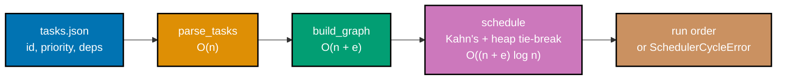

## Goal

Build a small "job scheduler" that ingests tasks with priorities and dependencies and emits a valid
run order -- exercising a heap (priority), a `dict`/`set` (lookup and unresolved-dependency
tracking), a queue-driven traversal (Kahn's algorithm, BFS's dependency-ordering cousin), and cycle
detection, all in one runnable program with a `pytest` suite. Every mechanism this capstone combines
was already taught individually somewhere in the Beginner, Intermediate, or Advanced tiers of this
topic; this is a light consolidation, not a new set of ideas.



## Concepts exercised

- [x] `heapq` priority queue (co-12) -- `schedule()`'s ready-task heap, tie-broken by priority
- [x] `dict`/`set` lookups (co-08, co-09) -- the id-to-`Task` map, the adjacency map, and in-degree
      counters
- [x] BFS over an adjacency dict (co-21, co-05) -- Kahn's algorithm's queue-driven dependency
      relaxation, generalized to a heap for the priority tie-break
- [x] cycle detection (co-21) -- a dependency cycle is detected as a by-product of Kahn's algorithm
      itself, at no extra asymptotic cost
- [x] Big-O reasoning documented per operation (co-01, co-02) -- every function's docstring states its
      exact complexity, reproduced in `scheduler.py`'s module docstring

All colocated code lives under `learning/capstone/code/`: the scheduler logic and CLI entry point in
`scheduler.py`, a sample task graph in `tasks.json`, and the test suite in `test_scheduler.py`. Every
listing below is the complete, verbatim file -- nothing on this page is truncated or paraphrased.

## Step 1: A fresh venv, installed with `pytest`

Every step below assumes a project-local virtual environment, exactly like this topic's other `venv`
usage. Create one inside `learning/capstone/code/` and install `pytest` into it.

**Verify**

```text
$ python3 -m venv .venv
$ .venv/bin/pip install pytest
[... pip install output ...]
$ .venv/bin/pip show pytest
Name: pytest
Version: 9.1.1
...
```

A version string printed by `pip show pytest`, with exit code `0`, confirms the venv is real and
`pytest` is installed into it -- not the system Python.

## Step 2: `scheduler.py` -- parse tasks and build the dependency graph

_exercises co-01, co-02, co-08, co-22_

`parse_tasks` turns raw JSON dicts into typed, immutable `Task` objects (a frozen `@dataclass`,
Example 22's recursion-friendly discipline applied to data instead of a function); `build_graph`
turns that flat collection into the same **dict-of-lists adjacency map** Example 56 introduced, plus
an in-degree counter per task -- the count of that task's still-unresolved dependencies.

**`learning/capstone/code/scheduler.py`** (complete file)

```python
"""Capstone: job scheduler -- priority + dependency task ordering.

Ingests tasks shaped {id, priority, deps} and emits a valid run order: every
task's dependencies run before it, and among tasks with no remaining
dependencies, the higher-priority task always runs first. Combines a heap
(priority), a dict/set (lookup + seen-tracking), a queue/BFS-style traversal
(dependency relaxation via Kahn's algorithm), and cycle detection in one
runnable program.

Big-O per phase (n = number of tasks, e = number of dependency edges):

- ``parse_tasks``: O(n) -- one pass building the id -> Task lookup dict.
- ``build_graph``: O(n + e) -- one pass initializing every task's adjacency
  list and in-degree counter, plus one pass per dependency edge to link
  each task to the tasks that depend on it.
- ``schedule`` (Kahn's algorithm, heap-ordered instead of plain-queue-ordered):
  O((n + e) log n) -- every task is pushed and popped from the priority
  heap exactly once (O(log n) per push/pop), and every dependency edge is
  relaxed exactly once, when its source task is emitted.
- Cycle detection: folded into ``schedule`` at O(1) marginal cost -- if the
  emitted order's length is less than the total task count, whatever tasks
  never reached in-degree 0 are stuck in a cycle (or depend on one).
"""

from __future__ import annotations

import heapq
import json
from dataclasses import dataclass
from pathlib import Path


class SchedulerCycleError(Exception):
    """Raised when the task graph contains a dependency cycle."""


@dataclass(frozen=True)
class Task:
    """One schedulable unit of work."""

    id: str
    priority: int  # higher number = more urgent; breaks ties among ready tasks
    deps: tuple[str, ...]  # ids of tasks that must complete before this one can run


def parse_tasks(raw_tasks: list[dict[str, object]]) -> dict[str, Task]:
    """Build an id -> Task lookup from raw dicts -- O(n)."""
    tasks: dict[str, Task] = {}  # => the id -> Task map every later phase queries by id
    for raw in raw_tasks:  # => one pass over the input, O(n)
        task_id = str(raw["id"])
        priority = int(raw["priority"])  # type: ignore[arg-type]
        deps = tuple(str(d) for d in raw.get("deps", []))  # type: ignore[union-attr]
        tasks[task_id] = Task(id=task_id, priority=priority, deps=deps)
    return tasks


def build_graph(tasks: dict[str, Task]) -> tuple[dict[str, list[str]], dict[str, int]]:
    """Build the adjacency map (dep -> tasks depending on it) and each task's
    in-degree (its unresolved dependency count) -- O(n + e)."""
    adjacency: dict[str, list[str]] = {tid: [] for tid in tasks}  # => O(n) init
    in_degree: dict[str, int] = {tid: 0 for tid in tasks}  # => O(n) init
    for task in tasks.values():  # => O(n) outer pass
        for dep in task.deps:  # => O(e) total across all tasks combined
            if dep not in tasks:  # => O(1) average dict membership check
                raise KeyError(f"{task.id!r} depends on unknown task {dep!r}")
            adjacency[dep].append(task.id)  # => dep unlocks task.id once dep finishes
            in_degree[task.id] += 1  # => task.id has one more unresolved dependency
    return adjacency, in_degree


def schedule(tasks: dict[str, Task]) -> list[str]:
    """Kahn's topological sort, with a max-priority heap tie-break -- O((n + e) log n).

    heapq is a MIN-heap, so pushing (-priority, id) makes the heap always pop
    the HIGHEST-priority ready task first, exactly like Example 41's negation trick.
    """
    adjacency, in_degree = build_graph(tasks)  # => O(n + e)
    ready: list[tuple[int, str]] = [
        (-tasks[tid].priority, tid) for tid in tasks if in_degree[tid] == 0
    ]  # => seeds the heap with every task that has NO dependencies at all
    heapq.heapify(
        ready
    )  # => O(k) where k = len(ready), turns the list into a valid heap

    order: list[str] = []  # => the emitted run order, respecting deps and priority ties
    while (
        ready
    ):  # => drains the heap -- each task pushed/popped at most once, O(log n) each
        _, task_id = heapq.heappop(ready)  # => always the highest-priority ready task
        order.append(task_id)
        for dependent in adjacency[
            task_id
        ]:  # => relax every edge OUT of task_id, O(e) total
            in_degree[dependent] -= 1  # => task_id no longer blocks dependent
            if (
                in_degree[dependent] == 0
            ):  # => dependent has NO unresolved deps left -- ready
                heapq.heappush(ready, (-tasks[dependent].priority, dependent))

    if len(order) != len(
        tasks
    ):  # => O(1): fewer emissions than tasks means a cycle exists
        stuck = sorted(
            tid for tid in tasks if tid not in order
        )  # => O(n log n), diagnostics only
        raise SchedulerCycleError(
            f"dependency cycle detected among: {', '.join(stuck)}"
        )
    return order  # => a complete, valid run order -- every dep precedes its dependents


def load_tasks(path: Path) -> dict[str, Task]:
    """Read a JSON file of raw task dicts and parse it into Task objects."""
    with path.open() as f:  # => `with` guarantees the file handle closes
        raw_tasks = json.load(f)  # => parses the whole file as one JSON value
    return parse_tasks(raw_tasks)


def main() -> None:
    """CLI entry point: schedule the sample tasks.json next to this file."""
    tasks_path = (
        Path(__file__).parent / "tasks.json"
    )  # => resolves relative to THIS file
    tasks = load_tasks(tasks_path)
    order = schedule(tasks)
    print(" -> ".join(order))  # => prints the run order as an arrow-joined chain


if (
    __name__ == "__main__"
):  # => only runs main() when invoked directly, not when imported
    main()
```

**`learning/capstone/code/tasks.json`** (complete file)

```json
[
  { "id": "compile", "priority": 3, "deps": [] },
  { "id": "lint", "priority": 5, "deps": [] },
  { "id": "unit_test", "priority": 4, "deps": ["compile"] },
  { "id": "integration_test", "priority": 2, "deps": ["compile", "lint"] },
  { "id": "package", "priority": 1, "deps": ["unit_test", "integration_test"] },
  { "id": "deploy", "priority": 1, "deps": ["package"] }
]
```

**Key takeaway**: `parse_tasks` and `build_graph` are both plain, linear-pass functions over `dict`s
-- there is nothing algorithmically clever in this step; the heap-driven ordering (Step 3) is where
the interesting work happens, on top of the plain data this step prepares.

## Step 3: `schedule()` -- Kahn's algorithm with a heap-based priority tie-break

_exercises co-05, co-08, co-12, co-21_

`schedule()` (shown in full in Step 2's listing) is Kahn's topological sort -- the same
in-degree-plus-queue algorithm Example 72 taught -- except the plain queue is replaced with a
min-heap of `(-priority, id)` tuples, so that whenever more than one task is simultaneously ready
(zero remaining dependencies), the **highest-priority** one is emitted first. The `-priority`
negation is Example 41's max-heap-via-negation trick, applied directly.

**`learning/capstone/code/test_scheduler.py`** (complete file)

```python
"""pytest coverage for scheduler.py -- an acyclic fixture and a cyclic fixture."""

import pytest

from scheduler import SchedulerCycleError, parse_tasks, schedule


def test_acyclic_order_respects_dependencies() -> None:
    """Every dependency must be emitted strictly before every task that depends on it."""
    raw_tasks: list[dict[str, object]] = [
        {"id": "compile", "priority": 3, "deps": []},
        {"id": "lint", "priority": 5, "deps": []},
        {"id": "unit_test", "priority": 4, "deps": ["compile"]},
        {"id": "integration_test", "priority": 2, "deps": ["compile", "lint"]},
        {"id": "package", "priority": 1, "deps": ["unit_test", "integration_test"]},
        {"id": "deploy", "priority": 1, "deps": ["package"]},
    ]
    tasks = parse_tasks(raw_tasks)
    order = schedule(tasks)

    assert len(order) == len(tasks)  # every task appears exactly once
    assert set(order) == set(tasks)  # no task is missing or duplicated
    positions = {task_id: index for index, task_id in enumerate(order)}
    for task in tasks.values():
        for dep in task.deps:
            assert positions[dep] < positions[task.id]  # dep runs strictly before task


def test_acyclic_order_breaks_ties_by_priority() -> None:
    """Among tasks with no remaining dependencies, the higher-priority task runs first."""
    raw_tasks: list[dict[str, object]] = [
        {"id": "compile", "priority": 3, "deps": []},
        {"id": "lint", "priority": 5, "deps": []},
    ]
    tasks = parse_tasks(raw_tasks)
    order = schedule(tasks)

    # Both tasks are ready at the same time (no deps); priority 5 beats priority 3.
    assert order == ["lint", "compile"]


def test_cyclic_graph_raises_scheduler_cycle_error() -> None:
    """A dependency cycle must raise a clear, dedicated error, not silently drop tasks."""
    raw_tasks: list[dict[str, object]] = [
        {"id": "a", "priority": 1, "deps": ["c"]},
        {"id": "b", "priority": 1, "deps": ["a"]},
        {"id": "c", "priority": 1, "deps": ["b"]},  # a -> b -> c -> a: a cycle
    ]
    tasks = parse_tasks(raw_tasks)

    with pytest.raises(SchedulerCycleError):
        schedule(tasks)


def test_cyclic_graph_error_names_the_stuck_tasks() -> None:
    """The raised error message names every task caught in (or blocked by) the cycle."""
    raw_tasks: list[dict[str, object]] = [
        {"id": "a", "priority": 1, "deps": ["b"]},
        {"id": "b", "priority": 1, "deps": ["a"]},
        {"id": "independent", "priority": 1, "deps": []},  # not part of the cycle
    ]
    tasks = parse_tasks(raw_tasks)

    with pytest.raises(SchedulerCycleError) as excinfo:
        schedule(tasks)
    assert "a" in str(excinfo.value)
    assert "b" in str(excinfo.value)
    assert "independent" not in str(excinfo.value)  # the healthy task is not implicated
```

**Verify**

```text
$ .venv/bin/pytest -q
....                                                                     [100%]
4 passed in 0.00s
```

`test_acyclic_order_breaks_ties_by_priority` is the test that specifically proves the heap tie-break
works: `compile` (priority 3) and `lint` (priority 5) both start with zero dependencies, and the
emitted order confirms `lint` -- the higher-priority task -- is scheduled first.

**Key takeaway**: Kahn's algorithm plus a heap swap (queue -> min-heap of negated-priority tuples) is
all it takes to add priority-aware tie-breaking to a plain dependency-respecting topological sort --
the dependency-respecting guarantee itself is untouched by that swap.

## Step 4: Cycle detection

_exercises co-21_

`schedule()` detects a cycle for free, as a direct consequence of Kahn's algorithm's own termination
condition: if any tasks are stuck at a nonzero in-degree when the heap empties, those tasks (and
whatever waits on them) can never become "ready," which is only possible if they sit on -- or depend
on -- a cycle. No separate cycle-detection pass (like Example 73's three-color DFS) is needed here.

**Verify** (a deliberately cyclic three-task fixture: `a` depends on `b`, `b` depends on `a`, plus one
healthy, unrelated task):

```python
from scheduler import parse_tasks, schedule, SchedulerCycleError

raw = [
    {"id": "a", "priority": 1, "deps": ["b"]},
    {"id": "b", "priority": 1, "deps": ["a"]},
    {"id": "independent", "priority": 1, "deps": []},
]
tasks = parse_tasks(raw)
try:
    schedule(tasks)
except SchedulerCycleError as err:
    print(f"SchedulerCycleError: {err}")
```

**Output** (genuinely captured):

```text
SchedulerCycleError: dependency cycle detected among: a, b
```

**Key takeaway**: the error message names exactly the tasks caught in the cycle (`a` and `b`) and
excludes the unrelated, healthy `independent` task -- the diagnostic is specific enough to act on, not
a generic "something went wrong."

**Why it matters**: getting cycle detection "for free" out of an existing algorithm, rather than as a
bolted-on separate pass, is a direct payoff of understanding Kahn's algorithm's termination condition
deeply enough to recognize what an incomplete run actually _means_.

## Step 5: Run it end to end

`python3 scheduler.py`, run from inside `learning/capstone/code/`, schedules the sample
`tasks.json` shown in Step 2 and prints the resulting run order.

**Run**: `python3 scheduler.py`

**Output** (genuinely captured):

```text
lint -> compile -> unit_test -> integration_test -> package -> deploy
```

Tracing this order against `tasks.json`: `lint` (priority 5) and `compile` (priority 3) both start
ready (no deps), and `lint`'s higher priority puts it first. Once `compile` finishes, `unit_test`
becomes ready; once both `compile` and `lint` finish, `integration_test` becomes ready too --
`unit_test` (priority 4) outranks `integration_test` (priority 2), so it is emitted first among that
pair. `package` waits for both `unit_test` and `integration_test`, and `deploy` waits for `package` --
exactly the dependency chain `tasks.json` declares, with every priority tie broken correctly along
the way.

## Acceptance criteria

- `python3 scheduler.py`, run from `learning/capstone/code/`, exits `0` and prints the exact run order
  shown in Step 5's Output block.
- `.venv/bin/pytest -q` reports `4 passed` against `test_scheduler.py`, covering both the
  dependency-respecting order, the priority tie-break, and both cyclic-fixture cases (a bare raise
  and a raise whose message names the stuck tasks).
- A dependency cycle raises `SchedulerCycleError` naming exactly the tasks caught in the cycle, never
  silently dropping tasks from the emitted order.
- Every phase's Big-O is documented in `scheduler.py`'s module docstring: `parse_tasks` O(n),
  `build_graph` O(n + e), `schedule` O((n + e) log n), cycle detection at O(1) marginal cost.
- Every listing on this page (`scheduler.py`, `tasks.json`, `test_scheduler.py`) is the complete file,
  runnable exactly as shown -- nothing here is a fragment that depends on code the page does not also
  show.

## Done bar

This capstone is runnable end to end: a reader who copies the three files above into a
`learning/capstone/code/`-shaped directory, creates a venv, installs `pytest`, and runs `python3
scheduler.py` there reaches the identical output block shown in Step 5, verified against a real
CPython 3.14.3 interpreter run (not merely described). Every mechanism combined here -- a `heapq`
priority queue (co-12), `dict`/`set` lookups (co-08, co-09), a queue/BFS-style traversal generalized
by Kahn's algorithm (co-21, co-05), and cycle detection folded into that same traversal -- traces to a
worked example already taught earlier in this topic's Beginner, Intermediate, or Advanced tiers; no
new algorithmic idea was needed to write this capstone.

---

← Previous: [Advanced Examples](../advanced.md) · Next: [Drilling](../../drilling/overview.md) →
