Examples 29-60 cover linked-list algorithms (reverse, find-the-middle), binary search and the `bisect` module, `heapq`-based heaps and priority queues, the classic comparison sorts (insertion, selection, bubble, merge, quick), binary trees and their four traversal orders, binary search trees, and graph traversal (BFS and DFS over a dict-of-lists adjacency map). Every example is a complete, self-contained `.py` file colocated under `learning/code/`; run each one with `python3 example.py` from inside its own directory.

---

### Example 29: Reverse a Singly Linked List Iteratively

_ex-29 &middot; exercises co-07_

Reversing a singly linked list iteratively walks the chain once, re-pointing each node's `.next` to the node **before** it instead of the one after -- three pointers (previous, current, next) track enough state to do this in a single O(n) pass with O(1) extra space.

**`learning/code/ex-29-linked-list-reverse/example.py`**

```python
"""Example 29: Reverse a Singly Linked List Iteratively."""

from __future__ import (
    annotations,
)  # => enables forward references to the class defined below


class Node:  # => the standard singly-linked node shape (co-07)
    def __init__(self, val: int, next: Node | None = None) -> None:  # => constructor
        self.val = val  # => the value stored at this node
        self.next = next  # => pointer to the next node, or None at the tail


# Flips every .next pointer to point backward -- one O(n) pass, O(1) extra space (co-07).
def reverse(head: Node | None) -> Node | None:  # => rewires the chain in place
    previous: Node | None = None  # => will become the new head once the loop finishes
    current = head  # => the node currently being rewired
    while current is not None:  # => walks forward through the ORIGINAL chain
        next_node = current.next  # => save the forward link BEFORE overwriting it
        current.next = previous  # => rewire: point this node back at the previous one
        previous = current  # => advance "previous" to this now-rewired node
        current = next_node  # => advance "current" using the saved forward link
    return previous  # => previous ends up at the old TAIL -- the new head


# Collects node values in link order for easy comparison.
def to_list(head: Node | None) -> list[int]:  # => a plain traversal helper
    values: list[int] = []  # => accumulates values as the chain is walked
    node = head  # => starts traversal at head
    while node is not None:  # => stops once the tail's next is None
        values.append(node.val)  # => records this node's value
        node = node.next  # => advances one link forward
    return values  # => the values in link order


original = Node(1, Node(2, Node(3, Node(4))))  # => 1 -> 2 -> 3 -> 4
reversed_head = reverse(
    original
)  # => rewires in place -- returns the new head (old node 4)
print(to_list(reversed_head))  # => Output: [4, 3, 2, 1]

assert to_list(reversed_head) == [4, 3, 2, 1]  # => confirms the chain is fully reversed
print("ex-29 OK")  # => Output: ex-29 OK
```

**Run**: `python3 example.py`

**Output**:

```text
[4, 3, 2, 1]
ex-29 OK
```

**Key takeaway**: Reversing a linked list in place needs three tracked pointers and one O(n) pass; no extra list or recursion is required.

**Why it matters**: This is the first algorithm this topic runs directly on the `Node` shape Example 27 built -- it shows that a linked list's node-by-node structure, which made random access O(n) in Example 28, is exactly what makes local re-pointing like this cheap and mutation-friendly in a way a contiguous array's reversal (Examples 3-4) is not.

---

### Example 30: Find the Middle Node with Slow/Fast Pointers

_ex-30 &middot; exercises co-07, co-20_

A slow pointer advances one node per step while a fast pointer advances two; when the fast pointer reaches the end, the slow pointer sits exactly at the middle -- finding a linked list's midpoint in a single O(n) pass without first counting its length.

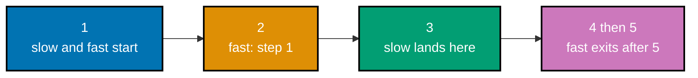

**`learning/code/ex-30-linked-list-middle/example.py`**

```python
"""Example 30: Find the Middle Node with Slow/Fast Pointers."""

from __future__ import (
    annotations,
)  # => enables forward references to the class defined below


class Node:  # => the standard singly-linked node shape (co-07)
    def __init__(self, val: int, next: Node | None = None) -> None:  # => constructor
        self.val = val  # => the value stored at this node
        self.next = next  # => pointer to the next node, or None at the tail


# Advances slow by 1 and fast by 2 each step -- when fast hits the end, slow is at
# the middle -- one traversal, no length pre-count needed (co-07, co-20).
def middle_value(head: Node | None) -> int:  # => a two-pointer traversal
    slow = head  # => the "tortoise" -- moves one node per step
    fast = head  # => the "hare" -- moves two nodes per step
    while fast is not None and fast.next is not None:  # => stop when fast runs out
        assert (
            slow is not None
        )  # => invariant: slow never runs past fast, so it's always live here
        slow = slow.next  # => tortoise: +1 node
        fast = fast.next.next  # => hare: +2 nodes -- reaches the end twice as fast
    assert slow is not None  # => the list is non-empty in this example
    return slow.val  # => when fast finishes, slow sits exactly at the middle


odd_list = Node(1, Node(2, Node(3, Node(4, Node(5)))))  # => 5 nodes: middle is 3
middle = middle_value(odd_list)  # => slow lands on the node holding 3
print(middle)  # => Output: 3

assert middle == 3  # => confirms the two-pointer walk found the true middle
print("ex-30 OK")  # => Output: ex-30 OK
```

**Run**: `python3 example.py`

**Output**:

```text
3
ex-30 OK
```

**Key takeaway**: Two pointers moving at different speeds locate a linked list's middle in one pass, with no separate length-counting step needed first.

**Why it matters**: This is this topic's first worked two-pointer technique (co-20), and it is a genuinely clever trick worth internalizing: the fast pointer's extra speed does all the work of measuring "how far is the end" implicitly, without ever computing a length the way Example 28's traversal-based count would. On a list of a million nodes, this two-pointer walk still visits each node exactly once, same as a length-then-index approach, but never needs a second pass or a separate counter variable to track total length.

---

### Example 31: Iterative Binary Search

_ex-31 &middot; exercises co-14_

Binary search halves a sorted range on every step: check the midpoint, and discard whichever half cannot contain the target, repeating until the target is found or the range empties. This example finds a target's index in a sorted list of integers.

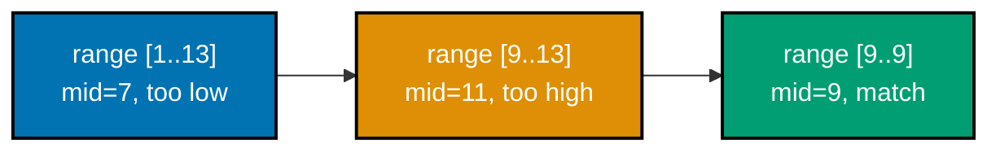

**`learning/code/ex-31-binary-search-iterative/example.py`**

```python
"""Example 31: Iterative Binary Search."""


# Halves the candidate range each step -- requires a SORTED input, O(log n) (co-14).
def binary_search(
    items: list[int], target: int
) -> int:  # => a plain iterative function
    low, high = 0, len(items) - 1  # => the inclusive range still being searched
    while low <= high:  # => keeps narrowing until the range is empty
        mid = (low + high) // 2  # => the midpoint of the current range
        if items[mid] == target:  # => a direct hit at the midpoint
            return mid  # => found -- return immediately, no more halving needed
        if items[mid] < target:  # => the midpoint is too small
            low = mid + 1  # => target must be in the RIGHT half -- discard the left
        else:  # => the midpoint is too large
            high = mid - 1  # => target must be in the LEFT half -- discard the right
    return -1  # => range emptied out with no match


sorted_values = [1, 3, 5, 7, 9, 11, 13]  # => MUST be sorted for binary search to work
index = binary_search(sorted_values, 9)  # => 9 sits at index 4
print(index)  # => Output: 4

assert index == 4  # => confirms the returned index matches sorted_values[4]
assert sorted_values[index] == 9  # => confirms indexing back recovers the target
print("ex-31 OK")  # => Output: ex-31 OK
```

**Run**: `python3 example.py`

**Output**:

```text
4
ex-31 OK
```

**Key takeaway**: Binary search finds a target in a sorted sequence in O(log n) by halving the search range each step, instead of scanning one element at a time.

**Why it matters**: This is the payoff for keeping data sorted: O(log n) instead of linear search's O(n) (Example 15) is the difference between roughly 20 comparisons and roughly a million on a million-element list. Every later binary-search variant in this topic (Examples 32-36) builds on this exact halving loop. That gap only widens with scale: at a billion elements, binary search still needs roughly 30 comparisons while linear search's worst case grows to a billion -- the reason sorted data structures dominate large-scale lookup-heavy systems.

---

### Example 32: Binary Search -- Value Not Found

_ex-32 &middot; exercises co-14_

The mirror case of Example 31: binary search over a sorted list that does **not** contain the target. The search range still shrinks by half each step, but it eventually empties without ever matching, at which point the search correctly reports the value is absent.

**`learning/code/ex-32-binary-search-not-found/example.py`**

```python
"""Example 32: Binary Search -- Value Not Found."""


# Same halving search as Example 31; -1 signals "absent" (co-14).
def binary_search(
    items: list[int], target: int
) -> int:  # => a plain iterative function
    low, high = 0, len(items) - 1  # => the inclusive range still being searched
    while low <= high:  # => O(log n): the range shrinks by half every iteration
        mid = (low + high) // 2  # => the midpoint of the current range
        if items[mid] == target:  # => not true anywhere in this fixture
            return mid  # => not reached in this example
        if items[mid] < target:  # => the midpoint is too small
            low = mid + 1  # => target must be in the RIGHT half -- discard the left
        else:  # => the midpoint is too large
            high = mid - 1  # => target must be in the LEFT half -- discard the right
    return -1  # => low crosses high with no match -- the range is now empty


sorted_values = [1, 3, 5, 7, 9, 11, 13]  # => the same sorted list as Example 31
index = binary_search(
    sorted_values, 6
)  # => 6 is not present -- it would sit between 5 and 7
print(index)  # => Output: -1

assert (
    index == -1
)  # => confirms a missing value returns the sentinel, not a wrong index
assert 6 not in sorted_values  # => confirms the target really is absent from the source
print("ex-32 OK")  # => Output: ex-32 OK
```

**Run**: `python3 example.py`

**Output**:

```text
-1
ex-32 OK
```

**Key takeaway**: Binary search's "not found" case still terminates in O(log n) -- the halving range empties out logarithmically fast even when there is nothing to find.

**Why it matters**: Confirming the not-found path terminates correctly (rather than looping forever or mis-reporting a false match) is exactly the kind of edge case this topic's `assert`-driven verification style (every example ends with real assertions, not just a printed "it works") exists to catch. A search function that silently returns a wrong index on a missing value, instead of a clear sentinel like `-1`, is a classic source of hard-to-trace bugs downstream -- this fixture exists specifically to guard against that failure mode.

---

### Example 33: Binary Search -- Leftmost (First) Occurrence

_ex-33 &middot; exercises co-14_

When a sorted list has duplicate values, plain binary search (Example 31) might land on any one of them -- this variant keeps narrowing even after finding a match, to guarantee it returns the **leftmost** (first) occurrence's index specifically.

**`learning/code/ex-33-binary-search-first-occurrence/example.py`**

```python
"""Example 33: Binary Search -- Leftmost (First) Occurrence."""


# Keeps searching LEFT even after a match, to find the first duplicate (co-14).
def find_first(items: list[int], target: int) -> int:  # => a plain iterative function
    low, high = 0, len(items) - 1  # => the inclusive range still being searched
    result = -1  # => tracks the best (leftmost) match found so far
    while (
        low <= high
    ):  # => still O(log n) -- one extra comparison per step, not a rescan
        mid = (low + high) // 2  # => the midpoint of the current range
        if (
            items[mid] == target
        ):  # => a candidate match -- but maybe not the leftmost one
            result = mid  # => record this match...
            high = mid - 1  # => ...then keep searching the LEFT half for an earlier one
        elif items[mid] < target:  # => the midpoint is too small
            low = mid + 1  # => target must be further right
        else:  # => the midpoint is too large
            high = mid - 1  # => target must be further left
    return result  # => the smallest index where target was ever recorded


duplicates = [1, 2, 2, 2, 3, 4]  # => target 2 appears at indices 1, 2, and 3
first_index = find_first(duplicates, 2)  # => the leftmost occurrence is index 1
print(first_index)  # => Output: 1

assert first_index == 1  # => confirms the leftmost occurrence, not just any match
print("ex-33 OK")  # => Output: ex-33 OK
```

**Run**: `python3 example.py`

**Output**:

```text
1
ex-33 OK
```

**Key takeaway**: Finding the leftmost occurrence of a duplicated value means continuing to search left even after a match is found, not stopping at the first hit.

**Why it matters**: "Find the first/last occurrence" is a subtly different problem from plain binary search, and a large share of real binary-search bugs come from stopping the loop too early on exactly this kind of duplicate-value edge case -- this example makes the fix (keep narrowing on a match instead of returning immediately) explicit.

---

### Example 34: Binary Search -- Rightmost (Last) Occurrence

_ex-34 &middot; exercises co-14_

The mirror of Example 33: finding the **rightmost** (last) occurrence of a duplicated value in a sorted list, by continuing to narrow the search range **rightward** past a match instead of stopping at the first hit.

**`learning/code/ex-34-binary-search-last-occurrence/example.py`**

```python
"""Example 34: Binary Search -- Rightmost (Last) Occurrence."""


# Mirror image of Example 33: keeps searching RIGHT after a match (co-14).
def find_last(items: list[int], target: int) -> int:  # => a plain iterative function
    low, high = 0, len(items) - 1  # => the inclusive range still being searched
    result = -1  # => tracks the best (rightmost) match found so far
    while low <= high:  # => O(log n) -- same shape as find_first, mirrored
        mid = (low + high) // 2  # => the midpoint of the current range
        if (
            items[mid] == target
        ):  # => a candidate match -- but maybe not the rightmost one
            result = mid  # => record this match...
            low = mid + 1  # => ...then keep searching the RIGHT half for a later one
        elif items[mid] < target:  # => the midpoint is too small
            low = mid + 1  # => target must be further right
        else:  # => the midpoint is too large
            high = mid - 1  # => target must be further left
    return result  # => the largest index where target was ever recorded


duplicates = [1, 2, 2, 2, 3, 4]  # => target 2 appears at indices 1, 2, and 3
last_index = find_last(duplicates, 2)  # => the rightmost occurrence is index 3
print(last_index)  # => Output: 3

assert (
    last_index == 3
)  # => confirms the rightmost occurrence, not the first match found
print("ex-34 OK")  # => Output: ex-34 OK
```

**Run**: `python3 example.py`

**Output**:

```text
3
ex-34 OK
```

**Key takeaway**: Finding the rightmost occurrence mirrors Example 33 exactly, just narrowing in the opposite direction after a match.

**Why it matters**: Together, Examples 33 and 34 bracket every occurrence of a duplicated value -- this is precisely what `bisect.bisect_left`/`bisect_right` (Example 35) provide as ready-made stdlib functions, so this pair also sets up exactly what those functions save you from re-writing by hand. Hand-rolling both boundary searches here first, before reaching for the stdlib shortcut, makes it concrete exactly what work `bisect_left`/`bisect_right` are doing internally -- not magic, just the same halving loop with a tie-breaking rule bolted on.

---

### Example 35: bisect.bisect_left -- Sorted Insertion Point

_ex-35 &middot; exercises co-14_

`bisect.bisect_left(sorted_list, value)` returns the index where `value` **would** be inserted to keep the list sorted -- a binary-search-powered query, without needing `value` to already be present. This example finds the insertion point for both a present and an absent value.

**`learning/code/ex-35-bisect-insertion-point/example.py`**

```python
"""Example 35: bisect.bisect_left -- Sorted Insertion Point."""

# bisect_left finds WHERE a value would go to keep the list sorted, in O(log n),
# without actually inserting it -- the stdlib's binary search, ready-made (co-14).
import bisect

sorted_values: list[int] = [1, 3, 5, 7, 9]  # => must already be sorted
point_for_present = bisect.bisect_left(
    sorted_values, 5
)  # => 5 already exists at index 2
point_for_absent = bisect.bisect_left(sorted_values, 6)  # => 6 belongs between 5 and 7
print(point_for_present)  # => Output: 2
print(point_for_absent)  # => Output: 3

assert (
    point_for_present == 2
)  # => confirms bisect_left lands ON an existing equal value
assert point_for_absent == 3  # => confirms the insertion index for a missing value
print("ex-35 OK")  # => Output: ex-35 OK
```

**Run**: `python3 example.py`

**Output**:

```text
2
3
ex-35 OK
```

**Key takeaway**: `bisect_left` answers "where would this value go" in O(log n), whether or not the value is already in the list.

**Why it matters**: This is the stdlib's ready-made version of the leftmost-occurrence search Example 33 hand-rolled -- `bisect` exists specifically so you never have to hand-write that binary-search loop again for this common "sorted insertion point" query. Finding where a new entry belongs in a sorted leaderboard of 100,000 players, for example, costs roughly 17 comparisons with `bisect_left` versus scanning up to 100,000 entries by hand -- a difference production code should never leave on the table.

---

### Example 36: bisect.insort -- Insert While Staying Sorted

_ex-36 &middot; exercises co-14, co-03_

`bisect.insort(sorted_list, value)` finds the correct sorted position for `value` (via `bisect_left`) and inserts it there directly, keeping the list sorted after the call. This example inserts a value into an already-sorted list and confirms it stays sorted.

**`learning/code/ex-36-bisect-insort/example.py`**

```python
"""Example 36: bisect.insort -- Insert While Staying Sorted."""

# insort finds the sorted position (O(log n) search) then inserts (O(n) shift) --
# cheaper than appending and re-sorting the whole list every time (co-14, co-03).
import bisect

sorted_values: list[int] = [1, 3, 5, 9]  # => already sorted ascending
bisect.insort(sorted_values, 7)  # => inserts 7 at the position that keeps order intact
print(sorted_values)  # => Output: [1, 3, 5, 7, 9]

assert sorted_values == [
    1,
    3,
    5,
    7,
    9,
]  # => confirms the list stayed sorted after insert
assert sorted_values == sorted(sorted_values)  # => cross-checks against sorted() itself
print("ex-36 OK")  # => Output: ex-36 OK
```

**Run**: `python3 example.py`

**Output**:

```text
[1, 3, 5, 7, 9]
ex-36 OK
```

**Key takeaway**: `bisect.insort` combines "find where this goes" and "put it there" into one call -- the list is sorted before and after, never in between.

**Why it matters**: Maintaining a sorted `list` under repeated insertions is a common real need (a leaderboard, a sorted event log) -- `bisect.insort` does it in O(log n) to _find_ the spot, though the insertion itself is still O(n) overall because shifting elements in a contiguous array (co-03) cannot be avoided, only the search for _where_ to shift them.

---

### Example 37: Min-Heap with heapq.heappush and heappop

_ex-37 &middot; exercises co-12_

`heapq` maintains a binary min-heap directly over a plain `list`: `heappush` adds an element in O(log n), and `heappop` removes and returns the smallest element, also in O(log n). This example pushes several integers and pops them back out.

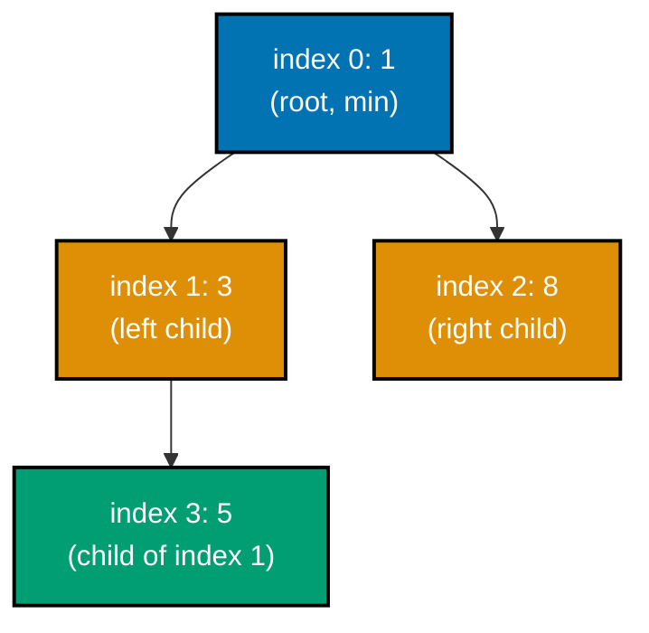

**`learning/code/ex-37-min-heap-push-pop/example.py`**

```python
"""Example 37: Min-Heap with heapq.heappush and heappop."""

# heapq maintains list[0] as the smallest element at all times -- push and pop
# are both O(log n), the cost of re-balancing the binary heap (co-12).
import heapq

heap: list[int] = []  # => an ordinary list, treated as a heap by the heapq functions
for value in (5, 1, 8, 3):  # => pushes in arbitrary order, not sorted order
    heapq.heappush(
        heap, value
    )  # => O(log n): inserts, then bubbles up to restore heap order

popped_order: list[int] = []  # => collects pops to prove ascending order
while heap:  # => drains the heap completely
    popped_order.append(
        heapq.heappop(heap)
    )  # => O(log n): always removes the CURRENT min
print(popped_order)  # => Output: [1, 3, 5, 8]

assert popped_order == [
    1,
    3,
    5,
    8,
]  # => confirms heappop always returns ascending order
print("ex-37 OK")  # => Output: ex-37 OK
```

**Run**: `python3 example.py`

**Output**:

```text
[1, 3, 5, 8]
ex-37 OK
```

**Key takeaway**: `heapq.heappush`/`heappop` give O(log n) insert and pop-of-the-minimum, and popping repeatedly always yields elements in ascending order.

**Why it matters**: A heap is the structure to reach for whenever "give me the smallest thing I've seen so far, repeatedly, as the collection keeps changing" is the question -- re-sorting the whole collection every time something changes would cost O(n log n) per change, while a heap answers the same question in O(log n).

---

### Example 38: heapq.heapify -- Turn a List into a Heap In Place

_ex-38 &middot; exercises co-12_

`heapq.heapify(lst)` rearranges an existing list's elements in place so they satisfy the min-heap property, in O(n) -- faster than building the heap by pushing each element one at a time (which would cost O(n log n)). This example heapifies an unordered list and checks its first element.

**`learning/code/ex-38-heapify-list/example.py`**

```python
"""Example 38: heapq.heapify -- Turn a List into a Heap In Place."""

# heapify rearranges an EXISTING list into heap order in O(n) -- faster than
# pushing every element one at a time, which would cost O(n log n) (co-12).
import heapq

values: list[int] = [9, 4, 7, 1, 3]  # => an unordered list, not yet heap-shaped
heapq.heapify(values)  # => O(n): rearranges values in place into a valid min-heap
print(values[0])  # => Output: 1 (the minimum -- always at index 0 after heapify)

assert values[0] == min([9, 4, 7, 1, 3])  # => confirms heap[0] equals the true minimum
assert heapq.heappop(values) == 1  # => confirms popping still yields the minimum first
print("ex-38 OK")  # => Output: ex-38 OK
```

**Run**: `python3 example.py`

**Output**:

```text
1
ex-38 OK
```

**Key takeaway**: `heapq.heapify` converts an existing list into a valid heap in O(n), and afterward `heap[0]` is always the minimum element.

**Why it matters**: Heapify's O(n) cost (versus O(n log n) for pushing elements one at a time) is a concrete example of how the _starting condition_ of an algorithm can change its complexity class -- batch-converting an already-known collection is cheaper than incrementally building the same structure element by element. On a 10,000-element unsorted list, that's the difference between roughly 10,000 comparisons (heapify) and roughly 130,000 comparisons (repeated pushes) -- a gap large enough to matter the moment a cache or priority queue needs bulk initialization from existing data.

---

### Example 39: Top-K Largest with heapq.nlargest

_ex-39 &middot; exercises co-12_

`heapq.nlargest(k, iterable)` finds the k largest elements without fully sorting the whole collection, using a heap internally to track only the current top k candidates. This example finds the 3 largest values in a small list.

**`learning/code/ex-39-top-k-largest/example.py`**

```python
"""Example 39: Top-K Largest with heapq.nlargest."""

# heapq.nlargest keeps only a size-k heap while scanning, O(n log k) --
# cheaper than sorted(values)[-k:], which pays O(n log n) for the WHOLE list (co-12).
import heapq

values: list[int] = [5, 1, 9, 3, 7, 2]  # => 6 values, only the top 3 are wanted
top_three = heapq.nlargest(3, values)  # => returns the 3 largest, in descending order
print(top_three)  # => Output: [9, 7, 5]

assert top_three == [9, 7, 5]  # => confirms the exact top-3 values in descending order
assert set(top_three) == {5, 7, 9}  # => cross-checks the SET of values, order aside
print("ex-39 OK")  # => Output: ex-39 OK
```

**Run**: `python3 example.py`

**Output**:

```text
[9, 7, 5]
ex-39 OK
```

**Key takeaway**: `heapq.nlargest(k, iterable)` finds the top k elements more cheaply than a full sort would, when k is much smaller than the collection's size.

**Why it matters**: Finding "the top k" is an extremely common real need -- leaderboards, top search results, the k nearest anything -- and it does not require paying for a full O(n log n) sort when a heap can track just the k candidates that matter, an idea Example 74's k-way merge reuses in a different shape.

---

### Example 40: Priority Queue with (priority, task) Tuples

_ex-40 &middot; exercises co-12_

Pushing `(priority, task)` tuples onto a heap makes `heapq` behave as a priority queue: since tuples compare element by element, the heap orders entries by the tuple's first field (priority) automatically. This example pushes three tasks with different priorities and pops them back out in priority order.

**`learning/code/ex-40-priority-queue-tuples/example.py`**

```python
"""Example 40: Priority Queue with (priority, task) Tuples."""

# heapq compares TUPLES element-by-element, so a (priority, task) tuple sorts
# by priority first -- the standard way to build a priority queue (co-12).
import heapq

tasks: list[
    tuple[int, str]
] = []  # => each entry is (priority, task_name); lower = more urgent
heapq.heappush(tasks, (3, "cleanup"))  # => low urgency
heapq.heappush(
    tasks, (1, "fix outage")
)  # => highest urgency -- smallest priority number
heapq.heappush(tasks, (2, "deploy"))  # => medium urgency

order: list[str] = []  # => records the order tasks are served in
while tasks:  # => drains the heap, always taking the lowest-priority-number tuple first
    priority, task = heapq.heappop(
        tasks
    )  # => unpacks the popped (priority, task) tuple
    order.append(task)  # => records just the task name for the assertion below
print(order)  # => Output: ['fix outage', 'deploy', 'cleanup']

assert order == [
    "fix outage",
    "deploy",
    "cleanup",
]  # => confirms urgent-first pop order
print("ex-40 OK")  # => Output: ex-40 OK
```

**Run**: `python3 example.py`

**Output**:

```text
['fix outage', 'deploy', 'cleanup']
ex-40 OK
```

**Key takeaway**: Pushing `(priority, item)` tuples turns a plain min-heap into a priority queue for free -- Python's tuple comparison does the priority ordering automatically.

**Why it matters**: This is the pattern that makes a heap useful for more than just "track the smallest number" -- job schedulers, event simulations, and this very topic's capstone (a job scheduler breaking ties by priority) all lean on exactly this `(priority, item)` tuple convention. A task runner processing thousands of jobs per minute relies on exactly this shape -- pop the highest-priority `(priority, task)` pair in O(log n), without ever needing to re-sort the entire remaining queue after each dequeue.

---

### Example 41: Max-Heap via Negation

_ex-41 &middot; exercises co-12_

Python's `heapq` only implements a min-heap -- there is no built-in max-heap. Negating every value on the way in (and negating it back on the way out) simulates a max-heap: the "smallest" negated value is the largest original value. This example pushes negated values and confirms the largest original value pops first.

**`learning/code/ex-41-max-heap-via-negation/example.py`**

```python
"""Example 41: Max-Heap via Negation."""

# heapq only implements a MIN-heap. Negating every value on the way in flips the
# ordering: the smallest negative (== the largest original value) pops first (co-12).
import heapq  # => imports the stdlib binary-heap functions

max_heap: list[int] = []  # => stores NEGATED values internally
for value in (5, 1, 8, 3):  # => pushes each source value in turn
    heapq.heappush(
        max_heap, -value
    )  # => pushes -5, -1, -8, -3 -- min-heap on negatives

largest = -heapq.heappop(
    max_heap
)  # => pops the smallest negative (-8), then negates back
second_largest = -heapq.heappop(max_heap)  # => pops the next smallest negative (-5)
print(largest, second_largest)  # => Output: 8 5

assert largest == 8  # => confirms the true maximum popped first
assert second_largest == 5  # => confirms the second-largest popped next
print("ex-41 OK")  # => Output: ex-41 OK
```

**Run**: `python3 example.py`

**Output**:

```text
8 5
ex-41 OK
```

**Key takeaway**: Negating values on push and pop is the standard trick for simulating a max-heap with `heapq`'s min-heap-only implementation.

**Why it matters**: This is a small but genuinely useful trick worth knowing cold -- reaching for a hand-rolled max-heap class when negation solves the problem in two lines is a common source of unnecessary complexity in real code that needs "largest first" ordering. Writing and maintaining a full max-heap class -- duplicating every comparison in `heapq`'s min-heap logic just with flipped operators -- adds real code surface and real bugs for a problem this negation trick solves in a single line.

---

### Example 42: Merge Two Sorted Lists with heapq.merge

_ex-42 &middot; exercises co-12, co-15_

`heapq.merge(*iterables)` merges multiple **already-sorted** iterables into one sorted output lazily, in O(n) total across all inputs combined -- far cheaper than concatenating everything and re-sorting the whole thing. This example merges two sorted lists.

**`learning/code/ex-42-merge-sorted-with-heapq/example.py`**

```python
"""Example 42: Merge Two Sorted Lists with heapq.merge."""

# heapq.merge streams both inputs through a small heap, producing sorted output
# without concatenating and re-sorting -- O(n) for two already-sorted inputs (co-12, co-15).
import heapq

left: list[int] = [1, 4, 7]  # => already sorted
right: list[int] = [2, 3, 8]  # => already sorted
merged = list(
    heapq.merge(left, right)
)  # => lazily interleaves both inputs in sorted order
print(merged)  # => Output: [1, 2, 3, 4, 7, 8]

assert merged == [1, 2, 3, 4, 7, 8]  # => confirms full interleaved sorted order
assert merged == sorted(
    left + right
)  # => cross-checks against a plain sort of the union
print("ex-42 OK")  # => Output: ex-42 OK
```

**Run**: `python3 example.py`

**Output**:

```text
[1, 2, 3, 4, 7, 8]
ex-42 OK
```

**Key takeaway**: `heapq.merge` combines several sorted sequences into one sorted sequence in O(n) total, without re-sorting anything the inputs already had sorted.

**Why it matters**: Merging sorted data efficiently is the core operation behind merge sort's combine step (Example 46) and behind Example 74's merge of k sorted linked lists -- `heapq.merge` is the stdlib's ready-made version of exactly that operation, generalized to any number of sorted inputs at once. Hand-writing a merge loop for k sorted inputs, rather than reaching for `heapq.merge`, means re-deriving the exact same O(n log k) logic Example 74 needs anyway -- the stdlib function exists precisely so that logic is written once, correctly.

---

### Example 43: Insertion Sort

_ex-43 &middot; exercises co-16_

Insertion sort builds a sorted portion of the list one element at a time, shifting each new element leftward past every already-sorted element larger than it, until it lands in its correct position -- O(n²) in the general case. This example sorts a small unsorted list and confirms it matches `sorted()`'s output.

**`learning/code/ex-43-insertion-sort/example.py`**

```python
"""Example 43: Insertion Sort."""


# Grows a sorted prefix one element at a time -- O(n^2) worst case (co-16).
def insertion_sort(items: list[int]) -> list[int]:  # => a plain sorting function
    values = items.copy()  # => works on a copy so the caller's list is untouched
    for i in range(1, len(values)):  # => values[:i] is already sorted at each step
        key = values[i]  # => the element being inserted into the sorted prefix
        j = i - 1  # => scans backward through the sorted prefix
        while j >= 0 and values[j] > key:  # => shifts larger elements one slot right
            values[j + 1] = values[j]  # => makes room for key
            j -= 1  # => continues scanning backward
        values[j + 1] = key  # => drops key into its now-correct position
    return values  # => the fully sorted list


unsorted = [5, 2, 4, 6, 1, 3]  # => a small unsorted list
result = insertion_sort(unsorted)  # => builds a sorted prefix left to right
print(result)  # => Output: [1, 2, 3, 4, 5, 6]

assert result == sorted(unsorted)  # => confirms the hand-rolled sort matches sorted()
print("ex-43 OK")  # => Output: ex-43 OK
```

**Run**: `python3 example.py`

**Output**:

```text
[1, 2, 3, 4, 5, 6]
ex-43 OK
```

**Key takeaway**: Insertion sort grows a sorted prefix one element at a time, shifting larger elements rightward to make room -- O(n²) in general, but efficient on data that's already nearly sorted.

**Why it matters**: This is the first of this topic's hand-rolled comparison sorts, and its mechanics -- "insert this element where it belongs among the ones already placed" -- are exactly the same idea `bisect.insort` (Example 36) automates with binary search instead of a linear scan for the insertion point. On a 1,000-element list, insertion sort's O(n²) worst case means up to roughly 500,000 comparisons -- fine for small or nearly-sorted inputs, but exactly the cost merge sort (Example 46) and quicksort (Example 47) exist to avoid at scale.

---

### Example 44: Selection Sort

_ex-44 &middot; exercises co-16_

Selection sort repeatedly finds the minimum of the remaining unsorted portion and swaps it into place at the front of that portion -- O(n²) regardless of the input's initial order, since it always scans the entire remaining range to find the minimum. This example sorts a small list and confirms it matches `sorted()`.

**`learning/code/ex-44-selection-sort/example.py`**

```python
"""Example 44: Selection Sort."""


# Repeatedly finds the minimum of the unsorted tail and swaps it forward -- O(n^2) (co-16).
def selection_sort(items: list[int]) -> list[int]:  # => a plain sorting function
    values = items.copy()  # => works on a copy so the caller's list is untouched
    for i in range(len(values)):  # => values[:i] is the growing sorted prefix
        min_index = (
            i  # => assume the current position holds the smallest remaining value
        )
        for j in range(i + 1, len(values)):  # => O(n) linear scan for the true minimum
            if values[j] < values[min_index]:  # => found a smaller candidate
                min_index = j  # => track its index for the swap below
        values[i], values[min_index] = (
            values[min_index],
            values[i],
        )  # => one swap per outer pass
    return values  # => the fully sorted list


unsorted = [5, 2, 4, 6, 1, 3]  # => the same fixture as Example 43
result = selection_sort(unsorted)  # => finds+places the minimum, n times over
print(result)  # => Output: [1, 2, 3, 4, 5, 6]

assert result == sorted(unsorted)  # => confirms the hand-rolled sort matches sorted()
print("ex-44 OK")  # => Output: ex-44 OK
```

**Run**: `python3 example.py`

**Output**:

```text
[1, 2, 3, 4, 5, 6]
ex-44 OK
```

**Key takeaway**: Selection sort repeatedly selects the minimum of what's left and swaps it forward -- always O(n²), with no best-case speedup even on nearly-sorted input.

**Why it matters**: Contrasting selection sort against insertion sort (Example 43) side by side -- both O(n²) but with different behavior on nearly-sorted input -- is exactly the kind of "same Big-O, different real-world performance" nuance that a growth-rate label alone (co-01) does not capture. On the same nearly-sorted 1,000-element input, insertion sort finishes in close to O(n) time while selection sort still performs its full O(n²) scan regardless -- a concrete case where picking the "wrong" O(n²) sort has a real, measurable cost.

---

### Example 45: Bubble Sort

_ex-45 &middot; exercises co-16_

Bubble sort repeatedly steps through the list, swapping adjacent out-of-order pairs, until a full pass makes no swaps at all -- O(n²) in general, with larger values "bubbling" toward the end one swap at a time. This example sorts a small list and confirms it matches `sorted()`.

**`learning/code/ex-45-bubble-sort/example.py`**

```python
"""Example 45: Bubble Sort."""


# Repeatedly swaps adjacent out-of-order pairs -- large values "bubble" to the end (co-16).
def bubble_sort(items: list[int]) -> list[int]:  # => a plain sorting function
    values = items.copy()  # => works on a copy so the caller's list is untouched
    n = len(values)  # => cached length, reused every outer pass
    for i in range(n):  # => after pass i, the LAST i elements are guaranteed sorted
        swapped = False  # => tracks whether this pass did any work at all
        for j in range(
            n - 1 - i
        ):  # => shrinks the unsorted range by one each outer pass
            if values[j] > values[j + 1]:  # => adjacent pair is out of order
                values[j], values[j + 1] = values[j + 1], values[j]  # => swap them
                swapped = True  # => records that this pass made progress
        if not swapped:  # => a pass with zero swaps means the list is already sorted
            break  # => early exit -- avoids wasted passes, still O(n^2) worst case
    return values  # => the fully sorted list


unsorted = [5, 2, 4, 6, 1, 3]  # => the same fixture as Examples 43-44
result = bubble_sort(unsorted)  # => large values bubble rightward each pass
print(result)  # => Output: [1, 2, 3, 4, 5, 6]

assert result == sorted(unsorted)  # => confirms the hand-rolled sort matches sorted()
print("ex-45 OK")  # => Output: ex-45 OK
```

**Run**: `python3 example.py`

**Output**:

```text
[1, 2, 3, 4, 5, 6]
ex-45 OK
```

**Key takeaway**: Bubble sort repeatedly swaps adjacent out-of-order elements until a pass with zero swaps confirms the list is sorted -- O(n²), and typically the slowest of this topic's hand-rolled sorts in practice.

**Why it matters**: Bubble sort is rarely used in production code, but its "keep passing until nothing changes" termination condition is a genuinely useful pattern worth recognizing on its own, independent of sorting specifically -- fixed-point iteration shows up in plenty of other algorithms too. Recognizing that same early-exit shape elsewhere -- a settled-state check in a simulation loop, or a convergence check in an iterative numerical method -- is a transferable skill this humble, rarely-production-used sort happens to teach cleanly.

---

### Example 46: Recursive Merge Sort

_ex-46 &middot; exercises co-16, co-17_

Merge sort recursively splits the list in half until each piece has one element (trivially sorted), then merges pairs of sorted halves back together -- O(n log n) **guaranteed**, even in the worst case, unlike quicksort. This example sorts a small list recursively and confirms it matches `sorted()`.


**`learning/code/ex-46-merge-sort/example.py`**

```python
"""Example 46: Recursive Merge Sort."""


# Splits in half recursively, then merges sorted halves -- guaranteed O(n log n) (co-16, co-17).
def merge_sort(items: list[int]) -> list[int]:  # => the recursive driver
    if len(items) <= 1:  # => BASE CASE -- a list of 0 or 1 elements is already sorted
        return items  # => nothing to sort
    mid = len(items) // 2  # => splits the list into two roughly equal halves
    left = merge_sort(items[:mid])  # => RECURSIVE CASE: sort the left half
    right = merge_sort(items[mid:])  # => RECURSIVE CASE: sort the right half
    return _merge(left, right)  # => combine two SORTED halves into one sorted list


# Interleaves two sorted lists into one sorted list -- O(n) linear merge.
def _merge(left: list[int], right: list[int]) -> list[int]:  # => a merge helper
    merged: list[int] = []  # => the combined, sorted result
    i = j = 0  # => independent cursors into left and right
    while i < len(left) and j < len(
        right
    ):  # => picks the smaller front element each step
        if left[i] <= right[j]:  # => the left cursor's element is smaller-or-equal
            merged.append(left[i])  # => takes from the left side
            i += 1  # => advances the left cursor
        else:  # => the right cursor's element is smaller
            merged.append(right[j])  # => takes from the right side
            j += 1  # => advances the right cursor
    merged.extend(left[i:])  # => appends whichever side has leftovers -- already sorted
    merged.extend(right[j:])  # => appends any remaining right-side leftovers too
    return merged  # => the fully merged, sorted list


unsorted = [5, 2, 4, 6, 1, 3]  # => the same fixture as prior sorting examples
result = merge_sort(unsorted)  # => splits down to singletons, then merges back up
print(result)  # => Output: [1, 2, 3, 4, 5, 6]

assert result == sorted(unsorted)  # => confirms the hand-rolled sort matches sorted()
print("ex-46 OK")  # => Output: ex-46 OK
```

**Run**: `python3 example.py`

**Output**:

```text
[1, 2, 3, 4, 5, 6]
ex-46 OK
```

**Key takeaway**: Merge sort's O(n log n) worst-case guarantee comes from always splitting exactly in half, regardless of the input's original order -- there is no bad input that degrades it.

**Why it matters**: This is the recursive divide-and-conquer pattern (co-17) applied directly to sorting: split the problem in half, solve each half recursively, then combine the two solved halves -- the same shape Example 75's quickselect and this topic's tree algorithms (Examples 49-52) reuse in different contexts. Merge sort's guaranteed O(n log n) worst case is exactly why production sort libraries in many languages (including Python's own Timsort, Example 17) default to a merge-based strategy over quicksort's average-case-only guarantee for general-purpose use.

---

### Example 47: Recursive Quicksort

_ex-47 &middot; exercises co-16, co-17_

Quicksort picks a pivot, partitions the remaining elements into "smaller than pivot" and "larger than pivot" groups, and recursively sorts each group -- O(n log n) on average, but O(n²) in the worst case if the pivot choice repeatedly splits the data unevenly (for example, already-sorted input with a naive first-element pivot).

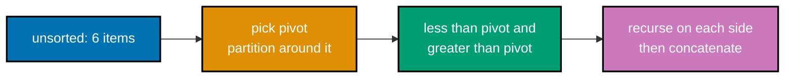

**`learning/code/ex-47-quicksort/example.py`**

```python
"""Example 47: Recursive Quicksort."""


# Partitions around a pivot, recurses on both sides -- O(n log n) average, but O(n^2)
# worst case with a poor pivot choice, e.g. an already-sorted input (co-16, co-17).
def quicksort(items: list[int]) -> list[int]:  # => the recursive driver
    if len(items) <= 1:  # => BASE CASE -- 0 or 1 elements are trivially sorted
        return items  # => nothing to sort
    pivot = items[len(items) // 2]  # => picks a middle element as the pivot
    less = [x for x in items if x < pivot]  # => everything strictly smaller than pivot
    equal = [
        x for x in items if x == pivot
    ]  # => every occurrence of the pivot value itself
    greater = [
        x for x in items if x > pivot
    ]  # => everything strictly larger than pivot
    return (
        quicksort(less) + equal + quicksort(greater)
    )  # => RECURSIVE CASE: sort each part


unsorted = [5, 2, 4, 6, 1, 3]  # => the same fixture as prior sorting examples
result = quicksort(
    unsorted
)  # => partitions around a pivot, then recurses on both sides
print(result)  # => Output: [1, 2, 3, 4, 5, 6]

assert result == sorted(unsorted)  # => confirms the hand-rolled sort matches sorted()
print("ex-47 OK")  # => Output: ex-47 OK
```

**Run**: `python3 example.py`

**Output**:

```text
[1, 2, 3, 4, 5, 6]
ex-47 OK
```

**Key takeaway**: Quicksort's average-case O(n log n) depends entirely on the pivot splitting the data roughly evenly; a poor pivot choice on adversarial input degrades it to O(n²), unlike merge sort's guaranteed worst case.

**Why it matters**: This average-vs-worst-case gap is exactly why merge sort (Example 46) is preferred when worst-case guarantees matter (real-time systems, adversarial input), while quicksort's lower constant factors and in-place partitioning still make it the practical default in many language standard libraries. Example 75's quickselect reuses quicksort's partitioning step directly, without needing a full sort.

---

### Example 48: Build a Binary Tree

_ex-48 &middot; exercises co-10, co-22_

A binary tree is a node with up to two children (`left` and `right`). This example builds a small five-node tree by hand with a `TreeNode` class and confirms its shape with a level-order print (a preview of Example 51's full BFS traversal).

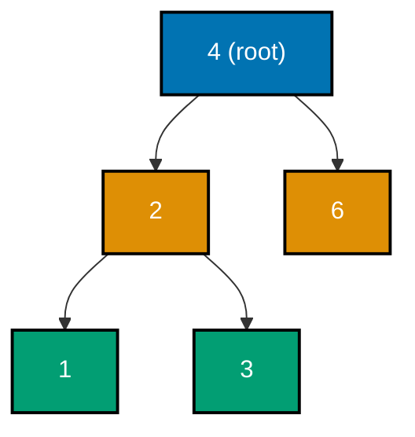

**`learning/code/ex-48-binary-tree-build/example.py`**

```python
"""Example 48: Build a Binary Tree."""

from __future__ import (
    annotations,
)  # => enables forward references to the class defined below
from collections import (
    deque,
)  # => imports the stdlib double-ended queue for the BFS below


class TreeNode:  # => a node with up to two children: left and right (co-10, co-22)
    def __init__(
        self, val: int, left: TreeNode | None = None, right: TreeNode | None = None
    ) -> None:  # => constructor: stores the value plus both optional children
        self.val = val  # => the value stored at this node
        self.left = left  # => reference to the left child, or None
        self.right = right  # => reference to the right child, or None


#        4
#       / \
#      2   6
#     / \
#    1   3
root = TreeNode(
    4, TreeNode(2, TreeNode(1), TreeNode(3)), TreeNode(6)
)  # => builds by hand

level_order: list[int] = []  # => collects values level by level, to eyeball the shape
queue: deque[TreeNode] = deque([root])  # => a queue seeded with just the root
while queue:  # => classic BFS: visit, then enqueue children, until the queue is empty
    node = queue.popleft()  # => dequeues the next node to visit, O(1)
    level_order.append(node.val)  # => records this node's value
    if node.left:  # => a left child exists
        queue.append(node.left)  # => enqueues it for a later visit
    if node.right:  # => a right child exists
        queue.append(node.right)  # => enqueues it for a later visit
print(level_order)  # => Output: [4, 2, 6, 1, 3]

assert level_order == [4, 2, 6, 1, 3]  # => confirms the tree's exact level-order shape
print("ex-48 OK")  # => Output: ex-48 OK
```

**Run**: `python3 example.py`

**Output**:

```text
[4, 2, 6, 1, 3]
ex-48 OK
```

**Key takeaway**: A binary tree is built the same way a linked list is (Example 27) -- individual node objects wired together by references -- just with two child references instead of one `.next`.

**Why it matters**: This is the shape every tree algorithm in this topic's remaining Intermediate and Advanced examples (traversals, height, BST operations, balance checking, LCA) builds directly on -- getting this `TreeNode` shape right here is the foundation for everything that follows it. Getting the constructor's `left`/`right` defaults right here also avoids a common bug in hand-built trees: forgetting to initialize a child to `None` explicitly, which later crashes a traversal the moment it expects a `TreeNode` and finds nothing.

---

### Example 49: Recursive Inorder Traversal

_ex-49 &middot; exercises co-10, co-17_

Inorder traversal visits a binary tree's nodes left-subtree, then node, then right-subtree, recursively. On a binary **search** tree (Example 53) this order happens to yield sorted values, but on a plain binary tree it is simply one of the four standard visit orders. This example traverses Example 48's tree inorder.

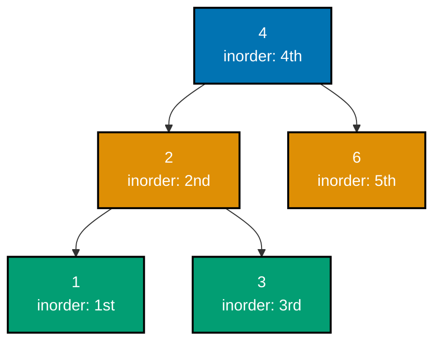

**`learning/code/ex-49-tree-inorder-traversal/example.py`**

```python
"""Example 49: Recursive Inorder Traversal."""

from __future__ import (
    annotations,
)  # => enables forward references to the class defined below


class TreeNode:  # => the same binary-tree node shape as Example 48 (co-10)
    def __init__(
        self, val: int, left: TreeNode | None = None, right: TreeNode | None = None
    ) -> None:  # => constructor: stores the value plus both optional children
        self.val = val  # => the value stored at this node
        self.left = left  # => reference to the left child, or None
        self.right = right  # => reference to the right child, or None


# Visits left, THEN self, THEN right -- depth-first, recursive (co-10, co-17).
def inorder(node: TreeNode | None) -> list[int]:  # => a plain recursive traversal
    if node is None:  # => BASE CASE -- an empty subtree contributes nothing
        return []  # => no values from this branch
    return inorder(node.left) + [node.val] + inorder(node.right)  # => left, self, right


#        4
#       / \
#      2   6
#     / \
#    1   3
root = TreeNode(4, TreeNode(2, TreeNode(1), TreeNode(3)), TreeNode(6))
values = inorder(root)  # => visits 1, 2, 3, 4, 6 -- left subtree, root, right subtree
print(values)  # => Output: [1, 2, 3, 4, 6]

assert values == [1, 2, 3, 4, 6]  # => confirms the exact left-root-right visit order
print("ex-49 OK")  # => Output: ex-49 OK
```

**Run**: `python3 example.py`

**Output**:

```text
[1, 2, 3, 4, 6]
ex-49 OK
```

**Key takeaway**: Inorder traversal recursively visits left, then the current node, then right -- the exact recursive shape (co-17) applied to a tree instead of a linear sequence.

**Why it matters**: This is the traversal order this topic reuses most heavily -- Example 53's BST-sorted-output claim, Example 67's post-delete verification, and Example 68's iterative rewrite all depend on inorder traversal specifically, not preorder or postorder. A file system's directory listing, sorted alphabetically, or a BST's sorted range query both rely on this exact left-root-right order -- getting inorder traversal wrong silently produces a plausible-looking but incorrectly ordered result.

---

### Example 50: Preorder and Postorder Traversals

_ex-50 &middot; exercises co-10, co-17_

Preorder visits node-then-left-then-right; postorder visits left-then-right-then-node. Both are depth-first, just like inorder (Example 49), but they visit the current node at a different point relative to its children. This example traverses the same tree both ways.

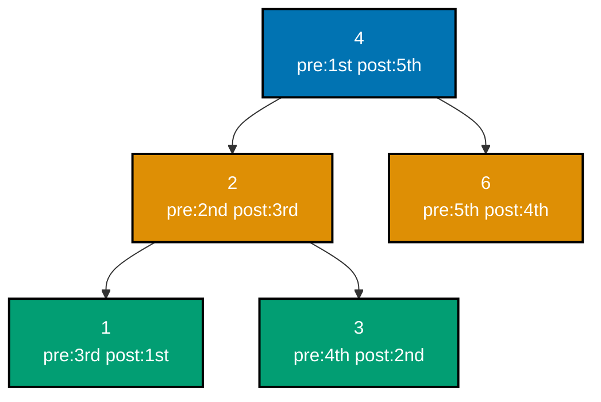

**`learning/code/ex-50-tree-pre-and-post-order/example.py`**

```python
"""Example 50: Preorder and Postorder Traversals."""

from __future__ import (
    annotations,
)  # => enables forward references to the class defined below


class TreeNode:  # => the same binary-tree node shape as Example 48 (co-10)
    def __init__(
        self, val: int, left: TreeNode | None = None, right: TreeNode | None = None
    ) -> None:  # => constructor: stores the value plus both optional children
        self.val = val  # => the value stored at this node
        self.left = left  # => reference to the left child, or None
        self.right = right  # => reference to the right child, or None


# Visits self, THEN left, THEN right (co-10, co-17).
def preorder(node: TreeNode | None) -> list[int]:  # => a plain recursive traversal
    if node is None:  # => BASE CASE -- nothing to visit
        return []  # => no values from this branch
    return (
        [node.val] + preorder(node.left) + preorder(node.right)
    )  # => self, left, right


# Visits left, THEN right, THEN self -- self is visited LAST (co-10, co-17).
def postorder(node: TreeNode | None) -> list[int]:  # => a plain recursive traversal
    if node is None:  # => BASE CASE -- nothing to visit
        return []  # => no values from this branch
    return (
        postorder(node.left) + postorder(node.right) + [node.val]
    )  # => left, right, self


#        4
#       / \
#      2   6
#     / \
#    1   3
root = TreeNode(4, TreeNode(2, TreeNode(1), TreeNode(3)), TreeNode(6))
pre = preorder(root)  # => root first: 4, 2, 1, 3, 6
post = postorder(root)  # => root last: 1, 3, 2, 6, 4
print(pre)  # => Output: [4, 2, 1, 3, 6]
print(post)  # => Output: [1, 3, 2, 6, 4]

assert pre == [
    4,
    2,
    1,
    3,
    6,
]  # => confirms preorder visits the root before its children
assert post == [
    1,
    3,
    2,
    6,
    4,
]  # => confirms postorder visits the root after its children
print("ex-50 OK")  # => Output: ex-50 OK
```

**Run**: `python3 example.py`

**Output**:

```text
[4, 2, 1, 3, 6]
[1, 3, 2, 6, 4]
ex-50 OK
```

**Key takeaway**: Preorder, inorder, and postorder differ only in _when_ the current node is visited relative to its two children -- before both, between them, or after both.

**Why it matters**: Which traversal order to use depends entirely on what you need: preorder is natural for copying/serializing a tree (visit the root before its children exist in the copy), postorder is natural for deleting a tree (children must be freed before their parent), and inorder (Example 49) is the one specific to BSTs producing sorted output.

---

### Example 51: Level-Order (BFS) Traversal, Grouped by Level

_ex-51 &middot; exercises co-10, co-06_

Level-order traversal visits a tree breadth-first -- one whole level at a time -- using a `deque` as the frontier queue (co-06), unlike the three recursive depth-first orders (Examples 49-50). This example traverses the same tree and groups the output by level.

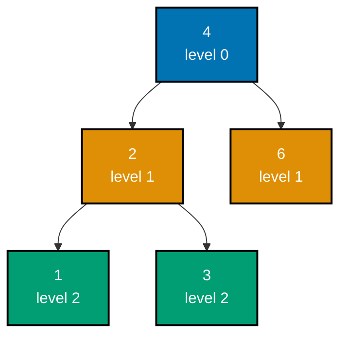

**`learning/code/ex-51-tree-level-order-bfs/example.py`**

```python
"""Example 51: Level-Order (BFS) Traversal, Grouped by Level."""

from __future__ import (
    annotations,
)  # => enables forward references to the class defined below
from collections import (
    deque,
)  # => imports the stdlib double-ended queue used as the BFS frontier


class TreeNode:  # => the same binary-tree node shape as Example 48 (co-10)
    def __init__(
        self, val: int, left: TreeNode | None = None, right: TreeNode | None = None
    ) -> None:  # => constructor: stores the value plus both optional children
        self.val = val  # => the value stored at this node
        self.left = left  # => reference to the left child, or None
        self.right = right  # => reference to the right child, or None


# Breadth-first traversal, one inner list PER DEPTH LEVEL -- a deque as the
# queue gives O(1) popleft, unlike list.pop(0)'s O(n) (co-10, co-06).
def level_order(
    root: TreeNode | None,
) -> list[list[int]]:  # => a queue-driven traversal
    if root is None:  # => an empty tree has zero levels
        return []  # => nothing to traverse
    levels: list[list[int]] = []  # => one entry per depth level, in top-to-bottom order
    queue: deque[TreeNode] = deque([root])  # => FIFO queue seeded with just the root
    while queue:  # => continues until every node has been visited
        level_size = len(
            queue
        )  # => freezes "how many nodes are AT this level right now"
        current_level: list[int] = []  # => collects just this level's values
        for _ in range(level_size):  # => processes exactly this level, not the next one
            node = queue.popleft()  # => O(1): dequeue the next node at this level
            current_level.append(node.val)  # => records this node's value
            if node.left:  # => a left child exists
                queue.append(node.left)  # => enqueue it for the NEXT level
            if node.right:  # => a right child exists
                queue.append(node.right)  # => enqueue it for the NEXT level
        levels.append(current_level)  # => one finished level, added to the result
    return levels  # => the full list-of-lists, one entry per depth


#        4
#       / \
#      2   6
#     / \
#    1   3
root = TreeNode(4, TreeNode(2, TreeNode(1), TreeNode(3)), TreeNode(6))
levels = level_order(root)  # => groups nodes by depth: [4], [2,6], [1,3]
print(levels)  # => Output: [[4], [2, 6], [1, 3]]

assert levels == [
    [4],
    [2, 6],
    [1, 3],
]  # => confirms both the grouping and per-level order
print("ex-51 OK")  # => Output: ex-51 OK
```

**Run**: `python3 example.py`

**Output**:

```text
[[4], [2, 6], [1, 3]]
ex-51 OK
```

**Key takeaway**: Level-order traversal is breadth-first (a queue, level by level), while preorder, inorder, and postorder are all depth-first (recursion, one full branch at a time).

**Why it matters**: This is where Example 8's deque operations and Example 7's queue-based FIFO order come back together on a tree instead of a flat sequence -- level-order traversal is structurally identical to the graph BFS this topic covers next (Example 57), just walking a tree's implicit parent-child edges instead of an explicit adjacency map.

---

### Example 52: Compute Tree Height Recursively

_ex-52 &middot; exercises co-10, co-17_

A tree's height is the number of edges on the longest path from the root to a leaf, computed recursively as `1 + max(height(left), height(right))`, with an empty subtree contributing height 0. This example computes the height of a small unbalanced tree.

**`learning/code/ex-52-tree-height/example.py`**

```python
"""Example 52: Compute Tree Height Recursively."""

from __future__ import (
    annotations,
)  # => enables forward references to the class defined below


class TreeNode:  # => the same binary-tree node shape as Example 48 (co-10)
    def __init__(
        self, val: int, left: TreeNode | None = None, right: TreeNode | None = None
    ) -> None:  # => constructor: stores the value plus both optional children
        self.val = val  # => the value stored at this node
        self.left = left  # => reference to the left child, or None
        self.right = right  # => reference to the right child, or None


# Height = 1 + the taller of the two child subtrees -- an empty tree has height 0 (co-10, co-17).
def height(node: TreeNode | None) -> int:  # => a plain recursive function
    if node is None:  # => BASE CASE -- no node means no height contributed
        return 0  # => the additive identity for the recursion below
    left_height = height(node.left)  # => RECURSIVE CASE: height of the left subtree
    right_height = height(node.right)  # => RECURSIVE CASE: height of the right subtree
    return 1 + max(left_height, right_height)  # => this node + whichever side is taller


#        4
#       / \
#      2   6
#     / \
#    1   3
root = TreeNode(
    4, TreeNode(2, TreeNode(1), TreeNode(3)), TreeNode(6)
)  # => 3 levels deep
tree_height = height(root)  # => 4 -> 2 -> 1 is the longest path, 3 nodes deep
print(tree_height)  # => Output: 3

assert tree_height == 3  # => confirms the height matches the deepest path's node count
assert height(None) == 0  # => confirms an empty tree has height 0
print("ex-52 OK")  # => Output: ex-52 OK
```

**Run**: `python3 example.py`

**Output**:

```text
3
ex-52 OK
```

**Key takeaway**: Tree height is computed bottom-up: each node's height is one more than the taller of its two children's heights, bottoming out at 0 for an empty subtree.

**Why it matters**: Height is the metric Example 69's balance check depends on directly (comparing left and right subtree heights at every node) -- understanding how height is computed here, in isolation, is what makes that later, more elaborate balance-checking algorithm legible. A tree with 1,000 nodes computed naively (recomputing subtree heights from scratch at every node) could cost O(n²) instead of this example's O(n) single pass -- exactly the kind of quadratic blowup Example 69 is careful to avoid.

---

### Example 53: Insert into a Binary Search Tree

_ex-53 &middot; exercises co-11_

A binary search tree (BST) maintains one invariant at every node: everything in the left subtree is smaller, everything in the right subtree is larger. Inserting a new value means recursively descending left or right until an empty slot is found. This example inserts several values and confirms an inorder traversal yields them in sorted order.

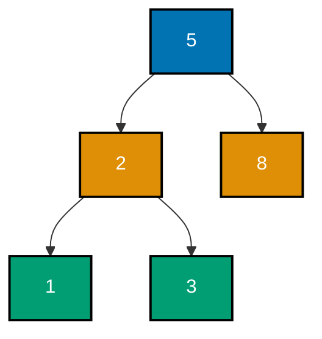

**`learning/code/ex-53-bst-insert/example.py`**

```python
"""Example 53: Insert into a Binary Search Tree."""

from __future__ import (
    annotations,
)  # => enables forward references to the class defined below


class BSTNode:  # => an ordered binary tree: left < node < right, always (co-11)
    def __init__(self, val: int) -> None:  # => constructor: a leaf with no children yet
        self.val = val  # => the value stored at this node
        self.left: BSTNode | None = None  # => no left child yet
        self.right: BSTNode | None = None  # => no right child yet


# Descends left/right by comparison until an empty slot is found -- average O(log n) (co-11).
def insert(root: BSTNode | None, val: int) -> BSTNode:  # => a plain recursive function
    if root is None:  # => BASE CASE -- found the empty slot; this becomes a new leaf
        return BSTNode(val)  # => the newly created leaf becomes this subtree's root
    if val < root.val:  # => smaller values always go left
        root.left = insert(root.left, val)  # => recurse into the left subtree
    else:  # => equal-or-larger values always go right
        root.right = insert(root.right, val)  # => recurse into the right subtree
    return root  # => unchanged subtree root, now with the new value inserted somewhere below


# Inorder traversal of a BST always yields values in SORTED order (co-11).
def inorder(node: BSTNode | None) -> list[int]:  # => a plain recursive traversal
    if node is None:  # => BASE CASE -- nothing to visit
        return []  # => no values from this branch
    return inorder(node.left) + [node.val] + inorder(node.right)  # => left, self, right


root: BSTNode | None = None  # => starts as an empty tree
for value in (5, 2, 8, 1, 3):  # => inserts in arbitrary order
    root = insert(root, value)  # => grows the BST one value at a time
sorted_values = inorder(root)  # => the ordering PROPERTY of a BST, made visible
print(sorted_values)  # => Output: [1, 2, 3, 5, 8]

assert sorted_values == [1, 2, 3, 5, 8]  # => confirms inorder yields sorted order
print("ex-53 OK")  # => Output: ex-53 OK
```

**Run**: `python3 example.py`

**Output**:

```text
[1, 2, 3, 5, 8]
ex-53 OK
```

**Key takeaway**: A BST insert recursively descends left or right based on the value being inserted, and the ordering invariant it maintains is exactly what makes inorder traversal always produce sorted output.

**Why it matters**: This is the first example where a data structure's own invariant _guarantees_ a useful property (sorted inorder output) as a side effect of simply respecting insertion rules -- no separate sorting step is ever needed on a BST, because the structure itself stays sorted by construction. Contrast this against a plain `list`: keeping a list sorted after every insertion costs O(n) per insert to shift elements into place, while a BST's average-O(log n) insert preserves the same always-sorted guarantee far more cheaply.

---

### Example 54: Search a Binary Search Tree

_ex-54 &middot; exercises co-11_

Searching a BST reuses the same left/right descent logic as insertion (Example 53): compare the target against the current node, and descend into whichever subtree could possibly contain it, discarding the other entirely. This example searches for both a present and an absent value.

**`learning/code/ex-54-bst-search/example.py`**

```python
"""Example 54: Search a Binary Search Tree."""

from __future__ import (
    annotations,
)  # => lets BSTNode reference "BSTNode" before fully defined


class BSTNode:  # => the same BST node shape as Example 53 (co-11)
    def __init__(self, val: int) -> None:  # => constructor: a leaf with no children yet
        self.val = val  # => the value stored at this node
        self.left: BSTNode | None = None  # => no left child yet
        self.right: BSTNode | None = None  # => no right child yet


def insert(
    root: BSTNode | None, val: int
) -> BSTNode:  # => same insert as Example 53 (co-11)
    if root is None:  # => BASE CASE -- empty slot found
        return BSTNode(val)  # => becomes the new leaf
    if val < root.val:  # => smaller values go left
        root.left = insert(root.left, val)  # => recurse left
    else:  # => equal-or-larger values go right
        root.right = insert(root.right, val)  # => recurse right
    return root  # => the (possibly updated) subtree root


# Follows the ONE branch that could contain target -- discards the other half (co-11).
def search(node: BSTNode | None, target: int) -> bool:  # => a plain recursive function
    if node is None:  # => fell off the tree without a match -- not present
        return False  # => target does not exist in this subtree
    if node.val == target:  # => found it
        return True  # => target exists at this node
    if target < node.val:  # => target must be smaller
        return search(node.left, target)  # => target can ONLY be in the left subtree
    return search(node.right, target)  # => target can ONLY be in the right subtree


root: BSTNode | None = None  # => starts as an empty tree
for value in (5, 2, 8, 1, 3):  # => builds the same BST as Example 53
    root = insert(root, value)  # => grows the BST one value at a time

found = search(root, 3)  # => 3 was inserted -- present
missing = search(root, 9)  # => 9 was never inserted -- absent
print(found)  # => Output: True
print(missing)  # => Output: False

assert found is True  # => confirms a present value is found
assert missing is False  # => confirms an absent value is correctly reported missing
print("ex-54 OK")  # => Output: ex-54 OK
```

**Run**: `python3 example.py`

**Output**:

```text
True
False
ex-54 OK
```

**Key takeaway**: BST search discards half the remaining tree at every comparison, the same way binary search (Example 31) discards half the remaining range -- both are average-O(log n) for the identical reason.

**Why it matters**: This is the direct tree analogue of binary search on a sorted array: a BST's ordering invariant is what lets each comparison eliminate an entire subtree, exactly as a sorted array's ordering lets binary search eliminate half the remaining range. On a balanced BST of a million nodes, that means roughly 20 comparisons to confirm a value is present or absent, versus up to a million comparisons for the same check against an unsorted list.

---

### Example 55: BST Minimum and Maximum

_ex-55 &middot; exercises co-11_

A BST's minimum value is always the leftmost node (keep following `.left` until it's `None`); the maximum is always the rightmost node (keep following `.right`). This example finds both on the same tree Example 53 built.

**`learning/code/ex-55-bst-min-max/example.py`**

```python
"""Example 55: BST Minimum and Maximum."""

from __future__ import (
    annotations,
)  # => enables forward references to the class defined below


class BSTNode:  # => the same BST node shape as Example 53 (co-11)
    def __init__(self, val: int) -> None:  # => constructor: a leaf with no children yet
        self.val = val  # => the value stored at this node
        self.left: BSTNode | None = None  # => no left child yet
        self.right: BSTNode | None = None  # => no right child yet


def insert(
    root: BSTNode | None, val: int
) -> BSTNode:  # => same insert as Example 53 (co-11)
    if root is None:  # => BASE CASE -- empty slot found
        return BSTNode(val)  # => becomes the new leaf
    if val < root.val:  # => smaller values go left
        root.left = insert(root.left, val)  # => recurse left
    else:  # => equal-or-larger values go right
        root.right = insert(root.right, val)  # => recurse right
    return root  # => the (possibly updated) subtree root


# The minimum is always the LEFTMOST node -- keep walking left until it stops (co-11).
def find_min(node: BSTNode) -> int:  # => an iterative walk, no recursion needed
    while node.left is not None:  # => every left step reaches a smaller value
        node = node.left  # => keep descending left
    return node.val  # => no more left children -- this IS the smallest value


# The maximum is always the RIGHTMOST node -- keep walking right until it stops (co-11).
def find_max(node: BSTNode) -> int:  # => an iterative walk, no recursion needed
    while node.right is not None:  # => every right step reaches a larger value
        node = node.right  # => keep descending right
    return node.val  # => no more right children -- this IS the largest value


root: BSTNode | None = None  # => starts as an empty tree
for value in (5, 2, 8, 1, 3):  # => builds the same BST as Example 53
    root = insert(root, value)  # => grows the BST one value at a time
assert root is not None  # => the loop above always inserts at least one node

smallest = find_min(root)  # => walks left: 5 -> 2 -> 1, stops at 1
largest = find_max(root)  # => walks right: 5 -> 8, stops at 8
print(smallest, largest)  # => Output: 1 8

assert smallest == 1  # => confirms the leftmost node holds the true minimum
assert largest == 8  # => confirms the rightmost node holds the true maximum
print("ex-55 OK")  # => Output: ex-55 OK
```

**Run**: `python3 example.py`

**Output**:

```text
1 8
ex-55 OK
```

**Key takeaway**: A BST's minimum and maximum are found by walking all the way left or all the way right respectively -- no comparison against every node is needed, unlike an unordered structure.

**Why it matters**: This is a direct payoff of the BST invariant Example 53 introduced: because everything left of a node is smaller and everything right is larger, the extremes are always at the structural edges, findable in O(h) (tree height) instead of scanning every single node. A production use case -- finding the cheapest or most expensive item in a price-indexed BST -- never needs to inspect every stored value, just walk one edge of the tree, which is a meaningful savings once the tree holds millions of entries.

---

### Example 56: Build a Graph as a Dict-of-Lists Adjacency Map

_ex-56 &middot; exercises co-21, co-08_

A graph is represented here as a **dict-of-lists adjacency map**: each key is a node, and its value is the list of nodes it connects to. This example builds a small four-node graph and prints each node's neighbors.

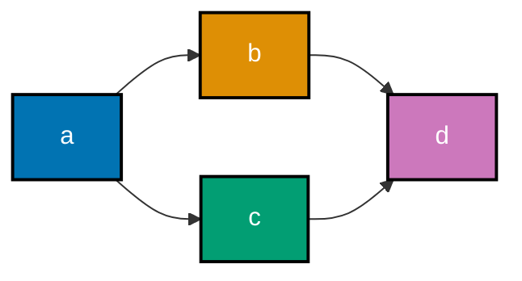

**`learning/code/ex-56-graph-adjacency-build/example.py`**

```python
"""Example 56: Build a Graph as a Dict-of-Lists Adjacency Map."""

# A dict-of-lists is the simplest general-purpose graph representation: each
# key is a node, each value is the list of its neighbors (co-21, co-08).
graph: dict[str, list[str]] = {  # => a 4-node, undirected-by-convention graph literal
    "a": ["b", "c"],  # => "a" connects to "b" and "c"
    "b": ["a", "d"],  # => "b" connects back to "a", plus "d"
    "c": ["a", "d"],  # => "c" connects back to "a", plus "d"
    "d": ["b", "c"],  # => "d" connects back to "b" and "c" -- a 4-node cycle
}  # => four keys total, each mapping to its own neighbor list

for (
    node,
    neighbors,
) in graph.items():  # => dict iteration is insertion-ordered (Python 3.7+)
    print(f"{node}: {neighbors}")  # => Output: one "node: [...]" line per graph key

assert graph["a"] == [
    "b",
    "c",
]  # => confirms a's neighbor list matches what was declared
assert "a" in graph["b"]  # => confirms the edge a-b is represented in BOTH directions
print("ex-56 OK")  # => Output: ex-56 OK
```

**Run**: `python3 example.py`

**Output**:

```text
a: ['b', 'c']
b: ['a', 'd']
c: ['a', 'd']
d: ['b', 'c']
ex-56 OK
```

**Key takeaway**: A dict-of-lists adjacency map represents a graph as "node -> its neighbors," the one representation every graph algorithm in this topic (BFS, DFS, Dijkstra, topological sort, cycle detection) builds directly on top of.

**Why it matters**: This representation is the graph analogue of the linked list's node-and-pointer shape (co-07) -- instead of one `.next` reference per node, each node has a _list_ of neighbor references, which is exactly what lets a node connect to more than one other node. Social networks, road maps, and dependency graphs (this topic's own capstone included) all reach for exactly this shape -- a small, flat dict of neighbor lists scales to millions of edges without needing a dedicated graph database.

---

### Example 57: Breadth-First Search over a Graph

_ex-57 &middot; exercises co-21, co-05, co-09_

Breadth-first search (BFS) explores a graph level by level, using a `deque`-backed queue (co-05, co-06) to visit nodes in the order they were first discovered, and a `set` (co-09) to avoid re-visiting the same node twice. This example runs BFS from one node across Example 56's graph.


**`learning/code/ex-57-graph-bfs/example.py`**

```python
"""Example 57: Breadth-First Search over a Graph."""

# BFS explores neighbor-by-neighbor, level by level, using a deque as the
# frontier queue and a set to avoid revisiting nodes (co-21, co-05, co-09).
from collections import (
    deque,
)  # => imports the stdlib double-ended queue as the frontier

graph: dict[str, list[str]] = {  # => the same 4-node graph as Example 56
    "a": ["b", "c"],  # => a's neighbors
    "b": ["a", "d"],  # => b's neighbors
    "c": ["a", "d"],  # => c's neighbors
    "d": ["b", "c"],  # => d's neighbors
}  # => four keys total, each mapping to its own neighbor list


# Visits start, then all its neighbors, then all of THEIR unvisited neighbors, ...
def bfs(
    graph: dict[str, list[str]], start: str
) -> list[str]:  # => a plain BFS function
    visited: set[str] = {
        start
    }  # => tracks every node already enqueued -- O(1) membership
    order: list[str] = []  # => records the order nodes are actually VISITED (dequeued)
    queue: deque[str] = deque([start])  # => the frontier, FIFO
    while queue:  # => continues until the frontier is empty
        node = queue.popleft()  # => O(1): visit the earliest-enqueued node
        order.append(node)  # => records the visit
        for neighbor in graph[node]:  # => looks at every edge out of this node
            if neighbor not in visited:  # => O(1) average -- skip already-seen nodes
                visited.add(
                    neighbor
                )  # => mark BEFORE enqueueing to avoid duplicate enqueues
                queue.append(neighbor)  # => schedules the neighbor for a later visit
    return order  # => the full breadth-first visit order


visit_order = bfs(graph, "a")  # => a -> its neighbors b,c -> their unvisited neighbor d
print(visit_order)  # => Output: ['a', 'b', 'c', 'd']

assert visit_order == [
    "a",
    "b",
    "c",
    "d",
]  # => confirms the exact breadth-first visit order
assert len(visit_order) == len(graph)  # => confirms every node was visited exactly once
print("ex-57 OK")  # => Output: ex-57 OK
```

**Run**: `python3 example.py`

**Output**:

```text
['a', 'b', 'c', 'd']
ex-57 OK
```

**Key takeaway**: BFS uses a queue to explore nearest neighbors first, level by level, and a visited set to guarantee every node is processed exactly once.

**Why it matters**: This is the graph generalization of Example 51's level-order tree traversal -- the same queue-driven, level-by-level discipline, just walking an explicit adjacency map instead of a tree's implicit parent-child edges. BFS's level-by-level order is also exactly what guarantees Example 59's shortest-path length is correct on unweighted graphs. A production crawler exploring a website's link graph, or a social network suggesting "friends of friends," both rely on this same discipline: visit nearest connections first, mark them seen immediately, and never re-process a node twice.

---

### Example 58: Depth-First Search over a Graph

_ex-58 &middot; exercises co-21, co-17, co-09_

Depth-first search (DFS) explores a graph as deep as possible along one branch before backtracking, most naturally expressed recursively (co-17), with the same visited-`set` bookkeeping as BFS (Example 57) to avoid infinite loops on cyclic graphs. This example runs DFS from the same starting node.

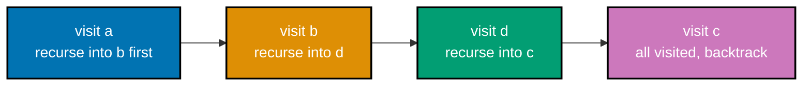

**`learning/code/ex-58-graph-dfs/example.py`**

```python
"""Example 58: Depth-First Search over a Graph."""

# DFS plunges as deep as possible down ONE path before backtracking -- the
# recursive call stack itself acts as the "stack" (co-21, co-17, co-09).
graph: dict[str, list[str]] = {  # => the same 4-node graph as Example 56
    "a": ["b", "c"],  # => a's neighbors
    "b": ["a", "d"],  # => b's neighbors
    "c": ["a", "d"],  # => c's neighbors
    "d": ["b", "c"],  # => d's neighbors
}  # => four keys total, each mapping to its own neighbor list


# Visits node, then recurses fully into the FIRST unvisited neighbor before any other.
def dfs(
    graph: dict[str, list[str]], node: str, visited: set[str], order: list[str]
) -> None:
    visited.add(node)  # => marks node as seen -- prevents infinite loops on cycles
    order.append(node)  # => records visit order for inspection
    for neighbor in graph[node]:  # => tries each neighbor in listed order
        if neighbor not in visited:  # => O(1) average membership check
            dfs(
                graph, neighbor, visited, order
            )  # => RECURSIVE CASE: plunge deeper first


visited: set[str] = (
    set()
)  # => shared across the whole traversal via the same set object
order: list[str] = []  # => shared across the whole traversal via the same list object
dfs(
    graph, "a", visited, order
)  # => a -> b (first neighbor) -> d (b's unvisited neighbor) -> c
print(order)  # => Output: ['a', 'b', 'd', 'c']

assert order == ["a", "b", "d", "c"]  # => confirms the exact depth-first visit order
assert visited == {"a", "b", "c", "d"}  # => confirms every node was eventually visited
print("ex-58 OK")  # => Output: ex-58 OK
```

**Run**: `python3 example.py`

**Output**:

```text
['a', 'b', 'd', 'c']
ex-58 OK
```

**Key takeaway**: DFS dives deep along one branch before backtracking, in contrast to BFS's level-by-level breadth -- both visit every reachable node exactly once, just in a different order.

**Why it matters**: BFS and DFS visiting the same graph in different orders (compare this example's output against Example 57's) is a concrete, observable demonstration that "traverse every node" has more than one valid strategy, and the strategy you pick changes which node you discover first -- which matters directly for Example 73's DFS-based cycle detection.

---

### Example 59: BFS Shortest-Path Length in an Unweighted Graph

_ex-59 &middot; exercises co-21, co-05_

On an **unweighted** graph, BFS's level-by-level exploration order directly gives the shortest path length between two nodes: the level at which a node is first discovered is exactly its distance from the start. This example finds the shortest-path length between two nodes in Example 56's graph.

**`learning/code/ex-59-graph-bfs-shortest-path/example.py`**

```python
"""Example 59: BFS Shortest-Path Length in an Unweighted Graph."""

# BFS's level-by-level nature means the FIRST time a node is reached, it was
# reached by the shortest possible number of edges -- unweighted only (co-21, co-05).
from collections import (
    deque,
)  # => imports the stdlib double-ended queue as the frontier

graph: dict[str, list[str]] = {  # => a 5-node graph, one edge longer than Example 57's
    "a": ["b", "c"],  # => a's neighbors
    "b": ["a", "d"],  # => b's neighbors
    "c": ["a", "d"],  # => c's neighbors
    "d": ["b", "c", "e"],  # => d's neighbors
    "e": ["d"],  # => e's only neighbor
}  # => five keys total, each mapping to its own neighbor list


# Tracks each node's distance from start, discovered in non-decreasing order via BFS.
def shortest_path_length(graph: dict[str, list[str]], start: str, end: str) -> int:
    distances: dict[str, int] = {start: 0}  # => start is 0 edges from itself
    queue: deque[str] = deque([start])  # => the frontier, FIFO
    while queue:  # => continues until the frontier is empty or end is reached
        node = queue.popleft()  # => O(1): visit the earliest-enqueued node
        if (
            node == end
        ):  # => the FIRST time end is dequeued, its distance is final and minimal
            return distances[node]  # => the shortest number of edges from start to end
        for neighbor in graph[node]:  # => looks at every edge out of this node
            if (
                neighbor not in distances
            ):  # => first discovery -- distance can only get worse later
                distances[neighbor] = (
                    distances[node] + 1
                )  # => one edge farther than node
                queue.append(neighbor)  # => schedules the neighbor for a later visit
    return -1  # => end was never reached -- no path exists (not hit in this example)


distance = shortest_path_length(
    graph, "a", "e"
)  # => a -> b/c (1 edge) -> d (2 edges) -> e (3)
print(distance)  # => Output: 3

assert distance == 3  # => confirms the shortest a-to-e path uses exactly 3 edges
print("ex-59 OK")  # => Output: ex-59 OK
```

**Run**: `python3 example.py`

**Output**:

```text
3
ex-59 OK
```

**Key takeaway**: BFS's level-by-level order makes it the correct tool for unweighted shortest-path length -- the discovery level _is_ the distance, with no separate distance-tracking algorithm needed.

**Why it matters**: This is BFS's single most important practical application, and it sets up the direct contrast with Example 71's Dijkstra: BFS's "level = distance" trick only works because every edge here costs exactly 1 -- the instant edges have different weights, plain BFS breaks, which is exactly the problem Dijkstra's heap-based approach solves.

---

### Example 60: Maximum Sum of a Length-k Sliding Window

_ex-60 &middot; exercises co-20_

Finding the maximum sum of any length-k contiguous window in a list can be done in a single O(n) pass: compute the first window's sum, then slide the window one step at a time, subtracting the element that leaves and adding the element that enters -- instead of recomputing each window's sum from scratch.

**`learning/code/ex-60-sliding-window-max-sum/example.py`**

```python
"""Example 60: Maximum Sum of a Length-k Sliding Window."""


# Slides a fixed-size window, updating the sum incrementally -- O(n),
# instead of re-summing each window from scratch, which would be O(n*k) (co-20).
def max_window_sum(
    values: list[int], k: int
) -> int:  # => a plain sliding-window function
    window_sum = sum(values[:k])  # => O(k): the sum of the FIRST window only
    best = window_sum  # => tracks the best sum seen so far
    for i in range(k, len(values)):  # => slides the window one element at a time
        window_sum += (
            values[i] - values[i - k]
        )  # => add the new element, drop the old one
        # => this single O(1) update replaces re-summing k elements from scratch
        best = max(best, window_sum)  # => keep the running maximum
    return best  # => the maximum window sum found across every position


numbers = [2, 1, 5, 1, 3, 2]  # => 6 values; window size 3
result = max_window_sum(
    numbers, 3
)  # => windows: [2,1,5]=8, [1,5,1]=7, [5,1,3]=9, [1,3,2]=6
print(result)  # => Output: 9

assert result == 9  # => confirms the best window (index 2..4: 5+1+3) was found
print("ex-60 OK")  # => Output: ex-60 OK
```

**Run**: `python3 example.py`

**Output**:

```text
9
ex-60 OK
```

**Key takeaway**: A sliding window updates its running sum in O(1) per step (subtract-out, add-in) instead of recomputing the whole window's sum each time, turning an O(n \* k) approach into O(n).

**Why it matters**: This is this topic's first full sliding-window example (co-20), and the "update incrementally instead of recomputing" insight it teaches generalizes directly to Example 77's variable-size window for the longest-substring problem later in this topic. A monitoring dashboard computing "busiest 5-minute window in the last hour" over a stream of per-minute counts uses exactly this incremental update -- recomputing every window from scratch would turn an O(n) scan into a much slower O(n\*k) one.

---

← Previous: [Beginner Examples](./beginner.md) · Next: [Advanced Examples](./advanced.md) →
