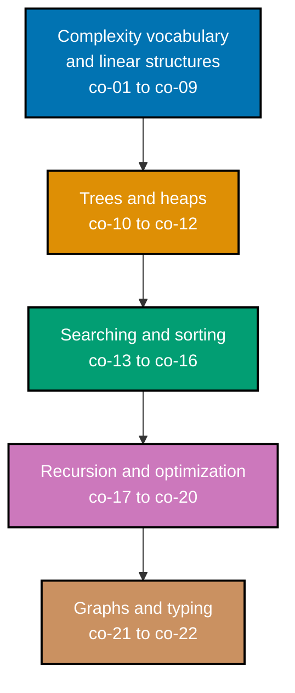

## Prerequisites

- **Prior topics**: [4 · Just Enough Python](../../just-enough-python/learning/overview.md) -- every
  example in this topic is a complete Python module, and this topic assumes you can already read and
  write functions, `list`/`dict`/`set` literals, and loops the way that primer taught them.
- **Tools & environment**: a macOS/Linux terminal; **Python 3.x** installed (`python3 --version`); a
  `venv` with `pytest` installed for the capstone's test suite. No third-party packages are needed for
  any of the 82 learning examples -- every one of them uses only the standard library
  (`collections`, `heapq`, `bisect`, `functools`).
- **Assumed knowledge**: basic Python syntax and the four built-in collections from Just Enough
  Python. No prior algorithms background is required -- this topic is where that background starts.

## Why this exists -- the big idea

The problem before the solution: the same task can run instantly or crawl depending on how you store
the data -- choosing the wrong structure is a bug you only feel at scale, long after the code first
"worked." The one idea worth keeping if you forget everything else: **pick the structure that makes
the common operation cheap** -- the data-structure choice is the real decision, and the algorithm you
reach for often follows directly from it.

**Cross-cutting big ideas, taught here and then reused for the rest of this topic**: `co-01
big-o-notation` is the vocabulary every other concept in this topic is described with -- "O(1)
lookup," "O(n log n) sort," "O(n²) worst case" all mean nothing without it, so it comes first and gets
its own worked examples (9, 24, 61, 80) before anything else leans on it. `co-02 amortized-analysis`
is the reason a single expensive step (growing a `list`'s backing array) does not make every
`.append()` call expensive -- it is the cost model every "O(1) average" and "O(1) amortized" claim in
this topic's Concepts section quietly depends on, and Example 1 makes it concrete on the very first
worked example. `co-22 static-type-hints` is not confined to its own two examples (25, 26) -- every
single one of the 82 `.py` files in this topic annotates its parameters and return types, so this
concept is really taught by osmosis across the entire topic, not just in the two examples that name
it directly.

`abstraction-and-its-cost` is this topic's other cross-cutting idea: every structure below trades one
operation's cost for another. A hash map (`dict`) buys O(1) average lookup and charges you ordering; a
plain list buys insertion order and charges you O(n) search; a heap buys O(log n) access to the
smallest element and charges you the ability to peek cheaply at anything else. Nothing here is free --
the skill this topic teaches is knowing exactly which cost you are choosing to pay, and why.

## Install and run your first example

Confirm Python 3 is installed:

```text
$ python3 --version
Python 3.14.3
```

**A note on versions**: this topic's examples were authored and verified against CPython **3.14.3**,
the version installed in the sandbox that produced every captured "Output" block on this site.
[python.org](https://www.python.org/downloads/release/python-3146/) lists **3.14.6** (2026-06-10) as
the current published patch release at authoring time -- any 3.14.x patch behaves identically for
everything this topic teaches (the `heapq`, `collections.deque`, and `bisect` standard-library
surfaces used here are stable across 3.14 patch releases).

Every example in this topic is a complete, self-contained `.py` file colocated under
`learning/code/`. The command you will run for every one of them is exactly this:

```text
python3 example.py
```

Each example prints its own result and then finishes with a bare `assert` confirming the result is
correct -- a silent, zero-output exit (return code `0`) means every assertion passed. `python3
example.py; echo $?` is a quick way to confirm both the printed output and the exit code in one line.

## How this topic's examples are organized

- **Beginner** (Examples 1-28) -- the array-backed `list` and its cost model, using a `list` as a
  stack, `collections.deque` as a queue and double-ended queue, `dict` and `set` for average-O(1)
  lookup and membership, linear search, the built-in `sorted()`, first recursion, first Big-O
  measurement, first type hints, and the first node-based structure (a singly linked list).
- **Intermediate** (Examples 29-60) -- linked-list algorithms (reverse, find-the-middle), binary
  search and the `bisect` module, `heapq`-based heaps and priority queues, the classic comparison sorts
  (insertion, selection, bubble, merge, quick), binary trees and their four traversal orders, binary
  search trees, and graph traversal (BFS and DFS over a dict-of-lists adjacency map).
- **Advanced** (Examples 61-82) -- memoization (naive vs. dict-cached vs. `functools.lru_cache` vs.
  iterative Fibonacci, memoized coin-change and grid-path counting), the harder BST operations
  (deletion, iterative traversal, balance checking, lowest common ancestor), weighted-graph algorithms
  (Dijkstra, Kahn's topological sort, DFS-based cycle detection), the heap-based merge of k sorted
  lists, quickselect, two-pointer and sliding-window techniques, an LRU cache built from scratch with a
  `dict` plus a doubly linked list, a prefix trie, an empirical Big-O measurement, a stable multi-key
  sort, and converting deep recursion to iteration to avoid `RecursionError`.

Every example cites the concept (`co-NN`) it exercises, and every accuracy claim about Python's
version and the standard library's time complexities traces to `docs.python.org` and the
CPython-endorsed [wiki.python.org TimeComplexity](https://wiki.python.org/moin/TimeComplexity) page,
web-verified 2026-07-12 and re-confirmed 2026-07-14.



## Concepts

Every worked example in this topic's follow-up pages cites the `co-NN` concept it exercises -- this
section is the 1:1 reference those citations point back to. Read it in order: complexity vocabulary
comes first because every later concept is described in its terms.

### co-01 · Big-O Notation

Big-O notation describes how an algorithm's cost grows as its input size grows, independent of any
one machine's speed: O(1) constant, O(log n) logarithmic, O(n) linear, O(n log n) linearithmic, and
O(n²) quadratic are the growth rates this topic uses repeatedly. It answers exactly one question --
"does this scale?" -- and nothing else; two O(n) algorithms can still have very different real-world
constants.

**Why it matters**: every other concept in this topic's Concepts section states a Big-O cost as part
of its own definition -- "average-O(1) `dict` lookup," "O(log n) heap push," "O(n log n) Timsort" --
so without this vocabulary, none of those claims mean anything concrete.

**Verify it**: Example 24 measures the step count of a `dict` lookup versus a `list` scan as the
input grows, and Example 80 measures linear-search versus binary-search step counts as `n` doubles --
both print the observed counts rather than merely asserting a formula.

### co-02 · Amortized Analysis

Some operations are cheap on average even when an occasional individual step is costly: `list.append`
is **amortized O(1)** because Python occasionally reallocates a larger backing array, but that
reallocation happens rarely enough (roughly doubling capacity each time) that the _average_ cost per
append across many calls stays O(1). `dict` and `set` operations average O(1) the same way, for a
different reason (hashing, not resizing).

**Why it matters**: without amortized analysis, "`list.append` is O(1)" looks false the instant you
watch one particular call trigger a resize and take longer than its neighbors -- amortized analysis is
what reconciles "some individual calls are slower" with "the operation is still O(1) on average."

**Verify it**: Example 1 builds a `list[int]` purely with `.append()` calls and verifies the final
length and last element via `assert` -- the cost model behind that single line of code is exactly this
concept.

### co-03 · Dynamic Array

Python's `list` is a growable, contiguous array: indexing (`lst[i]`) is O(1) because the underlying
memory is one contiguous block, and appending at the end is amortized O(1) (co-02). Inserting or
deleting at the **front** is O(n), because every remaining element has to shift over by one slot.

**Why it matters**: this is the structure almost every other example in this topic either builds on or
explicitly contrasts against (a linked list, a deque, a heap) -- knowing exactly which operations are
cheap and which are expensive on a plain `list` is the baseline the rest of the topic measures
everything else by.

**Verify it**: Examples 1-4 exercise append, index, slicing, and both in-place (`.reverse()`) and
copying (`[::-1]`) reversal on a `list[int]`; Example 9 directly contrasts a `list`'s O(n)
`.pop(0)` against a `deque`'s O(1) `.popleft()` on the same data.

### co-04 · Stack

A stack is a last-in-first-out (LIFO) structure: the most recently added element is the first one
removed. Python needs no dedicated stack type -- `list.append()` (push) and `list.pop()` (pop, no
argument) both operate on the list's **end**, which is exactly where a stack's O(1) operations belong.

**Why it matters**: LIFO order shows up constantly -- undo histories, function call stacks (co-17),
matching balanced delimiters, and depth-first traversal (co-17, co-21) all reduce to "the last thing I
saw is the first thing I need back."

**Verify it**: Example 5 pushes and pops integers and asserts the LIFO order directly; Example 6 uses a
stack to check bracket balance, asserting `"(())"` is balanced and `"(()"` is not; Example 68 replaces
a _recursive_ traversal's implicit call stack with an _explicit_ `list`-as-stack, and asserts both
produce identical output.

### co-05 · Queue

A queue is a first-in-first-out (FIFO) structure: the first element added is the first one removed.
Unlike a stack, a plain `list` is a poor fit for a queue's "remove from the front" operation --
`list.pop(0)` is O(n) because it re-shifts every remaining element. `collections.deque` provides O(1)
`popleft()` instead.

**Why it matters**: FIFO order is exactly the discipline breadth-first search (co-21) and Kahn's
topological sort (this topic's Example 72) both depend on -- a queue is what guarantees "process
things in the order you discovered them," which is precisely what makes BFS explore level by level.

**Verify it**: Example 7 enqueues and dequeues with `deque.append`/`popleft` and asserts FIFO order;
Example 9 directly times and contrasts `list.pop(0)`'s O(n) cost against `deque.popleft`'s O(1) cost on
identical input.

### co-06 · Deque

A double-ended queue (deque) supports O(1) push and pop at **both** ends -- `append`/`appendleft` and
`pop`/`popleft` -- unlike a `list`, which is only O(1) at the end and O(n) at the front. Python's
`collections.deque` is a doubly linked block structure purpose-built for this.

**Why it matters**: a deque generalizes both a stack (use one end) and a queue (use both ends), so it
is the single structure this topic reaches for whenever an algorithm needs O(1) access at either
boundary of a sequence -- level-order tree traversal (Example 51) is exactly that case.

**Verify it**: Example 8 exercises `appendleft`/`append`/`pop`/`popleft` on one `deque[int]` and
asserts the resulting order; Example 51 uses a `deque` as the BFS frontier for level-order tree
traversal.

### co-07 · Singly Linked List

A singly linked list is a node-based sequence: each `Node` holds a value (`val`) and a reference to
the next node (`next`), with the list itself just being a reference to the first node (or `None` for
an empty list). Unlike a `list`'s contiguous array, insertion at the **head** is O(1) (no shifting),
but random access and traversal are both O(n) (no direct indexing -- you have to walk node by node).

**Why it matters**: this is the array's structural opposite, and contrasting the two directly is what
makes each one's cost tradeoffs concrete -- an array trades O(1) index access for O(n) front-insertion;
a linked list trades exactly the reverse.

**Verify it**: Example 27 builds a `Node`-based list and traverses it to print every value in order;
Example 28 counts nodes by traversal; Example 29 reverses one iteratively; Example 78's LRU cache pairs
a _doubly_ linked list (the two-way generalization of this concept) with a `dict` for O(1) reordering.

### co-08 · Hash Map

`dict` gives average-O(1) keyed insert, lookup, and delete by hashing each key to a bucket. Unlike a
binary search tree (co-11), a `dict` is **not** key-sorted -- but Python 3.7+ guarantees
**insertion-order iteration** as a language-specification guarantee, not merely a CPython
implementation detail, so iterating a `dict` always visits keys in the order they were first set
(updates never move a key's position).

**Why it matters**: this is the single most-used structure in this entire topic for the "have I seen
this before, and what did I learn about it" pattern -- frequency counting, memoization caches (co-19),
graph adjacency maps (co-21), and the two-sum problem (Example 14) all reduce to exactly that
question, answered in average-O(1) instead of the O(n) a linear scan would cost.

**Verify it**: Example 10 looks up a present and an absent key via `.get`; Example 14 solves two-sum
in a single O(n) pass using a `dict` instead of a nested O(n²) scan; Example 71 (Dijkstra) prints a
`dict`'s iteration order and asserts it reflects each key's _first-set_ order, exactly as this concept
states.

### co-09 · Hash Set

`set` gives average-O(1) membership testing (`in`) and automatic deduplication, using the same hashing
mechanism as `dict` but storing only keys, no values. Unlike a sorted structure, a `set` has no
defined iteration order at all.

**Why it matters**: "have I already visited this?" is a question that recurs across this entire
topic's graph algorithms (co-21) and sliding-window techniques (co-20) -- a `set` answers it in
average-O(1), which is exactly what keeps a BFS or DFS traversal from re-visiting (and potentially
infinitely looping on) the same node twice.

**Verify it**: Example 12 tests `in` on a `set[int]` and asserts both a present and an absent value;
Example 13 deduplicates a `list[int]` via `set()` and asserts the resulting unique count; Example 57's
graph BFS and Example 58's graph DFS both use a `set[str]` to track visited nodes.

### co-10 · Binary Tree

A binary tree is a node with up to two children (`left` and `right`). Four traversal orders visit its
nodes in different sequences: preorder (node, then left, then right), inorder (left, then node, then
right), postorder (left, then right, then node) -- all three depth-first -- and level-order
(breadth-first, level by level, using a queue).

**Why it matters**: a binary tree is the shape underneath both the binary search tree (co-11, an
_ordered_ binary tree) and the heap (co-12, a _priority-ordered_ binary tree) -- understanding plain
traversal first is what makes both of those specializations legible instead of magical.

**Verify it**: Example 48 builds a `TreeNode`-based tree; Example 49 traverses it inorder recursively;
Example 50 traverses it both preorder and postorder; Example 51 traverses it level-order (breadth-
first) with a `deque`; Example 52 computes its height recursively.

### co-11 · Binary Search Tree

A binary search tree (BST) is an ordered binary tree: every node's left subtree holds only smaller
values, and its right subtree holds only larger values. That single invariant is what makes an
**inorder traversal always yield values in sorted order**, and gives average-O(log n) insert, search,
and delete -- though a poorly balanced BST (say, built from already-sorted input) degrades to O(n),
looking exactly like a linked list.

**Why it matters**: a BST is the structure that lets you keep data both sorted _and_ efficiently
mutable at the same time -- a plain sorted `list` is O(n) to insert into (co-03), while a BST is
average-O(log n), at the cost of extra pointer overhead per node and the risk of degrading when
unbalanced.

**Verify it**: Example 53 inserts values and asserts an inorder traversal yields sorted output;
Example 54 asserts both a found and a not-found search; Example 55 asserts the leftmost (minimum) and
rightmost (maximum) nodes; Example 67 deletes two nodes in sequence, covering all three deletion cases
(leaf, one child, two children) across the pair, and re-asserts the inorder invariant still holds
afterward.

### co-12 · Heap / Priority Queue

`heapq` maintains a binary **min-heap** directly over a plain `list`, giving O(log n) push
(`heappush`) and O(log n) pop-of-the-minimum (`heappop`) -- the basis of a priority queue, where the
"highest priority" item is always the one that pops next. Python only ships a min-heap; a max-heap is
simulated by negating values on the way in and out (Example 41), and tuples let you push
`(priority, item)` pairs so the tuple's first field controls pop order (Example 40).

**Why it matters**: whenever "give me the smallest (or, via negation, largest) thing I've seen so far,
repeatedly, as the collection keeps changing" is the question, a heap answers it in O(log n) per
operation -- compare that to re-sorting the whole collection (O(n log n)) every single time something
changes, which is what you would otherwise be forced to do.

**Verify it**: Example 37 pushes integers and pops them back in ascending order; Example 38 turns an
existing `list` into a valid heap in place with `heapq.heapify`; Example 71 (Dijkstra) and Example 74
(merge k sorted lists) both use a heap as their core engine, not just a demonstration.

### co-13 · Linear Search

Linear search scans a sequence element by element, in O(n), stopping the moment it finds a match (or
exhausting the whole sequence if it never does). It is the **only** option on unsorted data -- there
is no way to skip ahead without first knowing the data is ordered.

**Why it matters**: linear search is the baseline every "smarter" search technique in this topic (co-14
binary search, co-08 hash-map lookup) is explicitly compared against -- without it as a reference
point, "binary search is faster" and "hash lookup is O(1) instead of O(n)" would have nothing concrete
to be faster _than_.

**Verify it**: Example 15 scans a `list[int]` for a present value and asserts the correct index;
Example 16 scans for a missing value and asserts `-1`; Example 80 measures linear search's step count
growing in exact proportion to `n` as `n` doubles.

### co-14 · Binary Search

Binary search halves a **sorted** range on every step, giving O(log n) lookup instead of linear
search's O(n) -- check the midpoint, and discard the half of the range that cannot possibly contain
the target. The `bisect` module provides the same logarithmic search plus **sorted-insertion-point**
queries (`bisect_left`) and in-place sorted insertion (`insort`).

**Why it matters**: this is the single biggest complexity win a sorted precondition buys you in this
entire topic -- O(log n) instead of O(n) is the difference between roughly 20 comparisons and roughly
one million, on a million-element sorted list.

**Verify it**: Example 31 finds a target's index; Example 32 confirms a missing value returns `-1`;
Examples 33-34 find the first and last index of a duplicated value; Example 80 measures binary
search's step count growing by roughly +1 per doubling of `n`, in stark contrast to linear search's
exact doubling.

### co-15 · Built-in Sort

`sorted()` (returns a new list) and `list.sort()` (sorts in place) are both **stable**, O(n log n)
Timsort under the hood, tunable with a `key` function (sort by a derived value instead of the element
itself) and `reverse=True`. Stability means elements that compare equal keep their original relative
order -- which is exactly what makes multi-key sorting via a tuple key reliable (Example 81).

**Why it matters**: for almost every real sorting need, `sorted()`/`.sort()` is both the fastest and
the simplest option available -- the hand-rolled comparison sorts in co-16 exist to teach the
_mechanics_ sorting relies on, not because you would reach for them over the built-in in production
code.

**Verify it**: Example 17 sorts ascending; Example 18 sorts by `key=len`; Example 19 sorts descending
with `reverse=True`; Example 20 sorts tuples by a chosen field; Example 81 sorts by a tuple key
(primary, then secondary) and asserts Timsort's stability held the tie order exactly as documented.

### co-16 · Comparison Sorts

The classic comparison-based sorting algorithms, each with a distinct cost profile: bubble sort,
insertion sort, and selection sort are all O(n²) in the general case; merge sort is O(n log n)
**guaranteed**, even in the worst case; quicksort is O(n log n) on **average** but degrades to O(n²) in
the worst case with a poorly chosen pivot (for example, already-sorted input with a naive first-
element pivot).

**Why it matters**: these algorithms exist in this topic to make sorting's mechanics visible --
`sorted()` (co-15) is what you use in real code, but understanding _how_ elements actually get moved
into order is what makes reasoning about a new, unfamiliar algorithm's correctness and complexity
possible at all.

**Verify it**: Examples 43-45 implement insertion, selection, and bubble sort and assert each matches
`sorted()`'s output; Example 46 implements recursive merge sort; Example 47 implements recursive
quicksort; Example 75 uses quicksort's partitioning step (without a full sort) to find the kth smallest
element in average-O(n).

### co-17 · Recursion

Recursion is a function that solves a problem in terms of smaller instances of the same problem,
requiring a **base case** (where the recursion stops) and a **recursive case** (where it calls itself
on a smaller input). Each call consumes one call-stack frame, which is not reclaimed until that call
returns.

**Why it matters**: recursion is the natural way to express several structures this topic covers
directly -- tree traversal (co-10), BST operations (co-11), and merge/quicksort (co-16) are all most
naturally described recursively, because the _structure itself_ (a tree, a sorted-and-partitioned
range) is naturally recursive.

**Verify it**: Example 21 computes a recursive factorial and asserts `factorial(5) == 120`; Example 22
recursively sums a list; Example 61's naive recursive Fibonacci demonstrates recursion's
**exponential** cost when subproblems overlap and are not cached (contrast with co-19).

### co-18 · Iterate vs. Recurse

Any recursive algorithm can be rewritten iteratively -- often with an explicit stack or loop replacing
the implicit call stack -- to bound stack depth and avoid Python's `RecursionError` (a `RuntimeError`
subclass since Python 3.5) on very deep inputs. The rewritten version usually trades a small amount of
code clarity for O(1) or O(depth)-bounded call-stack usage instead of O(depth) call-stack frames.

**Why it matters**: Python's default recursion limit (`sys.getrecursionlimit()`, typically 1000) is a
hard ceiling recursion alone cannot exceed, no matter how much memory the machine has -- knowing how to
convert a deep recursion into an equivalent loop is the only way past that ceiling.

**Verify it**: Example 23 implements a countdown both iteratively and recursively and asserts identical
output; Example 68 replaces recursive inorder traversal's implicit stack with an explicit one; Example
82 deliberately triggers a real `RecursionError` on deep input, then shows the identical computation
succeeding iteratively on the same input.

### co-19 · Memoization

Memoization caches the result of each unique subproblem (in a `dict`, or via
`functools.lru_cache`) so that recomputing an already-solved subproblem becomes an O(1) cache hit
instead of redoing the full recursive work -- collapsing exponential recomputation (co-17's naive
recursive Fibonacci) into linear work.

**Why it matters**: this is the single biggest complexity win recursion gets from a small, mechanical
change -- adding a cache dict, or a single `@lru_cache` decorator, turns an exponential-time recursive
algorithm into a linear-time one with no change to the recursive _logic_ itself.

**Verify it**: Example 62 memoizes Fibonacci with a hand-rolled `dict` cache and prints the dramatic
drop in call count; Example 63 uses `functools.lru_cache` and inspects `cache_info()`'s hit count
directly; Examples 65-66 apply the same technique to coin-change and grid-path counting.

### co-20 · Two-Pointer and Sliding Window

Two-pointer and sliding-window techniques coordinate two indices (or a moving window of fixed or
variable size) over a sequence, solving pair-finding and subarray problems in a single O(n) pass
instead of an O(n²) nested scan.

**Why it matters**: many problems that look like they need every-pair comparison (find a pair summing
to a target, find the longest substring meeting some condition) collapse to O(n) once you notice the
pointers only ever move forward -- recognizing this pattern is what separates an O(n) solution from an
O(n²) one on the exact same problem.

**Verify it**: Example 30 finds a linked list's middle node with a slow/fast pointer pair; Example 60
finds the maximum sum of a fixed-size sliding window; Example 76 finds a pair summing to a target with
two pointers on a sorted array; Example 77 finds the longest substring without repeating characters
with a variable-size window and a `set`.

### co-21 · Graph Adjacency

A graph is represented as a **dict-of-lists adjacency map**: each key is a node, and its value is the
list of nodes it connects to. Breadth-first search (BFS, using a queue -- co-05) explores level by
level and finds the shortest path in an _unweighted_ graph; depth-first search (DFS, using recursion
or an explicit stack -- co-17, co-04) explores as deep as possible before backtracking.

**Why it matters**: this one representation and its two traversal strategies underlie every graph
algorithm this topic covers -- Dijkstra (weighted shortest path), Kahn's topological sort (dependency
ordering), and cycle detection all build directly on top of "visit each node's neighbors from this
adjacency map," just with different bookkeeping layered on.

**Verify it**: Example 56 builds a dict-of-lists graph and prints each node's neighbors; Example 57
runs BFS with a `deque` and a visited `set`, asserting the visit order; Example 58 runs DFS
recursively; Example 59 finds unweighted shortest-path length via BFS; Example 71-73 build weighted
and directed variants (Dijkstra, topological sort, cycle detection) on the same underlying
representation.

### co-22 · Static Type Hints

Type hints annotate a function's parameters and return type (`list[int]`, `dict[str, int]`,
`SomeType | None`) so the code reads as typed, self-documenting Python -- even though, unlike a
statically compiled language, Python does not enforce these hints at runtime by default; they are
documentation and tooling input (for a type checker), not a runtime guarantee.

**Why it matters**: every one of this topic's 82 examples uses type hints, not just the two examples
that name the concept directly -- a `Node | None`, a `list[tuple[str, int]]`, a `dict[str, list[str]]`
each tell a reader the exact shape of data flowing through a function before they read a single line
of its body, which matters enormously once a codebase's functions number in the hundreds instead of
the dozens this topic shows.

**Verify it**: Example 25 annotates a plain function and inspects `add.__annotations__` directly to
confirm the hints are attached; Example 26 annotates `list[int]` and `dict[str, int]` parameters and
confirms the function still runs correctly on typed inputs.

## Examples by Level

### Beginner (Examples 1–28)

- [Example 1: List Append and Index](/en/c/learn/fundamentally-strong/software-engineer/data-structures-and-algorithms-essentials/learning/beginner#example-1-list-append-and-index)
- [Example 2: List Slicing](/en/c/learn/fundamentally-strong/software-engineer/data-structures-and-algorithms-essentials/learning/beginner#example-2-list-slicing)
- [Example 3: List Reverse In Place](/en/c/learn/fundamentally-strong/software-engineer/data-structures-and-algorithms-essentials/learning/beginner#example-3-list-reverse-in-place)
- [Example 4: List Reverse via Slice](/en/c/learn/fundamentally-strong/software-engineer/data-structures-and-algorithms-essentials/learning/beginner#example-4-list-reverse-via-slice)
- [Example 5: Stack with Push and Pop](/en/c/learn/fundamentally-strong/software-engineer/data-structures-and-algorithms-essentials/learning/beginner#example-5-stack-with-push-and-pop)
- [Example 6: Balanced Parentheses via Stack](/en/c/learn/fundamentally-strong/software-engineer/data-structures-and-algorithms-essentials/learning/beginner#example-6-balanced-parentheses-via-stack)
- [Example 7: Queue with collections.deque](/en/c/learn/fundamentally-strong/software-engineer/data-structures-and-algorithms-essentials/learning/beginner#example-7-queue-with-collectionsdeque)
- [Example 8: Deque Operations at Both Ends](/en/c/learn/fundamentally-strong/software-engineer/data-structures-and-algorithms-essentials/learning/beginner#example-8-deque-operations-at-both-ends)
- [Example 9: list.pop(0) vs deque.popleft -- Same Result, Different Cost](/en/c/learn/fundamentally-strong/software-engineer/data-structures-and-algorithms-essentials/learning/beginner#example-9-listpop0-vs-dequepopleft----same-result-different-cost)
- [Example 10: Dict Lookup with .get](/en/c/learn/fundamentally-strong/software-engineer/data-structures-and-algorithms-essentials/learning/beginner#example-10-dict-lookup-with-get)
- [Example 11: Count Character Frequencies with a Dict](/en/c/learn/fundamentally-strong/software-engineer/data-structures-and-algorithms-essentials/learning/beginner#example-11-count-character-frequencies-with-a-dict)
- [Example 12: Set Membership Testing](/en/c/learn/fundamentally-strong/software-engineer/data-structures-and-algorithms-essentials/learning/beginner#example-12-set-membership-testing)
- [Example 13: Deduplicate a List with a Set](/en/c/learn/fundamentally-strong/software-engineer/data-structures-and-algorithms-essentials/learning/beginner#example-13-deduplicate-a-list-with-a-set)
- [Example 14: Two Sum, Solved with a Dict](/en/c/learn/fundamentally-strong/software-engineer/data-structures-and-algorithms-essentials/learning/beginner#example-14-two-sum-solved-with-a-dict)
- [Example 15: Linear Search -- Value Found](/en/c/learn/fundamentally-strong/software-engineer/data-structures-and-algorithms-essentials/learning/beginner#example-15-linear-search----value-found)
- [Example 16: Linear Search -- Value Not Found](/en/c/learn/fundamentally-strong/software-engineer/data-structures-and-algorithms-essentials/learning/beginner#example-16-linear-search----value-not-found)
- [Example 17: Built-in sorted()](/en/c/learn/fundamentally-strong/software-engineer/data-structures-and-algorithms-essentials/learning/beginner#example-17-built-in-sorted)
- [Example 18: sorted() with a key Function](/en/c/learn/fundamentally-strong/software-engineer/data-structures-and-algorithms-essentials/learning/beginner#example-18-sorted-with-a-key-function)
- [Example 19: sorted() with reverse=True](/en/c/learn/fundamentally-strong/software-engineer/data-structures-and-algorithms-essentials/learning/beginner#example-19-sorted-with-reversetrue)
- [Example 20: Sort Tuples by a Field](/en/c/learn/fundamentally-strong/software-engineer/data-structures-and-algorithms-essentials/learning/beginner#example-20-sort-tuples-by-a-field)
- [Example 21: Recursive Factorial](/en/c/learn/fundamentally-strong/software-engineer/data-structures-and-algorithms-essentials/learning/beginner#example-21-recursive-factorial)
- [Example 22: Recursively Sum a List](/en/c/learn/fundamentally-strong/software-engineer/data-structures-and-algorithms-essentials/learning/beginner#example-22-recursively-sum-a-list)
- [Example 23: Countdown -- Iterative vs Recursive, Same Output](/en/c/learn/fundamentally-strong/software-engineer/data-structures-and-algorithms-essentials/learning/beginner#example-23-countdown----iterative-vs-recursive-same-output)
- [Example 24: Big-O in Practice -- O(1) Dict Lookup vs O(n) List Scan](/en/c/learn/fundamentally-strong/software-engineer/data-structures-and-algorithms-essentials/learning/beginner#example-24-big-o-in-practice----o1-dict-lookup-vs-on-list-scan)
- [Example 25: Type Hints on a Function Signature](/en/c/learn/fundamentally-strong/software-engineer/data-structures-and-algorithms-essentials/learning/beginner#example-25-type-hints-on-a-function-signature)
- [Example 26: Type Hints on Collection Parameters](/en/c/learn/fundamentally-strong/software-engineer/data-structures-and-algorithms-essentials/learning/beginner#example-26-type-hints-on-collection-parameters)
- [Example 27: Build a Singly Linked List](/en/c/learn/fundamentally-strong/software-engineer/data-structures-and-algorithms-essentials/learning/beginner#example-27-build-a-singly-linked-list)
- [Example 28: Linked List Length by Traversal](/en/c/learn/fundamentally-strong/software-engineer/data-structures-and-algorithms-essentials/learning/beginner#example-28-linked-list-length-by-traversal)

### Intermediate (Examples 29–60)

- [Example 29: Reverse a Singly Linked List Iteratively](/en/c/learn/fundamentally-strong/software-engineer/data-structures-and-algorithms-essentials/learning/intermediate#example-29-reverse-a-singly-linked-list-iteratively)
- [Example 30: Find the Middle Node with Slow/Fast Pointers](/en/c/learn/fundamentally-strong/software-engineer/data-structures-and-algorithms-essentials/learning/intermediate#example-30-find-the-middle-node-with-slowfast-pointers)
- [Example 31: Iterative Binary Search](/en/c/learn/fundamentally-strong/software-engineer/data-structures-and-algorithms-essentials/learning/intermediate#example-31-iterative-binary-search)
- [Example 32: Binary Search -- Value Not Found](/en/c/learn/fundamentally-strong/software-engineer/data-structures-and-algorithms-essentials/learning/intermediate#example-32-binary-search----value-not-found)
- [Example 33: Binary Search -- Leftmost (First) Occurrence](/en/c/learn/fundamentally-strong/software-engineer/data-structures-and-algorithms-essentials/learning/intermediate#example-33-binary-search----leftmost-first-occurrence)
- [Example 34: Binary Search -- Rightmost (Last) Occurrence](/en/c/learn/fundamentally-strong/software-engineer/data-structures-and-algorithms-essentials/learning/intermediate#example-34-binary-search----rightmost-last-occurrence)
- [Example 35: bisect.bisect_left -- Sorted Insertion Point](/en/c/learn/fundamentally-strong/software-engineer/data-structures-and-algorithms-essentials/learning/intermediate#example-35-bisectbisect_left----sorted-insertion-point)
- [Example 36: bisect.insort -- Insert While Staying Sorted](/en/c/learn/fundamentally-strong/software-engineer/data-structures-and-algorithms-essentials/learning/intermediate#example-36-bisectinsort----insert-while-staying-sorted)
- [Example 37: Min-Heap with heapq.heappush and heappop](/en/c/learn/fundamentally-strong/software-engineer/data-structures-and-algorithms-essentials/learning/intermediate#example-37-min-heap-with-heapqheappush-and-heappop)
- [Example 38: heapq.heapify -- Turn a List into a Heap In Place](/en/c/learn/fundamentally-strong/software-engineer/data-structures-and-algorithms-essentials/learning/intermediate#example-38-heapqheapify----turn-a-list-into-a-heap-in-place)
- [Example 39: Top-K Largest with heapq.nlargest](/en/c/learn/fundamentally-strong/software-engineer/data-structures-and-algorithms-essentials/learning/intermediate#example-39-top-k-largest-with-heapqnlargest)
- [Example 40: Priority Queue with (priority, task) Tuples](/en/c/learn/fundamentally-strong/software-engineer/data-structures-and-algorithms-essentials/learning/intermediate#example-40-priority-queue-with-priority-task-tuples)
- [Example 41: Max-Heap via Negation](/en/c/learn/fundamentally-strong/software-engineer/data-structures-and-algorithms-essentials/learning/intermediate#example-41-max-heap-via-negation)
- [Example 42: Merge Two Sorted Lists with heapq.merge](/en/c/learn/fundamentally-strong/software-engineer/data-structures-and-algorithms-essentials/learning/intermediate#example-42-merge-two-sorted-lists-with-heapqmerge)
- [Example 43: Insertion Sort](/en/c/learn/fundamentally-strong/software-engineer/data-structures-and-algorithms-essentials/learning/intermediate#example-43-insertion-sort)
- [Example 44: Selection Sort](/en/c/learn/fundamentally-strong/software-engineer/data-structures-and-algorithms-essentials/learning/intermediate#example-44-selection-sort)
- [Example 45: Bubble Sort](/en/c/learn/fundamentally-strong/software-engineer/data-structures-and-algorithms-essentials/learning/intermediate#example-45-bubble-sort)
- [Example 46: Recursive Merge Sort](/en/c/learn/fundamentally-strong/software-engineer/data-structures-and-algorithms-essentials/learning/intermediate#example-46-recursive-merge-sort)
- [Example 47: Recursive Quicksort](/en/c/learn/fundamentally-strong/software-engineer/data-structures-and-algorithms-essentials/learning/intermediate#example-47-recursive-quicksort)
- [Example 48: Build a Binary Tree](/en/c/learn/fundamentally-strong/software-engineer/data-structures-and-algorithms-essentials/learning/intermediate#example-48-build-a-binary-tree)
- [Example 49: Recursive Inorder Traversal](/en/c/learn/fundamentally-strong/software-engineer/data-structures-and-algorithms-essentials/learning/intermediate#example-49-recursive-inorder-traversal)
- [Example 50: Preorder and Postorder Traversals](/en/c/learn/fundamentally-strong/software-engineer/data-structures-and-algorithms-essentials/learning/intermediate#example-50-preorder-and-postorder-traversals)
- [Example 51: Level-Order (BFS) Traversal, Grouped by Level](/en/c/learn/fundamentally-strong/software-engineer/data-structures-and-algorithms-essentials/learning/intermediate#example-51-level-order-bfs-traversal-grouped-by-level)
- [Example 52: Compute Tree Height Recursively](/en/c/learn/fundamentally-strong/software-engineer/data-structures-and-algorithms-essentials/learning/intermediate#example-52-compute-tree-height-recursively)
- [Example 53: Insert into a Binary Search Tree](/en/c/learn/fundamentally-strong/software-engineer/data-structures-and-algorithms-essentials/learning/intermediate#example-53-insert-into-a-binary-search-tree)
- [Example 54: Search a Binary Search Tree](/en/c/learn/fundamentally-strong/software-engineer/data-structures-and-algorithms-essentials/learning/intermediate#example-54-search-a-binary-search-tree)
- [Example 55: BST Minimum and Maximum](/en/c/learn/fundamentally-strong/software-engineer/data-structures-and-algorithms-essentials/learning/intermediate#example-55-bst-minimum-and-maximum)
- [Example 56: Build a Graph as a Dict-of-Lists Adjacency Map](/en/c/learn/fundamentally-strong/software-engineer/data-structures-and-algorithms-essentials/learning/intermediate#example-56-build-a-graph-as-a-dict-of-lists-adjacency-map)
- [Example 57: Breadth-First Search over a Graph](/en/c/learn/fundamentally-strong/software-engineer/data-structures-and-algorithms-essentials/learning/intermediate#example-57-breadth-first-search-over-a-graph)
- [Example 58: Depth-First Search over a Graph](/en/c/learn/fundamentally-strong/software-engineer/data-structures-and-algorithms-essentials/learning/intermediate#example-58-depth-first-search-over-a-graph)
- [Example 59: BFS Shortest-Path Length in an Unweighted Graph](/en/c/learn/fundamentally-strong/software-engineer/data-structures-and-algorithms-essentials/learning/intermediate#example-59-bfs-shortest-path-length-in-an-unweighted-graph)
- [Example 60: Maximum Sum of a Length-k Sliding Window](/en/c/learn/fundamentally-strong/software-engineer/data-structures-and-algorithms-essentials/learning/intermediate#example-60-maximum-sum-of-a-length-k-sliding-window)

### Advanced (Examples 61–82)

- [Example 61: Naive Recursive Fibonacci -- and Its Exponential Cost](/en/c/learn/fundamentally-strong/software-engineer/data-structures-and-algorithms-essentials/learning/advanced#example-61-naive-recursive-fibonacci----and-its-exponential-cost)
- [Example 62: Memoized Fibonacci with a Dict Cache](/en/c/learn/fundamentally-strong/software-engineer/data-structures-and-algorithms-essentials/learning/advanced#example-62-memoized-fibonacci-with-a-dict-cache)
- [Example 63: Memoized Fibonacci with functools.lru_cache](/en/c/learn/fundamentally-strong/software-engineer/data-structures-and-algorithms-essentials/learning/advanced#example-63-memoized-fibonacci-with-functoolslru_cache)
- [Example 64: Bottom-Up Iterative Fibonacci](/en/c/learn/fundamentally-strong/software-engineer/data-structures-and-algorithms-essentials/learning/advanced#example-64-bottom-up-iterative-fibonacci)
- [Example 65: Minimum Coins to Make Change, via Memoized Recursion](/en/c/learn/fundamentally-strong/software-engineer/data-structures-and-algorithms-essentials/learning/advanced#example-65-minimum-coins-to-make-change-via-memoized-recursion)
- [Example 66: Count Unique Grid Paths, via Memoization](/en/c/learn/fundamentally-strong/software-engineer/data-structures-and-algorithms-essentials/learning/advanced#example-66-count-unique-grid-paths-via-memoization)
- [Example 67: Delete a Node from a BST -- All Three Cases](/en/c/learn/fundamentally-strong/software-engineer/data-structures-and-algorithms-essentials/learning/advanced#example-67-delete-a-node-from-a-bst----all-three-cases)
- [Example 68: Iterative Inorder Traversal with an Explicit Stack](/en/c/learn/fundamentally-strong/software-engineer/data-structures-and-algorithms-essentials/learning/advanced#example-68-iterative-inorder-traversal-with-an-explicit-stack)
- [Example 69: Check Whether a Binary Tree Is Height-Balanced](/en/c/learn/fundamentally-strong/software-engineer/data-structures-and-algorithms-essentials/learning/advanced#example-69-check-whether-a-binary-tree-is-height-balanced)
- [Example 70: Lowest Common Ancestor in a BST](/en/c/learn/fundamentally-strong/software-engineer/data-structures-and-algorithms-essentials/learning/advanced#example-70-lowest-common-ancestor-in-a-bst)
- [Example 71: Dijkstra's Shortest Paths with a Min-Heap](/en/c/learn/fundamentally-strong/software-engineer/data-structures-and-algorithms-essentials/learning/advanced#example-71-dijkstras-shortest-paths-with-a-min-heap)
- [Example 72: Topological Sort via Kahn's Algorithm](/en/c/learn/fundamentally-strong/software-engineer/data-structures-and-algorithms-essentials/learning/advanced#example-72-topological-sort-via-kahns-algorithm)
- [Example 73: Detect a Cycle in a Directed Graph via DFS Coloring](/en/c/learn/fundamentally-strong/software-engineer/data-structures-and-algorithms-essentials/learning/advanced#example-73-detect-a-cycle-in-a-directed-graph-via-dfs-coloring)
- [Example 74: Merge k Sorted Linked Lists with a Heap](/en/c/learn/fundamentally-strong/software-engineer/data-structures-and-algorithms-essentials/learning/advanced#example-74-merge-k-sorted-linked-lists-with-a-heap)
- [Example 75: Kth Smallest via Quickselect](/en/c/learn/fundamentally-strong/software-engineer/data-structures-and-algorithms-essentials/learning/advanced#example-75-kth-smallest-via-quickselect)
- [Example 76: Two-Pointer Pair Sum on a Sorted Array](/en/c/learn/fundamentally-strong/software-engineer/data-structures-and-algorithms-essentials/learning/advanced#example-76-two-pointer-pair-sum-on-a-sorted-array)
- [Example 77: Longest Substring Without Repeating Characters](/en/c/learn/fundamentally-strong/software-engineer/data-structures-and-algorithms-essentials/learning/advanced#example-77-longest-substring-without-repeating-characters)
- [Example 78: LRU Cache from Scratch -- Dict + Doubly Linked List](/en/c/learn/fundamentally-strong/software-engineer/data-structures-and-algorithms-essentials/learning/advanced#example-78-lru-cache-from-scratch----dict--doubly-linked-list)
- [Example 79: Prefix Trie with Dict-Based Children](/en/c/learn/fundamentally-strong/software-engineer/data-structures-and-algorithms-essentials/learning/advanced#example-79-prefix-trie-with-dict-based-children)
- [Example 80: Empirical Doubling -- Linear vs Binary Search Step Counts](/en/c/learn/fundamentally-strong/software-engineer/data-structures-and-algorithms-essentials/learning/advanced#example-80-empirical-doubling----linear-vs-binary-search-step-counts)
- [Example 81: Stable Multi-Key Sort with a Tuple Key](/en/c/learn/fundamentally-strong/software-engineer/data-structures-and-algorithms-essentials/learning/advanced#example-81-stable-multi-key-sort-with-a-tuple-key)
- [Example 82: Convert Deep Recursion to Iteration to Avoid RecursionError](/en/c/learn/fundamentally-strong/software-engineer/data-structures-and-algorithms-essentials/learning/advanced#example-82-convert-deep-recursion-to-iteration-to-avoid-recursionerror)

---

← Previous: [Overview](../overview.md) · Next: [Beginner Examples](./beginner.md) →
