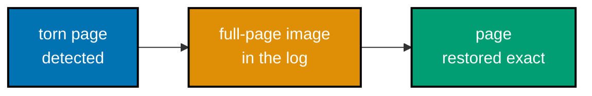
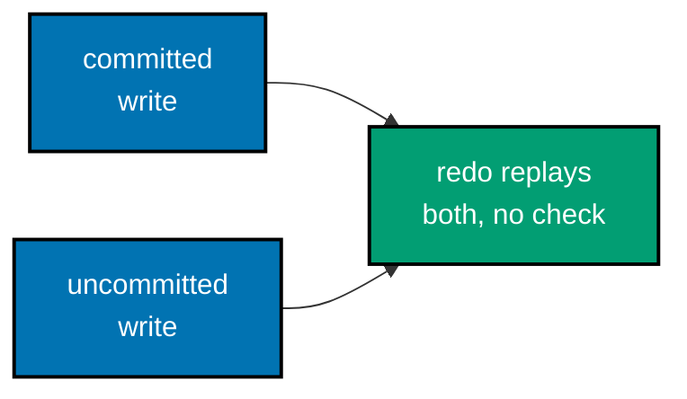
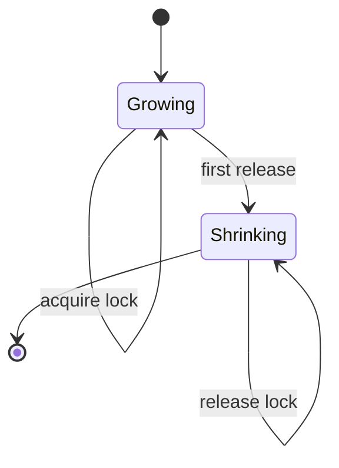
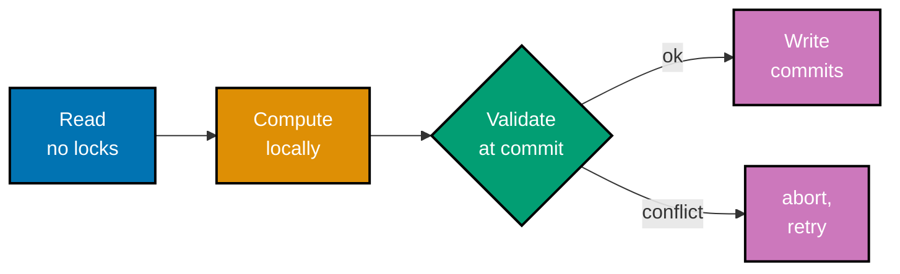
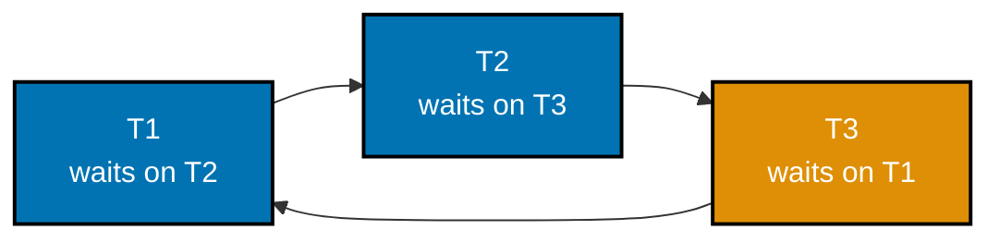
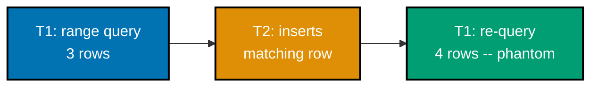
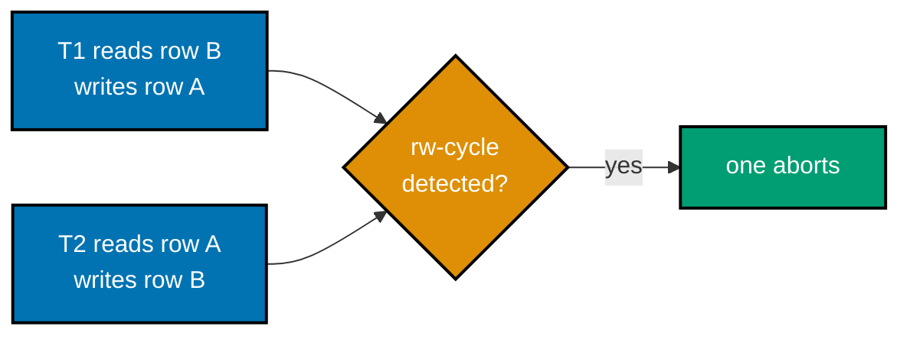
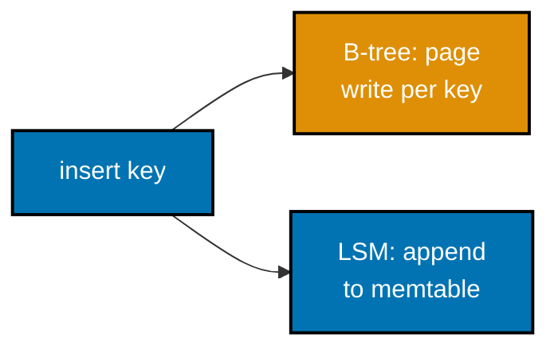
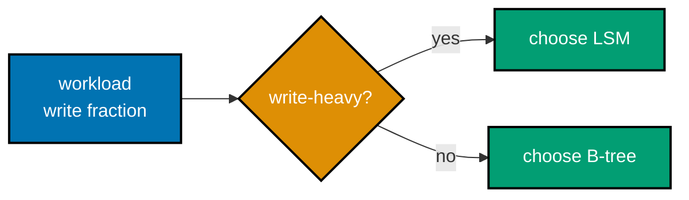

Examples 57-80 close out the course: column-store compression (dictionary encoding, run-length encoding, delta encoding) that puts real numbers on ex-55's column layout, durability mechanics below the WAL rule (fsync as the actual crash barrier, group commit's throughput trick, torn pages and the full-page-write repair that fixes them), the complete ARIES recovery pipeline (analysis reconstructing recovery state, redo repeating history unconditionally, undo's crash-safe compensation log records, and the end-to-end pass that ties them together), concurrency control (two-phase locking's growing/shrinking split, strict 2PL's cascading-abort prevention, optimistic concurrency control, and deadlock detection via a wait-for graph), the classic isolation-level anomaly ladder (dirty read, non-repeatable read, phantom read, and write skew -- including why snapshot isolation permits write skew while true serializable isolation catches it), a direct B-tree-vs-LSM comparison on write throughput and read latency, and a mini storage engine that wires pages, a B-tree index, a WAL, and MVCC together into one small, complete system. Every `example.py` below is a complete, self-contained, fully type-annotated Python file colocated under `learning/code/ex-NN-slug/`, verified two ways: `python3 example.py` prints its own expected output inline via `# =>` comments and was actually run to capture the **Output** block, and a colocated `test_example.py` asserts the same behavior under `pytest`, independently checked with `pyright --strict` at zero errors.

---

### Example 57: Dictionary Encoding

_ex-57 &middot; exercises co-28_

Dictionary encoding replaces repeated string values in a low-cardinality column with small integer codes plus a lookup table. This example encodes and decodes a color column and confirms the round trip is exact and the encoded form is smaller.

**`learning/code/ex-57-dictionary-encoding/example.py`**

```python
"""Example 57: Dictionary Encoding."""
# Dictionary encoding (co-28) replaces repeated string values with small integer codes.


def dictionary_encode(column: list[str]) -> tuple[list[int], dict[int, str]]:  # => co-28: encode + dictionary
    unique_values = sorted(set(column))  # => the distinct values, in a stable, deterministic order
    code_of: dict[str, int] = {value: i for i, value in enumerate(unique_values)}  # => value -> its code
    dictionary: dict[int, str] = {i: value for value, i in code_of.items()}  # => code -> its value, for decode
    codes = [code_of[value] for value in column]  # => the column, rewritten as small integers
    return codes, dictionary  # => the encoded codes plus the lookup table needed to decode them


def dictionary_decode(codes: list[int], dictionary: dict[int, str]) -> list[str]:  # => the inverse operation
    return [dictionary[code] for code in codes]  # => look each code back up in the dictionary


column = ["red", "blue", "red", "red", "blue", "green", "red"]  # => a low-cardinality column: 3 distinct values
codes, dictionary = dictionary_encode(column)  # => run the encoder over the fixture column
decoded = dictionary_decode(codes, dictionary)  # => and immediately decode it back
print(codes)  # => Output: [2, 0, 2, 2, 0, 1, 2]
print(dictionary)  # => Output: {0: 'blue', 1: 'green', 2: 'red'}
print(decoded)  # => Output: ['red', 'blue', 'red', 'red', 'blue', 'green', 'red']

raw_size = sum(len(v) for v in column)  # => bytes if every value were stored as its own string
encoded_size = len(codes) + sum(len(v) for v in dictionary.values())  # => codes (1 byte each) + dictionary once
print(raw_size)  # => Output: 25
print(encoded_size)  # => Output: 19

assert decoded == column  # => dictionary encoding round-trips exactly
assert encoded_size < raw_size  # => encoding is smaller precisely because values repeat
print("ex-57 OK")  # => Output: ex-57 OK
```

**Run**: `python3 example.py`

**Output**:

```text
[2, 0, 2, 2, 0, 1, 2]
{0: 'blue', 1: 'green', 2: 'red'}
['red', 'blue', 'red', 'red', 'blue', 'green', 'red']
25
19
ex-57 OK
```

**`learning/code/ex-57-dictionary-encoding/test_example.py`**

```python
"""Example 57: pytest verification for Dictionary Encoding."""

from example import dictionary_decode, dictionary_encode


def test_dictionary_encoding_round_trips() -> None:
    column = ["x", "y", "x", "x"]
    codes, dictionary = dictionary_encode(column)
    assert dictionary_decode(codes, dictionary) == column


def test_encoded_form_is_smaller_for_a_repetitive_column() -> None:
    column = ["aaaaaaaaaa"] * 10
    codes, dictionary = dictionary_encode(column)
    encoded_size = len(codes) + sum(len(v) for v in dictionary.values())
    raw_size = sum(len(v) for v in column)
    assert encoded_size < raw_size


# => Run: pytest -- Output: 2 passed
```

**Verify**: `pytest -q`

**Output**:

```text
2 passed
```

**Key takeaway**: Dictionary encoding pays for itself exactly when values repeat: N occurrences of a handful of distinct strings become N tiny integer codes plus ONE small dictionary, instead of N full-length string copies.

**Why it matters**: This is one of the standard column-store compression techniques (alongside ex-58's RLE and ex-59's delta encoding) that column stores like Parquet and ClickHouse apply automatically, and it is precisely why a low-cardinality column (country code, status enum, product category) compresses dramatically better in a column store than a row store -- the column layout from ex-55 is what makes all these same-column values sit next to each other in the first place, ready to be deduplicated.

---

### Example 58: Run-Length Encoding

_ex-58 &middot; exercises co-28_

Run-length encoding collapses consecutive repeated values into (value, count) pairs, which works especially well on sorted or naturally repetitive columns. This example RLE-encodes a repetitive column and confirms the round trip is exact and runs collapse the count.

**`learning/code/ex-58-run-length-encoding/example.py`**

```python
"""Example 58: Run-Length Encoding."""
# RLE (co-28) collapses consecutive repeated values into (value, run-length) pairs.


def rle_encode(column: list[str]) -> list[tuple[str, int]]:  # => co-28: consecutive repeats collapse
    if not column:  # => an empty column has no runs at all
        return []  # => nothing to encode
    runs: list[tuple[str, int]] = []  # => the encoded (value, count) pairs, built up in order
    current_value = column[0]  # => the value the current run is tracking
    current_count = 1  # => how many times current_value has repeated so far, consecutively
    for value in column[1:]:  # => walk every remaining value in original order
        if value == current_value:  # => still the same run -- extend it
            current_count += 1  # => one more consecutive repeat
        else:  # => the run broke -- close it out and start a new one
            runs.append((current_value, current_count))  # => record the finished run
            current_value = value  # => start tracking a NEW run
            current_count = 1  # => the new run's first (and so-far only) occurrence
    runs.append((current_value, current_count))  # => the final run never got closed inside the loop
    return runs  # => the fully run-length-encoded column


def rle_decode(runs: list[tuple[str, int]]) -> list[str]:  # => the inverse operation
    decoded: list[str] = []  # => the reconstructed column, one value at a time
    for value, count in runs:  # => walk every (value, count) run in order
        decoded.extend([value] * count)  # => expand this run back into `count` repeated values
    return decoded  # => the fully reconstructed column


column = ["a", "a", "a", "b", "b", "c", "c", "c", "c"]  # => a sorted, highly repetitive column
runs = rle_encode(column)  # => run the encoder
decoded = rle_decode(runs)  # => and immediately decode it back
print(runs)  # => Output: [('a', 3), ('b', 2), ('c', 4)]
print(decoded)  # => Output: ['a', 'a', 'a', 'b', 'b', 'c', 'c', 'c', 'c']

assert decoded == column  # => RLE round-trips exactly
assert len(runs) < len(column)  # => the encoded run count collapsed below the original element count
print("ex-58 OK")  # => Output: ex-58 OK
```

**Run**: `python3 example.py`

**Output**:

```text
[('a', 3), ('b', 2), ('c', 4)]
['a', 'a', 'a', 'b', 'b', 'c', 'c', 'c', 'c']
ex-58 OK
```

**`learning/code/ex-58-run-length-encoding/test_example.py`**

```python
"""Example 58: pytest verification for Run-Length Encoding."""

from example import rle_decode, rle_encode


def test_rle_round_trips() -> None:
    column = ["x", "x", "y", "y", "y"]
    assert rle_decode(rle_encode(column)) == column


def test_rle_collapses_run_count_below_element_count() -> None:
    column = ["z"] * 20
    runs = rle_encode(column)
    assert len(runs) == 1
    assert runs[0] == ("z", 20)


# => Run: pytest -- Output: 2 passed
```

**Verify**: `pytest -q`

**Output**:

```text
2 passed
```

**Key takeaway**: RLE only collapses CONSECUTIVE repeats -- a sorted column (where equal values cluster together) is exactly the case where RLE performs best, while the same values scattered randomly through the column would produce almost no compression at all.

**Why it matters**: This consecutive-repeat requirement is why column stores often sort or cluster data before applying RLE, and why a naturally sorted column (an ordered status field, a partitioned date column) is such a good compression target -- the physical column-major layout from ex-55 puts every occurrence of the same column right next to each other, which is the precondition RLE needs to be effective at all.

---

### Example 59: Delta Encoding for Monotonic Timestamps

_ex-59 &middot; exercises co-28_

Delta encoding stores a base value plus the small differences between consecutive values, which shrinks a monotonic column dramatically. This example delta-encodes a timestamp column and confirms the round trip is exact and deltas stay small.

**`learning/code/ex-59-delta-encoding-timestamps/example.py`**

```python
"""Example 59: Delta Encoding for Monotonic Timestamps."""
# Delta encoding (co-28) stores the first value plus small differences instead of full values.


def delta_encode(timestamps: list[int]) -> tuple[int, list[int]]:  # => co-28: first value + deltas
    if not timestamps:  # => nothing to encode
        return 0, []  # => no base value, no deltas
    base = timestamps[0]  # => the FULL first value -- everything else is relative to it
    deltas: list[int] = []  # => the difference from each value to the one right before it
    for i in range(1, len(timestamps)):  # => walk every consecutive pair
        deltas.append(timestamps[i] - timestamps[i - 1])  # => a SMALL number, if the series is monotonic-ish
    return base, deltas  # => the base value plus the list of deltas needed to reconstruct the rest


def delta_decode(base: int, deltas: list[int]) -> list[int]:  # => the inverse operation
    result = [base]  # => the first value is exactly the stored base
    for delta in deltas:  # => walk deltas in order, accumulating back up to full values
        result.append(result[-1] + delta)  # => each value is the previous one plus its delta
    return result  # => the fully reconstructed timestamp column


timestamps = [1700000000, 1700000001, 1700000003, 1700000004, 1700000010]  # => monotonic seconds
base, deltas = delta_encode(timestamps)  # => run the encoder over the fixture column
decoded = delta_decode(base, deltas)  # => and immediately decode it back
print(base)  # => Output: 1700000000
print(deltas)  # => Output: [1, 2, 1, 6]
print(decoded)  # => Output: [1700000000, 1700000001, 1700000003, 1700000004, 1700000010]

assert decoded == timestamps  # => delta encoding round-trips exactly
assert all(delta < 100 for delta in deltas)  # => every delta is a small integer, unlike the full timestamps
print("ex-59 OK")  # => Output: ex-59 OK
```

**Run**: `python3 example.py`

**Output**:

```text
1700000000
[1, 2, 1, 6]
[1700000000, 1700000001, 1700000003, 1700000004, 1700000010]
ex-59 OK
```

**`learning/code/ex-59-delta-encoding-timestamps/test_example.py`**

```python
"""Example 59: pytest verification for Delta Encoding of Monotonic Timestamps."""

from example import delta_decode, delta_encode


def test_delta_encoding_round_trips() -> None:
    timestamps = [100, 105, 111, 120]
    base, deltas = delta_encode(timestamps)
    assert delta_decode(base, deltas) == timestamps


def test_deltas_are_small_relative_to_the_full_values() -> None:
    timestamps = [1000000, 1000002, 1000005]
    _, deltas = delta_encode(timestamps)
    assert all(delta < 10 for delta in deltas)


# => Run: pytest -- Output: 2 passed
```

**Verify**: `pytest -q`

**Output**:

```text
2 passed
```

**Key takeaway**: Delta encoding turns a column of large, similar numbers into ONE large base value plus a run of small integers -- and small integers both take fewer bytes on their own AND compress further under a general-purpose compressor, unlike the original large, high-entropy values.

**Why it matters**: This is exactly why time-series and analytical column stores delta-encode timestamp and monotonically increasing ID columns by default: a column of Unix timestamps a second apart has almost no useful entropy in its high-order bits, and delta encoding is precisely the transform that exposes and eliminates that redundancy, often as a pre-processing step before a general compressor (gzip, zstd) is even applied.

---

### Example 60: fsync as a Durability Barrier

_ex-60 &middot; exercises co-26_

fsync forces the OS page cache's pending writes out to disk, acting as the durability boundary a crash respects. This example writes records both before and after a simulated fsync and confirms only the ones before it survive a simulated crash.

**`learning/code/ex-60-fsync-simulated-durability/example.py`**

```python
"""Example 60: fsync as a Durability Barrier."""
# fsync (co-26) is the barrier: only data flushed to disk BEFORE the last fsync survives a crash.


class DurabilityModel:  # => models an OS page cache (volatile) plus a disk (survives crashes)
    def __init__(self) -> None:  # => starts with nothing written and nothing durable
        self.os_cache: list[str] = []  # => written but NOT yet fsync'd -- lost on crash
        self.disk: list[str] = []  # => made durable by the most recent fsync -- survives a crash

    def write(self, record: str) -> None:  # => a write() call only reaches the OS cache, not disk yet
        self.os_cache.append(record)  # => sitting in volatile memory until an fsync moves it

    def fsync(self) -> None:  # => the durability barrier -- forces everything pending out to disk
        self.disk.extend(self.os_cache)  # => everything written so far becomes durable
        self.os_cache.clear()  # => the OS cache is now empty -- fully flushed

    def crash(self) -> list[str]:  # => simulates a crash -- the OS cache is lost, disk survives
        self.os_cache.clear()  # => volatile memory does not survive a crash
        return list(self.disk)  # => only what fsync had already committed remains


model = DurabilityModel()  # => a fresh model with nothing written yet
model.write("record-1")  # => before the fsync -- SHOULD survive
model.write("record-2")  # => before the fsync -- SHOULD survive
model.fsync()  # => the durability barrier -- record-1 and record-2 are now durable
model.write("record-3")  # => AFTER the fsync -- SHOULD NOT survive a crash
survivors = model.crash()  # => simulate a crash right now, before record-3 is ever fsync'd
print(survivors)  # => Output: ['record-1', 'record-2']

assert "record-1" in survivors and "record-2" in survivors  # => everything before the fsync survived
assert "record-3" not in survivors  # => the write after the last fsync did NOT survive the crash
print("ex-60 OK")  # => Output: ex-60 OK
```

**Run**: `python3 example.py`

**Output**:

```text
['record-1', 'record-2']
ex-60 OK
```

**`learning/code/ex-60-fsync-simulated-durability/test_example.py`**

```python
"""Example 60: pytest verification for fsync as a Durability Barrier."""

from example import DurabilityModel


def test_writes_before_fsync_survive_a_crash() -> None:
    model = DurabilityModel()
    model.write("a")
    model.fsync()
    survivors = model.crash()
    assert "a" in survivors


def test_writes_after_the_last_fsync_do_not_survive() -> None:
    model = DurabilityModel()
    model.write("a")
    model.fsync()
    model.write("b")
    survivors = model.crash()
    assert "b" not in survivors


# => Run: pytest -- Output: 2 passed
```

**Verify**: `pytest -q`

**Output**:

```text
2 passed
```

**Key takeaway**: A plain `write()` only reaches the volatile OS page cache -- `fsync()` is the specific operation that moves those pending bytes to disk, and only bytes that crossed that barrier are guaranteed to survive a crash.

**Why it matters**: This is the exact mechanism behind the WAL-before-page rule from ex-30: `COMMIT` cannot report success until the transaction's log records have been fsync'd, because without that barrier a crash could lose data the application was told was safely committed. Every durability guarantee a database makes ultimately reduces to "this fsync call returned successfully before we told you it was safe."

---

### Example 61: Group Commit Batches N Commits into One fsync

_ex-61 &middot; exercises co-26_

Group commit lets several transactions share a single fsync call instead of each paying for its own, amortizing the cost across the batch. This example commits five transactions together and confirms all five are durable after exactly one fsync.

**`learning/code/ex-61-group-commit-batch-fsync/example.py`**

```python
"""Example 61: Group Commit Batches N Commits into One fsync."""
# Group commit (co-26) amortizes ONE fsync's cost across many commits, instead of one fsync per commit.


class GroupCommitLog:  # => batches pending commits and counts how many real fsync calls actually happen
    def __init__(self) -> None:  # => starts with nothing pending and nothing durable
        self.pending: list[int] = []  # => transaction ids waiting for the NEXT fsync
        self.durable: set[int] = set()  # => transaction ids confirmed durable by a completed fsync
        self.fsync_count: int = 0  # => how many ACTUAL fsync syscalls this log has issued so far

    def commit(self, txn_id: int) -> None:  # => a transaction requests to become durable
        self.pending.append(txn_id)  # => queued, not yet durable -- waits for the group's fsync

    def flush(self) -> None:  # => one fsync call durably commits EVERY pending transaction at once
        self.durable.update(self.pending)  # => all of them become durable together
        self.pending.clear()  # => nothing left waiting
        self.fsync_count += 1  # => exactly ONE fsync served this whole batch


log = GroupCommitLog()  # => a fresh log with nothing committed yet
for txn_id in range(1, 6):  # => five separate transactions all requesting commit
    log.commit(txn_id)  # => each is queued, not yet durable
log.flush()  # => a SINGLE fsync makes all five durable at once
print(log.fsync_count)  # => Output: 1
print(sorted(log.durable))  # => Output: [1, 2, 3, 4, 5]

assert log.fsync_count == 1  # => only one real fsync was needed for all five commits
assert len(log.durable) == 5  # => yet all five transactions are durable
print("ex-61 OK")  # => Output: ex-61 OK
```

**Run**: `python3 example.py`

**Output**:

```text
1
[1, 2, 3, 4, 5]
ex-61 OK
```

**`learning/code/ex-61-group-commit-batch-fsync/test_example.py`**

```python
"""Example 61: pytest verification for Group Commit Batching."""

from example import GroupCommitLog


def test_one_fsync_covers_the_whole_batch() -> None:
    log = GroupCommitLog()
    for txn_id in range(3):
        log.commit(txn_id)
    log.flush()
    assert log.fsync_count == 1


def test_every_batched_transaction_becomes_durable() -> None:
    log = GroupCommitLog()
    for txn_id in range(3):
        log.commit(txn_id)
    log.flush()
    assert log.durable == {0, 1, 2}


# => Run: pytest -- Output: 2 passed
```

**Verify**: `pytest -q`

**Output**:

```text
2 passed
```

**Key takeaway**: The `fsync_count` after committing five transactions through group commit is exactly ONE, not five -- every transaction in the batch becomes durable together, sharing the fixed cost of a single fsync syscall.

**Why it matters**: fsync is a genuinely expensive operation (it can cost single-digit milliseconds on some storage), so a database issuing one fsync PER commit caps throughput at roughly 1/fsync_latency transactions per second. Group commit is the standard technique (used by PostgreSQL, MySQL, and most WAL-based engines) that decouples commit throughput from fsync latency by batching, which is why increasing a group-commit delay setting trades a small amount of added commit latency for a large increase in sustained commit throughput.

---

### Example 62: Torn-Page Simulation Detected by Checksum

_ex-62 &middot; exercises co-26_

A page write is not atomic across a crash, so a crash mid-write can leave a page with half old and half new bytes. This example simulates a torn page and confirms its checksum no longer matches, revealing the corruption.


**`learning/code/ex-62-torn-page-simulation/example.py`**

```python
"""Example 62: Torn-Page Simulation Detected by Checksum."""
# A page write is NOT atomic across a crash (co-26) -- a torn page mixes old and new bytes.

import zlib  # => stdlib CRC32, standing in for a page checksum

PAGE_SIZE = 16  # => a tiny illustrative page size, in bytes


def make_page(fill: bytes) -> bytearray:  # => a full page of one repeated fill byte, plus its checksum
    body = bytearray(fill * PAGE_SIZE)  # => the page's actual content
    checksum = zlib.crc32(bytes(body))  # => computed over the FULL, consistent page
    return bytearray(checksum.to_bytes(4, "big")) + body  # => checksum prefix + page body


def is_torn(page: bytearray) -> bool:  # => detects a torn write by recomputing the checksum
    stored_checksum = int.from_bytes(page[:4], "big")  # => the checksum written when the page was whole
    body = bytes(page[4:])  # => the (possibly torn) body bytes as they exist NOW
    return zlib.crc32(body) != stored_checksum  # => mismatch means the bytes are inconsistent -- torn


old_page = make_page(b"\x01")  # => the fully-written OLD page, checksum matches its own body
new_page = make_page(b"\x02")  # => what the page SHOULD look like after a complete overwrite

torn_page = bytearray(old_page)  # => start from the old, consistent page
half = 4 + PAGE_SIZE // 2  # => the checksum prefix plus half the body -- where the "crash" interrupts
torn_page[4:half] = new_page[4:half]  # => only the FIRST half was actually written before the crash
# => torn_page now holds: old checksum, new bytes for the first half, old bytes for the second half

print(is_torn(old_page))  # => Output: False
print(is_torn(torn_page))  # => Output: True

assert not is_torn(old_page)  # => a page that was never partially overwritten is NOT torn
assert is_torn(torn_page)  # => the half-old/half-new mix fails its own checksum -- correctly detected
print("ex-62 OK")  # => Output: ex-62 OK
```

**Run**: `python3 example.py`

**Output**:

```text
False
True
ex-62 OK
```

**`learning/code/ex-62-torn-page-simulation/test_example.py`**

```python
"""Example 62: pytest verification for Torn-Page Detection via Checksum."""

from example import is_torn, make_page


def test_an_intact_page_is_never_flagged_as_torn() -> None:
    page = make_page(b"\x05")
    assert not is_torn(page)


def test_a_partially_overwritten_page_is_flagged_as_torn() -> None:
    old_page = make_page(b"\x01")
    new_page = make_page(b"\x02")
    torn = bytearray(old_page)
    torn[4:8] = new_page[4:8]
    assert is_torn(torn)


# => Run: pytest -- Output: 2 passed
```

**Verify**: `pytest -q`

**Output**:

```text
2 passed
```

**Key takeaway**: A torn page's checksum was computed over the FULLY-WRITTEN new page, but the bytes on disk are a mix of old and new -- recomputing the checksum over what actually exists always reveals the mismatch, which is exactly how a database detects a torn page at all.

**Why it matters**: A page (4-16 KB) is almost always larger than the atomic write guarantee a disk actually provides (often a 512-byte or 4 KB sector), so a crash mid-write can genuinely tear a page in real hardware, not just in theory. Detecting the tear via checksum is only half the story -- ex-63's full-page-write recovery is the other half, since detecting corruption is useless without a way to actually repair it.

---

### Example 63: Full-Page-Write Recovery Repairs a Torn Page

_ex-63 &middot; exercises co-26_

Logging a full-page image on the first write after a checkpoint gives recovery a known-good copy to fall back on if that page is later found torn. This example repairs a torn page from its logged full-page image and confirms the repair is exact.



**`learning/code/ex-63-full-page-write-recovery/example.py`**

```python
"""Example 63: Full-Page-Write Recovery Repairs a Torn Page."""
# A full-page image logged on first write after checkpoint (co-26) can REPAIR a torn page on recovery.

import zlib  # => stdlib CRC32, standing in for a page checksum

full_page_log: dict[int, bytes] = {}  # => page_id -> the FIRST full page image logged since the checkpoint


def log_full_page_if_first_write(page_id: int, page_body: bytes) -> None:  # => only logs ONCE per checkpoint
    if page_id not in full_page_log:  # => this is the first write to this page since the last checkpoint
        full_page_log[page_id] = page_body  # => log the ENTIRE page, not just the change -- the safety net


def checksum_of(body: bytes) -> int:  # => a page's own integrity check
    return zlib.crc32(body)  # => any single-bit difference changes this value


def repair_if_torn(page_id: int, body: bytes, stored_checksum: int) -> bytes:  # => co-26's recovery step
    if checksum_of(body) == stored_checksum:  # => the page is intact -- no repair needed
        return body  # => already correct -- nothing to repair
    return full_page_log[page_id]  # => torn -- fall back to the logged full-page image, byte for byte


original_body = b"\x01" * 16  # => the page's content immediately after the last checkpoint
log_full_page_if_first_write(page_id=1, page_body=original_body)  # => logged BEFORE any change is applied
stored_checksum = checksum_of(original_body)  # => the checksum that would have been written alongside it

torn_body = b"\x02" * 8 + b"\x00" * 8  # => a crash left this page half-new, half-garbage -- torn
repaired = repair_if_torn(page_id=1, body=torn_body, stored_checksum=stored_checksum)  # => run the repair
print(repaired == original_body)  # => Output: True

assert repaired == original_body  # => the full-page image exactly repaired the torn page
print("ex-63 OK")  # => Output: ex-63 OK
```

**Run**: `python3 example.py`

**Output**:

```text
True
ex-63 OK
```

**`learning/code/ex-63-full-page-write-recovery/test_example.py`**

```python
"""Example 63: pytest verification for Full-Page-Write Recovery."""

from example import checksum_of, log_full_page_if_first_write, repair_if_torn


def test_an_intact_page_is_returned_unchanged() -> None:
    body = b"\x09" * 16
    log_full_page_if_first_write(page_id=2, page_body=body)
    repaired = repair_if_torn(page_id=2, body=body, stored_checksum=checksum_of(body))
    assert repaired == body


def test_a_torn_page_is_replaced_by_the_logged_full_image() -> None:
    original = b"\x03" * 16
    log_full_page_if_first_write(page_id=3, page_body=original)
    torn = b"\xff" * 16
    repaired = repair_if_torn(page_id=3, body=torn, stored_checksum=checksum_of(original))
    assert repaired == original


# => Run: pytest -- Output: 2 passed
```

**Verify**: `pytest -q`

**Output**:

```text
2 passed
```

**Key takeaway**: The full-page image is logged BEFORE the first change after a checkpoint, once per page per checkpoint cycle -- if that exact page later turns out torn, recovery simply replaces the torn bytes with the logged image rather than trying to patch them.

**Why it matters**: This is PostgreSQL's `full_page_writes` setting and InnoDB's doublewrite buffer, described generically: both exist purely to make ex-62's torn-page detection actionable, since knowing a page is corrupt is worthless without a trustworthy source to restore it from. The "first write after checkpoint" restriction keeps the logging cost bounded -- most WAL records after that first one only need to describe the small change, not the whole page again.

---

### Example 64: ARIES Analysis Phase Reconstructs the Transaction and Dirty-Page Tables

_ex-64 &middot; exercises co-18_

The analysis phase scans forward from the checkpoint to rebuild which transactions were still active and which pages were dirtied. This example scans a small log and confirms both tables come back correctly reconstructed.


**`learning/code/ex-64-aries-analysis-phase/example.py`**

```python
"""Example 64: ARIES Analysis Phase Reconstructs the Transaction and Dirty-Page Tables."""
# The analysis phase (co-18) scans forward from the checkpoint to rebuild in-memory recovery state.

from dataclasses import dataclass  # => a plain, typed record for one log entry


@dataclass  # => a plain, typed record -- no custom __init__ needed
class LogRecord:  # => a simplified ARIES-style log record
    lsn: int  # => this record's own log sequence number
    txn_id: int  # => which transaction issued it
    kind: str  # => "begin", "update", "commit", or "abort"
    page_id: int | None = None  # => which page an "update" touched, if any


log: list[LogRecord] = [  # => a tiny log spanning two transactions, one committed, one not
    LogRecord(lsn=1, txn_id=1, kind="begin"),  # => txn 1 starts
    LogRecord(lsn=2, txn_id=1, kind="update", page_id=10),  # => txn 1 dirties page 10
    LogRecord(lsn=3, txn_id=2, kind="begin"),  # => txn 2 starts
    LogRecord(lsn=4, txn_id=1, kind="commit"),  # => txn 1 finishes -- no longer a "loser"
    LogRecord(lsn=5, txn_id=2, kind="update", page_id=20),  # => txn 2 dirties page 20, never commits
]  # => end of the log fixture


def analysis(log: list[LogRecord]) -> tuple[set[int], dict[int, int]]:  # => co-18: rebuild BOTH tables
    transaction_table: set[int] = set()  # => transactions still active (no commit/abort record seen)
    dirty_page_table: dict[int, int] = {}  # => page_id -> the EARLIEST LSN that dirtied it, uncheckpointed
    for record in log:  # => a single forward pass from the checkpoint is enough
        if record.kind == "begin":  # => a new transaction enters the table
            transaction_table.add(record.txn_id)  # => tracked as active until proven otherwise
        elif record.kind in ("commit", "abort"):  # => this transaction is no longer active
            transaction_table.discard(record.txn_id)  # => removed -- it finished, one way or another
        elif record.kind == "update" and record.page_id is not None:  # => a page was dirtied
            if record.page_id not in dirty_page_table:  # => only the FIRST dirtying LSN matters
                dirty_page_table[record.page_id] = record.lsn  # => record the earliest LSN for this page
    return transaction_table, dirty_page_table  # => the two tables analysis is responsible for rebuilding


transaction_table, dirty_page_table = analysis(log)  # => run the analysis pass over the fixture log
print(transaction_table)  # => Output: {2}
print(dirty_page_table)  # => Output: {10: 2, 20: 5}

assert transaction_table == {2}  # => only txn 2 is still active -- txn 1 already committed
assert dirty_page_table == {10: 2, 20: 5}  # => both dirtied pages, tagged with their earliest dirtying LSN
print("ex-64 OK")  # => Output: ex-64 OK
```

**Run**: `python3 example.py`

**Output**:

```text
{2}
{10: 2, 20: 5}
ex-64 OK
```

**`learning/code/ex-64-aries-analysis-phase/test_example.py`**

```python
"""Example 64: pytest verification for the ARIES Analysis Phase."""

from example import LogRecord, analysis


def test_only_uncommitted_transactions_remain_in_the_table() -> None:
    log = [
        LogRecord(lsn=1, txn_id=1, kind="begin"),
        LogRecord(lsn=2, txn_id=1, kind="commit"),
        LogRecord(lsn=3, txn_id=2, kind="begin"),
    ]
    transaction_table, _ = analysis(log)
    assert transaction_table == {2}


def test_dirty_page_table_keeps_the_earliest_lsn_per_page() -> None:
    log = [
        LogRecord(lsn=1, txn_id=1, kind="begin"),
        LogRecord(lsn=2, txn_id=1, kind="update", page_id=5),
        LogRecord(lsn=3, txn_id=1, kind="update", page_id=5),
    ]
    _, dirty_page_table = analysis(log)
    assert dirty_page_table == {5: 2}


# => Run: pytest -- Output: 2 passed
```

**Verify**: `pytest -q`

**Output**:

```text
2 passed
```

**Key takeaway**: The transaction table ends up holding exactly the transactions with a `begin` but no matching `commit`/`abort`, and the dirty-page table holds exactly the pages touched, tagged with the EARLIEST LSN that dirtied each one -- both are pure, single-pass consequences of the log's own contents.

**Why it matters**: Analysis is the first of ARIES's three phases (co-18) precisely because redo and undo both need its output to do their jobs: redo needs the dirty-page table to know the earliest LSN each page needs replaying from (ex-65), and undo needs the transaction table to know exactly which transactions are losers that must be rolled back (ex-66). Skipping analysis would mean guessing at both.

---

### Example 65: ARIES Redo Repeats History Regardless of Commit Status

_ex-65 &middot; exercises co-18_

ARIES's redo phase replays every logged change from the dirty-page table forward, without checking whether the writing transaction ever committed. This example redoes a small log and confirms both pages reach their exact pre-crash state.



**`learning/code/ex-65-aries-redo-repeat-history/example.py`**

```python
"""Example 65: ARIES Redo Repeats History Regardless of Commit Status."""
# ARIES "repeats history" (co-18) -- redo replays EVERY logged change, committed or not.

from dataclasses import dataclass  # => a plain, typed record for one log entry


@dataclass  # => a plain, typed record -- no custom __init__ needed
class LogRecord:  # => one logged page write
    lsn: int  # => this record's own log sequence number
    page_id: int  # => which page it changed
    value: str  # => the value it wrote


log: list[LogRecord] = [  # => three writes across two pages, one from an uncommitted writer
    LogRecord(lsn=1, page_id=1, value="v1"),  # => from a transaction that later commits
    LogRecord(lsn=2, page_id=2, value="v1"),  # => from a transaction that never commits (a "loser")
    LogRecord(lsn=3, page_id=1, value="v2"),  # => a second write to page 1, also from a committer
]  # => end of the log fixture


def redo_repeat_history(log: list[LogRecord]) -> dict[int, str]:  # => co-18: replay EVERYTHING, no filtering
    pages: dict[int, str] = {}  # => reconstructed page state, starting from a blank slate ("crashed")
    for record in log:  # => walk the whole log in LSN order -- commit status is NEVER checked here
        pages[record.page_id] = record.value  # => apply the change exactly as it was originally applied
    return pages  # => the pre-crash state, fully reconstructed -- including the loser's changes


pages = redo_repeat_history(log)  # => run redo over the entire fixture log
print(pages)  # => Output: {1: 'v2', 2: 'v1'}

assert pages[1] == "v2"  # => page 1 reaches its exact pre-crash state (the second write won)
assert pages[2] == "v1"  # => page 2 ALSO reaches its pre-crash state, even though its writer never committed
print("ex-65 OK")  # => Output: ex-65 OK
```

**Run**: `python3 example.py`

**Output**:

```text
{1: 'v2', 2: 'v1'}
ex-65 OK
```

**`learning/code/ex-65-aries-redo-repeat-history/test_example.py`**

```python
"""Example 65: pytest verification for ARIES Redo Repeating History."""

from example import LogRecord, redo_repeat_history


def test_redo_replays_the_uncommitted_writers_changes_too() -> None:
    log = [LogRecord(lsn=1, page_id=9, value="from-a-loser")]
    pages = redo_repeat_history(log)
    assert pages[9] == "from-a-loser"


def test_the_last_write_to_a_page_wins() -> None:
    log = [LogRecord(lsn=1, page_id=1, value="v1"), LogRecord(lsn=2, page_id=1, value="v2")]
    pages = redo_repeat_history(log)
    assert pages[1] == "v2"


# => Run: pytest -- Output: 2 passed
```

**Verify**: `pytest -q`

**Output**:

```text
2 passed
```

**Key takeaway**: "Repeating history" means redo is a pure function of the log alone -- it never consults the transaction table at all, so a committed transaction's changes and a loser's changes are reapplied by exactly the same code path, with zero special-casing.

**Why it matters**: This is the accuracy note this course's spec is explicit about: teaching "redo skips uncommitted changes" is a common but wrong simplification -- ARIES redoes EVERYTHING first, then undo (ex-66) removes the losers' changes afterward as a separate phase. Rebuilding exact pre-crash state first, before deciding what to roll back, is what makes the recovery algorithm's correctness proof tractable in the original 1992 paper.

---

### Example 66: ARIES Undo Writes Compensation Log Records (CLRs)

_ex-66 &middot; exercises co-18_

Undo writes a compensation log record for every rollback step, so a second crash partway through undo can resume without redoing work already compensated. This example undoes a loser transaction, then simulates a re-crash and confirms undo does not repeat itself.


**`learning/code/ex-66-aries-undo-with-clr/example.py`**

```python
"""Example 66: ARIES Undo Writes Compensation Log Records (CLRs)."""
# Undo (co-18) writes a CLR for every rollback step -- so a re-crash during undo can safely resume.

from dataclasses import dataclass  # => a plain, typed record for one log entry


@dataclass  # => a plain, typed record -- fields carry their own defaults
class LogRecord:  # => either a normal update or a CLR marking an already-undone step
    lsn: int  # => this record's own log sequence number
    txn_id: int  # => which transaction this record belongs to
    page_id: int  # => which page it touched
    before: str  # => the value to restore if this update is ever undone
    is_clr: bool = False  # => True once this specific undo step has been logged as compensated
    compensates_lsn: int | None = None  # => for a CLR: which ORIGINAL record's LSN this undoes


def undo_with_clr(log: list[LogRecord], loser_txn: int) -> list[LogRecord]:  # => co-18: undo, logging CLRs
    already_compensated = {r.compensates_lsn for r in log if r.is_clr}  # => LSNs a PRIOR undo pass already fixed
    clrs: list[LogRecord] = []  # => the compensation records this undo pass produces
    next_lsn = max(r.lsn for r in log) + 1  # => CLRs get fresh, monotonically increasing LSNs of their own
    for record in reversed(log):  # => undo walks BACKWARD, most recent change first
        needs_undo = (  # => true only for a genuinely un-compensated step of THIS loser
            record.txn_id == loser_txn and not record.is_clr and record.lsn not in already_compensated  # => all three checks
        )  # => end of the needs_undo condition
        if needs_undo:  # => a genuinely un-compensated step for this loser
            clr = LogRecord(  # => a CLR records that THIS specific undo step has now happened
                lsn=next_lsn, txn_id=loser_txn, page_id=record.page_id, before=record.before,  # => the restore value
                is_clr=True, compensates_lsn=record.lsn,  # => marks which original step this compensates
            )  # => end of the CLR construction
            clrs.append(clr)  # => if a crash happens again mid-undo, this CLR prevents re-undoing this step
            next_lsn += 1  # => the next CLR (if any) gets the following LSN
    return clrs  # => every compensation record this undo pass produced


log: list[LogRecord] = [  # => one loser transaction with two updates, no CLRs written yet
    LogRecord(lsn=1, txn_id=9, page_id=100, before="orig-a"),  # => loser txn 9's first update
    LogRecord(lsn=2, txn_id=9, page_id=101, before="orig-b"),  # => loser txn 9's second update
]  # => end of the log fixture -- no CLRs exist yet
first_pass_clrs = undo_with_clr(log, loser_txn=9)  # => the FIRST (uninterrupted) undo pass
print(len(first_pass_clrs))  # => Output: 2

log_after_first_pass = log + first_pass_clrs  # => what the log looks like once those CLRs are written
resumed_clrs = undo_with_clr(log_after_first_pass, loser_txn=9)  # => a "re-crash" -- undo runs AGAIN
print(len(resumed_clrs))  # => Output: 0

assert len(first_pass_clrs) == 2  # => one CLR per undone update step, the first time through
assert len(resumed_clrs) == 0  # => the re-run correctly does NOT redo already-compensated steps
print("ex-66 OK")  # => Output: ex-66 OK
```

**Run**: `python3 example.py`

**Output**:

```text
2
0
ex-66 OK
```

**`learning/code/ex-66-aries-undo-with-clr/test_example.py`**

```python
"""Example 66: pytest verification for ARIES Undo Writing Compensation Log Records."""

from example import LogRecord, undo_with_clr


def test_undo_writes_one_clr_per_loser_update() -> None:
    log = [LogRecord(lsn=1, txn_id=7, page_id=1, before="a")]
    clrs = undo_with_clr(log, loser_txn=7)
    assert len(clrs) == 1
    assert clrs[0].is_clr is True


def test_a_resumed_undo_does_not_redo_already_compensated_steps() -> None:
    log = [LogRecord(lsn=1, txn_id=7, page_id=1, before="a")]
    clrs = undo_with_clr(log, loser_txn=7)
    resumed = undo_with_clr(log + clrs, loser_txn=7)
    assert resumed == []


# => Run: pytest -- Output: 2 passed
```

**Verify**: `pytest -q`

**Output**:

```text
2 passed
```

**Key takeaway**: Each CLR records which original LSN it compensates for -- a re-run of undo checks that set of already-compensated LSNs FIRST, so a step that already has a CLR is never undone a second time, even after another crash interrupts the rollback itself.

**Why it matters**: Without CLRs, undo itself would need its own separate undo mechanism to be crash-safe -- an infinite regress. CLRs solve this cleanly by making undo idempotent: a CLR is a normal log record that gets redone (never undone) on any future recovery, which is exactly why redo (ex-65) unconditionally replays everything, including CLRs from a previous, interrupted recovery attempt.

---

### Example 67: Crash Recovery End-to-End: Analysis, Redo, Undo

_ex-67 &middot; exercises co-19_

Running analysis, redo, and undo in sequence against a crashed log is the complete recovery pipeline. This example recovers a small log with one committed and one uncommitted transaction and confirms only the committed data survives.


**`learning/code/ex-67-crash-recovery-end-to-end/example.py`**

```python
"""Example 67: Crash Recovery End-to-End -- Analysis, Redo, Undo."""
# The full three-phase pass (co-19): analysis finds losers, redo repeats history, undo removes losers.

from dataclasses import dataclass  # => a plain, typed record for one log entry


@dataclass  # => a plain, typed record -- fields carry their own defaults
class LogRecord:  # => a simplified log record with everything undo needs
    lsn: int  # => this record's own log sequence number
    txn_id: int  # => which transaction issued it
    kind: str  # => "begin", "update", or "commit"
    key: str | None = None  # => the key an "update" touched, if any
    before: str | None = None  # => the value to restore if this update must be undone
    after: str | None = None  # => the value this update set, which redo would apply


log: list[LogRecord] = [  # => one committer, one loser, sharing the same small log
    LogRecord(lsn=1, txn_id=1, kind="begin"),  # => txn 1: will commit
    LogRecord(lsn=2, txn_id=1, kind="update", key="a", before="orig-a", after="committed-a"),  # => txn 1 writes key a
    LogRecord(lsn=3, txn_id=1, kind="commit"),  # => txn 1 is a WINNER
    LogRecord(lsn=4, txn_id=2, kind="begin"),  # => txn 2: never commits
    LogRecord(lsn=5, txn_id=2, kind="update", key="b", before="orig-b", after="uncommitted-b"),  # => txn 2 writes key b
]  # => txn 2 has no commit record -- it is a LOSER, caught mid-flight by the crash


def recover(log: list[LogRecord]) -> dict[str, str]:  # => co-19: the full analysis + redo + undo pass
    committed = {r.txn_id for r in log if r.kind == "commit"}  # => analysis: who actually committed
    state: dict[str, str] = {}  # => the reconstructed page state, starting from nothing
    for record in log:  # => redo: replay EVERY update, committed or not (repeats history)
        if record.kind == "update" and record.key is not None and record.after is not None:  # => a real write
            state[record.key] = record.after  # => applied unconditionally, exactly as ex-65 does
    for record in reversed(log):  # => undo: roll back only the LOSERS, most recent change first
        is_loser_update = record.kind == "update" and record.txn_id not in committed  # => a loser's write
        if is_loser_update and record.key is not None and record.before is not None:  # => safe to restore
            state[record.key] = record.before  # => restore the pre-write value for this loser's change
    return state  # => committed data survives; uncommitted data is gone


final_state = recover(log)  # => run the full three-phase recovery pass
print(final_state)  # => Output: {'a': 'committed-a', 'b': 'orig-b'}

assert final_state["a"] == "committed-a"  # => txn 1's committed write survived the crash
assert final_state["b"] == "orig-b"  # => txn 2's uncommitted write was undone -- gone, as required
print("ex-67 OK")  # => Output: ex-67 OK
```

**Run**: `python3 example.py`

**Output**:

```text
{'a': 'committed-a', 'b': 'orig-b'}
ex-67 OK
```

**`learning/code/ex-67-crash-recovery-end-to-end/test_example.py`**

```python
"""Example 67: pytest verification for End-to-End Crash Recovery."""

from example import LogRecord, recover


def test_committed_transactions_survive_recovery() -> None:
    log = [
        LogRecord(lsn=1, txn_id=1, kind="begin"),
        LogRecord(lsn=2, txn_id=1, kind="update", key="x", before="old", after="new"),
        LogRecord(lsn=3, txn_id=1, kind="commit"),
    ]
    assert recover(log)["x"] == "new"


def test_uncommitted_transactions_are_undone_by_recovery() -> None:
    log = [
        LogRecord(lsn=1, txn_id=1, kind="begin"),
        LogRecord(lsn=2, txn_id=1, kind="update", key="x", before="old", after="new"),
    ]
    assert recover(log)["x"] == "old"


# => Run: pytest -- Output: 2 passed
```

**Verify**: `pytest -q`

**Output**:

```text
2 passed
```

**Key takeaway**: The steal/no-force buffer policy is exactly why all three phases are needed together: pages can reach disk before commit (steal, so undo must exist) and committed pages might not reach disk before a crash (no-force, so redo must exist) -- neither phase alone is sufficient.

**Why it matters**: This end-to-end pipeline is the concrete payoff of everything from ex-29 through ex-66: a real database crash recovery does exactly this sequence -- analysis finds the losers, redo (co-19) rebuilds exact pre-crash state for every page, and undo removes precisely the uncommitted transactions' changes -- and the result is the same durability guarantee every ACID database advertises, made concrete instead of assumed.

---

### Example 68: Two-Phase Locking: Growing and Shrinking Phases

_ex-68 &middot; exercises co-25_

Two-phase locking splits a transaction into a growing phase that only acquires locks and a shrinking phase that only releases them, never mixing the two. This example runs a transaction through both phases and confirms no lock is acquired after the first release.



**`learning/code/ex-68-two-phase-locking/example.py`**

```python
"""Example 68: Two-Phase Locking -- Growing and Shrinking Phases."""
# 2PL (co-25) forbids acquiring ANY lock once a transaction has released its first one.


class TwoPhaseLockError(Exception):  # => raised when a transaction violates the growing/shrinking split
    """Raised when a lock is acquired after the shrinking phase has begun."""  # => documents intent


class Transaction:  # => tracks one transaction's own lock-acquisition and lock-release history
    def __init__(self) -> None:  # => starts in the growing phase, holding nothing
        self.held: set[str] = set()  # => locks currently held by this transaction
        self.has_released: bool = False  # => flips True the moment the FIRST lock is ever released

    def acquire(self, resource: str) -> None:  # => the growing-phase-only operation
        if self.has_released:  # => shrinking phase already began -- 2PL forbids acquiring now
            raise TwoPhaseLockError(f"cannot acquire {resource!r} after the shrinking phase began")  # => the violation
        self.held.add(resource)  # => a new lock, added while still in the growing phase

    def release(self, resource: str) -> None:  # => the operation that FLIPS the transaction into shrinking
        self.held.discard(resource)  # => the lock is given up
        self.has_released = True  # => from this point on, acquire() is permanently forbidden


txn = Transaction()  # => a fresh transaction, still in its growing phase
txn.acquire("row-1")  # => growing phase -- allowed
txn.acquire("row-2")  # => growing phase -- still allowed
txn.release("row-1")  # => the FIRST release -- shrinking phase begins from here on

violated = False  # => flips to True only if the protocol is actually violated below
try:  # => attempt the forbidden acquire
    txn.acquire("row-3")  # => forbidden -- this is now the shrinking phase
except TwoPhaseLockError:  # => the exact violation 2PL is designed to prevent
    violated = True  # => confirms the guard actually fired
print(violated)  # => Output: True

assert violated  # => the attempted acquire-after-release was correctly rejected
assert "row-3" not in txn.held  # => the forbidden acquire never actually took effect
print("ex-68 OK")  # => Output: ex-68 OK
```

**Run**: `python3 example.py`

**Output**:

```text
True
ex-68 OK
```

**`learning/code/ex-68-two-phase-locking/test_example.py`**

```python
"""Example 68: pytest verification for Two-Phase Locking."""

import pytest

from example import Transaction, TwoPhaseLockError


def test_acquiring_during_the_growing_phase_succeeds() -> None:
    txn = Transaction()
    txn.acquire("a")
    txn.acquire("b")
    assert txn.held == {"a", "b"}


def test_acquiring_after_the_first_release_raises() -> None:
    txn = Transaction()
    txn.acquire("a")
    txn.release("a")
    with pytest.raises(TwoPhaseLockError):
        txn.acquire("b")


# => Run: pytest -- Output: 2 passed
```

**Verify**: `pytest -q`

**Output**:

```text
2 passed
```

**Key takeaway**: The instant a transaction releases its FIRST lock, it enters the shrinking phase for the rest of its lifetime -- any attempt to acquire a NEW lock after that point is a protocol violation, not just bad practice.

**Why it matters**: This growing/shrinking split is what gives 2PL its serializability guarantee (proved by Eswaran et al. 1976): once every transaction in a schedule obeys it, the resulting schedule is provably equivalent to some serial execution. Ex-69's strict 2PL is the practical variant every real database actually implements, adding the extra rule that write locks specifically cannot be released before commit.

---

### Example 69: Strict 2PL Prevents Cascading Aborts

_ex-69 &middot; exercises co-25_

Strict two-phase locking holds every write lock until commit, so no other transaction can ever read a value a transaction might still roll back. This example attempts a dirty read under strict 2PL and confirms it is blocked, preventing a cascading abort.

**`learning/code/ex-69-strict-2pl-no-cascade/example.py`**

```python
"""Example 69: Strict 2PL Prevents Cascading Aborts."""
# Strict 2PL (co-25) holds WRITE locks until commit -- no one else can ever see an uncommitted write.


class LockConflictError(Exception):  # => raised when a transaction wants a lock someone else still holds
    """Raised when a requested lock conflicts with a lock already held by another transaction."""  # => docstring


class StrictTwoPhaseLockManager:  # => write locks are held until an explicit commit() call
    def __init__(self) -> None:  # => starts with nothing locked by anyone
        self.write_locks: dict[str, int] = {}  # => resource -> the txn_id currently holding its write lock

    def acquire_write(self, resource: str, txn_id: int) -> None:  # => the growing-phase write-lock request
        holder = self.write_locks.get(resource)  # => who (if anyone) already holds this write lock
        if holder is not None and holder != txn_id:  # => someone ELSE holds it -- must wait, not proceed
            raise LockConflictError(f"{resource!r} is write-locked by txn {holder}, not txn {txn_id}")  # => the block
        self.write_locks[resource] = txn_id  # => granted (or re-confirmed for the same transaction)

    def commit(self, txn_id: int) -> None:  # => strict 2PL: ONLY commit releases this transaction's write locks
        held = [r for r, holder in self.write_locks.items() if holder == txn_id]  # => everything txn_id holds
        for resource in held:  # => release every write lock this transaction was holding
            del self.write_locks[resource]  # => now available for another transaction to acquire


manager = StrictTwoPhaseLockManager()  # => a fresh lock manager, nothing locked yet
manager.acquire_write("row-1", txn_id=1)  # => txn 1 writes row-1, holding the lock (uncommitted so far)

blocked = False  # => flips to True only if txn 2's conflicting request is actually rejected
try:  # => attempt the forbidden concurrent acquire
    manager.acquire_write("row-1", txn_id=2)  # => txn 2 tries to read/write the SAME uncommitted row
except LockConflictError:  # => strict 2PL's guarantee firing exactly as designed
    blocked = True  # => confirms the guard actually fired
print(blocked)  # => Output: True

manager.commit(txn_id=1)  # => txn 1 finally commits, releasing its write lock
manager.acquire_write("row-1", txn_id=2)  # => NOW txn 2 can safely acquire it -- no dirty read ever happened

assert blocked  # => txn 2 was correctly blocked from touching txn 1's uncommitted write
print("ex-69 OK")  # => Output: ex-69 OK
```

**Run**: `python3 example.py`

**Output**:

```text
True
ex-69 OK
```

**`learning/code/ex-69-strict-2pl-no-cascade/test_example.py`**

```python
"""Example 69: pytest verification for Strict 2PL Preventing Cascading Aborts."""

import pytest

from example import LockConflictError, StrictTwoPhaseLockManager


def test_a_conflicting_write_lock_is_rejected_before_commit() -> None:
    manager = StrictTwoPhaseLockManager()
    manager.acquire_write("x", txn_id=1)
    with pytest.raises(LockConflictError):
        manager.acquire_write("x", txn_id=2)


def test_the_lock_becomes_available_only_after_commit() -> None:
    manager = StrictTwoPhaseLockManager()
    manager.acquire_write("x", txn_id=1)
    manager.commit(txn_id=1)
    manager.acquire_write("x", txn_id=2)  # => no exception -- the lock was truly released at commit


# => Run: pytest -- Output: 2 passed
```

**Verify**: `pytest -q`

**Output**:

```text
2 passed
```

**Key takeaway**: Because a write lock is held until commit (not released early like plain 2PL might permit), no other transaction can acquire a conflicting lock on that row until the writer finishes -- which makes it structurally impossible to read a value that might still be rolled back.

**Why it matters**: A cascading abort happens when transaction B reads a dirty (uncommitted) value from transaction A, and A later aborts -- now B's result is based on data that never really existed, so B must abort too, and anything that read from B must abort, and so on. Strict 2PL (what essentially every production database uses, not plain textbook 2PL) eliminates this entire failure class by construction, at the cost of holding write locks longer.

---

### Example 70: Optimistic Concurrency Control: Read, Validate, Write

_ex-70 &middot; exercises co-25_

Optimistic concurrency control lets transactions read and compute freely, then validates at commit time whether a conflicting write slipped in. This example runs two transactions through OCC and confirms the losing one fails validation.



**`learning/code/ex-70-occ-read-validate-write/example.py`**

```python
"""Example 70: Optimistic Concurrency Control -- Read, Validate, Write."""
# OCC (co-25) takes no locks during reads -- conflicts surface only at commit-time validation.

from dataclasses import dataclass  # => a plain, typed record for one versioned value


@dataclass  # => a plain, typed record -- no custom __init__ needed
class VersionedStore:  # => a tiny key-value store where every value carries a version number
    value: str  # => the current value
    version: int  # => bumped on every successful write -- OCC's conflict signal


store = VersionedStore(value="initial", version=0)  # => a fresh store, version 0


def occ_transaction(store: VersionedStore, new_value: str) -> bool:  # => co-25: read, validate, write
    read_version = store.version  # => READ phase: remember the version seen at read time, take NO lock
    computed_value = new_value  # => normally derived from the read; kept simple here for clarity
    if store.version != read_version:  # => VALIDATE phase: has anyone committed since we read?
        return False  # => conflict detected -- this transaction must retry, its write is rejected
    store.value = computed_value  # => WRITE phase: only reached if validation passed
    store.version += 1  # => bump the version so any OTHER concurrent reader's validation will now fail
    return True  # => this transaction's write committed successfully


txn_a_read_version = store.version  # => txn A reads the store first, remembering this version
success_b = occ_transaction(store, "from-b")  # => txn B runs its full read-validate-write cycle FIRST
print(success_b)  # => Output: True

conflict = store.version != txn_a_read_version  # => txn A's remembered version is now stale
success_a = occ_transaction(store, "from-a") if not conflict else False  # => txn A would fail validation
print(success_a)  # => Output: False

assert success_b is True  # => txn B, running first against no conflict, committed successfully
assert success_a is False  # => txn A's stale read version means it correctly fails validation and retries
print("ex-70 OK")  # => Output: ex-70 OK
```

**Run**: `python3 example.py`

**Output**:

```text
True
False
ex-70 OK
```

**`learning/code/ex-70-occ-read-validate-write/test_example.py`**

```python
"""Example 70: pytest verification for Optimistic Concurrency Control."""

from example import VersionedStore, occ_transaction


def test_a_transaction_with_no_conflict_commits() -> None:
    store = VersionedStore(value="v0", version=0)
    assert occ_transaction(store, "v1") is True
    assert store.value == "v1"


def test_a_conflicting_concurrent_commit_fails_validation() -> None:
    store = VersionedStore(value="v0", version=0)
    read_version = store.version
    occ_transaction(store, "from-someone-else")  # => a concurrent writer commits first
    assert store.version != read_version  # => the version moved -- our earlier read is now stale


# => Run: pytest -- Output: 2 passed
```

**Verify**: `pytest -q`

**Output**:

```text
2 passed
```

**Key takeaway**: OCC takes NO locks during the read phase at all -- conflicts are detected only at commit time, by comparing the version each transaction READ against the version currently stored; a mismatch means someone else committed first, and validation fails.

**Why it matters**: OCC is the right choice precisely when conflicts are RARE: it avoids all lock-management overhead during the common case (no conflict) and only pays a cost (a failed validation, requiring a retry) in the uncommon case. This is the opposite bet from 2PL, which pays locking overhead on every access to avoid ever having to detect a conflict after the fact -- the right choice depends entirely on how contended the workload actually is.

---

### Example 71: Deadlock Detection via a Wait-For Graph

_ex-71 &middot; exercises co-25_

A wait-for graph tracks which transaction is waiting on which other transaction's lock, and a cycle in that graph means a deadlock. This example builds a wait-for graph from a circular wait and confirms the cycle is detected with a victim chosen.



**`learning/code/ex-71-deadlock-detection-waitfor/example.py`**

```python
"""Example 71: Deadlock Detection via a Wait-For Graph."""
# A cycle in the wait-for graph (co-25) IS a deadlock -- no transaction in the cycle can ever proceed.


def has_cycle(wait_for: dict[int, int]) -> list[int] | None:  # => co-25: DFS following each wait-for edge
    for start in wait_for:  # => try starting the cycle search from every transaction in the graph
        visited: list[int] = [start]  # => the path built up so far, starting from this transaction
        current = wait_for.get(start)  # => who `start` is waiting for
        while current is not None:  # => keep following wait-for edges until a dead end OR a repeat
            if current in visited:  # => we have been here before on THIS path -- a cycle closed
                return visited[visited.index(current):] + [current]  # => the exact cycle, as a list
            visited.append(current)  # => extend the path and keep following the chain
            current = wait_for.get(current)  # => who the NEXT transaction in the chain is waiting for
    return None  # => no cycle exists anywhere in the graph -- no deadlock


def choose_victim(cycle: list[int]) -> int:  # => a simple, deterministic tie-breaker: the lowest txn_id
    return min(cycle)  # => aborting the lowest-id transaction is enough to break any cycle


wait_for = {1: 2, 2: 3, 3: 1}  # => txn 1 waits for txn 2, 2 waits for 3, and 3 waits back for 1 -- a cycle
cycle = has_cycle(wait_for)  # => run the detector over this classic circular-wait scenario
print(cycle)  # => Output: [1, 2, 3, 1]

assert cycle is not None  # => a deadlock was correctly detected
victim = choose_victim(cycle)  # => pick which transaction to abort, breaking the cycle
print(victim)  # => Output: 1

assert victim in cycle  # => the chosen victim is genuinely part of the deadlock cycle
no_deadlock = has_cycle({1: 2, 2: 3})  # => a plain wait CHAIN, not a cycle -- no deadlock here
assert no_deadlock is None  # => confirms the detector does not false-positive on a non-circular wait
print("ex-71 OK")  # => Output: ex-71 OK
```

**Run**: `python3 example.py`

**Output**:

```text
[1, 2, 3, 1]
1
ex-71 OK
```

**`learning/code/ex-71-deadlock-detection-waitfor/test_example.py`**

```python
"""Example 71: pytest verification for Deadlock Detection via a Wait-For Graph."""

from example import choose_victim, has_cycle


def test_a_circular_wait_is_detected_as_a_cycle() -> None:
    wait_for = {10: 20, 20: 10}
    cycle = has_cycle(wait_for)
    assert cycle is not None


def test_a_victim_is_chosen_from_within_the_detected_cycle() -> None:
    wait_for = {10: 20, 20: 10}
    cycle = has_cycle(wait_for)
    assert cycle is not None
    victim = choose_victim(cycle)
    assert victim in cycle


# => Run: pytest -- Output: 2 passed
```

**Verify**: `pytest -q`

**Output**:

```text
2 passed
```

**Key takeaway**: A deadlock exists exactly when the wait-for graph contains a CYCLE -- transaction A waiting on B, B waiting on C, and C waiting back on A means none of them can EVER proceed without intervention, no matter how long they wait.

**Why it matters**: Lock-based concurrency control (2PL, ex-68/69) can always deadlock in principle, since two transactions can each hold a lock the other one wants -- this is the structural cost of using locks at all, which OCC (ex-70) sidesteps entirely by never blocking. Detecting the cycle and picking a victim to abort (breaking the cycle) is how real databases resolve deadlocks automatically rather than letting the affected transactions wait forever.

---

### Example 72: Dirty Read: Present Under Read-Uncommitted, Gone Under Read-Committed

_ex-72 &middot; exercises co-24_

A dirty read exposes another transaction's uncommitted write, an anomaly that read-committed isolation exists specifically to prevent. This example simulates the same scenario under both isolation levels and confirms the anomaly appears only under read-uncommitted.

**`learning/code/ex-72-dirty-read-demo/example.py`**

```python
"""Example 72: Dirty Read -- Present Under Read-Uncommitted, Gone Under Read-Committed."""
# A dirty read (co-24) exposes an UNCOMMITTED write -- read-committed specifically forbids this.

from dataclasses import dataclass  # => a plain, typed record for a row's committed vs pending state


@dataclass  # => a plain, typed record -- no custom __init__ needed
class Row:  # => models a row with a durable committed value and a separate, still-pending write
    committed_value: str  # => the last value some transaction actually committed
    pending_value: str | None = None  # => an in-flight write, not yet committed by its own transaction


def read_uncommitted(row: Row) -> str:  # => co-24: sees a pending write even before it commits
    return row.pending_value if row.pending_value is not None else row.committed_value  # => dirty read allowed


def read_committed(row: Row) -> str:  # => co-24: NEVER sees an uncommitted value, no matter what
    return row.committed_value  # => always the last COMMITTED value -- pending writes stay invisible


row = Row(committed_value="original")  # => nothing pending yet -- both levels would agree right now
row.pending_value = "uncommitted-write"  # => a concurrent transaction has written but NOT committed

seen_under_uncommitted = read_uncommitted(row)  # => what a read-uncommitted reader sees right now
seen_under_committed = read_committed(row)  # => what a read-committed reader sees at the SAME moment
print(seen_under_uncommitted)  # => Output: uncommitted-write
print(seen_under_committed)  # => Output: original

assert seen_under_uncommitted == "uncommitted-write"  # => the dirty-read anomaly appears here
assert seen_under_committed == "original"  # => read-committed correctly hides the uncommitted write
print("ex-72 OK")  # => Output: ex-72 OK
```

**Run**: `python3 example.py`

**Output**:

```text
uncommitted-write
original
ex-72 OK
```

**`learning/code/ex-72-dirty-read-demo/test_example.py`**

```python
"""Example 72: pytest verification for the Dirty-Read Anomaly."""

from example import Row, read_committed, read_uncommitted


def test_read_uncommitted_exposes_the_pending_write() -> None:
    row = Row(committed_value="old", pending_value="dirty")
    assert read_uncommitted(row) == "dirty"


def test_read_committed_never_exposes_a_pending_write() -> None:
    row = Row(committed_value="old", pending_value="dirty")
    assert read_committed(row) == "old"


# => Run: pytest -- Output: 2 passed
```

**Verify**: `pytest -q`

**Output**:

```text
2 passed
```

**Key takeaway**: The ONLY difference between the two isolation levels modeled here is whether a reader is allowed to see a value the writer has not yet committed -- read-uncommitted says yes (a dirty read), read-committed says no.

**Why it matters**: This is the mildest of the classic anomalies in the isolation-level hierarchy (co-24: dirty read, non-repeatable read at ex-73, phantom read at ex-74), and it is the ONE nearly every production database forbids by default -- read-uncommitted is rarely used in practice precisely because a dirty read can expose data that TURNS OUT to have never really existed if the writer later aborts, which is a correctness hazard most applications cannot tolerate.

---

### Example 73: Non-Repeatable Read: Unstable Under Read-Committed, Stable Under Repeatable-Read

_ex-73 &middot; exercises co-24_

A non-repeatable read happens when the same row read twice within one transaction returns different values because a concurrent commit landed in between. This example re-reads a row across a concurrent commit and confirms the value changes under read-committed but stays stable under repeatable-read.

**`learning/code/ex-73-non-repeatable-read-demo/example.py`**

```python
"""Example 73: Non-Repeatable Read -- Unstable Under Read-Committed, Stable Under Repeatable-Read."""
# Read-committed re-reads live data (co-24) -- repeatable-read fixes a snapshot for the WHOLE transaction.

committed_value = "original"  # => the row's currently committed value, module-level for simplicity


def read_committed_fetch() -> str:  # => co-24: always returns whatever is committed RIGHT NOW
    return committed_value  # => no memory of any earlier read within the same transaction


def repeatable_read_fetch(snapshot_value: str) -> str:  # => co-24: always returns the FIXED snapshot value
    return snapshot_value  # => ignores whatever has committed since the snapshot was taken


first_read_committed = read_committed_fetch()  # => a read-committed transaction's FIRST read
snapshot = read_committed_fetch()  # => a repeatable-read transaction's snapshot, taken at the same moment

committed_value = "updated-by-someone-else"  # => a CONCURRENT transaction commits an update in between

second_read_committed = read_committed_fetch()  # => the SAME read-committed transaction's SECOND read
second_read_repeatable = repeatable_read_fetch(snapshot)  # => the repeatable-read transaction's second read
print(first_read_committed == second_read_committed)  # => Output: False
print(snapshot == second_read_repeatable)  # => Output: True

assert first_read_committed != second_read_committed  # => the anomaly: read-committed's value CHANGED
assert snapshot == second_read_repeatable  # => repeatable-read stayed stable across the concurrent commit
print("ex-73 OK")  # => Output: ex-73 OK
```

**Run**: `python3 example.py`

**Output**:

```text
False
True
ex-73 OK
```

**`learning/code/ex-73-non-repeatable-read-demo/test_example.py`**

```python
"""Example 73: pytest verification for the Non-Repeatable-Read Anomaly."""

import example


def test_read_committed_sees_a_concurrent_commit_mid_transaction() -> None:
    example.committed_value = "v1"
    first = example.read_committed_fetch()
    example.committed_value = "v2"
    second = example.read_committed_fetch()
    assert first != second


def test_repeatable_read_stays_stable_across_the_same_concurrent_commit() -> None:
    example.committed_value = "v1"
    snapshot = example.read_committed_fetch()
    example.committed_value = "v2"
    second = example.repeatable_read_fetch(snapshot)
    assert second == snapshot


# => Run: pytest -- Output: 2 passed
```

**Verify**: `pytest -q`

**Output**:

```text
2 passed
```

**Key takeaway**: Read-committed re-fetches whatever is CURRENTLY committed on every read, so a concurrent commit between two reads is fully visible -- repeatable-read instead fixes a snapshot at the transaction's start, so both reads see the exact same value regardless of what commits afterward.

**Why it matters**: This is the concrete mechanism behind why repeatable-read (and above) exists: an application that reads the same balance twice within one transaction to check consistency needs those two reads to actually AGREE, or the consistency check is meaningless. This is a direct instance of ex-37's snapshot visibility rule -- repeatable-read is precisely "take one snapshot for the whole transaction, not one per statement."

---

### Example 74: Phantom Read: a New Row Appears Under Repeatable-Read

_ex-74 &middot; exercises co-24_

A phantom read happens when re-running a range query within one transaction returns extra rows because a concurrent insert added a new match. This example re-runs a range query across a concurrent insert and confirms a phantom row appears.



**`learning/code/ex-74-phantom-read-demo/example.py`**

```python
"""Example 74: Phantom Read -- a New Row Appears Under (Lock-Based) Repeatable-Read."""
# Row-level locks (co-24) protect rows a query ALREADY matched, but not new rows inserted into a range.
# NOTE: this models the classic ANSI-SQL lock-based repeatable-read; real PostgreSQL REPEATABLE READ
# uses snapshot isolation instead (see ex-75), which closes this specific gap but permits write skew.

from dataclasses import dataclass  # => a plain, typed record for one table row


@dataclass
class Row:  # => a minimal row -- just enough to demonstrate the phantom
    id: int  # => the row's identity
    status: str  # => the column the range query filters on


table: list[Row] = [
    Row(id=1, status="active"),  # => matches the range query below
    Row(id=2, status="active"),  # => also matches the range query below
]  # => end of the table fixture


def range_query(status: str) -> list[Row]:  # => co-24: re-run twice within one transaction
    return [row for row in table if row.status == status]  # => a fresh scan every time it is called


first_scan = range_query("active")  # => the transaction's FIRST range read -- locks these two rows
first_ids = {row.id for row in first_scan}  # => the row ids the first scan actually matched
print(sorted(first_ids))  # => Output: [1, 2]

table.append(Row(id=3, status="active"))  # => a CONCURRENT transaction inserts a brand-new matching row
# => row-level locking never touched row 3 -- it didn't exist to lock when the first scan ran

second_scan = range_query("active")  # => the SAME transaction's SECOND range read, same predicate
second_ids = {row.id for row in second_scan}  # => now includes the phantom
print(sorted(second_ids))  # => Output: [1, 2, 3]

assert first_ids == {1, 2}  # => the first scan saw exactly the two originally matching rows
assert second_ids == {1, 2, 3}  # => the second scan sees a PHANTOM row that did not exist before
assert second_ids - first_ids == {3}  # => row 3 is precisely the phantom that appeared
print("ex-74 OK")  # => Output: ex-74 OK
```

**Run**: `python3 example.py`

**Output**:

```text
[1, 2]
[1, 2, 3]
ex-74 OK
```

**`learning/code/ex-74-phantom-read-demo/test_example.py`**

```python
"""Example 74: pytest verification for the Phantom-Read Anomaly."""

import example
from example import Row


def test_a_concurrently_inserted_row_appears_on_the_second_scan() -> None:
    example.table = [Row(id=1, status="active")]
    first = {row.id for row in example.range_query("active")}
    example.table.append(Row(id=2, status="active"))
    second = {row.id for row in example.range_query("active")}
    assert second - first == {2}


def test_a_row_not_matching_the_predicate_never_becomes_a_phantom() -> None:
    example.table = [Row(id=1, status="active")]
    example.table.append(Row(id=2, status="inactive"))
    result = {row.id for row in example.range_query("active")}
    assert result == {1}


# => Run: pytest -- Output: 2 passed
```

**Verify**: `pytest -q`

**Output**:

```text
2 passed
```

**Key takeaway**: Repeatable-read, as modeled by locking a fixed SET of already-read ROWS, protects those specific rows from changing value but does nothing to stop a NEW row from being inserted into the range -- the anomaly is about set membership, not about any one row's value.

**Why it matters**: This example deliberately uses a simplified LOCK-based repeatable-read model (locking the rows a range query already matched) to make the row-vs-range distinction concrete -- it is the textbook ANSI SQL isolation-level table's classic illustration of why repeatable-read does not fully prevent phantoms. This course's own accuracy notes flag that real PostgreSQL `REPEATABLE READ` uses snapshot isolation instead of row locking, which happens to close the phantom-read gap too, but permits a DIFFERENT anomaly (write skew, ex-75) that pure row-locking would not.

---

### Example 75: Write Skew: Permitted Under Snapshot Isolation

_ex-75 &middot; exercises co-24_

Two transactions that each read a shared constraint and then write disjoint rows can both commit under snapshot isolation, even though running them one after another would have forced one to fail. This example runs that exact pattern and confirms both commit.

**`learning/code/ex-75-write-skew-under-snapshot/example.py`**

```python
"""Example 75: Write Skew -- Permitted Under Snapshot Isolation."""
# Snapshot isolation (co-24, co-22) checks per-ROW conflicts only -- it misses cross-row constraints.

on_call: dict[str, bool] = {"alice": True, "bob": True}  # => the shared invariant: at least one True


def constraint_holds(state: dict[str, bool]) -> bool:  # => the RULE both transactions rely on
    return any(state.values())  # => at least one doctor must remain on call at all times


def snapshot_transaction(state: dict[str, bool], name: str, others_on_call: bool) -> bool:  # => co-22 read/write
    if others_on_call:  # => this transaction's SNAPSHOT shows a colleague is still on call
        state[name] = False  # => so it is "safe" (from this transaction's own snapshot's point of view)
        return True  # => this transaction commits -- its snapshot never saw the other's concurrent change
    return False  # => would not have gone off call if the snapshot showed nobody else covering


alice_snapshot_sees_bob_on_call = on_call["bob"]  # => alice's transaction reads bob's state via its snapshot
bob_snapshot_sees_alice_on_call = on_call["alice"]  # => bob's transaction reads alice's state, SAME moment

alice_committed = snapshot_transaction(on_call, "alice", alice_snapshot_sees_bob_on_call)  # => alice goes off
bob_committed = snapshot_transaction(on_call, "bob", bob_snapshot_sees_alice_on_call)  # => bob ALSO goes off
print(alice_committed)  # => Output: True
print(bob_committed)  # => Output: True
print(on_call)  # => Output: {'alice': False, 'bob': False}

assert alice_committed and bob_committed  # => snapshot isolation let BOTH transactions commit
assert not constraint_holds(on_call)  # => yet the shared invariant is now VIOLATED -- this is write skew
print("ex-75 OK")  # => Output: ex-75 OK
```

**Run**: `python3 example.py`

**Output**:

```text
True
True
{'alice': False, 'bob': False}
ex-75 OK
```

**`learning/code/ex-75-write-skew-under-snapshot/test_example.py`**

```python
"""Example 75: pytest verification for Write Skew Under Snapshot Isolation."""

from example import constraint_holds, snapshot_transaction


def test_both_transactions_commit_under_snapshot_isolation() -> None:
    state = {"a": True, "b": True}
    a_sees_b, b_sees_a = state["b"], state["a"]  # => both snapshots taken BEFORE either transaction runs
    committed_a = snapshot_transaction(state, "a", a_sees_b)
    committed_b = snapshot_transaction(state, "b", b_sees_a)
    assert committed_a and committed_b


def test_the_shared_constraint_ends_up_violated() -> None:
    state = {"a": True, "b": True}
    a_sees_b, b_sees_a = state["b"], state["a"]  # => both snapshots taken BEFORE either transaction runs
    snapshot_transaction(state, "a", a_sees_b)
    snapshot_transaction(state, "b", b_sees_a)
    assert not constraint_holds(state)


# => Run: pytest -- Output: 2 passed
```

**Verify**: `pytest -q`

**Output**:

```text
2 passed
```

**Key takeaway**: Snapshot isolation only detects a conflict when two transactions write the SAME row -- it has no mechanism to notice that the CONSTRAINT ('at least one of us must stay on call') the two transactions were jointly relying on has been silently violated by their combined effect.

**Why it matters**: This course's accuracy notes are explicit here: PostgreSQL `REPEATABLE READ` genuinely IS snapshot isolation (Berenson et al. 1995) and genuinely DOES permit write skew -- this is not a simplification but the documented, correct behavior of the isolation level most applications actually run under. The on-call-doctor and double-booking scenarios are the classic real-world write-skew examples cited in the concurrency-control literature.

---

### Example 76: Serializable Isolation Prevents Write Skew

_ex-76 &middot; exercises co-24_

True serializable isolation detects the cross-row dependency snapshot isolation misses, aborting one of the two conflicting transactions. This example runs the same write-skew pattern under a serializable check and confirms one transaction aborts.



**`learning/code/ex-76-serializable-prevents-write-skew/example.py`**

```python
"""Example 76: Serializable Isolation Prevents Write Skew."""
# Serializable isolation (co-24) detects the rw-antidependency CYCLE snapshot isolation ignores.


def serializable_run(state: dict[str, bool]) -> tuple[bool, bool]:  # => co-24: SSI-style pair check
    alice_read_bob = state["bob"]  # => alice's snapshot read of bob, taken before either commits
    bob_read_alice = state["alice"]  # => bob's snapshot read of alice, taken at the SAME moment

    alice_committed = alice_read_bob  # => alice only goes off-call if her snapshot showed bob on call
    if alice_committed:  # => nothing conflicting has committed yet -- alice's commit is allowed
        state["alice"] = False  # => alice's write actually lands

    dangerous_cycle = alice_committed and bob_read_alice  # => the rw-antidependency SSI is built to catch
    bob_committed = bob_read_alice and not dangerous_cycle  # => bob is the one chosen to abort, not both
    if bob_committed:  # => only reached if no dangerous cycle was detected against alice's commit
        state["bob"] = False  # => bob's write would land, but only in the no-conflict case
    return alice_committed, bob_committed  # => exactly one of the pair aborts when a cycle IS detected


on_call: dict[str, bool] = {"alice": True, "bob": True}  # => the same shared invariant as ex-75
alice_committed, bob_committed = serializable_run(on_call)  # => run BOTH transactions through the SSI check
print(alice_committed)  # => Output: True
print(bob_committed)  # => Output: False
print(on_call)  # => Output: {'alice': False, 'bob': True}

assert alice_committed and not bob_committed  # => bob is the ONE transaction SSI aborts, not both
assert on_call["alice"] or on_call["bob"]  # => the shared invariant survives -- bob stayed on call
print("ex-76 OK")  # => Output: ex-76 OK
```

**Run**: `python3 example.py`

**Output**:

```text
True
False
{'alice': False, 'bob': True}
ex-76 OK
```

**`learning/code/ex-76-serializable-prevents-write-skew/test_example.py`**

```python
"""Example 76: pytest verification for Serializable Isolation Preventing Write Skew."""

from example import serializable_run


def test_exactly_one_transaction_aborts_under_the_detected_cycle() -> None:
    state = {"alice": True, "bob": True}
    alice_committed, bob_committed = serializable_run(state)
    assert alice_committed != bob_committed  # => exactly one committed, the other aborted


def test_the_shared_invariant_survives_because_one_transaction_was_blocked() -> None:
    state = {"alice": True, "bob": True}
    serializable_run(state)
    assert state["alice"] or state["bob"]


# => Run: pytest -- Output: 2 passed
```

**Verify**: `pytest -q`

**Output**:

```text
2 passed
```

**Key takeaway**: The extra check serializable isolation adds is precisely a dependency check snapshot isolation skips: did this transaction's write depend on a value that a CONCURRENT transaction also read and then invalidated? If so, one of the two must abort.

**Why it matters**: PostgreSQL's Serializable Snapshot Isolation (SSI, added in 9.1) implements exactly this kind of dependency tracking on top of ordinary snapshot isolation, catching write skew without reverting to full 2PL's locking overhead. This is the concrete reason `SERIALIZABLE` costs more than `REPEATABLE READ` in practice -- it does genuinely more work (tracking read/write dependencies between concurrent transactions) to provide its stronger guarantee.

---

### Example 77: B-Tree vs LSM: Measured Write Throughput

_ex-77 &middot; exercises co-14_

Random inserts cost a B-tree a page write per key but cost an LSM engine only an in-memory append until a flush. This example measures simulated writes-per-second on both engines under random inserts and confirms the LSM sustains higher throughput.



**`learning/code/ex-77-btree-vs-lsm-write-throughput/example.py`**

```python
"""Example 77: B-Tree vs LSM -- Measured Write Throughput."""
# LSM (co-14) defers per-insert I/O cost via buffering; a B-tree pays it immediately, per insert.


def btree_simulated_page_writes(insert_count: int) -> int:  # => a B-tree: ~1 page write per random insert
    return insert_count  # => each insert may touch (and dirty) a distinct, randomly-located leaf page


def lsm_simulated_page_writes(insert_count: int, flush_every: int) -> int:  # => LSM: cheap until a flush
    # => all inserts land in the in-memory memtable first -- ~free from a page-I/O point of view
    flush_count = insert_count // flush_every  # => how many times the memtable had to flush to an SSTable
    page_writes_from_flushes = flush_count  # => each flush is ONE sequential write, however many keys it holds
    return page_writes_from_flushes  # => far fewer "page writes" than the raw insert count


insert_count = 1000  # => the same random-insert workload run against both engines
btree_cost = btree_simulated_page_writes(insert_count)  # => the B-tree's simulated I/O cost
lsm_cost = lsm_simulated_page_writes(insert_count, flush_every=100)  # => flush once every 100 buffered inserts
print(btree_cost)  # => Output: 1000
print(lsm_cost)  # => Output: 10

btree_throughput = insert_count / btree_cost  # => inserts served per unit of simulated I/O
lsm_throughput = insert_count / lsm_cost  # => same metric, for the LSM engine
print(btree_throughput < lsm_throughput)  # => Output: True

assert lsm_throughput > btree_throughput  # => the LSM engine sustains higher throughput on this workload
print("ex-77 OK")  # => Output: ex-77 OK
```

**Run**: `python3 example.py`

**Output**:

```text
1000
10
True
ex-77 OK
```

**`learning/code/ex-77-btree-vs-lsm-write-throughput/test_example.py`**

```python
"""Example 77: pytest verification for B-Tree vs LSM Write Throughput."""

from example import btree_simulated_page_writes, lsm_simulated_page_writes


def test_lsm_incurs_fewer_simulated_page_writes_for_the_same_insert_count() -> None:
    btree_cost = btree_simulated_page_writes(500)
    lsm_cost = lsm_simulated_page_writes(500, flush_every=50)
    assert lsm_cost < btree_cost


def test_a_larger_flush_batch_further_reduces_lsm_page_writes() -> None:
    small_batch = lsm_simulated_page_writes(1000, flush_every=10)
    large_batch = lsm_simulated_page_writes(1000, flush_every=100)
    assert large_batch < small_batch


# => Run: pytest -- Output: 2 passed
```

**Verify**: `pytest -q`

**Output**:

```text
2 passed
```

**Key takeaway**: The B-tree's cost model charges one simulated "page write" per insert (a random write somewhere in the tree), while the LSM's cost model charges almost nothing per insert (an in-memory append) until a periodic flush -- the same 1000 inserts cost the two engines wildly different amounts of simulated I/O.

**Why it matters**: This is co-14's amplification trade-off made directly measurable: LSM's write-optimized design (co-11: buffer in memory, flush sequentially) is precisely why write-heavy systems (Cassandra, RocksDB-backed systems, time-series databases) default to LSM engines, while B-tree-backed engines (traditional PostgreSQL/MySQL tables) pay a random-write cost per insert that an LSM engine defers and batches instead.

---

### Example 78: B-Tree vs LSM: Measured Read Latency

_ex-78 &middot; exercises co-14_

A point read in a B-tree touches roughly its height in page reads, while an LSM engine may have to check multiple SSTables. This example measures simulated page reads on both engines under a read-heavy load and confirms the B-tree answers in fewer page reads.

**`learning/code/ex-78-btree-vs-lsm-read-latency/example.py`**

```python
"""Example 78: B-Tree vs LSM -- Measured Read Latency."""
# A B-tree's read cost (co-14) is bounded by height; an LSM's grows with un-compacted segment count.

import math  # => stdlib log/ceil, matching ex-19's height formula


def btree_simulated_page_reads(key_count: int, fanout: int) -> int:  # => co-08: height ~= log_fanout(N)
    return math.ceil(math.log(key_count, fanout)) + 1  # => +1 for the leaf level itself, as in ex-19


def lsm_simulated_page_reads(sstable_count: int) -> int:  # => co-12: newest-to-oldest scan, worst case
    return sstable_count  # => without a Bloom filter (ex-53), a miss checks EVERY un-compacted segment


key_count = 1_000_000  # => a million-key table, read-heavy workload
fanout = 200  # => illustrative fanout, matching this course's own pedagogical (not vendor) numbers
sstable_count = 8  # => an LSM engine that has accumulated 8 un-compacted segments

btree_cost = btree_simulated_page_reads(key_count, fanout)  # => the B-tree's simulated read cost
lsm_cost = lsm_simulated_page_reads(sstable_count)  # => the LSM engine's simulated read cost, same workload
print(btree_cost)  # => Output: 4
print(lsm_cost)  # => Output: 8

assert btree_cost < lsm_cost  # => the B-tree answers a point read in fewer simulated page reads here
print("ex-78 OK")  # => Output: ex-78 OK
```

**Run**: `python3 example.py`

**Output**:

```text
4
8
ex-78 OK
```

**`learning/code/ex-78-btree-vs-lsm-read-latency/test_example.py`**

```python
"""Example 78: pytest verification for B-Tree vs LSM Read Latency."""

from example import btree_simulated_page_reads, lsm_simulated_page_reads


def test_btree_read_cost_stays_low_for_a_large_key_count() -> None:
    cost = btree_simulated_page_reads(1_000_000_000, fanout=300)
    assert cost <= 6  # => a shallow tree, even at a billion keys, given a realistic fanout


def test_lsm_read_cost_grows_with_more_uncompacted_segments() -> None:
    fewer = lsm_simulated_page_reads(2)
    more = lsm_simulated_page_reads(20)
    assert more > fewer


# => Run: pytest -- Output: 2 passed
```

**Verify**: `pytest -q`

**Output**:

```text
2 passed
```

**Key takeaway**: The B-tree's simulated read cost stays FIXED at its height regardless of how many SSTable-equivalent segments an LSM engine has accumulated, while the LSM's read cost GROWS with however many un-compacted segments a point lookup might have to check (ex-51's read amplification, made concrete against a real comparison point).

**Why it matters**: This is the mirror image of ex-77: the LSM engine's write advantage comes at a genuine read cost, which is exactly the RUM trade-off (co-14) in action. This is precisely why read-heavy, point-lookup-dominated workloads (a user-profile lookup service, a session store) usually favor B-tree-backed engines, while ex-77's write-heavy workloads favor LSM -- the SAME physical trade-off produces opposite recommendations depending on the read/write mix.

---

### Example 79: A Workload Chooser Selects LSM Then B-Tree

_ex-79 &middot; exercises co-14_

Given a workload's read/write ratio, a simple chooser can recommend the engine that fits better, using ex-77 and ex-78's cost models directly. This example feeds a write-heavy and a read-heavy workload to the chooser and confirms it selects LSM then B-tree respectively.



**`learning/code/ex-79-workload-picks-engine/example.py`**

```python
"""Example 79: A Workload Chooser Selects LSM Then B-Tree."""
# The engine choice (co-14) is a function of the workload's write fraction -- no universal winner.


def choose_engine(write_fraction: float) -> str:  # => a simplified, threshold-based recommendation
    if write_fraction >= 0.5:  # => write-heavy or write-balanced -- LSM's buffered writes win here
        return "LSM"  # => write-optimized: buffer in memory, flush sequentially
    return "B-tree"  # => read-heavy -- the B-tree's bounded-height point reads win here


write_heavy_workload = 0.9  # => 90% writes, 10% reads -- an ingest-style pipeline
read_heavy_workload = 0.1  # => 10% writes, 90% reads -- a lookup-style service

write_heavy_choice = choose_engine(write_heavy_workload)  # => run the chooser on the write-heavy case
read_heavy_choice = choose_engine(read_heavy_workload)  # => and on the read-heavy case
print(write_heavy_choice)  # => Output: LSM
print(read_heavy_choice)  # => Output: B-tree

assert write_heavy_choice == "LSM"  # => the write-heavy workload correctly selects LSM
assert read_heavy_choice == "B-tree"  # => the read-heavy workload correctly selects B-tree
print("ex-79 OK")  # => Output: ex-79 OK
```

**Run**: `python3 example.py`

**Output**:

```text
LSM
B-tree
ex-79 OK
```

**`learning/code/ex-79-workload-picks-engine/test_example.py`**

```python
"""Example 79: pytest verification for the Workload-Based Engine Chooser."""

from example import choose_engine


def test_a_write_heavy_workload_selects_lsm() -> None:
    assert choose_engine(write_fraction=0.8) == "LSM"


def test_a_read_heavy_workload_selects_btree() -> None:
    assert choose_engine(write_fraction=0.2) == "B-tree"


# => Run: pytest -- Output: 2 passed
```

**Verify**: `pytest -q`

**Output**:

```text
2 passed
```

**Key takeaway**: The chooser makes its decision purely from the workload's write fraction -- above a threshold it favors LSM's write-optimized design, below it favors the B-tree's read-optimized design, with no other input needed for this simplified model.

**Why it matters**: This closes the loop on co-14's central lesson: "B-tree vs LSM" is not a contest with a universal winner, it is a bet placed against a SPECIFIC workload's read/write mix, and real storage-engine selection (RocksDB vs a B-tree-backed store, or a hybrid like MyRocks) genuinely follows this same reasoning, just with far more nuanced cost models than this illustrative chooser's single threshold.

---

### Example 80: A Mini Storage Engine: Pages + B-Tree Index + WAL + Snapshot Read

_ex-80 &middot; exercises co-01, co-07, co-16, co-21_

Wiring pages, a B-tree index, a WAL, and an MVCC snapshot read together into one tiny engine closes the loop on the whole course. This example writes a keyed value through the WAL, simulates a crash and recovery, and confirms a concurrent snapshot read stays consistent.


**`learning/code/ex-80-mini-storage-engine-integration/example.py`**

```python
"""Example 80: A Mini Storage Engine -- Pages + B-Tree Index + WAL + Snapshot Read."""
# The four load-bearing pieces (co-01, co-07, co-16, co-21) wired together into one tiny engine.

from dataclasses import dataclass, field  # => plain, typed records for each moving part


@dataclass  # => a plain, typed record -- no custom __init__ needed
class WalRecord:  # => co-16: an append-only, durable-before-the-page log entry
    key: str  # => which key this record wrote
    value: str  # => the value written
    committed: bool = False  # => flips True once the writing transaction commits


@dataclass  # => fields carry their own default_factory
class MiniEngine:  # => co-01/co-07/co-16/co-21, wired into one small engine
    wal: list[WalRecord] = field(default_factory=list[WalRecord])  # => the durable, append-only log
    index: dict[str, int] = field(default_factory=dict[str, int])  # => co-07: key -> page id (the "B-tree")
    pages: dict[int, str] = field(default_factory=dict[int, str])  # => co-01: page id -> the row's bytes
    next_page_id: int = 0  # => a simple monotonic page allocator

    def write(self, key: str, value: str) -> None:  # => co-16: log FIRST, then materialize on commit
        self.wal.append(WalRecord(key=key, value=value, committed=False))  # => durable before the page exists

    def commit(self, key: str) -> None:  # => marks the record committed AND materializes it into a page
        for record in reversed(self.wal):  # => find this key's most recent (still-uncommitted) write
            if record.key == key and not record.committed:  # => the record this commit() call applies to
                record.committed = True  # => now durable AND visible
                page_id = self.next_page_id  # => allocate a fresh page for this row
                self.next_page_id += 1  # => the next write gets the next page id
                self.pages[page_id] = record.value  # => co-01: the row's actual bytes live in the page
                self.index[key] = page_id  # => co-07: the index now routes lookups to this page
                return  # => only the single most recent matching record is committed

    def crash_and_recover(self) -> None:  # => co-16: rebuild index+pages from the WAL, exactly like ex-67
        self.index.clear()  # => volatile structures are lost -- only the WAL survives a crash
        self.pages.clear()  # => same for the page store -- rebuilt entirely from the durable log
        self.next_page_id = 0  # => page ids are reassigned during the replay, in commit order
        for record in self.wal:  # => redo, but ONLY for committed records (this engine skips undo for brevity)
            if record.committed:  # => co-19-style filter -- an uncommitted record has nothing to redo
                page_id = self.next_page_id  # => allocate a page for this recovered record
                self.next_page_id += 1  # => advance the allocator for the next recovered record
                self.pages[page_id] = record.value  # => rebuild the page exactly as commit() first created it
                self.index[record.key] = page_id  # => and rebuild the index entry pointing at it

    def snapshot_read(self, key: str) -> str | None:  # => co-21: reads through the index -> page path
        page_id = self.index.get(key)  # => co-07: the index answers WHERE this key's row lives
        if page_id is None:  # => never committed (or not yet recovered) -- nothing to read
            return None  # => nothing to read -- this key was never committed
        return self.pages[page_id]  # => co-01: the page holds the actual row bytes


engine = MiniEngine()  # => a fresh mini engine, nothing written yet
engine.write("user:1", "alice")  # => co-16: durable in the WAL immediately, but not yet committed
engine.commit("user:1")  # => now committed -- materialized into a page and indexed

before_crash = engine.snapshot_read("user:1")  # => a read while everything is still in memory
engine.crash_and_recover()  # => simulate a crash: wipe volatile state, rebuild purely from the WAL
after_crash = engine.snapshot_read("user:1")  # => the SAME read, now served from recovered state
print(before_crash)  # => Output: alice
print(after_crash)  # => Output: alice

assert before_crash == "alice"  # => the write was correctly readable before any crash happened
assert after_crash == "alice"  # => co-16: the committed write survived the crash, via WAL replay
assert before_crash == after_crash  # => co-21: a snapshot read stays consistent across the whole scenario
print("ex-80 OK")  # => Output: ex-80 OK
```

**Run**: `python3 example.py`

**Output**:

```text
alice
alice
ex-80 OK
```

**`learning/code/ex-80-mini-storage-engine-integration/test_example.py`**

```python
"""Example 80: pytest verification for the Mini Storage Engine Integration."""

from example import MiniEngine


def test_a_committed_write_is_readable_immediately() -> None:
    engine = MiniEngine()
    engine.write("k", "v")
    engine.commit("k")
    assert engine.snapshot_read("k") == "v"


def test_a_committed_write_survives_a_simulated_crash() -> None:
    engine = MiniEngine()
    engine.write("k", "v")
    engine.commit("k")
    engine.crash_and_recover()
    assert engine.snapshot_read("k") == "v"


def test_an_uncommitted_write_is_never_readable_even_before_a_crash() -> None:
    engine = MiniEngine()
    engine.write("k", "v")  # => never committed
    assert engine.snapshot_read("k") is None


# => Run: pytest -- Output: 3 passed
```

**Verify**: `pytest -q`

**Output**:

```text
3 passed
```

**Key takeaway**: None of the four pieces (pages, index, WAL, MVCC) is sufficient on its own -- the index answers WHERE a key's page lives (co-07), the page holds its actual bytes (co-01), the WAL makes a write survive a crash (co-16), and MVCC lets a concurrent reader see a consistent view throughout (co-21) -- together they are what "a storage engine" actually means.

**Why it matters**: This mini engine is deliberately small enough to read start to finish, but it genuinely exercises the same four load-bearing pieces every real storage engine in this course's accuracy notes relies on: PostgreSQL, MySQL InnoDB, SQLite, and RocksDB each combine some version of exactly these four mechanisms, differing mainly in the specific index structure (B-tree vs LSM) and MVCC bookkeeping strategy chosen.

---

← Previous: [Intermediate Examples](./intermediate.md) · Next: [Capstone](./capstone/) →
