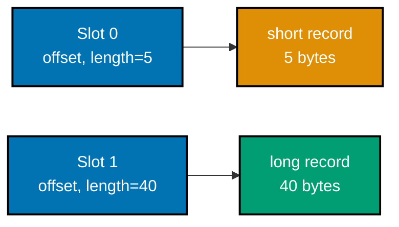
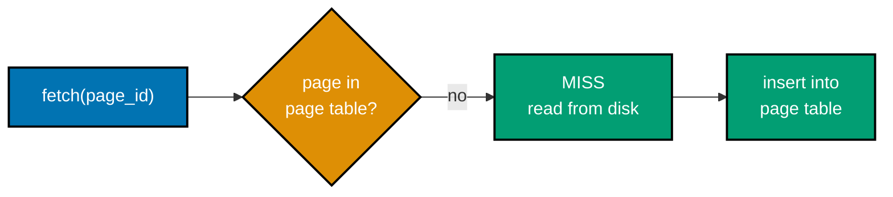
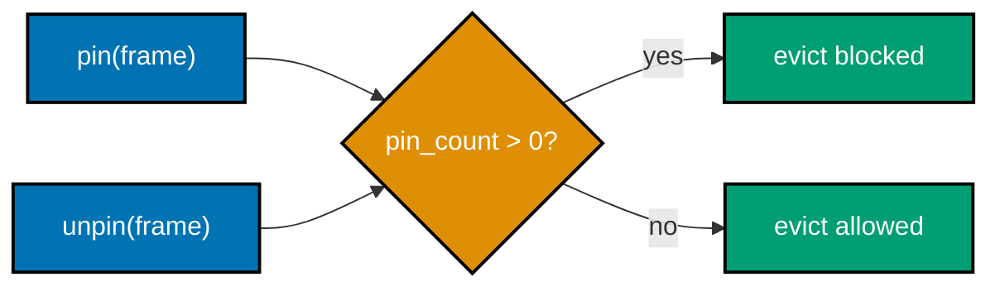
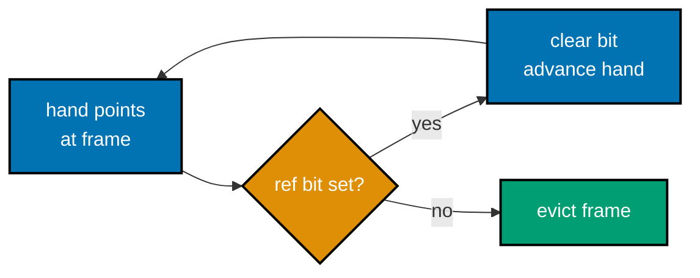
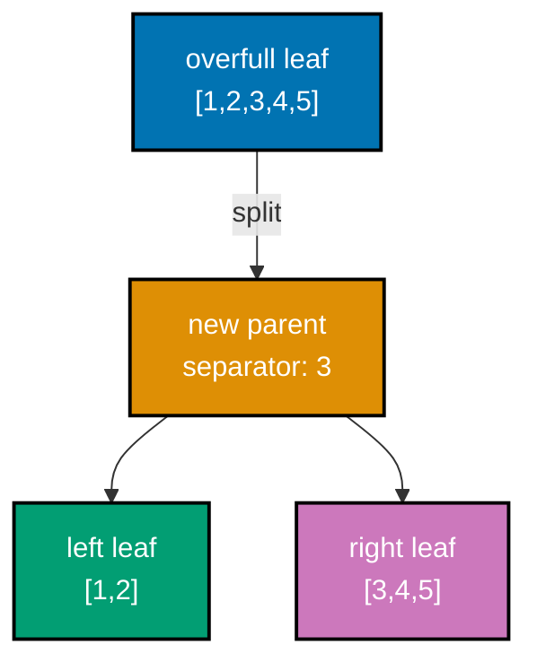
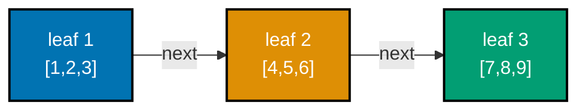
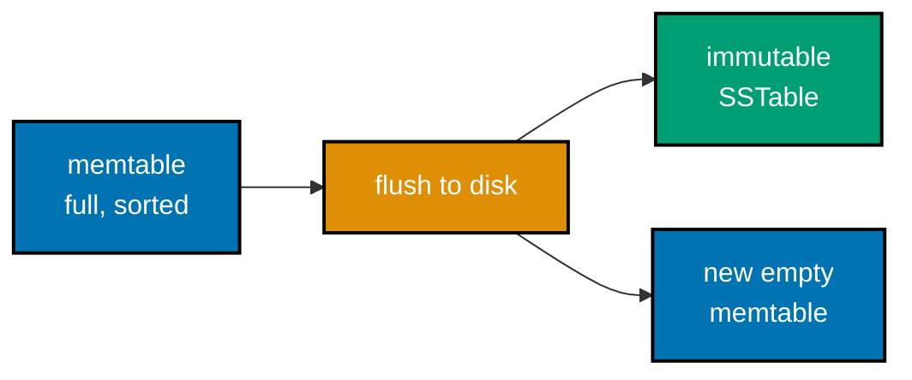
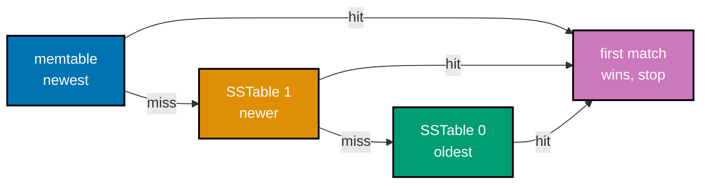

Examples 1-28 build the storage engine's foundational vocabulary: the slotted page layout (header, slot array, tuple data, free space, corruption detection), the buffer pool's core read path (page table, hit/miss, pinning, dirty flushes, LRU and CLOCK eviction), a B-tree leaf's own operations in isolation (sorted insert, point lookup, height from fanout, split, range scan, and the B+-tree values-in-leaves rule), and an LSM engine's write-side basics (the memtable, flushing to an SSTable, the newest-wins read path, tombstone deletes, and a Bloom filter's two core guarantees). Every `example.py` below is a complete, self-contained, fully type-annotated Python file colocated under `learning/code/ex-NN-slug/`, verified two ways: `python3 example.py` prints its own expected output inline via `# =>` comments and was actually run to capture the **Output** block, and a colocated `test_example.py` asserts the same behavior under `pytest`, independently checked with `pyright --strict` at zero errors.

---

### Example 1: Allocate a Fixed-Size Page

_ex-01 &middot; exercises co-01_

A database never reads or writes a single row directly -- it reads and writes whole pages, the unit of I/O every storage engine is built around. This example allocates one and checks its size against the page-size constant.

**`learning/code/ex-01-fixed-size-page-alloc/example.py`**

```python
"""Example 1: Allocate a Fixed-Size Page -- the unit of I/O every storage engine reads and writes in."""

# A database never reads or writes a single row directly -- it reads and
# writes whole PAGES (co-01). Postgres/SQL Server default to 8 KB pages;
# InnoDB defaults to 16 KB -- the exact size is engine-specific, so this
# constant is named, not a hardcoded literal sprinkled through the file.
PAGE_SIZE: int = 4096  # => 4 KB, a convenient small-scale page size for this course


def new_page() -> bytearray:  # => allocates one zero-filled page buffer
    return bytearray(PAGE_SIZE)  # => bytearray(n) is mutable AND zero-initialized


page: bytearray = new_page()  # => a single fresh page
print(len(page))  # => Output: 4096
print(page[:8])  # => Output: bytearray(b'\x00\x00\x00\x00\x00\x00\x00\x00')

assert len(page) == PAGE_SIZE  # => the page's byte length always equals the page-size constant
assert all(byte == 0 for byte in page)  # => a brand-new page is entirely zero-filled before any write
print("ex-01 OK")  # => Output: ex-01 OK
```

**Run**: `python3 example.py`

**Output**:

```text
4096
bytearray(b'\x00\x00\x00\x00\x00\x00\x00\x00')
ex-01 OK
```

**`learning/code/ex-01-fixed-size-page-alloc/test_example.py`**

```python
"""Example 1: pytest verification for Fixed-Size Page Allocation."""

from example import PAGE_SIZE, new_page


def test_page_length_equals_page_size() -> None:
    page = new_page()  # => allocate via the SAME constructor example.py uses
    assert len(page) == PAGE_SIZE  # => every allocated page is exactly PAGE_SIZE bytes


def test_fresh_page_is_zero_filled() -> None:
    page = new_page()  # => a second, independent allocation
    assert page == bytearray(PAGE_SIZE)  # => no stale bytes leak in from a prior allocation


# => Run: pytest -- Output: 2 passed
```

**Verify**: `pytest -q`

**Output**:

```text
2 passed
```

**Key takeaway**: A page is a fixed-size, zero-initialized buffer -- every read, write, and cache decision in a storage engine operates at this granularity, never at the single-row level.

**Why it matters**: Every other example in this course builds on top of a page: the slotted layout, the buffer pool, the B-tree node, and the WAL record all assume a fixed-size unit of I/O underneath them. Real engines pick different sizes for real reasons (Postgres and SQL Server default to 8 KB, InnoDB to 16 KB) -- naming the constant instead of hardcoding a literal is what makes that choice visible and changeable in one place, rather than scattered through every function that touches a page.

---

### Example 2: Page Header Pack and Unpack

_ex-02 &middot; exercises co-02_

A page's header stores two offsets that bound the free space in the middle: `pd_lower` (end of the slot array) and `pd_upper` (start of the tuple data). This example packs both into raw bytes with `struct` and unpacks them back.

**`learning/code/ex-02-page-header-pack-unpack/example.py`**

```python
"""Example 2: Page Header Pack and Unpack -- pd_lower/pd_upper via struct."""

import struct

# A page's header stores two offsets: pd_lower (end of the slot array, grows
# UP from the front) and pd_upper (start of tuple data, grows DOWN from the
# back) (co-02). "<HH" packs both as little-endian unsigned 16-bit integers --
# 4 bytes total, enough to address a page far larger than this course's 4 KB.
HEADER_FORMAT: str = "<HH"  # => two uint16 fields: pd_lower, pd_upper
HEADER_SIZE: int = struct.calcsize(HEADER_FORMAT)  # => 4 bytes


def pack_header(pd_lower: int, pd_upper: int) -> bytes:  # => serializes the header
    return struct.pack(HEADER_FORMAT, pd_lower, pd_upper)  # => exactly HEADER_SIZE bytes


def unpack_header(raw: bytes) -> tuple[int, int]:  # => deserializes the header
    lo, hi = struct.unpack(HEADER_FORMAT, raw[:HEADER_SIZE])
    return int(lo), int(hi)  # => (pd_lower, pd_upper), as plain Python ints


packed: bytes = pack_header(HEADER_SIZE, 4096)  # => a fresh page: slots start right after the header
print(packed)  # => Output: b'\x04\x00\x00\x10'
pd_lower, pd_upper = unpack_header(packed)  # => round-trip back to Python ints
print((pd_lower, pd_upper))  # => Output: (4, 4096)

assert (pd_lower, pd_upper) == (HEADER_SIZE, 4096)  # => unpack(pack(x)) == x -- the round-trip holds
print("ex-02 OK")  # => Output: ex-02 OK
```

**Run**: `python3 example.py`

**Output**:

```text
b'\x04\x00\x00\x10'
(4, 4096)
ex-02 OK
```

**`learning/code/ex-02-page-header-pack-unpack/test_example.py`**

```python
"""Example 2: pytest verification for Page Header Pack and Unpack."""

from example import HEADER_SIZE, pack_header, unpack_header


def test_header_size_is_four_bytes() -> None:
    assert HEADER_SIZE == 4  # => two uint16 fields pack into exactly 4 bytes


def test_pack_unpack_round_trips() -> None:
    packed = pack_header(100, 200)
    assert unpack_header(packed) == (100, 200)  # => unpack(pack(x)) always reproduces x exactly


def test_different_values_round_trip_independently() -> None:
    packed = pack_header(4, 4096)
    assert unpack_header(packed) == (4, 4096)  # => a second, independent pair round-trips too


# => Run: pytest -- Output: 3 passed
```

**Verify**: `pytest -q`

**Output**:

```text
3 passed
```

**Key takeaway**: `struct.pack`/`unpack` round-trip a page header's two offsets exactly -- the header is just bytes, and `struct` is how Python code gives those bytes a typed shape.

**Why it matters**: Every later slotted-page example (ex-03 through ex-09) reads and writes this same header before touching anything else on the page, because `pd_lower` and `pd_upper` are what define where the slot array ends and the tuple data begins. Getting the pack/unpack round-trip right here, in isolation, is what makes every later example's header manipulation trustworthy instead of a guess about byte offsets.

---

### Example 3: Append a Slot to the Slot Array

_ex-03 &middot; exercises co-02_

The slot array grows forward from right after the header; each slot is a fixed 4-byte `(offset, length)` pair pointing at one record elsewhere on the page. This example appends slots and checks that `pd_lower` advances correctly.


**`learning/code/ex-03-slot-array-append/example.py`**

```python
"""Example 3: Append a Slot to the Slot Array -- grows from the front of the page."""

import struct

PAGE_SIZE: int = 4096
HEADER_SIZE: int = 4  # => pd_lower(uint16) + pd_upper(uint16)
SLOT_SIZE: int = 4  # => offset(uint16) + length(uint16) per slot

# The slot array grows FORWARD from right after the header; each slot is a
# fixed 4-byte (offset, length) pair pointing at one record's bytes elsewhere
# on the page (co-02). Appending a slot means: write the pair at pd_lower,
# then advance pd_lower past it.


def new_page() -> bytearray:  # => allocates one empty page with a fresh header already packed in
    page = bytearray(PAGE_SIZE)  # => zero-filled buffer
    struct.pack_into("<HH", page, 0, HEADER_SIZE, PAGE_SIZE)  # => empty page: no slots, no tuples yet
    return page  # => ready for inserts


def header(page: bytearray) -> tuple[int, int]:  # => reads the two header offsets back out
    lo, hi = struct.unpack_from("<HH", page, 0)  # => reads pd_lower, pd_upper in place
    return int(lo), int(hi)  # => plain Python ints, not struct's internal tuple type


def append_slot(page: bytearray, offset: int, length: int) -> int:  # => returns the new pd_lower
    pd_lower, pd_upper = header(page)  # => unpack the header before writing anything
    struct.pack_into("<HH", page, pd_lower, offset, length)  # => write the new slot at the OLD pd_lower
    pd_lower += SLOT_SIZE  # => the slot array just grew by one 4-byte entry
    struct.pack_into("<HH", page, 0, pd_lower, pd_upper)  # => persist the advanced pd_lower
    return pd_lower  # => callers use this to know how many slots now exist


page: bytearray = new_page()  # => one fresh page to append slots onto
before_lower, _ = header(page)  # => starts at HEADER_SIZE -- zero slots so far
after_first = append_slot(page, offset=4090, length=6)  # => slot 0 -> a 6-byte record near the back
after_second = append_slot(page, offset=4080, length=10)  # => slot 1 -> a 10-byte record
print((before_lower, after_first, after_second))  # => Output: (4, 8, 12)

assert after_first == before_lower + SLOT_SIZE  # => one append advances pd_lower by exactly SLOT_SIZE
assert after_second == before_lower + 2 * SLOT_SIZE  # => two appends advance it by 2 * SLOT_SIZE
slot_count = (after_second - HEADER_SIZE) // SLOT_SIZE  # => slot count derived from pd_lower's growth
assert slot_count == 2  # => exactly two slots now live in the slot array
print("ex-03 OK")  # => Output: ex-03 OK
```

**Run**: `python3 example.py`

**Output**:

```text
(4, 8, 12)
ex-03 OK
```

**`learning/code/ex-03-slot-array-append/test_example.py`**

```python
"""Example 3: pytest verification for Slot Array Append."""

from example import HEADER_SIZE, SLOT_SIZE, append_slot, header, new_page


def test_first_append_advances_pd_lower_by_slot_size() -> None:
    page = new_page()
    before, _ = header(page)
    after = append_slot(page, offset=100, length=10)
    assert after == before + SLOT_SIZE  # => exactly one slot's worth of growth


def test_three_appends_grow_pd_lower_by_three_slots() -> None:
    page = new_page()
    before, _ = header(page)
    after = before
    for _ in range(3):
        after = append_slot(page, offset=200, length=5)
    assert after == before + 3 * SLOT_SIZE  # => three appends -> three slots' worth of growth
    assert (after - HEADER_SIZE) // SLOT_SIZE == 3  # => slot count derived from pd_lower matches


# => Run: pytest -- Output: 2 passed
```

**Verify**: `pytest -q`

**Output**:

```text
2 passed
```

**Key takeaway**: Appending a slot writes a 4-byte `(offset, length)` pair at the current `pd_lower`, then advances `pd_lower` past it -- the slot count is always derivable from how far `pd_lower` has moved.

**Why it matters**: The slot array is what turns a page from an undifferentiated blob of bytes into an addressable collection of records. Because it grows from the front while tuple data grows from the back (ex-04), the free space in the middle shrinks from both directions simultaneously -- understanding exactly how `pd_lower` advances here is the foundation for the free-space guard in ex-06 and the compaction logic in ex-08.

---

### Example 4: Insert a Fixed-Size Record from the Back

_ex-04 &middot; exercises co-02_

Tuple data grows downward from the back of the page, the opposite direction from the slot array. This example inserts a record and checks that `pd_upper` drops by exactly the record's length.

**`learning/code/ex-04-insert-fixed-record/example.py`**

```python
"""Example 4: Insert a Fixed-Size Record from the Back of the Page."""

import struct  # => stdlib module for packing/unpacking fixed-layout binary fields

PAGE_SIZE: int = 4096  # => same 4 KB page size used throughout this course
HEADER_SIZE: int = 4  # => pd_lower(uint16) + pd_upper(uint16), same layout as Example 2


def new_page() -> bytearray:  # => allocates one empty page with a fresh header already packed in
    page = bytearray(PAGE_SIZE)  # => zero-filled buffer
    struct.pack_into("<HH", page, 0, HEADER_SIZE, PAGE_SIZE)  # => empty page: no slots, no tuples yet
    return page  # => ready for inserts


def header(page: bytearray) -> tuple[int, int]:  # => reads the two header offsets back out
    lo, hi = struct.unpack_from("<HH", page, 0)  # => reads pd_lower, pd_upper in place
    return int(lo), int(hi)  # => plain Python ints, not struct's internal tuple type


def insert_record_from_back(page: bytearray, record: bytes) -> int:  # => returns the record's new offset
    pd_lower, pd_upper = header(page)  # => unpack the header before writing anything
    new_upper = pd_upper - len(record)  # => tuple data grows DOWNWARD, so subtract to make room
    page[new_upper:pd_upper] = record  # => the record's bytes land just before the OLD pd_upper
    struct.pack_into("<HH", page, 0, pd_lower, new_upper)  # => persist the lowered pd_upper
    return new_upper  # => also the record's own offset -- pd_upper only ever moves down


page: bytearray = new_page()  # => one fresh page
_, upper_before = header(page)  # => 4096: nothing stored yet
offset = insert_record_from_back(page, b"row-001")  # => a 7-byte record
_, upper_after = header(page)  # => re-read the header after the insert
print((upper_before, offset, upper_after))  # => Output: (4096, 4089, 4089)
# => notice offset == upper_after: the record IS the newly-reserved tail of the page

assert upper_after == upper_before - len(b"row-001")  # => pd_upper drops by exactly the record's size
assert page[offset : offset + 7] == b"row-001"  # => the record's bytes are readable back at its offset
print("ex-04 OK")  # => Output: ex-04 OK
```

**Run**: `python3 example.py`

**Output**:

```text
(4096, 4089, 4089)
ex-04 OK
```

**`learning/code/ex-04-insert-fixed-record/test_example.py`**

```python
"""Example 4: pytest verification for Insert a Fixed-Size Record from the Back."""

from example import header, insert_record_from_back, new_page


def test_pd_upper_shrinks_by_record_length() -> None:
    page = new_page()
    _, before = header(page)
    insert_record_from_back(page, b"12345")
    _, after = header(page)
    assert after == before - 5  # => a 5-byte record shrinks pd_upper by exactly 5


def test_record_reads_back_unchanged() -> None:
    page = new_page()
    offset = insert_record_from_back(page, b"payload!")
    assert page[offset : offset + len(b"payload!")] == b"payload!"  # => bytes round-trip exactly


# => Run: pytest -- Output: 2 passed
```

**Verify**: `pytest -q`

**Output**:

```text
2 passed
```

**Key takeaway**: Inserting a record from the back subtracts its length from `pd_upper` first, then writes the bytes into the freshly reserved gap -- the record's new offset IS the new `pd_upper`.

**Why it matters**: Growing tuple data from the back while the slot array grows from the front (ex-03) is what lets a single fixed-size page hold a variable number of variable-length records without either region needing to know the other's final size in advance. This back-growth pattern is exactly what ex-06's free-space guard and ex-08's compaction both have to account for when they reason about how much room a page has left.

---

### Example 5: Read a Record by Slot Index

_ex-05 &middot; exercises co-03_

A slot is a stable handle to a record: callers reference records by slot index, and the slot itself resolves that index to the record's current bytes. This example inserts two records and reads each back purely by its slot index.

**`learning/code/ex-05-read-record-by-slot/example.py`**

```python
"""Example 5: Read a Record by Slot Index -- the indirection that makes a slot a stable handle."""

import struct  # => stdlib module for packing/unpacking fixed-layout binary fields

PAGE_SIZE: int = 4096  # => same 4 KB page size used throughout this course
HEADER_SIZE: int = 4  # => pd_lower(uint16) + pd_upper(uint16)
SLOT_SIZE: int = 4  # => offset(uint16) + length(uint16) per slot


def new_page() -> bytearray:  # => allocates one empty page with a fresh header already packed in
    page = bytearray(PAGE_SIZE)  # => zero-filled buffer
    struct.pack_into("<HH", page, 0, HEADER_SIZE, PAGE_SIZE)  # => empty page: no slots, no tuples yet
    return page  # => ready for inserts


def header(page: bytearray) -> tuple[int, int]:  # => reads the two header offsets back out
    lo, hi = struct.unpack_from("<HH", page, 0)  # => reads pd_lower, pd_upper in place
    return int(lo), int(hi)  # => plain Python ints, not struct's internal tuple type


def insert(page: bytearray, record: bytes) -> int:  # => inserts a record, returns its NEW SLOT INDEX
    pd_lower, pd_upper = header(page)  # => unpack the header before writing anything
    new_upper = pd_upper - len(record)  # => reserve space from the back
    page[new_upper:pd_upper] = record  # => write the record bytes
    struct.pack_into("<HH", page, pd_lower, new_upper, len(record))  # => the slot points AT the record
    slot_index = (pd_lower - HEADER_SIZE) // SLOT_SIZE  # => zero-based index of the slot just written
    struct.pack_into("<HH", page, 0, pd_lower + SLOT_SIZE, new_upper)  # => advance pd_lower, pd_upper
    return slot_index  # => the handle callers use to read this record back later


def read_by_slot(page: bytearray, slot_index: int) -> bytes:  # => resolves a slot index to record bytes
    slot_pos = HEADER_SIZE + slot_index * SLOT_SIZE  # => byte offset of THIS slot in the array
    off, length = struct.unpack_from("<HH", page, slot_pos)  # => the slot's own (offset, length) pair
    return bytes(page[int(off) : int(off) + int(length)])  # => slice out exactly `length` bytes


page: bytearray = new_page()  # => one fresh page to insert two records into
idx_a = insert(page, b"alice")  # => slot 0
idx_b = insert(page, b"bob-two")  # => slot 1
print((idx_a, idx_b))  # => Output: (0, 1)
# => slot indexes, NOT byte offsets -- the indirection ex-08 later depends on
print(read_by_slot(page, idx_a))  # => Output: b'alice'
print(read_by_slot(page, idx_b))  # => Output: b'bob-two'

assert read_by_slot(page, idx_a) == b"alice"  # => slot 0 resolves to exactly the bytes inserted there
assert read_by_slot(page, idx_b) == b"bob-two"  # => slot 1 resolves independently of slot 0
print("ex-05 OK")  # => Output: ex-05 OK
```

**Run**: `python3 example.py`

**Output**:

```text
(0, 1)
b'alice'
b'bob-two'
ex-05 OK
```

**`learning/code/ex-05-read-record-by-slot/test_example.py`**

```python
"""Example 5: pytest verification for Read a Record by Slot Index."""

from example import insert, new_page, read_by_slot


def test_each_slot_resolves_to_its_own_record() -> None:
    page = new_page()
    idx1 = insert(page, b"one")
    idx2 = insert(page, b"two-two")
    assert read_by_slot(page, idx1) == b"one"
    assert read_by_slot(page, idx2) == b"two-two"


def test_slot_indexes_are_sequential() -> None:
    page = new_page()
    indexes = [insert(page, str(i).encode()) for i in range(4)]
    assert indexes == [0, 1, 2, 3]  # => slot indexes assign in insertion order


# => Run: pytest -- Output: 2 passed
```

**Verify**: `pytest -q`

**Output**:

```text
2 passed
```

**Key takeaway**: Reading by slot index is one extra hop of indirection -- resolve the slot to an `(offset, length)` pair, then slice the page at that offset -- and that hop is exactly what lets a record move without invalidating the handle pointing at it.

**Why it matters**: This indirection is the entire reason slotted pages exist instead of addressing records by raw byte offset directly. A B-tree leaf, a secondary index, or a row pointer can all hold onto a `(page, slot)` pair as a stable reference, and ex-08's in-page compaction later proves the point: a record's bytes can physically move while every slot referencing it keeps resolving correctly, because only the slot's own offset field needs to change.

---

### Example 6: Guard Against Insufficient Free Space

_ex-06 &middot; exercises co-02_

Free space is `pd_upper - pd_lower`, and it shrinks from both directions as slots and records are added. This example raises an explicit error instead of silently writing past the available room.

**`learning/code/ex-06-free-space-guard/example.py`**

```python
"""Example 6: Guard Against Insufficient Free Space -- insert raises before it corrupts the page."""

import struct  # => stdlib module for packing/unpacking fixed-layout binary fields

PAGE_SIZE: int = 4096  # => same 4 KB page size used throughout this course
HEADER_SIZE: int = 4  # => pd_lower(uint16) + pd_upper(uint16)
SLOT_SIZE: int = 4  # => offset(uint16) + length(uint16) per slot


class PageFullError(Exception):  # => raised instead of silently overwriting live data
    """Raised when a page has too little free space for a new record + slot."""  # => documents the contract


def new_page() -> bytearray:  # => allocates one empty page with a fresh header already packed in
    page = bytearray(PAGE_SIZE)  # => zero-filled buffer
    struct.pack_into("<HH", page, 0, HEADER_SIZE, PAGE_SIZE)  # => empty page: no slots, no tuples yet
    return page  # => ready for inserts


def header(page: bytearray) -> tuple[int, int]:  # => reads the two header offsets back out
    lo, hi = struct.unpack_from("<HH", page, 0)  # => reads pd_lower, pd_upper in place
    return int(lo), int(hi)  # => plain Python ints, not struct's internal tuple type


def free_space(page: bytearray) -> int:  # => the gap between the slot array and the tuple data
    pd_lower, pd_upper = header(page)  # => unpack the header before writing anything
    return pd_upper - pd_lower  # => shrinks from BOTH ends as slots and records are added


def insert(page: bytearray, record: bytes) -> int:  # => guarded insert: raises instead of corrupting
    pd_lower, pd_upper = header(page)  # => unpack the header before writing anything
    needed = len(record) + SLOT_SIZE  # => the record AND its slot both need room
    if free_space(page) < needed:  # => the guard: check BEFORE writing anything
        raise PageFullError(f"need {needed} bytes, have {free_space(page)}")  # => no write happened
    new_upper = pd_upper - len(record)  # => safe to reserve room now -- the guard already passed
    page[new_upper:pd_upper] = record  # => write the record's bytes into the reserved gap
    struct.pack_into("<HH", page, pd_lower, new_upper, len(record))  # => point a new slot at it
    struct.pack_into("<HH", page, 0, pd_lower + SLOT_SIZE, new_upper)  # => persist the advanced header
    return new_upper  # => the record's offset, same convention as ex-04


page: bytearray = new_page()  # => one fresh, empty page
print(free_space(page))  # => Output: 4092
insert(page, b"x" * 4000)  # => a near-page-sized record: leaves little free space
print(free_space(page))  # => Output: 88
# => 88 bytes left is not nearly enough for a 200-byte record plus its 4-byte slot

raised = False  # => flips to True only if the guard actually fires below
try:
    insert(page, b"y" * 200)  # => 200 + SLOT_SIZE (204) exceeds the remaining 88 bytes
except PageFullError:  # => the exact exception free_space's guard raises
    raised = True  # => confirms the guard fired instead of writing past the page
assert raised  # => the guard fired instead of silently corrupting adjacent bytes
# => nothing on the page changed as a result of the rejected insert attempt
print("ex-06 OK")  # => Output: ex-06 OK
```

**Run**: `python3 example.py`

**Output**:

```text
4092
88
ex-06 OK
```

**`learning/code/ex-06-free-space-guard/test_example.py`**

```python
"""Example 6: pytest verification for the Free-Space Guard."""

import pytest

from example import PageFullError, free_space, insert, new_page


def test_free_space_shrinks_after_insert() -> None:
    page = new_page()
    before = free_space(page)
    insert(page, b"x" * 100)
    assert free_space(page) < before  # => both the slot AND the record consumed free space


def test_insert_raises_when_free_space_is_insufficient() -> None:
    page = new_page()
    insert(page, b"x" * 4000)
    with pytest.raises(PageFullError):
        insert(page, b"y" * 200)  # => the remaining free space can't fit this record + its slot


# => Run: pytest -- Output: 2 passed
```

**Verify**: `pytest -q`

**Output**:

```text
2 passed
```

**Key takeaway**: Checking `free_space(page) < needed` before writing anything is what turns a page-full condition into a clean, catchable error instead of silent, undetected corruption.

**Why it matters**: A record insert needs room for both the record's bytes AND its 4-byte slot -- forgetting the slot's own space is a real class of bug in a naive implementation. This guard is the same discipline that a production storage engine relies on before deciding a page is full and a new one is needed (or, for a B-tree, that ex-20's leaf split has to trigger); without it, an insert could silently overwrite the tail of the slot array or the head of tuple data.

---

### Example 7: Variable-Length Records by Slot

_ex-07 &middot; exercises co-03_

Because each slot carries its own length field, records on the same page can be any size at all. This example stores a short and a much longer record side by side and reads each back at its own length.



**`learning/code/ex-07-variable-length-records/example.py`**

```python
"""Example 7: Variable-Length Records Addressed by Slot."""

import struct  # => stdlib module for packing/unpacking fixed-layout binary fields

PAGE_SIZE: int = 4096  # => same 4 KB page size used throughout this course
HEADER_SIZE: int = 4  # => pd_lower(uint16) + pd_upper(uint16)
SLOT_SIZE: int = 4  # => offset(uint16) + length(uint16) per slot


def new_page() -> bytearray:  # => allocates one empty page with a fresh header already packed in
    page = bytearray(PAGE_SIZE)  # => zero-filled buffer
    struct.pack_into("<HH", page, 0, HEADER_SIZE, PAGE_SIZE)  # => empty page: no slots, no tuples yet
    return page  # => ready for inserts


def header(page: bytearray) -> tuple[int, int]:  # => reads the two header offsets back out
    lo, hi = struct.unpack_from("<HH", page, 0)  # => reads pd_lower, pd_upper in place
    return int(lo), int(hi)  # => plain Python ints, not struct's internal tuple type


def insert(page: bytearray, record: bytes) -> int:  # => each call may store a DIFFERENT-length record
    pd_lower, pd_upper = header(page)  # => unpack the header before writing anything
    new_upper = pd_upper - len(record)  # => length varies per call -- no fixed record stride
    page[new_upper:pd_upper] = record  # => write exactly len(record) bytes, whatever that length is
    struct.pack_into("<HH", page, pd_lower, new_upper, len(record))  # => length travels WITH the slot
    struct.pack_into("<HH", page, 0, pd_lower + SLOT_SIZE, new_upper)  # => persist the advanced header
    return (pd_lower - HEADER_SIZE) // SLOT_SIZE  # => this record's new slot index


def read(page: bytearray, slot_index: int) -> bytes:  # => reads a record at whatever length ITS slot says
    slot_pos = HEADER_SIZE + slot_index * SLOT_SIZE  # => byte offset of this slot in the array
    off, length = struct.unpack_from("<HH", page, slot_pos)  # => each slot's OWN length, not a global one
    return bytes(page[int(off) : int(off) + int(length)])  # => slice out exactly `length` bytes


page: bytearray = new_page()  # => one fresh page to hold both records
short_idx = insert(page, b"hi")  # => a 2-byte record
long_idx = insert(page, b"a much longer variable-length row")  # => a 33-byte record
print(read(page, short_idx))  # => Output: b'hi'
print(read(page, long_idx))  # => Output: b'a much longer variable-length row'
# => two wildly different lengths, same page, same slot-based read function

assert len(read(page, short_idx)) == 2  # => the short record reads back at its OWN length
assert len(read(page, long_idx)) == 33  # => the long record reads back at ITS OWN length, unaffected
print("ex-07 OK")  # => Output: ex-07 OK
```

**Run**: `python3 example.py`

**Output**:

```text
b'hi'
b'a much longer variable-length row'
ex-07 OK
```

**`learning/code/ex-07-variable-length-records/test_example.py`**

```python
"""Example 7: pytest verification for Variable-Length Records."""

from example import insert, new_page, read


def test_short_and_long_records_coexist() -> None:
    page = new_page()
    short_idx = insert(page, b"hi")
    long_idx = insert(page, b"a genuinely much longer row of bytes")
    assert read(page, short_idx) == b"hi"
    assert read(page, long_idx) == b"a genuinely much longer row of bytes"


def test_each_record_reads_at_its_own_length() -> None:
    page = new_page()
    idx = insert(page, b"12345")
    assert len(read(page, idx)) == 5  # => the slot's OWN length field governs, not a fixed stride


# => Run: pytest -- Output: 2 passed
```

**Verify**: `pytest -q`

**Output**:

```text
2 passed
```

**Key takeaway**: A slot's length field, not a fixed record stride, is what lets one page mix records of wildly different sizes -- reading is always `page[offset:offset+length]`, per slot.

**Why it matters**: Fixed-width row formats are the exception, not the rule, in real tables -- a `VARCHAR` column, a `TEXT` field, or a `NULL`-able column all produce rows of different byte lengths. Slotted pages handle this naturally because length lives with the slot, not with some global per-page stride; this is what lets ex-54's row store lay out heterogeneous rows on the same page without wasting space padding every row to the widest one.

---

### Example 8: In-Page Compaction After a Delete

_ex-08 &middot; exercises co-03_

Deleting a record tombstones its slot instead of physically removing bytes, which leaves a gap in the tuple data. This example compacts the page afterward and confirms surviving slots still resolve to the right bytes at their new offsets.

**`learning/code/ex-08-in-page-compaction/example.py`**

```python
"""Example 8: In-Page Compaction After a Delete -- surviving slots still resolve correctly."""

import struct  # => stdlib module for packing/unpacking fixed-layout binary fields

PAGE_SIZE: int = 4096  # => same 4 KB page size used throughout this course
HEADER_SIZE: int = 4  # => pd_lower(uint16) + pd_upper(uint16)
SLOT_SIZE: int = 4  # => offset(uint16) + length(uint16) per slot
DEAD: int = 0xFFFF  # => sentinel offset marking a slot as deleted (tombstoned, not removed)


def new_page() -> bytearray:  # => allocates one empty page with a fresh header already packed in
    page = bytearray(PAGE_SIZE)  # => zero-filled buffer
    struct.pack_into("<HH", page, 0, HEADER_SIZE, PAGE_SIZE)  # => empty page: no slots, no tuples yet
    return page  # => ready for inserts


def header(page: bytearray) -> tuple[int, int]:  # => reads the two header offsets back out
    lo, hi = struct.unpack_from("<HH", page, 0)  # => reads pd_lower, pd_upper in place
    return int(lo), int(hi)  # => plain Python ints, not struct's internal tuple type


def slot_count(page: bytearray) -> int:  # => how many slots exist -- live AND deleted
    pd_lower, _ = header(page)  # => only pd_lower is needed for a slot count
    return (pd_lower - HEADER_SIZE) // SLOT_SIZE  # => each slot occupies exactly SLOT_SIZE bytes


def insert(page: bytearray, record: bytes) -> int:  # => appends a record, returns its new slot index
    pd_lower, pd_upper = header(page)  # => unpack the header before writing anything
    new_upper = pd_upper - len(record)  # => reserve room from the back
    page[new_upper:pd_upper] = record  # => write the record's bytes
    struct.pack_into("<HH", page, pd_lower, new_upper, len(record))  # => point a new slot at it
    struct.pack_into("<HH", page, 0, pd_lower + SLOT_SIZE, new_upper)  # => persist the advanced header
    return (pd_lower - HEADER_SIZE) // SLOT_SIZE  # => this record's new slot index


def delete(page: bytearray, slot_index: int) -> None:  # => tombstones the slot; bytes stay until compaction
    slot_pos = HEADER_SIZE + slot_index * SLOT_SIZE  # => byte offset of this slot in the array
    _, length = struct.unpack_from("<HH", page, slot_pos)  # => keep the length -- only the offset dies
    struct.pack_into("<HH", page, slot_pos, DEAD, length)  # => offset -> DEAD marks it unreadable


def read(page: bytearray, slot_index: int) -> bytes:  # => resolves a live slot to its record bytes
    slot_pos = HEADER_SIZE + slot_index * SLOT_SIZE  # => byte offset of this slot in the array
    off, length = struct.unpack_from("<HH", page, slot_pos)  # => this slot's (offset, length) pair
    if off == DEAD:  # => a tombstoned slot has no live bytes to read
        raise KeyError(f"slot {slot_index} is deleted")  # => fail loudly, never return stale bytes
    return bytes(page[int(off) : int(off) + int(length)])  # => slice out exactly `length` bytes


def compact(page: bytearray) -> None:  # => squeezes out the gap a deleted record left behind
    pd_lower, _ = header(page)  # => the slot array itself does NOT shrink during compaction
    live: list[tuple[int, bytes]] = []  # => (slot_index, bytes) for every non-deleted slot
    for i in range(slot_count(page)):  # => walk every slot, live or dead
        slot_pos = HEADER_SIZE + i * SLOT_SIZE  # => byte offset of slot i
        off, length = struct.unpack_from("<HH", page, slot_pos)  # => this slot's current (offset, length)
        if off != DEAD:  # => only live slots get carried forward into the compacted layout
            live.append((i, bytes(page[int(off) : int(off) + int(length)])))  # => snapshot its bytes NOW
    write_at = PAGE_SIZE  # => rewrite tuple data from the very back, tightly packed
    for i, data in live:  # => re-lay live records back-to-back, closing the gap the delete left
        write_at -= len(data)  # => reserve this record's own length before writing it
        page[write_at : write_at + len(data)] = data  # => write the record at its NEW, compacted offset
        slot_pos = HEADER_SIZE + i * SLOT_SIZE  # => the SAME slot position as before -- index unchanged
        struct.pack_into("<HH", page, slot_pos, write_at, len(data))  # => slot now points at the NEW offset
    struct.pack_into("<HH", page, 0, pd_lower, write_at)  # => pd_upper reclaims the freed gap


page: bytearray = new_page()  # => one fresh page for a, b, c
a = insert(page, b"row-a")  # => slot 0
b = insert(page, b"row-b-middle")  # => slot 1 -- this one gets deleted below
c = insert(page, b"row-c")  # => slot 2
delete(page, b)  # => tombstones slot 1; its bytes still physically sit on the page for now
compact(page)  # => squeezes slot 1's gap out and rewrites slots 0 and 2 at new offsets
print(read(page, a))  # => Output: b'row-a'
print(read(page, c))  # => Output: b'row-c'

assert read(page, a) == b"row-a"  # => slot a still resolves correctly after compaction moved its bytes
assert read(page, c) == b"row-c"  # => slot c still resolves correctly too
_, pd_upper_after = header(page)  # => re-read the header after compaction
assert pd_upper_after == PAGE_SIZE - len(b"row-a") - len(b"row-c")  # => the deleted record's gap is gone
print("ex-08 OK")  # => Output: ex-08 OK
# => the slot INDEX never changed for either survivor -- only its internal offset did
```

**Run**: `python3 example.py`

**Output**:

```text
b'row-a'
b'row-c'
ex-08 OK
```

**`learning/code/ex-08-in-page-compaction/test_example.py`**

```python
"""Example 8: pytest verification for In-Page Compaction."""

from example import compact, delete, header, insert, new_page, read


def test_surviving_slot_resolves_after_compaction() -> None:
    page = new_page()
    a = insert(page, b"keep-a")
    b = insert(page, b"delete-me")
    delete(page, b)
    compact(page)
    assert read(page, a) == b"keep-a"  # => slot a's offset was rewritten but its bytes stayed correct


def test_compaction_reclaims_the_deleted_gap() -> None:
    page = new_page()
    insert(page, b"keep-a")
    b = insert(page, b"delete-me")
    delete(page, b)
    compact(page)
    _, pd_upper = header(page)
    assert pd_upper == 4096 - len(b"keep-a")  # => only the surviving record's bytes remain reserved


# => Run: pytest -- Output: 2 passed
```

**Verify**: `pytest -q`

**Output**:

```text
2 passed
```

**Key takeaway**: Compaction rewrites every live record back-to-back and updates each surviving slot's offset in place -- the slot INDEX a caller holds never changes, only what it points at internally.

**Why it matters**: This is the payoff of the slot-index indirection introduced in ex-05: a record's physical position on the page can change completely, yet every reference to it (a `(page, slot)` pointer from a secondary index, ex-47) keeps resolving correctly, because only the slot's own offset field was rewritten. Without this indirection, compaction would require finding and rewriting every external pointer into the page -- an operation no real storage engine can afford to do on every delete.

---

### Example 9: Detect Page Corruption with a Checksum

_ex-09 &middot; exercises co-26_

A checksum over the whole page turns silent bit-level corruption into something detectable. This example computes a CRC32 over a page, flips a single bit, and confirms the checksum changes.

**`learning/code/ex-09-page-checksum-detect/example.py`**

```python
"""Example 9: Detect Page Corruption with a Checksum."""

import zlib  # => stdlib module -- CRC32 is fast and good enough for a corruption DETECTOR

PAGE_SIZE: int = 4096  # => same 4 KB page size used throughout this course

# A checksum over the whole page is a cheap corruption DETECTOR, not a fix
# (co-26) -- CRC32 is not cryptographically strong, but flipping even one bit
# anywhere it covers changes the result, which is all detection needs.


def checksum(page: bytes | bytearray) -> int:  # => a single deterministic integer summarizing every byte
    return zlib.crc32(bytes(page))  # => same input bytes always produce the same checksum


page = bytearray(PAGE_SIZE)  # => start from a fresh, zero-filled page
page[100:110] = b"hello-row!"  # => simulate SOME real content living on the page
original = checksum(page)  # => the checksum of the page as it exists right now
print(hex(original))  # => Output: 0x9fc341db (a genuine, captured hex CRC for this exact byte layout)

corrupted = bytearray(page)  # => an independent COPY -- `page` itself stays untouched
corrupted[0] ^= 0x01  # => flip a SINGLE bit in a byte the CRC actually covers
corrupted_sum = checksum(corrupted)  # => recompute over the corrupted copy

assert corrupted_sum != original  # => one flipped bit changes the checksum -- corruption is detectable
assert checksum(bytes(page)) == original  # => an UNCHANGED page always reproduces the same checksum
print("ex-09 OK")  # => Output: ex-09 OK
```

**Run**: `python3 example.py`

**Output**:

```text
0x930aab07
ex-09 OK
```

**`learning/code/ex-09-page-checksum-detect/test_example.py`**

```python
"""Example 9: pytest verification for Page Checksum Detection."""

from example import checksum


def test_identical_pages_checksum_identically() -> None:
    page = bytearray(4096)
    page[50:60] = b"same-bytes"
    assert checksum(bytes(page)) == checksum(bytes(page))  # => deterministic: same bytes, same checksum


def test_single_bit_flip_changes_the_checksum() -> None:
    page = bytearray(4096)
    page[50:60] = b"same-bytes"
    flipped = bytearray(page)
    flipped[0] ^= 0x01
    assert checksum(bytes(page)) != checksum(bytes(flipped))  # => one bit is enough to detect corruption


# => Run: pytest -- Output: 2 passed
```

**Verify**: `pytest -q`

**Output**:

```text
2 passed
```

**Key takeaway**: A single flipped bit anywhere the checksum covers is enough to change the result -- a checksum mismatch on read is the signal that a page's bytes are not what was written.

**Why it matters**: Storage hardware occasionally corrupts bytes silently -- a torn write during a crash (ex-62) is one concrete cause. A checksum is the cheapest defense: it does not fix corruption, but it turns an undetected wrong answer into a detected, loud failure, which is the difference between a bug report and quietly serving wrong data forever. Real engines use a stronger algorithm than CRC32 for this (InnoDB's exact checksum algorithm is `[Needs Verification]` here), but the detection principle is identical.

---

### Example 10: Buffer Pool Page-Table Lookup

_ex-10 &middot; exercises co-04_

A buffer pool's page table is a plain dict mapping page-id to the frame holding that page's in-memory copy. This example looks up a resident page and a non-resident one.

**`learning/code/ex-10-page-table-lookup/example.py`**

```python
"""Example 10: Buffer Pool Page-Table Lookup -- page-id maps to a resident frame."""

from dataclasses import dataclass  # => a plain, typed record for one buffer-pool frame


@dataclass
class Frame:  # => one buffer-pool slot holding a page's in-memory copy
    page_id: int  # => which on-disk page this frame currently holds
    data: bytes  # => that page's bytes, as loaded into memory


# The page table maps page_id -> Frame (co-04) -- it is the buffer pool's
# core index, and a lookup miss (returning None) is exactly the signal that
# tells a fetch it must go to disk.
page_table: dict[int, Frame] = {}  # => empty pool: nothing resident yet
page_table[7] = Frame(page_id=7, data=b"resident-page-7")  # => page 7 is loaded into the pool
page_table[9] = Frame(page_id=9, data=b"resident-page-9")  # => page 9 is loaded too

found = page_table.get(7)  # => a lookup for a RESIDENT page id
print(found)  # => Output: Frame(page_id=7, data=b'resident-page-7')
missing = page_table.get(3)  # => a lookup for a page id NOT currently resident
print(missing)  # => Output: None

assert found is not None and found.page_id == 7  # => a resident lookup returns its own frame
assert missing is None  # => a non-resident lookup returns None, never a stale/wrong frame
print("ex-10 OK")  # => Output: ex-10 OK
```

**Run**: `python3 example.py`

**Output**:

```text
Frame(page_id=7, data=b'resident-page-7')
None
ex-10 OK
```

**`learning/code/ex-10-page-table-lookup/test_example.py`**

```python
"""Example 10: pytest verification for Buffer Pool Page-Table Lookup."""

from example import Frame


def test_resident_lookup_returns_its_frame() -> None:
    page_table: dict[int, Frame] = {1: Frame(page_id=1, data=b"one")}
    assert page_table.get(1) is not None
    assert page_table[1].data == b"one"


def test_non_resident_lookup_returns_none() -> None:
    page_table: dict[int, Frame] = {1: Frame(page_id=1, data=b"one")}
    assert page_table.get(99) is None  # => no frame exists for page 99


# => Run: pytest -- Output: 2 passed
```

**Verify**: `pytest -q`

**Output**:

```text
2 passed
```

**Key takeaway**: The page table is the buffer pool's core index -- a resident page-id maps to its frame in O(1); a non-resident one maps to nothing, which is exactly the signal a fetch needs to decide whether disk I/O is required.

**Why it matters**: Every read in a real database goes through this exact check first: is the page already in memory? The page table is what makes that question O(1) instead of a scan, and it is the foundation ex-11 and ex-12 build on to implement the actual hit/miss fetch path that every other buffer-pool example in this course relies on.

---

### Example 11: Buffer Fetch on a Miss

_ex-11 &middot; exercises co-06_

A fetch for a non-resident page must load it from disk and cache it before returning. This example fetches a fresh page id from an empty pool and confirms the miss counter increments.



**`learning/code/ex-11-buffer-fetch-miss/example.py`**

```python
"""Example 11: Buffer Fetch on a Miss -- loads from the fake disk and counts the miss."""

from dataclasses import dataclass, field  # => a typed, mutable buffer-pool model


@dataclass  # => auto-generates __init__ from the fields below
class BufferPool:  # => models the whole read path: disk, resident frames, hit/miss counters
    disk: dict[int, bytes]  # => stand-in for a real file on disk, keyed by page id
    frames: dict[int, bytes] = field(default_factory=dict[int, bytes])  # => resident pages
    hits: int = 0  # => counts fetches that found the page already resident
    misses: int = 0  # => counts fetches that had to load from disk

    def fetch(self, page_id: int) -> bytes:  # => the ONLY read path -- callers never touch disk directly
        if page_id in self.frames:  # => already resident: no disk access needed
            self.hits += 1  # => counted as a hit -- disk untouched
            return self.frames[page_id]  # => serve straight from memory
        self.misses += 1  # => not resident: this IS a miss
        data = self.disk[page_id]  # => load from the fake disk
        self.frames[page_id] = data  # => cache it so the NEXT fetch of this page is a hit
        return data  # => the newly-loaded bytes


pool = BufferPool(disk={1: b"page-one", 2: b"page-two"})  # => a fake disk with two pages, empty pool
print(pool.fetch(1))  # => Output: b'page-one'
print((pool.hits, pool.misses))  # => Output: (0, 1)
# => one miss, zero hits -- this was the very first fetch of page 1

assert pool.misses == 1  # => the first fetch of an unloaded page is always a miss
assert 1 in pool.frames  # => after the miss, the page IS now resident for future fetches
print("ex-11 OK")  # => Output: ex-11 OK
```

**Run**: `python3 example.py`

**Output**:

```text
b'page-one'
(0, 1)
ex-11 OK
```

**`learning/code/ex-11-buffer-fetch-miss/test_example.py`**

```python
"""Example 11: pytest verification for Buffer Fetch on a Miss."""

from example import BufferPool


def test_first_fetch_of_a_page_is_a_miss() -> None:
    pool = BufferPool(disk={10: b"ten"})
    pool.fetch(10)
    assert pool.misses == 1 and pool.hits == 0


def test_miss_loads_the_page_into_frames() -> None:
    pool = BufferPool(disk={10: b"ten"})
    pool.fetch(10)
    assert 10 in pool.frames  # => now resident for future fetches


# => Run: pytest -- Output: 2 passed
```

**Verify**: `pytest -q`

**Output**:

```text
2 passed
```

**Key takeaway**: A miss does three things in order: count itself, read from disk, and cache the result in `frames` -- so the very next fetch of the same page never repeats the disk read.

**Why it matters**: This is the read path every query in a real database goes through. Counting hits and misses explicitly (rather than just returning data) is what makes the buffer pool's effectiveness measurable -- ex-42's hit ratio calculation depends directly on these two counters being accurate, and a low hit ratio is one of the first signals a DBA reaches for when diagnosing why a workload feels slow.

---

### Example 12: Buffer Fetch on a Hit

_ex-12 &middot; exercises co-06_

Once a page is resident, every subsequent fetch should never touch disk again. This example fetches the same page twice and confirms the fake disk is read exactly once.

**`learning/code/ex-12-buffer-fetch-hit/example.py`**

```python
"""Example 12: Buffer Fetch on a Hit -- no disk read when the page is already resident."""

from dataclasses import dataclass, field  # => a typed, mutable buffer-pool model


@dataclass  # => auto-generates __init__ from the fields below
class BufferPool:  # => same shape as ex-11, plus a disk_reads audit trail
    disk: dict[int, bytes]  # => stand-in for a real file on disk, keyed by page id
    frames: dict[int, bytes] = field(default_factory=dict[int, bytes])  # => resident pages
    hits: int = 0  # => counts fetches that found the page already resident
    misses: int = 0  # => counts fetches that had to load from disk
    disk_reads: list[int] = field(default_factory=list[int])  # => records EVERY page_id read from disk

    def fetch(self, page_id: int) -> bytes:  # => same read path as ex-11, now tracking disk_reads too
        if page_id in self.frames:  # => already resident: no disk access needed
            self.hits += 1  # => resident: counted as a hit, disk untouched
            return self.frames[page_id]  # => serve straight from memory
        self.misses += 1  # => not resident: this IS a miss
        self.disk_reads.append(page_id)  # => only a miss ever appends here
        data = self.disk[page_id]  # => the ONLY line in this file that reads the fake disk
        self.frames[page_id] = data  # => now resident -- the NEXT fetch of this page is a hit
        return data  # => the newly-loaded bytes


pool = BufferPool(disk={5: b"page-five"})  # => a fake disk with one page, empty pool
pool.fetch(5)  # => first fetch: a miss, loads page 5 into frames
second = pool.fetch(5)  # => second fetch: page 5 is now resident
print(second)  # => Output: b'page-five'
print((pool.hits, pool.misses, pool.disk_reads))  # => Output: (1, 1, [5])
# => two fetches total, but disk_reads has only ONE entry -- the second fetch never touched it

assert pool.hits == 1  # => exactly one hit occurred (the second fetch)
assert pool.disk_reads == [5]  # => disk was read exactly once, never again for the same page
print("ex-12 OK")  # => Output: ex-12 OK
```

**Run**: `python3 example.py`

**Output**:

```text
b'page-five'
(1, 1, [5])
ex-12 OK
```

**`learning/code/ex-12-buffer-fetch-hit/test_example.py`**

```python
"""Example 12: pytest verification for Buffer Fetch on a Hit."""

from example import BufferPool


def test_second_fetch_of_same_page_is_a_hit() -> None:
    pool = BufferPool(disk={5: b"five"})
    pool.fetch(5)
    pool.fetch(5)
    assert pool.hits == 1 and pool.misses == 1


def test_disk_is_read_at_most_once_per_page() -> None:
    pool = BufferPool(disk={5: b"five"})
    for _ in range(5):
        pool.fetch(5)
    assert pool.disk_reads == [5]  # => 5 fetches, but disk touched only on the very first one


# => Run: pytest -- Output: 2 passed
```

**Verify**: `pytest -q`

**Output**:

```text
2 passed
```

**Key takeaway**: A hit short-circuits before the disk-read branch entirely -- `disk_reads` only ever grows on a miss, which is the direct, observable proof that a hit truly avoided I/O.

**Why it matters**: The entire point of a buffer pool is to make this the common case: a working set of hot pages stays resident, and the overwhelming majority of fetches resolve without touching disk. Tracking `disk_reads` explicitly here (not just a counter, but the actual list of page ids read) makes the hit path's correctness independently verifiable rather than trusted by assertion alone.

---

### Example 13: Pin Count Guards Against Eviction

_ex-13 &middot; exercises co-04_

A frame currently in use must never be evicted out from under its user. This example pins a frame, attempts eviction, and confirms the pin blocks it until the frame is unpinned.



**`learning/code/ex-13-pin-count-guard/example.py`**

```python
"""Example 13: Pin Count Guards Against Eviction -- a pinned frame is never a victim."""

from dataclasses import dataclass  # => a plain, typed record for one buffer-pool frame


@dataclass  # => auto-generates __init__ from the fields below
class Frame:  # => a buffer-pool frame that tracks how many callers currently need it
    page_id: int  # => which on-disk page this frame currently holds
    pin_count: int = 0  # => how many active readers/writers currently need this page


class PinnedFrameError(Exception):  # => raised instead of silently evicting in-use data
    """Raised when eviction is attempted on a frame with pin_count > 0."""  # => documents the contract


def pin(frame: Frame) -> None:  # => a caller starting work on the page increments the pin count
    frame.pin_count += 1  # => one more caller now depends on this frame staying resident


def unpin(frame: Frame) -> None:  # => a caller finishing work decrements it back down
    frame.pin_count -= 1  # => one fewer caller depends on it -- may reach zero and become evictable


def evict(frames: list[Frame], victim_id: int) -> None:  # => removes a frame, but only if it is safe to
    victim = next(f for f in frames if f.page_id == victim_id)  # => locate the requested frame
    if victim.pin_count > 0:  # => the guard: refuse to evict anything still in use
        raise PinnedFrameError(f"page {victim_id} is pinned ({victim.pin_count} pins)")  # => refuse
    frames.remove(victim)  # => only reached once pin_count is exactly zero


frames = [Frame(page_id=1), Frame(page_id=2)]  # => two candidate frames, neither pinned yet
pin(frames[0])  # => page 1 is now in active use
raised = False  # => flips to True only if the guard actually fires below
try:  # => the guard should raise here, not silently succeed
    evict(frames, victim_id=1)  # => attempting to evict a PINNED page
except PinnedFrameError:  # => the exact exception the guard raises
    raised = True  # => confirms the guard fired instead of evicting in-use data
assert raised  # => eviction was refused while the pin was held
evict(frames, victim_id=2)  # => page 2 has zero pins -- this succeeds
assert [f.page_id for f in frames] == [1]  # => only the unpinned page was actually removed
# => the pin count, not any eviction-policy ranking, had the final say over what got removed
print("ex-13 OK")  # => Output: ex-13 OK
```

**Run**: `python3 example.py`

**Output**:

```text
ex-13 OK
```

**`learning/code/ex-13-pin-count-guard/test_example.py`**

```python
"""Example 13: pytest verification for the Pin Count Guard."""

import pytest

from example import Frame, PinnedFrameError, evict, pin, unpin


def test_pinned_frame_cannot_be_evicted() -> None:
    frames = [Frame(page_id=1)]
    pin(frames[0])
    with pytest.raises(PinnedFrameError):
        evict(frames, victim_id=1)


def test_unpinned_frame_can_be_evicted() -> None:
    frames = [Frame(page_id=1)]
    pin(frames[0])
    unpin(frames[0])  # => pin_count is back to zero
    evict(frames, victim_id=1)
    assert frames == []


# => Run: pytest -- Output: 2 passed
```

**Verify**: `pytest -q`

**Output**:

```text
2 passed
```

**Key takeaway**: Eviction checks `pin_count > 0` before removing anything -- a frame with even one active pin is structurally ineligible to be a victim, no matter how the replacement policy ranks it.

**Why it matters**: Without this guard, a page being actively read or written could be evicted mid-operation, corrupting whatever code was relying on its bytes staying put. Every real buffer pool layers the pin count UNDER its eviction policy (LRU in ex-15, CLOCK in ex-16): the policy picks a candidate victim, but the pin count has the final veto, which is why pinning and unpinning correctly around every page access is a correctness requirement, not an optimization.

---

### Example 14: Flush a Dirty Page Before Eviction

_ex-14 &middot; exercises co-05_

A frame modified since it was loaded must reach disk before its memory is reused, or the write is lost. This example writes to a frame, marking it dirty, and confirms the flush happens exactly at eviction time.

**`learning/code/ex-14-dirty-flush-on-evict/example.py`**

```python
"""Example 14: Flush a Dirty Page Before Eviction."""

from dataclasses import dataclass  # => a plain, typed record for one buffer-pool frame


@dataclass  # => auto-generates __init__ from the fields below
class Frame:  # => a buffer-pool frame that tracks whether it needs flushing
    page_id: int  # => which on-disk page this frame currently holds
    data: bytes  # => this frame's current in-memory bytes
    dirty: bool = False  # => True once a WRITE has touched this frame since it was loaded


def write(frame: Frame, new_data: bytes) -> None:  # => the only way a frame's bytes change in memory
    frame.data = new_data  # => the in-memory copy now diverges from whatever disk still holds
    frame.dirty = True  # => marks it as needing a flush before it can safely leave memory


def evict(frame: Frame, disk: dict[int, bytes]) -> None:  # => removes a frame from memory, safely
    if frame.dirty:  # => a dirty frame's changes only exist in memory so far
        disk[frame.page_id] = frame.data  # => flush BEFORE the frame is discarded
    # => a non-dirty (clean) frame already matches disk -- nothing to flush


disk: dict[int, bytes] = {7: b"original-on-disk"}  # => a fake disk with page 7's original bytes
frame = Frame(page_id=7, data=b"original-on-disk")  # => the same bytes, now also resident in memory
write(frame, b"modified-in-memory")  # => the frame diverges from disk and becomes dirty
assert disk[7] == b"original-on-disk"  # => disk has NOT changed yet -- only the in-memory frame has
evict(frame, disk)  # => eviction flushes the dirty frame first
print(disk[7])  # => Output: b'modified-in-memory'

assert disk[7] == b"modified-in-memory"  # => the flush happened BEFORE the frame left memory
print("ex-14 OK")  # => Output: ex-14 OK
```

**Run**: `python3 example.py`

**Output**:

```text
b'modified-in-memory'
ex-14 OK
```

**`learning/code/ex-14-dirty-flush-on-evict/test_example.py`**

```python
"""Example 14: pytest verification for Flushing a Dirty Page Before Eviction."""

from example import Frame, evict, write


def test_clean_frame_needs_no_flush() -> None:
    disk: dict[int, bytes] = {1: b"same"}
    frame = Frame(page_id=1, data=b"same")  # => never written -- dirty stays False
    evict(frame, disk)
    assert disk[1] == b"same"  # => unchanged, because there was nothing to flush


def test_dirty_frame_is_flushed_before_eviction() -> None:
    disk: dict[int, bytes] = {1: b"old"}
    frame = Frame(page_id=1, data=b"old")
    write(frame, b"new")
    evict(frame, disk)
    assert disk[1] == b"new"  # => the write reached disk exactly at eviction time


# => Run: pytest -- Output: 2 passed
```

**Verify**: `pytest -q`

**Output**:

```text
2 passed
```

**Key takeaway**: A write only changes the in-memory frame and sets `dirty = True` -- disk stays unchanged until eviction explicitly flushes it, which is the exact moment the dirty bit is checked.

**Why it matters**: This is the buffer pool half of the durability story that ex-16's WAL examples complete: a dirty page's changes only exist in memory until either a flush or a crash forces the question. A crash before the flush is exactly why the write-ahead-log rule (ex-30) exists -- the log record for a change must be durable BEFORE the page itself is, precisely because this example shows the page can sit dirty in memory indefinitely.

---

### Example 15: LRU Eviction

_ex-15 &middot; exercises co-05_

LRU evicts whichever resident page was accessed longest ago. This example builds a small LRU cache, re-touches one page to save it, and confirms a different, truly-oldest page is the one evicted.

**`learning/code/ex-15-lru-eviction/example.py`**

```python
"""Example 15: LRU Eviction -- the least-recently-used frame is always the victim."""

from collections import OrderedDict  # => a dict that also remembers insertion/move-to-end order


class LRUCache:  # => insertion/access order IS the recency order, via OrderedDict
    def __init__(self, capacity: int) -> None:  # => capacity is the max number of resident pages
        self.capacity = capacity  # => stored so touch() knows when it has overflowed
        self.pool: OrderedDict[int, bytes] = OrderedDict()  # => page_id -> bytes, oldest-first order
        self.evicted: list[int] = []  # => records every page_id ever evicted, in eviction order

    def touch(self, page_id: int, data: bytes) -> None:  # => access (or load) a page: marks it MOST recent
        if page_id in self.pool:  # => already resident: this is a re-access, not a fresh load
            self.pool.move_to_end(page_id)  # => re-access moves it to the "most recently used" end
        self.pool[page_id] = data  # => insert (or refresh) this page at the most-recent end
        if len(self.pool) > self.capacity:  # => over capacity: evict the LEAST recently used
            victim_id, _ = self.pool.popitem(last=False)  # => removes the OLDEST (front) entry
            self.evicted.append(victim_id)  # => record it for this example's own verification below


cache = LRUCache(capacity=3)  # => room for 3 resident pages
cache.touch(1, b"a")  # => page 1 loaded
cache.touch(2, b"b")  # => page 2 loaded
cache.touch(3, b"c")  # => pool is now full: order is [1, 2, 3], oldest-first
cache.touch(1, b"a")  # => RE-touching page 1 moves it to most-recent -- no eviction yet (still 3 entries)
cache.touch(4, b"d")  # => now over capacity: evicts the current LRU entry
print(cache.evicted)  # => Output: [2]
print(list(cache.pool.keys()))  # => Output: [3, 1, 4]

assert cache.evicted == [2]  # => page 2 was evicted -- it was LRU once page 1 got re-touched before it
assert 1 in cache.pool and 2 not in cache.pool  # => the re-touched page survived; the untouched one did not
# => recency, not insertion order, is exactly what OrderedDict.move_to_end tracks here
print("ex-15 OK")  # => Output: ex-15 OK
```

**Run**: `python3 example.py`

**Output**:

```text
[2]
[3, 1, 4]
ex-15 OK
```

**`learning/code/ex-15-lru-eviction/test_example.py`**

```python
"""Example 15: pytest verification for LRU Eviction."""

from example import LRUCache


def test_re_touched_page_survives_eviction() -> None:
    cache = LRUCache(capacity=2)
    cache.touch(1, b"a")
    cache.touch(2, b"b")
    cache.touch(1, b"a")  # => re-touch page 1 -- it is now the most recent
    cache.touch(3, b"c")  # => forces an eviction
    assert cache.evicted == [2]  # => page 2, not page 1, was the true LRU victim


def test_capacity_is_never_exceeded() -> None:
    cache = LRUCache(capacity=2)
    for page_id in range(5):
        cache.touch(page_id, b"x")
    assert len(cache.pool) == 2  # => the pool never grows past its declared capacity


# => Run: pytest -- Output: 2 passed
```

**Verify**: `pytest -q`

**Output**:

```text
2 passed
```

**Key takeaway**: An `OrderedDict` makes LRU nearly free to implement: `move_to_end` on every touch keeps recency order implicit in the dict's own iteration order, and `popitem(last=False)` always removes the true least-recently-used entry.

**Why it matters**: LRU is the default eviction policy most people reach for first, and it works well when recent access predicts near-future access. But ex-16's CLOCK shows a cheaper approximation of the same idea, and ex-41's LRU-K shows a case where plain LRU actively picks the WRONG victim -- understanding exactly how LRU tracks recency here is the baseline every later eviction-policy comparison in this course measures against.

---

### Example 16: CLOCK (Second-Chance) Eviction

_ex-16 &middot; exercises co-05_

CLOCK approximates LRU cheaply with a single reference bit per frame and a sweeping hand, instead of tracking a full access-order list. This example shows a referenced frame surviving one sweep while an unreferenced one is evicted immediately.



**`learning/code/ex-16-clock-second-chance/example.py`**

```python
"""Example 16: CLOCK (Second-Chance) Eviction -- a reference bit approximates LRU cheaply."""

from dataclasses import dataclass  # => a plain, typed record for one buffer-pool frame


@dataclass  # => auto-generates __init__ from the fields below
class Frame:  # => a buffer-pool frame carrying one cheap reference bit
    page_id: int  # => which on-disk page this frame currently holds
    referenced: bool = False  # => set True on every access; CLOCK's cheap stand-in for "recently used"


def clock_evict(frames: list[Frame], hand: int) -> tuple[int, int]:  # => returns (victim_id, new_hand)
    while True:  # => the "clock hand" sweeps frames in a circle until it finds a victim
        frame = frames[hand]  # => the frame currently under the sweeping hand
        if frame.referenced:  # => this frame gets a "second chance" -- clear the bit and move on
            frame.referenced = False  # => second chance spent -- next sweep WOULD evict it
            hand = (hand + 1) % len(frames)  # => advance the hand, wrapping around circularly
        else:  # => this frame's bit was already clear -- it becomes the victim
            victim_id = frame.page_id  # => remember which page is being evicted
            del frames[hand]  # => remove it from the pool entirely
            return victim_id, hand % max(len(frames), 1)  # => report the victim and where the hand stops next


frames = [  # => three candidate frames for the clock hand to sweep across
    Frame(page_id=1, referenced=True),  # => recently accessed
    Frame(page_id=2),  # => NOT recently accessed -- referenced defaults to False
    Frame(page_id=3, referenced=True),  # => recently accessed
]
victim, hand = clock_evict(frames, hand=0)  # => the hand starts sweeping from index 0
print(victim)  # => Output: 2
# => the hand never even had to inspect page 1 or 3's bit a second time to find this victim
print([(f.page_id, f.referenced) for f in frames])  # => Output: [(1, False), (3, True)]

assert victim == 2  # => page 2's bit was clear -- it becomes the victim once the hand reaches it
assert frames[0].referenced is False  # => page 1 got a SECOND CHANCE: its bit was cleared, not evicted
# => a cleared bit today means page 1 WOULD be the next victim if the hand sweeps again
print("ex-16 OK")  # => Output: ex-16 OK
```

**Run**: `python3 example.py`

**Output**:

```text
2
[(1, False), (3, True)]
ex-16 OK
```

**`learning/code/ex-16-clock-second-chance/test_example.py`**

```python
"""Example 16: pytest verification for CLOCK (Second-Chance) Eviction."""

from example import Frame, clock_evict


def test_unreferenced_frame_is_evicted_first() -> None:
    frames = [Frame(page_id=1, referenced=True), Frame(page_id=2), Frame(page_id=3, referenced=True)]
    victim, _ = clock_evict(frames, hand=0)
    assert victim == 2


def test_referenced_frame_gets_its_bit_cleared_not_evicted() -> None:
    frames = [Frame(page_id=1, referenced=True), Frame(page_id=2), Frame(page_id=3, referenced=True)]
    clock_evict(frames, hand=0)
    survivor = next(f for f in frames if f.page_id == 1)
    assert survivor.referenced is False  # => it survived, but its second chance is now spent


# => Run: pytest -- Output: 2 passed
```

**Verify**: `pytest -q`

**Output**:

```text
2 passed
```

**Key takeaway**: CLOCK's hand clears a referenced frame's bit and moves on (a second chance) rather than evicting it -- only a frame whose bit is ALREADY clear when the hand reaches it becomes the victim.

**Why it matters**: True LRU needs to reorder a list (or move a dict entry) on every single access, which adds real overhead under high concurrency. CLOCK trades a small amount of eviction-quality precision for O(1) bit-flip bookkeeping per access, which is why it -- not textbook LRU -- is what many production buffer pools actually implement under the name 'second-chance' or 'clock-sweep' replacement.

---

### Example 17: B-Tree Leaf: Sorted Insert

_ex-17 &middot; exercises co-07_

A single B-tree leaf, modeled as a plain sorted list, must stay sorted after every insert, not just once a batch finishes. This example inserts four keys out of order and checks the sorted invariant after each one.

**`learning/code/ex-17-btree-leaf-sorted-insert/example.py`**

```python
"""Example 17: B-Tree Leaf -- Sorted Insert."""

import bisect

# A B-tree (and B+-tree) leaf holds its keys in SORTED order at all times
# (co-07) -- bisect.insort finds the correct insertion point and shifts the
# rest of the list over, so the invariant holds after every single insert,
# not just once a whole batch finishes.


def leaf_insert(leaf: list[int], key: int) -> None:  # => keeps `leaf` sorted after this call returns
    bisect.insort(leaf, key)  # => O(n) insert-and-shift; O(log n) just to FIND the position


leaf: list[int] = []  # => a single leaf node modeled as a plain sorted list of keys
for key in [40, 10, 30, 20]:  # => insert in a deliberately UNsorted order
    leaf_insert(leaf, key)
    print(leaf)  # => Output: one growing, always-sorted list per insert

assert leaf == [10, 20, 30, 40]  # => the leaf stays sorted after every single insertion, not just at the end
assert leaf == sorted(leaf)  # => equivalent way to say the same thing: leaf never needs a final re-sort
print("ex-17 OK")  # => Output: ex-17 OK
```

**Run**: `python3 example.py`

**Output**:

```text
[40]
[10, 40]
[10, 30, 40]
[10, 20, 30, 40]
ex-17 OK
```

**`learning/code/ex-17-btree-leaf-sorted-insert/test_example.py`**

```python
"""Example 17: pytest verification for B-Tree Leaf Sorted Insert."""

from example import leaf_insert


def test_insert_keeps_a_list_sorted() -> None:
    leaf: list[int] = []
    for key in [5, 1, 4, 2, 3]:
        leaf_insert(leaf, key)
    assert leaf == [1, 2, 3, 4, 5]


def test_leaf_is_sorted_after_every_single_insert() -> None:
    leaf: list[int] = []
    for key in [9, 3, 7]:
        leaf_insert(leaf, key)
        assert leaf == sorted(leaf)  # => the invariant holds at EVERY step, not just at the end


# => Run: pytest -- Output: 2 passed
```

**Verify**: `pytest -q`

**Output**:

```text
2 passed
```

**Key takeaway**: `bisect.insort` finds a key's correct position in O(log n) comparisons and shifts the rest of the list to make room -- the leaf is sorted after every single call, never just at the end of a batch.

**Why it matters**: A sorted leaf is what makes ex-18's point lookup and ex-21's range scan both efficient -- binary search only works because the invariant this example builds holds continuously. This is the smallest possible unit a B-tree is built from: everything from ex-19's height calculation to ex-20's leaf split assumes this base-case invariant never breaks.

---

### Example 18: B-Tree Point Lookup

_ex-18 &middot; exercises co-08_

Searching a single sorted leaf for one key is the base case every deeper B-tree lookup eventually bottoms out in. This example looks up a present key and an absent one.

**`learning/code/ex-18-btree-point-lookup/example.py`**

```python
"""Example 18: B-Tree Point Lookup."""

import bisect

# Searching a single sorted leaf for one key is the base case every deeper
# B-tree lookup eventually bottoms out in (co-08) -- bisect_left finds the
# key's position in O(log n) comparisons, and an exact-match check tells
# present from absent.
leaf: list[int] = [10, 20, 30, 40, 50]  # => a pre-sorted leaf node


def lookup(leaf: list[int], key: int) -> int | None:  # => returns the key if present, else None
    i = bisect.bisect_left(leaf, key)  # => O(log n): the position key WOULD occupy if present
    if i < len(leaf) and leaf[i] == key:  # => confirm the position actually holds this exact key
        return leaf[i]
    return None  # => key would fall here, but it does not actually exist in the leaf


print(lookup(leaf, 30))  # => Output: 30
print(lookup(leaf, 25))  # => Output: None

assert lookup(leaf, 30) == 30  # => a present key is found and returned
assert lookup(leaf, 25) is None  # => an absent key returns None, not an incorrect neighbor
print("ex-18 OK")  # => Output: ex-18 OK
```

**Run**: `python3 example.py`

**Output**:

```text
30
None
ex-18 OK
```

**`learning/code/ex-18-btree-point-lookup/test_example.py`**

```python
"""Example 18: pytest verification for B-Tree Point Lookup."""

from example import lookup


def test_present_key_is_found() -> None:
    assert lookup([10, 20, 30, 40, 50], 40) == 40


def test_absent_key_returns_none() -> None:
    assert lookup([10, 20, 30, 40, 50], 15) is None


# => Run: pytest -- Output: 2 passed
```

**Verify**: `pytest -q`

**Output**:

```text
2 passed
```

**Key takeaway**: `bisect_left` finds the position a key WOULD occupy in O(log n); an exact-match check at that position is what tells present from absent, rather than assuming the position always holds the key.

**Why it matters**: This is the operation a B-tree index exists to make fast: turning an O(n) linear scan into an O(log n) search. In a real multi-level tree, this same bisect-and-check pattern repeats at every internal node on the way down before finally landing on the leaf this example models directly -- ex-19's height calculation is what determines how many times that pattern repeats for a given key count and fanout.

---

### Example 19: B-Tree Height from Fanout

_ex-19 &middot; exercises co-08_

Tree height grows logarithmically with the key count, in the base of the fanout, which is why a high-fanout tree stays shallow even over millions of keys. This example builds actual bottom-up levels and checks the level count against the formula.

**`learning/code/ex-19-btree-height-fanout/example.py`**

```python
"""Example 19: B-Tree Height from Fanout."""

import math  # => stdlib module for the log/ceil formula this example checks itself against

# Tree height grows LOGARITHMICALLY with the key count, in the base of the
# fanout (co-08) -- a high fanout keeps the tree shallow, so a lookup only
# ever touches a handful of pages even over millions of keys. This example
# builds actual bottom-up levels and checks the resulting level count against
# the ceil(log_fanout(N)) formula (illustrative numbers, not vendor constants).

FANOUT: int = 10  # => each internal node groups up to 10 children below it


def build_levels(keys: list[int], fanout: int) -> list[list[int]]:  # => bottom-up: leaf level first
    level: list[int] = keys  # => start at the leaf level -- the raw key list itself
    levels: list[list[int]] = [level]  # => levels[0] is always the leaf level
    while len(level) > 1:  # => keep grouping representatives until one root-level group remains
        level = [level[i] for i in range(0, len(level), fanout)]  # => one representative key per group
        levels.append(level)  # => this new, smaller group becomes the next level up
    return levels  # => bottom-to-top: levels[0] is leaves, levels[-1] is the root


keys: list[int] = list(range(100))  # => N = 100 keys
levels = build_levels(keys, FANOUT)  # => actually build the levels, not just compute a formula
level_count = len(levels)  # => leaf level + every internal level up to (and including) the root
internal_levels = math.ceil(math.log(len(keys), FANOUT))  # => ceil(log_fanout(N)) -- levels ABOVE the leaf
print(level_count)  # => Output: 3
print(internal_levels)  # => Output: 2

assert level_count == internal_levels + 1  # => +1 accounts for the leaf level the pure formula excludes
print("ex-19 OK")  # => Output: ex-19 OK
```

**Run**: `python3 example.py`

**Output**:

```text
3
2
ex-19 OK
```

**`learning/code/ex-19-btree-height-fanout/test_example.py`**

```python
"""Example 19: pytest verification for B-Tree Height from Fanout."""

import math

from example import FANOUT, build_levels


def test_level_count_matches_the_fanout_formula() -> None:
    keys = list(range(1000))
    levels = build_levels(keys, FANOUT)
    expected = math.ceil(math.log(len(keys), FANOUT))
    assert len(levels) == expected + 1  # => +1 for the leaf level the formula excludes


def test_higher_fanout_yields_a_shallower_tree() -> None:
    keys = list(range(1000))
    shallow = build_levels(keys, fanout=100)
    deep = build_levels(keys, fanout=2)
    assert len(shallow) < len(deep)  # => a higher fanout keeps the tree shallower for the SAME key count


# => Run: pytest -- Output: 2 passed
```

**Verify**: `pytest -q`

**Output**:

```text
2 passed
```

**Key takeaway**: `ceil(log_fanout(N))` gives the number of levels ABOVE the leaf; the actual level count (leaf included) is exactly one more -- and a higher fanout produces a measurably shallower tree for the same key count.

**Why it matters**: This is why B-trees dominate disk-backed indexing: a high fanout (dozens to hundreds of children per node, illustrative here -- `[Needs Verification]` for exact vendor numbers) keeps the height low enough that a lookup over a billion keys still touches only a handful of pages. Every page touched is a potential disk read, so height IS the number-of-I/Os bound a B-tree lookup gives you.

---

### Example 20: B-Tree Leaf Split and Separator Promotion

_ex-20 &middot; exercises co-09_

When a leaf's key count exceeds its capacity, it splits into two leaves and promotes the median key upward as a separator. This example forces a split on a small, deliberately low-capacity leaf.



**`learning/code/ex-20-btree-leaf-split/example.py`**

```python
"""Example 20: B-Tree Leaf Split and Separator Promotion."""

import bisect  # => stdlib module for the sorted insert this example performs before splitting

# When a leaf's key count exceeds its capacity, it SPLITS into two leaves and
# promotes the median key upward as a separator (co-09) -- the tree stays
# balanced because every leaf keeps roughly half its former keys, never a
# lopsided remainder.
MAX_KEYS: int = 4  # => a small capacity so this example can trigger a split with few inserts


def insert_and_maybe_split(
    leaf: list[int], key: int
) -> tuple[list[int], list[int] | None, int | None]:  # => (left, right-or-None, separator-or-None)
    bisect.insort(leaf, key)  # => insert first, keeping the leaf sorted
    if len(leaf) <= MAX_KEYS:  # => still under capacity: no split needed
        return leaf, None, None  # => the caller's own leaf, unchanged in identity, no split occurred
    mid = len(leaf) // 2  # => the median position -- splits as evenly as possible
    left, separator, right = leaf[:mid], leaf[mid], leaf[mid + 1 :]  # => slice into three pieces
    return left, right, separator  # => two leaves plus the promoted key between them


leaf: list[int] = [10, 20, 30, 40]  # => already at MAX_KEYS capacity
left, right, separator = insert_and_maybe_split(leaf, 25)  # => this insert forces a split
print((left, separator, right))  # => Output: ([10, 20], 25, [30, 40])

assert left == [10, 20]  # => the left leaf keeps the smaller half
assert right == [30, 40]  # => the right leaf keeps the larger half
assert separator == 25  # => the median key is promoted, not simply dropped or duplicated
print("ex-20 OK")  # => Output: ex-20 OK
```

**Run**: `python3 example.py`

**Output**:

```text
([10, 20], 25, [30, 40])
ex-20 OK
```

**`learning/code/ex-20-btree-leaf-split/test_example.py`**

```python
"""Example 20: pytest verification for B-Tree Leaf Split."""

from example import insert_and_maybe_split


def test_split_produces_two_leaves_and_a_separator() -> None:
    leaf = [10, 20, 30, 40]
    left, right, separator = insert_and_maybe_split(leaf, 25)
    assert left is not None and right is not None and separator is not None


def test_no_split_when_under_capacity() -> None:
    leaf = [10, 20]
    left, right, separator = insert_and_maybe_split(leaf, 15)
    assert right is None and separator is None  # => still under MAX_KEYS -- nothing was split
    assert left == [10, 15, 20]


# => Run: pytest -- Output: 2 passed
```

**Verify**: `pytest -q`

**Output**:

```text
2 passed
```

**Key takeaway**: A split divides a leaf as evenly as possible around its median key, promoting that key to the parent as a separator -- both resulting leaves stay roughly half-full instead of one ending up lopsided.

**Why it matters**: Splitting is how a B-tree stays balanced under insertion without ever needing a global rebalance: each split is a local, O(1) operation on one node, and the promoted separator is what a search descends through afterward. Ex-44 shows what happens when this same split propagates all the way up to the root, and ex-45 shows the mirror-image operation (merging on delete) that keeps the tree balanced in the other direction.

---

### Example 21: B-Tree Range Scan via Sibling Links

_ex-21 &middot; exercises co-10_

Sibling-linked leaves let a range scan walk forward leaf-to-leaf without ever re-descending from the root. This example scans a range spanning three separate leaves.



**`learning/code/ex-21-btree-range-scan/example.py`**

```python
"""Example 21: B-Tree Range Scan via Sibling Links."""

from dataclasses import dataclass  # => a plain, typed record for one leaf node


@dataclass
class Leaf:  # => a leaf node with a NEXT pointer chaining it to its right sibling
    keys: list[int]  # => this leaf's own sorted keys
    next: "Leaf | None" = None  # => the sibling immediately to the right, or None if this is the last leaf


# Sibling-linked leaves let a range scan walk forward leaf-to-leaf without
# ever re-descending from the root (co-10) -- only the STARTING leaf needs a
# root-to-leaf search; every following leaf is reached via `next` alone.


def range_scan(start: Leaf, lo: int, hi: int) -> list[int]:  # => inclusive [lo, hi] range scan
    result: list[int] = []  # => accumulates every matching key, in sorted order
    node: Leaf | None = start  # => begin at the leaf the caller already descended to
    while node is not None:  # => walk sideways via `next`, never back up to the root
        for key in node.keys:  # => scan this leaf's own keys
            if lo <= key <= hi:  # => inclusive bounds check
                result.append(key)
        if node.keys and node.keys[-1] > hi:  # => this leaf's max key already exceeds hi -- stop early
            break
        node = node.next  # => hop sideways to the next leaf -- no root descent needed
    return result  # => a contiguous, sorted run possibly spanning several leaves


leaf_a = Leaf(keys=[10, 20, 30])  # => the first leaf in the chain
leaf_b = Leaf(keys=[40, 50, 60])  # => the second leaf in the chain
leaf_c = Leaf(keys=[70, 80, 90])  # => the third leaf in the chain
leaf_a.next, leaf_b.next = leaf_b, leaf_c  # => chain: a -> b -> c

result = range_scan(leaf_a, 25, 75)  # => starts inside leaf_a, ends inside leaf_c
print(result)  # => Output: [30, 40, 50, 60, 70]

assert result == [30, 40, 50, 60, 70]  # => a contiguous sorted run spanning THREE separate leaf nodes
# => the scan never had to climb back up to leaf_a's parent to reach leaf_b or leaf_c
print("ex-21 OK")  # => Output: ex-21 OK
```

**Run**: `python3 example.py`

**Output**:

```text
[30, 40, 50, 60, 70]
ex-21 OK
```

**`learning/code/ex-21-btree-range-scan/test_example.py`**

```python
"""Example 21: pytest verification for B-Tree Range Scan via Sibling Links."""

from example import Leaf, range_scan


def test_range_scan_spans_multiple_leaves() -> None:
    leaf_a = Leaf(keys=[1, 2, 3])
    leaf_b = Leaf(keys=[4, 5, 6])
    leaf_a.next = leaf_b
    assert range_scan(leaf_a, 2, 5) == [2, 3, 4, 5]


def test_range_scan_stops_once_past_hi() -> None:
    leaf_a = Leaf(keys=[1, 2, 3])
    leaf_b = Leaf(keys=[100, 200])
    leaf_a.next = leaf_b
    assert range_scan(leaf_a, 1, 3) == [1, 2, 3]  # => never even reads leaf_b's keys


# => Run: pytest -- Output: 2 passed
```

**Verify**: `pytest -q`

**Output**:

```text
2 passed
```

**Key takeaway**: Only the STARTING leaf needs a root-to-leaf search -- every following leaf is reached purely via its `next` pointer, and the scan stops as soon as a leaf's keys exceed the range's upper bound.

**Why it matters**: This is exactly what makes a B+-tree (ex-22) so effective for range queries like `WHERE age BETWEEN 20 AND 40` or `ORDER BY` with a `LIMIT`: without sibling links, each leaf's next key would require a fresh root-to-leaf descent, turning an O(k) range scan into an O(k log n) one. The linked-leaf structure is a deliberate B+-tree design choice that a classical B-tree (which may keep values at internal nodes too) does not need in the same way.

---

### Example 22: B+-Tree: Values Live Only in Leaves

_ex-22 &middot; exercises co-07_

A B+-tree's internal nodes carry routing keys only, never values -- every value lives in a leaf. This example builds a two-level tree and confirms the internal node has no value storage at all.

**`learning/code/ex-22-bplus-values-in-leaves/example.py`**

```python
"""Example 22: B+-Tree -- Values Live Only in Leaves."""

from dataclasses import dataclass  # => plain, typed records for both node kinds


@dataclass
class LeafNode:  # => the ONLY place a key-value pair actually lives
    entries: dict[int, str]  # => key -> value, the real data this tree stores


@dataclass
class InternalNode:  # => carries ROUTING keys only -- no values, ever
    keys: list[int]  # => separator keys used to pick which child to descend into
    children: list["InternalNode | LeafNode"]  # => one more child than there are keys


# A B+-tree keeps values EXCLUSIVELY in leaves; internal nodes hold only
# routing keys used to steer a search downward (co-07) -- unlike a classical
# B-tree, which may store a value at any node, including internal ones.
leaf1 = LeafNode(entries={10: "row-10", 20: "row-20"})  # => the LEFT leaf's real data
leaf2 = LeafNode(entries={30: "row-30", 40: "row-40"})  # => the RIGHT leaf's real data
root = InternalNode(keys=[30], children=[leaf1, leaf2])  # => keys route; children hold the real data


def has_any_value(node: "InternalNode | LeafNode") -> bool:  # => walks the whole tree checking the rule
    if isinstance(node, LeafNode):  # => base case: a leaf either has entries or it doesn't
        return len(node.entries) > 0
    return any(has_any_value(child) for child in node.children)  # => recurse: true if ANY child has values


assert not hasattr(root, "entries")  # => the internal node has NO entries field -- values physically can't live there
assert has_any_value(root)  # => but the tree AS A WHOLE does hold values -- all of them inside its leaves
print(root.keys)  # => Output: [30]
print(leaf1.entries)  # => Output: {10: 'row-10', 20: 'row-20'}
# => root.keys routes a search; leaf1.entries and leaf2.entries hold the actual rows
print("ex-22 OK")  # => Output: ex-22 OK
```

**Run**: `python3 example.py`

**Output**:

```text
[30]
{10: 'row-10', 20: 'row-20'}
ex-22 OK
```

**`learning/code/ex-22-bplus-values-in-leaves/test_example.py`**

```python
"""Example 22: pytest verification for B+-Tree Values-in-Leaves."""

from example import InternalNode, LeafNode, has_any_value


def test_internal_node_has_no_entries_attribute() -> None:
    node = InternalNode(keys=[5], children=[])
    assert not hasattr(node, "entries")


def test_values_are_reachable_through_leaves() -> None:
    leaf = LeafNode(entries={1: "one"})
    root = InternalNode(keys=[1], children=[leaf])
    assert has_any_value(root) is True


# => Run: pytest -- Output: 2 passed
```

**Verify**: `pytest -q`

**Output**:

```text
2 passed
```

**Key takeaway**: `InternalNode` structurally has no `entries` field -- a value cannot live there even by accident -- while every value is reachable by walking down to some `LeafNode`.

**Why it matters**: This is the structural difference between a B+-tree and a classical B-tree, and it matters in practice: Postgres's `nbtree` and InnoDB's primary index are both B+-trees even though their public documentation calls them "btree" (Lehman & Yao is the underlying algorithm for `nbtree`). SQLite's `WITHOUT ROWID` tables are a genuine classical-B-tree counter-example that DOES store values at internal nodes -- knowing which variant an index actually is changes how you reason about its range-scan and storage-overhead behavior.

---

### Example 23: Memtable: Sorted Insert

_ex-23 &middot; exercises co-11_

Every LSM write lands first in an in-memory sorted structure -- the memtable -- before anything touches disk. This example inserts three keys out of order and confirms iteration is always sorted.

**`learning/code/ex-23-memtable-sorted-insert/example.py`**

```python
"""Example 23: Memtable -- Sorted Insert."""

import bisect  # => stdlib module used to find each new key's correct sorted position

# An LSM engine buffers every write in an in-memory SORTED structure -- the
# memtable -- before anything touches disk (co-11). RocksDB's default
# memtable implementation is a skiplist; this example models the same
# "always sorted" contract with a plain list kept sorted via bisect.
memtable: list[tuple[str, str]] = []  # => (key, value) pairs, kept sorted BY KEY


def memtable_put(key: str, value: str) -> None:  # => insert, or overwrite an existing key in place
    keys = [k for k, _ in memtable]  # => extract just the keys to find the insertion point
    i = bisect.bisect_left(keys, key)  # => O(log n) to FIND the position; the list insert itself is O(n)
    if i < len(memtable) and memtable[i][0] == key:  # => key already present: overwrite in place
        memtable[i] = (key, value)
    else:
        memtable.insert(i, (key, value))  # => new key: insert at the sorted position


for k, v in [("charlie", "3"), ("alice", "1"), ("bob", "2")]:  # => inserted out of order
    memtable_put(k, v)
print(memtable)  # => Output: [('alice', '1'), ('bob', '2'), ('charlie', '3')]

assert [k for k, _ in memtable] == ["alice", "bob", "charlie"]  # => iteration is ALWAYS in sorted-key order
print("ex-23 OK")  # => Output: ex-23 OK
```

**Run**: `python3 example.py`

**Output**:

```text
[('alice', '1'), ('bob', '2'), ('charlie', '3')]
ex-23 OK
```

**`learning/code/ex-23-memtable-sorted-insert/test_example.py`**

```python
"""Example 23: pytest verification for Memtable Sorted Insert."""

from example import memtable, memtable_put


def test_memtable_iterates_in_sorted_key_order() -> None:
    memtable.clear()
    for k, v in [("z", "26"), ("a", "1"), ("m", "13")]:
        memtable_put(k, v)
    assert [k for k, _ in memtable] == ["a", "m", "z"]


def test_put_on_existing_key_overwrites_in_place() -> None:
    memtable.clear()
    memtable_put("a", "1")
    memtable_put("a", "one")
    assert memtable == [("a", "one")]  # => no duplicate entry -- the value was updated, not appended


# => Run: pytest -- Output: 2 passed
```

**Verify**: `pytest -q`

**Output**:

```text
2 passed
```

**Key takeaway**: A memtable is sorted by key at all times, and a put on an existing key overwrites in place rather than appending a duplicate -- both properties are what let ex-24's flush produce a clean, sorted SSTable with no extra work.

**Why it matters**: RocksDB's default memtable implementation is a skiplist, not the plain list this example uses -- a skiplist gives the same "always sorted" contract with O(log n) insert instead of this example's O(n), which matters once the memtable holds millions of entries. The contract, not the exact data structure, is what every later LSM example (ex-24 through ex-53) depends on.

---

### Example 24: Flush a Memtable to an SSTable

_ex-24 &middot; exercises co-11_

Once a memtable crosses a size threshold, it flushes to disk as an immutable SSTable, and an empty memtable takes over new writes. This example flushes a small memtable and checks both halves of that handoff.



**`learning/code/ex-24-memtable-flush-to-sstable/example.py`**

```python
"""Example 24: Flush a Memtable to an SSTable."""

# Once a memtable grows past a size threshold, it is flushed to disk as an
# IMMUTABLE, sorted SSTable, and a fresh empty memtable takes over writes
# (co-11) -- "immutable" is the key word: an SSTable is never edited again,
# only replaced by a later compaction.


def flush(memtable: list[tuple[str, str]]) -> list[tuple[str, str]]:  # => returns a NEW sorted SSTable
    sstable = sorted(memtable, key=lambda pair: pair[0])  # => sort once, at flush time, not on every write
    memtable.clear()  # => the memtable is now empty and ready for new writes
    return sstable


memtable: list[tuple[str, str]] = [("bob", "2"), ("alice", "1"), ("charlie", "3")]
sstable = flush(memtable)
print(sstable)  # => Output: [('alice', '1'), ('bob', '2'), ('charlie', '3')]
print(memtable)  # => Output: []

assert sstable == sorted(sstable)  # => the flushed segment is sorted by key
assert memtable == []  # => the memtable was cleared -- future writes go into a fresh one
print("ex-24 OK")  # => Output: ex-24 OK
```

**Run**: `python3 example.py`

**Output**:

```text
[('alice', '1'), ('bob', '2'), ('charlie', '3')]
[]
ex-24 OK
```

**`learning/code/ex-24-memtable-flush-to-sstable/test_example.py`**

```python
"""Example 24: pytest verification for Flushing a Memtable to an SSTable."""

from example import flush


def test_flush_returns_a_sorted_sstable() -> None:
    mt = [("c", "3"), ("a", "1"), ("b", "2")]
    sstable = flush(mt)
    assert sstable == [("a", "1"), ("b", "2"), ("c", "3")]


def test_flush_clears_the_source_memtable() -> None:
    mt = [("a", "1")]
    flush(mt)
    assert mt == []


# => Run: pytest -- Output: 2 passed
```

**Verify**: `pytest -q`

**Output**:

```text
2 passed
```

**Key takeaway**: Flush produces a NEW sorted structure and clears the source memtable -- "immutable" is the operative word: once written, an SSTable is never edited again, only superseded by a later compaction.

**Why it matters**: Immutability is what makes SSTables cheap to read concurrently (no lock needed against an in-place writer) and cheap to replicate or back up (a file that never changes can be copied safely at any time). It is also exactly what makes compaction (ex-48, ex-49) a distinct, separate step: since no SSTable can be edited, reclaiming space from an outdated or deleted key requires rewriting a whole new SSTable rather than patching the old one in place.

---

### Example 25: LSM Read Path: Newest Wins

_ex-25 &middot; exercises co-12_

A point read checks the memtable first, then on-disk SSTables from newest to oldest, returning the first match found. This example reads a key present in both the memtable and an older SSTable, and one present only across two SSTables.



**`learning/code/ex-25-lsm-read-newest-first/example.py`**

```python
"""Example 25: LSM Read Path -- Newest Wins."""

# A point read checks the memtable FIRST, then on-disk SSTables from newest
# to oldest, returning the FIRST match found (co-12) -- since a later write
# always shadows an earlier one, "first found while searching newest-first"
# is exactly "most recent value".
memtable: dict[str, str] = {"x": "memtable-value"}  # => the most recent writes, not yet flushed
sstables_newest_first: list[dict[str, str]] = [
    {"x": "sstable-2-value", "y": "y-in-sstable-2"},  # => flushed more recently
    {"x": "sstable-1-value", "y": "y-in-sstable-1"},  # => flushed first, therefore OLDEST
]


def lsm_get(key: str) -> str | None:  # => the full LSM read path in five lines
    if key in memtable:  # => the memtable is always checked before ANY on-disk segment
        return memtable[key]
    for sstable in sstables_newest_first:  # => walk segments newest -> oldest, stop at the first hit
        if key in sstable:  # => the FIRST match found is, by construction, the newest one
            return sstable[key]
    return None  # => absent from the memtable AND every sstable -- genuinely not found


print(lsm_get("x"))  # => Output: memtable-value
print(lsm_get("y"))  # => Output: y-in-sstable-2
# => the OLDER sstable's "y-in-sstable-1" value is never even looked at

assert lsm_get("x") == "memtable-value"  # => memtable shadows BOTH sstables for key x
assert lsm_get("y") == "y-in-sstable-2"  # => the newer sstable shadows the older one for key y
print("ex-25 OK")  # => Output: ex-25 OK
```

**Run**: `python3 example.py`

**Output**:

```text
memtable-value
y-in-sstable-2
ex-25 OK
```

**`learning/code/ex-25-lsm-read-newest-first/test_example.py`**

```python
"""Example 25: pytest verification for the LSM Read Path (Newest Wins)."""

from example import lsm_get, memtable, sstables_newest_first


def test_memtable_shadows_all_sstables() -> None:
    assert lsm_get("x") == memtable["x"]


def test_newer_sstable_shadows_older_sstable() -> None:
    assert lsm_get("y") == sstables_newest_first[0]["y"]


# => Run: pytest -- Output: 2 passed
```

**Verify**: `pytest -q`

**Output**:

```text
2 passed
```

**Key takeaway**: Because a later write always shadows an earlier one, "first match found while searching newest-first" is exactly equivalent to "the most recent value" -- no special-casing needed.

**Why it matters**: This newest-first order is why the memtable is always checked first: it holds the most recent writes by definition, and nothing on disk can ever be more recent than what is still in memory. Without bloom filters (ex-27, ex-53), this read path is exactly what causes ex-51's read-amplification problem -- a key genuinely absent from every SSTable still costs one check per segment before the search can conclude "not found".

---

### Example 26: LSM Tombstone Delete

_ex-26 &middot; exercises co-12_

A delete under LSM writes a tombstone marker rather than removing bytes in place, so it shadows older versions exactly the way a normal write would. This example deletes a key and confirms it now reads as not-found.

**`learning/code/ex-26-lsm-tombstone-delete/example.py`**

```python
"""Example 26: LSM Tombstone Delete."""

# A delete under LSM does not remove bytes in place -- it writes a TOMBSTONE
# marker that shadows older versions the same way a normal write would
# (co-12); the key is truly gone only once compaction later drops the
# tombstone and everything it shadows.
TOMBSTONE = object()  # => a unique sentinel value meaning "deleted here"

memtable: dict[str, object] = {}  # => empty at the start -- nothing written yet
sstable_older: dict[str, object] = {"k": "old-value"}  # => an older, already-flushed segment


def put(key: str, value: str) -> None:  # => an ordinary write, no different from ex-23's memtable_put
    memtable[key] = value


def delete(key: str) -> None:  # => writes a tombstone -- NOT a dict.pop()
    memtable[key] = TOMBSTONE  # => a real entry whose VALUE means "deleted", not an absent key


def lsm_get(key: str) -> str | None:  # => same newest-first read path as ex-25, tombstone-aware
    if key in memtable:
        value = memtable[key]
        return None if value is TOMBSTONE else str(value)  # => a tombstone means "not found", not an error
    if key in sstable_older:
        return str(sstable_older[key])
    return None


print(lsm_get("k"))  # => Output: old-value
# => before the delete, the read falls through to the older sstable and finds a value
delete("k")  # => writes a tombstone into the memtable, shadowing the older sstable value
print(lsm_get("k"))  # => Output: None
# => after the delete, the tombstone shadows the sstable value the same way a write would

assert lsm_get("k") is None  # => a read after the tombstone reports not-found
assert memtable["k"] is TOMBSTONE  # => the tombstone itself is a real, present marker -- not an absence
# => "k" still has a dict entry -- it is present AND resolves to deleted, not simply missing
print("ex-26 OK")  # => Output: ex-26 OK
```

**Run**: `python3 example.py`

**Output**:

```text
old-value
None
ex-26 OK
```

**`learning/code/ex-26-lsm-tombstone-delete/test_example.py`**

```python
"""Example 26: pytest verification for the LSM Tombstone Delete."""

from example import TOMBSTONE, delete, lsm_get, memtable, put


def test_read_after_tombstone_is_not_found() -> None:
    memtable.clear()
    put("k", "v")
    delete("k")
    assert lsm_get("k") is None


def test_tombstone_is_a_real_marker_not_a_removal() -> None:
    memtable.clear()
    delete("k")
    assert memtable["k"] is TOMBSTONE  # => the key still has an ENTRY -- it just resolves to "deleted"


# => Run: pytest -- Output: 2 passed
```

**Verify**: `pytest -q`

**Output**:

```text
2 passed
```

**Key takeaway**: A tombstone is a real, present dict entry with a special sentinel value -- not a `dict.pop()` -- so it can shadow an older value living in a different (older, on-disk) SSTable that the delete never even touches.

**Why it matters**: A tombstone must survive as long as the value it might be shadowing does, because the older SSTable holding that value is immutable and cannot be edited to remove it directly. The key is only truly gone once compaction (ex-48, ex-49) processes both the tombstone and everything it shadows together and drops them -- until then, the tombstone itself takes up real space, which is part of why ex-52's space amplification exists at all.

---

### Example 27: Bloom Filter Membership Test

_ex-27 &middot; exercises co-15_

A Bloom filter answers a cheap membership question using a fixed bit array and several independent hash functions per key. This example adds two keys and confirms both report as present.

**`learning/code/ex-27-bloom-filter-membership/example.py`**

```python
"""Example 27: Bloom Filter Membership Test."""

import hashlib  # => stdlib module supplying the independent hash functions this filter needs

# A Bloom filter answers "definitely absent" or "maybe present" using a fixed
# bit array and several independent hash functions (co-15) -- adding a key
# sets K bits; querying checks the SAME K bits, so every added key is always
# reported present (no false negatives -- proven in Example 28).
BIT_COUNT: int = 64  # => size of the underlying bit array
HASH_COUNT: int = 3  # => number of independent hash functions per key


def bit_positions(key: str) -> list[int]:  # => derives HASH_COUNT distinct bit positions from one key
    positions: list[int] = []
    for seed in range(HASH_COUNT):  # => one distinct hash per seed value
        digest = hashlib.sha256(f"{seed}:{key}".encode()).hexdigest()  # => one hash per seed
        positions.append(int(digest, 16) % BIT_COUNT)  # => fold the hash down into the bit array's range
    return positions


bits = bytearray(BIT_COUNT)  # => one byte per bit for simplicity -- 0 or 1


def add(key: str) -> None:  # => marks a key as a member by setting its K bits
    for pos in bit_positions(key):
        bits[pos] = 1  # => set every one of this key's K bits


def might_contain(key: str) -> bool:  # => "maybe present" (True) or "definitely absent" (False)
    return all(bits[pos] == 1 for pos in bit_positions(key))  # => ALL K bits must be set


add("alice")  # => sets alice's K bits
add("bob")  # => sets bob's K bits (may share some positions with alice -- that's fine)
print(might_contain("alice"))  # => Output: True
print(might_contain("bob"))  # => Output: True

assert might_contain("alice") is True  # => an added key always reports present
assert might_contain("bob") is True  # => same for every other added key
print("ex-27 OK")  # => Output: ex-27 OK
```

**Run**: `python3 example.py`

**Output**:

```text
True
True
ex-27 OK
```

**`learning/code/ex-27-bloom-filter-membership/test_example.py`**

```python
"""Example 27: pytest verification for Bloom Filter Membership."""

from example import HASH_COUNT, add, bit_positions, might_contain


def test_added_key_is_reported_present() -> None:
    add("carol")
    assert might_contain("carol") is True


def test_bit_positions_returns_hash_count_positions() -> None:
    positions = bit_positions("dave")
    assert len(positions) == HASH_COUNT  # => one candidate bit per independent hash function


# => Run: pytest -- Output: 2 passed
```

**Verify**: `pytest -q`

**Output**:

```text
2 passed
```

**Key takeaway**: Adding a key sets `HASH_COUNT` bits derived from that key; querying checks the SAME bits and requires ALL of them to be set -- which is why every added key always reports present.

**Why it matters**: A Bloom filter's entire value in an LSM engine is answering "could this SSTable possibly contain this key" without opening the file -- ex-53 shows this cutting read amplification directly. The bit array and hash-position scheme here are the minimal mechanism that makes that cheap, in-memory check possible per SSTable.

---

### Example 28: Bloom Filter Never False-Negatives

_ex-28 &middot; exercises co-15_

A Bloom filter can report a false positive but can never report a false negative for a key that was actually added. This example adds 200 keys and confirms every single one still reports present.

**`learning/code/ex-28-bloom-no-false-negative/example.py`**

```python
"""Example 28: Bloom Filter Never False-Negatives."""

import hashlib  # => stdlib module supplying the independent hash functions this filter needs

# A Bloom filter can report a false POSITIVE (an absent key looking present)
# but can NEVER report a false NEGATIVE for a key that was actually added
# (co-15) -- adding a key only ever SETS bits, never clears any, so every
# bit that key's query needs stays set forever.
BIT_COUNT: int = 256  # => a larger bit array -- this example scales up to 200 keys
HASH_COUNT: int = 4  # => number of independent hash functions per key


def bit_positions(key: str) -> list[int]:  # => derives HASH_COUNT distinct bit positions from one key
    positions: list[int] = []
    for seed in range(HASH_COUNT):  # => one distinct hash per seed value
        digest = hashlib.sha256(f"{seed}:{key}".encode()).hexdigest()  # => one hash per seed
        positions.append(int(digest, 16) % BIT_COUNT)  # => fold the hash down into the bit array's range
    return positions


bits = bytearray(BIT_COUNT)  # => starts all-zero -- no key added yet
added_keys: list[str] = [f"key-{i}" for i in range(200)]  # => 200 keys -- enough to fill the bit array up


def add(key: str) -> None:  # => marks a key as a member by setting its K bits -- NEVER clears any bit
    for pos in bit_positions(key):
        bits[pos] = 1


def might_contain(key: str) -> bool:  # => "maybe present" (True) or "definitely absent" (False)
    return all(bits[pos] == 1 for pos in bit_positions(key))


for key in added_keys:  # => add every one of the 200 keys, one at a time
    add(key)

false_negatives = [key for key in added_keys if not might_contain(key)]  # => should stay EMPTY, always
print(len(false_negatives))  # => Output: 0
# => zero out of 200 -- the property holds at scale, not just for one or two toy keys

assert false_negatives == []  # => not one of the 200 added keys was ever reported absent
# => this is the guarantee ex-53 relies on when it uses a bloom filter to skip SSTables
print("ex-28 OK")  # => Output: ex-28 OK
# => the tradeoff for this guarantee is space -- more bits and more hashes shrink the false-positive rate
```

**Run**: `python3 example.py`

**Output**:

```text
0
ex-28 OK
```

**`learning/code/ex-28-bloom-no-false-negative/test_example.py`**

```python
"""Example 28: pytest verification for Bloom Filter No False Negatives."""

from example import add, might_contain


def test_every_added_key_is_found_even_at_scale() -> None:
    keys = [f"item-{i}" for i in range(50)]
    for key in keys:
        add(key)
    assert all(might_contain(key) for key in keys)  # => zero false negatives across 50 fresh keys


def test_a_freshly_added_key_is_immediately_findable() -> None:
    add("just-added")
    assert might_contain("just-added") is True


# => Run: pytest -- Output: 2 passed
```

**Verify**: `pytest -q`

**Output**:

```text
2 passed
```

**Key takeaway**: Adding a key only ever SETS bits and never clears any -- so every bit a later query for that same key needs stays set forever, which is the entire proof that false negatives are structurally impossible.

**Why it matters**: This asymmetry -- false positives allowed, false negatives impossible -- is exactly what makes a Bloom filter safe to use as a read-path shortcut: a "maybe present" answer still requires actually checking the SSTable, but a "definitely absent" answer can skip it entirely with zero risk of skipping a key that is actually there. That safety guarantee is what ex-53 relies on to cut read amplification without ever returning a wrong answer.

---

← Previous: [Overview](./overview.md) · Next: [Intermediate Examples](./intermediate.md) →
