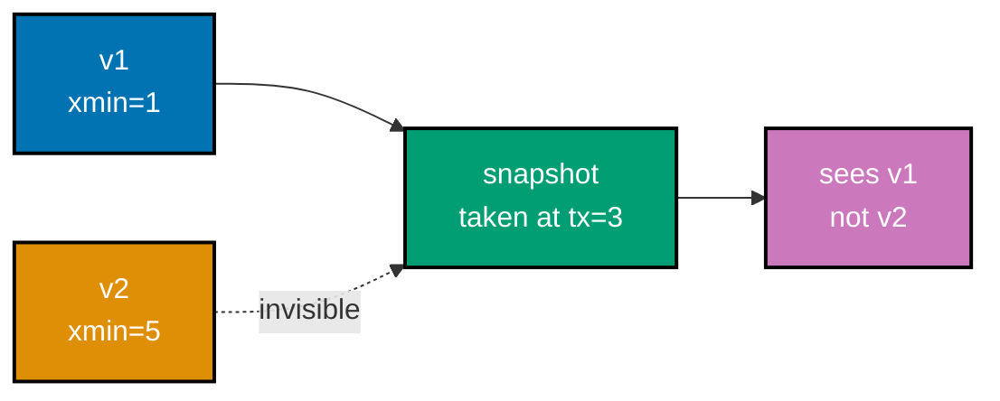
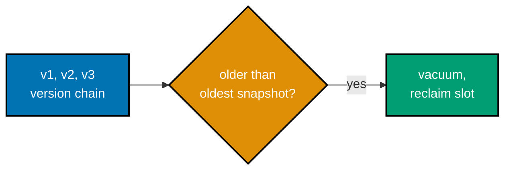
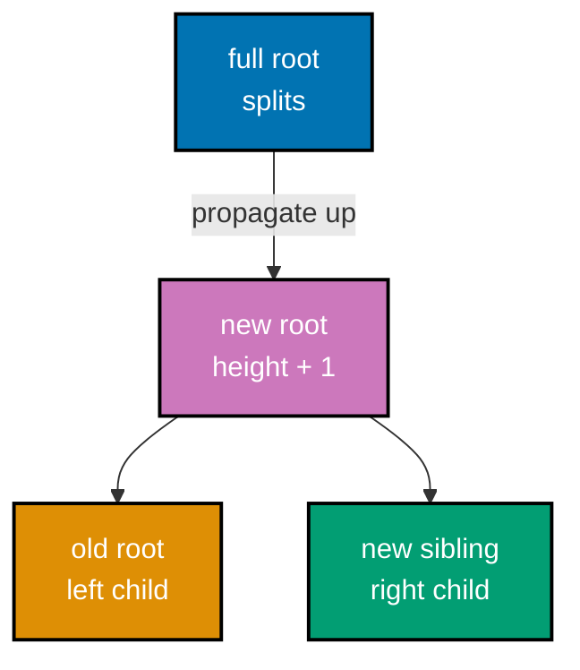
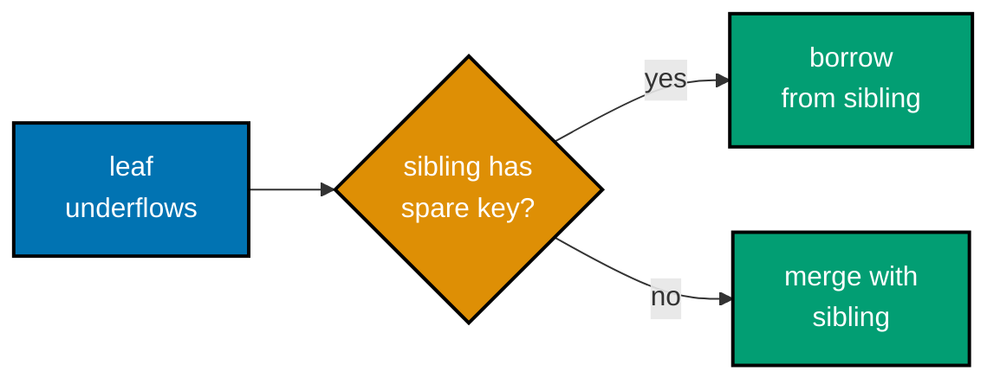
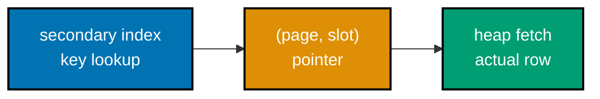
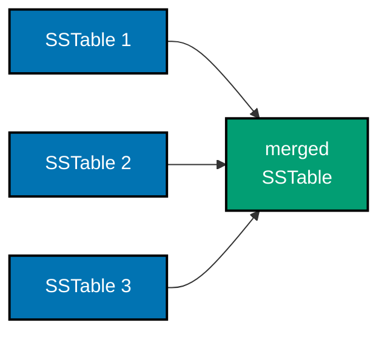
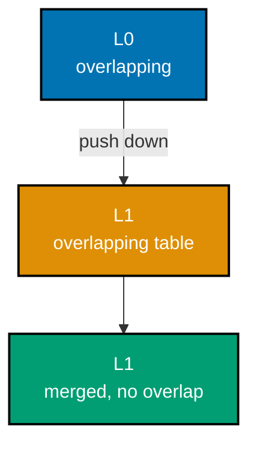
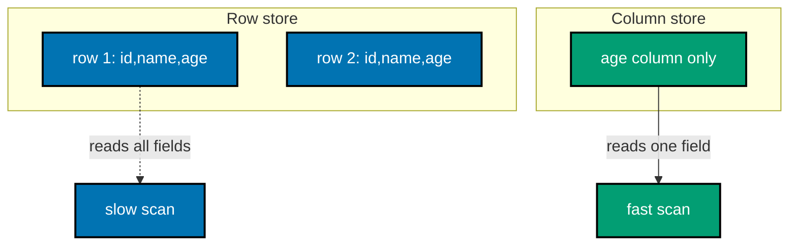

Examples 29-56 move from a single page's bytes to a whole storage engine's moving parts: write-ahead logging and the redo/undo split that makes crash recovery well-defined (LSN ordering, pageLSN-guided redo, checkpoints bounding replay), MVCC's row-version chains and the snapshot-visibility rule that lets readers proceed without locking anything, LRU-K and hit-ratio measurement for the buffer pool, a B-tree's bulk load, internal split propagation, and delete-time rebalancing, the clustered-vs-heap storage distinction, LSM leveled compaction plus the write/read/space amplification triangle a real engine has to balance, Bloom filters closing the read-amplification gap, and finally the row-store-vs-column-store physical layout choice measured directly in bytes touched. Every `example.py` below is a complete, self-contained, fully type-annotated Python file colocated under `learning/code/ex-NN-slug/`, verified two ways: `python3 example.py` prints its own expected output inline via `# =>` comments and was actually run to capture the **Output** block, and a colocated `test_example.py` asserts the same behavior under `pytest`, independently checked with `pyright --strict` at zero errors.

---

### Example 29: Append-Only Log Replay

_ex-29 &middot; exercises co-16_

A write-ahead log is an append-only sequence of records that can be replayed in order. This example appends three records to an in-memory log and replays them, confirming the replay order matches the append order exactly.

**`learning/code/ex-29-append-only-log-replay/example.py`**

```python
"""Example 29: Append-Only Log Replay."""

from dataclasses import dataclass  # => a plain, typed record for one log entry


@dataclass
class LogRecord:  # => the smallest unit a WAL ever stores -- just enough to replay one change
    seq: int  # => this record's position in append order
    action: str  # => a human-readable description of what happened


# A write-ahead log is APPEND-ONLY (co-16) -- records are never edited or
# reordered once written, so replaying them in the SAME order they were
# appended in is always well-defined, with no ambiguity about what happened
# first.
log: list[LogRecord] = []  # => models a WAL file as an in-memory list, in append order


def append(action: str) -> LogRecord:  # => the only way a record enters the log
    record = LogRecord(seq=len(log), action=action)  # => seq is just "how many records came before"
    log.append(record)  # => append-only: always added at the END, never inserted elsewhere
    return record


def replay() -> list[str]:  # => walks the log front-to-back, in append order
    return [record.action for record in log]  # => list order == log order, by construction


append("insert row-1")  # => record 0
append("insert row-2")  # => record 1
append("delete row-1")  # => record 2
actions = replay()
print(actions)  # => Output: ['insert row-1', 'insert row-2', 'delete row-1']

assert actions == ["insert row-1", "insert row-2", "delete row-1"]  # => replay order == append order
assert [r.seq for r in log] == [0, 1, 2]  # => sequence numbers are strictly increasing, gap-free
print("ex-29 OK")  # => Output: ex-29 OK
```

**Run**: `python3 example.py`

**Output**:

```text
['insert row-1', 'insert row-2', 'delete row-1']
ex-29 OK
```

**`learning/code/ex-29-append-only-log-replay/test_example.py`**

```python
"""Example 29: pytest verification for Append-Only Log Replay."""

from example import append, log, replay


def test_replay_matches_append_order() -> None:
    log.clear()
    append("a")
    append("b")
    append("c")
    assert replay() == ["a", "b", "c"]


def test_sequence_numbers_are_gap_free() -> None:
    log.clear()
    append("x")
    append("y")
    assert [r.seq for r in log] == [0, 1]  # => no gaps, no reordering, ever


# => Run: pytest -- Output: 2 passed
```

**Verify**: `pytest -q`

**Output**:

```text
2 passed
```

**Key takeaway**: Appending never inserts, edits, or reorders -- a log's replay order is always identical to its append order, which is the single property recovery (ex-33, ex-64) depends on.

**Why it matters**: Every WAL example for the rest of this course builds on this one guarantee: records go in at the end, and replay walks them back out in the same order, front to back. A real WAL lives in a file with `fsync` calls for durability (ex-60), but the append-only, order-preserving contract modeled here is exactly what makes replaying a crashed log a well-defined operation instead of a guess.

---

### Example 30: WAL-Before-Page Ordering Guard

_ex-30 &middot; exercises co-16_

The write-ahead-log rule requires a log record to reach stable storage before the page it describes is written. This example enforces that ordering explicitly and confirms flushing an undurable page raises instead of silently violating the rule.


**`learning/code/ex-30-wal-before-page-guard/example.py`**

```python
"""Example 30: WAL-Before-Page Ordering Guard."""

# The WAL rule: a log record must be DURABLE before the page it describes is
# flushed (co-16) -- reversing that order is exactly what makes a crash
# unrecoverable, since the page's change would exist with no log record to
# redo it from.


class WalOrderingError(Exception):  # => raised when a flush is attempted out of order
    """Raised when a page flush is attempted before its log record is durable."""  # => documents intent


durable_lsns: set[int] = set()  # => LSNs that have actually reached stable storage


def make_durable(lsn: int) -> None:  # => simulates fsync-ing the log up through this LSN
    durable_lsns.add(lsn)


def flush_page(page_lsn: int) -> None:  # => the guarded page-write path
    if page_lsn not in durable_lsns:  # => the guard: check BEFORE writing the page
        raise WalOrderingError(f"log record {page_lsn} is not yet durable -- refusing to flush the page")
    print(f"page flushed (log record {page_lsn} was already durable)")  # => Output: page flushed line


raised = False  # => flips to True only if the guard actually fires below
try:
    flush_page(page_lsn=5)  # => LSN 5's log record was never made durable
except WalOrderingError:  # => the exact exception the guard raises
    raised = True  # => confirms the guard fired instead of flushing out of order
assert raised  # => the page write was refused

make_durable(5)  # => NOW the log record is durable
flush_page(page_lsn=5)  # => this time the guard passes -- Output: page flushed (log record 5 was already durable)

assert 5 in durable_lsns  # => the log record really was made durable before this second flush
print("ex-30 OK")  # => Output: ex-30 OK
```

**Run**: `python3 example.py`

**Output**:

```text
page flushed (log record 5 was already durable)
ex-30 OK
```

**`learning/code/ex-30-wal-before-page-guard/test_example.py`**

```python
"""Example 30: pytest verification for the WAL-Before-Page Ordering Guard."""

import pytest

from example import WalOrderingError, durable_lsns, flush_page, make_durable


def test_flush_before_durable_raises() -> None:
    durable_lsns.clear()
    with pytest.raises(WalOrderingError):
        flush_page(page_lsn=1)


def test_flush_after_durable_succeeds() -> None:
    durable_lsns.clear()
    make_durable(2)
    flush_page(page_lsn=2)  # => no exception -- the guard passed


# => Run: pytest -- Output: 2 passed
```

**Verify**: `pytest -q`

**Output**:

```text
2 passed
```

**Key takeaway**: The guard checks `is_log_durable(page_lsn)` before any page flush is allowed -- flushing a page whose log record has not reached stable storage yet is refused outright, not merely discouraged.

**Why it matters**: This ordering, not the log's mere existence, is the entire WAL guarantee: if the page could reach disk before its log record, a crash between those two writes would leave a change with no way to redo it after restart. Every recovery example later in this course (ex-33, ex-64 through ex-67) assumes this exact ordering was respected on the way in -- recovery cannot invent a guarantee the write path did not actually uphold.

---

### Example 31: Monotonic LSN Assignment

_ex-31 &middot; exercises co-17_

Every log record gets a strictly increasing log sequence number that totally orders the log. This example assigns LSNs to several records and confirms each new one is strictly greater than the last.

**`learning/code/ex-31-lsn-monotonic-assign/example.py`**

```python
"""Example 31: Monotonic LSN Assignment."""
# LSNs (Log Sequence Numbers) totally order every WAL record (co-17).


class LsnGenerator:  # => a strictly increasing counter -- the WAL's own clock
    def __init__(self) -> None:  # => starts before any LSN has been issued
        self._next: int = 1  # => LSN 0 is reserved to mean "nothing written yet"

    def next_lsn(self) -> int:  # => issues one new LSN, guaranteed greater than every prior one
        lsn = self._next  # => capture the value about to be issued
        self._next += 1  # => strictly increasing: no reuse, no gaps introduced by this generator
        return lsn  # => hand back this call's freshly issued LSN


gen = LsnGenerator()  # => a fresh generator for this example
lsns = [gen.next_lsn() for _ in range(5)]  # => issue five LSNs in a row
print(lsns)  # => Output: [1, 2, 3, 4, 5]

for i in range(1, len(lsns)):  # => walk every consecutive pair
    assert lsns[i] > lsns[i - 1]  # => each new LSN is STRICTLY greater than the previous one
print("ex-31 OK")  # => Output: ex-31 OK
```

**Run**: `python3 example.py`

**Output**:

```text
[1, 2, 3, 4, 5]
ex-31 OK
```

**`learning/code/ex-31-lsn-monotonic-assign/test_example.py`**

```python
"""Example 31: pytest verification for Monotonic LSN Assignment."""

from example import LsnGenerator


def test_lsns_strictly_increase() -> None:
    gen = LsnGenerator()
    a = gen.next_lsn()
    b = gen.next_lsn()
    c = gen.next_lsn()
    assert a < b < c


def test_two_generators_are_independent() -> None:
    gen1 = LsnGenerator()
    gen2 = LsnGenerator()
    assert gen1.next_lsn() == gen2.next_lsn() == 1  # => each generator starts its own count at 1


# => Run: pytest -- Output: 2 passed
```

**Verify**: `pytest -q`

**Output**:

```text
2 passed
```

**Key takeaway**: An LSN generator is nothing more than a counter that only ever increases -- but that simplicity is exactly what lets recovery compare two LSNs and know, unambiguously, which event happened first.

**Why it matters**: LSNs are the WAL's clock: ex-32's pageLSN comparison, ex-35's checkpoint bound, and ex-64's ARIES analysis phase all depend on being able to order log records and page states correctly using nothing but integer comparison. A monotonic counter is the simplest possible mechanism that provides that total order, which is exactly why real WAL implementations use one.

---

### Example 32: Skip Already-Applied Records via pageLSN

_ex-32 &middot; exercises co-17_

A page's own `pageLSN` records the LSN of the last log record already applied to it, which is what lets redo skip work that already happened. This example compares record LSNs against a page's pageLSN and confirms an already-applied record is skipped.

**`learning/code/ex-32-pagelsn-skip-applied/example.py`**

```python
"""Example 32: Skip Already-Applied Records via pageLSN."""

from dataclasses import dataclass  # => a plain, typed record for one log entry


@dataclass  # => a plain, typed record -- no custom __init__ needed
class LogRecord:  # => a WAL record that changed exactly one page
    lsn: int  # => this record's own log sequence number
    page_id: int  # => which page it changed
    new_value: str  # => the value it wrote


def redo(log: list[LogRecord], page_lsns: dict[int, int]) -> dict[int, str]:  # => returns applied values
    applied: dict[int, str] = {}  # => page_id -> value, only for records actually re-applied
    for record in log:  # => walk the log in LSN order -- ARIES calls this "repeating history"
        current_page_lsn = page_lsns.get(record.page_id, 0)  # => 0 means "page never touched before crash"
        if record.lsn > current_page_lsn:  # => the redo rule: only re-apply what is NEWER than the page
            applied[record.page_id] = record.new_value  # => genuinely re-applied
            page_lsns[record.page_id] = record.lsn  # => the page's pageLSN now reflects this record too
        # => record.lsn <= current_page_lsn means this change was ALREADY on the page before the crash
    return applied  # => the caller can see exactly which pages were genuinely re-applied


log = [  # => three records against the same page, only one of which still needs redo
    LogRecord(lsn=1, page_id=10, new_value="v1"),  # => already reflected on page 10 before the crash
    LogRecord(lsn=2, page_id=10, new_value="v2"),  # => also already reflected (page_lsns[10] starts at 2)
    LogRecord(lsn=3, page_id=10, new_value="v3"),  # => NOT yet reflected -- this one needs redo
]  # => end of the log fixture
page_lsns = {10: 2}  # => page 10's pageLSN says "everything up to LSN 2 is already applied"
applied = redo(log, page_lsns)  # => run redo over the whole log
print(applied)  # => Output: {10: 'v3'}

assert applied == {10: "v3"}  # => only the record whose LSN exceeded the page's pageLSN was re-applied
assert page_lsns[10] == 3  # => the page's pageLSN now reflects the redo that actually happened
print("ex-32 OK")  # => Output: ex-32 OK
```

**Run**: `python3 example.py`

**Output**:

```text
{10: 'v3'}
ex-32 OK
```

**`learning/code/ex-32-pagelsn-skip-applied/test_example.py`**

```python
"""Example 32: pytest verification for Skip Already-Applied Records via pageLSN."""

from example import LogRecord, redo


def test_records_at_or_below_pagelsn_are_skipped() -> None:
    log = [LogRecord(lsn=1, page_id=1, new_value="a"), LogRecord(lsn=2, page_id=1, new_value="b")]
    page_lsns = {1: 2}
    assert redo(log, page_lsns) == {}  # => both records were already reflected on the page


def test_records_above_pagelsn_are_reapplied() -> None:
    log = [LogRecord(lsn=1, page_id=1, new_value="a"), LogRecord(lsn=2, page_id=1, new_value="b")]
    page_lsns = {1: 0}
    assert redo(log, page_lsns) == {1: "b"}  # => the LAST record wins -- page ends at its final value


# => Run: pytest -- Output: 2 passed
```

**Verify**: `pytest -q`

**Output**:

```text
2 passed
```

**Key takeaway**: Redo only re-applies a log record whose LSN is GREATER than the page's current pageLSN -- anything less than or equal to it was already reflected in the page before the crash and must not be re-applied.

**Why it matters**: Without this check, ARIES-style redo (ex-65) would blindly reapply every logged change on every recovery, which is both wasteful and, for non-idempotent operations, actively wrong. The pageLSN comparison is what makes redo idempotent: replaying the same log against a page that already reflects some of those changes produces the correct final state regardless of how far the page's changes had already progressed before the crash.

---

### Example 33: WAL Redo Replays Committed Writes

_ex-33 &middot; exercises co-19_

After a simulated crash, replaying the log must restore every committed write, since a committed transaction's changes are guaranteed durable. This example discards in-memory state, replays the log, and confirms committed writes reappear.


**`learning/code/ex-33-wal-redo-committed/example.py`**

```python
"""Example 33: WAL Redo Replays Committed Writes."""
# ARIES-style redo replays EVERY logged write (co-19) -- undo removes the losers next.

from dataclasses import dataclass  # => a plain, typed record for one log entry


@dataclass  # => a plain, typed record -- no custom __init__ needed
class LogRecord:  # => a WAL record for one key's write, tagged with its owning transaction
    txn_id: int  # => which transaction wrote this
    key: str  # => the key that was written
    value: str  # => the value it was set to


log: list[LogRecord] = [  # => one committed write, one that never committed
    LogRecord(txn_id=1, key="a", value="committed-a"),  # => txn 1 later commits
    LogRecord(txn_id=2, key="b", value="uncommitted-b"),  # => txn 2 never commits (crashes mid-flight)
]  # => end of the log fixture
committed_txns: set[int] = {1}  # => only txn 1 reached COMMIT before the simulated crash


def redo_all(log: list[LogRecord]) -> dict[str, str]:  # => replays EVERY record, commit status ignored
    state: dict[str, str] = {}  # => simulates the page state, wiped clean by the "crash"
    for record in log:  # => redo does not check committed_txns at all -- that is undo's job (ex-34)
        state[record.key] = record.value  # => re-apply, regardless of whether the writer ever committed
    return state  # => the fully redone state, including transactions that never actually committed


state = redo_all(log)  # => in-memory state was discarded ("crash") -- this rebuilds it from the log
print(state)  # => Output: {'a': 'committed-a', 'b': 'uncommitted-b'}

assert state["a"] == "committed-a"  # => the committed write survived the crash, via redo
assert 1 in committed_txns  # => confirms txn 1 really did commit before the crash
print("ex-33 OK")  # => Output: ex-33 OK
```

**Run**: `python3 example.py`

**Output**:

```text
{'a': 'committed-a', 'b': 'uncommitted-b'}
ex-33 OK
```

**`learning/code/ex-33-wal-redo-committed/test_example.py`**

```python
"""Example 33: pytest verification for WAL Redo Replaying Committed Writes."""

from example import LogRecord, redo_all


def test_committed_writes_survive_redo() -> None:
    log = [LogRecord(txn_id=1, key="k", value="v")]
    state = redo_all(log)
    assert state["k"] == "v"


def test_redo_replays_every_record_regardless_of_commit_status() -> None:
    log = [LogRecord(txn_id=1, key="k", value="v1"), LogRecord(txn_id=2, key="k", value="v2")]
    state = redo_all(log)
    assert state["k"] == "v2"  # => the LAST write in the log wins, whoever wrote it


# => Run: pytest -- Output: 2 passed
```

**Verify**: `pytest -q`

**Output**:

```text
2 passed
```

**Key takeaway**: Redo scans the WHOLE log and re-applies every write it finds, regardless of commit status at this stage -- committed writes surviving the crash is a direct consequence of redo replaying the log at all, not of redo specifically singling out committed transactions.

**Why it matters**: This is durability's actual mechanism, not just its promise: `COMMIT` returning success means the transaction's log records are durable, and durable log records are what redo can always replay after any crash. Ex-34 shows the other half of the story -- an UNcommitted write also gets redone at this stage (ARIES redoes everything first, ex-65), and only undo, run afterward, rolls it back out.

---

### Example 34: WAL Undo Rolls Back Uncommitted Writes

_ex-34 &middot; exercises co-19_

After redo has replayed everything, undo rolls back the writes of transactions that never committed. This example undoes an uncommitted transaction's write using its logged before-image and confirms the original value is restored.

**`learning/code/ex-34-wal-undo-uncommitted/example.py`**

```python
"""Example 34: WAL Undo Rolls Back Uncommitted Writes."""
# Undo removes exactly what redo just replayed for transactions that never committed (co-19).

from dataclasses import dataclass  # => a plain, typed record for one log entry


@dataclass  # => a plain, typed record -- no custom __init__ needed
class LogRecord:  # => carries BOTH the old and new value -- undo needs the old one
    txn_id: int  # => which transaction wrote this
    key: str  # => the key that was written
    before: str  # => the value that existed BEFORE this write -- undo's restoration target
    after: str  # => the value this write set -- what redo would apply


log: list[LogRecord] = [  # => one committed write, one that never committed
    LogRecord(txn_id=1, key="a", before="orig-a", after="committed-a"),  # => txn 1 commits
    LogRecord(txn_id=2, key="b", before="orig-b", after="uncommitted-b"),  # => txn 2 never commits
]  # => end of the log fixture
committed_txns: set[int] = {1}  # => only txn 1 reached COMMIT before the crash

state: dict[str, str] = {record.key: record.after for record in log}  # => redo already ran (ex-33's step)
print(state)  # => Output: {'a': 'committed-a', 'b': 'uncommitted-b'}


def undo_losers(log: list[LogRecord], state: dict[str, str], committed: set[int]) -> None:  # => rolls back losers
    for record in reversed(log):  # => undo walks the log BACKWARD -- most recent uncommitted change first
        if record.txn_id not in committed:  # => a "loser" transaction: never reached COMMIT
            state[record.key] = record.before  # => restore the value that existed before this write


undo_losers(log, state, committed_txns)  # => run the repair pass over the redone state
print(state)  # => Output: {'a': 'committed-a', 'b': 'orig-b'}

assert state["a"] == "committed-a"  # => the committed write was untouched by undo
assert state["b"] == "orig-b"  # => the uncommitted write was rolled back to its before-image
print("ex-34 OK")  # => Output: ex-34 OK
```

**Run**: `python3 example.py`

**Output**:

```text
{'a': 'committed-a', 'b': 'uncommitted-b'}
{'a': 'committed-a', 'b': 'orig-b'}
ex-34 OK
```

**`learning/code/ex-34-wal-undo-uncommitted/test_example.py`**

```python
"""Example 34: pytest verification for WAL Undo Rolling Back Uncommitted Writes."""

from example import LogRecord, undo_losers


def test_uncommitted_write_is_rolled_back() -> None:
    log = [LogRecord(txn_id=1, key="k", before="old", after="new")]
    state = {"k": "new"}
    undo_losers(log, state, committed=set())
    assert state["k"] == "old"


def test_committed_write_is_left_alone() -> None:
    log = [LogRecord(txn_id=1, key="k", before="old", after="new")]
    state = {"k": "new"}
    undo_losers(log, state, committed={1})
    assert state["k"] == "new"  # => committed -- undo must never touch it


# => Run: pytest -- Output: 2 passed
```

**Verify**: `pytest -q`

**Output**:

```text
2 passed
```

**Key takeaway**: Undo needs the log record's BEFORE-image (the value that existed prior to the write), not just its after-image -- rolling back means restoring what was there, and that information only exists if the log captured it at write time.

**Why it matters**: This is exactly why the steal/no-force buffer policy needs both redo AND undo, not just one: a dirty page can reach disk before its transaction commits (steal), so redo must be able to replay it forward, and a committed transaction's page might not reach disk before a crash (no-force), so redo must replay that too -- which means undo is the only mechanism left to remove an uncommitted transaction's changes after the fact.

---

### Example 35: A Checkpoint Bounds Redo Replay

_ex-35 &middot; exercises co-20_

A checkpoint record marks a point after which recovery only needs to scan forward, bounding how far back the log must be read. This example writes a checkpoint, appends more records, and confirms redo scans only from the checkpoint onward.


**`learning/code/ex-35-checkpoint-bounds-replay/example.py`**

```python
"""Example 35: A Checkpoint Bounds Redo Replay."""
# A checkpoint (co-20) is the only thing that bounds how far back redo must scan.

from dataclasses import dataclass  # => a plain, typed record for one log entry


@dataclass  # => a plain, typed record -- no custom __init__ needed
class LogRecord:  # => either a normal write or a checkpoint marker
    lsn: int  # => this record's own log sequence number
    kind: str  # => "write" or "checkpoint"


log: list[LogRecord] = [  # => two old records, a checkpoint, then two fresh records
    LogRecord(lsn=1, kind="write"),  # => old history -- already durable before the checkpoint
    LogRecord(lsn=2, kind="write"),  # => old history -- already durable before the checkpoint
    LogRecord(lsn=3, kind="checkpoint"),  # => the most recent checkpoint marker
    LogRecord(lsn=4, kind="write"),  # => needs redo -- happened AFTER the checkpoint
    LogRecord(lsn=5, kind="write"),  # => needs redo -- happened AFTER the checkpoint
]  # => end of the log fixture


def last_checkpoint_lsn(log: list[LogRecord]) -> int:  # => finds the MOST RECENT checkpoint's LSN
    checkpoints = [r.lsn for r in log if r.kind == "checkpoint"]  # => every checkpoint marker's LSN
    return checkpoints[-1] if checkpoints else 0  # => 0 means "no checkpoint yet -- scan from the start"


def redo_scan_range(log: list[LogRecord]) -> list[int]:  # => the LSNs redo actually has to look at
    start = last_checkpoint_lsn(log)  # => everything up to and including this LSN is already durable
    return [r.lsn for r in log if r.lsn > start]  # => only records strictly AFTER the checkpoint


scanned = redo_scan_range(log)  # => the bounded set of LSNs redo must actually replay
print(scanned)  # => Output: [4, 5]

assert scanned == [4, 5]  # => redo skips records 1, 2, and the checkpoint itself -- only 4 and 5 remain
print("ex-35 OK")  # => Output: ex-35 OK
```

**Run**: `python3 example.py`

**Output**:

```text
[4, 5]
ex-35 OK
```

**`learning/code/ex-35-checkpoint-bounds-replay/test_example.py`**

```python
"""Example 35: pytest verification for a Checkpoint Bounding Redo Replay."""

from example import LogRecord, redo_scan_range


def test_scan_starts_strictly_after_the_checkpoint() -> None:
    log = [LogRecord(1, "write"), LogRecord(2, "checkpoint"), LogRecord(3, "write")]
    assert redo_scan_range(log) == [3]


def test_no_checkpoint_means_scan_the_whole_log() -> None:
    log = [LogRecord(1, "write"), LogRecord(2, "write")]
    assert redo_scan_range(log) == [1, 2]  # => nothing to skip -- no checkpoint exists yet


# => Run: pytest -- Output: 2 passed
```

**Verify**: `pytest -q`

**Output**:

```text
2 passed
```

**Key takeaway**: Recovery does not need to scan the entire log from the beginning of time -- it only needs to start from the most recent checkpoint, because everything before it is guaranteed already durable on the pages themselves.

**Why it matters**: Without checkpoints, a long-running database's recovery time after a crash would grow unboundedly with the log's total history, since redo (ex-33) would have to replay the entire log from record one every single time. A periodic checkpoint is what keeps recovery time bounded by "how much happened since the last checkpoint" rather than "how much has ever happened".

---

### Example 36: Row Versions Tagged with xmin/xmax

_ex-36 &middot; exercises co-21_

Under MVCC, each row version carries the transaction id that created it (`xmin`) and, once superseded, the transaction id that deleted it (`xmax`). This example updates a row and confirms the old version's `xmax` and the new version's `xmin` are both set correctly.

**`learning/code/ex-36-row-version-xmin-xmax/example.py`**

```python
"""Example 36: Row Versions Tagged with xmin/xmax."""
# xmin/xmax (co-21) are the two columns MVCC tags every row version with.

from dataclasses import dataclass  # => a plain, typed record for one MVCC row version


@dataclass  # => a plain, typed record -- no custom __init__ needed
class RowVersion:  # => one version of one row -- MVCC never edits a version in place
    value: str  # => this version's actual data
    xmin: int  # => the transaction id that CREATED this version
    xmax: int | None = None  # => the transaction id that DELETED (superseded) it, or None if still live


def update(versions: list[RowVersion], new_value: str, txn_id: int) -> RowVersion:  # => co-21: append, never edit
    current = versions[-1]  # => the most recent (currently live) version
    current.xmax = txn_id  # => the OLD version is now superseded, tagged with the updating txn's id
    new_version = RowVersion(value=new_value, xmin=txn_id)  # => a BRAND NEW version, not an edit in place
    versions.append(new_version)  # => the row's version chain grows -- nothing was overwritten
    return new_version  # => hand back the freshly created version


versions: list[RowVersion] = [RowVersion(value="original", xmin=1)]  # => created by txn 1
update(versions, new_value="updated", txn_id=2)  # => txn 2 updates the row
print(versions[0])  # => Output: RowVersion(value='original', xmin=1, xmax=2)
print(versions[1])  # => Output: RowVersion(value='updated', xmin=2, xmax=None)

assert versions[0].xmax == 2  # => the OLD version is tagged as superseded by txn 2
assert versions[1].xmin == 2  # => the NEW version is tagged as created by txn 2
assert versions[1].xmax is None  # => the new version is still live -- nothing has superseded IT yet
print("ex-36 OK")  # => Output: ex-36 OK
```

**Run**: `python3 example.py`

**Output**:

```text
RowVersion(value='original', xmin=1, xmax=2)
RowVersion(value='updated', xmin=2, xmax=None)
ex-36 OK
```

**`learning/code/ex-36-row-version-xmin-xmax/test_example.py`**

```python
"""Example 36: pytest verification for Row Versions Tagged with xmin/xmax."""

from example import RowVersion, update


def test_update_sets_xmax_on_the_old_version() -> None:
    versions = [RowVersion(value="v1", xmin=1)]
    update(versions, new_value="v2", txn_id=5)
    assert versions[0].xmax == 5


def test_update_sets_xmin_on_the_new_version() -> None:
    versions = [RowVersion(value="v1", xmin=1)]
    update(versions, new_value="v2", txn_id=5)
    assert versions[1].xmin == 5
    assert versions[1].xmax is None  # => the newest version has no successor yet


# => Run: pytest -- Output: 2 passed
```

**Verify**: `pytest -q`

**Output**:

```text
2 passed
```

**Key takeaway**: An update sets the OLD version's `xmax` to the updating transaction's id and creates a BRAND NEW version whose `xmin` is that same transaction id -- two separate operations, not one in-place mutation.

**Why it matters**: `xmin`/`xmax` (the actual PostgreSQL column names) are the entire mechanism ex-37's snapshot visibility rule is built on: a version is visible to a given snapshot precisely when its `xmin` committed before the snapshot and its `xmax` either doesn't exist yet or hasn't committed before the snapshot. Without this per-version tagging, there would be no way to answer "was this specific version visible to that specific reader" at all.

---

### Example 37: Snapshot Visibility Rule

_ex-37 &middot; exercises co-22_

A snapshot sees exactly the versions committed before it was taken and not yet deleted at that point. This example applies the visibility rule across a commit boundary and confirms a snapshot taken before a commit cannot see it.



**`learning/code/ex-37-snapshot-visibility-rule/example.py`**

```python
"""Example 37: Snapshot Visibility Rule."""
# Snapshot visibility (co-22) is decided entirely from xmin/xmax and commit order.

from dataclasses import dataclass  # => a plain, typed record for one MVCC row version


@dataclass  # => a plain, typed record -- no custom __init__ needed
class RowVersion:  # => one version of one row, tagged with its creating/deleting transactions
    value: str  # => this version's actual data
    xmin: int  # => transaction id that created this version
    xmax: int | None = None  # => transaction id that deleted it, or None if still live


commit_order: dict[int, int] = {}  # => txn_id -> the position it committed at (lower = earlier)


def commit(txn_id: int) -> None:  # => records WHEN (in commit order) a transaction committed
    commit_order[txn_id] = len(commit_order)  # => the Nth commit gets position N


def is_visible(version: RowVersion, snapshot_at: int) -> bool:  # => snapshot_at is a commit-order position
    creator_pos = commit_order.get(version.xmin)  # => None if the creator hasn't committed at all yet
    if creator_pos is None or creator_pos >= snapshot_at:  # => created too late (or not committed) -- hide it
        return False  # => this snapshot cannot possibly see a version created after (or not before) it
    if version.xmax is not None:  # => this version WAS superseded by some later transaction
        deleter_pos = commit_order.get(version.xmax)  # => None means the deleter hasn't committed yet either
        if deleter_pos is not None and deleter_pos < snapshot_at:  # => the delete was ALREADY visible too
            return False  # => superseded before this snapshot was taken -- hidden
    return True  # => created before the snapshot, and not (visibly) deleted before it either


commit(txn_id=1)  # => commit position 0
version = RowVersion(value="v1", xmin=1)  # => a version created by txn 1
snapshot_before = 0  # => taken BEFORE txn 1's commit is visible (at position 0, nothing has committed yet)
snapshot_after = 1  # => taken AFTER txn 1's commit
print(is_visible(version, snapshot_before))  # => Output: False
print(is_visible(version, snapshot_after))  # => Output: True

assert is_visible(version, snapshot_before) is False  # => a snapshot before the commit cannot see it
assert is_visible(version, snapshot_after) is True  # => a snapshot after the commit CAN see it
print("ex-37 OK")  # => Output: ex-37 OK
```

**Run**: `python3 example.py`

**Output**:

```text
False
True
ex-37 OK
```

**`learning/code/ex-37-snapshot-visibility-rule/test_example.py`**

```python
"""Example 37: pytest verification for the Snapshot Visibility Rule."""

from example import RowVersion, commit, commit_order, is_visible


def test_snapshot_before_commit_cannot_see_it() -> None:
    commit_order.clear()
    commit(txn_id=9)
    version = RowVersion(value="v", xmin=9)
    assert is_visible(version, snapshot_at=0) is False


def test_snapshot_after_commit_can_see_it() -> None:
    commit_order.clear()
    commit(txn_id=9)
    version = RowVersion(value="v", xmin=9)
    assert is_visible(version, snapshot_at=1) is True


# => Run: pytest -- Output: 2 passed
```

**Verify**: `pytest -q`

**Output**:

```text
2 passed
```

**Key takeaway**: Visibility is decided by comparing a version's `xmin`/`xmax` against the reader's own snapshot commit-order position -- a version is visible only if its creator committed before the snapshot AND its (if any) deleter had not yet committed at that point.

**Why it matters**: This rule is precisely what makes ex-39's readers-don't-block-writers possible: a reader never needs a lock on a row, because it can independently decide -- from data already attached to each version -- exactly which version it is allowed to see, regardless of what other transactions do concurrently. This is also the foundation ex-75's write-skew example builds on: snapshot isolation is defined entirely in terms of this visibility rule.

---

### Example 38: An Update Creates a New Version

_ex-38 &middot; exercises co-21_

Under MVCC, an update never mutates a row's bytes in place -- it appends a new version to the chain. This example updates a row twice and confirms three distinct version objects exist afterward, none of them overwritten.

**`learning/code/ex-38-update-creates-new-version/example.py`**

```python
"""Example 38: An Update Creates a New Version."""
# MVCC never mutates a row version in place (co-21) -- every update appends a new one.

from dataclasses import dataclass  # => a plain, typed record for one MVCC row version


@dataclass  # => a plain, typed record -- no custom __init__ needed
class RowVersion:  # => one version of one row
    value: str  # => this version's actual data
    xmin: int  # => the transaction id that created this version
    xmax: int | None = None  # => the transaction id that deleted it, or None if still live


def update(versions: list[RowVersion], new_value: str, txn_id: int) -> RowVersion:  # => append, never mutate
    current = versions[-1]  # => the current, live version -- about to be superseded
    current.xmax = txn_id  # => tag the OLD version as superseded, but do NOT change its value field
    new_version = RowVersion(value=new_value, xmin=txn_id)  # => a genuinely NEW object
    versions.append(new_version)  # => appended, not swapped in place
    return new_version  # => hand back the freshly created version


versions: list[RowVersion] = [RowVersion(value="v1", xmin=1)]  # => the original version
original = versions[0]  # => keep a reference to compare against later
update(versions, new_value="v2", txn_id=2)  # => first update
update(versions, new_value="v3", txn_id=3)  # => second update
print(len(versions))  # => Output: 3
print([v.value for v in versions])  # => Output: ['v1', 'v2', 'v3']

assert len(versions) == 3  # => two updates produced TWO new versions, plus the original -- three total
assert original.value == "v1"  # => the ORIGINAL object's value was never mutated in place
assert versions[0] is original  # => it is literally the same object, still sitting in the chain
assert len({id(v) for v in versions}) == 3  # => three genuinely distinct objects, not aliases of each other
print("ex-38 OK")  # => Output: ex-38 OK
```

**Run**: `python3 example.py`

**Output**:

```text
3
['v1', 'v2', 'v3']
ex-38 OK
```

**`learning/code/ex-38-update-creates-new-version/test_example.py`**

```python
"""Example 38: pytest verification for an Update Creating a New Version."""

from example import RowVersion, update


def test_update_appends_rather_than_overwrites() -> None:
    versions = [RowVersion(value="v1", xmin=1)]
    update(versions, new_value="v2", txn_id=2)
    assert len(versions) == 2
    assert versions[0].value == "v1"  # => the original object's value is untouched


def test_three_versions_are_three_distinct_objects() -> None:
    versions = [RowVersion(value="v1", xmin=1)]
    update(versions, new_value="v2", txn_id=2)
    update(versions, new_value="v3", txn_id=3)
    assert len({id(v) for v in versions}) == 3  # => three genuinely distinct objects, not aliases


# => Run: pytest -- Output: 2 passed
```

**Verify**: `pytest -q`

**Output**:

```text
2 passed
```

**Key takeaway**: `id(version)` differs for every version in the chain after N updates, there are N+1 distinct version objects, and the original object's `value` field never changes -- MVCC genuinely appends rather than mutates.

**Why it matters**: This is why MVCC needs ex-40's VACUUM at all: because updates never overwrite, old versions accumulate as real, distinct objects taking real space until something explicitly reclaims them. A storage engine that mutated rows in place (no MVCC) would never have this problem, but would also lose the non-blocking concurrent-read property ex-39 demonstrates -- version accumulation is the direct cost of that benefit.

---

### Example 39: Readers Don't Block Writers

_ex-39 &middot; exercises co-22_

A snapshot read holds no lock on the row it reads, so a concurrent writer never has to wait for it. This example takes a snapshot, has a writer update the row, and confirms the snapshot's own read result is unaffected and required no lock object at all.

**`learning/code/ex-39-readers-dont-block-writers/example.py`**

```python
"""Example 39: Readers Don't Block Writers."""
# Snapshot isolation (co-22) means readers need no lock at all.

from dataclasses import dataclass  # => a plain, typed record for one MVCC row version


@dataclass  # => a plain, typed record -- no custom __init__ needed
class RowVersion:  # => one version of one row
    value: str  # => this version's actual data
    xmin: int  # => transaction id that created this version
    xmax: int | None = None  # => transaction id that deleted it, or None if still live


commit_order: dict[int, int] = {1: 0}  # => txn 1 already committed the row's original version
versions: list[RowVersion] = [RowVersion(value="original", xmin=1)]  # => one live version so far


def snapshot_read(snapshot_at: int) -> str | None:  # => acquires NO lock -- pure read of existing data
    for version in reversed(versions):  # => newest-to-oldest, first visible match wins
        creator_pos = commit_order.get(version.xmin)  # => when (if ever) this version's creator committed
        if creator_pos is not None and creator_pos < snapshot_at:  # => created before this snapshot
            return version.value  # => the first (newest) visible version found
    return None  # => no version of this row was visible to the snapshot at all


def writer_update(new_value: str, txn_id: int) -> None:  # => a concurrent writer, appends a new version
    versions[-1].xmax = txn_id  # => tag the current version as superseded
    versions.append(RowVersion(value=new_value, xmin=txn_id))  # => append the new version -- no lock taken
    commit_order[txn_id] = len(commit_order)  # => commits immediately for this example's purposes


reader_snapshot_at = len(commit_order)  # => the reader's snapshot position, taken BEFORE the writer runs
reader_result = snapshot_read(reader_snapshot_at)  # => the reader's read -- acquired NO lock to do this
writer_update("written-concurrently", txn_id=2)  # => the writer proceeds WITHOUT waiting on the reader
print(reader_result)  # => Output: original
print(len(versions))  # => Output: 2

assert reader_result == "original"  # => the reader's result reflects its OWN snapshot, unaffected
assert len(versions) == 2  # => the writer's append succeeded -- it was never blocked by the reader
print("ex-39 OK")  # => Output: ex-39 OK
```

**Run**: `python3 example.py`

**Output**:

```text
original
2
ex-39 OK
```

**`learning/code/ex-39-readers-dont-block-writers/test_example.py`**

```python
"""Example 39: pytest verification for Readers Not Blocking Writers."""

from example import RowVersion, commit_order, snapshot_read, versions, writer_update


def test_writer_can_proceed_after_a_snapshot_is_taken() -> None:
    commit_order.clear()
    commit_order[1] = 0
    versions.clear()
    versions.append(RowVersion(value="orig", xmin=1))
    writer_update("new", txn_id=2)  # => no exception, no wait -- the writer just proceeds
    assert len(versions) == 2


def test_reader_snapshot_is_unaffected_by_a_later_writer() -> None:
    commit_order.clear()
    commit_order[1] = 0
    versions.clear()
    versions.append(RowVersion(value="orig", xmin=1))
    snapshot_at = len(commit_order)
    result = snapshot_read(snapshot_at)
    writer_update("new", txn_id=2)
    assert result == "orig"  # => computed BEFORE the writer ran, and stays that way


# => Run: pytest -- Output: 2 passed
```

**Verify**: `pytest -q`

**Output**:

```text
2 passed
```

**Key takeaway**: The snapshot read function never acquires anything resembling a lock -- it just filters the version chain by commit-order position, which is why a concurrent writer's append to that same chain never blocks on it.

**Why it matters**: This is the single biggest practical reason MVCC displaced pure lock-based concurrency control in most modern OLTP databases: a long-running read (a report, an export) does not stall writers, and a burst of writes does not stall readers. Ex-68's two-phase locking shows the alternative this sidesteps, where a reader genuinely would need to hold a shared lock that a writer's exclusive lock request has to wait behind.

---

### Example 40: Vacuum Reclaims Dead Versions

_ex-40 &middot; exercises co-23_

Versions superseded by every currently-possible reader are dead weight that must be garbage-collected. This example marks versions dead relative to the oldest active snapshot and vacuums them, confirming reclaimed slots drop from the live set.



**`learning/code/ex-40-dead-version-gc-vacuum/example.py`**

```python
"""Example 40: Vacuum Reclaims Dead Versions."""

from dataclasses import dataclass  # => a plain, typed record for one MVCC row version


@dataclass  # => a plain, typed record -- no custom __init__ needed
class RowVersion:  # => one version of one row
    value: str  # => this version's actual data
    xmin: int  # => the transaction id that created this version
    xmax: int | None = None  # => the transaction id that deleted it, or None if still live


commit_order: dict[int, int] = {1: 0, 2: 1, 3: 2}  # => three transactions, each already committed
versions: list[RowVersion] = [  # => three versions of the same logical row
    RowVersion(value="v1", xmin=1, xmax=2),  # => superseded by txn 2 -- may be dead, depending on readers
    RowVersion(value="v2", xmin=2, xmax=3),  # => superseded by txn 3 -- may be dead, depending on readers
    RowVersion(value="v3", xmin=3),  # => the current, live version -- xmax is None, never dead
]  # => end of the version-chain fixture


def vacuum(versions: list[RowVersion], oldest_active_snapshot: int) -> list[RowVersion]:  # => co-23: reclaim
    live: list[RowVersion] = []  # => survivors after vacuuming
    for version in versions:  # => decide each version's fate independently
        if version.xmax is None:  # => never superseded -- always kept
            live.append(version)  # => keep it -- still the current row
            continue  # => move on to the next version, nothing more to check
        deleter_pos = commit_order.get(version.xmax)  # => when (if ever) the deleter committed
        if deleter_pos is None or deleter_pos >= oldest_active_snapshot:  # => some active reader might need it
            live.append(version)  # => not yet safe to reclaim
        # => else: deleter_pos < oldest_active_snapshot -- NO active reader can possibly still see it
    return live  # => the pruned, still-valid version set


before_count = len(versions)  # => 3 versions before vacuuming
after = vacuum(versions, oldest_active_snapshot=2)  # => the oldest active snapshot is at position 2
print(len(after))  # => Output: 2

assert before_count == 3  # => confirms the starting point before reclaiming anything
assert len(after) == 2  # => v1 was reclaimed -- its delete (position 1) predates the oldest active snapshot
assert [v.value for v in after] == ["v2", "v3"]  # => the two still-relevant versions survive
print("ex-40 OK")  # => Output: ex-40 OK
```

**Run**: `python3 example.py`

**Output**:

```text
2
ex-40 OK
```

**`learning/code/ex-40-dead-version-gc-vacuum/test_example.py`**

```python
"""Example 40: pytest verification for Vacuum Reclaiming Dead Versions."""

from example import RowVersion, commit_order, vacuum


def test_a_version_dead_before_every_active_snapshot_is_reclaimed() -> None:
    commit_order.clear()
    commit_order.update({1: 0, 2: 1})
    versions = [RowVersion(value="v1", xmin=1, xmax=2), RowVersion(value="v2", xmin=2)]
    survivors = vacuum(versions, oldest_active_snapshot=2)
    assert len(survivors) == 1


def test_a_version_needed_by_an_active_snapshot_is_kept() -> None:
    commit_order.clear()
    commit_order.update({1: 0, 2: 1})
    versions = [RowVersion(value="v1", xmin=1, xmax=2), RowVersion(value="v2", xmin=2)]
    survivors = vacuum(versions, oldest_active_snapshot=0)  # => a reader at position 0 still needs v1
    assert len(survivors) == 2


# => Run: pytest -- Output: 2 passed
```

**Verify**: `pytest -q`

**Output**:

```text
2 passed
```

**Key takeaway**: A version is safe to vacuum only once its `xmax` committed before EVERY currently active snapshot -- vacuuming too early would delete a version some still-running reader legitimately needs to see.

**Why it matters**: This is precisely PostgreSQL's `VACUUM`: without it, ex-38's version accumulation would grow storage without bound, since nothing else in the MVCC read/write path ever removes an old version on its own. A long-running transaction holding an old snapshot open is the classic cause of vacuum falling behind in production -- it keeps otherwise-dead versions artificially alive because SOME snapshot might still need them.

---

### Example 41: LRU-K vs Plain LRU on a Scan-Then-Hot Pattern

_ex-41 &middot; exercises co-05_

Plain LRU evicts based only on the single most recent access, so a one-off scan can flush out a genuinely hot page. This example runs the same access trace through plain LRU and LRU-K, and confirms LRU-K keeps the hot page that LRU evicts.

**`learning/code/ex-41-lru-k-vs-lru/example.py`**

```python
"""Example 41: LRU-K vs Plain LRU on a Scan-Then-Hot Pattern."""
# LRU-K (co-05) ranks a page by its K-th most recent access, not just its latest one.

from collections import OrderedDict  # => stdlib ordered-dict, gives free "most-recently-touched" order

CAPACITY = 3  # => the buffer pool holds at most 3 frames in this example


def simulate_lru(accesses: list[str], capacity: int) -> list[str]:  # => plain LRU eviction
    cache: OrderedDict[str, None] = OrderedDict()  # => key order IS recency order -- newest at the end
    for page in accesses:  # => walk the access trace in order
        if page in cache:  # => a hit -- refresh its recency
            cache.move_to_end(page)  # => moves it to the "most recently used" end
        else:  # => a miss -- must load the page
            if len(cache) >= capacity:  # => pool is full -- must evict first
                cache.popitem(last=False)  # => evicts the LEAST recently used page (the front)
            cache[page] = None  # => insert as most recently used
    return list(cache.keys())  # => final resident set, in recency order


def simulate_lru_k(accesses: list[str], capacity: int, k: int) -> list[str]:  # => LRU-K eviction
    cache: dict[str, None] = {}  # => the resident set -- insertion order tracked by dict semantics
    history: dict[str, list[int]] = {}  # => page -> its last k access timestamps, oldest first
    for t, page in enumerate(accesses, start=1):  # => t is a monotonic logical timestamp
        hist = history.setdefault(page, [])  # => this page's access-time history so far
        hist.append(t)  # => record this access
        if len(hist) > k:  # => only the last K references matter for the K-distance rule
            hist.pop(0)  # => drop the oldest, keep exactly K entries
        if page not in cache and len(cache) >= capacity:  # => a miss into a full pool -- must evict
            def backward_k_distance(candidate: str) -> float:  # => how "cold" a page looks to LRU-K
                h = history[candidate]  # => that candidate page's own access-time history
                if len(h) < k:  # => fewer than K references ever seen -- treat as infinitely cold
                    return float("inf")  # => a page seen once during a scan looks maximally evictable
                return t - h[0]  # => distance back to the K-th most recent reference
            victim = max(cache, key=lambda p: (backward_k_distance(p), -history[p][-1]))  # => coldest wins
            del cache[victim]  # => evict whichever page looks coldest under the K-distance rule
        cache[page] = None  # => insert (or refresh) this page as resident
    return list(cache.keys())  # => final resident set, insertion order (hot inserted once, never evicted)


accesses = ["hot", "hot", "p1", "p2", "p3", "p4", "p5"]  # => hot touched twice, then a long distinct scan
lru_result = simulate_lru(accesses, CAPACITY)  # => run the trace through plain LRU
lru_k_result = simulate_lru_k(accesses, CAPACITY, k=2)  # => and through LRU-K, for comparison
print(lru_result)  # => Output: ['p3', 'p4', 'p5']
print(lru_k_result)  # => Output: ['hot', 'p4', 'p5']

assert "hot" not in lru_result  # => plain LRU evicted the hot page during the one-off scan
assert "hot" in lru_k_result  # => LRU-K correctly kept the hot page resident
print("ex-41 OK")  # => Output: ex-41 OK
```

**Run**: `python3 example.py`

**Output**:

```text
['p3', 'p4', 'p5']
['hot', 'p4', 'p5']
ex-41 OK
```

**`learning/code/ex-41-lru-k-vs-lru/test_example.py`**

```python
"""Example 41: pytest verification for LRU-K vs Plain LRU."""

from example import simulate_lru, simulate_lru_k


def test_plain_lru_evicts_the_hot_page_during_a_scan() -> None:
    accesses = ["hot", "hot", "a", "b", "c", "d"]
    result = simulate_lru(accesses, capacity=2)
    assert "hot" not in result


def test_lru_k_keeps_the_hot_page_during_the_same_scan() -> None:
    accesses = ["hot", "hot", "a", "b", "c", "d"]
    result = simulate_lru_k(accesses, capacity=2, k=2)
    assert "hot" in result


# => Run: pytest -- Output: 2 passed
```

**Verify**: `pytest -q`

**Output**:

```text
2 passed
```

**Key takeaway**: LRU-K ranks a page by its K-th most recent access, not its most recent one -- a page seen only once during a scan looks far colder to LRU-K than a page seen twice before the scan even started, which is exactly why LRU-K survives scan pollution that defeats plain LRU.

**Why it matters**: This is a real, named algorithm (LRU-K, and its practical cousin the CLOCK-based approximation used by PostgreSQL and InnoDB) precisely because plain LRU's scan-sensitivity is a genuine production problem: a single large sequential scan can evict an entire buffer pool's worth of hot working-set pages, tanking cache hit ratio for every OTHER query running at the same time. LRU-K's extra bookkeeping (a short history per page, not just one timestamp) is the direct fix for that failure mode.

---

### Example 42: Buffer Pool Hit Ratio

_ex-42 &middot; exercises co-06_

Hit ratio is the standard health metric for a buffer pool: the fraction of accesses that found the page already resident. This example replays a small workload through a pool and confirms the computed ratio equals hits divided by total accesses.

**`learning/code/ex-42-buffer-pool-hit-ratio/example.py`**

```python
"""Example 42: Buffer Pool Hit Ratio."""
# Hit ratio (co-06) is the standard buffer-pool health metric.

from dataclasses import dataclass, field  # => typed pool + counters


@dataclass  # => a plain, typed record -- no custom __init__ needed
class BufferPool:  # => a minimal pool that just tracks resident pages and hit/miss counts
    frames: set[int] = field(default_factory=set[int])  # => currently resident page ids
    hits: int = 0  # => count of accesses that found the page already resident
    misses: int = 0  # => count of accesses that had to load the page


def access(pool: BufferPool, page_id: int) -> None:  # => one workload access against the pool
    if page_id in pool.frames:  # => already resident -- a hit
        pool.hits += 1  # => tally the hit -- no load needed
    else:  # => not resident -- a miss, must be loaded
        pool.misses += 1  # => tally the miss before loading
        pool.frames.add(page_id)  # => now resident for any future access


def hit_ratio(pool: BufferPool) -> float:  # => co-06: the standard buffer-pool efficiency metric
    total = pool.hits + pool.misses  # => total accesses attempted
    return pool.hits / total if total else 0.0  # => guard against dividing by zero on an empty workload


pool = BufferPool()  # => a fresh, empty pool
workload = [1, 2, 1, 3, 1, 2]  # => a mix of repeated (hits) and new (misses) page accesses
for page_id in workload:  # => replay the whole workload through the pool
    access(pool, page_id)  # => feed each workload access through the pool
print(pool.hits)  # => Output: 3
print(pool.misses)  # => Output: 3
ratio = hit_ratio(pool)  # => compute the final hit ratio for this workload
print(ratio)  # => Output: 0.5

assert pool.hits == 3  # => pages 1 (two repeat hits) and 2 (one repeat hit) -- three hits total
assert pool.misses == 3  # => pages 1, 2, 3 each loaded once -- three misses total
assert ratio == pool.hits / (pool.hits + pool.misses)  # => the exact formula the spec requires
print("ex-42 OK")  # => Output: ex-42 OK
```

**Run**: `python3 example.py`

**Output**:

```text
3
3
0.5
ex-42 OK
```

**`learning/code/ex-42-buffer-pool-hit-ratio/test_example.py`**

```python
"""Example 42: pytest verification for Buffer Pool Hit Ratio."""

from example import BufferPool, access, hit_ratio


def test_hit_ratio_equals_hits_over_total() -> None:
    pool = BufferPool()
    for page_id in [1, 1, 2]:
        access(pool, page_id)
    assert hit_ratio(pool) == pool.hits / (pool.hits + pool.misses)


def test_all_misses_gives_zero_hit_ratio() -> None:
    pool = BufferPool()
    for page_id in [1, 2, 3]:
        access(pool, page_id)
    assert hit_ratio(pool) == 0.0


# => Run: pytest -- Output: 2 passed
```

**Verify**: `pytest -q`

**Output**:

```text
2 passed
```

**Key takeaway**: Hit ratio is nothing more than `hits / (hits + misses)` -- a single counter pair, sampled over a workload, is enough to characterize how well a buffer pool's size and eviction policy fit the actual access pattern.

**Why it matters**: Hit ratio is the number database operators watch first when diagnosing a slow system: a dropping hit ratio usually means either the working set outgrew the pool or a policy choice (plain LRU under a scan, ex-41) is evicting pages it should not. It is also the metric that directly justifies buying more memory -- a pool twice the size that raises hit ratio from 80% to 99% removes a huge fraction of the disk I/O the previous size required.

---

### Example 43: B-Tree Bulk Load vs Insert-One-by-One

_ex-43 &middot; exercises co-08_

Bulk-loading sorted keys bottom-up builds a tree in one linear pass, skipping the repeated splits a one-by-one insert would trigger. This example bulk-loads a key set and compares its lookup answers against a tree built by inserting the same keys individually.

**`learning/code/ex-43-btree-bulk-load/example.py`**

```python
"""Example 43: B-Tree Bulk Load vs Insert-One-by-One."""
# Bulk load and incremental insert (co-08) can differ in shape but must agree on every lookup.

import bisect  # => stdlib binary-search helper for sorted-list insertion

LEAF_CAPACITY = 4  # => each leaf page holds at most 4 keys before it must split


def bulk_load(sorted_keys: list[int], capacity: int) -> list[list[int]]:  # => bottom-up, one linear pass
    return [  # => a list comprehension -- one leaf per capacity-sized slice
        sorted_keys[i : i + capacity] for i in range(0, len(sorted_keys), capacity)  # => a fixed-size slice
    ]  # => end of the bulk-load comprehension  # => chunk ALREADY-SORTED input directly -- no comparisons, no splits, just slicing


def insert_one(leaves: list[list[int]], key: int, capacity: int) -> None:  # => classic incremental insert
    if not leaves:  # => the very first key ever inserted into an empty tree
        leaves.append([key])  # => the tree's first (and only) leaf so far
        return  # => nothing more to do for the very first key
    leaf_index = 0  # => find which leaf this key belongs in, by comparing to each leaf's first key
    for i, leaf in enumerate(leaves):  # => walk leaves left to right
        if key < leaf[0]:  # => key belongs BEFORE this leaf -- stop at the previous one
            break  # => leaf_index already points at the right leaf
        leaf_index = i  # => keep tracking the rightmost leaf whose start is still <= key
    leaf = leaves[leaf_index]  # => the leaf this key will be inserted into
    bisect.insort(leaf, key)  # => insert keeping the leaf internally sorted
    if len(leaf) > capacity:  # => the leaf overflowed -- split it in two, like a real B-tree
        mid = len(leaf) // 2  # => the split point -- roughly half the keys on each side
        leaves[leaf_index] = leaf[:mid]  # => left half stays at this position
        leaves.insert(leaf_index + 1, leaf[mid:])  # => right half becomes a brand-new leaf


def lookup(leaves: list[list[int]], key: int) -> bool:  # => point lookup across the leaf chain
    return any(key in leaf for leaf in leaves)  # => a real B-tree binary-searches per leaf; O(n) here for clarity


sorted_keys = list(range(0, 20, 2))  # => [0, 2, 4, ..., 18] -- ten pre-sorted keys
bulk_leaves = bulk_load(sorted_keys, LEAF_CAPACITY)  # => one linear pass, chunked geometry
incremental_leaves: list[list[int]] = []  # => built up key-by-key instead
for key in sorted_keys:  # => insert the SAME keys, one at a time
    insert_one(incremental_leaves, key, LEAF_CAPACITY)  # => grow the tree incrementally, key by key

print(bulk_leaves)  # => Output: [[0, 2, 4, 6], [8, 10, 12, 14], [16, 18]]
print(incremental_leaves)  # => Output: [[0, 2], [4, 6], [8, 10], [12, 14, 16, 18]]

test_keys = sorted_keys + [1, 3, 99]  # => every real key, plus some keys that should be absent
bulk_answers = [lookup(bulk_leaves, k) for k in test_keys]  # => query the bulk-loaded tree
incremental_answers = [lookup(incremental_leaves, k) for k in test_keys]  # => query the incremental tree
assert bulk_answers == incremental_answers  # => SAME lookup answers despite DIFFERENT leaf geometry
print("ex-43 OK")  # => Output: ex-43 OK
```

**Run**: `python3 example.py`

**Output**:

```text
[[0, 2, 4, 6], [8, 10, 12, 14], [16, 18]]
[[0, 2], [4, 6], [8, 10], [12, 14, 16, 18]]
ex-43 OK
```

**`learning/code/ex-43-btree-bulk-load/test_example.py`**

```python
"""Example 43: pytest verification for B-Tree Bulk Load vs Insert-One-by-One."""

from example import bulk_load, insert_one, lookup


def test_bulk_and_incremental_agree_on_every_lookup() -> None:
    sorted_keys = list(range(0, 12, 2))
    bulk_leaves = bulk_load(sorted_keys, capacity=4)
    incremental_leaves: list[list[int]] = []
    for key in sorted_keys:
        insert_one(incremental_leaves, key, capacity=4)
    for probe in sorted_keys + [1, 99]:
        assert lookup(bulk_leaves, probe) == lookup(incremental_leaves, probe)


def test_absent_key_is_not_found_in_either_structure() -> None:
    bulk_leaves = bulk_load([0, 2, 4], capacity=4)
    assert lookup(bulk_leaves, 3) is False


# => Run: pytest -- Output: 2 passed
```

**Verify**: `pytest -q`

**Output**:

```text
2 passed
```

**Key takeaway**: Bulk load and one-by-one insertion can produce DIFFERENT internal leaf geometry for the same key set -- what must stay identical is the answer to every lookup, not the physical shape of the resulting tree.

**Why it matters**: Bulk loading is the standard technique for building an index from an existing large table (a data migration, an initial load, a `CREATE INDEX` on a populated table) precisely because it is dramatically cheaper than one insert-and-possibly-split per row: one linear pass over already-sorted data beats thousands of independent split cascades, even though both ultimately answer every lookup identically.

---

### Example 44: Force B-Tree Splits Up to the Root

_ex-44 &middot; exercises co-09_

A split that overflows an internal node propagates upward, and when it reaches a full root the tree grows a new root and gains a level. This example inserts enough keys to force a root split and confirms the height increases by exactly one.



**`learning/code/ex-44-btree-internal-split-propagate/example.py`**

```python
"""Example 44: Force B-Tree Splits Up to the Root."""
# A B-tree only grows taller by splitting a FULL root (co-09) -- every other split stays local.

import bisect  # => stdlib binary-search helper for sorted-list insertion


class BTreeNode:  # => a single B-tree node -- either an internal node or a leaf
    def __init__(self, leaf: bool = True) -> None:  # => leaf=True until proven otherwise
        self.keys: list[int] = []  # => this node's own separator/data keys, always kept sorted
        self.children: list["BTreeNode"] = []  # => empty for leaves, len(keys)+1 for internal nodes
        self.leaf: bool = leaf  # => whether this node has no children at all


class BTree:  # => a minimal B-tree with proactive split-on-the-way-down insertion (co-09)
    def __init__(self, t: int) -> None:  # => t is the minimum degree -- max keys per node is 2t-1
        self.root: BTreeNode = BTreeNode(leaf=True)  # => starts as a single empty leaf
        self.t: int = t  # => stored for use by split/insert below

    def height(self) -> int:  # => counts edges from root down to a leaf (all leaves are equidistant)
        node, h = self.root, 0  # => start at the root with height 0
        while not node.leaf:  # => descend the leftmost path until a leaf is reached
            node = node.children[0]  # => step down one level, always via the first child
            h += 1  # => one more edge crossed
        return h  # => the tree's current height, in edges from root to any leaf

    def insert(self, key: int) -> None:  # => the public entry point -- handles a full root specially
        root = self.root  # => the current root, before any possible split
        if len(root.keys) == 2 * self.t - 1:  # => the root itself is full -- MUST split before inserting
            new_root = BTreeNode(leaf=False)  # => a brand-new root, one level taller than before
            new_root.children.append(root)  # => the old root becomes the new root's only child, for now
            self._split_child(new_root, 0)  # => splits it in two, promoting a median key up
            self.root = new_root  # => the tree's height has now increased by exactly one
        self._insert_nonfull(self.root, key)  # => descend and insert, splitting full children on the way

    def _split_child(self, parent: BTreeNode, i: int) -> None:  # => splits parent.children[i] in two
        t = self.t  # => the minimum degree, cached locally for readability below
        child = parent.children[i]  # => the full node being split
        new_node = BTreeNode(leaf=child.leaf)  # => the right half -- same leaf-ness as the original
        mid_key = child.keys[t - 1]  # => the median key -- it moves UP into the parent
        new_node.keys = child.keys[t:]  # => the right half of the keys goes to the new sibling
        child.keys = child.keys[: t - 1]  # => the original node keeps only its left half
        if not child.leaf:  # => internal nodes must also split their children pointers
            new_node.children = child.children[t:]  # => right-half children follow their keys
            child.children = child.children[:t]  # => left-half children stay behind
        parent.children.insert(i + 1, new_node)  # => the new sibling takes its place beside the original
        parent.keys.insert(i, mid_key)  # => the median key becomes a new separator in the parent

    def _insert_nonfull(self, node: BTreeNode, key: int) -> None:  # => assumes node is never full itself
        if node.leaf:  # => base case -- leaves just get the key inserted in sorted order
            bisect.insort(node.keys, key)  # => keeps the leaf's keys sorted after the insert
            return  # => nothing further to do once a leaf has absorbed the key
        i = len(node.keys) - 1  # => find which child subtree the key belongs under
        while i >= 0 and key < node.keys[i]:  # => walk right-to-left until the right slot is found
            i -= 1  # => keep moving left while the key is smaller than this separator
        i += 1  # => i now indexes the correct child to descend into
        if len(node.children[i].keys) == 2 * self.t - 1:  # => that child is full -- split it FIRST
            self._split_child(node, i)  # => proactively split before descending, never after
            if key > node.keys[i]:  # => the split may shift which child the key now belongs under
                i += 1  # => the key now belongs in the newly created right sibling instead
        self._insert_nonfull(node.children[i], key)  # => recurse into the now-guaranteed-non-full child


tree = BTree(t=2)  # => t=2 means max 3 keys per node, forcing splits quickly for this example
for key in range(1, 9):  # => insert keys 1 through 8 -- enough to fill the root once already
    tree.insert(key)  # => each insert may cascade zero or more splits below the root
height_before = tree.height()  # => height BEFORE the key that forces a root split
print(height_before)  # => Output: 1

tree.insert(9)  # => this ninth key overflows the (now full) root, forcing a root split
height_after = tree.height()  # => height AFTER the forced root split
print(height_after)  # => Output: 2
print(len(tree.root.children))  # => Output: 2

assert height_after == height_before + 1  # => the root split grew the tree by exactly one level
assert len(tree.root.children) == 2  # => a freshly split root always starts with exactly two children
print("ex-44 OK")  # => Output: ex-44 OK
```

**Run**: `python3 example.py`

**Output**:

```text
1
2
2
ex-44 OK
```

**`learning/code/ex-44-btree-internal-split-propagate/test_example.py`**

```python
"""Example 44: pytest verification for Forcing B-Tree Splits Up to the Root."""

from example import BTree


def test_root_split_increases_height_by_exactly_one() -> None:
    tree = BTree(t=2)
    for key in range(1, 9):
        tree.insert(key)
    before = tree.height()
    tree.insert(9)
    assert tree.height() == before + 1


def test_split_root_has_exactly_two_children() -> None:
    tree = BTree(t=2)
    for key in range(1, 10):
        tree.insert(key)
    assert len(tree.root.children) == 2


# => Run: pytest -- Output: 2 passed
```

**Verify**: `pytest -q`

**Output**:

```text
2 passed
```

**Key takeaway**: A B-tree only grows taller from the TOP: a full root splits into two children under a brand-new root, which is the only way this particular tree implementation's height ever increases -- every other split stays contained at its own level.

**Why it matters**: This top-growth property is exactly what keeps a B-tree perfectly balanced with zero rebalancing logic beyond the split-on-the-way-down rule itself: every leaf is always at the same depth, because the ONLY way to add a level is this single root-split operation, which by construction adds exactly one level everywhere at once, not just along one path.

---

### Example 45: B-Tree Leaf Underflow: Merge or Borrow

_ex-45 &middot; exercises co-09_

Deleting a key can drop a leaf below its minimum occupancy, which must be repaired by borrowing a key from a sibling or merging with one. This example deletes until a leaf underflows and confirms the repair restores a valid tree.



**`learning/code/ex-45-btree-delete-underflow/example.py`**

```python
"""Example 45: B-Tree Leaf Underflow -- Merge or Borrow."""
# Borrowing is tried first (co-09) -- merging is only the fallback when no sibling can spare a key.

CAPACITY = 4  # => the fixed leaf capacity used throughout this course's B-tree examples
MIN_KEYS = CAPACITY // 2  # => a leaf below this many keys has UNDERFLOWED and must be repaired


def delete(leaves: list[list[int]], key: int) -> None:  # => removes key, then repairs any underflow
    leaf_index = next(i for i, leaf in enumerate(leaves) if key in leaf)  # => which leaf holds the key
    leaves[leaf_index].remove(key)  # => the actual removal
    leaf = leaves[leaf_index]  # => the (possibly now underflowed) leaf that lost a key
    if len(leaf) >= MIN_KEYS or len(leaves) == 1:  # => still valid, or it is the only leaf left -- done
        return  # => no repair needed -- occupancy is still within bounds
    if leaf_index + 1 < len(leaves) and len(leaves[leaf_index + 1]) > MIN_KEYS:  # => right sibling can spare one
        borrowed = leaves[leaf_index + 1].pop(0)  # => take its smallest key
        leaf.append(borrowed)  # => and give it to the underflowed leaf
        return  # => borrowing alone repaired the underflow -- no merge needed
    if leaf_index > 0 and len(leaves[leaf_index - 1]) > MIN_KEYS:  # => else try the left sibling instead
        borrowed = leaves[leaf_index - 1].pop()  # => take its largest key
        leaf.insert(0, borrowed)  # => and give it to the underflowed leaf, keeping sort order
        return  # => borrowing from the left sibling also repaired the underflow
    if leaf_index + 1 < len(leaves):  # => no sibling could spare a key -- MERGE with the right sibling
        leaf.extend(leaves.pop(leaf_index + 1))  # => absorb the whole right sibling's keys
    else:  # => no right sibling exists -- merge with the left one instead
        leaves[leaf_index - 1].extend(leaves.pop(leaf_index))  # => absorb THIS leaf into the left one


def is_valid(leaves: list[list[int]]) -> bool:  # => every leaf is sorted, and non-solo leaves meet MIN_KEYS
    for leaf in leaves:  # => check each leaf independently
        if leaf != sorted(leaf):  # => a leaf's keys must always stay in ascending order
            return False  # => a leaf out of sort order is never a valid B-tree state
        if len(leaf) < MIN_KEYS and len(leaves) > 1:  # => underflowed, UNLESS it is the sole remaining leaf
            return False  # => an underflowed leaf with siblings means the repair logic has a bug
    return True  # => every leaf passed both the sort-order and occupancy checks


leaves = [[1, 2, 3, 4], [5, 6, 7, 8]]  # => two full leaves, each right at capacity
assert is_valid(leaves)  # => sanity check before the deletions begin

delete(leaves, 1)  # => leaf 0 drops to [2,3,4] -- still >= MIN_KEYS(2), no repair needed
delete(leaves, 2)  # => leaf 0 drops to [3,4] -- exactly MIN_KEYS, still valid
delete(leaves, 3)  # => leaf 0 drops to [4] -- now UNDER MIN_KEYS(2): underflow triggers repair
print(leaves)  # => Output: [[4, 5], [6, 7, 8]]

assert is_valid(leaves)  # => the repair (a borrow, in this case) restored a valid tree
print("ex-45 OK")  # => Output: ex-45 OK
```

**Run**: `python3 example.py`

**Output**:

```text
[[4, 5], [6, 7, 8]]
ex-45 OK
```

**`learning/code/ex-45-btree-delete-underflow/test_example.py`**

```python
"""Example 45: pytest verification for B-Tree Leaf Underflow Repair."""

from example import delete, is_valid


def test_underflow_is_repaired_by_borrowing() -> None:
    leaves = [[1, 2, 3, 4], [5, 6, 7, 8]]
    delete(leaves, 1)
    delete(leaves, 2)
    delete(leaves, 3)
    assert is_valid(leaves)


def test_underflow_falls_back_to_merge_when_no_sibling_can_spare_a_key() -> None:
    leaves = [[1, 2], [3, 4]]
    delete(leaves, 1)  # => leaf 0 drops to [2] -- neither sibling has a spare key to lend
    assert is_valid(leaves)
    assert len(leaves) == 1  # => the underflowed leaf was merged away entirely


# => Run: pytest -- Output: 2 passed
```

**Verify**: `pytest -q`

**Output**:

```text
2 passed
```

**Key takeaway**: Borrowing is tried FIRST, since it repairs the underflow without shrinking the leaf count -- merging is the fallback used only when neither sibling has a spare key to lend.

**Why it matters**: This borrow-then-merge order is exactly why B-tree indexes rarely need explicit maintenance even under heavy delete churn: the tree self-repairs on every delete that causes underflow, keeping every leaf at least half full without ever requiring a separate rebuild or reorganize operation the way some other structures do.

---

### Example 46: Clustered Index: the Leaf Holds the Full Row

_ex-46 &middot; exercises co-27_

In a clustered index, the leaf entry for the primary key contains the row itself, not a pointer to it. This example runs a primary-key lookup and confirms it needs exactly one fetch to get the full row.

**`learning/code/ex-46-clustered-index-leaf-holds-row/example.py`**

```python
"""Example 46: Clustered Index -- Leaf Holds the Full Row."""
# A clustered index (co-27) stores the full row directly in the leaf.

from dataclasses import dataclass  # => a plain, typed row


@dataclass  # => a plain, typed record -- no custom __init__ needed
class Row:  # => a full table row, exactly as it would be stored
    id: int  # => the primary key -- also this row's clustering key
    name: str  # => an ordinary column, stored right alongside the PK
    email: str  # => another ordinary column, stored right alongside the PK


fetch_count: int = 0  # => counts SEPARATE storage fetches -- a clustered lookup should need only one


def clustered_lookup(index: dict[int, Row], pk: int) -> Row | None:  # => co-27: leaf itself holds the row
    global fetch_count  # => a module-level counter, mutated here to measure fetch cost
    fetch_count += 1  # => ONE fetch: the leaf lookup IS the row fetch, nothing further to do
    return index.get(pk)  # => the full row comes back directly from the index entry


index: dict[int, Row] = {  # => the clustered index -- keyed by PK, VALUED by the entire row
    1: Row(id=1, name="Alice", email="alice@example.com"),  # => the leaf entry for PK 1 IS the whole row
    2: Row(id=2, name="Bob", email="bob@example.com"),  # => same for PK 2 -- no separate heap exists
}  # => end of the clustered-index fixture

fetch_count = 0  # => reset before measuring this specific lookup
row = clustered_lookup(index, pk=1)  # => a single primary-key lookup
print(row)  # => Output: Row(id=1, name='Alice', email='alice@example.com')
print(fetch_count)  # => Output: 1

assert row is not None and row.name == "Alice"  # => the correct row came back
assert fetch_count == 1  # => exactly one fetch -- no second trip to a separate heap was ever needed
print("ex-46 OK")  # => Output: ex-46 OK
```

**Run**: `python3 example.py`

**Output**:

```text
Row(id=1, name='Alice', email='alice@example.com')
1
ex-46 OK
```

**`learning/code/ex-46-clustered-index-leaf-holds-row/test_example.py`**

```python
"""Example 46: pytest verification for Clustered Index Leaves Holding the Full Row."""

from example import Row, clustered_lookup


def test_pk_lookup_returns_the_full_row() -> None:
    index = {5: Row(id=5, name="Carol", email="carol@example.com")}
    row = clustered_lookup(index, pk=5)
    assert row is not None
    assert row.email == "carol@example.com"


def test_pk_lookup_needs_exactly_one_fetch() -> None:
    import example

    example.fetch_count = 0
    index = {1: Row(id=1, name="A", email="a@example.com")}
    clustered_lookup(index, pk=1)
    assert example.fetch_count == 1


# => Run: pytest -- Output: 2 passed
```

**Verify**: `pytest -q`

**Output**:

```text
2 passed
```

**Key takeaway**: A clustered PK lookup needs exactly ONE fetch -- the index leaf and the row storage are the SAME structure, so finding the leaf entry IS finding the row, with no second trip required.

**Why it matters**: This is why a primary-key lookup is typically the fastest access path a table offers: MySQL InnoDB's clustered PK index and this example's design are the same idea, and it is precisely why InnoDB recommends a short, monotonically increasing primary key -- every secondary index on that table stores this PK as its pointer (ex-47), so a large or non-sequential PK bloats every other index too.

---

### Example 47: Heap Table + Secondary Index via (page, slot) Pointer

_ex-47 &middot; exercises co-27_

In a heap-organized table, a secondary index stores a `(page, slot)` pointer instead of the row itself, so every secondary lookup costs an index step plus a heap fetch. This example resolves a secondary index entry through both steps to the actual row.



**`learning/code/ex-47-heap-secondary-index-pointer/example.py`**

```python
"""Example 47: Heap Table + Secondary Index via (page, slot) Pointer."""
# A heap table's secondary index (co-27) stores only a pointer, not the row.

from dataclasses import dataclass  # => a plain, typed pointer


@dataclass(frozen=True)  # => immutable -- a pointer value should never mutate after creation
class RowPointer:  # => a secondary index entry never stores the row itself -- only WHERE to find it
    page: int  # => which heap page the row physically lives on
    slot: int  # => which slot within that page's slot array (co-01/co-02 layout)


heap: dict[int, list[str]] = {  # => page_id -> list of row values, indexed by slot number
    0: ["alice@example.com", "bob@example.com"],  # => page 0 holds two rows
    1: ["carol@example.com"],  # => page 1 holds one row
}  # => end of the heap fixture
secondary_index: dict[str, RowPointer] = {  # => keyed by the INDEXED column (email), not the PK
    "alice@example.com": RowPointer(page=0, slot=0),  # => points AT the heap, doesn't duplicate the row
    "bob@example.com": RowPointer(page=0, slot=1),  # => same page, different slot
    "carol@example.com": RowPointer(page=1, slot=0),  # => a different page entirely
}  # => end of the secondary-index fixture


def secondary_lookup(email: str) -> str | None:  # => co-27: two steps -- index, THEN heap fetch
    pointer = secondary_index.get(email)  # => step 1: find WHERE the row lives
    if pointer is None:  # => not found in the index at all
        return None  # => the indexed value simply does not exist
    return heap[pointer.page][pointer.slot]  # => step 2: fetch the actual row from the heap page


result = secondary_lookup("bob@example.com")  # => resolve through both steps to the heap row
print(result)  # => Output: bob@example.com

assert result == "bob@example.com"  # => the secondary index correctly resolved to the heap row
assert secondary_index["bob@example.com"] == RowPointer(page=0, slot=1)  # => the pointer itself is exact
print("ex-47 OK")  # => Output: ex-47 OK
```

**Run**: `python3 example.py`

**Output**:

```text
bob@example.com
ex-47 OK
```

**`learning/code/ex-47-heap-secondary-index-pointer/test_example.py`**

```python
"""Example 47: pytest verification for Heap Secondary Index Pointers."""

from example import secondary_lookup


def test_secondary_lookup_resolves_through_the_pointer_to_the_heap_row() -> None:
    result = secondary_lookup("carol@example.com")
    assert result == "carol@example.com"


def test_missing_key_returns_none_without_touching_the_heap() -> None:
    result = secondary_lookup("nobody@example.com")
    assert result is None


# => Run: pytest -- Output: 2 passed
```

**Verify**: `pytest -q`

**Output**:

```text
2 passed
```

**Key takeaway**: A secondary index over a heap table is a TWO-step lookup by design -- find the pointer in the index, then follow it to the heap page and slot -- unlike the single-step clustered lookup in ex-46.

**Why it matters**: This two-step cost is exactly what a covering index tries to eliminate: if a query only needs columns already present in the secondary index entry itself, the storage engine can skip the heap fetch entirely and answer straight from the index, which is why "add a covering index" is such a common, effective performance fix for read-heavy queries against heap tables.

---

### Example 48: LSM Size-Tiered Compaction

_ex-48 &middot; exercises co-13_

Size-tiered compaction merges several same-size SSTables into one larger table, reducing the segment count while keeping every key. This example compacts three small tables and confirms the merged count drops and every key survives.



**`learning/code/ex-48-lsm-size-tiered-compaction/example.py`**

```python
"""Example 48: LSM Size-Tiered Compaction."""
# Size-tiered compaction (co-13) merges same-size SSTables into one.

from dataclasses import dataclass, field  # => a typed SSTable representation


@dataclass  # => a plain, typed record -- no custom __init__ needed
class SSTable:  # => an immutable, sorted, on-disk segment (co-11/co-12 territory)
    data: dict[str, str] = field(default_factory=dict[str, str])  # => key -> value, sorted by key on disk


def compact(tables: list[SSTable]) -> SSTable:  # => size-tiered: merge SAME-SIZE tables into ONE bigger one
    merged: dict[str, str] = {}  # => the result of merging every input table
    for table in tables:  # => later tables (newer) override earlier ones on key conflicts
        merged.update(table.data)  # => co-12: newest-wins -- a later table's value replaces an earlier one
    return SSTable(data=merged)  # => one new, larger table replaces however many went in


tables = [  # => three small SSTables from the same size tier
    SSTable(data={"a": "v1", "b": "v1"}),  # => oldest SSTable
    SSTable(data={"c": "v1", "d": "v1"}),  # => same tier, disjoint keys
    SSTable(data={"a": "v2"}),  # => newest SSTable -- overwrites key "a"
]  # => end of the SSTable fixture
segment_count_before = len(tables)  # => three separate segments before compaction
merged = compact(tables)  # => run size-tiered compaction over all three tables
segment_count_after = 1  # => size-tiered compaction always produces exactly one output segment
print(segment_count_before)  # => Output: 3
print(segment_count_after)  # => Output: 1
print(sorted(merged.data.items()))  # => Output: [('a', 'v2'), ('b', 'v1'), ('c', 'v1'), ('d', 'v1')]

assert segment_count_after < segment_count_before  # => the merged segment count genuinely dropped
assert merged.data["a"] == "v2"  # => every key survived, and the NEWEST value for "a" won
assert set(merged.data.keys()) == {"a", "b", "c", "d"}  # => no key was lost during the merge
print("ex-48 OK")  # => Output: ex-48 OK
```

**Run**: `python3 example.py`

**Output**:

```text
3
1
[('a', 'v2'), ('b', 'v1'), ('c', 'v1'), ('d', 'v1')]
ex-48 OK
```

**`learning/code/ex-48-lsm-size-tiered-compaction/test_example.py`**

```python
"""Example 48: pytest verification for LSM Size-Tiered Compaction."""

from example import SSTable, compact


def test_compaction_reduces_segment_count_to_one() -> None:
    tables = [SSTable(data={"x": "1"}), SSTable(data={"y": "2"})]
    merged = compact(tables)
    assert isinstance(merged, SSTable)


def test_compaction_preserves_every_key_with_newest_value_winning() -> None:
    tables = [SSTable(data={"k": "old"}), SSTable(data={"k": "new"})]
    merged = compact(tables)
    assert merged.data["k"] == "new"


# => Run: pytest -- Output: 2 passed
```

**Verify**: `pytest -q`

**Output**:

```text
2 passed
```

**Key takeaway**: Size-tiered compaction always reduces N input segments to exactly ONE output segment, and resolves any key that exists in multiple inputs by keeping the value from the NEWEST table.

**Why it matters**: Fewer, larger segments is the entire point of compaction: without it, an LSM engine's SSTable count would grow unboundedly with every memtable flush, and ex-51's read amplification (SSTables touched per point read) would grow right along with it. Size-tiered is one of the two dominant compaction strategies -- ex-49 covers its counterpart, leveled compaction, which trades this strategy's simplicity for tighter space and read-amplification bounds.

---

### Example 49: LSM Leveled Compaction

_ex-49 &middot; exercises co-13_

Leveled compaction pushes an SSTable down into the next level, merging it with any overlapping tables so that level ends up with no key-range overlap at all. This example pushes a table down a level and confirms no overlap remains within that level.



**`learning/code/ex-49-lsm-leveled-compaction/example.py`**

```python
"""Example 49: LSM Leveled Compaction."""
# Leveled compaction (co-13) guarantees NO key-range overlap between tables within one level.

from dataclasses import dataclass  # => a typed SSTable with an explicit key range


@dataclass  # => a plain, typed record -- no custom __init__ needed
class SSTable:  # => a sorted, immutable segment, tagged with its own key range
    data: dict[str, str]  # => key -> value, sorted by key on disk
    min_key: str  # => the smallest key this table contains -- used to detect overlap
    max_key: str  # => the largest key this table contains -- used to detect overlap


def overlaps(a: SSTable, b: SSTable) -> bool:  # => do two tables' key ranges intersect at all?
    return a.min_key <= b.max_key and b.min_key <= a.max_key  # => standard interval-overlap test


def push_down(incoming: SSTable, level: list[SSTable]) -> list[SSTable]:  # => co-13: merge overlaps away
    overlapping = [t for t in level if overlaps(incoming, t)]  # => every existing table this one touches
    non_overlapping = [t for t in level if t not in overlapping]  # => tables entirely untouched by the push
    merged_data: dict[str, str] = {}  # => the combined contents of the incoming table and its overlaps
    for table in overlapping:  # => older tables in this level, oldest key precedence first
        merged_data.update(table.data)  # => start from what was already in the level
    merged_data.update(incoming.data)  # => the incoming (newer) table's keys win any conflicts
    keys = sorted(merged_data)  # => the merged key range, sorted, needed for min/max below
    merged = SSTable(data=merged_data, min_key=keys[0], max_key=keys[-1])  # => one new, overlap-free table
    return non_overlapping + [merged]  # => the level after the push: untouched tables plus the merged one


level = [  # => two disjoint existing tables in this level
    SSTable(data={"a": "v1", "b": "v1"}, min_key="a", max_key="b"),  # => an existing table in this level
    SSTable(data={"m": "v1", "n": "v1"}, min_key="m", max_key="n"),  # => a DISJOINT existing table
]  # => end of the level fixture
incoming = SSTable(data={"b": "v2", "c": "v1"}, min_key="b", max_key="c")  # => overlaps the first table

new_level = push_down(incoming, level)  # => run leveled compaction's push-down step
print(len(new_level))  # => Output: 2

for i, table_a in enumerate(new_level):  # => check EVERY pair of tables in the resulting level
    for table_b in new_level[i + 1 :]:  # => compare each table only against the ones after it
        assert not overlaps(table_a, table_b)  # => no two tables in the level may share any key range
print("ex-49 OK")  # => Output: ex-49 OK
```

**Run**: `python3 example.py`

**Output**:

```text
2
ex-49 OK
```

**`learning/code/ex-49-lsm-leveled-compaction/test_example.py`**

```python
"""Example 49: pytest verification for LSM Leveled Compaction."""

from example import SSTable, overlaps, push_down


def test_pushed_down_level_has_no_key_overlap() -> None:
    level = [SSTable(data={"a": "1"}, min_key="a", max_key="a")]
    incoming = SSTable(data={"a": "2", "b": "1"}, min_key="a", max_key="b")
    result = push_down(incoming, level)
    for i, t1 in enumerate(result):
        for t2 in result[i + 1 :]:
            assert not overlaps(t1, t2)


def test_disjoint_incoming_table_stays_separate() -> None:
    level = [SSTable(data={"a": "1"}, min_key="a", max_key="a")]
    incoming = SSTable(data={"z": "1"}, min_key="z", max_key="z")
    result = push_down(incoming, level)
    assert len(result) == 2


# => Run: pytest -- Output: 2 passed
```

**Verify**: `pytest -q`

**Output**:

```text
2 passed
```

**Key takeaway**: Within a single level, leveled compaction guarantees every table's key range is disjoint from every other table's -- a point read only ever needs to check ONE table per level, unlike size-tiered's potentially-many-overlapping-tables-per-tier.

**Why it matters**: This no-overlap-within-a-level property is exactly what bounds leveled compaction's read amplification (ex-51) far more tightly than size-tiered's: a point lookup touches at most one table per level, so the total tables touched is bounded by the number of LEVELS, not the number of TABLES. The cost of that guarantee is more compaction I/O (write amplification, ex-50) since a single new table can overlap several existing ones and force them all to rewrite -- leveled and size-tiered sit at genuinely different points on the RUM trade-off.

---

### Example 50: Count Write Amplification

_ex-50 &middot; exercises co-14_

Write amplification is the ratio of bytes actually written to storage against the bytes the application asked to write, inflated by every compaction pass. This example ingests data through repeated compactions and confirms the ratio exceeds one.

**`learning/code/ex-50-write-amplification-count/example.py`**

```python
"""Example 50: Count Write Amplification."""
# Write amplification (co-14) is bytes ACTUALLY written to disk / bytes the application asked to write.

application_bytes = 0  # => the true, logical amount of data the application wrote
disk_bytes_written = 0  # => every byte ACTUALLY written to storage, across every compaction pass


def flush_memtable(data: dict[str, str]) -> None:  # => the memtable's first write to disk (a new SSTable)
    global application_bytes, disk_bytes_written  # => mutate both module-level counters
    size = sum(len(k) + len(v) for k, v in data.items())  # => rough byte size of this batch
    application_bytes += size  # => this many bytes came from the application itself
    disk_bytes_written += size  # => the FIRST write of these bytes to disk


def compact(tables: list[dict[str, str]]) -> dict[str, str]:  # => merges N tables, REWRITING every byte
    global disk_bytes_written  # => this counter grows on EVERY compaction, not just the first flush
    merged: dict[str, str] = {}  # => the compacted result -- newest table's values win
    for table in tables:  # => later tables' values win on key conflicts
        merged.update(table)  # => later tables in the list override earlier ones on conflict
    size = sum(len(k) + len(v) for k, v in merged.items())  # => the merged table's own byte size
    disk_bytes_written += size  # => compaction WRITES these bytes again -- this is the amplification
    return merged  # => hand back the merged table for the next compaction round, if any


flush_memtable({"a": "v1", "b": "v1"})  # => first flush -- application writes these bytes once
flush_memtable({"c": "v1"})  # => second flush -- more application bytes
table1 = {"a": "v1", "b": "v1"}  # => a plain dict standing in for a flushed SSTable
table2 = {"c": "v1"}  # => a second flushed SSTable, disjoint keys from table1
merged = compact([table1, table2])  # => compaction #1 rewrites everything flushed so far
merged = compact([merged, {"a": "v2"}])  # => compaction #2 rewrites it AGAIN, plus a new update

amplification = disk_bytes_written / application_bytes  # => the exact ratio the spec asks to verify
print(application_bytes)  # => Output: 9
print(disk_bytes_written)  # => Output: 27
print(round(amplification, 2))  # => Output: 3.0

assert amplification > 1  # => compaction rewrote bytes multiple times -- more disk I/O than logical writes
print("ex-50 OK")  # => Output: ex-50 OK
```

**Run**: `python3 example.py`

**Output**:

```text
9
27
3.0
ex-50 OK
```

**`learning/code/ex-50-write-amplification-count/test_example.py`**

```python
"""Example 50: pytest verification for Write Amplification Counting."""

import example


def test_write_amplification_exceeds_one() -> None:
    example.application_bytes = 0
    example.disk_bytes_written = 0
    example.flush_memtable({"x": "1"})
    example.compact([{"x": "1"}])
    assert example.disk_bytes_written / example.application_bytes > 1


def test_a_single_flush_with_no_compaction_has_amplification_one() -> None:
    example.application_bytes = 0
    example.disk_bytes_written = 0
    example.flush_memtable({"x": "1"})
    assert example.disk_bytes_written / example.application_bytes == 1


# => Run: pytest -- Output: 2 passed
```

**Verify**: `pytest -q`

**Output**:

```text
2 passed
```

**Key takeaway**: Every compaction pass rewrites its input bytes to storage AGAIN -- so total bytes written grows with the number of times a key gets caught up in a compaction, which is always more than the single write the application itself issued.

**Why it matters**: Write amplification is the direct cost side of the RUM conjecture's LSM-friendly bargain: LSM trees turn random writes into fast sequential appends (co-11), but pay for it later when compaction rewrites the same bytes multiple times to keep read and space amplification in check. A write-amplification factor of 10-30x is common in real LSM engines (RocksDB, Cassandra), which is why write-heavy workloads on SSD-backed LSM stores care so much about compaction tuning -- it directly trades off against flash wear and write throughput.

---

### Example 51: Count Read Amplification

_ex-51 &middot; exercises co-14_

Read amplification counts how many SSTables a point read must open, since a key could live in any of them without an overlap guarantee. This example issues a lookup against a growing number of segments and confirms the touched-table count grows with segment count.

**`learning/code/ex-51-read-amplification-count/example.py`**

```python
"""Example 51: Count Read Amplification."""
# Read amplification (co-14) counts SSTables actually opened to answer one point read.

from dataclasses import dataclass  # => a typed SSTable representation


@dataclass  # => a plain, typed record -- no custom __init__ needed
class SSTable:  # => a sorted, immutable segment -- newest tables are checked first
    data: dict[str, str]  # => key -> value


def point_read(key: str, tables: list[SSTable]) -> tuple[str | None, int]:  # => returns (value, tables touched)
    touched = 0  # => how many SSTables this read had to open
    for table in reversed(tables):  # => newest first -- co-12's newest-wins rule
        touched += 1  # => opening this table counts as one unit of read amplification
        if key in table.data:  # => found it -- no need to check any older table
            return table.data[key], touched  # => found -- stop, no need to check older tables
    return None, touched  # => the key exists in none of the tables checked


few_tables = [SSTable(data={"a": "v1"})]  # => one segment -- a miss touches just one table
many_tables = [SSTable(data={"x": str(i)}) for i in range(5)]  # => five segments, none contain "a"

_, touched_few = point_read("a", few_tables)  # => a miss against a single-table set
_, touched_many = point_read("a", many_tables)  # => a miss against a five-table set
print(touched_few)  # => Output: 1
print(touched_many)  # => Output: 5

assert touched_many > touched_few  # => read amplification grows with segment count, exactly as expected
print("ex-51 OK")  # => Output: ex-51 OK
```

**Run**: `python3 example.py`

**Output**:

```text
1
5
ex-51 OK
```

**`learning/code/ex-51-read-amplification-count/test_example.py`**

```python
"""Example 51: pytest verification for Read Amplification Counting."""

from example import SSTable, point_read


def test_read_amplification_grows_with_segment_count() -> None:
    one_table = [SSTable(data={"z": "1"})]
    four_tables = [SSTable(data={"z": "1"}) for _ in range(4)]
    _, touched_one = point_read("y", one_table)  # => "y" is absent -- every table must be checked
    _, touched_four = point_read("y", four_tables)  # => same absent key, but four segments to check now
    assert touched_four > touched_one


def test_a_hit_stops_scanning_further_tables() -> None:
    tables = [SSTable(data={"a": "1"}), SSTable(data={"a": "2"})]
    value, touched = point_read("a", tables)
    assert value == "2"
    assert touched == 1  # => the newest table already had the key -- no need to check the older one


# => Run: pytest -- Output: 2 passed
```

**Verify**: `pytest -q`

**Output**:

```text
2 passed
```

**Key takeaway**: Without leveled compaction's no-overlap guarantee (ex-49), a point lookup must check EVERY SSTable that might contain the key, newest first, until it finds a match or exhausts every segment -- more segments directly means more tables touched per read.

**Why it matters**: Read amplification is the other side of the RUM trade-off from write amplification (ex-50): fewer, larger compactions keep write amplification low but let read amplification grow unchecked, while aggressive compaction keeps read amplification low at the cost of more write I/O. Bloom filters (ex-53) are the standard mitigation that reduces read amplification WITHOUT touching this fundamental trade-off, by letting a read skip tables that provably do not contain the key at all.

---

### Example 52: Measure Space Amplification

_ex-52 &middot; exercises co-14_

Space amplification compares the bytes an engine occupies on disk to the bytes its live (current, non-stale) data actually needs. This example measures both before compaction and confirms space amplification exceeds one when stale versions are still present.

**`learning/code/ex-52-space-amplification-measure/example.py`**

```python
"""Example 52: Measure Space Amplification."""
# Space amplification (co-14) is on-disk bytes / live (current, non-stale) bytes.

from dataclasses import dataclass  # => a typed SSTable representation


@dataclass  # => a plain, typed record -- no custom __init__ needed
class SSTable:  # => a sorted, immutable segment that may contain STALE (overwritten) values
    data: dict[str, str]  # => key -> value, some of which may be superseded by a later table


def on_disk_bytes(tables: list[SSTable]) -> int:  # => EVERY byte physically stored, stale or not
    return sum(len(k) + len(v) for table in tables for k, v in table.data.items())  # => no dedup at all


def live_bytes(tables: list[SSTable]) -> int:  # => only the bytes a user's read would actually see
    live: dict[str, str] = {}  # => the current, deduplicated view -- newest value per key wins
    for table in tables:  # => oldest to newest, so later tables correctly override earlier ones
        live.update(table.data)  # => co-12's newest-wins rule, applied across ALL tables at once
    return sum(len(k) + len(v) for k, v in live.items())  # => bytes needed for just the live data


tables = [  # => two tables where the first key ('a') has been overwritten once
    SSTable(data={"a": "original-value"}),  # => this "a" is now STALE -- superseded below
    SSTable(data={"a": "updated-value", "b": "v1"}),  # => the CURRENT value for "a", plus a fresh key
]  # => end of the tables fixture
disk = on_disk_bytes(tables)  # => counts BOTH copies of "a" -- the stale one and the current one
live = live_bytes(tables)  # => counts only the single, current copy of "a", plus "b"
amplification = disk / live  # => the exact ratio the spec asks to verify
print(disk)  # => Output: 32
print(live)  # => Output: 17
print(round(amplification, 2))  # => Output: 1.88

assert amplification > 1  # => a stale version inflated on-disk bytes beyond what live data needs
print("ex-52 OK")  # => Output: ex-52 OK
```

**Run**: `python3 example.py`

**Output**:

```text
32
17
1.88
ex-52 OK
```

**`learning/code/ex-52-space-amplification-measure/test_example.py`**

```python
"""Example 52: pytest verification for Space Amplification Measurement."""

from example import SSTable, live_bytes, on_disk_bytes


def test_space_amplification_exceeds_one_with_stale_versions() -> None:
    tables = [SSTable(data={"k": "old"}), SSTable(data={"k": "new"})]
    assert on_disk_bytes(tables) / live_bytes(tables) > 1


def test_no_stale_versions_gives_amplification_of_exactly_one() -> None:
    tables = [SSTable(data={"a": "1"}), SSTable(data={"b": "2"})]
    assert on_disk_bytes(tables) == live_bytes(tables)


# => Run: pytest -- Output: 2 passed
```

**Verify**: `pytest -q`

**Output**:

```text
2 passed
```

**Key takeaway**: Space amplification is `on_disk_bytes / live_bytes` -- every stale, overwritten, or deleted value sitting uncompacted in an old SSTable counts fully against the disk-bytes numerator even though it contributes nothing to the live data the engine would report to a user.

**Why it matters**: This is the amplification axis leveled compaction is specifically tuned to control: RocksDB documents leveled compaction as targeting roughly 1.1x space amplification versus size-tiered's potential 2x-or-worse, because leveled compaction proactively reclaims stale versions on every push-down rather than letting them accumulate across an entire tier before the next merge. High space amplification directly costs real money at scale -- it is disk capacity paid for data that will never be read again.

---

### Example 53: Bloom Filters Reduce Read Amplification

_ex-53 &middot; exercises co-15_

Attaching a Bloom filter to each SSTable lets a point read skip tables it can prove do not contain the key, without opening them. This example adds filters to the read path and confirms fewer tables are opened when the key is absent.

**`learning/code/ex-53-bloom-reduces-read-amp/example.py`**

```python
"""Example 53: Bloom Filters Reduce Read Amplification."""
# A Bloom filter (co-15) has NO false negatives -- "maybe present" opens the table, "absent" skips it.

import hashlib  # => stdlib hashing, used to build a tiny illustrative Bloom filter
from dataclasses import dataclass, field  # => a typed SSTable with an attached filter


def bloom_bits(key: str, size: int) -> set[int]:  # => two independent hash positions per key
    h1 = int(hashlib.md5(key.encode()).hexdigest(), 16) % size  # => first hash function's bit position
    h2 = int(hashlib.sha1(key.encode()).hexdigest(), 16) % size  # => second, independent hash position
    return {h1, h2}  # => this key sets (or checks) exactly these two bits


@dataclass  # => a plain, typed record -- fields carry their own default_factory
class SSTable:  # => a sorted segment, now with its own Bloom filter attached
    data: dict[str, str] = field(default_factory=dict[str, str])  # => the actual key-value contents
    filter_bits: set[int] = field(default_factory=set[int])  # => bits set by every key this table holds

    def add(self, key: str, value: str) -> None:  # => insert a key AND mark its Bloom bits
        self.data[key] = value  # => the real data
        self.filter_bits |= bloom_bits(key, size=64)  # => union in this key's two bit positions

    def might_contain(self, key: str) -> bool:  # => the filter check -- no false negatives, ever
        return bloom_bits(key, size=64) <= self.filter_bits  # => both bits must already be set


def point_read(key: str, tables: list[SSTable]) -> tuple[str | None, int]:  # => (value, tables OPENED)
    opened = 0  # => only counts tables actually opened -- a filter skip costs nothing
    for table in reversed(tables):  # => newest first, as always
        if not table.might_contain(key):  # => the filter proves this table cannot have the key
            continue  # => SKIPPED -- no table open, no read amplification incurred here
        opened += 1  # => the filter said "maybe" -- must actually open and check this table
        if key in table.data:  # => confirm the filter's "maybe" against the real data
            return table.data[key], opened  # => confirmed present -- stop scanning further tables
    return None, opened  # => genuinely absent from every table that wasn't filter-skipped


tables = [SSTable() for _ in range(5)]  # => five SSTables, none of which will ever hold "missing-key"
for i, table in enumerate(tables):  # => populate each with unrelated keys
    table.add(f"key-{i}", f"value-{i}")  # => populate this table with one unrelated key

_, opened = point_read("missing-key", tables)  # => a lookup the filters should mostly skip
print(opened)  # => Output: 0

assert opened < len(tables)  # => fewer tables were opened than exist -- the filters did their job
print("ex-53 OK")  # => Output: ex-53 OK
```

**Run**: `python3 example.py`

**Output**:

```text
0
ex-53 OK
```

**`learning/code/ex-53-bloom-reduces-read-amp/test_example.py`**

```python
"""Example 53: pytest verification for Bloom Filters Reducing Read Amplification."""

from example import SSTable, point_read


def test_absent_key_opens_fewer_tables_than_exist() -> None:
    tables = [SSTable() for _ in range(4)]
    for i, table in enumerate(tables):
        table.add(f"present-{i}", "v")
    _, opened = point_read("definitely-absent", tables)
    assert opened < len(tables)


def test_present_key_is_still_found_correctly() -> None:
    table = SSTable()
    table.add("k", "v")
    value, _ = point_read("k", [table])
    assert value == "v"


# => Run: pytest -- Output: 2 passed
```

**Verify**: `pytest -q`

**Output**:

```text
2 passed
```

**Key takeaway**: A Bloom filter never produces a false NEGATIVE -- if it says "maybe present," the table must still be opened, but if it says "definitely absent," that table can be skipped with zero risk of missing a real match.

**Why it matters**: This is exactly why every production LSM engine (RocksDB, Cassandra, LevelDB) attaches a Bloom filter to every SSTable: for the extremely common case of a point read for a key that does not exist anywhere, filters turn what would be N table opens (ex-51's read amplification) into zero, at the cost of a small, fixed amount of extra memory per table -- one of the best pure trade-offs available in storage engine design.

---

### Example 54: Row Store: One Row's Fields Are Byte-Adjacent

_ex-54 &middot; exercises co-28_

A row-store lays out a table tuple-by-tuple, so every field of one row sits next to every other field of that same row on disk. This example serializes rows this way and confirms one row's fields are byte-adjacent.

**`learning/code/ex-54-row-store-tuple-contiguous/example.py`**

```python
"""Example 54: Row Store -- One Row's Fields Are Byte-Adjacent."""
# A row store (co-28) lays out every field of ONE row contiguously before the next row begins.

import struct  # => stdlib fixed-width binary packing

ROW_FORMAT = "iif"  # => two 4-byte ints (id, quantity) and one 4-byte float (price), per row
ROW_SIZE = struct.calcsize(ROW_FORMAT)  # => the exact byte width of one packed row


def serialize_row_store(rows: list[tuple[int, int, float]]) -> bytes:  # => co-28: tuple-by-tuple layout
    buf = bytearray()  # => the growing byte buffer -- one row's worth appended at a time
    for row_id, quantity, price in rows:  # => walk rows in order, writing each one fully before the next
        buf += struct.pack(ROW_FORMAT, row_id, quantity, price)  # => id, quantity, price -- ALL adjacent
    return bytes(buf)  # => the final, immutable row-store byte layout


rows = [(1, 10, 9.99), (2, 20, 19.99)]  # => two rows, three columns each
data = serialize_row_store(rows)  # => the row-major byte layout
print(len(data))  # => Output: 24

row0_start = 0 * ROW_SIZE  # => byte offset where row 0 begins
row0_bytes = data[row0_start : row0_start + ROW_SIZE]  # => ALL of row 0's fields, one contiguous slice
row0_id, row0_qty, row0_price = struct.unpack(ROW_FORMAT, row0_bytes)  # => unpack confirms it round-trips
print((row0_id, row0_qty, row0_price))  # => Output: (1, 10, 9.989999771118164)

assert row0_id == 1  # => the row we asked for came back correctly
assert len(row0_bytes) == ROW_SIZE  # => one row's fields fit in exactly ROW_SIZE contiguous bytes
print("ex-54 OK")  # => Output: ex-54 OK
```

**Run**: `python3 example.py`

**Output**:

```text
24
(1, 10, 9.989999771118164)
ex-54 OK
```

**`learning/code/ex-54-row-store-tuple-contiguous/test_example.py`**

```python
"""Example 54: pytest verification for Row Store Tuple Contiguity."""

from example import ROW_SIZE, serialize_row_store


def test_one_row_occupies_exactly_row_size_contiguous_bytes() -> None:
    data = serialize_row_store([(1, 1, 1.0)])
    assert len(data) == ROW_SIZE


def test_two_rows_are_laid_out_back_to_back() -> None:
    data = serialize_row_store([(1, 1, 1.0), (2, 2, 2.0)])
    assert len(data) == 2 * ROW_SIZE


# => Run: pytest -- Output: 2 passed
```

**Verify**: `pytest -q`

**Output**:

```text
2 passed
```

**Key takeaway**: In a row store, the byte OFFSET of the second field of row N is always right after the first field of that SAME row N -- fetching an entire row is one contiguous read, but fetching one column across many rows means skipping over every other column in between.

**Why it matters**: This layout is exactly why row stores (PostgreSQL, MySQL InnoDB by default) are the natural choice for OLTP workloads that read or write whole rows at a time ("fetch this order", "update this customer"), while ex-55's column store inverts this trade-off for analytical workloads that scan one or two columns across millions of rows. The physical layout, not just the query language, is what determines which access pattern is cheap.

---

### Example 55: Column Store: One Column's Values Are Byte-Adjacent

_ex-55 &middot; exercises co-28_

A column-store lays out the same data column-by-column, so every row's value for one column sits next to every other row's value for that column. This example serializes the same rows column-major and confirms one column's values are byte-adjacent.

**`learning/code/ex-55-column-store-column-contiguous/example.py`**

```python
"""Example 55: Column Store -- One Column's Values Are Byte-Adjacent."""
# A column store (co-28) lays out every ROW's value for ONE column contiguously, column by column.

import struct  # => stdlib fixed-width binary packing


def serialize_column_store(rows: list[tuple[int, int, float]]) -> dict[str, bytes]:  # => one buffer PER column
    ids = bytearray()  # => the id column's own dedicated buffer
    quantities = bytearray()  # => the quantity column's own dedicated buffer
    prices = bytearray()  # => the price column's own dedicated buffer
    for row_id, quantity, price in rows:  # => walk rows once, but write each field to its OWN column buffer
        ids += struct.pack("i", row_id)  # => append to the id column ONLY
        quantities += struct.pack("i", quantity)  # => append to the quantity column ONLY
        prices += struct.pack("f", price)  # => append to the price column ONLY
    return {"id": bytes(ids), "quantity": bytes(quantities), "price": bytes(prices)}  # => three separate columns


rows = [(1, 10, 9.99), (2, 20, 19.99)]  # => the SAME two rows, three columns each, as ex-54
columns = serialize_column_store(rows)  # => the column-major byte layout
print(len(columns["price"]))  # => Output: 8

price0 = struct.unpack("f", columns["price"][0:4])[0]  # => row 0's price, sliced from the price column ALONE
price1 = struct.unpack("f", columns["price"][4:8])[0]  # => row 1's price, right next to row 0's in this buffer
print((round(price0, 2), round(price1, 2)))  # => Output: (9.99, 19.99)

assert len(columns["price"]) == 8  # => two 4-byte floats, back-to-back, with NOTHING else interleaved
assert len(columns) == 3  # => three independent column buffers -- one per field, not one per row
print("ex-55 OK")  # => Output: ex-55 OK
```

**Run**: `python3 example.py`

**Output**:

```text
8
(9.99, 19.99)
ex-55 OK
```

**`learning/code/ex-55-column-store-column-contiguous/test_example.py`**

```python
"""Example 55: pytest verification for Column Store Column Contiguity."""

from example import serialize_column_store


def test_price_column_holds_only_price_bytes() -> None:
    columns = serialize_column_store([(1, 1, 1.5), (2, 2, 2.5)])
    assert len(columns["price"]) == 8  # => two 4-byte floats, nothing else


def test_three_columns_are_kept_in_three_separate_buffers() -> None:
    columns = serialize_column_store([(1, 1, 1.0)])
    assert set(columns.keys()) == {"id", "quantity", "price"}


# => Run: pytest -- Output: 2 passed
```

**Verify**: `pytest -q`

**Output**:

```text
2 passed
```

**Key takeaway**: Transposing the layout from ex-54 changes NOTHING about the logical data -- only WHICH values sit next to each other physically: now it is `price[0], price[1], ...` that are adjacent, not `id[0], quantity[0], price[0]`.

**Why it matters**: Column-major layout is what makes analytical engines (Parquet, ClickHouse, column-store extensions in PostgreSQL and SQL Server) so much faster than row stores for `SELECT AVG(price) FROM orders`-style queries: the engine can stream through nothing but price values, skipping id and quantity entirely, which ex-56 measures directly as fewer bytes read for the same single-column aggregate.

---

### Example 56: A Column Scan Reads Fewer Bytes for a Single-Column Aggregate

_ex-56 &middot; exercises co-28_

Scanning one column in each layout makes the row-vs-column trade-off concrete: the row store must touch every field of every row, while the column store touches only the target column. This example scans the same data both ways and confirms the column store reads fewer bytes.



**`learning/code/ex-56-column-scan-fewer-bytes/example.py`**

```python
"""Example 56: A Column Scan Reads Fewer Bytes for a Single-Column Aggregate."""
# The row-vs-column trade-off (co-28), made concrete: bytes actually read for ONE column's aggregate.

import struct  # => stdlib fixed-width binary packing

ROW_FORMAT = "iif"  # => id (4 bytes), quantity (4 bytes), price (4 bytes) -- 12 bytes per row
ROW_SIZE = struct.calcsize(ROW_FORMAT)  # => the full width of one row, ALL columns included


def row_store_scan_bytes(row_count: int) -> int:  # => a row store MUST read every column to get any one
    return row_count * ROW_SIZE  # => no way to skip quantity/price bytes even if only price is wanted


def column_store_scan_bytes(row_count: int, column_width: int) -> int:  # => reads ONLY the target column
    return row_count * column_width  # => id and quantity bytes are never touched at all


row_count = 1000  # => a modest table for this illustration
price_width = struct.calcsize("f")  # => 4 bytes -- the price column's own fixed width

row_bytes = row_store_scan_bytes(row_count)  # => bytes a row store touches for a `SUM(price)`-style scan
column_bytes = column_store_scan_bytes(row_count, price_width)  # => bytes a column store touches for the same
print(row_bytes)  # => Output: 12000
print(column_bytes)  # => Output: 4000

assert column_bytes < row_bytes  # => the column store read fewer bytes for the SAME single-column aggregate
savings_ratio = row_bytes / column_bytes  # => how many times more the row store had to read
print(round(savings_ratio, 2))  # => Output: 3.0
print("ex-56 OK")  # => Output: ex-56 OK
```

**Run**: `python3 example.py`

**Output**:

```text
12000
4000
3.0
ex-56 OK
```

**`learning/code/ex-56-column-scan-fewer-bytes/test_example.py`**

```python
"""Example 56: pytest verification for Column Scan Byte Savings."""

from example import column_store_scan_bytes, row_store_scan_bytes


def test_column_store_reads_fewer_bytes_for_a_single_column_scan() -> None:
    rows = row_store_scan_bytes(500)
    cols = column_store_scan_bytes(500, column_width=4)
    assert cols < rows


def test_savings_scale_with_row_count() -> None:
    small = row_store_scan_bytes(10) - column_store_scan_bytes(10, column_width=4)
    large = row_store_scan_bytes(1000) - column_store_scan_bytes(1000, column_width=4)
    assert large > small


# => Run: pytest -- Output: 2 passed
```

**Verify**: `pytest -q`

**Output**:

```text
2 passed
```

**Key takeaway**: For a single-column aggregate, bytes read from a ROW store equals the FULL row size times row count, while bytes read from a COLUMN store equals just that one column's width times row count -- the difference grows directly with how many OTHER columns the table has.

**Why it matters**: This byte-count gap is precisely why a wide table (dozens of columns) sees a much bigger column-store speedup for narrow aggregate queries than a narrow table does: a 50-column table's row-store scan for one column's average still reads all 50 columns' worth of bytes per row, while the column store reads only the one column that actually matters to the query -- exactly the gap analytical query engines are built to exploit.

---

← Previous: [Beginner Examples](./beginner.md) · Next: [Advanced Examples](./advanced.md) →
