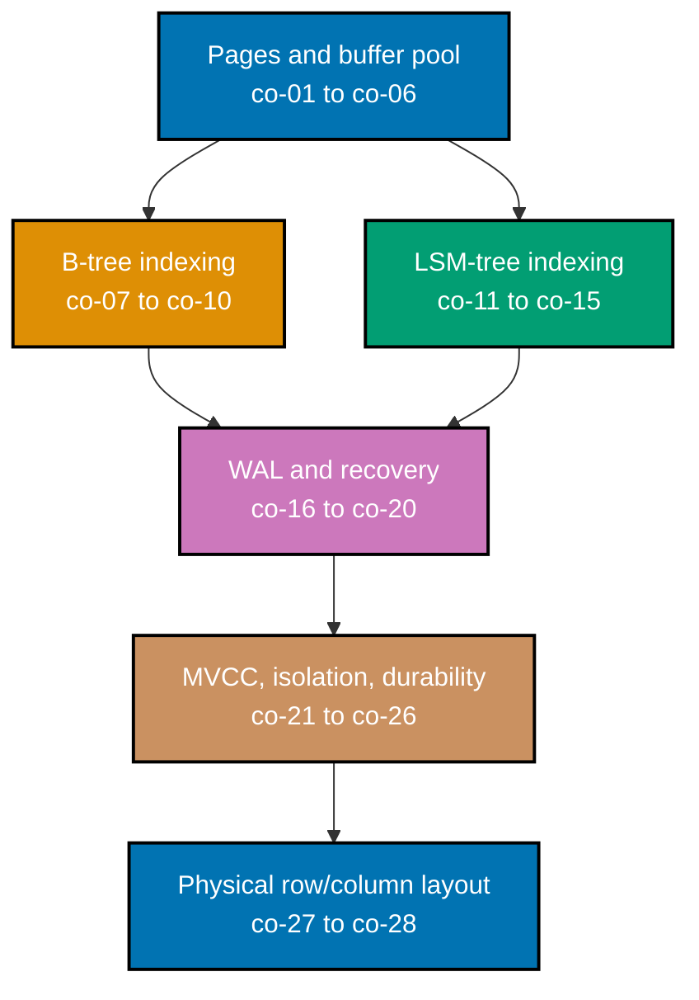

## Prerequisites

- **Prior topics**: [SQL Essentials](../../sql-essentials/learning/overview.md) and
  [Advanced SQL & Query Performance](../../advanced-sql-and-query-performance/learning/overview.md).
- **Tools & environment**: a macOS/Linux terminal; a local relational DB whose internals you can
  inspect (Postgres-style MVCC and/or an embedded B-tree/LSM store); a hex/page viewer; **Python
  3.x** (fully type-annotated, stdlib only) with `pytest` installed in a `venv`; `pyright` for the
  static-typing verification every example was independently checked against, in strict mode, with
  zero errors and zero warnings.
- **Assumed knowledge**: writing SQL and reading an `EXPLAIN` plan; how an index changes a query
  plan; reading typed Python.

## Why this exists -- the big idea

**The problem before the solution**: treating the database as an opaque box means you can't explain
why a workload is slow, why the same schema is fast on one engine and slow on another, or what
actually happens on `COMMIT` -- the abstraction hides exactly the costs you must reason about at
scale. **Keep this if you forget everything else**: durability and performance come from the same
few ideas -- an append-only log for crash-safe writes, a page/buffer-pool cache for reads, and an
index structure (B-tree or LSM) chosen to favor either reads or writes.

**Cross-cutting big ideas**: `consistency-latency-throughput` (B-tree vs LSM is a read-latency-vs-
write-throughput choice, and the WAL and buffer pool trade durability guarantees against latency),
`layering-and-leaks` (the SQL abstraction leaks its storage engine -- page size, index type, and MVCC
version bloat all surface as performance you have to explain).

This is the single-node storage substrate -- see the course [Overview](../overview.md) for exactly
where this topic's scope ends and `nosql-databases`/`graph-databases` begin.

## How verification works in this topic

Every one of this topic's 80 worked examples is a complete, self-contained `example.py` colocated
under `learning/code/ex-NN-slug/`, runnable in isolation with `python3 example.py` -- its expected
output is shown two ways: inline, as a `# => Output: ...` comment directly beneath the `print()`
call that produces it, and as a captured, verbatim `python3 example.py` run in this page's **Output**
block. Every example also ships a colocated `test_example.py`, verified with `pytest -q` and shown
the same way. Nothing on the following pages is a description of what a storage engine "should" do --
every claim was independently run, and every `example.py`/`test_example.py` pair was checked with
`pyright --strict` directly, reporting zero errors and zero warnings across all 80 examples plus the
four-file capstone.

Pages and the buffer pool sit underneath both index families -- a B-tree and an LSM-tree both read
and write through the same page/buffer-pool substrate, they simply organize what they put on those
pages differently. Both index families feed the write-ahead log (every durable write, no matter which
index eventually indexes it, goes through the log first), which in turn underpins MVCC, isolation,
and durability; physical row/column layout is the final, largely orthogonal axis -- it applies inside
either index family's leaf-level storage.

## Concepts

Every worked example in this topic's follow-up pages cites the `co-NN` concept it exercises -- this
section is the 1:1 reference those citations point back to.

### co-01 &middot; Fixed-Size Pages

Databases read, write, and cache in fixed-size pages (the unit of I/O); page size is engine-specific
(Postgres 8 KB, InnoDB 16 KB).

**Why it matters**: every other mechanism in this topic -- the buffer pool, the B-tree, the WAL's
page-write rule -- assumes I/O happens in fixed-size units, not arbitrary byte ranges; that single
assumption is what makes a page-table lookup, a checksum, and a dirty-bit flush all well-defined
operations.

**Verify it**: Example 1 allocates a fixed-size page and inspects its exact byte length.

### co-02 &middot; Slotted-Page Layout

A page is a header + a slot array growing from the front + tuple data growing from the back, with
free space between.

**Why it matters**: this layout is what lets a page hold variable-length records without wasting
space on a fixed-size slot -- the slot array and the tuple data grow toward each other, and the page
is genuinely full only when the two boundaries meet.

**Verify it**: Examples 2, 3, 4, and 6 pack and unpack a page header, append a slot, insert a
fixed-size record from the back, and guard against insufficient free space.

### co-03 &middot; Variable-Length-Record Addressing

Records are addressed by slot index, not byte offset, so a tuple can move within a page (compaction)
without invalidating references.

**Why it matters**: a byte offset that changes on every compaction would be a useless reference; a
slot index is stable across a compaction precisely because the slot array's own entry is what gets
rewritten, not every external pointer to that record.

**Verify it**: Examples 5, 7, and 8 read a record by slot index, pack two variable-length records
addressed by slot, and run an in-page compaction after a delete, confirming every surviving slot's
index stays valid.

### co-04 &middot; Buffer Pool

An in-memory cache of hot pages; a page table maps page-id -> frame, each frame carrying a pin count
and a dirty bit.

**Why it matters**: disk I/O is orders of magnitude slower than memory access, so a buffer pool is
what makes a database's actual working set (usually a small hot fraction of the total data) fast to
serve, while the full dataset stays durable on disk.

**Verify it**: Examples 10 and 13 look up a page in the page table and show a pin count guarding
against eviction.

### co-05 &middot; Page Eviction Policies

LRU, CLOCK/second-chance (a reference bit approximates LRU), and LRU-K choose a victim frame; a dirty
victim is flushed (or WAL-durable) before reuse.

**Why it matters**: an eviction policy is a bet on which page is least likely to be needed again
soon; CLOCK approximates LRU far more cheaply (one reference bit, not a full recency ordering), and
LRU-K specifically defeats a one-time sequential scan from evicting genuinely hot pages, which plain
LRU cannot.

**Verify it**: Example 14 flushes a dirty page before it is evicted, Examples 15 and 16 implement LRU
and CLOCK eviction directly, and Example 41 measures LRU-K against plain LRU on a scan-then-hot
access pattern.

### co-06 &middot; Read-Path Buffer Hit/Miss

A read checks the buffer pool first; a miss loads the page from disk into a free or evicted frame.

**Why it matters**: this ordering -- pool first, disk only on a genuine miss -- is the single
invariant every later mechanism in this topic depends on without re-verifying it; a hit ratio is only
a meaningful metric because the read path genuinely distinguishes the two cases.

**Verify it**: Examples 11, 12, and 42 fetch a page on a miss, fetch the same page again on a hit, and
measure a buffer pool's hit ratio directly.

### co-07 &middot; B-Tree vs B+-Tree

A B-tree stores values at every node; a B+-tree keeps values only in leaves with linked siblings;
most SQL "btree" indexes (Postgres nbtree, InnoDB) are B+-trees.

**Why it matters**: keeping values only in leaves is what makes a B+-tree's internal nodes purely
routing structure -- smaller, more cacheable, and uniform -- and the sibling links between leaves are
what make a range scan fast without ever re-descending from the root.

**Verify it**: Examples 17 and 22 build a B-tree leaf with a sorted insert and confirm a B+-tree's
values live only in its leaves.

### co-08 &middot; B-Tree Search and Fanout

Tree height is approximately `log_fanout(N)`; high fanout makes a shallow tree so a lookup touches
few pages.

**Why it matters**: fanout, not the number of keys, is what determines how many page reads a lookup
costs -- a B-tree with fanout in the hundreds stays only 3-4 levels deep even at a billion keys, which
is exactly why B-trees are the default on-disk index structure.

**Verify it**: Example 18 runs a point lookup that finds a present key and returns `None` for an
absent one, Example 19 computes B-tree height from an illustrative fanout figure and cross-checks it
against a direct calculation, and Example 43 bulk-loads sorted keys bottom-up and verifies the tree
answers the same lookups as inserting one by one.

### co-09 &middot; B-Tree Insert and Split

A leaf overflow splits and promotes a separator key upward, keeping the tree balanced; splits can
propagate to the root.

**Why it matters**: a split is what keeps a B-tree balanced without ever needing a full rebuild --
each split is a local, `O(fanout)` operation, and the fact that it can propagate all the way to the
root (growing the tree's height by exactly one level) is what guarantees the tree never degrades into
an unbalanced shape.

**Verify it**: Examples 20 and 44 split a B-tree leaf with separator-key promotion, and force splits
that propagate all the way up to the root.

### co-10 &middot; B-Tree Range Scan

Sibling-linked leaves let a range scan walk leaves in order without re-descending from the root.

**Why it matters**: without sibling links, a range scan would need to re-descend from the root for
every leaf boundary it crosses -- an `O(log N)` cost paid repeatedly; sibling links turn a multi-leaf
range scan into a single descent plus a cheap linear walk.

**Verify it**: Example 21 runs a range scan across multiple leaves purely via sibling links, with no
re-descent from the root.

### co-11 &middot; LSM Memtable and SSTable

Writes buffer in an in-memory sorted memtable (skiplist), then flush to immutable sorted SSTables on
disk.

**Why it matters**: buffering writes in memory and flushing them as a single sorted, immutable file
is what turns many small random writes into one large sequential write -- immutability also means an
SSTable never needs in-place modification, which simplifies concurrent reads enormously.

**Verify it**: Examples 23 and 24 build a memtable with a sorted insert and flush it to an SSTable.

### co-12 &middot; LSM Read Path

A read checks the memtable, then SSTables newest to oldest; a newer version (or tombstone) shadows
older ones.

**Why it matters**: because SSTables are immutable, an update or delete cannot modify an old value in
place -- it can only add a newer entry (or a tombstone) that shadows the old one, which is exactly why
the read path must check newest to oldest and stop at the first match.

**Verify it**: Examples 25 and 26 confirm the LSM read path returns the newest matching entry and
that a tombstone correctly shadows an older value.

### co-13 &middot; LSM Compaction

SSTables are merged to reclaim space and bound read cost; leveled (RocksDB) vs size-tiered (Cassandra)
are the two strategies.

**Why it matters**: without compaction, an LSM tree's read path would need to check an ever-growing
number of SSTables, and shadowed old versions would never be reclaimed; leveled compaction favors
read cost and space at the expense of more write amplification, size-tiered favors write cost at the
expense of more space and slower reads -- neither is universally better.

**Verify it**: Examples 48 and 49 implement size-tiered and leveled compaction directly, over the
same workload.

### co-14 &middot; Amplification and the RUM Conjecture

Read/write/space amplification trade off against each other (the RUM conjecture); B-tree vs LSM is a
bet on the workload, not a universal winner.

**Why it matters**: the RUM conjecture names a real, unavoidable trade-off -- no single design can
simultaneously minimize read amplification, write amplification, and space amplification, which is
precisely why the B-tree-vs-LSM choice is a genuine engineering decision, not a solved problem with
one correct answer.

**Verify it**: Examples 50, 51, and 52 count write amplification, count read amplification, and
measure space amplification directly, on the same compaction strategies from co-13.

### co-15 &middot; Bloom Filter

A probabilistic per-SSTable membership filter with possible false positives but no false negatives,
letting a read skip SSTables that definitely lack a key.

**Why it matters**: a Bloom filter's asymmetry -- false positives possible, false negatives
impossible -- is exactly the property an LSM read path needs: it can never cause a real read to be
skipped, only occasionally cause an unnecessary SSTable check, which is what makes it safe to rely on
for reducing read amplification.

**Verify it**: Examples 27, 28, and 53 test Bloom filter membership, confirm it never produces a false
negative, and measure how much it reduces read amplification on the LSM workload from co-14.

### co-16 &middot; Write-Ahead-Log Rule

A log record reaches stable storage before its page is written (the WAL invariant), making writes
crash-safe.

**Why it matters**: the WAL rule is the single invariant that makes crash recovery possible at all --
if a page could reach disk before its log record, a crash between the two could lose data with no way
to reconstruct it; enforcing the opposite order means the log is always at least as up to date as any
page.

**Verify it**: Examples 29 and 30 replay an append-only log and enforce the WAL-before-page ordering
guard directly.

### co-17 &middot; LSN and pageLSN

Monotonic log sequence numbers order the log; a page's pageLSN tells recovery whether a log record is
already applied.

**Why it matters**: without a pageLSN, recovery would have no way to tell whether a given log record's
change is already reflected on its page (and would either skip a genuinely needed redo, or double-
apply one) -- comparing the record's LSN against the page's stored pageLSN is what makes redo
idempotent.

**Verify it**: Examples 31 and 32 assign monotonic LSNs and skip an already-applied record by
comparing it against a page's pageLSN.

### co-18 &middot; ARIES Recovery Phases

Recovery runs analysis -> redo (repeat history: replay all logged changes) -> undo (roll back losers
via compensation log records).

**Why it matters**: ARIES's "repeat history" redo phase deliberately replays every logged change,
committed or not, before undo ever runs -- this seemingly wasteful choice is what avoids the far
harder problem of deciding, during redo, which changes belong to a transaction that will eventually
be rolled back.

**Verify it**: Examples 64, 65, 66, and 67 walk the analysis phase reconstructing the transaction and
dirty-page tables, the redo phase repeating history regardless of commit status, the undo phase
writing compensation log records, and a full end-to-end recovery combining all three.

### co-19 &middot; Redo vs Undo

Redo re-applies changes so committed work survives; undo rolls back uncommitted work; the steal/no-
force buffer policy is why both are needed.

**Why it matters**: a steal policy (an uncommitted page can be written to disk before commit) makes
undo necessary; a no-force policy (a committed page need not be written to disk at commit time) makes
redo necessary -- together they are what let a buffer pool evict pages under memory pressure without
the engine losing correctness.

**Verify it**: Examples 33 and 34 replay committed writes via redo and roll back uncommitted writes
via undo, each in isolation before Example 67 combines both.

### co-20 &middot; Checkpointing

Periodic checkpoints bound how far back recovery must scan the log.

**Why it matters**: without a checkpoint, recovery would need to scan the entire log from the very
beginning of the database's history on every restart; a checkpoint records a known-consistent point,
so recovery only needs to replay log records written after it.

**Verify it**: Example 35 demonstrates a checkpoint bounding how much of the log a recovery replay
must scan.

### co-21 &middot; MVCC Versions -- xmin/xmax

Each row version carries creating/deleting transaction ids (xmin/xmax); an update writes a new
version rather than overwriting.

**Why it matters**: writing a new version instead of overwriting in place is what lets a reader see a
consistent past state while a writer concurrently creates a newer one -- xmin and xmax are the exact
bookkeeping that make "which versions exist" and "who created or deleted each one" answerable without
a lock.

**Verify it**: Examples 36 and 38 tag row versions with xmin/xmax and confirm an update creates a new
version rather than modifying the old one in place.

### co-22 &middot; Snapshot-Read Non-Blocking

A snapshot sees versions committed before it and not yet deleted, so readers don't block writers and
writers don't block readers.

**Why it matters**: this non-blocking property is MVCC's central payoff over lock-based concurrency
control -- a long-running read never forces a writer to wait, and a writer never forces a reader to
wait, because each transaction simply sees the version chain as it existed at its own snapshot point.

**Verify it**: Example 37 states and verifies the snapshot visibility rule directly, and Example 39
confirms readers don't block writers under it.

### co-23 &middot; Version Bloat and Vacuum

Dead versions accumulate and must be garbage-collected (VACUUM) to reclaim space.

**Why it matters**: MVCC's "never overwrite, always append a new version" design has a real cost --
dead versions that no active snapshot can still see accumulate indefinitely unless something reclaims
them, which is exactly the job VACUUM (or an equivalent GC pass) performs.

**Verify it**: Example 40 runs a vacuum pass that reclaims dead versions no longer visible to any
active snapshot.

### co-24 &middot; Isolation Levels and Anomalies

Read-uncommitted/committed/repeatable-read/serializable map to dirty/non-repeatable/phantom reads;
snapshot isolation still permits write skew.

**Why it matters**: each isolation level is defined precisely by which anomalies it still permits --
knowing that PostgreSQL's `REPEATABLE READ` is actually snapshot isolation (and therefore still
permits write skew) is the difference between correctly reasoning about a concurrency bug and being
surprised by one in production.

**Verify it**: Examples 72, 73, 74, and 75 reproduce a dirty read, a non-repeatable read, a phantom
read, and write skew, each under the specific isolation level that permits it.

### co-25 &middot; Concurrency Control -- 2PL and OCC

Two-phase locking (growing/shrinking; strict 2PL holds write locks to commit) and optimistic
concurrency control (read/validate/write) are alternatives or complements to MVCC.

**Why it matters**: 2PL and OCC represent opposite bets about contention -- 2PL pays a locking cost
upfront on every access, assuming conflicts are common; OCC pays nothing until commit-time validation,
assuming conflicts are rare -- and strict 2PL specifically is what prevents cascading aborts that
plain 2PL still permits.

**Verify it**: Examples 68, 69, 70, and 71 walk 2PL's growing/shrinking phases, show strict 2PL
preventing a cascading abort, implement OCC's read/validate/write cycle, and detect a deadlock via a
wait-for graph.

### co-26 &middot; Durability -- fsync and Torn Pages

A page write is not atomic across a crash (torn page); fsync, group commit, and full-page-writes /
doublewrite buffer make writes durable.

**Why it matters**: a page write can be interrupted mid-write by a crash, leaving a "torn" page that
is neither the old nor the new version -- fsync is what forces a write to genuinely reach stable
storage, group commit amortizes that cost across many transactions, and full-page-writes/doublewrite
are what let recovery repair a torn page rather than merely detect it.

**Verify it**: Examples 60, 61, 62, and 63 demonstrate fsync as a durability barrier, group commit
batching multiple commits into one fsync, a torn-page simulation detected by checksum, and full-page-
write recovery repairing that torn page.

### co-27 &middot; Clustered vs Heap

A clustered index stores the row in the B+-tree leaf (InnoDB PK, SQLite rowid); a heap stores rows
separately with secondary indexes pointing via row-id/ctid (Postgres).

**Why it matters**: a clustered index makes a primary-key lookup essentially free (the row is right
there in the leaf) but makes every secondary index's pointer expensive to maintain on a page split; a
heap decouples the two, at the cost of an extra indirection on every secondary-index lookup.

**Verify it**: Examples 46 and 47 build a clustered index where the leaf holds the full row, and a
heap table with a secondary index pointing via a (page, slot) pointer.

### co-28 &middot; Column vs Row Store

A row store lays out tuples contiguously (OLTP); a column store lays out columns contiguously (OLAP),
enabling scan pruning and compression (dictionary/RLE/delta).

**Why it matters**: the layout choice is a direct trade between two access patterns -- a row store is
fast for "fetch this whole record," a column store is fast for "aggregate this one field across many
records" -- and a column store's contiguous same-typed values are exactly what makes dictionary,
run-length, and delta encoding effective in a way they never would be interleaved with other columns.

**Verify it**: Examples 54, 55, and 56 lay out one row's fields byte-adjacent, one column's values
byte-adjacent, and confirm a column scan reads fewer bytes for a single-column aggregate; Examples 57,
58, and 59 then apply dictionary, run-length, and delta encoding to that column layout.

## Examples by Level

### Beginner (Examples 1–28)

- [Example 1: Allocate a Fixed-Size Page](/en/c/learn/courses/database-internals-and-storage-engines/learning/beginner#example-1-allocate-a-fixed-size-page)
- [Example 2: Page Header Pack and Unpack](/en/c/learn/courses/database-internals-and-storage-engines/learning/beginner#example-2-page-header-pack-and-unpack)
- [Example 3: Append a Slot to the Slot Array](/en/c/learn/courses/database-internals-and-storage-engines/learning/beginner#example-3-append-a-slot-to-the-slot-array)
- [Example 4: Insert a Fixed-Size Record from the Back](/en/c/learn/courses/database-internals-and-storage-engines/learning/beginner#example-4-insert-a-fixed-size-record-from-the-back)
- [Example 5: Read a Record by Slot Index](/en/c/learn/courses/database-internals-and-storage-engines/learning/beginner#example-5-read-a-record-by-slot-index)
- [Example 6: Guard Against Insufficient Free Space](/en/c/learn/courses/database-internals-and-storage-engines/learning/beginner#example-6-guard-against-insufficient-free-space)
- [Example 7: Variable-Length Records by Slot](/en/c/learn/courses/database-internals-and-storage-engines/learning/beginner#example-7-variable-length-records-by-slot)
- [Example 8: In-Page Compaction After a Delete](/en/c/learn/courses/database-internals-and-storage-engines/learning/beginner#example-8-in-page-compaction-after-a-delete)
- [Example 9: Detect Page Corruption with a Checksum](/en/c/learn/courses/database-internals-and-storage-engines/learning/beginner#example-9-detect-page-corruption-with-a-checksum)
- [Example 10: Buffer Pool Page-Table Lookup](/en/c/learn/courses/database-internals-and-storage-engines/learning/beginner#example-10-buffer-pool-page-table-lookup)
- [Example 11: Buffer Fetch on a Miss](/en/c/learn/courses/database-internals-and-storage-engines/learning/beginner#example-11-buffer-fetch-on-a-miss)
- [Example 12: Buffer Fetch on a Hit](/en/c/learn/courses/database-internals-and-storage-engines/learning/beginner#example-12-buffer-fetch-on-a-hit)
- [Example 13: Pin Count Guards Against Eviction](/en/c/learn/courses/database-internals-and-storage-engines/learning/beginner#example-13-pin-count-guards-against-eviction)
- [Example 14: Flush a Dirty Page Before Eviction](/en/c/learn/courses/database-internals-and-storage-engines/learning/beginner#example-14-flush-a-dirty-page-before-eviction)
- [Example 15: LRU Eviction](/en/c/learn/courses/database-internals-and-storage-engines/learning/beginner#example-15-lru-eviction)
- [Example 16: CLOCK (Second-Chance) Eviction](/en/c/learn/courses/database-internals-and-storage-engines/learning/beginner#example-16-clock-second-chance-eviction)
- [Example 17: B-Tree Leaf: Sorted Insert](/en/c/learn/courses/database-internals-and-storage-engines/learning/beginner#example-17-b-tree-leaf-sorted-insert)
- [Example 18: B-Tree Point Lookup](/en/c/learn/courses/database-internals-and-storage-engines/learning/beginner#example-18-b-tree-point-lookup)
- [Example 19: B-Tree Height from Fanout](/en/c/learn/courses/database-internals-and-storage-engines/learning/beginner#example-19-b-tree-height-from-fanout)
- [Example 20: B-Tree Leaf Split and Separator Promotion](/en/c/learn/courses/database-internals-and-storage-engines/learning/beginner#example-20-b-tree-leaf-split-and-separator-promotion)
- [Example 21: B-Tree Range Scan via Sibling Links](/en/c/learn/courses/database-internals-and-storage-engines/learning/beginner#example-21-b-tree-range-scan-via-sibling-links)
- [Example 22: B+-Tree: Values Live Only in Leaves](/en/c/learn/courses/database-internals-and-storage-engines/learning/beginner#example-22-b-tree-values-live-only-in-leaves)
- [Example 23: Memtable: Sorted Insert](/en/c/learn/courses/database-internals-and-storage-engines/learning/beginner#example-23-memtable-sorted-insert)
- [Example 24: Flush a Memtable to an SSTable](/en/c/learn/courses/database-internals-and-storage-engines/learning/beginner#example-24-flush-a-memtable-to-an-sstable)
- [Example 25: LSM Read Path: Newest Wins](/en/c/learn/courses/database-internals-and-storage-engines/learning/beginner#example-25-lsm-read-path-newest-wins)
- [Example 26: LSM Tombstone Delete](/en/c/learn/courses/database-internals-and-storage-engines/learning/beginner#example-26-lsm-tombstone-delete)
- [Example 27: Bloom Filter Membership Test](/en/c/learn/courses/database-internals-and-storage-engines/learning/beginner#example-27-bloom-filter-membership-test)
- [Example 28: Bloom Filter Never False-Negatives](/en/c/learn/courses/database-internals-and-storage-engines/learning/beginner#example-28-bloom-filter-never-false-negatives)

### Intermediate (Examples 29–56)

- [Example 29: Append-Only Log Replay](/en/c/learn/courses/database-internals-and-storage-engines/learning/intermediate#example-29-append-only-log-replay)
- [Example 30: WAL-Before-Page Ordering Guard](/en/c/learn/courses/database-internals-and-storage-engines/learning/intermediate#example-30-wal-before-page-ordering-guard)
- [Example 31: Monotonic LSN Assignment](/en/c/learn/courses/database-internals-and-storage-engines/learning/intermediate#example-31-monotonic-lsn-assignment)
- [Example 32: Skip Already-Applied Records via pageLSN](/en/c/learn/courses/database-internals-and-storage-engines/learning/intermediate#example-32-skip-already-applied-records-via-pagelsn)
- [Example 33: WAL Redo Replays Committed Writes](/en/c/learn/courses/database-internals-and-storage-engines/learning/intermediate#example-33-wal-redo-replays-committed-writes)
- [Example 34: WAL Undo Rolls Back Uncommitted Writes](/en/c/learn/courses/database-internals-and-storage-engines/learning/intermediate#example-34-wal-undo-rolls-back-uncommitted-writes)
- [Example 35: A Checkpoint Bounds Redo Replay](/en/c/learn/courses/database-internals-and-storage-engines/learning/intermediate#example-35-a-checkpoint-bounds-redo-replay)
- [Example 36: Row Versions Tagged with xmin/xmax](/en/c/learn/courses/database-internals-and-storage-engines/learning/intermediate#example-36-row-versions-tagged-with-xminxmax)
- [Example 37: Snapshot Visibility Rule](/en/c/learn/courses/database-internals-and-storage-engines/learning/intermediate#example-37-snapshot-visibility-rule)
- [Example 38: An Update Creates a New Version](/en/c/learn/courses/database-internals-and-storage-engines/learning/intermediate#example-38-an-update-creates-a-new-version)
- [Example 39: Readers Don't Block Writers](/en/c/learn/courses/database-internals-and-storage-engines/learning/intermediate#example-39-readers-dont-block-writers)
- [Example 40: Vacuum Reclaims Dead Versions](/en/c/learn/courses/database-internals-and-storage-engines/learning/intermediate#example-40-vacuum-reclaims-dead-versions)
- [Example 41: LRU-K vs Plain LRU on a Scan-Then-Hot Pattern](/en/c/learn/courses/database-internals-and-storage-engines/learning/intermediate#example-41-lru-k-vs-plain-lru-on-a-scan-then-hot-pattern)
- [Example 42: Buffer Pool Hit Ratio](/en/c/learn/courses/database-internals-and-storage-engines/learning/intermediate#example-42-buffer-pool-hit-ratio)
- [Example 43: B-Tree Bulk Load vs Insert-One-by-One](/en/c/learn/courses/database-internals-and-storage-engines/learning/intermediate#example-43-b-tree-bulk-load-vs-insert-one-by-one)
- [Example 44: Force B-Tree Splits Up to the Root](/en/c/learn/courses/database-internals-and-storage-engines/learning/intermediate#example-44-force-b-tree-splits-up-to-the-root)
- [Example 45: B-Tree Leaf Underflow: Merge or Borrow](/en/c/learn/courses/database-internals-and-storage-engines/learning/intermediate#example-45-b-tree-leaf-underflow-merge-or-borrow)
- [Example 46: Clustered Index: the Leaf Holds the Full Row](/en/c/learn/courses/database-internals-and-storage-engines/learning/intermediate#example-46-clustered-index-the-leaf-holds-the-full-row)
- [Example 47: Heap Table + Secondary Index via (page, slot) Pointer](/en/c/learn/courses/database-internals-and-storage-engines/learning/intermediate#example-47-heap-table--secondary-index-via-page-slot-pointer)
- [Example 48: LSM Size-Tiered Compaction](/en/c/learn/courses/database-internals-and-storage-engines/learning/intermediate#example-48-lsm-size-tiered-compaction)
- [Example 49: LSM Leveled Compaction](/en/c/learn/courses/database-internals-and-storage-engines/learning/intermediate#example-49-lsm-leveled-compaction)
- [Example 50: Count Write Amplification](/en/c/learn/courses/database-internals-and-storage-engines/learning/intermediate#example-50-count-write-amplification)
- [Example 51: Count Read Amplification](/en/c/learn/courses/database-internals-and-storage-engines/learning/intermediate#example-51-count-read-amplification)
- [Example 52: Measure Space Amplification](/en/c/learn/courses/database-internals-and-storage-engines/learning/intermediate#example-52-measure-space-amplification)
- [Example 53: Bloom Filters Reduce Read Amplification](/en/c/learn/courses/database-internals-and-storage-engines/learning/intermediate#example-53-bloom-filters-reduce-read-amplification)
- [Example 54: Row Store: One Row's Fields Are Byte-Adjacent](/en/c/learn/courses/database-internals-and-storage-engines/learning/intermediate#example-54-row-store-one-rows-fields-are-byte-adjacent)
- [Example 55: Column Store: One Column's Values Are Byte-Adjacent](/en/c/learn/courses/database-internals-and-storage-engines/learning/intermediate#example-55-column-store-one-columns-values-are-byte-adjacent)
- [Example 56: A Column Scan Reads Fewer Bytes for a Single-Column Aggregate](/en/c/learn/courses/database-internals-and-storage-engines/learning/intermediate#example-56-a-column-scan-reads-fewer-bytes-for-a-single-column-aggregate)

### Advanced (Examples 57–80)

- [Example 57: Dictionary Encoding](/en/c/learn/courses/database-internals-and-storage-engines/learning/advanced#example-57-dictionary-encoding)
- [Example 58: Run-Length Encoding](/en/c/learn/courses/database-internals-and-storage-engines/learning/advanced#example-58-run-length-encoding)
- [Example 59: Delta Encoding for Monotonic Timestamps](/en/c/learn/courses/database-internals-and-storage-engines/learning/advanced#example-59-delta-encoding-for-monotonic-timestamps)
- [Example 60: fsync as a Durability Barrier](/en/c/learn/courses/database-internals-and-storage-engines/learning/advanced#example-60-fsync-as-a-durability-barrier)
- [Example 61: Group Commit Batches N Commits into One fsync](/en/c/learn/courses/database-internals-and-storage-engines/learning/advanced#example-61-group-commit-batches-n-commits-into-one-fsync)
- [Example 62: Torn-Page Simulation Detected by Checksum](/en/c/learn/courses/database-internals-and-storage-engines/learning/advanced#example-62-torn-page-simulation-detected-by-checksum)
- [Example 63: Full-Page-Write Recovery Repairs a Torn Page](/en/c/learn/courses/database-internals-and-storage-engines/learning/advanced#example-63-full-page-write-recovery-repairs-a-torn-page)
- [Example 64: ARIES Analysis Phase Reconstructs the Transaction and Dirty-Page Tables](/en/c/learn/courses/database-internals-and-storage-engines/learning/advanced#example-64-aries-analysis-phase-reconstructs-the-transaction-and-dirty-page-tables)
- [Example 65: ARIES Redo Repeats History Regardless of Commit Status](/en/c/learn/courses/database-internals-and-storage-engines/learning/advanced#example-65-aries-redo-repeats-history-regardless-of-commit-status)
- [Example 66: ARIES Undo Writes Compensation Log Records (CLRs)](/en/c/learn/courses/database-internals-and-storage-engines/learning/advanced#example-66-aries-undo-writes-compensation-log-records-clrs)
- [Example 67: Crash Recovery End-to-End: Analysis, Redo, Undo](/en/c/learn/courses/database-internals-and-storage-engines/learning/advanced#example-67-crash-recovery-end-to-end-analysis-redo-undo)
- [Example 68: Two-Phase Locking: Growing and Shrinking Phases](/en/c/learn/courses/database-internals-and-storage-engines/learning/advanced#example-68-two-phase-locking-growing-and-shrinking-phases)
- [Example 69: Strict 2PL Prevents Cascading Aborts](/en/c/learn/courses/database-internals-and-storage-engines/learning/advanced#example-69-strict-2pl-prevents-cascading-aborts)
- [Example 70: Optimistic Concurrency Control: Read, Validate, Write](/en/c/learn/courses/database-internals-and-storage-engines/learning/advanced#example-70-optimistic-concurrency-control-read-validate-write)
- [Example 71: Deadlock Detection via a Wait-For Graph](/en/c/learn/courses/database-internals-and-storage-engines/learning/advanced#example-71-deadlock-detection-via-a-wait-for-graph)
- [Example 72: Dirty Read: Present Under Read-Uncommitted, Gone Under Read-Committed](/en/c/learn/courses/database-internals-and-storage-engines/learning/advanced#example-72-dirty-read-present-under-read-uncommitted-gone-under-read-committed)
- [Example 73: Non-Repeatable Read: Unstable Under Read-Committed, Stable Under Repeatable-Read](/en/c/learn/courses/database-internals-and-storage-engines/learning/advanced#example-73-non-repeatable-read-unstable-under-read-committed-stable-under-repeatable-read)
- [Example 74: Phantom Read: a New Row Appears Under Repeatable-Read](/en/c/learn/courses/database-internals-and-storage-engines/learning/advanced#example-74-phantom-read-a-new-row-appears-under-repeatable-read)
- [Example 75: Write Skew: Permitted Under Snapshot Isolation](/en/c/learn/courses/database-internals-and-storage-engines/learning/advanced#example-75-write-skew-permitted-under-snapshot-isolation)
- [Example 76: Serializable Isolation Prevents Write Skew](/en/c/learn/courses/database-internals-and-storage-engines/learning/advanced#example-76-serializable-isolation-prevents-write-skew)
- [Example 77: B-Tree vs LSM: Measured Write Throughput](/en/c/learn/courses/database-internals-and-storage-engines/learning/advanced#example-77-b-tree-vs-lsm-measured-write-throughput)
- [Example 78: B-Tree vs LSM: Measured Read Latency](/en/c/learn/courses/database-internals-and-storage-engines/learning/advanced#example-78-b-tree-vs-lsm-measured-read-latency)
- [Example 79: A Workload Chooser Selects LSM Then B-Tree](/en/c/learn/courses/database-internals-and-storage-engines/learning/advanced#example-79-a-workload-chooser-selects-lsm-then-b-tree)
- [Example 80: A Mini Storage Engine: Pages + B-Tree Index + WAL + Snapshot Read](/en/c/learn/courses/database-internals-and-storage-engines/learning/advanced#example-80-a-mini-storage-engine-pages--b-tree-index--wal--snapshot-read)

---

← Previous: [Overview](../overview.md) · Next: [Beginner Examples](./beginner.md) →
