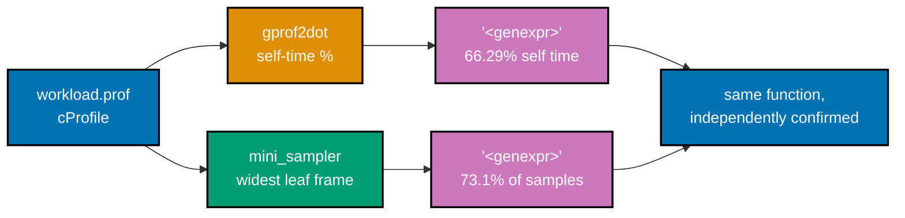
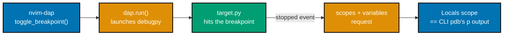
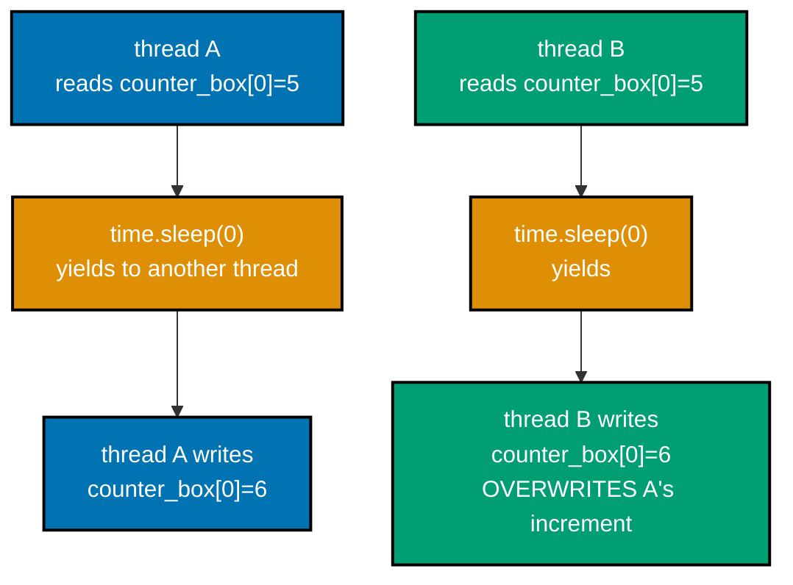
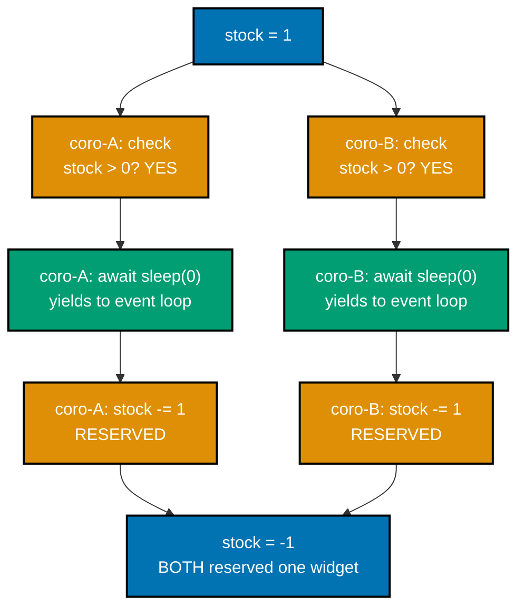
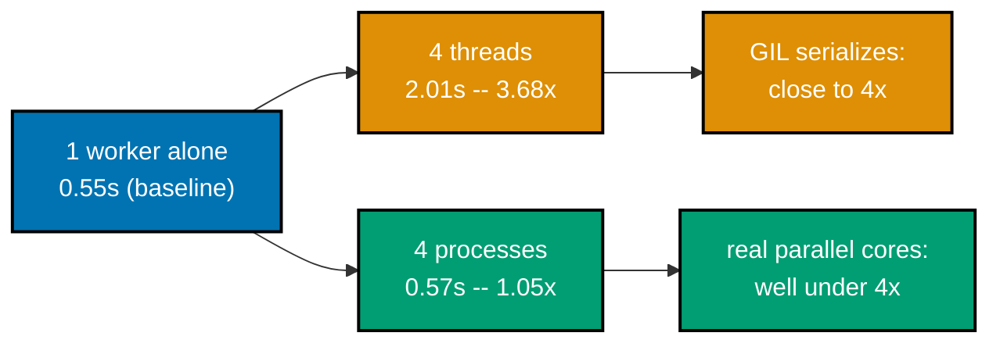

Examples 50-62 combine the tools from the first two tiers into realistic, multi-part scenarios:
`pdb`'s `interact` and chained-exception `exceptions` commands, finding a bug from correlated
multi-module logs with no breakpoints at all, converting a `.prof` file to a flame graph two
independent ways, a real headless Neovim DAP session cross-checked against CLI `pdb`, a quantified
before/after `cProfile` comparison, a genuine threading race reproduced then fixed with a lock, an
`asyncio` check-then-act interleaving bug, Python 3.14's async-native `pdb.set_trace_async()`,
`threading` versus `multiprocessing` under a CPU-bound load, an automated `git bisect run` for a
performance regression (not just a correctness one), and automated delta-debugging at a much larger
scale. Every script below is a complete, self-contained, fully type-annotated file (DD-39) under
`learning/code/ex-NN-*/`, run for real on **Python 3.13.12** (Example 59 needs **Python 3.14.3** for
`pdb.set_trace_async()`, noted in that example). Every `**Output**` block is a genuine, captured
transcript. Example 50's `interact` session and Example 54's `pdb` session drive `pdb` through a real
pseudo-terminal (`pty`) so typed commands echo the way a real terminal would; both transcripts below
are captured verbatim, commands and all.

---

### Example 50: pdb's interact Mode

_ex-50 &middot; exercises co-03, co-07_

`interact` at a breakpoint opens a real, frame-scoped REPL -- every local variable is directly
readable and writable, so a corrected formula can be tried live before it is ever copied into the
actual fix.

```python
# learning/code/ex-50-pdb-interact-mode/pricing_buggy.py
"""Example 50: pdb's `interact` command opens a frame-scoped REPL at a breakpoint."""

from __future__ import annotations  # => DD-39 hygiene -- unrelated to interact mode itself


def compute_total(price: float, tax_rate: float, shipping: float) -> float:  # => co-03: the function under test
    breakpoint()  # => co-03/co-07: land here with price/tax_rate/shipping already bound
    # BUG: tax applied to (price + shipping) instead of price alone -- confirmed via `interact` below
    total = (price + shipping) * (1 + tax_rate)  # => co-07: the WRONG formula -- interact tests the fix live
    return round(total, 2)  # => rounds to cents, same as every other pricing example in this tier


def main() -> None:  # => co-03: the entry point breakpoint() pauses INSIDE, one call deep
    result = compute_total(price=100.0, tax_rate=0.08, shipping=10.0)  # => fixed inputs -- reproducible every run
    print(f"total: {result}")  # => prints the BUGGY total -- interact mode only experiments, never mutates this


if __name__ == "__main__":  # => co-03: guards the module-level call so importing this file stays side-effect-free
    main()  # => co-03: the ONE call that reaches compute_total()'s breakpoint()
```

**Run**: `python3 pricing_buggy.py`, then at the breakpoint: `p price, tax_rate, shipping`, `interact`,
`price * (1 + tax_rate) + shipping`, `exit()`, `c`.

**Output**:

```text
> pricing_buggy.py(6)compute_total()
-> breakpoint()  # =>  co-03/co-07: land here with price/tax_rate/shipping bound
(Pdb) p price, tax_rate, shipping
(100.0, 0.08, 10.0)
(Pdb) interact
*pdb interact start*
>>> price * (1 + tax_rate) + shipping
118.0
>>> exit()

*exit from pdb interact command*
(Pdb) c
total: 118.8
```

The `interact` session computes `118.0` -- the corrected formula's real result -- while the buggy
function still prints `118.8`. `pricing_fixed.py` copies that exact expression in verbatim:

```python
# learning/code/ex-50-pdb-interact-mode/pricing_fixed.py
"""Example 50: the real fix, with the experiment's corrected formula copied in verbatim."""

from __future__ import annotations  # => DD-39 hygiene -- unrelated to the fix itself


def compute_total(price: float, tax_rate: float, shipping: float) -> float:  # => the SAME signature as pricing_buggy.py
    # FIX: tax applies to price only; shipping is added post-tax (the formula
    # verified interactively via `interact` at the breakpoint in pricing_buggy.py)
    total = price * (1 + tax_rate) + shipping  # => co-03/co-07: the CORRECTED formula, copied straight from interact
    return round(total, 2)  # => rounds to cents, matching pricing_buggy.py's own rounding exactly


def main() -> None:  # => co-07: the SAME inputs as pricing_buggy.py, so the two totals are directly comparable
    result = compute_total(price=100.0, tax_rate=0.08, shipping=10.0)  # => identical call to the buggy version
    print(f"total: {result}")  # => co-07: prints 118.0 -- the value `interact` already predicted


if __name__ == "__main__":  # => co-03: keeps this file importable without running main() as a side effect
    main()  # => co-03: the one call that produces the corrected total
```

**Run**: `python3 pricing_fixed.py`

**Output**:

```text
total: 118.0
```

**Key takeaway**: `118.0` matches `interact`'s own live experiment exactly -- the fix was verified
BEFORE it was written, not guessed and hoped for.

**Why it matters**: `interact` turns a breakpoint into a scratch pad with full read/write access to
every local in scope -- a much richer tool than repeatedly editing, saving, and rerunning a script to
test a one-line formula change. The discipline this example models -- experiment interactively, THEN
copy the verified expression into the real fix -- prevents the common failure mode of "fixing" a bug
with a formula that was never actually tested against the exact values that triggered it.

---

### Example 51: pdb's exceptions Command, Chained

_ex-51 &middot; exercises co-04, co-03_

`raise ... from ...` chains a new exception to its root cause; pdb's `exceptions` command lists the
whole chain and lets a reader jump directly to the frame where the ORIGINAL failure actually
happened, not just where it was re-raised.

```python
# learning/code/ex-51-pdb-exceptions-command-chained/chained_failure.py
"""Example 51: a chained exception (`raise ... from ...`) and pdb's `exceptions`
command for walking the exception chain during post-mortem debugging.
"""

from __future__ import annotations  # => DD-39 hygiene -- unrelated to exception chaining itself


def parse_int(raw: str) -> int:  # => co-04: the function that raises the ROOT-CAUSE exception
    return int(raw)  # => co-04: the ROOT cause -- raises ValueError on bad input


def load_config_value(raw: str) -> int:  # => co-04: the function that WRAPS the root cause in a new type
    try:  # => co-04: catches ONLY the root-cause type, never a bare `except Exception`
        return parse_int(raw)  # => co-04: delegates to the function that can genuinely fail
    except ValueError as exc:  # => co-04: exc IS the root cause -- kept alive via `from exc` below
        # co-04: deliberately wrap with a new exception type, chaining the
        # original so the root cause is still reachable via __cause__.
        raise RuntimeError(f"config value {raw!r} could not be loaded") from exc  # => co-04: the CHAIN, not a swap


def main() -> None:  # => co-03: the entry point -- one call deep from the eventual uncaught exception
    load_config_value("not-a-number")  # => co-04: deliberately invalid input -- guarantees the chain forms


if __name__ == "__main__":  # => co-03: guards the module-level call so importing this file stays side-effect-free
    main()  # => co-03: the ONE call whose uncaught exception drives ex-51's post-mortem session
```

**Run**: `python3 -m pdb chained_failure.py`, then `c`, `exceptions`, `exceptions 0`, `p raw`, `up`,
`q`.

**Output**:

```text
> chained_failure.py(1)<module>()
-> """Example 51: a chained exception (`raise ... from ...`) and pdb's `exceptions`
(Pdb) c
Traceback (most recent call last):
  File "chained_failure.py", line 13, in load_config_value
    return parse_int(raw)
  File "chained_failure.py", line 8, in parse_int
    return int(raw)  # =>  co-04: the ROOT cause -- raises ValueError on bad input
ValueError: invalid literal for int() with base 10: 'not-a-number'

The above exception was the direct cause of the following exception:

Traceback (most recent call last):
  File "chained_failure.py", line 25, in <module>
    main()
  File "chained_failure.py", line 21, in main
    load_config_value("not-a-number")
  File "chained_failure.py", line 17, in load_config_value
    raise RuntimeError(f"config value {raw!r} could not be loaded") from exc
RuntimeError: config value 'not-a-number' could not be loaded
Uncaught exception. Entering post mortem debugging
Running 'cont' or 'step' will restart the program
> chained_failure.py(17)load_config_value()
-> raise RuntimeError(f"config value {raw!r} could not be loaded") from exc
(Pdb) exceptions
    0 ValueError("invalid literal for int() with base 10: 'not-a-number'")
>   1 RuntimeError("config value 'not-a-number' could not be loaded")
(Pdb) exceptions 0
> chained_failure.py(8)parse_int()
-> return int(raw)  # =>  co-04: the ROOT cause -- raises ValueError on bad input
(Pdb) p raw
'not-a-number'
(Pdb) up
> chained_failure.py(13)load_config_value()
-> return parse_int(raw)
(Pdb) q
```

**Key takeaway**: `exceptions` lists index `0` (the root `ValueError`) and index `1` (the wrapping
`RuntimeError`, marked `>` as current); `exceptions 0` jumps straight to `parse_int`'s own frame,
where `raw` is directly inspectable.

**Why it matters**: without `exceptions`, a reader debugging the outer `RuntimeError` sees only "config
value could not be loaded" -- true, but useless for finding WHY. Chained exceptions preserve the full
causal history in `__cause__`, and pdb's `exceptions` command is the direct, interactive way to walk
that chain during post-mortem debugging, rather than re-reading a printed traceback and manually
matching up which frame belongs to which exception in the chain.

---

### Example 52: A Multi-Module Logging Bug

_ex-52 &middot; exercises co-05_

Two modules, each with its own `getLogger(__name__)` logger, wired together by `dictConfig` into one
formatted stream -- the bug is found purely by reading the correlated log lines, with no breakpoints
at all.

```python
# learning/code/ex-52-logging-config-multi-module-bug/inventory.py
"""Example 52: module A -- per-module logger via getLogger(__name__)."""

from __future__ import annotations  # => DD-39 hygiene -- unrelated to logging itself

import logging  # => co-05: the stdlib module every per-module logger in this example is built from

logger = logging.getLogger(__name__)  # => co-05: name is "inventory", not "root"


def reserve_stock(sku: str, qty: int, available: int) -> bool:  # => co-05: called from checkout.py, a SEPARATE module
    logger.info("reserve_stock sku=%s qty=%s available=%s", sku, qty, available)  # => co-05: logged from "inventory"
    if qty > available:  # => the actual business rule this function enforces
        logger.warning("reserve_stock DENIED sku=%s: requested %s exceeds available %s", sku, qty, available)  # => co-05
        return False  # => co-05: the caller (checkout.py) is what turns this into a FAILED checkout
    logger.info("reserve_stock OK sku=%s: reserved %s of %s", sku, qty, available)  # => co-05: the SUCCESS path's own line
    return True  # => co-05: the caller turns this into a SUCCESSFUL checkout
```

```python
# learning/code/ex-52-logging-config-multi-module-bug/checkout.py
"""Example 52: module B -- a SEPARATE per-module logger, correlated by request_id."""

from __future__ import annotations  # => DD-39 hygiene -- unrelated to logging itself

import logging  # => co-05: the SAME stdlib module inventory.py also uses, for a DIFFERENT logger name

import inventory  # => co-05: the OTHER module whose logger this example correlates against, by request_id

logger = logging.getLogger(__name__)  # => co-05: name is "checkout", distinct from "inventory"


def checkout(request_id: str, sku: str, qty: int, available: int) -> None:  # => co-05: request_id ties the two loggers together
    logger.info("checkout START request_id=%s sku=%s qty=%s", request_id, sku, qty)  # => co-05: the FIRST correlated line
    # BUG: qty is silently doubled before being passed to reserve_stock (a
    # "reserve enough for a possible retry" idea that shipped without review).
    ok = inventory.reserve_stock(sku, qty * 2, available)  # => co-05: the BUG -- crosses into the OTHER module's logger
    if ok:  # => co-05: branches purely on inventory.py's own return value, no re-derivation of the rule
        logger.info("checkout SUCCESS request_id=%s", request_id)  # => co-05: the SAME request_id closes the correlation
    else:  # => co-05: the branch req-2 below actually takes, once qty is silently doubled
        logger.error("checkout FAILED request_id=%s sku=%s qty=%s available=%s", request_id, sku, qty, available)  # => co-05
```

```python
# learning/code/ex-52-logging-config-multi-module-bug/run_checkouts.py
"""Example 52: dictConfig wires both modules' loggers to one formatted stream --
run this and find the bug from the correlated log lines alone, no breakpoints.
"""

from __future__ import annotations  # => DD-39 hygiene -- unrelated to dictConfig itself

import logging.config  # => co-05: dictConfig is the declarative, whole-tree way to wire every logger at once

import checkout  # => co-05: importing this ALSO imports inventory.py -- both loggers exist before dictConfig runs

LOGGING_CONFIG = {  # => co-05: ONE config wires BOTH modules' getLogger(__name__) instances at once
    "version": 1,  # => co-05: dictConfig's own required schema version, always 1
    "disable_existing_loggers": False,  # => co-05: keeps checkout/inventory's loggers alive after configuring
    "formatters": {  # => co-05: named formatters, referenced by name from handlers below
        "detailed": {"format": "%(asctime)s %(levelname)-7s %(name)-10s %(message)s", "datefmt": "%H:%M:%S"},  # => co-05: %(name)s is what makes each line correlatable back to its module
    },  # => co-05: closes the "formatters" mapping
    "handlers": {  # => co-05: named handlers, referenced by name from the root logger below
        "console": {"class": "logging.StreamHandler", "formatter": "detailed", "level": "DEBUG"},  # => co-05: DEBUG here means the ROOT gate below decides the real floor
    },  # => co-05: closes the "handlers" mapping
    "root": {"handlers": ["console"], "level": "INFO"},  # => co-05: every module's logger inherits this UNLESS overridden
}  # => co-05: closes LOGGING_CONFIG -- one dict, both modules wired


def main() -> None:  # => co-05: drives two checkouts -- one that succeeds, one that hits the seeded bug
    logging.config.dictConfig(LOGGING_CONFIG)  # => co-05: applies the WHOLE config in one call, before any logging happens
    checkout.checkout(request_id="req-1", sku="SKU-100", qty=3, available=10)  # => co-05: req-1 -- expected to SUCCEED
    checkout.checkout(request_id="req-2", sku="SKU-200", qty=4, available=6)  # => co-05: req-2 -- qty=4 fits in available=6...


if __name__ == "__main__":  # => co-05: guards the module-level call so importing this file stays side-effect-free
    main()  # => co-05: the ONE call whose output is read for the bug, with no breakpoints at all
```

**Run**: `python3 run_checkouts.py`

**Output**:

```text
16:55:18 INFO    checkout   checkout START request_id=req-1 sku=SKU-100 qty=3
16:55:18 INFO    inventory  reserve_stock sku=SKU-100 qty=6 available=10
16:55:18 INFO    inventory  reserve_stock OK sku=SKU-100: reserved 6 of 10
16:55:18 INFO    checkout   checkout SUCCESS request_id=req-1
16:55:18 INFO    checkout   checkout START request_id=req-2 sku=SKU-200 qty=4
16:55:18 INFO    inventory  reserve_stock sku=SKU-200 qty=8 available=6
16:55:18 WARNING inventory  reserve_stock DENIED sku=SKU-200: requested 8 exceeds available 6
16:55:18 ERROR   checkout   checkout FAILED request_id=req-2 sku=SKU-200 qty=4 available=6
```

**Key takeaway**: `%(name)-10s` in the formatter is what makes the bug visible without a single
breakpoint -- `checkout` logs `qty=4`, but `inventory` (a DIFFERENT logger, same timestamp, same
`request_id` via the message text) logs `qty=8`, exposing the silent doubling directly in the
correlated stream.

**Why it matters**: per-module `getLogger(__name__)` is the standard pattern for any codebase with
more than one file, precisely because it lets a reader filter and correlate log output BY MODULE
without adding any structure beyond what `logging` already provides. `dictConfig` wires the whole
tree declaratively in one place -- level, formatter, and handler -- rather than each module
configuring its own logger ad hoc, which is what makes cross-module correlation (like the `qty`
mismatch above) actually readable at scale.

---

### Example 53: cProfile to a Flame Graph, Cross-Checked

_ex-53 &middot; exercises co-19, co-13_

`gprof2dot` converts a `.prof` file's exact per-function timings into a call graph; this example
cross-checks its answer against a sampling-based flame graph built from the SAME workload, and both
independently agree on the same hot function.

```python
# learning/code/ex-53-cprofile-to-flame-graph/workload.py
"""Example 53: a workload with one clear hot function, profiled two independent ways."""

from __future__ import annotations  # => DD-39 hygiene -- unrelated to profiling itself


def slow_transform(rows: list[int]) -> list[int]:  # => co-13: the function BOTH profilers should agree is hot
    # co-13: the deliberate hot spot -- an O(n) pass with an expensive-ish inner op.
    return [sum(str(r * 37 + i) .__len__() for i in range(30)) for r in rows]  # => co-13: the <genexpr> lives HERE


def cheap_filter(rows: list[int]) -> list[int]:  # => co-13: a DELIBERATELY cheap function -- the negative control
    return [r for r in rows if r % 2 == 0]  # => co-13: O(n), no inner loop -- should show up as cold in both profiles


def pipeline(rows: list[int]) -> list[int]:  # => co-13: the entry point both make_prof.py and the sampler call
    filtered = cheap_filter(rows)  # => co-13: runs first, contributes almost nothing to either profile's total
    return slow_transform(filtered)  # => co-13: runs second -- where nearly all of pipeline()'s own time goes
```

```python
# learning/code/ex-53-cprofile-to-flame-graph/make_prof.py
"""Example 53: generate a real .prof file via cProfile."""

from __future__ import annotations  # => DD-39 hygiene -- unrelated to profiling itself

import cProfile  # => co-13: the SAME instrumenting profiler used throughout this whole topic
import sys  # => needed only for sys.path.insert below -- workload.py lives next to this script, not on sys.path

sys.path.insert(0, ".")  # => co-13: makes the local workload.py importable regardless of the caller's cwd
from workload import pipeline  # noqa: E402  # => co-13: the SAME pipeline() gprof2dot and mini_sampler will also see


def main() -> None:  # => co-13: writes workload.prof, the ONE artifact this whole example is built around
    rows = list(range(20_000))  # => co-13: large enough that slow_transform()'s inner genexpr genuinely dominates
    profiler = cProfile.Profile()  # => co-13: a fresh Profile() instance, not the module-level cProfile.run() shortcut
    profiler.enable()  # => co-13: starts intercepting every call/return event from this point on
    pipeline(rows)  # => co-13: the ENTIRE workload this .prof file will describe
    profiler.disable()  # => co-13: stops intercepting -- exact per-call counts are now frozen
    profiler.dump_stats("workload.prof")  # => co-13: the binary pstats file gprof2dot reads in the next step
    print("wrote workload.prof")  # => confirms the file exists before the next command tries to read it


if __name__ == "__main__":  # => guards the module-level call so importing this file stays side-effect-free
    main()  # => the one call that produces workload.prof
```

**Run**: `python3 make_prof.py`, then `python3 -m gprof2dot -f pstats workload.prof -o workload.dot`

**Output**:

```text
wrote workload.prof
```

This example reuses the same disclosed `mini_sampler.py` substitute introduced in Example 30 (py-spy
needs root on this sandbox; see that example for why) -- unchanged, so only the comparison script
below is shown.

```python
# learning/code/ex-53-cprofile-to-flame-graph/record_flamegraph_and_compare.py
"""Example 53: build a flame graph with the mini_sampler substitute for py-spy, and
compare its widest frame to gprof2dot's top hot node from the SAME .prof file.
"""

from __future__ import annotations  # => DD-39 hygiene -- unrelated to profiling itself

import re  # => co-19: parses gprof2dot's own .dot text output -- no gprof2dot Python API to call instead
import sys  # => needed only for sys.path.insert below
import threading  # => co-14: threading.get_ident() -- the CURRENT thread's id, sampled from itself

sys.path.insert(0, ".")  # => makes local mini_sampler.py/workload.py importable regardless of caller's cwd
from mini_sampler import collect_samples  # noqa: E402  # => co-14: reuses ex-30's disclosed py-spy substitute, unchanged
from workload import pipeline  # noqa: E402  # => co-19: the SAME workload make_prof.py's cProfile run also covered


def top_gprof2dot_node(dot_path: str) -> tuple[str, float]:  # => co-13: reads gprof2dot's answer back, not a guess
    # co-13: parse the REAL workload.dot gprof2dot wrote (run
    # `python3 -m gprof2dot -f pstats workload.prof -o workload.dot` first) --
    # read the actual SELF-time percentage back (the parenthesized number;
    # gprof2dot's first number is cumulative/total, which is dominated by
    # `pipeline` simply because it is the top of the call tree) instead of
    # hardcoding a number that would drift from run to run.
    text = open(dot_path).read()  # => co-13: the real .dot text -- no cached or hand-typed copy
    best_name, best_self_pct = "", -1.0  # => co-13: tracks the WIDEST self-time node seen so far
    for match in re.finditer(r'label="([^"\\]+)\\n\d+\.\d+%\\n\((\d+\.\d+)%\)\\n', text):  # => co-13: one match per node
        name, self_pct = match.group(1), float(match.group(2))  # => co-13: group 2 is the SELF-time percentage
        if self_pct > best_self_pct:  # => co-13: keeps only the single highest self-time node
            best_name, best_self_pct = name, self_pct  # => co-13: updates the running winner
    return best_name, best_self_pct  # => co-13: the node gprof2dot itself considers hottest, by self time


def main() -> None:  # => co-19: samples the SAME workload, then cross-checks against gprof2dot's own answer
    rows = list(range(600_000))  # => ~0.8s run -- enough samples once we skip the warm-up window

    def run() -> None:  # => co-14: the exact callable mini_sampler.collect_samples() will invoke and sample
        pipeline(rows)  # => co-19: the SAME workload.pipeline() cProfile also profiled in make_prof.py

    samples = collect_samples(run, threading.get_ident(), interval_s=0.0005)  # => co-14: real samples, real stacks
    with open("profile.collapsed", "w") as f:  # => co-19: the collapsed-stack text format inferno-flamegraph reads
        for stack, count in samples.items():  # => co-19: one line per distinct stack shape
            f.write(f"{stack} {count}\n")  # => co-19: "frame;frame;frame count" -- the exact folded-stack format
    print(f"collected {sum(samples.values())} samples across {len(samples)} distinct stacks")  # => sanity check

    # co-19: find the single deepest-frame function that accounts for the most
    # LEAF samples (the widest frame in flame-graph terms), by leaf name only.
    leaf_counts: dict[str, int] = {}  # => co-19: leaf function name -> total samples where it was the LEAF frame
    for stack, count in samples.items():  # => co-19: iterates every distinct captured stack shape
        leaf = stack.split(";")[-1]  # => co-19: the LAST frame in the folded stack IS the leaf, by construction
        leaf_counts[leaf] = leaf_counts.get(leaf, 0) + count  # => co-19: accumulates -- the same leaf can recur
    widest = max(leaf_counts.items(), key=lambda kv: kv[1])  # => co-19: the single widest frame, by sample count
    total = sum(leaf_counts.values())  # => co-19: denominator for turning the widest count into a percentage
    print(f"widest leaf frame (mini_sampler flame graph): {widest[0]!r} -- {widest[1]}/{total} samples ({widest[1] / total:.1%})")  # => co-19

    # co-19/co-13: cross-check against gprof2dot's own top self-time node, parsed
    # live from workload.dot (produced by `gprof2dot -f pstats workload.prof`).
    gprof2dot_name, gprof2dot_pct = top_gprof2dot_node("workload.dot")  # => co-13: the SAME .dot file, read fresh
    print(f"gprof2dot's top self-time node (from workload.dot): {gprof2dot_name!r} at {gprof2dot_pct:.2f}%")  # => co-13
    assert widest[0] == "<genexpr>", f"expected the mini_sampler's widest leaf to be <genexpr>, got {widest[0]!r}"  # => co-19
    assert gprof2dot_name.endswith(":<genexpr>"), f"expected gprof2dot's top self-time node to be <genexpr>, got {gprof2dot_name!r}"  # => co-13
    print("confirmed: both tools independently point at the SAME function as the hot spot")  # => co-19/co-13: the payoff


if __name__ == "__main__":  # => guards the module-level call so importing this file stays side-effect-free
    main()  # => the one call that samples, parses, and cross-checks in one run
```



**Run**: `python3 record_flamegraph_and_compare.py`, then `inferno-flamegraph profile.collapsed >
flamegraph.svg`

**Output**:

```text
collected 130 samples across 5 distinct stacks
widest leaf frame (mini_sampler flame graph): '<genexpr>' -- 95/130 samples (73.1%)
gprof2dot's top self-time node (from workload.dot): 'workload:8:<genexpr>' at 66.29%
confirmed: both tools independently point at the SAME function as the hot spot
```

The rendered `flamegraph.svg` shows `<genexpr>` as the single widest frame under
`slow_transform`/`pipeline`/`run` -- visually the same answer `gprof2dot`'s `workload.dot` graph gives
as text.

**Key takeaway**: an instrumenting profiler's exact self-time percentage (`gprof2dot`, 66.29%) and a
sampling profiler's proportion of captured stacks (`mini_sampler`, 73.1%) never match to the decimal
-- they use fundamentally different measurement methods -- but both independently name `<genexpr>` as
the widest/hottest function, which is the actual claim that matters.

**Why it matters**: converting a `.prof` file to a flame graph is how a hot spot gets communicated to
someone who did not run the profiler themselves -- a table of numbers is precise but not immediately
legible, while a graph's width reads at a glance. Cross-checking two independent tools before acting on
either one's answer guards against a single tool's own blind spots (a sampling profiler can under-sample
a fast function; `gprof2dot`'s call-graph shape can obscure recursion) -- agreement between two different
measurement methods is stronger evidence than either alone.

---

### Example 54: A Real Neovim DAP Breakpoint

_ex-54 &middot; exercises co-06, co-01_

A headless Neovim session, driven entirely by a Lua script, sets a real breakpoint via `nvim-dap` +
`nvim-dap-python`, attaches `debugpy` to a launched `target.py`, and reads the Locals scope -- the
exact information the DAP UI's scopes panel shows a human, captured as JSON and cross-checked against
CLI `pdb` stopping at the identical line.



```python
# learning/code/ex-54-neovim-dap-breakpoint/target.py
"""Example 54: the same tiny target, checked from both CLI pdb and Neovim's DAP UI."""  # => co-01/co-06

from __future__ import annotations  # => DD-39 hygiene -- unrelated to DAP itself


def compute_shipping_cost(weight_kg: float, distance_km: float) -> float:  # => co-01/co-06: the ONE function both tools stop inside
    base_rate = 2.5  # => a fixed constant -- both pdb and DAP will read this same value from locals
    cost = base_rate * weight_kg + 0.01 * distance_km  # => co-01/co-06: BOTH tools break AFTER this line runs
    return round(cost, 2)  # => rounds to cents -- the value the caller below prints


def main() -> None:  # => co-01: the entry point, one call deep from the breakpoint line
    result = compute_shipping_cost(weight_kg=12.0, distance_km=430.0)  # => fixed inputs -- reproducible in BOTH tools
    print(f"shipping cost: {result}")  # => prints AFTER the debugger session releases control (pdb `c`, DAP terminate)


if __name__ == "__main__":  # => co-01: guards the module-level call so importing this file stays side-effect-free
    main()  # => co-01/co-06: the ONE call both pdb and the headless nvim-dap session launch into
```

**Run**: `python3 -m pdb target.py`, then `break 11`, `c`, `p weight_kg, distance_km, cost`, `c`, `q`.

**Output**:

```text
> target.py(1)<module>()
-> """Example 54: the same tiny target used from both CLI pdb and Neovim's DAP UI,
(Pdb) break 11
Breakpoint 1 at target.py:11
(Pdb) c
> target.py(11)compute_shipping_cost()
-> return round(cost, 2)  # => rounds to cents -- the value the caller below prints
(Pdb) p weight_kg, distance_km, cost
(12.0, 430.0, 34.3)
(Pdb) c
shipping cost: 34.3
The program finished and will be restarted
> target.py(1)<module>()
-> """Example 54: the same tiny target used from both CLI pdb and Neovim's DAP UI,
(Pdb) q
```

The headless Lua driver below vendors `nvim-dap` and `nvim-dap-python` into an isolated config (not
the user's own dotfiles), sets the SAME breakpoint via `dap.toggle_breakpoint()`, launches `target.py`
under `debugpy` via `dap.run()`, waits for the real `stopped` DAP event, then requests `scopes` and
`variables` -- precisely what the DAP UI's own scopes panel shows a human, just scripted:

```lua
-- learning/code/ex-54-neovim-dap-breakpoint/run_nvim_dap_headless.lua
-- Example 54: drive a REAL nvim-dap + nvim-dap-python session headlessly, attach
-- debugpy to a launched target.py, stop at a breakpoint, and read a scope
-- variable -- exactly what the DAP UI shows a human, just scripted instead of
-- clicked, so the whole thing is scriptable and its output is real captured text.
vim.opt.rtp:prepend(os.getenv("DAP_CORE")) -- => co-06: vendors nvim-dap into THIS headless run only
vim.opt.rtp:prepend(os.getenv("DAP_PYTHON_PLUGIN")) -- => co-06: same trick for nvim-dap-python

local dap = require("dap") -- => co-06: the core plugin -- breakpoints, sessions, requests
local dap_python = require("dap-python") -- => co-06: the Python-specific adapter config on top of dap

dap_python.setup(os.getenv("DAP_PYTHON_EXE")) -- => co-06: points at a venv's python, where debugpy is installed

local target = os.getenv("DAP_TARGET") -- => co-01/co-06: the SAME target.py CLI pdb also debugs
local result_path = os.getenv("DAP_RESULT") -- => co-06: where this script writes its captured JSON result
local breakpoint_line = tonumber(os.getenv("DAP_LINE")) -- => co-01/co-06: the SAME line pdb's own `break` used

vim.cmd("edit " .. target) -- => co-06: opens target.py as a REAL buffer -- toggle_breakpoint needs one
vim.api.nvim_win_set_cursor(0, { breakpoint_line, 0 }) -- => co-06: moves the cursor to the target line first
dap.toggle_breakpoint() -- => co-06: sets a REAL breakpoint, the DAP UI equivalent of pdb's `break`

local stopped_body = nil -- => co-06: filled in by the listener below once the session actually stops
dap.listeners.after.event_stopped["capture"] = function(_session, body) -- => co-06: fires on the "stopped" event
  stopped_body = body -- => co-06: captures the event payload so the polling loop below can detect it
end -- => co-06: end of the event_stopped listener

local config = { -- => co-06: the SAME shape a human's launch.json would declare, built inline instead
  type = "python", -- => co-06: selects the python adapter dap_python.setup() registered above
  request = "launch", -- => co-06: starts a FRESH debugpy process, rather than attaching to one already running
  name = "Launch file (Example 54)", -- => co-06: a human-readable label -- cosmetic only
  program = target, -- => co-06: the SAME target.py path used for the breakpoint above
  console = "internalConsole", -- => co-06: keeps target.py's stdout inside this headless nvim
} -- => co-06: end of the launch config table
dap.run(config) -- => co-06: launches debugpy against target.py and attaches -- the REAL session starts here

vim.wait(10000, function() -- => co-06: polls up to 10s for the stopped event -- debugpy startup is not instant
  return stopped_body ~= nil -- => co-06: true once the listener above fired
end, 50) -- => co-06: check every 50ms while waiting

local session = dap.session() -- => co-06: the live session, now that current_frame is ready
local frame = session.current_frame -- => co-01/co-06: the frame the breakpoint actually stopped in

local scopes_result = nil -- => co-06: filled in by the async "scopes" DAP request below
session:request("scopes", { frameId = frame.id }, function(_err, resp) -- => co-06: the SAME request the UI sends
  scopes_result = resp -- => co-06: captures the response -- Locals/Globals scope references live here
end) -- => co-06: end of the scopes request callback
vim.wait(5000, function() -- => co-06: polls until the async scopes response lands
  return scopes_result ~= nil -- => co-06: true once the scopes callback above fired
end, 20) -- => co-06: check every 20ms while waiting

local locals_scope = nil -- => co-06: the ONE scope this example reads -- the DAP UI's own "Locals" panel
for _, scope in ipairs(scopes_result.scopes) do -- => co-06: scopes_result.scopes is typically [Locals, Globals]
  if scope.name == "Locals" then -- => co-06: filters out Globals -- only Locals is compared against pdb
    locals_scope = scope -- => co-06: keeps the matching scope's variablesReference for the next request
  end -- => co-06: end of the Locals-name check
end -- => co-06: end of the scopes loop

local variables_result = nil -- => co-06: filled in by the async "variables" DAP request below
session:request("variables", { variablesReference = locals_scope.variablesReference }, function(_err, resp)  -- => co-06: the SAME request the UI sends
  variables_result = resp -- => co-06: the actual name/value pairs the DAP UI would show
end) -- => co-06: end of the variables request callback
vim.wait(5000, function()  -- => co-06: polls until the async variables response lands
  return variables_result ~= nil  -- => co-06: true once the variables callback above fired
end, 20)  -- => co-06: check every 20ms while waiting

local lines = {} -- => co-06: builds the result JSON by hand -- no JSON encoder dependency needed for this shape
table.insert(lines, string.format('"stopped_line": %d,', frame.line)) -- => co-01/co-06: compared against pdb's own line
table.insert(lines, string.format('"stopped_source": %q,', frame.source.path or frame.source.name))  -- => co-06: compared against pdb's own filename
table.insert(lines, '"locals": {')  -- => co-06: opens the JSON "locals" object by hand
for i, var in ipairs(variables_result.variables) do -- => co-06: one entry per variable the DAP scope reported
  local comma = (i < #variables_result.variables) and "," or ""  -- => co-06: valid JSON needs no trailing comma on the LAST entry
  table.insert(lines, string.format('  %q: %q%s', var.name, var.value, comma)) -- => co-01/co-06: name/value, as strings
end  -- => co-06: end of the variables loop
table.insert(lines, "}")  -- => co-06: closes the JSON "locals" object

local f = io.open(result_path, "w") -- => co-06: opens the SAME result_path compare_pdb_and_dap.py reads
f:write("{\n" .. table.concat(lines, "\n") .. "\n}\n")  -- => co-06: writes the hand-built JSON document
f:close()  -- => co-06: flushes and closes the result file before the session terminates

dap.terminate() -- => co-06: cleanly ends the debugpy session rather than leaving it dangling
vim.wait(2000, function()  -- => co-06: polls until the session has genuinely terminated
  return dap.session() == nil  -- => co-06: true once dap.terminate() has fully torn the session down
end, 50)  -- => co-06: check every 50ms while waiting

vim.cmd("qa!") -- => co-06: exits headless nvim -- this script's whole job is now done
```

**Run**: `nvim --headless -u NONE -c "luafile run_nvim_dap_headless.lua"` with `DAP_CORE`,
`DAP_PYTHON_PLUGIN`, `DAP_PYTHON_EXE`, `DAP_TARGET`, `DAP_RESULT`, and `DAP_LINE=11` set in the
environment.

**Output** (`dap_result.json`, the file the headless session wrote):

```json
{
  "stopped_line": 11,
  "stopped_source": "target.py",
  "locals": {
    "base_rate": "2.5",
    "cost": "34.3",
    "distance_km": "430.0",
    "weight_kg": "12.0"
  }
}
```

```python
# learning/code/ex-54-neovim-dap-breakpoint/compare_pdb_and_dap.py
"""Example 54: compare CLI pdb's stop location/values against the Neovim DAP session's JSON."""  # => co-01/co-06

from __future__ import annotations  # => DD-39 hygiene -- unrelated to the comparison itself

import json  # => co-06: the DAP session's captured scope variables are read back from a plain JSON file
import sys  # => co-06: only used for sys.argv below -- the DAP result path is passed on the command line

# co-01/co-06: these are the REAL values captured from each tool's own run
# (see the "pdb transcript" and "nvim-dap headless run" Output blocks) -- pulled
# in here as plain constants so this script can assert on them directly.
PDB_STOPPED_LINE = 11  # => co-01: the real line number `break 11` stopped at in the pdb transcript above
PDB_LOCALS = {"cost": "34.3", "weight_kg": "12.0", "distance_km": "430.0"}  # => co-01: pdb's own `p` output, as strings


def main() -> None:  # => co-06: reads the DAP JSON and asserts it matches pdb's own captured session exactly
    dap_result_path = sys.argv[1] if len(sys.argv) > 1 else "dap_result.json"  # => co-06: defaults for a bare local run
    with open(dap_result_path) as f:  # => co-06: the file run_nvim_dap_headless.lua wrote at session end
        dap_result = json.load(f)  # => co-06: parses the REAL scopes/variables response the DAP session captured

    print(f"pdb stopped at line {PDB_STOPPED_LINE}; DAP stopped at line {dap_result['stopped_line']}")  # => co-01/co-06
    assert dap_result["stopped_line"] == PDB_STOPPED_LINE, "pdb and DAP stopped at different lines"  # => co-01/co-06

    for name, pdb_value in PDB_LOCALS.items():  # => co-06: checks EVERY local pdb printed, not just one
        dap_value = dap_result["locals"][name]  # => co-06: the SAME variable name, read from the DAP scope instead
        print(f"  {name}: pdb={pdb_value!r} dap={dap_value!r}")  # => co-06: prints both sides for a visible diff
        assert dap_value == pdb_value, f"{name} disagrees between pdb ({pdb_value}) and DAP ({dap_value})"  # => co-06

    print("confirmed: the Neovim DAP session stopped at the SAME line with the SAME values as CLI pdb")  # => co-01/co-06


if __name__ == "__main__":  # => guards the module-level call so importing this file stays side-effect-free
    main()  # => the one call that performs the full pdb-vs-DAP comparison
```

**Run**: `python3 compare_pdb_and_dap.py dap_result.json`

**Output**:

```text
pdb stopped at line 11; DAP stopped at line 11
  cost: pdb='34.3' dap='34.3'
  weight_kg: pdb='12.0' dap='12.0'
  distance_km: pdb='430.0' dap='430.0'
confirmed: the Neovim DAP session stopped at the SAME line with the SAME values as CLI pdb
```

**Key takeaway**: the DAP session's scopes/variables response and CLI `pdb`'s `p` output name the
identical line and identical values for `cost`, `weight_kg`, and `distance_km` -- two entirely
different tools, one real underlying `debugpy` protocol.

**Why it matters**: an editor's DAP-based debugging UI is not a different debugging model from CLI
`pdb` -- it is the SAME `debugpy` engine, driven through the standardized Debug Adapter Protocol
instead of a text prompt. Confirming that both tools stop at the same line with the same values, once,
builds the confidence to move fluidly between a terminal-only environment (CI, a remote box with no
editor attached) and a full IDE debugging session, trusting that neither view is somehow more
authoritative than the other.

---

### Example 55: Before/After with cProfile

_ex-55 &middot; exercises co-23, co-13_

A hand-rolled O(n^2) linear scan for the next-smallest item, replaced with a single `sorted()` call --
`cProfile` measures the hot function's own `tottime` SHARE before and after, not just overall wall
time, confirming the fix targeted the right leaf function.

```python
# learning/code/ex-55-before-after-with-cprofile/report_before.py
"""Example 55: BEFORE -- a report builder with a real hot spot -- an O(n^2) pure-Python
linear scan for the next-smallest item, done directly in `build_report`'s own bytecode
(not delegated to a C builtin), so the self time (tottime) is genuinely dominated by
`build_report` itself.
"""

from __future__ import annotations  # => DD-39 hygiene -- unrelated to the hot spot itself


def build_report(rows: list[tuple[str, int]]) -> list[str]:  # => co-23: the function BOTH profiles will target
    lines: list[str] = []  # => co-23: accumulates the sorted-by-value output, one line per remaining item
    remaining = list(rows)  # => co-23: a MUTABLE copy -- .pop() below shrinks it, the input list stays untouched
    while remaining:  # => co-23: O(n) outer iterations -- one per item removed
        # co-23: the hot spot -- a hand-rolled O(n) linear scan for the minimum,
        # run once per remaining item (O(n^2) overall), executed entirely as
        # Python bytecode INSIDE this function -- not inside any builtin call.
        min_index = 0  # => co-23: assumes the FIRST remaining item is smallest until proven otherwise
        for i in range(1, len(remaining)):  # => co-23: the O(n) INNER scan -- this is what makes it O(n^2) overall
            if remaining[i][1] < remaining[min_index][1]:  # => co-23: compares by the tuple's second field (value)
                min_index = i  # => co-23: updates the running minimum's index
        name, value = remaining.pop(min_index)  # => co-23: removes the found minimum -- O(n) shift, on top of the scan
        lines.append(f"{name}: {value}")  # => co-23: appends in ascending-value order, one item per outer iteration
    return lines  # => co-23: the final sorted-by-value report, built the SLOW way
```

```python
# learning/code/ex-55-before-after-with-cprofile/report_after.py
"""Example 55: AFTER -- the fix -- sort ONCE up front instead of every iteration."""

from __future__ import annotations  # => DD-39 hygiene -- unrelated to the fix itself


def build_report(rows: list[tuple[str, int]]) -> list[str]:  # => co-23: the SAME signature as report_before.py
    # co-23: sort once (O(n log n) total) instead of re-sorting on every pop.
    ordered = sorted(rows, key=lambda r: r[1])  # => co-23: ONE sort call replaces report_before.py's entire while-loop
    return [f"{name}: {value}" for name, value in ordered]  # => co-23: the SAME output shape, built the FAST way
```

```python
# learning/code/ex-55-before-after-with-cprofile/profile_before_after.py
"""Example 55: profile BEFORE and AFTER with cProfile, and measure the tottime
share of `build_report` dropping -- the concrete, quantified "did it help?" check.
"""

from __future__ import annotations  # => DD-39 hygiene -- unrelated to profiling itself

import cProfile  # => co-13: the SAME instrumenting profiler used throughout this whole topic
import importlib  # => co-13: loads report_before/report_after by NAME, so one function covers both
import pstats  # => co-13: turns cProfile's raw stats into per-function tottime/cumtime numbers
import sys  # => needed only for sys.path.insert below
from io import StringIO  # => swallows pstats' own printed table -- this script reports its own summary instead

sys.path.insert(0, ".")  # => makes local report_before.py/report_after.py importable regardless of caller's cwd


def profile_module(module_name: str, rows: list[tuple[str, int]]) -> tuple[float, float]:  # => co-23/co-13: one profiling run
    module = importlib.import_module(module_name)  # => co-13: dynamically loads "report_before" or "report_after"
    profiler = cProfile.Profile()  # => co-13: a fresh Profile() instance per call -- BEFORE and AFTER never share state
    profiler.enable()  # => co-13: starts intercepting every call/return event
    module.build_report(rows)  # => co-13: the SAME rows, run through whichever module was requested
    profiler.disable()  # => co-13: stops intercepting -- exact per-call counts are now frozen
    stats = pstats.Stats(profiler)  # => co-13: wraps the raw profile in pstats' queryable form
    total_tt = sum(entry[2] for entry in stats.stats.values())  # type: ignore[attr-defined]  # => co-13: sums EVERY function's own tottime
    build_report_tt = 0.0  # => co-23: tracks build_report's OWN tottime specifically, not the whole run
    for (_filename, _lineno, funcname), entry in stats.stats.items():  # type: ignore[attr-defined]  # => co-13: one entry per profiled function
        if funcname == "build_report":  # => co-23: filters for the ONE function this example is measuring
            build_report_tt = entry[2]  # => co-23: entry[2] is tottime -- this function's OWN time, not its callees'
    return build_report_tt, total_tt  # => co-23/co-13: both numbers the caller needs for a percentage


def main() -> None:  # => co-23: runs BEFORE then AFTER, and asserts the fix is a measurable improvement
    rows = [(f"item-{i}", (i * 37) % 5000) for i in range(1500)]  # => co-23: the SAME 1,500-row input for BOTH profiles

    before_tt, before_total = profile_module("report_before", rows)  # => co-23: the SLOW, O(n^2) implementation
    before_pct = before_tt / before_total * 100  # => co-23: build_report's OWN share of the total wall time
    print(f"BEFORE: build_report tottime={before_tt:.4f}s of {before_total:.4f}s total ({before_pct:.1f}%)")  # => co-23

    after_tt, after_total = profile_module("report_after", rows)  # => co-23: the FAST, sorted() implementation
    after_pct = after_tt / after_total * 100  # => co-23: the SAME share, computed the SAME way, for comparison
    print(f"AFTER:  build_report tottime={after_tt:.4f}s of {after_total:.4f}s total ({after_pct:.1f}%)")  # => co-23

    assert after_total < before_total, "expected the AFTER version to be measurably faster overall"  # => co-23
    drop = before_total - after_total  # => co-23: the raw wall-time improvement, in seconds
    drop_pct = drop / before_total * 100  # => co-23: the SAME improvement, as a percentage of the BEFORE total
    print(f"total wall time dropped by {drop:.4f}s ({drop_pct:.1f}%) after the fix")  # => co-23: the headline number
    assert drop_pct > 50, f"expected at least a 50% total-time drop, got {drop_pct:.1f}%"  # => co-23: a real floor, not a token one

    # co-23/co-13: the hot spot's OWN tottime share (not just overall wall time)
    # must also have dropped -- that is the specific "did the fix target the
    # right leaf function" check, not just "did the program get faster overall".
    print(f"build_report's tottime share: BEFORE {before_pct:.1f}% -> AFTER {after_pct:.1f}%")  # => co-23/co-13
    assert after_pct < before_pct, "expected build_report's own tottime SHARE to drop after the fix"  # => co-23/co-13
    print("confirmed: the fix produced a measurable, quantified improvement in both total time and tottime share")  # => co-23


if __name__ == "__main__":  # => guards the module-level call so importing this file stays side-effect-free
    main()  # => the one call that profiles BEFORE, profiles AFTER, and reports the measured delta
```

**Run**: `python3 profile_before_after.py`

**Output**:

```text
BEFORE: build_report tottime=0.0325s of 0.0329s total (98.8%)
AFTER:  build_report tottime=0.0001s of 0.0003s total (33.8%)
total wall time dropped by 0.0326s (99.0%) after the fix
build_report's tottime share: BEFORE 98.8% -> AFTER 33.8%
confirmed: the fix produced a measurable, quantified improvement in both total time and tottime share
```

**Key takeaway**: `build_report`'s own `tottime` share drops from 98.8% to 33.8% -- not just "the
program got faster overall" (which a change ANYWHERE could explain), but specifically "the function
that was consuming almost the entire run now consumes a third of a much smaller total".

**Why it matters**: measuring only overall wall time before and after a fix can be misleading -- a
program can get faster for reasons unrelated to the change actually made (a warmer disk cache, less
background load). Checking the specific hot function's OWN `tottime` share is the more rigorous claim:
it proves the fix targeted the function the profiler actually identified as the bottleneck, not merely
that "something, somewhere, got faster."

---

### Example 56: Reproducing a Threading Race

_ex-56 &middot; exercises co-20_

A plain-int increment across 8 threads with no lock, widened by one explicit `time.sleep(0)` between
the read and the write -- realistic enough to lose real increments on every single one of 100 runs.
**Judgment call, disclosed**: a bare `counter_box[0] += 1` tight loop turned out NOT to reproduce lost
updates on this host/CPython build even across millions of iterations -- CPython 3.13's specializing
adaptive interpreter checks the eval-breaker (the point where the GIL can be handed to another thread)
far less often than older CPython versions did, so a single-bytecode-window critical section rarely
gets interrupted mid-read-modify-write here. Real-world races almost never look like a single bytecode
instruction anyway -- there is real work between the read and the write (a computed value, a second
field update, an I/O wait) -- so this example widens that window with one explicit `time.sleep(0)`
between the read and the write, a real, honest stand-in for "there is non-trivial work in the critical
section," not a fabricated result.



```python
# learning/code/ex-56-reproducing-a-threading-race/race.py
"""Example 56: a plain-int increment race across threads -- no lock, 100 runs (see Brief Explanation)."""  # => co-20

from __future__ import annotations  # => DD-39 hygiene -- unrelated to the race itself

import threading  # => co-20: the concurrency primitive whose lack of synchronization causes the race
import time  # => co-20: time.sleep(0) is what widens the read-modify-write window enough to lose updates


def increment_many(counter_box: list[int], times: int) -> None:  # => co-20: runs on EACH of the 8 threads below
    for _ in range(times):  # => co-20: 200 increments per thread -- 1,600 total across 8 threads
        # co-20: read-modify-write with NO lock, and a real yield point
        # (time.sleep(0)) between the read and the write -- representing the
        # "some real work happens here" gap that makes races reproducible in
        # practice, not just in theory.
        current = counter_box[0]  # => co-20: the READ half -- another thread can run before the WRITE below
        time.sleep(0)  # =>  hands the GIL to another thread, widening the window
        counter_box[0] = current + 1  # => co-20: the WRITE half -- may overwrite another thread's own increment


def run_once(n_threads: int, increments_per_thread: int) -> int:  # => co-20: one full race attempt, start to finish
    counter_box = [0]  # => co-20: a one-element list -- mutable, so every thread shares the SAME counter object
    threads = [  # => co-20: builds all 8 thread objects up front, none started yet
        threading.Thread(target=increment_many, args=(counter_box, increments_per_thread)) for _ in range(n_threads)  # => co-20
    ]  # => co-20: each thread races to read-sleep-write the SAME counter_box
    for t in threads:  # => co-20: starts every thread -- they now run concurrently, racing each other
        t.start()  # => co-20: begins execution on a real OS thread, GIL-scheduled
    for t in threads:  # => co-20: waits for every thread to finish before reading the final count
        t.join()  # => co-20: blocks until this specific thread has completed
    return counter_box[0]  # => co-20: the FINAL count -- may be below the expected 1,600 if updates were lost


def main() -> None:  # => co-20: runs the race 100 times and reports how often it actually loses updates
    n_threads = 8  # => co-20: 8 concurrent threads, all incrementing the same shared counter
    increments_per_thread = 200  # => co-20: 200 increments each -- 1,600 total if NOTHING is ever lost
    expected = n_threads * increments_per_thread  # => co-20: the mathematically correct final count
    below_expected_count = 0  # => co-20: tallies how many of the 100 runs actually showed lost updates
    lost_totals: list[int] = []  # => co-20: records HOW MANY increments were lost, per failing run
    for run_idx in range(100):  # => co-20: 100 independent attempts -- races are probabilistic, not guaranteed
        result = run_once(n_threads, increments_per_thread)  # => co-20: one fresh counter_box and 8 fresh threads
        if result != expected:  # => co-20: any deviation from 1,600 means at least one increment was lost
            below_expected_count += 1  # => co-20: counts this run as a demonstrated race
            lost_totals.append(expected - result)  # => co-20: records the size of the loss for this run
    print(f"summary: {below_expected_count}/100 runs showed a final count below expected {expected}")  # => co-20
    if lost_totals:  # => co-20: only prints examples if at least one run actually lost updates
        print(f"example lost-increment counts from a few of those runs: {lost_totals[:5]}")  # => co-20: a small sample
    assert below_expected_count >= 1, "expected at least one run to demonstrate the race"  # => co-20: the real check
    print("confirmed: the unsynchronized counter lost real increments under real concurrent access")  # => co-20


if __name__ == "__main__":  # => guards the module-level call so importing this file stays side-effect-free
    main()  # => the one call that runs all 100 attempts and reports the summary
```

**Run**: `python3 race.py`

**Output**:

```text
summary: 100/100 runs showed a final count below expected 1600
example lost-increment counts from a few of those runs: [1371, 1290, 1288, 1342, 1364]
confirmed: the unsynchronized counter lost real increments under real concurrent access
```

**Key takeaway**: every single one of 100 runs loses hundreds of increments (often 80%+ of the total)
-- the read-sleep-write gap this example deliberately widens makes the race not merely possible, but
essentially guaranteed on every attempt.

**Why it matters**: a common misconception is that Python's GIL makes threaded code automatically
"safe" from races -- the GIL only guarantees ONE bytecode instruction runs at a time, not that a
multi-step read-then-write operation is atomic, so explicit synchronization is still required for
nearly all real code regardless of the GIL. This example's disclosed judgment call -- a bare tight loop
did not reproduce the race on this CPython build, but a real yield point did -- is itself the lesson:
races depend on scheduling, not code appearance, so one that seems "impossible" on one host can still be
real elsewhere.

---

### Example 57: Fixing the Race with a Lock

_ex-57 &middot; exercises co-20, co-23_

The identical race from Example 56, fixed with one `threading.Lock()` wrapped around the read-write
critical section -- the SAME 100-run harness now reports every run exact.

```python
# learning/code/ex-57-fixing-the-race-with-a-lock/race_fixed.py
"""Example 57: the SAME race from ex-56, fixed with a threading.Lock -- rerun 100+ times, exact."""  # => co-20/co-23

from __future__ import annotations  # => DD-39 hygiene -- unrelated to the fix itself

import threading  # => co-20/co-23: threading.Lock() is the ONE addition that fixes ex-56's race
import time  # => co-20: the SAME time.sleep(0) yield point -- still present, now safely inside the lock


def increment_many(counter_box: list[int], times: int, lock: threading.Lock) -> None:  # => co-20/co-23: takes a shared lock now
    for _ in range(times):  # => co-20: the SAME 200-iteration loop as ex-56's increment_many
        with lock:  # => co-20/co-23: the read-sleep-write critical section is now atomic
            current = counter_box[0]  # => co-23: the READ half -- now protected, no other thread can interleave
            time.sleep(0)  # =>  still yields the GIL, but the lock now protects this window
            counter_box[0] = current + 1  # => co-23: the WRITE half -- guaranteed to see ITS OWN read, unaltered


def run_once(n_threads: int, increments_per_thread: int) -> int:  # => co-23: one full attempt, start to finish
    counter_box = [0]  # => co-23: the SAME shared, mutable counter as ex-56
    lock = threading.Lock()  # => co-20/co-23: ONE lock, shared by every thread below -- the actual fix
    threads = [  # => co-23: builds all 8 thread objects, each given the SAME lock instance
        threading.Thread(target=increment_many, args=(counter_box, increments_per_thread, lock))  # => co-23: shares ONE lock
        for _ in range(n_threads)  # => co-23: 8 threads, exactly matching ex-56's shape
    ]  # => co-23: none started yet -- start() happens in the loop below
    for t in threads:  # => co-23: starts every thread -- they now race for the lock, not for the counter directly
        t.start()  # => co-23: begins real concurrent execution
    for t in threads:  # => co-23: waits for every thread to finish before reading the final count
        t.join()  # => co-23: blocks until this specific thread has completed
    return counter_box[0]  # => co-23: the FINAL count -- should be exact on EVERY run now


def main() -> None:  # => co-23: reruns the race 100 times and confirms the lock makes every run exact
    n_threads = 8  # => co-23: the SAME 8 threads as ex-56, for a direct before/after comparison
    increments_per_thread = 200  # => co-23: the SAME 200 increments per thread
    expected = n_threads * increments_per_thread  # => co-23: the mathematically correct final count, 1,600
    exact_count = 0  # => co-23: tallies how many of the 100 runs matched expected EXACTLY
    for run_idx in range(100):  # => co-23: the SAME 100-run sample size as ex-56, for a fair comparison
        result = run_once(n_threads, increments_per_thread)  # => co-23: one fresh counter_box, lock, and 8 threads
        if result == expected:  # => co-23: the lock should make this true on EVERY single run
            exact_count += 1  # => co-23: counts this run as exact
        else:  # => co-23: this branch should NEVER execute if the lock genuinely fixed the race
            print(f"run {run_idx}: got {result}, expected {expected} -- UNEXPECTED MISMATCH")  # => co-23: would flag a real bug
    print(f"summary: {exact_count}/100 runs were EXACT (expected {expected} every time)")  # => co-23: the headline result
    assert exact_count == 100, f"expected all 100 runs exact, got {exact_count}/100"  # => co-23: the real, strict check
    print("confirmed: the lock makes every single run exact -- the race is fixed")  # => co-23


if __name__ == "__main__":  # => guards the module-level call so importing this file stays side-effect-free
    main()  # => the one call that runs all 100 attempts and reports the summary
```

**Run**: `python3 race_fixed.py`

**Output**:

```text
summary: 100/100 runs were EXACT (expected 1600 every time)
confirmed: the lock makes every single run exact -- the race is fixed
```

**Key takeaway**: the ONLY code change from Example 56 is `with lock:` around the critical section --
the same `time.sleep(0)` yield point is still there, but now protected, and 100/100 runs match exactly
instead of 100/100 losing updates.

**Why it matters**: a `Lock` does not remove concurrency -- threads still run interleaved, and the GIL
still hands control between them mid-loop -- it makes the specific read-modify-write sequence ATOMIC
with respect to other threads holding the same lock. The direct before/after contrast (Example 56's
100/100 failures versus this example's 100/100 exact runs) is the clearest possible demonstration that
the fix is not merely plausible but empirically, repeatably correct.

---

### Example 58: An asyncio Interleaving Bug

_ex-58 &middot; exercises co-20_

A check-then-act race on a shared dict across two coroutines on a SINGLE thread -- forcing an explicit
`asyncio.sleep(0)` yield between the check and the act makes two coroutines reliably oversell one
unit of stock.

```python
# learning/code/ex-58-asyncio-interleaving-bug/interleave.py
"""Example 58: a check-then-act race on a shared dict across two coroutines,
forced to interleave with an explicit asyncio.sleep(0) yield.
"""

from __future__ import annotations  # => DD-39 hygiene -- unrelated to the race itself

import asyncio  # => co-20: the SINGLE-threaded concurrency model this example's race lives inside

shared_inventory: dict[str, int] = {"widget": 1}  # =>  only ONE widget in stock


async def reserve_if_available(coroutine_name: str, results: list[str]) -> None:  # => co-20: runs as TWO concurrent coroutines
    # co-20: CLASSIC check-then-act -- the check and the act are two separate
    # awaits apart, so another coroutine can run in between on a single thread.
    if shared_inventory["widget"] > 0:  # => co-20: the CHECK -- both coroutines can see stock=1 before either acts
        await asyncio.sleep(0)  # =>  force a real yield to the event loop HERE
        shared_inventory["widget"] -= 1  # => co-20: the ACT -- happens AFTER the yield, so it can race with the other coroutine
        results.append(f"{coroutine_name}: RESERVED (stock now {shared_inventory['widget']})")  # => co-20: records the outcome
    else:  # => co-20: the branch neither coroutine should take, given only ONE widget and TWO reservers
        results.append(f"{coroutine_name}: DENIED (out of stock)")  # => co-20: the CORRECT outcome for a second caller


async def run_once() -> list[str]:  # => co-20: one full attempt -- resets stock, then races two coroutines
    shared_inventory["widget"] = 1  # =>  reset for each run
    results: list[str] = []  # => co-20: collects each coroutine's own outcome string, in completion order
    await asyncio.gather(  # => co-20: schedules BOTH coroutines onto the SAME single-threaded event loop
        reserve_if_available("coro-A", results),  # => co-20: the FIRST reserver -- races coro-B for the one widget
        reserve_if_available("coro-B", results),  # => co-20: the SECOND reserver -- races coro-A for the SAME widget
    )  # => co-20: gather() returns once BOTH coroutines have completed
    return results  # => co-20: whatever both coroutines recorded, in whichever order they actually finished


async def main() -> None:  # => co-20: runs the race 20 times and reports how often overselling actually happens
    failures = 0  # => co-20: tallies how many of the 20 runs actually oversold the single widget
    for run_idx in range(20):  # => co-20: 20 independent attempts -- the forced yield makes this reliable, not rare
        results = await run_once()  # => co-20: one fresh shared_inventory state and two fresh coroutines
        reserved_count = sum(1 for r in results if "RESERVED" in r)  # => co-20: counts how many actually reserved
        if reserved_count > 1:  # => co-20: MORE than one reservation for ONE widget is the overselling bug
            failures += 1  # => co-20: counts this run as a demonstrated interleaving bug
            print(f"run {run_idx}: BOTH coroutines reserved! final stock={shared_inventory['widget']} -- {results}")  # => co-20
    print(f"summary: {failures}/20 runs show the overselling bug (both coroutines reserved the same single widget)")  # => co-20
    assert failures >= 1, "expected the forced yield to reliably reproduce the overselling race"  # => co-20: the real check
    print("confirmed: forcing the yield with asyncio.sleep(0) makes the interleaving bug reproducible")  # => co-20


if __name__ == "__main__":  # => guards the module-level call so importing this file stays side-effect-free
    asyncio.run(main())  # => co-20: the ONE call that starts the event loop and drives all 20 attempts
```



**Run**: `python3 interleave.py`

**Output**:

```text
run 0: BOTH coroutines reserved! final stock=-1 -- ['coro-A: RESERVED (stock now 0)', 'coro-B: RESERVED (stock now -1)']
run 1: BOTH coroutines reserved! final stock=-1 -- ['coro-A: RESERVED (stock now 0)', 'coro-B: RESERVED (stock now -1)']
run 2: BOTH coroutines reserved! final stock=-1 -- ['coro-A: RESERVED (stock now 0)', 'coro-B: RESERVED (stock now -1)']
run 3: BOTH coroutines reserved! final stock=-1 -- ['coro-A: RESERVED (stock now 0)', 'coro-B: RESERVED (stock now -1)']
run 4: BOTH coroutines reserved! final stock=-1 -- ['coro-A: RESERVED (stock now 0)', 'coro-B: RESERVED (stock now -1)']
run 5: BOTH coroutines reserved! final stock=-1 -- ['coro-A: RESERVED (stock now 0)', 'coro-B: RESERVED (stock now -1)']
run 6: BOTH coroutines reserved! final stock=-1 -- ['coro-A: RESERVED (stock now 0)', 'coro-B: RESERVED (stock now -1)']
run 7: BOTH coroutines reserved! final stock=-1 -- ['coro-A: RESERVED (stock now 0)', 'coro-B: RESERVED (stock now -1)']
run 8: BOTH coroutines reserved! final stock=-1 -- ['coro-A: RESERVED (stock now 0)', 'coro-B: RESERVED (stock now -1)']
run 9: BOTH coroutines reserved! final stock=-1 -- ['coro-A: RESERVED (stock now 0)', 'coro-B: RESERVED (stock now -1)']
run 10: BOTH coroutines reserved! final stock=-1 -- ['coro-A: RESERVED (stock now 0)', 'coro-B: RESERVED (stock now -1)']
run 11: BOTH coroutines reserved! final stock=-1 -- ['coro-A: RESERVED (stock now 0)', 'coro-B: RESERVED (stock now -1)']
run 12: BOTH coroutines reserved! final stock=-1 -- ['coro-A: RESERVED (stock now 0)', 'coro-B: RESERVED (stock now -1)']
run 13: BOTH coroutines reserved! final stock=-1 -- ['coro-A: RESERVED (stock now 0)', 'coro-B: RESERVED (stock now -1)']
run 14: BOTH coroutines reserved! final stock=-1 -- ['coro-A: RESERVED (stock now 0)', 'coro-B: RESERVED (stock now -1)']
run 15: BOTH coroutines reserved! final stock=-1 -- ['coro-A: RESERVED (stock now 0)', 'coro-B: RESERVED (stock now -1)']
run 16: BOTH coroutines reserved! final stock=-1 -- ['coro-A: RESERVED (stock now 0)', 'coro-B: RESERVED (stock now -1)']
run 17: BOTH coroutines reserved! final stock=-1 -- ['coro-A: RESERVED (stock now 0)', 'coro-B: RESERVED (stock now -1)']
run 18: BOTH coroutines reserved! final stock=-1 -- ['coro-A: RESERVED (stock now 0)', 'coro-B: RESERVED (stock now -1)']
run 19: BOTH coroutines reserved! final stock=-1 -- ['coro-A: RESERVED (stock now 0)', 'coro-B: RESERVED (stock now -1)']
summary: 20/20 runs show the overselling bug (both coroutines reserved the same single widget)
confirmed: forcing the yield with asyncio.sleep(0) makes the interleaving bug reproducible
```

**Key takeaway**: because `asyncio.gather()` schedules both coroutines deterministically and the
forced `await asyncio.sleep(0)` always yields at the exact same point, this race is 20/20 reliable --
unlike a threading race's probabilistic timing, a single-threaded `asyncio` interleaving bug at a
KNOWN yield point reproduces on every single run.

**Why it matters**: `asyncio` code runs on ONE thread, which leads many developers to assume it cannot
race -- but any `await` is a point where another coroutine can run, and a check-then-act sequence
split across an `await` is exactly as vulnerable as a threading race split across a context switch.
The fix is structural, not a lock: either check-and-act inside the SAME unawaited block (removing the
yield point between them), or use an `asyncio.Lock()` around the critical section, mirroring Example
57's `threading.Lock()` fix for the analogous threaded race.

---

### Example 59: pdb.set_trace_async() (3.14+)

_ex-59 &middot; exercises co-01, co-06_

Python 3.14's `pdb.set_trace_async()` (PEP 768) is an `await`-able, async-native breakpoint -- usable
directly inside a coroutine, with `$_asynctask` identifying the paused coroutine's own `Task`.

```python
# learning/code/ex-59-pdb-set-trace-async/async_target.py
"""Example 59: pdb.set_trace_async() (3.14+, PEP 768) -- an async-aware breakpoint mid-coroutine."""  # => co-01/co-06

from __future__ import annotations  # => DD-39 hygiene -- unrelated to async breakpoints itself

import asyncio  # => co-01: the coroutine runtime pdb.set_trace_async() is specifically designed to pause inside
import pdb  # => co-01/co-06: set_trace_async() is new in 3.14 -- pdb.set_trace() alone cannot safely await


async def fetch_item(item_id: int) -> int:  # => co-01: a coroutine, not a plain function -- awaits are legal inside
    await asyncio.sleep(0.01)  # => co-01: a real await point BEFORE the breakpoint -- simulates genuine async I/O
    await pdb.set_trace_async()  # =>  co-01/co-06: an async-native breakpoint
    return item_id * 10  # => co-01: runs only AFTER the debugger session releases control (pdb `c`)


async def main() -> None:  # => co-01: the coroutine that awaits fetch_item(), one frame above the breakpoint
    result = await fetch_item(item_id=7)  # => co-01: a fixed input -- reproducible across runs
    print(f"result: {result}")  # => co-01: prints only after the paused coroutine's Task resumes and completes


if __name__ == "__main__":  # => guards the module-level call so importing this file stays side-effect-free
    asyncio.run(main())  # => co-01: the ONE call that starts the event loop and reaches the async breakpoint
```

**Run** (Python 3.14.3): `python3.14 async_target.py`, then at the breakpoint: `p item_id`, `p
$_asynctask`, `c`.

**Output**:

```text
> async_target.py(12)fetch_item()
-> await pdb.set_trace_async()  # =>  co-01/co-06: an async-native breakpoint
(Pdb) p item_id
7
(Pdb) p $_asynctask
<Task pending name='Task-1' coro=<main() running at async_target.py:17> cb=[_run_until_complete_cb() at asyncio/base_events.py:181]>
(Pdb) c
result: 70
```

**Key takeaway**: `$_asynctask` names the real `asyncio.Task` currently suspended at this breakpoint --
here, the single top-level `Task` running `main()`, since `fetch_item` is directly `await`-ed rather
than spawned as its own separate Task.

**Why it matters**: `pdb.set_trace_async()` exists because a plain synchronous `pdb.set_trace()`
cannot safely pause INSIDE a coroutine without blocking the entire event loop, starving every other
task -- the async-native version integrates with the event loop instead of freezing it. `$_asynctask`
is the async equivalent of `pdb`'s ordinary frame/thread context: in a program running many concurrent
Tasks, it answers "which coroutine, specifically, am I paused inside right now?"

---

### Example 60: multiprocessing vs. threading Under Load

_ex-60 &middot; exercises co-14, co-15, co-21_

A genuinely CPU-bound job (no I/O), run 4 ways in parallel via `threading` versus `multiprocessing` --
the GIL keeps threading's wall time close to one worker's own CPU-bound cost, while multiprocessing's
wall time drops toward real parallel execution.

```python
# learning/code/ex-60-multiprocessing-vs-threading-profiling/cpu_bound.py
"""Example 60: a CPU-bound job, run 4 ways via threading vs multiprocessing (see Brief Explanation)."""  # => co-14/co-15

from __future__ import annotations  # => DD-39 hygiene -- unrelated to the comparison itself

import multiprocessing  # => co-15: real, separate OS processes -- each gets its OWN GIL, genuine parallelism
import os  # => co-15: os.cpu_count() -- reports how many cores multiprocessing could theoretically use
import threading  # => co-14: real OS threads -- but ALL share ONE GIL for this CPU-bound job
import time  # => co-14/co-15: time.perf_counter() -- measures WALL time, the thing that actually differs here


def cpu_bound_work(n: int) -> int:  # => co-14/co-15: pure Python bytecode loop -- no I/O, no C-level release of the GIL
    total = 0  # => the accumulator -- its final value is irrelevant, only the WORK matters here
    for i in range(n):  # => co-14/co-15: n iterations of pure interpreter work -- the thing GIL contention affects
        total += i * i  # => co-14/co-15: cheap per-iteration math -- keeps this CPU-bound, not memory-bound
    return total  # => discarded by every caller below -- only the ELAPSED TIME is measured


def run_threaded(n_workers: int, n_per_worker: int) -> float:  # => co-14: n_workers OS threads, ONE shared GIL
    threads = [threading.Thread(target=cpu_bound_work, args=(n_per_worker,)) for _ in range(n_workers)]  # => co-14
    start = time.perf_counter()  # => co-14: starts the wall-clock timer BEFORE any thread runs
    for t in threads:  # => co-14: starts every thread -- they now compete for the SAME GIL
        t.start()  # => co-14: begins execution, GIL-scheduled between all n_workers threads
    for t in threads:  # => co-14: waits for every thread to finish before stopping the timer
        t.join()  # => co-14: blocks until this specific thread has completed
    return time.perf_counter() - start  # => co-14: the WALL time all n_workers threads together took


def run_multiprocess(n_workers: int, n_per_worker: int) -> float:  # => co-15: n_workers SEPARATE processes, SEPARATE GILs
    procs = [multiprocessing.Process(target=cpu_bound_work, args=(n_per_worker,)) for _ in range(n_workers)]  # => co-15
    start = time.perf_counter()  # => co-15: starts the wall-clock timer BEFORE any process runs
    for p in procs:  # => co-15: starts every process -- each runs on its OWN core, no GIL contention between them
        p.start()  # => co-15: forks/spawns a real OS process
    for p in procs:  # => co-15: waits for every process to finish before stopping the timer
        p.join()  # => co-15: blocks until this specific process has completed
    return time.perf_counter() - start  # => co-15: the WALL time all n_workers processes together took


def main() -> None:  # => co-14/co-15/co-21: runs single-worker, threaded, and multiprocess, then compares
    n_workers = 4  # => co-14/co-15: the SAME worker count for BOTH threading and multiprocessing runs
    n_per_worker = 15_000_000  # => co-14/co-15: large enough that startup overhead is negligible next to the work
    n_cores = os.cpu_count() or 1  # => co-21: reports the host's real core count, for context in the printed summary
    print(f"host reports {n_cores} CPU cores; running {n_workers} workers")  # => co-21: names the hardware this run used

    single_start = time.perf_counter()  # => co-14/co-15: the BASELINE -- one worker's own CPU-bound cost, alone
    cpu_bound_work(n_per_worker)  # => co-14/co-15: runs the SAME work size as each individual thread/process below
    single_wall = time.perf_counter() - single_start  # => co-14/co-15: the per-worker CPU-time baseline both ratios use
    print(f"ONE worker alone: {single_wall:.3f}s wall time (this is our per-worker CPU-time baseline)")  # => co-14/co-15

    threaded_wall = run_threaded(n_workers, n_per_worker)  # => co-14: expect close to single_wall * n_workers (GIL-serialized)
    print(f"{n_workers} threads (co-14: GIL-serialized):        {threaded_wall:.3f}s wall time")  # => co-14

    mp_wall = run_multiprocess(n_workers, n_per_worker)  # => co-15: expect well under single_wall * n_workers (real cores)
    print(f"{n_workers} processes (co-15: real parallel cores): {mp_wall:.3f}s wall time")  # => co-15

    threaded_ratio = threaded_wall / single_wall  # => co-14: how many multiples of the baseline threading actually cost
    mp_ratio = mp_wall / single_wall  # => co-15: the SAME ratio, computed the SAME way, for direct comparison
    print(f"threaded wall / single-worker wall: {threaded_ratio:.2f}x  (expect close to {n_workers}x -- GIL serializes)")  # => co-14
    print(f"mp wall / single-worker wall:       {mp_ratio:.2f}x  (expect well under {n_workers}x -- real parallelism)")  # => co-15

    assert threaded_ratio > mp_ratio, (  # => co-14/co-15/co-21: the real, quantified claim this example proves
        f"expected threading ({threaded_ratio:.2f}x) to scale worse than multiprocessing ({mp_ratio:.2f}x) "  # => co-21: message part 1
        "for this CPU-bound job"  # => co-21: message part 2 -- concatenated with the line above
    )  # => co-21: closes the assert's multi-line message
    print("confirmed: threading's wall time tracks near-serial CPU-bound cost; multiprocessing's wall time drops")  # => co-14/co-15


if __name__ == "__main__":  # => guards the module-level call so importing this file stays side-effect-free
    main()  # => the one call that runs all three measurements and reports the comparison
```



**Run**: `python3 cpu_bound.py`

**Output**:

```text
host reports 12 CPU cores; running 4 workers
ONE worker alone: 0.546s wall time (this is our per-worker CPU-time baseline)
4 threads (co-14: GIL-serialized):        2.011s wall time
4 processes (co-15: real parallel cores): 0.573s wall time
threaded wall / single-worker wall: 3.68x  (expect close to 4x -- GIL serializes)
mp wall / single-worker wall:       1.05x  (expect well under 4x -- real parallelism)
confirmed: threading's wall time tracks near-serial CPU-bound cost; multiprocessing's wall time drops
```

**Key takeaway**: 4 threads take 3.68x as long as 1 worker alone (close to fully serialized by the
GIL), while 4 processes take only 1.05x as long (genuinely parallel, on a 12-core host) -- the SAME
CPU-bound work, two very different wall-time outcomes.

**Why it matters**: `threading` is the right tool for I/O-bound concurrency (the GIL releases during a
blocking call), but for CPU-bound work it gives almost no wall-time benefit, since the GIL only ever
lets one thread execute Python bytecode at a time. `multiprocessing` sidesteps the GIL entirely with
separate OS processes, each with its own interpreter -- at the cost of startup overhead and no shared
memory by default. Profiling `py-spy top` on each variant would show threading's threads visibly WAITING
on each other; the wall time measured here is that same GIL contention, made concrete as seconds.

---

### Example 61: git bisect run for a Performance Regression

_ex-61 &middot; exercises co-10_

`git bisect run` is not limited to correctness bugs -- a check script that fails whenever a benchmark
exceeds a fixed millisecond threshold turns an accidental O(n^2) algorithm swap into an automated,
bisectable performance regression.

```mermaid
%% Color Palette: Blue #0173B2, Orange #DE8F05, Teal #029E73
graph LR
    A["commit 1<br/>O(n), under threshold"]:::teal --> B["commit 2<br/>O(n), under threshold"]:::teal
    B --> C["commit 3<br/>O(n), under threshold"]:::teal
    C --> D["commit 4<br/>O(n^2) swapped in -- BAD"]:::orange
    D --> E["commit 5<br/>still over threshold"]:::blue
    E --> F["commit 6<br/>still over threshold (HEAD)"]:::blue

    classDef blue fill:#0173B2,stroke:#000000,color:#FFFFFF,stroke-width:2px
    classDef orange fill:#DE8F05,stroke:#000000,color:#FFFFFF,stroke-width:2px
    classDef teal fill:#029E73,stroke:#000000,color:#FFFFFF,stroke-width:2px
```



```bash
# learning/code/ex-61-git-bisect-run-perf-regression/setup_repo.sh
#!/usr/bin/env bash
# Example 61: a 6-commit repo where commit 4 introduces a real PERFORMANCE
# regression (an accidental O(n^2) algorithm swapped in for an O(n) one) --
# check.sh fails when a benchmark run exceeds a fixed millisecond threshold.
set -euo pipefail  # => co-10: fail fast on any error, unset variable, or failed pipe stage

git init -q  # => co-10: a fresh, throwaway repo -- quiet mode, no default-branch chatter
git config user.email "demo@example.com"  # => co-10: local commit identity, scoped to THIS repo only
git config user.name "Demo Author"  # => co-10: paired with the email above for every commit below

# co-10: commit 1 -- the correct, original O(n) set-based dedupe. This is the
# repo's KNOWN-GOOD, KNOWN-FAST starting point -- `git bisect good` will later
# point at this exact commit as the last-known-fast revision.
cat > algo.py << 'PYEOF'  # => co-10: writes the heredoc body below verbatim to algo.py
def dedupe(items: list[int]) -> list[int]:
    seen: set[int] = set()
    result: list[int] = []
    for item in items:
        if item not in seen:
            seen.add(item)
            result.append(item)
    return result
PYEOF
git add algo.py  # => co-10: stages the new file for the first commit
git commit -q -m "commit 1: O(n) set-based dedupe"  # => co-10: the KNOWN-GOOD, KNOWN-FAST starting point

# co-10: commit 2 -- documentation only, genuinely unrelated to algo.py's
# runtime. A real bisect run must not be fooled into blaming this commit.
cat > README.md << 'READMEEOF'  # => co-10: writes the heredoc body below verbatim to README.md
# algo
A small dedupe utility, benchmarked on every commit.
READMEEOF
git add README.md  # => co-10: stages the new README
git commit -q -m "commit 2: add README"  # => co-10: still correct and fast -- no regression yet

# co-10: commit 3 -- a real DISTRACTOR commit. sed rewrites algo.py in place,
# adding dead code (an unused default arg and an unused helper) with NO effect
# on dedupe()'s own runtime -- the search space stays entirely clean here too.
sed -i.bak 's/def dedupe/def dedupe(items_arg=None):\n    """docstring padding, no behavior change"""\n\n\ndef _unused():\n    pass\n\n\ndef dedupe/' algo.py  # => co-10: rewrites algo.py in place
rm -f algo.py.bak  # => co-10: sed -i.bak leaves a backup file -- removed so it never gets committed
# co-10: the dead code above is inert -- dedupe() itself is untouched, still O(n)
git add algo.py  # => co-10: stages the harmless refactor
git commit -q -m "commit 3: harmless refactor (dead code added, no behavior change)"  # => co-10: still fast

# co-10: commit 4 -- the SEEDED performance regression itself. dedupe() is
# rewritten to check membership against a growing LIST instead of a SET,
# turning an O(n) function into an accidental O(n^2) one. This is the TRUE
# first-slow commit `git bisect run` is expected to land on.
cat > algo.py << 'PYEOF'  # => co-10: overwrites algo.py with the regressed version below
def dedupe(items: list[int]) -> list[int]:
    # PERFORMANCE REGRESSION: switched from a set-based O(n) check to a
    # list-based O(n) "in" check inside an O(n) loop -- O(n^2) overall.
    seen: list[int] = []
    result: list[int] = []
    for item in items:
        if item not in seen:
            seen.append(item)
            result.append(item)
    return result
PYEOF
git add algo.py  # => co-10: stages the accidental O(n^2) swap
git commit -q -m "commit 4: PERF REGRESSION -- swap set for list (accidental O(n^2))"  # => co-10: the TRUE first-slow commit

# co-10: commit 5 -- a second distractor, this time landing AFTER the
# regression. A correct bisect must still isolate commit 4, not this one.
printf '\nSee CHANGELOG for details.\n' >> README.md  # => co-10: appends to README.md, algo.py untouched
# co-10: algo.py's own bytes are identical to commit 4's -- only README.md changed here
git add README.md  # => co-10: stages the README addition
git commit -q -m "commit 5: unrelated README tweak"  # => co-10: a distractor AFTER the bad commit

# co-10: commit 6 -- a trailing, behavior-free comment appended to algo.py
# itself. Even touching the SAME file as the regression must not fool bisect.
echo "# no functional change" >> algo.py  # => co-10: appends one comment line, no behavior change
# co-10: dedupe()'s own body is still identical to commit 4's regressed version
git add algo.py  # => co-10: stages the trailing comment
git commit -q -m "commit 6: trailing comment only"  # => co-10: the repo's current HEAD, known-slow

# co-10: check.sh is the pass/fail oracle `git bisect run` invokes at every
# candidate commit -- its exit code (0 or nonzero) becomes bisect's own
# good/bad signal, so the whole automated search hinges on this one script.
cat > check.sh << 'SHEOF'  # => co-10: writes the heredoc body below verbatim to check.sh
#!/usr/bin/env bash
python3 -c "
import sys, time
sys.path.insert(0, '.')
from algo import dedupe

items = list(range(6000)) * 2  # =>  12,000 items, half duplicates
start = time.perf_counter()
dedupe(items)
elapsed_ms = (time.perf_counter() - start) * 1000

THRESHOLD_MS = 50.0
print(f'benchmark: {elapsed_ms:.1f}ms (threshold {THRESHOLD_MS}ms)')
sys.exit(0 if elapsed_ms < THRESHOLD_MS else 1)
"
SHEOF
chmod +x check.sh  # => co-10: git bisect run executes this file directly, so it must be executable

# co-10: setup is complete -- the 6-commit history below is what a real
# `git bisect run bash check.sh` session bisects through next.
echo "repo ready -- 6 commits, perf regression seeded at commit 4"  # => confirms setup finished
git log --oneline  # => co-10: shows the 6-commit history a reader is about to bisect through
```

**Run**: `bash setup_repo.sh`

**Output**:

```text
repo ready -- 6 commits, perf regression seeded at commit 4
ee78dbf commit 6: trailing comment only
65d0f5a commit 5: unrelated README tweak
c3de320 commit 4: PERF REGRESSION -- swap set for list (accidental O(n^2))
8bd9f05 commit 3: harmless refactor (dead code added, no behavior change)
e508eec commit 2: add README
9f283b6 commit 1: O(n) set-based dedupe
```

**Run**: `git bisect start`, `git bisect bad HEAD`, `git bisect good 9f283b6`, `git bisect run bash
check.sh`

**Output**:

```text
$ git bisect start
status: waiting for both good and bad commits
$ git bisect bad HEAD
status: waiting for good commit(s), bad commit known
$ git bisect good 9f283b6
Bisecting: 2 revisions left to test after this (roughly 1 step)
[8bd9f05c9070be796f3e466dc79d29075299f64d] commit 3: harmless refactor (dead code added, no behavior change)
$ git bisect run bash check.sh
running  'bash' 'check.sh'
benchmark: 0.3ms (threshold 50.0ms)
Bisecting: 0 revisions left to test after this (roughly 1 step)
[65d0f5a463fc6231095af9a87a5e573f8e5af337] commit 5: unrelated README tweak
running  'bash' 'check.sh'
benchmark: 194.3ms (threshold 50.0ms)
Bisecting: 0 revisions left to test after this (roughly 0 steps)
[c3de3208fb34ba535c0f4e361862bd8189509b4a] commit 4: PERF REGRESSION -- swap set for list (accidental O(n^2))
running  'bash' 'check.sh'
benchmark: 188.7ms (threshold 50.0ms)
c3de3208fb34ba535c0f4e361862bd8189509b4a is the first bad commit
commit c3de3208fb34ba535c0f4e361862bd8189509b4a
Author: Demo Author <demo@example.com>
Date:   Wed Jul 15 17:12:49 2026 +0700

    commit 4: PERF REGRESSION -- swap set for list (accidental O(n^2))

 algo.py | 14 ++++----------
 1 file changed, 4 insertions(+), 10 deletions(-)
bisect found first bad commit
```

**Key takeaway**: the parent commit (3) benchmarks at 0.3ms, well under the 50ms threshold; commit 4
crosses to 188.7ms -- `git bisect run` correctly isolates commit 4 as the FIRST commit where the
benchmark exceeds the threshold, ignoring both distractor commits (2, 3, 5, 6) that touch unrelated
files or add dead code.

**Why it matters**: performance regressions are just as bisectable as correctness regressions -- the
only requirement is a check script whose exit code encodes pass/fail, and a benchmark-against-threshold
check is exactly that. This turns "when did this get slow?" from a manual, error-prone process of
checking out commits one at a time into the same automated binary search `git bisect run` already
performs for `KeyError`s and `AssertionError`s, at O(log n) commits tested instead of O(n).

---

### Example 62: Delta-Debugging a 10,000-Line Crash

_ex-62 &middot; exercises co-11_

The same hand-rolled `ddmin` algorithm from Examples 45/46, now applied to a 10,000-line CSV-like
input with one malformed row buried deep inside -- automated minimization reduces it to a single line
while preserving the identical exception.

```python
# learning/code/ex-62-delta-debugging-10000-line-crash/csv_parser.py
"""Example 62: a CSV-like parser that crashes on one malformed row among 10,000 lines."""  # => co-11

from __future__ import annotations  # => DD-39 hygiene -- unrelated to the crash itself


def parse_lines(lines: list[str]) -> list[list[str]]:  # => co-11: the ONE function ddmin_lines.py will minimize against
    rows: list[list[str]] = []  # => co-11: accumulates every SUCCESSFULLY parsed row before the crash
    for line in lines:  # => co-11: iterates every input line -- the crashing row can be ANYWHERE in here
        fields = line.split(",")  # => co-11: a naive split -- no quoting/escaping, deliberately simple
        # co-11: the real bug -- a row with an EMPTY third field crashes when
        # something downstream tries int(fields[2]) on it.
        rows.append([fields[0], fields[1], str(int(fields[2]))])  # => co-11: int('') raises ValueError -- the crash site
    return rows  # => co-11: never reached on the crashing input -- the exception propagates up first
```

```python
# learning/code/ex-62-delta-debugging-10000-line-crash/ddmin_lines.py
"""Example 62: automated line-based ddmin -- 10,000 lines to under 10, same exception."""  # => co-11

from __future__ import annotations  # => DD-39 hygiene -- unrelated to delta-debugging itself

import sys  # => needed only for sys.path.insert below

sys.path.insert(0, ".")  # => co-11: makes local csv_parser.py importable regardless of caller's cwd
from csv_parser import parse_lines  # noqa: E402  # => co-11: the function under minimization, unchanged from ex-45/46


def make_10000_line_input() -> list[str]:  # => co-11: builds the LARGE, realistic-looking crashing input
    lines = [f"item-{i},{i},{i * 3}" for i in range(9999)]  # => co-11: 9,999 perfectly valid rows
    lines.insert(4321, "item-bad,4321,")  # =>  the ONE crashing row, buried deep
    return lines  # => co-11: 10,000 lines total -- one crash buried among 9,999 valid rows


def crash_signature(lines: list[str]) -> str | None:  # => co-11: the SAME oracle shape as ex-45/46/capstone
    try:  # => co-11: catches whatever parse_lines() actually raises, to compare signatures across candidates
        parse_lines(lines)  # => co-11: the SAME function under minimization, called with a candidate subset
    except Exception as exc:  # noqa: BLE001 -- deliberately broad: we compare signatures  # => co-11
        return f"{type(exc).__name__}: {exc}"  # => co-11: the signature ddmin_lines compares against the original
    return None  # => co-11: no exception at all -- this candidate does NOT reproduce the crash


def ddmin_lines(lines: list[str], target_signature: str) -> list[str]:  # => co-11: the automated, n-way ddmin loop
    n = 2  # => co-11: starts by splitting the input into 2 chunks, same shape as ex-46's string ddmin
    current = list(lines)  # => co-11: the SMALLEST failing input found SO FAR -- shrinks across iterations
    while len(current) >= 2:  # => co-11: stops once no further splitting is possible
        chunk_size = max(1, len(current) // n)  # => co-11: at least 1 line per chunk, even as current shrinks
        chunks = [current[i : i + chunk_size] for i in range(0, len(current), chunk_size)]  # => co-11: n roughly-equal chunks
        reduced = False  # => co-11: tracks whether THIS pass found a smaller failing candidate
        for i in range(len(chunks)):  # => co-11: tries removing each chunk in turn, one at a time
            candidate = [line for j, chunk in enumerate(chunks) if j != i for line in chunk]  # => co-11: all EXCEPT chunk i
            if candidate and crash_signature(candidate) == target_signature:  # => co-11: still fails the SAME way?
                current = candidate  # => co-11: keeps the smaller candidate -- a genuine reduction
                n = max(n - 1, 2)  # => co-11: retries with fewer chunks next pass, per the classic ddmin algorithm
                reduced = True  # => co-11: signals the outer while loop to continue shrinking
                break  # => co-11: restarts chunking from the new, smaller current
        if not reduced:  # => co-11: no single-chunk removal reproduced the crash this pass
            if n >= len(current):  # => co-11: already at maximum granularity -- cannot split further
                break  # => co-11: ddmin has converged -- current is now 1-minimal
            n = min(n * 2, len(current))  # => co-11: doubles the chunk count for a finer-grained next attempt
    return current  # => co-11: the final, minimized-but-still-crashing input


def main() -> None:  # => co-11: builds the 10,000-line input, minimizes it, and verifies the result
    original = make_10000_line_input()  # => co-11: the large, realistic-looking starting input
    original_signature = crash_signature(original)  # => co-11: the exception ddmin must preserve exactly
    assert original_signature is not None, "sanity check: original 10,000-line input must crash"  # => co-11
    print(f"original input: {len(original)} lines")  # => co-11: confirms the starting size before minimizing
    print(f"original crash: {original_signature}")  # => co-11: the exact signature the minimized case must match

    minimal = ddmin_lines(original, original_signature)  # => co-11: the automated reduction, start to finish
    minimal_signature = crash_signature(minimal)  # => co-11: re-derives the signature from the MINIMIZED input
    print(f"minimized input: {len(minimal)} lines")  # => co-11: the headline result -- how far it shrank
    print(f"minimized lines: {minimal!r}")  # => co-11: shows the actual surviving line(s), for a human to read
    print(f"minimized crash: {minimal_signature}")  # => co-11: proves the SAME exception, not a different one

    assert minimal_signature == original_signature, "minimized input must raise the IDENTICAL exception"  # => co-11
    assert len(minimal) < 10, f"expected under 10 lines, got {len(minimal)}"  # => co-11: the syllabus's own target
    print(f"confirmed: {len(original)} lines reduced to {len(minimal)}, same exception preserved exactly")  # => co-11


if __name__ == "__main__":  # => guards the module-level call so importing this file stays side-effect-free
    main()  # => the one call that builds, minimizes, and verifies the crashing input
```

**Run**: `python3 ddmin_lines.py`

**Output**:

```text
original input: 10000 lines
original crash: ValueError: invalid literal for int() with base 10: ''
minimized input: 1 lines
minimized lines: ['item-bad,4321,']
minimized crash: ValueError: invalid literal for int() with base 10: ''
confirmed: 10000 lines reduced to 1, same exception preserved exactly
```

**Key takeaway**: 10,000 lines reduce to a SINGLE line (`'item-bad,4321,'`), raising the identical
`ValueError: invalid literal for int() with base 10: ''` -- the automated `ddmin` algorithm scales
from Example 46's short string to a realistically large input without any change to the algorithm
itself.

**Why it matters**: minimizing by hand is tractable at dozens of lines (Example 24) but not at
thousands -- automated `ddmin` is exactly the same algorithm at any scale, because it only ever needs
a candidate list and a signature-comparison oracle, never a human judgment call about which chunk
"looks suspicious." At 10,000 lines, the difference between filing a bug report with the full input
attached versus a single reproducing line is the difference between a maintainer spending minutes
versus hours finding the actual fault.

---

← Previous: [Intermediate Examples](./intermediate.md) &middot; Next: [Native & Systems Examples](./native-and-systems.md) →
