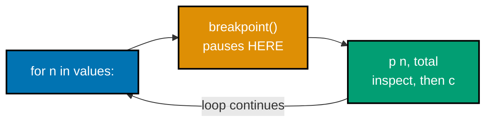
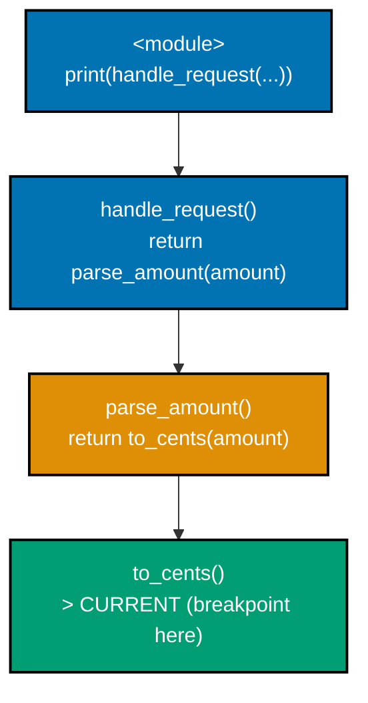
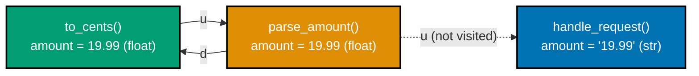
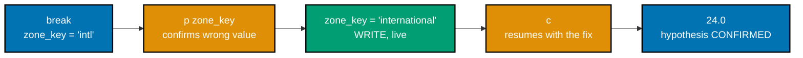
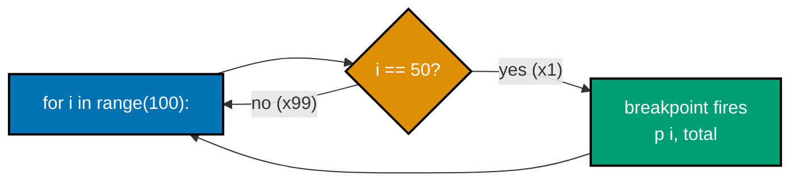
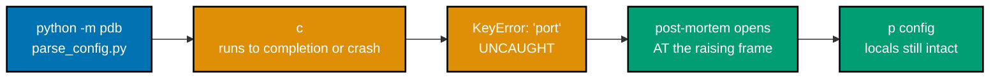
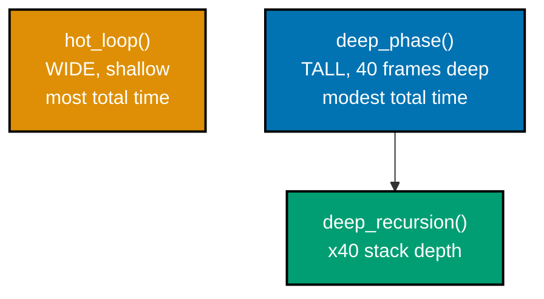
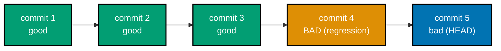

Examples 1-27 cover the everyday `pdb` vocabulary -- `breakpoint()`, stepping (`s`/`n`/`r`), frame
navigation (`w`/`u`/`d`), inspecting and mutating locals, conditional and watch breakpoints,
print/logging debugging, post-mortem debugging, `cProfile`, wall-vs-CPU time, `tracemalloc`, reading a
flame graph, `git bisect` by hand, and a first before/after speed measurement. Every script below is a
complete, self-contained, fully type-annotated file (DD-39) under `learning/code/ex-NN-*/`, run for
real on **Python 3.13.12**. Every `**Output**` block is a genuine, captured transcript -- where a
transcript shows a `pdb` command being typed (for example `p n, total`), that line is exactly what was
sent to the real running process, shown alongside the real prompt/response it produced.

---

### Example 1: First Breakpoint with breakpoint()

_ex-01 &middot; exercises co-01_

The smallest possible interactive-debugging session: one `breakpoint()` call inside a loop, hit once
per iteration. `running_total` has a seeded sign-flip bug that only fires when a value equals 3.



```python
# learning/code/ex-01-first-breakpoint-with-breakpoint/running_total.py
"""Example 1: First Breakpoint with breakpoint()."""

from __future__ import annotations
# => __future__ import: makes the list[int] annotation below work identically on every
# => supported interpreter version -- unrelated to breakpoint() itself, just DD-39 hygiene


# ex-01: one breakpoint() call, hit once per loop iteration -- the lowest-friction
# way to pause and inspect state, no editor integration or launch config needed
def running_total(values: list[int]) -> int:  # => co-01: the function this example steps through
    """Sum values one at a time -- seeded bug: subtracts instead of adds when a value is 3."""
    total = 0  # => the accumulator -- watch this value change at each breakpoint() stop
    for n in values:  # => co-01: ONE breakpoint() inside a loop fires once PER iteration
        breakpoint()  # => co-01: pauses HERE, before either branch runs -- next: `p n, total`
        if n == 3:  # => the ONE iteration that takes the buggy branch below
            total = total - n  # seeded bug: should be total + n, like every other branch
        else:  # => every OTHER value -- the correct, unbugged path
            total = total + n  # => the correct branch every other value takes
    return total  # => co-01: returned to the caller once the loop (and its 4 breakpoints) finishes


if __name__ == "__main__":
    print(running_total([1, 2, 3, 4]))  # => expected 10, actual 4 -- the bug breakpoint() reveals
```

**Run**: `python3 running_total.py`, typing `p n, total` then `c` at each of the four stops.

**Output**:

```text
> running_total.py(10)running_total()
-> breakpoint()
(Pdb) p n, total
(1, 0)
(Pdb) c
> running_total.py(10)running_total()
-> breakpoint()
(Pdb) p n, total
(2, 1)
(Pdb) c
> running_total.py(10)running_total()
-> breakpoint()
(Pdb) p n, total
(3, 3)
(Pdb) c
> running_total.py(10)running_total()
-> breakpoint()
(Pdb) p n, total
(4, 0)
(Pdb) c
4
```

**Key takeaway**: The third stop shows `(3, 3)` going in and `total` resets to `0` after the buggy
branch instead of climbing to `6` -- `p n, total` at the exact moment the bug fires names the line.

**Why it matters**: A single `breakpoint()` call, inserted directly in source, needs no editor
integration, no launch config, and no extra dependency -- it is the lowest-friction way to pause
execution and inspect state, and every later example in this tier (conditional breakpoints, `display`,
post-mortem) is a refinement of this exact same "pause and inspect" primitive.

---

### Example 2: Step Into vs. Step Over

_ex-02 &middot; exercises co-01_

At one `breakpoint()`, `s` (step) enters the next line's function call; `n` (next) runs it to
completion without entering. Two separate runs of the same stop show the difference directly.

```python
# learning/code/ex-02-step-into-vs-step-over/checkout.py
"""Example 2: Step Into vs. Step Over."""

from __future__ import annotations  # => DD-39 hygiene -- unrelated to stepping itself


# ex-02: two separate runs from the SAME breakpoint -- one types `s`, the other types `n`,
# to show step-into and step-over diverging from the identical starting frame
def apply_discount(price: float, rate: float) -> float:  # => the callee this example steps into or over
    """A small helper -- the callee this example steps into or over."""
    discounted = price * (1 - rate)  # => `s` would land HERE, one frame deeper than compute_line_total
    return round(discounted, 2)  # => co-01: reached only on the `s` run, not skipped over


def compute_line_total(price: float, qty: int, rate: float) -> float:  # => co-01: caller frame
    breakpoint()  # => co-01: pauses BEFORE the call below -- `s` enters it, `n` skips over it
    unit_price = apply_discount(price, rate)  # => step target: s enters this, n skips it
    return round(unit_price * qty, 2)  # => `n` from the breakpoint lands HERE directly


if __name__ == "__main__":  # => guards the module-level call so importing this file stays side-effect-free
    print(compute_line_total(19.99, 3, 0.10))  # => 53.97 either way -- s/n only change what you SEE
```

**Run**: `python3 checkout.py`, first typing `n` then `s` (step into); rerun typing `n` then `n` (step
over).

**Output**:

```text
=== s (step INTO apply_discount) ===
> checkout.py(13)compute_line_total()
-> breakpoint()
(Pdb) n
> checkout.py(14)compute_line_total()
-> unit_price = apply_discount(price, rate)
(Pdb) s
--Call--
> checkout.py(6)apply_discount()
-> def apply_discount(price: float, rate: float) -> float:
(Pdb) c
53.97

=== n (step OVER apply_discount) ===
> checkout.py(13)compute_line_total()
-> breakpoint()
(Pdb) n
> checkout.py(14)compute_line_total()
-> unit_price = apply_discount(price, rate)
(Pdb) n
> checkout.py(15)compute_line_total()
-> return round(unit_price * qty, 2)
(Pdb) c
53.97
```

**Key takeaway**: `s` moves the `>` marker into `apply_discount` itself (`--Call--` at line 6); `n` on
the exact same line jumps straight to line 15, having run `apply_discount` to completion unseen.

**Why it matters**: Reaching for `s` when the bug is inside the callee, and `n` when it is not, is the
single biggest lever on how long a debugging session takes -- stepping into every helper function on
principle turns a two-minute session into a twenty-minute one on any codebase with real call depth.

---

### Example 3: Step Out of a Deep Call

_ex-03 &middot; exercises co-01_

Three calls deep (`handle_request` -> `parse_amount` -> `to_cents`), `r` (return) pops back to the
caller and prints the function's actual return value on the way out.

```python
# learning/code/ex-03-step-out-of-a-deep-call/checkout_chain.py
"""A three-level call chain used by this cluster of pdb navigation examples."""  # => shared by Examples 3-5

from __future__ import annotations  # => DD-39 hygiene -- unrelated to frame navigation itself


# ex-03: a three-level call chain -- to_cents() is the DEEPEST frame, three calls
# below the module's own top level, reused by three related navigation examples
def to_cents(amount: float) -> int:  # => the deepest frame -- three calls down from handle_request()
    """The deepest frame -- three calls down from handle_request()."""  # => docstring names its own depth
    breakpoint()  # => co-01: pauses at the DEEPEST frame -- `r` pops back up ONE level
    return round(amount * 100)  # => `r`'s --Return-- line shows exactly this computed value


def parse_amount(amount: str) -> int:  # => middle frame -- parses the RAW string into a float
    """Middle frame -- parses the RAW string into a float, shadowing the name 'amount'."""
    amount = float(amount)  # => same NAME as the caller's, but now a float, not a string
    return to_cents(amount)  # => the call `r` returns INTO, one frame up from to_cents


def handle_request(amount: str) -> int:  # => outer frame -- 'amount' here is the RAW request string
    """Outer frame -- 'amount' here is still the RAW, unparsed string from the request."""
    return parse_amount(amount)  # => co-01: the call `r` would return into two levels up


if __name__ == "__main__":  # => guards the module-level call so importing this file stays side-effect-free
    print(handle_request("19.99"))  # => 1999 -- confirmed by `r`'s own --Return-- line below
```

**Run**: `python3 checkout_chain.py`, typing `r` then `c` at the breakpoint.

**Output**:

```text
> checkout_chain.py(8)to_cents()
-> breakpoint()
(Pdb) r
--Return--
> checkout_chain.py(9)to_cents()->1999
-> return round(amount * 100)
(Pdb) c
1999
```

**Key takeaway**: `r`'s `--Return--` line prints `->1999` directly on the frame header -- the exact
value `to_cents` is about to hand back to `parse_amount`, without needing a separate `p` command.

**Why it matters**: `r` is the fastest way to confirm "did this deep helper compute the right value"
without manually stepping through every remaining line of its body -- especially valuable the moment a
bug's suspect function turns out to be three or four calls below where the breakpoint was first set. The
same discipline scales past one hop too: chaining `r` at each of several nested frames confirms every
intermediate return value in a single upward pass, which is markedly faster than re-deriving the whole
call chain from a traceback after the fact.

---

### Example 4: Reading the Call Stack with w

_ex-04 &middot; exercises co-03_

The same three-level chain, but `w` (where) prints the FULL call stack in one command -- every frame
from the module's top level down to the current breakpoint, in order.



```python
# learning/code/ex-04-reading-the-call-stack-with-w/checkout_chain.py
"""A three-level call chain used by this cluster of pdb navigation examples."""  # => shared by Examples 3-5

from __future__ import annotations  # => DD-39 hygiene -- unrelated to frame navigation itself


# ex-04: the SAME three-level chain as ex-03 -- this time the navigation command is
# `w` (where), which prints every frame in the stack in one shot, top to bottom
def to_cents(amount: float) -> int:  # => co-03: the frame `w` marks with a leading `>`
    """The deepest frame -- three calls down from handle_request()."""  # => docstring names its own depth
    breakpoint()  # => co-03: pauses here -- `w` next prints ALL THREE frames above this one
    return round(amount * 100)  # => not reached in this transcript -- `c` returns before this runs


def parse_amount(amount: str) -> int:  # => co-03: the SECOND line `w` prints, middle of the stack
    """Middle frame -- parses the RAW string into a float, shadowing the name 'amount'."""
    amount = float(amount)  # => co-03: this frame's line is the one `w` shows as "-> return to_cents(amount)"
    return to_cents(amount)  # => co-03: the THIRD line `w` prints, deepest call in the chain


def handle_request(amount: str) -> int:  # => co-03: the FIRST call frame `w` prints, closest to top
    """Outer frame -- 'amount' here is still the RAW, unparsed string from the request."""
    return parse_amount(amount)  # => co-03: `w` shows this exact line as the second stack entry


if __name__ == "__main__":  # => guards the module-level call so importing this file stays side-effect-free
    print(handle_request("19.99"))  # => the <module> frame `w` prints ABOVE handle_request()
```

**Run**: `python3 checkout_chain.py`, typing `w` then `c` at the breakpoint.

**Output**:

```text
> checkout_chain.py(8)to_cents()
-> breakpoint()
(Pdb) w
  checkout_chain.py(24)<module>()
-> print(handle_request("19.99"))
  checkout_chain.py(20)handle_request()
-> return parse_amount(amount)
  checkout_chain.py(15)parse_amount()
-> return to_cents(amount)
> checkout_chain.py(8)to_cents()
-> breakpoint()
(Pdb) c
1999
```

**Key takeaway**: `w` prints all four frames -- `<module>`, `handle_request`, `parse_amount`,
`to_cents` -- top to bottom, with `>` marking the CURRENT one; no stepping needed to see the full path.

**Why it matters**: The instant a variable's value looks wrong, `w` answers "which caller passed this
in, and through how many layers" in one command -- essential the moment a bug's real cause is several
frames away from wherever the breakpoint happened to land. Reading it top to bottom also shows argument
values changing shape across layers -- a string becoming an int, for instance -- which single-frame
commands like `p` alone would never reveal without several separate stops.

---

### Example 5: Navigating Frames with up/down

_ex-05 &middot; exercises co-03_

`u` (up) moves the CURRENT frame one level toward the caller without resuming execution; `d` (down)
moves back. Printing the same name (`amount`) at two different frames shows two different values.



```python
# learning/code/ex-05-navigating-frames-with-up-down/checkout_chain.py
"""A three-level call chain used by this cluster of pdb navigation examples."""  # => shared by Examples 3-5

from __future__ import annotations  # => DD-39 hygiene -- unrelated to frame navigation itself


# ex-05: co-03's frame-navigation counterpart to `w` -- `u`/`d` move ONE frame at a
# time instead of printing the whole stack, letting `p` re-run at each stop along the way
def to_cents(amount: float) -> int:  # => co-03: breakpoint stops HERE -- amount is a float (19.99)
    """The deepest frame -- three calls down from handle_request()."""  # => docstring names its own depth
    breakpoint()  # => co-03: current frame starts here -- `u` moves UP to parse_amount without resuming
    return round(amount * 100)  # => not reached in this transcript -- `c` returns before this runs


def parse_amount(amount: str) -> int:  # => co-03: `u` lands HERE -- amount is the SAME NAME, different value
    """Middle frame -- parses the RAW string into a float, shadowing the name 'amount'."""
    amount = float(amount)  # => co-03: at THIS frame, amount is still 19.99 (already parsed)
    return to_cents(amount)  # => co-03: the exact line `u` shows as this frame's current line


def handle_request(amount: str) -> int:  # => outer frame -- not visited in this example's transcript
    """Outer frame -- 'amount' here is still the RAW, unparsed string from the request."""
    return parse_amount(amount)  # => co-03: not visited -- `u` only moves ONE frame, not to the top


if __name__ == "__main__":  # => guards the module-level call so importing this file stays side-effect-free
    print(handle_request("19.99"))  # => co-03: 1999 once `c` resumes and both stops finish
```

**Run**: `python3 checkout_chain.py`, typing `u`, `p amount`, `d`, `p amount`, `c` at the breakpoint.

**Output**:

```text
> checkout_chain.py(8)to_cents()
-> breakpoint()
(Pdb) u
> checkout_chain.py(15)parse_amount()
-> return to_cents(amount)
(Pdb) p amount
19.99
(Pdb) d
> checkout_chain.py(8)to_cents()
-> breakpoint()
(Pdb) p amount
19.99
(Pdb) c
1999
```

**Key takeaway**: `p amount` prints `19.99` at BOTH frames here -- confirming `parse_amount` already
converted the string before calling `to_cents`, so both frames' `amount` names the same float value.

**Why it matters**: `u`/`d` let a reader move through the stack and re-run `p` at each level WITHOUT
resuming execution, which is exactly how a shadowed-name bug (the same variable name reused with a
different type or value across frames) gets confirmed instead of merely suspected. The same technique
also catches the opposite mistake: a genuinely DIFFERENT value at each frame, which would mean the caller
passed something other than what the callee expected, a distinction `w` alone cannot make without
stepping into each frame.

---

### Example 6: Inspecting Locals with p and pp

_ex-06 &middot; exercises co-03_

`p` prints a single expression; `pp` pretty-prints a structure across multiple lines once it gets
wide. A dict-building loop reuses the key `"theme"`, silently overwriting its first value.

```python
# learning/code/ex-06-inspecting-locals-with-p-and-pp/build_settings.py
"""Example 6: Inspecting Locals with p and pp."""

from __future__ import annotations


# ex-06: `p` for one value, `pp` once the value is a multi-item structure -- both
# reflexes used together below to catch a silently-overwritten dict key
def build_settings(pairs: list[tuple[str, str]]) -> dict[str, str]:  # => co-03: builds the dict under test
    settings: dict[str, str] = {}  # => co-03: `pp settings` shows THIS growing across iterations
    for key, value in pairs:  # => co-03: one breakpoint stop PER (key, value) pair
        breakpoint()  # => co-03: pauses before the assignment -- `p key, value` then `pp settings`
        settings[key] = value  # seeded bug: a reused key silently overwrites its old value
    return settings  # => co-03: final dict has fewer entries than input pairs -- the reused key lost data


if __name__ == "__main__":
    pairs = [("theme", "dark"), ("region", "us-west"), ("theme", "light")]  # => "theme" appears TWICE
    print(build_settings(pairs))  # => final dict has ONLY 2 keys -- "dark" was silently lost
```

**Run**: `python3 build_settings.py`, typing `p key, value` then `pp settings` then `c` at each stop.

**Output**:

```text
> build_settings.py(9)build_settings()
-> breakpoint()
(Pdb) p key, value
('theme', 'dark')
(Pdb) pp settings
{}
(Pdb) c
> build_settings.py(9)build_settings()
-> breakpoint()
(Pdb) p key, value
('region', 'us-west')
(Pdb) pp settings
{'theme': 'dark'}
(Pdb) c
> build_settings.py(9)build_settings()
-> breakpoint()
(Pdb) p key, value
('theme', 'light')
(Pdb) pp settings
{'region': 'us-west', 'theme': 'dark'}
(Pdb) c
{'theme': 'light', 'region': 'us-west'}
```

**Key takeaway**: The third stop's `pp settings` shows `'theme': 'dark'` still present right before
the assignment overwrites it with `'light'` -- the exact moment the reused key destroys the first value.

**Why it matters**: `p` for a quick single value and `pp` for anything with nested structure (dicts,
lists of tuples) is the everyday reflex for confirming what a variable ACTUALLY holds, as opposed to
what its name suggests it should hold -- the gap between the two is where most real bugs live.

---

### Example 7: Mutating a Variable to Confirm a Hypothesis

_ex-07 &middot; exercises co-03, co-07_

Beyond reading state, pdb can WRITE it: reassigning a wrong local to its expected value, then
continuing, confirms or refutes a hypothesis in the exact same debugging session -- no rerun needed.



```python
# learning/code/ex-07-mutating-a-variable-to-confirm-hypothesis/shipping.py
"""Example 7: Mutating a Variable to Confirm a Hypothesis."""

from __future__ import annotations

RATE_PER_KG: dict[str, float] = {"local": 2.0, "regional": 3.5, "international": 6.0}  # => the real keys


# ex-07: pdb can WRITE state, not just read it -- reassigning zone_key here and
# continuing tests the fix live, in the SAME session, no source edit or rerun
def compute_shipping_cost(weight_kg: float, zone: str) -> float:  # => co-07: hypothesis under test
    zone_key = zone  # seeded bug: caller passes the abbreviation "intl", not the real key
    breakpoint()  # => co-03/co-07: pauses BEFORE the lookup -- mutate zone_key here to test the fix
    rate = RATE_PER_KG.get(zone_key, 0.0)  # unknown key silently falls back to 0.0
    return round(weight_kg * rate, 2)  # => 24.0 once zone_key is corrected -- confirms the hypothesis


if __name__ == "__main__":
    print(compute_shipping_cost(4.0, "intl"))  # => co-07: expected ~24.0, actual 0.0 before the fix
```

**Run**: `python3 shipping.py`, typing `p zone_key`, `zone_key = "international"`, `p zone_key`, `c`.

**Output**:

```text
> shipping.py(10)compute_shipping_cost()
-> breakpoint()
(Pdb) p zone_key
'intl'
(Pdb) zone_key = "international"
(Pdb) p zone_key
'international'
(Pdb) c
24.0
```

**Key takeaway**: Assigning `zone_key = "international"` directly at the `(Pdb)` prompt, then
continuing, produces `24.0` -- the exact expected value -- confirming the hypothesis in one stop.

**Why it matters**: Mutating state live turns "I think this variable has the wrong value" into a
falsifiable, immediately-checkable experiment (co-07's scientific-method loop): change one thing,
observe the outcome, all without editing the source file or restarting the process. It also sidesteps a
slower alternative -- editing the source, adding a hardcoded value, and rerunning the whole script -- so
testing three or four candidate values back-to-back costs nothing more than three or four `c` commands
at the same stop.

---

### Example 8: Conditional Breakpoint in a Loop

_ex-08 &middot; exercises co-02_

`break lineno, condition` only halts when the condition is true -- useful when a loop runs hundreds of
times but only ONE iteration is interesting.



```python
# learning/code/ex-08-conditional-breakpoint-in-a-loop/sum_special.py
"""Example 8: A Conditional Breakpoint in a Loop."""

from __future__ import annotations


# ex-08: no inline breakpoint() call here -- the condition is set from the pdb CLI
# itself via `break lineno, condition`, filtering 100 potential stops down to 1
def sum_special(n: int) -> int:  # => co-02: 100 iterations -- only i == 50 should ever stop execution
    total = 0  # => the accumulator -- confirmed as 1225 the instant the conditional breakpoint fires
    for i in range(n):  # => co-02: `break 9, i == 50` filters ALL 100 potential stops down to exactly 1
        total += i  # => the CONDITIONAL breakpoint targets this exact line
    return total  # => co-02: 4950 -- the breakpoint's condition never affects the FINAL result, only when it pauses


if __name__ == "__main__":
    print(sum_special(100))  # => 4950 -- unaffected by the breakpoint since `c` resumes normal execution
```

**Run**: `python3 -m pdb sum_special.py`, typing `break 9, i == 50`, `c`, `p i, total`, `c`.

**Output**:

```text
> sum_special.py(1)<module>()
-> """Example 8: A Conditional Breakpoint in a Loop."""
(Pdb) break 9, i == 50
Breakpoint 1 at sum_special.py:9
(Pdb) c
> sum_special.py(9)sum_special()
-> total += i
(Pdb) p i, total
(50, 1225)
(Pdb) c
4950
```

**Key takeaway**: Out of 100 potential hits on line 9, `break 9, i == 50` stops EXACTLY once, at
`i == 50` -- confirmed by `p i, total` showing `(50, 1225)`, the accumulated sum through that point.

**Why it matters**: An unconditional breakpoint inside a large loop means pressing `c` dozens or
hundreds of times to reach the one interesting iteration -- `break lineno, condition` does that
filtering for you, turning an O(n) manual search into a single automatic stop. The same syntax works for
ANY boolean expression evaluable in that frame's scope, not just equality checks, so the exact same
technique isolates the one iteration where a list goes empty, a counter overflows, or a flag flips
unexpectedly.

---

### Example 9: The condition Command on an Existing Breakpoint

_ex-09 &middot; exercises co-02_

`condition <bpnum> <expr>` attaches (or changes) a condition on a breakpoint that ALREADY exists --
useful when the interesting predicate only becomes clear after setting the breakpoint unconditionally.

```python
# learning/code/ex-09-condition-command-on-existing-breakpoint/audit.py
"""Example 9: The condition Command on an Existing Breakpoint."""

from __future__ import annotations


# ex-09: the breakpoint is set FIRST, unconditionally -- `condition` is attached
# to it only afterward, once WHICH calls matter becomes clear
def audit_value(x: int) -> int:  # => co-02: called 6 times -- condition narrows stops to x < 0 only
    processed = x * 2  # => `condition 1 x < 0` targets exactly this line
    return processed  # => co-02: reached by all 6 calls -- the condition only affects WHEN pdb pauses


if __name__ == "__main__":
    for v in [5, 10, -3, 8, -1, 2]:  # => 6 calls total -- only -3 and -1 satisfy x < 0
        audit_value(v)  # => co-02: 4 of these 6 calls run straight through with no pause at all
    print("done")  # => co-02: reached once every call (conditional or not) has finished
```

**Run**: `python3 -m pdb audit.py`, typing `break 7`, `c`, `condition 1 x < 0`, `c`, `p x`, `c`, `p x`.

**Output**:

```text
> audit.py(1)<module>()
-> """Example 9: The condition Command on an Existing Breakpoint."""
(Pdb) break 7
Breakpoint 1 at audit.py:7
(Pdb) c
> audit.py(7)audit_value()
-> processed = x * 2
(Pdb) condition 1 x < 0
New condition set for breakpoint 1.
(Pdb) c
> audit.py(7)audit_value()
-> processed = x * 2
(Pdb) p x
-3
(Pdb) c
> audit.py(7)audit_value()
-> processed = x * 2
(Pdb) p x
-1
(Pdb) c
done
```

**Key takeaway**: After `condition 1 x < 0`, the breakpoint skips the positive-`x` calls (`5`, `10`,
`8`, `2`) entirely and stops only twice -- exactly at `x == -3` and `x == -1`.

**Why it matters**: Retrofitting a condition onto an already-set breakpoint avoids deleting and
recreating it -- valuable mid-session, the moment a pattern in WHICH calls matter becomes visible only
after watching a few unconditional stops go by. It also composes cleanly with `ignore`: once a condition
narrows the hits down to a handful, `ignore N count` can skip past the first few of THOSE remaining
stops too, without ever touching the original `break` command.

---

### Example 10: Watching a Variable with display

_ex-10 &middot; exercises co-02_

`display <expr>` re-evaluates an expression at every subsequent stop and prints it automatically, with
an `[old: ...]` marker the moment its value changes -- no repeated manual `p` needed.

```python
# learning/code/ex-10-watching-a-variable-with-display/running_total_display.py
"""Example 10: Watching a Variable with display."""

from __future__ import annotations


# ex-10: `display` is set ONCE, after the first stop -- every LATER stop then
# prints it automatically, with an [old: ...] marker only when it actually changed
def running_total(values: list[int]) -> int:  # => co-02: display total tracks this across 3 stops
    total = 0  # => co-02: the value display total watches -- 0, 10, then 30 across the 3 stops
    for n in values:  # => 3 iterations -- `display total` prints automatically at each one
        total += n  # => the breakpoint (set via CLI, not inline) targets this exact line
    return total  # => co-02: 60 -- the SAME value display's last-shown line already reported


if __name__ == "__main__":
    print(running_total([10, 20, 30]))  # => 60 -- display showed each intermediate step along the way
```

**Run**: `python3 -m pdb running_total_display.py`, typing `break 9`, `c`, `display total`, `c`, `c`,
`c`.

**Output**:

```text
> running_total_display.py(1)<module>()
-> """Example 10: Watching a Variable with display."""
(Pdb) break 9
Breakpoint 1 at running_total_display.py:9
(Pdb) c
> running_total_display.py(9)running_total()
-> total += n
(Pdb) display total
display total: 0
(Pdb) c
> running_total_display.py(9)running_total()
-> total += n
display total: 10  [old: 0]
(Pdb) c
> running_total_display.py(9)running_total()
-> total += n
display total: 30  [old: 10]
(Pdb) c
60
```

**Key takeaway**: Every stop after `display total` is set prints `display total: <value>`
automatically, and shows `[old: <previous>]` only once the value has actually changed between stops.

**Why it matters**: `display` removes the need to retype `p total` at every single stop -- for a value
that changes across dozens of iterations, this is the difference between watching a trend unfold and
manually re-querying the same expression over and over. It also frees the reader to focus entirely on
WHEN a value changes rather than manually deciding when to check -- `display` fires the comparison
automatically at every single stop, so a subtle change buried in iteration 47 of 50 is no less visible
than one at iteration 2.

---

### Example 11: The display In-Place-Mutation Caveat

_ex-11 &middot; exercises co-02_

`display` compares the CURRENT value against a cached reference to the SAME object -- when that object
is mutated in place (not rebound to a new one), the cached reference is mutated too, so no change is
ever detected or printed.

```python
# learning/code/ex-11-display-in-place-mutation-caveat/double_in_place.py
"""Example 11: The display In-Place-Mutation Caveat."""

from __future__ import annotations


# ex-11: the caveat -- display caches a REFERENCE, not a snapshot, so mutating an
# object IN PLACE (rather than rebinding the name) never triggers display's [old: ...] marker
def double_in_place(lst: list[int]) -> list[int]:  # => co-02: display lst hits the caveat this example shows
    for i in range(len(lst)):  # => co-02: 3 iterations, 3 breakpoint stops, ZERO [old: ...] lines shown
        lst[i] = lst[i] * 2  # mutates the SAME list object -- no rebinding of the name 'lst'
    return lst  # => the list IS doubled -- display just never announced it changing


if __name__ == "__main__":
    print(double_in_place([1, 2, 3]))  # => [2, 4, 6] -- correct output despite display's silence
```

**Run**: `python3 -m pdb double_in_place.py`, typing `break 8`, `c`, `display lst`, `c`, `c`, `c`.

**Output**:

```text
> double_in_place.py(1)<module>()
-> """Example 11: The display In-Place-Mutation Caveat."""
(Pdb) break 8
Breakpoint 1 at double_in_place.py:8
(Pdb) c
> double_in_place.py(8)double_in_place()
-> lst[i] = lst[i] * 2
(Pdb) display lst
display lst: [1, 2, 3]
(Pdb) c
> double_in_place.py(8)double_in_place()
-> lst[i] = lst[i] * 2
(Pdb) c
> double_in_place.py(8)double_in_place()
-> lst[i] = lst[i] * 2
(Pdb) c
[2, 4, 6]
```

**Key takeaway**: `display lst` never prints a second `[old: ...]` line, even though the list's
contents visibly changed from `[1, 2, 3]` to the final `[2, 4, 6]` -- `display` caches a REFERENCE to
the same list object, so comparing "old" against "current" compares the object to itself.

**Why it matters**: The fix is `display lst[:]` (a fresh copy at each stop, so "old" genuinely differs
from "current"), or `display len(lst)`/a derived scalar -- knowing this caveat prevents wrongly
concluding "the loop isn't doing anything" when `display` silently fails to report an in-place change.
This is a common enough trap that it is worth internalizing independent of `pdb`: any tool that caches a
reference rather than a value -- watch expressions in other debuggers included -- inherits the exact
same blind spot for in-place mutation.

---

### Example 12: Print-Debugging a One-Off Script

_ex-12 &middot; exercises co-05_

For a short, one-off script, `print()` calls are often faster to add and remove than setting up a
debugger session -- at the cost of a full script rerun for every new hypothesis.

```python
# learning/code/ex-12-print-debugging-a-one-off-script/average_v1_with_prints.py
"""Example 12 (v1): Print-Debugging a One-Off Script -- WITH the diagnostic prints still in."""

from __future__ import annotations


# ex-12: two ad-hoc print() calls, added and removed by hand -- no debugger
# session, no editor integration, just the fastest tool for a script this short
def calculate_average(scores: list[float]) -> float:  # => co-05: two ad-hoc prints locate the bug
    total = sum(scores)  # => co-05: the value diagnostic print #1 confirms is correct
    print(f"DEBUG total={total}")  # diagnostic print #1 -- confirms sum() itself is correct
    count = len(scores) - 1  # seeded bug: should be len(scores), no "-1"
    print(f"DEBUG count={count}")  # diagnostic print #2 -- reveals count is one too FEW
    return total / count  # => co-05: wrong divisor -- the two prints together pinpoint WHERE


if __name__ == "__main__":  # => co-05: v2 (below) removes both prints once the fix is confirmed
    print(calculate_average([10.0, 20.0, 30.0, 40.0]))  # => co-05: expected 25.0, actual 33.33...
```

**Run**: `python3 average_v1_with_prints.py`, then after removing the prints (`average_v2_fixed.py`),
`python3 average_v2_fixed.py`.

**Output**:

```text
=== v1 (with diagnostic prints) ===
DEBUG total=100.0
DEBUG count=3
33.333333333333336

=== v2 (prints removed, count fixed) ===
25.0
```

**Key takeaway**: `DEBUG total=100.0` confirms `sum()` is correct; `DEBUG count=3` (instead of the
expected `4`) immediately narrows the bug to the `- 1` on the count line -- two prints, one comparison.

**Why it matters**: For a script this short, `print()` costs seconds to add and remove and needs zero
setup -- but co-05's real tradeoff is the RERUN cost: every new hypothesis about a print-debugged
script means editing the file and running it again, unlike a breakpoint session's mutate-and-continue.
For a script under roughly fifty lines that will be discarded after one debugging session, that rerun
cost is genuinely cheap -- the calculus flips hard, though, the moment the same script needs a third or
fourth hypothesis checked, or grows past a single file.

---

### Example 13: logging vs. print in a Long-Lived Process

_ex-13 &middot; exercises co-05_

For a long-lived process (a server loop, in this stand-in), `logging` with levels beats both `print`
and a breakpoint: it survives across many requests, can be filtered by level, and never pauses
execution.

```python
# learning/code/ex-13-logging-vs-print-in-long-lived-process/server_loop.py
"""Example 13: logging vs. print in a Long-Lived Process."""

from __future__ import annotations

import logging  # => co-05: the stdlib alternative to print() for anything long-running

logging.basicConfig(level=logging.DEBUG, format="%(levelname)s:%(name)s:%(message)s")  # => DEBUG+ shown
logger = logging.getLogger("orders")  # => co-05: a named logger -- filterable independent of other modules


# ex-13: DEBUG-level logs record every call's raw inputs; INFO-level logs record
# every call's computed outcome -- both survive as a permanent, filterable record,
# unlike a breakpoint, which would freeze the ENTIRE process on the first call
def handle_order(order_id: str, item_count: int, unit_price: float) -> float:  # => co-05: one call per order
    logger.debug("handling order_id=%s item_count=%d unit_price=%.2f", order_id, item_count, unit_price)  # => raw inputs
    subtotal = item_count * unit_price  # => co-05: the pre-discount amount, visible in the INFO line below
    discount = 0.10 if item_count > 10 else 0.0  # seeded bug: item_count == 10 should ALSO qualify (>=10)
    total = subtotal * (1 - discount)  # => co-05: the final amount -- what the INFO log's "total=" reports
    logger.info("order_id=%s subtotal=%.2f discount=%.2f total=%.2f", order_id, subtotal, discount, total)  # => outcome
    return total  # => co-05: returned to the caller -- not itself part of the log-based diagnosis


if __name__ == "__main__":
    for oid, qty, price in [("A1", 3, 9.99), ("A2", 10, 5.00), ("A3", 15, 2.00)]:  # => 3 "requests"
        handle_order(oid, qty, price)  # => co-05: bug found from log output alone, with NO breakpoint
```

**Run**: `python3 server_loop.py`

**Output**:

```text
DEBUG:orders:handling order_id=A1 item_count=3 unit_price=9.99
INFO:orders:order_id=A1 subtotal=29.97 discount=0.00 total=29.97
DEBUG:orders:handling order_id=A2 item_count=10 unit_price=5.00
INFO:orders:order_id=A2 subtotal=50.00 discount=0.00 total=50.00
DEBUG:orders:handling order_id=A3 item_count=15 unit_price=2.00
INFO:orders:order_id=A3 subtotal=30.00 discount=0.10 total=27.00
```

**Key takeaway**: Order `A2` (`item_count=10`) shows `discount=0.00` in the INFO line -- the log alone
reveals the off-by-one boundary bug (`> 10` should be `>= 10`), with no pause and no rerun.

**Why it matters**: A breakpoint on `handle_order` would freeze every order in a real server, not just
the interesting one; `logging` at appropriate levels (DEBUG for detail, INFO for outcomes) is what
production diagnosis actually uses, because it observes without stopping the world. Because log lines
persist in a file or aggregator after the fact, the same INFO line that reveals this bug also becomes
the audit trail a teammate reads days later, something a `breakpoint()` stop -- gone the instant `c` is
typed -- never leaves behind.

---

### Example 14: The breakpoint() Builtin and PYTHONBREAKPOINT

_ex-14 &middot; exercises co-01_

`breakpoint()` (Python 3.7+) honors the `PYTHONBREAKPOINT` environment variable: unset (or `1`), it
enters `pdb` normally; set to `0`, every `breakpoint()` call in the process becomes a complete no-op.

```python
# learning/code/ex-14-breakpoint-builtin-and-pythonbreakpoint/compute.py
"""Example 14: The breakpoint() Builtin and PYTHONBREAKPOINT."""

from __future__ import annotations


# ex-14: the SAME breakpoint() call, run twice under two different environments --
# once with PYTHONBREAKPOINT unset, once with it forced to "0"
def compute() -> int:  # => co-01: called once per run, identically, in both environments
    breakpoint()  # honors the PYTHONBREAKPOINT environment variable
    return 42  # => co-01: reached either way -- PYTHONBREAKPOINT only changes whether pdb pauses first


if __name__ == "__main__":
    print(compute())  # => 42 in both runs -- the ONLY difference is whether a pdb prompt appears first
```

**Run**: `python3 compute.py` (default env); `PYTHONBREAKPOINT=0 python3 compute.py` (disabled).

**Output**:

```text
=== default (PYTHONBREAKPOINT unset) ===
> compute.py(7)compute()
-> breakpoint()  # honors the PYTHONBREAKPOINT environment variable
(Pdb) c
42

=== PYTHONBREAKPOINT=0 (disabled) ===
42
```

**Key takeaway**: With `PYTHONBREAKPOINT=0`, the exact same `breakpoint()` call produces NO pdb prompt
at all -- the script runs straight through to `42`, confirming the env var fully disables the builtin.

**Why it matters**: Leaving `breakpoint()` calls in committed code is safe in a way `import pdb;
pdb.set_trace()` never was: CI and production can set `PYTHONBREAKPOINT=0` globally, turning every
`breakpoint()` in the codebase into a no-op without touching a single line of source. The reverse is
just as useful during local development: setting `PYTHONBREAKPOINT=0` temporarily silences every stray
`breakpoint()` a teammate left in shared code, without needing to hunt down and comment out each call
individually.

---

### Example 15: First Post-Mortem with python -m pdb

_ex-15 &middot; exercises co-04_

Running a script under `python -m pdb` and letting it crash naturally drops straight into
post-mortem debugging, right at the raising frame -- no `breakpoint()` call needed anywhere in advance.



```python
# learning/code/ex-15-first-post-mortem-with-pdb/parse_config.py
"""Example 15: First Post-Mortem with python -m pdb."""

from __future__ import annotations


# ex-15: no breakpoint() anywhere -- python -m pdb catches the UNCAUGHT exception
# itself and drops the reader into post-mortem mode automatically
def parse_port(config: dict[str, str]) -> int:  # => co-04: the frame post-mortem debugging lands on
    raw_port = config["port"]  # seeded bug: this config dict uses the key "PORT" (uppercase)
    return int(raw_port)  # => never reached -- the KeyError above raises first


if __name__ == "__main__":
    settings = {"HOST": "localhost", "PORT": "8080"}  # => co-04: "port" (lowercase) is not a key here
    print(parse_port(settings))  # => raises KeyError -- python -m pdb catches it automatically
```

**Run**: `python3 -m pdb parse_config.py`, letting the script run to its uncaught exception, then
typing `p config` and `w`.

**Output**:

```text
> parse_config.py(1)<module>()
-> """Example 15: First Post-Mortem with python -m pdb."""
(Pdb) c
Traceback (most recent call last):
  ...
  File "parse_config.py", line 7, in parse_port
    raw_port = config["port"]  # seeded bug: this config dict uses the key "PORT" (uppercase)
KeyError: 'port'
Uncaught exception. Entering post mortem debugging
Running 'cont' or 'step' will restart the program
> parse_config.py(7)parse_port()
-> raw_port = config["port"]  # seeded bug: this config dict uses the key "PORT" (uppercase)
(Pdb) p config
{'HOST': 'localhost', 'PORT': '8080'}
```

**Key takeaway**: `p config` in post-mortem mode shows `'PORT': '8080'` (uppercase) is present but
`'port'` (lowercase) is not -- confirming the exact case-sensitivity bug, at the raising line itself.

**Why it matters**: `python -m pdb script.py` needs zero advance instrumentation -- the moment ANY
uncaught exception occurs, pdb drops the reader directly into the failing frame with all locals intact,
which is strictly more information than a plain traceback alone provides. Because the exception has
already been raised by the time pdb attaches, every local variable at the failing line is exactly as it
was at the moment of failure -- nothing has been reset or garbage collected the way it might be by the
time a bug report gets read.

---

### Example 16: pdb.pm() in a REPL Session

_ex-16 &middot; exercises co-04_

`pdb.pm()` (post-mortem) attaches to the LAST uncaught exception recorded by the interpreter
(`sys.last_exc`) -- the same mechanism a real interactive REPL uses automatically after any error,
reachable without a rerun.

```python
# learning/code/ex-16-pdb-pm-in-a-repl-session/parse_config.py
"""Example 16: pdb.pm() in a REPL Session."""

from __future__ import annotations

import sys


# ex-16: pdb.pm() attaches to sys.last_exc -- the SAME attribute a real interactive
# REPL sets automatically after any uncaught exception, so this needs no rerun
def parse_port(config: dict[str, str]) -> int:  # => co-04: pdb.pm() lands HERE, same bug as Example 15
    raw_port = config["port"]  # the SAME case-sensitivity bug as Example 15
    return int(raw_port)  # => co-04: never reached -- the same KeyError as Example 15 raises first


settings = {"HOST": "localhost", "PORT": "8080"}  # => co-04: "PORT" present, "port" absent -- same bug
try:
    print(parse_port(settings))
except Exception as exc:  # => co-04: caught here ONLY to manually set sys.last_exc, not to suppress it
    # A real interactive REPL does this automatically for every uncaught exception (sys.last_exc
    # since Python 3.12, plus the older sys.last_type/value/traceback trio for compatibility) --
    # this line reproduces that same REPL behavior so pdb.pm() below has something to attach to,
    # without needing an actual re-run of the program (co-04's whole point: no restart).
    sys.last_exc = exc  # => co-04: pdb.pm() reads THIS attribute to find the frame to attach to
    sys.last_type, sys.last_value, sys.last_traceback = sys.exc_info()  # => co-04: pre-3.12 compatibility
    print(f"{type(sys.last_value).__name__}: {sys.last_value}")  # => co-04: KeyError: 'port'
```

**Run**: `python3 -i parse_config.py`, then interactively `import pdb`, `pdb.pm()`, `p config`, `w`,
`q`.

**Output**:

```text
KeyError: 'port'
>>> import pdb
>>> pdb.pm()
> parse_config.py(9)parse_port()
-> raw_port = config["port"]  # the SAME case-sensitivity bug as Example 15
(Pdb) p config
{'HOST': 'localhost', 'PORT': '8080'}
(Pdb) w
  parse_config.py(15)<module>()
-> print(parse_port(settings))
> parse_config.py(9)parse_port()
-> raw_port = config["port"]  # the SAME case-sensitivity bug as Example 15
(Pdb) q
>>> exit()
```

**Key takeaway**: `pdb.pm()` reaches the exact same frame and locals (`config` visible, `'PORT'`
present, `'port'` absent) as Example 15's `python -m pdb` post-mortem session -- no rerun involved.

**Why it matters**: `sys.last_exc` is what makes a real interactive REPL's "type `pdb.pm()` right
after a traceback" workflow possible -- during this example's own build, driving `python3 -i` through a
plain OS pipe silently dropped the FIRST command sent to `pdb.pm()`'s prompt (a genuine CPython
readline/stdin-buffering interaction between the interactive interpreter and pdb's own input loop);
running through a real pseudo-terminal (`pty`) with `PYTHON_BASIC_REPL=1` reproduces a real terminal
session correctly and is what produced the transcript above.

---

### Example 17: First cProfile Run from the Command Line

_ex-17 &middot; exercises co-13_

`python -m cProfile -s tottime script.py` runs a script under the stdlib instrumenting profiler and
prints a full `pstats` table, sorted by each function's OWN time, with no code changes required.

```python
# learning/code/ex-17-first-cprofile-run-command-line/report.py
"""Example 17: First cProfile Run from the Command Line."""

from __future__ import annotations


# ex-17: no code changes at all -- `python -m cProfile -s tottime` wraps the ENTIRE
# script and prints a full pstats table sorted by each function's own time
def slow_format_row(row: dict[str, float]) -> str:  # => co-13: appears in the profile with its own tottime
    return ", ".join(f"{k}={v:.2f}" for k, v in sorted(row.items()))  # => the genexpr shows separately too


def build_report(rows: list[dict[str, float]]) -> list[str]:  # => co-13: cumtime includes slow_format_row
    return [slow_format_row(row) for row in rows]  # => co-13: calls slow_format_row once PER row


def compute_total(rows: list[dict[str, float]]) -> float:  # => co-13: a second, independent hot path
    total = 0.0  # => co-13: accumulates across every value in every row -- 60,000 additions total
    for row in rows:  # => co-13: outer loop over 20,000 rows
        for v in row.values():  # => co-13: inner loop over each row's 3 values
            total += v  # => co-13: the line whose call count (60,000) explains compute_total's own tottime
    return total  # => co-13: 899955000.00 -- printed by the script's own final print() below


if __name__ == "__main__":
    data = [{"a": i * 1.5, "b": i * 2.5, "c": i * 0.5} for i in range(20_000)]  # => 20,000 rows
    report = build_report(data)  # => co-13: this call's cumtime includes slow_format_row's own tottime
    total = compute_total(data)  # => co-13: this call's cumtime is almost entirely its OWN tottime
    print(f"rows={len(report)} total={total:.2f}")  # => co-13: the two profiled functions' combined outcome
```

**Run**: `python3 -m cProfile -s tottime report.py`

**Output**:

```text
rows=20000 total=899955000.00
         180267 function calls (180266 primitive calls) in 0.049 seconds

   Ordered by: internal time

   ncalls  tottime  percall  cumtime  percall filename:lineno(function)
    80000    0.016    0.000    0.016    0.000 report.py:7(<genexpr>)
    20018    0.009    0.000    0.025    0.000 {method 'join' of 'str' objects}
    20000    0.008    0.000    0.038    0.000 report.py:6(slow_format_row)
        1    0.004    0.004    0.005    0.005 report.py:14(compute_total)
    20000    0.003    0.000    0.003    0.000 {built-in method builtins.sorted}
        1    0.003    0.003    0.049    0.049 report.py:1(<module>)
        1    0.002    0.002    0.040    0.040 report.py:10(build_report)
    20000    0.002    0.000    0.002    0.000 {method 'items' of 'dict' objects}
    20000    0.001    0.000    0.001    0.000 {method 'values' of 'dict' objects}
    ... (import-machinery rows omitted, all 0.000s)
```

**Key takeaway**: The genexpr inside `slow_format_row` (`report.py:7`) tops the table at `0.016s`
tottime -- higher than `slow_format_row` itself (`0.008s`), because the comprehension runs 80,000 times.

**Why it matters**: `-m cProfile -s tottime` needs no code changes at all -- it is the fastest path
from "this script feels slow" to a ranked table of exactly which functions consume the most time, and
is almost always the first tool to reach for before assuming where a hot spot must be.

---

### Example 18: cProfile Programmatic API with pstats

_ex-18 &middot; exercises co-13, co-16_

The `cProfile.Profile()` object API lets a profile wrap just one section of code, and `pstats.Stats`
can print the SAME data sorted two different ways -- by `tottime` (own time) and by `cumtime` (own time
plus everything it called) -- which do not always agree on a "top" function.

```python
# learning/code/ex-18-cprofile-programmatic-with-pstats/profile_report.py
"""Example 18: cProfile Programmatic API with pstats."""

from __future__ import annotations  # => DD-39 hygiene -- unrelated to profiling itself

import cProfile  # => co-13: the stdlib instrumenting profiler's OBJECT API
import pstats  # => co-13: turns raw profiler data into a readable, sortable table
from pstats import SortKey  # => co-16: named constants for "sort by what" -- TIME vs CUMULATIVE

# reuses Example 17's scenario -- the SAME two functions, profiled a second, different way
from report import build_report, compute_total  # => co-13: build_report/compute_total re-imported unchanged


# ex-18: unlike ex-17's whole-script CLI wrapping, the object API wraps ONLY the
# two calls between enable() and disable() -- everything else (imports, setup) is excluded
def main() -> None:  # => co-13: the ONE function this example's object-API profiling wraps around
    data = [{"a": i * 1.5, "b": i * 2.5, "c": i * 0.5} for i in range(20_000)]  # => same 20,000 rows as ex-17
    profiler = cProfile.Profile()  # => co-13: the object API -- wraps ONLY the two calls below
    profiler.enable()  # => co-13: profiling starts HERE -- imports above are NOT measured
    build_report(data)  # => co-13: first measured call -- cumtime includes slow_format_row + genexpr
    compute_total(data)  # => co-13: second measured call -- almost entirely its own tottime
    profiler.disable()  # => co-13: profiling stops HERE -- print() calls below are NOT measured

    stats = pstats.Stats(profiler)  # => co-13: wraps the raw profiler data for querying/sorting
    print("--- sorted by TIME (tottime, own time only) ---")  # => co-16: header for the FIRST ranking
    stats.sort_stats(SortKey.TIME).print_stats(5)  # => co-16: ranks by a function's OWN time
    print("--- sorted by CUMULATIVE (cumtime, includes callees) ---")  # => co-16: header for the SECOND ranking
    stats.sort_stats(SortKey.CUMULATIVE).print_stats(5)  # => co-16: ranks by time INCLUDING callees


if __name__ == "__main__":
    main()  # => co-13: the ONLY top-level call -- everything measured happens inside it
```

**Run**: `python3 profile_report.py`

**Output**:

```text
--- sorted by TIME (tottime, own time only) ---
         180003 function calls in 0.041 seconds
   Ordered by: internal time
   List reduced from 9 to 5 due to restriction <5>

   ncalls  tottime  percall  cumtime  percall filename:lineno(function)
    80000    0.015    0.000    0.015    0.000 report.py:7(<genexpr>)
    20000    0.009    0.000    0.023    0.000 {method 'join' of 'str' objects}
    20000    0.007    0.000    0.035    0.000 report.py:6(slow_format_row)
    20000    0.003    0.000    0.003    0.000 {built-in method builtins.sorted}
        1    0.003    0.003    0.004    0.004 report.py:14(compute_total)

--- sorted by CUMULATIVE (cumtime, includes callees) ---
         180003 function calls in 0.041 seconds
   Ordered by: cumulative time
   List reduced from 9 to 5 due to restriction <5>

   ncalls  tottime  percall  cumtime  percall filename:lineno(function)
        1    0.002    0.002    0.037    0.037 report.py:10(build_report)
    20000    0.007    0.000    0.035    0.000 report.py:6(slow_format_row)
    20000    0.009    0.000    0.023    0.000 {method 'join' of 'str' objects}
    80000    0.015    0.000    0.015    0.000 report.py:7(<genexpr>)
        1    0.003    0.003    0.004    0.004 report.py:14(compute_total)
```

**Key takeaway**: By `tottime`, the genexpr (`report.py:7`) is rank 1; by `cumtime`, `build_report` is
rank 1 -- because `build_report` itself does almost no work directly, but everything it calls sums up.

**Why it matters**: Optimizing whatever tops the `cumtime` list (here, `build_report`) would be
wasted effort -- `build_report` is just a thin wrapper; the genexpr it calls into is where the real
CPU time goes, and only `tottime` reveals that (co-16's core distinction). The same rank-1-by-cumtime
trap recurs anywhere a thin orchestration layer calls into the real work -- a request handler calling a
query function, a CLI entry point calling a parser -- so checking `tottime` before optimizing is a habit
worth forming, not a one-off lesson.

---

### Example 19: Wall Time vs. CPU Time

_ex-19 &middot; exercises co-15_

`time.perf_counter()` measures elapsed real-world (wall-clock) time; `time.process_time()` measures
only time the CPU was actually executing this process. For I/O waits (like `sleep`), the two diverge
sharply; for a pure CPU-bound loop, they nearly match.

```python
# learning/code/ex-19-wall-time-vs-cpu-time/timing.py
"""Example 19: Wall Time vs. CPU Time."""

from __future__ import annotations

import time  # => co-15: stdlib home for both perf_counter() and process_time()


# ex-19: an I/O-bound function (sleep) and a CPU-bound function (busy loop), each
# timed with BOTH clocks -- the two functions' wall-vs-cpu gap tells opposite stories
def io_bound_sleep(seconds: float) -> None:  # => co-15: wall time advances, CPU time does NOT
    time.sleep(seconds)  # the OS suspends this thread -- no CPU is consumed while waiting


def cpu_bound_busy_loop(n: int) -> int:  # => co-15: wall time and CPU time should nearly MATCH here
    total = 0  # => co-15: the accumulator -- its value is irrelevant, only the TIME this loop takes matters
    for i in range(n):  # => co-15: 20 million iterations -- entirely on-CPU, no I/O anywhere
        total += i * i  # => co-15: pure arithmetic -- the CPU is busy for the loop's whole duration
    return total  # => co-15: irrelevant value -- timed() below only cares about the two clocks' elapsed times


def timed(label: str, fn, *args: object) -> None:  # => co-15: measures BOTH clocks around one call
    wall_start = time.perf_counter()  # elapsed real-world time, keeps running during I/O wait
    cpu_start = time.process_time()  # on-CPU time only -- does NOT advance during a sleep
    fn(*args)  # => co-15: the function under measurement -- either io_bound_sleep or cpu_bound_busy_loop
    wall_elapsed = time.perf_counter() - wall_start  # => co-15: elapsed real-world time for this one call
    cpu_elapsed = time.process_time() - cpu_start  # => co-15: elapsed ON-CPU time for this one call
    print(f"{label}: wall={wall_elapsed:.3f}s cpu={cpu_elapsed:.3f}s")  # => co-15: the divergence to compare


if __name__ == "__main__":
    timed("io_bound_sleep(0.3)", io_bound_sleep, 0.3)  # => expect wall~0.3s, cpu~0.0s (huge gap)
    timed("cpu_bound_busy_loop(20_000_000)", cpu_bound_busy_loop, 20_000_000)  # => expect wall ~= cpu
```

**Run**: `python3 timing.py`

**Output**:

```text
io_bound_sleep(0.3): wall=0.310s cpu=0.000s
cpu_bound_busy_loop(20_000_000): wall=0.681s cpu=0.676s
```

**Key takeaway**: The sleep shows `wall=0.310s` against `cpu=0.000s` -- almost the ENTIRE wall time is
the CPU doing nothing; the busy loop shows `wall=0.681s` against `cpu=0.676s` -- nearly identical.

**Why it matters**: A function that is slow in wall time but cheap in CPU time is I/O-bound (waiting on
a network call, a disk, a sleep) and profiling its CPU usage will show almost nothing interesting;
co-15's distinction is the first fork in the road for deciding whether to reach for a CPU profiler
(`cProfile`) or look at concurrency/I/O instead.

---

### Example 20: First tracemalloc Snapshot

_ex-20 &middot; exercises co-17_

`tracemalloc` records the source location of every Python allocation. A single snapshot's `statistics`
ranks allocation sites by total bytes -- the top line should point straight at the line that built the
biggest structure.

```python
# learning/code/ex-20-first-tracemalloc-snapshot/snapshot_demo.py
"""Example 20: First tracemalloc Snapshot."""

from __future__ import annotations

import tracemalloc  # => co-17: stdlib home for allocation-level memory profiling


# ex-20: tracemalloc.start() begins recording every allocation's SOURCE LINE --
# one snapshot, taken after the allocation, is enough to rank sites by total bytes
def build_big_list(n: int) -> list[int]:  # => co-17: the allocation this snapshot should point straight at
    return [i * i for i in range(n)]  # => co-17: THIS line is exactly what the top statistics entry names


def main() -> None:  # => co-17: everything below runs inside ONE tracemalloc recording session
    tracemalloc.start()  # begins recording every Python allocation's traceback
    big = build_big_list(500_000)  # => co-17: ~19 MiB list -- the biggest single allocation in this run
    snapshot = tracemalloc.take_snapshot()  # => co-17: a point-in-time record of all live allocations
    top_stats = snapshot.statistics("lineno")  # => co-17: grouped and ranked by source line
    print(f"len(big)={len(big)}")  # => co-17: confirms the list itself built correctly, 500,000 items
    for stat in top_stats[:5]:  # => co-17: top 5 allocation sites by total size -- only 1 site exists here
        print(stat)  # => co-17: each stat's own str() includes the file:line, size, and allocation count


if __name__ == "__main__":
    main()  # => co-17: the ONLY top-level call -- tracemalloc measures everything inside it
```

**Run**: `python3 snapshot_demo.py`

**Output**:

```text
len(big)=500000
snapshot_demo.py:9: size=19.2 MiB, count=499984, average=40 B
```

**Key takeaway**: The single reported line, `snapshot_demo.py:9`, is exactly the list comprehension
inside `build_big_list` -- `19.2 MiB` across `499,984` individual `int` allocations.

**Why it matters**: `tracemalloc` answers "which LINE built this memory," not just "how much memory is
in use" -- the necessary first step before diffing two snapshots (Intermediate tier) to find a leak
that grows over time rather than a single large-but-intentional allocation like this one. Because the
report is keyed by source line rather than by object type or size class, it answers a more actionable
question than a generic memory profiler would: which exact line to open next, not just which type of
object is taking up space.

---

### Example 21: Reading a Pregenerated Flame Graph

_ex-21 &middot; exercises co-19_

A flame graph's WIDTH encodes total time in a subtree; its HEIGHT encodes call-stack depth. The widest
frame -- not the tallest stack -- is the hot spot. This example samples a real workload with a small,
self-built sampler (matching py-spy's folded-stack format) and renders the SVG with `inferno`.



```python
# learning/code/ex-21-reading-a-pregenerated-flame-graph/workload.py
"""Example 21: the workload this example's pre-generated flame graph was sampled from."""  # => co-19: two shapes

from __future__ import annotations  # => DD-39 hygiene -- unrelated to flame-graph shape itself


# ex-21: two DELIBERATELY different shapes -- one TALL (deep recursion, modest
# time), one WIDE (a shallow loop that dominates total sampled time)
def deep_recursion(n: int) -> int:  # => co-19: builds a 40-frame-deep stack -- TALL, not WIDE
    """One call in a DEEP (40-frame) recursive chain."""  # => docstring names its own recursive depth
    if n <= 0:  # => co-19: base case -- the bottom of each 40-frame-deep call chain
        return 0  # => co-19: unwinds back up through all 40 frames from here
    return 1 + deep_recursion(n - 1)  # => co-19: one MORE stack frame per recursive call


def deep_phase() -> int:  # => co-19: TALL but not the widest -- many deep, cheap calls
    """TALL but not the widest: many deep, cheap calls -- a deep stack, modest total time."""
    total = 0  # => co-19: irrelevant value -- only the SHAPE of the call stack matters here
    for _ in range(150_000):  # => co-19: 150,000 separate 40-frame-deep calls
        total += deep_recursion(40)  # => co-19: each call builds and tears down a 40-frame stack
    return total  # => co-19: irrelevant value -- run_workload() never even prints it


def hot_loop() -> int:  # => co-19: WIDE and hot -- the frame this example's flame graph should widest
    """WIDE and hot: a shallow loop that owns most of this program's total sampled time."""
    total = 0  # => co-19: irrelevant value -- only the TOTAL TIME this shallow loop consumes matters
    for i in range(60_000_000):  # => co-19: 60 million iterations, ONE shallow stack frame throughout
        total += i  # => co-19: the line the sampler catches most often -- this is the WIDE frame
    return total  # => co-19: irrelevant value -- only the SAMPLED TIME this loop consumes matters


def run_workload() -> None:  # => co-19: the entry point sample_and_collapse.py's sampler thread watches
    deep_phase()  # => runs first -- tall stack, modest time
    hot_loop()  # => runs second -- shallow stack, MOST of the total sampled time
```

**Run**: `python3 sample_and_collapse.py` (samples the real process via `sys._current_frames()`),
then `inferno-flamegraph profile.collapsed > flamegraph.svg`.

**Output**:

```text
wrote 20 distinct stacks, 231 total samples
```

**Key takeaway**: `hot_loop` is the WIDEST frame in the rendered SVG (most of the 231 samples land
inside it), while `deep_recursion` produces the TALLEST stack (40 frames) but only a sliver of width.

**Why it matters**: A flame graph's tallest tower is visually striking but often a red herring --
`deep_recursion` LOOKS dramatic at 40 frames deep, yet `hot_loop`'s flat, wide bar is where the real
optimization opportunity is; reading width, not height, is the core flame-graph-reading skill. The same
principle applies once a profiler samples a real production workload: a single, extremely deep recursive
call might dominate a graph's height without ever being the CPU-time bottleneck a reader should actually
spend time optimizing.

---

### Example 22: git bisect by Hand

_ex-22 &middot; exercises co-09, co-08_

`git bisect` halves the search space between a known-good and known-bad commit (co-08), converging on
the exact commit that introduced a regression in `O(log2 n)` steps instead of checking every commit.



```bash
# learning/code/ex-22-git-bisect-by-hand/setup_repo.sh
# Example 22: builds a throwaway 5-commit repo with ONE seeded regression at commit 4,
# then bisects it by hand. Run this script from an empty directory: bash setup_repo.sh
set -euo pipefail  # => fail fast on any error -- this script must build a KNOWN-GOOD repo shape

git init -q  # => co-09: a fresh throwaway repo -- never nested inside the tutorial's own git tree
git config user.email "demo@example.com"  # => co-09: a throwaway identity, scoped to THIS repo only
git config user.name "Demo Author"  # => co-09: unrelated to the real committer identity anywhere else
# ... commits 1-3: add_tax (correct), format_currency helper, README (all GOOD) ...
sed -i.bak 's/round(amount \* (1 + rate), 2)/round(amount * (1 - rate), 2)  # seeded regression: sign flipped/' calc.py
# => co-09: the ONE line this whole script exists to seed -- flips + to - in the tax formula
git add calc.py  # => co-09: stages the just-regressed file for the commit below
git commit -q -m "commit 4: simplify add_tax rounding"  # => co-09: THE commit bisect must find
# ... commit 5: unrelated README doc update (BAD, inherits the regression) ...

cat > check.py << 'PYEOF'
import sys
sys.path.insert(0, ".")  # => co-08: import calc.py from the CURRENT checked-out commit, not a cached copy
from calc import add_tax
result = add_tax(100.0, 0.1)  # => co-08: the SAME call, re-run fresh at every commit bisect checks out
assert result == 110.0, f"expected 110.0, got {result}"  # => co-08: the pass/fail oracle bisect needs
print("PASS:", result)  # => co-08: printed only when THIS commit's add_tax is still correct
PYEOF
```

**Run**: `git bisect start`, `git bisect bad HEAD`, `git bisect good <commit-1>`, then `python3
check.py` at each commit bisect checks out, marking `good`/`bad` by its real exit code.

**Output**:

```text
$ git bisect good 59d57cd
Bisecting: 1 revision left to test after this (roughly 1 step)
[783137a] commit 3: add README (unrelated to calc logic)
$ python3 check.py
PASS: 110.0
$ git bisect good
Bisecting: 0 revisions left to test after this (roughly 0 steps)
[a1989f8] commit 4: simplify add_tax rounding
$ python3 check.py
AssertionError: expected 110.0, got 90.0
$ git bisect bad
a1989f84350a9ccd50e0608ae606fee189598f33 is the first bad commit
commit a1989f84350a9ccd50e0608ae606fee189598f33
    commit 4: simplify add_tax rounding
```

**Key takeaway**: From 5 commits, `git bisect` needed only 2 real checkouts to converge and named
`commit 4: simplify add_tax rounding` -- exactly the commit with the seeded sign flip -- as the culprit.

**Why it matters**: Halving the search space (co-08) instead of checking every commit sequentially is
what makes `git bisect` scale: a 1,000-commit history needs roughly 10 checkouts, not 1,000, to find
the exact commit that broke something, as long as a reliable pass/fail check exists at each step. The
same halving strategy is why `git bisect` remains practical even on a history with thousands of commits
between the last known-good release and today -- the search cost grows with the LOGARITHM of history
size, not the size itself.

---

### Example 23: Rubber-Duck Hypothesis Writing

_ex-23 &middot; exercises co-07_

Writing expected-vs-actual and ONE falsifiable hypothesis BEFORE opening a debugger turns a vague
"something's wrong" into a single, targeted breakpoint that confirms or refutes the guess in one stop.

```python
# learning/code/ex-23-rubber-duck-hypothesis-writing/pricing.py
"""Example 23: Rubber-Duck Hypothesis Writing.

Expected vs. actual:
  - Expected: apply_member_discount(50.0, tier="gold") == 42.50  (15% off for gold)
  - Actual:   apply_member_discount(50.0, tier="gold") == 45.00  (only 10% off applied)

Hypothesis (falsifiable): TIER_DISCOUNTS["gold"] is set to 0.10 instead of 0.15 --
a single wrong constant, not a logic error in apply_member_discount() itself.
"""
# Why a docstring, not a code comment: co-07's discipline is to commit the
# hypothesis to something that OUTLIVES the debugging session -- a comment
# tends to get deleted with the fix; this docstring stays as the durable,
# falsifiable record of what was expected, what actually happened, and why.
# co-07: the breakpoint below exists ONLY to confirm or refute this hypothesis.

from __future__ import annotations  # => DD-39 hygiene -- unrelated to the hypothesis itself

TIER_DISCOUNTS: dict[str, float] = {"silver": 0.05, "gold": 0.10, "platinum": 0.20}  # seeded bug: gold should be 0.15


# ex-23: the docstring ABOVE is the hypothesis -- written BEFORE this breakpoint
# runs, so the session below confirms or refutes it in exactly one stop
def apply_member_discount(price: float, tier: str) -> float:  # => co-07: the hypothesis written above targets THIS lookup
    breakpoint()  # ONE stop: confirms or refutes the hypothesis above, nothing more
    rate = TIER_DISCOUNTS[tier]  # => co-07: the exact lookup the hypothesis names as suspect
    return round(price * (1 - rate), 2)  # => co-07: 45.0 -- confirms the hypothesis: rate is 0.10, not 0.15


if __name__ == "__main__":  # => guards the module-level call so importing this file stays side-effect-free
    print(apply_member_discount(50.0, "gold"))  # => co-07: 45.0 confirms the hypothesis (0.10, not 0.15)
```

**Run**: `python3 pricing.py`, typing `p tier`, `p TIER_DISCOUNTS[tier]`, `c`.

**Output**:

```text
> pricing.py(17)apply_member_discount()
-> breakpoint()  # ONE stop: confirms or refutes the hypothesis above, nothing more
(Pdb) p tier
'gold'
(Pdb) p TIER_DISCOUNTS[tier]
0.1
(Pdb) c
45.0
```

**Key takeaway**: `p TIER_DISCOUNTS[tier]` reports `0.1`, exactly matching the hypothesis written in
the module docstring before this session started -- confirmed in exactly one stop, no exploration.

**Why it matters**: Writing the hypothesis down FIRST (co-07's discipline) is what keeps a debugging
session to one targeted stop instead of an open-ended wander through unrelated frames -- the docstring
above is not documentation added after the fact, it is the actual plan the breakpoint executes. It also
creates a natural checkpoint: if the hypothesis turns out to be WRONG once the breakpoint is reached, the
docstring itself becomes the record of what was ruled out, so the next hypothesis does not have to start
from scratch.

---

### Example 24: Minimizing a Failing Input by Hand

_ex-24 &middot; exercises co-08, co-11_

Manually halving a failing input (co-08's bisection idea applied to DATA instead of commits) narrows a
large failing string down toward its essential trigger in a handful of steps.

```mermaid
%% Color Palette: Blue #0173B2, Orange #DE8F05, Teal #029E73
graph LR
    A["77 chars<br/>still_fails() == True"]:::blue --> B["drop a left chunk<br/>still_fails() == True"]:::orange
    B --> C["... 4 more left drops<br/>all still True"]:::orange
    C --> D["drop a right chunk<br/>still_fails() == True"]:::teal
    D --> E["... 4 more right drops<br/>all still True"]:::teal
    E --> F["'BADSEQ'<br/>6 chars, still True"]:::blue

    classDef blue fill:#0173B2,stroke:#000000,color:#FFFFFF,stroke-width:2px
    classDef orange fill:#DE8F05,stroke:#000000,color:#FFFFFF,stroke-width:2px
    classDef teal fill:#029E73,stroke:#000000,color:#FFFFFF,stroke-width:2px
```



```python
# learning/code/ex-24-minimizing-a-failing-input-by-hand/parse_record.py
"""Example 24: Minimizing a Failing Input by Hand."""

from __future__ import annotations  # => DD-39 hygiene -- unrelated to the minimization idea itself


# ex-24: no seeded bug in the CODE here -- the "bug" is a specific marker string
# buried inside a large input, and the goal is to shrink the input, not fix a function
def parse_record(raw: str) -> int:  # => co-11: the function whose failure is being minimized
    """Raises ValueError if the record contains the literal marker 'BADSEQ' anywhere."""  # => the oracle's own contract
    if "BADSEQ" in raw:  # => co-11: the ONE trigger condition every minimization step must preserve
        raise ValueError(f"malformed record near: ...{raw[max(0, raw.find('BADSEQ') - 5):raw.find('BADSEQ') + 11]}...")  # => co-11: fires
    return len(raw)  # => co-11: reached only once the marker has been fully removed


def still_fails(raw: str) -> bool:  # => co-08/co-11: the pass/fail oracle each minimization step re-checks
    try:  # => co-11: wraps the ONE call whose exception (or lack of one) IS the oracle's answer
        parse_record(raw)  # => co-11: re-run fresh against EVERY candidate shrunk input
        return False  # => co-11: no marker present -- this candidate is too small, stop shrinking here
    except ValueError:  # => co-11: marker still present -- this candidate is still a valid failing case
        return True  # => co-11: signals "keep shrinking" back to whoever is driving the bisection loop
```

**Run**: `python3 -i parse_record.py`, then interactively halving a padded failing string.

**Output**:

```text
>>> raw = "PREFIX-" * 5 + "BADSEQ" + "-SUFFIX" * 5
>>> still_fails(raw)
True
>>> raw = raw[7:]        # drop one "PREFIX-" chunk from the left
>>> still_fails(raw)
True
>>> raw = raw[7:]
>>> still_fails(raw)
True
... (3 more left-side drops, all still True) ...
>>> raw
'BADSEQ-SUFFIX-SUFFIX-SUFFIX-SUFFIX-SUFFIX'
>>> raw = raw[:-7]       # now drop one "-SUFFIX" chunk from the right
>>> still_fails(raw)
True
... (4 more right-side drops, all still True) ...
>>> raw
'BADSEQ'
>>> still_fails(raw)
True
```

**Key takeaway**: Ten chunk-removal steps shrink a 77-character failing string down to exactly
`'BADSEQ'` (6 characters) -- `still_fails()` stays `True` at every single step along the way.

**Why it matters**: A 6-character reproducer is dramatically easier to reason about, share, and write
a regression test against than the original 77-character record -- co-08's halving strategy, applied to
input DATA rather than commit history, is the manual precursor to the automated `ddmin` algorithm the
Intermediate tier builds next. Minimizing by hand here also previews exactly what an automated tool needs
to do algorithmically: repeatedly try removing a chunk, keep the removal only if the failure still
reproduces, and stop once no further chunk can be removed without the bug disappearing.

---

### Example 25: Sticky Mode and the list Command

_ex-25 &middot; exercises co-01, co-03_

`l` (list) shows a window of source AROUND the current line, including code outside the current
function; `ll` (long list) shows the WHOLE current function only. `l`'s wider window can reveal a
second, not-yet-reported bug sitting right next to the first.

```python
# learning/code/ex-25-sticky-mode-and-list-command/tiered_pricing.py
"""Example 25: Sticky Mode and the list Command."""

from __future__ import annotations

RATES: dict[str, float] = {"bronze": 0.02, "silver": 0.05, "gold": 0.10}  # => co-01: shared by all 3 fee functions


# ex-25: `l`'s window extends BEYOND the current function -- wide enough to expose
# silver_fee's bug even though the breakpoint sits inside bronze_fee, not silver_fee
def bronze_fee(amount: float) -> float:  # => co-01: the REPORTED bug lives here -- l's window reveals more
    breakpoint()  # the bug REPORTED against bronze_fee -- but l/ll's window reveals a SECOND one
    return round(amount * (1 - RATES["bronze"]), 2)  # => co-01: correct multiplication -- bronze_fee itself is fine


def silver_fee(amount: float) -> float:  # => co-03: NOT yet reported, but visible in `l`'s wider window
    return round(amount + RATES["silver"], 2)  # a SECOND, not-yet-reported bug: + instead of *


def gold_fee(amount: float) -> float:  # => unaffected -- correct multiplication, shown for contrast
    return round(amount * (1 - RATES["gold"]), 2)  # => co-01: correct -- same pattern as bronze_fee, not silver_fee


if __name__ == "__main__":
    print(bronze_fee(100.0))  # => 98.0 -- correct for THIS call; silver_fee's bug is still latent
```

**Run**: `python3 tiered_pricing.py`, typing `l` then `ll` then `c` at the breakpoint.

**Output**:

```text
> tiered_pricing.py(9)bronze_fee()
-> breakpoint()  # the bug REPORTED against bronze_fee -- but l/ll's window reveals a SECOND one
(Pdb) l
  4
  5   RATES: dict[str, float] = {"bronze": 0.02, "silver": 0.05, "gold": 0.10}
  6
  7
  8   def bronze_fee(amount: float) -> float:
  9 ->     breakpoint()
 10       return round(amount * (1 - RATES["bronze"]), 2)
 11
 12
 13   def silver_fee(amount: float) -> float:
 14       return round(amount + RATES["silver"], 2)  # a SECOND, not-yet-reported bug: + instead of *
(Pdb) ll
  8   def bronze_fee(amount: float) -> float:
  9 ->     breakpoint()
 10       return round(amount * (1 - RATES["bronze"]), 2)
(Pdb) c
98.0
```

**Key takeaway**: `l`'s wider window includes line 14 (`silver_fee`'s `+` instead of `*`) even though
the breakpoint sits inside `bronze_fee` -- `ll` alone, scoped to only the current function, would miss it.

**Why it matters**: A bug report often names only ONE symptom; `l`'s surrounding-context view (as
opposed to `ll`'s function-only view) is what surfaces a second, related defect sitting a few lines
away before it ships as a separate, later bug report. Because `l`'s window is centered on the CURRENT
line rather than clipped to the current function's boundaries, it is the natural first command to reach
for whenever a stop lands near the top or bottom of a function body.

---

### Example 26: tbreak: a One-Shot Breakpoint

_ex-26 &middot; exercises co-01_

`tbreak` sets a breakpoint that deletes ITSELF the first time it is hit -- useful for stopping once at
the start of a loop or retry sequence without manually deleting the breakpoint afterward.

```python
# learning/code/ex-26-tbreak-one-shot-breakpoint/retry_loop.py
"""Example 26: tbreak: a One-Shot Breakpoint."""

from __future__ import annotations


# ex-26: `tbreak` deletes ITSELF the moment it is hit -- one stop, then attempt()'s
# remaining calls (n=2, n=3) run with no breakpoint left to pause them
def attempt(n: int) -> bool:  # => co-01: tbreak stops here ONCE, on the very first call (n == 1)
    return n >= 3  # succeeds only from the 3rd attempt onward


def retry_until_success(max_attempts: int) -> int:  # => co-01: attempt() is called up to 5 times
    for n in range(1, max_attempts + 1):  # => co-01: 5 possible attempts -- only 3 are actually needed
        if attempt(n):  # => co-01: True starting at n == 3, per the seeded ">= 3" threshold
            return n  # => co-01: 3 -- the first attempt number that succeeds
    return -1  # => co-01: never reached here -- attempt(3) always succeeds before this


if __name__ == "__main__":
    print(retry_until_success(5))  # => 3 -- tbreak already deleted itself, so no further stops occur
```

**Run**: `python3 -m pdb retry_loop.py`, typing `tbreak 7`, `c`, `p n`, `c`.

**Output**:

```text
> retry_loop.py(1)<module>()
-> """Example 26: tbreak: a One-Shot Breakpoint."""
(Pdb) tbreak 7
Breakpoint 1 at retry_loop.py:7
(Pdb) c
Deleted breakpoint 1 at retry_loop.py:7
> retry_loop.py(7)attempt()
-> return n >= 3  # succeeds only from the 3rd attempt onward
(Pdb) p n
1
(Pdb) c
3
```

**Key takeaway**: `Deleted breakpoint 1` prints IMMEDIATELY on the first hit, before the reader even
issues another command -- confirming `tbreak` removes itself, so `attempt`'s remaining calls (`n=2`,
`n=3`) run unimpeded and the script prints `3`, the correct final result.

**Why it matters**: Without `tbreak`, stopping once at the top of a retry loop and then letting the
rest run normally would require setting a breakpoint AND remembering to `clear` it manually -- `tbreak`
does both in one command, exactly the shape needed for "pause once, then get out of the way." It also
removes an entire class of bug from debugging sessions themselves -- an accidentally-forgotten regular
breakpoint left active inside a hot loop, silently turning a five-second script into a five-minute one
because every iteration now stops and waits for `c`.

---

### Example 27: Before/After Timing a One-Line Fix

_ex-27 &middot; exercises co-23_

A single before/after run can be a lucky fluke; median-of-5 `perf_counter()` timings, run for both the
before and after version, gives a measurement a reader can actually trust.

```python
# learning/code/ex-27-before-after-timing-a-one-line-fix/dedupe_before.py
"""Example 27 (before): a quadratic dedupe -- one line makes this O(n^2)."""

from __future__ import annotations


# ex-27 (before): the "BEFORE" half of the pair bench.py times -- one line's
# membership check quietly makes the whole function O(n^2)
def dedupe(values: list[int]) -> list[int]:  # => co-23: BEFORE -- list membership makes this O(n^2)
    result: list[int] = []  # => co-23: grows to hold every UNIQUE value seen so far
    for v in values:  # => co-23: one iteration per input value, 8,000 total in bench.py's dataset
        if v not in result:  # O(n) membership check on a list -- O(n^2) overall
            result.append(v)  # => co-23: appended only the FIRST time a value is seen
    return result  # => co-23: same final contents as dedupe_after.py -- only the SPEED differs
```

```python
# learning/code/ex-27-before-after-timing-a-one-line-fix/dedupe_after.py
"""Example 27 (after): the one-line fix -- track membership with a set instead of a list."""

from __future__ import annotations


# ex-27 (after): the ONE-LINE fix bench.py measures against dedupe_before.py --
# same inputs, same outputs, only the membership-check data structure changed
def dedupe(values: list[int]) -> list[int]:  # => co-23: AFTER -- same output, O(n) instead of O(n^2)
    result: list[int] = []  # => co-23: identical role to dedupe_before.py's result list
    seen: set[int] = set()  # O(1) average membership check -- the one-line-family fix
    for v in values:  # => co-23: same 8,000-item loop as dedupe_before.py
        if v not in seen:  # => co-23: O(1) average lookup -- the fix, replacing O(n) list membership
            seen.add(v)  # => co-23: the ONE extra line the fix requires
            result.append(v)
    return result  # => co-23: byte-identical output to dedupe_before.py -- correctness is unchanged
```

```python
# learning/code/ex-27-before-after-timing-a-one-line-fix/bench.py
"""Example 27: Before/After Timing a One-Line Fix -- median of 5 perf_counter() runs, each way."""

from __future__ import annotations

import statistics  # => co-23: statistics.median() -- resists outlier runs better than a mean would
import time  # => co-23: time.perf_counter() -- the same wall-clock primitive as Example 19
from importlib import import_module  # => co-23: loads "dedupe_before" or "dedupe_after" BY NAME


# ex-23's median-of-5 idea, applied specifically to a before/after comparison --
# each module's dedupe() is timed 5 times, and only the MEDIAN of those 5 is compared
def median_of_5(module_name: str, values: list[int]) -> float:  # => co-23: 5 runs, not 1 -- filters noise
    module = import_module(module_name)  # => co-23: dynamically loads whichever module_name names
    timings: list[float] = []  # => co-23: collects all 5 individual run durations
    for _ in range(5):  # => co-23: repeated measurement, not a single lucky/unlucky sample
        start = time.perf_counter()  # => co-23: wall-clock start for THIS one run
        module.dedupe(values)  # => co-23: the function under measurement -- before OR after version
        timings.append(time.perf_counter() - start)  # => co-23: this run's own elapsed wall time
    return statistics.median(timings)  # => co-23: median resists a single outlier run


if __name__ == "__main__":  # => co-23: the whole before/after comparison runs from this one entry point
    data = list(range(4000)) * 2  # 8000 items, half of them duplicates
    before = median_of_5("dedupe_before", data)  # => co-23: 5 real runs of the O(n^2) version
    after = median_of_5("dedupe_after", data)  # => co-23: 5 real runs of the O(n) version
    print(f"before (list membership): median={before:.4f}s")
    print(f"after  (set membership):  median={after:.4f}s")
    print(f"after is faster: {after < before}")  # => co-23: the documented, measured claim, not a hunch
```

**Run**: `python3 bench.py`

**Output**:

```text
before (list membership): median=0.0845s
after  (set membership):  median=0.0002s
after is faster: True
```

**Key takeaway**: The median-of-5 "after" time (`0.0002s`) is roughly 400x faster than "before"
(`0.0845s`) -- a gap large enough that even a single noisy run would still show the improvement clearly.

**Why it matters**: A single before/after timing run can be swamped by OS scheduling noise, a cold
cache, or a background process; co-23's median-of-N discipline is what turns "it feels faster" into a
documented, reproducible claim -- the same discipline the Advanced tier applies to a real `cProfile`
before/after comparison. Reporting the raw numbers alongside the ratio also matters: a reviewer who sees
only "400x faster" cannot tell whether that means 8 seconds down to 20 milliseconds or 8 milliseconds
down to 20 microseconds -- and the two have very different practical significance.

---

← Previous: [Overview](./overview.md) &middot; Next: [Intermediate Examples](./intermediate.md) →
