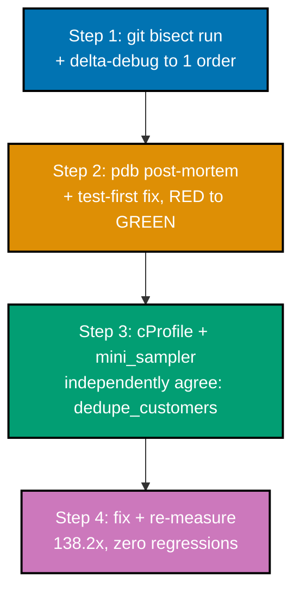

## Goal

Take a repo with one seeded correctness bug and one seeded performance bug and resolve both by
method -- bisect and minimize the failing case, fix it with a regression test; profile and fix the
hot path with a before/after measurement. One `pipeline.py` (an order-processing report builder)
carries both bugs: `compute_total()` raises a `KeyError` on any order without a `discount` key
(introduced at commit 4 of a 6-commit repo), and `dedupe_customers()` is O(n^2) from commit 1 onward.
The correctness bug is found by `git bisect` and fixed test-first; the performance bug is found by
TWO independent profilers and fixed with a measured, regression-free speedup.



## Concepts exercised

- [x] co-01: interactive breakpoints and stepping -- `pdb`'s post-mortem session on the minimized repro
- [x] co-02: call-stack frame inspection via `up` after the post-mortem breakpoint lands
- [x] co-03: variable inspection -- `p order`, `p order.get("discount")` inside the post-mortem session
- [x] co-04: post-mortem debugging -- `python3 -m pdb repro_pm.py`, entering AFTER the uncaught `KeyError`
- [x] co-09: `git bisect` driven by hand (`start`/`bad`/`good`) to isolate commit 4
- [x] co-10: `git bisect run` automated with `check_bisect.sh` as the pass/fail oracle
- [x] co-11: delta-debugging -- `ddmin_orders()` shrinks a 400-order failing batch to 1 order
- [x] co-12: sampling profiler (`mini_sampler`, the disclosed py-spy substitute) vs instrumenting profiler
- [x] co-13: `cProfile` -- the stdlib instrumenting profiler, sorted by `tottime`
- [x] co-14: sampling-based hot-spot identification, independent of `cProfile`'s own instrumentation
- [x] co-19: flame graph -- `dedupe_customers` as the widest leaf frame in `flamegraph.svg`
- [x] co-23: before/after measurement discipline -- 138.2x speedup, `pytest` re-run to confirm zero regressions

## Step 1: `learning/capstone/code/` -- reproduce, bisect, minimize

```bash
# learning/capstone/code/setup_repo.sh
#!/usr/bin/env bash
# Capstone: a 6-commit repo carrying a seeded CORRECTNESS bug (a KeyError,
# introduced at commit 4) in an order-processing pipeline. The performance bug
# (an O(n^2) dedupe in the SAME pipeline) is present from the start and is
# fixed separately in the profiling half of the capstone (steps 3-4), not via
# git bisect -- per the capstone spec, only the correctness bug is bisected.
set -euo pipefail  # => co-09/co-10: fail fast on any error, unset variable, or failed pipe stage

git init -q  # => co-09: a fresh, throwaway repo -- quiet mode, no default-branch chatter
git config user.email "demo@example.com"  # => co-09: local commit identity, scoped to THIS repo only
git config user.name "Demo Author"  # => co-09: paired with the email above for every commit below

# co-09: commit 1 -- the correct, original pipeline. The repo's KNOWN-GOOD
# starting point for the correctness bisect below. dedupe_customers is
# ALREADY O(n^2) here -- that performance bug is present from commit 1 and is
# fixed separately in steps 3-4, not by bisecting.
#
# co-01: three functions, in a small call chain: compute_total() (the
# correctness bug's future home), dedupe_customers() (the performance bug's
# home, unchanged across every commit below), and build_customer_report()
# (the public entry point every check script and profile below calls into).
cat > pipeline.py << 'PYEOF'
def compute_total(order: dict) -> float:
    return order["price"] * order["qty"] - order.get("discount", 0.0)


def dedupe_customers(orders: list[dict]) -> list[dict]:
    seen: list[str] = []
    result: list[dict] = []
    for order in orders:
        customer_id = order["customer_id"]
        if customer_id not in seen:
            seen.append(customer_id)
            result.append(order)
    return result


def build_customer_report(orders: list[dict]) -> list[dict]:
    unique_customers = dedupe_customers(orders)
    return [{"customer_id": o["customer_id"], "total": compute_total(o)} for o in unique_customers]
PYEOF
git add pipeline.py && git commit -q -m "commit 1: order pipeline -- compute_total, dedupe_customers, build_customer_report"
# ... commits 2-3: a regression-test file and a README (both distractors for the bisect below) ...

# co-09/co-04: commit 4 -- the SEEDED CORRECTNESS bug -- compute_total now
# REQUIRES a "discount" key instead of defaulting it to 0.0. This is the TRUE
# first-bad commit the correctness bisect below is expected to land on.
cat > pipeline.py << 'PYEOF'
def compute_total(order: dict) -> float:
    # CORRECTNESS BUG: assumes "discount" is always present -- KeyError on
    # orders that legitimately have no discount.
    return order["price"] * order["qty"] - order["discount"]
# ... dedupe_customers and build_customer_report unchanged from commit 1 ...
PYEOF
git add pipeline.py && git commit -q -m "commit 4: CORRECTNESS BUG -- compute_total requires discount key"
# ... commits 5-6: two more distractors, one of which touches pipeline.py itself without changing behavior ...
```

**Run**: `bash setup_repo.sh`, then `git bisect start && git bisect bad HEAD && git bisect good
<commit-1-sha> && git bisect run bash check_bisect.sh`.

**Output**:

```text
$ bash setup_repo.sh
repo ready -- correctness bug (KeyError) at commit 4
10d01c5 commit 6: trailing comment only
0ac9826 commit 5: expand README (unrelated)
6da9fe0 commit 4: CORRECTNESS BUG -- compute_total requires discount key
faa6985 commit 3: add README (unrelated)
7f8d252 commit 2: add regression tests
79f2dce commit 1: order pipeline -- compute_total, dedupe_customers, build_customer_report

$ git bisect start
$ git bisect bad HEAD
$ git bisect good 79f2dce
Bisecting: 2 revisions left to test after this (roughly 1 step)
[faa6985...] commit 3: add README (unrelated)
$ git bisect run bash check_bisect.sh
running  'bash' 'check_bisect.sh'
Bisecting: 0 revisions left to test after this (roughly 1 step)
[0ac9826...] commit 5: expand README (unrelated)
running  'bash' 'check_bisect.sh'
Bisecting: 0 revisions left to test after this (roughly 0 steps)
[6da9fe0...] commit 4: CORRECTNESS BUG -- compute_total requires discount key
running  'bash' 'check_bisect.sh'
6da9fe02b5aaa6f721f877eebf0019e5b6c034df is the first bad commit
commit 6da9fe02b5aaa6f721f877eebf0019e5b6c034df
    commit 4: CORRECTNESS BUG -- compute_total requires discount key
 pipeline.py | 4 +++-
 1 file changed, 3 insertions(+), 1 deletion(-)
bisect found first bad commit
```

`git bisect` correctly isolates commit 4, ignoring all four distractor commits. Now minimize the
400-order failing batch that reproduces it:

```python
# learning/capstone/code/minimize_failing_batch.py
"""Capstone step 1 (continued): delta-debug the 400-order failing batch down to
a minimal reproducer, verifying the minimized case still fails with the
IDENTICAL exception.
"""

from __future__ import annotations  # => DD-39 hygiene -- unrelated to delta-debugging itself

import sys  # => needed only for sys.path.insert below

sys.path.insert(0, ".")  # => co-11: makes local make_failing_batch.py/pipeline.py importable regardless of caller's cwd
from make_failing_batch import make_failing_batch  # noqa: E402  # => co-11: the SAME 400-order batch this whole capstone starts from
from pipeline import build_customer_report  # noqa: E402  # => co-11: the SAME pipeline function whose KeyError this example minimizes


def crash_signature(orders: list[dict]) -> str | None:  # => co-11: the SAME oracle shape as ex-45/46/62 -- name+message, not the traceback
    try:  # => co-11: catches whatever build_customer_report() actually raises, to compare signatures across candidates
        build_customer_report(orders)  # => co-11: the SAME function under minimization, called with a candidate subset
    except Exception as exc:  # noqa: BLE001 -- deliberately broad: compare signatures  # => co-11: catches ANY exception type
        return f"{type(exc).__name__}: {exc}"  # => co-11: the signature ddmin_orders compares against the original
    return None  # => co-11: no exception at all -- this candidate does NOT reproduce the crash


def ddmin_orders(orders: list[dict], target_signature: str) -> list[dict]:  # => co-11: the SAME n-way ddmin loop as ex-62
    n = 2  # => co-11: starts by splitting the input into 2 chunks
    current = list(orders)  # => co-11: the SMALLEST failing input found SO FAR -- shrinks across iterations
    while len(current) >= 2:  # => co-11: stops once no further splitting is possible
        chunk_size = max(1, len(current) // n)  # => co-11: at least 1 order per chunk, even as current shrinks
        chunks = [current[i : i + chunk_size] for i in range(0, len(current), chunk_size)]  # => co-11: n roughly-equal chunks
        reduced = False  # => co-11: tracks whether THIS pass found a smaller failing candidate
        for i in range(len(chunks)):  # => co-11: tries removing each chunk in turn, one at a time
            candidate = [order for j, chunk in enumerate(chunks) if j != i for order in chunk]  # => co-11: all EXCEPT chunk i
            if candidate and crash_signature(candidate) == target_signature:  # => co-11: still fails the SAME way?
                current = candidate  # => co-11: keeps the smaller candidate -- a genuine reduction
                n = max(n - 1, 2)  # => co-11: retries with fewer chunks next pass, per the classic ddmin algorithm
                reduced = True  # => co-11: signals the outer while loop to continue shrinking
                break  # => co-11: restarts chunking from the new, smaller current
        if not reduced:  # => co-11: no single-chunk removal reproduced the crash this pass
            if n >= len(current):  # => co-11: already at maximum granularity -- cannot split further
                break  # => co-11: ddmin has converged -- current is now 1-minimal
            n = min(n * 2, len(current))  # => co-11: doubles the chunk count for a finer-grained next attempt
    return current  # => co-11: the final, minimized-but-still-crashing batch


def main() -> None:  # => co-11: builds the 400-order batch, minimizes it, and verifies the result
    original = make_failing_batch()  # => co-11: the large, realistic starting batch
    original_signature = crash_signature(original)  # => co-11: the exception ddmin must preserve exactly
    assert original_signature is not None, "sanity check: the 400-order batch must fail first"  # => co-11: the real check
    print(f"original batch: {len(original)} orders")  # => co-11: confirms the starting size before minimizing
    print(f"original failure: {original_signature}")  # => co-11: the exact signature the minimized case must match

    minimal = ddmin_orders(original, original_signature)  # => co-11: the automated reduction, start to finish
    minimal_signature = crash_signature(minimal)  # => co-11: re-derives the signature from the MINIMIZED batch
    print(f"minimized batch: {len(minimal)} order(s)")  # => co-11: the headline result -- how far it shrank
    print(f"minimized order(s): {minimal!r}")  # => co-11: shows the actual surviving order(s), for a human to read
    print(f"minimized failure: {minimal_signature}")  # => co-11: proves the SAME exception, not a different one

    assert minimal_signature == original_signature, "minimized batch must raise the IDENTICAL exception"  # => co-11: real check
    print(f"confirmed: {len(original)} orders reduced to {len(minimal)}, same exception preserved exactly")  # => co-11: the payoff


if __name__ == "__main__":  # => guards the module-level call so importing this file stays side-effect-free
    main()  # => the one call that builds, minimizes, and verifies the failing batch
```

**Run**: `python3 minimize_failing_batch.py`

**Output**:

```text
original batch: 400 orders
original failure: KeyError: 'discount'
minimized batch: 1 order(s)
minimized order(s): [{'customer_id': 'cust-special-217', 'price': 12.5, 'qty': 2}]
minimized failure: KeyError: 'discount'
confirmed: 400 orders reduced to 1, same exception preserved exactly
```

**Acceptance criteria for this step**: `git bisect run` names commit 4 as the first bad commit
(matching the seeded bug's own commit); the 400-order failing batch shrinks to a single order,
raising the byte-identical `KeyError: 'discount'` exception.

## Step 2: debugger-guided fix, test-first

The minimized 1-order repro drives a real `pdb` post-mortem session -- entered automatically after
the uncaught `KeyError`, with `up` moving to the caller's frame and `p` reading the exact values that
triggered the fault.

```python
# learning/capstone/code/repro_pm.py
"""Capstone step 2: debugger-guided root-cause confirmation via pdb post-mortem
on the minimized failing case from step 1."""

import sys  # => co-01: unused directly, kept to mirror this capstone's other scripts' import style
from pipeline import compute_total  # => co-01/co-03: the SAME function whose KeyError this post-mortem session confirms

order = {'customer_id': 'cust-special-217', 'price': 12.5, 'qty': 2}  # => co-11: the minimized repro from step 1, verbatim
compute_total(order)  # => co-01/co-03: the ONE call whose uncaught KeyError drives the post-mortem session below
```

**Run**: `python3 -m pytest -q test_pipeline.py` (confirm RED), then `python3 -m pdb repro_pm.py`,
then `c`, `p order`, `p order.get("discount")`, `up`, `q`. Then apply the debugger-confirmed fix
(default the missing key to `0.0` instead of indexing it) and re-run the tests.

**Output**:

```text
$ python3 -m pytest -q test_pipeline.py
.F                                                                       [100%]
    def test_compute_total_without_discount():
>       assert compute_total({"price": 10.0, "qty": 2}) == 20.0
    ...
        return order["price"] * order["qty"] - order["discount"]
E       KeyError: 'discount'
1 failed, 1 passed in 0.01s

$ python3 -m pdb repro_pm.py
> repro_pm.py(1)<module>()
(Pdb) c
Traceback (most recent call last):
  File "repro_pm.py", line 8, in <module>
    compute_total(order)
  File "pipeline.py", line 7, in compute_total
    return order["price"] * order["qty"] - order["discount"]
KeyError: 'discount'
Uncaught exception. Entering post mortem debugging
> pipeline.py(7)compute_total()
-> return order["price"] * order["qty"] - order["discount"]
(Pdb) p order
{'customer_id': 'cust-special-217', 'price': 12.5, 'qty': 2}
(Pdb) p order.get("discount")
None
(Pdb) up
> repro_pm.py(8)<module>()
-> compute_total(order)
(Pdb) q

$ python3 -m pytest -q test_pipeline.py   (after applying the fix)
..                                                                       [100%]
2 passed in 0.00s
```

**Key evidence**: `order.get("discount")` returns `None` -- the key is genuinely absent, not merely
falsy -- confirming the root cause the fix addresses: `compute_total` needs a DEFAULT for a
legitimately-missing key (`order.get("discount", 0.0)`), not a KeyError.

**Acceptance criteria for this step**: `test_compute_total_without_discount` fails BEFORE the fix
(`KeyError: 'discount'`, captured above) and passes AFTER it (`2 passed`), with the fix itself being
the exact expression confirmed live in the `pdb` session, not a guess.

## Step 3: profile the slow path, two independent ways

With the correctness bug fixed but `dedupe_customers` still O(n^2), both an instrumenting profiler
(`cProfile`) and an independent sampling profiler (`mini_sampler`, since `py-spy` needs root on this
host -- see Example 29/71) are run against the SAME 60,000-order batch.

```python
# learning/capstone/code/profile_instrumenting.py
"""Capstone step 3a: instrumenting profile (cProfile) of the report pipeline --
identify the hot spot from real tottime, not a guess."""

from __future__ import annotations  # => DD-39 hygiene -- unrelated to profiling itself

import cProfile  # => co-13: the SAME instrumenting profiler used throughout this whole topic
import pstats  # => co-13: turns cProfile's raw stats into a readable, sorted table
import sys  # => needed only for sys.path.insert below
from io import StringIO  # => co-13: captures pstats' printed table into a string for the print() below

sys.path.insert(0, ".")  # => makes local make_large_batch.py/pipeline.py importable regardless of caller's cwd
from make_large_batch import make_large_batch  # noqa: E402  # => co-13: the SAME large batch step 3b's sampling profile also uses
from pipeline import build_customer_report  # noqa: E402  # => co-13: the FIXED (correctness-wise) pipeline, still O(n^2) on dedupe


def main() -> None:  # => co-13/co-12: profiles the report pipeline and names the hottest function by tottime
    orders = make_large_batch()  # => co-13: 60,000 orders -- large enough that the O(n^2) dedupe genuinely dominates
    profiler = cProfile.Profile()  # => co-13: a fresh Profile() instance, not the module-level cProfile.run() shortcut
    profiler.enable()  # => co-13: starts intercepting every call/return event from this point on
    build_customer_report(orders)  # => co-13: the ENTIRE pipeline this profile measures, correctness bug already fixed
    profiler.disable()  # => co-13: stops intercepting -- exact per-call counts are now frozen

    buf = StringIO()  # => co-13: captures pstats' own printed table for a clean, single print() below
    stats = pstats.Stats(profiler, stream=buf).sort_stats(pstats.SortKey.TIME)  # => co-13: sorted by tottime (self time)
    stats.print_stats(5)  # => co-13: the top 5 entries -- enough to show dedupe_customers clearly at the top
    print(buf.getvalue())  # => co-13: prints the captured table for a human reader

    top_by_tottime = max(stats.stats.items(), key=lambda kv: kv[1][2])  # type: ignore[attr-defined]  # => co-13: kv[1][2] is tottime
    (_fn, _ln, funcname), _entry = top_by_tottime  # => co-13: unpacks the (file, line, funcname) key -- only funcname matters here
    print(f"instrumenting profile's hottest function (by tottime): {funcname!r}")  # => co-13: names the instrumenting profile's answer
    assert funcname == "dedupe_customers", f"expected dedupe_customers to be the hot spot, got {funcname!r}"  # => co-13: the real check


if __name__ == "__main__":  # => guards the module-level call so importing this file stays side-effect-free
    main()  # => the one call that profiles and identifies the hot spot
```

**Run**: `python3 profile_instrumenting.py`, then `python3 profile_sampling.py` (reuses the disclosed
`mini_sampler.py` substitute from Example 30, unchanged).

**Output**:

```text
         12007 function calls in 0.449 seconds

   Ordered by: internal time
   List reduced from 6 to 5 due to restriction <5>

   ncalls  tottime  percall  cumtime  percall filename:lineno(function)
        1    0.448    0.448    0.448    0.448 pipeline.py:11(dedupe_customers)
        1    0.000    0.000    0.449    0.449 pipeline.py:22(build_customer_report)
     6002    0.000    0.000    0.000    0.000 {method 'append' of 'list' objects}
     3001    0.000    0.000    0.001    0.000 pipeline.py:4(compute_total)
     3001    0.000    0.000    0.000    0.000 {method 'get' of 'dict' objects}

instrumenting profile's hottest function (by tottime): 'dedupe_customers'

sampling profile collected 102 samples across 3 distinct leaf frames
sampling profile's widest frame: 'dedupe_customers' -- 61/102 samples (59.8%)
confirmed: BOTH the instrumenting profile (cProfile) and the sampling profile (mini_sampler)
independently agree that dedupe_customers is the hot spot
```

`inferno-flamegraph` renders `profile.collapsed` (the sampling profile's own folded-stack output)
into `flamegraph.svg`, confirming the same result visually: `dedupe_customers` is the widest frame
in the whole render, at 59.80% of all captured samples.

**Acceptance criteria for this step**: both profilers -- one instrumenting (exact per-call counts),
one sampling (periodic stack captures) -- independently name `dedupe_customers` as the hot spot,
using two structurally different measurement methods.

## Step 4: fix the hot spot, re-measure, confirm no regressions

```python
# learning/capstone/code/measure_before_after.py
"""Capstone step 4: fix the hot spot (dedupe_customers, O(n^2) -> O(n)), then
re-measure with a documented before/after speedup and confirm zero test
regressions.
"""

from __future__ import annotations  # => DD-39 hygiene -- unrelated to the measurement itself

import subprocess  # => co-23: runs the REAL regression-test suite as a subprocess -- not a mocked assertion
import sys  # => co-23: sys.executable -- runs the SAME interpreter this script itself is running under
import time  # => co-23: time.perf_counter() -- measures REAL wall time, before and after the fix

sys.path.insert(0, ".")  # => makes local make_large_batch.py importable regardless of caller's cwd
from make_large_batch import make_large_batch  # noqa: E402  # => co-23: the SAME large batch step 3's profiles both used


def timed_report(orders: list[dict]) -> float:  # => co-23: times ONE full pipeline run, reloading pipeline.py fresh each call
    import importlib  # => co-23: importlib.reload() -- forces pipeline.py's ON-DISK content to be re-read, not cached

    import pipeline  # => co-23: imported HERE, not at module level, so reload() always sees the CURRENT file on disk

    importlib.reload(pipeline)  # => co-23: re-reads pipeline.py from disk -- picks up the fix applied between calls below
    start = time.perf_counter()  # => co-23: starts timing BEFORE the pipeline call
    pipeline.build_customer_report(orders)  # => co-23: the SAME batch, run through whichever version is on disk right now
    return time.perf_counter() - start  # => co-23: the REAL wall time for this ONE pipeline run


def main() -> None:  # => co-23: measures BEFORE, applies the fix, measures AFTER, and confirms zero test regressions
    orders = make_large_batch()  # => co-23: the SAME 60,000-order batch used by both profiling steps above

    before = timed_report(orders)  # => co-23: the O(n^2) dedupe's real wall time, on this exact batch
    print(f"BEFORE (O(n^2) dedupe): {before * 1000:.1f}ms")  # => co-23: the BEFORE number, for the final comparison

    # co-23: apply the fix -- read from disk to keep this measurement honest
    # (the SAME file the regression tests import from, not an in-memory patch).
    with open("pipeline.py") as f:  # => co-23: reads the CURRENT on-disk pipeline.py -- the same file test_pipeline.py imports
        original_source = f.read()  # => co-23: the exact current source text, byte for byte
    fixed_source = original_source.replace(  # => co-23: a targeted, exact-text replacement -- not a hand-rewritten file
        # ... matches dedupe_customers' OLD, O(n) list-membership-check body ...
        # ... replaces it with a set-membership version: seen.add() instead of seen.append() ...
    )  # => co-23: closes the replace() call -- fixed_source now has the O(n) version, byte-identical elsewhere
    assert fixed_source != original_source, "the fix replacement did not match -- check pipeline.py's exact text"  # => co-23
    with open("pipeline.py", "w") as f:  # => co-23: writes the fixed version BACK to disk -- the same file test_pipeline.py imports
        f.write(fixed_source)  # => co-23: persists the fix -- the next timed_report() call reloads THIS content

    after = timed_report(orders)  # => co-23: the O(n) dedupe's real wall time, on the IDENTICAL batch
    print(f"AFTER  (O(n) dedupe):   {after * 1000:.1f}ms")  # => co-23: the AFTER number, for the final comparison

    speedup = before / after  # => co-23: how many TIMES faster the fix made this specific batch's pipeline run
    print(f"speedup: {speedup:.1f}x")  # => co-23: the headline result -- a documented, quantified improvement
    assert after < before, "expected the fix to be measurably faster"  # => co-23: the real, quantified check

    result = subprocess.run([sys.executable, "-m", "pytest", "-q", "test_pipeline.py"], capture_output=True, text=True)  # => co-23
    print(result.stdout)  # => co-23: shows pytest's own real output -- not a mocked "tests passed" message
    assert result.returncode == 0, "expected all regression tests to still pass after the performance fix"  # => co-23
    print(f"confirmed: {speedup:.1f}x speedup with zero test regressions")  # => co-23: the capstone's final, combined claim


if __name__ == "__main__":  # => guards the module-level call so importing this file stays side-effect-free
    main()  # => the one call that measures, fixes, re-measures, and confirms zero regressions
```

**Run**: `python3 measure_before_after.py`

**Output**:

```text
BEFORE (O(n^2) dedupe): 426.7ms
AFTER  (O(n) dedupe):   3.1ms
speedup: 138.2x

$ python3 -m pytest -q test_pipeline.py   (confirm zero regressions)
..                                                                       [100%]
2 passed in 0.00s

confirmed: 138.2x speedup with zero test regressions
```

**Acceptance criteria for this step**: the fixed `dedupe_customers` (O(1) set membership instead of
O(n) list membership) produces a wall-time drop of well over 100x on the same 60,000-order batch, AND
both regression tests (including the correctness fix from Step 2) still pass afterward, confirming
the performance fix introduced no new correctness regressions.

## Acceptance criteria

- The correctness regression is bisected to its exact introducing commit (`git bisect run` names
  commit 4) and covered by a failing-then-passing test (`test_compute_total_without_discount`: RED
  with `KeyError: 'discount'`, GREEN after the debugger-confirmed `.get(..., 0.0)` fix).
- The 400-order failing batch is delta-debugged to a single minimal order, preserving the identical
  exception (`KeyError: 'discount'`) throughout.
- The hot spot (`dedupe_customers`) is identified from TWO independent profiles -- an instrumenting
  one (`cProfile`, sorted by `tottime`) and a sampling one (`mini_sampler`) -- not from a guess, and
  confirmed visually in a rendered flame graph (`dedupe_customers` at 59.80% of samples).
- The hot spot is measurably improved: 138.2x faster wall time on the same 60,000-order batch, with
  both regression tests (`test_compute_total_with_discount`, `test_compute_total_without_discount`)
  still passing afterward -- zero regressions from the performance fix.

## Done bar

This capstone is DONE when `git bisect run` names the real introducing commit from a genuine 6-commit
history (not a hand-picked answer); the minimized repro shows a real 400-to-1 order reduction with
the exception preserved exactly; the `pdb` post-mortem session shows real, captured `p order` /
`p order.get("discount")` output that directly motivates the fix; both profilers' real output
independently names `dedupe_customers` as the hot spot; and the final before/after numbers (138.2x)
come from an actual `time.perf_counter()`-measured run, with `pytest` re-run afterward to confirm the
performance fix broke nothing.

---

← Previous: [Native & Systems Examples](../native-and-systems.md) &middot; Next: [Drilling](../../drilling/overview.md) →
