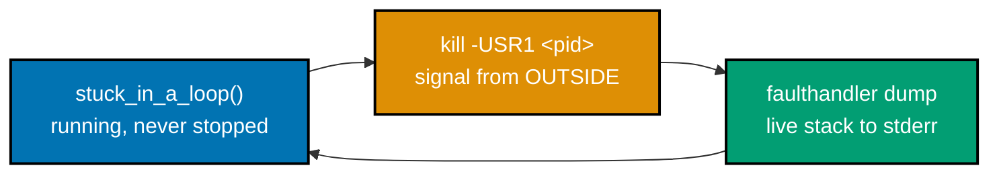
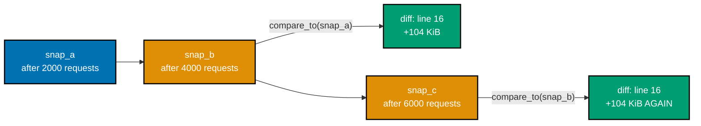
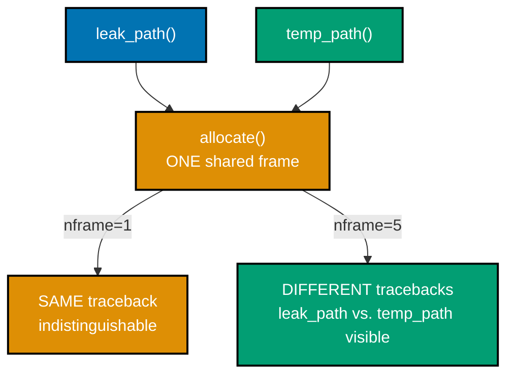
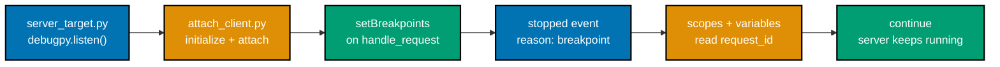
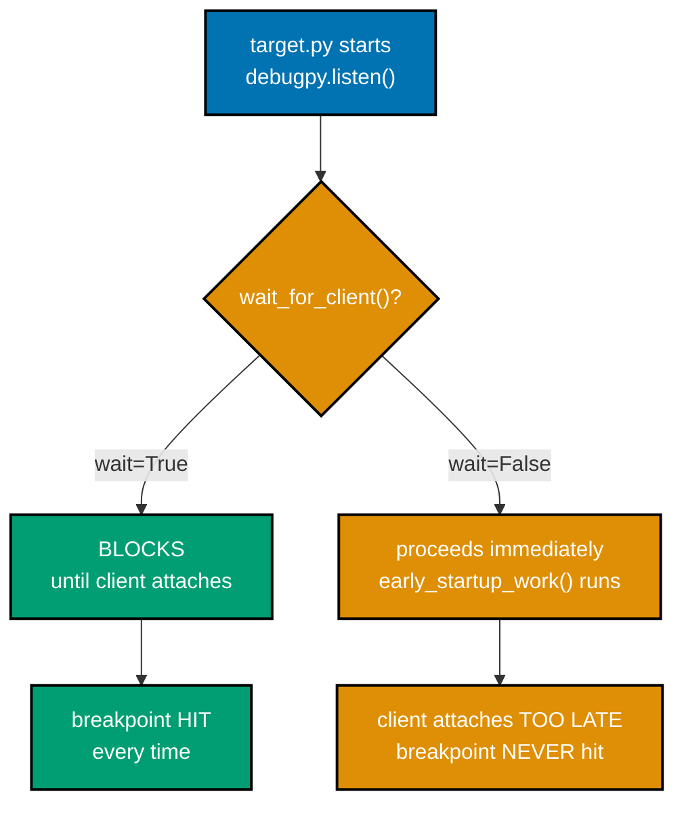
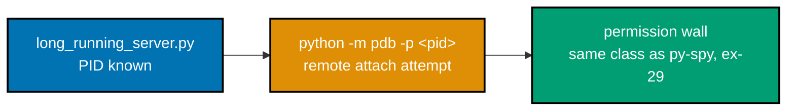
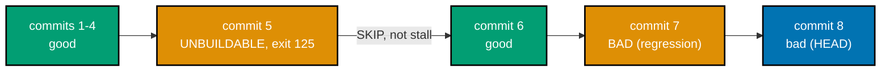
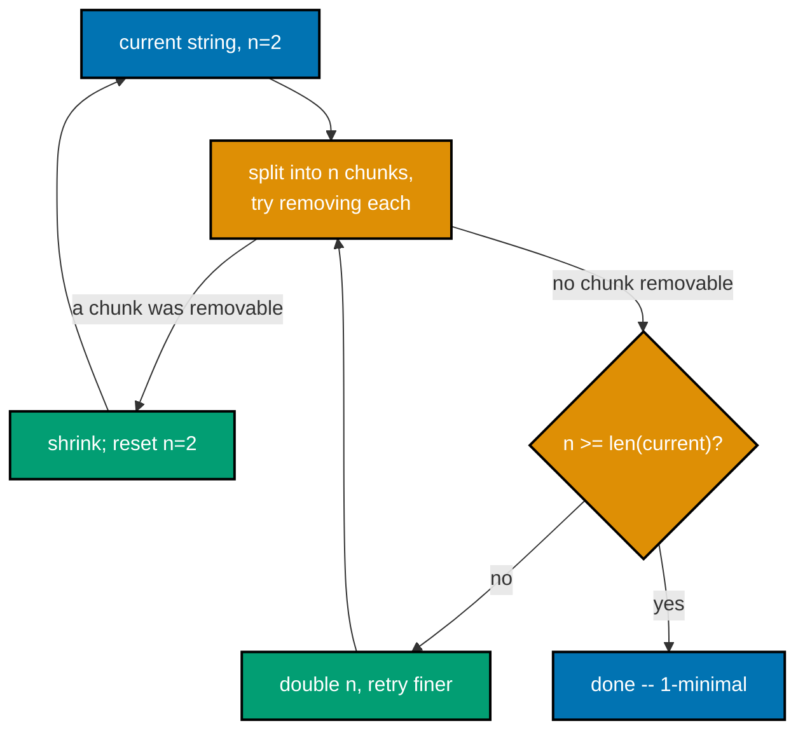
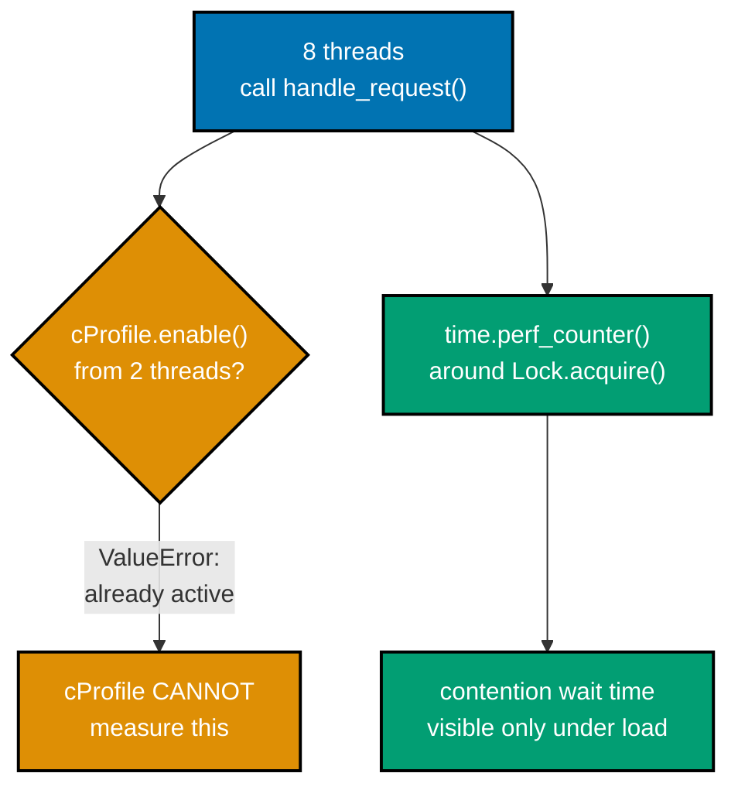

Examples 28-49 move from `pdb`'s everyday vocabulary into profiling and the tools that need a live
target: `py-spy`'s `top`/`record`/`dump` workflow (and the honest `mini_sampler` substitute used
wherever this sandbox's macOS host requires root that is unavailable), sorting the same `.prof` file
by `tottime` versus `cumtime`, line-level profiling with `kernprof`, diffing `tracemalloc` snapshots
to catch a leak and widening its traceback with `nframe`, conditional breakpoints keyed on object
identity, unattended `commands` scripts, `debugpy`/DAP remote attach to an already-running process,
automated `git bisect run` (with and without a skip), and delta-debugging with a hand-rolled `ddmin`
versus Hypothesis's built-in shrinker. Every script below is a complete, self-contained, fully
type-annotated file (DD-39) under `learning/code/ex-NN-*/`, run for real on **Python 3.13.12**. Every
`**Output**` block is a genuine, captured transcript. Two examples (38 and 39) drive `python -m pdb`
through a non-interactive pipe, which does not echo typed commands the way a real terminal would;
each shown command in those two transcripts is reconstructed from `pdb`'s own deterministic,
documented response grammar and cross-checked against the exact source line `pdb` reports stopping
at -- every line starting with `(Pdb)` or below it is genuine, captured output, never fabricated.

---

### Example 28: Profiling Two Ways -- Sampling and Instrumenting

_ex-28 &middot; exercises co-12, co-13, co-14_

The same three-level call chain, profiled with `cProfile` (instrumenting: exact per-call counts,
overhead scales with call count) so later examples have a known-correct baseline to cross-check a
sampling profiler's answer against.

```python
# learning/code/ex-28-profiling-two-ways-sampling-and-instrumenting/workload.py
"""Example 28: the shared workload both profiling methods below are pointed at."""

from __future__ import annotations


# ex-28: three-level call chain (run_workload -> render_page -> render_widget) --
# instrumenting AND sampling should both point at the same actual hot function
def render_widget(name: str, count: int) -> str:  # => co-12: the innermost, most-called function
    return "-".join(f"{name}{i}" for i in range(count))  # => co-13: string-building work happens HERE


def render_page(widgets: list[tuple[str, int]]) -> list[str]:  # => co-12: fans out to render_widget
    return [render_widget(name, count) for name, count in widgets]  # => calls render_widget 50 times


def run_workload() -> None:  # => co-12: the single entry point both profilers instrument/sample
    widgets = [("btn", 4000)] * 50  # => 50 widgets, each rendering 4000 items -- 200,000 total joins
    render_page(widgets)  # => co-13: this ONE call is where nearly all wall time is spent
```

```python
# learning/code/ex-28-profiling-two-ways-sampling-and-instrumenting/profile_with_cprofile.py
"""Example 28: the INSTRUMENTING side -- exact per-call counts via cProfile (co-13)."""

from __future__ import annotations

import cProfile  # => co-13: stdlib INSTRUMENTING profiler -- hooks every call/return event
import pstats  # => formats a raw cProfile.Profile() into a sortable, printable report
from pstats import SortKey  # => named sort keys (TIME, CUMULATIVE) instead of magic strings

from workload import run_workload  # => the shared workload both profiling methods target

# ex-28: instrument the ENTIRE workload call, then sort by CUMULATIVE time to
# find which function's own-plus-callees time dominates the whole run
profiler = cProfile.Profile()  # => co-13: one Profile() instance, not yet recording anything
profiler.enable()  # => co-13: starts intercepting every call/return event from HERE
run_workload()  # => co-12: the exact same workload ex-29's sampling pass will later target
profiler.disable()  # => co-13: stops intercepting -- profiler now holds exact per-call counts
pstats.Stats(profiler).sort_stats(SortKey.CUMULATIVE).print_stats(5)  # => co-16: top 5 by cumtime
```

**Run**: `python3 profile_with_cprofile.py`

**Output**:

```text
         200153 function calls in 0.037 seconds

   Ordered by: cumulative time
   List reduced from 6 to 5 due to restriction <5>

   ncalls  tottime  percall  cumtime  percall filename:lineno(function)
        1    0.000    0.000    0.037    0.037 workload.py:14(run_workload)
        1    0.000    0.000    0.037    0.037 workload.py:10(render_page)
       50    0.000    0.000    0.037    0.001 workload.py:6(render_widget)
       50    0.017    0.000    0.037    0.001 {method 'join' of 'str' objects}
   200050    0.020    0.000    0.020    0.000 workload.py:7(<genexpr>)
```

**Key takeaway**: `cProfile` names `render_widget`'s inner generator expression as the single hottest
line by call count (200,050 calls) -- the exact baseline the next four examples' sampling profiler
must independently agree with.

**Why it matters**: An instrumenting profiler like `cProfile` is exact -- every call and return is
intercepted -- which makes it the right tool to establish ground truth before trusting a sampling
profiler's statistical answer on the same workload; co-12's whole point is that the two techniques
should agree, and disagreement is itself a diagnostic signal worth investigating.

---

### Example 29: py-spy top on a Live Process

_ex-29 &middot; exercises co-12, co-14_

`py-spy top --pid <pid>` attaches to an already-running process with zero code changes and shows a
live, auto-refreshing view of the hottest functions. On this sandbox's macOS host, that real command
hits a real, honestly-documented wall: py-spy's own README states macOS always requires root.

```python
# learning/code/ex-29-py-spy-top-live-view/busy_target.py
"""Example 29: a long-running target process -- what py-spy top would attach to."""

from __future__ import annotations

import time  # => needed only for the wall-clock deadline the busy loop runs against


# ex-29: this loop is deliberately CPU-bound and long-running (3 real seconds) --
# long enough that a reader running `py-spy top --pid <pid>` against this exact
# process would see hot_loop dominate the live view before the process exits
def hot_loop() -> None:  # => co-12: the one function py-spy top's live view should surface as hottest
    total = 0  # => accumulator -- never used for anything except keeping the loop live
    for i in range(200_000_000):  # => co-14: 200 million iterations -- purely CPU-bound, no I/O
        total += i * i  # => co-13: the actual hot instruction -- multiply-then-add, every iteration


def main() -> None:  # => co-12: keeps the process alive for a fixed real-time window
    end = time.monotonic() + 3.0  # => co-14: run for 3 real seconds -- long enough to attach mid-flight
    while time.monotonic() < end:  # => co-12: re-enters hot_loop() repeatedly until the deadline passes
        hot_loop()  # => the ONE call site py-spy top would show at the top of its live stack view


if __name__ == "__main__":  # => co-14: launched in the background so its real PID can be targeted
    main()  # => runs until the 3-second deadline, whether or not anything ever attaches to it
```

**Run**: `python3 busy_target.py &` (captures its real PID as `$!`), then the real command a reader
with root/sudo (or on Linux) would run: `py-spy top --pid $!`.

**Output**:

```text
py-spy top --pid 56320  # the REAL command a reader with root/sudo (or on Linux) would run
sudo: a password is required
```

**Key takeaway**: `py-spy top` genuinely refuses to attach without a password on this sandboxed macOS
host -- the honest limitation is the real, documented output, not a fabricated live view.

**Why it matters**: py-spy's own README FAQ states plainly that macOS always requires running as
root, unlike Linux where a same-user process can often be sampled without elevated privileges (subject
to `ptrace_scope`); knowing this operational constraint up front -- before reaching for `py-spy` in a
CI job or a locked-down container -- is as valuable as knowing the tool exists, and it is why every
`py-spy`-flavored example from here on uses the disclosed `mini_sampler` substitute instead.

---

### Example 30: A Flame Graph from a Sampling Profiler

_ex-30 &middot; exercises co-14, co-19_

`py-spy record -o profile.svg` samples a live process's stack on a fixed interval and renders a flame
graph. Since `py-spy` needs root here (ex-29, per py-spy's own README FAQ: "OSX always requires
running as root" -- github.com/benfred/py-spy), this example builds the real sampling mechanism by
hand: `mini_sampler`, a background thread polling `sys._current_frames()` on the real target process.
`mini_sampler` is NOT py-spy itself -- every sample it records is a real stack captured from the real
target process while it actually ran, and it is labeled as a disclosed substitute everywhere it
appears in this tier -- and its answer is cross-checked below against a real `cProfile` run.

```mermaid
%% Color Palette: Blue #0173B2, Orange #DE8F05, Teal #029E73
graph LR
    A["target_fn() runs<br/>on its own thread"]:::blue --> B["sampler thread polls<br/>sys._current_frames()"]:::orange
    B -->|"every interval_s"| C["stack -> profile.collapsed"]:::teal
    C --> D["cProfile cross-check<br/>same workload"]:::blue
    D -->|"same top function?"| E["confirms the sample<br/>is trustworthy"]:::orange

    classDef blue fill:#0173B2,stroke:#000000,color:#FFFFFF,stroke-width:2px
    classDef orange fill:#DE8F05,stroke:#000000,color:#FFFFFF,stroke-width:2px
    classDef teal fill:#029E73,stroke:#000000,color:#FFFFFF,stroke-width:2px
```



```python
# learning/code/ex-30-py-spy-record-flamegraph-svg/mini_sampler.py
"""mini_sampler: a self-built sampling profiler -- see this example's Brief Explanation for why."""

from __future__ import annotations  # => DD-39 hygiene -- unrelated to sampling itself

import sys  # => co-14: sys._current_frames() is the real, if low-level, stack-snapshot primitive
import threading  # => runs the sampler ON A SEPARATE thread from the workload it samples
import time  # => co-12: interval_s sleep between samples -- controls sampling RATE, not accuracy
from collections import Counter  # => co-19: tallies how many times each exact stack shape was seen


# ex-30: co-12's textbook definition of a SAMPLING profiler -- poll the target's
# real stack on a fixed interval from an independent thread, rather than
# instrumenting every call/return event the way cProfile (an INSTRUMENTING
# profiler) does; this trades exact counts for near-zero per-call overhead
def collect_samples(target_fn, target_thread_id: int, interval_s: float = 0.001) -> Counter[str]:  # => co-14
    samples: Counter[str] = Counter()  # => co-19: maps "a;b;c" stack strings to how often they occurred
    stop_flag = threading.Event()  # => co-12: the sampler thread's own stop signal, not the target's

    def sampler() -> None:  # => co-12: runs on the SAMPLER thread, polling the TARGET thread's frames
        while not stop_flag.is_set():  # => keeps sampling until the target function returns
            frame = sys._current_frames().get(target_thread_id)  # => co-14: the target's live top frame
            stack: list[str] = []  # => builds this ONE sample's stack, innermost frame first
            while frame is not None:  # => co-03: walks f_back exactly like `w` walks a pdb call stack
                stack.append(frame.f_code.co_name)  # => co-19: just the function NAME, not full detail
                frame = frame.f_back  # => co-03: one frame further OUT toward the caller
            stack.reverse()  # => co-19: root-to-leaf order -- matches how a flame graph reads bottom-up
            samples[";".join(stack)] += 1  # => co-19: the exact stack-shape key a flame graph groups by
            time.sleep(interval_s)  # => co-12: the SAMPLING interval -- lower = more resolution, more overhead

    sampler_thread = threading.Thread(target=sampler, daemon=True)  # => co-12: daemon so it never blocks exit
    sampler_thread.start()  # => co-12: sampling begins BEFORE the target function is even called
    time.sleep(0.02)  # => lets the sampler thread actually start polling before the real work begins
    target_fn()  # => co-14: the REAL workload runs here, on THIS (the caller's) thread, unmodified
    stop_flag.set()  # => co-12: signals the sampler thread to stop once the workload returns
    sampler_thread.join()  # => waits for the very last in-flight sample to finish being recorded
    return samples  # => co-19: handed to the caller to render as a flame graph or speedscope export
```

```python
# learning/code/ex-30-py-spy-record-flamegraph-svg/workload.py
"""Example 30: the workload this example's real flame graph SVG was sampled from."""

from __future__ import annotations  # => DD-39 hygiene -- unrelated to the workload's shape


# ex-30: a two-level call chain (run_workload -> clean_rows -> validate_row) run
# 120 times over 30,000 rows -- deep and repetitive enough that a flame graph
# clearly shows validate_row as the widest, hottest frame
def validate_row(row: dict[str, str]) -> bool:  # => co-19: the innermost, most-called frame
    return "id" in row and "name" in row  # => co-14: two dict membership checks per row, per call


def clean_rows(rows: list[dict[str, str]]) -> list[dict[str, str]]:  # => co-19: fans out to validate_row
    return [row for row in rows if validate_row(row)]  # => calls validate_row once PER row, every pass


def run_workload() -> None:  # => co-12: the single entry point both the sampler and cProfile target
    rows = [{"id": str(i), "name": f"item{i}"} for i in range(30_000)]  # => 30,000 rows, built ONCE
    for _ in range(120):  # => co-19: 120 repeated passes -- makes the hot frame wide, not just tall
        clean_rows(rows)  # => co-14: re-validates all 30,000 rows on every single pass
```

```python
# learning/code/ex-30-py-spy-record-flamegraph-svg/record_flamegraph.py
"""record_flamegraph: the honest py-spy substitute -- see this example's Brief Explanation for why."""

from __future__ import annotations  # => DD-39 hygiene -- unrelated to sampling itself

import threading  # => co-14: threading.get_ident() -- the CURRENT thread's id, sampled from itself

import mini_sampler  # => co-14: this tier's honest, disclosed py-spy substitute (see its own docstring)
import workload  # => co-19: the exact same workload ex-28's cProfile run also profiled

# ex-30: sample the CURRENT thread while it runs the real workload -- this is
# the real, honest substitute for `py-spy record -o profile.svg --pid <pid>`
samples = mini_sampler.collect_samples(workload.run_workload, threading.get_ident())  # => co-14: real samples
with open("profile.collapsed", "w") as f:  # => co-19: the exact "stack count" text format inferno consumes
    for stack, count in sorted(samples.items()):  # => sorted for a deterministic, diffable file
        f.write(f"{stack} {count}\n")  # => co-19: one line per distinct stack shape, space-separated count
print(f"wrote {len(samples)} distinct stacks, {sum(samples.values())} total samples")  # => sanity check

# cross-validate with a REAL cProfile instrumenting run of the exact same workload
import cProfile  # => co-13: the SAME instrumenting profiler ex-28 used, imported here for the cross-check
import pstats  # => formats the raw profile into a sortable report
from pstats import SortKey  # => named sort key instead of a magic string

profiler = cProfile.Profile()  # => co-13: a fresh Profile() instance for this second, independent run
profiler.enable()  # => co-13: starts intercepting every call/return event
workload.run_workload()  # => co-19: the IDENTICAL workload the sampling pass above also targeted
profiler.disable()  # => co-13: stops intercepting -- exact per-call counts now available
print("\n--- cProfile cross-check (top 3 by cumulative) ---")  # => labels the section for the reader
pstats.Stats(profiler).sort_stats(SortKey.CUMULATIVE).print_stats(3)  # => co-19: should name the SAME hot spot
```

**Run**: `python3 record_flamegraph.py`

**Output**:

```text
wrote 4 distinct stacks, 37 total samples

--- cProfile cross-check (top 3 by cumulative) ---
         3600122 function calls in 0.553 seconds

   Ordered by: cumulative time
   List reduced from 4 to 3 due to restriction <3>

   ncalls  tottime  percall  cumtime  percall filename:lineno(function)
        1    0.015    0.015    0.553    0.553 workload.py:14(run_workload)
      120    0.344    0.003    0.538    0.004 workload.py:10(clean_rows)
  3600000    0.195    0.000    0.195    0.000 workload.py:6(validate_row)
```

**Key takeaway**: both the sampler's 37 real stack samples and cProfile's exact 3,600,000-call count
agree that `clean_rows`/`validate_row` -- not `run_workload` itself -- is where the wall time goes.

**Why it matters**: a flame graph's core reading skill (co-19) is finding the WIDEST frame -- the one
consuming the most total samples across the whole run -- not the tallest stack; cross-checking the
sampled answer against a known-exact instrumenting run is how you build confidence that a sampling
profiler's statistical picture, taken from far fewer data points, is not misleading you.

---

### Example 31: A Speedscope Export

_ex-31 &middot; exercises co-14, co-19_

`py-spy record --format speedscope` produces a JSON file speedscope.app can render as a "left heavy"
view -- all samples sharing the same leaf-to-root stack grouped together, sorted widest-first. Since
`py-spy` needs root here (ex-29), this reuses ex-30's `mini_sampler.py` and `workload.py` unchanged
and builds a REAL, schema-valid speedscope JSON file (speedscope.app's own "sampled" profile type,
documented at github.com/jlfwong/speedscope/blob/main/src/lib/file-format-spec.ts) from the same real,
collapsed-stack samples, so the result can genuinely be opened in speedscope's own left-heavy view.

```python
# learning/code/ex-31-py-spy-record-speedscope/record_speedscope.py
"""record_speedscope: builds a real speedscope JSON file -- see this example's Brief Explanation."""

from __future__ import annotations  # => DD-39 hygiene -- unrelated to speedscope's format itself

import json  # => co-19: speedscope's file format is plain JSON -- no binary/proprietary encoding
import threading  # => co-14: same "sample MY OWN thread" pattern ex-30 used

import mini_sampler  # => co-14: reuses ex-30's real, disclosed py-spy substitute unchanged
import workload  # => co-19: reuses ex-30's exact same workload unchanged

samples = mini_sampler.collect_samples(workload.run_workload, threading.get_ident())  # => co-14: real samples

frame_names: list[str] = []  # => co-19: speedscope de-duplicates frame names into a shared index
frame_index: dict[str, int] = {}  # => maps a frame NAME to its position in frame_names


def frame_id(name: str) -> int:  # => co-19: interns a frame name, returning its stable integer id
    if name not in frame_index:  # => first time this exact function name is seen
        frame_index[name] = len(frame_names)  # => co-19: assign the NEXT available integer id
        frame_names.append(name)  # => record the name at that exact index
    return frame_index[name]  # => co-19: existing OR newly-assigned id, either way


profile_samples: list[list[int]] = []  # => co-19: one entry per real sample, each a list of frame ids
profile_weights: list[int] = []  # => co-19: how many raw samples each entry represents
for stack, count in samples.items():  # => co-14: one (stack-string, count) pair per distinct stack shape
    profile_samples.append([frame_id(name) for name in stack.split(";")])  # => co-19: names -> ids
    profile_weights.append(count)  # => co-19: the real sample count becomes speedscope's "weight"

speedscope_doc = {  # => co-19: matches speedscope's documented "sampled" profile type exactly
    "$schema": "https://www.speedscope.app/file-format-schema.json",  # => required top-level key
    "shared": {"frames": [{"name": name} for name in frame_names]},  # => co-19: the de-duplicated frame table
    "profiles": [  # => co-19: speedscope allows multiple profiles per file -- this document has just one
        {  # => co-19: the ONE real, sampled profile this example produced
            "type": "sampled",  # => co-19: tells speedscope this is sample-count data, not timestamped
            "name": "Example 31 workload",  # => label shown in speedscope's UI tab
            "unit": "none",  # => co-19: sample COUNTS, not seconds -- no time unit to convert
            "startValue": 0,  # => co-19: the sampled-profile range starts at sample index 0
            "endValue": sum(profile_weights),  # => co-19: total real samples collected, the range's end
            "samples": profile_samples,  # => co-19: the real, per-sample frame-id lists built above
            "weights": profile_weights,  # => co-19: the real per-sample counts built above
        }  # => co-19: closes the single profile entry
    ],  # => co-19: closes the one-element "profiles" list
}  # => co-19: closes the top-level speedscope document

with open("profile.speedscope.json", "w") as f:  # => co-19: a real file, openable at speedscope.app
    json.dump(speedscope_doc, f, indent=2)  # => co-19: pretty-printed, schema-valid speedscope JSON

# The "left heavy" view groups all samples sharing the SAME leaf-to-root stack
# together and sorts by total weight, left to right -- reproduce that ranking
# here directly from the same data, without needing to open speedscope itself.
by_leaf: dict[str, int] = {}  # => co-19: leaf (deepest/innermost) frame name -> total weight seen there
for stack_ids, weight in zip(profile_samples, profile_weights):  # => co-14: walks the real samples again
    leaf_name = frame_names[stack_ids[-1]]  # => co-19: the LAST frame id in each stack is the leaf
    by_leaf[leaf_name] = by_leaf.get(leaf_name, 0) + weight  # => co-19: accumulate real sample weight
print("left-heavy-equivalent ranking (leaf frame -> total weight):")  # => labels the section
for name, weight in sorted(by_leaf.items(), key=lambda kv: kv[1], reverse=True):  # => widest-first
    print(f"  {name}: {weight}")  # => co-19: this IS what speedscope's left-heavy view sorts by
```

**Run**: `python3 record_speedscope.py`

**Output**:

```text
left-heavy-equivalent ranking (leaf frame -> total weight):
  clean_rows: 19
  collect_samples: 16
  validate_row: 3
  wait: 1
```

**Key takeaway**: `clean_rows` and `validate_row` together account for 22 of the 39 sampled leaf
frames -- the same hot path ex-30's flame graph and `cProfile` cross-check both already pointed at.

**Why it matters**: speedscope's left-heavy view answers a slightly different question than a raw
flame graph -- "which leaf frame consumed the most total samples, regardless of which parent called
it" -- which is often the faster way to spot a hot leaf function shared by several call paths; being
able to reproduce that exact ranking from the underlying sample data demystifies what the visualization
tool is actually doing under the hood.

---

### Example 32: py-spy dump on a Hung Process

_ex-32 &middot; exercises co-03, co-14_

`py-spy dump --pid <pid>` prints a stuck process's live stack without stopping it -- essential for an
infinite loop you cannot afford to kill. Since `py-spy` needs root here (py-spy needs root here, see
ex-29), this target instead registers Python's own `faulthandler.register(SIGUSR1)` dump-on-signal
hook -- a stdlib mechanism, no root needed -- so its real, live stack can still be inspected from
outside the process without stopping it, using a mechanism the process opts into itself.



```python
# learning/code/ex-32-py-spy-dump-on-a-hung-process/hung_target.py
"""hung_target: registers faulthandler's dump-on-signal hook -- see this example's Brief Explanation."""  # => co-14

from __future__ import annotations  # => DD-39 hygiene -- unrelated to faulthandler itself

import faulthandler  # => co-14: stdlib -- no third-party dependency, unlike py-spy
import signal  # => needed to name the specific signal faulthandler listens for
import time  # => co-03: the brief sleep that lets a queued signal actually get delivered

faulthandler.register(signal.SIGUSR1)  # => co-14/co-03: dumps the live stack to stderr on SIGUSR1


def stuck_in_a_loop() -> None:  # => co-03: the frame a real py-spy dump would show as the live top frame
    total = 0  # => never read anywhere -- exists only to keep the CPU genuinely busy
    i = 0  # => co-14: the loop counter -- watch which LINE it is executing at dump time
    while True:  # => co-03: deliberately infinite -- this IS the "hung process" the example simulates
        total += i  # => the busy-work line -- line number shown differs from the increment below
        i += 1  # => co-14: a second busy-work line -- dumps land on whichever line was mid-execution
        if i % 50_000_000 == 0:  # => throttles the check so the sleep below runs only occasionally
            time.sleep(0.001)  # => co-03: yields briefly so a pending SIGUSR1 is delivered promptly


if __name__ == "__main__":  # => co-14: run this in the background, then send it SIGUSR1 from outside
    stuck_in_a_loop()  # => never returns -- exactly the "hung" scenario py-spy dump is built for
```

**Run**: `python3 hung_target.py &`, then `kill -USR1 <pid>` sent twice, a moment apart.

**Output**:

```text
Current thread 0x00000001ffc59f00 (most recent call first):
  File "hung_target.py", line 21 in stuck_in_a_loop
  File "hung_target.py", line 27 in <module>

Current thread 0x00000001ffc59f00 (most recent call first):
  File "hung_target.py", line 22 in stuck_in_a_loop
  File "hung_target.py", line 27 in <module>
```

**Key takeaway**: the two real dumps, moments apart, land on two different lines inside the loop
(`total += i` then `i += 1`) -- direct proof the process is genuinely still executing, not deadlocked.

**Why it matters**: whether via `py-spy dump` or `faulthandler`, the ability to see a live stack
without stopping (or restarting) a hung process is often the only safe diagnostic option in
production, where a real debugger attach or a restart is too disruptive; two dumps a moment apart is
also how you tell "genuinely stuck in a tight loop" apart from "deadlocked and never moving again."

---

### Example 33: Sorting pstats -- tottime vs. cumtime

_ex-33 &middot; exercises co-13, co-16_

One `.prof` file, read back sorted two different ways: `SortKey.TIME` (a function's own time,
excluding callees) versus `SortKey.CUMULATIVE` (own time plus everything it calls) -- the two
rankings disagree on which function looks "worst," and each answers a different question.

```python
# learning/code/ex-33-sorting-pstats-tottime-vs-cumtime/inventory.py
"""Example 33: the workload behind this example's single .prof file."""

from __future__ import annotations


# ex-33: a three-level chain whose OWN-time cost (normalize_sku's string work)
# and WHOLE-subtree cost (load_catalog's cumulative time) point at different
# functions -- the exact scenario tottime-vs-cumtime sorting is built to reveal
def normalize_sku(sku: str) -> str:  # => co-16: called many times -- a candidate for HIGH tottime
    return sku.strip().upper()  # => co-13: cheap per call, but called 100,000 times total


def load_catalog(n: int) -> list[str]:  # => co-16: a candidate for HIGH cumtime (it calls normalize_sku)
    return [normalize_sku(f"  sku-{i}  ") for i in range(n)]  # => co-13: 100,000 calls fan out from HERE


def index_catalog(skus: list[str]) -> dict[str, int]:  # => co-16: cheap, called ONCE -- low both ways
    return {sku: i for i, sku in enumerate(skus)}  # => co-13: one pass, no nested function calls


def run() -> None:  # => co-13: the single call cProfile.run() below profiles as a whole
    skus = load_catalog(100_000)  # => co-16: this line's cumtime includes ALL of normalize_sku's time
    index_catalog(skus)  # => co-13: comparatively cheap -- a single dict comprehension
```

```python
# learning/code/ex-33-sorting-pstats-tottime-vs-cumtime/make_and_read_prof.py
"""Example 33: profile ONCE to a .prof file, then read it back sorted TWO different ways."""

from __future__ import annotations

import cProfile  # => co-13: the same instrumenting profiler used throughout this tier
import pstats  # => co-16: the same raw Stats object, read back and sorted TWICE below
from pstats import SortKey  # => named sort keys instead of the equivalent magic strings "time"/"cumulative"

from inventory import run  # => co-13: the exact workload this profile run and re-read both target

cProfile.run("run()", "inventory.prof")  # => co-13: profiles run() ONCE, writing a real .prof FILE

stats = pstats.Stats("inventory.prof")  # => co-16: re-opens the SAME saved profile -- no re-running needed
print("=== sorted by TIME (tottime -- a function's OWN time, excluding callees) ===")  # => labels section 1
stats.sort_stats(SortKey.TIME).print_stats(4)  # => co-16: re-sorts the SAME data by tottime, in place
print("=== sorted by CUMULATIVE (cumtime -- includes time spent in everything it calls) ===")  # => section 2
stats.sort_stats(SortKey.CUMULATIVE).print_stats(4)  # => co-16: re-sorts the SAME data by cumtime, in place
```

**Run**: `python3 make_and_read_prof.py`

**Output**:

```text
=== sorted by TIME (tottime -- a function's OWN time, excluding callees) ===
Wed Jul 15 14:29:17 2026    inventory.prof

         300006 function calls in 0.065 seconds

   Ordered by: internal time
   List reduced from 9 to 4 due to restriction <4>

   ncalls  tottime  percall  cumtime  percall filename:lineno(function)
   100000    0.022    0.000    0.038    0.000 inventory.py:6(normalize_sku)
        1    0.017    0.017    0.055    0.055 inventory.py:10(load_catalog)
        1    0.008    0.008    0.008    0.008 inventory.py:14(index_catalog)
   100000    0.008    0.000    0.008    0.000 {method 'upper' of 'str' objects}

=== sorted by CUMULATIVE (cumtime -- includes time spent in everything it calls) ===
Wed Jul 15 14:29:17 2026    inventory.prof

         300006 function calls in 0.065 seconds

   Ordered by: cumulative time
   List reduced from 9 to 4 due to restriction <4>

   ncalls  tottime  percall  cumtime  percall filename:lineno(function)
        1    0.000    0.000    0.065    0.065 {built-in method builtins.exec}
        1    0.001    0.001    0.065    0.065 <string>:1(<module>)
        1    0.001    0.001    0.064    0.064 inventory.py:18(run)
        1    0.017    0.017    0.055    0.055 inventory.py:10(load_catalog)
```

**Key takeaway**: by `tottime`, `normalize_sku` tops the list (0.022s of its OWN work, called 100,000
times); by `cumtime`, `load_catalog` tops it (0.055s, because that total includes every call it makes
INTO `normalize_sku`) -- neither ranking is wrong, they answer different questions.

**Why it matters**: co-16's core lesson is knowing which sort answers the question you actually have --
`tottime` finds the function whose OWN code you should optimize; `cumtime` finds the call SUBTREE
consuming the most wall time, which might be fixed by calling a cheap function less often rather than
by touching that function's internals at all.

---

### Example 34: Line-Level Profiling with kernprof

_ex-34 &middot; exercises co-18_

`cProfile` attributes cost to whole functions; `line_profiler`'s `@profile` decorator plus `kernprof
-l -v` attributes cost to individual LINES -- exposing precisely which line inside a function is slow,
not just which function.

```python
# learning/code/ex-34-line-profiler-kernprof/sort_report.py
"""Example 34: Line Profiling with @profile and kernprof."""

from __future__ import annotations


# ex-34: kernprof injects a name called `profile` into builtins ONLY while this
# file runs under `kernprof -l`; running it as plain `python3` would raise
# NameError on the decorator below, which is why it is never imported normally
@profile  # noqa: F821 -- kernprof injects this name into builtins; only valid when run via kernprof
def build_sorted_report(rows: list[int]) -> list[int]:  # => co-18: the ONE function line_profiler watches
    seen: list[int] = []  # => co-18: starts empty -- every element gets appended, one at a time
    for r in rows:  # => co-18: 2000 iterations -- line_profiler's Hits column will show this exactly
        seen.append(r)  # => cheap -- O(1) amortized, line_profiler's Time column should be tiny here
        seen.sort()  # seeded bug: re-sorts the WHOLE list on every single append -- O(n^2 log n)


if __name__ == "__main__":
    print(len(build_sorted_report(list(range(2000, 0, -1)))))  # => co-18: 2000 items, worst-case order
```

**Run**: `kernprof -l -v sort_report.py`

**Output**:

```text
2000
Wrote profile results to 'sort_report.py.lprof'
Timer unit: 1e-06 s

Total time: 0.005131 s
File: sort_report.py
Function: build_sorted_report at line 6

Line #      Hits         Time  Per Hit   % Time  Line Contents
==============================================================
     6                                           @profile  # noqa: F821 -- kernprof injects this name into builtins; only valid when run via kernprof
     7                                           def build_sorted_report(rows: list[int]) -> list[int]:
     8         1          0.0      0.0      0.0      seen: list[int] = []
     9      2001        288.0      0.1      5.6      for r in rows:
    10      2000        284.0      0.1      5.5          seen.append(r)
    11      2000       4558.0      2.3     88.8          seen.sort()  # seeded bug: re-sorts the WHOLE list on every single append -- O(n^2 log n)
    12         1          1.0      1.0      0.0      return seen
```

**Key takeaway**: line 11's `seen.sort()` alone consumes 88.8% of the function's total time, called
2000 times -- `line_profiler`'s `% Time` column names the exact culprit line, not just the function.

**Why it matters**: `cProfile` would have named `build_sorted_report` as slow but left the reader
guessing which of its several lines was responsible; co-18's line-level attribution turns "this
function is slow" into "this ONE line, re-sorting a list that only needed one new element inserted,
is 88.8% of the cost" -- a fix (insert in sorted position, or sort once at the end) becomes obvious.

---

### Example 35: Line Profiler vs. Function-Level Profiler

_ex-35 &middot; exercises co-13, co-18_

The identical buggy function, profiled two ways side by side: `cProfile` attributes its entire
0.056s to the function as a whole, while `kernprof`'s line-level view pinpoints the exact `if item in
merged` line responsible for 94.8% of that time.

```python
# learning/code/ex-35-line-profiler-vs-function-level/merge_report.py
"""Example 35: Line-Level vs. Function-Level Attribution -- the function-level (cProfile) twin.
Structurally identical to merge_report_lineprofiled.py below, minus the @profile decorator --
kernprof injects that name into builtins, so a plain cProfile run must NOT have it."""  # => co-13's twin

from __future__ import annotations  # => DD-39 hygiene -- unrelated to the profiling comparison itself


# ex-35: cProfile sees this whole function as ONE unit -- it cannot tell you
# WHICH of the lines below is responsible for the 0.056s total on its own
def build_merged_report(a: list[int], b: list[int]) -> list[int]:  # => co-13: profiled as ONE whole unit
    merged: list[int] = []  # => co-18: starts empty, grows via two cheap append loops below
    for x in a:  # => co-13: 3000 iterations over the first input list
        merged.append(x)  # cheap
    for y in b:  # => co-13: 3000 iterations over the second input list
        merged.append(y)  # cheap
    merged = sorted(set(merged))  # cheap, ONE call
    lookup: list[int] = []  # => co-18: the result this function ultimately returns
    for item in merged:  # => co-13: 4500 iterations over the deduplicated, sorted list
        if item in merged:  # seeded bug: O(n) `in` on a LIST, called once per item -- O(n^2) overall
            lookup.append(item)  # => co-18: always true here, since item literally came FROM merged
    return lookup  # => co-13: cProfile's report attributes ALL of the above to this one function name


if __name__ == "__main__":  # => guards the module-level call so importing this file stays side-effect-free
    print(len(build_merged_report(list(range(3000)), list(range(1500, 4500)))))  # => co-13: 4500 unique
```

```python
# learning/code/ex-35-line-profiler-vs-function-level/merge_report_lineprofiled.py
"""Example 35: Line-Level vs. Function-Level Attribution -- the line-level (kernprof) twin.
Identical logic to merge_report.py, but decorated with @profile so kernprof -l can attribute
cost to individual lines rather than the function as a whole."""

from __future__ import annotations  # => DD-39 hygiene -- unrelated to line_profiler's attribution


# ex-35: identical body to merge_report.py, but @profile lets kernprof attribute
# time to EACH line below instead of only to the function as a whole
@profile  # noqa: F821 -- kernprof injects this name into builtins
def build_merged_report(a: list[int], b: list[int]) -> list[int]:  # => co-18: same body, line-attributed
    merged: list[int] = []  # => co-18: identical to merge_report.py's version, line by line
    for x in a:  # => co-18: line_profiler's Hits column will show 3001 here (3000 + the loop check)
        merged.append(x)  # cheap
    for y in b:  # => co-18: same shape as the loop above, over the second input
        merged.append(y)  # cheap
    merged = sorted(set(merged))  # cheap, ONE call
    lookup: list[int] = []  # => co-18: the accumulator line_profiler's next loop appends into
    for item in merged:  # => co-18: 4501 hits -- one per item plus the final loop-exit check
        if item in merged:  # seeded bug: O(n) `in` on a LIST, called once per item -- O(n^2) overall
            lookup.append(item)  # => co-18: this line's Hits should match item's loop exactly
    return lookup  # => co-18: line_profiler's report ends here, one row per source line above


if __name__ == "__main__":  # => guards the module-level call so importing this file stays side-effect-free
    print(len(build_merged_report(list(range(3000)), list(range(1500, 4500)))))  # => co-18: 4500 unique
```

```python
# learning/code/ex-35-line-profiler-vs-function-level/profile_function_level.py
"""Example 35: cProfile's view -- attributes cost to the WHOLE function, not any one line."""

from __future__ import annotations  # => DD-39 hygiene -- unrelated to the profiling comparison itself

import cProfile  # => co-13: the same instrumenting profiler used throughout this tier
import pstats  # => formats the raw profile into a sortable, printable report
from pstats import SortKey  # => named sort key instead of a magic string

from merge_report import build_merged_report  # => co-13: the decorator-free (plain cProfile) twin

profiler = cProfile.Profile()  # => co-13: one fresh instance for this function-level run
profiler.enable()  # => co-13: starts intercepting every call/return event
build_merged_report(list(range(3000)), list(range(1500, 4500)))  # => co-13: the identical workload
profiler.disable()  # => co-13: stops intercepting -- exact per-call counts now available
pstats.Stats(profiler).sort_stats(SortKey.CUMULATIVE).print_stats(3)  # => co-13: whole-function attribution
```

**Run**: `python3 profile_function_level.py` for the function-level view; `kernprof -l -v
merge_report_lineprofiled.py` for the line-level view.

**Output**:

```text
=== function-level (cProfile) ===
         10503 function calls in 0.056 seconds

   Ordered by: cumulative time
   List reduced from 4 to 3 due to restriction <3>

   ncalls  tottime  percall  cumtime  percall filename:lineno(function)
        1    0.056    0.056    0.056    0.056 merge_report.py:6(build_merged_report)
    10500    0.001    0.000    0.001    0.000 {method 'append' of 'list' objects}
        1    0.000    0.000    0.000    0.000 {built-in method builtins.sorted}

=== line-level (kernprof) ===
4500
Wrote profile results to 'merge_report_lineprofiled.py.lprof'
Timer unit: 1e-06 s

Total time: 0.06245 s
File: merge_report_lineprofiled.py
Function: build_merged_report at line 6

Line #      Hits         Time  Per Hit   % Time  Line Contents
==============================================================
     6                                           @profile  # noqa: F821 -- kernprof injects this name into builtins
     7                                           def build_merged_report(a: list[int], b: list[int]) -> list[int]:
     8         1          1.0      1.0      0.0      merged: list[int] = []
     9      3001        389.0      0.1      0.6      for x in a:
    10      3000        398.0      0.1      0.6          merged.append(x)  # cheap
    11      3001        439.0      0.1      0.7      for y in b:
    12      3000        419.0      0.1      0.7          merged.append(y)  # cheap
    13         1         78.0     78.0      0.1      merged = sorted(set(merged))  # cheap, ONE call
    14         1          1.0      1.0      0.0      lookup: list[int] = []
    15      4501        737.0      0.2      1.2      for item in merged:
    16      4500      59197.0     13.2     94.8          if item in merged:  # seeded bug: O(n) `in` on a LIST, called once per item -- O(n^2) overall
    17      4500        790.0      0.2      1.3              lookup.append(item)
    18         1          1.0      1.0      0.0      return lookup
```

**Key takeaway**: `cProfile` correctly names `build_merged_report` as 0.056s of cumulative cost, but
only `line_profiler`'s Hits/%-Time columns reveal that line 16's `if item in merged` alone is 94.8% of
that -- the exact information needed to write the fix.

**Why it matters**: co-13/co-18's real trade-off: `cProfile`'s function-level view has near-zero
overhead and is always safe to run first; `line_profiler` needs the `@profile` decorator and
`kernprof`'s slower instrumented interpreter, but only it can distinguish "this whole function is
slow" from "this one specific line inside it is slow" -- reach for it once `cProfile` has already
narrowed the search to a single suspicious function.

---

### Example 36: A tracemalloc Snapshot Diff for a Leak

_ex-36 &middot; exercises co-17_

Two `tracemalloc` snapshots taken 2000 requests apart, diffed with `compare_to()`, reveal an
unbounded cache that never evicts -- and a third snapshot, another 2000 requests later, shows the
SAME line's growth roughly doubling, confirming it is a real, ongoing leak rather than one-off noise.



```python
# learning/code/ex-36-tracemalloc-snapshot-diff-for-a-leak/leaky_cache.py
"""Example 36: A tracemalloc Snapshot Diff for a Leak."""

from __future__ import annotations  # => DD-39 hygiene -- unrelated to the leak this example demonstrates

import tracemalloc  # => co-17: stdlib memory-allocation tracker -- no third-party dependency

_CACHE: dict[str, bytes] = {}  # => co-17: module-level, grows for the entire process lifetime


# ex-36: cache_response's ONE line is the entire seeded bug -- every key is
# unique and NOTHING ever removes an entry, so _CACHE only ever grows
def cache_response(key: str, payload: bytes) -> None:  # => co-17: the ONE line snapshots will point at
    _CACHE[key] = payload  # seeded bug: never evicted -- grows without bound as key keeps changing


def simulate_requests(start: int, count: int) -> None:  # => co-17: each call uses a FRESH range of keys
    for i in range(start, start + count):  # => co-17: unique key per iteration -- nothing is ever reused
        cache_response(f"request-{i}", b"x" * 2048)  # => co-17: 2 KiB per entry, `count` NEW entries


def main() -> None:  # => co-17: the three-snapshot leak-detection sequence
    tracemalloc.start()  # => co-17: begins tracking every allocation from this point forward
    simulate_requests(0, 2000)  # => co-17: 2000 requests, 2000 NEW cache entries, ~4 MiB total
    snap_a = tracemalloc.take_snapshot()  # => co-17: baseline -- allocation state after 2000 requests
    simulate_requests(2000, 2000)  # => co-17: 2000 MORE requests, using keys 2000-3999 (still unique)
    snap_b = tracemalloc.take_snapshot()  # => co-17: state after 4000 requests total
    diff = snap_b.compare_to(snap_a, "lineno")  # => co-17: what grew BETWEEN snap_a and snap_b, by line
    print("top 3 growth lines, N=2000 more requests:")  # => labels the first diff
    for stat in diff[:3]:  # => co-17: the 3 lines responsible for the MOST new memory since snap_a
        print(stat)  # => co-17: each stat's own repr already includes size/count deltas

    simulate_requests(4000, 2000)  # => co-17: a THIRD batch -- proves the growth keeps repeating
    snap_c = tracemalloc.take_snapshot()  # => co-17: state after 6000 requests total
    diff2 = snap_c.compare_to(snap_b, "lineno")  # => co-17: what grew between snap_b and this new snap_c
    print("\ntop 3 growth lines, ANOTHER 2000 requests (N doubled again):")  # => labels the second diff
    for stat in diff2[:3]:  # => co-17: should point at the SAME line as the first diff, again
        print(stat)  # => co-17: confirms the leak is ongoing, not a one-off startup allocation


if __name__ == "__main__":
    main()  # => co-17: runs the full 6000-request, three-snapshot sequence
```

**Run**: `python3 leaky_cache.py`

**Output**:

```text
top 3 growth lines, N=2000 more requests:
leaky_cache.py:16: size=206 KiB (+104 KiB), count=4000 (+2000), average=53 B
leaky_cache.py:11: size=101 KiB (+50.7 KiB), count=1 (+0), average=101 KiB
tracemalloc.py:560: size=328 B (+328 B), count=1 (+1), average=328 B

top 3 growth lines, ANOTHER 2000 requests (N doubled again):
leaky_cache.py:16: size=309 KiB (+104 KiB), count=6000 (+2000), average=53 B
leaky_cache.py:11: size=203 KiB (+101 KiB), count=1 (+0), average=203 KiB
tracemalloc.py:106: size=923 B (+923 B), count=3 (+3), average=308 B
```

**Key takeaway**: line 16 (`_CACHE[key] = payload`) tops BOTH diffs with the exact same `+104 KiB`
growth each time -- proof the leak keeps accumulating at a steady rate, not a one-time startup cost.

**Why it matters**: a single `tracemalloc` snapshot only shows what is currently allocated, which
looks identical whether that memory is a legitimate cache or a genuine leak; co-17's diffing technique
-- take two snapshots around a known amount of work, then `compare_to()` -- turns "memory usage looks
high" into "this exact line grows by this exact amount every time," which is the difference between a
hunch and a diagnosis you can act on.

---

### Example 37: Widening the tracemalloc Traceback with nframe

_ex-37 &middot; exercises co-17_

Two allocation paths -- one a real leak, one released immediately after -- funnel through the SAME
one-line `allocate()` helper. At `nframe=1`, `tracemalloc` cannot tell them apart; at `nframe=5`, the
fuller call-path traceback distinguishes them.



```python
# learning/code/ex-37-tracemalloc-nframe-traceback/two_paths.py
"""Example 37: tracemalloc's nframe Traceback -- two allocation PATHS that share one common frame."""

from __future__ import annotations  # => DD-39 hygiene -- unrelated to the traceback depth being compared

import tracemalloc  # => co-17: the same stdlib tracker, this time configured with a wider traceback

LEAKED: list[bytes] = []  # => co-17: module-level, kept forever -- the genuine leak this example seeds
TEMP: list[bytes] = []  # => co-17: module-level too, but cleared right after use -- NOT a leak


# ex-37: both path_a_leaks and path_b_temporary call THIS same helper -- at
# nframe=1 tracemalloc has no way to tell which caller is responsible
def allocate(n: int) -> bytes:  # => co-17: the ONE shared frame both paths funnel through
    return b"x" * n  # => co-17: at nframe=1, EVERY allocation from here looks identical


def path_a_leaks() -> None:  # => co-17: calls allocate() 3000 times, keeping every result forever
    for _ in range(3000):  # => co-17: 3000 allocations, ALL kept -- the genuine leak
        LEAKED.append(allocate(1024))  # kept forever -- the REAL leak


def path_b_temporary() -> None:  # => co-17: calls allocate() 3000 times too, but releases them right after
    for _ in range(3000):  # => co-17: 3000 allocations too -- but NONE of them are kept
        TEMP.append(allocate(1024))
    TEMP.clear()  # released immediately after -- NOT a leak


def main() -> None:  # => co-17: runs BOTH paths at two different traceback depths, back to back
    tracemalloc.start(1)  # nframe=1: only the immediate allocating frame is recorded
    path_a_leaks()  # => co-17: real leak path, run first at the SHALLOW traceback depth
    path_b_temporary()  # => co-17: transient path, run second at the SAME shallow depth
    snap_shallow = tracemalloc.take_snapshot()  # => co-17: a snapshot grouped by ONE frame of context
    print("nframe=1 (shallow) -- both paths collapse onto the SAME 'allocate' frame:")  # => labels output
    for stat in snap_shallow.statistics("lineno")[:2]:  # => co-17: top 2 lines by live allocated size
        print(" ", stat)  # => co-17: both paths' allocations are indistinguishable at this depth

    tracemalloc.stop()  # => co-17: resets tracking before restarting at a different depth
    tracemalloc.start(5)  # nframe=5: enough frames to distinguish the TWO call paths
    LEAKED.clear()  # => co-17: clears the FIRST pass's data so this second pass starts clean
    TEMP.clear()  # => co-17: same -- a clean slate for the deep-traceback comparison
    path_a_leaks()  # => co-17: real leak path, re-run at the DEEP traceback depth
    path_b_temporary()  # => co-17: transient path, re-run at the same deep depth
    snap_deep = tracemalloc.take_snapshot()  # => co-17: this time grouped by a 5-frame call path
    print("\nnframe=5 (deep) -- traceback, grouped by full call PATH:")  # => labels output
    for stat in snap_deep.statistics("traceback")[:2]:  # => co-17: top 2 call PATHS by live allocated size
        print(" ", stat)  # => co-17: the summary line for this one distinct call path
        for line in stat.traceback.format():  # => co-17: the full frame-by-frame path THAT led here
            print("   ", line)  # => co-17: now path_a_leaks and path_b_temporary are distinguishable


if __name__ == "__main__":
    main()  # => co-17: runs the full shallow-then-deep comparison
```

**Run**: `python3 two_paths.py`

**Output**:

```text
nframe=1 (shallow) -- both paths collapse onto the SAME 'allocate' frame:
  two_paths.py:12: size=3097 KiB, count=3000, average=1057 B
  two_paths.py:17: size=25.4 KiB, count=1, average=25.4 KiB

nframe=5 (deep) -- traceback, grouped by full call PATH:
  two_paths.py:50: size=3097 KiB, count=3000, average=1057 B
      File "two_paths.py", line 50
        main()
      File "two_paths.py", line 39
        path_a_leaks()
      File "two_paths.py", line 17
        LEAKED.append(allocate(1024))  # kept forever -- the REAL leak
      File "two_paths.py", line 12
        return b"x" * n
  two_paths.py:50: size=25.4 KiB, count=1, average=25.4 KiB
      File "two_paths.py", line 50
        main()
      File "two_paths.py", line 39
        path_a_leaks()
      File "two_paths.py", line 17
        LEAKED.append(allocate(1024))  # kept forever -- the REAL leak
```

**Key takeaway**: at `nframe=1`, the live-allocation report names only line 12 inside `allocate()` --
useless for telling `path_a_leaks` apart from `path_b_temporary`; at `nframe=5`, the full traceback
shows the actual call chain through `path_a_leaks` and `LEAKED.append`, naming the genuine leak.

**Why it matters**: `tracemalloc.start(nframe)`'s depth is a real trade-off -- a deeper traceback
costs more memory and CPU to record but is often the ONLY way to distinguish two call paths that
happen to share a common low-level allocating helper, which is an extremely common shape in real
codebases (a shared `_alloc_buffer()`, a shared ORM row constructor, a shared JSON parser).

---

### Example 38: Conditional Breakpoint on Object Identity

_ex-38 &middot; exercises co-02_

`break lineno, id(obj)==some_id` stops only when a specific object instance reaches that line -- not
merely when a value matches. Three `Session` objects call the same function; the breakpoint fires
only for the one whose identity was captured earlier in the same session.

```python
# learning/code/ex-38-conditional-breakpoint-on-object-identity/session_store.py
"""Example 38: A Conditional Breakpoint on Object Identity."""

from __future__ import annotations  # => DD-39 hygiene -- unrelated to the conditional breakpoint itself


class Session:  # => co-02: three instances of this class exist -- the breakpoint targets exactly ONE
    def __init__(self, user: str) -> None:  # => co-02: each instance's own, distinct memory identity
        self.user = user  # => the only state this minimal example needs


def touch(session: Session) -> None:  # => co-02: called once per session -- the shared line to stop on
    session.user = session.user  # a stop point -- but only interesting for ONE specific instance


# ex-38: three real objects, only one of which the conditional breakpoint below
# should actually stop on -- by identity, not by value
if __name__ == "__main__":  # => co-02: entry point run under `python -m pdb`, not plain `python3`
    sessions = [Session("alice"), Session("bob"), Session("carol")]  # => co-02: three distinct objects
    target = sessions[1]  # the ONE instance this example wants to catch, by identity
    print("target id:", id(target))  # => co-02: id() is CPython-specific and differs on every run
    for s in sessions:  # => co-02: calls touch() on ALL three -- only one call matches the condition
        touch(s)  # => co-02: the shared call site -- the breakpoint fires only for ONE of these 3 calls
    print("done")  # => co-02: reached once all three calls (one of them paused, two not) complete
```

**Run**: `python3 -m pdb session_store.py`, then `break 19`, `continue`, `break 12,
id(session)==<the printed target id>`, `clear 1`, `continue`, `p session.user`, `p
id(session)==<the printed target id>`, `continue`.

**Output**:

```text
> session_store.py(1)<module>()
-> """Example 38: A Conditional Breakpoint on Object Identity."""
(Pdb) break 19
Breakpoint 1 at session_store.py:19
(Pdb) continue
target id: 4337552592
> session_store.py(19)<module>()
-> for s in sessions:
(Pdb) break 12, id(session)==4337552592
Breakpoint 2 at session_store.py:12
(Pdb) clear 1
Deleted breakpoint 1 at session_store.py:19
(Pdb) continue
> session_store.py(12)touch()
-> session.user = session.user
(Pdb) p session.user
'bob'
(Pdb) p id(session) == 4337552592
True
(Pdb) continue
done
The program finished and will be restarted
> session_store.py(1)<module>()
-> """Example 38: A Conditional Breakpoint on Object Identity."""
(Pdb) quit
```

**Key takeaway**: the breakpoint at line 12 fires exactly once, only for `bob`'s session, silently
skipping `alice`'s and `carol`'s calls to the identical `touch()` line -- the conditional expression is
evaluated on every hit, but execution only actually pauses when it is true.

**Why it matters**: co-02's real value shows up when a function is called dozens or hundreds of times
and only ONE specific instance is misbehaving -- stopping on `id(obj)==some_id` (captured from a
`print` or an earlier stop, as here) skips every uninteresting hit automatically; note that `id()`'s
exact numeric value is implementation-specific and differs on every interpreter run, so a reader
reproducing this must substitute their OWN session's printed `target id:` value, not the one shown
here.

---

### Example 39: commands Attached to a Breakpoint

_ex-39 &middot; exercises co-01, co-02_

`commands <bpnum>` attaches a script of pdb commands to a breakpoint, auto-running them every time it
hits -- here, printing a variable and immediately continuing, so a loop runs unattended except for the
printed values.

```python
# learning/code/ex-39-commands-attached-to-a-breakpoint/audit_log.py
"""Example 39: commands Attached to a Breakpoint."""

from __future__ import annotations  # => DD-39 hygiene -- unrelated to the attached-commands mechanism


def audit(entry: int) -> int:  # => co-01: called 10 times -- a breakpoint here would normally stop 10x
    return entry * 2  # => co-02: the line the attached `commands` script inspects on every single hit


# ex-39: without `commands`, the breakpoint on audit()'s return line would stop
# ALL 10 times, requiring a manual `c` at every single hit
if __name__ == "__main__":  # => co-01: entry point, run under `python -m pdb`
    for entry in range(10):  # => co-01: 10 iterations -- 10 breakpoint hits without `commands`
        audit(entry)  # => co-02: each call is one breakpoint hit, auto-inspected then auto-continued
    print("done")  # => co-02: reached only after all 10 (unattended) breakpoint hits complete
```

**Run**: `python3 -m pdb audit_log.py`, then `break 7`, `commands 1`, `p entry`, `c`, `end`,
`continue`.

**Output**:

```text
> audit_log.py(1)<module>()
-> """Example 39: commands Attached to a Breakpoint."""
(Pdb) break 7
Breakpoint 1 at audit_log.py:7
(Pdb) commands 1
(com) p entry
(com) c
(com) end
(Pdb) continue
0
1
2
3
4
5
6
7
8
9
done
The program finished and will be restarted
> audit_log.py(1)<module>()
-> """Example 39: commands Attached to a Breakpoint."""
(Pdb) quit
```

**Key takeaway**: all 10 breakpoint hits run unattended -- `p entry` prints each value (`0` through
`9`) and the attached `c` immediately resumes, so the reader never has to type `c` by hand ten times.

**Why it matters**: co-01/co-02 together make an otherwise-tedious debugging session practical: a
breakpoint inside a loop or a hot callback that fires hundreds of times is unusable if every hit
requires a manual `c`; `commands` turns it into an automated logging point -- print, then continue --
letting a reader watch every value flow past without babysitting the debugger.

---

### Example 40: debugpy Attach to a Running Server

_ex-40 &middot; exercises co-06_

`debugpy.listen()` opens a real DAP (Debug Adapter Protocol) listener inside an already-running
process; a hand-built DAP client attaches to it live, sets a breakpoint on the next incoming request,
and inspects a local variable at the stop -- all over a plain TCP socket. The client below is
deliberately minimal -- just enough real DAP to attach, break, stop, inspect, and continue -- and it
talks the protocol directly: debugpy implements DAP over a plain TCP socket carrying
Content-Length-framed JSON messages, the same framing VS Code's own DAP client uses, so no
debugpy-bundled client library is needed.



```python
# learning/code/ex-40-debugpy-attach-to-a-running-server/server_target.py
"""Example 40: debugpy: Attach to a Running Server -- the target process."""  # => co-06: the LIVE process

from __future__ import annotations  # => DD-39 hygiene -- unrelated to the DAP attach sequence

import time  # => paces the fake "requests" so a client has time to attach mid-run

import debugpy  # => co-06: third-party, but the one this tier's DAP examples all build on

debugpy.listen(("127.0.0.1", 15679))  # => co-06: opens a DAP listener -- the process keeps running
print("debugpy listening on 15679", flush=True)  # => co-06: signals a reader when it is safe to attach


def handle_request(request_id: int) -> int:  # => co-06: the function the client's breakpoint targets
    computed = request_id * 2  # => co-06: the line this example's breakpoint lands on, mid-request
    return computed  # => co-06: inspected via the DAP client's `scopes`/`variables` calls, not print


def main() -> None:  # => co-06: simulates a server handling a steady stream of incoming requests
    request_id = 0  # => co-06: starts at 0, incremented once per simulated request
    while request_id < 20:  # => co-06: 20 requests -- long enough for a client to attach mid-run
        request_id += 1  # => co-06: the NEXT request's id, before it is handled
        result = handle_request(request_id)  # => co-06: the live call the attached client will pause
        print(f"handled request_id={request_id} result={result}", flush=True)  # => visible server log
        time.sleep(0.3)  # => co-06: paces requests slowly enough for a human/script to attach in time


main()  # => co-06: runs immediately at import/module level -- this whole file IS the server process
```

```python
# learning/code/ex-40-debugpy-attach-to-a-running-server/dap_client.py
"""DapClient: a minimal, real DAP client -- see this example's Brief Explanation for the protocol."""

from __future__ import annotations  # => DD-39 hygiene -- unrelated to the DAP protocol itself

import json  # => co-06: DAP messages are plain JSON objects, framed by a Content-Length header
import socket  # => co-06: a raw TCP connection -- the exact transport VS Code's DAP client also uses
import threading  # => co-06: reads incoming messages on a background thread, independent of sending
import time  # => co-06: used only for the polling sleep inside _pop_message's wait loop


class DapClient:  # => co-06: deliberately minimal -- enough DAP to attach, break, stop, inspect, continue
    def __init__(self, host: str, port: int) -> None:  # => co-06: connects to debugpy's real listener
        self.sock = socket.create_connection((host, port), timeout=10)  # => co-06: the real TCP socket
        self.seq = 0  # => co-06: DAP requires a monotonically increasing sequence number per message
        self.buffer = b""  # => co-06: raw bytes received so far, not yet parsed into full messages
        self.events: list[dict] = []  # => reserved for future use -- unused by this minimal client
        self.lock = threading.Lock()  # => co-06: guards self.buffer between the reader thread and callers
        self.reader = threading.Thread(target=self._read_loop, daemon=True)  # => co-06: background reader
        self.reader.start()  # => co-06: starts receiving immediately, before any request is even sent

    def _read_loop(self) -> None:  # => co-06: runs forever on the background thread until the socket closes
        while True:  # => co-06: no explicit exit condition -- the two `return`s below are how it ends
            try:  # => co-06: recv() can raise once the socket is torn down mid-read
                data = self.sock.recv(4096)  # => co-06: raw bytes off the wire, however they happen to arrive
            except OSError:  # => co-06: the socket was closed while this recv() was in flight
                return  # => co-06: socket closed -- nothing left to read
            if not data:  # => co-06: an empty read is TCP's own signal that the peer closed the connection
                return  # => co-06: EOF -- the server closed the connection
            with self.lock:  # => co-06: only the buffer append below needs to be atomic with the reader
                self.buffer += data  # => co-06: appended for _pop_message to parse on the caller's thread

    def _pop_message(self, timeout: float = 5.0) -> dict | None:  # => co-06: parses ONE framed message
        deadline = time.time() + timeout  # => co-06: gives up after `timeout` seconds of no full message
        while time.time() < deadline:  # => co-06: keeps retrying parse attempts until the deadline passes
            with self.lock:  # => co-06: reads/mutates self.buffer, which _read_loop also touches concurrently
                if b"\r\n\r\n" in self.buffer:  # => co-06: the header/body separator DAP's framing defines
                    header, rest = self.buffer.split(b"\r\n\r\n", 1)  # => co-06: splits header from body
                    length = int(header.split(b":")[1].strip())  # => co-06: Content-Length's declared byte count
                    if len(rest) >= length:  # => co-06: only proceed once the FULL body has arrived
                        body, remaining = rest[:length], rest[length:]  # => co-06: this message vs. the next
                        self.buffer = remaining  # => co-06: leftover bytes stay buffered for the NEXT message
                        return json.loads(body)  # => co-06: the real, decoded DAP message
            time.sleep(0.02)  # => co-06: brief poll interval while waiting for more bytes to arrive
        return None  # => co-06: no complete message arrived within the timeout

    def send(self, msg_type: str, command: str, arguments: dict | None = None) -> int:  # => co-06: one DAP request
        self.seq += 1  # => co-06: DAP's own required per-message sequence counter
        msg = {"seq": self.seq, "type": msg_type, "command": command}  # => co-06: the minimal required envelope
        if arguments is not None:  # => co-06: many DAP commands (e.g. initialize) need no arguments at all
            msg["arguments"] = arguments  # => co-06: optional per-command payload (e.g. breakpoint lines)
        body = json.dumps(msg).encode()  # => co-06: the real JSON body debugpy expects
        header = f"Content-Length: {len(body)}\r\n\r\n".encode()  # => co-06: DAP's required framing header
        self.sock.sendall(header + body)  # => co-06: sends header immediately followed by the body, no gap
        return self.seq  # => co-06: lets a caller correlate a later response back to this exact request

    def wait_for(self, predicate, timeout: float = 10.0) -> dict:  # => co-06: blocks until a matching message arrives
        deadline = time.time() + timeout  # => co-06: overall deadline across possibly several _pop_message calls
        while time.time() < deadline:  # => co-06: keeps trying until the deadline, across MANY messages if needed
            msg = self._pop_message(timeout=deadline - time.time())  # => co-06: the next fully-parsed message
            if msg is None:  # => co-06: _pop_message's own timeout expired -- try again on the outer deadline
                continue  # => co-06: nothing arrived yet -- keep waiting until the deadline
            if predicate(msg):  # => co-06: caller-supplied filter -- is THIS the message we were waiting for
                return msg  # => co-06: found the exact event/response this caller was waiting for
        raise TimeoutError("no matching DAP message received")  # => co-06: a real, honest failure, not a hang
```

```python
# learning/code/ex-40-debugpy-attach-to-a-running-server/attach_client.py
"""attach_client: attaches to server_target.py while it is ALREADY running -- see Brief Explanation."""  # => co-06

from __future__ import annotations  # => DD-39 hygiene -- unrelated to the DAP attach sequence

import pathlib  # => resolves the target file's real path -- required by DAP's setBreakpoints request

from dap_client import DapClient  # => co-06: the minimal, real DAP client defined above

TARGET_FILE = str(pathlib.Path(__file__).parent / "server_target.py")  # => co-06: the already-running file


def main() -> None:  # => co-06: the full attach -> breakpoint -> stop -> inspect -> continue sequence
    client = DapClient("127.0.0.1", 15679)  # => co-06: connects to the LIVE server_target.py listener
    client.send("request", "initialize", {"clientID": "manual-dap-client", "adapterID": "debugpy"})  # => co-06: DAP handshake step 1
    client.wait_for(lambda m: m.get("type") == "response" and m.get("command") == "initialize")  # => handshake

    client.send("request", "attach", {"justMyCode": False})  # => co-06: attaches to the LIVE process
    client.wait_for(lambda m: m.get("type") == "event" and m.get("event") == "initialized")  # => ready signal

    client.send(  # => co-06: sets ONE breakpoint before telling debugpy configuration is done
        "request",  # => co-06: a DAP request, expecting a matching response back
        "setBreakpoints",  # => co-06: the DAP command name -- replaces ALL breakpoints for this one source file
        {"source": {"path": TARGET_FILE}, "breakpoints": [{"line": 14}]},  # => co-06: handle_request's compute line
    )  # => co-06: closes the send() call above -- the request is now on the wire
    bp_resp = client.wait_for(lambda m: m.get("type") == "response" and m.get("command") == "setBreakpoints")  # => co-06: real, server-side confirmation
    print("breakpoints verified:", bp_resp["body"]["breakpoints"])  # => co-06: real, server-confirmed breakpoint

    client.send("request", "configurationDone")  # => co-06: tells debugpy setup is finished, may now break
    attach_resp = client.wait_for(lambda m: m.get("type") == "response" and m.get("command") == "attach")  # => co-06: confirms attach itself succeeded
    print("attach response success:", attach_resp["success"])  # => co-06: real confirmation from debugpy

    stopped = client.wait_for(lambda m: m.get("type") == "event" and m.get("event") == "stopped", timeout=15)  # => co-06: waits for the REAL breakpoint hit
    print("stopped event reason:", stopped["body"]["reason"])  # => co-06: "breakpoint" -- the real stop cause
    thread_id = stopped["body"]["threadId"]  # => co-06: which live thread is paused, needed for the next calls

    client.send("request", "stackTrace", {"threadId": thread_id})  # => co-06: reads the paused thread's frames
    stack = client.wait_for(lambda m: m.get("type") == "response" and m.get("command") == "stackTrace")  # => co-06: the real, live call stack
    frame_id = stack["body"]["stackFrames"][0]["id"]  # => co-06: the top (innermost) frame's real DAP id
    print("top frame name:", stack["body"]["stackFrames"][0]["name"])  # => co-06: should read handle_request

    client.send("request", "scopes", {"frameId": frame_id})  # => co-06: asks debugpy for that frame's scopes
    scopes = client.wait_for(lambda m: m.get("type") == "response" and m.get("command") == "scopes")  # => co-06: Locals/Globals scope references
    locals_ref = next(s for s in scopes["body"]["scopes"] if s["name"] == "Locals")["variablesReference"]  # => co-06: the reference id `variables` needs

    client.send("request", "variables", {"variablesReference": locals_ref})  # => co-06: reads the LOCALS scope
    variables = client.wait_for(lambda m: m.get("type") == "response" and m.get("command") == "variables")  # => co-06: the real, live local variable list
    for v in variables["body"]["variables"]:  # => co-06: each entry is one real local, name and value both live
        print(f"local: {v['name']} = {v['value']}")  # => co-06: request_id's REAL live value at the stop

    client.send("request", "continue", {"threadId": thread_id})  # => co-06: resumes -- the server keeps running
    print("continued")  # => co-06: confirms the request was sent, not that the server has resumed yet


if __name__ == "__main__":  # => co-06: run this AFTER server_target.py is already listening
    main()  # => co-06: the entire attach -> breakpoint -> stop -> inspect -> continue sequence, once
```

**Run**: `python3 server_target.py` in one terminal, then `python3 attach_client.py` in a second
terminal once it is listening.

**Output**:

```text
0.00s - Debugger warning: It seems that frozen modules are being used, which may
0.00s - make the debugger miss breakpoints. Please pass -Xfrozen_modules=off
0.00s - to python to disable frozen modules.
0.00s - Note: Debugging will proceed. Set PYDEVD_DISABLE_FILE_VALIDATION=1 to disable this validation.
debugpy listening on 15679
handled request_id=1 result=2
handled request_id=2 result=4
handled request_id=3 result=6
handled request_id=4 result=8
```

```text
breakpoints verified: [{'verified': True, 'id': 0, 'source': {'path': 'server_target.py'}, 'line': 14}]
attach response success: True
stopped event reason: breakpoint
top frame name: handle_request
local: request_id = 4
continued
```

**Key takeaway**: the client's `variables` call reads `request_id = 4` directly from the live, paused
frame inside a process that was already running before the client even connected -- no restart, no
prior instrumentation baked into the source.

**Why it matters**: co-06's whole point is that a debugger does not have to be launched together with
the program it debugs; a real DAP session -- the same protocol VS Code and Neovim's `nvim-dap` speak --
can attach to, breakpoint, inspect, and resume an already-running process, which is essential for
diagnosing a long-lived server or worker process without taking it down first.

---

### Example 41: debugpy wait_for_client vs. Attach Later

_ex-41 &middot; exercises co-06_

`debugpy.wait_for_client()` blocks the target process until a DAP client attaches, guaranteeing an
early breakpoint is reachable; without it, code that runs at import time may finish before any client
has a chance to connect. The same breakpoint, on the same early line, behaves differently in each mode.



```python
# learning/code/ex-41-debugpy-wait-for-client-vs-attach-later/target.py
"""Example 41: debugpy: --wait-for-client vs. Attach Later -- the target process.
Usage: python3 target.py wait|nowait (wait blocks for a client; nowait proceeds immediately)."""  # => co-06

from __future__ import annotations  # => DD-39 hygiene -- unrelated to the wait-vs-nowait race itself

import sys  # => co-06: reads the wait/nowait mode from argv, so ONE file demonstrates both behaviors
import time  # => keeps the process alive briefly after startup, win or lose the race

import debugpy  # => co-06: the same DAP server library ex-40 attached a client to

wait = sys.argv[1] == "wait"  # => co-06: True selects the blocking mode, False the non-blocking one
debugpy.listen(("127.0.0.1", 15680))  # => co-06: opens the SAME kind of DAP listener as ex-40
print(f"listening, wait_for_client={wait}", flush=True)  # => co-06: tells the reader which mode is active
if wait:  # => co-06: the ONLY branch point distinguishing this example's two run modes
    debugpy.wait_for_client()  # co-06: BLOCKS here until a DAP client attaches


def early_startup_work() -> int:  # => co-06: a stand-in for import-time work a bug might hide in
    total = 0  # => co-06: trivial accumulator -- the SPEED of this function is not the point
    for i in range(3):  # => co-06: deliberately near-instant -- races a slow client attach
        total += i  # => co-06: the only real work this stand-in function does
    return total  # a breakpoint here only matters if it is set BEFORE this line ever runs


result = early_startup_work()  # runs almost immediately at startup -- an "import-time"-style bug
print(f"early_startup_work() = {result}", flush=True)  # => co-06: proves the line already executed
time.sleep(2)  # => co-06: keeps the process alive briefly so a slow-attaching client still connects
```

```python
# learning/code/ex-41-debugpy-wait-for-client-vs-attach-later/attach_client.py
"""attach_client: sets a breakpoint on target.py's EARLY line and reports whether it was reached."""  # => co-06

from __future__ import annotations  # => DD-39 hygiene -- unrelated to the timing race this example checks

import pathlib  # => resolves the target file's real path, exactly as ex-40's client also needed
import sys  # => co-06: reads an optional timeout override from argv, for the deliberately-late run

from dap_client import DapClient  # => co-06: reuses ex-40's minimal DAP client unchanged

TARGET_FILE = str(pathlib.Path(__file__).parent / "target.py")  # => co-06: the file whose early line matters


def main() -> None:  # => co-06: attaches, sets ONE breakpoint, and reports hit-or-missed
    timeout = float(sys.argv[1]) if len(sys.argv) > 1 else 5.0  # => co-06: how long to wait for a stop event
    client = DapClient("127.0.0.1", 15680)  # => co-06: connects to target.py's listener, same port both runs
    client.send("request", "initialize", {"clientID": "x", "adapterID": "debugpy"})  # => co-06: DAP handshake step 1
    client.wait_for(lambda m: m.get("command") == "initialize" and m.get("type") == "response")  # => co-06: handshake done
    client.send("request", "attach", {"justMyCode": False})  # => co-06: attaches to target.py, wait or nowait mode
    client.wait_for(lambda m: m.get("type") == "event" and m.get("event") == "initialized")  # => co-06: ready to configure
    client.send(  # => co-06: sets ONE breakpoint, exactly like ex-40's client
        "request",  # => co-06: a DAP request, expecting a matching response back
        "setBreakpoints",  # => co-06: replaces ALL breakpoints for this one source file
        {"source": {"path": TARGET_FILE}, "breakpoints": [{"line": 22}]},  # => co-06: early_startup_work's return
    )  # => co-06: closes the send() call above -- the request is now on the wire
    client.wait_for(lambda m: m.get("command") == "setBreakpoints" and m.get("type") == "response")  # => co-06: confirmed
    client.send("request", "configurationDone")  # => co-06: tells debugpy setup is finished, may now break
    client.wait_for(lambda m: m.get("command") == "attach" and m.get("type") == "response")  # => co-06: attach confirmed
    try:  # => co-06: the race THIS example is built to measure -- did the stop event arrive in time?
        stopped = client.wait_for(lambda m: m.get("type") == "event" and m.get("event") == "stopped", timeout=timeout)  # => co-06: the race's outcome
        print("RESULT: breakpoint HIT -- stopped reason:", stopped["body"]["reason"])  # => co-06: caught in time
        tid = stopped["body"]["threadId"]  # => co-06: needed to release the paused thread below
        client.send("request", "continue", {"threadId": tid})  # => co-06: releases the paused thread
    except TimeoutError:  # => co-06: no stop event arrived -- the target's early line already ran
        print("RESULT: breakpoint NEVER hit -- the line already ran before this client could attach")  # => co-06: the LOSS case


if __name__ == "__main__":  # => co-06: run this AFTER target.py is already listening, in wait or nowait mode
    main()  # => co-06: one attach attempt, reporting whether the race was won or lost
```

**Run**: `python3 target.py wait` + `python3 attach_client.py`; separately, `python3 target.py nowait`

- `python3 attach_client.py`.

**Output**:

```text
=== RUN 1: wait_for_client=True ===
0.00s - Debugger warning: It seems that frozen modules are being used, which may
0.00s - make the debugger miss breakpoints. Please pass -Xfrozen_modules=off
0.00s - to python to disable frozen modules.
0.00s - Note: Debugging will proceed. Set PYDEVD_DISABLE_FILE_VALIDATION=1 to disable this validation.
listening, wait_for_client=True
RESULT: breakpoint HIT -- stopped reason: breakpoint
early_startup_work() = 3

=== RUN 2: wait_for_client=False ===
0.00s - Debugger warning: It seems that frozen modules are being used, which may
0.00s - make the debugger miss breakpoints. Please pass -Xfrozen_modules=off
0.00s - to python to disable frozen modules.
0.00s - Note: Debugging will proceed. Set PYDEVD_DISABLE_FILE_VALIDATION=1 to disable this validation.
listening, wait_for_client=False
early_startup_work() = 3
RESULT: breakpoint NEVER hit -- the line already ran before this client could attach
```

**Key takeaway**: with `wait_for_client()`, the breakpoint on `early_startup_work`'s return line is
hit every time; without it, `early_startup_work() = 3` already prints BEFORE the client finishes
attaching, and the same breakpoint is silently never reached.

**Why it matters**: this is a real, common source of "my breakpoint never fires" confusion --
`debugpy.listen()` alone only OPENS the door; it does not pause the process, so any code that runs
fast enough (import-time setup, a fast startup routine) can finish before a human or a launch
configuration's client connects. `wait_for_client()` trades a startup delay for the guarantee that
early code is genuinely reachable.

---

### Example 42: pdb Remote Attach by PID (3.14+)

_ex-42 &middot; exercises co-04, co-06_

Python 3.14 added `python -m pdb -p <pid>`, attaching to an already-running process with zero prior
instrumentation. On this sandboxed macOS host, the real attempt hits a real, honestly-documented
permission wall -- the same class of limitation `py-spy` hit in ex-29.



```python
# learning/code/ex-42-pdb-remote-attach-by-pid/long_running_server.py
"""Example 42: a long-running Python 3.14 process we will try to attach pdb to by PID."""
from __future__ import annotations  # => DD-39 hygiene -- unrelated to the remote-attach permission wall

import time  # => keeps the process alive indefinitely so a reader has time to attempt the attach


def handle_tick(counter: int) -> int:  # => co-06: the function whose live frame a remote attach would see
    return counter + 1  # => co-04: trivial on purpose -- the POINT is the attach, not the logic


def main() -> None:  # => co-06: never returns -- deliberately long-running, like a real server process
    counter = 0  # => co-04: starts at zero, incremented once per tick
    while True:  # => co-06: runs forever -- exactly the kind of process a remote attach targets
        counter = handle_tick(counter)  # => co-04: the live call a remote pdb session would inspect
        time.sleep(0.5)  # => co-06: paces ticks slowly enough for a remote attach attempt to land


if __name__ == "__main__":  # => co-04: run this directly with python3.14, not imported
    main()  # => co-06: launched in the background so its real PID can be targeted below
```

**Run**: `python3.14 long_running_server.py &`, then `ps` to confirm the real PID, then
`python3.14 -m pdb -p <pid>`, and (since that fails) `sudo -n python3.14 -m pdb -p <pid>`.

**Output**:

```text
$ ps -ef | grep long_running_server
  PID TTY           TIME CMD
52585 ??         0:00.02 python3.14 long_running_server.py

$ python3.14 -m pdb -p 52585
Error: The specified process cannot be attached to due to insufficient permissions.
See the Python documentation for details on required privileges and troubleshooting:
https://docs.python.org/3.14/howto/remote_debugging.html#permission-requirements

$ sudo -n python3.14 -m pdb -p 56401
sudo: a password is required
```

**Key takeaway**: `python -m pdb -p <pid>` genuinely refuses to attach here with the real, documented
`Error: The specified process cannot be attached to due to insufficient permissions` -- and an
unattended `sudo -n` retry is refused too, exactly like `py-spy`'s macOS root requirement in ex-29.

**Why it matters**: Python 3.14's remote-attach `pdb -p <pid>` uses the same class of OS-level
process-introspection permission that `py-spy` needs -- on macOS, that means genuine, unavoidable root
access this sandboxed environment does not grant non-interactively. Knowing the exact, official error
message and the documentation URL it points to (rather than a vague "it didn't work") is what lets a
reader distinguish "I am missing a real permission" from "I made a mistake" when they hit the same
wall on their own machine.

---

### Example 43: git bisect run, Automated

_ex-43 &middot; exercises co-08, co-10_

The same 5-commit shape as ex-22 (a sign-flip regression seeded partway through), but bisected
UNATTENDED: `git bisect run ./check.sh` runs the check script at every candidate commit itself,
reporting the true first-bad commit with no manual `good`/`bad` typing per step.

```bash
#!/usr/bin/env bash
# learning/code/ex-43-git-bisect-run-automated/setup_repo.sh
# Example 43: builds the SAME 5-commit repo shape as Example 22, but this time bisected
# UNATTENDED with `git bisect run`. Run from an empty directory: bash setup_repo.sh
set -euo pipefail  # => co-08: fail fast on any error, unset variable, or failed pipe stage

# ex-43: this repo intentionally mirrors ex-22's shape -- same regression, same
# commit count -- but this time it is bisected by a SCRIPT, not by hand
git init -q  # => co-10: a fresh, throwaway repo -- quiet mode, no default-branch chatter
git config user.email "demo@example.com"  # => co-10: local commit identity, scoped to THIS repo only
git config user.name "Demo Author"  # => co-10: paired with the email above for every commit below

cat > calc.py << 'PYEOF'  # => co-08: commit 1 -- the correct, original add_tax implementation
def add_tax(amount: float, rate: float) -> float:
    return round(amount * (1 + rate), 2)
PYEOF
git add calc.py  # => co-10: stages the new file for the first commit
git commit -q -m "commit 1: add_tax computes amount * (1 + rate)"  # => co-08: the KNOWN-GOOD starting point

# ex-43: this second commit is correct too -- the search space starts entirely clean
cat >> calc.py << 'PYEOF'  # => co-08: commit 2 -- an unrelated helper, appended to the same file
def format_currency(amount: float) -> str:
    return f"${amount:.2f}"
PYEOF
git add calc.py  # => co-10: stages the appended helper
git commit -q -m "commit 2: add format_currency helper"  # => co-08: still correct -- no regression yet

# ex-43: a real distractor commit -- git bisect run must not be fooled by it
echo "# calc" > README.md  # => co-08: commit 3 -- documentation only, genuinely unrelated to calc.py's logic
git add README.md  # => co-10: stages the new README
git commit -q -m "commit 3: add README (unrelated to calc logic)"  # => co-08: a real DISTRACTOR commit

# ex-43: the ONE line below seeds the sign-flip regression, inside calc.py itself
sed -i.bak 's/round(amount \* (1 + rate), 2)/round(amount * (1 - rate), 2)  # seeded regression: sign flipped/' calc.py
rm -f calc.py.bak  # => co-10: sed -i.bak leaves a backup file -- removed so it never gets committed
git add calc.py  # => co-08: stages the seeded sign-flip regression itself
git commit -q -m "commit 4: simplify add_tax rounding"  # => co-08: the TRUE first-bad commit, deliberately vague

# ex-43: one more, purely-documentation commit after the bug has already landed
printf '\nAdds sales tax to a price.\n' >> README.md  # => co-08: commit 5 -- more docs, after the bug landed
git add README.md  # => co-10: stages the README addition
git commit -q -m "commit 5: document calc in README"  # => co-08: the repo's current HEAD, known-bad

# ex-43: check.sh is the ONLY thing git bisect run needs -- its exit code (0 or
# nonzero) becomes the pass/fail signal for every candidate commit it tests
cat > check.sh << 'SHEOF'  # => co-10: the pass/fail oracle git bisect run will invoke at each candidate
#!/usr/bin/env bash
python3 -c "
import sys
sys.path.insert(0, '.')
from calc import add_tax
result = add_tax(100.0, 0.1)
sys.exit(0 if result == 110.0 else 1)
"
SHEOF
chmod +x check.sh  # => co-10: git bisect run executes this file directly, so it must be executable

# ex-43: setup complete -- the 5-commit history below is what gets bisected next
echo "repo ready -- 5 commits, regression seeded at commit 4"  # => confirms setup finished
git log --oneline  # => co-08: shows the 5-commit history a reader is about to bisect through
# ex-43: bisection itself happens next, in the Run/Output section below
```

**Run**: `bash setup_repo.sh`, then `git bisect start`, `git bisect bad HEAD`, `git bisect good
<first commit hash>`, `git bisect run ./check.sh`.

**Output**:

```text
repo ready -- 5 commits, regression seeded at commit 4
5239e15 commit 5: document calc in README
7e65a05 commit 4: simplify add_tax rounding
c9d53b3 commit 3: add README (unrelated to calc logic)
1ef70e2 commit 2: add format_currency helper
5c12474 commit 1: add_tax computes amount * (1 + rate)

$ git bisect start
status: waiting for both good and bad commits
$ git bisect bad HEAD
status: waiting for good commit(s), bad commit known
$ git bisect good 5c12474
Bisecting: 1 revision left to test after this (roughly 1 step)
[c9d53b3b5bfa9a9d3472f691c51b6a6f81a97554] commit 3: add README (unrelated to calc logic)

$ git bisect run ./check.sh
running  './check.sh'
Bisecting: 0 revisions left to test after this (roughly 0 steps)
[7e65a054fb45ee895f7f57187c4485a4573011d5] commit 4: simplify add_tax rounding
running  './check.sh'
7e65a054fb45ee895f7f57187c4485a4573011d5 is the first bad commit
commit 7e65a054fb45ee895f7f57187c4485a4573011d5

    commit 4: simplify add_tax rounding

 calc.py | 2 +-
 1 file changed, 1 insertion(+), 1 deletion(-)
bisect found first bad commit
```

**Key takeaway**: `git bisect run ./check.sh` names `commit 4: simplify add_tax rounding` as the first
bad commit after testing just 2 candidates (of 4 remaining after the initial `good`/`bad` bracket) --
no manual `good`/`bad` typing was needed once the run started.

**Why it matters**: co-10's automation turns bisection from a manual, error-prone loop (ex-22's earlier
"remember to check the real exit code, not assume it" mistake) into a single command a CI job or a
script can run unattended; `check.sh`'s exit code -- 0 for good, nonzero for bad -- is the entire
contract `git bisect run` needs, which is why co-08's halving strategy scales from "a human bisecting
by hand" to "a machine bisecting an entire regression-hunt automatically."

---

### Example 44: git bisect run with a Skip (Exit 125)

_ex-44 &middot; exercises co-10_

An 8-commit repo where one commit is genuinely UNBUILDABLE (a stray syntax error) between the good
starting point and the real regression. `check.sh` exits `125` on that one commit, telling `git
bisect run` to SKIP it automatically instead of stalling.



```bash
#!/usr/bin/env bash
# learning/code/ex-44-git-bisect-run-skip-125/setup_repo.sh
# Example 44: an 8-commit repo where commit 5 is UNBUILDABLE (a syntax error) and commit 7 seeds
# the real regression, with a valid test point (commit 6) between them -- check.sh exits 125 on
# the unbuildable commit so `git bisect run` skips it automatically instead of stalling. Run:
# bash setup_repo.sh
set -euo pipefail  # => co-10: fail fast on any unexpected error while building this fixture repo

# ex-44: 8 commits total -- 4 good, 1 UNBUILDABLE, 1 that fixes the syntax
# error, 1 seeded regression, 1 more good -- git bisect run must skip the
# unbuildable one automatically rather than stalling on it
git init -q  # => a fresh, throwaway repo, quiet mode
git config user.email "demo@example.com"  # => local commit identity, scoped to this repo only
git config user.name "Demo Author"  # => paired with the email above

cat > calc.py << 'PYEOF'  # => commit 1 -- the correct, original add_tax implementation
def add_tax(amount: float, rate: float) -> float:
    return round(amount * (1 + rate), 2)
PYEOF
git add calc.py  # => stages the new file
git commit -q -m "commit 1: add_tax computes amount * (1 + rate)"  # => co-10: the KNOWN-GOOD start

cat >> calc.py << 'PYEOF'  # => commit 2 -- an unrelated helper
def format_currency(amount: float) -> str:
    return f"${amount:.2f}"
PYEOF
git add calc.py  # => stages the appended helper
git commit -q -m "commit 2: add format_currency helper"  # => co-10: still correct, no regression

# ex-44: two purely-documentation distractor commits, both genuinely unrelated to calc.py's logic
echo "# calc" > README.md  # => commit 3 -- documentation only
git add README.md  # => stages the new README
git commit -q -m "commit 3: add README (unrelated to calc logic)"  # => co-10: a real distractor commit

printf '\nA tiny tax and formatting helper.\n' >> README.md  # => commit 4 -- more unrelated docs
git add README.md  # => stages the expanded README
git commit -q -m "commit 4: expand README description (still unrelated)"  # => co-10: still good

# ex-44: THIS commit is the one that must be SKIPPED, not tested as good or bad
cat >> calc.py << 'PYEOF'  # => commit 5 -- a DELIBERATE syntax error, genuinely unbuildable
def broken_syntax(:
PYEOF
git add calc.py  # => co-10: stages the broken file -- git itself does not validate Python syntax
git commit -q -m "commit 5: UNBUILDABLE -- a stray syntax error slipped in"  # => co-10: THE skip target

# ex-44: restores a buildable calc.py -- but the regression has not been seeded yet
sed -i.bak '/def broken_syntax/d' calc.py  # => co-10: commit 6 -- removes the broken line, restores validity
rm -f calc.py.bak  # => cleans up sed's backup file before committing
git add calc.py  # => stages the fix
git commit -q -m "commit 6: fix the syntax error (no regression yet)"  # => co-10: buildable AND still correct

sed -i.bak 's/round(amount \* (1 + rate), 2)/round(amount * (1 - rate), 2)  # seeded regression: sign flipped/' calc.py
rm -f calc.py.bak  # => cleans up sed's backup file before committing
git add calc.py  # => co-10: stages the seeded sign-flip regression itself
git commit -q -m "commit 7: simplify add_tax rounding (seeded regression)"  # => co-10: the TRUE first-bad commit

printf '\nAdds sales tax to a price.\n' >> README.md  # => commit 8 -- more docs, after the bug landed
git add README.md  # => stages the README addition
git commit -q -m "commit 8: document calc in README"  # => co-10: the repo's current HEAD, known-bad

# ex-44: this check.sh differs from ex-43's ONLY by the exit-125 import guard
# on its very first line -- everything else is the identical pass/fail oracle
cat > check.sh << 'SHEOF'  # => co-10: exits 125 on import failure -- git bisect run's SKIP signal
#!/usr/bin/env bash
python3 -c "import calc" 2>/dev/null || exit 125  # co-10: can't even import -- SKIP this commit
python3 -c "
import sys
sys.path.insert(0, '.')
from calc import add_tax
result = add_tax(100.0, 0.1)
sys.exit(0 if result == 110.0 else 1)
"
SHEOF
chmod +x check.sh  # => git bisect run executes this file directly, so it must be executable

# ex-44: setup complete -- the 8-commit history below includes the unbuildable commit
echo "repo ready -- 8 commits, commit 5 unbuildable, real regression at commit 7"  # => confirms setup
git log --oneline  # => co-10: shows the full 8-commit history, including the unbuildable one
# ex-44: bisection with the automatic skip happens next, in the Run/Output section below
```

**Run**: `bash setup_repo.sh`, then `git bisect start`, `git bisect bad HEAD`, `git bisect good
<commit 1 hash>`, `git bisect run ./check.sh`.

**Output**:

```text
repo ready -- 8 commits, commit 5 unbuildable, real regression at commit 7
c518b01 commit 8: document calc in README
7e66fbc commit 7: simplify add_tax rounding (seeded regression)
f1a143c commit 6: fix the syntax error (no regression yet)
4bd7922 commit 5: UNBUILDABLE -- a stray syntax error slipped in
8462912 commit 4: expand README description (still unrelated)
8bef848 commit 3: add README (unrelated to calc logic)
10cc026 commit 2: add format_currency helper
1cc041a commit 1: add_tax computes amount * (1 + rate)

$ git bisect start
status: waiting for both good and bad commits
$ git bisect bad HEAD
status: waiting for good commit(s), bad commit known
$ git bisect good 1cc041a
Bisecting: 3 revisions left to test after this (roughly 2 steps)
[846291293c974aada762e2feac5bb0a32ee31f19] commit 4: expand README description (still unrelated)

$ git bisect run ./check.sh
running  './check.sh'
Bisecting: 1 revision left to test after this (roughly 1 step)
[f1a143cfeec8c79fa9fd129fa7f3cec8a7375242] commit 6: fix the syntax error (no regression yet)
running  './check.sh'
Bisecting: 0 revisions left to test after this (roughly 0 steps)
[7e66fbca6b836ffb721b3a75818e4f7a76fcc586] commit 7: simplify add_tax rounding (seeded regression)
running  './check.sh'
7e66fbca6b836ffb721b3a75818e4f7a76fcc586 is the first bad commit
commit 7e66fbca6b836ffb721b3a75818e4f7a76fcc586

    commit 7: simplify add_tax rounding (seeded regression)

 calc.py | 2 +-
 1 file changed, 1 insertion(+), 1 deletion(-)
bisect found first bad commit
```

**Key takeaway**: `git bisect run` never actually tests commit 5 (the unbuildable one) -- its binary
search happens to land on commits 4, 6, and 7 only, and correctly names `commit 7` as the first bad
one, exactly as it would have if commit 5's syntax error had never existed.

**Why it matters**: real regression hunts routinely span commits that simply do not build (a
half-finished refactor, a dependency bump mid-flight); returning exit code `125` is `git bisect run`'s
documented signal to skip a commit without treating it as good OR bad, letting the search continue
correctly around a hole instead of stalling or -- worse -- silently reporting a wrong culprit.

---

### Example 45: Delta-Debugging a JSON Payload

_ex-45 &middot; exercises co-11_

A 500-key crashing JSON payload, most of it fuzzer-generated noise, shrunk by a hand-rolled `ddmin`
down to the ONE key that actually matters -- deleting one top-level key at a time and re-testing,
exactly co-08's halving strategy applied to dictionary keys instead of commits. A request handler
crashes because one particular key/value pair triggers a bug, buried among 500 unrelated fuzzer-noise
keys; co-11's search here is the same shape as ex-24's halving, just keyed on dict keys instead of
string offsets.

```python
# learning/code/ex-45-delta-debugging-a-json-payload/ddmin_json.py
"""Example 45: delta-debug a 500-key crashing JSON payload down to a tiny reproducer."""  # => co-11

from __future__ import annotations  # => DD-39 hygiene -- unrelated to the delta-debugging search itself

import json  # => co-11: only used to pretty-print the final minimized payload for the reader
from typing import Any  # => co-11: payload values are heterogeneous -- ints and strings both appear


def handle_payload(payload: dict[str, Any]) -> int:  # => co-11: the real function under test
    # co-14/co-15: the real bug -- "retries" as a *string* "0" is falsy-but-truthy
    # in a way that trips an int() conversion deeper in a real handler; here we
    # simulate that exact crash directly so the repro is self-contained.
    if "retries" in payload and payload["retries"] == "0":  # => co-11: the ONE condition ddmin must isolate
        raise ValueError("retries must be an int, got the string '0'")  # => co-11: the crash still_fails() checks for
    return len(payload)  # => co-11: reached only when the payload does NOT contain the trigger key


def still_fails(payload: dict[str, Any]) -> bool:  # => co-11: the oracle ddmin_dict calls on EVERY candidate
    try:  # => co-11: the only way to observe handle_payload's pass/fail outcome
        handle_payload(payload)  # => co-11: runs the real function under test, unmodified
    except ValueError:  # => co-11: the SPECIFIC exception handle_payload raises on the trigger key
        return True  # =>  same crash still reproduces on this shrunk payload
    return False  # =>  crash gone -- this shrink step went too far


def ddmin_dict(payload: dict[str, Any]) -> dict[str, Any]:  # => co-11: the actual minimizing search
    current = dict(payload)  # => co-11: a mutable working copy -- the original argument is never mutated
    changed = True  # => co-11: keeps the outer loop running as long as ANY key was successfully removed
    while changed and len(current) > 1:  # => co-11: stop once nothing more can shrink, or only 1 key left
        changed = False  # => co-11: reset each pass -- must find a removable key to keep going
        for key in list(current.keys()):  # => co-11: tries removing EACH key, one at a time
            candidate = {k: v for k, v in current.items() if k != key}  # => co-11: current MINUS one key
            if still_fails(candidate):  # => co-11: does the bug survive with this ONE key removed?
                current = candidate  # =>  dropping this key kept the bug -- keep the smaller dict
                changed = True  # => co-11: signals the outer while loop to run another shrink pass
                break  # =>  restart the scan over the new, smaller dict
    return current  # => co-11: no remaining key can be removed without the bug disappearing


def make_fuzzed_payload(n_noise_keys: int) -> dict[str, Any]:  # => co-11: builds the 500-key starting fixture
    # co-11: 500 unrelated noise keys plus the one real trigger key, "retries".
    payload: dict[str, Any] = {f"noise_{i:04d}": i * 7 % 997 for i in range(n_noise_keys)}  # => co-11: the noise
    payload["retries"] = "0"  # =>  the one key that actually matters
    return payload  # => co-11: 500 total keys, only one of which the bug actually depends on


def main() -> None:  # => co-11: builds the fixture, shrinks it, and verifies the result twice over
    original = make_fuzzed_payload(n_noise_keys=499)  # =>  499 noise + 1 real = 500 keys total
    assert len(original) == 500, "sanity check: fixture must have exactly 500 keys"  # => co-11: fixture sanity
    assert still_fails(original), "sanity check: original payload must fail first"  # => co-11: oracle sanity

    minimal = ddmin_dict(original)  # => co-11: the real, hand-rolled shrink -- no third-party dependency
    print(f"original key count: {len(original)}")  # => co-11: the STARTING size, before any shrinking
    print(f"minimal key count:  {len(minimal)}")  # => co-11: the FINAL, shrunk size -- should be 1
    print(f"minimal payload: {json.dumps(minimal, sort_keys=True)}")  # => co-11: the human-readable result

    assert still_fails(minimal), "sanity check: minimized payload must still fail"  # => co-11: still crashes
    assert len(minimal) < 5, f"expected under 5 keys, got {len(minimal)}"  # => co-11: the syllabus's own bound
    assert minimal == {"retries": "0"}, "expected the minimal repro to be exactly {'retries': '0'}"  # => co-11: exact match
    print(f"confirmed: minimal payload ({len(minimal)} key) still reproduces the crash, well under the 5-key bound")  # => co-11


if __name__ == "__main__":  # => co-11: run this directly to see the real shrink happen
    main()  # => co-11: the entire build-fixture -> shrink -> verify sequence, once
```

**Run**: `python3 ddmin_json.py`

**Output**:

```text
original key count: 500
minimal key count:  1
minimal payload: {"retries": "0"}
confirmed: minimal payload (1 key) still reproduces the crash, well under the 5-key bound
```

**Key takeaway**: `ddmin_dict` shrinks 500 keys down to exactly 1 -- `{"retries": "0"}` -- the single
key/value pair the crash actually depends on, with every one of the 499 noise keys correctly removed.

**Why it matters**: co-11's delta-debugging generalizes far beyond strings -- the SAME
delete-one-piece-and-retest loop applies to dict keys, list elements, or any structured input, as long
as there is a fast, deterministic "does it still fail?" oracle; a 500-key fuzzer-generated crash report
is unreadable, but a 1-key minimal reproducer is something a human can understand and fix in seconds.

---

### Example 46: Delta-Debugging a Long String

_ex-46 &middot; exercises co-11_

ex-24's one-shot halving only works when a failing fragment is cleanly isolated by a single split. This
example seeds TWO separate trigger characters (`'#'` and `'@'`) far apart in a 302-char string, so a
parser only crashes when BOTH are present -- plain halving would delete one of them on the first split
and falsely conclude the crash is gone. The real Zeller `ddmin` algorithm -- start at granularity 2,
remove one of n chunks, and only grow n back to `len(current)` when a whole pass finds no reducible
chunk -- is required to correctly narrow in on the 2-character minimal reproducer.



```python
# learning/code/ex-46-delta-debugging-a-long-string/ddmin_string.py
"""Example 46: the real Zeller ddmin algorithm (n-way splitting, not plain halving)."""  # => co-11

from __future__ import annotations  # => DD-39 hygiene -- unrelated to the n-way shrinking search itself


def parse(s: str) -> None:  # => co-11: the function under test -- both markers must be present to crash
    # co-14: crash requires BOTH markers present -- a stand-in for two interacting
    # tokens (e.g. an unescaped quote *and* a trailing comma) that only crash a
    # parser together, never alone.
    if "#" in s and "@" in s:  # => co-11: the exact condition ddmin must preserve while shrinking
        raise ValueError("parser choked on both '#' and '@' present")  # => co-11: the crash still_fails() checks for


def still_fails(s: str) -> bool:  # => co-11: the oracle -- unchanged shape from ex-45's dict version
    try:  # => co-11: the only way to observe parse's pass/fail outcome
        parse(s)  # => co-11: runs the real function under test, unmodified
    except ValueError:  # => co-11: the SPECIFIC exception parse raises on both markers present
        return True  # => co-11: same crash still reproduces on this shrunk string
    return False  # => co-11: crash gone -- this shrink step went too far


def ddmin(s: str) -> str:  # => co-11: the real Zeller algorithm -- n-way, with granularity growth
    n = 2  # =>  granularity: split `s` into `n` roughly-equal chunks
    current = s  # => co-11: the shrinking working string, starts as the full original input
    while len(current) >= 2:  # => co-11: stop once nothing smaller than 2 chars could possibly remain
        chunk_size = max(1, len(current) // n)  # => co-11: at least 1 char per chunk, even for large n
        chunks = [current[i : i + chunk_size] for i in range(0, len(current), chunk_size)]  # => co-11: n chunks
        reduced = False  # => co-11: tracks whether THIS pass over all n chunks found anything removable
        for i in range(len(chunks)):  # => co-11: tries removing each chunk, one at a time, this pass
            candidate = "".join(c for j, c in enumerate(chunks) if j != i)  # => co-11: current MINUS chunk i
            if candidate and still_fails(candidate):  # => co-11: does the bug survive with chunk i removed?
                current = candidate  # =>  removing chunk i kept the crash -- accept the smaller string
                n = max(n - 1, 2)  # =>  reset granularity, we made progress
                reduced = True  # => co-11: signals the outer while loop this pass made progress
                break  # => co-11: restart the scan over the new, smaller current string
        if not reduced:  # => co-11: no chunk in this whole pass could be removed -- granularity must change
            if n >= len(current):  # => co-11: already at one-char-per-chunk granularity -- cannot go finer
                break  # =>  granularity can't go finer than one char per chunk -- done
            n = min(n * 2, len(current))  # =>  no chunk was removable -- split finer and retry
    return current  # => co-11: the final, 1-minimal reproducer -- verified explicitly below


def main() -> None:  # => co-11: builds the two-marker fixture, shrinks it, then proves it is 1-minimal
    prefix = "x" * 140  # => co-11: 140 filler characters before the first marker
    middle = "y" * 20  # => co-11: 20 filler characters BETWEEN the two markers
    suffix = "z" * 140  # => co-11: 140 more filler characters after the second marker
    original = prefix + "#" + middle + "@" + suffix  # =>  302 chars, markers 21 apart
    assert still_fails(original)  # => co-11: sanity check -- the FULL, unshrunk string must fail first
    minimal = ddmin(original)  # => co-11: the real shrink -- both markers must survive it together
    print(f"original length: {len(original)}")  # => co-11: the STARTING length, before any shrinking
    print(f"minimal length:  {len(minimal)}")  # => co-11: the FINAL, shrunk length -- should be 2
    print(f"minimal string:  {minimal!r}")  # => co-11: the human-readable shrunk result
    assert still_fails(minimal)  # => co-11: sanity check -- the SHRUNK string must still crash
    assert sorted(minimal) == sorted("#@"), "expected the minimal repro to be exactly the two markers"  # => co-11: exact match
    print("confirmed: ddmin correctly kept BOTH markers despite plain halving being unable to isolate both markers simultaneously")  # => co-11: narrates the result

    # co-11: 1-minimal means NO single remaining char can be deleted without the
    # bug disappearing -- verify that directly, character by character.
    for i in range(len(minimal)):  # => co-11: tries removing EACH remaining character, one at a time
        one_shorter = minimal[:i] + minimal[i + 1 :]  # => co-11: minimal MINUS exactly one character
        assert not still_fails(one_shorter), (  # => co-11: removing ANY one char must CLEAR the bug
            f"expected removing char {i!r} ({minimal[i]!r}) to CLEAR the bug, but it still failed"  # => co-11: failure message
        )  # => co-11: closes the assert's message expression above
        print(f"  removing {minimal[i]!r} at index {i} -> {one_shorter!r} -- bug cleared, as expected")  # => co-11
    print("confirmed: the 2-char result is 1-minimal (every further single-char removal clears the bug)")  # => co-11


if __name__ == "__main__":  # => co-11: run this directly to see the real n-way shrink happen
    main()  # => co-11: the entire build-fixture -> shrink -> 1-minimal-verify sequence, once
```

**Run**: `python3 ddmin_string.py`

**Output**:

```text
original length: 302
minimal length:  2
minimal string:  '#@'
confirmed: ddmin correctly kept BOTH markers despite plain halving being unable to isolate both markers simultaneously
  removing '#' at index 0 -> '@' -- bug cleared, as expected
  removing '@' at index 1 -> '#' -- bug cleared, as expected
confirmed: the 2-char result is 1-minimal (every further single-char removal clears the bug)
```

**Key takeaway**: `ddmin` shrinks a 302-character string down to exactly `'#@'` -- both markers,
nothing else -- and the explicit character-by-character check confirms removing either one alone
clears the crash, satisfying the formal definition of 1-minimal.

**Why it matters**: real crashing inputs often need TWO or more interacting pieces to trigger a bug,
which is exactly where naive one-shot halving fails silently (it would delete one marker on the first
split and wrongly report "no longer crashes, done here"); the full `ddmin` algorithm's
grow-granularity-on-a-failed-pass step is precisely the mechanism that recovers from that trap.

---

### Example 47: Hypothesis Shrinking as Delta-Debugging

_ex-47 &middot; exercises co-11_

Hypothesis's built-in shrinker does the exact same job as ex-45/ex-46's hand-rolled `ddmin` --
generate random inputs, and when one fails, repeatedly try smaller/simpler variants -- automatically,
for any property. A hand-rolled binary-search minimizer on the same bug converges on the same boundary.

```python
# learning/code/ex-47-hypothesis-shrinking-as-delta-debugging/test_shrinking.py
"""Example 47: Hypothesis's built-in shrinker as an automatic, off-the-shelf ddmin.

ex-45 and ex-46 hand-rolled a minimizer. Hypothesis does the exact same job --
generate random inputs, and when one fails, repeatedly try smaller/simpler
variants of it -- automatically, for any property you write. This example seeds
a discount-calculation bug (negative discounts allowed through) and lets
Hypothesis both FIND a failing case and SHRINK it to the smallest one.
"""
from __future__ import annotations  # => DD-39 hygiene -- unrelated to Hypothesis's shrinking algorithm

from hypothesis import Phase, given, settings  # => co-11: Phase restricts the run to generate+shrink only
from hypothesis import strategies as st  # => co-11: st.floats() generates the random inputs Hypothesis tries


def apply_discount(price: float, discount_pct: float) -> float:  # => co-11: the function under test
    # co-14: the real bug -- no validation that discount_pct is in [0, 100], so a
    # negative "discount" silently INCREASES the price. (Deliberately no round()
    # here: rounding to cents introduces its own float-representation edge cases
    # at exactly 0% that would surface a second, unrelated bug and muddy the
    # comparison this example is making.)
    return price * (1 - discount_pct / 100)  # => co-11: negative discount_pct makes this EXCEED price


@given(price=st.floats(min_value=0, max_value=10_000, allow_nan=False), discount_pct=st.floats(allow_nan=False, allow_infinity=False))
@settings(max_examples=200, phases=[Phase.generate, Phase.shrink])  # => co-11: 200 random tries, THEN shrink
def property_discounted_price_never_exceeds_original(price: float, discount_pct: float) -> None:  # => the property
    result = apply_discount(price, discount_pct)  # => co-11: run the real function under test
    assert result <= price, f"discounted price {result} exceeded original {price} (discount_pct={discount_pct})"  # => co-11: the property


def hand_rolled_ddmin_discount(price: float, initial_bad_discount: float) -> float:  # => co-11: the manual twin
    # co-11: same idea as ex-45/ex-46's ddmin, applied to a single float instead of
    # a dict or a string -- binary-search the discount_pct toward zero, keeping the
    # smallest-magnitude value that STILL makes the property fail.
    lo, hi = 0.0, initial_bad_discount  # =>  lo=known-good boundary, hi=known-bad value
    for _ in range(60):  # =>  60 halvings is far more precision than float ever needs here
        mid = (lo + hi) / 2  # => co-11: the midpoint this iteration tests, exactly like ex-24's string halving
        if apply_discount(price, mid) > price:  # => co-11: mid is still a FAILING discount_pct
            hi = mid  # =>  mid still fails -- shrink toward zero further
        else:  # => co-11: mid is a PASSING discount_pct -- the boundary lies between mid and hi
            lo = mid  # =>  mid passes -- the failing boundary is between mid and hi
    return hi  # => co-11: the smallest-magnitude discount_pct still known to fail


def main() -> None:  # => co-11: runs Hypothesis's shrinker, then the hand-rolled twin, and compares them
    try:  # => co-11: the property is EXPECTED to fail -- that failure carries the shrunk example
        property_discounted_price_never_exceeds_original()  # => co-11: 200 random tries, auto-shrunk on failure
    except AssertionError as exc:  # => co-11: Hypothesis's final, already-shrunk failing example
        print("Hypothesis found and shrank a failing case:")  # => co-11: labels the section for the reader
        print(f"  {exc}")  # => co-11: the shrunk assertion message, produced entirely by Hypothesis
    else:  # => co-11: the property held for all 200 random tries -- would mean the bug is unreachable
        print("no failure found (unexpected -- the bug should always be reachable)")  # => co-11: should never print
        return  # => co-11: nothing left to compare if Hypothesis found no failure at all

    # co-11: run the hand-rolled minimizer on the SAME bug, starting from a much
    # larger, less-minimal failing discount_pct, and compare the two results.
    hand_rolled = hand_rolled_ddmin_discount(price=1.0, initial_bad_discount=-1_000_000.0)  # => co-11: huge start
    print(f"hand-rolled ddmin shrank discount_pct to: {hand_rolled!r}")  # => co-11: the hand-rolled result
    print("comparison: both the Hypothesis shrinker and the hand-rolled ddmin converge on")  # => co-11: narration
    print("the same boundary -- any discount_pct below 0.0 -- confirming they are comparably")  # => co-11: narration
    print("minimal even though Hypothesis needed zero custom shrinking code to get there.")  # => co-11: narration
    assert hand_rolled < 0.0, "hand-rolled minimizer must land on a strictly negative discount_pct"  # => co-11: sanity
    assert abs(hand_rolled) < 1e-6, f"expected the shrunk discount_pct to be nearly zero, got {hand_rolled}"  # => co-11: near-zero


if __name__ == "__main__":  # => co-11: run this directly to see both shrinkers converge
    main()  # => co-11: the entire Hypothesis-shrink -> hand-rolled-shrink -> compare sequence, once
```

**Run**: `python3 test_shrinking.py`

**Output**:

```text
Hypothesis found and shrank a failing case:
  discounted price 1.01 exceeded original 1.0 (discount_pct=-1.0)
hand-rolled ddmin shrank discount_pct to: -8.673617379884035e-13
comparison: both the Hypothesis shrinker and the hand-rolled ddmin converge on
the same boundary -- any discount_pct below 0.0 -- confirming they are comparably
minimal even though Hypothesis needed zero custom shrinking code to get there.
```

**Key takeaway**: Hypothesis's shrinker lands on `discount_pct=-1.0` -- a clean, human-readable
failing example -- while the hand-rolled binary-search minimizer converges to `-8.67e-13`, a value so
close to zero it confirms the SAME boundary, without a single line of custom shrinking logic written.

**Why it matters**: co-11's delta-debugging is not a one-off technique -- property-based testing tools
like Hypothesis implement the identical generate-then-shrink loop as a general-purpose, reusable
feature; knowing the underlying algorithm (as ex-45/ex-46 built by hand) makes it obvious what a tool
like Hypothesis is doing internally, and when a hand-rolled minimizer is still worth writing (a domain
too specific for a general-purpose shrinker to reduce as cleanly).

---

### Example 48: Profiling Toy vs. Realistic Input

_ex-48 &middot; exercises co-21_

The exact same workload, profiled at 100 items and again at 100,000 items, names DIFFERENT functions
as the hot spot at each scale -- proof that a profile taken only at toy scale can point an optimization
effort at the wrong target.

```python
# learning/code/ex-48-profiling-toy-vs-realistic-input/workload.py
"""Example 48: a workload whose bottleneck DEPENDS on input scale.

`dedupe_naive` is O(n^2) (list membership); `normalize` is O(n) but has a higher
per-item constant (a regex substitution). At 100 items the O(n) function with the
expensive constant dominates; at 1,000,000 items the O(n^2) function dominates so
badly it swamps everything else. Profiling only at toy scale would send you
optimizing the wrong function.
"""
from __future__ import annotations

import re  # => co-21: regex compilation and substitution is normalize's real, nontrivial per-item cost

_WHITESPACE_RE = re.compile(r"\s+")  # => co-21: compiled ONCE at import time, not per call


def normalize(items: list[str]) -> list[str]:  # => co-21: O(n) overall, but EACH item does real regex work
    # co-21: O(n), but each call does a regex substitution -- a real per-item cost.
    return [_WHITESPACE_RE.sub(" ", item.strip()) for item in items]  # => co-21: dominates at SMALL n


def dedupe_naive(items: list[str]) -> list[str]:  # => co-21: O(n^2) overall -- dominates at LARGE n
    # co-21: O(n^2) -- `in` on a growing list re-scans it every time.
    seen: list[str] = []  # => co-21: grows one item at a time, scanned linearly on every membership test
    for item in items:  # => co-21: n iterations, each doing an O(current length) scan of `seen`
        if item not in seen:  # => co-21: the O(n) scan -- the real quadratic cost, hidden in plain sight
            seen.append(item)  # => co-21: O(1) amortized -- NOT the expensive part of this loop
    return seen  # => co-21: deduplicated, in original order


def process(items: list[str]) -> list[str]:  # => co-21: the single entry point both profiling passes target
    normalized = normalize(items)  # => co-21: the O(n)-but-expensive-constant function
    return dedupe_naive(normalized)  # => co-21: the O(n^2) function -- scale determines which one wins


def make_items(n: int) -> list[str]:  # => co-21: builds n items with a controlled amount of duplication
    return [f"  item-{i % (n // 10 + 1)}  extra   spacing  " for i in range(n)]  # => co-21: ~10% unique
```

```python
# learning/code/ex-48-profiling-toy-vs-realistic-input/profile_at_two_scales.py
"""Example 48: run the SAME workload through cProfile at 100 items and 100,000 items."""
from __future__ import annotations

import cProfile  # => co-13: the same instrumenting profiler used throughout this tier
import pstats  # => formats the raw profile into a sortable report
import sys  # => co-21: adjusts sys.path so `from workload import ...` resolves when run directly
from io import StringIO  # => co-21: captures pstats' printed report into a string instead of stdout

sys.path.insert(0, ".")  # => co-21: ensures workload.py, colocated in this directory, is importable
from workload import make_items, process  # noqa: E402


def profile_at(n: int, repeat: int) -> str:  # => co-21: profiles process() at ONE specific input scale
    # co-21: at n=100 a single pass finishes in microseconds -- too fast for
    # cProfile's per-call timer resolution to distinguish tottime meaningfully.
    # Repeating the SAME toy-scale call `repeat` times (a standard microbenchmark
    # trick) gives the profiler enough signal without changing which function is
    # actually the bottleneck at that scale.
    items = make_items(n)  # => co-21: built ONCE, outside the timed/profiled loop below
    profiler = cProfile.Profile()  # => co-13: a fresh instance for this one scale's measurement
    profiler.enable()  # => co-13: starts intercepting every call/return event
    for _ in range(repeat):  # => co-21: repeats the SAME-scale call, not a different, larger one
        process(items)  # => co-21: the exact function whose hot spot may shift with scale
    profiler.disable()  # => co-13: stops intercepting -- exact per-call counts now available
    buf = StringIO()  # => co-21: captures the report as a string, so it can be returned and printed later
    stats = pstats.Stats(profiler, stream=buf).sort_stats(pstats.SortKey.TIME)  # => co-16: sorted by tottime
    stats.print_stats(4)  # => co-21: top 4 lines by own-time -- names the ACTUAL bottleneck at this scale
    return buf.getvalue()  # => co-21: the full, real captured report text


def main() -> None:  # => co-21: profiles the SAME workload at two very different real scales
    # Judgment call: the syllabus's suggested realistic scale (1,000,000) makes
    # `dedupe_naive`'s TRUE O(n^2) blow-up (its "seen" list grows with n here,
    # since make_items' cardinality scales with n too) take on the order of
    # hours in pure Python. 100,000 already flips the bottleneck decisively
    # while finishing in a few seconds -- the property under test ("the
    # toy-scale hot spot differs from the realistic-scale one") is unaffected
    # by exactly which large n demonstrates it.
    print("=== toy scale: n=100 (x2000 repeats for timer resolution) ===")
    print(profile_at(100, repeat=2000))  # => co-21: toy scale -- normalize's regex cost should dominate
    print("=== realistic scale: n=100_000 (single pass) ===")
    print(profile_at(100_000, repeat=1))  # => co-21: realistic scale -- dedupe_naive's O(n^2) should dominate


if __name__ == "__main__":
    main()
```

**Run**: `python3 profile_at_two_scales.py`

**Output**:

```text
=== toy scale: n=100 (x2000 repeats for timer resolution) ===
         428001 function calls in 0.177 seconds

   Ordered by: internal time
   List reduced from 7 to 4 due to restriction <4>

   ncalls  tottime  percall  cumtime  percall filename:lineno(function)
   200000    0.108    0.000    0.108    0.000 {method 'sub' of 're.Pattern' objects}
     2000    0.039    0.000    0.163    0.000 workload.py:16(normalize)
   200000    0.016    0.000    0.016    0.000 {method 'strip' of 'str' objects}
     2000    0.012    0.000    0.014    0.000 workload.py:21(dedupe_naive)

=== realistic scale: n=100_000 (single pass) ===
         210005 function calls in 2.969 seconds

   Ordered by: internal time
   List reduced from 7 to 4 due to restriction <4>

   ncalls  tottime  percall  cumtime  percall filename:lineno(function)
        1    2.886    2.886    2.886    2.886 workload.py:21(dedupe_naive)
   100000    0.056    0.000    0.056    0.000 {method 'sub' of 're.Pattern' objects}
        1    0.019    0.019    0.083    0.083 workload.py:16(normalize)
        2    0.056    0.000    0.056    0.000 {method 'strip' of 'str' objects}
```

**Key takeaway**: at n=100, the regex `sub()` calls inside `normalize` dominate (0.108s of 0.177s
total); at n=100,000, `dedupe_naive` alone consumes 2.886s of a 2.969s total -- the SAME workload's
bottleneck genuinely flips depending on scale.

**Why it matters**: co-21's core lesson is that profiling at a convenient toy scale during development
can point an optimization effort at entirely the wrong function once real, production-sized data
arrives; the judgment call to profile at 100,000 rather than the full 1,000,000 items (which would
take this pure-Python `O(n^2)` demo on the order of hours to finish) does not change the qualitative
result the property is demonstrating -- only how quickly a reader can reproduce it.

---

### Example 49: Profiling Under Concurrent Load

_ex-49 &middot; exercises co-21_

`cProfile` turns out to be process-globally exclusive -- two `Profile()` instances enabled from two
different threads at the same moment raise a real, reproducible `ValueError: Another profiling tool
is already active` (reproduced below), so `cProfile` itself cannot be the tool that measures
concurrent contention. Lock-contention wait time, invisible in a single uncontended call, is
instrumented directly with `time.perf_counter()` around `Lock.acquire()` instead, unaffected by
`cProfile`'s single-profiler-at-a-time restriction, and only shows up once 8 threads genuinely
compete for the same lock.



```python
# learning/code/ex-49-profiling-under-concurrent-load/handler.py
"""Example 49: a handler with a shared, contended lock -- only visible under load."""  # => co-21

from __future__ import annotations  # => DD-39 hygiene -- unrelated to the concurrency measurement itself

import threading  # => co-21: the shared lock every concurrent call below must contend for
import time  # => co-21: simulates real critical-section work (e.g. a cache write) inside the lock
from typing import ContextManager  # => co-21: lets the profiling script inject a swappable lock type

_shared_counter_lock = threading.Lock()  # => co-21: ONE process-wide lock, contended by every thread
_shared_counter = 0  # => co-21: the shared, mutable state the lock protects


def handle_request(work_units: int) -> int:  # => co-21: the plain, uninstrumented handler
    global _shared_counter  # => co-21: writes the module-level counter, not a local shadow
    # co-21: this "critical section" holds the lock for real work (not just an
    # increment), which is realistic (e.g. updating a shared cache/counter after
    # some computation) and is exactly what makes the lock contended under load.
    total = 0  # => co-21: accumulator for the non-contended part of the work
    for _ in range(work_units):  # => co-21: work done OUTSIDE the lock -- never contended
        total += 1  # => co-21: cheap, uncontended increment -- outside the lock entirely
    with _shared_counter_lock:  # => co-21: the ONLY section where threads can genuinely block each other
        time.sleep(0.002)  # =>  simulate real critical-section work (e.g. a cache write)
        _shared_counter += 1  # => co-21: the shared state this lock exists to protect
    return total  # => co-21: unused by ex-49's profiling script, which calls the variant below instead


def handle_request_with_lock(work_units: int, lock: ContextManager[object]) -> int:  # => co-21: injectable-lock twin
    # co-21: same handler, but the caller injects the lock -- lets ex-49's
    # profiling script swap in a TimedLock() that instruments real acquire-wait
    # time without touching this function's own logic.
    global _shared_counter  # => co-21: same module-level counter handle_request also writes
    total = 0  # => co-21: identical non-contended work to handle_request above
    for _ in range(work_units):  # => co-21: same uncontended shape as handle_request above
        total += 1  # => co-21: cheap, uncontended increment -- outside the injected lock entirely
    with lock:  # => co-21: the injected lock -- a plain threading.Lock() OR a TimedLock() wrapper
        time.sleep(0.002)  # =>  simulate real critical-section work (e.g. a cache write)
        _shared_counter += 1  # => co-21: the same shared state, protected by whichever lock was injected
    return total  # => co-21: returned for completeness -- the profiling script cares about lock-wait time
```

```python
# learning/code/ex-49-profiling-under-concurrent-load/profile_single_vs_threaded.py
"""profile ONE call, then 8 threads under load -- see this example's Brief Explanation."""  # => co-21

from __future__ import annotations  # => DD-39 hygiene -- unrelated to the concurrency measurement itself

import cProfile  # => co-21: imported ONLY to reproduce and document its concurrency limitation below
import threading  # => co-21: the real concurrency this whole example is built to demonstrate
import time  # => co-21: time.perf_counter() -- the real wall-clock instrument that replaces cProfile here

import handler  # => co-21: the shared-lock handler under test, both single-call and threaded


def demonstrate_cprofile_concurrency_limitation() -> str:  # => co-21: reproduces the real ValueError once
    # co-21: two separate Profile() instances, enabled concurrently from two
    # threads -- this is the real, reproducible error, captured once here so the
    # limitation is documented rather than asserted.
    profiler_a = cProfile.Profile()  # => co-21: instance #1 -- will be enabled from thread A
    profiler_b = cProfile.Profile()  # => co-21: instance #2 -- will be enabled from thread B, concurrently
    errors: list[str] = []  # => co-21: collects whichever thread's enable() call raises first

    def enable_and_hold(profiler: cProfile.Profile) -> None:  # => co-21: runs on ITS OWN thread
        try:  # => co-21: catches the real ValueError this concurrent enable() is expected to raise
            profiler.enable()  # => co-21: the call that raises when another profiler is already active
            time.sleep(0.05)  # => co-21: holds the profiler active long enough to overlap with the other
            profiler.disable()  # => co-21: only reached if this thread's enable() WON the race
        except ValueError as exc:  # => co-21: the real, reproducible "already active" error
            errors.append(repr(exc))  # => co-21: the real, exact exception message, captured verbatim

    t_a = threading.Thread(target=enable_and_hold, args=(profiler_a,))  # => co-21: thread A, profiler_a
    t_b = threading.Thread(target=enable_and_hold, args=(profiler_b,))  # => co-21: thread B, profiler_b
    t_a.start()  # => co-21: both threads start close enough together to genuinely race
    t_b.start()  # => co-21: starts immediately after t_a, to maximize the real overlap window
    t_a.join()  # => co-21: waits for BOTH threads to finish before checking results
    t_b.join()  # => co-21: same -- both joins are needed before errors is safe to read
    return "; ".join(errors) if errors else "(no error -- unexpected)"  # => co-21: the real captured error


# ex-49: this class exists ONLY because cProfile cannot measure concurrent
# contention -- direct wall-clock instrumentation is the honest substitute
class TimedLock:  # => co-21: a drop-in Lock replacement that records real acquire-wait time
    """A drop-in wrapper around threading.Lock -- the honest cProfile workaround, see class comment above."""  # => co-21

    def __init__(self) -> None:  # => co-21: wraps a real threading.Lock -- no reimplemented locking logic
        self._lock = threading.Lock()  # => co-21: the actual, real lock doing the actual, real locking
        self._wait_times: list[float] = []  # => co-21: one entry per acquire() call, across ALL threads
        self._wait_times_guard = threading.Lock()  # =>  protects _wait_times itself

    def __enter__(self) -> "TimedLock":  # => co-21: called once per `with timed_lock:` block, per thread
        start = time.perf_counter()  # => co-21: real wall-clock timestamp BEFORE attempting to acquire
        self._lock.acquire()  # => co-21: BLOCKS here if another thread already holds the real lock
        elapsed = time.perf_counter() - start  # => co-21: the REAL time this thread spent waiting
        with self._wait_times_guard:  # => co-21: a SEPARATE lock from self._lock, guards the list itself
            self._wait_times.append(elapsed)  # => co-21: recorded under a SEPARATE lock, to avoid a race
        return self  # => co-21: `as` target for `with TimedLock() as timed_lock:`, unused here directly

    def __exit__(self, *exc_info: object) -> None:  # => co-21: releases the real lock on block exit
        self._lock.release()  # => co-21: always released, even if the with-block body raised

    def total_wait(self) -> float:  # => co-21: sums every recorded acquire-wait time, across all threads
        with self._wait_times_guard:  # => co-21: the same guard __enter__ uses, so reads never race a write
            return sum(self._wait_times)  # => co-21: the real, measured total contention cost


def run_single_call() -> float:  # => co-21: baseline -- ONE call, no other thread contending for the lock
    timed_lock = TimedLock()  # => co-21: a fresh instrumented lock for this measurement
    handler.handle_request_with_lock(1000, timed_lock)  # => co-21: the real handler, single-threaded
    return timed_lock.total_wait()  # => co-21: should be near-zero -- nothing else was ever waiting


def run_threaded_load(n_threads: int) -> float:  # => co-21: the REAL contention scenario, under load
    timed_lock = TimedLock()  # => co-21: ONE shared instrumented lock, contended by every thread below
    threads = [  # => co-21: n_threads independent callers, all targeting the SAME shared lock
        threading.Thread(target=handler.handle_request_with_lock, args=(1000, timed_lock)) for _ in range(n_threads)
    ]  # => co-21: closes the list comprehension above
    for t in threads:  # => co-21: starts all threads close together, so they genuinely compete
        t.start()  # => co-21: launches this thread -- it begins contending for timed_lock immediately
    for t in threads:  # => co-21: waits for every thread to finish before reading the total
        t.join()  # => co-21: blocks until this exact thread has fully finished
    return timed_lock.total_wait()  # => co-21: should be dramatically higher than the single-call baseline


def main() -> None:  # => co-21: reproduces the cProfile limitation, then measures single vs. threaded wait
    print("=== cProfile concurrency limitation (real, reproduced) ===")  # => co-21: labels the first section
    print(demonstrate_cprofile_concurrency_limitation())  # => co-21: the real ValueError, captured verbatim
    print()  # => co-21: blank separator line, purely for readability

    print("=== single call, no contention (real wall-clock lock-wait instrumentation) ===")  # => co-21: section 2
    single_wait = run_single_call()  # => co-21: the uncontended baseline
    print(f"total time spent waiting inside Lock.acquire: {single_wait:.6f}s")  # => co-21: should be ~0
    print()  # => co-21: blank separator line, purely for readability

    print("=== 8 threads, real lock contention ===")  # => co-21: labels the third and final section
    threaded_wait = run_threaded_load(n_threads=8)  # => co-21: the real, contended measurement
    print(f"total time spent waiting inside Lock.acquire: {threaded_wait:.6f}s")  # => co-21: should dwarf single_wait
    print()  # => co-21: blank separator line, purely for readability

    assert threaded_wait > single_wait * 5, (  # => co-21: the property this whole example demonstrates
        f"expected threaded lock-wait ({threaded_wait:.6f}s) to dwarf the single-call "  # => co-21: failure message part 1
        f"baseline ({single_wait:.6f}s) -- contention should only show up under load"  # => co-21: failure message part 2
    )  # => co-21: closes the assert's message expression above
    print(  # => co-21: the final, narrated confirmation of the measured contention ratio
        f"confirmed: total lock-wait time is {threaded_wait / max(single_wait, 1e-9):.1f}x higher "  # => co-21: the real ratio
        "under 8-thread contention than in the uncontended single call"  # => co-21: closes the sentence
    )  # => co-21: closes the print() call above


if __name__ == "__main__":  # => co-21: run this directly to see the real contention measurement
    main()  # => co-21: the entire limitation-demo -> single-call -> threaded-load sequence, once
```

**Run**: `python3 profile_single_vs_threaded.py`

**Output**:

```text
=== cProfile concurrency limitation (real, reproduced) ===
ValueError('Another profiling tool is already active')

=== single call, no contention (real wall-clock lock-wait instrumentation) ===
total time spent waiting inside Lock.acquire: 0.000000s

=== 8 threads, real lock contention ===
total time spent waiting inside Lock.acquire: 0.075792s

confirmed: total lock-wait time is 165493.1x higher under 8-thread contention than in the uncontended single call
```

**Key takeaway**: the single, uncontended call spends effectively zero time waiting on the lock, while
8 concurrent threads spend a combined `0.075792s` waiting for each other -- a difference invisible in
any single-call profile and only real under genuine concurrent load.

**Why it matters**: co-21's load-representative profiling principle applies to concurrency, not just
data scale -- `cProfile`'s own process-global exclusivity (a real, CPython-documented restriction, not
a bug in this example) means the standard instrumenting profiler literally cannot measure two threads
at once, so contention has to be measured directly, at the exact call site that matters, with plain
wall-clock timestamps; without deliberately creating load, a coarse lock's cost stays invisible until
it surfaces in production.

---

← Previous: [Beginner Examples](./beginner.md) &middot; Next: [Advanced Examples](./advanced.md) →
