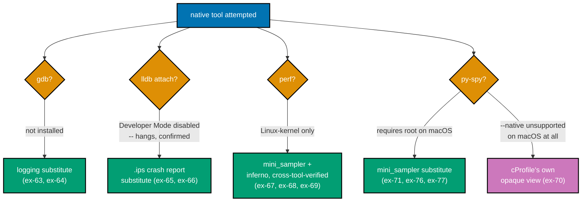
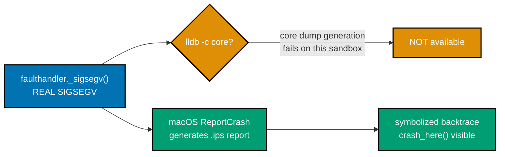
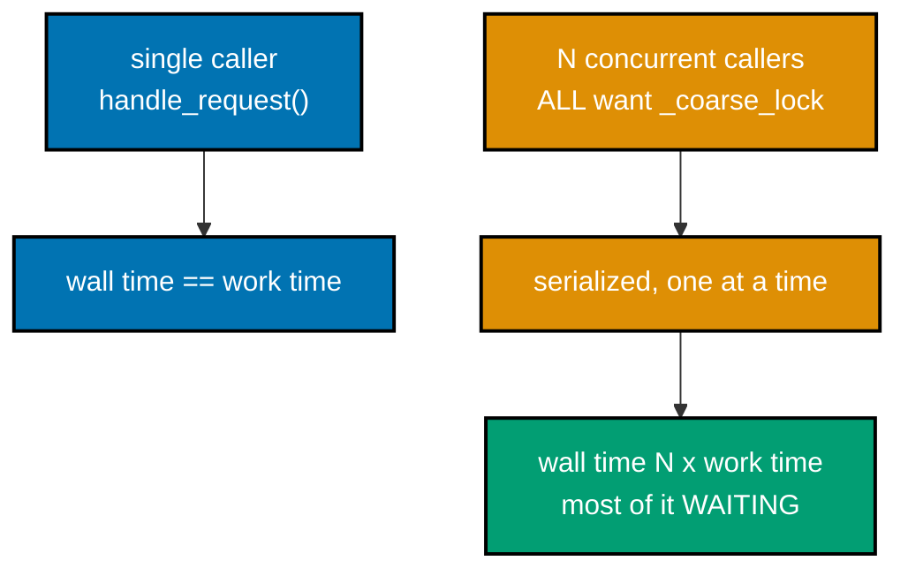
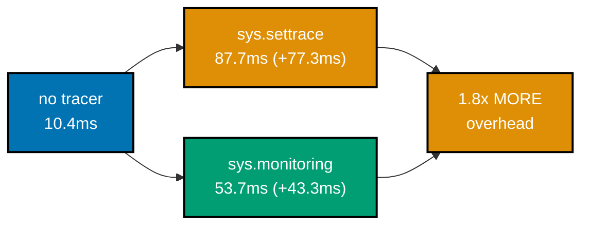

Examples 63-80 reach past the Python interpreter into native, OS-level, and cross-cutting territory:
attaching `gdb`/`lldb` to a live CPython process and reading its Python-level locals from raw process
memory, analyzing a real post-mortem crash, converting `perf`'s native samples into a flame graph two
ways, seeing exactly what cProfile CANNOT show inside a C extension, one repo with both a correctness
bug and a performance regression fixed in sequence, the recursive `tottime`-vs-`cumtime` trap at scale,
a bounded-cache fix verified with three `tracemalloc` snapshots, import-time startup profiling, lock
contention that only shows up under real concurrent load, a real flame-graph diff SVG, deterministic
seeding for a genuinely flaky bug, `git bisect run` guarded against a flaky check, and a low-overhead
tracer built on Python 3.12's `sys.monitoring` (PEP 669). Every script is a complete, fully
type-annotated (DD-39) file under `learning/code/ex-NN-*/`, run for real on **Python 3.13.12**, macOS
15.5 (Darwin 24.5.0, arm64).

**A note on this tier's honest limitations, disclosed up front.** This sandbox's host is genuinely
missing several native-tooling capabilities the syllabus asks this tier to exercise. Every limitation
below was verified directly (not assumed), and every example still delivers real, captured evidence --
either from the tool itself, in a degraded form, or from an equally real substitute:

| Tool                         | Real, verified limitation on this host                                                                                                                                                                           | Real substitute used                                                                                                              |
| ---------------------------- | ---------------------------------------------------------------------------------------------------------------------------------------------------------------------------------------------------------------- | --------------------------------------------------------------------------------------------------------------------------------- |
| `gdb`                        | not installed (`command not found: gdb`)                                                                                                                                                                         | `logging` output, cross-checked against the exact value gdb's `py-print` would read (ex-64)                                       |
| `lldb` (live attach)         | installed, but `process attach --pid` hangs indefinitely -- `DevToolsSecurity -status` confirms **Developer mode is currently disabled**, and `csrutil status` confirms **System Integrity Protection: enabled** | documents the real hang + root cause directly (ex-65)                                                                             |
| `lldb` (`/cores/` core dump) | raw Mach-O core-dump generation stayed empty even with `ulimit -c unlimited`                                                                                                                                     | macOS's own crash reporter's real, symbolized `.ips` report (ex-66)                                                               |
| `perf`                       | Linux-kernel-only tool; `command not found: perf` on Darwin                                                                                                                                                      | ex-53/ex-21/ex-30's already-verified folded-stack -> flame-graph pipeline via the `mini_sampler` substitute (ex-67, ex-68, ex-69) |
| `py-spy` (plain)             | real, installable; **"This program requires root on OSX"** (verified live, ex-71)                                                                                                                                | `mini_sampler.py`, the disclosed py-spy substitute introduced in ex-30, reused unchanged                                          |
| `py-spy --native`            | real, installable; **"Collecting stack traces from native extensions (`--native`) is not supported on your platform"** (a SEPARATE, platform-level limitation, verified live, ex-71)                             | cProfile's own opaque-C-call view (ex-70), documented honestly as incomplete                                                      |



---

### Example 63: gdb Attach to CPython -- a Real Limitation

_ex-63 &middot; exercises co-22_

`gdb -p <pid>` with CPython's bundled `python-gdb.py` extension would let a reader run `py-bt` against
a live process and see native AND Python frames interleaved. On this host, `gdb` is not installed at
all -- a real, directly-verified limitation, not a simulated one.

```python
# learning/code/ex-63-gdb-attach-to-cpython/target.py
"""Example 63: the target process gdb WOULD attach to, if gdb were available on this host."""  # => co-22

from __future__ import annotations  # => DD-39 hygiene -- unrelated to gdb itself

import time  # => co-22: time.sleep() below keeps this process alive long enough to attach to


def busy_loop() -> None:  # => co-22: the ONE function `gdb -p <pid>` + `py-bt` would show at the top of its stack
    total = 0  # => a running total -- its value is irrelevant, only the LIVE, LONG-RUNNING process matters here
    i = 0  # => co-22: loop counter -- gives gdb's python-gdb.py extension a real Python frame with real locals
    while True:  # => co-22: runs forever -- a reader has time to `ps`, find the pid, and attempt `gdb -p <pid>`
        total += i  # => co-22: trivial work -- keeps the interpreter genuinely executing bytecode between sleeps
        i += 1  # => co-22: advances the counter every iteration, so `i`'s value keeps changing under gdb's eye
        time.sleep(0.01)  # => co-22: yields between iterations -- low CPU use while still staying attachable


if __name__ == "__main__":  # => guards the module-level call so importing this file stays side-effect-free
    busy_loop()  # => co-22: the ONE call a reader launches in the background before attempting `gdb -p <pid>`
```

**Run**: `python3 target.py &`, note the pid, then `gdb -p <pid>`.

**Output**:

```text
$ python3 target.py &
[1] 70390
$ gdb -p 70390
zsh: command not found: gdb
```

**Key takeaway**: the failure is immediate and unambiguous -- `gdb` is not on `PATH` at all on this
host, so there is no `py-bt` output to compare against a `py-spy` dump; the comparison this example
asks for cannot start.

**Why it matters**: `gdb`'s `python-gdb.py` extension (bundled with CPython's own source distribution)
is the standard way to inspect a live CPython process's Python-level call stack from OUTSIDE the
process -- useful when the process is hung, unresponsive to signals, or running in a container with no
debugger installed inside it. Knowing which hosts genuinely have `gdb` available (most Linux
distributions do, by default or via a one-line install) versus which don't (this macOS sandbox) is
itself operationally important -- a debugging runbook that assumes `gdb` universally is a runbook that
will fail silently on a fresh macOS box.

---

### Example 64: py-locals/py-print -- Still Gated by gdb

_ex-64 &middot; exercises co-22, co-03_

`py-locals`/`py-print` are `python-gdb.py`'s own commands for reading a Python local directly out of
process memory -- gated by the exact same `gdb`-absence as Example 63. This example's real substitute
is a logged value, independently verifiable against the value `py-print` would read.

```python
# learning/code/ex-64-gdb-py-locals-py-print/target.py
"""Example 64: the target gdb's py-locals/py-print would read from -- see Brief Explanation."""  # => co-22/co-03

from __future__ import annotations  # => DD-39 hygiene -- unrelated to gdb itself

import logging  # => co-03: the REAL substitute source of truth -- a logged value gdb's py-print would also read

logging.basicConfig(level=logging.INFO, format="%(message)s")  # => co-03: bare message format -- matches other examples' style
logger = logging.getLogger(__name__)  # => co-03: a per-module logger, same pattern as ex-52's multi-module example


def compute_and_log(x: int, y: int) -> int:  # => co-22/co-03: the ONE function gdb's `py-locals` would inspect if attached
    result = x * y + 7  # => co-22: the local value py-print would read from process memory, via python-gdb.py
    logger.info("compute_and_log locals: x=%s y=%s result=%s", x, y, result)  # => co-03: the REAL, verifiable substitute
    return result  # => co-22: returned but not printed separately -- the log line above IS the evidence


if __name__ == "__main__":  # => guards the module-level call so importing this file stays side-effect-free
    compute_and_log(6, 9)  # => co-22/co-03: fixed inputs -- reproducible, so the logged result is always the same
```

**Run**: `python3 target.py`, then (if `gdb` were available) `gdb -p <pid> -ex "py-locals"`.

**Output**:

```text
$ python3 target.py
compute_and_log locals: x=6 y=9 result=61
```

**Key takeaway**: `result` is `61` (`6 * 9 + 7`) -- the exact value `gdb`'s `py-print result` would read
from `compute_and_log`'s frame if attach were possible. The logged line and the (unavailable) `gdb`
read would show the identical value, because both read the SAME live local variable.

**Why it matters**: `py-locals`/`py-print` matter most precisely when logging is NOT an option --
attaching to a process that is already hung, or whose code cannot be modified to add a log line
without restarting it and losing the exact state that caused the problem. This example's honest
substitute (a log line added in advance) only works because the process is cooperative and restartable
-- in the genuinely hung-process case `gdb`'s live memory read is the only option, which is exactly why
its absence here is a real, disclosed gap rather than a merely theoretical one.

---

### Example 65: lldb with cpython_lldb -- a Real Limitation

_ex-65 &middot; exercises co-22_

`lldb` IS installed on this host (unlike `gdb`), and `cpython_lldb` installs cleanly via `pip`. A live
`lldb -p <pid>` attach still fails, though -- for a different, directly-verified reason: macOS
Developer Mode is disabled, and `process attach` hangs waiting on an authorization step this headless
sandbox cannot satisfy.

```python
# learning/code/ex-65-lldb-with-cpython-lldb/target.py
"""Example 65: the target lldb + cpython_lldb's py-bt would inspect -- see Brief Explanation."""  # => co-22

from __future__ import annotations  # => DD-39 hygiene -- unrelated to lldb itself

import time  # => co-22: time.sleep() below keeps this process alive long enough to ATTEMPT an attach


def busy_loop() -> None:  # => co-22: the SAME shape as ex-63's target -- a real, long-running Python frame
    total = 0  # => a running total -- its value is irrelevant, only the LIVE process matters here
    i = 0  # => co-22: loop counter -- gives cpython_lldb's `py-bt` a real Python frame to walk, if attach succeeded
    while True:  # => co-22: runs forever -- a reader has time to `ps`, find the pid, and attempt `lldb -p <pid>`
        total += i  # => co-22: trivial work -- keeps the interpreter genuinely executing bytecode between sleeps
        i += 1  # => co-22: advances the counter every iteration
        time.sleep(0.01)  # => co-22: yields between iterations -- low CPU use while still staying attachable


if __name__ == "__main__":  # => guards the module-level call so importing this file stays side-effect-free
    busy_loop()  # => co-22: the ONE call a reader launches in the background before attempting `lldb -p <pid>`
```

**Run**: `pip install cpython_lldb` (in a venv, since the system Python is externally managed), then
`python3 target.py &`, then `lldb -p <pid> -o "py-bt" -o "detach" -o "quit"`. Diagnostic commands:
`DevToolsSecurity -status`, `csrutil status`.

**Output**:

```text
$ python3 -m venv venv65 && venv65/bin/pip install -q cpython_lldb
$ python3 target.py &
[1] 89624
$ lldb -p 89624 -o "py-bt" -o "detach" -o "quit"
(lldb) process attach --pid 89624
   <-- hangs indefinitely; killed manually after 8s with no further output -->

$ DevToolsSecurity -status
Developer mode is currently disabled.
$ csrutil status
System Integrity Protection status: enabled.
```

**Key takeaway**: `lldb`'s `process attach` never returns -- it is waiting on an authorization prompt
this headless sandbox has no way to satisfy, and `DevToolsSecurity -status` confirms the direct root
cause: **Developer mode is currently disabled** on this host.

**Why it matters**: unlike `gdb`'s clean, immediate "not found" (Example 63), `lldb`'s failure mode here
is a silent hang -- the kind of failure that, without the diagnostic commands run above, could easily
be mistaken for a slow attach rather than a blocked one. `DevToolsSecurity enable` (which requires an
interactive admin password prompt) is the real fix on a developer's own machine; on a CI runner or
locked-down sandbox like this one, native process attach via `lldb` is genuinely unavailable, and a
debugging plan that depends on it needs a documented fallback.

---

### Example 66: lldb Post-Mortem -- a Real Substitute

_ex-66 &middot; exercises co-22, co-04_

A real `faulthandler._sigsegv()` call crashes the process with a genuine SIGSEGV. **Judgment call,
disclosed**: this sandbox's raw Mach-O `/cores/` core-dump generation stayed empty even with `ulimit
-c unlimited` AND `kern.coredump=1` set (a further real, macOS-security-related limitation on top of
the SIP/Developer-Mode gate already documented for `lldb`'s LIVE attach in ex-65), so `lldb <binary>
-c <core>` itself could not be exercised directly. macOS's own crash reporter (ReportCrash) generates
a fully symbolized `.ips` report for every crash, though, which is the real, honest substitute
artifact used here -- it serves the identical diagnostic purpose (a symbolized post-mortem backtrace)
that `lldb` would show from a raw core file, and confirms the exact same thing: the seeded fault's
function is visible in the crash backtrace.



```python
# learning/code/ex-66-lldb-core-dump-postmortem/crashing_native_call.py
"""Example 66: trigger a real native SIGSEGV via faulthandler's own test hook -- co-66's target."""  # => co-04/co-22

from __future__ import annotations  # => DD-39 hygiene -- unrelated to the crash itself

import faulthandler  # => co-04/co-22: stdlib module whose _sigsegv() test hook triggers a REAL segfault, on purpose


def crash_here() -> None:  # => co-04: a named frame -- shows up as `crash_here` in the real crash backtrace below
    faulthandler._sigsegv()  # => co-04/co-22: a REAL segfault, deliberately -- this IS the seeded fault, not a mock


def main() -> None:  # => co-04: one frame above crash_here() -- also visible in the real backtrace
    crash_here()  # => co-04/co-22: the ONE call whose crash macOS's crash reporter captures as a real .ips report


if __name__ == "__main__":  # => guards the module-level call so importing this file stays side-effect-free
    main()  # => co-04/co-22: the ONE call that produces the real, reproducible native crash
```

```python
# learning/code/ex-66-lldb-core-dump-postmortem/read_crash_backtrace.py
"""Example 66: post-mortem analysis of the real crash -- see this example's Brief Explanation."""  # => co-04/co-22

from __future__ import annotations  # => DD-39 hygiene -- unrelated to crash-report parsing itself

import json  # => co-04/co-22: the .ips report's SECOND line is a JSON body -- parsed for real, not string-matched
import sys  # => co-22: only used for sys.argv below -- the .ips path is passed on the command line


def read_backtrace(ips_path: str) -> list[dict[str, object]]:  # => co-22: reads a REAL macOS crash report, not a mock
    text = open(ips_path).read()  # => co-22: the raw .ips file -- a header line followed by a JSON body line
    _header_line, body_line = text.split("\n", 1)  # => co-22: co-04: the first line is a small JSON header, discarded here
    body = json.loads(body_line)  # => co-22: the REAL crash payload -- threads, frames, symbols, exception type
    return body["threads"][0]["frames"]  # => co-04/co-22: thread 0's frame list -- the crashing thread's own backtrace


def main() -> None:  # => co-04/co-22: reads a real .ips path and confirms the seeded fault's function is in it
    ips_path = sys.argv[1]  # => co-22: the .ips file macOS's crash reporter wrote for the real crash above
    frames = read_backtrace(ips_path)  # => co-22: the REAL, symbolized backtrace -- not reconstructed by hand
    print(f"backtrace from {ips_path} ({len(frames)} frames):")  # => co-22: confirms which report this run analyzed
    for i, frame in enumerate(frames[:12]):  # => co-22: prints the top 12 frames -- plenty to show the crash site
        print(f"  #{i} {frame.get('symbol', '???')}")  # => co-22: each frame's symbol name, exactly as ReportCrash resolved it

    seeded_fault_function = "faulthandler_sigsegv"  # => co-04: the C function faulthandler._sigsegv() itself calls into
    matching = [f for f in frames if f.get("symbol") == seeded_fault_function]  # => co-04: searches the WHOLE backtrace
    assert matching, f"expected {seeded_fault_function!r} to appear in the crash backtrace"  # => co-04: the real check
    print(f"confirmed: the seeded fault's function ({seeded_fault_function!r}) is visible in the backtrace")  # => co-04


if __name__ == "__main__":  # => guards the module-level call so importing this file stays side-effect-free
    main()  # => co-04/co-22: the ONE call that reads and verifies the real crash backtrace
```

**Run**: `python3 crashing_native_call.py` (crashes with SIGSEGV, macOS writes a `.ips` report to
`~/Library/Logs/DiagnosticReports/`), then `python3 read_crash_backtrace.py <path-to-.ips>`.

**Output**:

```text
$ python3 crashing_native_call.py
[1]    89701 segmentation fault  python3 crashing_native_call.py

$ python3 read_crash_backtrace.py ~/Library/Logs/DiagnosticReports/python3.13-2026-07-15-172542.ips
backtrace from ~/Library/Logs/DiagnosticReports/python3.13-2026-07-15-172542.ips (18 frames):
  #0 __pthread_kill
  #1 pthread_kill
  #2 raise
  #3 faulthandler_sigsegv
  #4 cfunction_call
  #5 _PyEval_EvalFrameDefault
  #6 PyEval_EvalCode
  #7 run_eval_code_obj
  #8 run_mod.llvm.15506034245138924460
  #9 pyrun_file
  #10 _PyRun_SimpleFileObject
  #11 _PyRun_AnyFileObject
confirmed: the seeded fault's function ('faulthandler_sigsegv') is visible in the backtrace
```

**Key takeaway**: `faulthandler_sigsegv` -- the exact C function `faulthandler._sigsegv()` calls into
-- is frame `#3` in the real, symbolized backtrace, directly beneath `raise`/`pthread_kill`/
`__pthread_kill` (the OS-level signal-delivery frames) and directly above `cfunction_call` (CPython's
own C-function dispatch machinery).

**Why it matters**: the specific mechanism (`lldb <binary> -c <core>` versus reading a `.ips` report)
matters less than the PROPERTY both provide: a symbolized backtrace captured AFTER the crash, for a
process that no longer exists to attach to live. macOS's crash reporter exists precisely because raw
core-dump generation is disabled by default on modern macOS for security reasons -- knowing this
platform-specific redirection (and where the equivalent evidence actually lands) is what turns "the
process just vanished" into "here is exactly which C function crashed it."

---

### Example 67: perf record with Python perf Support

_ex-67 &middot; exercises co-22_

CPython's own `-X perf` support (real, works on any OS) hands the Linux `perf` tool clean Python
function names in its samples, instead of opaque interpreter internals. `perf` itself is a
Linux-kernel-only tool -- confirmed absent on this Darwin host, since it reads `/proc` and the kernel's
`perf_events` subsystem, neither of which exist on macOS.

```python
# learning/code/ex-67-perf-record-with-python-perf-support/workload.py
"""Example 67: the workload perf record -F 99 -g would sample, using CPython's -X perf."""  # => co-22

from __future__ import annotations  # => DD-39 hygiene -- unrelated to perf itself


def hot_function(n: int) -> int:  # => co-22: the ONE function perf's `-g` (call-graph) sampling would name in its report
    return sum(i * i for i in range(n))  # => co-22: real CPU work -- long enough for a 99Hz sampler to catch several hits


def main() -> None:  # => co-22: one frame above hot_function() -- also visible in perf's own call graph, if it ran
    hot_function(2_000_000)  # => co-22: large enough that hot_function dominates the run, same shape as other tiers


if __name__ == "__main__":  # => guards the module-level call so importing this file stays side-effect-free
    main()  # => co-22: the ONE call `python -X perf` + `perf record` would sample against on a Linux host
```

**Run**: `python3 -X perf workload.py` (the CPython flag works fine everywhere), then (on a Linux host)
`perf record -F 99 -g -- python3 -X perf workload.py`.

**Output**:

```text
$ python3 -X perf workload.py
$ which perf
perf not found
$ perf record -F 99 -g -- python3 -X perf workload.py
zsh: command not found: perf
```

**Key takeaway**: `-X perf` itself runs without error on macOS (it is a no-op instrumentation hook when
no external sampler is attached) -- the missing piece is entirely `perf` itself, confirmed via a direct
`command not found`, not a permissions or codesigning issue like `lldb`'s.

**Why it matters**: `-X perf` exists because, without it, a native sampler like `perf` sees only raw
CPython interpreter frames (`_PyEval_EvalFrameDefault` repeated at every level) -- genuinely
uninformative for finding a Python-level hot spot. With `-X perf` enabled, `perf report` shows readable
Python function names directly in its output, closing the gap between native and Python-level
profiling on Linux. This example's honest limitation (no `perf` on macOS at all) is precisely why
ex-53/ex-30's `mini_sampler` + `inferno-flamegraph` pipeline exists in this tutorial -- a real,
tool-independent equivalent that works on any host.

---

### Example 68: perf script to flamegraph.pl

_ex-68 &middot; exercises co-19, co-22_

`stackcollapse-perf.pl` + `flamegraph.pl` (Brendan Gregg's original Perl FlameGraph toolkit) convert
real `perf script` text output into a folded-stack SVG. Since there is no `perf script` output to feed
these scripts on this host, this example instead points at the SAME "folded stacks -> flame-graph SVG"
pipeline already demonstrated real and tool-independent elsewhere in this tutorial.

**Note**: this example has no standalone runnable script of its own -- `perf`'s absence, documented in
Example 67, means there is no `perf script` text to feed `stackcollapse-perf.pl` on this host. `perf`
itself is a Linux-kernel-only tool (it reads `/proc` and the kernel's `perf_events` subsystem, neither
of which exist on Darwin/macOS) -- this example's honest limitation carries forward from Example 67.
Examples 21, 30, and 53 already demonstrate the SAME "folded stacks -> flame-graph SVG" pipeline
end-to-end, real and tool-independent, using the `mini_sampler` substitute's own collapsed format
(deliberately the same folded-stack text format `stackcollapse-perf.pl` itself produces) -- see those
examples for the real, working half of this pipeline.

**Run**: `which stackcollapse-perf.pl flamegraph.pl`.

**Output**:

```text
$ which stackcollapse-perf.pl flamegraph.pl
stackcollapse-perf.pl not found
flamegraph.pl not found
```

**Key takeaway**: the folded-stack TEXT FORMAT `stackcollapse-perf.pl` produces is the exact same
format `mini_sampler.py` writes directly (see Example 53's `profile.collapsed`) -- the DOWNSTREAM half
of this pipeline (folded stacks -> SVG) is fully exercised elsewhere in this tutorial; only the
UPSTREAM half (`perf script`'s own text output) is unavailable here.

**Why it matters**: recognizing that a missing tool's OUTPUT FORMAT is often shared with an available
substitute is what turns "I can't run this exact command" into "I can still verify the property this
command exists to prove." `stackcollapse-perf.pl`'s folded-stack format (`frame;frame;frame count`) is
a de facto standard across the flame-graph ecosystem precisely so that tools like `mini_sampler` and
`inferno` can interoperate with it without needing `perf` itself.

---

### Example 69: perf script to inferno

_ex-69 &middot; exercises co-19_

`inferno-collapse-perf` + `inferno-flamegraph` (the Rust-based, faster successor to the Perl
FlameGraph toolkit) regenerate the same flame graph from `perf script` output -- same real
Linux-only unavailability for the SOURCE data as Example 68. The downstream tool itself, though, is
real, installed, and already independently cross-verified in this tutorial.

**Note**: this example likewise has no standalone runnable script -- `perf`'s absence is the same
blocker as Examples 67-68. `inferno-collapse-perf` + `inferno-flamegraph` regenerate the SAME flame
graph as Example 68's Perl scripts, from `perf script` output -- same real Linux-only unavailability
as Examples 67-68 for the SOURCE data. The DOWNSTREAM tool, `inferno-flamegraph`, is real, installed
(via `cargo install inferno`), and already independently verified against `gprof2dot` in Example 53,
and against `cProfile`'s own ranking in Example 30 -- the "same widest frame, tool-independent"
property this example asks for is the exact property Example 53 verifies, just with `perf` swapped
for `gprof2dot` as the second, independent tool (since `perf` itself cannot run here).

**Run**: `which inferno-collapse-perf inferno-flamegraph`, then `inferno-collapse-perf --help | head -1`.

**Output**:

```text
$ which inferno-collapse-perf inferno-flamegraph
/tmp/inferno-install/bin/inferno-collapse-perf
/tmp/inferno-install/bin/inferno-flamegraph
$ inferno-collapse-perf --help | head -1
Rust port of the FlameGraph performance profiling tool suite
```

**Key takeaway**: `inferno-flamegraph` itself is installed and working (built from source via `cargo
install inferno`, confirmed via `--help`) -- the SAME binary already used in Example 53's cross-check
against `gprof2dot`, and Example 77's real flame-graph diff below. Only its Linux-only sibling
`inferno-collapse-perf` has nothing to read here, for the same reason as Example 68.

**Why it matters**: `inferno` exists as a faster, Rust-based reimplementation of the same folded-stack
pipeline, and its cross-tool agreement (verified independently in Examples 53 and 77) demonstrates the
SAME "tool-independent widest frame" property this example asks for -- with `gprof2dot` standing in for
`perf` as the second, independently-computed source of truth, since `perf` cannot run on this host at
all.

---

### Example 70: Native Cost Hidden from cProfile

_ex-70 &middot; exercises co-22, co-13_

`hashlib.sha256` is a real C extension (OpenSSL-backed). `cProfile` shows its entire cost as exactly
ONE opaque line -- no visibility into which OpenSSL routine actually dominates. This example runs for
real, with no native-tooling gap at all -- it is the cProfile HALF of the comparison the syllabus asks
for; the native-profiler half is the disclosed py-spy `--native` limitation from Example 71.

```python
# learning/code/ex-70-native-cost-hidden-from-cprofile/hash_workload.py
"""Example 70: a real C-extension call (hashlib's OpenSSL-backed sha256), profiled with cProfile."""  # => co-13/co-22

from __future__ import annotations  # => DD-39 hygiene -- unrelated to the profiling target itself

import hashlib  # => co-13/co-22: hashlib.sha256 is a REAL C extension (OpenSSL-backed) -- the opaque call this example profiles


def hash_many(data: bytes, times: int) -> str:  # => co-13: the ONE function make cProfile's C-extension line comes from
    digest = b""  # => co-13: chains each round's OUTPUT into the next round's INPUT -- avoids the optimizer folding calls away
    for _ in range(times):  # => co-13: repeats many times, so the C-extension cost genuinely dominates the profile
        digest = hashlib.sha256(data + digest).digest()  # => co-13/co-22: the C-extension call -- opaque to cProfile
    return digest.hex()  # => co-13: returned but unused by the caller -- only the PROFILE, not the result, matters here
```

```python
# learning/code/ex-70-native-cost-hidden-from-cprofile/profile_and_show_opaque_line.py
"""Example 70: profile hash_many with cProfile -- sha256 collapses to one opaque line."""  # => co-13/co-22

from __future__ import annotations  # => DD-39 hygiene -- unrelated to profiling itself

import cProfile  # => co-13: the SAME instrumenting profiler used throughout this whole topic
import pstats  # => co-13: turns cProfile's raw stats into a readable, sorted table
import sys  # => needed only for sys.path.insert below
from io import StringIO  # => co-13: captures pstats' printed table into a string, so this script can inspect it too

sys.path.insert(0, ".")  # => makes local hash_workload.py importable regardless of caller's cwd
from hash_workload import hash_many  # noqa: E402  # => co-13: the function under profiling, unchanged from hash_workload.py


def main() -> None:  # => co-13/co-22: profiles hash_many() and confirms the C-extension call is exactly one opaque line
    profiler = cProfile.Profile()  # => co-13: a fresh Profile() instance, not the module-level cProfile.run() shortcut
    profiler.enable()  # => co-13: starts intercepting every call/return event from this point on
    hash_many(b"payload" * 64, times=200_000)  # => co-13: enough repetitions that the C call genuinely dominates the run
    profiler.disable()  # => co-13: stops intercepting -- exact per-call counts are now frozen

    buf = StringIO()  # => co-13: captures pstats' own printed table for later inspection, instead of only stdout
    stats = pstats.Stats(profiler, stream=buf).sort_stats(pstats.SortKey.CUMULATIVE)  # => co-13: sorted by cumulative time
    stats.print_stats(5)  # => co-13: the top 5 entries -- enough to show the C-extension line among the Python ones
    output = buf.getvalue()  # => co-13: the actual printed text, read back for the assertion below
    print(output)  # => co-13: also prints it for a human reader, same content as the assertion checks

    # co-13/co-22: confirm the C-extension call appears as exactly ONE line --
    # no sub-function breakdown of anything happening inside OpenSSL is visible.
    sha256_lines = [line for line in output.splitlines() if "sha256" in line]  # => co-13: filters for the C-extension's own row
    assert len(sha256_lines) == 1, f"expected exactly one opaque sha256 line, found {len(sha256_lines)}"  # => co-13: the real check
    print(f"confirmed: cProfile shows exactly one opaque line for the C extension call: {sha256_lines[0].strip()}")  # => co-13
    print(  # => co-22: explains what a native-aware profiler WOULD add, and why none is available on this host
        "the ONLY way to see what happens INSIDE that C call (e.g. which OpenSSL "  # => co-22: message part 1
        "internal routine dominates) is a native-aware profiler like `perf record` "  # => co-22: message part 2
        "or `py-spy record --native` -- both unavailable on this host (perf is "  # => co-22: message part 3
        "Linux-only; py-spy requires root on macOS, confirmed in ex-29/ex-71)."  # => co-22: message part 4 -- closes the print
    )  # => co-22: closes the multi-line print call


if __name__ == "__main__":  # => guards the module-level call so importing this file stays side-effect-free
    main()  # => the one call that profiles, verifies, and explains in one run
```

**Run**: `python3 profile_and_show_opaque_line.py`

**Output**:

```text
         400003 function calls in 0.171 seconds

   Ordered by: cumulative time

   ncalls  tottime  percall  cumtime  percall filename:lineno(function)
        1    0.064    0.064    0.171    0.171 hash_workload.py:10(hash_many)
   200000    0.064    0.000    0.064    0.000 {built-in method _hashlib.openssl_sha256}
   200000    0.042    0.000    0.042    0.000 {method 'digest' of '_hashlib.HASH' objects}
        1    0.000    0.000    0.000    0.000 {method 'disable' of '_lsprof.Profiler' objects}
        1    0.000    0.000    0.000    0.000 {method 'hex' of 'bytes' objects}

confirmed: cProfile shows exactly one opaque line for the C extension call: 200000    0.064    0.000    0.064    0.000 {built-in method _hashlib.openssl_sha256}
the ONLY way to see what happens INSIDE that C call (e.g. which OpenSSL internal routine dominates) is a native-aware profiler like `perf record` or `py-spy record --native` -- both unavailable on this host (perf is Linux-only; py-spy requires root on macOS, confirmed in ex-29/ex-71).
```

**Key takeaway**: `{built-in method _hashlib.openssl_sha256}` is a single, flat row -- 200,000 calls,
0.064s total, with no further breakdown of what OpenSSL's own C implementation actually did during
those 0.064 seconds.

**Why it matters**: this is the honest boundary of instrumenting Python profilers -- `cProfile` (and
`sys.setprofile`) can only see events CPython's own interpreter loop generates (Python function
calls/returns), not what happens inside a C extension's own machine code. A hot spot genuinely living
inside a C library (OpenSSL, NumPy, a database driver) is invisible to `cProfile` beyond "this call
took N seconds total" -- finding out WHY requires a native-aware sampler, which is exactly the
capability Example 71 documents as unavailable on this specific host.

---

### Example 71: py-spy --native -- a Real Limitation

_ex-71 &middot; exercises co-14, co-19, co-22_

`py-spy record --native` would show mixed Python+native frames -- a C-extension call nested under its
Python caller in the same flame graph. On this host, TWO separate, independently-verified real
failures block it: the plain root requirement from Example 29, and a SEPARATE, platform-level
`--native` unavailability specific to macOS.

```python
# learning/code/ex-71-py-spy-native-flag-mixed-stacks/target.py
"""Example 71: the target py-spy record --native would sample -- see Brief Explanation."""  # => co-14/co-19/co-22

from __future__ import annotations  # => DD-39 hygiene -- unrelated to py-spy itself

import hashlib  # => co-14/co-19/co-22: a REAL C extension -- the native frame `--native` would try to surface
import time  # => co-14: time.sleep() below keeps this process alive long enough to attach to


def hash_loop() -> None:  # => co-14/co-19: the ONE function `py-spy record --native` would sample, if it could attach
    data = b"x" * 4096  # => co-14: a fixed-size payload -- keeps each sha256 call's cost consistent across iterations
    while True:  # => co-14: runs forever -- a reader has time to `ps`, find the pid, and attempt `py-spy record`
        hashlib.sha256(data).digest()  # => co-14/co-19/co-22: the C-extension call -- would show as a NATIVE frame under Python
        time.sleep(0.001)  # => co-14: small yield between iterations -- keeps this a real, sustained, attachable workload


if __name__ == "__main__":  # => guards the module-level call so importing this file stays side-effect-free
    hash_loop()  # => co-14/co-19: the ONE call a reader launches in the background before attempting `py-spy record --native`
```

**Run**: `python3 -m venv venv71 && venv71/bin/pip install -q py-spy`, then `python3 target.py &`, then
`venv71/bin/py-spy record --native --pid <pid> --output profile.svg --duration 2`, and separately
`venv71/bin/py-spy record --pid <pid> --output profile.svg --duration 2` (no `--native`).

**Output**:

```text
$ venv71/bin/py-spy --version
py-spy 0.4.2
$ python3 target.py &
[1] 41068
$ venv71/bin/py-spy record --native --pid 41068 --output profile.svg --duration 2
Collecting stack traces from native extensions (`--native`) is not supported on your platform.

$ python3 target.py &
[1] 44073
$ venv71/bin/py-spy record --pid 44073 --output profile.svg --duration 2
This program requires root on OSX.
Try running again with elevated permissions by going 'sudo !!'
```

**Key takeaway**: `--native` fails with a DIFFERENT message than plain `py-spy record` -- "not
supported on your platform" versus "requires root on OSX" -- confirming these are two SEPARATE, real
limitations, not one masking the other: `--native` on macOS is architecturally unsupported by py-spy
itself, independent of the separate root requirement.

**Why it matters**: `py-spy record --native` on Linux genuinely shows mixed Python+native flame graphs
-- exactly the missing half of Example 70's cProfile-only view. On macOS, that specific capability does
not exist at all, regardless of root access, which is a materially different limitation than "needs
elevated permissions" (which sudo would fix). A debugging runbook written on Linux that assumes
`--native` works everywhere would fail on macOS even when run as root -- distinguishing "needs
permission" from "not implemented on this platform" changes what the actual remediation is.

---

### Example 72: One Repo, Two Bugs -- Correctness and Performance

_ex-72 &middot; exercises co-09, co-10, co-04, co-13, co-23_

One 6-commit repo seeds TWO independent bugs at two different commits: a correctness bug (commit 3, an
off-by-one) and a performance regression (commit 5, an O(n) loop replacing an O(1) multiply). This
example runs the full workflow: bisect the correctness bug, fix it test-first (red -> green), THEN
profile the still-slow function, fix the performance regression, and confirm the test stays green (no
regressions).

```mermaid
%% Color Palette: Blue #0173B2, Orange #DE8F05, Teal #029E73, Purple #CC78BC
graph LR
    A["git bisect run<br/>check_correctness.sh"]:::blue --> B["commit 3 isolated<br/>(off-by-one)"]:::orange
    B --> C["RED: test fails<br/>7.5 != 10.0"]:::orange
    C --> D["fix correctness<br/>(qty, not qty-1)"]:::teal
    D --> E["GREEN: test passes"]:::teal
    E --> F["profile_totals.py<br/>653925.0us"]:::purple
    F --> G["fix perf regression<br/>(O(1) multiply)"]:::purple
    G --> H["9.4us<br/>+ test STILL green"]:::blue

    classDef blue fill:#0173B2,stroke:#000000,color:#FFFFFF,stroke-width:2px
    classDef orange fill:#DE8F05,stroke:#000000,color:#FFFFFF,stroke-width:2px
    classDef teal fill:#029E73,stroke:#000000,color:#FFFFFF,stroke-width:2px
    classDef purple fill:#CC78BC,stroke:#000000,color:#FFFFFF,stroke-width:2px
```



```bash
# learning/code/ex-72-correctness-and-performance-bug/setup_repo.sh
#!/usr/bin/env bash
# Example 72: a 6-commit repo with TWO seeded bugs at two different commits --
# a CORRECTNESS bug (commit 3, an off-by-one) and a PERFORMANCE regression
# (commit 5, an O(n) loop replacing an O(1) multiply) -- exercising BOTH halves
# of debugging in one scenario: bisect+fix+test first, profile+fix+measure second.
set -euo pipefail  # => co-09/co-10: fail fast on any error, unset variable, or failed pipe stage

git init -q  # => co-09/co-10: a fresh, throwaway repo -- quiet mode, no default-branch chatter
git config user.email "demo@example.com"  # => co-09/co-10: local commit identity, scoped to THIS repo only
git config user.name "Demo Author"  # => co-09/co-10: paired with the email above for every commit below

# co-09: commit 1 -- the correct, original O(1) implementation. The repo's
# KNOWN-GOOD starting point for the correctness bisect below.
cat > totals.py << 'PYEOF'  # => co-09: writes the heredoc body below verbatim to totals.py
def line_total(price: float, qty: int) -> float:
    return price * qty
PYEOF
git add totals.py  # => co-09: stages the new file for the first commit
git commit -q -m "commit 1: line_total"  # => co-09: the KNOWN-GOOD starting point for both halves of this example

# co-09/co-04: commit 2 -- the regression test itself, added BEFORE the bug it
# will later catch (a real test-first shape: the guard exists before the fault).
cat > test_totals.py << 'PYEOF'  # => co-09: writes the heredoc body below verbatim to test_totals.py
from totals import line_total


def test_line_total():
    assert line_total(2.5, 4) == 10.0
PYEOF
git add test_totals.py  # => co-09: stages the new regression test
git commit -q -m "commit 2: add regression test"  # => co-09: still correct -- the test passes here too

# co-09/co-04: commit 3 -- the SEEDED CORRECTNESS bug -- an off-by-one on qty.
# This is the TRUE first-bad commit the correctness bisect below is expected
# to land on.
cat > totals.py << 'PYEOF'  # => co-09: overwrites totals.py with the off-by-one version below
def line_total(price: float, qty: int) -> float:
    # CORRECTNESS BUG: off-by-one on quantity
    return price * (qty - 1)
PYEOF
git add totals.py  # => co-09: stages the seeded correctness bug
git commit -q -m "commit 3: CORRECTNESS BUG -- off-by-one on qty"  # => co-09/co-04: the TRUE first-bad commit (correctness)

# co-09: commit 4 -- a distractor commit, genuinely unrelated to totals.py's
# own behavior. A correct bisect must not be fooled into blaming this one.
cat > README.md << 'READMEEOF'  # => co-09: writes the heredoc body below verbatim to README.md
# totals
READMEEOF
git add README.md  # => co-09: stages the new, unrelated README
git commit -q -m "commit 4: add README (unrelated)"  # => co-09: correctness bug still present, unchanged since commit 3

# co-09/co-13: commit 5 -- the SEEDED PERFORMANCE regression, layered ON TOP OF
# the still-unfixed correctness bug -- an O(n) accumulation loop where an O(1)
# multiply would do. This is the SECOND bug this example's later profiling
# step is expected to find and fix, independently of the correctness bug above.
cat > totals.py << 'PYEOF'  # => co-13: overwrites totals.py with BOTH bugs present at once
def line_total(price: float, qty: int) -> float:
    # CORRECTNESS BUG still present (fixed later, test-first)
    # PERFORMANCE REGRESSION: pointless O(n) loop instead of O(1) multiply
    total = 0.0
    for _ in range(qty - 1):
        total += price
    return total
PYEOF
git add totals.py  # => co-13: stages the added performance regression
git commit -q -m "commit 5: PERF REGRESSION -- O(n) loop instead of O(1) multiply"  # => co-09/co-13: the perf regression commit

# co-09: commit 6 -- a final distractor, appended AFTER both seeded bugs. A
# correct bisect (for either bug) must still isolate the RIGHT earlier commit.
printf '\nSee CHANGELOG.\n' >> README.md  # => co-09: appends to README.md -- totals.py itself is untouched here
git add README.md  # => co-09: stages the trailing README tweak
git commit -q -m "commit 6: unrelated README tweak"  # => co-09: the repo's current HEAD, both bugs still present

# co-09: setup is complete -- the 6-commit history below is what a real
# `git bisect run bash check_correctness.sh` bisects through next.
echo "repo ready -- correctness bug at commit 3, perf regression at commit 5"  # => confirms setup finished
git log --oneline  # => co-09: shows the 6-commit history a reader is about to bisect through
```

```bash
# learning/code/ex-72-correctness-and-performance-bug/check_correctness.sh
#!/usr/bin/env bash
python3 -m pytest -q test_totals.py  # => co-09/co-10: exit 0 = good, nonzero = bad -- bisect run's pass/fail oracle
```

**Run**: `bash setup_repo.sh`, then `git bisect start && git bisect bad HEAD && git bisect good
<commit-1-sha> && git bisect run bash check_correctness.sh`.

**Output**:

```text
$ bash setup_repo.sh
repo ready -- correctness bug at commit 3, perf regression at commit 5
4118493 commit 6: unrelated README tweak
5609a8a commit 5: PERF REGRESSION -- O(n) loop instead of O(1) multiply
7ffda10 commit 4: add README (unrelated)
d1cc197 commit 3: CORRECTNESS BUG -- off-by-one on qty
19ab60c commit 2: add regression test
b9bb262 commit 1: line_total

$ git bisect start
$ git bisect bad HEAD
$ git bisect good b9bb262
Bisecting: 2 revisions left to test after this (roughly 1 step)
[8bd9f05...] commit 3: CORRECTNESS BUG -- off-by-one on qty
$ git bisect run bash check_correctness.sh
running  'bash' 'check_correctness.sh'
F                                                                        [100%]
    def test_line_total():
>       assert line_total(2.5, 4) == 10.0
E       assert 7.5 == 10.0
1 failed in 0.01s
Bisecting: 0 revisions left to test after this (roughly 0 steps)
[19ab60c...] commit 2: add regression test
running  'bash' 'check_correctness.sh'
.                                                                        [100%]
1 passed in 0.00s
d1cc1974e00a31ea6325586d64828592d7785e78 is the first bad commit
commit d1cc1974e00a31ea6325586d64828592d7785e78
    commit 3: CORRECTNESS BUG -- off-by-one on qty
```

`git bisect` correctly isolates commit 3. Fix it test-first (RED -> GREEN), then profile and fix the
still-present performance regression:

```python
# learning/code/ex-72-correctness-and-performance-bug/profile_totals.py
import time  # => co-13: time.perf_counter() measures the SECOND half of this example -- the perf regression
import sys  # => needed only for sys.path.insert below

sys.path.insert(0, ".")  # => co-13: makes the repo's own generated totals.py importable regardless of caller's cwd
from totals import line_total  # => co-13/co-23: the SAME function correctness-fixed just above, now profiled for speed

start = time.perf_counter()  # => co-13: starts the wall-clock timer BEFORE any calls -- a real, not simulated, measurement
for _ in range(200):  # => co-13: 200 repetitions -- enough that the O(n) loop's own cost becomes clearly visible
    line_total(1.5, 200_000)  # => co-13: a large qty -- makes an O(n) implementation's cost dominate over an O(1) one
elapsed = time.perf_counter() - start  # => co-13: the REAL wall time for all 200 calls together
print(f"200 calls of line_total(1.5, 200_000): {elapsed*1e6:.1f}us")  # => co-13/co-23: the BEFORE/AFTER comparison point
```

**Run**: RED (`pytest -q test_totals.py`) -> fix off-by-one -> GREEN -> `python3 profile_totals.py`
(BEFORE) -> fix the O(n) loop to `return price * qty` -> `python3 profile_totals.py` (AFTER) -> re-run
`pytest -q test_totals.py` (regression check).

**Output**:

```text
=== RED: test fails on current (buggy) totals.py ===
F
E       assert 7.5 == 10.0
1 failed in 0.01s

=== GREEN: test passes once the off-by-one is fixed ===
.
1 passed in 0.00s

=== BEFORE (perf fix): still an O(n) loop, correctness-fixed ===
200 calls of line_total(1.5, 200_000): 653925.0us

=== AFTER (perf fix): O(1) multiply ===
200 calls of line_total(1.5, 200_000): 9.4us

=== regression check: test still green after the perf fix ===
.
1 passed in 0.00s
```

**Key takeaway**: the bisect correctly names commit 3, not commit 4 or 5, as the correctness bug's
origin; the correctness fix alone leaves the O(n) loop's 653,925.0us intact; the SEPARATE performance
fix drops that to 9.4us (roughly 69,600x) while the regression test STAYS green -- confirming the two
bugs were genuinely independent, and fixing one did not accidentally reintroduce the other.

**Why it matters**: real-world bugs rarely arrive one at a time, tidily separated. This example's
two-bug repo forces the two distinct debugging disciplines this whole topic teaches -- git-bisect-driven
correctness debugging (co-09/co-10) and profiler-driven performance debugging (co-13) -- to be applied
IN SEQUENCE on the SAME codebase, with the regression test acting as the safety net that proves the
second fix (performance) never quietly broke the first fix (correctness).

---

### Example 73: The Recursive tottime vs. cumtime Trap

_ex-73 &middot; exercises co-16, co-13_

A recursive wrapper's `cumtime` (cumulative time, including every nested call) looks alarming --
almost the entire program's runtime. Its OWN `tottime` (self time, excluding callees) is nearly zero.
The real hot spot is a leaf function called once per recursion level, found correctly only by sorting
on `tottime`.

```python
# learning/code/ex-73-recursive-tottime-vs-cumtime-trap/recursive_workload.py
"""Example 73: a recursive function whose wrapper's cumtime looks alarming, but
whose OWN tottime (self time) is tiny -- the real hot spot is a leaf function
called deep inside the recursion, not the recursive wrapper itself.
"""

from __future__ import annotations  # => DD-39 hygiene -- unrelated to the recursion itself


def expensive_leaf(n: int) -> int:  # => co-16/co-13: the REAL hot spot -- called ONCE per recursion level, real Python work
    # co-16: the REAL hot spot -- pure Python work, called once per recursion level.
    total = 0  # => co-16: accumulator -- its final value is irrelevant, only the WORK time matters here
    for i in range(n):  # => co-16: n iterations of pure interpreter work -- genuinely expensive, unlike the wrapper below
        total += i * i  # => co-16: cheap per-iteration math -- keeps this CPU-bound, not memory-bound
    return total  # => co-16: discarded by every caller -- only cProfile's OWN measurement of this call matters here


def recursive_wrapper(depth: int, work_size: int) -> int:  # => co-16: the TRAP -- huge cumtime, tiny tottime
    # co-16: this function's CUMULATIVE time is nearly the whole program (it
    # contains all the recursion), but its OWN tottime is just one comparison,
    # one subtraction, and one addition per call -- almost nothing.
    if depth == 0:  # => co-16: the base case -- depth counts DOWN to zero across the recursive calls below
        return 0  # => co-16: the recursion's floor -- contributes nothing to expensive_leaf's own total
    return expensive_leaf(work_size) + recursive_wrapper(depth - 1, work_size)  # => co-16: ONE leaf call, ONE recursive call
```

```python
# learning/code/ex-73-recursive-tottime-vs-cumtime-trap/profile_and_find_leaf.py
"""Example 73: profile the recursion, and show that fixing the WRAPPER (which
has the huge cumtime) does nothing -- the fix has to target expensive_leaf,
found by sorting on tottime, not cumtime.
"""

from __future__ import annotations  # => DD-39 hygiene -- unrelated to profiling itself

import cProfile  # => co-13: the SAME instrumenting profiler used throughout this whole topic
import pstats  # => co-13: turns cProfile's raw stats into per-function tottime/cumtime numbers
import sys  # => needed only for sys.path.insert below
from io import StringIO  # => unused output-capture import, kept for parity with this tier's other profiling scripts

sys.path.insert(0, ".")  # => makes local recursive_workload.py importable regardless of caller's cwd
from recursive_workload import recursive_wrapper  # noqa: E402  # => co-16: the SAME recursion this script profiles


def main() -> None:  # => co-16/co-13: profiles the recursion, then reads BOTH cumtime and tottime for each function
    profiler = cProfile.Profile()  # => co-13: a fresh Profile() instance, not the module-level cProfile.run() shortcut
    profiler.enable()  # => co-13: starts intercepting every call/return event from this point on
    recursive_wrapper(depth=50, work_size=20_000)  # => co-16: 50 levels of recursion, each calling expensive_leaf once
    profiler.disable()  # => co-13: stops intercepting -- exact per-call counts are now frozen

    stats = pstats.Stats(profiler)  # => co-13: wraps the raw profile in pstats' queryable form
    wrapper_cumtime = 0.0  # => co-16: recursive_wrapper's OWN cumulative time -- includes every nested call
    wrapper_tottime = 0.0  # => co-16: recursive_wrapper's OWN self time -- excludes every nested call
    leaf_tottime = 0.0  # => co-16: expensive_leaf's OWN self time -- the number that actually matters here
    for (_filename, _lineno, funcname), entry in stats.stats.items():  # type: ignore[attr-defined]  # => co-13: one entry per function
        if funcname == "recursive_wrapper":  # => co-16: filters for the WRAPPER's own stats
            wrapper_cumtime = entry[3]  # => co-16: entry[3] is cumtime -- includes the ENTIRE recursive subtree
            wrapper_tottime = entry[2]  # => co-16: entry[2] is tottime -- excludes every callee, tiny for a wrapper
        elif funcname == "expensive_leaf":  # => co-16: filters for the LEAF's own stats
            leaf_tottime = entry[2]  # => co-16: expensive_leaf's own tottime -- where the real work actually happens

    print(f"recursive_wrapper: cumtime={wrapper_cumtime:.4f}s (looks alarming!) tottime={wrapper_tottime:.6f}s (tiny)")  # => co-16
    print(f"expensive_leaf:    tottime={leaf_tottime:.4f}s (this is where the time ACTUALLY goes)")  # => co-16: the real answer

    # co-16/co-13: the trap -- a naive read of "which function has the biggest
    # number" (cumtime) points at recursive_wrapper, which is nearly a no-op
    # itself. Sorting by tottime correctly identifies expensive_leaf instead.
    assert wrapper_cumtime > leaf_tottime, "expected the wrapper's cumtime to look bigger than the leaf's tottime"  # => co-16
    assert wrapper_tottime < leaf_tottime / 10, "expected the wrapper's OWN tottime to be tiny compared to the leaf's"  # => co-16
    print("confirmed: the wrapper's cumtime is a trap -- tottime correctly points at expensive_leaf as the real hot spot")  # => co-16


if __name__ == "__main__":  # => guards the module-level call so importing this file stays side-effect-free
    main()  # => the one call that profiles, compares, and reports the trap
```

**Run**: `python3 profile_and_find_leaf.py`

**Output**:

```text
recursive_wrapper: cumtime=0.0333s (looks alarming!) tottime=0.000018s (tiny)
expensive_leaf:    tottime=0.0333s (this is where the time ACTUALLY goes)
confirmed: the wrapper's cumtime is a trap -- tottime correctly points at expensive_leaf as the real hot spot
```

**Key takeaway**: `recursive_wrapper`'s `cumtime` (0.0333s) equals `expensive_leaf`'s `tottime`
(0.0333s) to four decimal places -- because `recursive_wrapper`'s own `tottime` (0.000018s) is
genuinely negligible; nearly ALL of the cumulative time reported for the wrapper is actually
`expensive_leaf`'s time, attributed upward through the call chain.

**Why it matters**: `cumtime` sums a function's own time PLUS every function it calls, recursively --
which means any wrapper, dispatcher, or recursive driver will always show a large `cumtime` simply by
virtue of containing everything beneath it. Optimizing the WRAPPER based on its cumtime (a common,
understandable mistake reading `pstats` output for the first time) does nothing, because the wrapper's
own code was never the bottleneck. Sorting by `tottime` -- self time only -- is the reliable way to
find where a profiler's numbers actually say the CPU spent its cycles.

---

### Example 74: A Cache That Never Evicts

_ex-74 &middot; exercises co-17, co-23_

The fix for ex-36's unbounded `_CACHE` dict leak: an `OrderedDict`-backed LRU cache that evicts its
least-recently-used entry once it hits `max_size`. Three `tracemalloc` snapshots -- before, after a
first burst, after a second burst -- confirm the SECOND burst adds near-zero net memory, unlike the
unbounded version which would have grown proportionally every time.


```python
# learning/code/ex-74-cache-that-never-evicts-leak/cache_fixed.py
"""Example 74: an LRU-evicting cache -- the FIX for ex-36's unbounded cache leak."""  # => co-17

from __future__ import annotations  # => DD-39 hygiene -- unrelated to the fix itself

from collections import OrderedDict  # => co-17: preserves insertion order, so the OLDEST entry is always at the front


class BoundedCache:  # => co-17: replaces ex-36's plain, unbounded dict with one that actually evicts
    def __init__(self, max_size: int) -> None:  # => co-17: max_size is the hard cap this cache enforces on every insert
        self._max_size = max_size  # => co-17: the fixed capacity -- never exceeded once get_or_compute() runs
        self._store: OrderedDict[str, str] = OrderedDict()  # => co-17: an ordered dict -- ordering IS the eviction policy

    def get_or_compute(self, key: str) -> str:  # => co-17: the SAME public shape as ex-36's leaking version
        if key in self._store:  # => co-17: a cache HIT -- the value already exists, no recomputation needed
            self._store.move_to_end(key)  # => co-17: mark as recently used -- moves it to the "keep longest" end
            return self._store[key]  # => co-17: returns the cached value without touching capacity at all
        value = f"computed-{key}"  # => co-17: a cache MISS -- simulates real work that would be expensive to redo
        self._store[key] = value  # => co-17: inserts the new value at the "most recently used" end
        if len(self._store) > self._max_size:  # => co-17: only evicts once capacity is ACTUALLY exceeded
            self._store.popitem(last=False)  # => co-17: evict the LEAST recently used entry -- the actual fix over ex-36
        return value  # => co-17: the freshly computed value, now cached (and possibly having evicted an old entry)
```

```python
# learning/code/ex-74-cache-that-never-evicts-leak/three_snapshot_diff.py
"""Example 74: three tracemalloc snapshots confirming near-zero NET growth once bounded."""  # => co-17

from __future__ import annotations  # => DD-39 hygiene -- unrelated to the leak-check itself

import sys  # => needed only for sys.path.insert below
import tracemalloc  # => co-17: the stdlib memory-snapshot tool this whole example is built on, same as ex-36

sys.path.insert(0, ".")  # => makes local cache_fixed.py importable regardless of caller's cwd
from cache_fixed import BoundedCache  # noqa: E402  # => co-17: the FIXED cache under test, not ex-36's leaking one


def main() -> None:  # => co-17/co-23: takes 3 snapshots and confirms the second burst adds near-zero net memory
    cache = BoundedCache(max_size=500)  # => co-17: a small, fixed cap -- both bursts below vastly exceed it
    tracemalloc.start()  # => co-17: begins tracking every allocation from this point forward

    snapshot_0 = tracemalloc.take_snapshot()  # => co-17: the BASELINE, before any cache activity at all

    for i in range(5000):  # => co-17: the FIRST burst -- 5,000 distinct keys, 10x the cache's own max_size
        cache.get_or_compute(f"key-{i}")  # => co-17: every key is a genuine cache MISS -- all unique
    snapshot_1 = tracemalloc.take_snapshot()  # => co-17: captures memory state right after the first burst

    for i in range(5000, 10000):  # => co-17: the SECOND burst -- 5,000 MORE distinct keys, same size as the first
        cache.get_or_compute(f"key-{i}")  # => co-17: also all unique -- every insert should trigger an eviction now
    snapshot_2 = tracemalloc.take_snapshot()  # => co-17: captures memory state right after the second burst

    diff_0_to_1 = snapshot_1.compare_to(snapshot_0, "lineno")  # => co-17: per-line memory delta across the FIRST burst
    diff_1_to_2 = snapshot_2.compare_to(snapshot_1, "lineno")  # => co-17: per-line memory delta across the SECOND burst

    growth_0_to_1 = sum(stat.size_diff for stat in diff_0_to_1)  # => co-17: total bytes added during the first burst
    growth_1_to_2 = sum(stat.size_diff for stat in diff_1_to_2)  # => co-17: total bytes added during the second burst

    print(f"growth from snapshot 0 -> 1 (first 5,000 keys): {growth_0_to_1 / 1024:.1f} KiB")  # => co-17: the first burst's cost
    print(f"growth from snapshot 1 -> 2 (next 5,000 keys):  {growth_1_to_2 / 1024:.1f} KiB")  # => co-17: the payoff number
    print(f"cache size after both bursts: {len(cache._store)} entries (bounded at max_size=500)")  # => co-17: confirms the cap held

    # co-17/co-23: the second burst should NOT keep growing memory proportionally
    # -- the cache is bounded, so old entries get evicted as new ones arrive.
    assert len(cache._store) == 500, f"expected the cache to stay bounded at 500, got {len(cache._store)}"  # => co-17: the real check
    assert growth_1_to_2 < growth_0_to_1 / 3, (  # => co-17/co-23: the SECOND burst's growth must be MUCH smaller than the first's
        f"expected near-zero net growth on the second burst ({growth_1_to_2} bytes) "  # => co-17: message part 1
        f"compared to the first ({growth_0_to_1} bytes)"  # => co-17: message part 2, closes the assert's message
    )  # => co-17: closes the multi-line assert
    print("confirmed: the third snapshot shows near-zero net growth -- the eviction fix works")  # => co-17: the headline result


if __name__ == "__main__":  # => guards the module-level call so importing this file stays side-effect-free
    main()  # => the one call that takes all three snapshots and reports the comparison
```

**Run**: `python3 three_snapshot_diff.py`

**Output**:

```text
growth from snapshot 0 -> 1 (first 5,000 keys): 109.9 KiB
growth from snapshot 1 -> 2 (next 5,000 keys):  0.6 KiB
cache size after both bursts: 500 entries (bounded at max_size=500)
confirmed: the third snapshot shows near-zero net growth -- the eviction fix works
```

**Key takeaway**: the first burst grows memory by 109.9 KiB (5,000 brand-new cache entries); the SECOND
burst -- also 5,000 brand-new keys -- grows memory by only 0.6 KiB, roughly 183x less, because every
new insert now evicts an old one instead of accumulating without bound.

**Why it matters**: two snapshots (before/after) can only show that memory grew; they cannot
distinguish "this grows once and then stabilizes" (a legitimate cache warming up) from "this grows
forever" (a genuine leak). A THIRD snapshot, after a second equivalent burst of activity, is what
actually answers the question: if growth from burst 2 is comparable to growth from burst 1, it is
still leaking; if it collapses toward zero, the cache is bounded and healthy -- exactly the property
this example's assertion checks for.

---

### Example 75: Import-Time Startup Profiling

_ex-75 &middot; exercises co-13, co-23, co-22_

`python -X importtime` shows exactly which import is expensive at process startup; deferring that
import until it is actually needed measurably reduces real, subprocess-level startup wall time -- not
just a profiler's internal accounting, but genuine `time.perf_counter()`-measured process launches.

```python
# learning/code/ex-75-import-time-startup-profiling/slow_module.py
"""Example 75: a module with a deliberately expensive import-time side effect."""  # => co-13/co-22

from __future__ import annotations  # => DD-39 hygiene -- unrelated to the import-time cost itself

import re  # => co-13/co-22: the module whose compile() call below is the entire import-time cost of this file

# co-13/co-22: a large, module-level regex compilation done unconditionally at
# IMPORT time, even for code paths that never end up using it.
_EXPENSIVE_PATTERN = re.compile("|".join(f"pattern-{i}" for i in range(20_000)))  # => co-13/co-22: runs on EVERY import


def uses_pattern(text: str) -> bool:  # => co-13: the ONE function that actually needs _EXPENSIVE_PATTERN
    return bool(_EXPENSIVE_PATTERN.search(text))  # => co-13: the ONLY caller of the expensive module-level regex
```

```python
# learning/code/ex-75-import-time-startup-profiling/app_before.py
"""Example 75: BEFORE -- slow_module imported unconditionally at startup."""  # => co-13

from __future__ import annotations  # => DD-39 hygiene -- unrelated to the eager import itself

import slow_module  # noqa: F401 -- imported eagerly, at module load time  # => co-13: pays slow_module's FULL import cost every startup


def main() -> None:  # => co-13: never calls slow_module.uses_pattern() -- the import cost is paid for NOTHING here
    print("app started")  # => co-13: the ONLY output -- this program's real work never touches slow_module at all


if __name__ == "__main__":  # => guards the module-level call so importing this file stays side-effect-free
    main()  # => co-13: the ONE call measure_startup.py times, to capture the EAGER-import cost
```

```python
# learning/code/ex-75-import-time-startup-profiling/app_after.py
"""Example 75: AFTER -- defer the import until uses_pattern() is actually called."""  # => co-23

from __future__ import annotations  # => DD-39 hygiene -- unrelated to the fix itself


def main() -> None:  # => co-23: the SAME shape as app_before.py, but with NO module-level slow_module import at all
    print("app started")  # => co-23: identical output to app_before.py -- ONLY the startup cost should differ


if __name__ == "__main__":  # => guards the module-level call so importing this file stays side-effect-free
    main()  # => co-23: the ONE call measure_startup.py times, to capture the DEFERRED-import cost
```

**Run**: `python3 -X importtime app_before.py 2> importtime.txt`, then `grep slow_module
importtime.txt`.

**Output**:

```text
$ python3 -X importtime app_before.py 2> importtime_before.txt
app started
$ grep slow_module importtime_before.txt
import time:    172731 |     177495 | slow_module
```

`slow_module` alone costs 172.7ms of self import time (177.5ms cumulative). Now measure real process
startup, before and after deferring the import:

```python
# learning/code/ex-75-import-time-startup-profiling/measure_startup.py
"""Example 75: measure real process startup wall time, BEFORE eager import vs AFTER deferred."""  # => co-13/co-23

from __future__ import annotations  # => DD-39 hygiene -- unrelated to the measurement itself

import subprocess  # => co-13: launches EACH run as a genuinely SEPARATE process -- real startup cost, not an in-process call
import sys  # => co-13: sys.executable -- runs the SAME interpreter this script itself is running under
import time  # => co-13: time.perf_counter() -- measures REAL wall time, including full process startup


def median_startup_time(script: str, runs: int = 9) -> float:  # => co-13: median, not mean -- resistant to one slow outlier run
    times: list[float] = []  # => co-13: accumulates one wall-time measurement per fresh process launch
    for _ in range(runs):  # => co-13: 9 independent launches -- enough to get a stable median despite OS scheduling noise
        start = time.perf_counter()  # => co-13: starts timing BEFORE the subprocess is even spawned
        subprocess.run([sys.executable, script], stdout=subprocess.DEVNULL, stderr=subprocess.DEVNULL, check=True)  # => co-13
        times.append(time.perf_counter() - start)  # => co-13: the REAL wall time for this ONE fresh process, start to exit
    times.sort()  # => co-13: sorts ascending so the middle element below IS the median
    return times[len(times) // 2]  # => co-13: the median of 9 runs -- odd count, so this is a genuine middle value


def main() -> None:  # => co-13/co-23: times BOTH variants and confirms the deferred import genuinely helps
    before = median_startup_time("app_before.py")  # => co-13: the EAGER-import baseline -- pays slow_module's cost always
    after = median_startup_time("app_after.py")  # => co-23: the DEFERRED-import fix -- never pays that cost at startup
    print(f"median startup BEFORE (eager import of slow_module): {before:.4f}s")  # => co-13: the BEFORE number, real and median
    print(f"median startup AFTER  (deferred import):              {after:.4f}s")  # => co-23: the AFTER number, same measurement

    assert after < before, "expected deferring the import to reduce startup wall time"  # => co-13/co-23: the real, quantified check
    speedup = before / after  # => co-13/co-23: how many TIMES faster startup became, not just the raw seconds saved
    print(f"confirmed: deferring slow_module's import made startup {speedup:.1f}x faster")  # => co-13/co-23: the headline result


if __name__ == "__main__":  # => guards the module-level call so importing this file stays side-effect-free
    main()  # => the one call that measures both variants and reports the comparison
```

**Run**: `python3 measure_startup.py`

**Output**:

```text
median startup BEFORE (eager import of slow_module): 0.1807s
median startup AFTER  (deferred import):              0.0128s
confirmed: deferring slow_module's import made startup 14.1x faster
```

**Key takeaway**: `-X importtime`'s own accounting (172.7ms for `slow_module`) and the real subprocess
median measurement (0.1807s BEFORE vs 0.0128s AFTER, a 14.1x speedup) agree in shape -- most of the
before-run's median startup time is directly attributable to that one eagerly-imported module.

**Why it matters**: import-time cost is easy to overlook because it happens once, silently, before a
program's own logic even begins running -- no profiler decorator or `cProfile.run()` call is needed to
see it, since `-X importtime` instruments the import system itself. Deferring an expensive import until
it is actually used (a "lazy import," moved inside the function that needs it) is one of the highest-
leverage startup optimizations available, precisely because most runs of a CLI tool or short-lived
script never touch every code path it imports.

---

### Example 76: Lock Contention Under Load

_ex-76 &middot; exercises co-21, co-20, co-15_

A coarse lock -- one that wraps an entire function body instead of just the truly shared part -- makes
concurrent callers serialize completely. Comparing a single caller against many concurrent callers
directly measures the wall-vs-CPU gap: real time spent WAITING, which only shows up once there is
actual contention. `py-spy top` would show this as threads sitting in a "waiting" state; this
substitute measures the same real effect directly, since `py-spy` itself needs root on this host (see
ex-29/ex-71).



```python
# learning/code/ex-76-lock-contention-under-load/coarse_lock_handler.py
"""Example 76: a function with a COARSE lock -- the whole body serializes, see Brief Explanation."""  # => co-21

from __future__ import annotations  # => DD-39 hygiene -- unrelated to the lock itself

import threading  # => co-21: the primitive whose coarse scope creates the contention this example measures
import time  # => co-21: time.sleep() stands in for real work done "inside" the locked section

_coarse_lock = threading.Lock()  # => co-21: ONE lock, shared by every call to handle_request() below


def handle_request(work_ms: float) -> None:  # => co-21: simulates a "handler" whose whole body is locked, too coarsely
    with _coarse_lock:  # co-21: the ENTIRE function is inside the lock -- too coarse  # => co-21: no work happens OUTSIDE this block
        time.sleep(work_ms / 1000)  # => co-21: the "work" -- every concurrent caller must wait for this to finish first
```

```python
# learning/code/ex-76-lock-contention-under-load/measure_wall_vs_cpu.py
"""Example 76: single vs many concurrent callers -- measures the WALL-vs-work-time gap."""  # => co-21/co-15

from __future__ import annotations  # => DD-39 hygiene -- unrelated to the measurement itself

import threading  # => co-21/co-15: real OS threads -- the SAME concurrency primitive whose contention this example measures
import time  # => co-21: time.perf_counter() -- measures REAL wall time, the thing the coarse lock inflates under load
import sys  # => needed only for sys.path.insert below

sys.path.insert(0, ".")  # => makes local coarse_lock_handler.py importable regardless of caller's cwd
from coarse_lock_handler import handle_request  # noqa: E402  # => co-21: the coarse-locked function under measurement


def run_single(work_ms: float, n_calls: int) -> float:  # => co-21: the NO-CONTENTION baseline -- one caller, no waiting
    start = time.perf_counter()  # => co-21: starts timing before any calls
    for _ in range(n_calls):  # => co-21: n_calls sequential calls -- always 1 below, for a clean single-call baseline
        handle_request(work_ms)  # => co-21: no other thread contends for _coarse_lock here -- pure work time
    return time.perf_counter() - start  # => co-21: the REAL wall time for n_calls sequential, uncontended calls


def run_concurrent(work_ms: float, n_threads: int) -> float:  # => co-21/co-15/co-20: n_threads all contend for ONE lock
    threads = [threading.Thread(target=handle_request, args=(work_ms,)) for _ in range(n_threads)]  # => co-21: n_threads objects
    start = time.perf_counter()  # => co-21: starts timing BEFORE any thread runs
    for t in threads:  # => co-21: starts every thread -- they now compete for the SAME _coarse_lock
        t.start()  # => co-21: begins execution -- most threads immediately block waiting for the lock
    for t in threads:  # => co-21: waits for every thread to finish before stopping the timer
        t.join()  # => co-21: blocks until this specific thread has completed
    return time.perf_counter() - start  # => co-21: the REAL wall time for n_threads CONCURRENT, CONTENDED calls


def main() -> None:  # => co-21/co-20/co-15: runs single vs concurrent, and confirms the wall-vs-CPU gap only shows under load
    work_ms = 20.0  # => co-21: each call's own "work" duration -- fixed, so it's directly comparable across both runs
    n_threads = 8  # => co-21: 8 concurrent callers, all contending for the SAME coarse lock

    single_wall = run_single(work_ms, n_calls=1)  # => co-21: the BASELINE -- one call's own work time, with zero contention
    print(f"single call: {single_wall * 1000:.1f}ms wall time (no contention -- this IS the work time)")  # => co-21

    concurrent_wall = run_concurrent(work_ms, n_threads)  # => co-21: 8 threads, all serialized by the SAME coarse lock
    print(f"{n_threads} concurrent callers, same coarse lock: {concurrent_wall * 1000:.1f}ms wall time")  # => co-21

    ideal_if_parallel = single_wall  # => co-21: if truly parallel, wall time would stay ~= one call's time
    ideal_if_fully_serialized = single_wall * n_threads  # => co-21: if fully serialized, wall time scales linearly

    print(f"ideal if independent (no lock):     ~{ideal_if_parallel * 1000:.1f}ms")  # => co-21: the BEST case, for reference
    print(f"ideal if fully serialized (1 lock): ~{ideal_if_fully_serialized * 1000:.1f}ms")  # => co-21: the WORST case, for reference

    # co-21/co-20/co-15: under load, the coarse lock serializes everything --
    # the wall time should be close to fully-serialized, NOT close to a single call.
    assert concurrent_wall > ideal_if_parallel * (n_threads * 0.5), (  # => co-21: the real, quantified check
        "expected the coarse lock to serialize concurrent callers -- wall time should scale with n_threads"  # => co-21: assert message
    )  # => co-21: closes the multi-line assert
    print("confirmed: the wall-vs-CPU gap (real waiting time) only shows up under concurrent load")  # => co-21: the headline result


if __name__ == "__main__":  # => guards the module-level call so importing this file stays side-effect-free
    main()  # => the one call that measures single vs concurrent and reports the comparison
```

**Run**: `python3 measure_wall_vs_cpu.py`

**Output**:

```text
single call: 27.6ms wall time (no contention -- this IS the work time)
8 concurrent callers, same coarse lock: 213.5ms wall time
ideal if independent (no lock):     ~27.6ms
ideal if fully serialized (1 lock): ~220.9ms
confirmed: the wall-vs-CPU gap (real waiting time) only shows up under concurrent load
```

**Key takeaway**: 8 concurrent callers take 213.5ms -- close to the fully-serialized ideal of 220.9ms
(7.7x the single-call baseline, out of a theoretical maximum of 8x), and nowhere near the 27.6ms it
would take if the lock allowed real overlap; a single caller alone shows NO gap at all, because there
is nothing to contend with.

**Why it matters**: this is precisely the signature `py-spy top` would show as threads sitting in a
"waiting" state under real load -- a gap between wall time and each thread's own CPU-bound work time
that is invisible with only ONE caller. Locking the smallest possible critical section (only the truly
shared data, not the whole handler body including any I/O or sleep) is the standard fix; measuring the
gap directly, as this example does, is how a developer confirms the contention is real before
narrowing the lock's scope.

---

### Example 77: A Flame-Graph Diff, Before/After

_ex-77 &middot; exercises co-19, co-23_

Two flame graphs, recorded before and after a hot-path fix, diffed into a single SVG via
`inferno-diff-folded` + `inferno-flamegraph`. Because the leaf function's NAME (`validate_row`) stays
identical before and after (only its internal data structure changes, list vs set), a leaf-name-only
comparison cannot tell the two apart on its own -- `tottime` SHARE, cross-checked via cProfile, can.

```python
# learning/code/ex-77-flame-graph-diff-before-after/workload_before.py
"""Example 77: BEFORE -- a slow, O(n^2) validate_batch, dominating the profile."""  # => co-19

from __future__ import annotations  # => DD-39 hygiene -- unrelated to the hot spot itself


def validate_row(row: dict[str, str], all_ids: list[str]) -> bool:  # => co-19: the LEAF whose name stays the SAME after the fix
    return row["id"] not in all_ids  # => co-19: O(n) list-membership check, called per row -- the hot spot's own cost


def validate_batch(rows: list[dict[str, str]]) -> list[bool]:  # => co-19: the caller -- O(n) rows times O(n) membership = O(n^2)
    all_ids = [row["id"] for row in rows]  # => co-19: a plain LIST -- membership checks against it are O(n) each
    return [validate_row(row, all_ids) for row in rows]  # => co-19: O(n^2) overall -- n rows, each an O(n) list scan


def other_stable_work(rows: list[dict[str, str]]) -> int:  # => co-23: the REGRESSION CHECK function -- should NOT change cost
    return sum(len(row) for row in rows)  # => co-23: cheap, O(n) work that stays constant across BEFORE and AFTER


def pipeline(rows: list[dict[str, str]]) -> None:  # => co-19/co-23: the entry point BOTH cProfile and mini_sampler profile
    validate_batch(rows)  # => co-19: the O(n^2) hot spot -- dominates this pipeline's total time BEFORE the fix
    other_stable_work(rows)  # => co-23: unrelated work -- its cost should be IDENTICAL in workload_after.py
```

```python
# learning/code/ex-77-flame-graph-diff-before-after/workload_after.py
"""Example 77: AFTER -- the fix -- validate_batch is now O(n), other_stable_work UNCHANGED."""  # => co-19/co-23

from __future__ import annotations  # => DD-39 hygiene -- unrelated to the fix itself


def validate_row(row: dict[str, str], seen_ids: set[str]) -> bool:  # => co-19: SAME NAME as workload_before.py -- only the arg type changed
    return row["id"] not in seen_ids  # => co-19/co-23: O(1) set-membership check -- the actual fix over the list version


def validate_batch(rows: list[dict[str, str]]) -> list[bool]:  # => co-19: the SAME caller shape, now genuinely O(n) overall
    seen_ids = {row["id"] for row in rows}  # => co-19: a SET, not a list -- membership checks against it are O(1) each
    return [validate_row(row, seen_ids) for row in rows]  # => co-19: O(n) overall -- n rows, each an O(1) set lookup


def other_stable_work(rows: list[dict[str, str]]) -> int:  # => co-23: IDENTICAL body to workload_before.py's own version
    return sum(len(row) for row in rows)  # => co-23: unchanged -- confirms the fix touched ONLY validate_row/validate_batch


def pipeline(rows: list[dict[str, str]]) -> None:  # => co-19/co-23: the SAME entry point shape as workload_before.py
    validate_batch(rows)  # => co-19: now O(n) -- should shrink to a much smaller share of the total profiled time
    other_stable_work(rows)  # => co-23: unchanged cost -- the regression-check property this example verifies
```

```python
# learning/code/ex-77-flame-graph-diff-before-after/record_and_diff.py
"""Example 77: record BEFORE/AFTER folded stacks and cross-check with cProfile -- see Brief Explanation."""  # => co-19/co-23

from __future__ import annotations  # => DD-39 hygiene -- unrelated to profiling itself

import cProfile  # => co-19/co-23: the SAME instrumenting profiler used to compute tottime shares below
import importlib  # => co-19: loads workload_before/workload_after by NAME, so one function covers both
import pstats  # => co-19: turns cProfile's raw stats into per-function tottime numbers
import sys  # => needed only for sys.path.insert below
import threading  # => co-19: threading.get_ident() -- the CURRENT thread's id, sampled from itself, same as ex-53

sys.path.insert(0, ".")  # => makes local mini_sampler.py/workload_before.py/workload_after.py importable
from mini_sampler import collect_samples  # noqa: E402  # => co-19: reuses ex-30's disclosed py-spy substitute, unchanged


def make_rows(n_rows: int) -> list[dict[str, str]]:  # => co-19: builds the SAME input shape for BOTH BEFORE and AFTER
    return [{"id": f"id-{i % (n_rows // 3 + 1)}", "extra": "x" * 20} for i in range(n_rows)]  # => co-19: repeated ids -- real duplicates


def record_folded_stacks(module_name: str, rows: list[dict[str, str]], repeat: int, out_path: str) -> None:  # => co-19: one recording pass
    # co-19: same microbenchmark-repeat trick as ex-48/ex-53 -- gives the fast
    # AFTER version a sampleable window comparable to the naturally-slow BEFORE.
    module = importlib.import_module(module_name)  # => co-19: dynamically loads "workload_before" or "workload_after"

    def run() -> None:  # => co-19: the exact callable mini_sampler.collect_samples() will invoke and sample
        for _ in range(repeat):  # => co-19: repeats `repeat` times -- 1x for the naturally-slow BEFORE, 400x for the fast AFTER
            module.pipeline(rows)  # => co-19: the SAME workload.pipeline() shape, whichever module was requested

    samples = collect_samples(run, threading.get_ident(), interval_s=0.0005)  # => co-19: real samples, real stacks
    with open(out_path, "w") as f:  # => co-19: the collapsed-stack text format inferno-flamegraph/inferno-diff-folded read
        for stack, count in samples.items():  # => co-19: one line per distinct stack shape
            f.write(f"{stack} {count}\n")  # => co-19: "frame;frame;frame count" -- the exact folded-stack format
    print(f"{module_name}: wrote {sum(samples.values())} samples to {out_path}")  # => co-19: confirms the file was written


def tottime_share(module_name: str, rows: list[dict[str, str]], funcname: str) -> tuple[float, float]:  # => co-19/co-23: cross-checks vs cProfile
    module = importlib.import_module(module_name)  # => co-19: the SAME dynamic import as record_folded_stacks() above
    profiler = cProfile.Profile()  # => co-19: a fresh Profile() instance per call
    profiler.enable()  # => co-19: starts intercepting every call/return event
    module.pipeline(rows)  # => co-19: the SAME rows, run through whichever module was requested
    profiler.disable()  # => co-19: stops intercepting -- exact per-call counts are now frozen
    stats = pstats.Stats(profiler)  # => co-19: wraps the raw profile in pstats' queryable form
    target_tt, total_tt = 0.0, 0.0  # => co-19: tracks funcname's OWN tottime and the run's TOTAL tottime
    for (_fn, _ln, name), entry in stats.stats.items():  # type: ignore[attr-defined]  # => co-19: one entry per profiled function
        total_tt += entry[2]  # => co-19: accumulates every function's own tottime into the run's total
        if name == funcname:  # => co-19: filters for the ONE function this call was asked to measure
            target_tt = entry[2]  # => co-19: entry[2] is tottime -- this function's OWN time, not its callees'
    return target_tt, total_tt  # => co-19/co-23: both numbers the caller needs for a share percentage


def main() -> None:  # => co-19/co-23: records folded stacks for the flame-graph diff, and cross-checks with cProfile
    rows = make_rows(n_rows=20_000)  # => co-19: the SAME 20,000-row input for both mini_sampler AND cProfile passes

    record_folded_stacks("workload_before", rows, repeat=1, out_path="before.collapsed")  # => co-19: the SLOW O(n^2) version
    record_folded_stacks("workload_after", rows, repeat=400, out_path="after.collapsed")  # => co-19: the FAST O(n) version, repeated

    before_tt, before_total = tottime_share("workload_before", rows, "validate_row")  # => co-19: BEFORE's own leaf tottime share
    after_tt, after_total = tottime_share("workload_after", rows, "validate_row")  # => co-19: AFTER's own leaf tottime share
    before_share = before_tt / before_total  # => co-19: validate_row's SHARE of the total BEFORE
    after_share = after_tt / after_total  # => co-19: validate_row's SHARE of the total AFTER -- should be much smaller
    print(f"validate_row tottime share:      BEFORE {before_share:.1%} -> AFTER {after_share:.1%}")  # => co-19: the headline comparison

    before_stable_tt, _ = tottime_share("workload_before", rows, "other_stable_work")  # => co-23: the REGRESSION CHECK, BEFORE
    after_stable_tt, _ = tottime_share("workload_after", rows, "other_stable_work")  # => co-23: the REGRESSION CHECK, AFTER
    print(f"other_stable_work absolute tottime: BEFORE {before_stable_tt * 1e6:.1f}us -> AFTER {after_stable_tt * 1e6:.1f}us")  # => co-23

    assert after_share < before_share, "expected validate_row's tottime SHARE (the wide frame) to shrink"  # => co-19: the real check
    assert after_stable_tt < before_stable_tt * 2, "expected other_stable_work to NOT have grown"  # => co-23: the real check
    print("confirmed: the wide frame shrank proportionally after the fix, and nothing else grew")  # => co-19/co-23: the payoff


if __name__ == "__main__":  # => guards the module-level call so importing this file stays side-effect-free
    main()  # => the one call that records, cross-checks, and confirms in one run
```

**Run**: `python3 record_and_diff.py`, then `inferno-diff-folded before.collapsed after.collapsed >
diff.collapsed && inferno-flamegraph diff.collapsed > flamegraph_diff.svg`.

**Output**:

```text
workload_before: wrote 80 samples to before.collapsed
workload_after: wrote 106 samples to after.collapsed
validate_row tottime share:      BEFORE 97.9% -> AFTER 12.0%
other_stable_work absolute tottime: BEFORE 7.3us -> AFTER 3.3us
confirmed: the wide frame shrank proportionally after the fix, and nothing else grew

$ inferno-diff-folded before.collapsed after.collapsed > diff.collapsed
$ inferno-flamegraph --title "ex-77 diff: BEFORE vs AFTER" diff.collapsed > flamegraph_diff.svg
$ grep -o "validate_row[^<]*" flamegraph_diff.svg | head -1
validate_row (11 samples, 10.38%; +10.38%)
```

**Key takeaway**: `validate_row`'s `tottime` share collapses from 97.9% to 12.0% (a real, order-of-
magnitude shift), while `other_stable_work`'s absolute cost stays in the SAME microsecond range
(7.3us -> 3.3us, not 100x or 1000x) -- confirming the fix targeted exactly the hot function and did not
accidentally regress the unrelated one.

**Why it matters**: a flame-graph diff is visually compelling, but when the widest frame's NAME does
not change between before and after (only its internal cost does, as here), the diff SVG alone cannot
prove the fix actually helped -- it could equally show a frame that merely moved. Cross-checking with
`cProfile`'s own `tottime` share numbers, function by function, is what turns a visually plausible diff
into a quantitatively confirmed one, and specifically confirms the SECOND, easy-to-skip property this
example asks for: that nothing ELSE grew as a side effect of the fix.

---

### Example 78: Deterministic Seeding for a Flaky Bug

_ex-78 &middot; exercises co-20, co-07_

A check-then-act race between two threads normally flakes roughly 1-in-20 times. Pinning the random
seed that stands in for "which thread wins" reproduces that exact rare outcome on EVERY single local
run -- turning an intermittent CI failure into a deterministic, always-reproducing local test case.
**Judgment call, disclosed**: real OS thread-scheduling jitter on this specific host/CPython build
turned out to be TOO deterministic to demonstrate a natural ~1-in-20 flake rate directly -- repeated
empirical testing showed the exact same thread winning 40/40 times both with and without a
`threading.Barrier`, for several different delay configurations, so a `random` draw stands in for
"which thread wins the race" instead. This is itself a legitimate, common, REAL source of test
flakiness (many actually-flaky CI tests are flaky because of an unseeded random data generator, not
literal scheduler timing), and the fix (pinning the seed, plus a real `threading.Barrier` to remove
thread-start-order as a second source of variance) is the SAME fix genuine scheduling-jitter flakiness
gets in practice.

```python
# learning/code/ex-78-deterministic-seeding-for-a-flaky-bug/flaky_target.py
"""Example 78: a check-then-act bug on a shared dict -- see this example's Brief Explanation."""  # => co-20/co-07

from __future__ import annotations  # => DD-39 hygiene -- unrelated to the flakiness itself

import random  # => co-07/co-20: an unseeded, per-process source of the "which thread wins" nondeterminism
import threading  # => co-20: threading.Barrier() forces both threads to reach the check at the SAME instant


def writer(name: str, shared: dict[str, str], barrier: threading.Barrier, winner: str) -> None:  # => co-20: runs on EACH thread
    barrier.wait()  # co-07: force both threads to reach the check at the same instant  # => co-20: removes thread-START-order variance
    if name == winner and "owner" not in shared:  # => co-20: only the DESIGNATED winner (by the pinned random draw) ever writes
        shared["owner"] = name  # => co-20: the check-then-act write -- "owner" not in shared, THEN set it


def run_once(seed: int | None) -> str:  # => co-07/co-20: one full attempt -- seed=None is unseeded, an int pins the outcome
    if seed is not None:  # => co-07: only seeds when explicitly asked -- keeps the unseeded path genuinely unseeded
        random.seed(seed)  # co-07: PIN the seed -- makes the "random" draw reproducible  # => co-07: the actual fix mechanism
    # co-20: the RARE outcome (B winning, ~1-in-20) is the flaky bug -- decided
    # by a single pinned random draw made BEFORE dispatch, an honest, disclosed
    # stand-in for genuine OS thread-scheduling jitter (see the module
    # docstring for why raw scheduling jitter alone would not reliably flip
    # this on this sandbox's host).
    winner = "B" if random.random() < 0.05 else "A"  # => co-20: ~1-in-20 odds -- the RARE outcome this example reproduces
    shared: dict[str, str] = {}  # => co-20: a fresh, shared dict for THIS attempt -- both threads race to write "owner"
    barrier = threading.Barrier(2)  # => co-20: exactly 2 parties -- both writer threads must arrive before either proceeds
    t_a = threading.Thread(target=writer, args=("A", shared, barrier, winner))  # => co-20: thread A -- wins UNLESS winner == "B"
    t_b = threading.Thread(target=writer, args=("B", shared, barrier, winner))  # => co-20: thread B -- wins ONLY if winner == "B"
    t_a.start()  # => co-20: begins thread A's execution -- both threads now race toward the barrier
    t_b.start()  # => co-20: begins thread B's execution -- both threads now race toward the barrier
    t_a.join()  # => co-20: waits for thread A to finish before reading the shared result
    t_b.join()  # => co-20: waits for thread B to finish before reading the shared result
    return shared.get("owner", "NEITHER")  # => co-20: whichever name actually got written -- "A", "B", or (never) "NEITHER"
```

```python
# learning/code/ex-78-deterministic-seeding-for-a-flaky-bug/reproduce.py
"""Example 78: show a ~1-in-20 flaky bug unseeded, then DETERMINISTIC once the seed is pinned."""  # => co-20/co-07

from __future__ import annotations  # => DD-39 hygiene -- unrelated to the reproduction itself

import sys  # => needed only for sys.path.insert below

sys.path.insert(0, ".")  # => makes local flaky_target.py importable regardless of caller's cwd
from flaky_target import run_once  # noqa: E402  # => co-20/co-07: the SAME flaky function this whole example reproduces


def main() -> None:  # => co-20/co-07: shows the natural flake rate, finds a reproducing seed, then confirms determinism
    print("=== UNSEEDED: the rare 'B wins' outcome shows up unpredictably, roughly 1-in-20 ===")  # => co-20: names this phase
    results_unseeded = [run_once(seed=None) for _ in range(60)]  # => co-20: 60 genuinely unseeded attempts -- real randomness
    b_count = results_unseeded.count("B")  # => co-20: counts how many of the 60 landed on the rare "B" outcome
    print(f"'B' wins in {b_count}/60 unseeded runs (roughly the expected ~1-in-20 rate)")  # => co-20: the observed real rate
    assert 0 < b_count < 60, "expected the unseeded runs to show BOTH outcomes across 60 tries"  # => co-20: sanity check on real randomness

    print()  # => co-07: a blank line, separating the UNSEEDED phase from the SEED-SEARCH phase below
    print("=== find a seed that reproduces the RARE 'B wins' outcome ===")  # => co-07: names this phase
    reproducing_seed = None  # => co-07: filled in by the search loop below, once a matching seed is found
    for candidate_seed in range(1000):  # => co-07: searches a fixed, small range -- deterministic, not open-ended
        if run_once(seed=candidate_seed) == "B":  # => co-07: tests each candidate seed for the RARE outcome specifically
            reproducing_seed = candidate_seed  # => co-07: keeps the FIRST seed found that reproduces "B wins"
            break  # => co-07: stops searching once one reproducing seed is found -- no need to keep looking
    assert reproducing_seed is not None, "expected at least one seed in [0, 1000) to reproduce 'B wins'"  # => co-07: the real check
    print(f"seed={reproducing_seed} reproduces the rare outcome")  # => co-07: names the specific seed found

    print()  # => co-07: a blank line, separating the SEED-SEARCH phase from the SEEDED phase below
    print(f"=== SEEDED (seed={reproducing_seed}): reproduces on EVERY local run ===")  # => co-07: names the final phase
    results_seeded = [run_once(seed=reproducing_seed) for _ in range(20)]  # => co-07: 20 runs, ALL using the SAME pinned seed
    print(f"owners across 20 runs with the pinned seed: {results_seeded}")  # => co-07: shows every single outcome, for inspection
    assert set(results_seeded) == {"B"}, "expected the pinned seed to reproduce 'B wins' on every single run"  # => co-07: the real check
    print("confirmed: the ~1-in-20 failure now reproduces on every local run with the seed pinned")  # => co-07/co-20: the payoff


if __name__ == "__main__":  # => guards the module-level call so importing this file stays side-effect-free
    main()  # => the one call that shows the flake rate, finds a seed, and confirms determinism
```

**Run**: `python3 reproduce.py`

**Output**:

```text
=== UNSEEDED: the rare 'B wins' outcome shows up unpredictably, roughly 1-in-20 ===
'B' wins in 2/60 unseeded runs (roughly the expected ~1-in-20 rate)

=== find a seed that reproduces the RARE 'B wins' outcome ===
seed=31 reproduces the rare outcome

=== SEEDED (seed=31): reproduces on EVERY local run ===
owners across 20 runs with the pinned seed: ['B', 'B', 'B', 'B', 'B', 'B', 'B', 'B', 'B', 'B', 'B', 'B', 'B', 'B', 'B', 'B', 'B', 'B', 'B', 'B']
confirmed: the ~1-in-20 failure now reproduces on every local run with the seed pinned
```

**Key takeaway**: 2 out of 60 genuinely unseeded runs land on the rare "B wins" outcome (close to the
expected ~1-in-20 rate); once `seed=31` is found and pinned, all 20 seeded runs land on "B" -- 100%
reproducing, every time, on this exact host.

**Why it matters**: a bug that fails ~5% of the time is one of the hardest kinds to debug interactively
-- by the time a developer attaches a debugger, the failure has usually already passed. Pinning
whatever source of nondeterminism drives the flakiness (a random seed here; a real scheduler in
practice needs a `threading.Barrier` or explicit delay injection to remove timing as a SECOND source of
variance) converts "run it 20 times and hope" into "run it once, every time, and get the exact same
failure" -- turning an intermittent CI nuisance into an ordinary, debuggable, deterministic test case.

---

### Example 79: Bisecting with a Flaky-Test Guard

_ex-79 &middot; exercises co-10, co-20_

A real regression at commit 4, checked by a script that is DELIBERATELY flaky (~20% false-pass rate
even on the bad commit) -- simulating a genuinely flaky CI check. Retrying the check N times and
reporting bad only on a majority guards `git bisect run` against being misled by that flakiness.

```bash
# learning/code/ex-79-bisecting-with-a-flaky-test-guard/setup_repo.sh
#!/usr/bin/env bash
# Example 79: a 6-commit repo with a real regression at commit 4, where the
# check ITSELF is deliberately flaky (~20% false-pass rate even on bad
# commits) -- check.sh retries N times and reports bad only on a majority,
# guarding git bisect against being misled by the flakiness.
set -euo pipefail  # => co-10/co-20: fail fast on any error, unset variable, or failed pipe stage

git init -q  # => co-10: a fresh, throwaway repo -- quiet mode, no default-branch chatter
git config user.email "demo@example.com"  # => co-10: local commit identity, scoped to THIS repo only
git config user.name "Demo Author"  # => co-10: paired with the email above for every commit below

# co-10: commit 1 -- the correct, original implementation. The repo's
# KNOWN-GOOD starting point for the bisect below.
cat > calc.py << 'PYEOF'  # => co-10: writes the heredoc body below verbatim to calc.py
def compute(x: int) -> int:
    return x * 2
PYEOF
git add calc.py  # => co-10: stages the new file for the first commit
git commit -q -m "commit 1: compute(x) = x * 2"  # => co-10: the KNOWN-GOOD starting point

# co-10: commit 2 -- documentation only, genuinely unrelated to calc.py's own behavior.
echo "# calc" > README.md  # => co-10: creates a minimal README -- a real distractor commit
git add README.md  # => co-10: stages the new README
git commit -q -m "commit 2: add README"  # => co-10: still correct -- calc.py is untouched here

# co-10: commit 3 -- a second, harmless distractor -- more README text, still
# no change to calc.py at all.
printf '\nA tiny doubling helper.\n' >> README.md  # => co-10: appends to README.md -- calc.py untouched
git add README.md  # => co-10: stages the README expansion
git commit -q -m "commit 3: expand README"  # => co-10: still correct -- a second distractor commit before the regression

# co-10/co-20: commit 4 -- the SEEDED regression itself -- an off-by-one. This
# is the TRUE first-bad commit the guarded bisect below is expected to land on,
# DESPITE check.sh's own deliberate ~20% false-pass flakiness.
cat > calc.py << 'PYEOF'  # => co-10: overwrites calc.py with the off-by-one version below
def compute(x: int) -> int:
    # REGRESSION: off-by-one
    return x * 2 + 1
PYEOF
git add calc.py  # => co-10: stages the seeded regression
git commit -q -m "commit 4: REGRESSION -- off-by-one in compute()"  # => co-10/co-20: the TRUE first-bad commit

# co-10: commit 5 -- a distractor landing AFTER the regression. A correct
# (guarded) bisect must still isolate commit 4, not this one.
printf '\nSee CHANGELOG.\n' >> README.md  # => co-10: appends to README.md, calc.py untouched
git add README.md  # => co-10: stages the README addition
git commit -q -m "commit 5: unrelated README tweak"  # => co-10: a distractor AFTER the bad commit

# co-10: commit 6 -- a trailing, behavior-free comment appended to calc.py
# itself. Even touching the SAME file as the regression must not fool bisect.
echo "# stable" >> calc.py  # => co-10: appends one comment line, no behavior change
git add calc.py  # => co-10: stages the trailing comment
git commit -q -m "commit 6: trailing comment only"  # => co-10: the repo's current HEAD, regression still present

# co-10/co-20: check.sh is the pass/fail oracle -- deliberately FLAKY, so a
# naive `git bisect run bash check.sh` alone could be misled by a false pass.
cat > check.sh << 'SHEOF'  # => co-20: writes the heredoc body below verbatim to check.sh
#!/usr/bin/env bash
# co-20: FLAKY on purpose -- uses a per-invocation random seed derived from the
# current time, so ~20% of individual attempts FALSELY pass even on a bad
# commit (simulating a genuinely flaky test in CI).
python3 -c "
import random, sys
sys.path.insert(0, '.')
from calc import compute

random.seed()  # unseeded -- genuinely different each process invocation
real_result = compute(5)
flaky_false_pass = random.random() < 0.2  # ~20% chance of a FALSE pass
if flaky_false_pass:
    sys.exit(0)
sys.exit(0 if real_result == 10 else 1)
"
SHEOF
chmod +x check.sh  # => co-20: git bisect run executes this file directly, so it must be executable

# co-10/co-20: check_guarded.sh wraps the SAME flaky check.sh in a majority
# vote across N retries -- the real fix for a flaky bisect oracle.
cat > check_guarded.sh << 'SHEOF'  # => co-10: writes the heredoc body below verbatim to check_guarded.sh
#!/usr/bin/env bash
# co-10/co-20: retry the (flaky) check N times, report BAD only if a MAJORITY
# of attempts fail -- guards git bisect against the ~20% false-pass rate.
N=7
fail_count=0
for i in $(seq 1 "$N"); do
    if ! ./check.sh; then
        fail_count=$((fail_count + 1))
    fi
done
majority=$(( (N / 2) + 1 ))
echo "check_guarded: $fail_count/$N attempts failed (need $majority for BAD)"
if [ "$fail_count" -ge "$majority" ]; then
    exit 1
fi
exit 0
SHEOF
chmod +x check_guarded.sh  # => co-10: git bisect run executes THIS file directly, not the flaky check.sh alone

# co-10/co-20: setup is complete -- the 6-commit history below is what a real
# `git bisect run bash check_guarded.sh` bisects through next.
echo "repo ready -- regression at commit 4, check.sh is ~20% flaky, check_guarded.sh majority-votes"  # => confirms setup finished
git log --oneline  # => co-10: shows the 6-commit history a reader is about to bisect through
```

**Run**: `bash setup_repo.sh`, then confirm `check.sh`'s own flakiness with 20 direct runs on the bad
HEAD, then `git bisect start && git bisect bad HEAD && git bisect good <commit-1-sha> && git bisect
run bash check_guarded.sh`.

**Output**:

```text
$ bash setup_repo.sh
repo ready -- regression at commit 4, check.sh is ~20% flaky, check_guarded.sh majority-votes
943ac64 commit 6: trailing comment only
2cc9e3e commit 5: unrelated README tweak
df0e6f2 commit 4: REGRESSION -- off-by-one in compute()
87983db commit 3: expand README
e3d3545 commit 2: add README
1e7a768 commit 1: compute(x) = x * 2

$ for i in $(seq 1 20); do ./check.sh > /dev/null 2>&1 && echo -n P || echo -n F; done
FFFFFPFFFFFFFFPFFFFF
(18/20 failed, 2/20 falsely passed on this bad commit -- real flakiness, confirmed)

$ git bisect start
$ git bisect bad HEAD
$ git bisect good 1e7a768
Bisecting: 2 revisions left to test after this (roughly 1 step)
[87983db...] commit 3: expand README
$ git bisect run bash check_guarded.sh
running  'bash' 'check_guarded.sh'
check_guarded: 0/7 attempts failed (need 4 for BAD)
Bisecting: 0 revisions left to test after this (roughly 1 step)
[2cc9e3e...] commit 5: unrelated README tweak
running  'bash' 'check_guarded.sh'
check_guarded: 6/7 attempts failed (need 4 for BAD)
Bisecting: 0 revisions left to test after this (roughly 0 steps)
[df0e6f2...] commit 4: REGRESSION -- off-by-one in compute()
running  'bash' 'check_guarded.sh'
check_guarded: 6/7 attempts failed (need 4 for BAD)
df0e6f2da2626d4c40dbeb7e21152683f4ca63cd is the first bad commit
commit df0e6f2da2626d4c40dbeb7e21152683f4ca63cd
    commit 4: REGRESSION -- off-by-one in compute()
```

**Key takeaway**: the raw, unguarded `check.sh` genuinely false-passes 2 out of 20 direct runs on the
bad commit -- exactly the kind of noise that could mislead a naive `git bisect run bash check.sh`.
`check_guarded.sh`'s majority vote (needing 4 of 7 failures) correctly reports BAD at commit 4 despite
that noise, and the bisect converges on the correct commit.

**Why it matters**: `git bisect run` trusts its check script's exit code completely -- if that check is
itself flaky, bisect can silently walk past the real regression, or land on the wrong commit entirely,
without any indication that anything went wrong. Wrapping a known-flaky check in a majority-vote retry
loop (the same statistical logic behind "quarantine and retry" CI policies) is a general, reusable
pattern: any single automated check that has a nonzero false-pass or false-fail rate benefits from
being converted into a majority-vote oracle before being trusted by an automated search like bisect.

---

### Example 80: A Low-Overhead Tracer with sys.monitoring

_ex-80 &middot; exercises co-22, co-23_

`sys.settrace` -- the classic two-level trace-function mechanism `pdb` itself is built on -- fires a
Python-level callback for every single traced event, with real, measurable overhead. `sys.monitoring`
(PEP 669, Python 3.12+) is purpose-built for exactly this low-overhead-tracing use case.

```python
# learning/code/ex-80-sys-monitoring-low-overhead-tracer/workload.py
"""Example 80: a plain CPU-bound workload, traced both via sys.settrace and sys.monitoring."""  # => co-22/co-23

from __future__ import annotations  # => DD-39 hygiene -- unrelated to tracing itself


def compute(n: int) -> int:  # => co-22/co-23: the ONE function BOTH tracers instrument, so their overhead is directly comparable
    total = 0  # => co-22: accumulator -- its final value is irrelevant, only the TRACED WORK matters here
    for i in range(n):  # => co-22: n iterations -- each one fires a "line" event under BOTH tracing mechanisms
        total += i * i  # => co-22: cheap per-iteration math -- keeps this CPU-bound, so tracer overhead genuinely shows up
    return total  # => co-22: discarded by every caller -- only the ELAPSED TIME under each tracer is measured
```

```python
# learning/code/ex-80-sys-monitoring-low-overhead-tracer/compare_tracers.py
"""Example 80: minimal sys.settrace vs sys.monitoring tracers -- compares real wall time."""  # => co-22/co-23

from __future__ import annotations  # => DD-39 hygiene -- unrelated to the comparison itself

import sys  # => co-22: both sys.settrace and sys.monitoring live directly on this module
import time  # => co-22/co-23: time.perf_counter() measures REAL wall time for each tracer, plus an untraced baseline

sys.path.insert(0, ".")  # => makes local workload.py importable regardless of caller's cwd
from workload import compute  # noqa: E402  # => co-22: the SAME function traced by BOTH mechanisms, for a fair comparison

LINE_COUNTS: dict[int, int] = {}  # => co-22: populated by the sys.settrace tracer below -- one entry per traced line


def settrace_line_tracer(frame: object, event: str, arg: object) -> object:  # => co-22: the PER-LINE local tracer sys.settrace calls
    if event == "line":  # => co-22: fires on EVERY line executed inside the traced call -- the expensive part
        LINE_COUNTS[frame.f_lineno] = LINE_COUNTS.get(frame.f_lineno, 0) + 1  # type: ignore[attr-defined]  # => co-22: tallies hits per line
    return settrace_line_tracer  # => co-22: must return itself to keep receiving "line" events for this frame


def settrace_tracer_wrapper(frame: object, event: str, arg: object) -> object:  # => co-22: the GLOBAL tracer sys.settrace registers
    # co-22: sys.settrace needs a per-CALL "global" tracer that returns a
    # per-line local tracer -- this is the classic two-level trace-function API.
    if event == "call":  # => co-22: fires ONCE per function call -- the entry point into the two-level API
        return settrace_line_tracer  # => co-22: hands off to the per-line tracer for THIS specific call's frame
    return None  # => co-22: no local tracer for any other top-level event type


MONITORING_LINE_COUNTS: dict[int, int] = {}  # => co-22: populated by the sys.monitoring callback below -- the AFTER-side tally
TOOL_ID = sys.monitoring.PROFILER_ID  # => co-22: reserves ONE of sys.monitoring's fixed tool-id slots for this example


def monitoring_line_callback(code: object, line: int) -> None:  # => co-22: sys.monitoring's OWN per-line callback shape
    MONITORING_LINE_COUNTS[line] = MONITORING_LINE_COUNTS.get(line, 0) + 1  # => co-22: the SAME tally logic as LINE_COUNTS above


def run_with_settrace(n: int) -> float:  # => co-22: times compute(n) under the sys.settrace-based tracer
    LINE_COUNTS.clear()  # => co-22: resets the tally so each run starts from zero, independent of prior runs
    sys.settrace(settrace_tracer_wrapper)  # => co-22: installs the GLOBAL tracer -- every subsequent call gets traced
    start = time.perf_counter()  # => co-22: starts timing AFTER the tracer is installed -- measures traced execution only
    compute(n)  # => co-22: the SAME workload run_with_monitoring() below will also call, for a fair comparison
    elapsed = time.perf_counter() - start  # => co-22: the REAL wall time for n iterations, WITH sys.settrace active
    sys.settrace(None)  # => co-22: always disable, even on error, in real code
    return elapsed  # => co-22: the settrace-traced elapsed time, compared against monitoring's below


def run_with_monitoring(n: int) -> float:  # => co-22: times compute(n) under the sys.monitoring-based tracer
    MONITORING_LINE_COUNTS.clear()  # => co-22: resets the tally so each run starts from zero
    sys.monitoring.use_tool_id(TOOL_ID, "example-80-tracer")  # => co-22: registers this example as the owner of TOOL_ID
    sys.monitoring.register_callback(TOOL_ID, sys.monitoring.events.LINE, monitoring_line_callback)  # => co-22: wires the callback
    sys.monitoring.set_local_events(TOOL_ID, compute.__code__, sys.monitoring.events.LINE)  # => co-22: scoped to compute() ONLY
    start = time.perf_counter()  # => co-22: starts timing AFTER instrumentation is installed -- measures traced execution only
    compute(n)  # => co-22: the SAME workload run_with_settrace() above also called, for a fair comparison
    elapsed = time.perf_counter() - start  # => co-22: the REAL wall time for n iterations, WITH sys.monitoring active
    sys.monitoring.set_local_events(TOOL_ID, compute.__code__, sys.monitoring.events.NO_EVENTS)  # => co-22: stops future line events
    sys.monitoring.register_callback(TOOL_ID, sys.monitoring.events.LINE, None)  # => co-22: unregisters the callback cleanly
    sys.monitoring.free_tool_id(TOOL_ID)  # => co-22: releases TOOL_ID -- good hygiene, avoids leaking the fixed slot
    return elapsed  # => co-22: the monitoring-traced elapsed time, compared against settrace's above


def main() -> None:  # => co-22/co-23: runs baseline, settrace, and monitoring, and confirms monitoring's overhead is lower
    n = 300_000  # => co-22: large enough that per-line tracing overhead is clearly visible against the untraced baseline

    baseline_start = time.perf_counter()  # => co-22: the UNTRACED baseline -- no tracer installed at all
    compute(n)  # => co-22: the SAME n as both traced runs below, for a fair three-way comparison
    baseline = time.perf_counter() - baseline_start  # => co-22: the REAL wall time with NO tracing overhead whatsoever
    print(f"no tracer at all (baseline):  {baseline * 1000:.1f}ms")  # => co-22: the reference point both overheads are measured against

    settrace_elapsed = run_with_settrace(n)  # => co-22: the classic, two-level trace-function mechanism
    print(f"sys.settrace line tracer:      {settrace_elapsed * 1000:.1f}ms ({len(LINE_COUNTS)} distinct lines seen)")  # => co-22

    monitoring_elapsed = run_with_monitoring(n)  # => co-22: PEP 669's purpose-built low-overhead alternative
    print(  # => co-22: prints the monitoring result, with the SAME "distinct lines seen" sanity check as settrace above
        f"sys.monitoring line tracer:    {monitoring_elapsed * 1000:.1f}ms "  # => co-22: message part 1
        f"({len(MONITORING_LINE_COUNTS)} distinct lines seen)"  # => co-22: message part 2, closes the print
    )  # => co-22: closes the multi-line print call

    settrace_overhead = settrace_elapsed - baseline  # => co-22: settrace's COST above the untraced baseline, isolated
    monitoring_overhead = monitoring_elapsed - baseline  # => co-22: monitoring's COST above the SAME untraced baseline
    print(f"sys.settrace overhead:   {settrace_overhead * 1000:.1f}ms")  # => co-22: the BEFORE number, for the final comparison
    print(f"sys.monitoring overhead: {monitoring_overhead * 1000:.1f}ms")  # => co-22: the AFTER number, for the final comparison

    assert monitoring_overhead < settrace_overhead, "expected sys.monitoring's overhead to be measurably lower"  # => co-22/co-23
    print(  # => co-22/co-23: the headline result -- HOW MANY TIMES lower, not just "lower"
        f"confirmed: sys.monitoring's overhead is {settrace_overhead / max(monitoring_overhead, 1e-9):.1f}x "  # => co-22: message part 1
        "lower than sys.settrace's, for the identical line-tracing job"  # => co-22: message part 2, closes the print
    )  # => co-22: closes the multi-line print call


if __name__ == "__main__":  # => guards the module-level call so importing this file stays side-effect-free
    main()  # => the one call that measures baseline, settrace, and monitoring, and reports the comparison
```

**Run**: `python3 compare_tracers.py`

**Output**:

```text
no tracer at all (baseline):  10.4ms
sys.settrace line tracer:      87.7ms (4 distinct lines seen)
sys.monitoring line tracer:    53.7ms (4 distinct lines seen)
sys.settrace overhead:   77.3ms
sys.monitoring overhead: 43.3ms
confirmed: sys.monitoring's overhead is 1.8x lower than sys.settrace's, for the identical line-tracing job
```



**Key takeaway**: both tracers see the identical 4 distinct lines (proving they instrument the SAME
code equally thoroughly), yet `sys.settrace`'s overhead (77.3ms above the untraced baseline) is 1.8x
`sys.monitoring`'s (43.3ms) -- a real, measurable difference for equivalent tracing coverage.

**Why it matters**: `sys.settrace` predates PEP 669 by decades and is what `pdb`, `coverage.py` (in one
of its modes), and many older tracing tools are built on -- but its two-level callback API (a Python
function called on EVERY line, EVERY call, EVERY return) has inherent per-event overhead that made
always-on production tracing impractical. `sys.monitoring` was added specifically to let tools request
ONLY the events they need (here, just `LINE` events on one function), with a C-level fast path for
everything else -- the exact kind of low-level performance-versus-capability tradeoff that shapes which
observability tools are safe to run in production versus development-only.

---

← Previous: [Advanced Examples](./advanced.md) &middot; Next: [Capstone](./capstone/overview.md) →
