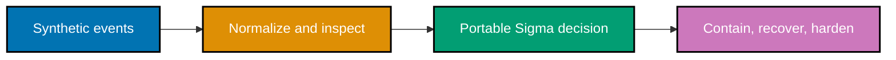

> **Offline by default.** The runnable lab uses only `code/lab-events.ndjson`. It has no network client
> and no target argument. Optional OpenSearch import is a separate, explicitly local step.

## Install and run your first example

No package installation is required. Start by validating every lab invariant:

```sh
# => Runs local assertions over the synthetic fixture and prints no secrets or live data.
python3 code/blue_lab.py verify
```

To inspect the NDJSON that an owner may import into an already-isolated OpenSearch lab, generate it
first and review it before sending it anywhere:

```sh
# => Generates OpenSearch bulk-format data locally; it performs no HTTP request.
python3 code/blue_lab.py bulk > /tmp/defensive-security-blue-lab.ndjson
```

Only after review, an owner of an isolated local stack may choose to import it with a local endpoint:

```sh
# => Optional: imports invented data into a self-owned local OpenSearch lab, never a shared endpoint.
curl --fail --silent --show-error --request POST \
  http://127.0.0.1:9200/blue-lab-events/_bulk \
  --header 'Content-Type: application/x-ndjson' \
  --data-binary @/tmp/defensive-security-blue-lab.ndjson
```

## Concepts

The course covers central logging and SIEM flow (`co-02`–`co-06`), maintained portable detections and
Sigma structure (`co-07`–`co-12`), IDS/EDR breadth (`co-13`–`co-14`), current incident-response
context and practice (`co-15`–`co-19`), hunting and intelligence (`co-20`–`co-25`), zero trust
and hardening (`co-26`–`co-30`), CSF functions and purple-team coverage (`co-31`–`co-34`).

## Examples by Level

### Beginner (Examples 1–26)

- [Example 1: Blue, Red, and Purple Roles](/en/learn/courses/defensive-security/learning/beginner#example-1-blue-red-and-purple-roles)
- [Example 2: Choose Events Worth Logging](/en/learn/courses/defensive-security/learning/beginner#example-2-choose-events-worth-logging)
- [Example 3: Parse a Raw Lab Log](/en/learn/courses/defensive-security/learning/beginner#example-3-parse-a-raw-lab-log)
- [Example 4: Centralize Synthetic Telemetry](/en/learn/courses/defensive-security/learning/beginner#example-4-centralize-synthetic-telemetry)
- [Example 5: Trace a SIEM Flow](/en/learn/courses/defensive-security/learning/beginner#example-5-trace-a-siem-flow)
- [Example 6: Prepare OpenSearch Bulk Data](/en/learn/courses/defensive-security/learning/beginner#example-6-prepare-opensearch-bulk-data)
- [Example 7: Read a Recon Dashboard Timeline](/en/learn/courses/defensive-security/learning/beginner#example-7-read-a-recon-dashboard-timeline)
- [Example 8: Normalize Two Log Shapes](/en/learn/courses/defensive-security/learning/beginner#example-8-normalize-two-log-shapes)
- [Example 9: Recognize a Signature Detection](/en/learn/courses/defensive-security/learning/beginner#example-9-recognize-a-signature-detection)
- [Example 10: Compare Signature and Anomaly Signals](/en/learn/courses/defensive-security/learning/beginner#example-10-compare-signature-and-anomaly-signals)
- [Example 11: Read a Suricata Rule Shape](/en/learn/courses/defensive-security/learning/beginner#example-11-read-a-suricata-rule-shape)
- [Example 12: Identify Endpoint Telemetry](/en/learn/courses/defensive-security/learning/beginner#example-12-identify-endpoint-telemetry)
- [Example 13: Extend an Endpoint View](/en/learn/courses/defensive-security/learning/beginner#example-13-extend-an-endpoint-view)
- [Example 14: Treat Detections as Code](/en/learn/courses/defensive-security/learning/beginner#example-14-treat-detections-as-code)
- [Example 15: Write a Failed-Login Sigma Rule](/en/learn/courses/defensive-security/learning/beginner#example-15-write-a-failed-login-sigma-rule)
- [Example 16: Inspect Sigma Rule Structure](/en/learn/courses/defensive-security/learning/beginner#example-16-inspect-sigma-rule-structure)
- [Example 17: Keep Sigma Portable](/en/learn/courses/defensive-security/learning/beginner#example-17-keep-sigma-portable)
- [Example 18: Separate ATT&CK Tactic from Technique](/en/learn/courses/defensive-security/learning/beginner#example-18-separate-attck-tactic-from-technique)
- [Example 19: Check the Current Enterprise Tactic Set](/en/learn/courses/defensive-security/learning/beginner#example-19-check-the-current-enterprise-tactic-set)
- [Example 20: Map a Detection to ATT&CK](/en/learn/courses/defensive-security/learning/beginner#example-20-map-a-detection-to-attck)
- [Example 21: Name IOC Types](/en/learn/courses/defensive-security/learning/beginner#example-21-name-ioc-types)
- [Example 22: Match an IOC in Lab Events](/en/learn/courses/defensive-security/learning/beginner#example-22-match-an-ioc-in-lab-events)
- [Example 23: Ingest a Small Intelligence List](/en/learn/courses/defensive-security/learning/beginner#example-23-ingest-a-small-intelligence-list)
- [Example 24: Compare TTPs with Atomic IOCs](/en/learn/courses/defensive-security/learning/beginner#example-24-compare-ttps-with-atomic-iocs)
- [Example 25: Map Work to CSF Functions](/en/learn/courses/defensive-security/learning/beginner#example-25-map-work-to-csf-functions)
- [Example 26: Place Govern Around the Work](/en/learn/courses/defensive-security/learning/beginner#example-26-place-govern-around-the-work)

### Intermediate (Examples 27–52)

- [Example 27: Detect a Suspicious Request Pattern](/en/learn/courses/defensive-security/learning/intermediate#example-27-detect-a-suspicious-request-pattern)
- [Example 28: Test a Rule Against Benign Traffic](/en/learn/courses/defensive-security/learning/intermediate#example-28-test-a-rule-against-benign-traffic)
- [Example 29: Measure the False-Positive Trade-Off](/en/learn/courses/defensive-security/learning/intermediate#example-29-measure-the-false-positive-trade-off)
- [Example 30: Tune a Failed-Login Threshold](/en/learn/courses/defensive-security/learning/intermediate#example-30-tune-a-failed-login-threshold)
- [Example 31: Detect Reflected Script Evidence](/en/learn/courses/defensive-security/learning/intermediate#example-31-detect-reflected-script-evidence)
- [Example 32: Detect a Failed-Login Burst](/en/learn/courses/defensive-security/learning/intermediate#example-32-detect-a-failed-login-burst)
- [Example 33: Order the Pyramid of Pain](/en/learn/courses/defensive-security/learning/intermediate#example-33-order-the-pyramid-of-pain)
- [Example 34: Prefer Durable Behavioral Evidence](/en/learn/courses/defensive-security/learning/intermediate#example-34-prefer-durable-behavioral-evidence)
- [Example 35: Write a Hunt Hypothesis](/en/learn/courses/defensive-security/learning/intermediate#example-35-write-a-hunt-hypothesis)
- [Example 36: Run a Hypothesis-Driven Hunt](/en/learn/courses/defensive-security/learning/intermediate#example-36-run-a-hypothesis-driven-hunt)
- [Example 37: Pivot from One IOC](/en/learn/courses/defensive-security/learning/intermediate#example-37-pivot-from-one-ioc)
- [Example 38: Write a Safe YARA Shape](/en/learn/courses/defensive-security/learning/intermediate#example-38-write-a-safe-yara-shape)
- [Example 39: Read YARA Strings and Condition](/en/learn/courses/defensive-security/learning/intermediate#example-39-read-yara-strings-and-condition)
- [Example 40: Perform Static Sample Review](/en/learn/courses/defensive-security/learning/intermediate#example-40-perform-static-sample-review)
- [Example 41: Describe Sandboxed Dynamic Review](/en/learn/courses/defensive-security/learning/intermediate#example-41-describe-sandboxed-dynamic-review)
- [Example 42: Map an Incident Response Lifecycle](/en/learn/courses/defensive-security/learning/intermediate#example-42-map-an-incident-response-lifecycle)
- [Example 43: Prepare an Incident Playbook](/en/learn/courses/defensive-security/learning/intermediate#example-43-prepare-an-incident-playbook)
- [Example 44: Scope an Incident from Telemetry](/en/learn/courses/defensive-security/learning/intermediate#example-44-scope-an-incident-from-telemetry)
- [Example 45: Separate Precursors from Indicators](/en/learn/courses/defensive-security/learning/intermediate#example-45-separate-precursors-from-indicators)
- [Example 46: Contain a Fictional Lab Incident](/en/learn/courses/defensive-security/learning/intermediate#example-46-contain-a-fictional-lab-incident)
- [Example 47: Eradicate a Lab Foothold](/en/learn/courses/defensive-security/learning/intermediate#example-47-eradicate-a-lab-foothold)
- [Example 48: Recover a Lab Service](/en/learn/courses/defensive-security/learning/intermediate#example-48-recover-a-lab-service)
- [Example 49: Preserve a Synthetic Evidence Record](/en/learn/courses/defensive-security/learning/intermediate#example-49-preserve-a-synthetic-evidence-record)
- [Example 50: Write a Blameless Lessons-Learned Note](/en/learn/courses/defensive-security/learning/intermediate#example-50-write-a-blameless-lessons-learned-note)
- [Example 51: Apply Zero-Trust Tenets](/en/learn/courses/defensive-security/learning/intermediate#example-51-apply-zero-trust-tenets)
- [Example 52: Separate Policy Decision and Enforcement](/en/learn/courses/defensive-security/learning/intermediate#example-52-separate-policy-decision-and-enforcement)

### Advanced (Examples 53–78)

- [Example 53: Segment a Training Network](/en/learn/courses/defensive-security/learning/advanced#example-53-segment-a-training-network)
- [Example 54: Review a Deny-by-Default Firewall](/en/learn/courses/defensive-security/learning/advanced#example-54-review-a-deny-by-default-firewall)
- [Example 55: Apply a CIS-Inspired Control](/en/learn/courses/defensive-security/learning/advanced#example-55-apply-a-cis-inspired-control)
- [Example 56: Reduce an Attack Surface](/en/learn/courses/defensive-security/learning/advanced#example-56-reduce-an-attack-surface)
- [Example 57: Inventory Lab Vulnerability Findings](/en/learn/courses/defensive-security/learning/advanced#example-57-inventory-lab-vulnerability-findings)
- [Example 58: Run a Patch-Management Loop](/en/learn/courses/defensive-security/learning/advanced#example-58-run-a-patch-management-loop)
- [Example 59: Prioritize High-Risk Remediation](/en/learn/courses/defensive-security/learning/advanced#example-59-prioritize-high-risk-remediation)
- [Example 60: Design a Safe Decoy](/en/learn/courses/defensive-security/learning/advanced#example-60-design-a-safe-decoy)
- [Example 61: Alert on Decoy Interaction](/en/learn/courses/defensive-security/learning/advanced#example-61-alert-on-decoy-interaction)
- [Example 62: Model a SOAR Response Gate](/en/learn/courses/defensive-security/learning/advanced#example-62-model-a-soar-response-gate)
- [Example 63: Enrich an Alert Before Action](/en/learn/courses/defensive-security/learning/advanced#example-63-enrich-an-alert-before-action)
- [Example 64: Recognize Alert Fatigue](/en/learn/courses/defensive-security/learning/advanced#example-64-recognize-alert-fatigue)
- [Example 65: Tune a Noisy Signal](/en/learn/courses/defensive-security/learning/advanced#example-65-tune-a-noisy-signal)
- [Example 66: Close a Purple-Team Loop](/en/learn/courses/defensive-security/learning/advanced#example-66-close-a-purple-team-loop)
- [Example 67: Find a Coverage Gap](/en/learn/courses/defensive-security/learning/advanced#example-67-find-a-coverage-gap)
- [Example 68: Build a Detection Coverage Matrix](/en/learn/courses/defensive-security/learning/advanced#example-68-build-a-detection-coverage-matrix)
- [Example 69: Place an IDS in a Lab Path](/en/learn/courses/defensive-security/learning/advanced#example-69-place-an-ids-in-a-lab-path)
- [Example 70: Correlate Two Local Sources](/en/learn/courses/defensive-security/learning/advanced#example-70-correlate-two-local-sources)
- [Example 71: Build an Attack Timeline View](/en/learn/courses/defensive-security/learning/advanced#example-71-build-an-attack-timeline-view)
- [Example 72: Gate Detection Changes in CI](/en/learn/courses/defensive-security/learning/advanced#example-72-gate-detection-changes-in-ci)
- [Example 73: Translate a Sigma Rule Deliberately](/en/learn/courses/defensive-security/learning/advanced#example-73-translate-a-sigma-rule-deliberately)
- [Example 74: Sweep Lab Events for an IOC](/en/learn/courses/defensive-security/learning/advanced#example-74-sweep-lab-events-for-an-ioc)
- [Example 75: Promote a Hunt to a Detection](/en/learn/courses/defensive-security/learning/advanced#example-75-promote-a-hunt-to-a-detection)
- [Example 76: Run an Incident Tabletop](/en/learn/courses/defensive-security/learning/advanced#example-76-run-an-incident-tabletop)
- [Example 77: Verify a Clean Restore](/en/learn/courses/defensive-security/learning/advanced#example-77-verify-a-clean-restore)
- [Example 78: Complete the Blue-Team Capstone](/en/learn/courses/defensive-security/learning/advanced#example-78-complete-the-blue-team-capstone)

## Lab map



The data flow is deliberately one-way: the lab reads synthetic files, derives a decision, and records
a safe response. It never probes, scans, or sends traffic to another system.
