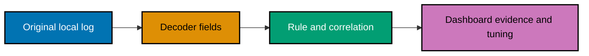

> **Offline by default.** The lab validates original XML, JSON, and NDJSON fixtures in `code/`; it has no
> network client and accepts no endpoint or host argument.

## Run the local verifier

```sh
# => Validates only original local fixtures, parser expectations, correlations, and tuning evidence.
python3 code/detection_lab.py verify
```

The verifier reads `local_decoder.xml`, `local_rules.xml`, `dashboard-plan.json`, and synthetic events.
It is deliberately not a Wazuh deployment tool. An owner may translate and test the ideas with the
Wazuh ruleset test utility in an isolated lab after reviewing every change.

## Concepts

The progression covers telemetry and decoder design (`co-01`–`co-05`), signatures and Wazuh rule
authoring (`co-06`–`co-08`), threshold/correlation and false-positive engineering (`co-09`–`co-13`),
ATT&CK and detection-as-code testing (`co-14`–`co-17`), dashboards and triage (`co-18`–`co-21`), then
lifecycle, measurement, and safe emulation replay (`co-22`–`co-24`).

## Examples by Level

### Beginner (Examples 1–26)

- [Example 1: Frame a Detection Hypothesis](/en/learn/courses/detection-engineering-and-siem-operations/learning/beginner#example-1-frame-a-detection-hypothesis)
- [Example 2: Inspect Invented Source Telemetry](/en/learn/courses/detection-engineering-and-siem-operations/learning/beginner#example-2-inspect-invented-source-telemetry)
- [Example 3: Trace a Local Ingestion Boundary](/en/learn/courses/detection-engineering-and-siem-operations/learning/beginner#example-3-trace-a-local-ingestion-boundary)
- [Example 4: Identify Decoder Input and Output](/en/learn/courses/detection-engineering-and-siem-operations/learning/beginner#example-4-identify-decoder-input-and-output)
- [Example 5: Write a Narrow Prematch](/en/learn/courses/detection-engineering-and-siem-operations/learning/beginner#example-5-write-a-narrow-prematch)
- [Example 6: Extract a Synthetic User Field](/en/learn/courses/detection-engineering-and-siem-operations/learning/beginner#example-6-extract-a-synthetic-user-field)
- [Example 7: Extract a Documentation Address](/en/learn/courses/detection-engineering-and-siem-operations/learning/beginner#example-7-extract-a-documentation-address)
- [Example 8: Normalize an Action Value](/en/learn/courses/detection-engineering-and-siem-operations/learning/beginner#example-8-normalize-an-action-value)
- [Example 9: Review Decoder Field Order](/en/learn/courses/detection-engineering-and-siem-operations/learning/beginner#example-9-review-decoder-field-order)
- [Example 10: Reject a Nonmatching Fixture](/en/learn/courses/detection-engineering-and-siem-operations/learning/beginner#example-10-reject-a-nonmatching-fixture)
- [Example 11: Compare Signature and Baseline Signals](/en/learn/courses/detection-engineering-and-siem-operations/learning/beginner#example-11-compare-signature-and-baseline-signals)
- [Example 12: State a Rule's Evidence Requirement](/en/learn/courses/detection-engineering-and-siem-operations/learning/beginner#example-12-state-a-rules-evidence-requirement)
- [Example 13: Set a Reviewable Rule Level](/en/learn/courses/detection-engineering-and-siem-operations/learning/beginner#example-13-set-a-reviewable-rule-level)
- [Example 14: Match a Failed Auth Action](/en/learn/courses/detection-engineering-and-siem-operations/learning/beginner#example-14-match-a-failed-auth-action)
- [Example 15: Keep a Benign Success Quiet](/en/learn/courses/detection-engineering-and-siem-operations/learning/beginner#example-15-keep-a-benign-success-quiet)
- [Example 16: Attach an ATT&CK Teaching Label](/en/learn/courses/detection-engineering-and-siem-operations/learning/beginner#example-16-attach-an-attck-teaching-label)
- [Example 17: Read a Local Rule Group](/en/learn/courses/detection-engineering-and-siem-operations/learning/beginner#example-17-read-a-local-rule-group)
- [Example 18: Test Parsed Fields Offline](/en/learn/courses/detection-engineering-and-siem-operations/learning/beginner#example-18-test-parsed-fields-offline)
- [Example 19: Separate Rule Text from Rule Behavior](/en/learn/courses/detection-engineering-and-siem-operations/learning/beginner#example-19-separate-rule-text-from-rule-behavior)
- [Example 20: Record a Detection Change](/en/learn/courses/detection-engineering-and-siem-operations/learning/beginner#example-20-record-a-detection-change)
- [Example 21: Classify a Triage Prompt](/en/learn/courses/detection-engineering-and-siem-operations/learning/beginner#example-21-classify-a-triage-prompt)
- [Example 22: Add Asset Context Locally](/en/learn/courses/detection-engineering-and-siem-operations/learning/beginner#example-22-add-asset-context-locally)
- [Example 23: Inspect a Dashboard Panel Plan](/en/learn/courses/detection-engineering-and-siem-operations/learning/beginner#example-23-inspect-a-dashboard-panel-plan)
- [Example 24: Count Local Alert Severities](/en/learn/courses/detection-engineering-and-siem-operations/learning/beginner#example-24-count-local-alert-severities)
- [Example 25: Name a False-Positive Assumption](/en/learn/courses/detection-engineering-and-siem-operations/learning/beginner#example-25-name-a-false-positive-assumption)
- [Example 26: Verify the Decoder-to-Alert Path](/en/learn/courses/detection-engineering-and-siem-operations/learning/beginner#example-26-verify-the-decoder-to-alert-path)

### Intermediate (Examples 27–52)

- [Example 27: Model a Failed-Then-Success Chain](/en/learn/courses/detection-engineering-and-siem-operations/learning/intermediate#example-27-model-a-failed-then-success-chain)
- [Example 28: Set a Bounded Frequency Window](/en/learn/courses/detection-engineering-and-siem-operations/learning/intermediate#example-28-set-a-bounded-frequency-window)
- [Example 29: Correlate on One Synthetic Source](/en/learn/courses/detection-engineering-and-siem-operations/learning/intermediate#example-29-correlate-on-one-synthetic-source)
- [Example 30: Explain Correlation Severity](/en/learn/courses/detection-engineering-and-siem-operations/learning/intermediate#example-30-explain-correlation-severity)
- [Example 31: Measure a Baseline False-Positive Rate](/en/learn/courses/detection-engineering-and-siem-operations/learning/intermediate#example-31-measure-a-baseline-false-positive-rate)
- [Example 32: Tune a Failed-Login Threshold](/en/learn/courses/detection-engineering-and-siem-operations/learning/intermediate#example-32-tune-a-failed-login-threshold)
- [Example 33: Keep a Known Service Exception Narrow](/en/learn/courses/detection-engineering-and-siem-operations/learning/intermediate#example-33-keep-a-known-service-exception-narrow)
- [Example 34: Check a True Positive Survives Tuning](/en/learn/courses/detection-engineering-and-siem-operations/learning/intermediate#example-34-check-a-true-positive-survives-tuning)
- [Example 35: Compare Noise Before and After](/en/learn/courses/detection-engineering-and-siem-operations/learning/intermediate#example-35-compare-noise-before-and-after)
- [Example 36: Separate Allow-List from Blind Spot](/en/learn/courses/detection-engineering-and-siem-operations/learning/intermediate#example-36-separate-allow-list-from-blind-spot)
- [Example 37: Test a Correlation Fixture](/en/learn/courses/detection-engineering-and-siem-operations/learning/intermediate#example-37-test-a-correlation-fixture)
- [Example 38: Add a Second Local Source Shape](/en/learn/courses/detection-engineering-and-siem-operations/learning/intermediate#example-38-add-a-second-local-source-shape)
- [Example 39: Join Decoder Evidence Deliberately](/en/learn/courses/detection-engineering-and-siem-operations/learning/intermediate#example-39-join-decoder-evidence-deliberately)
- [Example 40: Detect a Repeated Action](/en/learn/courses/detection-engineering-and-siem-operations/learning/intermediate#example-40-detect-a-repeated-action)
- [Example 41: Identify a Long-Window Trade-Off](/en/learn/courses/detection-engineering-and-siem-operations/learning/intermediate#example-41-identify-a-long-window-trade-off)
- [Example 42: Verify a Rule Does Not Overfire](/en/learn/courses/detection-engineering-and-siem-operations/learning/intermediate#example-42-verify-a-rule-does-not-overfire)
- [Example 43: Add Asset Criticality to Triage](/en/learn/courses/detection-engineering-and-siem-operations/learning/intermediate#example-43-add-asset-criticality-to-triage)
- [Example 44: Enrich an Alert Without Contacting a Feed](/en/learn/courses/detection-engineering-and-siem-operations/learning/intermediate#example-44-enrich-an-alert-without-contacting-a-feed)
- [Example 45: Route a Reviewable Alert](/en/learn/courses/detection-engineering-and-siem-operations/learning/intermediate#example-45-route-a-reviewable-alert)
- [Example 46: Escalate a Fictional True Positive](/en/learn/courses/detection-engineering-and-siem-operations/learning/intermediate#example-46-escalate-a-fictional-true-positive)
- [Example 47: Build a Severity Trend Panel](/en/learn/courses/detection-engineering-and-siem-operations/learning/intermediate#example-47-build-a-severity-trend-panel)
- [Example 48: Build a Tuning Review Panel](/en/learn/courses/detection-engineering-and-siem-operations/learning/intermediate#example-48-build-a-tuning-review-panel)
- [Example 49: Map Rule Coverage to a Technique](/en/learn/courses/detection-engineering-and-siem-operations/learning/intermediate#example-49-map-rule-coverage-to-a-technique)
- [Example 50: Find a Coverage Gap in the Lab](/en/learn/courses/detection-engineering-and-siem-operations/learning/intermediate#example-50-find-a-coverage-gap-in-the-lab)
- [Example 51: Review a Rule Change for Noise Risk](/en/learn/courses/detection-engineering-and-siem-operations/learning/intermediate#example-51-review-a-rule-change-for-noise-risk)
- [Example 52: Verify Correlation and Tuning Together](/en/learn/courses/detection-engineering-and-siem-operations/learning/intermediate#example-52-verify-correlation-and-tuning-together)

### Advanced (Examples 53–78)

- [Example 53: Build a Decoder Regression Test](/en/learn/courses/detection-engineering-and-siem-operations/learning/advanced#example-53-build-a-decoder-regression-test)
- [Example 54: Fail a Broken Field Contract](/en/learn/courses/detection-engineering-and-siem-operations/learning/advanced#example-54-fail-a-broken-field-contract)
- [Example 55: Version a Local Detection Pack](/en/learn/courses/detection-engineering-and-siem-operations/learning/advanced#example-55-version-a-local-detection-pack)
- [Example 56: Review a Decoder for Ambiguity](/en/learn/courses/detection-engineering-and-siem-operations/learning/advanced#example-56-review-a-decoder-for-ambiguity)
- [Example 57: Retire a Stale Teaching Rule](/en/learn/courses/detection-engineering-and-siem-operations/learning/advanced#example-57-retire-a-stale-teaching-rule)
- [Example 58: Measure Alert Volume](/en/learn/courses/detection-engineering-and-siem-operations/learning/advanced#example-58-measure-alert-volume)
- [Example 59: Measure False-Positive Ratio](/en/learn/courses/detection-engineering-and-siem-operations/learning/advanced#example-59-measure-false-positive-ratio)
- [Example 60: Measure Time-to-Review](/en/learn/courses/detection-engineering-and-siem-operations/learning/advanced#example-60-measure-time-to-review)
- [Example 61: Design an ATT&CK Coverage Panel](/en/learn/courses/detection-engineering-and-siem-operations/learning/advanced#example-61-design-an-attck-coverage-panel)
- [Example 62: Tune from Dashboard Evidence](/en/learn/courses/detection-engineering-and-siem-operations/learning/advanced#example-62-tune-from-dashboard-evidence)
- [Example 63: Preserve a True-Positive Fixture](/en/learn/courses/detection-engineering-and-siem-operations/learning/advanced#example-63-preserve-a-true-positive-fixture)
- [Example 64: Record a False-Negative Question](/en/learn/courses/detection-engineering-and-siem-operations/learning/advanced#example-64-record-a-false-negative-question)
- [Example 65: Replay an Authorized Synthetic Sequence](/en/learn/courses/detection-engineering-and-siem-operations/learning/advanced#example-65-replay-an-authorized-synthetic-sequence)
- [Example 66: Correlate a Low-and-Slow Fixture](/en/learn/courses/detection-engineering-and-siem-operations/learning/advanced#example-66-correlate-a-low-and-slow-fixture)
- [Example 67: Separate Detection from Response Authority](/en/learn/courses/detection-engineering-and-siem-operations/learning/advanced#example-67-separate-detection-from-response-authority)
- [Example 68: Triage with Evidence and Uncertainty](/en/learn/courses/detection-engineering-and-siem-operations/learning/advanced#example-68-triage-with-evidence-and-uncertainty)
- [Example 69: Check Dashboard Field Ownership](/en/learn/courses/detection-engineering-and-siem-operations/learning/advanced#example-69-check-dashboard-field-ownership)
- [Example 70: Compare a Tight and Loose Threshold](/en/learn/courses/detection-engineering-and-siem-operations/learning/advanced#example-70-compare-a-tight-and-loose-threshold)
- [Example 71: Require a Tuning Rationale](/en/learn/courses/detection-engineering-and-siem-operations/learning/advanced#example-71-require-a-tuning-rationale)
- [Example 72: Check Detection-Pack Completeness](/en/learn/courses/detection-engineering-and-siem-operations/learning/advanced#example-72-check-detection-pack-completeness)
- [Example 73: Map a Change to a Test](/en/learn/courses/detection-engineering-and-siem-operations/learning/advanced#example-73-map-a-change-to-a-test)
- [Example 74: Re-run the Local Verification Gate](/en/learn/courses/detection-engineering-and-siem-operations/learning/advanced#example-74-re-run-the-local-verification-gate)
- [Example 75: Prepare a Specialist Handoff](/en/learn/courses/detection-engineering-and-siem-operations/learning/advanced#example-75-prepare-a-specialist-handoff)
- [Example 76: Explain a Dashboard Review Cadence](/en/learn/courses/detection-engineering-and-siem-operations/learning/advanced#example-76-explain-a-dashboard-review-cadence)
- [Example 77: Audit a Local Detection Decision](/en/learn/courses/detection-engineering-and-siem-operations/learning/advanced#example-77-audit-a-local-detection-decision)
- [Example 78: Complete the Detection-Pack Capstone](/en/learn/courses/detection-engineering-and-siem-operations/learning/advanced#example-78-complete-the-detection-pack-capstone)

## Lab map



The pipeline is local and one-way: parse an invented line, evaluate an invented rule, inspect the
result, and document a tuning choice. Nothing in this course interrogates a host or initiates traffic.
