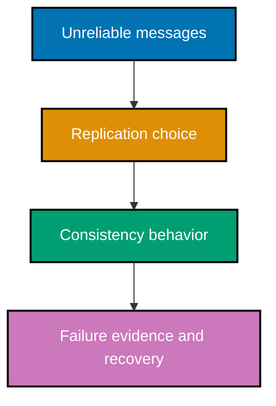

## Mental model

Distributed systems make local certainty unavailable. A node observes messages late, twice, out of
order, or not at all; it cannot know whether another node is slow or dead. A correct design names
the guarantee it needs, the failure it tolerates, and the mechanism that provides only that guarantee.

## Example progression

- **Beginner** (Examples 1–26): partial failure, causal clocks, consistency, CAP/PACELC, and
  delivery semantics.
- **Intermediate** (Examples 27–54): replication, quorums, failure detection, replicated state,
  coordination, and leases.
- **Advanced** (Examples 55–85): Raft, Paxos, CRDTs, Byzantine tolerance, sagas, fencing, clock
  uncertainty, and when to use a coordination service.

## Safety boundary

The examples use deterministic, intentionally simplified local models. They illuminate a safety or
liveness property but do not account for storage corruption, kernel scheduling, network partitions
in a real topology, upgrade compatibility, or the operational requirements of a production cluster.

Next: [Beginner Examples](./beginner.md) →
