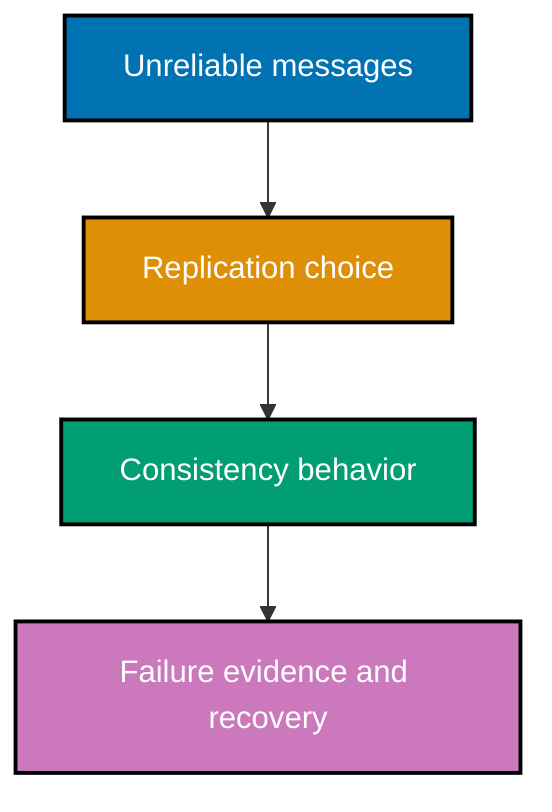

## Mental model

Distributed systems make local certainty unavailable. A node observes messages late, twice, out of
order, or not at all; it cannot know whether another node is slow or dead. A correct design names
the guarantee it needs, the failure it tolerates, and the mechanism that provides only that guarantee.

## Example progression

- **Beginner** (Examples 1–26): partial failure, causal clocks, consistency, CAP/PACELC, and
  delivery semantics.
- **Intermediate** (Examples 27–54): replication, quorums, failure detection, replicated state,
  coordination, and leases.
- **Advanced** (Examples 55–85): Raft, Paxos, CRDTs, Byzantine tolerance, sagas, fencing, clock
  uncertainty, and when to use a coordination service.

## Examples by Level

### Beginner (Examples 1–26)

- [Example 1: Make the fallacies concrete](/en/learn/courses/distributed-systems/learning/beginner#example-1-make-the-fallacies-concrete)
- [Example 2: Drop a message](/en/learn/courses/distributed-systems/learning/beginner#example-2-drop-a-message)
- [Example 3: Delay and reorder messages](/en/learn/courses/distributed-systems/learning/beginner#example-3-delay-and-reorder-messages)
- [Example 4: Show two clocks disagree](/en/learn/courses/distributed-systems/learning/beginner#example-4-show-two-clocks-disagree)
- [Example 5: Increment a Lamport clock](/en/learn/courses/distributed-systems/learning/beginner#example-5-increment-a-lamport-clock)
- [Example 6: Advance a Lamport clock on receive](/en/learn/courses/distributed-systems/learning/beginner#example-6-advance-a-lamport-clock-on-receive)
- [Example 7: Break a Lamport tie deterministically](/en/learn/courses/distributed-systems/learning/beginner#example-7-break-a-lamport-tie-deterministically)
- [Example 8: Represent happened-before edges](/en/learn/courses/distributed-systems/learning/beginner#example-8-represent-happened-before-edges)
- [Example 9: Expose scalar-clock false ordering](/en/learn/courses/distributed-systems/learning/beginner#example-9-expose-scalar-clock-false-ordering)
- [Example 10: Increment a vector clock locally](/en/learn/courses/distributed-systems/learning/beginner#example-10-increment-a-vector-clock-locally)
- [Example 11: Merge vector clocks on receive](/en/learn/courses/distributed-systems/learning/beginner#example-11-merge-vector-clocks-on-receive)
- [Example 12: Detect causal dominance](/en/learn/courses/distributed-systems/learning/beginner#example-12-detect-causal-dominance)
- [Example 13: Detect concurrent vectors](/en/learn/courses/distributed-systems/learning/beginner#example-13-detect-concurrent-vectors)
- [Example 14: Compare scalar and vector evidence](/en/learn/courses/distributed-systems/learning/beginner#example-14-compare-scalar-and-vector-evidence)
- [Example 15: Buffer for causal delivery](/en/learn/courses/distributed-systems/learning/beginner#example-15-buffer-for-causal-delivery)
- [Example 16: Model a strongly consistent register](/en/learn/courses/distributed-systems/learning/beginner#example-16-model-a-strongly-consistent-register)
- [Example 17: Model eventual convergence](/en/learn/courses/distributed-systems/learning/beginner#example-17-model-eventual-convergence)
- [Example 18: Preserve a causal read](/en/learn/courses/distributed-systems/learning/beginner#example-18-preserve-a-causal-read)
- [Example 19: Choose under a partition](/en/learn/courses/distributed-systems/learning/beginner#example-19-choose-under-a-partition)
- [Example 20: Make CP unavailability explicit](/en/learn/courses/distributed-systems/learning/beginner#example-20-make-cp-unavailability-explicit)
- [Example 21: Make AP divergence explicit](/en/learn/courses/distributed-systems/learning/beginner#example-21-make-ap-divergence-explicit)
- [Example 22: State the PACELC normal-path trade-off](/en/learn/courses/distributed-systems/learning/beginner#example-22-state-the-pacelc-normal-path-trade-off)
- [Example 23: Deliver at most once](/en/learn/courses/distributed-systems/learning/beginner#example-23-deliver-at-most-once)
- [Example 24: Deliver at least once](/en/learn/courses/distributed-systems/learning/beginner#example-24-deliver-at-least-once)
- [Example 25: Deduplicate at the receiver](/en/learn/courses/distributed-systems/learning/beginner#example-25-deduplicate-at-the-receiver)
- [Example 26: Achieve an effectively-once effect](/en/learn/courses/distributed-systems/learning/beginner#example-26-achieve-an-effectively-once-effect)

### Intermediate (Examples 27–54)

- [Example 27: Replicate from a leader](/en/learn/courses/distributed-systems/learning/intermediate#example-27-replicate-from-a-leader)
- [Example 28: Read from a lagging follower](/en/learn/courses/distributed-systems/learning/intermediate#example-28-read-from-a-lagging-follower)
- [Example 29: Write to reachable leaderless replicas](/en/learn/courses/distributed-systems/learning/intermediate#example-29-write-to-reachable-leaderless-replicas)
- [Example 30: Require a write quorum](/en/learn/courses/distributed-systems/learning/intermediate#example-30-require-a-write-quorum)
- [Example 31: Require a read quorum](/en/learn/courses/distributed-systems/learning/intermediate#example-31-require-a-read-quorum)
- [Example 32: Use quorum intersection](/en/learn/courses/distributed-systems/learning/intermediate#example-32-use-quorum-intersection)
- [Example 33: Demonstrate a sub-quorum stale read](/en/learn/courses/distributed-systems/learning/intermediate#example-33-demonstrate-a-sub-quorum-stale-read)
- [Example 34: Repair during a read](/en/learn/courses/distributed-systems/learning/intermediate#example-34-repair-during-a-read)
- [Example 35: Resolve by last writer wins](/en/learn/courses/distributed-systems/learning/intermediate#example-35-resolve-by-last-writer-wins)
- [Example 36: Flag a version-vector conflict](/en/learn/courses/distributed-systems/learning/intermediate#example-36-flag-a-version-vector-conflict)
- [Example 37: Suspect after missed heartbeats](/en/learn/courses/distributed-systems/learning/intermediate#example-37-suspect-after-missed-heartbeats)
- [Example 38: Tune a timeout too aggressively](/en/learn/courses/distributed-systems/learning/intermediate#example-38-tune-a-timeout-too-aggressively)
- [Example 39: Raise phi as silence grows](/en/learn/courses/distributed-systems/learning/intermediate#example-39-raise-phi-as-silence-grows)
- [Example 40: Apply the same command log](/en/learn/courses/distributed-systems/learning/intermediate#example-40-apply-the-same-command-log)
- [Example 41: Check deterministic replay](/en/learn/courses/distributed-systems/learning/intermediate#example-41-check-deterministic-replay)
- [Example 42: Keep a command log append-only](/en/learn/courses/distributed-systems/learning/intermediate#example-42-keep-a-command-log-append-only)
- [Example 43: Replicate a leader log](/en/learn/courses/distributed-systems/learning/intermediate#example-43-replicate-a-leader-log)
- [Example 44: Reject a log-matching violation](/en/learn/courses/distributed-systems/learning/intermediate#example-44-reject-a-log-matching-violation)
- [Example 45: Illustrate FLP non-termination](/en/learn/courses/distributed-systems/learning/intermediate#example-45-illustrate-flp-non-termination)
- [Example 46: Add a failure-detector assumption](/en/learn/courses/distributed-systems/learning/intermediate#example-46-add-a-failure-detector-assumption)
- [Example 47: Coordinate a two-phase commit](/en/learn/courses/distributed-systems/learning/intermediate#example-47-coordinate-a-two-phase-commit)
- [Example 48: Show two-phase commit blocking](/en/learn/courses/distributed-systems/learning/intermediate#example-48-show-two-phase-commit-blocking)
- [Example 49: State three-phase commit's assumption](/en/learn/courses/distributed-systems/learning/intermediate#example-49-state-three-phase-commits-assumption)
- [Example 50: Elect by highest live identifier](/en/learn/courses/distributed-systems/learning/intermediate#example-50-elect-by-highest-live-identifier)
- [Example 51: Circulate a ring election token](/en/learn/courses/distributed-systems/learning/intermediate#example-51-circulate-a-ring-election-token)
- [Example 52: Reconcile with anti-entropy](/en/learn/courses/distributed-systems/learning/intermediate#example-52-reconcile-with-anti-entropy)
- [Example 53: Spread a rumor epidemically](/en/learn/courses/distributed-systems/learning/intermediate#example-53-spread-a-rumor-epidemically)
- [Example 54: Expire a lease](/en/learn/courses/distributed-systems/learning/intermediate#example-54-expire-a-lease)

### Advanced (Examples 55–85)

- [Example 55: Start a Raft election](/en/learn/courses/distributed-systems/learning/advanced#example-55-start-a-raft-election)
- [Example 56: Advance a Raft term](/en/learn/courses/distributed-systems/learning/advanced#example-56-advance-a-raft-term)
- [Example 57: Require a majority vote](/en/learn/courses/distributed-systems/learning/advanced#example-57-require-a-majority-vote)
- [Example 58: Keep followers quiet with heartbeats](/en/learn/courses/distributed-systems/learning/advanced#example-58-keep-followers-quiet-with-heartbeats)
- [Example 59: Append through a leader](/en/learn/courses/distributed-systems/learning/advanced#example-59-append-through-a-leader)
- [Example 60: Commit after majority storage](/en/learn/courses/distributed-systems/learning/advanced#example-60-commit-after-majority-storage)
- [Example 61: Reject a conflicting Raft append](/en/learn/courses/distributed-systems/learning/advanced#example-61-reject-a-conflicting-raft-append)
- [Example 62: Step down for a higher term](/en/learn/courses/distributed-systems/learning/advanced#example-62-step-down-for-a-higher-term)
- [Example 63: Re-elect on the majority side](/en/learn/courses/distributed-systems/learning/advanced#example-63-re-elect-on-the-majority-side)
- [Example 64: Converge logs after healing](/en/learn/courses/distributed-systems/learning/advanced#example-64-converge-logs-after-healing)
- [Example 65: Promise in Paxos phase one](/en/learn/courses/distributed-systems/learning/advanced#example-65-promise-in-paxos-phase-one)
- [Example 66: Accept in Paxos phase two](/en/learn/courses/distributed-systems/learning/advanced#example-66-accept-in-paxos-phase-two)
- [Example 67: Preserve one chosen Paxos value](/en/learn/courses/distributed-systems/learning/advanced#example-67-preserve-one-chosen-paxos-value)
- [Example 68: State consensus safety](/en/learn/courses/distributed-systems/learning/advanced#example-68-state-consensus-safety)
- [Example 69: Merge a CRDT G-counter](/en/learn/courses/distributed-systems/learning/advanced#example-69-merge-a-crdt-g-counter)
- [Example 70: Compose a PN-counter](/en/learn/courses/distributed-systems/learning/advanced#example-70-compose-a-pn-counter)
- [Example 71: Merge a grow-only set](/en/learn/courses/distributed-systems/learning/advanced#example-71-merge-a-grow-only-set)
- [Example 72: Merge an LWW register](/en/learn/courses/distributed-systems/learning/advanced#example-72-merge-an-lww-register)
- [Example 73: Check strong eventual convergence](/en/learn/courses/distributed-systems/learning/advanced#example-73-check-strong-eventual-convergence)
- [Example 74: Size for Byzantine faults](/en/learn/courses/distributed-systems/learning/advanced#example-74-size-for-byzantine-faults)
- [Example 75: Walk PBFT vote phases](/en/learn/courses/distributed-systems/learning/advanced#example-75-walk-pbft-vote-phases)
- [Example 76: Compensate a saga step](/en/learn/courses/distributed-systems/learning/advanced#example-76-compensate-a-saga-step)
- [Example 77: Expose split brain](/en/learn/courses/distributed-systems/learning/advanced#example-77-expose-split-brain)
- [Example 78: Reject a stale fencing token](/en/learn/courses/distributed-systems/learning/advanced#example-78-reject-a-stale-fencing-token)
- [Example 79: Wait out clock uncertainty](/en/learn/courses/distributed-systems/learning/advanced#example-79-wait-out-clock-uncertainty)
- [Example 80: Compare AP and CP modes](/en/learn/courses/distributed-systems/learning/advanced#example-80-compare-ap-and-cp-modes)
- [Example 81: Describe an ephemeral lock](/en/learn/courses/distributed-systems/learning/advanced#example-81-describe-an-ephemeral-lock)
- [Example 82: Elect from sequential nodes](/en/learn/courses/distributed-systems/learning/advanced#example-82-elect-from-sequential-nodes)
- [Example 83: Register under a lease](/en/learn/courses/distributed-systems/learning/advanced#example-83-register-under-a-lease)
- [Example 84: Guard configuration with compare-and-swap](/en/learn/courses/distributed-systems/learning/advanced#example-84-guard-configuration-with-compare-and-swap)
- [Example 85: Choose a coordination-service boundary](/en/learn/courses/distributed-systems/learning/advanced#example-85-choose-a-coordination-service-boundary)

## Safety boundary

The examples use deterministic, intentionally simplified local models. They illuminate a safety or
liveness property but do not account for storage corruption, kernel scheduling, network partitions
in a real topology, upgrade compatibility, or the operational requirements of a production cluster.

Next: [Beginner Examples](./beginner.md) →
