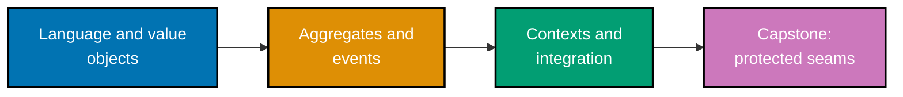

## How to use these examples

Each example has five parts: a concrete context, a complete annotated Python artifact, observable
output or assertion, a design consequence, and a concise takeaway. Run any artifact with
`python3 example.py` from its directory. The first tier establishes a shared domain vocabulary;
the second protects transactional boundaries; the final tier prevents one context's model from
infecting another.

## Concepts

- **Language and model**: ubiquitous language, domain model, entities, value objects, and
  side-effect-free behaviour.
- **Tactical design**: aggregates, roots, consistency boundaries, invariants, small aggregates,
  references by identity, repositories, factories, services, specifications, and application
  services.
- **Strategic design**: bounded contexts, context maps, shared kernels, customer/supplier and
  conformist relationships, subdomains, and ACLs.
- **Event and query patterns**: domain events, event decoupling, CQRS, and event sourcing are
  introduced as bounded tools rather than universal defaults.

Start with [Beginner Examples](./beginner.md).
