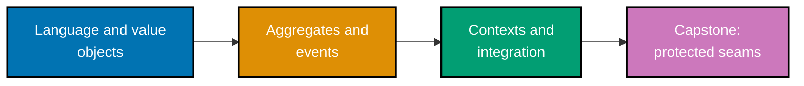

## How to use these examples

Each example has five parts: a concrete context, a complete annotated Python artifact, observable
output or assertion, a design consequence, and a concise takeaway. Run any artifact with
`python3 example.py` from its directory. The first tier establishes a shared domain vocabulary;
the second protects transactional boundaries; the final tier prevents one context's model from
infecting another.

## Concepts

- **Language and model**: ubiquitous language, domain model, entities, value objects, and
  side-effect-free behaviour.
- **Tactical design**: aggregates, roots, consistency boundaries, invariants, small aggregates,
  references by identity, repositories, factories, services, specifications, and application
  services.
- **Strategic design**: bounded contexts, context maps, shared kernels, customer/supplier and
  conformist relationships, subdomains, and ACLs.
- **Event and query patterns**: domain events, event decoupling, CQRS, and event sourcing are
  introduced as bounded tools rather than universal defaults.

Start with [Beginner Examples](./beginner.md).

## Examples by Level

### Beginner (Examples 1–28)

- [Worked Example 1: Ubiquitous language rename](/en/learn/courses/domain-driven-design/learning/beginner#worked-example-1-ubiquitous-language-rename)
- [Worked Example 2: Model versus table](/en/learn/courses/domain-driven-design/learning/beginner#worked-example-2-model-versus-table)
- [Worked Example 3: Value-object equality](/en/learn/courses/domain-driven-design/learning/beginner#worked-example-3-value-object-equality)
- [Worked Example 4: Value-object immutability](/en/learn/courses/domain-driven-design/learning/beginner#worked-example-4-value-object-immutability)
- [Worked Example 5: Value-object behaviour](/en/learn/courses/domain-driven-design/learning/beginner#worked-example-5-value-object-behaviour)
- [Worked Example 6: Entity identity](/en/learn/courses/domain-driven-design/learning/beginner#worked-example-6-entity-identity)
- [Worked Example 7: Entity mutable state](/en/learn/courses/domain-driven-design/learning/beginner#worked-example-7-entity-mutable-state)
- [Worked Example 8: Entity versus value choice](/en/learn/courses/domain-driven-design/learning/beginner#worked-example-8-entity-versus-value-choice)
- [Worked Example 9: Constructor invariant](/en/learn/courses/domain-driven-design/learning/beginner#worked-example-9-constructor-invariant)
- [Worked Example 10: Guard method invariant](/en/learn/courses/domain-driven-design/learning/beginner#worked-example-10-guard-method-invariant)
- [Worked Example 11: Full money value object](/en/learn/courses/domain-driven-design/learning/beginner#worked-example-11-full-money-value-object)
- [Worked Example 12: Email value object](/en/learn/courses/domain-driven-design/learning/beginner#worked-example-12-email-value-object)
- [Worked Example 13: Quantity value object](/en/learn/courses/domain-driven-design/learning/beginner#worked-example-13-quantity-value-object)
- [Worked Example 14: Date range value object](/en/learn/courses/domain-driven-design/learning/beginner#worked-example-14-date-range-value-object)
- [Worked Example 15: Value-object composition](/en/learn/courses/domain-driven-design/learning/beginner#worked-example-15-value-object-composition)
- [Worked Example 16: Entity lifecycle](/en/learn/courses/domain-driven-design/learning/beginner#worked-example-16-entity-lifecycle)
- [Worked Example 17: Self-validating entity](/en/learn/courses/domain-driven-design/learning/beginner#worked-example-17-self-validating-entity)
- [Worked Example 18: Ubiquitous-language test](/en/learn/courses/domain-driven-design/learning/beginner#worked-example-18-ubiquitous-language-test)
- [Worked Example 19: No primitive obsession](/en/learn/courses/domain-driven-design/learning/beginner#worked-example-19-no-primitive-obsession)
- [Worked Example 20: Simple factory](/en/learn/courses/domain-driven-design/learning/beginner#worked-example-20-simple-factory)
- [Worked Example 21: Aggregate factory](/en/learn/courses/domain-driven-design/learning/beginner#worked-example-21-aggregate-factory)
- [Worked Example 22: Domain-service transfer](/en/learn/courses/domain-driven-design/learning/beginner#worked-example-22-domain-service-transfer)
- [Worked Example 23: Domain service versus method](/en/learn/courses/domain-driven-design/learning/beginner#worked-example-23-domain-service-versus-method)
- [Worked Example 24: Anemic versus rich model](/en/learn/courses/domain-driven-design/learning/beginner#worked-example-24-anemic-versus-rich-model)
- [Worked Example 25: Fix an anemic model](/en/learn/courses/domain-driven-design/learning/beginner#worked-example-25-fix-an-anemic-model)
- [Worked Example 26: Specification predicate](/en/learn/courses/domain-driven-design/learning/beginner#worked-example-26-specification-predicate)
- [Worked Example 27: Specification composition](/en/learn/courses/domain-driven-design/learning/beginner#worked-example-27-specification-composition)
- [Worked Example 28: Specification selection](/en/learn/courses/domain-driven-design/learning/beginner#worked-example-28-specification-selection)

### Intermediate (Examples 29–56)

- [Worked Example 29: Aggregate boundary](/en/learn/courses/domain-driven-design/learning/intermediate#worked-example-29-aggregate-boundary)
- [Worked Example 30: Aggregate-root access](/en/learn/courses/domain-driven-design/learning/intermediate#worked-example-30-aggregate-root-access)
- [Worked Example 31: Cross-child invariant](/en/learn/courses/domain-driven-design/learning/intermediate#worked-example-31-cross-child-invariant)
- [Worked Example 32: Consistency boundary](/en/learn/courses/domain-driven-design/learning/intermediate#worked-example-32-consistency-boundary)
- [Worked Example 33: Small aggregate](/en/learn/courses/domain-driven-design/learning/intermediate#worked-example-33-small-aggregate)
- [Worked Example 34: Reference by identity](/en/learn/courses/domain-driven-design/learning/intermediate#worked-example-34-reference-by-identity)
- [Worked Example 35: One aggregate per transaction](/en/learn/courses/domain-driven-design/learning/intermediate#worked-example-35-one-aggregate-per-transaction)
- [Worked Example 36: Eventual consistency](/en/learn/courses/domain-driven-design/learning/intermediate#worked-example-36-eventual-consistency)
- [Worked Example 37: Repository port](/en/learn/courses/domain-driven-design/learning/intermediate#worked-example-37-repository-port)
- [Worked Example 38: In-memory adapter](/en/learn/courses/domain-driven-design/learning/intermediate#worked-example-38-in-memory-adapter)
- [Worked Example 39: One repository per root](/en/learn/courses/domain-driven-design/learning/intermediate#worked-example-39-one-repository-per-root)
- [Worked Example 40: Collection illusion](/en/learn/courses/domain-driven-design/learning/intermediate#worked-example-40-collection-illusion)
- [Worked Example 41: Swap adapter](/en/learn/courses/domain-driven-design/learning/intermediate#worked-example-41-swap-adapter)
- [Worked Example 42: Reconstitute aggregate](/en/learn/courses/domain-driven-design/learning/intermediate#worked-example-42-reconstitute-aggregate)
- [Worked Example 43: Define a domain event](/en/learn/courses/domain-driven-design/learning/intermediate#worked-example-43-define-a-domain-event)
- [Worked Example 44: Raise a domain event](/en/learn/courses/domain-driven-design/learning/intermediate#worked-example-44-raise-a-domain-event)
- [Worked Example 45: Event payload](/en/learn/courses/domain-driven-design/learning/intermediate#worked-example-45-event-payload)
- [Worked Example 46: Event dispatch](/en/learn/courses/domain-driven-design/learning/intermediate#worked-example-46-event-dispatch)
- [Worked Example 47: Event decoupling](/en/learn/courses/domain-driven-design/learning/intermediate#worked-example-47-event-decoupling)
- [Worked Example 48: Cross-aggregate event](/en/learn/courses/domain-driven-design/learning/intermediate#worked-example-48-cross-aggregate-event)
- [Worked Example 49: Application service](/en/learn/courses/domain-driven-design/learning/intermediate#worked-example-49-application-service)
- [Worked Example 50: Application versus domain service](/en/learn/courses/domain-driven-design/learning/intermediate#worked-example-50-application-versus-domain-service)
- [Worked Example 51: Layered architecture](/en/learn/courses/domain-driven-design/learning/intermediate#worked-example-51-layered-architecture)
- [Worked Example 52: Domain core isolation](/en/learn/courses/domain-driven-design/learning/intermediate#worked-example-52-domain-core-isolation)
- [Worked Example 53: Root invariant guard](/en/learn/courses/domain-driven-design/learning/intermediate#worked-example-53-root-invariant-guard)
- [Worked Example 54: Collection encapsulation](/en/learn/courses/domain-driven-design/learning/intermediate#worked-example-54-collection-encapsulation)
- [Worked Example 55: Factory versus constructor](/en/learn/courses/domain-driven-design/learning/intermediate#worked-example-55-factory-versus-constructor)
- [Worked Example 56: Specification in repository](/en/learn/courses/domain-driven-design/learning/intermediate#worked-example-56-specification-in-repository)

### Advanced (Examples 57–80)

- [Worked Example 57: Define bounded contexts](/en/learn/courses/domain-driven-design/learning/advanced#worked-example-57-define-bounded-contexts)
- [Worked Example 58: Model drift](/en/learn/courses/domain-driven-design/learning/advanced#worked-example-58-model-drift)
- [Worked Example 59: Context-map relationships](/en/learn/courses/domain-driven-design/learning/advanced#worked-example-59-context-map-relationships)
- [Worked Example 60: Anti-corruption layer](/en/learn/courses/domain-driven-design/learning/advanced#worked-example-60-anti-corruption-layer)
- [Worked Example 61: ACL isolation](/en/learn/courses/domain-driven-design/learning/advanced#worked-example-61-acl-isolation)
- [Worked Example 62: ACL translation map](/en/learn/courses/domain-driven-design/learning/advanced#worked-example-62-acl-translation-map)
- [Worked Example 63: Shared kernel](/en/learn/courses/domain-driven-design/learning/advanced#worked-example-63-shared-kernel)
- [Worked Example 64: Customer/supplier](/en/learn/courses/domain-driven-design/learning/advanced#worked-example-64-customersupplier)
- [Worked Example 65: Conformist](/en/learn/courses/domain-driven-design/learning/advanced#worked-example-65-conformist)
- [Worked Example 66: Open host and published language](/en/learn/courses/domain-driven-design/learning/advanced#worked-example-66-open-host-and-published-language)
- [Worked Example 67: Core subdomain](/en/learn/courses/domain-driven-design/learning/advanced#worked-example-67-core-subdomain)
- [Worked Example 68: Supporting and generic subdomains](/en/learn/courses/domain-driven-design/learning/advanced#worked-example-68-supporting-and-generic-subdomains)
- [Worked Example 69: Core-domain focus](/en/learn/courses/domain-driven-design/learning/advanced#worked-example-69-core-domain-focus)
- [Worked Example 70: When DDD is overkill](/en/learn/courses/domain-driven-design/learning/advanced#worked-example-70-when-ddd-is-overkill)
- [Worked Example 71: CQRS read/write split](/en/learn/courses/domain-driven-design/learning/advanced#worked-example-71-cqrs-readwrite-split)
- [Worked Example 72: CQRS read model](/en/learn/courses/domain-driven-design/learning/advanced#worked-example-72-cqrs-read-model)
- [Worked Example 73: Event-sourcing append](/en/learn/courses/domain-driven-design/learning/advanced#worked-example-73-event-sourcing-append)
- [Worked Example 74: Event-sourcing replay](/en/learn/courses/domain-driven-design/learning/advanced#worked-example-74-event-sourcing-replay)
- [Worked Example 75: Event-sourcing audit](/en/learn/courses/domain-driven-design/learning/advanced#worked-example-75-event-sourcing-audit)
- [Worked Example 76: Domain to integration event](/en/learn/courses/domain-driven-design/learning/advanced#worked-example-76-domain-to-integration-event)
- [Worked Example 77: Aggregate across contexts](/en/learn/courses/domain-driven-design/learning/advanced#worked-example-77-aggregate-across-contexts)
- [Worked Example 78: Language per context](/en/learn/courses/domain-driven-design/learning/advanced#worked-example-78-language-per-context)
- [Worked Example 79: Composite business specification](/en/learn/courses/domain-driven-design/learning/advanced#worked-example-79-composite-business-specification)
- [Worked Example 80: Full DDD model](/en/learn/courses/domain-driven-design/learning/advanced#worked-example-80-full-ddd-model)
