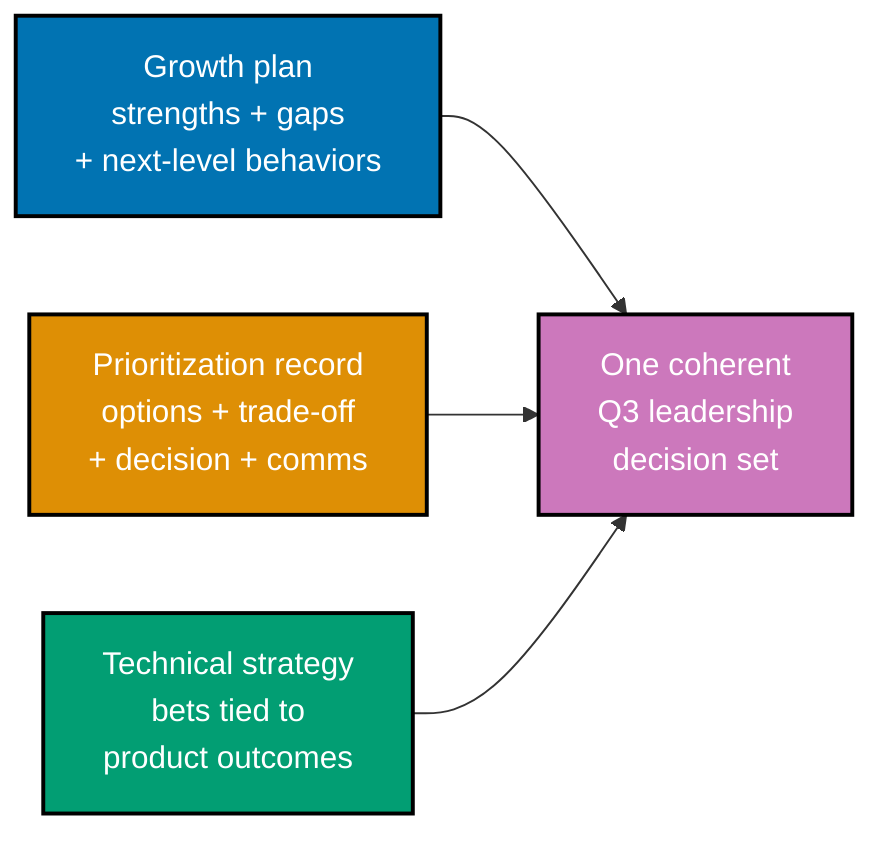

## Goal

Produce a **leadership decision set** a new engineering lead would actually use: a growth plan for
a report, a team prioritization/trade-off decision record, and a one-page technical strategy linking
team goals to product outcomes -- demonstrating leadership through structured judgment and clear
communication. This is a leadership `‡` design/decision capstone: no code, zero runnable files.
Every technique combined here was already taught, individually, somewhere in the Beginner,
Intermediate, or Advanced scenarios of this topic; this capstone is where they run together for
**Everline**'s Platform team, at a larger and more realistic scale than any single worked scenario.

The three artifacts pick up six months after Worked Scenario 1 introduced Noor Rahman's first 1:1,
one quarter after Worked Scenario 10's Q2 prioritization record, and one quarter after Worked
Scenario 20's technical strategy -- so this capstone is Priya Kapoor's Q3 leadership decision set for
the same team this whole topic has followed, not three artifacts invented from a blank slate.

_Diagram: the capstone's three independent artifacts -- a growth plan, a prioritization record, and
a technical strategy -- each written to this topic's own worked-scenario standard, then checked
against each other for one coherent Q3 picture of the Platform team._

## Concepts exercised

- [x] a growth plan (strengths/gaps/next-level behaviors + a feedback frame) (co-03, co-05, co-06)
- [x] a prioritization/trade-off decision record (co-10, co-14)
- [x] a one-page technical strategy tying team goals to product outcomes (co-12, co-13)
- [x] explicit, communicated trade-offs (co-14)
- [x] leading through influence (co-17)

The full artifacts live in **[`growth-plan.md`](./growth-plan.md)**, **[`prioritization.md`](./prioritization.md)**,
and **[`strategy.md`](./strategy.md)** -- three separate, cohesive documents, each usable on its
own. Nothing on this page repeats their content; this page narrates the build order and cites the
concepts each step exercises.

## Step 1: Growth plan

_exercises co-03, co-05, co-06_

**[`growth-plan.md`](./growth-plan.md)** opens with Noor's strengths and SBI-framed feedback
(co-03), names gaps mapped to specific competency-ladder rungs (co-06), and states the next-level
behaviors Noor will practice (co-05) -- following the exact pattern Worked Scenarios 2, 5, and 6
already demonstrated individually, now written for one real report at capstone depth.

**Verify**: every gap in the growth plan cites the ladder's own stated behavior text, and the
feedback frame names a specific situation, behavior, and impact -- not a vague trait, the same
standard Worked Scenarios 3, 5, and 6 already demonstrated.

## Step 2: Prioritization decision record

_exercises co-10, co-14, co-17_

**[`prioritization.md`](./prioritization.md)** states the Platform team's Q3 competing demands, the
options considered, the trade-off made, the decision, and the communication plan (co-10, co-14) --
including an influence-without-authority component (co-17) for coordinating the cross-team piece of
the decision with Morgan's Data Science team, the same technique Worked Scenario 18 already
demonstrated on a narrower ask.

**Verify**: the record states options, trade-off, decision, and communication plan, and the
cross-team coordination names a shared incentive rather than an appeal to authority -- the same
standard Worked Scenarios 10 and 18 already demonstrated, applied here to Q3's real decision.

## Step 3: Technical strategy

_exercises co-12, co-13, co-14_

**[`strategy.md`](./strategy.md)** ties each named technical bet to a stated product outcome and
states its trade-off explicitly (co-12, co-14), and represents the roadmap-partnership angle with
product for the bet that touches product's own commitments (co-13) -- extending Worked Scenario 20's
three bets with the Q3 evidence Worked Scenario 21's reorg prediction and Worked Scenario 22's
DORA-guardrail design have since produced.

**Verify**: every bet traces to a stated product outcome with an explicit trade-off, and the
roadmap-partnership section states a specific cost or risk being represented to product, not a vague
objection -- the same standard Worked Scenarios 15 and 20 already demonstrated.

## Acceptance criteria

- The growth plan is actionable and specific: every gap maps to an observable, ladder-quoted
  behavior, and the feedback frame is SBI-shaped.
- The prioritization record makes trade-offs explicit and communicable: options, trade-off,
  decision, and communication plan (including the cross-team influence component) are all present.
- The strategy ties team work to product outcomes: every bet names its outcome and its trade-off.
- **Coherence**: no artifact contradicts another -- the growth plan's assignment for Noor supports
  a bet the strategy names, and the prioritization record's Q3 decision doesn't silently undo a
  commitment the strategy or an earlier worked scenario already made.
- The set reads as usable leadership judgment: a reader could hand all three documents to a real
  engineering leader and they would know exactly what to do next, for whom, and why.

## Done bar

This capstone produces the stated artifact set: a growth plan built on SBI feedback and
ladder-quoted next-level behaviors (co-03, co-05, co-06), a prioritization/trade-off decision record
with an explicit communication and cross-team influence plan (co-10, co-14, co-17), and a one-page
technical strategy tying every bet to a product outcome and its trade-off (co-12, co-13, co-14) --
three documents, one internally coherent Q3 picture of Everline's Platform team, combining every
technique this topic taught. Every claim used here traces back to a concept or worked scenario
already established earlier in this topic; no new fact was needed to write this page or the three
documents it links.

---

← Previous: [Advanced Scenarios](../advanced.md) · Next: [Drilling](../../drilling/overview.md) →
