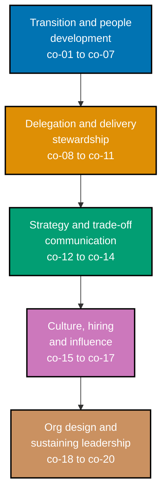

This topic is a **leadership no-code sub-mode** (`‡`) Annotated-concept topic: zero code, zero
runnable files. Every worked scenario produces a **leadership decision artifact** -- a 1:1 agenda,
an SBI feedback note, a growth plan, a prioritization record, a technical strategy doc -- the kind
of document a real engineering leader could act on directly, without a follow-up meeting to explain
what it means. Most scenarios follow one running, entirely fictional company, **Everline**, a
B2B SaaS analytics platform for e-commerce operators, and one running manager, **Priya Kapoor**,
who leads Everline's Platform team, so the same team, the same reports, and the same decisions keep
compounding into one internally consistent picture instead of twenty-seven disconnected snippets.
Every name, quote, number, and "the team said" line in this topic is an **illustrative, constructed
example** written to teach a technique -- never a claim about a real company, a real manager, or a
real conversation.

## Prerequisites

- **Prior topics**: [topic 30 Software Engineering Practices](/en/c/learn/fundamentally-strong/software-engineer/software-engineering-practices)
  (the engineering practices a lead upholds and scales across a team), [topic 32 Software Product
  Engineering](/en/c/learn/fundamentally-strong/software-engineer/software-product-engineering)
  (strategy, prioritization, and product partnership), and [topic 9 Project
  Management](/en/c/learn/fundamentally-strong/software-engineer/project-management) (planning,
  delivery, and the team process a manager stewards). This topic assumes those are practiced and
  teaches _who owns, decides, unblocks, and grows_ -- not the delivery mechanics or product-strategy
  mechanics those topics already cover.
- **Tools & environment**: no toolchain -- a Markdown editor for the leadership artifacts (a 1:1
  agenda, a growth plan, a strategy doc, a prioritization/decision record); Neovim or VSCode is
  fine, nothing more is required. No paid account, no code, no runtime to install -- every
  deliverable in this topic is a decision document, not a program.
- **Assumed knowledge**: mature engineering practices (topic 30); business/product judgment
  (topic 32); project planning and delivery process (topic 9).

## Why this exists -- the big idea

The best IC gets promoted and keeps solving every problem personally -- and the team stalls behind
the new bottleneck. Management is a different job, not senior-IC-plus: the scarce resource stops
being your own code and becomes other people's judgment. The one idea worth keeping if you forget
everything else: **you now succeed _through_ others** -- your output is the team's decisions,
growth, and trust, measured in outcomes you no longer type yourself.

**Cross-cutting big ideas**: `correctness-vs-pragmatism` -- leadership is disciplined compromise;
every prioritization, estimate, and staffing call trades an ideal for what actually ships and holds
(co-10, co-20). `mechanism-vs-policy` -- a lead sets policy (what matters, who decides) and
delegates the mechanism (how it gets done) rather than owning every _how_ personally (co-08,
co-17).

## When NOT to reach for this

- **Autonomy vs alignment**: over-direct and you get a team of hands, not minds; under-direct and
  effort scatters. Set the _what_ and _why_, delegate the _how_ -- the lever is context, not
  control (co-08, co-04).
- **Delivery vs growth**: shipping this quarter competes with growing people who ship every
  quarter. Over-index on delivery and you spend the team down, stopping the learning that compounds
  into next year's velocity (co-05, co-19).
- **Metrics vs trust**: DORA keys and velocity focus a team, but any metric is gameable, and
  measuring people as throughput corrodes the trust that actually drives delivery. Metrics inform
  judgment; they don't replace it (co-11).
- **Manager vs maker**: staying hands-on keeps technical credibility, but coding on the critical
  path makes you the bottleneck you were promoted to remove -- the hardest habit to unlearn (co-20).

## Why these mechanisms -- lineage

Engineering management professionalized as teams outgrew the heroic-lead/player-coach model that
doesn't scale past a handful of people. Command-and-control factory management (Taylorism) treated
engineers as interchangeable throughput and failed on creative knowledge work; the pure
servant-leader reaction under-set direction and drifted. Modern practice converged on a middle --
set clear direction with high trust, measure outcomes not activity, grow people as the durable
asset -- evidenced by DORA's research base and codified in Fournier's _The Manager's Path_ and
Larson's systems view. Conway's Law made org design a technical concern (team boundaries become
system boundaries), which is why this topic pairs with [topic 32 Software Product
Engineering](/en/c/learn/fundamentally-strong/software-engineer/software-product-engineering)
(what to build) and [topic 9 Project Management](/en/c/learn/fundamentally-strong/software-engineer/project-management)
(deliver it).

## How verification works in this topic

This topic has no interpreter to run: a growth plan, a prioritization record, and a technical
strategy doc are not executable, so there is no command that confirms one is "correct" the way a
test suite confirms a function's return value. Verification here means checking an **observable
property of the written artifact itself** against a stated rule -- something you can point at on
the page, not a vague description of what a "good" decision should feel like. A few concrete
examples that recur throughout this topic:

- A **1:1 agenda** is verifiable: do the report's items appear before the manager's items? Read the
  ordering, check.
- **SBI feedback** is verifiable: does it name a specific situation, an observed behavior, and a
  stated impact, or does it collapse into vague praise or trait language? Read the note, check.
- A **delegation brief** is verifiable: could a stranger reach the same decision from the brief
  alone, without asking the manager anything else? Read it as if you were that stranger, check.

Every concept below and every worked scenario that follows states its own **Verify it** / **Verify**
rule in exactly this observable-property form -- read the artifact, check the stated property, done.

_Diagram: the five concept clusters this topic teaches, in reading order -- from the personal
transition into management and growing individual reports, through delegating and stewarding team
delivery, through setting strategy and communicating its trade-offs, through the culture and
influence work that operates across the whole org, to the org-design and self-sustaining habits
that make a leader's impact outlast any single decision they make personally._

## Concepts

Every worked scenario in this topic's follow-up pages cites the `co-NN` concept it exercises --
this section is the 1:1 reference those citations point back to. Read it in order: each cluster
builds on the one before it, from the personal transition into management through to the
org-design lever that shapes system boundaries.

### co-01 · IC-to-Manager Transition

The job changes from personally solving problems to building a team that solves them; the new
scarce resource is other people's judgment, not the manager's own output. A newly promoted manager
who keeps reaching for the same problem-solving reflex that earned the promotion recreates the
bottleneck the promotion was meant to remove.

**Why it matters**: promotion criteria reward the exact behavior -- personally shipping, personally
fixing -- that the new role requires the person to stop doing; nobody automatically un-learns a
reflex that has been rewarded for years just because their title changed.

**Verify it**: a transition is going well if the manager's own hands-on problem-solving throughput
shrinks over time while the team's collective throughput grows -- the reverse trend (the manager
still the busiest problem-solver on the team, months in) is a warning sign worth naming directly.

### co-02 · One-on-Ones

A recurring, report-owned 1:1 is the primary channel for coaching, feedback, and trust-building,
not a status-update meeting. The report sets the agenda; the manager's own items, if any, come
last, after the report's own topics are exhausted.

**Why it matters**: a 1:1 that the manager runs top-to-bottom as a status check trains the report to
show up with nothing to say, quietly closing off the one recurring channel built specifically for
things too sensitive, too half-formed, or too personal for a group meeting.

**Verify it**: a 1:1 agenda is report-owned if the report's items are listed first, and any manager
item is explicitly added only after the report's own agenda is exhausted.

### co-03 · Feedback (SBI)

Timely, specific, behavior-focused feedback -- Situation-Behavior-Impact -- both reinforcing and
corrective, changes future behavior better than vague praise or criticism. SBI stays anchored to
one observable event rather than a general character judgment.

**Why it matters**: "great job" and "you need to be more careful" both fail to tell a report which
specific action to repeat or stop -- SBI names the exact situation and behavior so the report can
act on the feedback the next time a similar situation arises.

**Verify it**: feedback is SBI-shaped if it names a specific situation, an observed (not inferred)
behavior, and a stated impact -- and stays free of trait or character language ("you're careless")
in favor of behavior language ("in this specific situation, this specific thing happened").

### co-04 · Coaching vs Directing

A coaching stance -- asking questions that draw out the report's own judgment -- grows capability,
while directing (telling) only resolves the immediate problem. Neither is universally right; the
skill is choosing deliberately, not defaulting to whichever is faster in the moment.

**Why it matters**: directing every stuck moment produces a report who can execute but never learns
to diagnose -- the next stuck moment still needs the manager, because the manager, not the report,
did the actual thinking the first ten times.

**Verify it**: a response is coaching-shaped if it supplies only questions, no answer -- check by
scanning it for any sentence that states what the report should do; if one exists, it's directing,
not coaching.

### co-05 · Growth Plans

A written growth plan turns vague potential into named strengths, gaps, and observable next-level
behaviors a report can act on. It is a living document a manager and report both refer back to, not
a once-a-year form filled out for a performance cycle.

**Why it matters**: "you have a lot of potential" gives a report nothing to actually do differently
on Monday morning -- a growth plan names the specific behavior that would demonstrate the next
level, so effort has somewhere concrete to go.

**Verify it**: every gap named in a growth plan maps to an observable behavior tied to a
competency-ladder rung, not a vague trait ("needs more leadership presence").

### co-06 · Competency Ladders

A competency/career ladder defines the observable behaviors that distinguish each level, making
promotion and feedback conversations concrete instead of political. It is the shared reference both
a growth plan and a calibration conversation point back to.

**Why it matters**: without a ladder, "ready for promotion" collapses into whoever advocates loudest
or whoever the manager happens to like best -- the ladder gives both manager and report a shared,
checkable text to argue from.

**Verify it**: a ladder mapping is well-formed if each cited rung quotes the ladder's own stated
behavior text, not a manager's subjective paraphrase of what they think that behavior means.

### co-07 · Performance Management and Calibration

Regular, honest performance assessment, including calibration across reports and managers, catches
drift early and makes promotion and PIP (performance-improvement-plan) decisions defensible. Waiting
for an annual cycle to surface a long-known problem is a failure of the process, not of the report.

**Why it matters**: a report who hears "you're doing great" for eleven months and then a surprise
low rating in month twelve has been failed by their manager, not by their own performance -- the
information existed the whole time and simply wasn't surfaced.

**Verify it**: a calibration note is well-formed if every comparative claim between two reports
cites ladder-level evidence for each, not a relative popularity impression ("I like both, X edges
out Y").

### co-08 · Delegation and Context Setting

A manager delegates the how while retaining the what and why, giving enough context that a report
can make the same call the manager would. Delegation without context produces either paralysis
(the report waits to be told) or a wrong call made confidently.

**Why it matters**: a task handed off with only an instruction ("do X") and no reasoning leaves the
report unable to adapt when reality doesn't match the instruction exactly -- context is what lets
someone else make a good call on the edge case the manager never anticipated.

**Verify it**: a delegation brief is well-formed if a reader unfamiliar with the manager's own
private reasoning could still reach the same decision from the brief alone -- the what and why are
present in writing, the how is deliberately absent.

### co-09 · Team Delivery Stewardship

A manager stewards delivery at the team level -- unblocking, sequencing, and managing work-in-
progress across people -- distinct from the task-level estimation and planning mechanics a single
project uses. This is a continuous triage habit, not a single planning-meeting event.

**Why it matters**: individually well-planned tasks can still collectively stall if nobody is
watching for cross-person blockers -- stewardship is the layer above individual task tracking that
catches "three people are each separately blocked on the same thing" before it costs a sprint.

**Verify it**: a WIP (work-in-progress) triage is well-formed if every blocked item has a named
owner -- the manager personally, a delegate, or an escalation target -- and a one-sentence reason
for that specific ownership choice.

### co-10 · Prioritization Under Competing Demands

Deciding which of several competing team-level demands (new work, tech debt, incidents, staffing
asks) gets done now is a leadership call that produces an explicit, defensible trade-off record, not
a silent, undocumented judgment call.

**Why it matters**: an undocumented prioritization decision gets re-litigated every time someone
disagrees with it in hindsight -- a written record of the options and the stated trade-off turns a
one-time argument into a decision the team can hold and revisit deliberately later.

**Verify it**: a prioritization record is well-formed if it states the options considered, the
trade-off made, the decision, and who gets told what, and when.

### co-11 · DORA Metrics as an Outcome Lens

DORA's software delivery metrics (originally four keys -- deployment frequency, lead time for
changes, change-failure rate, time-to-restore -- now formalized by Google Cloud's DORA program as a
five-metric throughput/instability model) give a manager an outcome lens on team health, used as a
diagnostic, not a per-person scorecard.

**Why it matters**: a team that ships fast but breaks often, or ships safely but glacially, needs a
different intervention in each case -- a single vague "let's move faster" mandate can't tell those
two teams apart, but the metrics can.

**Verify it**: a DORA-based diagnostic recommendation is well-formed if it ties directly to the
specific metric that is weak, not a generic "let's move faster" applied regardless of which number
is actually the problem.

### co-12 · Technical Strategy

A manager sets a technical direction -- what bets, in what order -- that ties engineering work to
business/product outcomes, distinct from any single project's delivery plan. A strategy names a
small number of deliberate bets, not an exhaustive backlog.

**Why it matters**: a team without a stated technical strategy still makes technical bets constantly
-- through a hundred small unstated defaults -- except nobody chose them deliberately, and nobody
can explain later why the system looks the way it does.

**Verify it**: a technical strategy is well-formed if every named bet traces to a stated
product/business outcome and states its trade-off explicitly, rather than presenting itself as
obviously, uncontroversially correct.

### co-13 · Roadmap Partnership with Product

An engineering lead partners with product on the roadmap, representing technical cost, risk, and
dependency so trade-offs are made jointly rather than imposed by either side. This is a peer
negotiation, not engineering simply estimating whatever product already decided.

**Why it matters**: a roadmap set by product alone, with engineering only estimating afterward,
regularly commits to timelines that ignore real technical risk -- and a roadmap engineering
resists purely on "it's hard" terms, with no product-outcome framing, regularly loses the argument
even when the underlying concern was valid.

**Verify it**: a roadmap negotiation memo is well-formed if it states the specific cost, risk, or
dependency being represented, not a vague, unquantified technical objection.

### co-14 · Communicating Trade-offs

A leader makes a trade-off and its cost legible to stakeholders, so the decision is understood and
ownable instead of read as arbitrary. A trade-off communicated well survives someone disagreeing
with it; a trade-off communicated poorly reads as a unilateral decision handed down.

**Why it matters**: stakeholders who don't understand what a decision cost tend to assume it cost
nothing -- and then react with surprise or anger the first time that hidden cost becomes visible on
its own.

**Verify it**: a trade-off communication is well-formed if a reader who wasn't in the room can state,
in their own words, what was gained and what was given up.

### co-15 · Culture and Psychological Safety

A team's culture -- its norms, what's rewarded, what's safe to say -- determines whether problems
surface early or hide until they're expensive. Psychological safety is specifically about the cost
of speaking up, not about being nice or avoiding disagreement.

**Why it matters**: a team where raising a concern carries social risk will have that concern raised
later, once it is harder and more expensive to fix -- the information existed earlier; only the
willingness to say it out loud was missing.

**Verify it**: a culture diagnosis is well-formed if it names the specific safety failure (why the
information didn't surface sooner) and one concrete, recurring mechanism that would change it -- not
a one-time announcement or exhortation.

### co-16 · Hiring Intuition

Evaluating candidates for the traits a role actually needs, with structured, evidence-based scoring
over pedigree or gut feel, is a distinct, learnable leadership skill. "Intuition" here means a
trained, evidence-anchored judgment, not an unexamined first impression.

**Why it matters**: an unstructured "I liked them" evaluation is dominated by whichever interviewer
talks last and by similarity bias (favoring candidates who resemble the interviewer) -- a structured
score sheet anchored to observed evidence resists both failure modes.

**Verify it**: a hiring evaluation is well-formed if every score cites specific observed evidence
from the interview loop, not an unstructured overall impression.

### co-17 · Influence Without Authority

A lead moves peers and stakeholders who don't report to them through trust, credibility, and shared
incentive, not positional power. This is the primary lever available whenever the person a manager
needs to move sits outside their own reporting line.

**Why it matters**: appealing to authority or urgency ("I need this because I said so" or "this is
urgent for me") gives a peer with no reporting obligation no actual reason to prioritize the ask --
naming a shared incentive gives them one.

**Verify it**: an influence plan is well-formed if it names a shared incentive the other party
already holds, not an appeal to the requester's own authority or urgency.

### co-18 · Org Design and Team Topology

Conway's Law makes team boundaries a technical decision: team communication structure shapes system
structure, so org design is an engineering lever, not purely an HR or headcount exercise.

**Why it matters**: a reorg that redraws team boundaries without anticipating the resulting
system-boundary shift regularly produces exactly the coupling or duplication the reorg was
supposed to fix, just relocated to a new seam.

**Verify it**: a team-topology memo is well-formed if it names Conway's Law explicitly and predicts
the resulting system-boundary shift, not merely the org-chart shift.

### co-19 · Learning as a Team Norm

A manager makes continuous learning, not just delivery, an explicit recurring team habit,
converting individual growth into an organizational capability that outlasts any single person's
tenure, including the manager's own.

**Why it matters**: a team whose learning depends entirely on one enthusiastic founding member's
personal initiative loses that capability the moment that person leaves -- a norm survives people;
a habit that depends on one person does not.

**Verify it**: a learning-ritual design is well-formed if it names the specific mechanism (not just
a stated intention) that keeps the ritual running once its original owner leaves.

### co-20 · Manager vs Maker Tension

Staying hands-on keeps technical credibility, but coding or otherwise working on the critical path
recreates the bottleneck the manager was promoted to remove. This tension never fully resolves --
it has to be actively managed, on a recurring basis, not solved once.

**Why it matters**: a manager who quietly becomes the team's fastest problem-solver again, one
"just this once" at a time, ends up personally load-bearing for delivery -- exactly the failure
mode the IC-to-manager transition (co-01) was supposed to prevent.

**Verify it**: a manager-vs-maker diagnosis is well-formed if it names the specific bottleneck the
manager's own hands-on work created, and one concrete habit change to correct it.

## Scenarios by Level

Twenty-seven worked scenarios, grouped Beginner / Intermediate / Advanced, each producing a
leadership decision artifact and citing the `co-NN` it exercises. Most scenarios follow
**Everline**, a fictional B2B SaaS analytics company, and its Platform team manager, **Priya
Kapoor**, so the same team and the same reports keep compounding into a larger, internally
consistent picture, the same way a real engineering leader's decisions build on each other. Every
artifact below also lives, standalone, under `learning/artifacts/`.

### Beginner (Scenarios 1-9)

- [Worked Scenario 1: First 1:1 Agenda](/en/c/learn/fundamentally-strong/software-engineer/engineering-management/learning/beginner#worked-scenario-1-first-1-1-agenda)
- [Worked Scenario 2: SBI Feedback, Positive](/en/c/learn/fundamentally-strong/software-engineer/engineering-management/learning/beginner#worked-scenario-2-sbi-feedback-positive)
- [Worked Scenario 3: SBI Feedback, Corrective](/en/c/learn/fundamentally-strong/software-engineer/engineering-management/learning/beginner#worked-scenario-3-sbi-feedback-corrective)
- [Worked Scenario 4: Coaching Question vs Answer](/en/c/learn/fundamentally-strong/software-engineer/engineering-management/learning/beginner#worked-scenario-4-coaching-question-vs-answer)
- [Worked Scenario 5: Growth Plan Artifact](/en/c/learn/fundamentally-strong/software-engineer/engineering-management/learning/beginner#worked-scenario-5-growth-plan-artifact)
- [Worked Scenario 6: Ladder Behavior Mapping](/en/c/learn/fundamentally-strong/software-engineer/engineering-management/learning/beginner#worked-scenario-6-ladder-behavior-mapping)
- [Worked Scenario 7: Delegation Context Brief](/en/c/learn/fundamentally-strong/software-engineer/engineering-management/learning/beginner#worked-scenario-7-delegation-context-brief)
- [Worked Scenario 8: IC-to-Manager Mindset Memo](/en/c/learn/fundamentally-strong/software-engineer/engineering-management/learning/beginner#worked-scenario-8-ic-to-manager-mindset-memo)
- [Worked Scenario 9: Manager-vs-Maker Catch](/en/c/learn/fundamentally-strong/software-engineer/engineering-management/learning/beginner#worked-scenario-9-manager-vs-maker-catch)

### Intermediate (Scenarios 10-19)

- [Worked Scenario 10: Prioritization Decision Record](/en/c/learn/fundamentally-strong/software-engineer/engineering-management/learning/intermediate#worked-scenario-10-prioritization-decision-record)
- [Worked Scenario 11: DORA Diagnostic Memo](/en/c/learn/fundamentally-strong/software-engineer/engineering-management/learning/intermediate#worked-scenario-11-dora-diagnostic-memo)
- [Worked Scenario 12: WIP Unblock Triage](/en/c/learn/fundamentally-strong/software-engineer/engineering-management/learning/intermediate#worked-scenario-12-wip-unblock-triage)
- [Worked Scenario 13: Performance Calibration Note](/en/c/learn/fundamentally-strong/software-engineer/engineering-management/learning/intermediate#worked-scenario-13-performance-calibration-note)
- [Worked Scenario 14: Difficult Feedback Conversation Script](/en/c/learn/fundamentally-strong/software-engineer/engineering-management/learning/intermediate#worked-scenario-14-difficult-feedback-conversation-script)
- [Worked Scenario 15: Roadmap Trade-off Memo](/en/c/learn/fundamentally-strong/software-engineer/engineering-management/learning/intermediate#worked-scenario-15-roadmap-trade-off-memo)
- [Worked Scenario 16: Psychological Safety Incident](/en/c/learn/fundamentally-strong/software-engineer/engineering-management/learning/intermediate#worked-scenario-16-psychological-safety-incident)
- [Worked Scenario 17: Hiring Debrief, Structured](/en/c/learn/fundamentally-strong/software-engineer/engineering-management/learning/intermediate#worked-scenario-17-hiring-debrief-structured)
- [Worked Scenario 18: Influence-Without-Authority Plan](/en/c/learn/fundamentally-strong/software-engineer/engineering-management/learning/intermediate#worked-scenario-18-influence-without-authority-plan)
- [Worked Scenario 19: Team Culture Norm Change](/en/c/learn/fundamentally-strong/software-engineer/engineering-management/learning/intermediate#worked-scenario-19-team-culture-norm-change)

### Advanced (Scenarios 20-27)

- [Worked Scenario 20: Technical Strategy Doc](/en/c/learn/fundamentally-strong/software-engineer/engineering-management/learning/advanced#worked-scenario-20-technical-strategy-doc)
- [Worked Scenario 21: Conway's Law Reorg Memo](/en/c/learn/fundamentally-strong/software-engineer/engineering-management/learning/advanced#worked-scenario-21-conways-law-reorg-memo)
- [Worked Scenario 22: DORA-Goodhart Guardrail](/en/c/learn/fundamentally-strong/software-engineer/engineering-management/learning/advanced#worked-scenario-22-dora-goodhart-guardrail)
- [Worked Scenario 23: Autonomy-vs-Alignment Calibration](/en/c/learn/fundamentally-strong/software-engineer/engineering-management/learning/advanced#worked-scenario-23-autonomy-vs-alignment-calibration)
- [Worked Scenario 24: Delivery-vs-Growth Trade-off Memo](/en/c/learn/fundamentally-strong/software-engineer/engineering-management/learning/advanced#worked-scenario-24-delivery-vs-growth-trade-off-memo)
- [Worked Scenario 25: Learning-Norm Institutionalization](/en/c/learn/fundamentally-strong/software-engineer/engineering-management/learning/advanced#worked-scenario-25-learning-norm-institutionalization)
- [Worked Scenario 26: Succession-and-Delegation Plan](/en/c/learn/fundamentally-strong/software-engineer/engineering-management/learning/advanced#worked-scenario-26-succession-and-delegation-plan)
- [Worked Scenario 27: Full Leadership Decision Set](/en/c/learn/fundamentally-strong/software-engineer/engineering-management/learning/advanced#worked-scenario-27-full-leadership-decision-set)

---

← Previous: [32 · Software Product Engineering
Drilling](../../software-product-engineering/drilling/overview.md) · Next: [Beginner
Scenarios](./beginner.md) →
