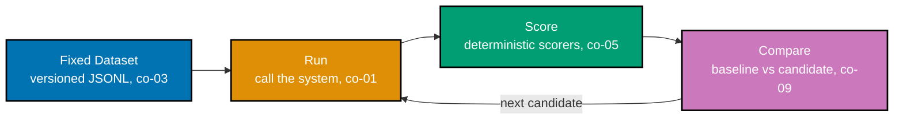

> A captioned diagram of the four-stage loop this whole course teaches -- dataset, run, score,
> compare -- exercises co-03 and co-09.

_Figure: the fixed-dataset loop. The Dataset stage never changes between runs -- that fixed-ness is
what makes the Compare stage's output meaningful, rather than an unfalsifiable "it feels better."_

**Verify**: all four stages appear, in this exact order, and the loop closes from Compare back into
Run (not back into Dataset) -- because the candidate change is what iterates, not the fixed cases.

**Key takeaway**: the dataset sits still while everything downstream of it iterates -- that is the
entire structural difference between a gate and a vibe check.

**Why It Matters**: every worked example in Theme A builds toward this one shape. Once a learner can
place any single technique on this loop (a scorer belongs in Score, a baseline belongs in Compare), the
rest of this course is filling in each stage's detail, not learning a new shape. A team that skips
straight to writing scorers without first fixing this loop's Dataset stage ends up unable to answer
whether a later Compare result reflects a real change or just different input cases -- the diagram is
worth drawing precisely because that failure mode is otherwise invisible until it has already happened.
