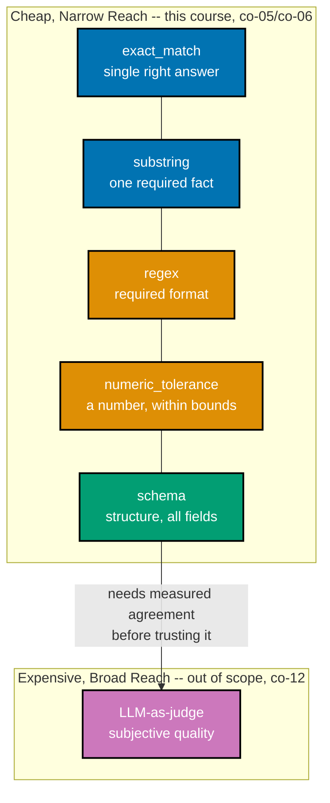

> A captioned diagram placing every scorer type from Theme B on a cost-vs-reach axis -- exercises
> co-05, co-06, and co-12.

_Figure: every scorer this course teaches sits in the cheap, narrow-reach cluster -- each checks one
mechanical property (an exact string, a fact's presence, a format, a number, a structure). The one
node outside that cluster, an LLM-as-judge, is where `evaluating-ai-systems-in-depth` picks up._

**Verify**: all five deterministic scorers (`exact_match`, `substring`, `regex`, `numeric_tolerance`,
`schema`) sit inside the "Cheap, Narrow Reach" cluster; exactly one node (`LLM-as-judge`) sits outside
it, connected by an edge naming the exact precondition (measured agreement) this course does not teach.

**Key takeaway**: "cheap" and "narrow reach" travel together for every scorer in this course --
none of them can judge tone, faithfulness, or any other subjective quality, and none of them cost
anything beyond ordinary CPU time to run.

**Why It Matters**: a team that reaches for an LLM-as-judge before exhausting the cheap cluster is
usually solving the wrong problem at the wrong cost -- most real breakage (a missing field, a wrong
number, a malformed ticket ID) is exactly what the cheap cluster already catches, per ex-17's measured
5x catch-rate advantage.
