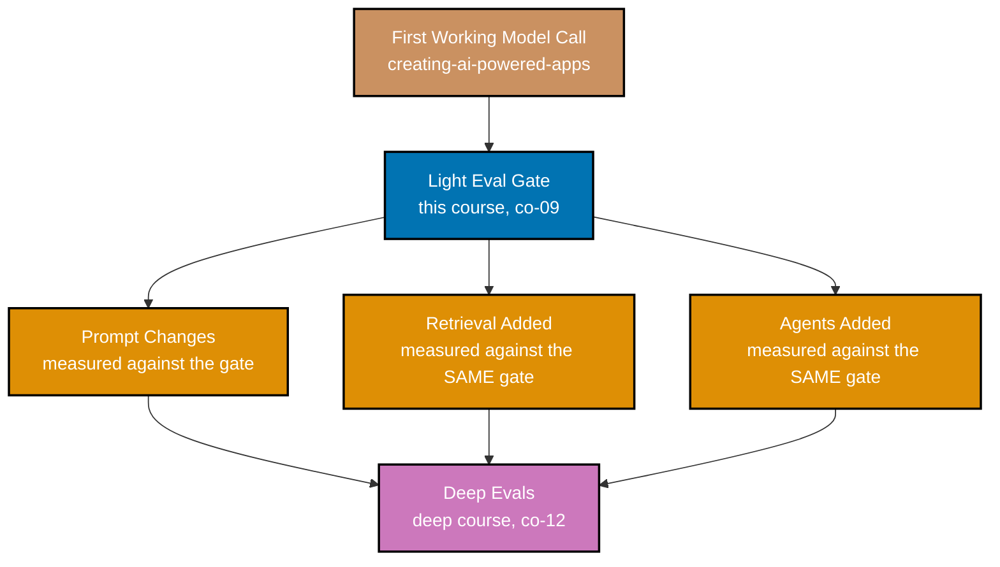

> A captioned diagram placing this course's light eval gate relative to prompt changes, retrieval,
> and agents -- exercises co-09 and co-12.

_Figure: the gate installs immediately after the first working model call and BEFORE every
structural addition that follows -- prompt changes, retrieval, and agents each get measured against
the same fixed gate, so their individual effect is attributable (ex-42). Deep evals pick up only
once one of those additions needs error analysis or subjective scoring._

**Verify**: the gate node sits between the first model call and all three downstream additions
(prompt changes, retrieval, agents), and every one of those three feeds into deep evals -- never
directly, never skipping the gate.

**Key takeaway**: the gate's position is deliberate, not incidental -- installing it before retrieval
and agents is what lets a later regression be attributed to the specific change that caused it,
instead of "something in the last three additions broke it."

**Why It Matters**: a team that adds retrieval and agents before ever writing a gate has no way to
tell which of the two made a regression worse -- both changed at once, with nothing fixed to measure
either one against. This course sits early in the curriculum precisely to prevent that, installing the
gate while the system is still simple enough that ten to twenty cases can meaningfully cover it, rather
than retrofitting one onto a system that has already grown past the point where a small fixed dataset
tells the whole story.
