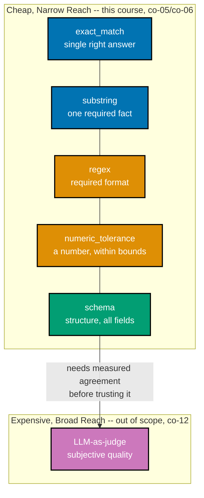

Examples 11-22 turn Theme A's prose `criterion` field into an executable, deterministic **co-05 --
scorer function**: no model call, no API key, no per-run cost. Five scorer shapes cover most of
what a real dataset needs -- exact match, normalized match, substring, regex (format), and numeric
tolerance -- plus **co-06 -- schema validation**, the highest-value check per line of code for any
structured output. Every scorer returns a reason alongside its verdict, gets dispatched through one
shared registry keyed by the dataset's own `scorer` field, and this theme closes with two warnings:
a scorer can itself be wrong (**co-05**'s "lying scorer"), and a model must never grade its own
output (**co-12**). Every code-medium example's real, runnable **Python 3.13** file lives under
`learning/code/ex-NN-*/`, run for real with genuine captured output; ex-22 is a diagram-medium
example and lives standalone under `learning/artifacts/`. (See this topic's
[Accuracy notes](../overview.md#accuracy-notes) for the exact patch version captured.)

---

### Worked Example 11: Exact-Match Scorer

_ex-11 &middot; exercises co-05_

**Context**: **co-05 -- deterministic scorer functions** start with the cheapest possible check:
string equality. This example scores a single-answer case (`"pro only"`) and shows exact match
correctly passing an identical string and failing even a one-letter casing difference.

```python
# learning/code/ex-11-exact-match-scorer/exact_match.py
"""Worked Example 11: Exact-Match Scorer."""  # => co-05: this file's own restated purpose, doubling as its module __doc__

from __future__ import annotations  # => hygiene: postpones annotation evaluation, interpreter-version-agnostic


def exact_match(output: str, expected: str) -> bool:  # => co-05: the cheapest scorer that exists -- string equality
    """Pass iff `output` is character-for-character identical to `expected`."""  # => co-04: documents exact_match's contract -- no runtime output, just sets its __doc__
    return output == expected  # => co-05: no normalization, no tolerance -- byte-identical or fail


if __name__ == "__main__":  # => co-05: entry point -- runs only when this file executes directly, not on import
    expected = "pro only"  # => co-04: case-10's exact expected answer, from the co-03 dataset
    passing_output = "pro only"  # => co-05: a candidate that matches character-for-character
    failing_output = "Pro Only"  # => co-05: a candidate that differs ONLY in letter case
    pass_result = exact_match(passing_output, expected)  # => co-05: the pass path
    fail_result = exact_match(failing_output, expected)  # => co-05: the fail path -- even a trivial casing difference fails
    print(f"exact_match({passing_output!r}, {expected!r}) = {pass_result}")  # => co-05: prints the pass verdict
    print(f"exact_match({failing_output!r}, {expected!r}) = {fail_result}")  # => co-05: prints the fail verdict
    assert pass_result is True, "an identical string must pass exact_match"  # => co-05: confirms the pass path
    assert fail_result is False, "even a one-letter casing difference must fail exact_match"  # => co-05: confirms the fail path
    print("MATCH: exact_match costs nothing to run and never drifts -- but is brittle to any cosmetic difference")  # => co-05
    # => co-05: exact_match is correct for single-answer cases -- ex-12 fixes its brittleness to cosmetic differences
```

**Run**: `python3 exact_match.py`

**Output**:

```text
exact_match('pro only', 'pro only') = True
exact_match('Pro Only', 'pro only') = False
MATCH: exact_match costs nothing to run and never drifts -- but is brittle to any cosmetic difference
```

**Verify**: `exact_match("pro only", "pro only")` is `True` while `exact_match("Pro Only", "pro
only")` is `False`, satisfying co-05's rule that a scorer runs offline, with no model call, and
produces the same verdict every time on the same inputs.

**Key takeaway**: exact match is correct and free to run, but brittle -- any cosmetic difference,
even one that carries no real meaning, fails it.

**Why It Matters**: exact match is the right tool for genuinely single-answer cases (a
classification label, a yes/no), and the wrong tool the moment free-text phrasing is allowed --
Example 12 fixes exactly this brittleness without loosening the check on genuine content. Reaching
for exact match on a free-text field is how a scorer starts failing correct answers for trivial
reasons, which quietly trains a team to stop trusting their own eval and start eyeballing again.

---

### Worked Example 12: Normalized Match

_ex-12 &middot; exercises co-05_

**Context**: continuing co-05 -- normalizing both sides of a comparison (lowercase, strip
whitespace) absorbs purely cosmetic noise without hiding a genuine content mismatch. This example
shows the fix over Example 11's brittleness, then confirms a real difference still fails.

```python
# learning/code/ex-12-normalized-match/normalized_match.py
"""Worked Example 12: Normalized Match."""  # => co-05: this file's own restated purpose, doubling as its module __doc__

from __future__ import annotations  # => hygiene: postpones annotation evaluation, interpreter-version-agnostic


def normalize(text: str) -> str:  # => co-05: one shared normalization step both sides of the comparison go through
    """Lowercase and strip leading/trailing whitespace -- removes purely cosmetic differences."""  # => co-05: documents normalize's contract -- no runtime output, just sets its __doc__
    return text.strip().lower()  # => co-05: whitespace and case are the two most common cosmetic diffs


def normalized_match(output: str, expected: str) -> bool:  # => co-05: exact_match, but on normalized text
    """Pass iff `output` and `expected` are identical after normalize()."""  # => co-05: documents normalized_match's contract -- no runtime output, just sets its __doc__
    return normalize(output) == normalize(expected)  # => co-05: both sides normalized -- no asymmetric comparison


if __name__ == "__main__":  # => co-05: entry point -- runs only when this file executes directly, not on import
    expected = "pro only"  # => co-04: the same expected answer ex-11 used
    cosmetic_diff = "  Pro Only  "  # => co-05: same content, different case AND stray whitespace
    genuine_diff = "free only"  # => co-05: a REAL content difference -- must still fail after normalization
    cosmetic_result = normalized_match(cosmetic_diff, expected)  # => co-05: the case ex-11's exact_match wrongly failed
    genuine_result = normalized_match(genuine_diff, expected)  # => co-05: a real mismatch, unaffected by normalization
    print(f"normalized_match({cosmetic_diff!r}, {expected!r}) = {cosmetic_result}")  # => co-05: prints the recovered pass
    print(f"normalized_match({genuine_diff!r}, {expected!r}) = {genuine_result}")  # => co-05: prints the still-correct fail
    assert cosmetic_result is True, "a purely cosmetic diff must now pass"  # => co-05: confirms the fix over ex-11
    assert genuine_result is False, "a genuine content difference must still fail"  # => co-05: confirms it isn't now too loose
    print("MATCH: normalization fixes the cosmetic false-fail without hiding a real mismatch")  # => co-05
    # => co-05: normalization trades a small amount of strictness for immunity to whitespace/case noise -- a fair trade here
```

**Run**: `python3 normalized_match.py`

**Output**:

```text
normalized_match('  Pro Only  ', 'pro only') = True
normalized_match('free only', 'pro only') = False
MATCH: normalization fixes the cosmetic false-fail without hiding a real mismatch
```

**Verify**: `normalized_match("  Pro Only  ", "pro only")` is `True` (the Example 11 false-fail is
fixed), while `normalized_match("free only", "pro only")` stays `False`, satisfying co-05's rule
that normalization absorbs cosmetic noise without hiding genuine content differences.

**Key takeaway**: normalization is a deliberate, narrow relaxation -- it targets exactly two known
cosmetic sources (case, whitespace) and nothing else, so it cannot accidentally absorb a real
mismatch.

**Why It Matters**: normalized match is now the workhorse for any single-answer case where the
exact phrasing does not matter but the content does -- and it stays exactly as brittle as exact
match to anything beyond case and whitespace, which is why free-text answers need Example 13's
substring check instead. Reaching for normalization on a genuinely free-text answer just moves the
brittleness one step further out instead of removing it.

---

### Worked Example 13: Substring Scorer

_ex-13 &middot; exercises co-05_

**Context**: continuing co-05 -- for free-text answers where the exact wording is not fixed, the
check that matters is whether one required fact survives anywhere in the text. This example scores
a complete answer (fact present) against an incomplete paraphrase (fact missing).

```python
# learning/code/ex-13-substring-scorer/substring_scorer.py
"""Worked Example 13: Substring Scorer."""  # => co-05: this file's own restated purpose, doubling as its module __doc__

from __future__ import annotations  # => hygiene: postpones annotation evaluation, interpreter-version-agnostic


def substring_scorer(output: str, required_fact: str) -> bool:  # => co-05: for free-text answers, not just single-token ones
    """Pass iff `required_fact` appears verbatim anywhere inside `output`."""  # => co-05: documents substring_scorer's contract -- no runtime output, just sets its __doc__
    return required_fact in output  # => co-05: no position requirement -- the fact just has to be present somewhere


if __name__ == "__main__":  # => co-05: entry point -- runs only when this file executes directly, not on import
    required_fact = "15 GB"  # => co-04: case-01's required fact from the co-03 dataset
    complete_answer = "New Nimbus accounts start with 15 GB of free storage to use right away."  # => co-05: the fact is present
    incomplete_answer = "New Nimbus accounts start with a generous amount of free storage."  # => co-05: the fact is MISSING
    complete_result = substring_scorer(complete_answer, required_fact)  # => co-05: the pass path
    incomplete_result = substring_scorer(incomplete_answer, required_fact)  # => co-05: the fail path
    print(f"substring_scorer(complete, {required_fact!r}) = {complete_result}")  # => co-05: prints the pass verdict
    print(f"substring_scorer(incomplete, {required_fact!r}) = {incomplete_result}")  # => co-05: prints the fail verdict
    assert complete_result is True, "the fact's presence, anywhere, must pass"  # => co-05: confirms the pass path
    assert incomplete_result is False, "a vague paraphrase missing the fact must fail"  # => co-05: confirms the fail path
    print("MATCH: substring scoring tolerates free-text phrasing as long as the required fact survives")  # => co-05
    # => co-05: substring scoring is the workhorse for "did the answer keep the one fact that matters" cases
```

**Run**: `python3 substring_scorer.py`

**Output**:

```text
substring_scorer(complete, '15 GB') = True
substring_scorer(incomplete, '15 GB') = False
MATCH: substring scoring tolerates free-text phrasing as long as the required fact survives
```

**Verify**: `substring_scorer(complete_answer, "15 GB")` is `True`, and the same check against
`incomplete_answer` (which paraphrases around the fact) is `False`, satisfying co-05's rule that
free-text phrasing is tolerated as long as the one fact that matters survives.

**Key takeaway**: substring scoring gives up checking the exact wording of an answer in exchange
for reliably catching the one thing that actually matters -- whether the required fact made it
into the response at all.

**Why It Matters**: this is the scorer this course's own ex-05 dataset uses for most of its
free-text cases -- but it says nothing about the required _format_ of an answer, which is exactly
the gap Example 14's regex scorer closes. A substring check alone would happily pass a
correctly-worded fact embedded in a malformed ticket ID or a broken JSON blob, which is exactly the
class of defect this course's next scorer is built to catch.

---

### Worked Example 14: Regex Scorer

_ex-14 &middot; exercises co-05_

**Context**: continuing co-05 -- some cases require a specific _format_, not just the presence of a
fact. This example scores a ticket-ID confirmation message against a strict `TCK-######` pattern,
correctly rejecting a message that carries the same information in the wrong format.

```python
# learning/code/ex-14-regex-scorer/regex_scorer.py
"""Worked Example 14: Regex Scorer."""  # => co-05: this file's own restated purpose, doubling as its module __doc__

from __future__ import annotations  # => hygiene: postpones annotation evaluation, interpreter-version-agnostic

import re  # => co-05: pattern matching needs nothing beyond the standard library's own re module

TICKET_ID_PATTERN = re.compile(r"TCK-\d{6}")  # => co-05: co-04's format requirement -- "TCK-" plus exactly six digits


def regex_scorer(output: str, pattern: re.Pattern[str]) -> bool:  # => co-05: for a required FORMAT, not a required literal
    """Pass iff `pattern` matches somewhere inside `output`."""  # => co-05: documents regex_scorer's contract -- no runtime output, just sets its __doc__
    return pattern.search(output) is not None  # => co-05: search, not match -- the pattern may sit anywhere in the text


if __name__ == "__main__":  # => co-05: entry point -- runs only when this file executes directly, not on import
    well_formed = "Your support ticket has been opened as TCK-004821 -- we'll follow up soon."  # => co-05: matches the format
    malformed = "Your support ticket has been opened as ticket #4821 -- we'll follow up soon."  # => co-05: WRONG format, same info
    well_formed_result = regex_scorer(well_formed, TICKET_ID_PATTERN)  # => co-05: the pass path
    malformed_result = regex_scorer(malformed, TICKET_ID_PATTERN)  # => co-05: the fail path -- format violated
    print(f"regex_scorer(well_formed, TICKET_ID_PATTERN) = {well_formed_result}")  # => co-05: prints the pass verdict
    print(f"regex_scorer(malformed, TICKET_ID_PATTERN) = {malformed_result}")  # => co-05: prints the fail verdict
    assert well_formed_result is True, "a correctly-formatted ticket id must pass"  # => co-05: confirms the pass path
    assert malformed_result is False, "a differently-formatted ticket id must fail, even with the same information"  # => co-05
    print("MATCH: regex scoring catches format violations a substring check would miss entirely")  # => co-05
    # => co-05: any downstream system parsing this output by regex needs the FORMAT enforced, not just the content
```

**Run**: `python3 regex_scorer.py`

**Output**:

```text
regex_scorer(well_formed, TICKET_ID_PATTERN) = True
regex_scorer(malformed, TICKET_ID_PATTERN) = False
MATCH: regex scoring catches format violations a substring check would miss entirely
```

**Verify**: `regex_scorer(well_formed, TICKET_ID_PATTERN)` is `True` while the same check against
`malformed` (same information, wrong format) is `False`, satisfying co-05's rule that a format
requirement is enforced, not just the presence of the underlying information.

**Key takeaway**: `malformed` would pass a substring check for the digits `4821`, but a downstream
system that parses `TCK-######` by regex would break on it -- only a format-aware scorer catches
this class of defect.

**Why It Matters**: regex scoring is the right tool whenever a downstream consumer (a ticketing
system, a structured log parser) depends on an exact output shape -- and it generalizes directly to
Example 15's numeric tolerance, which is really a regex extraction followed by an arithmetic check.
Skipping format checks in favor of a looser substring test is how a downstream parser silently
starts failing on output that "reads fine" to a human but breaks the exact pattern the parser
expects.

---

### Worked Example 15: Numeric-Tolerance Scorer

_ex-15 &middot; exercises co-05_

**Context**: continuing co-05 -- a number embedded in free text needs a tolerance, not exact
equality, because rounding and phrasing differences are harmless while a genuinely wrong number is
not. This example checks a boundary case (exactly at the tolerance) and a far-off case in the same
run.

```python
# learning/code/ex-15-numeric-tolerance-scorer/numeric_tolerance.py
"""Worked Example 15: Numeric-Tolerance Scorer."""  # => co-05: this file's own restated purpose, doubling as its module __doc__

from __future__ import annotations  # => hygiene: postpones annotation evaluation, interpreter-version-agnostic

import re  # => co-05: pulls the first number out of a free-text answer before comparing it

NUMBER_PATTERN = re.compile(r"-?\d+(?:\.\d+)?")  # => co-05: matches an integer or decimal, optionally negative


def numeric_tolerance_scorer(output: str, expected: float, *, tolerance: float) -> bool:  # => co-05: for numbers, not exact text
    """Pass iff the first number found in `output` is within `tolerance` of `expected`."""  # => co-05: documents numeric_tolerance_scorer's contract -- no runtime output, just sets its __doc__
    match = NUMBER_PATTERN.search(output)  # => co-05: locate the first numeric token in the free-text answer
    if match is None:  # => co-05: no number at all -- cannot possibly satisfy a numeric criterion
        return False  # => co-05: fail closed rather than raising on a malformed answer
    found_value = float(match.group())  # => co-05: parse the matched substring into an actual float
    return abs(found_value - expected) <= tolerance  # => co-05: within tolerance, inclusive of the boundary itself


if __name__ == "__main__":  # => co-05: entry point -- runs only when this file executes directly, not on import
    expected = 30.0  # => co-04: case-07's expected share-link-expiry value, in days
    exact_answer = "Nimbus share links expire after 30 days by default."  # => co-05: matches expected exactly
    close_answer = "Nimbus share links expire after roughly 31 days by default."  # => co-05: one day off -- close, arguably fine
    far_answer = "Nimbus share links expire after 90 days by default."  # => co-05: far off -- a genuine wrong answer
    exact_result = numeric_tolerance_scorer(exact_answer, expected, tolerance=1.0)  # => co-05: within tolerance, at 0 distance
    close_result = numeric_tolerance_scorer(close_answer, expected, tolerance=1.0)  # => co-05: exactly on the tolerance boundary
    far_result = numeric_tolerance_scorer(far_answer, expected, tolerance=1.0)  # => co-05: well outside the tolerance
    print(f"exact (30, tol=1.0) = {exact_result}")  # => co-05: prints the exact-match case's verdict
    print(f"close (31, tol=1.0) = {close_result}")  # => co-05: prints the boundary case's verdict
    print(f"far (90, tol=1.0) = {far_result}")  # => co-05: prints the far-off case's verdict
    assert exact_result is True, "an exact numeric match must pass"  # => co-05: confirms the zero-distance case
    assert close_result is True, "a value exactly at the tolerance boundary must still pass (inclusive)"  # => co-05
    assert far_result is False, "a value well outside the tolerance must fail"  # => co-05: confirms the fail path
    print("MATCH: tolerance absorbs harmless numeric noise without accepting a genuinely wrong number")  # => co-05
    # => co-05: the tolerance itself is a written decision (co-02) -- too wide hides real drift, too narrow flags rounding noise
```

**Run**: `python3 numeric_tolerance.py`

**Output**:

```text
exact (30, tol=1.0) = True
close (31, tol=1.0) = True
far (90, tol=1.0) = False
MATCH: tolerance absorbs harmless numeric noise without accepting a genuinely wrong number
```

**Verify**: `numeric_tolerance_scorer` passes both the exact case (distance 0) and the boundary
case (distance exactly 1.0, inclusive), while `far_answer` (distance 60) fails, satisfying co-05's
rule that a tolerance absorbs harmless noise without accepting a genuinely wrong number.

**Key takeaway**: the tolerance's inclusive boundary (`<=`, not `<`) is a deliberate choice --
Example 15's own `close_answer` sits exactly on that boundary, and an exclusive comparison would
have wrongly failed it.

**Why It Matters**: the tolerance value itself is co-02's written criterion applied to a number --
too wide and a real regression (30 days silently becoming 45) hides inside it; too narrow and
harmless rounding noise starts failing cases that are actually fine. Choosing that tolerance is a
genuine engineering decision, not an afterthought -- it deserves the same written justification
co-02 demands of any other criterion, because getting it wrong in either direction breaks the
eval's trustworthiness.

---

### Worked Example 16: Schema-Validation Scorer

_ex-16 &middot; exercises co-06_

**Context**: **co-06 -- schema validation** checks structure, not content: every declared field is
present, with the declared type. This example scores a well-formed structured output against one
missing a field and one with a wrong field type, and shows the reason each failure names exactly.

```python
# learning/code/ex-16-schema-validation-scorer/schema_scorer.py
"""Worked Example 16: Schema-Validation Scorer."""  # => co-06: this file's own restated purpose, doubling as its module __doc__

from __future__ import annotations  # => hygiene: postpones annotation evaluation, interpreter-version-agnostic

REQUIRED_SCHEMA = {"answer": str, "confidence": float, "source_fact_id": str}  # => co-06: the structured-output contract


def schema_scorer(output: dict[str, object], schema: dict[str, type]) -> tuple[bool, str]:  # => co-06: structure, not content
    """Pass iff every schema key is present in `output` AND has the schema's declared type."""  # => co-06: documents schema_scorer's contract -- no runtime output, just sets its __doc__
    for key, expected_type in schema.items():  # => co-06: check each required field independently
        if key not in output:  # => co-06: the cheapest possible failure -- a field is simply absent
            return False, f"missing field: {key}"  # => co-06: a reason naming the exact missing field
        if not isinstance(output[key], expected_type):  # => co-06: present, but the WRONG type
            actual_type = type(output[key]).__name__  # => co-06: what type actually showed up
            return False, f"field {key} has type {actual_type}, expected {expected_type.__name__}"  # => co-06
    return True, "all fields present with correct types"  # => co-06: every check passed


if __name__ == "__main__":  # => co-06: entry point -- runs only when this file executes directly, not on import
    well_formed: dict[str, object] = {"answer": "15 GB", "confidence": 0.92, "source_fact_id": "storage-free"}  # => co-06: satisfies the schema
    missing_field: dict[str, object] = {"answer": "15 GB", "confidence": 0.92}  # => co-06: source_fact_id is simply absent
    wrong_type: dict[str, object] = {"answer": "15 GB", "confidence": "high", "source_fact_id": "storage-free"}  # => co-06: confidence is a str, not a float
    well_formed_result = schema_scorer(well_formed, REQUIRED_SCHEMA)  # => co-06: the pass path
    missing_result = schema_scorer(missing_field, REQUIRED_SCHEMA)  # => co-06: the missing-field fail path
    wrong_type_result = schema_scorer(wrong_type, REQUIRED_SCHEMA)  # => co-06: the wrong-type fail path
    print(f"well_formed -> {well_formed_result}")  # => co-06: prints the pass verdict + reason
    print(f"missing_field -> {missing_result}")  # => co-06: prints the missing-field verdict + reason
    print(f"wrong_type -> {wrong_type_result}")  # => co-06: prints the wrong-type verdict + reason
    assert well_formed_result[0] is True, "a fully schema-conformant output must pass"  # => co-06: confirms the pass path
    assert missing_result == (False, "missing field: source_fact_id"), "a missing field must fail with that exact reason"  # => co-06
    assert wrong_type_result[0] is False, "a wrong-typed field must fail validation"  # => co-06: confirms the type check fires
    print("MATCH: schema validation is the cheapest, highest-value eval for any structured-output feature")  # => co-06
    # => co-06: schema validation runs in microseconds and needs no model call of its own -- pure structural verification
```

**Run**: `python3 schema_scorer.py`

**Output**:

```text
well_formed -> (True, 'all fields present with correct types')
missing_field -> (False, 'missing field: source_fact_id')
wrong_type -> (False, 'field confidence has type str, expected float')
MATCH: schema validation is the cheapest, highest-value eval for any structured-output feature
```

**Verify**: `schema_scorer(missing_field, REQUIRED_SCHEMA)` returns exactly `(False, "missing
field: source_fact_id")`, and `schema_scorer(wrong_type, REQUIRED_SCHEMA)` names the actual and
expected type in its reason, satisfying co-06's rule that a schema failure names the exact field
and problem.

**Key takeaway**: schema validation checks a completely different axis from every other scorer in
this theme -- it never looks at whether the _content_ is correct, only whether the _shape_ is,
which is exactly what makes it cheap to write and fast to run.

**Why It Matters**: any feature that returns structured output (JSON, a form, an API response) can
have a schema scorer written for it in minutes, and Example 17 measures directly how much real
breakage that minutes-long investment actually catches. Teams routinely skip this check because it
feels too obvious to be worth writing, yet a missing or mistyped field is one of the most common
ways a structured-output feature silently breaks downstream consumers.

---

### Worked Example 17: Schema Eval Catches the Most

_ex-17 &middot; exercises co-06_

**Context**: continuing co-06 -- this example measures schema validation's catch rate against five
independently-broken structured outputs, compared against a shallow check that only inspects one
field.

```python
# learning/code/ex-17-schema-eval-catches-the-most/schema_catches_the_most.py
"""Worked Example 17: Schema Eval Catches the Most."""  # => co-06: this file's own restated purpose, doubling as its module __doc__

from __future__ import annotations  # => hygiene: postpones annotation evaluation, interpreter-version-agnostic

REQUIRED_SCHEMA = {"answer": str, "confidence": float, "source_fact_id": str}  # => co-06: the same structured-output contract as ex-16

BROKEN_OUTPUTS: list[dict[str, object]] = [  # => co-06: five outputs, each broken in a DIFFERENT realistic way
    {"answer": "15 GB", "source_fact_id": "storage-free"},  # => co-06: defect 1 -- confidence field simply missing
    {"answer": "15 GB", "confidence": "high", "source_fact_id": "storage-free"},  # => co-06: defect 2 -- confidence wrong type
    {"answer": "15 GB", "confidence": 0.9},  # => co-06: defect 3 -- source_fact_id field simply missing
    {"answer": 15, "confidence": 0.9, "source_fact_id": "storage-free"},  # => co-06: defect 4 -- answer wrong type (int, not str)
    {"answer": "15 GB", "confidence": 0.9, "source_fact_id": None},  # => co-06: defect 5 -- source_fact_id wrong type (None)
]  # => co-06: closes the broken-outputs list


def schema_scorer(output: dict[str, object], schema: dict[str, type]) -> bool:  # => co-06: structural check -- every field, every type
    """Pass iff every schema key is present in `output` with the schema's declared type."""  # => co-06: documents schema_scorer's contract -- no runtime output, just sets its __doc__
    return all(key in output and isinstance(output[key], expected) for key, expected in schema.items())  # => co-06: one line, all fields


def substring_sanity_check(output: dict[str, object]) -> bool:  # => co-06: a cheaper-LOOKING check that only inspects "answer"
    """Pass iff the (string-coerced) 'answer' field contains a plausible-looking fact -- ignores every other field."""  # => co-06: documents substring_sanity_check's contract -- no runtime output, just sets its __doc__
    return "GB" in str(output.get("answer", ""))  # => co-06: never looks at confidence or source_fact_id at all


if __name__ == "__main__":  # => co-06: entry point -- runs only when this file executes directly, not on import
    schema_catches = sum(not schema_scorer(o, REQUIRED_SCHEMA) for o in BROKEN_OUTPUTS)  # => co-06: how many of the five it flags
    substring_catches = sum(not substring_sanity_check(o) for o in BROKEN_OUTPUTS)  # => co-06: how many the shallow check flags
    print(f"Broken outputs: {len(BROKEN_OUTPUTS)}")  # => co-06: states the sample size up front
    print(f"schema_scorer catches: {schema_catches}/{len(BROKEN_OUTPUTS)}")  # => co-06: the structural scorer's catch rate
    print(f"substring_sanity_check catches: {substring_catches}/{len(BROKEN_OUTPUTS)}")  # => co-06: the shallow scorer's catch rate
    assert schema_catches == 5, "schema_scorer must catch all five structural defects"  # => co-06: verifies the claim, not just asserts it
    assert substring_catches == 1, "substring_sanity_check must catch only the one defect that happens to touch 'answer'"  # => co-06
    print("MATCH: one schema check catches 5x more real breakage than a shallow field-only check, for one line of code")  # => co-06
    # => co-06: this is exactly why co-06 ranks schema validation as the highest-value eval per line of eval code written
```

**Run**: `python3 schema_catches_the_most.py`

**Output**:

```text
Broken outputs: 5
schema_scorer catches: 5/5
substring_sanity_check catches: 1/5
MATCH: one schema check catches 5x more real breakage than a shallow field-only check, for one line of code
```

**Verify**: `schema_scorer` catches all 5/5 broken outputs while `substring_sanity_check` catches
only 1/5 (the one defect that happens to touch the `answer` field), satisfying co-06's rule that
schema validation catches measurably more real breakage per line of code than a shallow check.

**Key takeaway**: a scorer that only inspects one field cannot catch a defect in any other field,
no matter how thorough it looks on the field it does check -- coverage of the whole schema is what
schema validation buys over a spot-check.

**Why It Matters**: this measured 5x catch-rate advantage is the concrete argument for writing a
real schema scorer instead of a quick substring check whenever a feature returns structured output
-- the investment is small (one function, five lines) and the payoff compounds every time the
system's output format regresses. A number this concrete is far more persuasive to a skeptical
teammate than an abstract argument for "more thorough testing."

---

### Worked Example 18: A Scorer Returns a Reason

_ex-18 &middot; exercises co-05_

**Context**: continuing co-05 -- every scorer in this course returns a `Verdict` (a `passed` flag
plus a `reason` string), not a bare boolean, so a failure explains itself without anyone re-reading
the scorer's source.

```python
# learning/code/ex-18-scorer-returns-a-reason/scorer_verdict.py
"""Worked Example 18: A Scorer Returns a Reason."""  # => co-05: this file's own restated purpose, doubling as its module __doc__

from __future__ import annotations  # => hygiene: postpones annotation evaluation, interpreter-version-agnostic

from typing import NamedTuple  # => co-05: a typed record beats a bare bool for a debuggable scorer result


class Verdict(NamedTuple):  # => co-05: EVERY scorer in this topic returns this shape from here on
    passed: bool  # => co-05: the pass/fail decision itself
    reason: str  # => co-05: WHY -- what a human reads instead of re-deriving it from the raw output


def substring_scorer_with_reason(output: str, required_fact: str) -> Verdict:  # => co-05: ex-13's scorer, upgraded
    """Pass iff `required_fact` appears in `output`; the reason names the exact fact checked."""  # => co-05: documents substring_scorer_with_reason's contract -- no runtime output, just sets its __doc__
    found = required_fact in output  # => co-05: the same check as ex-13, unchanged
    if found:  # => co-05: branch the reason text on the outcome, not just the boolean
        return Verdict(passed=True, reason=f"found required fact {required_fact!r}")  # => co-05: a reason confirming success
    return Verdict(passed=False, reason=f"missing required fact {required_fact!r}")  # => co-05: a reason naming the exact gap


if __name__ == "__main__":  # => co-05: entry point -- runs only when this file executes directly, not on import
    required_fact = "15 GB"  # => co-04: case-01's required fact, reused from ex-13
    answer = "New Nimbus accounts start with a generous amount of free storage."  # => co-05: deliberately missing the fact
    verdict = substring_scorer_with_reason(answer, required_fact)  # => co-05: one call, one self-explaining result
    print(f"passed={verdict.passed}, reason={verdict.reason!r}")  # => co-05: prints both fields -- no re-running needed to know why
    assert verdict.passed is False, "this answer must fail -- it never states the required fact"  # => co-05: confirms the fail path
    assert verdict.reason == "missing required fact '15 GB'", "the reason must name the exact missing fact"  # => co-05
    print("MATCH: a failing verdict now explains itself without re-reading the scorer's source")  # => co-05
    # => co-05: a bare True/False forces someone to re-derive WHY on every failure -- a reason answers it once, at scoring time
```

**Run**: `python3 scorer_verdict.py`

**Output**:

```text
passed=False, reason="missing required fact '15 GB'"
MATCH: a failing verdict now explains itself without re-reading the scorer's source
```

**Verify**: `substring_scorer_with_reason(answer, "15 GB")` returns `Verdict(passed=False,
reason="missing required fact '15 GB'")`, satisfying co-05's rule that a failing verdict names,
in its own reason field, exactly what was missing.

**Key takeaway**: `Verdict` costs one small `NamedTuple` and pays for itself the first time someone
has to debug a failing case at 2am without wanting to re-read the scorer's source to understand why
it failed.

**Why It Matters**: every remaining scorer in this course -- and every scorer the capstone builds --
returns this exact shape, which is what lets Example 19's registry, and later the runner's
per-case report (ex-25), print a reason for every single result, not just a pass/fail count. A
pass/fail count alone forces a reviewer to re-run the scorer by hand to understand any single
failure; a stored reason turns that same investigation into reading one line of a report.

---

### Worked Example 19: Scorer Registry

_ex-19 &middot; exercises co-05_

**Context**: continuing co-05 -- a dataset's `scorer` field names which function should score it,
and a registry dict dispatches to the right scorer purely from that data, with no manual
if/elif routing anywhere in the caller.

```python
# learning/code/ex-19-scorer-registry/scorer_registry.py
"""Worked Example 19: Scorer Registry."""  # => co-05: this file's own restated purpose, doubling as its module __doc__

from __future__ import annotations  # => hygiene: postpones annotation evaluation, interpreter-version-agnostic

import json  # => co-03: JSONL needs nothing beyond the standard library's own json module
import re  # => co-05: the regex-scorer entry needs the standard library's own re module
from pathlib import Path  # => co-03: locates dataset.jsonl relative to this script, not the caller's cwd
from typing import Callable  # => co-05: types the registry's values as callables, not just "some function"

DATASET_PATH = Path(__file__).parent / "dataset.jsonl"  # => co-03: the twelve-case dataset, each case naming its own scorer
NUMBER_PATTERN = re.compile(r"-?\d+(?:\.\d+)?")  # => co-05: shared by the numeric_tolerance entry below


def exact_match(output: str, expected: str) -> bool:  # => co-05: registry entry "exact_match"
    return output.strip().lower() == expected.strip().lower()  # => co-05: normalized, matching ex-12's fix


def substring(output: str, expected: str) -> bool:  # => co-05: registry entry "substring"
    return expected in output  # => co-05: the fact just has to appear somewhere


def regex(output: str, expected: str) -> bool:  # => co-05: registry entry "regex" -- `expected` doubles as the pattern text
    return re.search(expected, output) is not None  # => co-05: search for the pattern text anywhere in the output


def numeric_tolerance(output: str, expected: str) -> bool:  # => co-05: registry entry "numeric_tolerance"
    match = NUMBER_PATTERN.search(output)  # => co-05: locate the first number in the free-text answer
    return match is not None and abs(float(match.group()) - float(expected)) <= 1.0  # => co-05: within a fixed +-1 tolerance


SCORER_REGISTRY: dict[str, Callable[[str, str], bool]] = {  # => co-05: name -> function, ONE lookup table for every case
    "exact_match": exact_match,  # => co-05: maps the dataset's "exact_match" string to this function
    "substring": substring,  # => co-05: maps the dataset's "substring" string to this function
    "regex": regex,  # => co-05: maps the dataset's "regex" string to this function
    "numeric_tolerance": numeric_tolerance,  # => co-05: maps the dataset's "numeric_tolerance" string to this function
}  # => co-05: closes the registry dict


if __name__ == "__main__":  # => co-05: entry point -- runs only when this file executes directly, not on import
    cases = [json.loads(line) for line in DATASET_PATH.read_text(encoding="utf-8").splitlines() if line.strip()]  # => co-03
    print(f"Dispatching {len(cases)} cases through the scorer registry")  # => co-05: states the sample size up front
    dispatched_names: set[str] = set()  # => co-05: which registry entries actually got exercised
    for case in cases:  # => co-05: one dispatch per case, driven entirely by data, not an if/elif chain
        scorer_fn = SCORER_REGISTRY[case["scorer"]]  # => co-05: the case's own "scorer" field picks the function, by name
        dispatched_names.add(case["scorer"])  # => co-05: records that this scorer name was actually reached
        verdict = scorer_fn(case["expected"], case["expected"])  # => co-05: a trivial self-check -- the fact scores against itself
        assert verdict is True, f"{case['id']}'s own expected value must score True against itself"  # => co-05: a sanity fixture
    print(f"Registry entries exercised: {sorted(dispatched_names)}")  # => co-05: prints exactly which scorer names got used
    assert dispatched_names == set(SCORER_REGISTRY), "every registered scorer must be reachable from real dataset cases"  # => co-05
    print("MATCH: every case reached the correct scorer purely by its own 'scorer' field -- no manual routing")  # => co-05
    # => co-05: a registry keeps the runner (ex-23) ignorant of which scorer any given case needs -- the data decides
```

**Run**: `python3 scorer_registry.py`

**Output**:

```text
Dispatching 12 cases through the scorer registry
Registry entries exercised: ['exact_match', 'numeric_tolerance', 'regex', 'substring']
MATCH: every case reached the correct scorer purely by its own 'scorer' field -- no manual routing
```

**Verify**: every one of the 12 committed cases dispatches through `SCORER_REGISTRY[case["scorer"]]`
without a hardcoded branch, and `dispatched_names` ends up equal to `set(SCORER_REGISTRY)` (all
four registered scorers actually reached), satisfying co-05's rule that dispatch is entirely
data-driven.

**Key takeaway**: adding a fifth scorer type later means adding one entry to `SCORER_REGISTRY` --
no caller anywhere needs to change, because every caller already dispatches by name, not by a
hardcoded chain of checks.

**Why It Matters**: Theme C's runner (ex-23) imports a registry exactly like this one -- this
example is what makes the runner itself completely ignorant of which specific scorer any given
case needs, which is what keeps adding a new case type a one-line change rather than a runner
rewrite. Without this indirection, every new scorer type would force a change to the runner's own
code, coupling two concerns -- "how to run cases" and "how to score them" -- that this course
deliberately keeps separate.

---

### Worked Example 20: A Scorer That Lies

_ex-20 &middot; exercises co-05_

**Context**: continuing co-05 -- a scorer can itself be wrong, and an over-permissive scorer is
worse than no eval at all, because it manufactures false confidence on a genuinely broken answer.
This example shows a loose scorer wrongly passing a factually incorrect answer, then the tightened
fix that catches it without breaking the correct case.

```python
# learning/code/ex-20-a-scorer-that-lies/scorer_that_lies.py
"""Worked Example 20: A Scorer That Lies."""  # => co-02: this file's own restated purpose, doubling as its module __doc__

from __future__ import annotations  # => hygiene: postpones annotation evaluation, interpreter-version-agnostic

WRONG_ANSWER = "Nimbus Pro includes 20 GB of storage, plenty for most teams."  # => co-05: a confidently, factually WRONG answer


def loose_scorer(output: str) -> bool:  # => co-05: an over-permissive scorer -- checks for "GB", not the actual number
    """Pass iff the output merely mentions a GB figure at all -- too loose to catch a wrong number."""  # => co-05: documents loose_scorer's contract -- no runtime output, just sets its __doc__
    return "GB" in output  # => co-05: satisfied by ANY GB figure, right or wrong


def tightened_scorer(output: str, expected_value: str) -> bool:  # => co-05: the fix -- check the SPECIFIC expected figure
    """Pass iff the output contains the specific expected GB figure, not merely any GB figure."""  # => co-05: documents tightened_scorer's contract -- no runtime output, just sets its __doc__
    return expected_value in output  # => co-05: the exact fact, not just its unit


if __name__ == "__main__":  # => co-05: entry point -- runs only when this file executes directly, not on import
    loose_result = loose_scorer(WRONG_ANSWER)  # => co-05: the over-permissive scorer's verdict on a WRONG answer
    print(f"loose_scorer(WRONG_ANSWER) = {loose_result}")  # => co-05: prints the false pass
    assert loose_result is True, "the loose scorer must wrongly pass this factually incorrect answer"  # => co-05: proves the lie

    tightened_result = tightened_scorer(WRONG_ANSWER, expected_value="200 GB")  # => co-05: the tightened scorer's verdict
    print(f"tightened_scorer(WRONG_ANSWER, '200 GB') = {tightened_result}")  # => co-05: prints the corrected fail
    assert tightened_result is False, "the tightened scorer must catch the wrong figure"  # => co-05: confirms the fix

    correct_answer = "Nimbus Pro includes 200 GB of storage."  # => co-05: what a genuinely correct answer looks like
    correct_result = tightened_scorer(correct_answer, expected_value="200 GB")  # => co-05: the tightened scorer on a right answer
    print(f"tightened_scorer(correct_answer, '200 GB') = {correct_result}")  # => co-05: prints the still-passing correct case
    assert correct_result is True, "the tightened scorer must still pass a genuinely correct answer"  # => co-05
    print("MATCH: a scorer that passes ANY plausible-looking output is worse than no eval at all -- it hides the bug")  # => co-05
    # => co-05: a green eval run built on a lying scorer is more dangerous than no eval, because it manufactures false confidence
```

**Run**: `python3 scorer_that_lies.py`

**Output**:

```text
loose_scorer(WRONG_ANSWER) = True
tightened_scorer(WRONG_ANSWER, '200 GB') = False
tightened_scorer(correct_answer, '200 GB') = True
MATCH: a scorer that passes ANY plausible-looking output is worse than no eval at all -- it hides the bug
```

**Verify**: `loose_scorer(WRONG_ANSWER)` wrongly returns `True` on a factually incorrect answer,
while `tightened_scorer(WRONG_ANSWER, expected_value="200 GB")` correctly returns `False` and still
passes a genuinely correct answer, satisfying co-05's rule that a fixed scorer catches the defect
the loose one missed without breaking the correct case.

**Key takeaway**: `loose_scorer` was not merely imprecise -- it was actively wrong on a case it
should have caught, and it looked identical to a working scorer on every case that did not happen
to expose the gap.

**Why It Matters**: a green run built on a lying scorer is strictly worse than no eval at all,
because it converts silence (no eval run) into false confidence (a passing eval run) on the exact
same underlying defect -- which is why every scorer in this course is checked against both a
passing and a failing case before it is trusted.

---

### Worked Example 21: Never Score With the Generating Model

_ex-21 &middot; exercises co-12_

**Context**: **co-12** applies here to a specific rule: the model that produced an answer must
never be the one that grades it, because it shares the exact same blind spot that produced the
mistake. This example mocks a same-system self-grade (which judges tone and wrongly approves a
factually wrong answer) against an independent, deterministic scorer that catches it.

```python
# learning/code/ex-21-never-score-with-the-generating-model/self_grading_bias.py
"""Worked Example 21: Never Score With the Generating Model."""  # => co-12: this file's own restated purpose, doubling as its module __doc__

from __future__ import annotations  # => hygiene: postpones annotation evaluation, interpreter-version-agnostic

FLAWED_ANSWER = "Nimbus Pro includes 20 GB of storage, ready whenever you need it."  # => co-05: confidently wrong -- 200 GB is correct
KEY_FACT = "200 GB"  # => co-04: the fact that actually matters, independent of tone


def same_system_self_grade(answer: str) -> bool:  # => co-12: stands in for asking the SAME system that wrote the answer to grade it
    """A mocked 'self-grade' -- the same system that produced FLAWED_ANSWER judging its own fluent tone."""  # => co-12: documents same_system_self_grade's contract -- no runtime output, just sets its __doc__
    sounds_confident = "ready" in answer or "includes" in answer  # => co-12: judges TONE, the exact thing it optimized for
    return sounds_confident  # => co-12: the system's own stylistic habits make its own mistakes look fine to itself


def independent_deterministic_scorer(answer: str, required_fact: str) -> bool:  # => co-12: a scorer with NO stake in the answer
    """An independent, deterministic check with no relationship to whatever produced `answer`."""  # => co-12: documents independent_deterministic_scorer's contract -- no runtime output, just sets its __doc__
    return required_fact in answer  # => co-12: checks the fact, never the fluency


if __name__ == "__main__":  # => co-12: entry point -- runs only when this file executes directly, not on import
    self_grade_result = same_system_self_grade(FLAWED_ANSWER)  # => co-12: the biased verdict
    independent_result = independent_deterministic_scorer(FLAWED_ANSWER, KEY_FACT)  # => co-12: the unbiased verdict
    print(f"Self-grade (same system): {self_grade_result}")  # => co-12: prints the biased, falsely-positive verdict
    print(f"Independent deterministic scorer: {independent_result}")  # => co-12: prints the correct, negative verdict
    assert self_grade_result is True, "a same-system self-grade must wrongly approve its own fluent, wrong answer"  # => co-12
    assert independent_result is False, "an independent, fact-based scorer must catch the same error"  # => co-12
    print("MATCH: the system that made the mistake shares the same blind spot that produced it")  # => co-12
    # => co-12: judging whether a SUBJECTIVE score is trustworthy needs measured agreement -- that machinery belongs
    # => co-12: to evaluating-ai-systems-in-depth, not here; this course stops at deterministic, independent scorers
```

**Run**: `python3 self_grading_bias.py`

**Output**:

```text
Self-grade (same system): True
Independent deterministic scorer: False
MATCH: the system that made the mistake shares the same blind spot that produced it
```

**Verify**: `same_system_self_grade(FLAWED_ANSWER)` wrongly returns `True` on a factually wrong
answer, while `independent_deterministic_scorer(FLAWED_ANSWER, KEY_FACT)` correctly returns
`False`, satisfying co-12's rule that a system's own generation blind spot survives into its own
grading unless the scorer is genuinely independent.

**Key takeaway**: the failure here is not that self-grading is lazy -- it is that the same
stylistic habits that produced the confident, fluent, wrong answer are exactly what a same-system
grader tends to reward, because they are indistinguishable from the habits that produce a
confident, fluent, _correct_ answer.

**Why It Matters**: this course stops at deterministic scorers with no stake in the answer they
grade -- a subjective, LLM-as-judge scorer's own trustworthiness needs measured human agreement
before it can be trusted at all, and that measurement machinery belongs to
`evaluating-ai-systems-in-depth`, not this course. Adopting an LLM-as-judge without that measurement
work is how a team quietly reintroduces the same self-grading bias this example demonstrates, just
one layer removed from the original mistake.

---

### Worked Example 22: Scorers on a Cost-vs-Reach Axis (diagram)

_ex-22 &middot; exercises co-05, co-06, co-12_

**Context**: this diagram-medium example places every scorer Theme B built -- `exact_match`,
`substring`, `regex`, `numeric_tolerance`, `schema` -- on one cost-vs-reach axis against the single
node that sits outside this course's scope: an LLM-as-judge.

> A captioned diagram placing every scorer type from Theme B on a cost-vs-reach axis -- exercises
> co-05, co-06, and co-12. The full diagram, with its own verify/key-takeaway/why-it-matters
> sections, lives at
> [Artifact: Scorers on a Cost-vs-Reach Axis](/en/learn/courses/evaluating-ai-output-essentials/learning/artifacts/ex-22-scorer-comparison-diagram).



_Figure: every scorer this course teaches sits in the cheap, narrow-reach cluster -- each checks
one mechanical property (an exact string, a fact's presence, a format, a number, a structure). The
one node outside that cluster, an LLM-as-judge, is where `evaluating-ai-systems-in-depth` picks
up._

**Verify**: all five deterministic scorers (`exact_match`, `substring`, `regex`,
`numeric_tolerance`, `schema`) sit inside the "Cheap, Narrow Reach" cluster; exactly one node
(`LLM-as-judge`) sits outside it, connected by an edge naming the exact precondition (measured
agreement) this course does not teach.

**Key takeaway**: "cheap" and "narrow reach" travel together for every scorer in this course --
none of them can judge tone, faithfulness, or any other subjective quality, and none of them cost
anything beyond ordinary CPU time to run.

**Why It Matters**: a team that reaches for an LLM-as-judge before exhausting the cheap cluster is
usually solving the wrong problem at the wrong cost -- most real breakage (a missing field, a
wrong number, a malformed ticket ID) is exactly what the cheap cluster already catches, per ex-17's
measured 5x catch-rate advantage.

---

← Previous: [Theme A: Why You Cannot Eyeball It](./theme-a-why-you-cannot-eyeball-it.md) &middot;
Next: [Theme C: The Runner and the Number](./theme-c-the-runner-and-the-number.md) →
