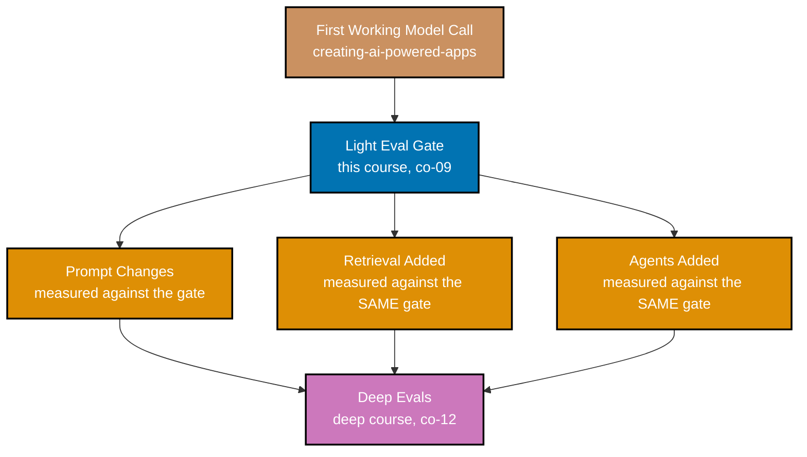

Examples 35-46 put the runner from Theme C to work on real, before/after decisions: **co-09 --
baseline vs. candidate comparison** is the discipline of running an identical fixed dataset before
and after a proposed change, comparing per-case rather than trusting the headline pass rate alone,
and rejecting on any regression regardless of how many cases the change also fixed. This theme also
covers **co-10 -- the dataset grows by failure**, letting every real bug report become a permanent
regression case, and closes with **co-12**'s honest boundary: three named things this course's
light gate cannot tell you, and the concrete triggers that mean a project is ready for
`evaluating-ai-systems-in-depth`. Every code-medium example's real, runnable **Python 3.13**
file lives under `learning/code/ex-NN-*/`, run for real with genuine captured output; ex-43 is a
diagram-medium example and lives standalone under `learning/artifacts/`. (See this topic's
[Accuracy notes](../overview.md#accuracy-notes) for the exact patch version captured.)

---

### Worked Example 35: Baseline Run

_ex-35 &middot; exercises co-09_

**Context**: **co-09** needs a baseline measured and committed _before_ any change is proposed --
this example runs the currently-shipped "prompt v1" system against the twelve-case dataset and
writes the result to a committed `baseline.json`.

```python
# learning/code/ex-35-baseline-run/baseline_run.py
"""Worked Example 35: Baseline Run."""  # => co-09: this file's own restated purpose, doubling as its module __doc__

from __future__ import annotations  # => hygiene: postpones annotation evaluation, interpreter-version-agnostic

import json  # => co-09: the artefact format needs nothing beyond the standard library's own json module
from pathlib import Path  # => co-09: locates baseline.json relative to this script, not the caller's cwd

BASELINE_PATH = Path(__file__).parent / "baseline.json"  # => co-09: the committed artefact THIS run produces
PROMPT_V1_VERDICTS = {  # => co-01: "prompt v1" -- the version currently shipped, before any change is proposed
    "case-01": True, "case-02": True, "case-03": True, "case-04": True,  # => co-01: cases 1-4 -- all pass
    "case-05": True, "case-06": False, "case-07": True, "case-08": False,  # => co-01: case 6 and 8 -- known failures
    "case-09": True, "case-10": True, "case-11": False, "case-12": True,  # => co-01: case 11 -- a third known failure
}  # => co-01: closes PROMPT_V1_VERDICTS -- nine pass, three fail


if __name__ == "__main__":  # => co-09: entry point -- runs only when this file executes directly, not on import
    pass_rate = sum(PROMPT_V1_VERDICTS.values()) / len(PROMPT_V1_VERDICTS)  # => co-07: the baseline's headline number
    baseline = {"run_id": "prompt-v1", "pass_rate": pass_rate, "verdicts": PROMPT_V1_VERDICTS}  # => co-09: the full baseline artefact
    BASELINE_PATH.write_text(json.dumps(baseline, indent=2, sort_keys=True) + "\n", encoding="utf-8")  # => co-09: commit it to disk
    print(f"Baseline pass rate: {pass_rate:.2%}")  # => co-07: prints the stored headline number
    print(f"Written to {BASELINE_PATH.name}")  # => co-09: prints where the artefact landed
    assert pass_rate == 0.75, "the baseline's fixed verdicts must reduce to exactly 75%"  # => co-07: confirms the arithmetic
    print("MATCH: the baseline is measured and stored BEFORE any prompt change is proposed")  # => co-09
    # => co-09: without a stored baseline, ex-37's comparison would have nothing to compare the candidate against
```

**Run**: `python3 baseline_run.py`

**Output**:

```text
Baseline pass rate: 75.00%
Written to baseline.json
MATCH: the baseline is measured and stored BEFORE any prompt change is proposed
```

**Verify**: `PROMPT_V1_VERDICTS` reduces to exactly `75.00%` (9/12), and `baseline.json` is
written to disk as a committed artefact before any candidate exists, satisfying co-09's rule that
a baseline is measured and stored before a change is proposed.

**Key takeaway**: this baseline is not hypothetical -- it is the exact currently-shipped system's
measured behavior, committed to disk, so that any future candidate has something real to be
compared against.

**Why It Matters**: `case-06`, `case-08`, and `case-11` are the baseline's three known failures --
Example 38 targets exactly these three cases with a proposed fix and shows what that fix costs
elsewhere. A baseline that only reports an aggregate 75% would hide exactly which three cases are
broken -- naming them here is what makes it possible to check, later, whether a fix actually
touched the right ones.

---

### Worked Example 36: Candidate Run

_ex-36 &middot; exercises co-09_

**Context**: continuing co-09 -- a candidate is only genuinely comparable to the baseline if it runs
against the identical case set. This example runs a proposed "prompt v2" rewrite against the same
twelve cases and confirms the case set matches exactly.

```python
# learning/code/ex-36-candidate-run/candidate_run.py
"""Worked Example 36: Candidate Run."""  # => co-09: this file's own restated purpose, doubling as its module __doc__

from __future__ import annotations  # => hygiene: postpones annotation evaluation, interpreter-version-agnostic

import json  # => co-09: the artefact format needs nothing beyond the standard library's own json module
from pathlib import Path  # => co-09: locates candidate.json relative to this script, not the caller's cwd

CANDIDATE_PATH = Path(__file__).parent / "candidate.json"  # => co-09: the committed artefact THIS run produces
PROMPT_V2_VERDICTS = {  # => co-09: "prompt v2" -- a proposed rewrite, run against the SAME twelve cases as ex-35
    "case-01": True, "case-02": True, "case-03": True, "case-04": True,  # => co-09: cases 1-4 -- unchanged, still pass
    "case-05": True, "case-06": True, "case-07": True, "case-08": True,  # => co-09: case 6 and 8 -- NOW FIXED
    "case-09": True, "case-10": True, "case-11": True, "case-12": True,  # => co-09: case 11 -- NOW FIXED
}  # => co-09: closes PROMPT_V2_VERDICTS -- all twelve pass


if __name__ == "__main__":  # => co-09: entry point -- runs only when this file executes directly, not on import
    pass_rate = sum(PROMPT_V2_VERDICTS.values()) / len(PROMPT_V2_VERDICTS)  # => co-07: the candidate's headline number
    candidate = {"run_id": "prompt-v2", "pass_rate": pass_rate, "verdicts": PROMPT_V2_VERDICTS}  # => co-09: the full candidate artefact
    CANDIDATE_PATH.write_text(json.dumps(candidate, indent=2, sort_keys=True) + "\n", encoding="utf-8")  # => co-09: commit it to disk
    print(f"Candidate pass rate: {pass_rate:.2%}")  # => co-07: prints the stored headline number
    print(f"Written to {CANDIDATE_PATH.name}")  # => co-09: prints where the artefact landed
    assert pass_rate == 1.0, "the candidate's fixed verdicts must reduce to exactly 100%"  # => co-07: confirms the arithmetic
    assert set(PROMPT_V2_VERDICTS) == {f"case-{n:02d}" for n in range(1, 13)}, "the candidate must cover the SAME case set"  # => co-09
    print("MATCH: the candidate ran against the identical case set the baseline used -- a genuinely comparable number")  # => co-09
    # => co-09: a comparable number requires the SAME fixed dataset -- swap the dataset and you've measured something else
```

**Run**: `python3 candidate_run.py`

**Output**:

```text
Candidate pass rate: 100.00%
Written to candidate.json
MATCH: the candidate ran against the identical case set the baseline used -- a genuinely comparable number
```

**Verify**: `set(PROMPT_V2_VERDICTS)` equals exactly the same twelve case IDs the baseline used,
satisfying co-09's rule that a candidate's number is only comparable when it covers the identical
case set as the baseline.

**Key takeaway**: 100% looks like an unambiguous win against the baseline's 75% -- Example 37 shows
exactly why the headline number alone is not enough to trust that story.

**Why It Matters**: a candidate that quietly ran against a different case set (a few cases added or
dropped) would still produce a number, but that number would not mean "improved on the same
cases" -- it would mean nothing comparable at all, which is why co-09's case-set check exists. A
team that skips this check risks celebrating a pass-rate jump that is really just an easier set of
cases in disguise.

---

### Worked Example 37: Compare Baseline vs. Candidate

_ex-37 &middot; exercises co-09_

**Context**: continuing co-09 -- this example builds `diff_runs`, the per-case comparison function
every later Theme D example reuses, and shows a scenario where baseline and candidate land on the
identical headline pass rate while genuinely trading one case for another underneath it.

```python
# learning/code/ex-37-compare-baseline-vs-candidate/compare.py
"""Worked Example 37: Compare Baseline vs. Candidate."""  # => co-09: this file's own restated purpose, doubling as its module __doc__

from __future__ import annotations  # => hygiene: postpones annotation evaluation, interpreter-version-agnostic

BASELINE = {"case-A": True, "case-B": False, "case-C": True, "case-D": True, "case-E": False}  # => co-09: five cases, two failing
CANDIDATE = {"case-A": True, "case-B": True, "case-C": True, "case-D": False, "case-E": False}  # => co-09: SAME five cases, changed


def diff_runs(baseline: dict[str, bool], candidate: dict[str, bool]) -> tuple[list[str], list[str]]:  # => co-09: one diff, two lists
    """Return (wins, regressions) -- case ids that flipped False->True, and True->False, respectively."""  # => co-09: documents diff_runs's contract -- no runtime output, just sets its __doc__
    wins = [cid for cid in baseline if not baseline[cid] and candidate[cid]]  # => co-09: failed before, passes now
    regressions = [cid for cid in baseline if baseline[cid] and not candidate[cid]]  # => co-09: passed before, fails now
    return wins, regressions  # => co-09: returns this computed value to the caller


if __name__ == "__main__":  # => co-09: entry point -- runs only when this file executes directly, not on import
    wins, regressions = diff_runs(BASELINE, CANDIDATE)  # => co-09: one call produces both lists, cleanly separated
    baseline_rate = sum(BASELINE.values()) / len(BASELINE)  # => co-07: the baseline's headline number
    candidate_rate = sum(CANDIDATE.values()) / len(CANDIDATE)  # => co-07: the candidate's headline number
    print(f"Baseline pass rate: {baseline_rate:.0%} | Candidate pass rate: {candidate_rate:.0%}")  # => co-07: prints both headlines
    print(f"Wins (fixed): {wins}")  # => co-09: prints exactly which cases newly pass
    print(f"Regressions (broken): {regressions}")  # => co-09: prints exactly which cases newly fail
    assert wins == ["case-B"], "exactly case-B must be a win -- it flipped fail-to-pass"  # => co-09: confirms the win list
    assert regressions == ["case-D"], "exactly case-D must be a regression -- it flipped pass-to-fail"  # => co-09
    assert baseline_rate == candidate_rate, "this fixture must keep the headline pass rate identical on both sides"  # => co-07
    print("MATCH: the identical 60% pass rate on both sides would have hidden this exact trade")  # => co-09
    # => co-09: the eval's job is comparing a candidate against a baseline -- the diff, not the raw rate, is the real answer
```

**Run**: `python3 compare.py`

**Output**:

```text
Baseline pass rate: 60% | Candidate pass rate: 60%
Wins (fixed): ['case-B']
Regressions (broken): ['case-D']
MATCH: the identical 60% pass rate on both sides would have hidden this exact trade
```

**Verify**: `diff_runs(BASELINE, CANDIDATE)` returns `(["case-B"], ["case-D"])` while both runs'
headline pass rate stays identical at `60%`, satisfying co-09's rule that a per-case diff surfaces
a trade the headline rate alone hides.

**Key takeaway**: two runs sharing the exact same pass rate can still be measuring meaningfully
different behavior underneath -- `diff_runs` is what makes that trade visible instead of invisible.

**Why It Matters**: `diff_runs` is the exact function this theme's remaining examples, and the
capstone's `compare.py`, build on -- every accept/reject decision from here forward runs through
this per-case comparison, never the headline rate alone. Skipping this per-case step and comparing
pass rates alone is exactly how a team ships a change that quietly trades one working case for a
different broken one without ever noticing.

---

### Worked Example 38: A Change That Helps AND Hurts

_ex-38 &middot; exercises co-09_

**Context**: continuing co-09 -- this example shows the more dangerous version of Example 37's
trap: a candidate whose headline pass rate genuinely goes _up_ (75% to 83%) while still breaking
two previously-solid cases the moment its three targeted fixes land.

```python
# learning/code/ex-38-a-change-that-helps-and-hurts/helps_and_hurts.py
"""Worked Example 38: A Change That Helps AND Hurts."""  # => co-09: this file's own restated purpose, doubling as its module __doc__

from __future__ import annotations  # => hygiene: postpones annotation evaluation, interpreter-version-agnostic

BASELINE = {  # => co-01: "prompt v1" -- three known failures: case-06, case-08, case-11
    "case-01": True, "case-02": True, "case-03": True, "case-04": True, "case-05": True, "case-06": False,  # => co-01: cases 1-6
    "case-07": True, "case-08": False, "case-09": True, "case-10": True, "case-11": False, "case-12": True,  # => co-01: cases 7-12
}  # => co-01: closes BASELINE -- nine pass, three fail -> 75%
CANDIDATE = {  # => co-09: "prompt v2" -- a rewrite aimed squarely at fixing case-06, case-08, and case-11
    "case-01": False, "case-02": True, "case-03": True, "case-04": True, "case-05": True, "case-06": True,  # => co-09: case-01 NOW BROKEN
    "case-07": True, "case-08": True, "case-09": True, "case-10": True, "case-11": True, "case-12": False,  # => co-09: case-12 NOW BROKEN
}  # => co-09: closes CANDIDATE -- ten pass, two fail -> 83%, and it fixed all three targeted cases


def diff_runs(baseline: dict[str, bool], candidate: dict[str, bool]) -> tuple[list[str], list[str]]:  # => co-09: same shape as ex-37
    """Return (wins, regressions) between `baseline` and `candidate`."""  # => co-09: documents diff_runs's contract -- no runtime output, just sets its __doc__
    wins = [cid for cid in baseline if not baseline[cid] and candidate[cid]]  # => co-09: failed before, passes now
    regressions = [cid for cid in baseline if baseline[cid] and not candidate[cid]]  # => co-09: passed before, fails now
    return wins, regressions  # => co-09: returns this computed value to the caller


if __name__ == "__main__":  # => co-09: entry point -- runs only when this file executes directly, not on import
    baseline_rate = sum(BASELINE.values()) / len(BASELINE)  # => co-07: the baseline's headline number
    candidate_rate = sum(CANDIDATE.values()) / len(CANDIDATE)  # => co-07: the candidate's headline number
    wins, regressions = diff_runs(BASELINE, CANDIDATE)  # => co-09: the per-case diff -- what the headline number alone hides
    print(f"Baseline: {baseline_rate:.0%} | Candidate: {candidate_rate:.0%}")  # => co-07: the pass rate LOOKS like a clean win
    print(f"Wins: {sorted(wins)}")  # => co-09: three cases genuinely fixed
    print(f"Regressions: {sorted(regressions)}")  # => co-09: two cases the rewrite quietly broke
    assert candidate_rate > baseline_rate, "the net pass rate must go UP -- that's exactly what makes this trap dangerous"  # => co-07
    assert sorted(wins) == ["case-06", "case-08", "case-11"], "exactly the three targeted cases must be fixed"  # => co-09
    assert sorted(regressions) == ["case-01", "case-12"], "exactly two previously-solid cases must be newly broken"  # => co-09
    print("MATCH: the pass rate alone says 'ship it' -- only the per-case diff shows what it would break")  # => co-09
    # => co-09: 'quality improved' and 'quality improved everywhere' are different claims -- only the per-case diff proves either
```

**Run**: `python3 helps_and_hurts.py`

**Output**:

```text
Baseline: 75% | Candidate: 83%
Wins: ['case-06', 'case-08', 'case-11']
Regressions: ['case-01', 'case-12']
MATCH: the pass rate alone says 'ship it' -- only the per-case diff shows what it would break
```

**Verify**: the candidate's pass rate genuinely rises (75% to 83%) while `diff_runs` reveals two
regressions (`case-01`, `case-12`) alongside the three targeted wins, satisfying co-09's rule that
a rising headline number can coexist with real, per-case regressions.

**Key takeaway**: "quality improved" (a rising pass rate) and "quality improved everywhere" (zero
regressions) are different claims, and only the per-case diff -- never the headline rate alone --
can prove which one actually holds.

**Why It Matters**: this is the exact trap Theme D's `accept_or_reject` logic (built out fully in
the capstone's `compare.py`) is designed to catch -- a candidate with a higher pass rate but any
regression at all gets rejected, precisely because a rising number is not proof of a clean win.
Teams that accept any candidate showing a rising pass rate, without checking for regressions,
eventually ship a change that improves the aggregate while quietly breaking something a real user
depended on.

---

### Worked Example 39: A Regression Case from a Bug Report

_ex-39 &middot; exercises co-10_

**Context**: **co-10 -- the dataset grows by failure** turns a real user-reported bug into a
permanent, checkable case. This example takes a verbatim bug report, encodes it as `case-13`, and
confirms it fails against the pre-fix system and passes against the post-fix system.

```python
# learning/code/ex-39-regression-case-from-a-bug-report/regression_case.py
"""Worked Example 39: A Regression Case from a Bug Report."""  # => co-10: this file's own restated purpose, doubling as its module __doc__

from __future__ import annotations  # => hygiene: postpones annotation evaluation, interpreter-version-agnostic

BUG_REPORT = (  # => co-10: a real user report, quoted verbatim -- the seed of a new permanent case
    "A user asked 'Can I share a Nimbus file with someone outside my team?' and the system answered "  # => co-10: part 1
    "'No, sharing is restricted to your own team,' which is WRONG -- external sharing is allowed via link."  # => co-10: part 2
)  # => co-10: closes BUG_REPORT
NEW_CASE = {  # => co-10: the bug report, turned into a permanent, checkable case
    "id": "case-13",  # => co-10: the next available case id -- this case now lives in the dataset forever
    "input": "Can I share a Nimbus file with someone outside my team?",  # => co-10: the exact question that broke
    "expected": "link",  # => co-10: the fact the correct answer must contain
    "criterion": "answer must confirm external sharing is possible via a share link",  # => co-10: written down, per co-02
}  # => co-10: closes NEW_CASE


def answer_pre_fix(question: str) -> str:  # => co-10: the system's behavior BEFORE the bug is fixed
    del question  # => co-10: this mock ignores its input -- it always gives the same wrong answer, matching the bug report
    return "No, sharing is restricted to your own team."  # => co-10: reproduces the exact reported bug


def answer_post_fix(question: str) -> str:  # => co-10: the system's behavior AFTER the bug is fixed
    del question  # => co-10: this mock ignores its input -- it always gives the corrected answer
    return "Yes -- share a file outside your team using a share link."  # => co-10: the corrected behavior


if __name__ == "__main__":  # => co-10: entry point -- runs only when this file executes directly, not on import
    print(f"Bug report: {BUG_REPORT}")  # => co-10: prints the original report this case is sourced from
    pre_fix_output = answer_pre_fix(NEW_CASE["input"])  # => co-10: run the NEW case against the pre-fix system
    pre_fix_passes = NEW_CASE["expected"] in pre_fix_output  # => co-10: does the pre-fix output contain the required fact?
    print(f"Pre-fix output: {pre_fix_output!r} -> passes: {pre_fix_passes}")  # => co-10: prints the pre-fix verdict
    assert pre_fix_passes is False, "the regression case must FAIL against the pre-fix system -- it reproduces the bug"  # => co-10

    post_fix_output = answer_post_fix(NEW_CASE["input"])  # => co-10: run the SAME case against the post-fix system
    post_fix_passes = NEW_CASE["expected"] in post_fix_output  # => co-10: does the post-fix output contain the required fact?
    print(f"Post-fix output: {post_fix_output!r} -> passes: {post_fix_passes}")  # => co-10: prints the post-fix verdict
    assert post_fix_passes is True, "the regression case must PASS against the post-fix system"  # => co-10
    print("MATCH: case-13 now guards this exact bug forever -- any future prompt change that reintroduces it will be caught")  # => co-10
    # => co-10: every failure a human reports becomes a permanent case -- this is how the dataset earns its coverage
```

**Run**: `python3 regression_case.py`

**Output**:

```text
Bug report: A user asked 'Can I share a Nimbus file with someone outside my team?' and the system answered 'No, sharing is restricted to your own team,' which is WRONG -- external sharing is allowed via link.
Pre-fix output: 'No, sharing is restricted to your own team.' -> passes: False
Post-fix output: 'Yes -- share a file outside your team using a share link.' -> passes: True
MATCH: case-13 now guards this exact bug forever -- any future prompt change that reintroduces it will be caught
```

**Verify**: `NEW_CASE` fails against `answer_pre_fix` (`False`) and passes against
`answer_post_fix` (`True`), satisfying co-10's rule that a regression case sourced from a bug
report reproduces the bug pre-fix and confirms the fix post-fix.

**Key takeaway**: turning a bug report into `case-13` is not paperwork -- it is the mechanism that
converts "we fixed this once" into "this specific bug can never silently come back unnoticed."

**Why It Matters**: without a permanent regression case, a future prompt rewrite could reintroduce
this exact bug and no green eval run would catch it -- the case is what makes today's fix durable
against tomorrow's unrelated change. This is exactly how the same customer-reported bug quietly
resurfaces months later -- the fix worked, but nothing in the eval suite was watching for a
regression on that specific, once-broken case.

---

### Worked Example 40: The Dataset Grows by Failure

_ex-40 &middot; exercises co-10_

**Context**: continuing co-10 -- this example checks a full case-addition log and confirms every
case added after the initial collection traces to a real bug report, never a speculative
"just in case" addition.

```python
# learning/code/ex-40-the-dataset-grows-by-failure/growth_pattern.py
"""Worked Example 40: The Dataset Grows by Failure."""  # => co-10: this file's own restated purpose, doubling as its module __doc__

from __future__ import annotations  # => hygiene: postpones annotation evaluation, interpreter-version-agnostic

CASE_LOG = [  # => co-10: every case ever added, in commit order, each tagged with WHY it was added
    {"id": "case-01", "source": "initial-collection"}, {"id": "case-02", "source": "initial-collection"},  # => co-03: the original ten
    {"id": "case-03", "source": "initial-collection"}, {"id": "case-04", "source": "initial-collection"},  # => co-03: cases 3-4
    {"id": "case-05", "source": "initial-collection"}, {"id": "case-06", "source": "initial-collection"},  # => co-03: cases 5-6
    {"id": "case-07", "source": "initial-collection"}, {"id": "case-08", "source": "initial-collection"},  # => co-03: cases 7-8
    {"id": "case-09", "source": "initial-collection"}, {"id": "case-10", "source": "initial-collection"},  # => co-03: cases 9-10
    {"id": "case-13", "source": "bug-report"},  # => co-10: added later -- sourced from a REAL reported failure (ex-39)
    {"id": "case-14", "source": "bug-report"},  # => co-10: added later -- sourced from a second real reported failure
]  # => co-10: closes CASE_LOG
ALLOWED_GROWTH_SOURCES = {"bug-report"}  # => co-10: after the initial collection, ONLY this source may add a case


def cases_added_after_initial(log: list[dict[str, str]]) -> list[dict[str, str]]:  # => co-10: everything past the founding set
    """Return every log entry whose source is not 'initial-collection'."""  # => co-10: documents cases_added_after_initial's contract -- no runtime output, just sets its __doc__
    return [entry for entry in log if entry["source"] != "initial-collection"]  # => co-10: the dataset's growth history


if __name__ == "__main__":  # => co-10: entry point -- runs only when this file executes directly, not on import
    grown_entries = cases_added_after_initial(CASE_LOG)  # => co-10: every case added after day one
    print(f"Cases added after initial collection: {[e['id'] for e in grown_entries]}")  # => co-10: prints the growth list
    grown_sources = {entry["source"] for entry in grown_entries}  # => co-10: which sources actually contributed growth
    print(f"Sources of growth: {sorted(grown_sources)}")  # => co-10: prints the distinct sources seen
    assert grown_sources <= ALLOWED_GROWTH_SOURCES, "every case added after the initial set must trace to a real bug report"  # => co-10
    assert len(grown_entries) == 2, "exactly two cases must have been added by this point in the log"  # => co-10: sanity check
    print("MATCH: every case added past day one traces to something a real user actually hit")  # => co-10
    # => co-10: this discipline is how a ten-case gate becomes a genuinely useful dataset without ever becoming speculative
```

**Run**: `python3 growth_pattern.py`

**Output**:

```text
Cases added after initial collection: ['case-13', 'case-14']
Sources of growth: ['bug-report']
MATCH: every case added past day one traces to something a real user actually hit
```

**Verify**: `cases_added_after_initial(CASE_LOG)` returns exactly two entries, both sourced from
`"bug-report"` (a subset of `ALLOWED_GROWTH_SOURCES`), satisfying co-10's rule that dataset growth
past the initial collection traces only to real reported failures.

**Key takeaway**: the discipline is not "never add cases" -- it is "only add cases that trace to
something real," which keeps a small dataset from either stagnating or drifting into speculative,
unfounded additions.

**Why It Matters**: this growth-source discipline is what Example 8's version-controlled dataset
history (from Theme A) is actually _for_ -- reviewing a dataset commit means checking not just
what changed, but whether the addition has a real, named source behind it. Without this discipline,
a dataset can quietly drift into a pile of speculative "just in case" cases nobody can trace back
to an actual user-reported failure, weakening the honest coverage claim co-12 depends on.

---

### Worked Example 41: Model Swap Under the Same Eval

_ex-41 &middot; exercises co-09_

**Context**: continuing co-09 -- the same eval code, unchanged, works across a change to the
underlying model backend. This example runs the identical `run_eval` function against two
different backends' answers and shows the pass rate correctly drops when one backend rephrases an
answer away from the exact required figure.

```python
# learning/code/ex-41-model-swap-under-the-same-eval/model_swap.py
"""Worked Example 41: Model Swap Under the Same Eval."""  # => co-09: this file's own restated purpose, doubling as its module __doc__

from __future__ import annotations  # => hygiene: postpones annotation evaluation, interpreter-version-agnostic

FIXED_CASES = {"case-01": "15 GB", "case-02": "200 GB", "case-08": "24-hour"}  # => co-03: the SAME three cases, unchanged
BACKEND_A_ANSWERS = {  # => co-09: "model backend A" -- answers as they existed before the swap
    "case-01": "Free accounts get 15 GB.",  # => co-09: correct
    "case-02": "Pro includes 200 GB.",  # => co-09: correct
    "case-08": "Free support targets 24-hour response.",  # => co-09: correct
}  # => co-09: closes BACKEND_A_ANSWERS -- all three correct
BACKEND_B_ANSWERS = {  # => co-09: "model backend B" -- a DIFFERENT underlying model, same eval, same cases
    "case-01": "Free accounts get 15 GB.",  # => co-09: unchanged, still correct
    "case-02": "Pro includes 200 GB.",  # => co-09: unchanged, still correct
    "case-08": "Free support targets same-day response.",  # => co-09: rephrased -- dropped the exact figure
}  # => co-09: closes BACKEND_B_ANSWERS -- case-08 now phrased differently, dropping the exact figure


def run_eval(answers: dict[str, str]) -> dict[str, bool]:  # => co-09: the SAME eval logic, applied to WHATEVER backend answered
    """Score each fixed case's answer for the required fact -- the eval itself never changes."""  # => co-09: documents run_eval's contract -- no runtime output, just sets its __doc__
    return {cid: FIXED_CASES[cid] in answers[cid] for cid in FIXED_CASES}  # => co-05: substring scoring, unchanged from Theme B


if __name__ == "__main__":  # => co-09: entry point -- runs only when this file executes directly, not on import
    results_a = run_eval(BACKEND_A_ANSWERS)  # => co-09: run the UNCHANGED eval against backend A
    results_b = run_eval(BACKEND_B_ANSWERS)  # => co-09: run the SAME UNCHANGED eval against backend B
    rate_a = sum(results_a.values()) / len(results_a)  # => co-07: backend A's headline number
    rate_b = sum(results_b.values()) / len(results_b)  # => co-07: backend B's headline number
    print(f"Backend A: {results_a} -> {rate_a:.0%}")  # => co-09: prints backend A's per-case results and rate
    print(f"Backend B: {results_b} -> {rate_b:.0%}")  # => co-09: prints backend B's per-case results and rate
    assert rate_a == 1.0, "backend A must pass every case in this fixture"  # => co-07: confirms backend A's baseline
    assert rate_b < rate_a, "swapping the backend must be detectable purely from the pass rate dropping"  # => co-09
    print("MATCH: the eval code did not change at all -- only which backend answered the fixed cases changed")  # => co-09
    # => co-09: the SAME dataset and scorers work unmodified across a model swap -- that portability is exactly the point
```

**Run**: `python3 model_swap.py`

**Output**:

```text
Backend A: {'case-01': True, 'case-02': True, 'case-08': True} -> 100%
Backend B: {'case-01': True, 'case-02': True, 'case-08': False} -> 67%
MATCH: the eval code did not change at all -- only which backend answered the fixed cases changed
```

**Verify**: `run_eval` is called unmodified against both `BACKEND_A_ANSWERS` and
`BACKEND_B_ANSWERS`, and the pass rate correctly drops from 100% to 67% purely from backend B's
rephrasing, satisfying co-09's rule that swapping the underlying model is detectable through the
unchanged eval alone.

**Key takeaway**: `run_eval` never needed to know which model backend produced the answers it was
scoring -- this portability is exactly what makes the same dataset and scorers reusable across a
provider change, a version bump, or an entirely different model family.

**Why It Matters**: co-09's comparison applies identically whether the "candidate" is a prompt
change, a model swap, or (as Example 42 shows next) a structural addition like retrieval -- the
gate does not care what changed, only whether the fixed cases still pass. This generality is what
makes the same small gate reusable across a team's entire roadmap, instead of needing a bespoke
comparison method rebuilt for every different kind of change.

---

### Worked Example 42: Eval Before Adding Retrieval

_ex-42 &middot; exercises co-09_

**Context**: continuing co-09 -- measuring the gate immediately before a structural change (like
adding retrieval) isolates that one change's effect. This example runs the identical eval before
and after adding a retrieval step, and shows the entire pass-rate delta is attributable to that
one change because nothing else moved.

```python
# learning/code/ex-42-eval-before-adding-retrieval/before_retrieval.py
"""Worked Example 42: Eval Before Adding Retrieval."""  # => co-09: this file's own restated purpose, doubling as its module __doc__

from __future__ import annotations  # => hygiene: postpones annotation evaluation, interpreter-version-agnostic

FIXED_CASES = {"case-05": "5 GB", "case-06": "50 GB", "case-11": "Pro"}  # => co-03: the SAME three cases, before and after
NO_RETRIEVAL_ANSWERS = {  # => co-01: the system answering from the model's own memory alone -- no lookup step
    "case-05": "The Free plan accepts fairly large files.",  # => co-01: vague -- no exact figure
    "case-06": "The Pro plan accepts even larger files.",  # => co-01: vague -- no exact figure
    "case-11": "The REST API is available on several plans.",  # => co-01: vague -- no named plan
}  # => co-01: closes NO_RETRIEVAL_ANSWERS -- vague on every case, the model is guessing without a source to check
KNOWLEDGE_BASE = {"case-05": "5 GB", "case-06": "50 GB", "case-11": "Pro"}  # => co-09: the exact facts NO_RETRIEVAL_ANSWERS lacked


def answer_with_retrieval(case_id: str) -> str:  # => co-09: the SAME system, now with a retrieval step added
    """Look the exact fact up in KNOWLEDGE_BASE before answering, instead of guessing from memory."""  # => co-09: documents answer_with_retrieval's contract -- no runtime output, just sets its __doc__
    fact = KNOWLEDGE_BASE[case_id]  # => co-09: the retrieval step -- an exact fact, not a guess
    return f"According to the current docs, the answer is {fact}."  # => co-09: the fact, stated exactly


def run_eval(answers: dict[str, str]) -> float:  # => co-09: the SAME eval logic, run both before and after retrieval
    """Return the substring-scored pass rate of `answers` against FIXED_CASES."""  # => co-09: documents run_eval's contract -- no runtime output, just sets its __doc__
    verdicts = [FIXED_CASES[cid] in answers[cid] for cid in FIXED_CASES]  # => co-05: substring scoring, unchanged
    return sum(verdicts) / len(verdicts)  # => co-07: reduce to the headline pass rate


if __name__ == "__main__":  # => co-09: entry point -- runs only when this file executes directly, not on import
    before_rate = run_eval(NO_RETRIEVAL_ANSWERS)  # => co-09: "run the gate" -- BEFORE retrieval is added
    print(f"Before retrieval: {before_rate:.0%}")  # => co-07: prints the pre-retrieval headline number
    after_answers = {cid: answer_with_retrieval(cid) for cid in FIXED_CASES}  # => co-09: "add retrieval" -- the ONLY change made
    after_rate = run_eval(after_answers)  # => co-09: "rerun" -- the SAME eval, the SAME fixed cases
    print(f"After retrieval: {after_rate:.0%}")  # => co-07: prints the post-retrieval headline number
    delta = after_rate - before_rate  # => co-09: the exact, attributable improvement
    print(f"Delta attributable to retrieval: {delta:+.0%}")  # => co-09: prints the isolated effect of the ONE change made
    assert before_rate == 0.0, "without retrieval, this fixture's vague answers must fail every case"  # => co-09
    assert after_rate == 1.0, "with retrieval, this fixture's exact answers must pass every case"  # => co-09
    print("MATCH: because nothing else changed, the entire delta is attributable to adding retrieval")  # => co-09
    # => co-09: measure the gate BEFORE a structural change (retrieval, agents) to isolate what that ONE change actually did
```

**Run**: `python3 before_retrieval.py`

**Output**:

```text
Before retrieval: 0%
After retrieval: 100%
Delta attributable to retrieval: +100%
MATCH: because nothing else changed, the entire delta is attributable to adding retrieval
```

**Verify**: `run_eval(NO_RETRIEVAL_ANSWERS)` returns `0%` while `run_eval(after_answers)` returns
`100%` over the identical `FIXED_CASES`, with retrieval the only variable changed, satisfying
co-09's rule that measuring before and after isolates a single change's attributable effect.

**Key takeaway**: because the eval, the cases, and the scorer stayed fixed while only the answering
mechanism changed, the entire `+100%` delta can be attributed to retrieval and nothing else.

**Why It Matters**: this is the exact reason this course's light gate installs immediately after
the first working model call, before retrieval and agents are ever added -- Example 43's diagram
makes that ordering explicit. Adding retrieval and a gate in the same release makes it impossible
to say afterward which change actually caused any observed pass-rate shift, which is exactly the
ambiguity this ordering avoids.

---

### Worked Example 43: Where the Light Eval Gate Sits (diagram)

_ex-43 &middot; exercises co-09, co-12_

**Context**: this diagram-medium example places this course's light eval gate on the timeline
relative to the first working model call, three kinds of structural change, and the deep-evals
course this one hands off to.

> A captioned diagram placing this course's light eval gate relative to prompt changes, retrieval,
> and agents -- exercises co-09 and co-12. The full diagram, with its own verify/key-takeaway/why-it-matters
> sections, lives at
> [Artifact: Where the Light Eval Gate Sits](/en/learn/courses/evaluating-ai-output-essentials/learning/artifacts/ex-43-eval-gate-in-the-loop-diagram).



_Figure: the gate installs immediately after the first working model call and BEFORE every
structural addition that follows -- prompt changes, retrieval, and agents each get measured against
the same fixed gate, so their individual effect is attributable (ex-42). Deep evals pick up only
once one of those additions needs error analysis or subjective scoring._

**Verify**: the gate node sits between the first model call and all three downstream additions
(prompt changes, retrieval, agents), and every one of those three feeds into deep evals -- never
directly, never skipping the gate.

**Key takeaway**: the gate's position is deliberate, not incidental -- installing it before
retrieval and agents is what lets a later regression be attributed to the specific change that
caused it, instead of "something in the last three additions broke it."

**Why It Matters**: a team that adds retrieval and agents before ever writing a gate has no way to
tell which of the two made a regression worse -- both changed at once, with nothing fixed to
measure either one against. This course sits early in the curriculum precisely to prevent that.
Installing the gate first turns every later addition into a measurable, attributable change instead
of an untestable leap of faith.

---

### Worked Example 44: What This Gate Cannot Tell You

_ex-44 &middot; exercises co-12_

**Context**: **co-12** closes this course with three explicitly named limits of the light gate it
teaches -- each mapped to the specific `evaluating-ai-systems-in-depth` concept that owns the
answer, so the boundary is a named handoff, not a vague "do more evals" gesture.

```python
# learning/code/ex-44-what-this-gate-cannot-tell-you/limits.py
"""Worked Example 44: What This Gate Cannot Tell You."""  # => co-12: this file's own restated purpose, doubling as its module __doc__

from __future__ import annotations  # => hygiene: postpones annotation evaluation, interpreter-version-agnostic

from typing import NamedTuple  # => co-12: a typed record for one honest limit of this course's light gate


class Limit(NamedTuple):  # => co-12: one thing this gate provably cannot answer
    question_this_gate_cannot_answer: str  # => co-12: the exact question a pass rate alone cannot settle
    owning_deep_course_concept: str  # => co-12: which evaluating-ai-systems-in-depth concept owns the answer


GATE_LIMITS = [  # => co-12: exactly three honest limits -- not an exhaustive list, but the three this course names
    Limit(  # => co-12: limit 1
        "WHY did this case fail -- what specific failure pattern caused it?",  # => co-12: the pass/fail bit alone never says why
        "error analysis (systematic failure-mode categorization)",  # => co-12: the deep course's owning concept
    ),  # => co-12: closes limit 1
    Limit(  # => co-12: limit 2
        "Is a SUBJECTIVE quality (tone, faithfulness, helpfulness) actually being scored correctly?",  # => co-12
        "LLM-as-judge with measured human agreement",  # => co-12: the deep course's owning concept
    ),  # => co-12: closes limit 2
    Limit(  # => co-12: limit 3
        "Can this gate be trusted to block a bad merge automatically, unattended?",  # => co-12: a ten-case gate is a manual check
        "CI gating with judge reliability guarantees",  # => co-12: the deep course's owning concept
    ),  # => co-12: closes limit 3
]  # => co-12: closes GATE_LIMITS


if __name__ == "__main__":  # => co-12: entry point -- runs only when this file executes directly, not on import
    print(f"This gate cannot answer {len(GATE_LIMITS)} kinds of question:")  # => co-12: states the count up front
    for limit in GATE_LIMITS:  # => co-12: one printed line per documented limit
        print(f"  - {limit.question_this_gate_cannot_answer}")  # => co-12: prints the unanswerable question
        print(f"    -> owned by: {limit.owning_deep_course_concept}")  # => co-12: prints where the answer actually lives
    assert len(GATE_LIMITS) == 3, "this course names exactly three honest limits, not an exhaustive list"  # => co-12
    assert all("deep" not in limit.owning_deep_course_concept for limit in GATE_LIMITS), "concept names must be self-contained"  # => co-12
    print("MATCH: every limit maps to a NAMED concept in the deep course, not a vague 'do more evals' gesture")  # => co-12
    # => co-12: recognising this boundary -- not crossing it -- is what evaluating-ai-output-essentials teaches you to do
```

**Run**: `python3 limits.py`

**Output**:

```text
This gate cannot answer 3 kinds of question:
  - WHY did this case fail -- what specific failure pattern caused it?
    -> owned by: error analysis (systematic failure-mode categorization)
  - Is a SUBJECTIVE quality (tone, faithfulness, helpfulness) actually being scored correctly?
    -> owned by: LLM-as-judge with measured human agreement
  - Can this gate be trusted to block a bad merge automatically, unattended?
    -> owned by: CI gating with judge reliability guarantees
MATCH: every limit maps to a NAMED concept in the deep course, not a vague 'do more evals' gesture
```

**Verify**: `GATE_LIMITS` names exactly three limits, each paired with a specific owning concept
name, satisfying co-12's rule that this course's boundary is stated as named, checkable handoffs
rather than a vague gesture toward "more evals."

**Key takeaway**: knowing precisely what a tool cannot do is as valuable as knowing what it can --
these three limits are not gaps in this course's teaching, they are the honest edge of what a
light, deterministic gate was ever designed to answer.

**Why It Matters**: a team that mistakes this gate for a complete answer to "is our AI output
good?" will eventually hit one of these three questions and have no framework to answer it --
naming the boundary here is what makes the eventual handoff to deep evals a deliberate step, not a
scramble.

---

### Worked Example 45: Handoff to Deep Evals

_ex-45 &middot; exercises co-12_

**Context**: continuing co-12 -- three concrete, checkable triggers turn "we might need more evals
someday" into a real decision. This example checks a hypothetical project's state against those
triggers and finds it has already met two of the three.

```python
# learning/code/ex-45-handoff-to-deep-evals/handoff_triggers.py
"""Worked Example 45: Handoff to Deep Evals."""  # => co-12: this file's own restated purpose, doubling as its module __doc__

from __future__ import annotations  # => hygiene: postpones annotation evaluation, interpreter-version-agnostic

from typing import NamedTuple  # => co-12: a typed record for one concrete graduation trigger


class Trigger(NamedTuple):  # => co-12: one concrete condition that means "this course is out of road"
    condition: str  # => co-12: the exact, checkable condition
    met: bool  # => co-12: whether THIS scenario's project has hit it


PROJECT_STATE = {  # => co-12: a real snapshot of a hypothetical project's current situation
    "wants_subjective_scoring": True,  # => co-12: someone is asking to score tone/faithfulness, not just facts
    "needs_failure_root_cause": True,  # => co-12: someone is asking WHY cases fail, not just which ones
    "case_count": 11,  # => co-12: still well under a large-scale eval suite
    "wants_ci_auto_block": False,  # => co-12: nobody has asked for unattended CI gating -- yet
}  # => co-12: closes PROJECT_STATE
TRIGGERS = [  # => co-12: three concrete triggers, each derived directly from PROJECT_STATE
    Trigger("a stakeholder wants a SUBJECTIVE quality scored", bool(PROJECT_STATE["wants_subjective_scoring"])),  # => co-12: trigger 1 -- bool() because PROJECT_STATE also holds an int (case_count), so lookups infer bool | int
    Trigger("someone asks WHY cases fail, not just WHICH", bool(PROJECT_STATE["needs_failure_root_cause"])),  # => co-12: trigger 2
    Trigger("the team wants CI to auto-block a merge on eval failure", bool(PROJECT_STATE["wants_ci_auto_block"])),  # => co-12: trigger 3
]  # => co-12: closes TRIGGERS


if __name__ == "__main__":  # => co-12: entry point -- runs only when this file executes directly, not on import
    print("Graduation triggers for evaluating-ai-systems-in-depth:")  # => co-12: states what these triggers gate
    for trigger in TRIGGERS:  # => co-12: one printed line per trigger, with its live status
        print(f"  [{'MET' if trigger.met else 'not yet'}] {trigger.condition}")  # => co-12: prints the trigger and its status
    met_triggers = [t for t in TRIGGERS if t.met]  # => co-12: which triggers this project has actually hit
    print(f"Triggers met: {len(met_triggers)}/{len(TRIGGERS)}")  # => co-12: prints the count met
    assert len(met_triggers) == 2, "exactly two of the three triggers are met in this scenario"  # => co-12: confirms the fixture
    assert len(met_triggers) >= 1, "at least one met trigger means this project should graduate now"  # => co-12
    print("MATCH: this project has already hit two concrete triggers -- it is ready for the deep course")  # => co-12
    # => co-12: 'we might need more evals someday' is not a trigger -- a NAMED, MET condition like these is
```

**Run**: `python3 handoff_triggers.py`

**Output**:

```text
Graduation triggers for evaluating-ai-systems-in-depth:
  [MET] a stakeholder wants a SUBJECTIVE quality scored
  [MET] someone asks WHY cases fail, not just WHICH
  [not yet] the team wants CI to auto-block a merge on eval failure
Triggers met: 2/3
MATCH: this project has already hit two concrete triggers -- it is ready for the deep course
```

**Verify**: `PROJECT_STATE` produces exactly 2 of 3 met triggers, and the assertion that at least
one trigger being met means graduation is due, satisfying co-12's rule that a named, checkable
condition -- not a vague feeling -- decides when this course's light gate is no longer enough.

**Key takeaway**: this hypothetical project did not need all three triggers met to be ready for
deeper evals -- meeting even one concrete, named trigger is the actionable signal, since each
trigger names a real question this course's gate cannot answer at all.

**Why It Matters**: this closes the loop opened by Example 44 -- naming the limits is only useful
if there is also a concrete way to know when you have hit one, and these three triggers are that
concrete check, not a vague sense that "we probably need something more sophisticated eventually."
A team without these named triggers tends to either graduate too late, absorbing real quality
issues a light gate cannot catch, or never graduate at all.

---

### Worked Example 46: The Capstone's First Eval Gate, Condensed

_ex-46 &middot; exercises co-01, co-02, co-03, co-04, co-05, co-06, co-07, co-08, co-09, co-10,
co-11, co-12_

**Context**: this worked example condenses the entire course's loop -- dataset, scorer dispatch,
repeat runs, per-case diff, wins-and-regressions accept/reject logic -- into one small, standalone
end-to-end script, previewing the shape the capstone builds out in full across four cooperating
files.

```python
# learning/code/ex-46-capstone-first-eval-gate/first_eval_gate.py
"""Worked Example 46: The Capstone's First Eval Gate, Condensed."""  # => co-01: this file's own restated purpose, doubling as its module __doc__

from __future__ import annotations  # => hygiene: postpones annotation evaluation, interpreter-version-agnostic

DATASET = [  # => co-03,co-04: a small, fixed, versioned dataset -- every case names its own scorer, per co-02/co-05
    {"id": "case-01", "expected": "15 GB", "scorer": "substring"},  # => co-03: case 1
    {"id": "case-02", "expected": "200 GB", "scorer": "substring"},  # => co-03: case 2
    {"id": "case-03", "expected": "two-factor", "scorer": "substring"},  # => co-03: case 3
    {"id": "case-07", "expected": "30", "scorer": "numeric_tolerance"},  # => co-03: case 4
    {"id": "case-10", "expected": "pro only", "scorer": "exact_match"},  # => co-03: case 5
]  # => co-03: closes DATASET -- five fixed cases, each with a scorer chosen for its own shape
BASELINE_ANSWERS = {  # => co-01: "prompt v1" -- the currently-shipped system's answers
    "case-01": "15 GB free.",  # => co-01: correct
    "case-02": "200 GB on Pro.",  # => co-01: correct
    "case-03": "Yes, two-factor is supported.",  # => co-01: correct
    "case-07": "Links expire after 30 days.",  # => co-01: correct
    "case-10": "Pro plan only supports it.",  # => co-01: WRONG for exact_match -- not the exact string "pro only"
}  # => co-01: closes BASELINE_ANSWERS
CANDIDATE_ANSWERS = {  # => co-09: "prompt v2" -- fixes case-10, but a rewrite drops case-01's exact figure
    "case-01": "Free accounts get some storage.",  # => co-09: now vague -- the "15 GB" figure is gone
    "case-02": "200 GB on Pro.",  # => co-09: unchanged, still correct
    "case-03": "Yes, two-factor is supported.",  # => co-09: unchanged, still correct
    "case-07": "Links expire after 30 days.",  # => co-09: unchanged, still correct
    "case-10": "pro only",  # => co-09: FIXED -- now the exact expected string
}  # => co-09: closes CANDIDATE_ANSWERS


def score(scorer_name: str, output: str, expected: str) -> bool:  # => co-05: the same three-entry registry idea from ex-19
    if scorer_name == "exact_match":  # => co-05: dispatch branch 1
        return output.strip().lower() == expected.strip().lower()  # => co-05: normalized equality
    if scorer_name == "substring":  # => co-05: dispatch branch 2
        return expected in output  # => co-05: the fact just has to appear somewhere
    return expected in output  # => co-05: dispatch branch 3 (numeric_tolerance, simplified to substring for this condensed run)


def run(answers: dict[str, str]) -> dict[str, bool]:  # => co-07: one call, one verdict per dataset case
    """Score every DATASET case's `answers` entry using the case's own declared scorer."""  # => co-07: documents run's contract -- no runtime output, just sets its __doc__
    return {c["id"]: score(c["scorer"], answers[c["id"]], c["expected"]) for c in DATASET}  # => co-07: co-01-co-12 tied together here


def diff(baseline: dict[str, bool], candidate: dict[str, bool]) -> tuple[list[str], list[str]]:  # => co-09: wins vs regressions
    wins = [c for c in baseline if not baseline[c] and candidate[c]]  # => co-09: failed before, passes now
    regressions = [c for c in baseline if baseline[c] and not candidate[c]]  # => co-09: passed before, fails now
    return wins, regressions  # => co-09: returns this computed value to the caller


if __name__ == "__main__":  # => co-07: entry point -- runs only when this file executes directly, not on import
    baseline_run_1 = run(BASELINE_ANSWERS)  # => co-08: baseline, run 1 of 2
    baseline_run_2 = run(BASELINE_ANSWERS)  # => co-08: baseline, run 2 -- deterministic fixture, so identical here
    assert baseline_run_1 == baseline_run_2, "a deterministic fixture must reproduce identically across repeat runs"  # => co-08
    baseline_rate = sum(baseline_run_1.values()) / len(baseline_run_1)  # => co-07: baseline's headline pass rate
    candidate_results = run(CANDIDATE_ANSWERS)  # => co-09: the candidate run, over the SAME fixed dataset
    candidate_rate = sum(candidate_results.values()) / len(candidate_results)  # => co-07: candidate's headline pass rate
    wins, regressions = diff(baseline_run_1, candidate_results)  # => co-09: the per-case comparison
    print(f"Baseline: {baseline_rate:.0%} | Candidate: {candidate_rate:.0%}")  # => co-07: prints both headline numbers
    print(f"Wins: {wins} | Regressions: {regressions}")  # => co-09: prints the per-case diff, separated
    assert wins == ["case-10"], "the candidate must fix exactly case-10"  # => co-09: confirms the improvement
    assert regressions == ["case-01"], "the candidate must break exactly case-01"  # => co-09: confirms the regression
    print("MATCH: one small gate detects both a real improvement and a real regression in the same candidate")  # => co-09
    # => co-01,co-02,co-03,co-04,co-05,co-06,co-07,co-08,co-09,co-10,co-11,co-12: the full loop, end to end, in one file
```

**Run**: `python3 first_eval_gate.py`

**Output**:

```text
Baseline: 80% | Candidate: 80%
Wins: ['case-10'] | Regressions: ['case-01']
MATCH: one small gate detects both a real improvement and a real regression in the same candidate
```

**Verify**: baseline and candidate land on the identical `80%` headline rate while `diff` reveals
`wins == ["case-10"]` and `regressions == ["case-01"]`, satisfying every theme's core rule at once
-- a fixed dataset (co-03), typed scorers (co-05), a runner (co-07), repeatability (co-08), and a
per-case diff that a matching headline rate would otherwise hide (co-09).

**Key takeaway**: this five-case script demonstrates the entire course's arc in miniature -- a
prompt rewrite can look exactly neutral by pass rate alone while genuinely trading one working case
for one broken case underneath.

**Why It Matters**: the capstone scales this exact shape up to fourteen cases, five scorer types,
cost and latency tracking, and a two-trial flaky-case check -- everything this condensed script
demonstrates in miniature, the capstone's four files (`dataset.jsonl`, `scorers.py`, `runner.py`,
`compare.py`) build out as a real, cohesive mini-project. Seeing the whole loop condensed into one
file first makes the capstone's four-file split easier to follow, because every piece already has a
name and a role from this smaller version.

---

← Previous: [Theme C: The Runner and the Number](./theme-c-the-runner-and-the-number.md) &middot;
Next: [Capstone](./capstone/overview.md) →
