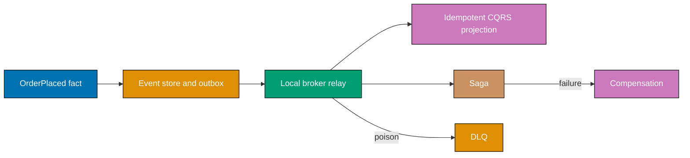

## Goal

Build one small event-driven order slice that proves the important recovery properties without an
external dependency: an event-sourced write stream rebuilds state deterministically; a CQRS read
model projects the stream; a transactional outbox survives the database-to-broker gap; an idempotent
consumer turns redelivery into one effect; a saga compensates a failed payment; and a poison fact
reaches a dead-letter queue.



## Concepts exercised

- [x] Pub/sub handoff and an in-process broker fake (`co-05`)
- [x] Event sourcing, deterministic replay, and a rebuildable state (`co-19`, `co-20`, `co-21`)
- [x] CQRS projection (`co-22`, `co-23`)
- [x] Transactional outbox (`co-24`, `co-25`)
- [x] Idempotent redelivery (`co-16`, `co-18`)
- [x] Saga compensation (`co-26`, `co-28`)
- [x] Dead-letter routing (`co-29`, `co-30`)

## Step 1: Append a fact and rebuild it

`OrderFlow.place` appends `OrderPlaced` to the event stream and to the outbox. `replay` folds the
immutable stream into the current state, so a lost read model is a rebuild operation rather than a
data-loss incident.

```python
flow = OrderFlow()  # => local aggregate, event store, and outbox begin empty
event = flow.place("o-1")  # => one immutable OrderPlaced fact enters both durable collections
print(flow.replay())  # => Output: {'o-1': 'placed'}
```

**Key takeaway**: State reconstruction depends only on stored facts.

**Why it matters**: Replay is deterministic because the reducer has no clock, random value, or
network dependency. A production store needs snapshotting for very long streams, but a snapshot must
always agree with a full replay of the same history.

## Step 2: Relay and project the read model

The relay removes a pending outbox record only after placing it on the local broker list. The consumer
projects the fact into a query model and remembers the message id, so a deliberate second consume
does not duplicate the visible effect.

```python
flow.relay()  # => pending outbox fact becomes a broker-deliverable fact
flow.consume(event)  # => idempotent projection records o-1 as placed
flow.consume(event)  # => redelivery is a no-op because the fact id was processed
print(flow.read_model)  # => Output: {'o-1': 'placed'}
```

**Key takeaway**: The outbox recovers publication; idempotency recovers delivery.

**Why it matters**: Neither mechanism alone closes the full failure gap. A crash after broker send
can repeat delivery, and a crash before broker send can defer it; the two patterns give one durable
business effect under both possibilities.

## Step 3: Compensate a failed workflow

The saga reserves inventory before attempting payment. A failed payment appends the business undo
`release-inventory`; it does not try to roll back another service’s database.

```python
completed = flow.saga(payment_succeeds=False)  # => payment failure follows a completed reservation
print(completed, flow.compensations)  # => Output: False ['release-inventory']
```

**Key takeaway**: Compensation is explicit, ordered domain work.

**Why it matters**: Distributed systems have no shared rollback switch. A compensating action must be
safe to retry and observable in the same way as the action it reverses, or recovery after a crash
simply creates a second partial failure.

## Step 4: Route poison facts to the DLQ

A poison fact skips normal projection and is retained in the DLQ for inspection and controlled replay.

```python
poison = Fact("poison:o-2", "OrderPlaced", "o-2")  # => known-bad message keeps its stable identity
flow.consume(poison, poison=True)  # => terminal routing preserves it outside the hot path
print([fact.id for fact in flow.dead_letters])  # => Output: ['poison:o-2']
```

**Key takeaway**: Poison messages must be visible and recoverable.

**Why it matters**: Retrying malformed data indefinitely consumes capacity and hides healthy work.
The DLQ is an operational queue with an owner, alerts, payload inspection, and idempotent replay
policy—not a place to quietly discard inconvenient failures.

## Run and verify

From `learning/capstone/code/`, run:

```text
python3 order_flow.py
python3 -m unittest -v test_order_flow.py
```

The tests prove deterministic replay equals the projected state, an outbox relay plus redelivery
applies one effect, failed payment compensates inventory, and poison data reaches the DLQ.
