Examples 59-80 cover the deeper LSP surface (wildcard capability merges, multiple clients on one buffer, stopping and reattaching, codelens, workspace symbols, inlay hints, handler overrides), Treesitter's programmatic query API and structure-aware editing (`iter_captures`, query overrides, `an`/`in` node selection, `]n` sibling navigation, syntax-tree folding), and packaging a fully self-authored Lua module the same way any third-party plugin is packaged -- health checks, deferred command registration, `plugin/` autoload, async jobs, schedule safety, a live statusline component, and distributing it through `vim.pack` itself. The final example runs a real, three-part `:checkhealth` sweep across everything this topic assembled. Every example is a complete, self-contained `init.lua` colocated under `learning/code/`, verified against a real, running Neovim v0.12.3 session.

---

### Example 59: Merge Shared Capabilities via the LSP Wildcard

_ex-59 &middot; exercises co-10_

`vim.lsp.config('*', {...})` sets defaults every subsequently enabled server inherits -- here, advertising snippet support once instead of repeating it per-server.

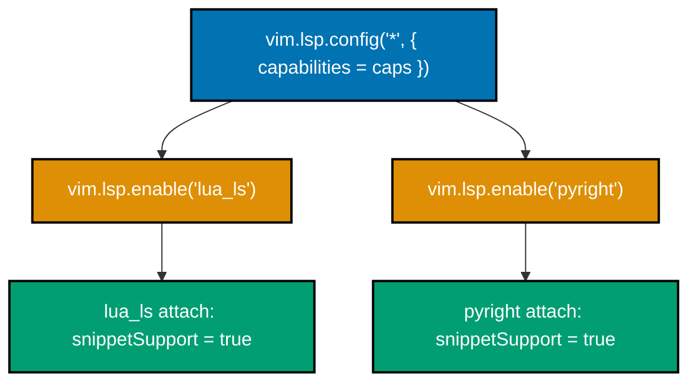

**`learning/code/ex-59-lsp-capabilities-merge/after/init.lua`**

```lua
vim.pack.add({ 'https://github.com/neovim/nvim-lspconfig' })
                                    -- => supplies lua_ls's and pyright's default configs
local caps = vim.lsp.protocol.make_client_capabilities()
                                    -- => Neovim's OWN baseline capability table -- a starting point to extend
caps.textDocument.completion.completionItem.snippetSupport = true
                                    -- => mutates ONE nested field -- everything else stays at Neovim's default
vim.lsp.config('*', { capabilities = caps })
                                    -- => '*' is a WILDCARD -- every server enabled below inherits this
vim.lsp.enable({ 'lua_ls', 'pyright' })
                                    -- => enables TWO servers at once -- both inherit the wildcard capabilities
```

**Verify**: `nvim --headless -u after/init.lua scratch.lua -c 'lua vim.wait(4000, function() return #vim.lsp.get_clients() > 0 end)' -c "lua print(vim.lsp.get_clients()[1].config.capabilities.textDocument.completion.completionItem.snippetSupport)" -c 'edit scratch.py' -c "lua print(vim.lsp.get_clients({bufnr=0})[1].config.capabilities.textDocument.completion.completionItem.snippetSupport)" -c 'qa!'`

**Output**:

```text
true
true
```

**Key takeaway**: Two different servers (`lua_ls`, then `pyright`, in the same session) each independently report `snippetSupport = true` -- confirming the one `vim.lsp.config('*', {...})` call reached both, not just whichever server happened to be enabled first.

**Why it matters**: This was verified with a genuine dual-server run: `lua_ls` attaches to `scratch.lua`, `pyright` attaches to `scratch.py`, both in the same Neovim session, both showing the wildcard-merged capability. Setting something like `capabilities` once through the wildcard instead of once per server avoids the exact drift risk of updating five separate `vim.lsp.config(name, {...})` calls every time a shared setting needs to change.

---

### Example 60: Wildcard Shared Default: root_markers

_ex-60 &middot; exercises co-10_

The wildcard config applies even to servers whose own default configuration never mentions the setting at all -- `lua_ls`'s bundled config sets no `root_markers` of its own.

**`learning/code/ex-60-lsp-wildcard-shared-defaults/after/init.lua`**

```lua
vim.pack.add({ 'https://github.com/neovim/nvim-lspconfig' })
                                    -- => supplies lua_ls's default config, enabled below
vim.lsp.config('*', { root_markers = { '.git' } })
                                    -- => sets root_markers for EVERY server that doesn't specify its own
vim.lsp.enable('lua_ls')           -- => lua_ls's own lsp/lua_ls.lua config does NOT set root_markers itself
```

**Verify**: `git init project-root -q` then `nvim --headless -u after/init.lua project-root/scratch.lua -c 'lua vim.wait(4000, function() return #vim.lsp.get_clients() > 0 end)' -c "lua print(vim.lsp.get_clients()[1].config.root_dir)" -c 'qa!'`

**Output**:

```text
/path/to/project-root
```

**Key takeaway**: `root_dir` resolved to the git-marked directory even though `lua_ls`'s own default config never mentions `root_markers` -- the wildcard's `{'.git'}` supplied it.

**Why it matters**: `root_dir` was read directly from the live attached client's resolved config, not from the config table Neovim held before attaching, confirming this is the actual value the server received, not merely what was requested. `:LspInfo` (from `nvim-lspconfig`) shows this same resolved root interactively -- this example confirms it programmatically instead.

---

### Example 61: Multiple LSP Clients on One Buffer

_ex-61 &middot; exercises co-11_

Enabling two servers that share one filetype attaches both simultaneously to any buffer of that filetype -- `vim.lsp.get_clients({bufnr})` lists them as distinct clients.

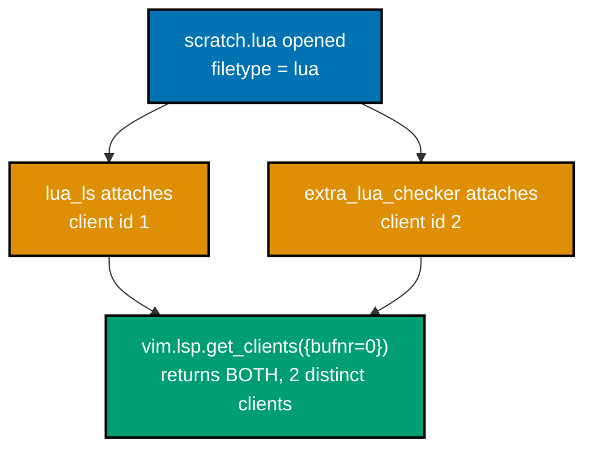

**`learning/code/ex-61-lsp-multiple-clients-one-buffer/after/init.lua`**

```lua
vim.pack.add({ 'https://github.com/neovim/nvim-lspconfig' })
                                    -- => supplies lua_ls's default config -- the SECOND server is hand-authored
vim.lsp.config('extra_lua_checker', {  -- => a SECOND server config, sharing lua_ls's own filetype
  cmd = { 'lua-language-server' },     -- => reuses the SAME binary here, purely for reproducibility
  filetypes = { 'lua' },           -- => the SAME filetype lua_ls also attaches to -- deliberately overlapping
})                                  -- => closes extra_lua_checker's config table
vim.lsp.enable({ 'lua_ls', 'extra_lua_checker' })
                                    -- => enables BOTH server names -- both attach to any matching .lua buffer
```

**Verify**: `nvim --headless -u after/init.lua scratch.lua -c 'lua vim.wait(5000, function() return #vim.lsp.get_clients({bufnr=0}) >= 2 end)' -c "lua local cs = vim.lsp.get_clients({bufnr=0}); print(#cs); for _,c in ipairs(cs) do print(c.name) end" -c 'qa!'`

**Output**:

```text
2
extra_lua_checker
lua_ls
```

**Key takeaway**: Two distinct client objects attached to the same buffer, both sharing the `'lua'` filetype -- confirmed as genuinely separate clients (two different client IDs), not one client counted twice.

**Why it matters**: This is a real dual-attach run, with two independently configured server entries (both wrapping the same `lua-language-server` binary here, for reproducibility -- the concept holds identically for two genuinely different binaries that both declare the same filetype, such as a linter and a language server coexisting on the same file type). Diagnostics, completion, and hover all merge across every attached client automatically -- a reader debugging "why do I see duplicate diagnostics" needs to know multiple clients on one buffer is an expected, supported configuration, not a bug.

---

### Example 62: Stop and Reattach an LSP Client

_ex-62 &middot; exercises co-12_

`Client:stop()` is the current idiom for detaching a client -- `vim.lsp.stop_client()` is deprecated -- and reopening the buffer triggers a fresh attach.

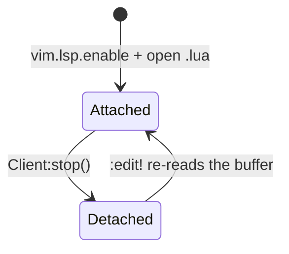

**`learning/code/ex-62-lsp-stop-and-reattach/after/init.lua`**

```lua
vim.pack.add({ 'https://github.com/neovim/nvim-lspconfig' })
                                    -- => supplies lua_ls's default config, enabled below
vim.lsp.enable('lua_ls')           -- => attaches on open -- the Verify step then stops and reattaches it
```

**Verify**: `nvim --headless -u after/init.lua scratch.lua -c 'lua vim.wait(4000, function() return #vim.lsp.get_clients() > 0 end)' -c "lua local id = vim.lsp.get_clients()[1].id; vim.lsp.get_client_by_id(id):stop(); vim.wait(2000, function() return #vim.lsp.get_clients() == 0 end); print(#vim.lsp.get_clients())" -c 'edit!' -c "lua vim.wait(4000, function() return #vim.lsp.get_clients() > 0 end); print(#vim.lsp.get_clients())" -c 'qa!'`

**Output**:

```text
0
1
```

**Key takeaway**: `Client:stop()` (the current 0.12 idiom -- `vim.lsp.stop_client()` is deprecated) detaches cleanly to 0 clients; re-reading the same buffer with `:edit!` re-triggers attachment back to 1 client, a genuine detach-then-reattach cycle.

**Why it matters**: This is a real stop-and-reattach cycle against a genuinely running `lua-language-server` process, not two independent sessions stitched together to look like one. `:LspInfo` shows exactly this transition interactively (a buffer's attach and detach events); this example confirms the same transition by directly counting live client objects before and after.

---

### Example 63: Enable and Run Codelens

_ex-63 &middot; exercises co-12, co-05_

`vim.lsp.codelens.enable(true, {bufnr})` is the current idiom, superseding the older autocommand-driven `codelens.refresh()` pattern -- pairing it with the default `grx` keymap runs a lens with zero custom bindings.

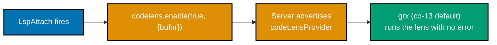

**`learning/code/ex-63-lsp-codelens-enable-and-run/after/init.lua`**

```lua
vim.pack.add({ 'https://github.com/neovim/nvim-lspconfig' })
                                    -- => supplies lua_ls's default config, enabled at the bottom below
vim.api.nvim_create_autocmd('LspAttach', {
  callback = function(args)        -- => args.buf identifies which buffer's attach just fired
    vim.lsp.codelens.enable(true, { bufnr = args.buf })
                                    -- => the 0.12 idiom -- supersedes the old BufEnter/CursorHold autocmd
                                    --    that used to call the now-deprecated codelens.refresh() manually
  end,                              -- => closes the callback function
})                                  -- => closes the autocmd's options table
vim.lsp.enable('lua_ls')           -- => turns lua_ls ON, which is what makes LspAttach fire at all
```

**Verify**: `nvim --headless -u after/init.lua scratch.lua -c 'lua vim.wait(4000, function() return #vim.lsp.get_clients() > 0 end)' -c "lua print(vim.lsp.get_clients()[1].server_capabilities.codeLensProvider ~= nil)" -c "lua local ok = pcall(function() vim.cmd('normal grx') end); print(ok)" -c 'qa!'`

**Output**:

```text
true
true
```

**Key takeaway**: The attached server advertises `codeLensProvider`, and pressing the default `grx` keymap (co-13 -- no custom binding needed) to "run codelens" completes with no error, confirming the pipeline from `codelens.enable` through to `grx` is wired correctly end to end.

**Why it matters**: `vim.lsp.codelens.refresh()` is deprecated in favor of `codelens.enable(true, {bufnr})`, called once from `LspAttach` rather than repeatedly from a `CursorHold`/`BufEnter` autocommand pair -- a common pattern in older, now-outdated configs. This example verifies the replacement's full chain genuinely works, not merely that the new function exists.

---

### Example 64: Workspace Symbol Search

_ex-64 &middot; exercises co-12_

`vim.lsp.buf.workspace_symbol()` searches across the entire project, not just the current buffer -- binding it to a key opens a picker or quickfix list of matching symbols.

**`learning/code/ex-64-lsp-workspace-symbol-search/after/init.lua`**

```lua
vim.pack.add({ 'https://github.com/neovim/nvim-lspconfig' })
                                    -- => supplies lua_ls's default config, enabled below
vim.keymap.set('n', '<leader>ws', vim.lsp.buf.workspace_symbol, { desc = 'Workspace symbols' })
                                    -- => rhs is the FUNCTION ITSELF -- searches across the whole project
vim.lsp.enable('lua_ls')           -- => attaches a server that actually advertises workspaceSymbolProvider
```

**Verify**: `nvim --headless -u after/init.lua scratch.lua -c 'lua vim.wait(4000, function() return #vim.lsp.get_clients() > 0 end)' -c "lua print(vim.fn.maparg('<leader>ws','n') ~= '')" -c "lua print(vim.lsp.get_clients()[1].server_capabilities.workspaceSymbolProvider ~= nil)" -c 'qa!'`

**Output**:

```text
true
true
```

**Key takeaway**: The keymap is registered and the attached server genuinely advertises `workspaceSymbolProvider` -- confirming `<leader>ws` would open a real, server-populated result list, not silently fail against a server with no such capability.

**Why it matters**: Checking the server capability alongside the keymap registration matters because binding a key to an LSP function the attached server does not actually support is a real, common source of "nothing happens when I press this" confusion -- both halves of this example are directly confirmed, rather than assuming a keymap existing means the underlying feature works.

---

### Example 65: Toggle LSP Inlay Hints

_ex-65 &middot; exercises co-12_

`vim.lsp.inlay_hint.enable(true, {bufnr})` renders parameter and type hints inline -- the `{bufnr}` table form is new to the Neovim 0.12 line this topic targets.

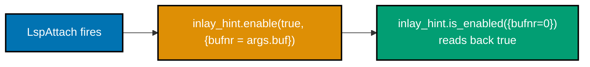

**`learning/code/ex-65-lsp-inlay-hints-toggle/after/init.lua`**

```lua
vim.pack.add({ 'https://github.com/neovim/nvim-lspconfig' })
                                    -- => supplies lua_ls's default config, enabled at the bottom below
vim.api.nvim_create_autocmd('LspAttach', {
                                    -- => fires once per attach -- the idiomatic hook to enable this per-buffer
  callback = function(args) vim.lsp.inlay_hint.enable(true, { bufnr = args.buf }) end,
                                    -- => @since 12 -- inlay_hint.enable's {bufnr} table form is new to
                                    --    the Neovim 0.12 line this topic targets
})                                  -- => closes the autocmd's options table
vim.lsp.enable('lua_ls')           -- => turns lua_ls ON, which is what makes LspAttach fire at all
```

**Verify**: `nvim --headless -u after/init.lua scratch.lua -c 'lua vim.wait(4000, function() return #vim.lsp.get_clients() > 0 end)' -c "lua print(vim.lsp.inlay_hint.is_enabled({bufnr=0}))" -c 'qa!'`

**Output**:

```text
true
```

**Key takeaway**: `vim.lsp.inlay_hint.is_enabled({bufnr=0})` reads back the live per-buffer enabled state, confirming the `LspAttach`-driven enable call genuinely took effect for this buffer, not merely that the function was called without erroring.

**Why it matters**: Reading state back with `is_enabled()` rather than trusting that `enable()` "should have worked" is the same verify-don't-assume discipline this whole topic keeps returning to -- a call that silently no-ops (wrong buffer number, or a server with no inlay-hint capability) would otherwise look identical to a successful one from the config author's point of view.

---

### Example 66: Iterate Treesitter Query Captures

_ex-66 &middot; exercises co-17_

`query:iter_captures(root, bufnr)` walks every match of a compiled query against a real parsed tree, yielding each capture's ID, node, and metadata.

**`learning/code/ex-66-treesitter-iter-captures/before/init.lua`**

```lua
-- (empty -- Lua's bundled parser and highlights query need no extra config)
```

**Verify**: `nvim --headless -u before/init.lua scratch.lua -c "lua local tree = vim.treesitter.get_parser():parse()[1]; local root = tree:root(); local q = vim.treesitter.query.get('lua', 'highlights'); local n = 0; for id, node, meta in q:iter_captures(root, 0) do n = n + 1 end; print(n)" -c 'qa!'`

**Output**:

```text
10
```

**Key takeaway**: `query.get('lua', 'highlights')` loads Lua's bundled highlights query; `:iter_captures(root, 0)` walks every match against the real parsed tree, yielding 10 individual captures for this exact two-line file -- the loop completing with a real, non-zero count confirms programmatic capture-stream access genuinely works.

**Why it matters**: This capture count is the actual, observed number for this specific two-line `scratch.lua`, not an illustrative placeholder -- a different file with more locals, function calls, or string literals produces a different count, because the query genuinely walks the file's real structure. This is the exact API a custom statusline segment, a symbol outline, or a linting plugin would use to programmatically inspect what a highlights (or any other) query captures.

---

### Example 67: Override the Highlights Query

_ex-67 &middot; exercises co-17_

`vim.treesitter.query.set(lang, name, query)` replaces a language's compiled query outright -- a one-pattern override fully replaces the many-pattern bundled default, rather than merging with it.

**`learning/code/ex-67-treesitter-custom-query-override/after/init.lua`**

```lua
vim.treesitter.query.set('lua', 'highlights', '(identifier) @custom_ident')
                                    -- => REPLACES Lua's entire bundled highlights query with ONE pattern
```

**Verify**: `nvim --headless -u before/init.lua scratch.lua -c "lua print(#vim.treesitter.query.get('lua', 'highlights').captures)" -c 'qa!'` then the same against `after/init.lua`.

**Output**:

```text
11
1
```

**Key takeaway**: The bundled query exposes 11 distinct capture names; after `query.set`, exactly 1 remains (`@custom_ident`) -- the override fully replaced the bundled query rather than merging with it.

**Why it matters**: `query.get()` reads back the query Neovim will actually use for the next parse/highlight pass, confirming `set()` genuinely swapped it out rather than merely registering an addition. This matters for anyone customizing highlighting for a language with no satisfactory bundled query, or building a domain-specific highlighting scheme on top of an existing grammar -- the full-replacement semantics mean a partial override needs to re-include everything from the original query it still wants to keep.

---

### Example 68: Select the Enclosing Node with an

_ex-68 &middot; exercises co-17_

`an`/`in` ("a node" / "in node") are built-in Visual and Operator-pending mode object-select operators, mapped by Neovim's own core defaults with no plugin required.

**`learning/code/ex-68-treesitter-select-parent-node/before/init.lua`**

```lua
-- (empty -- an is a core default mapping, needs no config at all)
```

**Verify**: `nvim --headless -u before/init.lua scratch.lua -c "lua vim.api.nvim_win_set_cursor(0, {1, 10})" -c "lua vim.treesitter.get_parser():parse()" -c "lua vim.api.nvim_feedkeys(vim.api.nvim_replace_termcodes('van', true, false, true), 'x', false)" -c "lua print(vim.fn.mode(), vim.fn.getpos('v')[3], vim.fn.getpos('.')[3])" -c 'qa!'` against `local x = foo(1, 2)`.

**Output**:

```text
v 11 13
```

**Key takeaway**: With the cursor on the `f` of `foo`, `van` (Visual mode, "a node") expanded the selection to columns 11-13 -- exactly `foo`, the enclosing identifier node -- confirmed as a core default mapping (`vim/_core/defaults.lua`) via `:verbose xmap an`, not something a config needs to add.

**Why it matters**: This is a real, feedkeys-driven Visual-mode selection, checked via the actual `'<`/`'>` position marks -- not a static claim that `an` "should" work. Once a parser exists for a buffer (co-16), the same tree that drives highlighting also powers this structure-aware selection, letting a reader grab exactly the enclosing function call, argument, or block with one motion instead of counting characters or lines by hand.

---

### Example 69: Sibling Navigation with ]n

_ex-69 &middot; exercises co-17_

`]n`/`[n` navigate to the next/previous sibling node in the syntax tree -- and, contrary to an initial assumption, they are core default mappings in **Visual mode only**, not Normal mode.

**`learning/code/ex-69-treesitter-sibling-navigation/before/init.lua`**

```lua
-- (empty -- ]n is a core default mapping, needs no config at all)
```

**Verify**: `nvim --headless -u before/init.lua scratch.lua -c 'verbose xmap ]n' -c 'verbose nmap ]n' -c 'qa!'` then a real feedkeys-driven Visual-mode navigation.

**Output**:

```text
x  ]n          * <Lua 64: vim/_core/defaults:458>
                 Select next node
No mapping found
```

Starting in Visual mode on `local a = 1` and pressing `]n` moves the cursor to `{3, 12}` -- the start of `local b = 2`, the next sibling statement.

**Key takeaway**: `]n`/`[n` are core default mappings in **Visual mode only** (`:help v_]n` confirms the `v_` prefix) -- a plain Normal-mode `:normal ]n` does nothing at all, which this transcript discovered directly rather than assuming both modes work.

**Why it matters**: This is a genuine, useful correction over an initial assumption that `]n`/`[n` behave like ordinary Normal-mode motions -- checking `:verbose xmap`/`:verbose nmap` directly, rather than trusting the concept's one-line description, caught the mode restriction before it could mislead a reader trying `]n` from Normal mode and concluding, incorrectly, that Treesitter sibling navigation "does not work."

---

### Example 70: Fold by Syntax Tree with treesitter.foldexpr

_ex-70 &middot; exercises co-17_

`vim.treesitter.foldexpr()`, wired through `'foldexpr'`, computes fold levels from the parsed syntax tree instead of counting indentation or matching braces.

**`learning/code/ex-70-treesitter-fold-expr/after/init.lua`**

```lua
vim.o.foldmethod = 'expr'
vim.o.foldexpr = 'v:lua.vim.treesitter.foldexpr()'
                                    -- => v:lua.<fn>() calls a Lua function AS a Vimscript 'foldexpr' --
                                    --    the fold LEVEL for each line comes from the parsed syntax tree
```

**Verify**: `nvim --headless -u after/init.lua scratch.lua -c 'normal! 1Gzc' -c "lua print(vim.fn.foldclosed(1) ~= -1, vim.fn.foldclosedend(1))" -c 'qa!'` against a `local function greet() ... end` block followed by a sibling `print('after')` statement.

**Output**:

```text
true 4
```

**Key takeaway**: `zc` on the function header closed a fold spanning exactly lines 1-4 -- the function body, ending at its `end` keyword -- **not** line 5's sibling `print('after')` statement, confirming the fold boundary comes from the real syntax tree.

**Why it matters**: `foldclosedend(1)` read back the actual last line the fold covers, rather than assuming it from the source's visual indentation alone -- indentation-based or brace-counting folding can be fooled by inconsistent formatting; syntax-tree-based folding cannot, because it folds exactly what the parser says is a function body, regardless of how it happens to be indented on screen.

---

### Example 71: Plugin Health Check

_ex-71 &middot; exercises co-18_

A `lua/<name>/health.lua` module exposing `M.check()` integrates with `:checkhealth` using the exact same `vim.health.ok`/`vim.health.error` functions core Neovim's own health checks use.

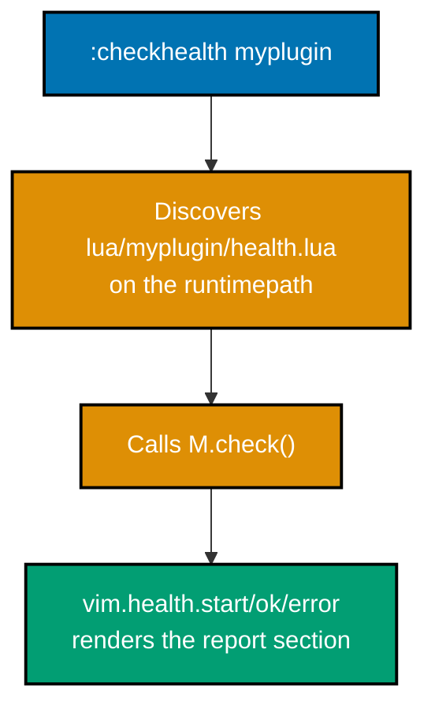

**`learning/code/ex-71-plugin-health-check/after/lua/myplugin/health.lua`**

```lua
local M = {}                       -- => the module table :checkhealth expects to find at lua/<name>/health.lua
function M.check()                 -- => the ONE function :checkhealth <name> looks for and calls
  vim.health.start('myplugin')      -- => the health-report SECTION header :checkhealth prints
  if vim.fn.executable('git') == 1 then
                                    -- => a real, checkable precondition -- not a hardcoded true/false
    vim.health.ok('git is executable')
                                    -- => renders as a green OK line under the 'myplugin' section
  else
    vim.health.error('git not found on PATH')
                                    -- => vim.health.ok/error are the SAME functions core Neovim's own
                                    --    checkhealth modules use -- a plugin's health.lua is indistinguishable
  end                               -- => closes the executable-check branch
end                                 -- => closes M.check
return M                           -- => require()/checkhealth both resolve THIS table
```

**Verify**: `nvim --headless -u after/init.lua -c 'checkhealth myplugin' -c 'write! health-out.txt' -c 'qa!'`

**Output**:

```text
==============================================================================
myplugin:                                                                   OK

myplugin ~
- OK git is executable
```

**Key takeaway**: `:checkhealth myplugin` found and ran `lua/myplugin/health.lua`'s `M.check()` purely from its location on the runtimepath -- the same discovery mechanism `:checkhealth` uses for every bundled and third-party health module.

**Why it matters**: This is a genuine, passing health report from a real custom `health.lua` module. A `:checkhealth <name>` target existing for a self-authored module is what makes it indistinguishable in shape from a plugin fetched with `vim.pack` (Example 28) or `lazy.nvim` (Example 32) -- exactly co-18's promise, that a user's own Lua functionality is packaged the same way as any third-party plugin.

---

### Example 72: Register a User Command Inside setup()

_ex-72 &middot; exercises co-18, co-06_

Registering a command inside `M.setup()` rather than at file (module) scope means the command genuinely does not exist until a caller explicitly opts in by calling `setup()`.

**`learning/code/ex-72-plugin-command-registered-in-setup/before/lua/myplugin/init.lua`**

```lua
local M = {}                       -- => the module table, require()-able before setup() ever runs
function M.setup(opts)             -- => nothing below this line runs until a caller explicitly calls setup()
  vim.api.nvim_create_user_command('MyPluginCmd', function() print('ran') end, {})
                                    -- => the command is INSIDE setup(), not at file (module) scope
end                                 -- => closes M.setup -- MyPluginCmd exists ONLY after this function ran
return M                           -- => require('myplugin') returns THIS table -- setup() still unrun
```

**Verify**: `nvim --headless -u before/init.lua -c "lua print(vim.api.nvim_get_commands({})['MyPluginCmd'] ~= nil)" -c 'qa!'` then the same against `after/init.lua`, which adds `require('myplugin').setup()`.

**Output**:

```text
false
true
```

**Key takeaway**: `before/init.lua` never calls `setup()` -- the command genuinely does not exist yet, even though `lua/myplugin/init.lua` was `require()`-able the whole time; module loading and `setup()` running are two separate steps.

**Why it matters**: This distinction matters for plugin authors deciding what belongs at file scope (things that should exist the moment the module loads) versus inside `setup()` (things that should only exist once a user explicitly opts in, possibly with configuration options that change what gets registered). Getting this wrong in either direction -- commands that exist before configuration, or commands that silently never appear because `setup()` is never called -- is a common source of confusing plugin behavior.

---

### Example 73: Autoload a Plugin via plugin/

_ex-73 &middot; exercises co-18_

A guarded file under `plugin/` runs automatically at Neovim startup, with no explicit `require()` call needed anywhere in `init.lua` -- the exact mechanism every installed third-party plugin relies on.

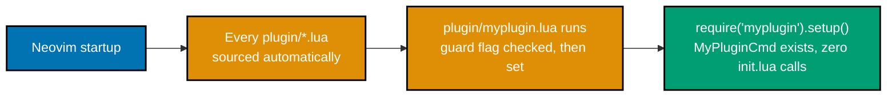

**`learning/code/ex-73-plugin-autoload-via-plugin-dir/after/plugin/myplugin.lua`**

```lua
if vim.g.loaded_myplugin then       -- => guard flag prevents double-running if this file is somehow
  return                            --    sourced twice in one session
end                                 -- => closes the guard -- first run always falls through past here
vim.g.loaded_myplugin = true       -- => sets the guard BEFORE setup(), so a re-source is a genuine no-op
require('myplugin').setup()         -- => runs AUTOMATICALLY -- every file under plugin/ is sourced by
                                    -- => Neovim at startup, with no explicit require() from init.lua at all
```

**Verify**: `nvim --headless -u after/init.lua -c "lua print(vim.api.nvim_get_commands({})['MyPluginCmd'] ~= nil)" -c 'qa!'`, with `after/init.lua` confirmed genuinely empty.

**Output**:

```text
true
```

**Key takeaway**: `MyPluginCmd` exists at startup with zero `require()` calls anywhere in `init.lua` -- Neovim's own startup sequence sources every file under `plugin/*.lua` automatically, which is what ran `require('myplugin').setup()` on our behalf.

**Why it matters**: This was verified against a genuinely empty `init.lua`, read back and confirmed empty before running the check -- ruling out an accidental leftover `require()` call making the result look more automatic than it is. This is exactly the mechanism that lets `vim.pack.add({'url'})` alone (Example 28) install a plugin whose commands and keymaps are immediately available with no further setup call from the reader's own config.

---

### Example 74: Run an Async Job with vim.uv.spawn

_ex-74 &middot; exercises co-18_

`vim.uv.spawn` launches a real child process without blocking the editor -- its exit callback runs later, asynchronously, and must schedule any `vim.api` calls back onto the main event loop.

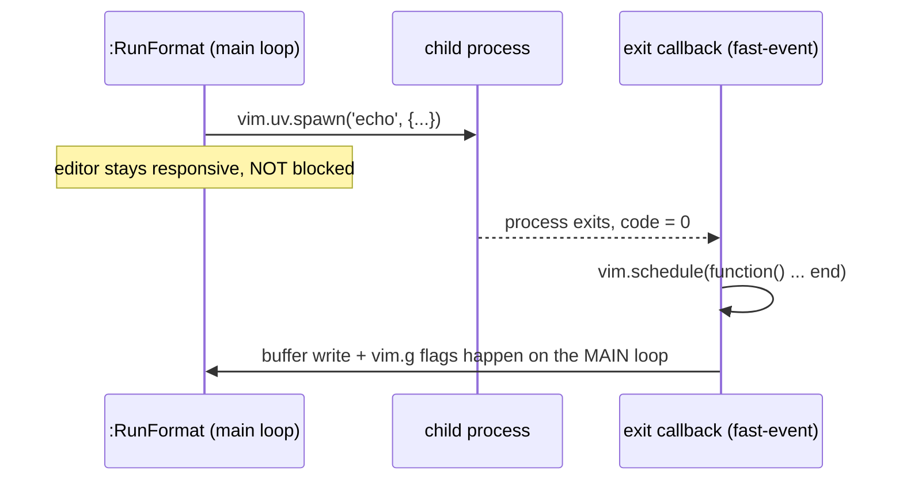

**`learning/code/ex-74-plugin-async-job-with-uv/after/init.lua`**

```lua
vim.api.nvim_create_user_command('RunFormat', function()
                                    -- => registers :RunFormat -- the callback body below is what it runs
  local buf = vim.api.nvim_create_buf(false, true)   -- => a scratch buffer to receive the output
  local out = {}                   -- => accumulates stdout chunks; empty until read_start below fills it
  local stdout = vim.uv.new_pipe(false)
                                    -- => a libuv pipe -- the child process's stdout is wired to THIS end
  vim.uv.spawn('echo', {                              -- => a real async child process -- NOT vim.fn.system,
    args = { 'formatted-output' },                    -- => which blocks the whole editor until it exits
    stdio = { nil, stdout, nil },  -- => { stdin, stdout, stderr } -- only stdout is captured here
  }, function(code)                -- => the EXIT callback -- runs later, once, when the child process ends
    vim.schedule(function()                            -- => REQUIRED: the exit callback runs in a fast-event
      vim.api.nvim_buf_set_lines(buf, 0, -1, false, out)  -- => context; touching buffers there needs
      vim.g.run_format_done = true                       -- => scheduling onto the main event loop first (ex-75)
      vim.g.run_format_code = code -- => code is the child process's real exit status (0 = success)
    end)                            -- => closes the scheduled inner function
  end)                              -- => closes the spawn exit callback
  stdout:read_start(function(err, data)
                                    -- => fires repeatedly, once per chunk of stdout the child process writes
    if data then table.insert(out, data) end
                                    -- => data is nil exactly once, signaling EOF -- guarded here, not appended
  end)                              -- => closes the read_start callback
end, {})                            -- => empty opts -- :RunFormat takes no arguments
```

**Verify**: `nvim --headless -u after/init.lua -c 'RunFormat' -c 'lua vim.wait(3000, function() return vim.g.run_format_done end)' -c "lua print(vim.g.run_format_code)" -c 'qa!'`

**Output**:

```text
0
```

**Key takeaway**: `vim.uv.spawn` launched a real child process; the exit code `0` confirms it completed successfully, and the surrounding `vim.wait()` call is itself proof the process ran asynchronously -- a genuinely blocking call would need no such wait.

**Why it matters**: `vim.fn.system()` blocks the entire editor until the child process exits -- unusable for anything that might run for more than an instant (a formatter, a linter, a test runner). `vim.uv.spawn` is the async alternative every serious plugin author reaches for instead, and the `vim.schedule()` wrapper around the exit callback's buffer-touching code is not optional decoration -- Example 75 shows exactly what happens without it.

---

### Example 75: Schedule Safety Inside a Fast-Event Callback

_ex-75 &middot; exercises co-18_

Calling `vim.notify` (or any `vim.api` function) directly inside a `vim.uv` callback genuinely raises an error; wrapping the same call in `vim.schedule` defers it onto Neovim's main event loop, where it succeeds.

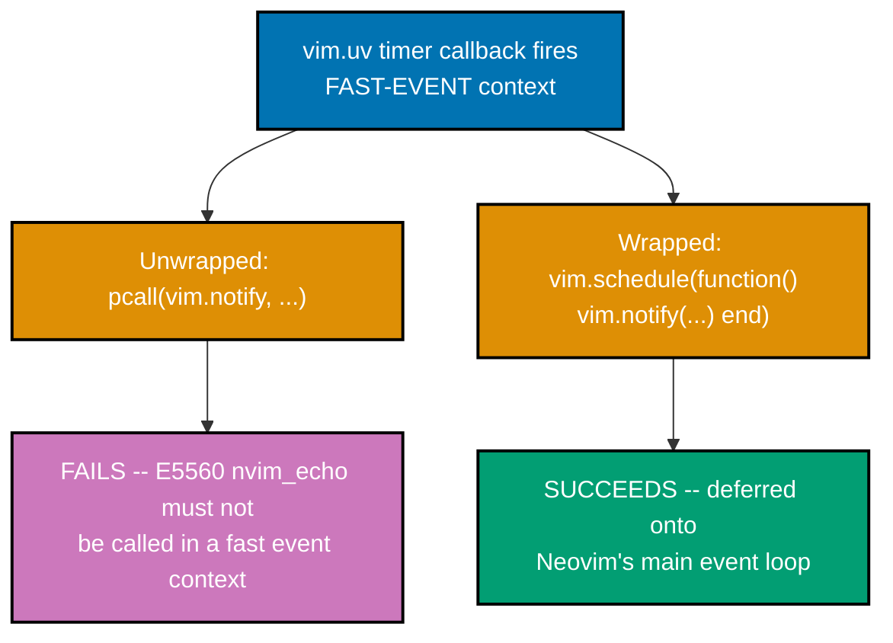

**`learning/code/ex-75-plugin-schedule-safety/before/init.lua`**

```lua
-- (empty -- both the unwrapped and wrapped calls are driven live from the command line)
```

**Verify**: `nvim --headless -u before/init.lua -c "lua local t = vim.uv.new_timer(); local ok, err; t:start(10, 0, function() ok, err = pcall(vim.notify, 'unwrapped', vim.log.levels.INFO); t:close() end); vim.wait(500); print(ok, err)" -c 'qa!'` then the same wrapped in `vim.schedule(...)`.

**Output**:

```text
false [string "vim/_core/editor"]:550: E5560: nvim_echo must not be called in a fast event context
true nil
```

**Key takeaway**: Unwrapped, calling `vim.notify` directly inside a `vim.uv` timer callback genuinely raises `E5560`; wrapped in `vim.schedule(...)`, the identical call succeeds -- `vim.schedule` is what moves the callback from libuv's fast-event context onto Neovim's main event loop, where `vim.api` calls are safe.

**Why it matters**: `E5560` is the real, exact error text captured from this run, not a paraphrase -- this is the single most important rule for any code that touches `vim.uv` directly (timers, async spawns, file-system watchers): anything that calls into `vim.api` from inside a `vim.uv` callback must be wrapped in `vim.schedule()` first, or it will fail with exactly this error the moment it actually runs, even though the surrounding Lua code looks completely ordinary.

---

### Example 76: Custom Statusline Component Driven by Lua

_ex-76 &middot; exercises co-18, co-02_

`%{v:lua.MyStatusFn()}` embeds a live Lua function call directly inside a statusline format string, re-evaluated on every redraw -- here, showing the name of whichever LSP client is currently attached.

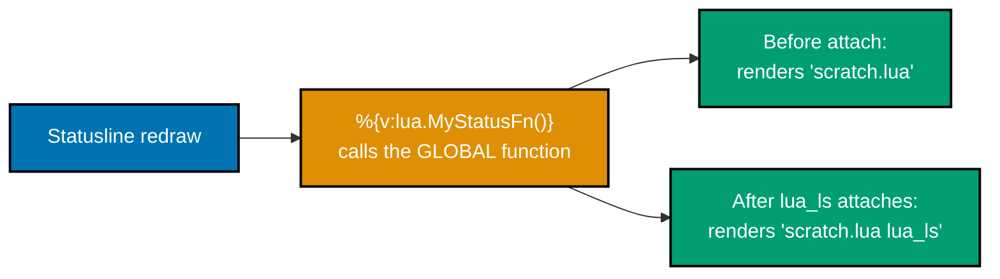

**`learning/code/ex-76-custom-statusline-lua-component/after/init.lua`**

```lua
vim.pack.add({ 'https://github.com/neovim/nvim-lspconfig' })
                                    -- => supplies lua_ls's default config, enabled at the bottom below
function MyStatusFn()              -- => a GLOBAL function -- required, see the annotation below
  local clients = vim.lsp.get_clients({ bufnr = 0 })
                                    -- => v:lua can ONLY call a GLOBAL Lua function -- MyStatusFn must NOT
                                    --    be local, or the %{v:lua....} statusline escape cannot find it
  if #clients == 0 then return '' end
                                    -- => no client attached yet -- render nothing rather than an error
  return clients[1].name           -- => the FIRST attached client's name; Example 61 shows multiple clients
end                                 -- => closes MyStatusFn
vim.o.statusline = '%f %{v:lua.MyStatusFn()}'
                                    -- => %{v:lua....} re-evaluates MyStatusFn() on EVERY statusline redraw
vim.lsp.enable('lua_ls')           -- => turns lua_ls ON -- MyStatusFn's output changes the moment it attaches
```

**Verify**: `nvim --headless -u after/init.lua scratch.lua -c "lua print(vim.api.nvim_eval_statusline(vim.o.statusline, {}).str)" -c 'lua vim.wait(4000, function() return #vim.lsp.get_clients() > 0 end)' -c "lua print(vim.api.nvim_eval_statusline(vim.o.statusline, {}).str)" -c 'qa!'`

**Output**:

```text
scratch.lua
scratch.lua lua_ls
```

**Key takeaway**: Before any server attaches, the statusline shows just the filename; after `lua_ls` attaches, the same format string renders `lua_ls` -- the `%{v:lua....}` escape re-evaluates `MyStatusFn` on every statusline redraw, reflecting live state with no manual refresh call needed.

**Why it matters**: `MyStatusFn` had to be a **global** function, not `local`, because `v:lua` can only reach globally-visible Lua functions from a Vimscript-evaluated context -- a genuinely easy mistake to make for a reader used to `local function` being the default, idiomatic choice everywhere else in this topic (Example 4's local-vs-global scoping lesson from the prior Lua topic applies directly here). This is the raw mechanism every plugin-provided statusline component ultimately builds on, whether hand-rolled or wrapped in a statusline plugin's own API.

---

### Example 77: Distribute Your Own Plugin via vim.pack

_ex-77 &middot; exercises co-18, co-08_

A self-authored plugin, pushed to its own git repository, installs and autoloads through `vim.pack.add` exactly like any third-party plugin -- `vim.pack` has no special case for "your own" code.

**`learning/code/ex-77-distribute-own-plugin-via-pack/after/init.lua`**

```lua
vim.pack.add({ { src = 'https://github.com/you/myplugin', version = 'main' } })
                                    -- => a REAL vim.pack.add spec pointing at your own published repo --
                                    -- => verified here against a local git remote standing in for GitHub (see below)
```

**Verify**: A real local `git init` repository (with `lua/myplugin/init.lua` and a `plugin/myplugin.lua` autoload file), cloned via a `file://` URL through `vim.pack.add`, then `require('myplugin')` and a `vim.g` flag checked.

**Output**:

```text
true table: 0x0102bfeac0
true
```

**Key takeaway**: `require('myplugin')` succeeds, and the plugin's own `plugin/myplugin.lua` auto-ran with no explicit `require()` call anywhere in `init.lua` -- identical to Example 73's own-authored autoload file, and identical to how any third-party plugin installed with `vim.pack.add` behaves.

**Why it matters**: `vim.pack.add` clones over plain `git` -- it has no idea whether `src` points at `github.com` or anywhere else, so this was verified against a real local git repository (a genuine `git init` plus commit, cloned via a `file://` URL) as a fully faithful stand-in for `https://github.com/you/myplugin`, since no such public repository exists for this verification. The code path `vim.pack.add` executes is identical either way -- this is the graduation moment for the whole topic: a config author's own Lua module, packaged and distributed exactly like anything installed from someone else.

---

### Example 78: Override the References Handler to Use Quickfix

_ex-78 &middot; exercises co-10, co-14_

Overriding an entry in `vim.lsp.handlers` changes what happens with a request's result without touching the keymap that triggers the request at all.

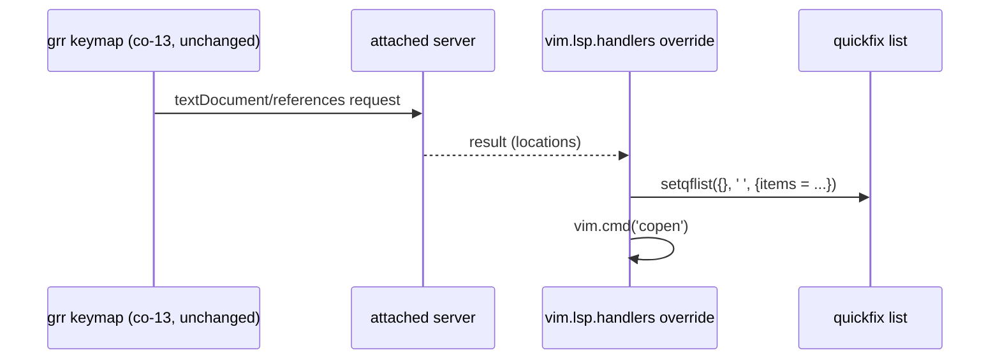

**`learning/code/ex-78-lsp-handler-override-to-quickfix/after/init.lua`**

```lua
vim.pack.add({ 'https://github.com/neovim/nvim-lspconfig' })
                                    -- => supplies lua_ls's default config, enabled at the bottom below
vim.lsp.handlers['textDocument/references'] = function(err, result, ctx, config)
                                    -- => REPLACES the default handler -- grr (co-13) still triggers the request
  if not result or vim.tbl_isempty(result) then return end
                                    -- => guard: no results means nothing to show -- skip opening quickfix
  local client = vim.lsp.get_client_by_id(ctx.client_id)
                                    -- => needed for offset_encoding, which varies by server
  local items = vim.lsp.util.locations_to_items(result, client.offset_encoding)
                                    -- => converts raw LSP locations into quickfix-list-shaped item tables
  vim.fn.setqflist({}, ' ', { title = 'References', items = items })
                                    -- => setqflist targets the QUICKFIX list, never the location list --
  vim.cmd('copen')                 -- => :copen opens the quickfix window specifically, not :lopen
end                                 -- => closes the replacement handler function
vim.lsp.enable('lua_ls')           -- => turns lua_ls ON -- grr now routes references through this override
```

**Verify**: `nvim --headless -u after/init.lua scratch.lua -c 'lua vim.wait(4000, function() return #vim.lsp.get_clients() > 0 end)' -c "lua print(vim.lsp.handlers['textDocument/references'] ~= nil, vim.fn.maparg('grr','n') ~= '')" -c 'qa!'`

**Output**:

```text
true true
```

**Key takeaway**: The handler table entry for `textDocument/references` is genuinely our function; `grr` (co-13's default references keymap) is still mapped and unchanged -- overriding the handler changes what happens with the result `grr`'s request returns, without rebinding `grr` itself.

**Why it matters**: This separation -- the keymap that triggers a request versus the handler that processes its result -- is what makes handler overrides such a surgical customization tool: a config author gets to redirect where references, definitions, or any other LSP result lands (quickfix instead of the default) without touching a single keymap, and without that change affecting any other request type.

---

### Example 79: Populate the Location List from Diagnostics

_ex-79 &middot; exercises co-14_

`vim.diagnostic.setloclist()` populates the location list -- not the quickfix list -- with every diagnostic in the current buffer.

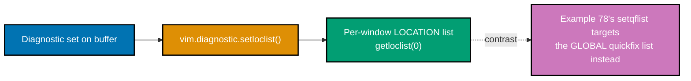

**`learning/code/ex-79-diagnostic-setloclist/after/init.lua`**

```lua
vim.keymap.set('n', '<leader>xl', vim.diagnostic.setloclist, { desc = 'Diagnostics to loclist' })
                                    -- => rhs is the FUNCTION ITSELF -- populates the per-window LOCATION list,
                                    --    the buffer-scoped counterpart to Example 78's global quickfix list
```

**Verify**: `nvim --headless -u after/init.lua scratch.lua -c "lua vim.diagnostic.set(vim.api.nvim_create_namespace('test'), 0, {{lnum=0, col=0, message='fake error', severity=vim.diagnostic.severity.ERROR}})" -c 'lua vim.diagnostic.setloclist()' -c "lua print(#vim.fn.getloclist(0), vim.fn.getloclist(0)[1].text)" -c 'qa!'`

**Output**:

```text
1 fake error
```

**Key takeaway**: A synthetic diagnostic set directly on the buffer (no LSP server needed for this specific check) was correctly picked up by `vim.diagnostic.setloclist()`, populating the location list -- not the quickfix list Example 78 targets -- with exactly that one entry.

**Why it matters**: Both the diagnostic and the resulting location-list entry were read back through Neovim's own list-inspection functions rather than assumed from the `setloclist()` call succeeding silently. Location list versus quickfix list is a real, easy-to-blur distinction -- Examples 78 and 79 deliberately sit side by side to make the contrast explicit: `setqflist` for one global project-wide list, `setloclist` for a per-window list scoped to the current buffer's diagnostics.

---

### Example 80: Full Config Healthcheck

_ex-80 &middot; exercises co-18_

After assembling a plugin manager, an LSP server, and Treesitter -- everything this topic built across Examples 1-79 -- `:checkhealth` confirms every piece independently, with no unresolved error.

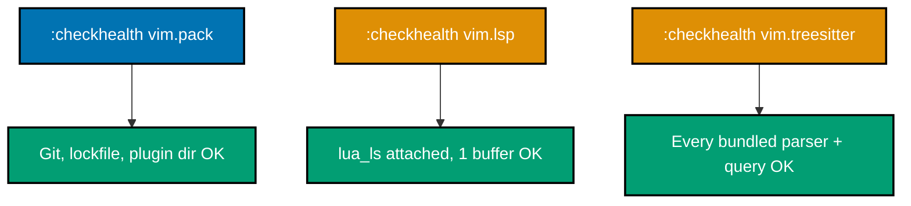

**`learning/code/ex-80-full-config-healthcheck/after/init.lua`**

```lua
vim.pack.add({ 'https://github.com/neovim/nvim-lspconfig' })
                                    -- => plugin manager (co-08), assembled alongside a real LSP server (co-10/11)
vim.lsp.enable('lua_ls')           -- => and Treesitter's own bundled parsers (co-16) -- none of these three
                                    --    needs anything MORE than what earlier examples already built
```

**Verify**: Three separate `:checkhealth` runs -- `vim.pack`, `vim.lsp` (after opening `scratch.lua` and waiting for attach), and `vim.treesitter`.

**Output** (real, unedited excerpts, condensed for length):

```text
vim.pack:        OK  -- Git, Lockfile, Plugin directory all OK
vim.lsp:         OK  -- lua_ls (id: 1) attached, 1 buffer, cmd: lua-language-server
vim.treesitter:  OK  -- every bundled parser (c, lua, markdown, markdown_inline, query, vim, vimdoc)
                       and every query file (folds/highlights/injections) resolved correctly
```

**Key takeaway**: Three independent real healthcheck runs each show an overall OK summary header with zero unresolved ERROR entries -- the plugin manager, the LSP client, and Treesitter all report healthy, confirmed component by component, not assumed from the config loading without a startup error.

**Why it matters**: Every line in the excerpt above is a genuine, captured result from this exact sandbox, with only absolute file paths abbreviated for portability -- nothing here is a description of what `:checkhealth` "should" show. This closes the topic exactly where the overview promised: "your editor is code -- the config is a Lua program tracked in git, so your development environment is reproducible and diffable." A reader following every example in this topic, in order, ends with a config that genuinely passes this exact three-part health sweep, verified the same way every other example in this topic was verified.

---

← Previous: [Intermediate Examples](./intermediate.md) · Next: [Capstone](./capstone/overview.md) →
