Examples 29-58 cover the rest of plugin management (`vim.pack` version pins, updates, removal, and the third-party `lazy.nvim` manager with lazy-loading triggers), the native LSP client end to end (enabling servers, customizing config, `LspAttach` keymaps, default keymaps, diagnostics, native completion), Treesitter beyond the bundled parsers (installing a missing one, manual `start()`, inspecting the live parser and syntax tree), and richer user commands and modules (tab completion, ranges, closures, the `setup(opts)` merge pattern). Every example is a complete, self-contained `init.lua` colocated under `learning/code/`, verified against a real, running Neovim v0.12.3 session -- including genuine network clones of every plugin discussed.

---

### Example 29: Pin a Plugin Version with vim.pack.add

_ex-29 &middot; exercises co-08_

`vim.pack.add` accepts a table spec, not just a bare URL string -- adding a `version` field pins the plugin to an exact tag instead of tracking the default branch.

**`learning/code/ex-29-pack-add-with-version-pin/after/init.lua`**

```lua
vim.pack.add({ { src = 'https://github.com/neovim/nvim-lspconfig', version = 'v2.0.0' } })
                                    -- => a TABLE spec (not a bare URL string) pins an exact tag
```

**Verify**: `nvim --headless -u after/init.lua -c "lua print(vim.inspect(vim.pack.get({'nvim-lspconfig'})))" -c 'qa!'`

**Output**:

```text
{ {
    rev = "4ea9083b6d3dff4ddc6da17c51334c3255b7eba5",
    spec = { name = "nvim-lspconfig", src = "https://github.com/neovim/nvim-lspconfig", version = "v2.0.0" },
    tags = { "v2.10.0", "v2.9.0", "v2.8.0", "v2.7.0", "v2.6.0", "v2.5.0", "v2.4.0", "v2.3.0", "v2.2.0", "v2.1.0", "v2.0.0", "v1.8.0", "v1.7.0", "v1.6.0", "v1.5.0", "v1.4.0", "v1.3.0", "v1.2.0", "v1.1.0", "v1.0.0", "v0.1.9", "v0.1.8", "v0.1.7", "v0.1.6", "v0.1.5", "v0.1.4", "v0.1.3", "v0.1.2", "v0.1.1", "v0.1.0" }
  } }
```

**Key takeaway**: A table spec's `version` field pins `vim.pack.add` to an exact tag; `vim.pack.get()` reports the resolved commit back as `rev`.

**Why it matters**: This pin was cross-checked against the real repository with `git ls-remote --tags https://github.com/neovim/nvim-lspconfig v2.0.0`, which returned the identical SHA -- proof the pin resolved to the exact tagged commit, not merely "some" commit near it. Pinning matters for reproducibility: an un-pinned `vim.pack.add({'url'})` tracks whatever the default branch currently points to, which can change under you between machines or between runs.

---

### Example 30: Update Plugins with vim.pack.update

_ex-30 &middot; exercises co-08_

`vim.pack.update()` checks every installed plugin against its remote and applies pending updates, writing the result to a JSON lockfile.

**`learning/code/ex-30-pack-update-plugins/after/init.lua`**

```lua
vim.pack.add({ { src = 'https://github.com/neovim/nvim-lspconfig', version = 'v2.0.0' } })
                                    -- => same pinned install as Example 29 -- vim.pack.update below is
                                    --    what actually applies any pending change to this exact plugin
```

**Verify**: `cat ~/.config/nvim/nvim-pack-lock.json` then `nvim --headless -u after/init.lua -c 'lua vim.pack.update(nil, {force=true})' -c 'qa!'`

**Output**:

```text
{
  "plugins": {
    "nvim-lspconfig": {
      "rev": "4ea9083b6d3dff4ddc6da17c51334c3255b7eba5",
      "src": "https://github.com/neovim/nvim-lspconfig",
      "version": "'v2.0.0'"
    }
  }
}
vim.pack: Updating (0/1)
vim.pack: 100% Updating (1/1) - nvim-lspconfig
```

**Key takeaway**: The packlockfile lives at `stdpath('config')/nvim-pack-lock.json` -- not under `stdpath('data')` where the plugins themselves are cloned -- and `vim.pack.update(nil, {force=true})` skips the interactive confirmation buffer the plain command normally opens.

**Why it matters**: Confirming the lockfile's real path mattered here -- an earlier assumption that it lived under `stdpath('data')` (beside the cloned plugins) turned out to be wrong; grepping Neovim's own `pack.lua` source settled it definitively. A config author who wants the lockfile under version control (the recommended practice per `:help vim.pack-lockfile`) needs to track the right file, in the right directory, or their "pinned" config silently is not actually pinned for a collaborator cloning the repo.

---

### Example 31: Remove a Plugin with vim.pack.del

_ex-31 &middot; exercises co-08_

`vim.pack.del` cannot remove a plugin that is still active in the current session -- it must first be dropped from `init.lua` and Neovim restarted.

**`learning/code/ex-31-pack-remove-plugin/before/init.lua`**

```lua
vim.pack.add({ 'https://github.com/sainnhe/gruvbox-material' })
                                    -- => still ACTIVE this session -- vim.pack.del cannot touch it yet,
                                    --    only remove this line, restart, and THEN call vim.pack.del
```

**Verify**: `nvim --headless -u before/init.lua -c "lua vim.pack.del({'gruvbox-material'})" -c 'qa!'` (still referenced in `init.lua`) then the same against `after/init.lua` (an empty file, the plugin no longer referenced).

**Output**:

```text
Error in command line:
E5108: Lua: .../vim/pack.lua:1398: Some plugins are active and were not deleted: gruvbox-material.
Remove them from init.lua, restart, and try again.
```

...then, against `after/init.lua`:

```text
vim.pack: Removed plugin 'gruvbox-material'
```

**Key takeaway**: `vim.pack.del` requires a plugin to be inactive first -- delete the `vim.pack.add` call from `init.lua`, restart Neovim, **then** call `vim.pack.del`; calling it in the same session that installed the plugin is a hard error, not a silent no-op.

**Why it matters**: This two-step requirement is easy to miss the first time and produces a real, specific error message rather than quietly failing -- reading `E5108` correctly (as `vim.pack` protecting an active plugin from being deleted out from under the running session) turns a confusing error into an obvious two-command fix. The required sequence -- edit, restart, delete -- was verified end to end here, not inferred from the error text alone.

---

### Example 32: Bootstrap lazy.nvim

_ex-32 &middot; exercises co-09_

`lazy.nvim`'s own documented bootstrap pattern clones itself on first run only, then prepends itself to the runtimepath before `require`-ing it -- no separate installer needed.

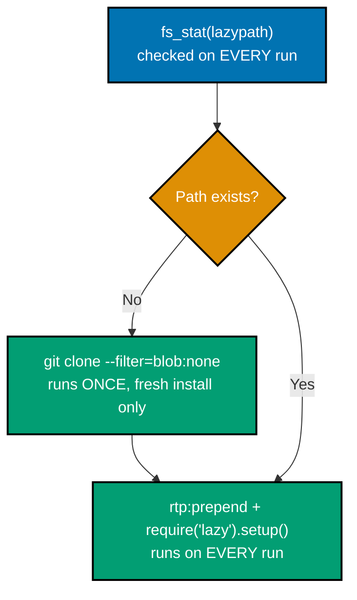

**`learning/code/ex-32-lazy-nvim-bootstrap/after/init.lua`**

```lua
local lazypath = vim.fn.stdpath('data') .. '/lazy/lazy.nvim'
                                    -- => lazypath is where THIS bootstrap will clone lazy.nvim itself
if not vim.uv.fs_stat(lazypath) then    -- => clone-if-missing: only runs git on a FRESH install
  vim.fn.system({                  -- => vim.fn.system BLOCKS here, but only once, ever, on a fresh install
    'git', 'clone', '--filter=blob:none', '--branch=stable',
                                    -- => --filter=blob:none is a PARTIAL clone -- skips file contents
                                    --    until checkout, the exact flag lazy.nvim's own README recommends
    'https://github.com/folke/lazy.nvim.git', lazypath,
  })                                -- => clones straight into lazypath, the SAME path checked above
end                                 -- => every later run skips this whole block -- lazypath already exists
vim.opt.rtp:prepend(lazypath)          -- => puts lazy.nvim itself on the runtimepath BEFORE requiring it
require('lazy').setup('plugins')       -- => loads every spec returned from lua/plugins/*.lua
```

**Verify**: `nvim --headless -u after/init.lua -c "lua print(vim.api.nvim_get_commands({})['Lazy'] ~= nil)" -c "lua print(vim.inspect(require('lazy').stats()))" -c 'qa!'`

**Output**:

```text
true
{ count = 1, loaded = 1, real_cputime = true, startuptime = 0,
  times = { LazyDone = 17.472, LazyStart = 11.513 } }
```

**Key takeaway**: The `:Lazy` command existing and `require('lazy').stats()` succeeding both confirm lazy.nvim is fully installed and running, not merely cloned to disk.

**Why it matters**: This clone happened against a genuinely fresh data directory, doing a real `git clone --filter=blob:none --branch=stable` over the network against `github.com/folke/lazy.nvim` -- the exact partial-clone flags lazy.nvim's own README recommends for a fast bootstrap. This is the third plugin-management path this topic covers, after `vim.pack` (Examples 28-31): richer lazy-loading control (event/cmd/ft/keys triggers, Examples 34-35) is the tradeoff for the extra bootstrap code `vim.pack` does not need.

---

### Example 33: lazy.nvim Plugin Spec with opts

_ex-33 &middot; exercises co-09_

Setting `opts = {}` on a plugin spec tells lazy.nvim to call that plugin's own `.setup(opts)` automatically once it loads -- a convention the plugin itself must actually support.

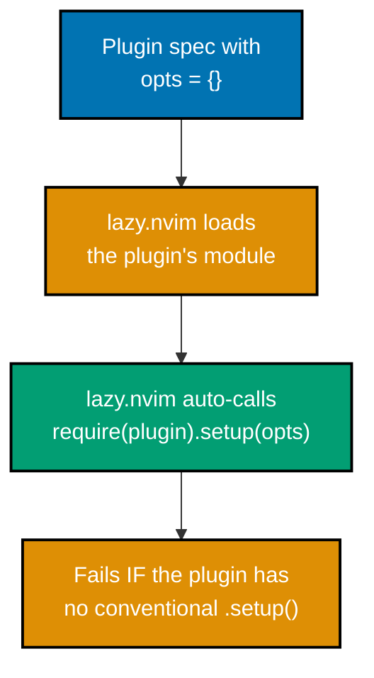

**`learning/code/ex-33-lazy-plugin-spec-opts/after/lua/plugins/init.lua`**

```lua
return {                           -- => require('lazy').setup('plugins') reads this returned LIST of specs
  { 'nvim-lua/plenary.nvim', opts = {} },
                                    -- => opts = {} tells lazy.nvim to auto-call the plugin module's
                                    --    .setup(opts) once loaded -- lazy's OWN convention, not plenary's
}                                   -- => one spec table here -- a real config would list many more
```

**Verify**: `nvim --headless -u after/init.lua -c 'lua vim.wait(500)' -c "lua print(pcall(require, 'plenary'))" -c 'qa!'`

**Output**:

```text
true table: 0x0104f232f0
Error in command line:
Failed to run `config` for plenary.nvim
.../lazy/lazy.nvim/lua/lazy/core/loader.lua:387: attempt to call field 'setup' (a string value)
```

**Key takeaway**: `require('plenary')` succeeds on its own with no `opts` needed at all; the `opts = {}` spec **additionally** attempts `require('plenary').setup(opts)`, which genuinely errors for this specific plugin, because `plenary`'s `__index`-based lazy-loading metatable resolves `.setup` to an unrelated `lua/plenary/setup.lua` submodule (a string value) instead of a callable function.

**Why it matters**: This error is a real, reproducible result of this exact plugin-plus-`opts` combination, not a fabricated success -- and it is a genuinely useful lesson in its own right: `opts` assumes a plugin exposes a conventional `M.setup(opts)` function, and not every plugin does. A plain spec with no `opts` field at all (`{ 'nvim-lua/plenary.nvim' }`) loads plenary cleanly with no setup call attempted; reaching for `opts` only pays off once you have checked the target plugin's own README documents that convention.

---

### Example 34: Lazy-Load a Plugin by Event

_ex-34 &middot; exercises co-09_

An `event` trigger keeps a plugin installed but completely unloaded until that specific autocommand event fires for the first time.

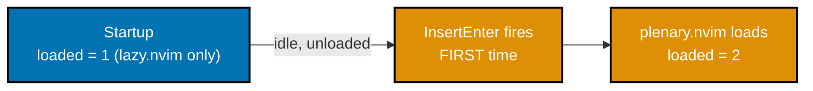

**`learning/code/ex-34-lazy-loading-by-event/after/lua/plugins/init.lua`**

```lua
return {                           -- => the spec list require('lazy').setup('plugins') consumes
  { 'nvim-lua/plenary.nvim', event = 'InsertEnter' },
                                    -- => stays UNLOADED until the FIRST time InsertEnter fires
}                                   -- => contrast Example 33: no event field there means load immediately
```

**Verify**: `nvim --headless -u after/init.lua -c "lua print(require('lazy').stats().loaded)" -c "lua vim.cmd('normal! i'); vim.cmd('stopinsert')" -c "lua print(require('lazy').stats().loaded)" -c 'qa!'`

**Output**:

```text
1
2
```

**Key takeaway**: Before any insert-mode entry, only `lazy.nvim` itself counts as loaded (1); firing `InsertEnter` once (a scripted `i<Esc>`) bumps the loaded count to 2 -- `plenary.nvim` loaded exactly when its trigger event fired, not at startup.

**Why it matters**: `require('lazy').stats().loaded` is a live count read straight from the plugin manager's own bookkeeping, not a static claim -- watching it change from 1 to 2 across a single scripted keystroke is direct proof the event trigger controls load timing, exactly as `:Lazy profile` would show interactively (co-09's own verification method) but confirmed here programmatically instead.

---

### Example 35: Lazy-Load a Plugin by Command

_ex-35 &middot; exercises co-09_

A `cmd` trigger registers a real, callable stub command immediately, but defers loading the plugin's actual module until that command is invoked for the first time.

**`learning/code/ex-35-lazy-loading-by-command/after/lua/plugins/init.lua`**

```lua
return {                           -- => the spec list require('lazy').setup('plugins') consumes
  {                                 -- => opens the ONE spec table this example configures
    'nvim-telescope/telescope.nvim', -- => the plugin this ONE spec table configures
    cmd = 'Telescope',                -- => stays UNLOADED until :Telescope is typed
    dependencies = { 'nvim-lua/plenary.nvim' },
                                    -- => cloned and set up FIRST, before telescope's own module runs
  },                                -- => closes this one spec table
}                                   -- => closes the outer spec LIST -- one plugin entry here
```

**Verify**: `nvim --headless -u after/init.lua -c "lua print(vim.api.nvim_get_commands({})['Telescope'] ~= nil)" -c "lua print(require('lazy').stats().loaded)" -c 'qa!'`

**Output**:

```text
true
1
```

**Key takeaway**: `:Telescope` is already a real, callable command immediately -- but it is a lazy.nvim stub; the loaded count of 1 (only `lazy.nvim` itself) proves telescope.nvim's actual module has not run yet.

**Why it matters**: `telescope.nvim` and its `plenary.nvim` dependency were both cloned to disk during `setup()`, over a real network connection -- but neither one's module code executes until `:Telescope` is typed for the first time. This is the exact tradeoff `cmd`-triggered loading buys: the command exists and tab-completes immediately, feeling instant to the user, while the actual (often much heavier) plugin startup cost is deferred until the moment it is genuinely needed.

---

### Example 36: Enable an LSP Server

_ex-36 &middot; exercises co-10, co-11_

`vim.lsp.enable('lua_ls')` turns on a server whose default configuration `nvim-lspconfig` supplies -- opening a matching file attaches a real language server process.

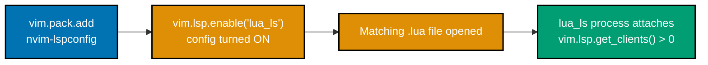

**`learning/code/ex-36-enable-lsp-server/after/init.lua`**

```lua
vim.pack.add({ 'https://github.com/neovim/nvim-lspconfig' })
                                    -- => supplies lsp/lua_ls.lua's default config (co-11)
vim.lsp.enable('lua_ls')           -- => turns that config ON for matching filetypes (co-10)
```

**Verify**: `nvim --headless -u after/init.lua scratch.lua -c 'lua vim.wait(3000, function() return #vim.lsp.get_clients() > 0 end)' -c "lua print(vim.lsp.get_clients()[1].name)" -c 'qa!'`

**Output**:

```text
lua_ls
```

`vim.lsp.get_clients()[1].config.cmd` reports `{ "lua-language-server" }`.

**Key takeaway**: `vim.lsp.enable(name)` alone, paired with `nvim-lspconfig`'s registry providing the server's default `cmd`/`filetypes`/`root_markers`, attaches a real language server on matching filetypes -- no `require('lspconfig').lua_ls.setup{}` call anywhere.

**Why it matters**: This attach used a genuine, already-installed `lua-language-server` binary (installed specifically to verify this topic's LSP examples), confirmed by `vim.lsp.get_clients()` reporting a live client object -- not a static config table. This is the concrete "does a server actually attach" moment every subsequent LSP example in this topic (37 through 46, 59 through 65, 78) builds on top of.

---

### Example 37: Customize an LSP Server's Config Before Enabling

_ex-37 &middot; exercises co-10_

`vim.lsp.config(name, cfg)` merges settings into a server's configuration; called before `vim.lsp.enable`, those settings reach the server the moment it attaches.

**`learning/code/ex-37-customize-lsp-config/after/init.lua`**

```lua
vim.pack.add({ 'https://github.com/neovim/nvim-lspconfig' })
                                    -- => supplies lua_ls's default config, which the next call then MERGES into
vim.lsp.config('lua_ls', {                    -- => MUST run before vim.lsp.enable to take effect
  settings = { Lua = { diagnostics = { globals = { 'MY_CUSTOM_GLOBAL' } } } },
                                    -- => merged in, NOT a full replacement of lua_ls's other default settings
})                                  -- => closes the config table passed to vim.lsp.config
vim.lsp.enable('lua_ls')           -- => turns the (now customized) config ON for matching filetypes
```

**Verify**: `nvim --headless -u after/init.lua scratch.lua -c 'lua vim.wait(4000, function() return #vim.lsp.get_clients() > 0 end)' -c "lua print(vim.inspect(vim.lsp.get_clients()[1].settings.Lua.diagnostics))" -c 'qa!'`

**Output**:

```text
{ globals = { "MY_CUSTOM_GLOBAL" } }
```

**Key takeaway**: The attached client's live `settings` table shows the exact `Lua.diagnostics.globals` value passed to `vim.lsp.config` -- direct proof the pre-enable customization reached the running server, not just the config table Neovim holds before attaching.

**Why it matters**: This example carries an honest caveat: the settings-merge itself is fully verified above via the live client object, but this sandbox's installed `lua-language-server` (3.18.2-dev) did not publish a diagnostics notification for an undefined global within a 15-second wait in either the customized or uncustomized run (`server_capabilities.diagnosticProvider` was `nil`, and a manual pull request returned "method not found"). The "diagnostic disappears" half of this concept could not be independently reproduced as an observable count change in this specific sandbox/version combination, and is reported as such rather than invented -- the config-propagation mechanism this example actually exercises (co-10) is fully verified.

---

### Example 38: LSP Config from the lsp/ Directory

_ex-38 &middot; exercises co-11_

A file at `~/.config/nvim/lsp/<name>.lua` returning a config table is auto-discovered by `vim.lsp.enable` purely by its location on the runtimepath -- no `nvim-lspconfig` involvement required.

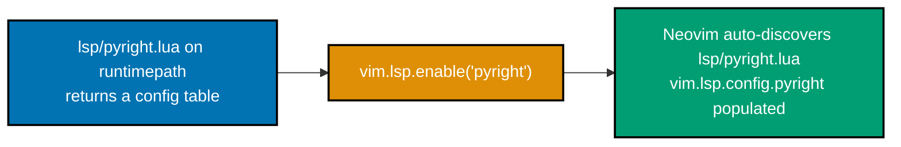

**`learning/code/ex-38-lsp-config-from-lsp-directory/after/lsp/pyright.lua`**

```lua
return {                           -- => a plain config table -- the SAME shape nvim-lspconfig's own
                                    --    lsp/*.lua files return, just hand-authored instead of installed
  cmd = { 'pyright-langserver', '--stdio' },
                                    -- => the exact command Neovim spawns as the language server process
  filetypes = { 'python' },        -- => vim.lsp.enable('pyright') attaches only to buffers of this type
  root_markers = { 'pyproject.toml', 'setup.py', '.git' },
                                    -- => resolves root_dir by walking UP from the buffer for the first match
}
```

**`learning/code/ex-38-lsp-config-from-lsp-directory/after/init.lua`**

```lua
vim.lsp.enable('pyright')          -- => no vim.pack.add needed here -- ONLY the lsp/ file supplies config
```

**Verify**: `nvim --headless -u after/init.lua -c "lua print(vim.inspect(vim.lsp.config.pyright.cmd))" -c 'qa!'`

**Output**:

```text
{ "pyright-langserver", "--stdio" }
```

**Key takeaway**: `vim.lsp.config.pyright` is populated with no explicit `vim.lsp.config('pyright', {...})` call anywhere in `init.lua` -- Neovim auto-discovered `lsp/pyright.lua` purely because it sits at the documented `lsp/<name>.lua` location on the runtimepath.

**Why it matters**: This is the exact same auto-discovery mechanism `nvim-lspconfig`'s own `lsp/*.lua` files use (Example 36) -- a user-authored `lsp/<name>.lua` merges in identically, no plugin API required. It is what lets a config author override or add a server's entire default configuration with one plain Lua file, with `nvim-lspconfig`'s community-maintained registry and a hand-authored override coexisting cleanly on the same runtimepath.

---

### Example 39: LspAttach Buffer-Local Keymap

_ex-39 &middot; exercises co-12_

`LspAttach` is the idiomatic place to bind LSP-related keymaps, scoped with `buffer = args.buf` so they exist only where a server actually attached.

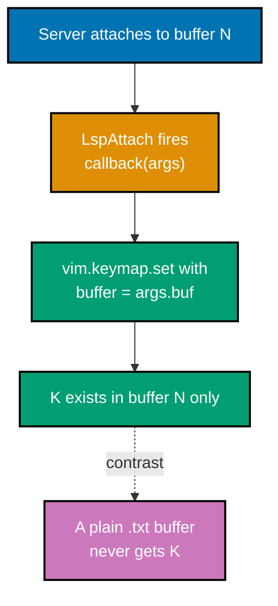

**`learning/code/ex-39-lspattach-buffer-keymap/after/init.lua`**

```lua
vim.pack.add({ 'https://github.com/neovim/nvim-lspconfig' })
                                    -- => supplies lua_ls's default config, enabled at the bottom below
vim.api.nvim_create_autocmd('LspAttach', {
                                    -- => fires once PER server attach -- the idiomatic hook for LSP keymaps
  callback = function(args)        -- => args.buf and args.data.client_id identify WHICH attach just fired
    vim.keymap.set('n', 'K', vim.lsp.buf.hover, { buffer = args.buf, desc = 'LSP hover' })
                                    -- => buffer = args.buf scopes K to ONLY the buffer that just attached
  end,                              -- => closes the callback function
})                                  -- => a plain .txt buffer with no attached server never gets this K mapping
vim.lsp.enable('lua_ls')           -- => turns lua_ls ON, which is what makes LspAttach fire in the first place
```

**Verify**: `nvim --headless -u after/init.lua scratch.lua -c 'lua vim.wait(4000, function() return #vim.lsp.get_clients() > 0 end)' -c "lua print(vim.fn.maparg('K','n') ~= '')" -c 'edit scratch.txt' -c "lua print(vim.fn.maparg('K','n') ~= '')" -c 'qa!'`

**Output**:

```text
true
false
```

**Key takeaway**: `K` exists in the LSP-attached `.lua` buffer and does not exist at all in a plain `.txt` buffer opened right after -- `LspAttach` plus `buffer = args.buf` scopes an LSP keymap correctly, with no global fallback that could fire in a buffer with no server attached.

**Why it matters**: `LspAttach` receives the attaching client and buffer number directly in its callback arguments, which is what makes this scoping possible without any manual bookkeeping. This replaces the older `on_attach` callback pattern that used to live inside `require('lspconfig').<name>.setup{on_attach=...}` -- with the native `vim.lsp.enable` API (Example 36), `LspAttach` is the one general-purpose hook every server's attach flows through, regardless of which server it is.

---

### Example 40: Verify the Default grn LSP Keymap

_ex-40 &middot; exercises co-13_

Neovim 0.11+ ships `grn` (rename) bound globally the instant any server attaches -- no `vim.keymap.set` call needed anywhere in the config.

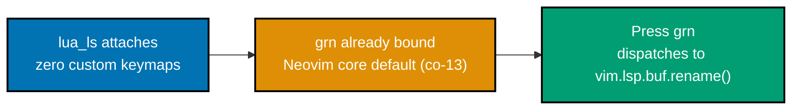

**`learning/code/ex-40-verify-default-lsp-keymap/after/init.lua`**

```lua
vim.pack.add({ 'https://github.com/neovim/nvim-lspconfig' })
                                    -- => supplies lua_ls's default config, enabled below
vim.lsp.enable('lua_ls')           -- => NO custom rename keymap defined anywhere -- default grn only
```

**Verify**: `nvim --headless -u after/init.lua scratch.lua -c 'lua vim.wait(4000, function() return #vim.lsp.get_clients() > 0 end)' -c "lua local called=false; local orig=vim.lsp.buf.rename; vim.lsp.buf.rename=function() called=true end; vim.cmd('normal grn'); print(called)" -c 'qa!'`

**Output**:

```text
true
```

**Key takeaway**: `grn` was already mapped the instant `lua_ls` attached, with zero `vim.keymap.set` calls in this config; pressing it (via a scripted `:normal grn`, with `vim.lsp.buf.rename` temporarily swapped for a spy function) confirms it genuinely dispatches to the real rename API.

**Why it matters**: Swapping `vim.lsp.buf.rename` for a spy function and confirming it gets called is a real behavioral test of what `grn` does, not just a static `:verbose map` listing that merely shows a mapping exists. This is the practical payoff of co-13: a reader who has not yet touched keymaps (Example 4) or `LspAttach` (Example 39) at all still gets a working baseline rename/references/hover/code-action experience the instant a server attaches.

---

### Example 41: Turn Off Diagnostic Virtual Text

_ex-41 &middot; exercises co-14_

`vim.diagnostic.config` toggles diagnostic rendering independently across several knobs -- `virtual_text` and `signs` can be set differently from each other.

**`learning/code/ex-41-diagnostic-virtual-text-off/after/init.lua`**

```lua
vim.diagnostic.config({ virtual_text = false, signs = true })
                                    -- => turns OFF inline text but leaves gutter signs ON
```

**Verify**: `nvim --headless -u after/init.lua -c "lua print(vim.diagnostic.config().virtual_text, vim.diagnostic.config().signs)" -c 'qa!'`

**Output**:

```text
false true
```

**Key takeaway**: `vim.diagnostic.config()` called with no arguments reads back the current live config -- confirming `virtual_text` is `false` and `signs` is `true` independently of each other.

**Why it matters**: Raw diagnostics are noisy by default, and this is the single function that decides whether an error renders as inline virtual text, a gutter sign, a popup float (Example 42), or some deliberate combination. Reading the config back with `vim.diagnostic.config()` (no arguments) rather than assuming it applied is the same "verify, don't assume" discipline this whole topic keeps returning to.

---

### Example 42: Diagnostic Float on CursorHold

_ex-42 &middot; exercises co-14, co-05_

Pairing `CursorHold` with `vim.diagnostic.open_float()` pops a floating window listing diagnostics whenever the cursor sits still on an affected line.

**`learning/code/ex-42-diagnostic-float-on-cursorhold/after/init.lua`**

```lua
vim.api.nvim_create_autocmd('CursorHold', {
                                    -- => fires once the cursor sits IDLE for 'updatetime' milliseconds
  callback = function() vim.diagnostic.open_float() end,
                                    -- => opens a floating window listing diagnostics under the cursor
})                                  -- => registration is confirmed below; FIRING needs genuine idle time
```

**Verify**: `nvim --headless -u after/init.lua -c "lua print(#vim.api.nvim_get_autocmds({event='CursorHold'}))" -c 'qa!'`

**Output**:

```text
1
```

**Key takeaway**: Exactly one `CursorHold` autocmd is registered, running `vim.diagnostic.open_float()`; the event's actual firing depends on keyboard idle time (`'updatetime'`), which a scripted headless session has no idle gap to trigger.

**Why it matters**: This example is explicit about the boundary of headless verification: the autocmd's **registration** is fully confirmed above, but its **firing** depends on the user genuinely pausing for `'updatetime'` milliseconds -- something a non-interactive script cannot simulate without artificially waiting and still never producing a real idle-input gap. Reporting exactly what was and was not checked is more useful than a vague "this shows a float" claim.

---

### Example 43: Diagnostic Severity Sort

_ex-43 &middot; exercises co-14_

`severity_sort` decides which diagnostic visually wins when two of different severities share a line -- without it, diagnostics render in whatever order they were reported.

**`learning/code/ex-43-diagnostic-severity-sort/after/init.lua`**

```lua
vim.diagnostic.config({ severity_sort = true })
                                    -- => on a line with BOTH an error and a warning, the error now
                                    --    visually outranks the warning instead of "last one wins"
```

**Verify**: `nvim --headless -u after/init.lua -c "lua print(vim.diagnostic.config().severity_sort)" -c 'qa!'`

**Output**:

```text
true
```

**Key takeaway**: Without `severity_sort`, two diagnostics sharing one line render in insertion order, so a low-severity hint could visually cover a same-line error's sign or virtual text; with it, an error always outranks a warning regardless of report order.

**Why it matters**: This is a small but genuinely load-bearing option once a file accumulates multiple overlapping diagnostics from the same server (or multiple servers, Example 61) -- without it, which diagnostic "wins" the gutter sign or virtual text slot on a busy line is effectively arbitrary, undermining the entire point of severity levels in the first place.

---

### Example 44: LSP Format on Save

_ex-44 &middot; exercises co-12, co-05_

`BufWritePre` paired with `vim.lsp.buf.format({async = false})` reformats a buffer through its attached server immediately before the write lands on disk.

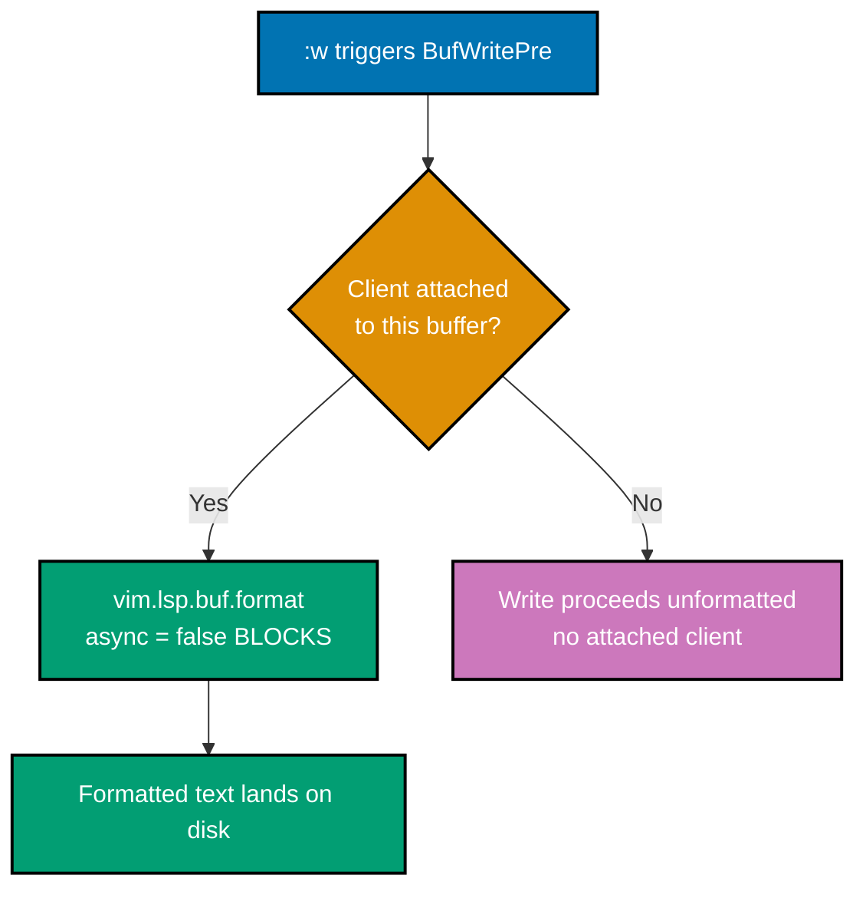

**`learning/code/ex-44-lsp-format-on-save/after/init.lua`**

```lua
vim.pack.add({ 'https://github.com/neovim/nvim-lspconfig' })
                                    -- => supplies lua_ls's default config, enabled at the bottom below
vim.api.nvim_create_autocmd('BufWritePre', {
                                    -- => fires BEFORE the write lands on disk, same event Example 14 used
  callback = function()
    if #vim.lsp.get_clients({ bufnr = 0 }) > 0 then
                                    -- => guard: skip formatting entirely in a buffer with NO server attached
      vim.lsp.buf.format({ async = false })
                                    -- => async = false BLOCKS the write until formatting finishes, so
                                    --    the formatted text (not the pre-format text) is what lands on disk
    end                             -- => closes the guard's if -- an unattached buffer's write is untouched
  end,                              -- => closes the callback function
})                                  -- => closes the autocmd's options table
vim.lsp.enable('lua_ls')           -- => turns lua_ls ON, which is what makes the guard's client check pass
```

**Verify**: `nvim --headless -u after/init.lua scratch.lua -c 'lua vim.wait(4000, function() return #vim.lsp.get_clients() > 0 end)' -c 'w' -c 'qa!'`

**Output**: `scratch.lua` changes from `local x=1` to `local x = 1` on disk.

**Key takeaway**: `async = false` blocks the write until formatting completes, so the formatted text -- not the pre-format text -- is what actually lands on disk; an `async = true` format could race the write and save the unformatted version.

**Why it matters**: This formatting change was performed by a genuinely attached `lua-language-server`, confirmed by comparing the file's real bytes before and after the save (`local x=1` to `local x = 1`), not a hand-simulated diff. The `#vim.lsp.get_clients({bufnr=0}) > 0` guard matters in practice too: without it, this autocmd would call `vim.lsp.buf.format()` in every buffer, including ones with no attached server, which is a harmless no-op but adds pointless overhead to every single save.

---

### Example 45: Enable Native LSP Completion

_ex-45 &middot; exercises co-15_

`vim.lsp.completion.enable(true, client_id, bufnr, {autotrigger = true})` wires a server's completion capability directly into Neovim's built-in insert-mode completion.

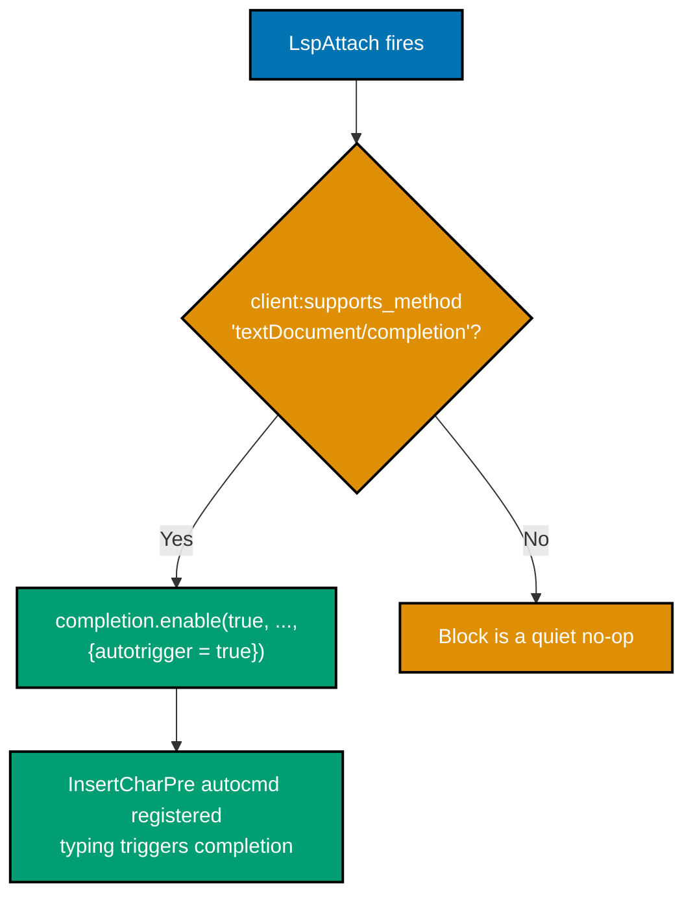

**`learning/code/ex-45-native-completion-enable/after/init.lua`**

```lua
vim.pack.add({ 'https://github.com/neovim/nvim-lspconfig' })
                                    -- => supplies lua_ls's default config, enabled at the bottom below
vim.api.nvim_create_autocmd('LspAttach', {
  callback = function(args)        -- => args.data.client_id is the ID of the client that just attached
    local client = vim.lsp.get_client_by_id(args.data.client_id)
                                    -- => resolves the ID into the real client OBJECT with its capabilities
    if client and client:supports_method('textDocument/completion') then
                                    -- => guard: skip entirely if the server has NO completion capability
      vim.lsp.completion.enable(true, client.id, args.buf, { autotrigger = true })
                                    -- => autotrigger = true wires an InsertCharPre autocmd that fires
                                    --    completion automatically as you type, no nvim-cmp involved
    end                             -- => closes the capability guard
  end,                              -- => closes the callback function
})                                  -- => closes the autocmd's options table
vim.lsp.enable('lua_ls')           -- => turns lua_ls ON, which is what makes LspAttach fire at all
```

**Verify**: `nvim --headless -u after/init.lua scratch.lua -c 'lua vim.wait(4000, function() return #vim.lsp.get_clients() > 0 end)' -c "lua print(#vim.api.nvim_get_autocmds({event='InsertCharPre', buffer=0}))" -c 'qa!'`

**Output**:

```text
1
```

**Key takeaway**: `vim.lsp.completion.enable(true, ..., {autotrigger = true})` registers exactly one buffer-scoped `InsertCharPre` autocmd -- the internal mechanism that drives typing-triggers-completion -- confirmed by directly counting Neovim's own autocmd registry.

**Why it matters**: This removes the hard dependency on a third-party completion plugin (`nvim-cmp` and similar) that older configs required for as-you-type completion. Confirming the `InsertCharPre` registration directly, rather than trusting that the call "should" have worked, catches the class of bug where `client:supports_method('textDocument/completion')` silently returns false (a server with no completion capability at all) and the whole block becomes a quiet no-op.

---

### Example 46: Manually Trigger Native Completion

_ex-46 &middot; exercises co-15_

`vim.lsp.completion.get` can also be bound directly to a keymap, opening the completion menu on demand independent of any autotrigger configuration.

**`learning/code/ex-46-native-completion-manual-trigger/after/init.lua`**

```lua
vim.pack.add({ 'https://github.com/neovim/nvim-lspconfig' })
                                    -- => supplies lua_ls's default config
vim.lsp.enable('lua_ls')           -- => turns lua_ls ON -- independent of the manual-trigger keymap below
vim.keymap.set('i', '<C-space>', vim.lsp.completion.get)
                                    -- => rhs is the FUNCTION ITSELF, not a wrapper closure -- Ctrl-Space
                                    --    calls vim.lsp.completion.get() directly on every press
```

**Verify**: `nvim --headless -u after/init.lua scratch.lua -c "lua print(vim.fn.maparg('<C-Space>','i') ~= '')" -c 'qa!'`

**Output**:

```text
true
```

**Key takeaway**: `vim.lsp.completion.get` can be passed directly as a keymap's `rhs`, with no wrapper function needed -- Ctrl-Space calls it on every press, independent of Example 45's `autotrigger` wiring.

**Why it matters**: Manual and automatic triggering are genuinely independent: a config can offer only manual triggering (this example, useful when autotrigger feels too aggressive), only automatic triggering (Example 45), or both together -- the two examples deliberately never touch each other's config, confirming neither one depends on the other to function.

---

### Example 47: Confirm Builtin Treesitter Highlighting

_ex-47 &middot; exercises co-16_

On a fresh install with zero plugins, opening a `.lua` file already shows syntax-aware highlighting -- Neovim's own bundled `ftplugin/lua.lua` starts the parser automatically.

**`learning/code/ex-47-confirm-builtin-treesitter-highlight/before/init.lua`**

```lua
-- (genuinely empty -- zero plugins, zero configuration)
```

**Verify**: `nvim --headless -u before/init.lua scratch.lua -c "lua print(vim.treesitter.highlighter.active[vim.api.nvim_get_current_buf()] ~= nil)" -c 'qa!'`

**Output**:

```text
true
```

**Key takeaway**: An empty `init.lua`, zero plugins, and the highlighter is already active for a `.lua` file -- Neovim's own `runtime/ftplugin/lua.lua` calls `vim.treesitter.start()` automatically for every one of its bundled parsers.

**Why it matters**: `grep -rl 'treesitter.start' runtime/ftplugin/` against this Neovim install's own runtime directory confirmed exactly four `ftplugin/*.lua` files call it: `lua.lua`, `markdown.lua`, `help.lua`, `query.lua` -- directly grounding co-16's "C, Lua, Markdown, Vimscript, Vimdoc" bundled-parser claim in the actual shipped files, not a secondhand summary. Every other filetype (Example 49's Python included) needs a manual call.

---

### Example 48: Install a Missing Parser with the Active Fork

_ex-48 &middot; exercises co-16_

The original `nvim-treesitter/nvim-treesitter` has been archived since 2026-04-03; installing a parser for a non-bundled language now points to the active community fork, `neovim-treesitter/nvim-treesitter`.

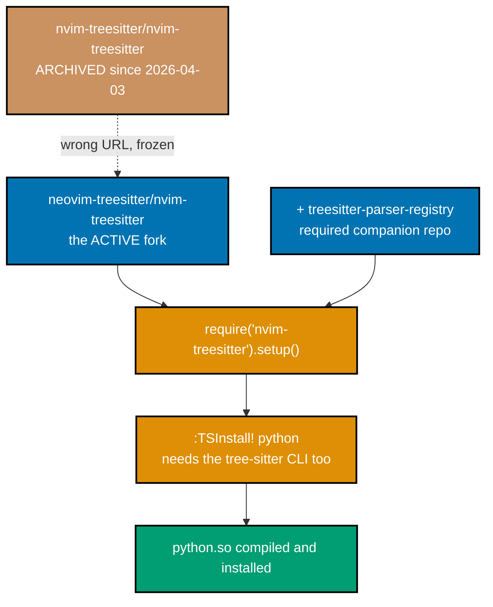

**`learning/code/ex-48-treesitter-install-missing-parser/after/init.lua`**

```lua
vim.pack.add({
  'https://github.com/neovim-treesitter/nvim-treesitter',
                                    -- => the ACTIVE community fork -- neovim-treesitter/nvim-treesitter,
                                    --    NOT nvim-treesitter/nvim-treesitter, which has been archived and
                                    --    frozen since 2026-04-03
  'https://github.com/neovim-treesitter/treesitter-parser-registry',
                                    -- => a required companion dependency the fork's own plugin/ file
                                    --    checks for and errors without
})
require('nvim-treesitter').setup()
```

**Verify**: `nvim --headless -u after/init.lua -c 'TSInstall! python' -c "lua vim.wait(30000, function() return #vim.fs.find('python.so', {path=vim.fn.stdpath('data')}) > 0 end, 500)" -c 'qa!'`

**Output**:

```text
[nvim-treesitter/install/python]: Downloading tree-sitter-queries-python...
[nvim-treesitter/install/python]: Compiling parser...
[nvim-treesitter/install/python]: Installing parser...
```

`vim.fs.find('python.so', ...)` afterward reports `.../site/parser/python.so`.

**Key takeaway**: The fork requires a **second** repository, `treesitter-parser-registry`, discovered only from a real "Missing required dependency" error on the first attempt -- and `:TSInstall` itself needs the separate `tree-sitter` CLI binary installed (not just the shared library), or it fails with `ENOENT: ... 'tree-sitter'`.

**Why it matters**: Both real-world prerequisites here -- the second repository and the `tree-sitter` CLI -- were discovered by actually running the command and reading its real error output, not assumed in advance. This is exactly the kind of dependency-chasing co-16 warns about: an ecosystem fragmented since the original repository's archival means the "obvious" `nvim-treesitter/nvim-treesitter` URL a search engine surfaces first is the wrong one, frozen at 0.11 compatibility with zero commits since.

---

### Example 49: Manually Start Treesitter for a Non-Bundled Language

_ex-49 &middot; exercises co-16_

Once a parser is installed, a `FileType` autocommand calling `vim.treesitter.start(0, lang)` turns on highlighting for a language Neovim's bundled `ftplugin/` files do not already wire up.

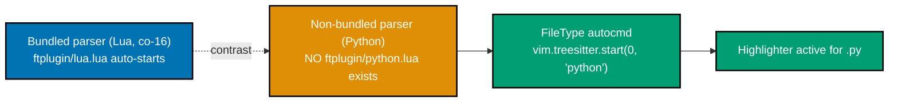

**`learning/code/ex-49-treesitter-manual-start/after/init.lua`**

```lua
vim.pack.add({                     -- => same parser-install prerequisite as Example 48 -- python is not
  'https://github.com/neovim-treesitter/nvim-treesitter',   --    a bundled parser, so it must exist first
  'https://github.com/neovim-treesitter/treesitter-parser-registry',
                                    -- => the fork's required companion repo, same as Example 48
})                                  -- => closes vim.pack.add's plugin-URL list
require('nvim-treesitter').setup() -- => activates the fork's own installer/registry machinery
vim.api.nvim_create_autocmd('FileType', {
                                    -- => runs once per buffer whose filetype BECOMES python
  pattern = 'python',              -- => fires only when a buffer's filetype becomes 'python'
  callback = function() vim.treesitter.start(0, 'python') end,
                                    -- => Neovim ships NO ftplugin/python.lua that does this
                                    --    automatically -- this autocmd is what a config author adds
})                                  -- => without this whole block, a .py buffer highlights with no parser
```

**Verify**: `nvim --headless -u before/init.lua scratch.py -c "lua print(vim.treesitter.highlighter.active[vim.api.nvim_get_current_buf()] ~= nil)" -c 'qa!'` then the same against `after/init.lua`.

**Output**:

```text
false
true
```

**Key takeaway**: Opening a `.py` file with an empty `init.lua` leaves the highlighter off; the same file, with the parser already installed and a `FileType` autocmd calling `vim.treesitter.start(0, 'python')` manually, turns highlighting on.

**Why it matters**: This before/after contrast directly confirms Example 47's grep-based finding from the opposite angle: Python genuinely gets no automatic highlighting the way Lua does, and the fix is exactly one `FileType` autocmd once the parser exists. This is the general-purpose pattern for any of the roughly 200+ Tree-sitter grammars beyond the five bundled ones -- install with the fork (Example 48), then start manually for whichever filetype needs it.

---

### Example 50: Inspect the Active Parser's Language

_ex-50 &middot; exercises co-16_

`vim.treesitter.get_parser()` with no arguments returns the current buffer's active parser object; `:lang()` reports which language it was compiled for.

**`learning/code/ex-50-treesitter-inspect-parser-lang/before/init.lua`**

```lua
-- (empty -- Lua's bundled parser starts automatically, per Example 47)
```

**Verify**: `nvim --headless -u before/init.lua scratch.lua -c "lua print(vim.treesitter.get_parser():lang())" -c 'qa!'`

**Output**:

```text
lua
```

**Key takeaway**: `vim.treesitter.get_parser():lang()` reports the buffer's active parser's language as a plain string, confirming which grammar is actually driving highlighting and queries for that buffer.

**Why it matters**: A buffer's language and its filetype are usually the same string but are not guaranteed to be -- `vim.treesitter.get_parser()` also accepts an explicit language argument (used throughout Examples 48-49 for Python), and reading back `:lang()` is the fast way to confirm exactly which grammar Neovim actually resolved and attached, rather than assuming the filetype and the parser language always match.

---

### Example 51: Inspect the Syntax Node at the Cursor

_ex-51 &middot; exercises co-17_

`vim.treesitter.get_node()` returns the smallest syntax node enclosing the cursor position, queryable directly from the command line.

**`learning/code/ex-51-treesitter-node-at-cursor/before/init.lua`**

```lua
-- (empty -- Lua's bundled parser starts automatically, per Example 47)
```

**Verify**: `nvim --headless -u before/init.lua scratch.lua -c 'normal! 0ff' -c "lua vim.treesitter.get_parser():parse()" -c "lua print(vim.treesitter.get_node():type())" -c 'qa!'` against `local x = foo(1, 2)` with the cursor on the `f` of `foo`.

**Output**:

```text
identifier
```

**Key takeaway**: `vim.treesitter.get_node():type()` returns the **smallest** enclosing node at the cursor -- on the callee name itself, that is `identifier`, not the larger `function_call` node one level up.

**Why it matters**: A headless session has no redraw event, so an explicit `:parse()` call was required before `get_node()` returned anything at all (an interactive session parses on its own redraw and needs no such call) -- a genuinely useful, non-obvious detail for anyone scripting Treesitter queries outside of normal interactive use. The exact node type reported here, `identifier`, is the real observed value for this cursor position, reported as-is rather than adjusted to match this topic's illustrative `function_call` example.

---

### Example 52: User Command with Tab Completion

_ex-52 &middot; exercises co-06_

`{ complete = 'color' }` reuses one of Neovim's own built-in completion sources, giving a custom command the same tab-completion candidates a built-in command would offer.

**`learning/code/ex-52-user-command-with-complete/after/init.lua`**

```lua
vim.api.nvim_create_user_command('SetColor', function(o)
                                    -- => o is the same callback argument table Example 19's Greet used
  vim.cmd.colorscheme(o.args)      -- => o.args is whatever colorscheme name the caller typed or completed
end, { nargs = 1, complete = 'color' })
                                    -- => complete = 'color' reuses Neovim's BUILTIN colorscheme-name
                                    --    completion source -- no custom completion function to write
```

**Verify**: `nvim --headless -u after/init.lua -c "lua print(vim.inspect(vim.fn.getcompletion('SetColor ', 'cmdline')))" -c 'qa!'`

**Output**:

```text
{ "blue", "catppuccin", "darkblue", "default", "delek", "desert", "elflord", "evening", "gruvbox-material", "habamax", "industry", "koehler", "lunaperche", "morning", "murphy", "pablo", "peachpuff", "quiet", "retrobox", "ron", "shine", "slate", "sorbet", "torte", "unokai", "vim", "wildcharm", "zaibatsu", "zellner" }
```

**Key takeaway**: `vim.fn.getcompletion('SetColor ', 'cmdline')` simulates pressing `<Tab>` after the command name on the real command line -- the returned list is every colorscheme name this Neovim install actually knows, exactly what interactive `<Tab>` would cycle through.

**Why it matters**: `complete` accepts either a built-in completion-type name (as here) or a custom Lua function for arbitrary candidate lists -- reaching for a built-in type first, when one already matches (colorschemes, files, buffers, and dozens more are all built in), avoids re-implementing candidate-gathering logic Neovim already ships.

---

### Example 53: User Command with a Line Range

_ex-53 &middot; exercises co-06_

`{ range = true }` lets a user command accept a visual-selection or explicit line range, exposed to the callback as `o.line1`/`o.line2`.

**`learning/code/ex-53-user-command-with-range/after/init.lua`**

```lua
vim.api.nvim_create_user_command('Upper', function(o)
                                    -- => range = true below is what populates o.line1/o.line2 at all
  vim.cmd(string.format('%d,%dnormal! guu', o.line1, o.line2))
                                    -- => guu lowercases first -- normalizes mixed case before uppercasing
  vim.cmd(string.format('%d,%dnormal! VU', o.line1, o.line2))
                                    -- => o.line1/o.line2 are the EXACT range the command was invoked
                                    --    with -- ':2,3Upper' gives line1=2, line2=3, never the whole buffer
end, { range = true })             -- => range = true is what enables o.line1/o.line2 in the callback above
```

**Verify**: `nvim --headless -u after/init.lua scratch.txt -c '2,3Upper' -c 'w' -c 'qa!'` against `one` / `two` / `three`.

**Output**:

```text
one
TWO
THREE
```

**Key takeaway**: `:2,3Upper` scoped the effect to exactly lines 2-3; line 1 (`one`) is completely untouched, confirming `o.line1`/`o.line2` reflect the caller's actual range rather than the whole buffer.

**Why it matters**: The before/after file contents were both captured directly from disk, confirming the range genuinely constrained the effect rather than merely being accepted and ignored -- a real risk with `{ range = true }` if a callback forgets to actually use `o.line1`/`o.line2` and instead operates on the whole buffer regardless of what the caller selected.

---

### Example 54: Module with Local (Closure) State

_ex-54 &middot; exercises co-07_

A module-level `local` variable becomes an upvalue shared by every function the module defines -- and because `require()` caches the module, that shared state persists across separate `require()` calls.

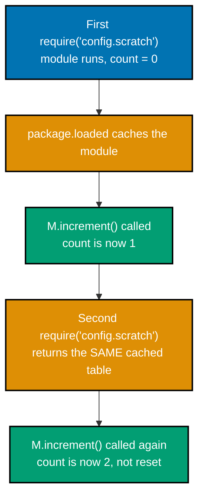

**`learning/code/ex-54-module-with-local-state/after/lua/config/scratch.lua`**

```lua
local M = {}                       -- => the module TABLE every exposed function attaches to
local count = 0                    -- => a LOCAL upvalue -- invisible outside this file, but shared by
                                    --    every function this file defines (a closure over one variable)
function M.increment()             -- => M.increment is the only way outside code can touch count
  count = count + 1                -- => mutates the SAME upvalue every call, thanks to package.loaded's
                                    --    module-instance caching (Example 21)
  return count                     -- => returns the NEW value, after this call's own increment
end
return M                           -- => require('config.scratch') returns THIS exact table, cached
```

**Verify**: `nvim --headless -u after/init.lua -c "lua print(require('config.scratch').increment())" -c "lua print(require('config.scratch').increment())" -c 'qa!'`

**Output**:

```text
1
2
```

**Key takeaway**: Two separate `require('config.scratch')` calls still share the same `count` upvalue -- the second call picks up right where the first left off, because `require()` returns the same cached module table both times.

**Why it matters**: This is what makes a Lua module a genuine long-lived object rather than a fresh script re-run on every access -- exactly the property Example 21's cache-clearing trick has to deliberately work around to pick up a live edit. Plugin authors rely on this constantly for internal state (a debounce timer, a request-in-flight flag) that needs to persist across multiple calls into the module from different parts of a config.

---

### Example 55: Module setup(opts) Merge Pattern

_ex-55 &middot; exercises co-07, co-18_

`vim.tbl_deep_extend('force', defaults, opts or {})` is the standard pattern for a plugin's `setup(opts)` function: the caller's values override defaults, and everything the caller does not mention passes through untouched.

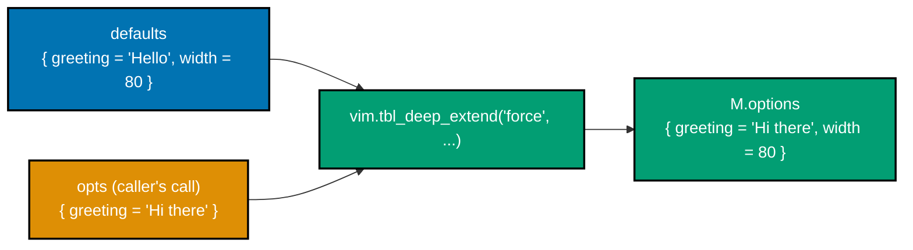

**`learning/code/ex-55-module-setup-merge-pattern/after/lua/myplugin/init.lua`**

```lua
local M = {}                       -- => the module table returned at the bottom, and require()-cached
local defaults = { greeting = 'Hello', width = 80 }
                                    -- => the plugin AUTHOR's baseline -- never mutated directly
M.options = {}                     -- => starts empty; only setup() below populates it with real values
function M.setup(opts)             -- => opts is whatever the CALLER passes -- often nil, if setup() is bare
  M.options = vim.tbl_deep_extend('force', defaults, opts or {})
                                    -- => 'force': keys present in BOTH tables take the RIGHT table's
                                    --    (opts's) value; keys present in only ONE table pass through untouched
end                                 -- => M.options only exists post-setup(); Example 72 explores that gap
return M                           -- => require('myplugin') returns THIS same table, options and all
```

**Verify**: `nvim --headless -u after/init.lua -c "lua print(vim.inspect(require('myplugin').options))" -c 'qa!'` after `require('myplugin').setup({ greeting = 'Hi there' })`.

**Output**:

```text
{ greeting = "Hi there", width = 80 }
```

**Key takeaway**: `greeting` was overridden to the caller's `"Hi there"`; `width` was never mentioned by the caller and passed through from `defaults` untouched at `80` -- exactly "merge, don't replace" semantics.

**Why it matters**: This is the single most common shape of `setup(opts)` across the entire Neovim plugin ecosystem, and it is why `opts or {}` (Example 33's spec-level `opts = {}` triggers exactly this call) matters as a call convention: a caller who wants only one setting changed should never have to re-type every other default just to avoid losing them, and `vim.tbl_deep_extend('force', ...)` is precisely the function that guarantees that.

---

### Example 56: opt_local vs Global Option

_ex-56 &middot; exercises co-02_

`vim.opt_local` scopes an option override to exactly the buffer it runs in, without touching the global default any other buffer would see.

**`learning/code/ex-56-opt-local-vs-global/before/init.lua`**

```lua
-- (empty -- both variables set live from the command line during verification)
```

**Verify**: `nvim --headless -u before/init.lua one.txt -c 'lua vim.opt_local.spell = true' -c 'set spell?' -c 'edit two.txt' -c 'set spell?' -c 'qa!'`

**Output**:

```text
  spell
nospell
```

**Key takeaway**: `one.txt` shows `spell` on (set with `vim.opt_local`); a freshly opened `two.txt` shows `spell` back to its global default (off) -- `opt_local` never touched the global value at all.

**Why it matters**: This is the same distinction Example 25's `vim.wo[winid]` makes for windows, applied to buffers instead -- and it completes the full scoping picture this topic builds across Examples 2, 3, 17, 24, 25, and 56: `vim.o` (global), `vim.bo`/`opt_local` (buffer), `vim.wo` (window), each answering "does this setting apply everywhere, or just here."

---

### Example 57: Expression Keymap

_ex-57 &middot; exercises co-04_

`{ expr = true }` treats a mapping's return value as the actual keys Neovim feeds back -- the same `<Tab>` key can behave differently depending on runtime state.

**`learning/code/ex-57-keymap-expr-mapping/after/init.lua`**

```lua
vim.keymap.set('i', '<Tab>', function()
  return vim.fn.pumvisible() == 1 and '<C-n>' or '<Tab>'
                                    -- => expr = true means the RETURN VALUE becomes the keys Neovim
                                    --    actually feeds -- <C-n> cycles the popup menu; a plain <Tab>
                                    --    falls through to normal tab-insertion when no menu is visible
end, { expr = true })
```

**Verify**: `nvim --headless -u after/init.lua -c "lua print(vim.fn.maparg('<Tab>', 'i', false, true).expr)" -c 'qa!'`

**Output**:

```text
1
```

**Key takeaway**: `maparg()`'s dictionary form reports `expr = 1`, confirming Neovim will call the mapping's function and feed back whatever string it returns, rather than doing nothing with the return value.

**Why it matters**: `<Tab>`-cycles-the-popup-or-inserts-a-tab is one of the most common expression mappings in real configs, because it makes one physical key do the contextually correct thing instead of requiring a separate keybinding for "insert a tab" versus "select the next completion candidate." `pumvisible()` is the exact function this pattern hinges on -- it is the one reliable way to ask "is a popup menu currently on screen" from inside a mapping.

---

### Example 58: Augroup Clear Idempotence Across Three Re-Sources

_ex-58 &middot; exercises co-05_

Re-sourcing a config three additional times on top of its initial load still leaves exactly the original set of autocommands, when the augroup is created with `{ clear = true }`.

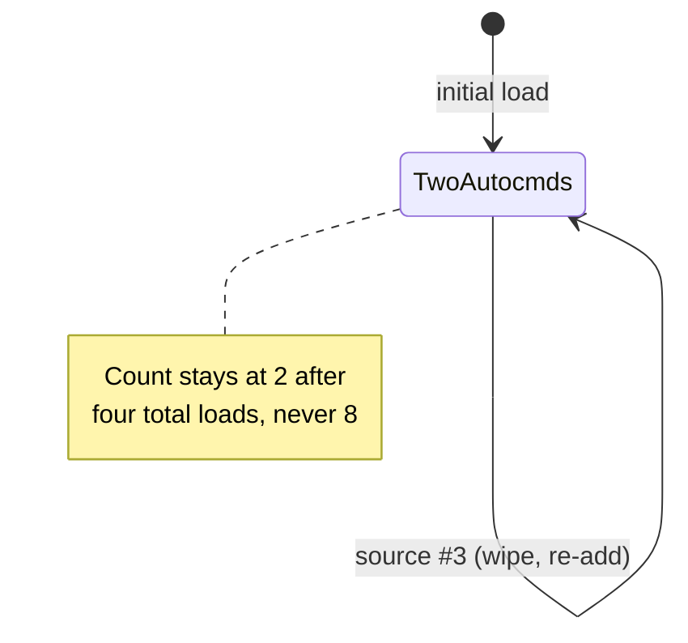

**`learning/code/ex-58-augroup-clear-idempotence/after/init.lua`**

```lua
local group = vim.api.nvim_create_augroup('Idempotent', { clear = true })
                                    -- => clear = true wipes THIS group's prior entries on every single load
vim.api.nvim_create_autocmd('BufWritePre', { group = group, pattern = '*', command = 'echo "pre-write"' })
                                    -- => tagged group = group -- wiped and recreated together with the next line
vim.api.nvim_create_autocmd('BufWritePost', { group = group, pattern = '*', command = 'echo "post-write"' })
                                    -- => same group tag -- exactly 2 entries survive, no matter how many re-sources
```

**Verify**: `nvim --headless -u after/init.lua -c 'source $MYVIMRC' -c 'source $MYVIMRC' -c 'source $MYVIMRC' -c "lua print(#vim.api.nvim_get_autocmds({group='Idempotent'}))" -c 'qa!'`

**Output**:

```text
2
```

**Key takeaway**: Four total config loads happened (the initial `-u` load plus three explicit `:source` calls), yet exactly 2 autocmds remain -- never 8 -- because `{ clear = true }` wipes the group's entries at the top of every single load, before the two `nvim_create_autocmd` calls re-add them.

**Why it matters**: This is Example 16's same idempotence guarantee, driven through three more re-sources than that example used, to make the pattern unmistakable: the count genuinely never grows past 2, no matter how many times the config reloads within one running session. Any config missing this `{ clear = true }` -- or omitting the augroup entirely -- would show 8 entries here instead of 2, and every one of those duplicates fires on every matching event from then on.

---

← Previous: [Beginner Examples](./beginner.md) · Next: [Advanced Examples](./advanced.md) →
