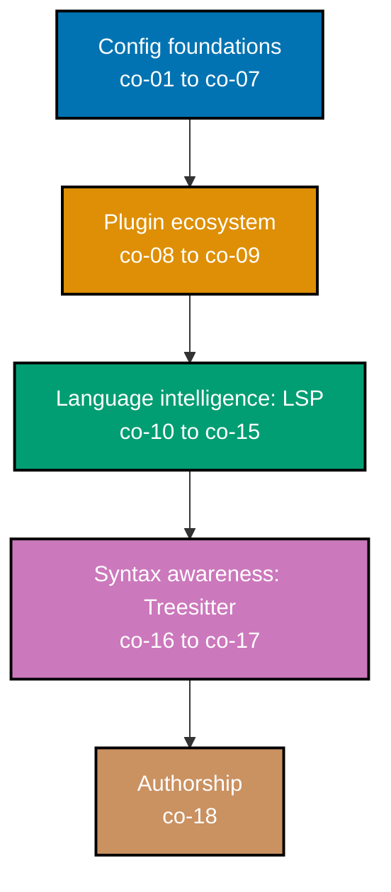

## Prerequisites

- **Prior topics**: [1 · Just Enough Nvim](../../just-enough-nvim/learning/overview.md) (modal
  editing fluency, zero plugins) and [2 · Just Enough Lua](../../just-enough-lua/learning/overview.md)
  (the config you are about to write is a Lua program). Both are required -- this topic assumes you
  can already move around a file with motions and already know what a Lua table and a closure are.
- **Tools & environment**: a macOS/Linux terminal; the latest **Neovim** (`nvim --version`) --
  current stable is **v0.12.4** (released 2026-07-05); **git** (to clone and manage the config and
  plugins); network access to fetch plugins; a working `~/.config/nvim` location. A Python 3.x
  runtime installed for the LSP demo later in this topic.
- **Assumed knowledge**: reading and writing basic Lua tables and functions (from topic 2); using
  the terminal and git.

## Why this exists -- the big idea

Vanilla Neovim (topic 1) edits text, and Lua (topic 2) is the language you write config in -- but
neither on its own gives you diagnostics, syntax-aware highlighting, or a config you can reproduce
on a brand-new machine. This topic turns the editor into a versioned **forge**: every later topic
in this journey assumes this forge already exists. The one idea worth keeping if you forget
everything else: your editor is code -- the config is a Lua program tracked in git, so your
development environment is reproducible and diffable, not a pile of settings you clicked once and
can no longer explain.

**Cross-cutting big ideas**: `mechanism-vs-policy` -- vanilla Neovim, as topic 1 taught it, is pure
**mechanism**. Here you add the **policy** layer on top of that mechanism: which plugins to
install, which language servers to enable, which keys to bind -- policy is exactly the part that
differs from one developer's config to the next, even though every one of those configs sits on
the identical mechanism underneath. `abstraction-and-its-cost` -- the Language Server Protocol and
Tree-sitter are both language-agnostic **abstractions**: learn the LSP client once and every
language server speaks the same protocol back to it; learn the `vim.treesitter.query` API once and
every bundled grammar exposes the same capture interface. The cost of that uniformity is a layer of
indirection between "I want a rename refactor for this variable" and the actual server or parser
doing the work underneath -- a cost this topic makes visible rather than hiding.

Concretely, this topic covers plugin management (both Neovim's own built-in manager and the
dominant third-party one), the native LSP client, Tree-sitter-based highlighting and text objects,
and packaging your own Lua into a tiny self-authored plugin -- the same shape as anything you would
install from someone else.

## How verification works in this topic

Topic 2 was scriptable: every claim could be checked by running `lua example.lua` from a plain
terminal. Almost nothing in this topic works that way, because keymaps, autocommands, LSP
attachment, and Tree-sitter highlighting only exist inside a **running Neovim session** reacting to
real editor events -- there is no standalone interpreter for "what does `:verbose map` print" or
"did the language server attach." The worked examples that follow this concepts page verify each
claim against a real, observable signal inside Neovim: `:verbose map <lhs>` for a keymap's origin,
`:checkhealth` for a per-component pass/fail report, `:lua print(...)` or `:lua =expr` for
inspecting a live Lua value from the command line, and `nvim --headless -c '<command>' -c 'qa!'` for
running a sequence of commands non-interactively and inspecting the result afterward. Every concept
below names the exact command or API call you would use to confirm it yourself, not a vague
description of what "should" happen.

## Concepts

Every worked example in this topic's follow-up pages cites the `co-NN` concept it exercises --
this section is the 1:1 reference those citations point back to. Read it in order: each concept
builds on the ones before it, from "where does Neovim even read my config" through to "package your
own Lua the same way a third-party plugin is packaged."

### co-01 · Init.lua Entrypoint

`init.lua` under `stdpath('config')` (`~/.config/nvim/init.lua` by default) is the single Lua entry
point Neovim sources every time it starts. A `lua/` directory placed beside it is added to the
`runtimepath`, which is what makes every file inside it `require()`-able later (co-07).

**Why it matters**: every other concept in this topic -- options, keymaps, autocommands, plugin
managers -- is code, and code has to live somewhere Neovim actually reads at startup. Locating (or
creating) that one file is the entry point to everything else this topic builds.

**Verify it**: after editing `init.lua` and restarting Neovim, `:echo $MYVIMRC` reports the exact
resolved path; `:lua print(vim.fn.stdpath('config'))` reports the base config directory
independently of whether `init.lua` exists yet.

### co-02 · Options: `vim.o` vs `vim.opt`

Editor options are set two ways: `vim.o` gives direct scalar access for boolean, number, and string
values (`vim.o.number = true`), while `vim.opt` wraps the same options in a Lua-table-like object
supporting `:append()`/`:remove()`, which matters for options that are really comma-separated lists
under the hood (`vim.opt.wildignore:append({...})`). `vim.bo` and `vim.wo` scope the same kind of
access to a single buffer or window instead of globally.

**Why it matters**: almost every "make Neovim behave the way I want" task is an option change, and
picking the wrong accessor for a list-like option silently overwrites the whole list instead of
extending it -- a common, hard-to-spot config bug.

**Verify it**: `:set <option>?` echoes the current value from Neovim's own settings; from Lua,
`:lua print(vim.inspect(vim.opt.<option>:get()))` shows the same value as a real Lua value.

### co-03 · Global and Scoped Variables

`vim.g`, `vim.b`, `vim.w`, and `vim.t` are typed wrappers over Vim's global, buffer, window, and tab
variable scopes. `vim.g.mapleader` (the most common global variable any config sets) is a `vim.g`
example; a filetype-specific setting stored per buffer is a `vim.b` example.

**Why it matters**: scoping a variable to a buffer or window lets a feature vary per open file (a
formatter's configuration, a per-project flag) without leaking into every other buffer -- the same
distinction `vim.o` vs `vim.bo` makes for options (co-02), but for arbitrary data instead.

**Verify it**: `:lua print(vim.g.my_setting, vim.b.my_setting)` in one buffer, then the same command
in a second, freshly opened buffer -- the global value persists across both, the buffer-local one
does not.

### co-04 · `vim.keymap.set`

`vim.keymap.set(mode, lhs, rhs, opts)` is the standard Lua API for key mappings, replacing
Vimscript's `:nnoremap`/`:vnoremap`/`:map` family. `rhs` can be a string (an Ex command or another
mapping) or a Lua function directly; `opts` accepts `desc`, `buffer`, `silent`, `expr`, and `remap`.
`vim.keymap.del` removes a mapping the same way.

**Why it matters**: keymaps are the interface between a reader's fingers and every feature this
topic adds -- plugin commands, LSP actions (co-12), and custom user commands (co-06) all eventually
need a keystroke bound to them to be usable day to day.

**Verify it**: `:verbose map <lhs>` reports the mapping itself, its `desc`, and the exact file and
line number where it was defined -- the single most useful command for debugging "why did my
keymap stop working."

### co-05 · Autocommands

`vim.api.nvim_create_autocmd(event, opts)`, paired with `vim.api.nvim_create_augroup(name, {clear =
true})`, replaces Vimscript's `autocmd`/`augroup` pair for event-driven config. An autocommand
dispatches to either a `command` string or a Lua `callback`, and the augroup's `clear = true` is
what prevents autocommands from silently piling up duplicates every time a config is re-sourced.

**Why it matters**: a config is not just "run once at startup" -- most genuinely useful behavior
(format-on-save, filetype-specific options, a yank-highlight flash) has to react to editor events
as they happen, and autocommands are the only mechanism for that.

**Verify it**: `:au` (optionally `:au <GroupName>`) lists every currently registered autocommand and
which group owns it; re-sourcing a config that clears its augroup first still shows exactly the
same entries afterward, not doubled ones.

### co-06 · User Commands

`vim.api.nvim_create_user_command(name, command, opts)` defines a custom Ex command. `opts` accepts
`nargs`, `range`, `count`, `complete`, `desc`, `force`, `preview`, and `addr`, plus generic boolean
`|command-attributes|` such as `bang` and `bar` -- `bang` is not itself a distinctly documented
`opts` field, it is one of those shared attributes. When the command runs, its Lua callback
receives a table with `args`, `bang`, `count`, `fargs`, `line1`, `line2`, `mods`, `name`, `nargs`,
`range`, `reg`, and `smods`.

**Why it matters**: this turns any Lua function into a first-class Ex command that a user (or a
keymap from co-04) can invoke by name, with tab-completion and range support -- exactly how plugin
authors, and later you yourself (co-18), expose functionality to the `:` command line.

**Verify it**: typing the command's name at the `:` prompt runs it directly; for a command defined
with `complete = ...`, pressing `<Tab>` after the command name completes candidates the same way a
built-in command does.

### co-07 · Lua Module System

Any file under `lua/` on the `runtimepath` (co-01) becomes `require()`-able: subdirectories map to
dotted paths (`lua/config/options.lua` becomes `require('config.options')`), and an `init.lua`
inside a folder collapses that whole folder into a single requireable unit. Once required, a module
is cached in `package.loaded` until something explicitly clears that cache entry.

**Why it matters**: this is what turns a single `init.lua` into an organized, maintainable config
tree instead of one enormous file -- and it is the exact same mechanism every third-party plugin
uses to expose itself, which is why co-18 (writing your own plugin) reuses it directly.

**Verify it**: `:lua print(package.loaded['config.options'])` is non-nil once the module has been
required; clearing that entry and requiring again (`package.loaded['config.options'] = nil`) picks
up edits made to the file without restarting Neovim.

### co-08 · Plugin Management: `vim.pack`

Neovim 0.12 ships a built-in, Git-backed plugin manager with no external dependency:
`vim.pack.add`/`get`/`update`/`del`. It installs each plugin into `site/pack/core/opt` -- the
**opt** side of the packpath, never a `start/` directory -- and `:packadd`s it programmatically,
tracking installed state in a JSON `packlockfile`.

**Why it matters**: for the first time, managing plugins needs zero bootstrap script and zero
separate tool installed first -- `vim.pack.add({...})` alone is enough to fetch, install, and load a
plugin from a fresh Neovim install.

**Verify it**: after `vim.pack.add({...})`, the cloned plugin appears under `site/pack/core/opt/`
on disk, and `vim.pack.get({...})` reports its installed revision back as a Lua value.

### co-09 · Plugin Management: lazy.nvim

`lazy.nvim` remains the dominant third-party plugin manager: a declarative plugin-spec table per
plugin, lazy-loading triggers (`event`, `cmd`, `ft`, `keys`), and an `opts`/`config` convention for
running a plugin's setup code.

**Why it matters**: it offers richer lazy-loading control than `vim.pack` currently does -- load a
plugin only on a specific keystroke, filetype, or command -- plus a built-in UI for inspecting and
profiling exactly when and why each plugin loaded, which matters once a config has more than a
handful of plugins.

**Verify it**: `:Lazy` opens the plugin-manager UI listing every managed plugin and its status;
`:Lazy profile` breaks down load time per plugin and shows which trigger caused each one to load.

### co-10 · Native LSP Config

Neovim 0.11+ replaced `require('lspconfig').<name>.setup{...}` with the native pair
`vim.lsp.config(name, cfg)` / `vim.lsp.enable(name)`. `vim.lsp.config('*', {...})` is a wildcard
that sets shared defaults every subsequently enabled server inherits, without repeating them
per-server.

**Why it matters**: LSP configuration is now core Neovim, not something that depends on a plugin
being installed first -- and the wildcard lets you set something like `capabilities` or
`root_markers` exactly once for every language server your config enables.

**Verify it**: after `vim.lsp.enable('<name>')` and opening a matching file, `:lua
=vim.lsp.get_clients()` lists the attached client and its resolved configuration, including
anything inherited from the `'*'` wildcard.

### co-11 · LSP Server Configs and `nvim-lspconfig`

`nvim-lspconfig` is now a config-only registry, not the activation framework it used to be: it
supplies `lsp/<name>.lua` files that `vim.lsp.config` auto-discovers on the `runtimepath`, and it
merges cleanly with any `lsp/<name>.lua` file you author yourself in your own config.

**Why it matters**: this separates "what does this server's default configuration look like"
(a community-maintained registry) from "how do I turn a server on" (your own `vim.lsp.enable` call,
co-10) -- and it means overriding or adding a server's entire config is just one file away, no
plugin API to learn.

**Verify it**: create `~/.config/nvim/lsp/<name>.lua` returning a config table, then `vim.lsp.enable
('<name>')` -- `:lua =vim.lsp.config.<name>` confirms Neovim auto-discovered and merged it.

### co-12 · `LspAttach` and Buffer-Local Keymaps

The `LspAttach` autocommand (co-05) is the idiomatic place to set buffer-local LSP keymaps and
inspect the attaching client, replacing the older `on_attach` callback that used to live inside
`require('lspconfig').<name>.setup{ on_attach = ... }`.

**Why it matters**: LSP keymaps and behavior (hover, formatting, codelens) should exist only in
buffers where a language server is actually attached -- binding them globally makes them fire, and
fail, in plain text files with no server running. `LspAttach`'s callback receives the attaching
client and buffer number directly, so everything can be scoped correctly per buffer.

**Verify it**: `:LspInfo` (from `nvim-lspconfig`) shows a buffer's attach and detach transitions as
you open and close files, confirming exactly when `LspAttach` fired.

### co-13 · Default LSP Keymaps

Neovim 0.11+ ships a set of unconditional global LSP keymaps out of the box, active the moment any
server attaches: `grn` rename, `gra` code action, `grr` references, `gri` implementation, `grt`
type definition, `gO` document symbols, `grx` run codelens, and `K` hover.

**Why it matters**: hand-binding these in every config is now redundant by default -- a reader who
has not yet touched co-04 or co-12 at all still gets a working baseline LSP experience the instant
any language server attaches to a buffer.

**Verify it**: with a server attached and no custom `rename` keymap defined, pressing `grn`
immediately opens `vim.lsp.buf.rename()`'s prompt with no config required.

### co-14 · Diagnostics Config

`vim.diagnostic.config(opts, namespace?)` controls how diagnostics render, either globally or
scoped to one namespace: `virtual_text`, `signs`, `underline`, `float`, and `severity_sort` are the
main knobs.

**Why it matters**: raw LSP diagnostics are noisy by default. Tuning this one function is how a
config decides whether errors show as inline virtual text, gutter signs, popup floats, or some
combination -- and `severity_sort` decides whether an error visually outranks a warning sitting on
the same line.

**Verify it**: `:lua vim.diagnostic.config({virtual_text = false})` immediately hides inline
diagnostic text while gutter signs remain visible; `vim.diagnostic.setloclist()` opens the location
list populated with every diagnostic in the current buffer.

### co-15 · Native LSP Completion

`vim.lsp.completion.enable(true, client_id, bufnr, opts)` wires a server's completion capability
directly into Neovim's built-in insert-mode completion, including an `autotrigger` option and
snippet expansion.

**Why it matters**: this removes the hard dependency on a third-party completion plugin
(`nvim-cmp` and similar) that older configs required for "complete as I type" -- as-you-type
completion is now core Neovim once a server is attached.

**Verify it**: after enabling with `autotrigger = true` inside `LspAttach` (co-12), typing `.` after
an object opens the native completion menu with no completion plugin installed anywhere in the
config.

### co-16 · Treesitter Highlighting

Neovim 0.12+ bundles a handful of Tree-sitter parsers (C, Lua, Markdown, Vimscript, Vimdoc) and
turns on syntax-aware highlighting for them by default via `vim.treesitter.start()` -- zero plugins
required. The historic `nvim-treesitter` plugin that used to install every other parser was
archived 2026-04-03; installing parsers for non-bundled languages now points toward core APIs and
the active community fork's `:TSInstall` command instead of the frozen original.

**Why it matters**: highlighting driven by an actual parsed syntax tree, instead of regular
expressions guessing at tokens, ships for several languages out of the box -- and knowing exactly
what is bundled versus what still needs an installer avoids chasing an archived, no-longer-updated
repository.

**Verify it**: opening a `.lua` file on a fresh 0.12+ install with zero plugins, `:lua
=vim.treesitter.highlighter.active[vim.api.nvim_get_current_buf()]` returns non-nil, proving the
parser and highlighter are already running.

### co-17 · Treesitter Textobjects and Queries

The `vim.treesitter.query` API (`parse`, `get`, `set`, `iter_captures`) exposes the parsed syntax
tree programmatically, and Neovim ships built-in object-select operators (`an`/`in` for "a node" /
"in node", `]n`/`[n` for sibling navigation) plus `vim.treesitter.foldexpr()` for expression-based
folding driven by the same tree.

**Why it matters**: once a parser exists for a buffer (co-16), the same tree powers structure-aware
editing -- selecting exactly the enclosing function, jumping to the next sibling statement, or
folding a function body by its actual syntax rather than counting indentation or braces.

**Verify it**: `:lua print(vim.treesitter.get_node():type())` prints the syntax node type directly
under the cursor (for example `function_call`), confirming the tree is queryable at that position.

### co-18 · Writing a Custom Plugin Module

A user's own Lua functionality gets packaged the same way any third-party plugin is: a
`require()`-able module (co-07) exposing `M.setup(opts)`, an optional `plugin/*.lua` file for
autoloading at startup with no explicit `require` call needed, and a `lua/<name>/health.lua` module
integrating with `:checkhealth`.

**Why it matters**: this is the graduation concept for the whole topic -- keymaps (co-04),
autocommands (co-05), user commands (co-06), and the module system (co-07) all compose into a
config author's own reusable, health-checkable unit, indistinguishable in shape from a plugin
fetched with `vim.pack` (co-08) or `lazy.nvim` (co-09).

**Verify it**: `:checkhealth <name>` runs the module's own `M.check()` function and reports a
per-check OK/ERROR result the same way `:checkhealth` does for any bundled or third-party plugin.

## Examples by Level

### Beginner (Examples 1–28)

- [Example 1: Locate Init.lua](/en/c/learn/fundamentally-strong/software-engineer/extending-neovim/learning/beginner#example-1-locate-initlua)
- [Example 2: Set a Boolean Option with vim.o](/en/c/learn/fundamentally-strong/software-engineer/extending-neovim/learning/beginner#example-2-set-a-boolean-option-with-vimo)
- [Example 3: Set relativenumber](/en/c/learn/fundamentally-strong/software-engineer/extending-neovim/learning/beginner#example-3-set-relativenumber)
- [Example 4: Set Tab Options](/en/c/learn/fundamentally-strong/software-engineer/extending-neovim/learning/beginner#example-4-set-tab-options)
- [Example 5: Append a List Option with vim.opt](/en/c/learn/fundamentally-strong/software-engineer/extending-neovim/learning/beginner#example-5-append-a-list-option-with-vimopt)
- [Example 6: ignorecase + smartcase](/en/c/learn/fundamentally-strong/software-engineer/extending-neovim/learning/beginner#example-6-ignorecase--smartcase)
- [Example 7: Set mapleader](/en/c/learn/fundamentally-strong/software-engineer/extending-neovim/learning/beginner#example-7-set-mapleader)
- [Example 8: Basic Normal Keymap](/en/c/learn/fundamentally-strong/software-engineer/extending-neovim/learning/beginner#example-8-basic-normal-keymap)
- [Example 9: Keymap with a Lua Function](/en/c/learn/fundamentally-strong/software-engineer/extending-neovim/learning/beginner#example-9-keymap-with-a-lua-function)
- [Example 10: Keymap Across Multiple Modes](/en/c/learn/fundamentally-strong/software-engineer/extending-neovim/learning/beginner#example-10-keymap-across-multiple-modes)
- [Example 11: Buffer-Local Keymap via FileType Autocmd](/en/c/learn/fundamentally-strong/software-engineer/extending-neovim/learning/beginner#example-11-buffer-local-keymap-via-filetype-autocmd)
- [Example 12: Remove a Keymap](/en/c/learn/fundamentally-strong/software-engineer/extending-neovim/learning/beginner#example-12-remove-a-keymap)
- [Example 13: Set Colorscheme](/en/c/learn/fundamentally-strong/software-engineer/extending-neovim/learning/beginner#example-13-set-colorscheme)
- [Example 14: Autocmd with a Command String](/en/c/learn/fundamentally-strong/software-engineer/extending-neovim/learning/beginner#example-14-autocmd-with-a-command-string)
- [Example 15: Autocmd Yank Highlight](/en/c/learn/fundamentally-strong/software-engineer/extending-neovim/learning/beginner#example-15-autocmd-yank-highlight)
- [Example 16: Augroup-Scoped Autocmds](/en/c/learn/fundamentally-strong/software-engineer/extending-neovim/learning/beginner#example-16-augroup-scoped-autocmds)
- [Example 17: Filetype-Local Option](/en/c/learn/fundamentally-strong/software-engineer/extending-neovim/learning/beginner#example-17-filetype-local-option)
- [Example 18: Simple User Command](/en/c/learn/fundamentally-strong/software-engineer/extending-neovim/learning/beginner#example-18-simple-user-command)
- [Example 19: User Command with an Argument](/en/c/learn/fundamentally-strong/software-engineer/extending-neovim/learning/beginner#example-19-user-command-with-an-argument)
- [Example 20: Split Config into a Module](/en/c/learn/fundamentally-strong/software-engineer/extending-neovim/learning/beginner#example-20-split-config-into-a-module)
- [Example 21: Reload a Module](/en/c/learn/fundamentally-strong/software-engineer/extending-neovim/learning/beginner#example-21-reload-a-module)
- [Example 22: Run Checkhealth](/en/c/learn/fundamentally-strong/software-engineer/extending-neovim/learning/beginner#example-22-run-checkhealth)
- [Example 23: Inspect a Lua Value](/en/c/learn/fundamentally-strong/software-engineer/extending-neovim/learning/beginner#example-23-inspect-a-lua-value)
- [Example 24: Scoped Variable Independence](/en/c/learn/fundamentally-strong/software-engineer/extending-neovim/learning/beginner#example-24-scoped-variable-independence)
- [Example 25: Window-Local Option](/en/c/learn/fundamentally-strong/software-engineer/extending-neovim/learning/beginner#example-25-window-local-option)
- [Example 26: Custom Statusline Format](/en/c/learn/fundamentally-strong/software-engineer/extending-neovim/learning/beginner#example-26-custom-statusline-format)
- [Example 27: termguicolors](/en/c/learn/fundamentally-strong/software-engineer/extending-neovim/learning/beginner#example-27-termguicolors)
- [Example 28: Install a Plugin with vim.pack.add](/en/c/learn/fundamentally-strong/software-engineer/extending-neovim/learning/beginner#example-28-install-a-plugin-with-vimpackadd)

### Intermediate (Examples 29–58)

- [Example 29: Pin a Plugin Version with vim.pack.add](/en/c/learn/fundamentally-strong/software-engineer/extending-neovim/learning/intermediate#example-29-pin-a-plugin-version-with-vimpackadd)
- [Example 30: Update Plugins with vim.pack.update](/en/c/learn/fundamentally-strong/software-engineer/extending-neovim/learning/intermediate#example-30-update-plugins-with-vimpackupdate)
- [Example 31: Remove a Plugin with vim.pack.del](/en/c/learn/fundamentally-strong/software-engineer/extending-neovim/learning/intermediate#example-31-remove-a-plugin-with-vimpackdel)
- [Example 32: Bootstrap lazy.nvim](/en/c/learn/fundamentally-strong/software-engineer/extending-neovim/learning/intermediate#example-32-bootstrap-lazynvim)
- [Example 33: lazy.nvim Plugin Spec with opts](/en/c/learn/fundamentally-strong/software-engineer/extending-neovim/learning/intermediate#example-33-lazynvim-plugin-spec-with-opts)
- [Example 34: Lazy-Load a Plugin by Event](/en/c/learn/fundamentally-strong/software-engineer/extending-neovim/learning/intermediate#example-34-lazy-load-a-plugin-by-event)
- [Example 35: Lazy-Load a Plugin by Command](/en/c/learn/fundamentally-strong/software-engineer/extending-neovim/learning/intermediate#example-35-lazy-load-a-plugin-by-command)
- [Example 36: Enable an LSP Server](/en/c/learn/fundamentally-strong/software-engineer/extending-neovim/learning/intermediate#example-36-enable-an-lsp-server)
- [Example 37: Customize an LSP Server's Config Before Enabling](/en/c/learn/fundamentally-strong/software-engineer/extending-neovim/learning/intermediate#example-37-customize-an-lsp-servers-config-before-enabling)
- [Example 38: LSP Config from the lsp/ Directory](/en/c/learn/fundamentally-strong/software-engineer/extending-neovim/learning/intermediate#example-38-lsp-config-from-the-lsp-directory)
- [Example 39: LspAttach Buffer-Local Keymap](/en/c/learn/fundamentally-strong/software-engineer/extending-neovim/learning/intermediate#example-39-lspattach-buffer-local-keymap)
- [Example 40: Verify the Default grn LSP Keymap](/en/c/learn/fundamentally-strong/software-engineer/extending-neovim/learning/intermediate#example-40-verify-the-default-grn-lsp-keymap)
- [Example 41: Turn Off Diagnostic Virtual Text](/en/c/learn/fundamentally-strong/software-engineer/extending-neovim/learning/intermediate#example-41-turn-off-diagnostic-virtual-text)
- [Example 42: Diagnostic Float on CursorHold](/en/c/learn/fundamentally-strong/software-engineer/extending-neovim/learning/intermediate#example-42-diagnostic-float-on-cursorhold)
- [Example 43: Diagnostic Severity Sort](/en/c/learn/fundamentally-strong/software-engineer/extending-neovim/learning/intermediate#example-43-diagnostic-severity-sort)
- [Example 44: LSP Format on Save](/en/c/learn/fundamentally-strong/software-engineer/extending-neovim/learning/intermediate#example-44-lsp-format-on-save)
- [Example 45: Enable Native LSP Completion](/en/c/learn/fundamentally-strong/software-engineer/extending-neovim/learning/intermediate#example-45-enable-native-lsp-completion)
- [Example 46: Manually Trigger Native Completion](/en/c/learn/fundamentally-strong/software-engineer/extending-neovim/learning/intermediate#example-46-manually-trigger-native-completion)
- [Example 47: Confirm Builtin Treesitter Highlighting](/en/c/learn/fundamentally-strong/software-engineer/extending-neovim/learning/intermediate#example-47-confirm-builtin-treesitter-highlighting)
- [Example 48: Install a Missing Parser with the Active Fork](/en/c/learn/fundamentally-strong/software-engineer/extending-neovim/learning/intermediate#example-48-install-a-missing-parser-with-the-active-fork)
- [Example 49: Manually Start Treesitter for a Non-Bundled Language](/en/c/learn/fundamentally-strong/software-engineer/extending-neovim/learning/intermediate#example-49-manually-start-treesitter-for-a-non-bundled-language)
- [Example 50: Inspect the Active Parser's Language](/en/c/learn/fundamentally-strong/software-engineer/extending-neovim/learning/intermediate#example-50-inspect-the-active-parsers-language)
- [Example 51: Inspect the Syntax Node at the Cursor](/en/c/learn/fundamentally-strong/software-engineer/extending-neovim/learning/intermediate#example-51-inspect-the-syntax-node-at-the-cursor)
- [Example 52: User Command with Tab Completion](/en/c/learn/fundamentally-strong/software-engineer/extending-neovim/learning/intermediate#example-52-user-command-with-tab-completion)
- [Example 53: User Command with a Line Range](/en/c/learn/fundamentally-strong/software-engineer/extending-neovim/learning/intermediate#example-53-user-command-with-a-line-range)
- [Example 54: Module with Local (Closure) State](/en/c/learn/fundamentally-strong/software-engineer/extending-neovim/learning/intermediate#example-54-module-with-local-closure-state)
- [Example 55: Module setup(opts) Merge Pattern](/en/c/learn/fundamentally-strong/software-engineer/extending-neovim/learning/intermediate#example-55-module-setupopts-merge-pattern)
- [Example 56: opt_local vs Global Option](/en/c/learn/fundamentally-strong/software-engineer/extending-neovim/learning/intermediate#example-56-opt_local-vs-global-option)
- [Example 57: Expression Keymap](/en/c/learn/fundamentally-strong/software-engineer/extending-neovim/learning/intermediate#example-57-expression-keymap)
- [Example 58: Augroup Clear Idempotence Across Three Re-Sources](/en/c/learn/fundamentally-strong/software-engineer/extending-neovim/learning/intermediate#example-58-augroup-clear-idempotence-across-three-re-sources)

### Advanced (Examples 59–80)

- [Example 59: Merge Shared Capabilities via the LSP Wildcard](/en/c/learn/fundamentally-strong/software-engineer/extending-neovim/learning/advanced#example-59-merge-shared-capabilities-via-the-lsp-wildcard)
- [Example 60: Wildcard Shared Default: root_markers](/en/c/learn/fundamentally-strong/software-engineer/extending-neovim/learning/advanced#example-60-wildcard-shared-default-root_markers)
- [Example 61: Multiple LSP Clients on One Buffer](/en/c/learn/fundamentally-strong/software-engineer/extending-neovim/learning/advanced#example-61-multiple-lsp-clients-on-one-buffer)
- [Example 62: Stop and Reattach an LSP Client](/en/c/learn/fundamentally-strong/software-engineer/extending-neovim/learning/advanced#example-62-stop-and-reattach-an-lsp-client)
- [Example 63: Enable and Run Codelens](/en/c/learn/fundamentally-strong/software-engineer/extending-neovim/learning/advanced#example-63-enable-and-run-codelens)
- [Example 64: Workspace Symbol Search](/en/c/learn/fundamentally-strong/software-engineer/extending-neovim/learning/advanced#example-64-workspace-symbol-search)
- [Example 65: Toggle LSP Inlay Hints](/en/c/learn/fundamentally-strong/software-engineer/extending-neovim/learning/advanced#example-65-toggle-lsp-inlay-hints)
- [Example 66: Iterate Treesitter Query Captures](/en/c/learn/fundamentally-strong/software-engineer/extending-neovim/learning/advanced#example-66-iterate-treesitter-query-captures)
- [Example 67: Override the Highlights Query](/en/c/learn/fundamentally-strong/software-engineer/extending-neovim/learning/advanced#example-67-override-the-highlights-query)
- [Example 68: Select the Enclosing Node with an](/en/c/learn/fundamentally-strong/software-engineer/extending-neovim/learning/advanced#example-68-select-the-enclosing-node-with-an)
- [Example 69: Sibling Navigation with \]n](/en/c/learn/fundamentally-strong/software-engineer/extending-neovim/learning/advanced#example-69-sibling-navigation-with-n)
- [Example 70: Fold by Syntax Tree with treesitter.foldexpr](/en/c/learn/fundamentally-strong/software-engineer/extending-neovim/learning/advanced#example-70-fold-by-syntax-tree-with-treesitterfoldexpr)
- [Example 71: Plugin Health Check](/en/c/learn/fundamentally-strong/software-engineer/extending-neovim/learning/advanced#example-71-plugin-health-check)
- [Example 72: Register a User Command Inside setup()](/en/c/learn/fundamentally-strong/software-engineer/extending-neovim/learning/advanced#example-72-register-a-user-command-inside-setup)
- [Example 73: Autoload a Plugin via plugin/](/en/c/learn/fundamentally-strong/software-engineer/extending-neovim/learning/advanced#example-73-autoload-a-plugin-via-plugin)
- [Example 74: Run an Async Job with vim.uv.spawn](/en/c/learn/fundamentally-strong/software-engineer/extending-neovim/learning/advanced#example-74-run-an-async-job-with-vimuvspawn)
- [Example 75: Schedule Safety Inside a Fast-Event Callback](/en/c/learn/fundamentally-strong/software-engineer/extending-neovim/learning/advanced#example-75-schedule-safety-inside-a-fast-event-callback)
- [Example 76: Custom Statusline Component Driven by Lua](/en/c/learn/fundamentally-strong/software-engineer/extending-neovim/learning/advanced#example-76-custom-statusline-component-driven-by-lua)
- [Example 77: Distribute Your Own Plugin via vim.pack](/en/c/learn/fundamentally-strong/software-engineer/extending-neovim/learning/advanced#example-77-distribute-your-own-plugin-via-vimpack)
- [Example 78: Override the References Handler to Use Quickfix](/en/c/learn/fundamentally-strong/software-engineer/extending-neovim/learning/advanced#example-78-override-the-references-handler-to-use-quickfix)
- [Example 79: Populate the Location List from Diagnostics](/en/c/learn/fundamentally-strong/software-engineer/extending-neovim/learning/advanced#example-79-populate-the-location-list-from-diagnostics)
- [Example 80: Full Config Healthcheck](/en/c/learn/fundamentally-strong/software-engineer/extending-neovim/learning/advanced#example-80-full-config-healthcheck)

---

← Previous: [2 · Just Enough Lua Capstone](../../just-enough-lua/learning/capstone/overview.md) ·
Next: [Beginner Examples](./beginner.md) →
