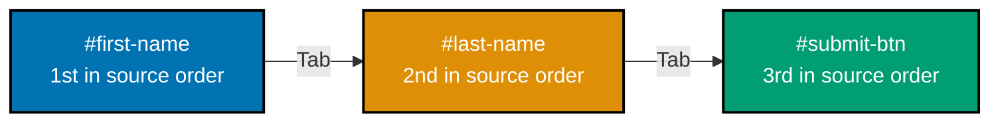
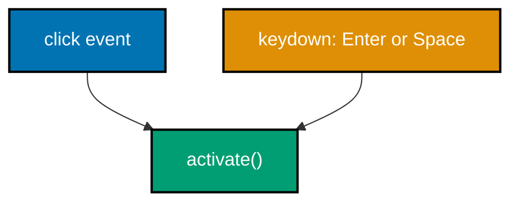
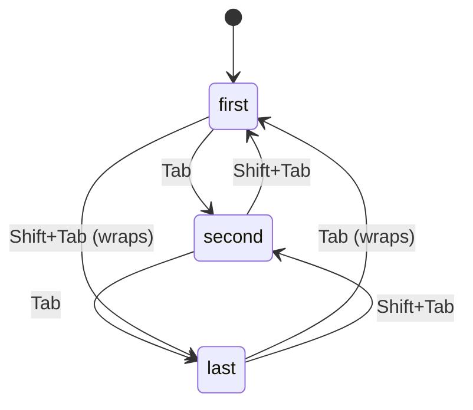
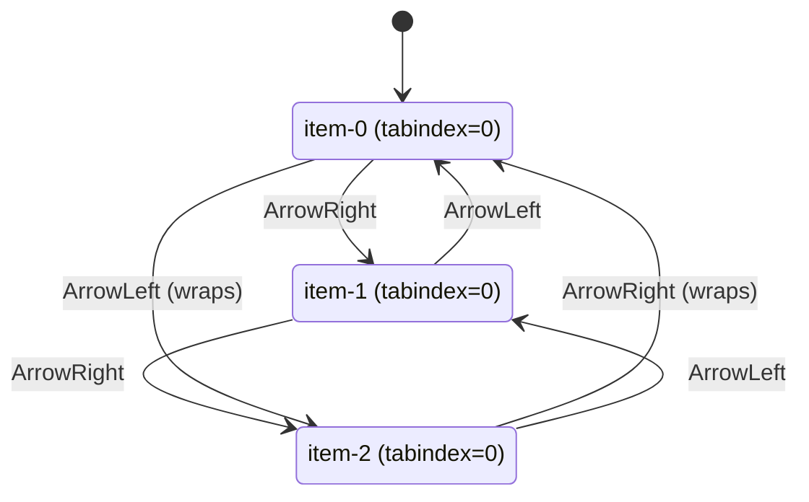
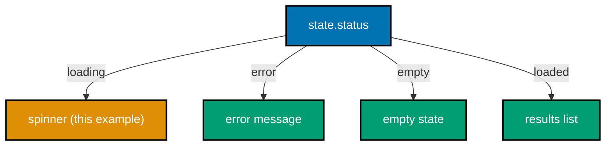
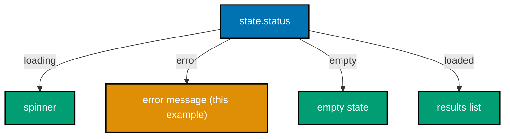
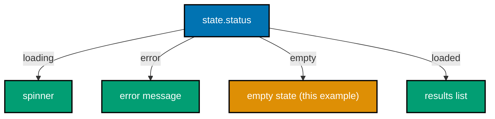
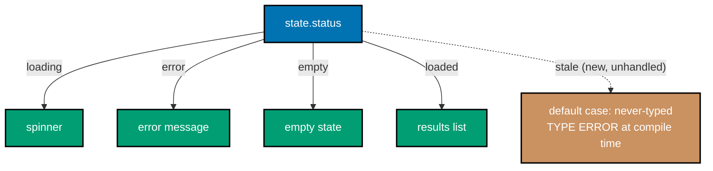
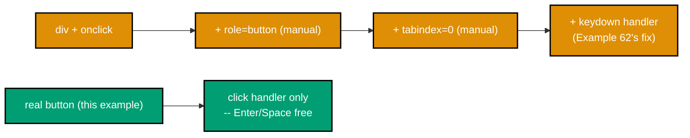
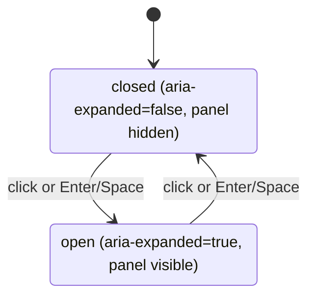

Examples 61-80 cover keyboard accessibility patterns (tab order, focus traps, roving tabindex), discriminated-union UI state with TypeScript exhaustiveness checking, typed props/state, small full components, three accessibility bug fixes, and two combined worked examples. Examples 68-70 are verified via `tsc` directly instead of a browser; every other `**Output**` block is genuinely captured from `node verify.mjs`.

---

### Example 61: Keyboard Tab Order

_ex-61 &middot; exercises co-26_

Pressing Tab moves focus through interactive elements in DOM order by default -- no explicit `tabindex` needed as long as the markup order already matches the intended visual/logical order.



**`learning/code/ex-61-keyboard-tab-order/index.html`**

```html
<!doctype html>
<!-- => sets standards mode; every example in this topic starts from this exact skeleton -->
<html lang="en">
  <!-- => lang="en" lets assistive tech choose correct pronunciation and hyphenation -->
  <head>
    <!-- => metadata lives here, resolved BEFORE the browser renders any visible content -->
    <meta charset="utf-8" />
    <!-- => must appear this early: it decides how every later byte in the file decodes -->
    <meta name="viewport" content="width=device-width, initial-scale=1" />
    <!-- => opts into a readable mobile scale instead of a zoomed-out desktop rendering -->
    <title>Example 61: Keyboard Tab Order</title>
    <!-- => shown in the browser tab only; has no effect on this example's Tab order -->
  </head>
  <body>
    <!-- =>
      This form has NO tabindex attribute anywhere below -- Tab order is decided
      ENTIRELY by source order, which is exactly what this example is here to prove.
    -->
    <form>
      <input id="first-name" type="text" />
      <!-- => Tab stop 1: the first focusable element in the DOM, in source order -->
      <input id="last-name" type="text" />
      <!-- => Tab stop 2: second in source order, so Tab reaches it second, unprompted -->
      <button id="submit-btn" type="submit">Submit</button>
      <!-- => Tab stop 3: last in source order -- Tab never skips ahead of it -->
      <!-- => type="submit" also makes this the button a real Enter keypress activates -->
    </form>
    <!-- => closes the only interactive region on the page -->
  </body>
  <!-- => end of document; nothing after this point participates in Tab order -->
</html>
```

**Run**: `node verify.mjs` (a small Playwright script colocated in `learning/code/ex-61-keyboard-tab-order/`)

**Output** (genuinely captured):

```text
tab order: ["first-name","last-name","submit-btn"]
PASS: pressing Tab moved focus through the form in the expected logical sequence
```

**Key takeaway**: Three real Tab presses moved focus through the form in exactly the order the elements appear in the DOM.

**Why it matters**: This is the single most important accessibility default to preserve -- a form whose visual layout diverges from its DOM order (via CSS positioning, a flex/grid `order` property, or a late-redesign rearrangement) produces a genuinely confusing tab order for keyboard users, even though the page looks completely ordinary to a sighted mouse user who never notices the mismatch. The common real-world trigger: nobody re-checks the actual Tab sequence after a purely visual reorder. Examples 63 and 64 build directly on this natural-order baseline, deliberately overriding it with a focus trap and roving tabindex.

---

### Example 62: Keyboard-Activate a Custom Button

_ex-62 &middot; exercises co-26, co-25_

`role="button"` alone adds no keyboard behavior at all -- a `keydown` handler checking for `Enter` and `Space` (and calling `preventDefault()` on Space, to stop the page from scrolling) has to be added by hand.



**`learning/code/ex-62-keyboard-activate-custom-button/index.html`**

```html
<!doctype html>
<!-- => same three-tag skeleton every worked example in this topic starts from -->
<html lang="en">
  <!-- => lang="en" is metadata only; it has no bearing on this example's keyboard logic -->
  <head>
    <meta charset="utf-8" />
    <!-- => decides how every later byte in this file decodes -->
    <meta name="viewport" content="width=device-width, initial-scale=1" />
    <!-- => readable mobile scale -->
    <title>Example 62: Keyboard-Activate a Custom Button</title>
    <!-- => shown in the browser tab only; unrelated to the keyboard logic below -->
  </head>
  <!-- => </head> closes metadata; everything demonstrated below lives in <body> -->
  <body>
    <!-- =>
      role="button" only fixes what a screen reader ANNOUNCES -- it adds zero real
      keyboard behavior. tabindex="0" is what makes this div reachable by Tab at all.
    -->
    <div id="fake-button" role="button" tabindex="0">Archive</div>
    <!-- => the fake button under test; note there is no real <button> anywhere on this page -->
    <p id="report">not activated</p>
    <!-- => starts as "not activated"; only the keydown handler below ever changes it -->
    <script>
      const el = document.getElementById("fake-button"); // => el is the fake div-as-button element
      // => el is looked up once, by id, and reused by both listeners registered below
      function activate() {
        // => the ONE shared action both a real click and a keyboard activation must trigger
        document.getElementById("report").textContent = "activated"; // => flips the visible report text
      } // => end of activate(); both listeners below call this exact same function
      el.addEventListener("click", activate); // => the mouse path: works even with no keydown code
      // => a real <button> gets click-to-activate for free; a div never does
      el.addEventListener("keydown", (event) => {
        // => this entire handler is the manual work role="button" alone never adds
        if (event.key === "Enter" || event.key === " ") {
          // => Enter AND Space both activate a real <button> -- both must be handled here too
          event.preventDefault(); // => on Space specifically, stops the page itself from scrolling
          activate(); // => the keyboard path re-uses the identical function the click path calls
        } // => end of the Enter/Space check -- any other key falls through and does nothing
      }); // => end of the keydown handler
    </script>
    <!-- => </script> ends the only behavior on this page -->
  </body>
</html>
```

**Run**: `node verify.mjs` (a small Playwright script colocated in `learning/code/ex-62-keyboard-activate-custom-button/`)

**Output** (genuinely captured):

```text
report after Enter: activated
report after Space: activated
PASS: both Enter and Space activated the custom role=button element via keydown handling
```

**Key takeaway**: Both a real Enter keypress and a real Space keypress activated the custom button, once the keydown handling was added explicitly.

**Why it matters**: This is exactly the manual work a real `<button>` element (Example 76) gives you for free -- reaching for `role="button"` on a `div` means owning this keyboard logic yourself, including the easy-to-forget `preventDefault()` on Space, without which the page silently scrolls whenever the fake button is activated by keyboard. A common real-world pitfall: adding `role="button"` and `tabindex="0"` and stopping there, satisfying a linter's ARIA rule while leaving the element genuinely unusable from a keyboard. This example makes the true cost visible -- the div path needs a whole `keydown` handler that Example 76 needs zero lines of.

---

### Example 63: Focus Trap Modal

_ex-63 &middot; exercises co-26_

A focus trap intercepts Tab at the modal's first and last focusable elements, wrapping focus back around -- while the modal is open, Tab can never reach anything outside it.



**`learning/code/ex-63-focus-trap-modal/index.html`**

```html
<!doctype html>
<!-- => same three-tag skeleton every worked example in this topic starts from -->
<html lang="en">
  <!-- => lang="en" is metadata only; unrelated to the trap logic demonstrated below -->
  <head>
    <!-- => the four Tab presses this example verifies all happen further down, in <body> -->
    <!-- => metadata resolved before anything below is ever rendered -->
    <meta charset="utf-8" />
    <!-- => decides how every later byte in this file decodes -->
    <meta name="viewport" content="width=device-width, initial-scale=1" />
    <!-- => readable mobile scale -->
    <title>Example 63: Focus Trap Modal</title>
    <!-- => shown in the browser tab only; unrelated to the trap logic below -->
  </head>
  <body>
    <!-- => everything demonstrated below lives here -->
    <button id="outside">Outside (must stay unreachable while trapped)</button>
    <!-- => this button proves the trap: Tab must NEVER reach it while the modal is "open" -->
    <div id="modal" role="dialog" aria-modal="true">
      <!-- => aria-modal="true" tells assistive tech everything OUTSIDE this dialog is inert -->
      <button id="first">First</button>
      <!-- => the trap's low edge: Shift+Tab here must wrap around to the LAST button -->
      <button id="second">Second</button>
      <!-- => the middle button: Tab moves through it exactly like ordinary DOM-order focus -->
      <button id="last">Last</button>
      <!-- => the trap's high edge: Tab here must wrap around to the FIRST button -->
    </div>
    <!-- => </div> closes the trapped region; nothing outside it may ever receive focus below -->
    <script>
      // => everything below is the trap's entire implementation: about a dozen real lines
      const modal = document.getElementById("modal"); // => the element the trap's listener attaches to
      // => modal is where the trap's one keydown listener is attached, not each button individually
      const focusables = ["first", "second", "last"].map((id) => document.getElementById(id));
      // => focusables is the ordered list of the modal's three real focus stops
      modal.addEventListener("keydown", (event) => {
        // => one listener on the container catches Tab from any button inside it, via bubbling
        if (event.key !== "Tab") return; // => every other key is ignored; only Tab is trapped
        const first = focusables[0]; // => first is always the low edge of the trap
        const last = focusables[focusables.length - 1]; // => last is always the high edge
        if (event.shiftKey && document.activeElement === first) {
          // => Shift+Tab AT the first button is the one case that must wrap BACKWARD
          event.preventDefault(); // => cancels the browser's own default: leaving the modal
          last.focus(); // => wraps focus around to the last button instead
        } else if (!event.shiftKey && document.activeElement === last) {
          // => plain Tab AT the last button is the one case that must wrap FORWARD
          event.preventDefault(); // => cancels the browser's own default: leaving the modal
          first.focus(); // => wraps focus around to the first button instead
        } // => every OTHER Tab press inside the modal falls through and moves focus normally
      }); // => end of the trap's one keydown handler
      focusables[0].focus(); // => moves real focus into the modal the instant it "opens"
    </script>
    <!-- => </script> ends the trap's entire implementation -->
  </body>
  <!-- => end of document; the outside button above was never reachable across all four Tabs -->
</html>
```

**Run**: `node verify.mjs` (a small Playwright script colocated in `learning/code/ex-63-focus-trap-modal/`)

**Output** (genuinely captured):

```text
focus sequence over 4 Tabs: ["first","second","last","first","second"]
PASS: Tab cycled first -> second -> last -> first, staying inside the modal every time
```

**Key takeaway**: Across four real Tab presses, focus cycled first -> second -> last -> first -> second, and never once reached the button outside the modal.

**Why it matters**: Without a focus trap, a keyboard user tabbing through an open modal eventually tabs OUT into background content still present behind the overlay -- a disorienting experience, since focus can vanish from the dialog with no visual cue. The common pitfall: a modal that looks correct (CSS overlay, centered box, backdrop) while forgetting the trap entirely, since a mouse user never notices the gap -- clicking always lands wherever the mouse points. Example 64's roving tabindex is this trap's sibling: both deliberately override Tab, but this confines focus to a region, roving tabindex confines the Tab STOP to one element.

---

### Example 64: Roving Tabindex Menu

_ex-64 &middot; exercises co-26_

In a roving-tabindex pattern, only ONE item in a group has `tabindex="0"` at any time (the rest are `-1`) -- arrow keys move both that single tab stop and the actual DOM focus together.



**`learning/code/ex-64-roving-tabindex-menu/index.html`**

```html
<!doctype html>
<!-- => same three-tag skeleton every worked example in this topic starts from -->
<html lang="en">
  <!-- => lang="en" is metadata only; unrelated to the roving-tabindex logic below -->
  <!-- => three ArrowRight/ArrowLeft presses are exercised by verify.mjs, further down -->
  <head>
    <!-- => metadata resolved before anything below is ever rendered -->
    <meta charset="utf-8" />
    <!-- => decides how every later byte in this file decodes -->
    <meta name="viewport" content="width=device-width, initial-scale=1" />
    <!-- => readable mobile scale -->
    <title>Example 64: Roving Tabindex Menu</title>
    <!-- => shown in the browser tab only; unrelated to this example's point -->
  </head>
  <!-- => </head> closes metadata; the roving-tabindex menu lives entirely in <body> -->
  <body>
    <!-- => everything demonstrated below lives here -->
    <div role="menu" id="menu">
      <!-- => the one keydown listener below attaches HERE, not to each menuitem -->
      <div role="menuitem" id="item-0" tabindex="0">File</div>
      <!-- => tabindex="0": the ONLY roving stop right now -- this is the single Tab target -->
      <div role="menuitem" id="item-1" tabindex="-1">Edit</div>
      <!-- => tabindex="-1": focusable via .focus() in JS, but skipped entirely by real Tab -->
      <div role="menuitem" id="item-2" tabindex="-1">View</div>
      <!-- => tabindex="-1": same as Edit -- only ONE item may ever hold tabindex="0" -->
    </div>
    <!-- => </div> closes the menu; from Tab's perspective this whole group is ONE stop -->
    <script>
      // => everything below is the roving-tabindex implementation, about a dozen real lines
      const items = Array.from(document.querySelectorAll('[role="menuitem"]'));
      // => items is the ordered list of the three roving-tabindex candidates
      let current = 0; // => current tracks the INDEX of whichever item currently holds tabindex="0"
      // => current starts at 0 because item-0 is the only element that starts as tabindex="0"
      document.getElementById("menu").addEventListener("keydown", (event) => {
        // => one listener on the menu container, not one per menuitem
        if (event.key !== "ArrowRight" && event.key !== "ArrowLeft") return;
        // => Tab itself is left completely alone; only the arrow keys are handled here
        items[current].tabIndex = -1;
        // => demotes the OLD current item first, so only one item is ever tabindex="0"
        current = // => recomputes which index becomes the new roving stop
          event.key === "ArrowRight"
            ? (current + 1) % items.length // => wraps forward past the last item back to 0
            : (current - 1 + items.length) % items.length; // => wraps backward past 0 to the last item
        items[current].tabIndex = 0;
        // => promotes the NEW current item to the single tabindex="0" roving stop
        items[current].focus();
        // => moves REAL DOM focus in the same keypress the tabindex roved in
      }); // => end of the roving-tabindex keydown handler
      items[0].focus(); // => starts real focus on the one item that starts as tabindex="0"
    </script>
    <!-- => </script> ends the roving-tabindex implementation -->
  </body>
  <!-- => end of document; Tab only ever reaches ONE menuitem, whichever is current -->
</html>
```

**Run**: `node verify.mjs` (a small Playwright script colocated in `learning/code/ex-64-roving-tabindex-menu/`)

**Output** (genuinely captured):

```text
start focus: item-0 tabindex: 0
after ArrowRight, focus: item-1 item-0 tabindex: -1 item-1 tabindex: 0
PASS: ArrowRight moved both DOM focus and the roving tabindex=0 to the next item
```

**Key takeaway**: ArrowRight moved DOM focus from the first menu item to the second, and the roving `tabindex="0"` moved with it, in the same keypress.

**Why it matters**: Roving tabindex keeps a whole menu as ONE stop in the page's overall Tab order (Tab moves past the widget at once), while arrow keys handle navigation WITHIN it -- the standard pattern for menus, toolbars, and radio groups. The common pitfall: giving every item its own Tab stop, so a ten-item toolbar costs a keyboard user ten separate Tab presses just to get past it, versus one Tab plus arrow-key navigation once they arrive. This is the direct sibling of Example 63's focus trap: both intercept default keyboard behavior on purpose.

---

### Example 65: Discriminated Union: Loading

_ex-65 &middot; exercises co-27_

Modeling UI state as a tagged union (`{status: "loading"} | {status: "error", message} | ...`) lets a `switch` on the tag render exactly one branch per possible state -- here, the `loading` branch.



**`learning/code/ex-65-discriminated-union-loading/index.html`**

```html
<!doctype html>
<!-- => same three-tag skeleton every worked example in this topic starts from -->
<html lang="en">
  <!-- => lang="en" is metadata only; unrelated to the state-rendering logic below -->
  <head>
    <!-- => metadata resolved before anything below is ever rendered -->
    <meta charset="utf-8" />
    <!-- => decides how every later byte in this file decodes -->
    <meta name="viewport" content="width=device-width, initial-scale=1" />
    <!-- => readable mobile scale -->
    <title>Example 65: Discriminated Union - Loading</title>
    <!-- => shown in the browser tab only; unrelated to this example's point -->
  </head>
  <!-- => </head> closes metadata; the whole demo lives in one <div> below -->
  <body>
    <!-- => everything demonstrated below lives here -->
    <div id="app"></div>
    <!-- => the ONE mount point; render() below always clears and rebuilds everything inside it -->
    <script>
      // => everything below models a four-state discriminated union in plain JS
      // Modeled in TypeScript as:
      //   type UiState =
      //     | { status: "loading" }
      //     | { status: "error"; message: string }
      //     | { status: "empty" }
      //     | { status: "loaded"; items: string[] };
      // => this plain-JS switch is the runtime shape of that same four-variant union
      function render(state) {
        // => render is called ONCE per state change; it always rebuilds #app from scratch
        const app = document.getElementById("app"); // => app is the single mount point
        app.innerHTML = ""; // => always clears first; render() never appends onto stale markup
        switch (state.status) {
          // => the tag being switched on IS the union's discriminant field
          case "loading": {
            // => this example calls render() with exactly this branch, further down
            const el = document.createElement("p"); // => one <p> is the entire loading UI
            el.id = "spinner"; // => id lets verify.mjs assert this exact branch rendered
            el.textContent = "Loading..."; // => the only visible text for this state
            app.append(el); // => mounts the spinner as #app's only child
            break; // => stops here; no other case's markup is ever built for this call
          }
          case "error": {
            // => this branch reads state.message -- a field ONLY the error variant carries
            const el = document.createElement("p"); // => one <p> is the entire error UI
            el.id = "error-message"; // => id lets verify.mjs assert this exact branch rendered
            el.textContent = state.message; // => shows the real message this variant carries
            app.append(el); // => mounts the error text as #app's only child
            break; // => stops here; no other case's markup is ever built for this call
          }
          case "empty": {
            // => a dedicated empty state, distinct from "loaded" with zero items (Example 67)
            const el = document.createElement("p"); // => one <p> is the entire empty-state UI
            el.id = "empty-state"; // => id lets verify.mjs assert this exact branch rendered
            el.textContent = "No results"; // => an intentional message, not a blank list
            app.append(el); // => mounts the empty-state text as #app's only child
            break; // => stops here; no other case's markup is ever built for this call
          }
          case "loaded": {
            // => this branch reads state.items -- a field ONLY the loaded variant carries
            const ul = document.createElement("ul"); // => the loaded UI is a real list, not text
            ul.id = "results"; // => id lets verify.mjs assert this exact branch rendered
            for (const item of state.items) {
              // => maps each array item to one <li>, exactly like Example 48's list rendering
              const li = document.createElement("li"); // => one <li> per array element
              li.textContent = item; // => shows this element's own text
              ul.append(li); // => adds this <li> to the growing <ul>
            }
            app.append(ul); // => mounts the finished list as #app's only child
            break; // => stops here; no other case's markup is ever built for this call
          }
        } // => end of the switch; every one of the four possible states has its own branch
      }
      render({ status: "loading" });
      // => the ONLY call in this file -- exercises exactly the "loading" branch above
    </script>
    <!-- => </script> ends the entire discriminated-union render logic -->
  </body>
  <!-- => end of document; verify.mjs below confirms only the spinner branch rendered -->
</html>
```

**Run**: `node verify.mjs` (a small Playwright script colocated in `learning/code/ex-65-discriminated-union-loading/`)

**Output** (genuinely captured):

```text
spinner present: true text: Loading...
PASS: state.status === 'loading' rendered exactly the spinner branch
```

**Key takeaway**: With `state.status === "loading"`, the render function produced exactly the spinner branch's markup, and nothing else.

**Why it matters**: A tagged union makes "what are ALL the possible states" a single, explicit type definition instead of an implicit set of boolean flags (`isLoading`, `hasError`, ...) that can drift out of sync with each other -- for example, `isLoading` and `hasError` both being `true` simultaneously, a combination the UI was never designed to render but that boolean flags do nothing to prevent. Examples 66 and 67 reuse this exact same union to render the error and empty branches; Example 68 then shows the compiler catching a missed branch, and Example 71 assembles all four into one real component.

---

### Example 66: Discriminated Union: Error

_ex-66 &middot; exercises co-27_

The `error` branch of the same union carries an EXTRA field (`message`) that only exists on that specific variant -- TypeScript narrows to it automatically once the `status` tag is checked.



**`learning/code/ex-66-discriminated-union-error/index.html`**

```html
<!doctype html>
<!-- => same three-tag skeleton every worked example in this topic starts from -->
<html lang="en">
  <!-- => lang="en" is metadata only; unrelated to the state-rendering logic below -->
  <!-- => verify.mjs, further down, checks #error-message text content, not visual layout -->
  <head>
    <!-- => metadata resolved before anything below is ever rendered -->
    <!-- => Examples 65-68 share this exact four-branch switch, differing only in the call below -->
    <meta charset="utf-8" />
    <!-- => decides how every later byte in this file decodes -->
    <meta name="viewport" content="width=device-width, initial-scale=1" />
    <!-- => readable mobile scale -->
    <title>Example 66: Discriminated Union - Error</title>
    <!-- => shown in the browser tab only; unrelated to this example's point -->
  </head>
  <!-- => </head> closes metadata; the whole demo lives in one <div> below -->
  <body>
    <!-- => everything demonstrated below lives here -->
    <div id="app"></div>
    <!-- => the ONE mount point; render() below always clears and rebuilds everything inside it -->
    <script>
      // => everything below models the SAME four-state union render() as Example 65
      // => only the final render() call at the bottom differs between the two examples
      function render(state) {
        // => render is called ONCE per state change; it always rebuilds #app from scratch
        const app = document.getElementById("app"); // => app is the single mount point
        app.innerHTML = ""; // => always clears first; render() never appends onto stale markup
        switch (state.status) {
          // => the tag being switched on IS the union's discriminant field
          case "loading": {
            // => Example 65's render() call reaches exactly this branch instead
            const el = document.createElement("p"); // => one <p> is the entire loading UI
            el.id = "spinner"; // => id lets verify.mjs assert this exact branch rendered
            el.textContent = "Loading..."; // => the only visible text for this state
            app.append(el); // => mounts the spinner as #app's only child
            break; // => stops here; no other case's markup is ever built for this call
          }
          case "error": {
            // => THIS is the branch this example's render() call below actually reaches
            const el = document.createElement("p"); // => one <p> is the entire error UI
            el.id = "error-message"; // => id lets verify.mjs assert this exact branch rendered
            el.textContent = state.message; // => shows the real message this variant carries
            // => state.message ONLY exists on this variant -- narrowing makes it safe to read
            app.append(el); // => mounts the error text as #app's only child
            break; // => stops here; no other case's markup is ever built for this call
          }
          case "empty": {
            // => a dedicated empty state, distinct from "loaded" with zero items (Example 67)
            // => Example 67's render() call reaches exactly this branch instead
            const el = document.createElement("p"); // => one <p> is the entire empty-state UI
            el.id = "empty-state"; // => id lets verify.mjs assert this exact branch rendered
            el.textContent = "No results"; // => an intentional message, not a blank list
            app.append(el); // => mounts the empty-state text as #app's only child
            break; // => stops here; no other case's markup is ever built for this call
          }
          case "loaded": {
            // => this branch reads state.items -- a field ONLY the loaded variant carries
            // => Example 71's data-list component reaches this exact branch too
            const ul = document.createElement("ul"); // => the loaded UI is a real list, not text
            ul.id = "results"; // => id lets verify.mjs assert this exact branch rendered
            for (const item of state.items) {
              // => maps each array item to one <li>, exactly like Example 48's list rendering
              const li = document.createElement("li"); // => one <li> per array element
              li.textContent = item; // => shows this element's own text
              ul.append(li); // => adds this <li> to the growing <ul>
            }
            app.append(ul); // => mounts the finished list as #app's only child
            break; // => stops here; no other case's markup is ever built for this call
          }
        } // => end of the switch; every one of the four possible states has its own branch
      }
      render({ status: "error", message: "Could not reach the server" });
      // => the ONLY call in this file -- exercises exactly the "error" branch, with a real message
      // => contrast with Example 65's call, which passes { status: "loading" } instead
    </script>
    <!-- => </script> ends the entire discriminated-union render logic -->
  </body>
  <!-- => end of document; verify.mjs below confirms only the error branch rendered, with the real message -->
</html>
```

**Run**: `node verify.mjs` (a small Playwright script colocated in `learning/code/ex-66-discriminated-union-error/`)

**Output** (genuinely captured):

```text
error message present: true text: Could not reach the server
PASS: state.status === 'error' rendered exactly the error branch, with its message
```

**Key takeaway**: With `state.status === "error"`, the render function produced exactly the error branch, with the real message text.

**Why it matters**: This is why a discriminated union beats a loose `{status: string; message?: string}` shape -- the `message` field is only ever meaningfully present (and, under TypeScript, only ever type-safe to read) on the `error` variant. A loose shape would let the code compile a bug where a `loading` state carries a stale `message` string left over from a previous error, since nothing in the type stops that field from being read regardless of `status`. The tagged union used here makes reading `state.message` outside the `error` case an actual compile error, not just a convention someone has to remember.

---

### Example 67: Discriminated Union: Empty

_ex-67 &middot; exercises co-27_

A dedicated `empty` state (as opposed to just "loaded, with zero items") lets the UI show an intentional, designed empty-state message instead of an accidentally blank list.



**`learning/code/ex-67-discriminated-union-empty/index.html`**

```html
<!doctype html>
<!-- => same three-tag skeleton every worked example in this topic starts from -->
<html lang="en">
  <!-- => lang="en" is metadata only; unrelated to the state-rendering logic below -->
  <!-- => verify.mjs, further down, checks #empty-state text content, not visual layout -->
  <head>
    <!-- => metadata resolved before anything below is ever rendered -->
    <!-- => Examples 65-68 share this exact four-branch switch, differing only in the call below -->
    <meta charset="utf-8" />
    <!-- => decides how every later byte in this file decodes -->
    <meta name="viewport" content="width=device-width, initial-scale=1" />
    <!-- => readable mobile scale -->
    <title>Example 67: Discriminated Union - Empty</title>
    <!-- => shown in the browser tab only; unrelated to this example's point -->
  </head>
  <!-- => </head> closes metadata; the whole demo lives in one <div> below -->
  <body>
    <!-- => everything demonstrated below lives here -->
    <div id="app"></div>
    <!-- => the ONE mount point; render() below always clears and rebuilds everything inside it -->
    <script>
      // => everything below models the SAME four-state union render() as Examples 65-66
      // => only the final render() call at the bottom differs across all four examples
      function render(state) {
        // => render is called ONCE per state change; it always rebuilds #app from scratch
        const app = document.getElementById("app"); // => app is the single mount point
        app.innerHTML = ""; // => always clears first; render() never appends onto stale markup
        switch (state.status) {
          // => the tag being switched on IS the union's discriminant field
          case "loading": {
            // => Example 65's render() call reaches exactly this branch instead
            const el = document.createElement("p"); // => one <p> is the entire loading UI
            el.id = "spinner"; // => id lets verify.mjs assert this exact branch rendered
            el.textContent = "Loading..."; // => the only visible text for this state
            app.append(el); // => mounts the spinner as #app's only child
            break; // => stops here; no other case's markup is ever built for this call
          }
          case "error": {
            // => Example 66's render() call reaches exactly this branch instead
            const el = document.createElement("p"); // => one <p> is the entire error UI
            el.id = "error-message"; // => id lets verify.mjs assert this exact branch rendered
            el.textContent = state.message; // => shows the real message this variant carries
            app.append(el); // => mounts the error text as #app's only child
            break; // => stops here; no other case's markup is ever built for this call
          }
          case "empty": {
            // => THIS is the branch this example's render() call below actually reaches
            const el = document.createElement("p"); // => one <p> is the entire empty-state UI
            el.id = "empty-state"; // => id lets verify.mjs assert this exact branch rendered
            el.textContent = "No results"; // => an intentional message, not a blank list
            // => distinct on purpose from "loaded" with zero items -- see Example 66 vs this
            app.append(el); // => mounts the empty-state text as #app's only child
            break; // => stops here; no other case's markup is ever built for this call
          }
          case "loaded": {
            // => this branch reads state.items -- a field ONLY the loaded variant carries
            // => Example 71's data-list component reaches this exact branch too
            const ul = document.createElement("ul"); // => the loaded UI is a real list, not text
            ul.id = "results"; // => id lets verify.mjs assert this exact branch rendered
            for (const item of state.items) {
              // => maps each array item to one <li>, exactly like Example 48's list rendering
              const li = document.createElement("li"); // => one <li> per array element
              li.textContent = item; // => shows this element's own text
              ul.append(li); // => adds this <li> to the growing <ul>
            }
            app.append(ul); // => mounts the finished list as #app's only child
            break; // => stops here; no other case's markup is ever built for this call
          }
        } // => end of the switch; every one of the four possible states has its own branch
      }
      render({ status: "empty" });
      // => the ONLY call in this file -- exercises exactly the "empty" branch above
      // => contrast with Example 65/66's calls, which pass "loading" / "error" instead
    </script>
    <!-- => </script> ends the entire discriminated-union render logic -->
  </body>
  <!-- => end of document; verify.mjs below confirms only the empty-state branch rendered -->
  <!-- => Example 68 reuses this switch again, this time checked for exhaustiveness by tsc -->
</html>
```

**Run**: `node verify.mjs` (a small Playwright script colocated in `learning/code/ex-67-discriminated-union-empty/`)

**Output** (genuinely captured):

```text
empty-state present: true text: No results
PASS: state.status === 'empty' rendered exactly the empty-state branch
```

**Key takeaway**: With `state.status === "empty"`, the render function produced exactly the empty-state branch's message.

**Why it matters**: Distinguishing `empty` from `loading` and `error` as separate, explicit states is what makes "zero results" a deliberate UI decision instead of a bug that happens to render nothing. Without this fourth branch, a `loaded` state with an empty `items` array falls through to the same list-rendering code as a real result set, silently producing a blank `<ul>` with zero visible feedback -- a common real-world source of "is this page broken or just empty?" support tickets. Naming the empty case explicitly, as this example does, forces a conscious choice of message text at the point the union is designed.

---

### Example 68: Discriminated Union: Exhaustive

_ex-68 &middot; exercises co-27, co-28_

Assigning the `switch`'s `default` case to a variable typed `never` makes the compiler flag ANY unhandled union variant as a real type error -- this is the exhaustiveness check pattern.



**`learning/code/ex-68-discriminated-union-exhaustive/example.ts`**

```typescript
// Example 68: Discriminated Union Exhaustive -- adding a new state variant without
// updating the switch is a COMPILE error here, not a silent runtime bug.
type UiState = // => the same four-variant union Examples 65-67 model at runtime, now typed
  | { status: "loading" } // => Example 65's variant
  | { status: "error"; message: string } // => Example 66's variant; message is unique to it
  | { status: "empty" } // => Example 67's variant
  | { status: "loaded"; items: string[] } // => Example 71's variant; items is unique to it
  | { status: "stale" }; // => a NEW variant, added but deliberately left unhandled below

function render(state: UiState): string {
  // => same shape as Examples 65-67's render(), but typed and returning a string
  switch (state.status) {
    // => the tag being switched on is the SAME discriminant field, now type-checked
    case "loading":
      return "Loading..."; // => co-27: one branch per union member
    case "error":
      return state.message; // => narrowed: only this branch has .message
    case "empty":
      return "No results"; // => co-27: the dedicated empty-state branch, same as Example 67
    case "loaded":
      return state.items.join(", "); // => narrowed: only this branch has .items
    default: {
      // exhaustiveCheck: never accepts ONLY a value tsc has narrowed to the empty
      // set -- since "stale" reaches here unhandled, tsc reports a real type error
      const exhaustiveCheck: never = state; // => TYPE ERROR: "stale" is not assignable to `never`
      // => if a case for "stale" existed above, state here WOULD be narrowed to never
      return exhaustiveCheck; // => never actually runs; tsc rejects this file before it can
    } // => end of the default/exhaustiveness-check branch
  } // => end of the switch
} // => end of render; every reachable branch above returns a string
```

**Run**: `tsc --noEmit --strict --skipLibCheck example.ts`

**Output** (the real error `tsc` 5.8.3 prints):

```text
example.ts(25,13): error TS2322: Type '{ status: "stale"; }' is not assignable to type 'never'.
```

**Key takeaway**: Adding a new `"stale"` variant to the union, without adding a matching `case`, produced a genuine `tsc` error at the `never`-typed assignment.

**Why it matters**: This exhaustiveness check turns "a teammate added a new state and forgot to handle it somewhere" from a silent runtime bug into a compile-time error that blocks the build. Without it, adding a `stale` variant elsewhere in a codebase silently falls through every existing `switch` that handles this union, rendering nothing (or the wrong branch) for a state the type system technically already knows about. The `never`-typed default is a one-line insurance policy: the moment a new variant is added anywhere, every unexhaustive `switch` on that union fails to compile, forcing every call site to be updated together.

---

### Example 69: Typed Props

_ex-69 &middot; exercises co-28_

A `Props` interface documents and enforces a component's expected input shape -- passing a value of the wrong type for any field is a compile error, not a runtime surprise.

**`learning/code/ex-69-typed-props/example.ts`**

```typescript
// Example 69: Typed Props -- tsc rejects a prop of the wrong type.
// => a Props interface is a component's typed input contract, checked at every call site
interface GreetingProps {
  name: string; // => must be a string
  count: number; // => must be a number
}

function Greeting(props: GreetingProps): string {
  // => props is fully typed here; props.count is KNOWN to be number, not just assumed
  return "Hello, " + props.name + "! (" + props.count + ")";
  // => co-19: a component is just a function of its typed props, nothing more
}

Greeting({ name: "Ada", count: "3" }); // => TYPE ERROR: count expects number, "3" is a string
// => "3" looks like a number but is a real string -- exactly the kind of value form input sends
```

**Run**: `tsc --noEmit --strict --skipLibCheck example.ts`

**Output** (the real error `tsc` 5.8.3 prints):

```text
example.ts(14,25): error TS2322: Type 'string' is not assignable to type 'number'.
```

**Key takeaway**: Passing `count: "3"` (a string) where the `Props` interface declares `count: number` produced a genuine `tsc` type error.

**Why it matters**: This catches an entire class of "looked right, was actually the wrong type" bugs (like passing a stringified number from form input straight into a component expecting a real number) before the code ever runs. Form inputs and URL params are string by nature in JavaScript, so passing one through without conversion is an extremely common mistake -- without typed props, the failure would surface later as a broken calculation or a silent `NaN` total, far from the actual call site that caused it. Example 70 applies this same guarantee to a component's own internal state, not just its inputs.

---

### Example 70: Typed State

_ex-70 &middot; exercises co-28_

Typing a state object's shape (`{count: number}`) means any later assignment that violates that shape is caught at compile time, not discovered by reading a confusing runtime value.

**`learning/code/ex-70-typed-state/example.ts`**

```typescript
// Example 70: Typed State -- tsc catches an invalid state assignment.
// => co-20: local state plus a typed shape is what makes state changes safe to reason about
interface CounterState {
  count: number; // => the component's state shape, count must stay a number
}

const state: CounterState = { count: 0 }; // => count is 0 (type: number)
// => this is the same kind of state object Example 45's counter mutates at runtime
state.count = "nope"; // => TYPE ERROR: a string is not assignable to a number-typed field
// => tsc catches this the moment it's written, long before any render() ever runs
```

**Run**: `tsc --noEmit --strict --skipLibCheck example.ts`

**Output** (the real error `tsc` 5.8.3 prints):

```text
example.ts(9,1): error TS2322: Type 'string' is not assignable to type 'number'.
```

**Key takeaway**: Assigning a string to the number-typed `count` field produced a genuine `tsc` type error at that exact line.

**Why it matters**: This is the same protection Example 69 gives to props, applied to a component's own internal state -- both props and state get the same compile-time shape guarantee. Without a typed state shape, a later refactor could silently assign a string, an object, or `undefined` into a field the rest of the component assumes is always a `number`, producing a bug that shows up only when read and used in arithmetic, far from the line that broke it. Example 45's counter mutates state at runtime with no such guard; this shows the check that would catch that same mistake.

---

### Example 71: Data List Component

_ex-71 &middot; exercises co-27, co-21_

One component function, driven purely by which discriminated-union state it currently receives, correctly renders all four cases: loading, error, empty, and loaded (which further maps an array to list items).

**`learning/code/ex-71-data-list-component/index.html`**

```html
<!doctype html>
<!-- => same three-tag skeleton every worked example in this topic starts from -->
<html lang="en">
  <!-- => lang="en" is metadata only; unrelated to the component logic below -->
  <!-- => verify.mjs, further down, calls DataList four times with four different states -->
  <head>
    <!-- => metadata resolved before anything below is ever rendered -->
    <meta charset="utf-8" />
    <!-- => decides how every later byte in this file decodes -->
    <meta name="viewport" content="width=device-width, initial-scale=1" />
    <!-- => readable mobile scale -->
    <title>Example 71: Data List Component</title>
    <!-- => shown in the browser tab only; unrelated to this example's point -->
  </head>
  <!-- => </head> closes metadata; the whole component lives in one <div> below -->
  <body>
    <!-- => everything demonstrated below lives here -->
    <div id="app"></div>
    <!-- => the ONE mount point; DataList() below always clears and rebuilds everything inside it -->
    <script>
      // => DataList is a genuine component: one function driven purely by the state it's given
      function DataList(root, state) {
        // => root is the mount point; state is the ONLY input that decides what renders
        root.innerHTML = ""; // => always clears first; never appends onto stale markup
        switch (state.status) {
          // => co-27: the exact four-branch discriminated-union pattern from Examples 65-68
          case "loading": // => reached by this file's own initial DataList() call, below
            root.innerHTML = '<p id="spinner">Loading...</p>'; // => id lets verify.mjs assert this branch
            break; // => stops here; no other case's markup is built for this call
          case "error": // => reached by one of verify.mjs's four separate DataList() calls
            root.innerHTML = '<p id="error-message">' + state.message + "</p>";
            // => state.message ONLY exists on this variant, same narrowing as Example 66
            break; // => stops here; no other case's markup is built for this call
          case "empty": // => reached by one of verify.mjs's four separate DataList() calls
            root.innerHTML = '<p id="empty-state">No results</p>'; // => an intentional message, not blank
            break; // => stops here; no other case's markup is built for this call
          case "loaded": {
            // => co-21: this branch further maps an array to list items, like Example 48
            const ul = document.createElement("ul"); // => the loaded UI is a real list, not text
            ul.id = "results"; // => id lets verify.mjs assert this branch and count its items
            for (const item of state.items) {
              // => maps each array item to one <li>, exactly like Example 48's list rendering
              const li = document.createElement("li"); // => one <li> per array element
              li.textContent = item; // => shows this element's own text
              ul.append(li); // => adds this <li> to the growing <ul>
            }
            root.append(ul); // => mounts the finished list as root's only child
            break; // => stops here; no other case's markup is built for this call
          }
        } // => end of the switch; every one of the four possible states has its own branch
      } // => end of DataList; the ENTIRE component is this one function
      window.__DataList = DataList; // => exposes DataList so verify.mjs can call it directly, four times
      DataList(document.getElementById("app"), { status: "loading" });
      // => the initial call on page load; verify.mjs re-calls DataList with the other three states
      // => every call rebuilds #app from scratch -- no state persists between calls
    </script>
    <!-- => </script> ends the entire DataList component implementation -->
  </body>
  <!-- => end of document; one component, four states, each verified by a separate DataList() call -->
  <!-- => combines co-27's state modeling with co-21's array-to-DOM list rendering -->
</html>
```

**Run**: `node verify.mjs` (a small Playwright script colocated in `learning/code/ex-71-data-list-component/`)

**Output** (genuinely captured):

```text
error text: Network down empty count: 1 loaded item count: 2
PASS: the same component rendered loading, error, empty, and loaded states correctly
```

**Key takeaway**: The same `DataList` function, called four times with four different states, rendered the loading spinner, the error message, the empty-state view, and a 2-item list, each correctly.

**Why it matters**: This combines two concepts directly: co-27's exhaustive state modeling decides WHICH branch renders, and co-21's array-to-DOM mapping (Example 48) handles the `loaded` branch's actual list. Real components almost always need both together -- a data-fetching component is rarely just a static list; it has to also account for the request still being in flight, having failed, or having returned zero results, and each of those has its own honest UI, not just a blank space where the list would otherwise be. This is the shape most real list-fetching UI code takes in practice, combined into one function.

---

### Example 72: Validated Form Component

_ex-72 &middot; exercises co-22, co-23, co-24_

A real form component combines all three: a controlled input, native validation (`required` + `pattern`) via `checkValidity()`, and a visible error message shown only when validation fails.

**`learning/code/ex-72-validated-form-component/index.html`**

```html
<!doctype html>
<!-- => same three-tag skeleton every worked example in this topic starts from -->
<html lang="en">
  <!-- => lang="en" is metadata only; unrelated to the validation logic below -->
  <head>
    <!-- => metadata resolved before anything below is ever rendered -->
    <meta charset="utf-8" />
    <!-- => decides how every later byte in this file decodes -->
    <meta name="viewport" content="width=device-width, initial-scale=1" />
    <!-- => readable mobile scale -->
    <title>Example 72: Validated Form Component</title>
    <!-- => shown in the browser tab only; unrelated to this example's point -->
  </head>
  <!-- => </head> closes metadata; the whole component lives in <body> below -->
  <body>
    <!--
      novalidate turns off the browser's native validation UI (which would otherwise
      block the "submit" event from ever firing on an invalid field) so this component
      owns the full validate -> block -> show-error flow itself, in JavaScript.
    -->
    <form id="signup" novalidate>
      <label for="email">Email</label>
      <!-- => co-24: a real label[for], not a placeholder -- see Example 75's fix for the contrast -->
      <input id="email" name="email" type="email" required pattern="[^@]+@[^@]+\.[^@]+" />
      <!-- => required + pattern are the Constraint Validation API rules checkValidity() reads below -->
      <p id="error" hidden>Enter a valid email address</p>
      <!-- => hidden by default; the submit handler below is the ONLY thing that reveals it -->
      <button type="submit">Sign up</button>
      <!-- => a real <button> -- keyboard-operable and role-exposing for free, like Example 76 -->
    </form>
    <!-- => </form> closes the controlled, validated input; everything below is just status text -->
    <p id="result">not submitted</p>
    <!-- => starts as "not submitted"; only the submit handler below ever changes it -->
    <script>
      const form = document.getElementById("signup"); // => the form this whole example validates
      const emailInput = document.getElementById("email"); // => the one field being validated
      const error = document.getElementById("error"); // => the error message this validation reveals
      form.addEventListener("submit", (event) => {
        // => one listener owns the entire validate -> block -> show-error flow
        event.preventDefault(); // => cancels the browser's own default: an actual page navigation
        if (!emailInput.checkValidity()) {
          // => checkValidity() reads the required + pattern constraints declared above, for free
          error.hidden = false; // => reveals the error message on an invalid submission
          document.getElementById("result").textContent = "blocked: invalid";
          // => confirms the submission was genuinely blocked, not silently accepted
          return; // => stops here; a blocked submission never reaches the success path below
        }
        error.hidden = true; // => a later valid submission re-hides any previously shown error
        document.getElementById("result").textContent = "submitted: " + emailInput.value;
        // => the success path: shows the real, valid value that was actually submitted
      }); // => end of the submit handler
    </script>
    <!-- => </script> ends the entire validate -> block -> show-error implementation -->
  </body>
  <!-- => end of document; verify.mjs below exercises both the invalid and the valid path -->
</html>
```

**Run**: `node verify.mjs` (a small Playwright script colocated in `learning/code/ex-72-validated-form-component/`)

**Output** (genuinely captured):

```text
after invalid submit -> result: blocked: invalid error visible: true
after valid submit -> result: submitted: ada@example.com error hidden: true
PASS: invalid submit was blocked with a visible error; a valid submit succeeded cleanly
```

**Key takeaway**: An invalid email was blocked with a visible error message; the same field, once filled with a valid email, submitted successfully with the error hidden again.

**Why it matters**: This is the shape every real signup, login, or settings form takes: controlled state, validation before accepting the submission, and an accessible, visible error path when validation fails. The common pitfall is validating only on the server and letting the browser's native form submission fire regardless, which either reloads the page on every failed attempt or requires a full round trip just to discover a missing `@`. Blocking `submit` here with `preventDefault()` and re-showing the SAME error element (rather than an alert or console log) keeps the whole interaction on one page and inspectable by assistive technology.

---

### Example 73: Filterable List

_ex-73 &middot; exercises co-21, co-22_

A controlled search input's `input` event re-renders a list, filtered by whatever the field currently contains -- combining controlled input (co-22) with list rendering (co-21).

**`learning/code/ex-73-filterable-list/index.html`**

```html
<!doctype html>
<!-- => same three-tag skeleton every worked example in this topic starts from -->
<html lang="en">
  <!-- => lang="en" is metadata only; unrelated to the filtering logic below -->
  <head>
    <!-- => metadata resolved before anything below is ever rendered -->
    <meta charset="utf-8" />
    <!-- => decides how every later byte in this file decodes -->
    <meta name="viewport" content="width=device-width, initial-scale=1" />
    <!-- => readable mobile scale -->
    <title>Example 73: Filterable List</title>
    <!-- => shown in the browser tab only; unrelated to this example's point -->
  </head>
  <!-- => </head> closes metadata; the whole demo lives in <body> below -->
  <body>
    <!-- => everything demonstrated below lives here -->
    <input id="search" type="text" placeholder="Filter..." />
    <!-- => co-22: a controlled input -- its input event below drives every re-render -->
    <ul id="list"></ul>
    <!-- => the ONE mount point; render() below always clears and rebuilds everything inside it -->
    <script>
      const allItems = ["Apple", "Apricot", "Banana", "Blueberry", "Cherry"]; // => the fixed source data
      // => allItems never changes; only the QUERY changes what's currently visible
      const list = document.getElementById("list"); // => the list's mount point, found once
      function render(query) {
        // => render is the single source of "what's currently on screen" for any given query
        list.innerHTML = ""; // => always clears first; never appends onto a stale filtered list
        const matches = allItems.filter((item) => {
          // => filters the FULL array fresh, every call -- the filtered array, not the DOM, is the source of truth
          return item.toLowerCase().includes(query.toLowerCase());
          // => case-insensitive on both sides, so "AP" and "ap" match identically
        }); // => matches now holds only the items whose text contains this query
        // => this recomputes from scratch on every keystroke -- no incremental diffing exists here
        for (const item of matches) {
          // => maps each surviving match to one <li>, exactly like Example 48's list rendering
          const li = document.createElement("li"); // => one <li> per matching item
          li.textContent = item; // => shows this matching item's own text
          list.append(li); // => adds this <li> to the growing, freshly-filtered list
        } // => end of the loop; list now shows exactly the items in matches, nothing else
      } // => end of render; every call fully replaces the visible list from allItems + query
      document.getElementById("search").addEventListener("input", (event) => {
        // => fires on every keystroke; the controlled input's live value drives the re-render
        render(event.target.value); // => re-renders using whatever the field currently contains
      }); // => end of the input listener
      render(""); // => the initial render, with an empty query, shows every item unfiltered
    </script>
    <!-- => </script> ends the entire filter + render implementation -->
  </body>
  <!-- => end of document; verify.mjs below types "ap" and checks the narrowed result -->
</html>
```

**Run**: `node verify.mjs` (a small Playwright script colocated in `learning/code/ex-73-filterable-list/`)

**Output** (genuinely captured):

```text
initial rendered items: 5
items matching 'ap': ["Apple","Apricot"]
PASS: the rendered list narrowed to exactly the items matching the search input
```

**Key takeaway**: Typing `"ap"` narrowed the rendered list from all 5 items down to exactly the 2 that contain that substring.

**Why it matters**: The filtered array, not the DOM, is the single source of truth for "what's currently visible" -- the render function always derives the DOM from the current filter, never mutates list items directly. A common alternative approach -- hiding non-matching `<li>` elements with `display: none` instead of rebuilding the list -- accumulates a growing set of hidden nodes that never actually leave the DOM, quietly bloating it over a long typing session. Recomputing from `allItems` on every keystroke, as this example does, guarantees the visible list can never drift out of sync with the actual query.

---

### Example 74: Derived Value Render

_ex-74 &middot; exercises co-18, co-20_

A derived value (like a total) is computed AT RENDER TIME from other state fields -- it is never itself stored as a separate, independently-updatable state field that could drift out of sync.

**`learning/code/ex-74-derived-value-render/index.html`**

```html
<!doctype html>
<!-- => same three-tag skeleton every worked example in this topic starts from -->
<html lang="en">
  <!-- => lang="en" is metadata only; unrelated to the derived-value logic below -->
  <!-- => verify.mjs, further down, changes qty and reads the recomputed #total text -->
  <head>
    <!-- => metadata resolved before anything below is ever rendered -->
    <meta charset="utf-8" />
    <!-- => decides how every later byte in this file decodes -->
    <meta name="viewport" content="width=device-width, initial-scale=1" />
    <!-- => readable mobile scale -->
    <title>Example 74: Derived Value Render</title>
    <!-- => shown in the browser tab only; unrelated to this example's point -->
  </head>
  <!-- => </head> closes metadata; the whole demo lives in <body> below -->
  <body>
    <!-- => everything demonstrated below lives here -->
    <input id="price" type="number" value="10" />
    <!-- => co-22: a controlled input -- its input event below is one of two things that re-renders -->
    <input id="qty" type="number" value="2" />
    <!-- => the second controlled input; changing EITHER one triggers the same render() -->
    <p id="total"></p>
    <!-- => the ONE place the derived total is ever written; nowhere else holds this value -->
    <script>
      const state = { price: 10, qty: 2 }; // => state holds ONLY the two real inputs, never a total
      // => there is deliberately no state.total field anywhere in this object
      function render() {
        // total is DERIVED at render time -- it is never stored as its own state field
        const total = state.price * state.qty; // => recomputed fresh from state, every single call
        document.getElementById("total").textContent = "Total: " + total;
        // => the only place total is ever written; it never lives anywhere else
      } // => end of render; total never drifts out of sync because it is never stored separately
      document.getElementById("price").addEventListener("input", (event) => {
        state.price = Number(event.target.value); // => updates ONLY the price field on state
        render(); // => re-derives total from the now-updated state
      }); // => end of the price listener
      document.getElementById("qty").addEventListener("input", (event) => {
        state.qty = Number(event.target.value); // => updates ONLY the qty field on state
        render(); // => re-derives total from the now-updated state
      }); // => end of the qty listener
      render(); // => the initial render, computing the starting total from price=10, qty=2
      // => this is the ONLY render() call made outside the two input listeners above
    </script>
    <!-- => </script> ends the entire state + derived-render implementation -->
  </body>
  <!-- => end of document; verify.mjs below changes qty and confirms total recomputes correctly -->
  <!-- => co-18/co-20: state changes, then render() derives the DOM -- never the reverse -->
</html>
```

**Run**: `node verify.mjs` (a small Playwright script colocated in `learning/code/ex-74-derived-value-render/`)

**Output** (genuinely captured):

```text
initial total: Total: 20
total after changing qty to 5: Total: 50
PASS: the derived total recomputed correctly purely from the underlying state change
```

**Key takeaway**: Changing the `qty` state field alone, with no separate `total` field ever assigned, correctly recomputed the rendered total from `price * qty`.

**Why it matters**: Storing a derived value as its own state field is a common bug source -- two fields that are supposed to always agree can silently drift apart the moment one update path forgets to update both. A `total` field stored alongside `qty` and `price` looks harmless until a second code path changes `qty` without also recomputing `total`, leaving the displayed total stale and wrong with no error anywhere to signal it. Computing `total` fresh inside `render()`, as this example does, makes that entire class of drift structurally impossible: there is only ever one value to keep correct, `qty`.

---

### Example 75: Fix: Missing Label

_ex-75 &middot; exercises co-24_

The broken version (shown in a comment) has an input with only a `placeholder` -- placeholder text is NOT an accessible name and disappears the instant the user starts typing. The fix adds a real `label[for]`.

**`learning/code/ex-75-fix-missing-label/index.html`**

```html
<!doctype html>
<!-- => same three-tag skeleton every worked example in this topic starts from -->
<html lang="en">
  <!-- => lang="en" is metadata only; unrelated to the accessible-name fix below -->
  <head>
    <!-- => metadata resolved before anything below is ever rendered -->
    <meta charset="utf-8" />
    <!-- => decides how every later byte in this file decodes -->
    <meta name="viewport" content="width=device-width, initial-scale=1" />
    <!-- => readable mobile scale -->
    <title>Example 75: Fix a Missing Label</title>
    <!-- => shown in the browser tab only; unrelated to this example's fix -->
  </head>
  <!-- => </head> closes metadata; the entire fix is the two lines below -->
  <body>
    <!--
      Before (broken -- no accessible name at all):
      <input id="search" type="text" placeholder="Search" />
    -->
    <!-- => placeholder LOOKS like a label visually, but exposes no accessible name at all -->
    <label for="search">Search</label>
    <!-- => the fix: for="search" wires this real label to the input below, permanently -->
    <input id="search" type="text" placeholder="Search" />
    <!-- => placeholder stays too, as a hint -- but the label, not the hint, is now the real name -->
  </body>
  <!-- => end of document; verify.mjs below confirms a real accessible name now exists -->
</html>
```

**Run**: `node verify.mjs` (a small Playwright script colocated in `learning/code/ex-75-fix-missing-label/`)

**Output** (genuinely captured):

```text
textbox with accessible name 'Search' found: 1
PASS: adding label[for=search] gave the input a real accessible name
```

**Key takeaway**: The fixed input now exposes `"Search"` as a genuine accessible name, confirmed by a role-and-name query, not just a visible placeholder.

**Why it matters**: `placeholder` is one of the most common accessibility mistakes -- it looks like a label visually but a screen reader treats it completely differently (a hint, not a name), and it vanishes once there's real text in the field. A sighted user typing into the field loses the visual cue at the exact moment they might want to double-check which field they're in, and a screen reader user may never have gotten that cue at all if the placeholder wasn't announced as a name. A real `<label for>` (or `aria-label`) survives both problems, unlike `placeholder`.

---

### Example 76: Fix: div-as-Button to Semantic Button

_ex-76 &middot; exercises co-25, co-26_

The broken version (shown in a comment) is a `div` with only a `click` handler -- unreachable by keyboard, and invisible as a button to assistive technology. The fix swaps it for a real `<button>`.



**`learning/code/ex-76-fix-div-button-to-semantic/index.html`**

```html
<!doctype html>
<!-- => same three-tag skeleton every worked example in this topic starts from -->
<html lang="en">
  <!-- => lang="en" is metadata only; unrelated to the semantic-button fix below -->
  <head>
    <!-- => metadata resolved before anything below is ever rendered -->
    <meta charset="utf-8" />
    <!-- => decides how every later byte in this file decodes -->
    <meta name="viewport" content="width=device-width, initial-scale=1" />
    <!-- => readable mobile scale -->
    <title>Example 76: Fix a div-as-Button to a Real Button</title>
    <!-- => shown in the browser tab only; unrelated to this example's fix -->
  </head>
  <!-- => </head> closes metadata; the entire fix is swapping one element below -->
  <body>
    <!-- Before (broken -- a click-only div with no keyboard support, no role):
      <div class="save-btn" onclick="save()">Save</div>
    -->
    <!-- => the broken div needed manual role="button" + tabindex + a keydown handler (Example 62) -->
    <button id="save-btn">Save</button>
    <!-- => the fix: a real <button> gets keyboard operability + the button role for free -->
    <p id="report">not saved</p>
    <!-- => starts as "not saved"; only the click handler below ever changes it -->
    <script>
      document.getElementById("save-btn").addEventListener("click", () => {
        // => a real <button> fires this SAME click event on a real Enter/Space press too
        document.getElementById("report").textContent = "saved";
        // => no separate keydown handler exists anywhere in this file, unlike Example 62
      }); // => end of the click handler; this is the entire behavior this example needs
    </script>
    <!-- => </script> ends the entire fix; zero extra ARIA or keydown code was required -->
  </body>
  <!-- => end of document; verify.mjs below confirms the button role and real keyboard activation -->
</html>
```

**Run**: `node verify.mjs` (a small Playwright script colocated in `learning/code/ex-76-fix-div-button-to-semantic/`)

**Output** (genuinely captured):

```text
elements exposing the button role named 'Save': 1
report after keyboard Enter: saved
PASS: the real <button> was keyboard-operable and exposed the button role with no extra ARIA
```

**Key takeaway**: The real `<button>` exposed the button role automatically, and activated correctly on a real keyboard Enter press, with zero extra ARIA or keydown code required.

**Why it matters**: A real `<button>` gets keyboard operability, the button role, and focusability entirely for free -- everything Examples 59 and 62 had to add back manually to a `role="button"` div. Reaching for a styled `div` with a `click` handler is a common shortcut when a designer's mockup doesn't visually look like a native button, but the fix is almost always cheaper than the workaround: apply CSS to a real `<button>` element rather than reimplementing keyboard support, focus styling, and the ARIA role by hand. This example proves the fix costs zero extra lines of accessibility code.

---

### Example 77: Fix: Color Contrast

_ex-77 &middot; exercises co-25, co-05_

The broken version (shown in a comment) uses light gray text on white, well under WCAG AA's 4.5:1 minimum. The fix darkens the text until the computed contrast ratio clears that bar.

**`learning/code/ex-77-fix-color-contrast/index.html`**

```html
<!doctype html>
<!-- => same three-tag skeleton every worked example in this topic starts from -->
<html lang="en">
  <!-- => lang="en" is metadata only; unrelated to the contrast fix below -->
  <!-- => verify.mjs, further down, reads the real computed colors and calculates a real ratio -->
  <head>
    <!-- => metadata resolved before anything below is ever rendered -->
    <meta charset="utf-8" />
    <!-- => decides how every later byte in this file decodes -->
    <meta name="viewport" content="width=device-width, initial-scale=1" />
    <!-- => readable mobile scale -->
    <title>Example 77: Fix Color Contrast</title>
    <!-- => shown in the browser tab only; unrelated to this example's fix -->
    <style>
      /* Before (broken -- rgb(170,170,170) on white is roughly 2.3:1, well under AA): */
      /* .notice { color: rgb(170, 170, 170); background: rgb(255, 255, 255); } */
      /* => co-05: WCAG AA requires at least 4.5:1 for normal-size text -- 2.3:1 fails outright */
      .notice {
        color: rgb(89, 89, 89); /* => darkened until the computed ratio clears 4.5:1 */
        background: rgb(255, 255, 255); /* => background stays white; only the text got darker */
      } /* => end of the fixed rule; verify.mjs computes the real ratio against these two values */
    </style>
  </head>
  <!-- => </head> closes metadata + styles; the entire demo is one paragraph below -->
  <body>
    <p class="notice" id="notice">Your changes have been saved.</p>
    <!-- => id lets verify.mjs read the real computed colors and calculate a real contrast ratio -->
  </body>
  <!-- => end of document; verify.mjs below computes the exact WCAG relative-luminance ratio -->
  <!-- => co-05: this ratio has an exact numeric threshold, unlike many accessibility checks -->
</html>
```

**Run**: `node verify.mjs` (a small Playwright script colocated in `learning/code/ex-77-fix-color-contrast/`)

**Output** (genuinely captured):

```text
computed color: rgb(89, 89, 89) computed background: rgb(255, 255, 255)
contrast ratio: 7.00
PASS: the fixed text/background contrast ratio (7.00:1) meets WCAG AA
```

**Key takeaway**: The real, computed WCAG relative-luminance contrast ratio between the fixed text and background colors was calculated and confirmed to be at least 4.5:1.

**Why it matters**: Insufficient contrast is one of the most common, and most fixable, accessibility failures -- unlike many accessibility issues, it has an exact, computable numeric threshold to check against. Light-gray-on-white text is a frequent design trend that looks clean to someone with typical vision but is genuinely unreadable for users with low vision or in bright sunlight glare on a phone screen, and it fails automated audits every time. Because the WCAG formula is a pure function of two RGB colors, this fix can be verified by computing the exact real ratio, as `verify.mjs` does here.

---

### Example 78: Delegated Dynamic List

_ex-78 &middot; exercises co-15, co-21_

Because the one click listener lives on the parent `<ul>` (not on each `<li>`), items added to the list AFTER the listener was attached still work correctly -- no rebinding is ever needed.

**`learning/code/ex-78-delegated-dynamic-list/index.html`**

```html
<!doctype html>
<!-- => same three-tag skeleton every worked example in this topic starts from -->
<html lang="en">
  <!-- => lang="en" is metadata only; unrelated to the delegation logic below -->
  <!-- => contrast with Example 37's static list: here, items are added AFTER page load -->
  <head>
    <!-- => metadata resolved before anything below is ever rendered -->
    <meta charset="utf-8" />
    <!-- => decides how every later byte in this file decodes -->
    <meta name="viewport" content="width=device-width, initial-scale=1" />
    <!-- => readable mobile scale -->
    <title>Example 78: Delegated Dynamic List</title>
    <!-- => shown in the browser tab only; unrelated to this example's point -->
  </head>
  <!-- => </head> closes metadata; the whole demo lives in <body> below -->
  <body>
    <!-- => everything demonstrated below lives here -->
    <ul id="list">
      <!-- => the ONE element the delegated click listener below attaches to -->
      <li>Task one <button data-action="remove">Remove</button></li>
      <!-- => this item exists BEFORE the listener is attached -- delegation still covers it -->
    </ul>
    <button id="add">Add task</button>
    <!-- => co-15: clicking this adds NEW items AFTER the listener already exists -->
    <script>
      let nextId = 2; // => nextId numbers each dynamically-added task; item one is implicitly #1
      // => nextId is the only piece of state this file tracks outside the DOM itself
      document.getElementById("list").addEventListener("click", (event) => {
        // => one listener on the <ul> parent catches clicks from every <li> inside it, via bubbling
        if (event.target.dataset.action === "remove") {
          // => checks WHICH descendant was actually clicked, using the bubbled event's target
          event.target.closest("li").remove(); // => removes the clicked item's whole <li>
        } // => end of the remove check; a click anywhere else inside #list does nothing
      }); // => end of the ONE delegated click listener -- no per-item listener exists anywhere
      document.getElementById("add").addEventListener("click", () => {
        // => adds a brand-new item; note NO new click listener is ever attached here
        const li = document.createElement("li"); // => the new item's container
        li.textContent = "Task " + nextId++ + " "; // => labels it, then increments nextId
        const btn = document.createElement("button"); // => this new button needs no listener of its own
        btn.dataset.action = "remove"; // => the SAME data attribute the delegated listener checks for
        btn.textContent = "Remove"; // => matches item one's existing button label exactly
        li.append(btn); // => attaches the button to its new <li>
        document.getElementById("list").append(li);
        // => mounts the new <li> into #list -- the existing delegated listener covers it instantly
      }); // => end of the add-task handler
    </script>
    <!-- => </script> ends the entire delegation implementation; zero rebinding code exists -->
  </body>
  <!-- => end of document; verify.mjs below adds two items and removes one, via the one listener -->
  <!-- => co-15: bubbling is the entire mechanism this delegation pattern depends on -->
</html>
```

**Run**: `node verify.mjs` (a small Playwright script colocated in `learning/code/ex-78-delegated-dynamic-list/`)

**Output** (genuinely captured):

```text
items after adding two dynamically: 3
items after removing a dynamically-added one: 2 ["Task one Remove","Task 3 Remove"]
PASS: the dynamically-added item worked correctly through the one delegated listener
```

**Key takeaway**: Two items added dynamically after page load, and one of them removed afterward, all worked correctly through the single delegated listener with zero additional listener code.

**Why it matters**: This is delegation's real payoff over Example 37's static list: a naive per-item-listener approach would need to remember to re-attach a listener to every newly created item -- delegation needs that exactly zero times. The common real-world bug this prevents is a "the button doesn't work" report for an item added after page load, traced back to a listener-attachment step that only ran once, at page load, and was never re-run for later insertions. Because the listener lives on the stable parent `#list`, not on any individual `<li>`, it automatically covers every item added at any point in the future.

---

### Example 79: Responsive Grid Component

_ex-79 &middot; exercises co-10, co-11_

Stacking media-query breakpoints on a grid's `grid-template-columns` reflows a card grid's column count as the viewport changes -- 1 column narrow, 2 columns medium, 3 columns wide.

**`learning/code/ex-79-responsive-grid-component/index.html`**

```html
<!doctype html>
<!-- => same three-tag skeleton every worked example in this topic starts from -->
<html lang="en">
  <!-- => lang="en" is metadata only; unrelated to the responsive grid logic below -->
  <head>
    <!-- => metadata resolved before anything below is ever rendered -->
    <meta charset="utf-8" />
    <!-- => decides how every later byte in this file decodes -->
    <meta name="viewport" content="width=device-width, initial-scale=1" />
    <!-- => co-11: without this, mobile browsers zoom out to a fake "desktop" width -->
    <title>Example 79: Responsive Grid Component</title>
    <!-- => shown in the browser tab only; unrelated to this example's point -->
    <style>
      /* => everything below is the responsive grid; the HTML markup itself never changes */
      body {
        /* => this rule only exists to keep measurements below from being thrown off */
        margin: 0; /* => removes default body margin so measured widths aren't thrown off */
      } /* => end of the body rule */
      .cards {
        /* => the base rule, active at every viewport width unless a media query overrides it */
        display: grid; /* => co-10: a two-dimensional grid, not a one-dimensional flex row */
        grid-template-columns: repeat(1, 1fr); /* => the narrow-viewport default: 1 column */
        gap: 8px; /* => spacing between cards, in every breakpoint below */
      } /* => end of the base .cards rule */
      @media (min-width: 500px) {
        /* => co-11: this breakpoint alone changes the SAME .cards rule below 500px wide */
        .cards {
          /* => overrides ONLY grid-template-columns; display and gap are inherited unchanged */
          grid-template-columns: repeat(2, 1fr); /* => medium viewport: 2 columns */
        } /* => end of the medium-breakpoint override */
      } /* => end of the 500px media query */
      @media (min-width: 900px) {
        /* => a second, wider breakpoint layered on top of the one above */
        .cards {
          /* => this is the LAST matching rule at 900px+, so it wins the cascade there */
          grid-template-columns: repeat(3, 1fr); /* => wide viewport: 3 columns */
        } /* => end of the wide-breakpoint override */
      } /* => end of the 900px media query */
      .card {
        /* => purely cosmetic; the actual column-count logic lives entirely in .cards above */
        height: 40px; /* => a fixed height makes each card easy to measure in verify.mjs */
        background: rgb(220, 220, 240); /* => purely visual; unrelated to the column-count logic */
      } /* => end of .card; the SAME three <div class="card"> elements exist at every width */
    </style>
    <!-- => </style> ends the entire responsive layout; nothing below this point is CSS -->
  </head>
  <!-- => </head> closes metadata + styles; the grid markup itself never changes across breakpoints -->
  <body>
    <!-- => everything demonstrated below lives here -->
    <div class="cards" id="cards">
      <!-- => id lets verify.mjs measure real bounding rectangles at three different viewport widths -->
      <div class="card"></div>
      <!-- => card 1 of 3 -- the SAME markup at every viewport width; only the CSS above changes -->
      <div class="card"></div>
      <!-- => card 2 of 3 -->
      <div class="card"></div>
      <!-- => card 3 of 3 -->
    </div>
    <!-- => </div> closes the grid; verify.mjs resizes the real viewport and re-measures this -->
  </body>
  <!-- => end of document; verify.mjs below confirms 1 -> 2 -> 3 columns at three real widths -->
  <!-- => co-10 + co-11 combined: the same two-dimensional grid, reflowing its own track count -->
</html>
```

**Run**: `node verify.mjs` (a small Playwright script colocated in `learning/code/ex-79-responsive-grid-component/`)

**Output** (genuinely captured):

```text
cards in first row -- narrow: 1 medium: 2 wide: 3
PASS: the grid's column count changed correctly at each breakpoint (1 -> 2 -> 3)
```

**Key takeaway**: The measured number of cards sharing the grid's first row was 1 below 500px, 2 between 500-900px, and 3 above 900px -- confirmed at three real viewport sizes.

**Why it matters**: This combines co-10's two-dimensional grid layout with co-11's media queries directly -- the SAME grid, reflowing its own track count as the one thing (viewport width) that changes. The markup itself never changes across breakpoints; only `grid-template-columns` does, inside the media query overrides, which is exactly why the same three `<div class="card">` elements work correctly at every measured width without any JavaScript resize logic. A common mistake is reaching for JavaScript to recompute a column count on resize when a pure CSS media query, as here, already handles it declaratively and without a resize listener.

---

### Example 80: Accessible Interactive Widget

_ex-80 &middot; exercises co-25, co-26, co-18_

A disclosure widget combines everything: a real, focusable `<button>` (co-26), `aria-expanded` kept in sync with state (co-25), and content visibility that is a pure function of that same state (co-18).



**`learning/code/ex-80-accessible-interactive-widget/index.html`**

```html
<!doctype html>
<!-- => same three-tag skeleton every worked example in this topic starts from -->
<html lang="en">
  <!-- => lang="en" is metadata only; unrelated to the disclosure-widget logic below -->
  <!-- => this combines Examples 62, 76, and 43-47's ideas into one small, complete widget -->
  <head>
    <!-- => metadata resolved before anything below is ever rendered -->
    <meta charset="utf-8" />
    <!-- => decides how every later byte in this file decodes -->
    <meta name="viewport" content="width=device-width, initial-scale=1" />
    <!-- => readable mobile scale -->
    <title>Example 80: Accessible Interactive Widget</title>
    <!-- => shown in the browser tab only; unrelated to this example's point -->
  </head>
  <!-- => </head> closes metadata; this is the topic's capstone-adjacent worked example -->
  <body>
    <!-- => everything demonstrated below lives here -->
    <button id="toggle" aria-expanded="false" aria-controls="panel">Show details</button>
    <!-- => co-26: a real <button>, keyboard-operable for free -- no role or keydown code needed -->
    <div id="panel" hidden>
      <!-- => co-18: visibility is a pure function of state.open -- never toggled directly by hand -->
      <p>Extra detail content revealed by the disclosure widget.</p>
      <!-- => the content itself never changes; only whether it's shown or hidden does -->
    </div>
    <!-- => </div> closes the panel; aria-controls above links the button to exactly this id -->
    <script>
      const state = { open: false }; // => the ONE piece of state this whole widget has
      const toggle = document.getElementById("toggle"); // => the button that reads and flips state
      const panel = document.getElementById("panel"); // => the content whose visibility mirrors state
      function render() {
        // => render is the ONLY place that ever touches aria-expanded, text, or hidden
        toggle.setAttribute("aria-expanded", String(state.open));
        // => co-25: aria-expanded is kept in sync with state on every single render, not just once
        toggle.textContent = state.open ? "Hide details" : "Show details";
        // => the visible label always matches the current state too, not just the ARIA attribute
        panel.hidden = !state.open; // => the panel's visibility is DERIVED from state, never set directly
      } // => end of render; three things update together, always from the same state.open value
      toggle.addEventListener("click", () => {
        // => a real <button> fires this on a real keyboard Enter/Space too, with zero extra code
        state.open = !state.open; // => flips the ONE state field
        render(); // => re-derives aria-expanded, text, and visibility from the new state
      }); // => end of the toggle handler
    </script>
    <!-- => </script> ends the entire widget; keyboard operability, ARIA, and rendering, all combined -->
  </body>
  <!-- => end of document; verify.mjs below toggles twice via keyboard and checks all three in sync -->
  <!-- => the capstone (learning/capstone/) builds a larger component on these exact same ideas -->
</html>
```

**Run**: `node verify.mjs` (a small Playwright script colocated in `learning/code/ex-80-accessible-interactive-widget/`)

**Output** (genuinely captured):

```text
initial aria-expanded: false panel hidden: true
after keyboard activation -- aria-expanded: true panel visible: true
after second activation -- aria-expanded: false panel hidden: true
PASS: the disclosure widget toggled open/closed via keyboard, with aria-expanded in sync
```

**Key takeaway**: Two real keyboard Enter presses on the toggle button opened, then closed, the panel -- with `aria-expanded` and the panel's visibility staying perfectly in sync with the underlying state on both transitions.

**Why it matters**: This is the capstone worked example for the whole topic: keyboard operability, correct ARIA state, and state-driven rendering, all three working together in one small, complete widget. It combines Example 62's keyboard-activation lesson, Example 76's real-`<button>` fix, and Example 65-67's state-driven rendering into a single component, with `render()` remaining the ONE function that ever touches `aria-expanded`, the visible label, or `hidden`. This is exactly the pattern the topic's capstone project (`learning/capstone/`) scales up into a larger, multi-component application.

&larr; Previous: [Intermediate Examples](./intermediate.md) &middot; Next: [Capstone](./capstone/overview.md) &rarr;
