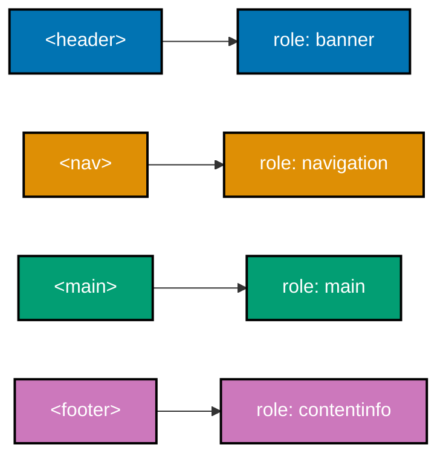
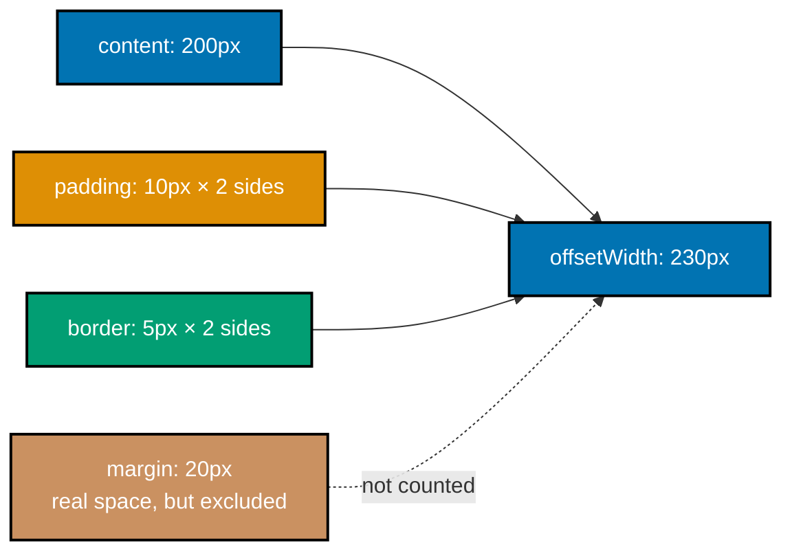
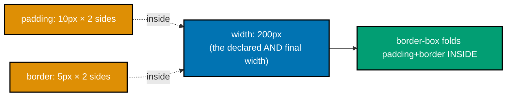
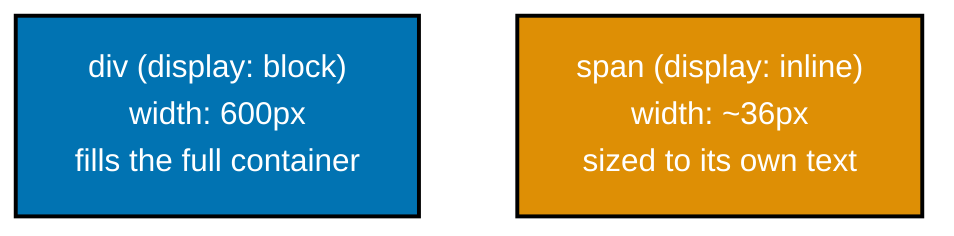
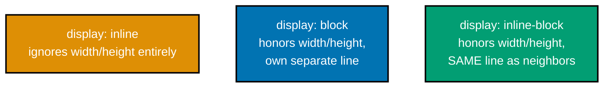
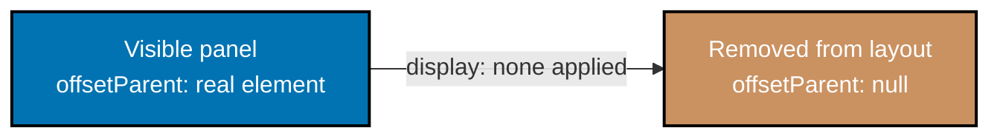
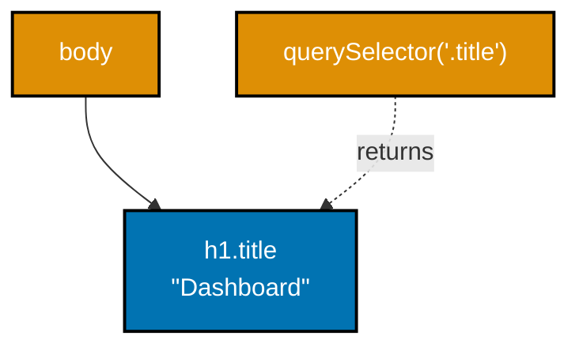
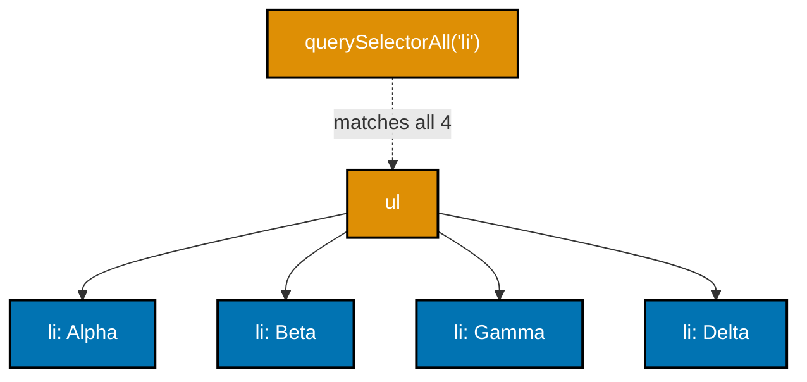
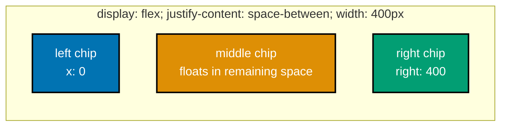
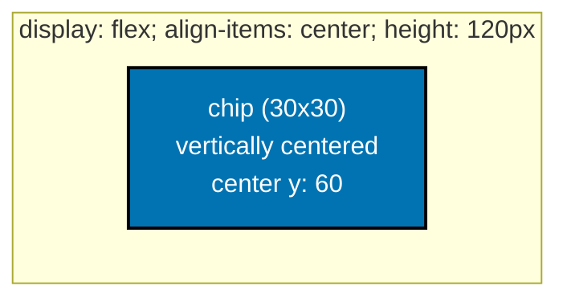

Examples 1-28 build the platform up from a bare document to CSS layout basics and first DOM/event handling. Every `**Output**` block below is a genuine, captured transcript from actually running the example's `verify.mjs` (a small Playwright script) -- not a description of expected behavior.

---

### Example 1: Minimal HTML Document

_ex-01 &middot; exercises co-01_

A valid HTML5 document needs exactly three things: a `<!doctype html>` declaration, a `head` with `charset` and `viewport` metadata plus a `title`, and a `body`. This is the smallest complete instance of that shape.

**`learning/code/ex-01-minimal-html-document/index.html`**

```html
<!doctype html>
<!-- => HTML5 doctype: triggers standards mode, not legacy quirks mode -->
<html lang="en">
  <!-- => lang tells screen readers and translators which language to expect -->
  <head>
    <!-- => metadata section: nothing here paints a pixel -->
    <meta charset="utf-8" />
    <!-- => must be declared first so the byte stream decodes correctly -->
    <meta name="viewport" content="width=device-width, initial-scale=1" />
    <!-- => pins the layout viewport to the device's real width -->
    <title>Example 1: Minimal HTML Document</title>
    <!-- => this exact string is what verify.mjs asserts document.title equals -->
    <!-- => a wrong or missing title here would fail Example 1's own PASS check, not just look wrong -->
  </head>
  <!-- => end of metadata -->
  <body>
    <!-- => everything below this line is what the browser actually renders -->
    <p>This is the smallest complete, valid HTML5 document this topic uses.</p>
    <!-- => the only rendered node; verify.mjs confirms the body's visible text is non-empty -->
    <!-- => an empty body would still be "valid" HTML, but verify.mjs's non-empty-text check would fail -->
  </body>
  <!-- => end of rendered content -->
</html>
<!-- => closes the document root -->
```

**Run**: `node verify.mjs` (a small Playwright script colocated in `learning/code/ex-01-minimal-html-document/`)

**Output** (genuinely captured):

```text
document.title: Example 1: Minimal HTML Document
body renders text: true
PASS: document renders and tab title matches <title>
```

**Key takeaway**: `<!doctype html>` plus a metadata-bearing `head` and a `body` is a genuinely complete, valid document -- nothing else is required to render.

**Why it matters**: Every other example in this topic builds on this exact skeleton, so a mistake here would silently propagate everywhere else. Getting the `head` metadata right -- `charset` declared before any text, a real `viewport` tag, and a non-empty `title` -- is what every later example assumes is already in place and never re-checks. Omitting `charset` risks garbled text on non-ASCII content; omitting `viewport` renders a phone-sized desktop layout instead of a readable mobile one. A minimal document is not a toy example: it is the load-bearing foundation the rest of Frontend Essentials quietly depends on.

---

### Example 2: Semantic Page Landmarks

_ex-02 &middot; exercises co-02_

`header`, `nav`, `main`, and `footer` are not just visual containers -- each one maps automatically to an ARIA landmark role (`banner`, `navigation`, `main`, `contentinfo`) that assistive technology can jump between directly.



**`learning/code/ex-02-semantic-page-landmarks/index.html`**

```html
<!doctype html>
<!-- => HTML5 doctype -->
<html lang="en">
  <!-- => announces the page language to assistive tech -->
  <head>
    <!-- => metadata; not part of the accessibility tree's landmark roles -->
    <meta charset="utf-8" />
    <!-- => byte-to-character decoding -->
    <meta name="viewport" content="width=device-width, initial-scale=1" />
    <!-- => mobile-width layout viewport -->
    <title>Example 2: Semantic Page Landmarks</title>
    <!-- => tab title, unrelated to landmark roles -->
    <!-- => landmarks are what verify.mjs's DOM query actually counts, not head metadata -->
  </head>
  <!-- => end of metadata -->
  <body>
    <!-- => the four landmark elements below are what verify.mjs inspects -->
    <header>
      <!-- => maps automatically to the ARIA "banner" landmark role -->
      <p>Site header</p>
      <!-- => ordinary content; the role comes from the parent <header>, not this <p> -->
    </header>
    <!-- => closes the banner landmark -->
    <nav>
      <!-- => maps automatically to the ARIA "navigation" landmark role -->
      <ul>
        <!-- => a real list groups the nav links semantically -->
        <li><a href="#home">Home</a></li>
        <!-- => real href + visible text, not an icon-only link -->
        <li><a href="#about">About</a></li>
        <!-- => same pattern repeated for the second nav item -->
      </ul>
      <!-- => end of the nav list -->
    </nav>
    <!-- => closes the navigation landmark -->
    <!-- => two landmarks confirmed so far: banner and navigation -->
    <main>
      <!-- => maps automatically to the ARIA "main" landmark role -->
      <h1>Semantic Landmarks</h1>
      <!-- => the page's single h1, inside main, not header -->
      <p>The main content lives here.</p>
      <!-- => ordinary paragraph content -->
    </main>
    <!-- => closes the main landmark; a page has at most one -->
    <!-- => three landmarks confirmed; footer's contentinfo role is the fourth and last -->
    <footer>
      <!-- => maps automatically to the ARIA "contentinfo" landmark role -->
      <p>Site footer</p>
      <!-- => ordinary content; the role comes from the parent <footer> -->
    </footer>
    <!-- => closes the contentinfo landmark -->
  </body>
  <!-- => end of rendered content -->
</html>
<!-- => closes the document root -->
```

**Run**: `node verify.mjs` (a small Playwright script colocated in `learning/code/ex-02-semantic-page-landmarks/`)

**Output** (genuinely captured):

```text
landmark counts: {"banner":1,"navigation":1,"main":1,"contentinfo":1}
PASS: header/nav/main/footer expose banner/navigation/main/contentinfo roles
```

**Key takeaway**: Four semantic elements produced four distinct, automatically-assigned landmark roles -- no `role` attribute was written by hand.

**Why it matters**: A screen reader user can jump straight to `main` and skip repeated navigation on every page load, but only if the markup actually uses these semantic elements instead of generic `div`s. This is a common real-world gap: a page that looks identical to a semantic one after a CSS reset can still be completely unnavigable by landmark, because a styled `div` never exposes a role at all. The four roles here (`banner`, `navigation`, `main`, `contentinfo`) are also what later accessibility examples in this topic build their own role-based assertions on top of.

---

### Example 3: Headings and Paragraphs

_ex-03 &middot; exercises co-03_

A page's headings form an outline, the same way a document's table of contents does: exactly one `h1` names the page, and every deeper heading nests without skipping a level.

**`learning/code/ex-03-headings-and-paragraphs/index.html`**

```html
<!doctype html>
<!-- => HTML5 doctype -->
<html lang="en">
  <!-- => document language -->
  <head>
    <!-- => metadata; the heading outline below lives entirely in the body -->
    <meta charset="utf-8" />
    <!-- => byte-to-character decoding -->
    <meta name="viewport" content="width=device-width, initial-scale=1" />
    <!-- => mobile-width layout viewport -->
    <title>Example 3: Headings and Paragraphs</title>
    <!-- => tab title, separate from the h1 below -->
  </head>
  <!-- => end of metadata -->
  <body>
    <!-- => verify.mjs reads every heading's level, in document order, from here down -->
    <h1>Frontend Essentials</h1>
    <!-- => the page's single h1: names the whole page -->
    <!-- => level 1 opens the outline; verify.mjs's captured level array starts with 1 -->
    <p>An introduction paragraph under the single top-level heading.</p>
    <!-- => ordinary body text, not part of the outline -->
    <h2>The Platform</h2>
    <!-- => first h2: one level deeper than h1, no level skipped -->
    <p>HTML, CSS, and the DOM.</p>
    <!-- => content under the first h2 section -->
    <h3>HTML</h3>
    <!-- => h3 nests under the current h2, again with no skipped level -->
    <!-- => level 3 here directly follows level 2 above it -- no gap in the outline -->
    <p>Structure and semantics.</p>
    <!-- => content under the h3 subsection -->
    <h2>The Component Model</h2>
    <!-- => a second h2, stepping back OUT of the h3, still no level skipped -->
    <!-- => stepping from h3 back to h2 is valid; only skipping FORWARD (e.g. h2 straight to h4) breaks the outline -->
    <p>State drives the render.</p>
    <!-- => content under the second h2 section -->
  </body>
  <!-- => end of rendered content -->
</html>
<!-- => closes the document root -->
```

**Run**: `node verify.mjs` (a small Playwright script colocated in `learning/code/ex-03-headings-and-paragraphs/`)

**Output** (genuinely captured):

```text
heading levels in document order: [1,2,3,2]
PASS: exactly one h1 and no skipped heading level in the outline
```

**Key takeaway**: One `h1` plus `h2`/`h3` in non-skipping order forms a valid, navigable outline.

**Why it matters**: Screen reader users frequently navigate by heading level alone ("jump to the next h2") -- a skipped level or a second `h1` breaks that navigation model even though the page still looks fine visually. A common real mistake is choosing a heading level for its default font size rather than its position in the outline -- picking `h4` because it "looks right" while skipping past `h2` and `h3` entirely. The `[1,2,3,2]` sequence here shows the outline can step back UP a level (h3 to h2) freely; only skipping DOWN past a level is the actual violation this example checks for.

---

### Example 4: Lists and Links

_ex-04 &middot; exercises co-03_

A list of links is marked up as a real `ul`/`li` structure, with every `a` carrying both a real `href` and visible, descriptive link text -- not an empty icon or a bare "click here".

**`learning/code/ex-04-lists-and-links/index.html`**

```html
<!doctype html>
<!-- => HTML5 doctype -->
<html lang="en">
  <!-- => document language -->
  <head>
    <!-- => metadata -->
    <meta charset="utf-8" />
    <!-- => byte-to-character decoding -->
    <meta name="viewport" content="width=device-width, initial-scale=1" />
    <!-- => mobile-width layout viewport -->
    <title>Example 4: Lists and Links</title>
    <!-- => tab title -->
  </head>
  <!-- => end of metadata -->
  <body>
    <!-- => verify.mjs reads every anchor's href and text from the list below -->
    <h1>Reading List</h1>
    <!-- => page heading, not itself part of the anchor check -->
    <ul>
      <!-- => a real list, not three bare <a> tags side by side -->
      <li><a href="#mdn">MDN Web Docs</a></li>
      <!-- => real href plus visible, descriptive text -->
      <li><a href="#whatwg">HTML Living Standard</a></li>
      <!-- => descriptive text, not "click here" -->
      <!-- => a link with no visible text or a missing href would fail verify.mjs's anchor check -->
      <li><a href="#wcag">WCAG 2.2</a></li>
      <!-- => third anchor, same real-href-plus-real-text pattern -->
    </ul>
    <!-- => end of the reading list -->
  </body>
  <!-- => end of rendered content -->
</html>
<!-- => closes the document root -->
```

**Run**: `node verify.mjs` (a small Playwright script colocated in `learning/code/ex-04-lists-and-links/`)

**Output** (genuinely captured):

```text
anchors: [{"href":"#mdn","text":"MDN Web Docs"},{"href":"#whatwg","text":"HTML Living Standard"},{"href":"#wcag","text":"WCAG 2.2"}]
PASS: every list anchor has both an href and non-empty link text
```

**Key takeaway**: Every one of the three anchors had both a non-empty `href` and non-empty visible text.

**Why it matters**: A link with no visible text (icon-only, no label) or a missing `href` is unusable for a screen reader user tabbing through links out of context, and unusable for a mouse user with no hint what it does. This connects directly forward to Example 56's accessible-forms work: a link's accessible name has the exact same "must actually be present, not just visually implied" requirement an input's label does. Real product bugs regularly ship an icon button with no text at all, discoverable only by a sighted user hovering long enough to see a tooltip.

---

### Example 5: Image With Alt Text

_ex-05 &middot; exercises co-03_

Every meaningful `img` needs descriptive `alt` text -- and that text is exactly what surfaces when the image itself fails to load, proving `alt` is real fallback content, not decoration.

**`learning/code/ex-05-image-with-alt/index.html`**

```html
<!doctype html>
<!-- => HTML5 doctype -->
<html lang="en">
  <!-- => document language -->
  <head>
    <!-- => metadata -->
    <meta charset="utf-8" />
    <!-- => byte-to-character decoding -->
    <meta name="viewport" content="width=device-width, initial-scale=1" />
    <!-- => mobile-width layout viewport -->
    <title>Example 5: Image with Alt Text</title>
    <!-- => tab title -->
  </head>
  <!-- => end of metadata -->
  <body>
    <!-- => the deliberately-broken image below is the whole point of this example -->
    <h1>Team Photo</h1>
    <!-- => page heading -->
    <!-- => a real photo would make this example indistinguishable from any ordinary  -->
    <!-- => src below points at a file that genuinely does not exist; verify.mjs waits for the real load failure, not a timer -->
    <!-- => id is how verify.mjs's querySelector locates this exact element -->
    <!-- => width/height reserve layout space up front, so a slow or failed load never shifts the page -->
    
    <!-- => alt becomes the image's accessible name whether or not the pixels ever load -->
    <!-- => verify.mjs checks naturalWidth === 0 (proves the load genuinely failed) AND that alt is still exposed -->
    <!-- => the two checks together prove alt is real fallback content, not just a "nice to have" attribute -->
    <!-- => contrast this with decorative images, which use alt="" precisely so screen readers skip them -->
  </body>
  <!-- => end of rendered content -->
</html>
<!-- => closes the document root -->
```

**Run**: `node verify.mjs` (a small Playwright script colocated in `learning/code/ex-05-image-with-alt/`)

**Output** (genuinely captured):

```text
naturalWidth after load attempt: 0
alt attribute: Five engineers around a whiteboard sketching a system diagram
PASS: broken image still exposes its alt text as the accessible name
```

**Key takeaway**: Even with the image request genuinely failing (`naturalWidth === 0`), the `alt` text was still exposed as the image's accessible name.

**Why it matters**: `alt` isn't just a nicety for screen readers -- it is the browser's own fallback content the moment an image fails to load, visible to every user, sighted or not. A dead CDN link, a typo in a filename, or a slow network can all trigger this exact failure path in production, and a missing `alt` turns that failure into a blank, meaningless gap for every user. Purely decorative images use `alt=""` deliberately, so a screen reader skips them entirely instead of announcing a filename -- the empty string is a real, intentional choice, not an oversight.

---

### Example 6: Class Selector Style

_ex-06 &middot; exercises co-04_

A class selector (`.btn`) targets every element carrying that class, and the browser's own `getComputedStyle` is the ground truth for what style actually applied.

**`learning/code/ex-06-class-selector-style/index.html`**

```html
<!doctype html>
<!-- => HTML5 doctype -->
<html lang="en">
  <!-- => document language -->
  <head>
    <!-- => metadata plus this page's only stylesheet -->
    <meta charset="utf-8" />
    <!-- => byte-to-character decoding -->
    <meta name="viewport" content="width=device-width, initial-scale=1" />
    <!-- => mobile-width layout viewport -->
    <title>Example 6: Class Selector Style</title>
    <!-- => tab title -->
    <style>
      /* => a class selector matches every element sharing this class, unlike an id selector's single match */
      .btn {
        /* => targets every element carrying class="btn", however many there are */
        color: rgb(220, 20, 20); /* => verify.mjs reads this back via getComputedStyle, the browser's ground truth */
      } /* => end of the .btn rule */
    </style>
    <!-- => end of the page's only stylesheet -->
  </head>
  <!-- => end of metadata -->
  <body>
    <!-- => rendered content -->
    <button class="btn">Submit</button>
    <!-- => the one element the .btn selector matches -->
    <!-- => getComputedStyle(el).color reports what ACTUALLY applied, not what the source merely declared -->
    <!-- => a declared style that got overridden later would still show up here as the LOSING value, not this one -->
  </body>
  <!-- => end of rendered content -->
</html>
<!-- => closes the document root -->
```

**Run**: `node verify.mjs` (a small Playwright script colocated in `learning/code/ex-06-class-selector-style/`)

**Output** (genuinely captured):

```text
computed color: rgb(220, 20, 20)
PASS: .btn class selector's color rule is the element's computed color
```

**Key takeaway**: `getComputedStyle(el).color` reported exactly the class rule's declared color -- the CSS actually took effect, not just "should have".

**Why it matters**: `getComputedStyle` is how you verify a style claim is real rather than assumed -- the same technique this topic reuses through the specificity and cascade examples that follow. Relying on visual inspection alone to confirm a style applied is unreliable: a later, higher-specificity rule can silently override it while the difference is nearly invisible on screen. Every subsequent color-based example in this Beginner tier (Examples 7 through 11) leans on this exact same computed-style assertion technique to prove, not merely claim, which rule actually won.

---

### Example 7: Id and Descendant Selector

_ex-07 &middot; exercises co-04_

A descendant selector (`#nav a`) only matches an `a` that has `#nav` somewhere among its ancestors -- an identically-tagged link elsewhere on the page is untouched.

**`learning/code/ex-07-id-and-descendant-selector/index.html`**

```html
<!doctype html>
<!-- => HTML5 doctype -->
<html lang="en">
  <!-- => document language -->
  <head>
    <!-- => metadata plus this page's only stylesheet -->
    <meta charset="utf-8" />
    <!-- => byte-to-character decoding -->
    <meta name="viewport" content="width=device-width, initial-scale=1" />
    <!-- => mobile-width layout viewport -->
    <title>Example 7: Id and Descendant Selector</title>
    <!-- => tab title -->
    <style>
      /* => a descendant selector combinator (the space) means "anywhere inside," not "direct child only" */
      #nav a {
        /* => matches an <a> ONLY when it has #nav somewhere among its ancestors */
        color: rgb(0, 100, 200); /* => applies solely inside the scoped #nav subtree */
      } /* => end of the descendant rule */
    </style>
    <!-- => end of the page's only stylesheet -->
  </head>
  <!-- => end of metadata -->
  <body>
    <!-- => two links live inside #nav, one lives outside it -->
    <nav id="nav">
      <!-- => the ancestor the descendant selector requires -->
      <a href="#home">Home</a>
      <!-- => inside #nav: matched by "#nav a" -->
      <a href="#about">About</a>
      <!-- => also inside #nav: matched -->
    </nav>
    <!-- => closes the scoped subtree -->
    <!-- => the link below is outside #nav entirely, so "#nav a" cannot reach it -->
    <!-- => a broader rule like "a { color: ... }" would have repainted this link too; the scoping here avoids that -->
    <p>Outside link: <a href="#other">Other</a></p>
    <!-- => untouched: default link color, not rgb(0, 100, 200) -->
  </body>
  <!-- => end of rendered content -->
</html>
<!-- => closes the document root -->
```

**Run**: `node verify.mjs` (a small Playwright script colocated in `learning/code/ex-07-id-and-descendant-selector/`)

**Output** (genuinely captured):

```text
nav link colors: ["rgb(0, 100, 200)","rgb(0, 100, 200)"]
outside link color: rgb(0, 0, 238)
PASS: #nav a styled only links inside #nav
```

**Key takeaway**: Links inside `#nav` were styled; an otherwise-identical link outside `#nav` was not.

**Why it matters**: Scoping a rule to a descendant selector is how one page avoids a global `a { color: ... }` rule silently repainting every link on the page, including ones the author never intended to touch. This is one of the most common real CSS bugs: a rule written to fix one component's links quietly recolors an unrelated link in the footer, because the selector was broader than the author realized. Descendant scoping like `#nav a` is a deliberate, minimal fix to exactly that class of accidental-blast-radius problem.

---

### Example 8: Attribute and Pseudo Selector

_ex-08 &middot; exercises co-04_

An attribute selector (`input[type=email]`) targets elements by attribute value, and combining it with a pseudo-class (`:focus`) narrows further to only the current interaction state.

**`learning/code/ex-08-attribute-and-pseudo-selector/index.html`**

```html
<!doctype html>
<!-- => HTML5 doctype -->
<html lang="en">
  <!-- => document language -->
  <head>
    <!-- => metadata plus this page's only stylesheet -->
    <meta charset="utf-8" />
    <!-- => byte-to-character decoding -->
    <meta name="viewport" content="width=device-width, initial-scale=1" />
    <!-- => mobile-width layout viewport -->
    <title>Example 8: Attribute and Pseudo Selector</title>
    <!-- => tab title -->
    <style>
      /* => an attribute selector reads the LIVE attribute value, not just a static match at parse time */
      input[type="email"]:focus {
        /* => two conditions AND-ed together: this attribute value, AND this state */
        border-color: rgb(0, 150, 80); /* => applies only while the email input genuinely has focus */
        border-width: 3px; /* => a thicker border makes the focus state visibly obvious */
        border-style: solid; /* => without an explicit style, border-color/width alone render nothing */
      } /* => end of the attribute+pseudo-class rule */
      input[type="text"] {
        /* => a separate, unconditional rule -- no :focus requirement here */
        border: 1px solid rgb(120, 120, 120); /* => always applied, focused or not */
      } /* => end of the plain attribute rule */
    </style>
    <!-- => end of the page's only stylesheet -->
  </head>
  <!-- => end of metadata -->
  <body>
    <!-- => two inputs: one email, one text, only one ever matches the :focus rule -->
    <input id="email" type="email" />
    <!-- => matches input[type="email"]:focus, but only while focused -->
    <!-- => before focus this input still has SOME border, from the browser's own default input styling -->
    <input id="name" type="text" />
    <!-- => matches input[type="text"] unconditionally; never matches the email rule -->
    <!-- => focusing the text input never triggers the email rule; the two selectors never overlap -->
  </body>
  <!-- => end of rendered content -->
</html>
<!-- => closes the document root -->
```

**Run**: `node verify.mjs` (a small Playwright script colocated in `learning/code/ex-08-attribute-and-pseudo-selector/`)

**Output** (genuinely captured):

```text
email border before focus: rgb(118, 118, 118)
email border while focused: rgb(0, 150, 80)
name (never focused) border: rgb(120, 120, 120)
PASS: input[type=email]:focus styles only the focused email input
```

**Key takeaway**: The email input's border changed only while it was genuinely focused; an unrelated text input never matched.

**Why it matters**: Attribute and pseudo-class selectors compose -- `input[type=email]:focus` is two independent conditions the browser evaluates together, not one special-cased selector. This composability is what lets one rule express "only this kind of field, only in this interaction state" without any JavaScript at all, and it generalizes far beyond `:focus`: `:hover`, `:checked`, and `:disabled` all combine with attribute selectors the same way. Recognizing selectors as composable conditions, rather than memorizing a fixed list of magic strings, is what makes reading unfamiliar CSS tractable later in this topic.

---

### Example 9: Specificity Conflict

_ex-09 &middot; exercises co-05_

When a class rule and an id rule both target the same element with conflicting declarations, the id rule wins -- an id selector's specificity (1-0-0) always outranks a class selector's (0-1-0), regardless of source order.

**`learning/code/ex-09-specificity-conflict/index.html`**

```html
<!doctype html>
<!-- => HTML5 doctype -->
<html lang="en">
  <!-- => document language -->
  <head>
    <!-- => metadata plus this page's only stylesheet -->
    <meta charset="utf-8" />
    <!-- => byte-to-character decoding -->
    <meta name="viewport" content="width=device-width, initial-scale=1" />
    <!-- => mobile-width layout viewport -->
    <title>Example 9: Specificity Conflict</title>
    <!-- => tab title -->
    <style>
      /* => specificity is compared as three counted tiers: (id count, class/attr/pseudo-class count, tag count) */
      .label {
        /* => a class selector: specificity 0-1-0 */
        color: rgb(0, 0, 255); /* => blue -- but specificity, not source order, decides the winner below */
      } /* => end of the class rule */
      #price {
        /* => an id selector: specificity 1-0-0, which always outranks a class selector */
        color: rgb(255, 0, 0); /* => red -- this wins regardless of where either rule appears in the file */
      } /* => end of the id rule */
    </style>
    <!-- => end of the page's only stylesheet -->
  </head>
  <!-- => end of metadata -->
  <body>
    <!-- => one element carries BOTH the class and the id, so both rules genuinely target it -->
    <span id="price" class="label">$42</span>
    <!-- => id wins: computed color is red, not blue -->
    <!-- => moving .label's rule to the very end of the stylesheet still would not change this outcome -->
  </body>
  <!-- => end of rendered content -->
</html>
<!-- => closes the document root -->
```

**Run**: `node verify.mjs` (a small Playwright script colocated in `learning/code/ex-09-specificity-conflict/`)

**Output** (genuinely captured):

```text
computed color: rgb(255, 0, 0)
PASS: #price (specificity 1-0-0) beat .label (specificity 0-1-0)
```

**Key takeaway**: The id rule's red overrode the class rule's blue, even though the class rule could have appeared later in the stylesheet.

**Why it matters**: Specificity is evaluated BEFORE source order -- a later class rule can never override an earlier id rule on the same property, no matter how the stylesheet is reordered. This is a frequent source of real "why won't my CSS override this" confusion: an author adds a new class rule, watches it fail to apply, and assumes the CSS is broken, when the actual cause is an existing higher-specificity id rule elsewhere. Example 10 immediately isolates the OTHER half of this system -- what happens when specificity is genuinely tied.

---

### Example 10: Cascade Source Order

_ex-10 &middot; exercises co-05_

When two rules have identical specificity, the LAST one declared in source order wins -- this is the "cascade" half of the cascade-and-specificity algorithm.

**`learning/code/ex-10-cascade-source-order/index.html`**

```html
<!doctype html>
<!-- => HTML5 doctype -->
<html lang="en">
  <!-- => document language -->
  <head>
    <!-- => metadata plus this page's only stylesheet -->
    <meta charset="utf-8" />
    <!-- => byte-to-character decoding -->
    <meta name="viewport" content="width=device-width, initial-scale=1" />
    <!-- => mobile-width layout viewport -->
    <title>Example 10: Cascade Source Order</title>
    <!-- => tab title -->
    <style>
      /* => the cascade's tie-breaker only activates once specificity is genuinely equal, as it is here */
      .badge {
        /* => first declaration: specificity 0-1-0, identical to the rule below */
        color: rgb(0, 128, 0); /* => green -- but this loses, because it appears EARLIER in the file */
      } /* => end of the first .badge rule */
      .badge {
        /* => second declaration: SAME selector, SAME specificity as the rule above */
        color: rgb(128, 0, 128); /* => purple -- this wins purely because it comes LAST in source order */
      } /* => end of the second .badge rule */
    </style>
    <!-- => end of the page's only stylesheet -->
  </head>
  <!-- => end of metadata -->
  <body>
    <!-- => one element, two equal-specificity rules targeting it -->
    <span class="badge">New</span>
    <!-- => computed color is purple: the later rule, not the earlier one -->
    <!-- => merging the two identical selectors into one rule would avoid this trap entirely -->
  </body>
  <!-- => end of rendered content -->
</html>
<!-- => closes the document root -->
```

**Run**: `node verify.mjs` (a small Playwright script colocated in `learning/code/ex-10-cascade-source-order/`)

**Output** (genuinely captured):

```text
computed color: rgb(128, 0, 128)
PASS: the second .badge rule (later in source order) applied
```

**Key takeaway**: Two equal-specificity `.badge` rules resolved to the second (later) one's color.

**Why it matters**: This is exactly why accidentally duplicating a selector later in a stylesheet silently overrides an earlier, seemingly-untouched rule -- a common, confusing real bug this example makes concrete. It typically appears after a merge or a copy-paste: two files, each individually correct, get concatenated, and the second file's rule silently wins over the first with no error, warning, or visual hint about which one applied. Understanding source order as the LAST tie-breaker (after specificity, not before it) is what makes this class of bug diagnosable instead of mysterious.

---

### Example 11: Custom Property Reuse

_ex-11 &middot; exercises co-06_

A custom property declared once on `:root` (`--brand`) is available to `var()` anywhere in the document -- change the one declaration and every rule referencing it recomputes.

**`learning/code/ex-11-custom-property-reuse/index.html`**

```html
<!doctype html>
<!-- => HTML5 doctype -->
<html lang="en">
  <!-- => document language -->
  <head>
    <!-- => metadata plus this page's only stylesheet -->
    <meta charset="utf-8" />
    <!-- => byte-to-character decoding -->
    <meta name="viewport" content="width=device-width, initial-scale=1" />
    <!-- => mobile-width layout viewport -->
    <title>Example 11: Custom Property Reuse</title>
    <!-- => tab title -->
    <style>
      /* => a custom property is declared once and read anywhere via var(); it is not a Sass-style compile-time constant */
      :root {
        /* => the document root; scoping the declaration here makes it visible everywhere */
        --brand: rgb(10, 100, 200); /* => the single source of truth every var(--brand) call below resolves to */
      } /* => end of the :root declaration */
      .heading {
        /* => an ordinary class rule */
        color: var(--brand); /* => resolves to whatever --brand currently holds, looked up at paint time */
      } /* => end of the .heading rule */
      .link {
        /* => a second, unrelated class rule */
        color: var(--brand); /* => resolves to the SAME value as .heading, without repeating the color literal */
      } /* => end of the .link rule */
    </style>
    <!-- => end of the page's only stylesheet -->
  </head>
  <!-- => end of metadata -->
  <body>
    <!-- => two independent elements, both reading the one custom property -->
    <h1 class="heading">Title</h1>
    <!-- => reads var(--brand) via .heading -->
    <a class="link" href="#x">Read more</a>
    <!-- => reads the identical var(--brand) via .link -->
    <!-- => changing only the :root declaration above would recolor both elements at once, with no other edit -->
    <!-- => a plain Sass variable would need a full rebuild to take effect; var() resolves live in the browser -->
  </body>
  <!-- => end of rendered content -->
</html>
<!-- => closes the document root -->
```

**Run**: `node verify.mjs` (a small Playwright script colocated in `learning/code/ex-11-custom-property-reuse/`)

**Output** (genuinely captured):

```text
heading color: rgb(10, 100, 200)
link color: rgb(10, 100, 200)
PASS: both rules resolved var(--brand) to the identical computed color
```

**Key takeaway**: Two independent rules, `var(--brand)` each, resolved to the identical computed color.

**Why it matters**: This single-source-of-truth property is what makes site-wide theming a one-line change instead of a find-and-replace across every color declaration. Because custom properties resolve live in the browser rather than at a build step, they can also be reassigned per-scope (inside a single component's selector) or even from JavaScript, which is exactly what Example 35's scoped theming builds on top of this same mechanism. A find-and-replace approach risks missing an occurrence buried in a third-party stylesheet; a custom property never can, because every reader always looks the value up fresh.

---

### Example 12: Box Model: Padding, Border, Margin

_ex-12 &middot; exercises co-07_

By default (`box-sizing: content-box`), a declared `width` sizes only the content box -- padding and border are added ON TOP, and margin sits entirely outside the element's own measured size.



**`learning/code/ex-12-box-model-padding-border-margin/index.html`**

```html
<!doctype html>
<!-- => HTML5 doctype -->
<html lang="en">
  <!-- => document language -->
  <head>
    <!-- => metadata plus this page's only stylesheet -->
    <meta charset="utf-8" />
    <!-- => byte-to-character decoding -->
    <meta name="viewport" content="width=device-width, initial-scale=1" />
    <!-- => mobile-width layout viewport -->
    <title>Example 12: Box Model</title>
    <!-- => tab title -->
    <style>
      /* => box-sizing defaults to content-box in every browser unless a reset overrides it */
      #box {
        /* => the default box-sizing is content-box, so width below sizes ONLY the content area */
        width: 200px; /* => the content box's own width; padding and border are added on top of this */
        padding: 10px; /* => 10px on every side, ADDED to the content width for the final rendered size */
        border: 5px solid black; /* => 5px on every side, ALSO added on top of content + padding */
        margin: 20px; /* => space outside the border; excluded entirely from offsetWidth */
      } /* => end of the #box rule */
    </style>
    <!-- => end of the page's only stylesheet -->
  </head>
  <!-- => end of metadata -->
  <body>
    <!-- => one box; verify.mjs measures its real rendered offsetWidth -->
    <div id="box">content</div>
    <!-- => 200 (width) + 2*10 (padding) + 2*5 (border) = 230px offsetWidth -->
    <!-- => the 40px of margin around this box is real space, but offsetWidth never counts it -->
    <!-- => Example 13 keeps this exact padding/border but changes box-sizing to compare the outcome directly -->
  </body>
  <!-- => end of rendered content -->
</html>
<!-- => closes the document root -->
```

**Run**: `node verify.mjs` (a small Playwright script colocated in `learning/code/ex-12-box-model-padding-border-margin/`)

**Output** (genuinely captured):

```text
offsetWidth: 230
PASS: offsetWidth (230) = content (200) + padding (20) + border (10); margin excluded
```

**Key takeaway**: `offsetWidth` (230px) equaled content (200px) + padding (20px) + border (10px) exactly -- margin was not part of that measurement at all.

**Why it matters**: Assuming a declared `width: 200px` means the element renders at 200px is a very common box-model bug -- content-box quietly adds padding and border on top of it. This surprises developers constantly when a fixed-width sidebar or card grid seems to overflow its container by a few dozen pixels for no visible reason; the culprit is almost always padding or border added under content-box sizing. Example 13 shows the direct fix -- `box-sizing: border-box` -- applied to this exact same markup, so the two examples are meant to be read as a matched before/after pair.

---

### Example 13: box-sizing: border-box

_ex-13 &middot; exercises co-07_

`box-sizing: border-box` redefines what `width` measures: padding and border are now folded INSIDE the declared width, so the rendered size matches the declared size exactly.



**`learning/code/ex-13-box-sizing-border-box/index.html`**

```html
<!doctype html>
<!-- => HTML5 doctype -->
<html lang="en">
  <!-- => document language -->
  <head>
    <!-- => metadata plus this page's only stylesheet -->
    <meta charset="utf-8" />
    <!-- => byte-to-character decoding -->
    <meta name="viewport" content="width=device-width, initial-scale=1" />
    <!-- => mobile-width layout viewport -->
    <title>Example 13: box-sizing border-box</title>
    <!-- => tab title -->
    <style>
      /* => border-box is why so many CSS resets set box-sizing: border-box globally on every element */
      #box {
        /* => same padding and border as Example 12 -- only box-sizing differs */
        box-sizing: border-box; /* => redefines what "width" measures: padding and border now fold INSIDE it */
        width: 200px; /* => the FINAL rendered width, not just the content area's width */
        padding: 10px; /* => now consumes space taken FROM the 200px, rather than adding to it */
        border: 5px solid black; /* => also consumes space from the same 200px budget */
      } /* => end of the #box rule */
    </style>
    <!-- => end of the page's only stylesheet -->
  </head>
  <!-- => end of metadata -->
  <body>
    <!-- => the identical padding/border as Example 12, but box-sizing changes the outcome -->
    <div id="box">content</div>
    <!-- => offsetWidth stays at exactly 200, the declared width -->
    <!-- => compare directly to Example 12's 230px result for the same padding and border values -->
    <!-- => "declared width equals rendered width" is what most authors intuitively expect from width -->
  </body>
  <!-- => end of rendered content -->
</html>
<!-- => closes the document root -->
```

**Run**: `node verify.mjs` (a small Playwright script colocated in `learning/code/ex-13-box-sizing-border-box/`)

**Output** (genuinely captured):

```text
offsetWidth: 200
PASS: border-box keeps the rendered width at the declared 200px
```

**Key takeaway**: With `border-box`, `offsetWidth` stayed at exactly the declared 200px, even with padding and border both present.

**Why it matters**: This is why so many CSS resets set `box-sizing: border-box` globally -- it makes declared widths behave the way most authors intuitively expect. Without a global reset, a team must remember to add `box-sizing: border-box` to every single new component, and forgetting it on just one produces the exact overflow bug Example 12 demonstrates. Setting it once, globally, at the top of a stylesheet removes an entire category of layout bugs from ever needing to be diagnosed in the first place.

---

### Example 14: Block vs. Inline

_ex-14 &middot; exercises co-08_

A block-level element (`div`) fills its container's full available width by default; an inline element (`span`) sizes itself to only as much as its own content needs.



**`learning/code/ex-14-block-vs-inline/index.html`**

```html
<!doctype html>
<!-- => HTML5 doctype -->
<html lang="en">
  <!-- => document language -->
  <head>
    <!-- => metadata plus this page's only stylesheet -->
    <meta charset="utf-8" />
    <!-- => byte-to-character decoding -->
    <meta name="viewport" content="width=device-width, initial-scale=1" />
    <!-- => mobile-width layout viewport -->
    <title>Example 14: Block vs Inline</title>
    <!-- => tab title -->
    <style>
      body {
        /* => the container both boxes below measure themselves against */
        margin: 0; /* => removes the browser's default body margin so 600px below is exact */
        width: 600px; /* => a fixed reference width for comparing the block box against */
      } /* => end of the body rule */
      #blockBox {
        /* => targets the <div>, a block-level element by default */
        background: rgb(200, 200, 200); /* => visual only; not measured by verify.mjs */
      } /* => end of the #blockBox rule */
      #inlineSpan {
        /* => targets the <span>, an inline element by default */
        background: rgb(220, 220, 100); /* => visual only; not measured by verify.mjs */
      } /* => end of the #inlineSpan rule */
    </style>
    <!-- => end of the page's only stylesheet -->
  </head>
  <!-- => end of metadata -->
  <body>
    <!-- => neither element has an explicit display or width declared -->
    <div id="blockBox">block</div>
    <!-- => a block box fills 100% of its container's width by default -->
    <span id="inlineSpan">inline</span>
    <!-- => an inline box sizes itself to only its own content's width -->
    <!-- => verify.mjs measures both real widths and confirms they differ dramatically, with no CSS width set -->
    <!-- => swapping the tag names alone (div for span) would swap this behavior too, with zero other changes -->
  </body>
  <!-- => end of rendered content -->
</html>
<!-- => closes the document root -->
```

**Run**: `node verify.mjs` (a small Playwright script colocated in `learning/code/ex-14-block-vs-inline/`)

**Output** (genuinely captured):

```text
body width: 600 block div width: 600 inline span width: 36.4375
PASS: block div fills the container width; inline span wraps only its own content
```

**Key takeaway**: The block `div`'s width matched the body's full width; the inline `span`'s width was far smaller, sized to its own text.

**Why it matters**: This default behavior is exactly why swapping a `div` for a `span` (or vice versa) without changing `display` explicitly produces such a visually different layout. A component library that mixes block and inline elements inconsistently is a frequent source of "why is this button not lining up" confusion, because the two display types participate in layout in fundamentally different ways. Examples 15 and 16 build directly on this same `display` property, covering the hybrid `inline-block` value and the layout-removing `none` value respectively.

---

### Example 15: inline-block Sizing

_ex-15 &middot; exercises co-08_

`display: inline-block` is a hybrid: the element sits on the same line as its neighbors (like inline), yet still honors an explicit `width`/`height` (like block).



**`learning/code/ex-15-inline-block-sizing/index.html`**

```html
<!doctype html>
<!-- => HTML5 doctype -->
<html lang="en">
  <!-- => document language -->
  <head>
    <!-- => metadata plus this page's only stylesheet -->
    <meta charset="utf-8" />
    <!-- => byte-to-character decoding -->
    <meta name="viewport" content="width=device-width, initial-scale=1" />
    <!-- => mobile-width layout viewport -->
    <title>Example 15: inline-block Sizing</title>
    <!-- => tab title -->
    <style>
      body {
        /* => the container the two chips below sit inside */
        margin: 0; /* => removes the default body margin so positions measure cleanly */
      } /* => end of the body rule */
      .chip {
        /* => a hybrid display value shared by both chips below */
        display: inline-block; /* => sits on a line like inline, but still honors width/height like block */
        width: 80px; /* => a real width; a pure inline element would ignore this entirely */
        height: 30px; /* => a real height; also ignored by pure inline elements */
        background: rgb(180, 200, 240); /* => visual only; not measured by verify.mjs */
      } /* => end of the .chip rule */
    </style>
    <!-- => end of the page's only stylesheet -->
  </head>
  <!-- => end of metadata -->
  <body>
    <!-- => two chips, placed with no whitespace between them so they sit flush -->
    <span class="chip" id="chip1"></span><span class="chip" id="chip2"></span>
    <!-- => both share a line AND honor their declared 80x30 size -->
    <!-- => verify.mjs confirms both chips report the same vertical position (same line) and the declared size -->
    <!-- => a pure display: inline element would silently ignore the width/height declarations entirely -->
  </body>
  <!-- => end of rendered content -->
</html>
<!-- => closes the document root -->
```

**Run**: `node verify.mjs` (a small Playwright script colocated in `learning/code/ex-15-inline-block-sizing/`)

**Output** (genuinely captured):

```text
chip1 size: 80 30 chip1.y: 0 chip2.y: 0
PASS: inline-block chips share a line and honor their declared 80x30 size
```

**Key takeaway**: Two `inline-block` chips shared the same vertical position (same line) while both still measured exactly their declared 80x30 size.

**Why it matters**: `inline-block` is the classic choice for a row of equally-sized buttons or badges that need to sit side by side yet still take an explicit size -- pure `inline` elements cannot be sized that way at all. Before flexbox was widely supported, `inline-block` was the standard technique for building any horizontally-arranged, explicitly-sized row of items, and it still shows up regularly in real codebases and legacy components today. Understanding it as a genuine hybrid, not a workaround, makes reading that older code far less confusing.

---

### Example 16: display: none Removes Layout

_ex-16 &middot; exercises co-08_

`display: none` doesn't just hide an element visually -- it removes it from layout entirely, which is exactly what a `null` `offsetParent` proves.



**`learning/code/ex-16-display-none-removes-layout/index.html`**

```html
<!doctype html>
<!-- => HTML5 doctype -->
<html lang="en">
  <!-- => document language -->
  <head>
    <!-- => metadata plus this page's only stylesheet -->
    <meta charset="utf-8" />
    <!-- => byte-to-character decoding -->
    <meta name="viewport" content="width=device-width, initial-scale=1" />
    <!-- => mobile-width layout viewport -->
    <title>Example 16: display none Removes Layout</title>
    <!-- => tab title -->
    <style>
      .hidden {
        /* => a class this example's verify.mjs toggles onto #panel at runtime, not declared on it here */
        display: none; /* => removes the element from layout entirely -- not merely painted transparent */
      } /* => end of the .hidden rule */
    </style>
    <!-- => end of the page's only stylesheet -->
  </head>
  <!-- => end of metadata -->
  <body>
    <!-- => the panel starts visible; verify.mjs applies .hidden programmatically, then re-measures -->
    <div id="panel">Visible panel</div>
    <!-- => before hiding, has a real offsetParent (proof it's in layout) -->
    <button id="toggle">Hide</button>
    <!-- => present so a real interaction could trigger the toggle -->
    <!-- => offsetParent becomes null the instant display:none applies -- the layout-removal proof this example checks -->
    <!-- => visibility: hidden or opacity: 0 would hide the panel visually but leave offsetParent non-null -->
  </body>
  <!-- => end of rendered content -->
</html>
<!-- => closes the document root -->
```

**Run**: `node verify.mjs` (a small Playwright script colocated in `learning/code/ex-16-display-none-removes-layout/`)

**Output** (genuinely captured):

```text
offsetParent set before hiding: true offsetParent after display:none: null
PASS: display:none removed the element from layout (offsetParent === null)
```

**Key takeaway**: Before hiding, the panel had a real `offsetParent`; the instant `display: none` applied, `offsetParent` became `null`.

**Why it matters**: This is the key difference from `visibility: hidden` or `opacity: 0`, which hide an element visually but leave it fully in layout, still occupying its space -- `display: none` genuinely removes it. Choosing the wrong one causes two different bugs: a `display: none` element used for a fade transition never animates (there's no state to transition through), while a `visibility: hidden` modal leaves an invisible gap other content cannot occupy. Example 22's `remove()` goes one step further, deleting the node from the DOM entirely rather than merely un-laying it out.

---

### Example 17: Select a Single Node

_ex-17 &middot; exercises co-12_

`document.querySelector(selector)` returns the FIRST real, currently-rendered DOM element matching a CSS selector -- or `null` if nothing matches.



**`learning/code/ex-17-select-single-node/index.html`**

```html
<!doctype html>
<!-- => HTML5 doctype -->
<html lang="en">
  <!-- => document language -->
  <head>
    <!-- => metadata -->
    <meta charset="utf-8" />
    <!-- => byte-to-character decoding -->
    <meta name="viewport" content="width=device-width, initial-scale=1" />
    <!-- => mobile-width layout viewport -->
    <title>Example 17: Select a Single Node</title>
    <!-- => tab title -->
  </head>
  <!-- => end of metadata -->
  <body>
    <!-- => a single element; verify.mjs locates it with querySelector -->
    <h1 class="title">Dashboard</h1>
    <!-- => the one element querySelector('.title') matches -->
    <!-- => querySelector returns the FIRST match in document order, or null if nothing matches at all -->
    <!-- => the same ".title" syntax works identically here as it would inside a <style> block's selector -->
  </body>
  <!-- => end of rendered content -->
</html>
<!-- => closes the document root -->
```

**Run**: `node verify.mjs` (a small Playwright script colocated in `learning/code/ex-17-select-single-node/`)

**Output** (genuinely captured):

```text
querySelector('.title').textContent: Dashboard
PASS: querySelector('.title') returned the real, matching DOM element
```

**Key takeaway**: `querySelector('.title')` returned the genuine element, and its `textContent` matched the page's real rendered text.

**Why it matters**: `querySelector` accepts any valid CSS selector -- the exact same selector syntax used in stylesheets works here for locating elements in script. This means the class, id, attribute, and descendant selector patterns from Examples 6 through 10 all transfer directly into script code with zero new syntax to learn. A common beginner mistake is forgetting `querySelector` returns `null` (not an empty object) when nothing matches, and calling a method on that `null` result throws a runtime error rather than failing silently.

---

### Example 18: Select All Nodes

_ex-18 &middot; exercises co-12_

`document.querySelectorAll(selector)` returns every matching element as a `NodeList` -- a static snapshot taken at call time, not a live, auto-updating collection.



**`learning/code/ex-18-select-all-nodes/index.html`**

```html
<!doctype html>
<!-- => HTML5 doctype -->
<html lang="en">
  <!-- => document language -->
  <head>
    <!-- => metadata -->
    <meta charset="utf-8" />
    <!-- => byte-to-character decoding -->
    <meta name="viewport" content="width=device-width, initial-scale=1" />
    <!-- => mobile-width layout viewport -->
    <title>Example 18: Select All Nodes</title>
    <!-- => tab title -->
  </head>
  <!-- => end of metadata -->
  <body>
    <!-- => four list items; verify.mjs counts them via querySelectorAll -->
    <ul>
      <!-- => a real list; each child <li> is one node the selector below matches -->
      <li>Alpha</li>
      <!-- => first match -->
      <li>Beta</li>
      <!-- => second match -->
      <li>Gamma</li>
      <!-- => third match -->
      <li>Delta</li>
      <!-- => fourth match -->
    </ul>
    <!-- => end of the list; querySelectorAll('li').length reads exactly 4 here -->
    <!-- => the returned NodeList is a static snapshot -- a node added after this call would NOT retroactively appear -->
  </body>
  <!-- => end of rendered content -->
</html>
<!-- => closes the document root -->
```

**Run**: `node verify.mjs` (a small Playwright script colocated in `learning/code/ex-18-select-all-nodes/`)

**Output** (genuinely captured):

```text
querySelectorAll('li').length: 4
PASS: NodeList length (4) matches the real number of <li> elements in the DOM
```

**Key takeaway**: `querySelectorAll('li').length` matched the real, counted number of `<li>` elements in the DOM exactly.

**Why it matters**: Because the NodeList is static, adding a new `<li>` after calling `querySelectorAll` does NOT retroactively appear in that same list -- a fresh call is needed to see it. This trips up developers who expect `querySelectorAll`'s result to behave like `getElementsByTagName`'s genuinely LIVE collection, which does grow automatically as matching elements are added. Example 21's `createElement` + `append` pattern is exactly the kind of DOM mutation that would require a fresh `querySelectorAll` call afterward to be reflected in a new count.

---

### Example 19: Set textContent

_ex-19 &middot; exercises co-13_

Assigning `el.textContent = "..."` replaces an element's rendered text content directly and immediately -- no re-render step, no virtual DOM, just a direct mutation.

**`learning/code/ex-19-set-textcontent/index.html`**

```html
<!doctype html>
<!-- => HTML5 doctype -->
<html lang="en">
  <!-- => document language -->
  <head>
    <!-- => metadata -->
    <meta charset="utf-8" />
    <!-- => byte-to-character decoding -->
    <meta name="viewport" content="width=device-width, initial-scale=1" />
    <!-- => mobile-width layout viewport -->
    <title>Example 19: Set textContent</title>
    <!-- => tab title -->
  </head>
  <!-- => end of metadata -->
  <body>
    <!-- => the script below runs once, synchronously, right where the parser reaches it -->
    <p id="status">Loading&hellip;</p>
    <!-- => the placeholder text the script below immediately replaces -->
    <script>
      // => this line runs synchronously, before the browser ever paints the placeholder text to the screen
      document.getElementById("status").textContent = "Ready";
      // => textContent replaces ALL of #status's children with one plain-text node -- no HTML parsing happens
    </script>
    <!-- => end of the inline script -->
    <!-- => verify.mjs reads #status's rendered text and confirms it now says "Ready", not "Loading..." -->
  </body>
  <!-- => end of rendered content -->
</html>
<!-- => closes the document root -->
```

**Run**: `node verify.mjs` (a small Playwright script colocated in `learning/code/ex-19-set-textcontent/`)

**Output** (genuinely captured):

```text
#status rendered text: Ready
PASS: assigning textContent replaced the placeholder text on the rendered page
```

**Key takeaway**: Setting `textContent` replaced the placeholder text with the new text, visible in the rendered page.

**Why it matters**: `textContent` treats its argument as plain text, never HTML -- this is also the safe default against accidentally injecting markup from untrusted input. Using `innerHTML` instead of `textContent` for user-supplied strings is a genuine cross-site-scripting risk in production applications, because `innerHTML` parses its argument as markup and will execute any embedded `<script>`-adjacent content. Reaching for `textContent` by default, and only using `innerHTML` deliberately when real markup insertion is intended, is a habit worth forming from this very first DOM-mutation example onward.

---

### Example 20: Toggle classList

_ex-20 &middot; exercises co-13_

`el.classList.toggle('name')` adds the class if it's absent and removes it if it's present -- calling it twice in a row is a full add-then-remove round trip.

**`learning/code/ex-20-toggle-classlist/index.html`**

```html
<!doctype html>
<!-- => HTML5 doctype -->
<html lang="en">
  <!-- => document language -->
  <head>
    <!-- => metadata -->
    <meta charset="utf-8" />
    <!-- => byte-to-character decoding -->
    <meta name="viewport" content="width=device-width, initial-scale=1" />
    <!-- => mobile-width layout viewport -->
    <title>Example 20: Toggle classList</title>
    <!-- => tab title -->
  </head>
  <!-- => end of metadata -->
  <body>
    <!-- => no class is declared here at all; verify.mjs toggles "active" on and off programmatically -->
    <div id="panel">Panel</div>
    <!-- => starts with zero classes; classList.toggle adds "active" on the first call -->
    <!-- => a second toggle call on the same element removes "active" again -- a full add-then-remove round trip -->
    <!-- => toggle needs no prior contains()/add()/remove() branching -- it decides which action to take itself -->
  </body>
  <!-- => end of rendered content -->
</html>
<!-- => closes the document root -->
```

**Run**: `node verify.mjs` (a small Playwright script colocated in `learning/code/ex-20-toggle-classlist/`)

**Output** (genuinely captured):

```text
has 'active' after first toggle: true
has 'active' after second toggle: false
PASS: classList.toggle added the class, then removed it on the next call
```

**Key takeaway**: The first `toggle` call added `active`; the second call, on the same element, removed it again.

**Why it matters**: `classList.toggle` is the idiomatic way to implement any binary UI state (open/closed, active/inactive) driven purely by CSS classes, with no manual `contains`/`add`/`remove` branching needed. Hand-rolling that branching logic is a common source of subtle bugs, especially once a component has several independent toggleable states and the conditional logic starts to interact in unexpected ways. Recognizing `toggle` as the correct default -- reaching for `add`/`remove` only when the target state is already known in advance -- keeps this kind of state-driven styling simple as components grow more complex later in this topic.

---

### Example 21: Create and Append a Node

_ex-21 &middot; exercises co-13_

`document.createElement(tag)` builds a new, detached element; `parent.append(el)` inserts it into the live DOM -- two separate steps, create then attach.

**`learning/code/ex-21-create-and-append-node/index.html`**

```html
<!doctype html>
<!-- => HTML5 doctype -->
<html lang="en">
  <!-- => document language -->
  <head>
    <!-- => metadata -->
    <meta charset="utf-8" />
    <!-- => byte-to-character decoding -->
    <meta name="viewport" content="width=device-width, initial-scale=1" />
    <!-- => mobile-width layout viewport -->
    <title>Example 21: Create and Append a Node</title>
    <!-- => tab title -->
  </head>
  <!-- => end of metadata -->
  <body>
    <!-- => verify.mjs runs createElement + append here, then re-counts the list's children -->
    <ul id="list">
      <!-- => starts with exactly one child; the target append() attaches a second node to -->
      <li>First</li>
      <!-- => the only item present before verify.mjs's createElement + append call -->
    </ul>
    <!-- => end of the list, before the append -->
    <!-- => document.createElement builds a detached node in memory; nothing on the page changes yet -->
    <!-- => only the follow-up append() call actually attaches that node to a parent already in the document -->
  </body>
  <!-- => end of rendered content -->
</html>
<!-- => closes the document root -->
```

**Run**: `node verify.mjs` (a small Playwright script colocated in `learning/code/ex-21-create-and-append-node/`)

**Output** (genuinely captured):

```text
items before: 1 items after append: 2
PASS: createElement + append grew the list by exactly one item
```

**Key takeaway**: The list had one item before, two after a single `createElement` + `append` call -- growth by exactly one.

**Why it matters**: Nothing is visible on the page until the second step (`append`) actually attaches the new node to a parent that's already in the document -- a created-but-unattached element renders nothing at all. This two-step split matters in practice because it is exactly what lets code build up a whole subtree of new elements in memory, fully configuring text, classes, and attributes, before touching the live document even once -- avoiding the layout thrashing that repeated individual DOM insertions would otherwise cause. Example 48's list rendering relies on this identical create-then-attach split, run once per array item.

---

### Example 22: Remove a Node

_ex-22 &middot; exercises co-13_

`el.remove()` detaches an element from the DOM entirely -- afterward, no selector can find it anymore, because it's no longer part of the document tree at all.

**`learning/code/ex-22-remove-node/index.html`**

```html
<!doctype html>
<!-- => HTML5 doctype -->
<html lang="en">
  <!-- => document language -->
  <head>
    <!-- => metadata -->
    <meta charset="utf-8" />
    <!-- => byte-to-character decoding -->
    <meta name="viewport" content="width=device-width, initial-scale=1" />
    <!-- => mobile-width layout viewport -->
    <title>Example 22: Remove a Node</title>
    <!-- => tab title -->
  </head>
  <!-- => end of metadata -->
  <body>
    <!-- => verify.mjs confirms #notice exists, calls remove(), then confirms it no longer does -->
    <p id="notice">Dismiss me</p>
    <!-- => present in the DOM until verify.mjs's remove() call runs -->
    <!-- => el.remove() detaches the element from the DOM tree entirely -- not a visual hide -->
    <!-- => contrast this with Example 16's display: none, which keeps the element in the DOM, just out of layout -->
  </body>
  <!-- => end of rendered content -->
</html>
<!-- => closes the document root -->
```

**Run**: `node verify.mjs` (a small Playwright script colocated in `learning/code/ex-22-remove-node/`)

**Output** (genuinely captured):

```text
#notice found before remove(): true found after remove(): false
PASS: el.remove() took the element out of the DOM entirely
```

**Key takeaway**: `#notice` was found by `querySelector` before `remove()`, and genuinely not found afterward.

**Why it matters**: `remove()` is a complete removal, not a hide -- contrast this with `display: none` (Example 16), which keeps the element in the DOM, just out of layout. Choosing the wrong one has real consequences: removing a node that's expected to reappear later loses all of its internal state (scroll position, form input values, event listeners), while hiding-then-removing an element a screen reader is currently focused on can leave focus stranded on a detached node. A dismissible notice like the one shown here is exactly the case where genuine removal, not merely hiding, is the correct choice.

---

### Example 23: Click Handler Counter

_ex-23 &middot; exercises co-14_

`addEventListener('click', handler)` registers a function that runs on every real click -- state (the counter) lives outside the handler and persists across calls via closure.

**`learning/code/ex-23-click-handler-counter/index.html`**

```html
<!doctype html>
<!-- => HTML5 doctype -->
<html lang="en">
  <!-- => document language -->
  <head>
    <!-- => metadata -->
    <meta charset="utf-8" />
    <!-- => byte-to-character decoding -->
    <meta name="viewport" content="width=device-width, initial-scale=1" />
    <!-- => mobile-width layout viewport -->
    <title>Example 23: Click Handler Counter</title>
    <!-- => tab title -->
  </head>
  <!-- => end of metadata -->
  <body>
    <!-- => the count only ever changes in response to a genuine click event, nothing else -->
    <button id="incr">Count: <span id="count">0</span></button>
    <!-- => the span is what the handler below rewrites -->
    <script>
      let count = 0; // => the counter state; not reset between clicks, only when the page reloads
      // => count lives outside the handler function; the handler closes over it and mutates it on every call
      const countEl = document.getElementById("count"); // => cached once, up front, not re-queried per click
      // => caching avoids re-running a DOM query the handler would otherwise repeat on every single click
      document.getElementById("incr").addEventListener("click", () => {
        // => this arrow function is the handler; it runs once per genuine click, in full, top to bottom
        count += 1; // => mutates the closed-over count, not a fresh local variable each time
        // => the closure remembers count's value between separate, independent click events
        countEl.textContent = String(count); // => Number must become a String before textContent accepts it
        // => the visible number only updates because this line explicitly writes the new value into the DOM
      }); // => end of the click handler
    </script>
    <!-- => end of the inline script -->
    <!-- => verify.mjs dispatches three real clicks and confirms the displayed count reads 3, not just "some number" -->
  </body>
  <!-- => end of rendered content -->
</html>
<!-- => closes the document root -->
```

**Run**: `node verify.mjs` (a small Playwright script colocated in `learning/code/ex-23-click-handler-counter/`)

**Output** (genuinely captured):

```text
count after three real clicks: 3
PASS: three real clicks incremented the displayed count to 3
```

**Key takeaway**: Three real, separate clicks incremented the displayed count from 0 to 3, one per click.

**Why it matters**: The counter variable persists between clicks because the handler function closes over it -- this closure-based state pattern is the simplest possible precursor to component state (co-20). Every later stateful component in this topic, from the vanilla counter component (Example 45) through the capstone's task list, is built on this exact same idea at a larger scale: state lives outside the function that reads and writes it, and the function closes over a reference to it rather than receiving a fresh copy on every call.

---

### Example 24: Input Event Mirror

_ex-24 &middot; exercises co-14_

The `input` event fires on every keystroke (and paste, and IME commit) that changes a text field's value -- reading `event.target.value` inside the handler mirrors it live.

**`learning/code/ex-24-input-event-mirror/index.html`**

```html
<!doctype html>
<!-- => HTML5 doctype -->
<html lang="en">
  <!-- => document language -->
  <head>
    <!-- => metadata -->
    <meta charset="utf-8" />
    <!-- => byte-to-character decoding -->
    <meta name="viewport" content="width=device-width, initial-scale=1" />
    <!-- => mobile-width layout viewport -->
    <title>Example 24: Input Event Mirror</title>
    <!-- => tab title -->
  </head>
  <!-- => end of metadata -->
  <body>
    <!-- => the mirror span updates live, on every keystroke, not just once on submit -->
    <label for="name">Name</label>
    <!-- => associates this label with #name via the for/id pair -->
    <input id="name" type="text" />
    <!-- => the field the input listener below watches -->
    <p>You typed: <span id="mirror"></span></p>
    <!-- => starts empty; the handler writes into it live -->
    <script>
      const input = document.getElementById("name"); // => the field being watched
      const mirror = document.getElementById("mirror"); // => the element the handler writes into
      // => both elements looked up once, up front, and reused on every fired event below
      input.addEventListener("input", () => {
        // => this handler re-runs on every single keystroke while the field has focus
        mirror.textContent = input.value; // => reads the field's CURRENT value at the moment the event fired
        // => "input" fires on every keystroke, paste, and IME commit -- not just when the field loses focus
      }); // => end of the input handler
    </script>
    <!-- => end of the inline script -->
    <!-- => verify.mjs fills the field with real text and confirms the mirror reflects it live, not after a delay -->
  </body>
  <!-- => end of rendered content -->
</html>
<!-- => closes the document root -->
```

**Run**: `node verify.mjs` (a small Playwright script colocated in `learning/code/ex-24-input-event-mirror/`)

**Output** (genuinely captured):

```text
mirrored text: Ada Lovelace
PASS: the input event mirrored the typed text into the span live
```

**Key takeaway**: Filling the input with real text updated the mirrored `span` to match, live.

**Why it matters**: `input` fires on every value change, unlike `change`, which only fires once the field loses focus -- the distinction matters for anything that needs to react as-you-type. A live character counter, a search-as-you-type filter, or a real-time validation message all require `input`, not `change`; using `change` for any of these would leave the UI feeling unresponsive until the user clicks elsewhere. Example 50's controlled-input pattern builds directly on this exact `input`-event-into-state-update mechanism, just with a state object standing in for this example's plain `mirror` variable.

---

### Example 25: event.target

_ex-25 &middot; exercises co-14_

Every event handler receives an `Event` object; `event.target` identifies the EXACT element the event originated on -- essential when one handler might need to distinguish between several possible sources.

**`learning/code/ex-25-event-object-target/index.html`**

```html
<!doctype html>
<!-- => HTML5 doctype -->
<html lang="en">
  <!-- => document language -->
  <head>
    <!-- => metadata -->
    <meta charset="utf-8" />
    <!-- => byte-to-character decoding -->
    <meta name="viewport" content="width=device-width, initial-scale=1" />
    <!-- => mobile-width layout viewport -->
    <title>Example 25: event.target</title>
    <!-- => tab title -->
  </head>
  <!-- => end of metadata -->
  <body>
    <!-- => one listener on #row must distinguish which of its three buttons was actually clicked -->
    <div id="row">
      <!-- => the single element the click listener below is actually attached to -->
      <button id="a" data-id="a">A</button>
      <!-- => data-id is what event.target.dataset.id reads back -->
      <button id="b" data-id="b">B</button>
      <!-- => a second, independent possible click source -->
      <button id="c" data-id="c">C</button>
      <!-- => a third possible click source -->
    </div>
    <!-- => end of the button row -->
    <p id="report">none</p>
    <!-- => starts as "none"; the handler below overwrites it with the clicked id -->
    <script>
      document.getElementById("row").addEventListener("click", (event) => {
        // => one listener, attached once to #row, handles clicks from any of its three current buttons
        document.getElementById("report").textContent = event.target.dataset.id;
        // => event.target is the EXACT element the click originated on, never the listener's own #row element
      }); // => end of the delegated click handler
    </script>
    <!-- => end of the inline script -->
    <!-- => verify.mjs clicks button b specifically and confirms the report reads "b", not "a" or "c" -->
    <!-- => this exact target-inspection mechanism is what event delegation (Example 37) is built entirely on -->
  </body>
  <!-- => end of rendered content -->
</html>
<!-- => closes the document root -->
```

**Run**: `node verify.mjs` (a small Playwright script colocated in `learning/code/ex-25-event-object-target/`)

**Output** (genuinely captured):

```text
reported clicked id: b
PASS: event.target correctly identified button b as the clicked element
```

**Key takeaway**: Clicking button `b` specifically reported `event.target`'s id as `"b"`, not `"a"` or `"c"`.

**Why it matters**: This is the mechanism event delegation (Examples 25 and 37) relies on entirely -- one shared listener, with `event.target` doing the work of figuring out which specific element was actually clicked. A common mistake is confusing `event.target` (where the event originated) with `event.currentTarget` (the element the listener is actually attached to, `#row` here) -- they are frequently the same element, but diverge exactly in delegation scenarios like this one, where the listener and the clicked element are different nodes entirely.

---

### Example 26: Multiple Listeners, Registration Order

_ex-26 &middot; exercises co-14_

`addEventListener` is additive -- calling it twice on the same element and event type registers TWO independent listeners, both of which fire, in the order they were registered.

**`learning/code/ex-26-multiple-listeners-order/index.html`**

```html
<!doctype html>
<!-- => HTML5 doctype -->
<html lang="en">
  <!-- => document language -->
  <head>
    <!-- => metadata -->
    <meta charset="utf-8" />
    <!-- => byte-to-character decoding -->
    <meta name="viewport" content="width=device-width, initial-scale=1" />
    <!-- => mobile-width layout viewport -->
    <title>Example 26: Multiple Listeners, Registration Order</title>
    <!-- => tab title -->
  </head>
  <!-- => end of metadata -->
  <body>
    <!-- => one button, two independent listeners attached to the exact same event type -->
    <button id="btn">Go</button>
    <!-- => the click target both listeners below are attached to -->
    <ul id="log"></ul>
    <!-- => present but unused by this example; the real log lives on window.__log -->
    <script>
      const log = []; // => records the order listeners actually fired in, not merely that they fired
      window.__log = log; // => exposed on window so an outside script (verify.mjs) can read it back after the click
      // => a plain local variable would be invisible outside this script block once execution finished
      const btn = document.getElementById("btn"); // => the shared click target for both listeners below
      btn.addEventListener("click", () => log.push("first"));
      // => registers the FIRST independent listener for this element's click event
      btn.addEventListener("click", () => log.push("second"));
      // => addEventListener is additive: this SECOND call does not replace the first one at all
    </script>
    <!-- => end of the inline script -->
    <!-- => verify.mjs dispatches one click and confirms both listeners fired, in registration order -->
  </body>
  <!-- => end of rendered content -->
</html>
<!-- => closes the document root -->
```

**Run**: `node verify.mjs` (a small Playwright script colocated in `learning/code/ex-26-multiple-listeners-order/`)

**Output** (genuinely captured):

```text
listener firing order: ["first","second"]
PASS: both click listeners fired, in the order they were registered
```

**Key takeaway**: Both listeners fired on a single click, in exactly the order `addEventListener` was called: first, then second.

**Why it matters**: Unlike assigning `el.onclick = fn` (which overwrites any previous handler), `addEventListener` never silently replaces an existing listener -- multiple independent parts of an app can each attach their own. This matters enormously once a codebase grows: a third-party analytics script and an application's own click handler can both listen to the same button without either one needing to know the other exists, as long as both use `addEventListener` rather than the single-slot `onclick` property. The registration-order guarantee shown here is also what makes listener ordering predictable and debuggable rather than a coincidence.

---

### Example 27: Flex Row Distribution

_ex-27 &middot; exercises co-09_

`display: flex` with `justify-content: space-between` distributes children along the main axis so the first sits flush with the start edge and the last sits flush with the end edge.



**`learning/code/ex-27-flex-row-distribution/index.html`**

```html
<!doctype html>
<!-- => HTML5 doctype -->
<html lang="en">
  <!-- => document language -->
  <head>
    <!-- => metadata plus this page's only stylesheet -->
    <meta charset="utf-8" />
    <!-- => byte-to-character decoding -->
    <meta name="viewport" content="width=device-width, initial-scale=1" />
    <!-- => mobile-width layout viewport -->
    <title>Example 27: Flex Row Distribution</title>
    <!-- => tab title -->
    <style>
      /* => justify-content distributes children ALONG THE MAIN AXIS -- a row's main axis is horizontal */
      body {
        /* => the page-level container */
        margin: 0; /* => removes the default body margin so the 400px row below measures exactly */
      } /* => end of the body rule */
      .row {
        /* => the flex container */
        display: flex; /* => turns on flex layout for this element's direct children */
        justify-content: space-between; /* => pins the first child to the start, the last to the end */
        width: 400px; /* => a fixed reference width so the edge positions below are exact */
      } /* => end of the .row rule */
      .chip {
        /* => the three flex items distributed inside .row */
        width: 40px; /* => a fixed item width, unrelated to how justify-content distributes them */
        height: 20px; /* => a fixed item height */
        background: rgb(180, 200, 240); /* => visual only; not measured by verify.mjs */
      } /* => end of the .chip rule */
    </style>
    <!-- => end of the page's only stylesheet -->
  </head>
  <!-- => end of metadata -->
  <body>
    <!-- => three chips inside one flex row -->
    <div class="row">
      <!-- => the flex container all three chips are direct children of -->
      <div class="chip" id="left"></div>
      <!-- => the first child: pinned flush to the row's left edge -->
      <div class="chip" id="middle"></div>
      <!-- => the middle child: floats in the remaining space -->
      <div class="chip" id="right"></div>
      <!-- => the last child: pinned flush to the row's right edge -->
    </div>
    <!-- => end of the flex row -->
    <!-- => verify.mjs measures real bounding rectangles and confirms both edge chips align with the row's own edges -->
    <!-- => no manual margin math was needed here; space-between computed the middle gap on its own -->
  </body>
  <!-- => end of rendered content -->
</html>
<!-- => closes the document root -->
```

**Run**: `node verify.mjs` (a small Playwright script colocated in `learning/code/ex-27-flex-row-distribution/`)

**Output** (genuinely captured):

```text
row.x: 0 left.x: 0 right.right: 400 row.right: 400
PASS: space-between pinned the first and last chip to the row's edges
```

**Key takeaway**: The first chip's left edge matched the row's left edge; the last chip's right edge matched the row's right edge, measured via real bounding rectangles.

**Why it matters**: `space-between` is the classic pattern for a header bar (logo on the left, actions on the right) with no manual margin math required. Before flexbox, achieving this same layout typically meant floating one element left and another right, then carefully clearing the float afterward -- a technique that broke easily whenever content wrapped onto a second line. `justify-content: space-between` computes the gap automatically regardless of how many items are in the middle, which is exactly what Example 29's `flex-grow` builds on next.

---

### Example 28: Flex Align Center

_ex-28 &middot; exercises co-09_

`align-items: center` centers children along the CROSS axis (vertically, in a row) -- the complement to `justify-content`, which controls the main axis.



**`learning/code/ex-28-flex-align-center/index.html`**

```html
<!doctype html>
<!-- => HTML5 doctype -->
<html lang="en">
  <!-- => document language -->
  <head>
    <!-- => metadata plus this page's only stylesheet -->
    <meta charset="utf-8" />
    <!-- => byte-to-character decoding -->
    <meta name="viewport" content="width=device-width, initial-scale=1" />
    <!-- => mobile-width layout viewport -->
    <title>Example 28: Flex Align Center</title>
    <!-- => tab title -->
    <style>
      /* => align-items controls the CROSS axis -- in a row, that's vertical, the complement to justify-content */
      body {
        /* => the page-level container */
        margin: 0; /* => removes the default body margin so the 120px row below measures exactly */
      } /* => end of the body rule */
      .row {
        /* => the flex container */
        display: flex; /* => turns on flex layout for its one direct child below */
        align-items: center; /* => centers that child vertically inside the row's full height */
        height: 120px; /* => a tall reference height, so vertical centering is visibly meaningful */
        background: rgb(240, 240, 240); /* => visual only; not measured by verify.mjs */
      } /* => end of the .row rule */
      .chip {
        /* => the single flex item being vertically centered */
        width: 30px; /* => a fixed item width, unrelated to alignment */
        height: 30px; /* => a fixed item height, deliberately smaller than the 120px row */
        background: rgb(180, 200, 240); /* => visual only; not measured by verify.mjs */
      } /* => end of the .chip rule */
    </style>
    <!-- => end of the page's only stylesheet -->
  </head>
  <!-- => end of metadata -->
  <body>
    <!-- => one chip, one row, one alignment rule to verify -->
    <div class="row">
      <!-- => the 120px-tall flex container -->
      <div class="chip" id="chip"></div>
      <!-- => the 30px chip align-items: center vertically centers -->
    </div>
    <!-- => end of the flex row -->
    <!-- => verify.mjs measures both elements' real vertical centers and confirms they match exactly -->
    <!-- => no table-cell display or absolute-positioning negative-margin hack was needed to achieve this -->
  </body>
  <!-- => end of rendered content -->
</html>
<!-- => closes the document root -->
```

**Run**: `node verify.mjs` (a small Playwright script colocated in `learning/code/ex-28-flex-align-center/`)

**Output** (genuinely captured):

```text
row center y: 60 chip center y: 60
PASS: align-items: center vertically centered the chip within the row
```

**Key takeaway**: The chip's vertical center matched the row's vertical center exactly, measured via real bounding rectangles.

**Why it matters**: Before flexbox, vertical centering required hacks (table-cell display, absolute positioning with negative margins); `align-items: center` solves it in one declaration. Those older techniques each carried real costs: table-cell display dragged in unrelated table semantics for a purely visual effect, and negative-margin centering broke the instant the centered element's height changed. Recognizing `justify-content` (main axis) and `align-items` (cross axis) as the two independent, complementary controls flexbox provides is the single idea that makes the rest of this topic's flex and grid layout examples (Examples 29 through 32) straightforward rather than a list of things to memorize.

&larr; Previous: [Overview](./overview.md) &middot; Next: [Intermediate Examples](./intermediate.md) &rarr;
