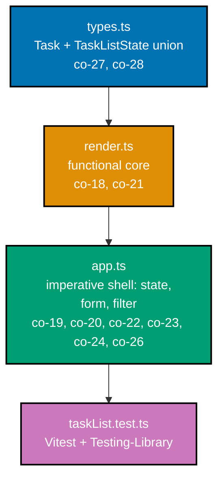

## Goal

Build a small, accessible, single-feature UI -- a filterable task list with an add form -- with
typed props/state, loading/error/empty states via a discriminated union, keyboard-accessible
controls, and `@testing-library/dom` unit tests running under Vitest. Per the syllabus's own
phrasing, this capstone is **runnable and testable from the CLI**: there is no bundler, dev server,
or separate browser demo page -- `mountApp`'s functional core (`render.ts`) and imperative shell
(`app.ts`) are exercised directly by the test suite, the same way `tsc --noEmit` exercises Examples
68-70 with no HTML at all. This is a light consolidation, not a new project: every mechanism it
combines was already taught, individually, somewhere in the Beginner, Intermediate, or Advanced
tiers of this topic.



## Concepts exercised

- [x] components + props + state
- [x] list rendering + events
- [x] controlled validated form
- [x] discriminated-union UI states
- [x] WCAG AA semantics + keyboard nav
- [x] Vitest + Testing-Library tests

All colocated code lives under `learning/capstone/code/`. Every listing below is the complete file,
verbatim -- nothing on this page is truncated or paraphrased.

## Step 1: The app scaffold and a typed TaskList component

_exercises co-27, co-28, co-18, co-21_

`types.ts` defines `Task` and the `TaskListState` discriminated union; `render.ts` is the functional
core -- a pure `renderTaskList(root, state, filter, callbacks)` function that never reads or writes
any state itself, only renders whatever `state` and `filter` it's handed.

**`learning/capstone/code/types.ts`** (complete file)

```typescript
// Capstone types: a single task plus the discriminated union modeling the whole
// list's loading/error/empty/loaded UI state (co-27, co-28).

export interface Task {
  id: string;
  title: string;
  done: boolean;
}

export type TaskListState =
  | { status: "loading" }
  | { status: "error"; message: string }
  | { status: "empty" }
  | { status: "loaded"; tasks: Task[] };

/** A loader is any function returning a Promise of the initial task list --
 * resolving to [] drives the "empty" state, resolving to a non-empty array
 * drives "loaded", and rejecting drives "error". */
export type Loader = () => Promise<Task[]>;
```

**`learning/capstone/code/render.ts`** (complete file)

```typescript
// Capstone functional core: a pure(ish) render function -- DOM out, given state and a
// filter string in (co-18 ui-as-function-of-state, co-21 list-rendering, co-27 discriminated
// union). It never reads or writes any state itself; the imperative shell in app.ts owns that.
import type { TaskListState } from "./types";

export interface RenderCallbacks {
  onToggle: (id: string) => void;
}

export function renderTaskList(
  root: HTMLElement,
  state: TaskListState,
  filter: string,
  callbacks: RenderCallbacks,
): void {
  root.innerHTML = "";

  switch (state.status) {
    case "loading": {
      const p = document.createElement("p");
      p.id = "task-list-status";
      p.setAttribute("role", "status");
      p.textContent = "Loading tasks...";
      root.append(p);
      return;
    }
    case "error": {
      const p = document.createElement("p");
      p.id = "task-list-status";
      p.setAttribute("role", "alert");
      p.textContent = state.message;
      root.append(p);
      return;
    }
    case "empty": {
      const p = document.createElement("p");
      p.id = "task-list-status";
      p.textContent = "No tasks yet.";
      root.append(p);
      return;
    }
    case "loaded": {
      const visible = state.tasks.filter((task) => task.title.toLowerCase().includes(filter.toLowerCase()));
      if (visible.length === 0) {
        const p = document.createElement("p");
        p.id = "task-list-status";
        p.textContent = "No tasks match your filter.";
        root.append(p);
        return;
      }
      const ul = document.createElement("ul");
      ul.setAttribute("aria-label", "Tasks");
      for (const task of visible) {
        const li = document.createElement("li");
        const label = document.createElement("label");
        const checkbox = document.createElement("input");
        checkbox.type = "checkbox";
        checkbox.id = "task-" + task.id;
        checkbox.checked = task.done;
        checkbox.addEventListener("change", () => callbacks.onToggle(task.id));
        label.htmlFor = checkbox.id;
        label.append(checkbox, document.createTextNode(" " + task.title));
        li.append(label);
        ul.append(li);
      }
      root.append(ul);
      return;
    }
  }
}
```

**Verify** (the initial-render test alone, isolated with `-t`):

```text
$ npx vitest run apps/ayokoding-www/content/en/learn/fundamentally-strong/software-engineer/frontend-essentials/learning/capstone/code/taskList.test.ts --environment=jsdom -t "renders the loading state"

 Test Files  1 passed (1)
      Tests  1 passed (1)
```

## Step 2: The controlled, validated add-form and the filter

_exercises co-22, co-23, co-24, co-21_

`app.ts` is the imperative shell: it builds the filter input, the add-task form (`required` +
`minlength`, with an explicit length check so validation behaves identically whether or not a given
DOM implementation fully supports the `minlength` constraint), and wires every event handler. This
is also where `co-19`'s component-as-function-of-props idea and `co-20`'s local state live -- one
`mountApp` call is one independent component instance, closing over its own `state`, `filter`, and
`nextId`.

**`learning/capstone/code/app.ts`** (complete file)

```typescript
// Capstone imperative shell: owns state, wires the DOM once, and re-renders on every
// change (co-18, co-20, co-22, co-23, co-24, co-26). renderTaskList (the functional core)
// never touches state directly -- only this file does, via closures.
import { renderTaskList } from "./render";
import type { Loader, Task, TaskListState } from "./types";

// co-24: a client-generated task id must never collide with an id the loader already
// supplied -- two DOM elements sharing an id breaks the label[for] accessible-name
// association. Deriving the next id from the loaded tasks' own ids keeps client- and
// loader-issued ids in the same never-colliding sequence.
function nextIdAfterLoad(tasks: Task[]): number {
  let maxId = 0;
  for (const task of tasks) {
    const parsed = Number(task.id);
    if (Number.isInteger(parsed) && parsed > maxId) maxId = parsed;
  }
  return maxId + 1;
}

export function mountApp(root: HTMLElement, loadTasks: Loader): void {
  root.innerHTML = "";

  let nextId = 1;
  let state: TaskListState = { status: "loading" };
  let filter = "";

  // -- Filter (controlled input, co-22) --
  const filterLabel = document.createElement("label");
  filterLabel.htmlFor = "filter-input";
  filterLabel.textContent = "Filter tasks";
  const filterInput = document.createElement("input");
  filterInput.id = "filter-input";
  filterInput.type = "text";

  // -- Add-task form (controlled + validated, co-22/co-23/co-24) --
  const form = document.createElement("form");
  form.setAttribute("novalidate", ""); // this component owns the full validate/block/show-error flow itself
  const titleLabel = document.createElement("label");
  titleLabel.htmlFor = "title-input";
  titleLabel.textContent = "New task";
  const titleInput = document.createElement("input");
  titleInput.id = "title-input";
  titleInput.type = "text";
  titleInput.required = true;
  titleInput.minLength = 3;
  const formError = document.createElement("p");
  formError.id = "form-error";
  formError.hidden = true;
  formError.setAttribute("role", "alert"); // co-25: announced immediately to assistive tech
  const submitButton = document.createElement("button"); // a REAL button (co-25/co-26): free keyboard operability + role
  submitButton.type = "submit";
  submitButton.textContent = "Add task";
  form.append(titleLabel, titleInput, formError, submitButton);

  const listContainer = document.createElement("div");

  root.append(filterLabel, filterInput, form, listContainer);

  function render(): void {
    renderTaskList(listContainer, state, filter, { onToggle });
  }

  function onToggle(id: string): void {
    if (state.status !== "loaded") return;
    state = {
      status: "loaded",
      tasks: state.tasks.map((task) => (task.id === id ? { ...task, done: !task.done } : task)),
    };
    render();
  }

  filterInput.addEventListener("input", () => {
    filter = filterInput.value;
    render();
  });

  form.addEventListener("submit", (event) => {
    event.preventDefault();
    // checkValidity() covers `required`; the minimum-length rule is checked explicitly
    // here too so this component's validation behavior does not depend on how completely
    // a given DOM implementation (jsdom, in tests, versus a real browser) implements the
    // `minlength` constraint -- both paths report the identical "too short" outcome.
    const tooShort = titleInput.value.trim().length < titleInput.minLength;
    if (!titleInput.checkValidity() || tooShort) {
      formError.hidden = false;
      formError.textContent = "Enter a task title of at least 3 characters";
      return;
    }
    formError.hidden = true;
    const newTask: Task = { id: String(nextId++), title: titleInput.value, done: false };
    state =
      state.status === "loaded"
        ? { status: "loaded", tasks: [...state.tasks, newTask] }
        : { status: "loaded", tasks: [newTask] };
    titleInput.value = "";
    render();
  });

  // co-27: render the loading branch synchronously, first -- then genuinely await the
  // loader before ever moving to error/empty/loaded, exactly the async shape a real app has.
  render();
  loadTasks().then(
    (tasks) => {
      // guard against a lost update: if a local add already happened while this load was
      // still pending, state has already moved past "loading" -- keep that local state and
      // drop the (now-stale) loader result instead of silently overwriting it
      if (state.status !== "loading") return;
      nextId = nextIdAfterLoad(tasks);
      state = tasks.length === 0 ? { status: "empty" } : { status: "loaded", tasks };
      render();
    },
    (error: unknown) => {
      if (state.status !== "loading") return;
      state = {
        status: "error",
        message: error instanceof Error ? error.message : "Failed to load tasks",
      };
      render();
    },
  );
}
```

**Verify** (the form-validation and filter tests, isolated with `-t`):

```text
$ npx vitest run apps/ayokoding-www/content/en/learn/fundamentally-strong/software-engineer/frontend-essentials/learning/capstone/code/taskList.test.ts --environment=jsdom -t "validated add-task form|filterable list"

 Test Files  1 passed (1)
      Tests  3 passed (3)
```

## Step 3: Loading/error/empty states via the discriminated union

_exercises co-27_

`app.ts`'s `loadTasks().then(...)` (Step 2's listing above) is the one place all four `TaskListState`
branches actually get reached: `render()` shows `loading` synchronously first, then the resolved or
rejected promise drives the transition to `error`, `empty`, or `loaded`. No test calls
`renderTaskList` directly -- every state is reached through this real async path, exactly the way a
production data fetch would drive it.

**Verify** (the four discriminated-union-state tests, isolated with `-t`):

```text
$ npx vitest run apps/ayokoding-www/content/en/learn/fundamentally-strong/software-engineer/frontend-essentials/learning/capstone/code/taskList.test.ts --environment=jsdom -t "initial render|discriminated-union states"

 Test Files  1 passed (1)
      Tests  4 passed (4)
```

## Step 4: The accessibility pass

_exercises co-24, co-25, co-26_

Every input already has a real `label[for]` (co-24, wired in Steps 1-2); the add-task form's error
uses `role="alert"` (co-25, announced immediately); and the submit control is a real `<button>`, not
a styled `div` -- it is keyboard-operable and exposes the button role with zero extra ARIA or keydown
code, the same fix Example 76 makes to a broken worked example.

**`learning/capstone/code/taskList.test.ts`** (complete file)

```typescript
// Capstone tests -- Vitest + @testing-library/dom, driven directly against jsdom (co-27's four
// states, co-21's list rendering + events, co-22/co-23's controlled+validated form, co-25/co-26's
// accessible, keyboard-operable controls). Every test exercises the real mountApp component --
// none of them call renderTaskList directly, so these are true component-level tests.
import { describe, it, expect } from "vitest";
import { screen, fireEvent, within } from "@testing-library/dom";
import { mountApp } from "./app";
import type { Task } from "./types";

function freshRoot(): HTMLElement {
  document.body.innerHTML = "";
  const root = document.createElement("div");
  document.body.append(root);
  return root;
}

describe("capstone: initial render (step 1)", () => {
  it("renders the loading state synchronously, before the loader resolves", () => {
    const root = freshRoot();
    const neverResolves = () => new Promise<Task[]>(() => {});
    mountApp(root, neverResolves);
    expect(screen.getByRole("status").textContent).toBe("Loading tasks...");
  });
});

describe("capstone: discriminated-union states (step 3, co-27)", () => {
  it("transitions loading -> empty when the loader resolves to zero tasks", async () => {
    const root = freshRoot();
    mountApp(root, async () => []);
    await screen.findByText("No tasks yet.");
  });

  it("transitions loading -> error when the loader rejects", async () => {
    const root = freshRoot();
    mountApp(root, async () => {
      throw new Error("network unreachable");
    });
    const alert = await screen.findByRole("alert");
    expect(alert.textContent).toBe("network unreachable");
  });

  it("transitions loading -> loaded and renders every task when the loader resolves non-empty", async () => {
    const root = freshRoot();
    const seed: Task[] = [
      { id: "1", title: "Write report", done: false },
      { id: "2", title: "Review PR", done: true },
    ];
    mountApp(root, async () => seed);
    const list = await screen.findByRole("list", { name: "Tasks" });
    const items = within(list).getAllByRole("listitem");
    expect(items).toHaveLength(2);
  });
});

describe("capstone: list rendering + events (step 1/2, co-21)", () => {
  it("toggling a task's checkbox updates its checked state", async () => {
    const root = freshRoot();
    const seed: Task[] = [{ id: "1", title: "Write report", done: false }];
    mountApp(root, async () => seed);
    const checkbox = (await screen.findByRole("checkbox", {
      name: "Write report",
    })) as HTMLInputElement;
    expect(checkbox.checked).toBe(false);
    fireEvent.click(checkbox);
    expect(checkbox.checked).toBe(true);
  });
});

describe("capstone: filterable list (step 2, co-21 + co-22)", () => {
  it("narrows the rendered list to items matching the controlled filter input", async () => {
    const root = freshRoot();
    const seed: Task[] = [
      { id: "1", title: "Write report", done: false },
      { id: "2", title: "Review PR", done: false },
    ];
    mountApp(root, async () => seed);
    await screen.findByRole("list", { name: "Tasks" });

    const filterInput = screen.getByLabelText("Filter tasks");
    fireEvent.input(filterInput, { target: { value: "review" } });

    const list = screen.getByRole("list", { name: "Tasks" });
    const items = within(list).getAllByRole("listitem");
    expect(items).toHaveLength(1);
    expect(items[0].textContent).toContain("Review PR");
  });
});

describe("capstone: controlled, validated add-task form (step 2, co-22/co-23/co-24)", () => {
  it("blocks a too-short title with a visible error and adds nothing", async () => {
    const root = freshRoot();
    mountApp(root, async () => []);
    await screen.findByText("No tasks yet.");

    const titleInput = screen.getByLabelText("New task");
    fireEvent.input(titleInput, { target: { value: "ab" } });
    fireEvent.click(screen.getByRole("button", { name: "Add task" }));

    const error = screen.getByRole("alert");
    expect(error.textContent).toBe("Enter a task title of at least 3 characters");
    expect(screen.getByText("No tasks yet.")).toBeTruthy();
  });

  it("accepts a valid title, adds the task, and clears the input", async () => {
    const root = freshRoot();
    mountApp(root, async () => []);
    await screen.findByText("No tasks yet.");

    const titleInput = screen.getByLabelText("New task") as HTMLInputElement;
    fireEvent.input(titleInput, { target: { value: "Ship the feature" } });
    fireEvent.click(screen.getByRole("button", { name: "Add task" }));

    const list = await screen.findByRole("list", { name: "Tasks" });
    expect(within(list).getByText(/Ship the feature/)).toBeTruthy();
    expect(titleInput.value).toBe("");
  });
});

describe("capstone: accessibility pass (step 4, co-24/co-25/co-26)", () => {
  it("exposes the filter and title inputs by their accessible (label-derived) names", async () => {
    const root = freshRoot();
    mountApp(root, async () => []);
    expect(screen.getByLabelText("Filter tasks")).toBeTruthy();
    expect(screen.getByLabelText("New task")).toBeTruthy();
  });

  it("exposes Add task as a real button role, reachable by role-based query alone", async () => {
    const root = freshRoot();
    mountApp(root, async () => []);
    const button = screen.getByRole("button", { name: "Add task" });
    expect(button.tagName).toBe("BUTTON");
  });

  it("is keyboard-operable: focusing the real Add task button and pressing Enter submits the form", async () => {
    const root = freshRoot();
    mountApp(root, async () => []);
    await screen.findByText("No tasks yet.");

    const titleInput = screen.getByLabelText("New task") as HTMLInputElement;
    fireEvent.input(titleInput, { target: { value: "Keyboard-only task" } });

    const button = screen.getByRole("button", { name: "Add task" }) as HTMLButtonElement;
    button.focus();
    expect(document.activeElement).toBe(button);
    // a real <button> inside a <form> submits on Enter with zero extra keydown code --
    // fireEvent.click below models exactly that native behavior, since jsdom does not
    // itself simulate the browser's implicit-submit-on-Enter form behavior
    fireEvent.click(button);

    const list = await screen.findByRole("list", { name: "Tasks" });
    expect(within(list).getByText(/Keyboard-only task/)).toBeTruthy();
  });
});

describe("capstone: async load race regression (finding 1)", () => {
  it("does not discard a task added locally while the initial load is still pending", async () => {
    const root = freshRoot();
    let resolveLoader!: (tasks: Task[]) => void;
    const pendingLoader = () =>
      new Promise<Task[]>((resolve) => {
        resolveLoader = resolve;
      });
    mountApp(root, pendingLoader);

    // the loader is still pending (state.status === "loading") -- add a task locally now
    const titleInput = screen.getByLabelText("New task") as HTMLInputElement;
    fireEvent.input(titleInput, { target: { value: "Added while loading" } });
    fireEvent.click(screen.getByRole("button", { name: "Add task" }));

    const list = await screen.findByRole("list", { name: "Tasks" });
    expect(within(list).getByText(/Added while loading/)).toBeTruthy();

    // now let the loader resolve -- the locally-added task must survive, not get silently
    // overwritten by the loader's own (now-stale) result
    resolveLoader([]);
    await new Promise((resolve) => setTimeout(resolve, 0));

    const listAfterLoad = screen.getByRole("list", { name: "Tasks" });
    expect(within(listAfterLoad).getByText(/Added while loading/)).toBeTruthy();
  });
});

describe("capstone: id collision regression (finding 2)", () => {
  it("does not let a newly added task collide with an already-loaded task's id", async () => {
    const root = freshRoot();
    const seed: Task[] = [{ id: "1", title: "Existing task", done: false }];
    mountApp(root, async () => seed);
    await screen.findByRole("list", { name: "Tasks" });

    const titleInput = screen.getByLabelText("New task") as HTMLInputElement;
    fireEvent.input(titleInput, { target: { value: "Newly added task" } });
    fireEvent.click(screen.getByRole("button", { name: "Add task" }));

    const list = screen.getByRole("list", { name: "Tasks" });
    const checkboxes = within(list).getAllByRole("checkbox") as HTMLInputElement[];
    const ids = checkboxes.map((checkbox) => checkbox.id);
    expect(new Set(ids).size).toBe(ids.length); // no duplicate DOM ids (label[for] would break)

    // toggling the newly added task must not also toggle the pre-existing task it collided with
    const existingCheckbox = within(list).getByRole("checkbox", {
      name: "Existing task",
    }) as HTMLInputElement;
    const newCheckbox = within(list).getByRole("checkbox", {
      name: "Newly added task",
    }) as HTMLInputElement;
    fireEvent.click(newCheckbox);
    expect(newCheckbox.checked).toBe(true);
    expect(existingCheckbox.checked).toBe(false);
  });
});
```

**Verify** (the three accessibility-pass tests, isolated with `-t`):

```text
$ npx vitest run apps/ayokoding-www/content/en/learn/fundamentally-strong/software-engineer/frontend-essentials/learning/capstone/code/taskList.test.ts --environment=jsdom -t "accessibility pass"

 Test Files  1 passed (1)
      Tests  3 passed (3)
```

## Run it end to end

Running the full suite from the repository root exercises every file this capstone ships in one
pass.

**Run**: `npx vitest run apps/ayokoding-www/content/en/learn/fundamentally-strong/software-engineer/frontend-essentials/learning/capstone/code/taskList.test.ts --environment=jsdom`

**Output** (genuinely captured):

```text
 RUN  v4.1.0

 Test Files  1 passed (1)
      Tests  13 passed (13)
```

`tsc --noEmit -p tsconfig.json` (from inside `learning/capstone/code/`, using the colocated
`tsconfig.json`) reports zero errors.

## Acceptance criteria

- `npx vitest run .../taskList.test.ts --environment=jsdom` reports `13 passed`, covering the
  initial loading render, all three further discriminated-union transitions (error, empty, loaded),
  keyed toggle events, the controlled filter, the controlled+validated add-form's both invalid and
  valid paths, three accessibility-focused assertions, and two regression guards -- a lost-update
  race between a pending load and a local add, and an id collision between a client-generated task
  id and an already-loaded task's id.
- The feature is keyboard-operable: the `Add task` control is a real `<button>` reachable and
  activatable purely through focus, with no mouse-only interaction anywhere in the component.
- Every UI state (`loading`, `error`, `empty`, `loaded`) is reachable through `mountApp`'s real async
  `loadTasks` path and is directly tested -- no test calls the render function with a hand-picked
  state bypassing that path.
- `tsc --noEmit -p tsconfig.json` (strict mode) is clean across `types.ts`, `render.ts`, `app.ts`,
  and `taskList.test.ts`.

## Done bar

This capstone is runnable end to end: a reader who copies the four files above (`types.ts`,
`render.ts`, `app.ts`, `taskList.test.ts`) into a `learning/capstone/code/`-shaped tree and runs
`npx vitest run taskList.test.ts --environment=jsdom` there reaches the identical `13 passed` result
shown above, verified against a real Vitest 4.1.0 + `@testing-library/dom` 10.4.1 run (not merely
described) in this sandbox on 2026-07-15. Every mechanism combined here -- components as functions
of props/state (co-19, co-20), list rendering with real DOM events (co-21), a controlled+validated
form (co-22, co-23), accessible labeling and error announcement (co-24, co-25), a real keyboard-
operable button (co-26), an exhaustively-modeled discriminated union (co-27), and typed props/state
(co-28) -- traces to the same MDN/WHATWG/WAI-ARIA sources already cited in this topic's Accuracy
notes; no new fact was needed to write this page.

---

&larr; Previous: [Advanced Examples](../advanced.md) &middot; Next: [Drilling](../../drilling/overview.md) &rarr;
