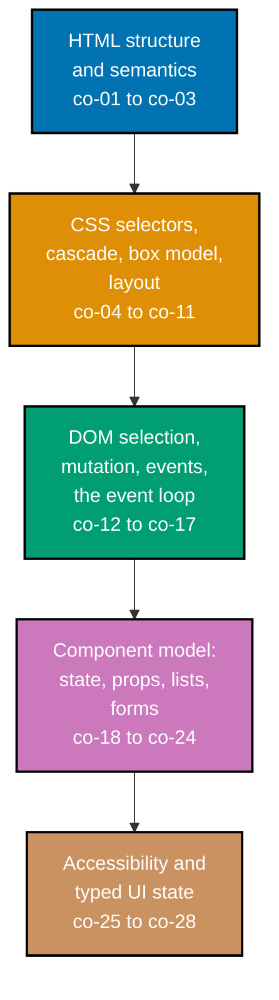

## Prerequisites

- **Prior topics**: [13 · Just Enough TypeScript](../../just-enough-typescript/learning/overview.md) --
  Examples 68-70 and the capstone's typed props/state assume you can already read a TypeScript
  interface, a union type, and a `tsc` type-error message the way that primer taught them.
- **Tools & environment**: a modern web browser; **Node.js** + npm; **TypeScript** (`tsc`) for the
  three type-checking examples and the capstone. No named UI framework is required or used --
  every worked example is plain HTML, CSS, and vanilla DOM JavaScript, matching this topic's scope
  note (the platform and the component model, not any one framework's API). The capstone uses
  **Vitest** + **`@testing-library/dom`** for component tests, exercised directly against the DOM
  with no framework layer in between.
- **Assumed knowledge**: TypeScript basics (types, unions) from topic 13; no prior web/HTML/CSS
  experience assumed -- this topic is where that experience starts.

## Why this exists -- the big idea

The problem before the solution: UIs are stateful and users are unpredictable; hand-mutating the DOM
on every event becomes an untraceable tangle of who-changed-what. The one idea worth keeping if you
forget everything else: the UI is a _function of state_ -- you change state and let a render step
derive the DOM, never poke the DOM directly outside that one function; data flows one way.

**Cross-cutting big ideas, taught here and then reused for the rest of this topic**: `taming-state` --
unidirectional data flow (Examples 43-47) makes UI state a single source of truth instead of scattered
mutations, and every later controlled-form and discriminated-union example builds directly on it.
`abstraction-and-its-cost` -- the component model (Examples 45-47, 71) buys reuse by wrapping state
and render together, and charges a small render/reconciliation discipline in return (Example 49's
keyed list update is exactly that discipline made concrete: reuse existing nodes, update only what
changed).

## Install and run your first example

Confirm the tools this topic uses are installed:

```text
$ node --version
v24.13.1
$ npx tsc --version
Version 5.8.3
```

**A note on versions**: this topic's examples were authored and verified in this sandbox on
2026-07-15 against TypeScript 5.8.3, Vitest 4.1.0, and `@testing-library/dom` 10.4.1 -- the exact
pins already used elsewhere in this monorepo (see the syllabus's Accuracy notes for the DD-35
primary-source citations behind every CSS/DOM/events/forms/ARIA claim).

Every Beginner-, Intermediate-, and Advanced-tier example is a complete, self-contained
`learning/code/ex-NN-*/index.html` -- open it directly in any browser to see it work. Alongside each
one is a small `verify.mjs` (a Playwright-driven Node script, the topic's "DOM harness") that loads
that same `index.html` and programmatically confirms the exact claim each example's **Output** block
shows -- run it yourself with:

```text
node verify.mjs
```

from inside that example's own directory. A handful of examples (68, 69, 70 -- the pure
type-checking ones) have no HTML at all: they're a single `example.ts`, verified instead with:

```text
tsc --noEmit --strict --skipLibCheck example.ts
```

## How this topic's examples are organized

- **Beginner** (Examples 1-28) -- the platform from a bare document up: HTML structure and
  semantics, CSS selectors and the cascade, the box model and `display`, and first DOM
  selection/mutation/event-handling.
- **Intermediate** (Examples 29-60) -- flexbox and grid layout in depth, media queries, event
  propagation and the event loop, the component model (state, props, one-way data flow, keyed
  lists), and controlled, validated, accessible forms.
- **Advanced** (Examples 61-80) -- keyboard accessibility patterns (tab order, focus traps, roving
  tabindex), discriminated-union UI state with TypeScript exhaustiveness checking, typed props and
  state, small full components combining several concepts, three accessibility bug fixes, and two
  combined worked examples closing out the topic.

Every example cites the concept (`co-NN`) it exercises, and every CSS/DOM/events/forms/ARIA claim
traces to MDN, the WHATWG DOM/HTML Living Standards, and the W3C WAI-ARIA APG + WCAG, per the
syllabus's DD-35 citations.



## Concepts

Every worked example in this topic's follow-up pages cites the `co-NN` concept it exercises -- this
section is the 1:1 reference those citations point back to. Read it in order: HTML and CSS come
first because every DOM, event, and component-model concept that follows describes something acting
on the elements and styles those first sections define.

### co-01 · html-document-structure

A valid page is `<!doctype html>` plus `head` (charset, viewport, title) and `body`; the metadata
decides encoding and mobile scaling.

**Why it matters**: every browser needs `charset` to decode the byte stream correctly and `viewport`
to render at a readable size on a phone -- omit either and the page can render as mojibake or
desktop-zoomed-out on mobile.

**Verify it**: Example 1 is the smallest complete instance of this exact shape.

### co-02 · html-semantics

Semantic landmarks (`header`/`nav`/`main`/`article`/`section`/`footer`) convey structure and meaning
that generic `div`s cannot, feeding the accessibility tree.

**Why it matters**: these elements map automatically to ARIA landmark roles with zero extra
attributes -- a `div` never does, no matter how it's styled to look identical.

**Verify it**: Example 2 confirms all four landmark roles are genuinely exposed.

### co-03 · text-and-links

Headings, paragraphs, lists, anchors, and images-with-alt form the readable, navigable, accessible
content of a page.

**Why it matters**: a correct heading outline, real link text, and `alt` fallback content are what
make a page navigable by keyboard and screen reader, not just readable by eye.

**Verify it**: Examples 3, 4, and 5 verify the heading outline, link structure, and alt-text fallback
respectively.

### co-04 · css-selectors

Element, class, id, attribute, descendant, and pseudo-class selectors decide which elements a rule
targets.

**Why it matters**: choosing the wrong selector scope (too broad, or missing a descendant
constraint) is one of the most common real CSS bugs -- a rule that "should" only affect one thing
quietly affects many.

**Verify it**: Examples 6-8 confirm class, descendant, and attribute+pseudo-class selectors each
target exactly what they claim to.

### co-05 · css-specificity-cascade

When rules conflict, specificity and then source order decide the winner, and inheritance passes
some properties down the tree.

**Why it matters**: specificity is evaluated BEFORE source order -- a later, lower-specificity rule
can never override an earlier, higher-specificity one, which is a frequent source of "why won't my
CSS override this" confusion.

**Verify it**: Examples 9 and 10 isolate specificity and source order as two genuinely separate
tie-breaking rules.

### co-06 · css-custom-properties

Custom properties (`--name`) hold reusable values resolved through `var()` and the cascade, enabling
theming from one place.

**Why it matters**: a custom property redefined inside a scoped selector changes what every
descendant's `var()` resolves to -- the entire mechanism behind a one-class-swap dark mode.

**Verify it**: Example 11 confirms reuse across two rules; Example 35 confirms scoped theming.

### co-07 · box-model

Every element is a content box wrapped in padding, border, and margin; `box-sizing: border-box`
folds padding and border into the declared width.

**Why it matters**: assuming a declared `width` is the element's full rendered size is a very common
bug under the default `content-box` sizing, where padding and border are added on top of it.

**Verify it**: Examples 12 and 13 measure `offsetWidth` under both box-sizing modes.

### co-08 · normal-flow-display

`display` (block / inline / inline-block / none) governs how an element participates in normal
document flow and layout.

**Why it matters**: `display: none` genuinely removes an element from layout (`offsetParent` becomes
`null`), unlike `visibility: hidden`, which merely hides it visually while it still occupies space.

**Verify it**: Examples 14-16 measure block-vs-inline sizing, inline-block hybrid sizing, and the
`display: none` layout removal.

### co-09 · flexbox

A flex container distributes and aligns children along a main and cross axis with
`justify-content`, `align-items`, and `flex-grow`.

**Why it matters**: flexbox solved vertical centering and flexible-remaining-space layouts that
previously needed table or absolute-positioning hacks.

**Verify it**: Examples 27-29 measure real bounding rectangles for distribution, alignment, and
`flex-grow`.

### co-10 · grid

CSS grid places children into explicit rows and columns of a two-dimensional track layout with gaps
and named areas.

**Why it matters**: unlike flexbox's one-dimensional axis, grid plans rows AND columns together --
the right tool once a layout is genuinely two-dimensional, not just a single row or column.

**Verify it**: Examples 30-32 measure column placement, named-area regions, and gap spacing.

### co-11 · responsive-media-queries

Media queries and fluid sizing adapt the layout to the viewport so one document serves phone through
desktop.

**Why it matters**: one unchanged HTML document serving a stacked mobile layout and a side-by-side
desktop layout is the entire premise of responsive design, with no separate mobile site required.

**Verify it**: Examples 33 and 34 confirm a real breakpoint layout change and a fluid image that
never overflows.

### co-12 · dom-selection

`document.querySelector`/`querySelectorAll` locate the actual, currently rendered DOM elements (a
static snapshot `NodeList`, not an auto-updating collection).

**Why it matters**: because `querySelectorAll`'s result is static, a node added after the call does
NOT retroactively appear in that same list -- a fresh call is needed to see it.

**Verify it**: Examples 17 and 18 confirm single-node and all-nodes selection against the real DOM.

### co-13 · dom-manipulation

`textContent`, `createElement`, `append`, `remove`, and `classList` mutate the rendered tree
imperatively.

**Why it matters**: these five operations are the complete low-level toolkit every higher-level
render function (Example 43 onward) is ultimately built from.

**Verify it**: Examples 19-22 confirm text updates, class toggling, node creation/append, and node
removal.

### co-14 · event-handling

`addEventListener` binds a handler that receives an event object when the user interacts with an
element.

**Why it matters**: `addEventListener` is additive -- multiple independent listeners can coexist on
the same element and event type, unlike assigning `el.onclick`, which silently overwrites any
previous handler.

**Verify it**: Examples 23-26 confirm click counting, live input mirroring, `event.target`
identification, and multi-listener registration order.

### co-15 · event-propagation

Events bubble up the ancestor chain, so one listener on a parent can handle events from many
descendants (delegation).

**Why it matters**: bubbling is the entire mechanism event delegation depends on -- one listener on a
container observes events from descendants, including ones that don't exist yet when the listener
is attached.

**Verify it**: Examples 36 and 37 confirm bubbling and delegated list-click handling.

### co-16 · default-action-control

`preventDefault` suppresses the browser's built-in behavior and `stopPropagation` halts bubbling.

**Why it matters**: these solve two genuinely different problems -- canceling a default action (like
link navigation) versus halting further bubbling -- and calling one does not imply the other.

**Verify it**: Examples 38 and 39 confirm `preventDefault` blocks navigation and `stopPropagation`
blocks bubbling, independently.

### co-17 · event-loop

The browser runs a task/microtask loop; `setTimeout` and `Promise` schedule work after the current
synchronous frame, with microtasks first.

**Why it matters**: "zero milliseconds" in `setTimeout(fn, 0)` never means "immediately" -- it means
"after the current synchronous code AND every pending microtask," a distinction Promise-based code
relies on.

**Verify it**: Examples 40-42 confirm deferred execution, microtask-before-timeout ordering, and a
debounced handler built on exactly this scheduling.

### co-18 · ui-as-function-of-state

Render derives the DOM from a single state value; you change state and re-render rather than poking
the DOM ad hoc, so data flows one way.

**Why it matters**: this is the single idea every later component-model concept refines -- state
change, then re-render, as the ONLY path a real UI update takes.

**Verify it**: Examples 43 and 44 confirm the DOM matches state directly, and updates only as a
consequence of a state mutation plus a re-render call.

### co-19 · component-props

A component is a function of its props that returns markup; props flow one way, parent to child.

**Why it matters**: treating a component as "just a function of its props" is what makes it trivially
reusable -- call it again with different props, get independently correct output.

**Verify it**: Examples 46 and 47 confirm different props yield different output, and that a child
cannot write back into a parent's own state.

### co-20 · component-state

Local state plus a re-render on change models an interactive component.

**Why it matters**: state and render, colocated in one function with no external framework, is a
complete, working component -- Example 45's vanilla counter proves the pattern in about ten lines.

**Verify it**: Example 45 confirms clicking increments the rendered number via exactly this pattern.

### co-21 · list-rendering

Mapping an array to DOM nodes renders a list, keyed for stable identity across updates.

**Why it matters**: keyed updates reuse existing DOM nodes for unchanged items and update in place
only what actually changed -- recreating every node on every render would lose focus, scroll
position, and any other per-node state.

**Verify it**: Examples 48 and 49 confirm array-length-driven rendering and keyed, node-reusing
updates.

### co-22 · forms-controlled-input

A controlled input mirrors state: its value comes from state and its input event writes the change
back.

**Why it matters**: "controlled" specifically means state is the single source of truth -- the input
never holds a value the state object doesn't also know about.

**Verify it**: Examples 50-52 confirm the controlled pattern for a text input, a checkbox, and a
select, each staying in sync with its backing state.

### co-23 · form-validation

The Constraint Validation API (`required`, `pattern`, `checkValidity`, `setCustomValidity`) reports
invalid inputs.

**Why it matters**: `checkValidity()` and `pattern` give the platform's own built-in validation for
free, before any custom validation logic is needed; `setCustomValidity` extends that same system to
checks the platform can't express declaratively.

**Verify it**: Examples 53-55 confirm required-field, pattern, and custom-message validation.

### co-24 · accessible-forms

Every input has an associated `label`, and error messages are wired to it via `aria-describedby` so
assistive tech announces them.

**Why it matters**: `placeholder` text is not an accessible name and disappears once there's real
input -- a real `label[for]` is what gives an input a genuine, persistent accessible name.

**Verify it**: Examples 56, 57, and 75 confirm label-input association, a wired-in error
description, and a fixed missing-label bug.

### co-25 · aria-roles-semantics

Roles and `aria-*` attributes expose widget semantics and state to assistive technology, meeting the
WCAG 2.2 AA baseline.

**Why it matters**: `role="button"` alone adds no keyboard behavior -- Example 62 shows the manual
keydown handling it still needs, which a real `<button>` (Example 76) gets for free.

**Verify it**: Examples 59, 60, 76, and 77 confirm an exposed button role, a live region update, a
semantic-button fix, and a WCAG AA contrast-ratio fix.

### co-26 · keyboard-navigation

Focus order, `tabindex`, and key handlers make every control operable without a mouse.

**Why it matters**: a form whose visual layout diverges from its DOM order can produce a genuinely
confusing tab order -- keyboard operability depends on getting this right, not just on visual
polish.

**Verify it**: Examples 61, 63, and 64 confirm natural tab order, a focus trap that never escapes a
modal, and roving tabindex within a menu.

### co-27 · discriminated-union-states

A tagged union models loading / error / empty / loaded UI states so every case is handled
exhaustively.

**Why it matters**: an exhaustiveness check (assigning the `switch`'s default case to a `never`-typed
variable) turns "a teammate added a new state and forgot to handle it" into a compile-time error
instead of a silent runtime bug.

**Verify it**: Examples 65-68 confirm each branch renders correctly and that `tsc` genuinely flags a
newly added, unhandled variant.

### co-28 · typing-props-state

TypeScript types on props and state catch shape mismatches before the component ever renders.

**Why it matters**: a wrong-typed prop or an invalid state assignment becomes a compile error instead
of a confusing runtime value discovered later.

**Verify it**: Examples 69 and 70 confirm `tsc` genuinely rejects a wrong-typed prop and an invalid
state assignment.

## Examples by Level

### Beginner (Examples 1–28)

- [Example 1: Minimal HTML Document](/en/c/learn/fundamentally-strong/software-engineer/frontend-essentials/learning/beginner#example-1-minimal-html-document)
- [Example 2: Semantic Page Landmarks](/en/c/learn/fundamentally-strong/software-engineer/frontend-essentials/learning/beginner#example-2-semantic-page-landmarks)
- [Example 3: Headings and Paragraphs](/en/c/learn/fundamentally-strong/software-engineer/frontend-essentials/learning/beginner#example-3-headings-and-paragraphs)
- [Example 4: Lists and Links](/en/c/learn/fundamentally-strong/software-engineer/frontend-essentials/learning/beginner#example-4-lists-and-links)
- [Example 5: Image With Alt Text](/en/c/learn/fundamentally-strong/software-engineer/frontend-essentials/learning/beginner#example-5-image-with-alt-text)
- [Example 6: Class Selector Style](/en/c/learn/fundamentally-strong/software-engineer/frontend-essentials/learning/beginner#example-6-class-selector-style)
- [Example 7: Id and Descendant Selector](/en/c/learn/fundamentally-strong/software-engineer/frontend-essentials/learning/beginner#example-7-id-and-descendant-selector)
- [Example 8: Attribute and Pseudo Selector](/en/c/learn/fundamentally-strong/software-engineer/frontend-essentials/learning/beginner#example-8-attribute-and-pseudo-selector)
- [Example 9: Specificity Conflict](/en/c/learn/fundamentally-strong/software-engineer/frontend-essentials/learning/beginner#example-9-specificity-conflict)
- [Example 10: Cascade Source Order](/en/c/learn/fundamentally-strong/software-engineer/frontend-essentials/learning/beginner#example-10-cascade-source-order)
- [Example 11: Custom Property Reuse](/en/c/learn/fundamentally-strong/software-engineer/frontend-essentials/learning/beginner#example-11-custom-property-reuse)
- [Example 12: Box Model: Padding, Border, Margin](/en/c/learn/fundamentally-strong/software-engineer/frontend-essentials/learning/beginner#example-12-box-model-padding-border-margin)
- [Example 13: box-sizing: border-box](/en/c/learn/fundamentally-strong/software-engineer/frontend-essentials/learning/beginner#example-13-box-sizing-border-box)
- [Example 14: Block vs. Inline](/en/c/learn/fundamentally-strong/software-engineer/frontend-essentials/learning/beginner#example-14-block-vs-inline)
- [Example 15: inline-block Sizing](/en/c/learn/fundamentally-strong/software-engineer/frontend-essentials/learning/beginner#example-15-inline-block-sizing)
- [Example 16: display: none Removes Layout](/en/c/learn/fundamentally-strong/software-engineer/frontend-essentials/learning/beginner#example-16-display-none-removes-layout)
- [Example 17: Select a Single Node](/en/c/learn/fundamentally-strong/software-engineer/frontend-essentials/learning/beginner#example-17-select-a-single-node)
- [Example 18: Select All Nodes](/en/c/learn/fundamentally-strong/software-engineer/frontend-essentials/learning/beginner#example-18-select-all-nodes)
- [Example 19: Set textContent](/en/c/learn/fundamentally-strong/software-engineer/frontend-essentials/learning/beginner#example-19-set-textcontent)
- [Example 20: Toggle classList](/en/c/learn/fundamentally-strong/software-engineer/frontend-essentials/learning/beginner#example-20-toggle-classlist)
- [Example 21: Create and Append a Node](/en/c/learn/fundamentally-strong/software-engineer/frontend-essentials/learning/beginner#example-21-create-and-append-a-node)
- [Example 22: Remove a Node](/en/c/learn/fundamentally-strong/software-engineer/frontend-essentials/learning/beginner#example-22-remove-a-node)
- [Example 23: Click Handler Counter](/en/c/learn/fundamentally-strong/software-engineer/frontend-essentials/learning/beginner#example-23-click-handler-counter)
- [Example 24: Input Event Mirror](/en/c/learn/fundamentally-strong/software-engineer/frontend-essentials/learning/beginner#example-24-input-event-mirror)
- [Example 25: event.target](/en/c/learn/fundamentally-strong/software-engineer/frontend-essentials/learning/beginner#example-25-eventtarget)
- [Example 26: Multiple Listeners, Registration Order](/en/c/learn/fundamentally-strong/software-engineer/frontend-essentials/learning/beginner#example-26-multiple-listeners-registration-order)
- [Example 27: Flex Row Distribution](/en/c/learn/fundamentally-strong/software-engineer/frontend-essentials/learning/beginner#example-27-flex-row-distribution)
- [Example 28: Flex Align Center](/en/c/learn/fundamentally-strong/software-engineer/frontend-essentials/learning/beginner#example-28-flex-align-center)

### Intermediate (Examples 29–60)

- [Example 29: flex-grow Absorbs Space](/en/c/learn/fundamentally-strong/software-engineer/frontend-essentials/learning/intermediate#example-29-flex-grow-absorbs-space)
- [Example 30: Grid Two Column](/en/c/learn/fundamentally-strong/software-engineer/frontend-essentials/learning/intermediate#example-30-grid-two-column)
- [Example 31: Grid Named Areas](/en/c/learn/fundamentally-strong/software-engineer/frontend-essentials/learning/intermediate#example-31-grid-named-areas)
- [Example 32: Grid Gap](/en/c/learn/fundamentally-strong/software-engineer/frontend-essentials/learning/intermediate#example-32-grid-gap)
- [Example 33: Responsive Breakpoint](/en/c/learn/fundamentally-strong/software-engineer/frontend-essentials/learning/intermediate#example-33-responsive-breakpoint)
- [Example 34: Responsive Fluid Image](/en/c/learn/fundamentally-strong/software-engineer/frontend-essentials/learning/intermediate#example-34-responsive-fluid-image)
- [Example 35: Custom Property Theming](/en/c/learn/fundamentally-strong/software-engineer/frontend-essentials/learning/intermediate#example-35-custom-property-theming)
- [Example 36: Event Bubbling](/en/c/learn/fundamentally-strong/software-engineer/frontend-essentials/learning/intermediate#example-36-event-bubbling)
- [Example 37: Event Delegation List](/en/c/learn/fundamentally-strong/software-engineer/frontend-essentials/learning/intermediate#example-37-event-delegation-list)
- [Example 38: preventDefault on a Link](/en/c/learn/fundamentally-strong/software-engineer/frontend-essentials/learning/intermediate#example-38-preventdefault-on-a-link)
- [Example 39: stopPropagation](/en/c/learn/fundamentally-strong/software-engineer/frontend-essentials/learning/intermediate#example-39-stoppropagation)
- [Example 40: setTimeout Defers Work](/en/c/learn/fundamentally-strong/software-engineer/frontend-essentials/learning/intermediate#example-40-settimeout-defers-work)
- [Example 41: Microtask Before Timeout](/en/c/learn/fundamentally-strong/software-engineer/frontend-essentials/learning/intermediate#example-41-microtask-before-timeout)
- [Example 42: Debounce Input](/en/c/learn/fundamentally-strong/software-engineer/frontend-essentials/learning/intermediate#example-42-debounce-input)
- [Example 43: Render From State](/en/c/learn/fundamentally-strong/software-engineer/frontend-essentials/learning/intermediate#example-43-render-from-state)
- [Example 44: State Change Triggers Render](/en/c/learn/fundamentally-strong/software-engineer/frontend-essentials/learning/intermediate#example-44-state-change-triggers-render)
- [Example 45: Counter Component](/en/c/learn/fundamentally-strong/software-engineer/frontend-essentials/learning/intermediate#example-45-counter-component)
- [Example 46: Props-Driven Component](/en/c/learn/fundamentally-strong/software-engineer/frontend-essentials/learning/intermediate#example-46-props-driven-component)
- [Example 47: One-Way Data Flow](/en/c/learn/fundamentally-strong/software-engineer/frontend-essentials/learning/intermediate#example-47-one-way-data-flow)
- [Example 48: Render List From Array](/en/c/learn/fundamentally-strong/software-engineer/frontend-essentials/learning/intermediate#example-48-render-list-from-array)
- [Example 49: Keyed List Update](/en/c/learn/fundamentally-strong/software-engineer/frontend-essentials/learning/intermediate#example-49-keyed-list-update)
- [Example 50: Controlled Text Input](/en/c/learn/fundamentally-strong/software-engineer/frontend-essentials/learning/intermediate#example-50-controlled-text-input)
- [Example 51: Controlled Checkbox](/en/c/learn/fundamentally-strong/software-engineer/frontend-essentials/learning/intermediate#example-51-controlled-checkbox)
- [Example 52: Controlled Select](/en/c/learn/fundamentally-strong/software-engineer/frontend-essentials/learning/intermediate#example-52-controlled-select)
- [Example 53: Required Field Validation](/en/c/learn/fundamentally-strong/software-engineer/frontend-essentials/learning/intermediate#example-53-required-field-validation)
- [Example 54: Pattern Validation](/en/c/learn/fundamentally-strong/software-engineer/frontend-essentials/learning/intermediate#example-54-pattern-validation)
- [Example 55: Custom Validity Message](/en/c/learn/fundamentally-strong/software-engineer/frontend-essentials/learning/intermediate#example-55-custom-validity-message)
- [Example 56: Label-Input Association](/en/c/learn/fundamentally-strong/software-engineer/frontend-essentials/learning/intermediate#example-56-label-input-association)
- [Example 57: aria-describedby Error](/en/c/learn/fundamentally-strong/software-engineer/frontend-essentials/learning/intermediate#example-57-aria-describedby-error)
- [Example 58: Form Submit Handler](/en/c/learn/fundamentally-strong/software-engineer/frontend-essentials/learning/intermediate#example-58-form-submit-handler)
- [Example 59: aria-role Button](/en/c/learn/fundamentally-strong/software-engineer/frontend-essentials/learning/intermediate#example-59-aria-role-button)
- [Example 60: aria-live Region](/en/c/learn/fundamentally-strong/software-engineer/frontend-essentials/learning/intermediate#example-60-aria-live-region)

### Advanced (Examples 61–80)

- [Example 61: Keyboard Tab Order](/en/c/learn/fundamentally-strong/software-engineer/frontend-essentials/learning/advanced#example-61-keyboard-tab-order)
- [Example 62: Keyboard-Activate a Custom Button](/en/c/learn/fundamentally-strong/software-engineer/frontend-essentials/learning/advanced#example-62-keyboard-activate-a-custom-button)
- [Example 63: Focus Trap Modal](/en/c/learn/fundamentally-strong/software-engineer/frontend-essentials/learning/advanced#example-63-focus-trap-modal)
- [Example 64: Roving Tabindex Menu](/en/c/learn/fundamentally-strong/software-engineer/frontend-essentials/learning/advanced#example-64-roving-tabindex-menu)
- [Example 65: Discriminated Union: Loading](/en/c/learn/fundamentally-strong/software-engineer/frontend-essentials/learning/advanced#example-65-discriminated-union-loading)
- [Example 66: Discriminated Union: Error](/en/c/learn/fundamentally-strong/software-engineer/frontend-essentials/learning/advanced#example-66-discriminated-union-error)
- [Example 67: Discriminated Union: Empty](/en/c/learn/fundamentally-strong/software-engineer/frontend-essentials/learning/advanced#example-67-discriminated-union-empty)
- [Example 68: Discriminated Union: Exhaustive](/en/c/learn/fundamentally-strong/software-engineer/frontend-essentials/learning/advanced#example-68-discriminated-union-exhaustive)
- [Example 69: Typed Props](/en/c/learn/fundamentally-strong/software-engineer/frontend-essentials/learning/advanced#example-69-typed-props)
- [Example 70: Typed State](/en/c/learn/fundamentally-strong/software-engineer/frontend-essentials/learning/advanced#example-70-typed-state)
- [Example 71: Data List Component](/en/c/learn/fundamentally-strong/software-engineer/frontend-essentials/learning/advanced#example-71-data-list-component)
- [Example 72: Validated Form Component](/en/c/learn/fundamentally-strong/software-engineer/frontend-essentials/learning/advanced#example-72-validated-form-component)
- [Example 73: Filterable List](/en/c/learn/fundamentally-strong/software-engineer/frontend-essentials/learning/advanced#example-73-filterable-list)
- [Example 74: Derived Value Render](/en/c/learn/fundamentally-strong/software-engineer/frontend-essentials/learning/advanced#example-74-derived-value-render)
- [Example 75: Fix: Missing Label](/en/c/learn/fundamentally-strong/software-engineer/frontend-essentials/learning/advanced#example-75-fix-missing-label)
- [Example 76: Fix: div-as-Button to Semantic Button](/en/c/learn/fundamentally-strong/software-engineer/frontend-essentials/learning/advanced#example-76-fix-div-as-button-to-semantic-button)
- [Example 77: Fix: Color Contrast](/en/c/learn/fundamentally-strong/software-engineer/frontend-essentials/learning/advanced#example-77-fix-color-contrast)
- [Example 78: Delegated Dynamic List](/en/c/learn/fundamentally-strong/software-engineer/frontend-essentials/learning/advanced#example-78-delegated-dynamic-list)
- [Example 79: Responsive Grid Component](/en/c/learn/fundamentally-strong/software-engineer/frontend-essentials/learning/advanced#example-79-responsive-grid-component)
- [Example 80: Accessible Interactive Widget](/en/c/learn/fundamentally-strong/software-engineer/frontend-essentials/learning/advanced#example-80-accessible-interactive-widget)

---

&larr; Previous: [Frontend Essentials](../_index.md) &middot; Next: [Beginner Examples](./beginner.md) &rarr;
